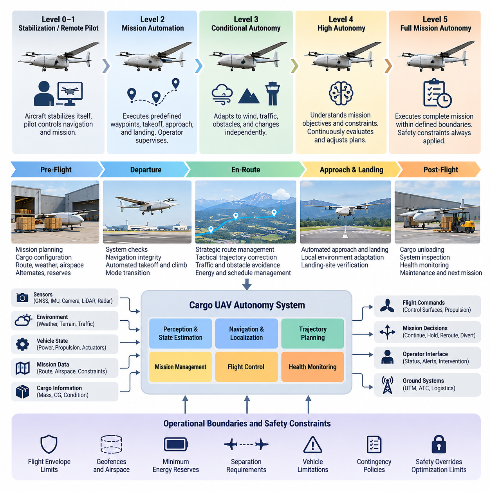
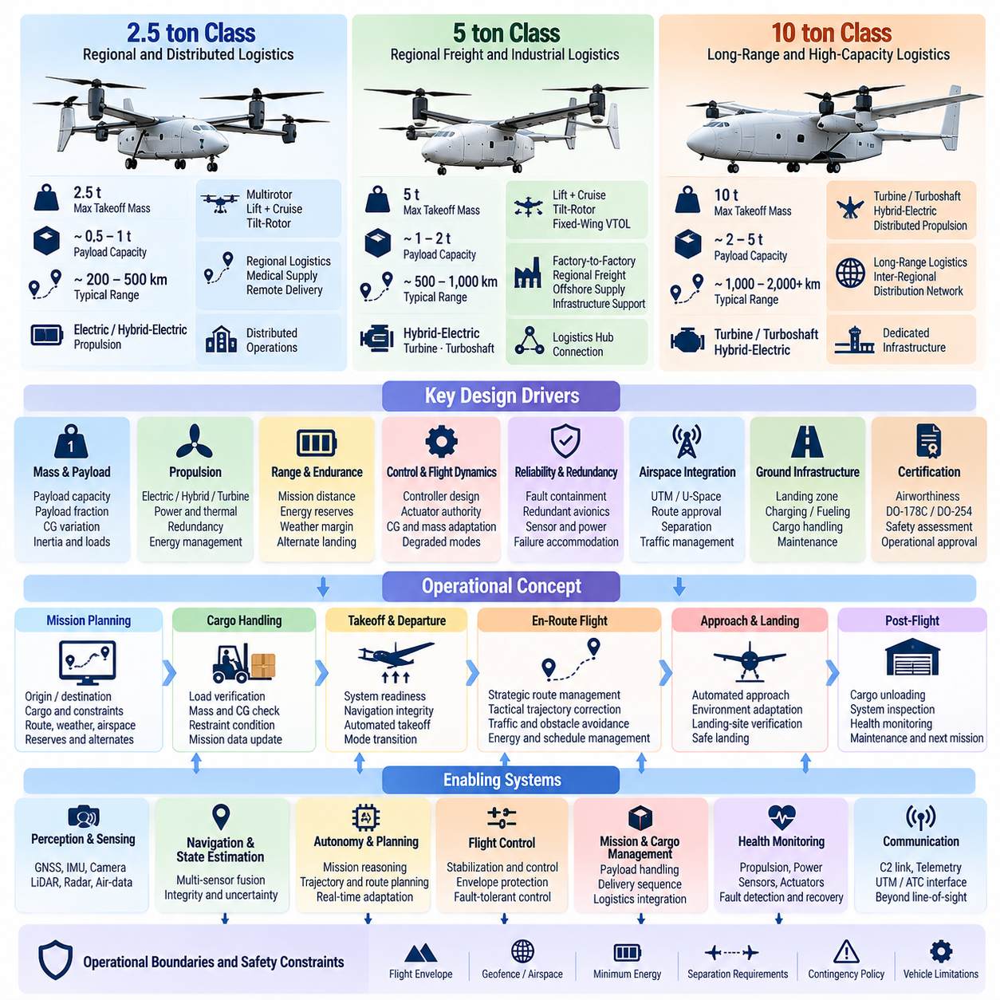
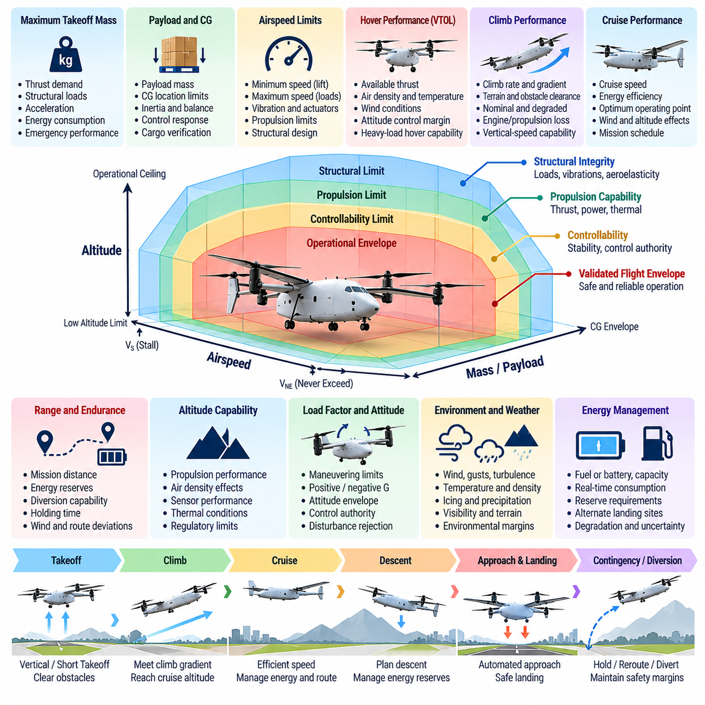
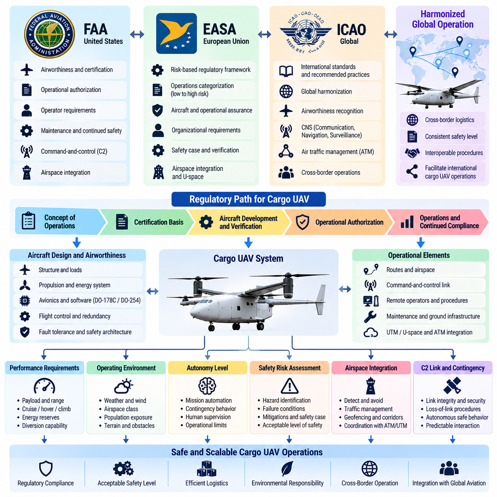
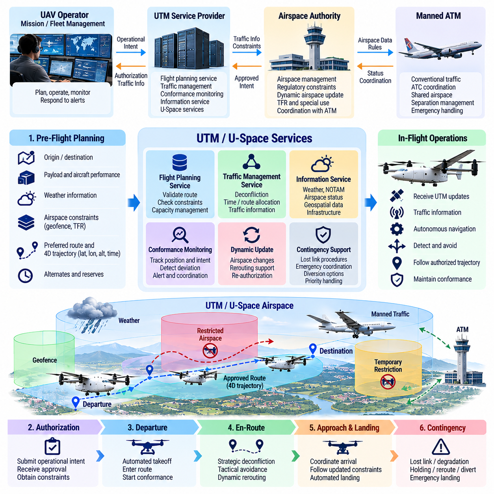
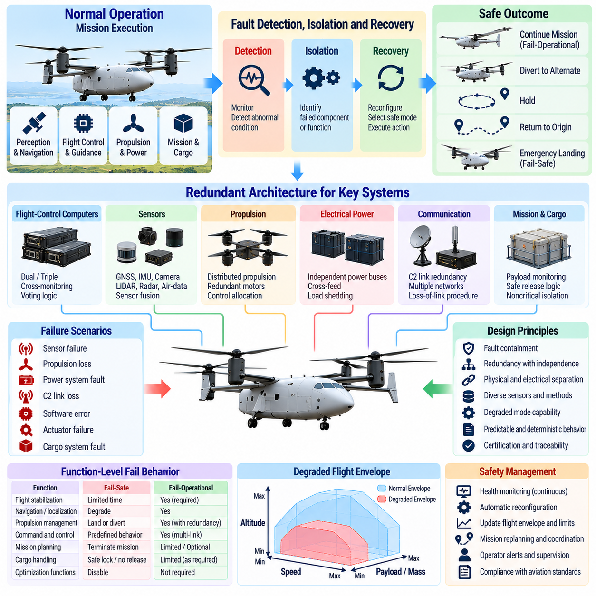
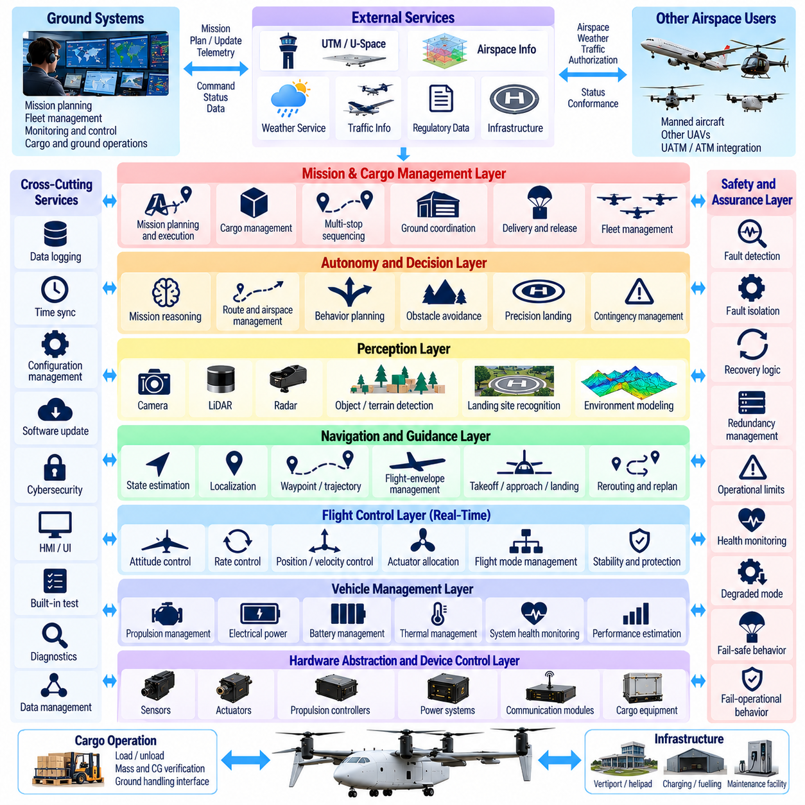
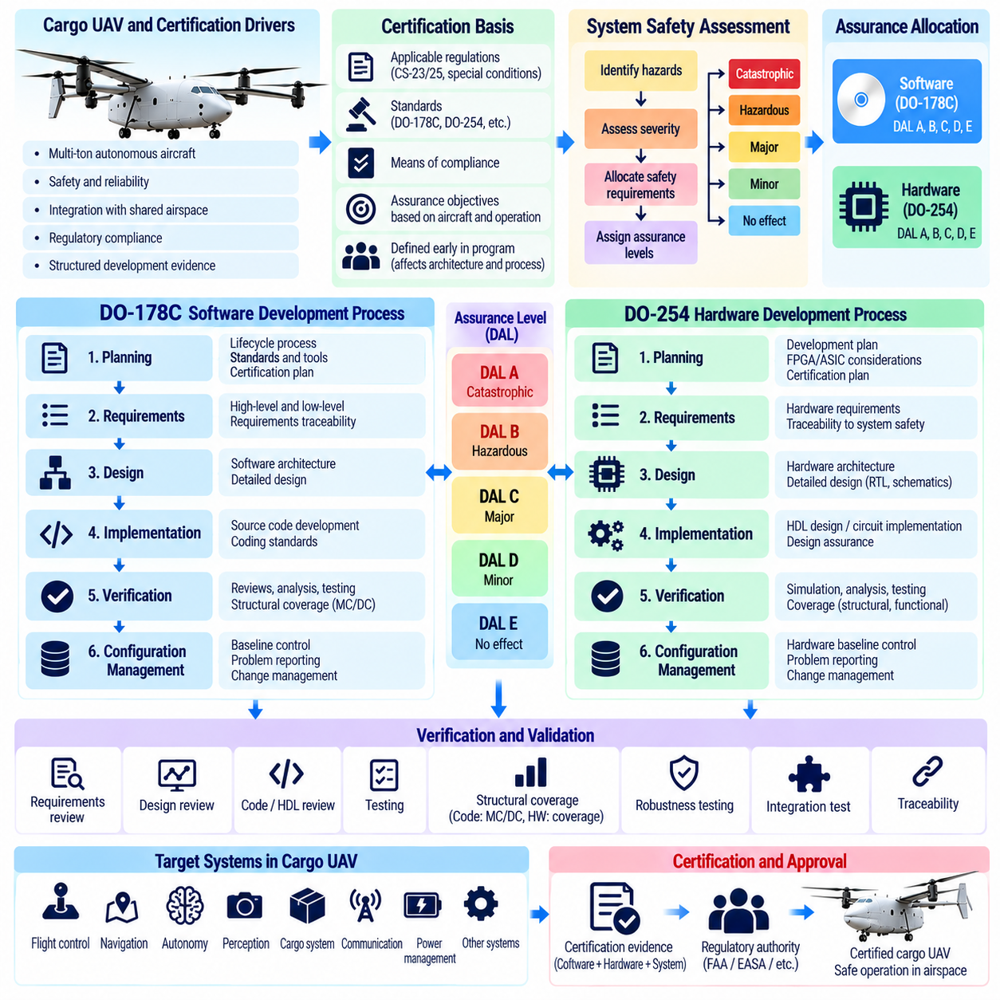
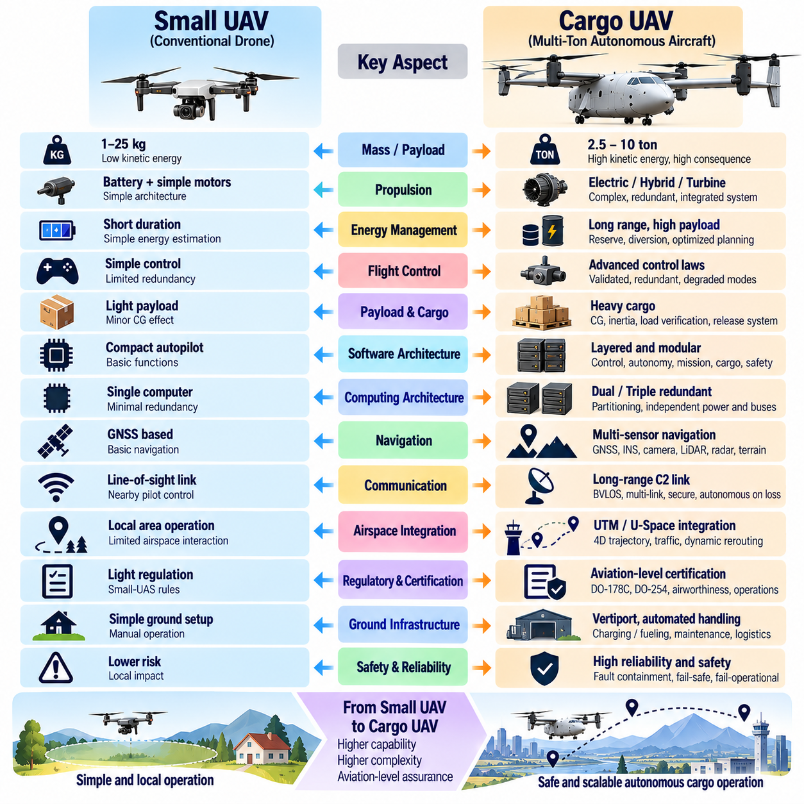
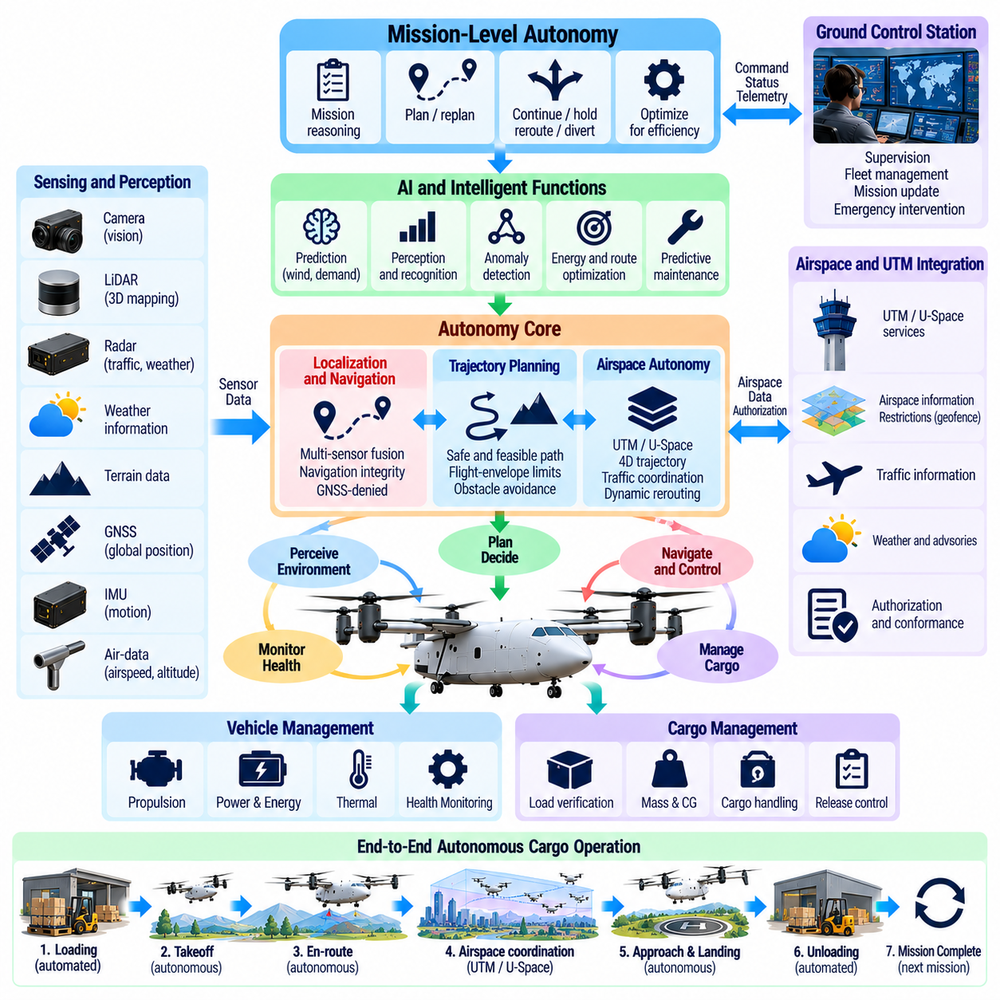

**Volume 23. Cargo UAV Autonomy and Flight AI**

# Chapter 01. Cargo UAV Autonomy Fundamentals

## 01.01. Cargo UAV Autonomy Levels and Operational Concept

{width="7.268055555555556in" height="7.268055555555556in"}

화물 무인항공기 자율성(Cargo UAV Autonomy)은 인지(Perception), 의사결정(Decision Making), 궤적 생성(Trajectory Generation), 비행 제어(Flight Control), 임무 수행(Mission Execution), 비상 상황 대응(Contingency Response)에 대한 권한을 기체 탑재 소프트웨어(Onboard Software)와 인간 운용자(Human Operator) 사이에 어떻게 배분하는지를 정의한다. 소형 원격조종 드론(Remotely Piloted Drone)과 달리 대형 화물 무인항공기(Heavy Cargo UAV)는 고가의 화물을 운송하면서 장거리 항로, 복잡한 공역(Complex Airspace), 변화하는 환경 조건에서도 안전한 운항을 지속할 수 있어야 한다.

가장 낮은 자율성 수준(Autonomy Level)에서는 항공기가 주로 자체적인 자세 안정화를 수행하고, 원격 조종사(Remote Pilot)가 항법(Navigation)과 임무 의사결정(Mission Decision)을 담당한다. 자동화 기능은 자세(Attitude), 고도(Altitude), 기수 방향(Heading), 대기속도(Airspeed)를 유지할 수 있지만 운용자는 비행을 지속적으로 감독한다. 이러한 구조는 직접 수동 제어보다 조종사의 업무 부담을 줄이면서 항로 변경, 비정상 상황, 착륙 결정에 대한 인간의 권한을 유지한다.

더 높은 수준에서는 임무 자동화(Mission Automation)가 도입되어 무인항공기가 사전에 정의된 경유점(Waypoint), 고도 프로파일(Altitude Profile), 이륙 절차, 접근 절차, 착륙 시퀀스(Landing Sequence)를 자동으로 수행할 수 있다. 운용자는 지속적인 비행 제어자가 아니라 감독 제어자(Supervisory Controller)가 된다. 항공기는 항법 상태와 비행 제약조건을 감시하며, 지상통제소(Ground Control Station)는 임무 승인, 상태 감시, 개입 기능, 예외 상황을 위한 명령 인터페이스(Command Interface)를 제공한다.

조건부 자율성(Conditional Autonomy)은 예측 가능한 운용 환경의 변화에 항공기가 독립적으로 대응할 수 있도록 이러한 개념을 확장한다. 자율 시스템(Autonomy System)은 바람, 항공 교통, 장애물, 제한 공역(Restricted Volume), 성능이 저하된 항법 환경을 만났을 때 속도, 고도 또는 국부 궤적(Local Trajectory)을 자체적으로 변경할 수 있다. 이러한 동작을 구현하려면 단순한 사전 프로그램 경유점 명령이 아니라 항법, 인지, 센서 융합(Sensor Fusion), 항로 계획(Route Planning), 비행 제어 기능의 긴밀한 통합이 필요하다.

고도 자율 화물 운항(Highly Autonomous Cargo Operation)을 위해서는 항공기가 임무 목표와 운용 제약조건을 모두 이해할 수 있어야 한다. 항공기는 에너지 잔량(Energy Reserve), 화물 상태, 추진 성능, 기상, 통신 품질, 공역 제한, 착륙장 가용성을 고려하여 계획된 궤적의 실행 가능성을 지속적으로 판단해야 한다. 따라서 임무 수행은 비행 중 계획을 반복적으로 평가하고 조정하는 폐루프 과정(Closed-Loop Process)이 된다.

완전 임무 자율성(Full Mission Autonomy)이 기계에 제한 없는 권한을 부여한다는 의미는 아니다. 안전 필수 화물 무인항공기(Safety-Critical Cargo UAV)는 자율 시스템이 자체적으로 결정할 수 있는 사항과 외부 승인이 필요한 사항을 명확하게 규정하는 운용 경계(Operational Boundary)를 필요로 한다. 비행 영역(Flight Envelope), 지오펜스(Geofence), 기체 제한조건, 최소 에너지 예비량, 분리 기준(Separation Requirement), 비상 정책(Contingency Policy)은 최적화 기능이 기본적인 안전 요구사항을 무시하지 못하도록 자율 의사결정을 제한한다.

운용 개념(Operational Concept)은 이륙 이전부터 시작된다. 임무 데이터(Mission Data)는 출발지, 목적지, 화물, 항로, 예상 기상, 공역 제약조건, 예비 에너지 요구사항, 대체 착륙 지점을 정의한다. 화물 특성은 항공기 질량, 무게중심(Center of Gravity), 공기역학적 거동, 추진 요구량, 비행 가능 거리에 영향을 준다. 따라서 자율 시스템은 화물 구성을 독립적인 물류 정보가 아니라 기체 상태(Vehicle State)의 일부로 취급해야 한다.

출발 단계에서 자율 기능은 기체 준비 상태, 항법 무결성(Navigation Integrity), 추진 시스템 가용성, 통신 링크, 화물 상태, 환경 조건을 확인한다. 운항 승인이 확보되면 자동 이륙(Automated Takeoff)과 상승 절차를 통해 항공기를 항로 비행(En-Route Navigation)으로 전환한다. 조종사, 임무 관리자(Mission Manager), 탑재 제어기(Onboard Controller) 중 누가 현재 권한을 가지고 있는지가 불명확하면 심각한 운용 위험이 발생할 수 있으므로 모드 전환(Mode Transition)은 결정론적(Deterministic)이고 명확하게 관찰 가능해야 한다.

항로 비행 자율성(En-Route Autonomy)은 전략적 의사결정 계층(Strategic Decision Layer)과 전술적 의사결정 계층(Tactical Decision Layer)을 결합한다. 전략 로직은 임무 항로, 목적지, 에너지 예산, 공역 운항 조건, 도착 일정을 관리하고, 전술 로직은 즉각적인 궤적 수정, 장애물 회피, 항공 교통 충돌, 바람 교란, 국부 제약조건을 처리한다. 이러한 시간 척도(Time Scale)의 분리는 단기 회피 동작이 상위 임무 요구사항을 위반하거나 중요한 에너지 예비량을 소진하는 것을 방지한다.

인지(Perception)와 상태 추정(State Estimation)은 자율 스택(Autonomy Stack)에 항공기와 주변 환경에 대한 운용 표현(Operational Representation)을 제공한다. 위성항법시스템(GNSS), 관성 센서(Inertial Sensor), 카메라(Camera), 라이다(LiDAR), 레이더(Radar), 대기자료 센서(Air-Data Sensor), 기체 상태 측정값이 상호 보완적인 정보를 제공할 수 있다. 센서 융합은 위치와 운동 상태뿐 아니라 불확실성(Uncertainty)도 추정해야 하며, 자율 의사결정은 항법, 장애물 탐지, 환경 해석 결과의 신뢰도(Confidence)를 고려해야 한다.

화물 무인항공기 자율성은 지속적인 건전성 인식(Health Awareness)도 요구한다. 시스템은 추진계, 전력 시스템, 비행제어컴퓨터(Flight-Control Computer), 구동기(Actuator), 센서, 통신 링크, 항법 정보원, 화물 인터페이스(Cargo Interface)를 감시한다. 고장이 탐지되면 정상 운항(Nominal Operation)에서 성능 저하 운항(Degraded Operation) 또는 비상 동작(Contingency Behavior)으로 정의된 전환이 시작되어야 한다. 심각도에 따라 항공기는 임무를 계속하거나, 항로를 재설정하거나, 출발지로 복귀하거나, 우회 착륙하거나, 대기하거나, 비상 착륙을 수행할 수 있다.

통신 아키텍처(Communication Architecture)는 운용 개념에 큰 영향을 준다. 명령 및 제어 링크(Command-and-Control Link)는 감독과 개입을 가능하게 하지만 안전한 자율 운항이 모든 임무 구간에서 통신의 연속성을 전제로 해서는 안 된다. 따라서 통신 링크의 손실 또는 성능 저하는 항공기 상태와 임무 상황에 따라 사전에 정의된 동작과 연결되어야 한다. 무인항공기는 즉각적인 인간의 명령 없이도 안정적인 비행을 유지하고 승인된 비상 로직(Contingency Logic)을 실행할 수 있어야 한다.

탑재 자율성(Onboard Autonomy)이 증가하더라도 인간 운용자는 여전히 중요한 시스템 요소로 남는다. 인간의 역할은 항공기 움직임을 직접 조종하는 것에서 임무 의도(Mission Intent)를 감독하고, 중요한 변경을 승인하며, 비정상적인 상황을 평가하고, 외부 운용 시스템과 협조하는 방향으로 변화한다. 효과적인 인간-자율 상호작용(Human-Autonomy Interaction)을 위해서는 간결한 상태 표시, 명확한 경고, 예측 가능한 자동화 동작, 중요한 자율 상태 전환의 원인을 명확히 보여주는 기능이 필요하다.

자율 시스템은 외부 공역 서비스(External Airspace Service)와도 상호작용해야 한다. 항로 제약조건, 항공 교통 정보, 임시 제한사항, 기상 업데이트, 운항 승인은 출발 이후에도 임무를 변경할 수 있다. 따라서 무인항공기 교통관리(UTM) 통합, 항로 계획, 충돌 해결(Conflict Resolution), 비상 항로 설정(Contingency Routing), 자동 비행계획 처리(Automated Flight-Plan Processing)는 별도의 행정 기능이 아니라 자율 아키텍처(Autonomy Architecture)의 일부로 다루어져야 한다.

대형 화물 플랫폼(Heavy Cargo Platform)에서는 항공기의 질량과 운동에너지(Kinetic Energy)가 증가함에 따라 자율성 요구사항도 더욱 엄격해진다. 소형 무인항공기에서는 허용될 수 있는 의사결정도 수 톤급 항공기에서는 훨씬 큰 결과를 초래할 수 있다. 따라서 대형 플랫폼은 더욱 강력한 이중화(Redundancy), 엄격한 고장 격리(Fault Containment), 세밀하게 통제되는 모드 전환, 결정론적 안전 감시기(Deterministic Safety Monitor), 위험한 명령이 비행 필수 구동기로 전달되는 것을 방지하는 독립 보호 기능을 필요로 한다.

실용적인 아키텍처에서는 임무 자율성(Mission Autonomy)과 비행 필수 제어(Flight-Critical Control)를 구분한다. 상위 자율 계층은 항로, 궤적, 대체 착륙 지점, 임무 동작을 선택할 수 있으며, 결정론적 비행 제어 기능은 항공기를 안정화하고 검증된 제한조건을 강제한다. 독립적인 안전 메커니즘(Safety Mechanism)은 두 계층을 모두 감독하며 보호된 제약조건을 위반하는 명령을 거부할 수 있다. 이러한 분리를 통해 고급 계획 및 인공지능(AI) 기능을 발전시키면서도 내부 비행 제어 루프에 제한 없는 권한이 전달되는 것을 방지할 수 있다.

따라서 자율성 수준(Autonomy Level)은 항공기에 탑재된 자동화 기능의 개수가 아니라 운용 책임(Operational Responsibility)을 기준으로 정의해야 한다. 두 무인항공기가 유사한 센서와 알고리즘을 탑재하더라도 권한 배분(Authority Allocation), 감독 요구사항, 비상 상황에서 허용되는 권한, 인증 가정(Certification Assumption)이 다르면 서로 다른 자율성 수준으로 운용될 수 있다. 그러므로 자율성은 소프트웨어, 하드웨어, 운용자, 절차, 통신, 기반시설, 공역 통합을 포함하는 시스템 수준의 속성(System Property)이다.

화물 무인항공기의 궁극적인 운용 개념은 감독형 회복탄력적 임무 자율성(Supervised, Resilient Mission Autonomy)이다. 항공기는 일상적인 비행을 자율적으로 수행하고 예상 가능한 교란에 안전하게 대응하는 동시에 인간은 적절한 전략적 권한을 유지한다. 더 높은 자율성으로의 발전은 책임성과 결정론적 안전 보호를 제거하는 것이 아니라 지속적인 인간 개입에 대한 의존성을 줄이는 방향으로 이루어져야 한다. 이러한 기반은 이후의 고장 안전 설계(Fail-Safe Design), 소프트웨어 아키텍처(Software Architecture), 인증(Certification), 그리고 소형 무인항공기에서 수 톤급 화물 항공기로의 확장을 이해하기 위한 토대를 제공한다.

## 01.02. UAV Classifications 2.5t 5t 10t Design Drivers

{width="7.268055555555556in" height="7.268055555555556in"}

화물 무인항공기 분류(Cargo UAV Classification)는 최대이륙중량(Maximum Takeoff Mass), 탑재화물 용량(Payload Capacity), 추진 아키텍처(Propulsion Architecture), 운항 거리(Operating Range), 공역 통합(Airspace Integration), 시스템 고장에 따른 결과에 크게 영향을 받는다. 2.5톤, 5톤, 10톤급 항공기는 단순히 동일한 무인항공기(UAV)를 크기만 확대한 형태로 취급할 수 없다. 질량이 증가하면 구조 하중, 추진 요구조건, 제어 권한, 이중화 요구조건, 지상 인프라, 인증 요구조건도 함께 변화하기 때문이다.

2.5톤급(2.5-Ton Class)은 기존의 소형 무인항공기(Small Unmanned Aircraft)와 대형 자율 화물 플랫폼(Heavy Autonomous Cargo Platform) 사이의 중요한 전환 영역을 나타낸다. 이 등급은 지역 물류, 산업용 물자 공급, 의료 물품 운송, 해양 시설 운송, 원격지역 배송을 지원하면서도 분산 운용(Distributed Operation)이 가능한 수준의 기체 크기를 유지할 수 있다. 설계에서는 효율적인 전기 또는 하이브리드 전기 추진(Electric or Hybrid-Electric Propulsion), 자동 화물 처리, 정밀 항법, 비교적 유연한 지상 인프라가 중요하다.

대표적인 2.5톤급 플랫폼은 항속거리와 임무 요구조건에 따라 멀티로터(Multirotor), 리프트-플러스-크루즈(Lift-Plus-Cruise), 틸트로터(Tilt-Rotor) 또는 기타 수직이착륙(Vertical Takeoff and Landing) 구성을 사용할 수 있다. 순수 멀티로터 구조는 호버링(Hover)과 수직 비행을 단순화하지만 장거리 운송에서는 상당한 에너지를 요구한다. 날개 보조형 구성(Wing-Assisted Configuration)은 순항 효율을 향상시키지만 추가적인 천이 제어(Transition Control), 구동기(Actuator), 공력 모델링(Aerodynamic Modeling), 비행 영역 관리(Flight-Envelope Management)가 필요하다.

약 5톤급(5-Ton Class)에서는 화물 무인항공기 설계가 단순한 드론 확장 설계보다 기존 항공공학(Conventional Aviation Engineering)에 더욱 가까워진다. 총중량 증가에 따라 운동에너지(Kinetic Energy), 로터 또는 프로펠러 하중, 구조 응력, 열 부하, 추진계 또는 제어계 고장에 따른 영향이 증가한다. 따라서 더욱 강력한 고장 격리(Fault Containment), 이중화 항공전자(Redundant Avionics), 정교한 비행제어법칙(Flight-Control Law), 체계적으로 설계된 성능 저하 운항 모드(Degraded Operating Mode)가 요구된다.

5톤급 화물 무인항공기는 공장 간 물류(Factory-to-Factory Logistics), 지역 화물 운송, 해양 시설 물자 공급, 인프라 지원, 물류센터 간 운송에 적합하다. 탑재화물과 항속거리는 연료 또는 배터리 질량, 예비 에너지 요구조건, 기상 여유도, 대체 착륙 능력과 균형을 이루어야 한다. 따라서 임무 계획(Mission Planning)은 독립적인 경유점 생성 과정이 아니라 항공기 성능 예측(Aircraft Performance Prediction)과 긴밀하게 결합된다.

10톤급(10-Ton Class)은 또 다른 중요한 아키텍처 전환을 가져온다. 이 규모에서는 체공시간과 탑재화물 요구조건에 따라 터빈(Turbine), 터보샤프트(Turboshaft), 하이브리드 전기(Hybrid-Electric), 분산 추진(Distributed Propulsion) 구성이 더욱 적합할 수 있다. 추진 관리(Propulsion Management)는 엔진, 발전기, 배터리, 전기모터, 전력전자(Power Electronics), 필요할 경우 열관리 시스템(Thermal System)을 통합적으로 조정해야 하며, 이에 따라 에너지 관리는 보조적인 기체 기능이 아니라 비행 필수 시스템(Flight-Critical System)으로 전환된다.

10톤급 자율 화물 항공기(Autonomous Cargo Aircraft)는 높은 신뢰성을 갖춘 비행제어 및 구동 아키텍처도 필요로 한다. 플라이바이와이어(Fly-by-Wire) 제어, 이중화 비행제어컴퓨터(Redundant Flight-Control Computer), 다중 센서 채널, 독립 전기 버스(Independent Electrical Bus), 내고장성 구동기(Fault-Tolerant Actuator)가 핵심 설계 요소가 된다. 단일 고장(Single Failure)이 즉각적인 제어 상실로 이어져서는 안 되며, 중요 고장은 항공기 동특성에 적합한 시간 한계 내에서 탐지, 격리, 대응되어야 한다.

탑재화물 비율(Payload Fraction)은 세 가지 등급 모두에서 기본적인 설계 결정 요소(Design Driver)이다. 탑재화물이 증가하면 운송 생산성은 향상되지만 무게중심(Center of Gravity)이 이동하고 관성(Inertia)이 변화하며 추진 요구량이 증가하고 사용 가능한 에너지 여유도가 감소한다. 따라서 화물 적재 정보는 임무 계획과 비행제어 구성에 통합되어야 한다. 시스템은 출발을 승인하기 전에 화물 질량, 위치, 고정 상태, 무게중심 한계를 검증해야 한다.

무게중심 변화(Center-of-Gravity Variation)는 임무마다 탑재화물 구성이 달라질 수 있는 화물 항공기에서 특히 중요하다. 단일 기준 질량 모델(Nominal Mass Model)을 중심으로 설계된 비행제어법칙은 화물 분포가 크게 달라질 경우 성능이 저하될 수 있다. 따라서 대형 플랫폼에서는 실제 적재 상태에 따라 제어기 파라미터, 구동기 할당(Actuator Allocation), 성능 제한조건을 변경하는 질량 특성 추정(Mass-Property Estimation) 및 적응제어(Adaptive Control) 메커니즘이 유용하다.

항속거리와 체공시간 요구조건(Range and Endurance Requirements)은 기체 등급을 구분하는 또 다른 주요 요소이다. 2.5톤급 항공기는 비교적 짧은 지역 항로와 빈번한 충전 또는 급유를 우선할 수 있는 반면, 5톤 및 10톤급 시스템은 더 먼 물류 거점을 연결하도록 요구될 수 있다. 항속거리 증가는 기상 예측, 예비 에너지 관리, 대체 착륙장, 통신 커버리지, 항법 연속성(Navigation Continuity), 비행 중 동적 항로 최적화(Dynamic Route Optimization)에 대한 의존성을 증가시킨다.

추진 이중화(Propulsion Redundancy)는 단순히 모터나 엔진의 개수를 계산하는 방식이 아니라 기체 구성에 따라 평가되어야 한다. 분산 전기 추진(Distributed Electric Propulsion)은 여러 개의 추력원을 제공할 수 있지만 안전한 운항은 전기적 격리(Electrical Isolation), 전력 버스 아키텍처, 제어 할당(Control Allocation), 열관리, 고장 이후 잔여 추력에 좌우된다. 대형 항공기에서는 성능이 저하된 추진계로 제어 비행, 우회 비행 또는 안전 착륙이 가능한지를 정량적으로 평가해야 한다.

에너지 아키텍처(Energy Architecture)는 항공기 질량과 단순 비례하여 확장되지 않는다. 배터리를 추가하면 배터리 자체가 구조 질량을 증가시키고 냉각, 보호, 감시, 격리 기능을 추가로 요구하므로 배터리 용량을 단순히 비례 확대할 수 없다. 하이브리드 시스템(Hybrid System)은 발전기와 연료를 도입하지만 기계 및 소프트웨어 복잡성을 증가시킨다. 따라서 에너지 시스템 선정은 탑재화물, 항속거리, 이중화, 열 성능, 유지보수, 운용 경제성을 함께 고려하는 항공기 수준 최적화(Aircraft-Level Optimization) 문제이다.

공력 구성(Aerodynamic Configuration) 역시 임무 등급을 반영한다. 수직 물류에 최적화된 항공기는 우수한 저속 및 호버링 성능을 필요로 하지만 장거리 화물 항공기는 효율적인 날개 양력 기반 순항(Wing-Borne Cruise)의 이점을 얻을 수 있다. 이러한 비행 영역 사이의 천이(Transition)는 비행 영역에서 가장 까다로운 구간 중 하나가 될 수 있다. 제어 소프트웨어는 위험한 중간 상태를 발생시키지 않으면서 빠르게 변화하는 공기력, 추진력 할당, 구동기 제어 권한, 안정성 여유도(Stability Margin)를 관리해야 한다.

화물 무인항공기의 임무 범위가 지리적으로 확대될수록 환경 설계 요구조건(Environmental Design Requirements)도 중요해진다. 바람, 강수, 온도, 결빙(Icing), 난류(Turbulence), 밀도고도(Density Altitude), 가시성은 기체 크기와 추진 구성에 따라 서로 다른 방식으로 성능에 영향을 준다. 대형 항공기는 더 큰 관성을 가지지만 복구 실패에 따른 결과도 더 크므로 더 넓은 안전 여유도(Safety Margin)가 필요하다. 따라서 환경 제한조건은 임무 승인과 비행 영역 보호(Flight-Envelope Protection)에 명시적으로 반영되어야 한다.

항공전자 아키텍처(Avionics Architecture)는 또 다른 주요 확장 설계 요소이다. 2.5톤급 기체는 소형 이중화 컴퓨팅 모듈(Compact Redundant Computing Module)을 사용할 수 있지만, 5톤 및 10톤급 시스템으로 확대될수록 물리적으로 분리된 컴퓨팅 채널, 독립 전원 공급장치, 이중화 통신 버스, 이종 감시 기능(Dissimilar Monitoring Function)이 더욱 중요해진다. 목적은 단순히 이중화를 추가하는 것이 아니라 하나의 공통 고장이 항법, 제어, 추진 관리, 안전 감시를 동시에 무력화하지 못하도록 하는 것이다.

통신 요구조건(Communication Requirements)도 운용 규모에 따라 변화한다. 단거리 화물 임무에서는 지상 기반 명령 및 제어 네트워크(Command-and-Control Network)를 주로 사용할 수 있지만, 장거리 항로에서는 셀룰러(Cellular), 사설 무선망(Private Wireless), 위성(Satellite), 항공 통신 서비스를 조합해야 할 수 있다. 항공기는 명령 무결성(Command Integrity)을 유지하면서 통신 링크 전환과 연결 성능 저하를 관리해야 한다. 안전 비행이 원격 운용자 또는 클라우드 서비스와의 지속적인 고대역폭 통신에 의존해서는 안 된다.

지상 인프라(Ground Infrastructure)는 2.5톤급에서 10톤급으로 증가할수록 더욱 중요해진다. 착륙장 크기, 지면 강도, 충전 또는 급유 설비, 화물 적재 장비, 정비 접근성, 화재 방호, 비상 대응 요구조건은 기체 크기에 따라 증가한다. 따라서 자율 운항(Autonomous Operation)은 항공기를 독립적인 로봇 플랫폼으로 취급하는 것이 아니라 탑재 소프트웨어와 지상 시스템 사이의 협조까지 포함해야 한다.

운용 경제성(Operational Economics)은 기술적 성능만큼이나 아키텍처에 큰 영향을 미친다. 대형 항공기는 한 번의 비행으로 더 많은 화물을 운송할 수 있지만 더욱 고가의 추진 시스템, 유지보수, 인프라, 이중화, 인증 활동이 필요하다. 따라서 경제적으로 최적인 기체가 반드시 가장 큰 기체인 것은 아니다. 비행대 설계자는 항로 밀도(Route Density), 화물 분포, 운항 회전시간(Turnaround Time), 가동률(Utilization Rate), 에너지 비용, 요구 서비스 신뢰도에 적합한 항공기 등급을 선정해야 한다.

안전 보증(Safety Assurance)은 잠재적인 사고 결과의 규모에 따라 강화된다. 항공기가 무거워질수록 부품 신뢰성, 소프트웨어 동작, 비상 착륙, 인구 밀집지역과의 분리에 대한 허용 가능한 가정이 더욱 엄격해진다. 안전 분석(Safety Analysis)은 추진력 상실, 비행제어 고장, 항법 성능 저하, 통신 두절, 전력 시스템 고장, 구조적 제한조건뿐 아니라 지속적인 제어 비행을 방해할 수 있는 복합 고장(Combination of Failures)도 검토해야 한다.

소프트웨어 복잡성(Software Complexity) 역시 세 가지 등급에 걸쳐 증가한다. 전체 화물 무인항공기 아키텍처는 비행 제어(Flight Control), 자율 항법(Autonomous Navigation), 인지 및 센서 융합(Perception and Sensor Fusion), 항로 및 공역 통합(Route and Airspace Integration), 화물 임무 관리(Cargo Mission Management), 안전(Safety), 인공지능 기반 최적화(AI-Based Optimization)를 상호 협조하는 기능 영역으로 구분한다. 또한 전체 구성에서는 2.5톤급 플랫폼과 5톤 및 10톤급 아키텍처를 별도로 다루며, 이는 규모 증가에 따라 서로 다른 공학적 고려사항이 발생한다는 점을 반영한다.

따라서 이러한 분류는 단순한 중량표(Weight Table)가 아니라 아키텍처 프레임워크(Architectural Framework)로 이해해야 한다. 2.5톤급은 실용적인 자율 물류와 효율적인 분산 운용을 강조하고, 5톤급은 더욱 강력한 항공 등급 이중화(Aviation-Grade Redundancy)와 중량물 비행제어 요구조건을 도입하며, 10톤급은 고도로 통합된 추진 시스템, 플라이바이와이어 제어, 내고장성(Fault Tolerance), 인증 지향 공학(Certification-Oriented Engineering)을 요구한다. 결국 질량(Mass)은 단순한 기체 크기의 지표가 아니라 전체 자율 항공기 시스템을 결정하는 핵심 설계 요소가 된다.

## 01.03. Flight Envelope and Performance Requirements

{width="7.268055555555556in" height="7.268055555555556in"}

화물 무인항공기(Cargo UAV)의 비행 영역(Flight Envelope)은 항공기가 제어 가능성(Controllability), 구조 건전성(Structural Integrity), 추진 성능(Propulsion Capability), 항법 성능(Navigation Performance), 요구되는 안전 여유도(Safety Margin)를 유지하면서 운항할 수 있도록 검증된 범위를 정의한다. 대형 화물 플랫폼(Heavy Cargo Platform)의 비행 영역은 다차원적이며 대기속도(Airspeed), 고도(Altitude), 자세(Attitude), 하중계수(Load Factor), 항공기 질량, 무게중심(Center of Gravity), 기상, 추진 상태, 기체 구성(Configuration)에 따라 달라진다.

성능 요구조건(Performance Requirements)은 목표 화물 임무를 측정 가능한 항공기 능력으로 변환한다. 탑재화물(Payload), 항속거리(Range), 순항속도(Cruise Speed), 호버링 지속시간(Hover Duration), 상승률(Climb Rate), 운용 한계고도(Ceiling), 이착륙 능력, 예비 에너지(Energy Reserve), 우회 비행 능력(Diversion Capability)은 개별적으로가 아니라 함께 정의되어야 한다. 하나의 성능 목표를 높이면 다른 영역의 여유도가 감소하는 경우가 많으므로 항공기 설계는 유효 탑재량, 에너지, 안전성, 운용 생산성 사이의 지속적인 절충 과정이 된다.

최대이륙중량(Maximum Takeoff Mass)은 추력 요구량, 구조 하중, 가속 성능, 에너지 소비, 비상 상황에서의 성능에 영향을 미치므로 주요 경계조건(Boundary Condition)이 된다. 화물 무인항공기는 정상 적재 조건뿐만 아니라 승인된 전체 질량 범위에서 충분한 제어 권한(Control Authority)을 입증해야 한다. 가장 까다로운 조건은 최대 탑재화물 상태에서 발생할 수 있지만, 경량 적재 또는 비대칭 적재 상태에서도 다른 형태의 안정성 문제가 발생할 수 있다.

무게중심 한계(Center-of-Gravity Limits)는 비행 영역의 또 다른 핵심 요소이다. 화물 위치의 변화는 종방향 및 횡방향 균형, 회전 관성(Rotational Inertia), 제어 응답, 구동기 요구량에 영향을 준다. 따라서 승인된 적재 영역(Loading Envelope)은 제어 가능성을 유지할 수 있는 탑재화물 질량과 위치의 조합을 규정해야 한다. 자동 화물 검증(Automated Cargo Verification)은 추정된 질량 특성이 검증된 한계를 초과하거나 충분한 신뢰도로 결정될 수 없는 경우 비행 승인을 차단해야 한다.

대기속도 한계(Airspeed Limits)는 불충분한 공력 제어와 과도한 구조 또는 추진 하중으로부터 항공기를 보호한다. 날개 양력 기반 구성(Wing-Borne Configuration)은 충분한 양력과 제어 여유도를 유지하기 위한 최소 속도를 필요로 하며, 최대 속도는 공력 하중, 진동, 구동기 능력, 추진 한계, 구조 설계에 의해 제한된다. 자율 유도(Autonomous Guidance)는 외란이나 항로 변경 중에도 이러한 한계 내에서 유지되는 궤적을 명령해야 한다.

수직이착륙 화물 무인항공기(Vertical Takeoff and Landing Cargo UAV)는 추가적인 저속 및 호버링 성능 요구조건을 가진다. 호버링 성능은 가용 추력, 항공기 질량, 공기 밀도, 온도, 바람, 추진 효율에 따라 결정된다. 사용 가능한 모든 추진 능력을 기체 중량 지지에 사용하는 것이 아니라 자세 제어와 외란 제거(Disturbance Rejection)를 위한 충분한 추력 여유도(Thrust Margin)가 남아 있어야 한다. 따라서 중량 화물 상태의 호버링 조건은 모터, 로터, 엔진, 전력 시스템의 주요 용량 결정 조건이 될 수 있다.

상승 성능(Climb Performance)은 항공기가 요구되는 탑재화물을 운송하면서 지형, 장애물, 출발 회랑(Departure Corridor), 공역 제약조건을 안전하게 통과할 수 있는지를 결정한다. 최소 상승 구배(Climb Gradient)와 수직속도 능력은 정상 추진 조건과 성능 저하 추진 조건 모두에서 평가되어야 한다. 다중 추진기 항공기(Multi-Propulsor Aircraft)에서는 추진력 일부가 상실된 이후에도 계속 상승하거나 고도를 유지하거나 제어된 착륙을 수행할 수 있는 능력이 중요한 안전 요구조건이 된다.

순항 성능(Cruise Performance)은 화물 무인항공기 운용의 경제적 효율성을 크게 좌우한다. 효율적인 순항은 에너지 소비를 감소시키고 항속거리를 증가시키지만 최적 운항점(Optimum Operating Point)은 질량, 바람, 고도, 공력 구성, 임무 일정에 따라 변화한다. 따라서 자율 비행관리(Autonomous Flight Management)는 최대 속도와 경제적으로 효율적인 순항속도를 구분하고 에너지 예비량과 도착 조건을 만족하는 운항 상태를 선택해야 한다.

항속거리 요구조건(Range Requirements)은 출발지와 목적지 사이의 거리만으로 정의할 수 없다. 실질적인 임무 에너지 예산(Mission Energy Budget)은 이륙, 상승, 순항, 하강, 착륙, 예상 대기비행(Holding), 항로 우회, 바람의 영향, 열 부하, 필수 예비량을 포함한다. 항공기는 예정된 목적지를 사용할 수 없게 되는 경우 대체 착륙 지점으로 우회하는 상황을 포함하여 예측 가능한 비상 상황에 대응할 수 있는 충분한 에너지를 유지해야 한다.

체공시간(Endurance)은 대기비행, 해양 물류, 원격 목적지 또는 착륙 가능 여부가 불확실한 임무에서 특히 중요하다. 잔여 비행시간(Remaining Flight Time)은 출발 전에 한 번 계산하는 것이 아니라 지속적으로 추정되어야 한다. 에너지 예측은 실제 소비량, 탑재화물, 바람, 추진 효율, 항로 변경, 시스템 성능 저하를 반영해야 하며, 이를 통해 임무 관리 시스템(Mission Management System)은 예비 여유도가 위험 수준으로 감소하기 전에 우회 결정을 시작할 수 있어야 한다.

고도 성능(Altitude Capability)은 추진 성능, 공력 특성, 공기 밀도, 열 환경, 센서 성능, 규제상 운항 한계에 의해 제한된다. 공기 밀도가 감소하면 로터 추력과 냉각 성능이 저하되고 공력 특성이 변화할 수 있다. 따라서 운용 한계고도(Operational Ceiling)는 항공기가 물리적으로 도달할 수 있는 최대 고도가 아니라 제어 가능성과 성능이 함께 검증된 범위를 나타내야 한다.

바람 한계(Wind Limits)는 지상속도(Ground Speed), 항로 실행 가능성, 호버링 안정성, 착륙 정밀도, 에너지 소비에 영향을 주므로 화물 무인항공기의 비행 영역 정의에서 핵심적이다. 맞바람(Headwind)은 정상적으로 실행 가능한 항로를 에너지 측면에서 실행 불가능하게 만들 수 있으며, 측풍(Crosswind)은 접근 및 착륙 제어를 어렵게 만들 수 있다. 돌풍(Gust)과 난류(Turbulence)에 대응하기 위해서는 일시적인 외란이 항공기를 보호된 상태 범위 밖으로 밀어내지 않도록 충분한 제어 대역폭(Control Bandwidth)과 구동기 여유도가 필요하다.

온도(Temperature)는 배터리, 엔진, 모터, 전자장치, 센서, 구동기, 구조재료에 영향을 준다. 높은 온도에서는 사용 가능한 전력 또는 냉각 여유도가 감소할 수 있으며, 낮은 온도에서는 배터리 성능이 저하되고 기계적 특성이 변할 수 있다. 따라서 비행 영역은 환경 운용 한계(Environmental Operating Limits)를 포함해야 하며, 임무 승인 과정에서는 출발 지점뿐만 아니라 전체 항로에서 예상되는 환경 조건을 평가해야 한다.

수직 비행과 날개 양력 기반 비행 사이를 전환하는 기체 구성에서는 천이 영역(Transition Envelope)에 특별한 주의가 필요하다. 천이 과정에서는 양력 분포, 추진 방향, 공력 제어 효과(Aerodynamic Control Effectiveness), 안정성이 빠르게 변화할 수 있다. 천이 궤적은 검증된 대기속도, 자세, 추력, 기체 구성 상태의 조합 내부에서 유지되어야 하며, 환경 또는 기체 상태가 충분한 여유도를 제공하지 못하는 경우 소프트웨어가 천이를 방지해야 한다.

구조 한계(Structural Limits)는 하중계수, 기동률(Maneuver Rate), 속도, 탑재화물 분포, 허용 가능한 난류 노출을 제한한다. 수학적으로 실행 가능한 경로라 하더라도 기체 구조 또는 화물에 허용할 수 없는 하중을 가할 수 있으므로 자율 궤적 생성(Autonomous Trajectory Generation)은 이러한 한계를 명시적으로 준수해야 한다. 대형 화물 항공기는 구조를 보호하고 화물 안정성을 유지하기 위해 가속도, 저크(Jerk), 롤률(Roll Rate), 수직 하중이 제한된 부드러운 명령을 사용하는 것이 일반적으로 유리하다.

추진 및 전력 한계(Propulsion and Power Limits)는 또 다른 보호 영역을 구성한다. 모터, 엔진, 발전기, 배터리, 인버터(Inverter), 동력 전달 부품은 최대 연속 운전 영역과 일시 운전 영역을 가진다. 단시간 최대 출력(Peak Power)은 이륙이나 비상 기동을 지원할 수 있지만 이를 지속적으로 사용 가능한 출력으로 간주해서는 안 된다. 비행제어 및 임무 소프트웨어는 궤적 실행 가능성을 평가할 때 지속 가능 성능(Sustained Capability)과 일시적 과부하 성능(Temporary Overload Capability)을 구분해야 한다.

성능 요구조건은 성능 저하 운항(Degraded Operation)도 포함해야 한다. 모터, 엔진, 구동기, 센서, 배터리 구간 또는 컴퓨팅 채널의 고장은 지속적인 비행이 가능하더라도 사용 가능한 비행 영역을 축소할 수 있다. 따라서 자율 시스템은 고장이 탐지된 이후 안전하게 사용할 수 있는 속도, 기동, 고도, 임무 행동의 조합을 나타내는 동적 성능 저하 비행 영역(Dynamic Degraded Envelope)을 유지해야 한다.

착륙 성능(Landing Performance)은 하강률, 접근속도, 접지속도(Touchdown Velocity), 횡방향 오차, 경사도, 지면 상태, 사용 가능한 착륙 구역의 한계를 정의한다. 수직 착륙 항공기는 최종 하강 및 착륙 중단(Rejected Landing) 상황에서도 충분한 출력 여유도를 확보해야 한다. 자율 착륙 로직(Autonomous Landing Logic)은 목적지가 계속 적합한지를 판단하고 착륙 요구조건을 충족할 수 없는 경우 대기비행, 우회 또는 대체 착륙 지점으로 전환해야 한다.

성능 여유도(Performance Margin)는 저수준 비행제어에서만 평가되는 것이 아니라 임무 계획에 직접 반영되어야 한다. 어떤 항로가 기하학적인 공역 제약조건을 만족하더라도 예상 에너지, 바람, 상승 성능, 열 상태 또는 성능 저하 조건의 여유도가 충분하지 않다면 해당 항로는 허용될 수 없다. 이러한 관계는 비행 영역 관리(Flight-Envelope Management)를 자율 항법(Autonomous Navigation), 항로 계획(Route Planning), 임무 관리(Mission Management), 안전 기능(Safety Function)과 연결한다.

비행 영역 보호(Flight-Envelope Protection)는 임무 명령과 위험한 항공기 상태 사이에 존재하는 최종적인 운용 보호 장벽이다. 유도 시스템(Guidance System) 또는 인공지능 기반 최적화(AI-Based Optimization)가 공격적인 궤적을 요청하더라도 보호된 제어 계층(Protected Control Layer)은 검증된 한계에 따라 명령을 제한해야 한다. 정상적인 계획 또는 제어 기능이 요구되는 여유도를 유지하지 못할 경우 독립적인 안전 감시기(Safety Monitor)는 경계 위반을 탐지하고 교정 동작(Corrective Action)을 시작할 수 있어야 한다.

2.5톤, 5톤, 10톤급 화물 무인항공기에서 구체적인 수치 한계는 상당히 달라질 수 있지만 공학적 원칙은 동일하다. 모든 임무는 기체, 탑재화물, 환경, 시스템 건전성(System Health)의 검증된 조합 내부에서 수행되어야 한다. 따라서 비행 영역(Flight Envelope)은 단순한 정적 차트(Static Chart)가 아니라 항공기 물리 특성, 자율성(Autonomy), 비행 제어, 임무 계획, 고장 관리(Fault Management), 안전 보증(Safety Assurance)을 연결하는 운용 계약(Operational Contract)으로 이해해야 한다.

## 01.04. Regulatory Framework FAA EASA ICAO for Cargo UAV

{width="7.268055555555556in" height="7.268055555555556in"}

화물 무인항공기(Cargo UAV)의 규제 프레임워크(Regulatory Framework)는 무인항공기를 어떻게 설계, 인증, 운용, 유지보수하고 공유 공역(Shared Airspace)에 통합할 수 있는지를 결정한다. 수 톤급 화물 플랫폼의 경우 항공기 질량, 운항 거리, 운동에너지(Kinetic Energy), 화물 가치, 고장으로 인한 잠재적 결과가 기존 유인 항공기(Conventional Aviation)에 가까워지기 때문에 규제는 소형 드론을 대상으로 개발된 규칙의 범위를 크게 넘어선다.

국제적인 화물 무인항공기 개발에서는 세 가지 규제 관점이 특히 중요하다. 미국 연방항공청(FAA, Federal Aviation Administration)이 대표하는 국가 차원의 감독, 유럽연합 항공안전청(EASA, European Union Aviation Safety Agency)이 관리하는 유럽 규제 프레임워크, 국제민간항공기구(ICAO, International Civil Aviation Organization)를 통해 조정되는 국제 표준 및 권고 관행(Standards and Recommended Practices)이 그것이다. 각각의 역할은 다르지만 이들은 함께 인증과 국가 간 운항의 기본 방향을 형성한다.

미국 연방항공청(FAA)의 프레임워크는 소형 무인항공기 운항과 더욱 광범위한 승인 및 인증이 필요한 대형 또는 고위험 항공기 운항을 구분한다. 수 톤급 화물 무인항공기는 일반적인 소형 무인항공기 운항에 적용되는 단순화된 가정에 의존하기 어렵다. 따라서 인증 전략(Certification Strategy)은 항공기 감항성(Airworthiness), 운항 제한, 명령 및 제어 능력(Command-and-Control Capability), 지속적인 안전 비행, 유지보수, 운용자 책임, 기존 항공교통 절차와의 통합을 다루어야 한다.

따라서 화물 무인항공기 개발자가 미국 연방항공청(FAA)과 인증을 추진할 때는 개별적인 기술 요구사항을 선택하는 것보다 의도된 운용 개념(Concept of Operations)을 정의하는 것에서 시작해야 한다. 항공기 크기, 추진 방식, 운항 고도, 인구 노출도(Population Exposure), 가시권 밖 비행(Beyond-Visual-Line-of-Sight Operation), 화물 특성, 공역 등급, 자율성 수준이 인증 기준(Certification Basis)에 영향을 준다. 규제 경로는 제안된 항공기와 운용 방식이 허용 가능한 안전 수준을 달성한다는 것을 입증하는 시스템 수준 논증(System-Level Argument)이 된다.

감항성(Airworthiness)은 특히 2.5톤, 5톤, 10톤급 화물 무인항공기에서 중요하다. 신청자는 항공기 구조, 추진계, 비행제어, 전기 시스템, 항공전자(Avionics), 소프트웨어, 안전 아키텍처가 의도된 운용에 적합하다는 것을 입증해야 한다. 항공기의 크기가 증가할수록 일반적으로 이중화(Redundancy), 내고장성(Fault Tolerance), 개발 보증(Development Assurance), 형상 관리(Configuration Control), 검증 증거(Verification Evidence), 위험요소와 구현된 완화 대책 사이의 추적성(Traceability)이 더욱 중요해진다.

유럽연합 항공안전청(EASA)은 무인항공기 운항에 위험 기반 규제 철학(Risk-Based Regulatory Philosophy)을 적용한다. 낮은 위험의 운항은 비교적 표준화된 요구조건을 통해 처리할 수 있지만, 위험이 높은 운항에는 점진적으로 강화된 운항 승인과 항공기 보증(Aircraft Assurance)이 요구된다. 장거리 또는 가시권 밖에서 운항하거나 통합 공역(Integrated Airspace)을 사용하는 대형 화물 무인항공기는 고장으로 인한 결과가 훨씬 크기 때문에 자연스럽게 높은 보증 수준이 요구되는 영역으로 이동한다.

가장 크고 높은 운항 능력을 갖춘 화물 무인항공기의 경우 인증 개념은 기존 항공기에 적용되는 원칙과 점차 유사해진다. 항공기는 정상(Normal), 비정상(Abnormal), 그리고 선정된 고장 조건에서 제어 가능한 동작을 입증해야 한다. 안전 사례(Safety Case)는 운용 위험요소를 시스템 요구조건 및 검증 증거와 연결해야 하며, 항공기를 운용하는 조직은 운항 승인(Dispatch), 유지보수, 승무원 책임, 비상 대응, 지속적인 운항 안전을 위한 절차를 유지해야 한다.

유럽 규제 프레임워크는 항공기 위험(Aircraft Risk)과 운용 위험(Operational Risk)의 관계도 중요하게 다룬다. 항공기가 정교한 기술적 이중화를 갖추고 있더라도 부적절한 지역에서 운항하거나 충분한 공역 조정 없이 운용되면 허용할 수 없는 위험을 발생시킬 수 있다. 반대로 운용 제한을 통해 노출 위험을 감소시킬 수도 있다. 따라서 화물 무인항공기 인증은 항공기, 항로, 지상 인프라, 운용자, 통신 서비스, 주변 공역을 결합한 전체 시스템을 고려해야 한다.

국제민간항공기구(ICAO)는 개별 화물 무인항공기를 직접 인증하는 기관이 아니라 국제 항공 원칙, 표준, 권고 관행, 조정 체계를 수립한다는 점에서 다른 역할을 수행한다. 원격조종항공기(Remotely Piloted Aircraft) 또는 자율성이 증가한 화물 항공기가 국가 간 경계를 넘어 운항하거나 기존 국제 항공 체계와 상호작용할수록 국제민간항공기구의 중요성이 증가한다. 감항성 인정, 운항 절차, 통신, 항법, 감시, 항공교통관리(Air Traffic Management)를 위해서는 공통된 기준과 기대 수준이 필요하다.

핵심적인 규제 문제 중 하나는 항공기와 원격 운용 환경을 연결하는 명령 및 제어 링크(Command-and-Control Link)이다. 해당 링크는 부여된 운용 역할을 수행하는 데 필요한 충분한 무결성(Integrity), 가용성(Availability), 연속성(Continuity), 보안(Security)을 제공해야 한다. 또한 규제 체계는 통신 성능이 저하되거나 완전히 상실되는 경우의 동작을 다루어야 한다. 원격 연결이 끊어졌다는 이유만으로 화물 무인항공기가 통제 불능 상태가 되어서는 안 되며, 사전에 정의된 비상 동작(Contingency Behavior)을 통해 안전한 비행과 다른 공역 사용자와의 예측 가능한 상호작용을 유지해야 한다.

가시권 밖 비행(BVLOS, Beyond Visual Line of Sight)은 경제적으로 유용한 화물 운송의 핵심 요소이다. 장거리 물류 운송을 조종사의 직접적인 시각 관찰에 의존할 수 없기 때문이다. 가시권 밖 비행은 항법 무결성(Navigation Integrity), 감시(Surveillance), 탐지 및 회피(Detect-and-Avoid) 능력, 통신 범위, 교통 상황 인식(Traffic Awareness), 비상 절차, 원격 감독에 대한 규제적 관심을 증가시킨다. 항공기는 인간의 직접적인 시각 관찰이 없어도 안전성이 허용할 수 없는 수준으로 감소하지 않는다는 것을 입증해야 한다.

탐지 및 회피(Detect-and-Avoid) 능력은 무인 화물 항공기가 유인 항공기와 공역을 공유할 때 특히 중요하다. 시스템은 주변 항공 교통에 대한 충분한 정보를 확보하고 충돌 위험을 평가하며 적절한 회피 동작을 지원하거나 직접 수행할 수 있어야 한다. 센서, 협력적 감시(Cooperative Surveillance), 공역 서비스, 탑재 알고리즘, 운용 절차가 이러한 기능에 기여할 수 있지만, 이들의 통합 성능은 의도된 공역에 적용되는 안전 목표를 충족해야 한다.

항공기가 대부분의 일상적인 작업을 자율적으로 수행하더라도 원격 조종사(Remote Pilot)와 운용자의 책임은 명확하게 정의되어야 한다. 규제는 임무 승인, 항공기 상태, 운항 제한, 비정상 상황, 외부 기관과의 조정에 대한 책임성을 요구한다. 따라서 자율성 증가는 인간의 책임을 제거하는 것이 아니라 책임의 성격을 변화시킨다. 자동화 시스템과 인간 감독 사이의 권한 전환(Authority Transition)은 명확하고 예측 가능하며 감사 가능한(Auditable) 형태로 이루어져야 한다.

소프트웨어 보증(Software Assurance)은 화물 무인항공기의 동작이 디지털 비행제어, 항법, 임무 관리, 안전 기능에 크게 의존하기 때문에 주요 관심 영역이다. 따라서 전체 구성에서는 규제 및 고장 안전(Fail-Safe) 기본 개념 이후에 항공 소프트웨어(Airborne Software)를 위한 DO-178C와 항공 전자 하드웨어(Airborne Electronic Hardware)를 위한 DO-254 같은 인증 기반을 다루며, 이는 규제, 안전 아키텍처, 개발 보증 사이의 밀접한 관계를 반영한다.

인공지능(AI)은 기계학습(Machine Learning) 구성요소가 인지, 궤적 최적화, 이상 탐지, 착륙 또는 기타 운용 의사결정에 영향을 미치는 경우 추가적인 인증 과제를 발생시킨다. 기존의 보증 방법은 체계적으로 명세하고 검증할 수 있는 동작을 전제로 한다. 학습 기반 기능(Learning-Based Function)은 학습 데이터, 운용 경계, 강건성(Robustness), 불확실성, 모니터링, 대체 동작(Fallback Behavior), 검증된 조건을 벗어난 출력에 대한 보호와 관련하여 추가적인 증거를 요구할 수 있다.

따라서 규제기관은 보호된 한계 내에서 조언이나 최적화를 수행하는 인공지능과 안전 필수 기능(Safety-Critical Function)을 직접 제어하는 인공지능을 구분할 가능성이 높다. 실용적인 화물 무인항공기 아키텍처에서는 학습 기반 기능을 결정론적 안전 제약조건(Deterministic Safety Constraint) 뒤에 배치하여 고급 최적화를 허용하면서 독립적으로 검증된 비행 영역 보호(Envelope Protection)와 비상 로직을 유지할 수 있다. 전체 구성에서도 인공지능 모델 인증(AI Model Certification)은 비행 최적화 영역의 독립적인 과제로 다루어진다.

운항 승인(Operational Approval)은 지상 인프라와 조직적 절차에도 영향을 받는다. 버티포트(Vertiport), 화물 적재 시스템, 충전 또는 급유 설비, 정비 시설, 지상 통신망, 비상 절차는 전체 안전성에 영향을 줄 수 있다. 따라서 대형 화물 무인항공기 운항에서는 공중 시스템과 지상 시스템 모두에 대한 조정된 안전 보증(Coordinated Assurance)이 필요하며, 특히 자동화된 회전 운항(Automated Turnaround)과 고빈도 물류 운항으로 비행 사이의 직접적인 인간 점검이 감소하는 경우 더욱 중요하다.

사이버보안(Cybersecurity)은 점차 규제 안전(Regulatory Safety)과 분리할 수 없는 영역이 되고 있다. 항법 신호, 명령 링크, 소프트웨어 업데이트, 지상통제소, 정비 인터페이스, 비행대 서비스(Fleet Service)는 공격 표면(Attack Surface)이 될 수 있다. 보안 고장은 손상된 항법 정보, 비인가 명령, 통신 불능과 같이 장비 고장과 유사한 결과를 발생시킬 수 있다. 따라서 인증 지향 아키텍처(Certification-Oriented Architecture)는 복구 가능성과 운항 연속성을 유지하면서 핵심 인터페이스를 보호해야 한다.

규제 프레임워크는 비행대 확장성(Fleet Scalability)에도 영향을 준다. 제한된 조건에서 운항하는 실증 항공기는 기술적 실행 가능성을 입증할 수 있지만 이것만으로 일상적인 상업 운항으로 확대할 수 있는 경로가 확보되는 것은 아니다. 확장 가능한 화물 운항을 위해서는 반복 가능한 항공기 적합성(Aircraft Conformity), 표준화된 유지보수, 훈련된 운용자, 예측 가능한 공역 접근, 승인된 운항 절차, 항공기와 임무 수가 증가하더라도 안전 성능이 허용 가능한 수준으로 유지된다는 증거가 필요하다.

2.5톤급 플랫폼의 규제 전략은 초기에는 제한된 항로와 통제된 운용 환경을 중심으로 구성될 수 있지만, 5톤 및 10톤급 시스템으로 확대될수록 항공 등급 인증(Aviation-Grade Certification)과 통합 절차의 중요성이 증가한다. 정확한 규제 기준은 중량만으로 결정되는 것이 아니라 관할권(Jurisdiction)과 운용 개념에 따라 달라진다. 그러나 질량과 운용 복잡성이 증가할수록 비행제어, 추진, 자율성, 이중화, 지속적인 안전 운항에 대해 더 높은 수준의 보증이 요구되는 것이 일반적이다.

따라서 미국 연방항공청(FAA), 유럽연합 항공안전청(EASA), 국제민간항공기구(ICAO)의 관점은 화물 무인항공기 개발이 완료된 이후에 검토하는 것이 아니라 시스템 설계 초기부터 고려해야 한다. 규제 요구조건은 항공전자 아키텍처, 소프트웨어 개발, 이중화, 통신, 탐지 및 회피 기능, 운항 절차, 유지보수, 검증에 영향을 준다. 그러므로 인증(Certification)은 최종적인 행정 절차가 아니라 자율 화물 항공기의 전체 수명주기(Lifecycle)를 형성하는 핵심 설계 제약조건(Design Constraint)이다.

## 01.05. UTM Integration Concept and U Space Services

{width="7.268055555555556in" height="7.268055555555556in"}

무인항공기 교통관리(UTM, Unmanned Aircraft System Traffic Management)는 기존의 조종사 중심 항공교통 절차만으로 처리하기 어려운 대규모 무인항공기 운항을 지원하기 위한 디지털 조정 프레임워크(Digital Coordination Framework)를 제공한다. 화물 무인항공기(Cargo UAV)에서 UTM 통합은 임무 계획, 공역 제약조건, 교통 정보, 운항 승인, 모니터링, 비상 상황 관리를 연결하여 자율 비행 항공기가 다른 공역 사용자와 예측 가능한 방식으로 공존할 수 있도록 한다.

화물 무인항공기 운항은 가시권 밖 비행(Beyond Visual Line of Sight), 여러 운항 지역을 통과하는 장거리 임무, 상당한 질량과 운동에너지(Kinetic Energy)를 가진 항공기의 운용을 포함할 수 있기 때문에 UTM에 높은 수준의 요구조건을 부과한다. 2.5톤, 5톤, 10톤급 화물 항공기는 UTM을 단순한 비행 허가 인터페이스로 취급할 수 없다. 공역 정보는 전체 비행 수명주기(Flight Lifecycle)에 걸쳐 탑재 및 지상 기반 임무 관리 시스템의 능동적인 입력으로 사용되어야 한다.

통합 개념(Integration Concept)은 비행 전 계획(Preflight Planning) 단계에서 시작된다. 운용자는 출발지, 목적지, 출발시간, 항공기 성능, 탑재화물, 선호 항로, 고도 프로파일(Altitude Profile), 비상 대안을 정의한다. 이러한 임무 파라미터는 비행계획 또는 운용 의도(Operational Intent)가 조정을 위해 제출되기 전에 공역 가용성, 지리적 제한, 임시 제약조건, 기상, 예상 교통량, 인프라 가용성, 적용 가능한 운항 규칙과 비교하여 평가된다.

운용 의도(Operational Intent)는 단순한 지리적 경유점(Waypoint)의 연속보다 더 많은 정보를 나타낸다. 자율 화물 운항에서는 위도, 경도, 고도, 시간으로 정의되는 계획된 4차원 궤적(Four-Dimensional Trajectory)과 운용 공간(Operational Volume) 및 시간 허용오차를 포함할 수 있다. 이러한 표현을 통해 교통관리 서비스는 항공기가 언제 어디에서 운항할 예정인지 파악하고 계획된 공간이 다른 승인된 운항과 충돌하는지를 판단할 수 있다.

UTM 통합을 위해서는 항공기 운용자, 비행대 또는 임무 관리 시스템(Fleet or Mission-Management System), UTM 서비스 제공자(UTM Service Provider), 관련 공역 당국 사이에 명확한 인터페이스가 필요하다. 항공기 자체가 모든 외부 서비스와 직접 통신할 필요는 없다. 지상 기반 임무 시스템은 규제 및 교통 정보를 통합하고 이를 검증된 임무 제약조건으로 변환한 후 통제된 인터페이스를 통해 탑재 자율 시스템(Onboard Autonomy System)에 필요한 운용 데이터를 전달할 수 있다.

운항 승인(Authorization)은 일회성 행정 절차가 아니라 임무의 동적인 구성요소이다. 임시 비행 제한(Temporary Flight Restriction), 비상 활동, 우선 운항, 기상, 인프라 고장 또는 다른 항공 교통으로 인해 공역 가용성이 변화할 수 있다. 따라서 화물 무인항공기 임무 소프트웨어는 현재의 운용 의도가 계속 유효한지를 지속적으로 인식하고, 이전에 승인된 조건이 더 이상 유지되지 않을 경우 재계획(Replanning) 또는 재조정을 시작해야 한다.

전략적 충돌 방지(Strategic Deconfliction)는 항공기들이 동일한 공역에 도달하기 전에 충돌 가능성을 식별하는 것을 목표로 한다. 계획된 궤적 또는 운용 공간을 공간과 시간 기준으로 비교하여 출발시간, 항로, 고도 또는 예약된 공역을 비행 전에 변경할 수 있다. 이러한 접근법은 예측 가능한 정기 임무를 효율적으로 조정할 수 있기 때문에 마지막 순간의 공중 충돌 회피(Airborne Collision Avoidance)에만 의존할 필요가 없는 화물 운송 네트워크에 특히 유용하다.

전술적 충돌 관리(Tactical Conflict Management)는 전략적 계획 단계에서 완전히 해결할 수 없는 상황을 처리한다. 예상하지 못한 항공 교통, 출발 지연, 바람으로 인한 시간 변화, 비상 항공기 또는 계획 궤적에서의 이탈은 비행 중 새로운 충돌을 발생시킬 수 있다. 따라서 교통 정보와 탑재 탐지 및 회피(Detect-and-Avoid) 기능은 UTM 서비스를 보완하며, 비행 전 충돌 방지가 모든 충돌 위험을 제거한다고 가정하는 대신 여러 계층의 보호를 제공한다.

적합성 감시(Conformance Monitoring)는 화물 무인항공기가 승인된 궤적 또는 운용 공간 내부에 유지되고 있는지를 판단한다. 임무 관리 시스템은 실제 위치, 고도, 시간, 비행 상태를 승인된 운용 의도와 비교한다. 중대한 이탈은 경고, 조정 정보 갱신 또는 비상 절차를 유발할 수 있다. 대형 무인항공기의 경우 적합성 정보는 자동화 시스템과 인간 감독자 모두가 적시에 의사결정을 내릴 수 있을 정도로 충분한 신뢰성을 가져야 한다.

동적 항로 재설정(Dynamic Rerouting)은 기존 항로를 사용할 수 없거나 효율성이 저하되었을 때 필요하다. 기상 셀(Weather Cell), 공역 폐쇄, 교통 혼잡, 항법 성능 저하, 에너지 제한 또는 목적지 문제가 새로운 궤적을 요구할 수 있다. 항로 계획기(Route Planner)는 수정된 운용 의도를 외부 교통관리 서비스와 조정하기 전에 후보 대안들을 항공기 성능 및 안전 제약조건과 비교하여 평가해야 한다.

비상 상황 관리(Contingency Management)는 비정상적인 상태로 인해 항공기가 정상 궤적을 벗어나야 할 수 있으므로 화물 무인항공기 통합에서 특히 중요하다. 통신 두절, 추진 성능 저하, 항법 고장, 에너지 부족, 악천후 또는 착륙장 사용 불가는 대기비행(Holding), 우회(Diversion), 출발지 복귀(Return-to-Origin), 비상 착륙을 요구할 수 있다. UTM 인터페이스는 관련 상태를 전달해야 하며, 시간에 민감한 보호 동작에 대해서는 탑재 안전 로직(Onboard Safety Logic)이 권한을 유지해야 한다.

지오펜싱(Geofencing)은 계획 또는 교통관리 서비스를 통해 수신한 공역 제약조건을 기체 수준에서 적용하는 메커니즘을 제공한다. 제한 구역, 고도 제한, 보호 대상 인프라, 임시 출입금지 구역, 임무 경계는 공간 또는 시공간 제약조건(Spatiotemporal Constraint)으로 표현될 수 있다. 상위 계획 기능 또는 외부 통신을 사용할 수 없게 되더라도 탑재 유도 시스템(Onboard Guidance)은 명령된 궤적이 검증된 제한조건을 위반하지 않도록 해야 한다.

유스페이스(U-Space)는 디지털 및 자동화 서비스를 통해 안전하고 효율적이며 확장 가능한 무인항공기 운항을 지원하기 위한 유럽의 서비스 프레임워크(Service Framework)를 제공한다. 기본 개념은 운용자, 서비스 제공자, 관련 당국, 공역 정보를 연결한다는 점에서 UTM을 보완한다. 화물 무인항공기는 이러한 서비스를 활용하여 운항에 필요한 정보를 확보하고 모든 상호작용을 기존 음성 기반 항공교통 절차에 의존하지 않으면서 비행을 조정할 수 있다.

유스페이스(U-Space)의 핵심 개념에는 디지털 식별(Digital Identification), 지리 인식(Geo-Awareness), 비행 승인(Flight Authorization), 교통 정보 서비스(Traffic Information Service)가 포함된다. 이러한 기능을 통해 누가 항공기를 운항하는지, 어떤 제한이 적용되는지, 계획된 운항이 승인되었는지, 주변에 어떤 관련 항공 교통이 존재하는지를 파악할 수 있다. 무인항공 교통의 밀도와 복잡성이 증가하면 더욱 발전된 서비스를 통해 추가적인 정보 교환, 조정, 감시, 운용 의사결정을 지원할 수 있다.

네트워크 식별 및 추적(Network Identification and Tracking)은 무인항공기를 운용 정보와 연계하여 공유 상황 인식(Shared Situational Awareness)을 향상시킨다. 대형 화물 무인항공기의 경우 부정확하거나 비인가된 정보가 공역 의사결정에 영향을 줄 수 있으므로 신원과 비행 상태를 안전하게 관리해야 한다. 따라서 식별 메커니즘은 사이버보안(Cybersecurity), 운용자 인증(Operator Authentication), 통신 무결성(Communication Integrity), 항공기 및 비행대 관리 시스템의 전체 안전 아키텍처와 상호작용한다.

지리 인식(Geo-Awareness)은 운항과 관련된 최신 지리 및 공역 제약정보를 제공한다. 자율 스택(Autonomy Stack)은 외부에서 제공되는 제한조건과 기체가 직접 감지한 장애물, 그리고 기체 고유의 성능 한계를 구분해야 한다. 세 가지 요소 모두 궤적을 제한할 수 있지만 서로 다른 권한 체계에서 생성되고 갱신 주기도 다르다. 임무 계획은 하나의 정보원이 다른 안전 제약조건을 묵시적으로 무효화하지 않도록 이들을 통합해야 한다.

교통 정보(Traffic Information)를 통해 화물 무인항공기 시스템은 협력 항공기(Cooperative Aircraft) 및 알려진 다른 운항과의 상호작용을 사전에 예측할 수 있다. 그러나 UTM 또는 유스페이스 정보를 유일한 충돌 방지 수단으로 간주해서는 안 된다. 비협력 항공기(Non-Cooperative Traffic), 정보 지연, 통신 두절, 센서 불확실성이 발생할 수 있기 때문이다. 따라서 운항 환경에서 요구되는 경우 탑재 감시(Onboard Surveillance)와 탐지 및 회피 기능이 독립적인 전술적 보호 계층을 제공한다.

통신 아키텍처(Communication Architecture)는 일시적인 서비스 성능 저하를 허용할 수 있어야 한다. UTM 또는 유스페이스 서비스와의 연결이 일시적으로 중단되었다는 이유만으로 화물 무인항공기가 즉시 위험한 상태에 빠져서는 안 된다. 임무 시스템에는 정의된 데이터 유효기간(Data-Validity Period), 캐시된 제한정보(Cached Restrictions), 통신 두절 절차, 보수적인 대체 동작(Conservative Fallback Behavior)이 필요하다. 안전 필수 비행 안정화와 즉각적인 충돌 회피 기능은 지속적인 클라우드 연결(Cloud Connectivity)과 독립적으로 유지되어야 한다.

UTM 통합은 비행대 운용(Fleet Operation) 방식에도 변화를 가져온다. 물류 운용자는 수십 대 또는 수백 대의 항공기를 조정할 수 있으므로 각각의 임무를 수동으로 제출하고 감시하는 방식은 현실적이지 않다. 비행대 소프트웨어(Fleet Software)는 추적성(Traceability)을 유지하면서 운용 의도 생성, 승인 요청, 상태 보고, 항로 갱신, 예외 상황 처리를 자동화해야 한다. 인간 운용자는 네트워크 수준의 동작을 감독하고 자동 조정 기능으로 문제를 해결할 수 없는 경우를 중심으로 개입하게 된다.

화물 무인항공기 체계에서는 UTM을 기본적인 운용 개념인 동시에 이후 구현해야 할 핵심 기술 문제로 다룬다. 이후 단계에서는 이러한 기반을 4차원 궤적 계획(Four-Dimensional Trajectory Planning), 공역 제약조건 모델링(Airspace Constraint Modeling), UTM 서비스 인터페이스, 동적 항로 재설정, 충돌 탐지 및 해결(Conflict Detection and Resolution), 비상 항로 설정(Contingency Routing), 회랑 기반 항법(Corridor Navigation), 자동 비행계획 처리, 현장 시험 통합(Field-Trial Integration)으로 확장한다.

대형 화물 무인항공기에서 성공적인 UTM 및 유스페이스 통합은 궁극적으로 자율 시스템, 공역 서비스, 비행제어, 통신, 비행대 관리, 인간 감독 사이의 협조를 요구한다. 외부 서비스는 공유 운용 정보와 조정 기능을 제공하고 항공기는 독립적인 안전 보호 기능을 유지한다. 이러한 역할 분리를 통해 지속적인 안전 비행이 하나의 네트워크, 서비스 제공자 또는 통신 경로에 종속되지 않으면서 확장 가능한 자율 물류(Scalable Autonomous Logistics)를 구현할 수 있다.

## 01.06. Fail Safe and Fail Operational Design for UAV

{width="7.268055555555556in" height="7.268055555555556in"}

고장 안전(Fail-Safe) 및 고장 후 운용 지속(Fail-Operational) 설계는 화물 무인항공기(Cargo UAV)의 구성요소, 서브시스템, 통신 링크 또는 소프트웨어 기능이 의도한 대로 동작하지 않을 때 항공기가 어떻게 대응할지를 정의한다. 수 톤급 자율 항공기(Multi-Ton Autonomous Aircraft)의 고장 관리는 단순히 고장 난 기능을 정지시키는 수준에 머물 수 없다. 아키텍처는 제어 능력을 유지하고 위험의 전파를 방지하며, 비행 지속, 우회 또는 즉각적인 착륙 중 어떤 대응이 가장 안전한지를 결정해야 한다.

고장 안전 시스템(Fail-Safe System)은 원래의 임무를 계속할 수 없더라도 고장으로 인한 결과를 최소화할 수 있는 상태로 전환한다. 항공기 상태와 고장의 심각도에 따라 이러한 상태는 안정화 비행, 성능 저하 운항, 대기비행(Holding), 출발지 복귀(Return to Origin), 우회(Diversion) 또는 제어된 비상 착륙(Controlled Emergency Landing)을 포함할 수 있다. 목적은 반드시 임무를 계속 완료하는 것이 아니라 항공기 제어 능력을 보존하고 사람과 인프라를 보호하는 것이다.

고장 후 운용 지속 설계(Fail-Operational Design)는 하나 이상의 정의된 고장이 발생한 이후에도 필요한 기능을 계속 수행할 수 있도록 함으로써 더욱 강력한 능력을 제공한다. 이러한 접근법은 즉각적인 착륙이 불가능하거나 착륙 자체가 위험한 경우에 특히 중요하다. 수상, 산악 지형, 인구 밀집지역 또는 제한된 공역에서 운항하는 화물 무인항공기는 적절한 우회 또는 착륙 지점에 도달할 때까지 제어 비행을 지속할 수 있는 충분한 이중화 능력(Redundant Capability)이 필요할 수 있다.

고장 안전 동작과 고장 후 운용 지속 동작의 차이는 항공기 전체에 하나의 명칭으로 적용하는 것이 아니라 기능 수준(Function Level)에서 정의해야 한다. 비행 안정화(Flight Stabilization)는 고장 후 운용 지속 동작이 필요할 수 있지만, 중요하지 않은 최적화 기능은 조용히 실패하거나 비활성화될 수 있다. 항법, 추진 관리, 명령 및 제어, 화물 기능, 인지(Perception)는 지속적인 안전 비행에 기여하는 정도에 따라 각각 다른 고장 대응 방식을 가질 수 있다.

이중화(Redundancy)는 내고장성(Fault Tolerance)을 달성하기 위한 주요 메커니즘이지만 이중화 자체가 안전을 보장하는 것은 아니다. 여러 컴퓨터, 센서, 전원 공급장치, 통신 링크 또는 구동기(Actuator)가 동일한 공통 의존성을 공유한다면 동시에 고장날 수 있다. 따라서 아키텍처 설계에서는 이중화 채널이 실제로 독립적인지를 판단할 때 물리적 분리, 전기적 격리, 독립적인 데이터 경로, 환경 노출, 소프트웨어 다양성(Software Diversity), 공통 원인 고장(Common-Mode Failure)을 고려해야 한다.

비행제어 컴퓨팅(Flight-Control Computing)은 대표적인 사례이다. 이중 또는 삼중 비행제어컴퓨터(Flight-Control Computer)는 동일한 제어 기능을 실행하면서 서로를 감시할 수 있다. 투표 또는 비교 로직(Voting or Comparison Logic)은 채널 사이의 불일치를 식별하고 어떤 출력이 계속 신뢰할 수 있는지를 판단한다. 삼중 채널 아키텍처(Triple-Channel Architecture)는 다수결 투표(Majority Voting)를 지원할 수 있지만, 이중 채널 시스템에서는 두 채널의 불일치만으로 어느 채널이 정확한지 판단할 수 없기 때문에 추가적인 감시 또는 이종 증거(Dissimilar Evidence)가 필요하다.

센서 이중화(Sensor Redundancy)도 유사한 원리를 따르지만 측정 다양성(Measurement Diversity)을 고려해야 한다. 동일한 관성 센서를 여러 개 사용하면 개별 장치 고장에 대한 내성을 높일 수 있지만 공통 환경 영향이나 체계적인 오차(Systematic Error)가 모든 채널에 동시에 영향을 줄 수 있다. 관성측정장치(IMU), 위성항법시스템(GNSS), 대기자료 센서(Air-Data Sensor), 레이더(Radar), 카메라(Camera), 라이다(LiDAR) 또는 기타 독립적인 관측 정보를 결합하면 물리적으로 서로 다른 측정원이 추정된 항공기 상태를 상호 검증할 수 있어 고장 탐지 능력을 향상시킬 수 있다.

고장 탐지, 격리 및 복구(Fault Detection, Isolation, and Recovery)는 안전 아키텍처의 운용 핵심을 구성한다. 탐지(Detection)는 관찰된 동작이 비정상임을 판단하고, 격리(Isolation)는 영향을 받은 구성요소 또는 기능을 식별하며, 복구(Recovery)는 안전한 대응을 선택한다. 이러한 활동은 항공기 동특성(Aircraft Dynamics)에서 도출된 시간 제약조건 내에서 수행되어야 한다. 빠르게 발산하는 자세 제어 고장은 중요도가 낮은 임무 계획 서비스의 성능 저하보다 훨씬 빠른 대응을 요구한다.

건전성 감시(Health Monitoring)는 컴퓨팅 노드, 센서, 구동기, 추진 장치, 배터리, 통신 채널, 소프트웨어 프로세스를 지속적으로 평가한다. 하트비트(Heartbeat), 감시 타이머(Watchdog), 타당성 검사(Reasonableness Check), 범위 검사, 타이밍 감시, 채널 간 비교, 모델 기반 잔차(Model-Based Residual)를 통해 서로 다른 유형의 고장을 탐지할 수 있다. 또한 감시 기능은 고장 난 구성요소와 손상된 데이터를 구분하여 잘못된 정보가 정상적인 제어 기능으로 전파되지 않도록 해야 한다.

추진계 고장(Propulsion Failure)은 대형 화물 무인항공기에서 특히 중요하다. 분산 추진 구성(Distributed Propulsion Configuration)에서는 하나의 모터 또는 로터가 손실되면 사용 가능한 추력이 변화하고 상당한 비대칭 모멘트(Asymmetric Moment)가 발생할 수 있다. 제어 할당(Control Allocation)은 나머지 추진 장치의 한계를 준수하면서 명령을 신속하게 재분배해야 한다. 제어 비행이 계속 가능하더라도 이에 따른 성능 저하 비행 영역(Degraded Flight Envelope)은 상승, 속도, 기동, 호버링 지속시간 또는 착륙 선택지를 제한할 수 있다.

전력 아키텍처(Electrical Power Architecture)는 하나의 버스, 변환기, 배터리, 발전기 또는 보호장치의 고장으로 모든 비행 필수 기능(Flight-Critical Function)이 정지되지 않도록 설계되어야 한다. 독립적인 전력 영역(Independent Power Domain)과 신중하게 설계된 교차 급전 메커니즘(Cross-Feed Mechanism)은 고장 이후에도 필수 부하를 유지할 수 있다. 부하 차단(Load Shedding)을 통해 중요하지 않은 컴퓨팅 장치, 탑재 장비, 히터 또는 보조 시스템을 분리하여 남은 에너지와 발전 능력을 항법, 제어, 통신, 착륙에 우선적으로 사용할 수 있다.

통신 두절(Communication Loss)에 대해서는 원격 감독형 화물 무인항공기가 지속적인 연결성을 전제로 할 수 없기 때문에 사전에 정의된 동작이 필요하다. 명령 및 제어 링크(Command-and-Control Link)를 사용할 수 없게 되면 항공기는 안정적인 비행을 유지하면서 통신 두절 지속시간, 항법 무결성(Navigation Integrity), 에너지 상태, 공역 제약조건, 임무 단계를 평가해야 한다. 승인된 정책에 따라 일정 시간 임무를 지속하거나 대기비행, 복귀, 우회 또는 착륙을 수행할 수 있으며, 원격 명령을 무기한 기다려서는 안 된다.

항법 성능 저하(Navigation Degradation) 역시 계층화된 대체 메커니즘(Layered Fallback Mechanism)을 필요로 한다. 위성항법시스템(GNSS)이 손실되거나 손상되더라도 관성, 비전(Visual), 라이다, 레이더 또는 다른 항법 정보원을 사용할 수 있다면 항공기 제어가 즉시 상실되어서는 안 된다. 자율 시스템은 각 정보원의 품질을 추정하고 필요한 경우 성능 저하 항법 모드(Degraded Navigation Mode)로 전환해야 한다. 불확실성이 검증된 한계를 초과하면 임무 지속 대신 보수적인 비상 대응(Conservative Contingency Response)을 선택해야 한다.

소프트웨어 고장(Software Failure)은 하드웨어 고장과 마찬가지로 의도적으로 격리되어야 한다. 메모리 손상, 태스크 실행시간 초과(Task Overrun), 교착상태(Deadlock), 유효하지 않은 메시지, 오래된 데이터(Stale Data), 통제되지 않은 자원 소비는 물리적인 컴퓨터가 정상적으로 동작하더라도 안전에 영향을 줄 수 있다. 프로세스 격리(Process Isolation), 메모리 보호, 결정론적 스케줄링(Deterministic Scheduling), 감시 타이머 감독, 인터페이스 검증, 통제된 재시작 메커니즘을 통해 국부적인 소프트웨어 고장이 항공전자 아키텍처 전체로 연쇄적으로 확산되는 것을 방지할 수 있다.

모드 관리(Mode Management)는 성능 저하 운항에서 필수적이다. 항공기는 고장 발생 이후 어떤 기능을 계속 사용할 수 있는지를 파악해야 하며 사용할 수 없는 기능을 필요로 하는 기동을 명령해서는 안 된다. 정상 모드(Nominal Mode)에서 성능 저하 모드(Degraded Mode), 비상 대응 모드(Contingency Mode), 긴급 모드(Emergency Mode)로의 전환은 명시적이고 결정론적이어야 한다. 인간 운용자 역시 현재 활성화된 모드, 탐지된 고장, 잔여 능력, 현재 수행 중인 자율 대응에 대한 명확한 정보를 제공받아야 한다.

고장 후 운용 지속 아키텍처(Fail-Operational Architecture)는 첫 번째 관련 고장 이후에도 제어 기능을 지속할 수 있어야 하지만 후속 고장이 발생했을 때의 동작도 정의해야 한다. 시스템은 이중화 자원이 소진됨에 따라 완전 운용 상태(Fully Operational)에서 고장 후 운용 지속 상태를 거쳐 고장 안전 상태로 전환할 수 있다. 이러한 성능 저하 순서(Degradation Sequence)는 각 상태의 알려진 능력, 보호 한계, 허용되는 임무 동작, 추가 상태 전환 기준이 명확하도록 사전에 설계되어야 한다.

비상 착륙 로직(Emergency Landing Logic)은 고장 대응의 최종 계층 중 하나를 구성한다. 항공기는 비행을 계속하는 것이 대체 장소에 착륙하는 것보다 더 큰 위험을 발생시키는지를 판단해야 한다. 착륙장 적합성(Landing-Site Suitability)은 지형, 장애물 여유도, 인구 노출도, 사용 가능한 면적, 지면 상태, 바람, 잔여 추진 능력, 에너지에 따라 결정될 수 있다. 대형 화물 무인항공기에서 제어 가능한 착륙 지점을 선택하는 것은 복잡한 자율 안전 의사결정(Autonomous Safety Decision)이 될 수 있다.

화물 상태(Cargo State)도 고장 관리에 영향을 줄 수 있다. 무거운 화물이나 이동된 탑재화물은 항공기의 관성, 무게중심(Center of Gravity), 착륙 성능, 잔여 제어 여유도를 변화시킨다. 따라서 화물 관련 고장은 독립적인 물류 문제로만 남는 것이 아니라 추진계 또는 비행제어 고장과 상호작용할 수 있다. 임무 및 안전 소프트웨어는 우회, 비행 지속 또는 비상 착륙의 실행 가능성을 판단할 때 실제 적재 상태를 고려해야 한다.

독립적인 안전 감시(Independent Safety Monitoring)는 주 자율 시스템 또는 임무 관리 시스템이 위험한 명령을 생성하는 경우 보호 기능을 제공한다. 안전 감시기(Safety Monitor)는 비행 영역 한계, 지오펜스(Geofence), 에너지 예비량, 구동기 명령, 항법 유효성, 핵심 시스템 건전성을 감독할 수 있다. 보호된 제약조건이 위반되면 위험 상태를 생성한 구성요소에 전적으로 의존하지 않고 명령을 차단하거나 더 안전한 모드로의 전환을 요청할 수 있다.

검증(Verification)은 정상 동작의 정확성뿐만 아니라 고장 상황에서의 올바른 상태 전환도 입증해야 한다. 시뮬레이션(Simulation), 소프트웨어 인 더 루프(SIL, Software-in-the-Loop), 하드웨어 인 더 루프(HIL, Hardware-in-the-Loop), 실제 항공기 시험에서의 고장 주입(Fault Injection)을 통해 센서 손실, 프로세서 고장, 통신 중단, 추진 성능 저하, 전력 고장, 복합 고장을 평가할 수 있다. 이후 화물 무인항공기 체계에서는 이러한 원리를 이중화 비행제어컴퓨터 설계, 추진계 고장 제어, 위성항법시스템 대체, 통신 두절 동작, 감시 타이머, 안전 검증으로 확장한다.

필요한 고장 후 운용 지속 능력(Fail-Operational Capability)의 수준은 일반적으로 항공기 질량, 임무 노출도(Mission Exposure), 즉시 안전 상태에 도달하기 어려운 정도가 증가할수록 높아진다. 따라서 2.5톤급 아키텍처와 더욱 무거운 5톤 및 10톤급 플랫폼은 구분하여 접근할 필요가 있으며, 대형 플랫폼으로 갈수록 이중화 항공전자(Redundant Avionics), 플라이바이와이어(Fly-by-Wire) 제어, 추진 시스템 통합, 높은 수준의 개발 보증(Development Assurance)이 더욱 중요한 공학적 고려사항이 된다.

따라서 고장 안전 및 고장 후 운용 지속 설계는 단순히 예비 구성요소를 모아 놓은 구조가 아니라 조정된 성능 저하 전략(Coordinated Degradation Strategy)으로 이해해야 한다. 핵심 목표는 각각의 관련 고장 이후 어떤 능력이 남아 있는지를 파악하고, 항공기를 안전한 성능 저하 비행 영역 내부로 제한하며, 제어 여유도가 소진되기 전에 적절한 대응을 선택하는 것이다. 이러한 철학은 이중화, 진단(Diagnostics), 자율성(Autonomy), 비행제어, 비상 계획(Contingency Planning), 안전 보증(Safety Assurance)을 하나의 회복탄력적 화물 무인항공기 아키텍처(Resilient Cargo UAV Architecture)로 통합한다.

## 01.07. Cargo UAV SW Stack Architecture Overview

{width="7.268055555555556in" height="7.268055555555556in"}

화물 무인항공기(Cargo UAV)의 소프트웨어 스택(Software Stack)은 비행 필수 제어(Flight-Critical Control), 항법(Navigation), 자율성(Autonomy), 인지(Perception), 임무 관리(Mission Management), 안전(Safety), 통신(Communication), 기체 서비스(Vehicle Services)를 상호 협조하는 아키텍처 계층으로 구성한다. 소형 드론 자동조종장치(Autopilot)와 달리 수 톤급 화물 항공기는 제어 루프, 인공지능 기능, 화물 운용, 외부 공역 서비스, 안전 메커니즘이 서로 다른 시간 특성, 보증 수준, 신뢰성 수준에서 동작하므로 책임 영역을 엄격하게 분리해야 한다.

가장 낮은 계층에서는 하드웨어 추상화(Hardware Abstraction) 및 장치 제어 소프트웨어(Device-Control Software)가 센서, 구동기(Actuator), 추진 제어기, 전력 시스템, 통신 인터페이스, 화물 장비에 대한 결정론적 접근(Deterministic Access)을 제공한다. 장치 드라이버(Driver)는 하드웨어별 신호를 표준화된 소프트웨어 인터페이스로 변환하면서 장치 상태와 타이밍을 감시한다. 이 계층은 상위 기능을 구체적인 하드웨어 구현 세부사항으로부터 분리하고 물리적 구성요소의 통제된 교체 또는 이중화를 지원한다.

실시간 비행제어 계층(Real-Time Flight-Control Layer)은 가장 빠른 제어 루프를 폐루프(Closed Loop)로 구성한다. 이 계층은 추정된 항공기 상태를 입력받아 모터, 엔진, 조종면(Control Surface) 또는 기타 구동기에 대한 명령을 생성하여 자세(Attitude), 각속도(Angular Rate), 고도(Altitude), 속도(Velocity), 위치(Position)를 제어한다. 실행 기한을 놓치거나 예측할 수 없는 스케줄링이 발생하면 항공기의 안정성과 제어 가능성에 직접 영향을 줄 수 있으므로 이러한 기능에는 결정론적 실행과 제한된 지연시간(Bounded Latency)이 요구된다.

상태 추정(State Estimation)은 비행제어와 자율 시스템에 필요한 항공기 운동 상태의 공통 표현을 제공한다. 관성 센서, 위성항법시스템(GNSS), 대기자료 시스템(Air-Data System), 레이더(Radar), 카메라(Camera), 라이다(LiDAR) 및 기타 정보원의 측정값을 시간 동기화하고 융합하여 위치, 속도, 자세, 가속도와 관련 불확실성을 추정할 수 있다. 또한 하위 소프트웨어가 정확한 항법 상태와 성능이 저하되거나 신뢰할 수 없는 상태를 구분할 수 있도록 센서 건전성 정보(Sensor-Health Information)가 상태 추정 결과와 함께 제공되어야 한다.

안정화 및 상태 추정 계층의 상위에서는 유도 및 항법 소프트웨어(Guidance and Navigation Software)가 임무 목표를 동역학적으로 실행 가능한 비행 명령으로 변환한다. 이 계층은 경유점 추종(Waypoint Tracking), 궤적 추종(Trajectory Following), 고도 프로파일, 이륙, 접근, 착륙, 출발지 복귀(Return-to-Home), 국부 경로 수정을 관리한다. 또한 상위 항로 목표를 비행제어 시스템이 안전하게 실행할 수 있는 기준값으로 변환하면서 검증된 비행 영역(Flight Envelope)을 준수해야 한다.

인지(Perception)는 소프트웨어 스택의 인식 범위를 기체 상태에서 주변 환경으로 확장한다. 카메라, 라이다, 레이더 및 기타 센서 처리 파이프라인은 지형, 장애물, 항공기, 착륙 구역, 관련 환경 조건을 식별한다. 특히 낮은 가시성, 센서 성능 저하 또는 익숙하지 않은 운용 조건에서 모든 탐지 결과를 동일한 신뢰도로 취급할 수 없으므로 인지 출력에는 신뢰도(Confidence) 또는 불확실성(Uncertainty) 정보가 포함되어야 한다.

자율 항법 계층(Autonomous Navigation Layer)은 위치추정(Localization), 환경 인지, 장애물 회피, 궤적 생성을 결합한다. 이 계층은 임무 및 안전 제약조건을 만족하면서 무인항공기가 3차원 공간에서 어떻게 이동해야 하는지를 결정한다. 위성항법시스템 사용 불가 환경 항법(GPS-Denied Navigation), 탐지 및 회피(Sense-and-Avoid), 정밀 착륙(Precision Landing), 비상 항로 설정(Emergency Routing)은 각각 최종적으로 비행제어에 전달되는 궤적을 변경할 수 있으므로 독립적인 알고리즘이 아니라 통합된 기능으로 동작한다.

항로 및 공역 관리(Route and Airspace Management)는 더 넓은 공간적·시간적 범위에서 동작한다. 이 계층은 4차원 궤적 계획(Four-Dimensional Trajectory Planning), 제한 공역, 기상 회피, 교통 충돌, 비행 회랑(Corridor), 무인항공기 교통관리(UTM) 상호작용, 동적 항로 재설정(Dynamic Rerouting)을 처리한다. 전체 구성에서 이러한 기능을 전용 항법 및 공역 영역으로 분리하는 것은 즉각적인 기체 제어와 항공기가 언제 어디로 비행해야 하는지를 결정하는 전략적 관리 기능을 아키텍처 수준에서 구분한다는 의미이다.

임무 관리(Mission Management)는 단순히 항공기의 움직임만 관리하는 것이 아니라 전체 화물 운송 과정을 조정한다. 임무 계획과 적재에서부터 이륙, 운송, 배송, 하역, 임무 완료까지 전체 임무 상태를 유지한다. 임무 관리자(Mission Manager)는 목적지 순서를 결정하고 화물 인터페이스를 감독하며 임무 제약조건을 감시하고 승인된 재계획(Replanning)을 시작할 수 있다. 또한 내부 비행제어 루프와 분리된 상태에서 공중 동작과 지상 시스템을 조정한다.

화물 관리 소프트웨어(Cargo-Management Software)는 일반적인 무인항공기 자동조종장치에서는 보기 어려운 기능을 추가한다. 화물 질량, 무게중심(Center of Gravity), 고정 상태(Restraint Condition), 적재 확인, 화물 방출 메커니즘, 인수인계 추적 정보(Chain-of-Custody Information)는 임무 승인과 항공기 동작에 영향을 줄 수 있다. 따라서 화물 관리는 적재 검증, 방출 제어, 다중 목적지 순서 결정, 지상 처리, 원격측정(Telemetry), 이상 탐지, 비상 화물 처리 로직을 포함하는 독립적인 아키텍처 영역으로 구성된다.

기체 관리 서비스(Vehicle-Management Services)는 추진계, 전력, 배터리, 열관리 시스템(Thermal System), 구동기, 항공전자(Avionics) 및 기타 항공기 자원을 감독한다. 이러한 서비스는 비행제어, 임무 관리, 안전 기능에 건전성 상태와 사용 가능한 능력 정보를 제공한다. 따라서 추진계 또는 배터리 고장은 단순한 구성요소 경고가 아니라 감소된 기체 성능 능력으로 상위 계층에 전달될 수 있으며, 이를 통해 상위 계층은 적절한 성능 저하 임무 대응(Degraded Mission Response)을 선택할 수 있다.

안전 관리(Safety Management)는 정상적인 임무 최적화 기능과 아키텍처적으로 분리되어야 한다. 독립적인 감시 기능은 비행 영역 한계, 지오펜스(Geofence), 항법 유효성, 에너지 예비량, 통신 상태, 컴퓨팅 시스템 건전성, 핵심 구동기 동작을 감독한다. 보호된 제약조건이 위반되면 안전 로직(Safety Logic)은 위험한 명령을 차단하거나 위험 상태를 생성한 기능에 전적으로 의존하지 않고 성능 저하, 비상 대응, 복귀, 우회 또는 긴급 모드로의 전환을 시작할 수 있다.

이중화 관리(Redundancy Management)는 이중 또는 삼중으로 구성된 비행제어컴퓨터(Flight-Control Computer), 센서, 통신 링크, 전력 영역, 구동기를 조정한다. 채널 간 비교(Cross-Channel Comparison), 투표(Voting), 건전성 감시, 고장 격리(Fault Isolation), 재구성(Reconfiguration)을 통해 고장 이후 어떤 자원을 계속 신뢰할 수 있는지를 판단한다. 이후의 안전 아키텍처에서는 이러한 메커니즘을 이중화 비행제어컴퓨터 설계, 추진계 고장 제어, 위성항법시스템 대체, 통신 두절 대응, 감시 타이머(Watchdog), 안전 검증으로 더욱 확장한다.

통신 미들웨어(Communication Middleware)는 데이터 소유권, 타이밍, 품질, 인터페이스 동작을 관리하면서 분산된 탑재 컴퓨터와 외부 시스템을 연결한다. 비행 필수 메시지는 제한된 지연시간과 예측 가능한 전달 특성을 요구하지만 유지보수 로그나 대용량 인지 데이터는 서로 다른 통신 특성을 허용할 수 있다. 이러한 트래픽 종류를 아키텍처적으로 분리하면 높은 대역폭을 사용하는 비필수 처리 작업이 결정론적 제어 및 안전 통신을 방해하는 것을 방지할 수 있다.

지상통제소(Ground-Control Station)는 임무 감독, 항공기 상태 표시, 운용자 명령, 경고, 형상 관리(Configuration Management), 비상 상황 상호작용을 제공한다. 자율 화물 운항에서는 정상적인 조건에서 지상통제소가 지속적으로 저수준 제어 명령을 생성해서는 안 된다. 대신 임무 수준의 의도(Mission-Level Intent)와 감독 의사결정을 전달하고, 탑재 시스템은 항공기를 안정화하며 일시적인 통신 두절 상황에서도 안전하게 대응하는 데 필요한 실시간 능력을 유지한다.

외부 서비스 인터페이스(External Service Interface)는 소프트웨어 스택을 무인항공기 교통관리(UTM) 또는 유스페이스(U-Space) 서비스, 기상 정보, 비행대 시스템(Fleet System), 유지보수 플랫폼, 물류 인프라 및 기타 운용 자원과 연결한다. 외부 정보는 비행 필수 동작에 영향을 주기 전에 검증 및 정책 계층(Validation and Policy Layer)을 통과해야 한다. 클라우드 또는 네트워크 서비스는 계획과 조정을 향상시킬 수 있지만 즉각적인 비행 안정화, 비행 영역 보호, 필수 비상 대응 기능은 지속적인 외부 연결 없이도 사용할 수 있어야 한다.

인공지능 기반 기능(AI-Based Function)은 학습 또는 최적화가 운용 가치를 제공하는 영역에 도입할 수 있으며, 여기에는 바람 예측, 에너지 최적 항로 설정, 이상 탐지, 인지, 정밀 착륙, 예지 정비(Predictive Maintenance), 비행대 배차 최적화(Fleet Dispatch Optimization)가 포함된다. 전체 구성에서는 이러한 기능을 전용 인공지능 기반 비행 최적화(AI-Based Flight Optimization) 영역으로 구분하며, 이는 고급 인공지능이 결정론적인 비행제어 및 안전 기반을 대체하는 것이 아니라 보완한다는 의미이다.

소프트웨어 스택에는 지속적인 데이터 및 관측성 서비스(Persistent Data and Observability Services)도 필요하다. 비행 상태, 센서 측정값, 제어 명령, 고장, 모드 전환, 화물 이벤트, 통신 상태, 소프트웨어 건전성은 동기화된 타임스탬프(Synchronized Timestamp)와 함께 기록되어야 한다. 이러한 기록은 비행 후 분석, 유지보수, 사고 조사, 인증 증거, 지속적인 신뢰성 개선을 지원하며 운용자가 중요한 자율 의사결정이 발생한 이유를 재구성할 수 있도록 한다.

형상 및 소프트웨어 수명주기 관리(Configuration and Software Lifecycle Management)는 모든 항공기가 승인된 소프트웨어, 파라미터, 지도, 모델, 보정 데이터(Calibration Data)의 조합으로 운용되도록 보장한다. 비행제어 소프트웨어, 인공지능 모델, 센서 구성, 지상 시스템이 서로 다른 주기로 발전할 경우 버전 호환성(Version Compatibility)이 특히 중요해진다. 업데이트는 추적성을 유지해야 하며 검증되지 않은 구성요소 조합이 운용 환경에 조용히 진입하는 것을 방지해야 한다.

아키텍처는 시뮬레이션 및 검증(Simulation and Verification)도 지원해야 한다. 개별 모듈은 소프트웨어 인 더 루프(SIL, Software-in-the-Loop), 하드웨어 인 더 루프(HIL, Hardware-in-the-Loop), 실제 항공기 환경에 통합되기 전에 독립적으로 시험할 수 있어야 한다. 계층 사이의 결정론적 인터페이스를 통해 모든 검증 활동을 실제 비행시험에서 시작하지 않고도 센서 고장, 통신 두절, 구동기 고장, 항법 성능 저하, 비정상 임무 상태를 체계적으로 주입하고 평가할 수 있다.

2.5톤급에서 5톤 및 10톤급 화물 무인항공기로 확장하더라도 이러한 기능 영역은 유지되지만 이중화, 컴퓨팅 분리(Computational Separation), 추진 시스템 통합, 개발 보증(Development Assurance)의 수준은 더욱 강화된다. 따라서 전체 구성에서는 2.5톤급 플랫폼과 더 무거운 5톤 및 10톤급 시스템을 위한 전용 아키텍처를 별도로 다루며, 각각의 비행제어컴퓨터, 추진, 항법, 화물, 원격측정, 안전, 인증 요구사항을 포함한다.

결과적으로 화물 무인항공기 소프트웨어 스택은 단순한 알고리즘 집합이 아니라 권한과 시간 특성의 계층 구조(Hierarchy of Authority and Timing)로 이해하는 것이 적절하다. 빠르고 결정론적인 제어 계층은 즉각적인 항공기 안정성을 보호하고, 자율 시스템은 임무 의도를 실행 가능한 움직임으로 변환하며, 임무 소프트웨어는 화물 운용을 조정하고, 외부 서비스는 광범위한 정보를 제공하며, 독립적인 안전 메커니즘은 모든 계층을 제한한다. 이러한 분리를 통해 정교한 자율 동작을 구현하면서도 예측 가능하고 검증 가능한 비행 필수 운용을 유지할 수 있다.

## 01.08. Certification Basis DO 178C DO 254 Overview

{width="7.268055555555556in" height="7.268055555555556in"}

화물 무인항공기(Cargo UAV)의 인증(Certification)에는 비행 필수 시스템(Flight-Critical System)이 고장 결과의 심각도에 비례하는 엄격성을 갖춘 절차에 따라 개발되었다는 증거가 필요하다. 따라서 수 톤급 자율 항공기(Multi-Ton Autonomous Aircraft)의 인증은 성공적인 비행시험을 입증하는 것만으로 충분하지 않다. 인증 당국은 시스템 요구조건, 소프트웨어, 항공 전자 하드웨어(Airborne Electronic Hardware), 검증 활동, 형상 관리(Configuration Management), 안전성 평가가 통제된 개발 프로세스를 구성하고 있음을 보여주는 체계적인 증거를 요구한다.

인증 기준(Certification Basis)은 특정 항공기와 운용 개념(Concept of Operations)에 적용되는 규정, 표준, 특별조건(Special Conditions), 적합성 입증 방법(Means of Compliance), 보증 목표(Assurance Objectives)를 설정한다. 정확한 인증 기준은 항공기 구성, 운용 환경, 자율성 수준, 관할권에 따라 달라진다. 화물 무인항공기 개발에서는 보증 요구조건이 아키텍처, 이중화(Redundancy), 인터페이스, 개발 프로세스, 검증 계획에 직접 영향을 주므로 인증 전략을 개발 초기부터 정의해야 한다.

시스템 안전성 평가(System Safety Assessment)는 보증 수준의 엄격성을 할당하기 위한 기반을 제공한다. 항공기 수준의 위험요소(Hazard)를 식별하고 잠재적인 영향의 심각도에 따라 평가한다. 이러한 위험요소는 시스템 및 개별 항목 요구조건으로 분해되며, 이를 통해 소프트웨어 또는 하드웨어 고장이 위험한 항공기 상태에 얼마나 크게 기여할 수 있는지에 따라 개발 보증 수준(Development Assurance Level)을 결정할 수 있다. 인증 증거는 이러한 전체 연결 과정에 대한 추적성(Traceability)을 유지해야 한다.

DO-178C는 항공 탑재 시스템 및 장비에 사용되는 소프트웨어 개발을 위한 널리 활용되는 지침을 제공한다. 핵심 목적은 특정 프로그래밍 언어, 운영체제, 프로세서 또는 소프트웨어 아키텍처를 지정하는 것이 아니다. 대신 항공 소프트웨어(Airborne Software)가 항공기 안전에 기여하는 중요도에 적합한 엄격성을 바탕으로 계획, 개발, 검증, 통제, 문서화되었음을 입증하기 위한 수명주기 목표(Lifecycle Objectives)와 증거를 규정한다.

소프트웨어 수준(Software Level)은 소프트웨어 고장 조건이 초래할 수 있는 결과와 연계된다. 잘못된 소프트웨어 동작이 치명적인 항공기 영향(Catastrophic Aircraft Effect)에 기여할 수 있는 경우 가장 높은 수준의 보증이 요구되며, 영향의 심각도가 낮아질수록 점진적으로 낮은 수준이 적용된다. 이러한 분류는 수명주기 목표의 수와 엄격성, 검증 독립성(Verification Independence), 구조적 커버리지(Structural Coverage), 추적성, 형상 통제, 인증 증거의 요구 수준에 영향을 준다.

계획(Planning)은 DO-178C의 기본적인 활동이다. 인증에서는 개발 완료 후 문서를 소급하여 작성하는 것이 아니라 사전에 합의된 개발 및 검증 프레임워크가 요구되기 때문이다. 소프트웨어 계획은 수명주기 프로세스, 표준, 검증 방법, 형상 관리, 품질 보증(Quality Assurance), 도구 사용, 인증기관과의 협력 방식을 정의한다. 화물 무인항공기에서는 이러한 계획을 전체 시스템 아키텍처와 정렬하고 비행제어, 항법, 안전, 지원 기능 가운데 서로 다른 보증 수준을 요구하는 기능을 식별해야 한다.

요구조건 기반 개발(Requirements-Based Development)은 항공 소프트웨어 보증의 핵심이다. 상위 수준 소프트웨어 요구조건(High-Level Software Requirements)은 시스템 요구조건으로부터 도출되며, 구현 가능한 동작을 정의하는 하위 수준 요구조건(Low-Level Requirements)으로 구체화된다. 소스 코드(Source Code)는 주된 명세로 취급되는 것이 아니라 이러한 요구조건을 기반으로 작성된다. 양방향 추적성(Bidirectional Traceability)을 통해 인증 검토자는 특정 소프트웨어가 존재하는 이유와 모든 요구 동작이 구현되고 검증되었는지를 확인할 수 있다.

DO-178C에 따른 검증(Verification)은 요구조건, 해당되는 경우 설계, 소스 코드, 실행 가능한 동작, 수명주기 데이터를 평가한다. 시험 사례(Test Case)의 성공적인 실행만으로는 불필요하거나 의도하지 않았거나 잘못 구현된 기능이 존재하지 않는다는 것을 입증할 수 없으므로 검토(Review)와 분석(Analysis)이 시험을 보완한다. 검증에서는 요구조건이 올바르게 구현되었는지뿐만 아니라 결과 소프트웨어에 승인된 요구조건으로 뒷받침되지 않는 동작이 포함되지 않았는지도 확인해야 한다.

구조적 커버리지 분석(Structural Coverage Analysis)은 요구조건 기반 시험이 구현된 소프트웨어 구조를 얼마나 충분히 실행했는지를 보여주는 증거를 제공한다. 요구되는 커버리지의 엄격성은 할당된 소프트웨어 수준에 따라 달라지며 명령문 커버리지(Statement Coverage), 결정 커버리지(Decision Coverage), 수정 조건/결정 커버리지(MC/DC, Modified Condition/Decision Coverage)를 포함할 수 있다. 커버리지 분석은 요구조건 기반 시험을 대체하는 것이 아니라 실행되지 않은 코드를 찾아 누락된 시험, 의도하지 않은 기능 또는 불완전한 요구조건을 식별하는 데 도움을 준다.

강건성 시험(Robustness Testing)은 일반적인 정상 입력 범위를 벗어난 조건에서 소프트웨어가 어떻게 동작하는지를 평가한다. 비행 소프트웨어는 유효하지 않은 메시지, 센서 한계, 타이밍 이상(Timing Anomaly), 통신 중단, 수치적 경계조건, 사용할 수 없는 자원, 비정상적인 모드 전환을 통제되지 않은 동작 없이 처리해야 한다. 여러 분산 기능이 지속적으로 데이터를 교환하고 고장이 소프트웨어 인터페이스를 통해 전파될 수 있는 자율 화물 무인항공기에서는 이러한 특성이 특히 중요하다.

형상 관리(Configuration Management)는 인증 증거가 알려진 소프트웨어 기준선(Software Baseline)과 정확하게 대응하도록 보장한다. 요구조건, 소스 코드, 시험 절차, 시험 결과, 빌드 정보, 도구, 파라미터, 문제 보고서(Problem Report)를 통제하여 승인된 소프트웨어 버전을 재현할 수 있어야 한다. 화물 무인항공기 비행대에서는 이러한 관리 원칙이 항공기 간 일관성을 지원하고 승인되지 않은 소프트웨어 조합이 실제 운용에 투입되는 것을 방지한다.

소프트웨어 품질 보증(Software Quality Assurance)은 정의된 수명주기 프로세스가 준수되고 있으며 프로세스에서 발생하는 이탈 사항이 식별되고 해결된다는 독립적인 신뢰를 제공한다. 인증 적합성은 최종 실행 소프트웨어의 기술적 품질뿐만 아니라 개발 조직이 승인된 프로세스를 일관되게 적용했다는 증거에도 의존한다. 소프트웨어 복잡성, 개발팀 규모, 공급업체 참여, 항공기의 중요도가 증가할수록 프로세스 보증(Process Assurance)의 중요성도 증가한다.

DO-254는 항공 전자 하드웨어(Airborne Electronic Hardware)를 위한 설계 보증(Design Assurance)을 다룬다. 완성된 장비 수준의 단순 검사나 시험만으로 동작을 완전히 검증할 수 없는 복잡한 전자 하드웨어(Complex Electronic Hardware)에 적용된다. 화물 무인항공기 항공전자 시스템과 관련된 사례에는 프로그래머블 로직 소자(Programmable Logic Device), 필드 프로그래머블 게이트 어레이(FPGA, Field-Programmable Gate Array), 주문형 반도체(ASIC, Application-Specific Integrated Circuit), 비행 필수 처리 또는 인터페이스 기능을 구현하는 기타 복잡한 하드웨어가 포함될 수 있다.

DO-254 수명주기에는 계획, 요구조건 수집, 상세 설계, 구현, 검증, 형상 관리, 프로세스 보증, 인증 협력(Certification Liaison) 등 항공 소프트웨어 보증과 공통된 중요한 원칙이 포함된다. 하드웨어 요구조건은 상위 수준 시스템 요구조건까지 추적 가능해야 하며, 검증 증거는 구현된 장치가 허용할 수 없는 의도하지 않은 동작을 발생시키지 않으면서 해당 요구조건을 충족한다는 것을 입증해야 한다.

하드웨어 설계 보증 수준(Hardware Design Assurance Level) 역시 고장 조건의 심각도와 관련되며 개발 및 검증에서 요구되는 엄격성을 결정한다. 중요도가 높은 하드웨어에는 더욱 강력한 독립성, 추적성, 검토, 분석, 시험, 형상 통제가 요구된다. 이중화 비행제어컴퓨터(Redundant Flight-Control Computer), 센서 인터페이스, 추진 제어 전자장치, 안전 감시기(Safety Monitor)에서는 할당된 하드웨어 보증 수준이 아키텍처와 구성요소 선정에 상당한 영향을 줄 수 있다.

복잡한 항공 전자 하드웨어의 검증은 시뮬레이션(Simulation), 분석, 검토, 실험실 시험, 하드웨어 시험, 목표 장치 검증(Target-Device Verification)을 결합할 수 있다. 검증은 정상적인 기능 동작뿐만 아니라 타이밍, 인터페이스, 리셋 동작, 초기화(Initialization), 경계조건, 고장 대응도 다루어야 한다. 핵심 기능이 의도한 대로 동작한다는 충분한 신뢰를 확보할 수 있도록 하드웨어 요구조건과 구현 세부사항에 대한 검증 범위를 확보해야 한다.

DO-178C와 DO-254를 서로 분리된 소프트웨어 및 하드웨어 점검표(Checklist)로 이해해서는 안 된다. 예를 들어 비행제어컴퓨터는 안전 특성이 하드웨어와 소프트웨어의 상호작용에 의존하는 시스템이다. 시스템 수준 요구조건은 두 영역 사이에 기능을 적절하게 할당하고 인터페이스를 정확하게 정의해야 하며, 하드웨어 동작에 대해 소프트웨어가 사용하는 가정이 전자 플랫폼에서 검증된 특성과 일치하도록 해야 한다.

도구 검증(Tool Qualification)은 개발 또는 검증 도구가 독립적인 확인이 필요했던 활동을 제거하거나 감소시키거나 자동화하는 경우 중요해질 수 있다. 컴파일러(Compiler), 코드 생성기(Code Generator), 모델 기반 개발 환경(Model-Based Development Environment), 검증 도구, 하드웨어 설계 도구는 그 출력이 사용되는 방식에 따라 추가적인 보증이 필요할 수 있다. 따라서 도구 전략(Tool Strategy)은 인증 완료 단계에서 뒤늦게 처리하는 것이 아니라 개발 초기부터 수립해야 한다.

모델 기반 개발(Model-Based Development)과 고급 소프트웨어 기술도 인증 지향 수명주기(Certification-Oriented Lifecycle) 내에서 사용할 수 있지만 생성된 산출물, 검증 전략, 추적성, 도구 의존성을 통제해야 한다. 동일한 원칙이 재사용 가능한 소프트웨어 구성요소와 상용 하드웨어에도 적용된다. 기존의 보증 증거가 새로운 운용 환경과 구성에 적용될 수 있을 때에만 재사용을 통해 공학적 개발 부담을 효과적으로 줄일 수 있다.

인공지능(AI) 및 기계학습(Machine Learning) 기능은 DO-178C와 DO-254가 기본적으로 결정론적 수명주기 산출물(Deterministic Lifecycle Artifact)과 추적 가능한 요구조건을 중심으로 발전해 왔기 때문에 추가적인 과제를 발생시킨다. 따라서 학습 기반 인지 또는 최적화 기능에는 기존 소프트웨어 보증 증거만으로 충분하다고 가정하기보다 학습 데이터, 모델 경계(Model Boundary), 강건성(Robustness), 불확실성, 런타임 감시(Runtime Monitoring), 대체 동작(Fallback Behavior)에 대한 보완적인 보증 논증이 필요할 수 있다.

화물 무인항공기에서는 아키텍처 파티셔닝(Architectural Partitioning)을 통해 높은 중요도를 가진 결정론적 기능과 상대적으로 중요도가 낮은 임무, 최적화 또는 인공지능 서비스를 분리함으로써 인증 복잡성을 줄일 수 있다. 비행 안정화, 비행 영역 보호(Envelope Protection), 필수 고장 관리는 엄격하게 통제되는 파티션에서 동작하고 중요도가 낮은 기능은 서로 다른 보증 요구조건 아래에서 실행할 수 있다. 그러나 파티셔닝은 공간적, 시간적, 통신적, 고장 격리(Failure Isolation)가 충분히 입증되는 경우에만 효과적인 인증 수단이 된다.

인증 증거는 고장 안전(Fail-Safe) 및 고장 후 운용 지속(Fail-Operational) 아키텍처와도 일관성을 유지해야 한다. 공통 소프트웨어, 공유 전력, 동일한 인터페이스 또는 공통 설계 오류가 이중화를 무력화할 수 있다면 이중화된 컴퓨터나 하드웨어 채널을 추가했다는 사실만으로 보증 요구조건이 자동으로 낮아지는 것은 아니다. 따라서 안전성 분석, DO-178C 소프트웨어 보증, DO-254 하드웨어 보증은 고장을 어떻게 탐지, 격리, 허용하고 복구하는지를 설명하는 일관된 논증을 함께 지원해야 한다.

화물 무인항공기 전체 구조에서는 DO-178C와 DO-254를 규제(Regulatory), 무인항공기 교통관리(UTM), 고장 안전, 소프트웨어 스택의 기본 개념 직후에 배치함으로써 인증 보증(Certification Assurance)을 최종 문서화 작업이 아니라 아키텍처 기반의 일부로 설정한다. 이후의 장에서는 이러한 기반을 비행제어 이중화, 항법, 화물 관리, 안전 검증, 인공지능 인증, 2.5톤·5톤·10톤급 전용 소프트웨어 아키텍처로 확장한다.

따라서 실질적인 인증 프로그램(Certification Program)은 항공기 위험요소를 시스템 요구조건과 연결하고, 시스템 요구조건을 소프트웨어 및 하드웨어 보증 수준과 연결하며, 다시 이러한 보증 수준을 수명주기 증거와 연결하는 것에서 시작한다. DO-178C는 항공 소프트웨어 보증(Airborne Software Assurance)을 위한 주요 프레임워크를 제공하고, DO-254는 복잡한 항공 전자 하드웨어를 위한 대응 프레임워크를 제공한다. 두 표준은 함께 화물 무인항공기의 핵심 기능이 의도된 운용 역할에 적합하다는 것을 입증하는 추적 가능한 공학적 논증(Traceable Engineering Argument)을 지원한다.

## 01.09. Key Differences from Small UAV to Cargo UAV

{width="7.268055555555556in" height="7.268055555555556in"}

소형 무인항공기(Small UAV)에서 수 톤급 화물 무인항공기(Multi-Ton Cargo UAV)로의 전환은 단순히 기체 크기, 추진 출력, 탑재화물 용량을 증가시키는 문제가 아니다. 항공기 질량의 증가는 고장으로 인한 결과, 구조 하중, 에너지 요구량, 제어 동특성(Control Dynamics), 인프라 요구조건, 규제 요구 수준을 변화시킨다. 따라서 화물 무인항공기 공학은 기존의 소형 드론 통합보다 안전 필수 항공 시스템 개발(Safety-Critical Aviation System Development)에 점차 가까워진다.

소형 무인항공기는 일반적으로 수 kg 단위의 탑재화물을 운반하고 운동에너지(Kinetic Energy)도 비교적 제한적인 반면, 화물 무인항공기는 수백 또는 수천 kg의 화물을 운송할 수 있다. 소형 항공기의 고장으로 인한 추락은 지리적으로 제한된 영향을 미칠 수 있지만, 수 톤급 항공기의 제어 상실은 훨씬 더 큰 위험을 발생시킬 수 있다. 따라서 질량 증가는 신뢰성(Reliability), 고장 격리(Fault Containment), 이중화(Redundancy), 제어된 비상 동작(Controlled Emergency Behavior)에 대한 더욱 강력한 요구조건으로 이어진다.

기체 규모가 증가하면 추진 아키텍처(Propulsion Architecture)는 근본적으로 변화한다. 소형 멀티로터(Multirotor)는 비교적 단순한 배터리, 전자식 속도 제어기(Electronic Speed Controller), 전기모터의 조합을 사용할 수 있다. 반면 화물 무인항공기는 고전압 전력 분배(High-Voltage Electrical Distribution), 다중 추진 버스, 발전기, 터빈(Turbine), 하이브리드 전기 시스템(Hybrid-Electric System), 열관리(Thermal Management), 정교한 추진 제어가 필요할 수 있다. 이에 따라 추진계는 교체 가능한 모터들의 집합이 아니라 긴밀하게 통합된 비행 필수 시스템(Flight-Critical System)이 된다.

에너지 관리(Energy Management) 역시 임무 수준의 핵심 문제로 변화한다. 소형 무인항공기는 배터리 상태와 최근의 소비량을 중심으로 잔여 비행시간을 추정할 수 있는 경우가 많다. 대형 화물 항공기는 탑재화물, 바람, 상승 요구조건, 열 환경, 추진 효율, 예비량, 우회 능력, 개별 에너지원의 성능 저하까지 고려해야 한다. 따라서 에너지 예측(Energy Prediction)은 항로 계획, 비행 영역 관리(Flight-Envelope Management), 비상 의사결정과 긴밀하게 결합된다.

비행제어 요구조건(Flight-Control Requirements)도 더욱 까다로워진다. 소형 무인항공기의 제어 시스템은 운용 환경에 따라 비교적 단순한 구동기 할당(Actuator Allocation)과 제한된 이중화만으로도 운용될 수 있다. 화물 무인항공기는 질량, 무게중심(Center of Gravity), 관성(Inertia), 추진 상태, 공력 구성(Aerodynamic Configuration)의 상당한 변화 범위에서 검증된 제어법칙(Control Law)을 요구한다. 제어기는 정상 운항뿐만 아니라 정의된 성능 저하 조건에서도 예측 가능한 동작을 유지해야 한다.

탑재화물(Payload)은 더 이상 기체에 부착되는 독립적인 부속물이 아니다. 대형 화물은 무게중심, 구조 하중, 관성, 추진 요구량, 착륙 성능, 제어 권한(Control Authority)에 직접적인 영향을 준다. 따라서 화물 무인항공기 소프트웨어는 출발을 승인하기 전에 어떤 화물이 적재되었는지, 어디에 배치되었는지, 적절하게 고정되었는지, 결과적인 질량 특성(Mass Properties)이 승인된 한계 내에 있는지를 파악해야 한다.

이에 따라 소프트웨어 아키텍처(Software Architecture)도 확장된다. 소형 무인항공기는 안정화(Stabilization), 항법, 원격측정(Telemetry), 임무 로직을 소형 자동조종 환경(Autopilot Environment)에 통합할 수 있다. 화물 무인항공기는 실시간 비행제어, 상태 추정(State Estimation), 자율 항법, 인지(Perception), 항로 및 공역 관리, 화물 임무 관리, 기체 관리, 안전 감시, 통신, 지상 감독, 잠재적인 인공지능 기반 최적화(AI-Based Optimization)를 더욱 명확하게 분리해야 한다.

컴퓨팅 아키텍처(Computing Architecture) 역시 더욱 강력한 파티셔닝(Partitioning)과 이중화 방향으로 발전한다. 수 톤급 플랫폼에는 이중 또는 삼중 비행제어컴퓨터(Flight-Control Computer), 독립적인 전력 영역, 이중화 통신 버스, 채널 간 감시(Cross-Channel Monitoring), 투표(Voting), 물리적으로 분리된 센서가 필요할 수 있다. 목적은 단순히 컴퓨팅 성능을 높이는 것이 아니라 개별 하드웨어, 소프트웨어 또는 통신 구성요소에 고장이 발생하더라도 필수 기능을 지속적으로 사용할 수 있도록 하는 것이다.

항법 요구조건(Navigation Requirements)은 기본적인 경유점 추종(Waypoint Following)에서 보증된 항법(Assured Navigation)으로 확대된다. 소형 무인항공기는 제한된 운용 환경에서 위성항법시스템(GNSS)에 크게 의존하는 경우가 많다. 화물 항공기는 관성 시스템, GNSS, 카메라, 라이다(LiDAR), 레이더(Radar), 지형 정보 또는 기타 정보원을 이용하는 다중 센서 항법(Multi-Sensor Navigation)이 필요할 수 있다. 항로 지속 여부는 추정된 항공기 상태가 충분히 신뢰할 수 있는지에 따라 결정되어야 하므로 항법 무결성(Navigation Integrity)과 불확실성(Uncertainty)이 명시적인 시스템 변수로 관리된다.

통신(Communication)은 편리한 제어 링크에서 운용 안전 아키텍처(Operational Safety Architecture)의 일부로 변화한다. 소형 무인항공기는 가까운 위치의 조종사와 비교적 직접적인 무선 연결을 전제로 할 수 있다. 장거리 화물 운항에서는 가시권 밖 비행(BVLOS, Beyond Visual Line of Sight)을 지원할 수 있는 명령 및 제어 링크(Command-and-Control Link)가 필요하며, 이러한 링크의 성능이 저하되더라도 항공기는 안전을 유지해야 한다. 따라서 통신 두절(Link Loss)은 수동 복구에 즉시 의존하는 것이 아니라 사전에 정의된 자율 비상 동작(Autonomous Contingency Behavior)을 요구한다.

공역 통합(Airspace Integration)은 훨씬 복잡해진다. 소형 무인항공기는 기존 항공 교통과의 상호작용이 제한적인 국부 지역, 제한된 시설 또는 저고도 구역에서 운용될 수 있다. 화물 무인항공기는 장거리 항로와 여러 종류의 공역을 통과할 수 있다. 따라서 4차원 궤적 계획(Four-Dimensional Trajectory Planning), 무인항공기 교통관리(UTM) 또는 유스페이스(U-Space) 조정, 교통 정보, 지오펜싱(Geofencing), 동적 항로 재설정(Dynamic Rerouting), 충돌 해결, 탐지 및 회피(Detect-and-Avoid)가 핵심 운용 기능이 된다.

자율성(Autonomy)의 목적도 변화한다. 소형 드론에서 자율성은 주로 경유점 항법이나 착륙을 자동화하여 조종사의 업무 부담을 줄이는 역할을 할 수 있다. 화물 무인항공기에서는 항공 등급 안전성(Aviation-Grade Safety)을 유지하면서 확장 가능한 물류(Scalable Logistics)를 지원해야 한다. 항공기는 사전에 입력된 임무를 단순히 실행하는 것이 아니라 항로 실행 가능성, 기상, 에너지 예비량, 교통 상황, 착륙 가능성, 시스템 건전성(System Health), 비상 대안을 지속적으로 평가해야 할 수 있다.

안전 아키텍처(Safety Architecture)는 가장 큰 차이점 중 하나이다. 소형 무인항공기는 다양한 고장에 대해 임무를 중단하고 신속하게 착륙하는 방식으로 대응할 수 있다. 그러나 수 톤급 화물 무인항공기는 부적합한 지형, 수상, 인프라 또는 인구 밀집지역 상공을 비행하고 있을 수 있으므로 즉시 안전 상태에 도달하기 어려울 수 있다. 따라서 적절한 우회 또는 착륙 지점에 도달할 때까지 필수 제어 및 항법 기능을 유지할 수 있도록 고장 후 운용 지속 능력(Fail-Operational Capability)이 요구될 수 있다.

이에 따라 고장 관리(Failure Management)도 더욱 체계화된다. 화물 무인항공기는 센서, 구동기, 추진계, 전력, 컴퓨팅, 항법, 통신에 대한 체계적인 고장 탐지, 격리 및 복구(Fault Detection, Isolation, and Recovery)를 필요로 한다. 탐지된 고장이 항공기를 즉시 제어 불가능하게 만들지는 않더라도 사용 가능한 비행 영역을 축소할 수 있다. 소프트웨어는 잔여 능력(Remaining Capability)을 파악하고 성능이 저하된 기체가 더 이상 안전하게 수행할 수 없는 기동을 임무 기능이 명령하지 못하도록 해야 한다.

검증(Verification)은 주로 기능 시험에 의존하는 방식에서 체계적인 개발 보증(Development Assurance)으로 변화한다. 비행 실증은 여전히 중요하지만 성공적인 비행만으로 드물게 발생하는 소프트웨어, 하드웨어, 타이밍, 고장 조건이 충분히 검토되었다고 입증할 수는 없다. 따라서 화물 무인항공기 개발에서는 요구조건 추적성(Requirements Traceability), 형상 통제(Configuration Control), 독립적인 검증, 고장 주입(Fault Injection), 소프트웨어 인 더 루프(SIL, Software-in-the-Loop), 하드웨어 인 더 루프(HIL, Hardware-in-the-Loop), 체계적으로 통제된 항공기 수준 검증이 요구된다.

인증(Certification)은 주요 아키텍처 결정 요소가 된다. 전체 장 구성에서는 세부적인 비행제어와 자율 기능으로 진행하기 전에 규제 프레임워크(Regulatory Framework), 고장 안전(Fail-Safe) 및 고장 후 운용 지속 설계(Fail-Operational Design), 소프트웨어 스택, DO-178C 및 DO-254 기반을 먼저 다룬다. 이러한 구성 순서는 보증과 인증을 구현 이후 수행하는 문서화 작업이 아니라 기본적인 공학적 제약조건으로 취급해야 한다는 점을 반영한다.

지상 인프라(Ground Infrastructure)도 항공기만큼 크게 변화한다. 소형 무인항공기는 작은 이착륙 공간과 휴대형 충전 장비를 이용할 수 있지만, 화물 무인항공기에는 적절한 크기의 착륙 구역, 하중을 지지할 수 있는 지면, 화물 처리 장비, 충전 또는 급유 시스템, 정비 접근 공간, 화재 방호, 통신 인프라, 비상 절차가 필요하다. 따라서 자율 물류(Autonomous Logistics)는 공중 기체만을 대상으로 하는 것이 아니라 통합된 지상-공중 시스템(Integrated Ground-Air System)으로 확장된다.

유지보수 및 비행대 관리(Maintenance and Fleet Management) 역시 더욱 체계화된다. 높은 가동률로 운항하는 화물 항공기는 구성요소 상태, 소프트웨어 형상, 추진계 건전성, 배터리 또는 에너지 시스템 상태, 고장 이력, 정비 작업, 항공기 가용성(Aircraft Availability)을 추적해야 한다. 비계획 고장(Unscheduled Failure)은 전체 물류 네트워크에 영향을 줄 수 있고 각 항공기가 훨씬 큰 운용 자산이므로 예지 정비(Predictive Maintenance)와 중앙집중식 비행대 감독(Centralized Fleet Supervision)이 경제적으로 중요해진다.

인공지능(AI)은 더욱 강력한 안전 경계(Safety Boundary) 내부에서 동작해야 한다. 소형 실험용 무인항공기에서는 연구 비행 중 학습 기반 알고리즘(Learning-Based Algorithm)에 비교적 넓은 권한을 부여할 수 있다. 그러나 인증된 화물 항공기에서는 특히 인지, 궤적 최적화, 착륙 또는 이상 탐지가 안전에 영향을 미치는 경우 인공지능 동작의 명확한 한계가 필요하다. 결정론적 보호(Deterministic Protection), 런타임 감시(Runtime Monitoring), 불확실성 관리, 대체 동작(Fallback Behavior)은 인공지능 관련 위험을 제한하는 중요한 메커니즘이 된다.

이러한 차이는 화물 항공기 등급 자체가 증가함에 따라서도 더욱 확대된다. 전체 아키텍처에서는 2.5톤급 소프트웨어 아키텍처와 5톤 및 10톤급 아키텍처를 구분한다. 규모가 증가할수록 이중화 항공전자(Redundant Avionics), 플라이바이와이어(Fly-by-Wire) 제어, 추진 시스템 통합, 원격측정, 화물 인터페이스, 안전 관리, 인증 증거에 대한 요구조건이 강화되기 때문이다. 따라서 하나의 소형 무인항공기 아키텍처를 단계적으로 확대하는 방식만으로는 화물 무인항공기 제품군을 효과적으로 설계할 수 없다.

핵심적인 공학적 전환은 궁극적으로 시스템 보증(System Assurance)의 전환이다. 소형 무인항공기 설계에서는 원하는 비행 능력을 달성하는 것이 주요 목표가 될 수 있지만, 화물 무인항공기 설계에서는 정상 조건, 환경 변화, 장비 고장, 통신 두절, 항법 성능 저하, 운용 비상 상황에서도 해당 능력이 통제된 상태로 유지된다는 것을 입증해야 한다. 따라서 성능(Performance)과 안전(Safety)은 더 이상 서로 독립적인 목표로 취급할 수 없으며 모든 주요 기능이 두 목표 모두에 기여한다.

따라서 화물 무인항공기는 단순히 크기가 큰 드론(Large Drone)이 아니라 자율 항공 시스템(Autonomous Aviation System)으로 이해해야 한다. 소프트웨어, 하드웨어, 추진계, 탑재화물, 지상 인프라, 공역 인터페이스, 운용자, 인증 증거가 하나의 운용 아키텍처(Operational Architecture)를 구성한다. 소형 무인항공기에서 수 톤급 화물 플랫폼으로의 전환은 기능 중심 자율성(Feature-Oriented Autonomy)에서 결정론적 제어(Deterministic Control), 관리된 성능 저하(Managed Degradation), 검증 가능한 안전성(Verifiable Safety), 확장 가능한 항공 등급 자율 물류(Scalable Aviation-Grade Autonomous Logistics)로 전환하는 것을 의미한다.

## 01.10. Robotics Cargo UAV Autonomy Vision

{width="7.268055555555556in" height="7.268055555555556in"}

로보틱스 화물 무인항공기(Robotics Cargo UAV)의 자율성 비전(Autonomy Vision)은 기존 비행 절차를 단순히 자동화하는 수준을 넘어선다. 목표는 임무 의도(Mission Intent)를 이해하고, 주변 환경을 인지하며, 안전한 행동을 계획하고, 수 톤급 항공기를 제어하며, 화물을 관리하고, 변화하는 운용 조건에 제한적인 인간 개입만으로 대응하면서도 항공 등급 안전성(Aviation-Grade Safety)을 유지할 수 있는 공중 로봇 물류 시스템(Aerial Robotic Logistics System)을 구축하는 것이다.

따라서 화물 무인항공기(Cargo UAV)는 공기역학적, 지리적, 물류적, 규제적 환경에서 동시에 작동하는 물리적 로봇 에이전트(Physical Robotic Agent)로 이해해야 한다. 자율 시스템은 인지(Perception), 위치추정(Localization), 예측(Prediction), 계획(Planning), 제어(Control), 통신(Communication), 임무 추론(Mission Reasoning)을 연결해야 한다. 성공적인 자율성은 이러한 기능들이 자동조종장치(Autopilot)에 추가된 독립적인 소프트웨어 기능이 아니라 상호 협조하는 폐루프(Coordinated Closed Loop)로 동작할 때 달성된다.

이러한 비전의 첫 번째 기반은 신뢰할 수 있는 기체 자율성(Dependable Vehicle Autonomy)이다. 항공기는 검증된 비행 영역(Validated Flight Envelope) 내에서 이륙, 상승, 순항, 접근, 착륙, 대기비행(Holding), 우회(Diversion), 비상 절차를 자율적으로 수행해야 한다. 이러한 기능은 탑재화물 변화, 바람, 온도, 센서 불확실성, 추진계 성능 저하, 통신 두절 상황에서도 예측 가능한 특성을 유지하여 자율성이 결정론적 비행 안전(Deterministic Flight Safety)을 약화시키지 않으면서 운용 능력을 향상시켜야 한다.

환경 인지(Environmental Perception)는 항공기의 인식 범위를 내부 상태에서 외부 환경으로 확장한다. 카메라, 레이더(Radar), 라이다(LiDAR), 협력형 교통 정보(Cooperative Traffic Information), 지형 데이터베이스, 기상 정보 및 기타 센싱 정보원은 장애물, 항공기, 착륙 구역, 지형, 환경 위험에 대한 상호 보완적인 관측 정보를 제공할 수 있다. 센서 융합(Sensor Fusion)은 이러한 관측 정보를 추정된 환경 상태와 그에 관련된 불확실성을 모두 포함하는 운용 표현(Operational Representation)으로 변환해야 한다.

위치추정 및 항법(Localization and Navigation)은 하나의 위치 정보원을 지속적으로 신뢰할 수 없는 상황에서도 운용을 지원해야 한다. 위성항법시스템(GNSS)은 전역 위치정보를 제공할 수 있지만, 이중화 또는 성능 저하 환경에서는 관성항법(Inertial Navigation), 비전(Vision), 라이다, 레이더, 지형 참조(Terrain Reference) 및 기타 정보원이 필요할 수 있다. 자율 시스템은 항법 무결성(Navigation Integrity)을 판단하고 불확실성이 현재 항로, 공역, 접근 또는 착륙 요구조건을 충족할 수 없을 정도로 증가하면 임무를 수정해야 한다.

궤적 계획(Trajectory Planning)은 환경에 대한 이해를 안전한 항공기 움직임으로 변환한다. 계획기는 기체 동역학, 비행 영역 한계, 지형, 장애물, 공역 제한, 기상, 교통, 에너지 예비량, 목적지 제약조건을 동시에 고려해야 한다. 대형 화물 무인항공기에서는 단순히 기하학적으로 가장 짧은 경로를 선택하는 것으로 충분하지 않으며, 유효한 궤적은 동역학적으로 실행 가능하고, 에너지 측면에서 실현 가능하며, 운용상 승인되고, 예측 가능한 교란 이후에도 복구할 수 있어야 한다.

공역 자율성(Airspace Autonomy)은 국부적인 궤적 생성보다 상위 수준의 추론 계층을 추가한다. 장거리 화물 항공기는 4차원 궤적(Four-Dimensional Trajectory), 제한 구역, 비행 회랑(Corridor), 무인항공기 교통관리(UTM) 또는 유스페이스(U-Space) 서비스, 교통 정보, 동적 항로 재설정(Dynamic Rerouting)을 조정해야 한다. 전략적 조정(Strategic Coordination)은 출발 전에 충돌 가능성을 감소시킬 수 있으며, 탑재 감시(Onboard Surveillance)와 탐지 및 회피(Detect-and-Avoid)는 비행 중 예상하지 못한 교통이나 궤적 이탈이 발생할 때 전술적인 보호 기능을 제공한다.

화물 자율성(Cargo Autonomy)은 로봇 지능을 물류 프로세스 자체로 확장한다. 항공기는 탑재화물 질량, 무게중심(Center of Gravity), 적재 상태, 고정 상태(Restraint Condition), 목적지 순서, 화물 방출 승인, 배송 완료 상태를 이해해야 한다. 이를 통해 임무 의사결정은 고정된 탑재화물을 가정하는 대신 실제 화물 상태를 반영할 수 있다. 이러한 통합은 자율 비행과 적재, 운송, 하역, 지상 물류를 하나의 연속적인 로봇 작업흐름(Robotic Workflow)으로 연결한다.

지상 운용(Ground Operations)은 자율성 비전의 중요한 부분을 구성한다. 화물 무인항공기는 자동 적재 장비, 충전 또는 급유 인프라, 유지보수 시스템, 착륙 시설, 비행대 관리 서비스(Fleet-Management Service)와 협조할 수 있다. 수동 회항 준비 작업(Manual Turnaround Operation)을 줄이면 기체 활용률을 향상시킬 수 있지만, 모든 자동화된 지상 상호작용에는 장비 또는 통신이 예상대로 동작하지 않을 때를 대비한 상태 검증(State Verification), 인터록(Interlock), 승인(Authorization), 안전 복구(Safe Recovery) 기능이 포함되어야 한다.

임무 수준 자율성(Mission-Level Autonomy)은 이러한 공중 및 지상 기능을 운용 목표를 중심으로 조정한다. 임무 관리자(Mission Manager)는 정적인 경유점 목록을 단순히 실행하는 대신 항공기가 임무를 계속할지, 대기할지, 항로를 재설정할지, 우회할지, 복귀할지 또는 착륙할지를 평가할 수 있다. 새로운 임무 상태로 전환하기 전에 항공기 건전성, 화물 우선순위, 에너지, 기상, 교통, 목적지 가용성, 규제 제약조건, 대체 행동의 실행 가능성을 고려해야 한다.

인공지능(AI)은 예측, 인지 또는 최적화에서 데이터 기반 방법(Data-Driven Method)이 운용상의 가치를 제공하는 영역에서 이러한 아키텍처를 강화할 수 있다. 인공지능은 바람장 예측(Wind-Field Prediction), 에너지 최적화, 이상 탐지(Anomaly Detection), 착륙장 평가, 인지, 예지 정비(Predictive Maintenance), 비행대 스케줄링(Fleet Scheduling)을 지원할 수 있다. 전체 화물 무인항공기 구조에서는 이러한 기능을 별도의 영역으로 구성하여 기본적인 비행제어를 대체하기보다 비행 효율성과 운용 지능(Operational Intelligence)을 향상시키는 역할을 강조한다.

학습 기반 자율성(Learning-Based Autonomy)은 검증된 안전 메커니즘(Verified Safety Mechanism)에 의해 제한되어야 한다. 인공지능 계획기(AI Planner)가 에너지 효율적인 항로를 제안할 수 있지만, 결정론적 제약조건(Deterministic Constraint)은 구조, 공역, 에너지 또는 비행 영역 한계를 위반하는 궤적을 거부해야 한다. 마찬가지로 인지 모델은 신뢰도(Confidence)와 불확실성(Uncertainty)을 전달하여 환경에 대한 이해가 안전한 자율 운항에 충분하지 않을 때 하위 의사결정 기능이 보수적인 동작(Conservative Behavior)으로 전환할 수 있도록 해야 한다.

런타임 보증(Runtime Assurance)은 고급 자율성과 항공 안전 사이를 연결하는 실용적인 방법을 제공한다. 높은 성능의 계획기 또는 인공지능 구성요소는 감시되는 영역 내부에서 동작할 수 있으며, 독립적인 안전 기능(Independent Safety Function)은 핵심 상태와 명령을 감시한다. 보호 한계에 접근하거나 신뢰도가 허용 가능한 임계값 이하로 떨어지면 제어 권한을 보다 단순하고 검증된 제어기, 비상 항로(Contingency Route), 대기비행 패턴, 우회 절차 또는 비상 착륙 전략으로 전환할 수 있다.

고장 인식 자율성(Fault-Aware Autonomy)은 로봇 화물 항공기가 고장 발생 이후에도 수행할 수 있는 기능을 판단해야 한다는 점에서 필수적이다. 센서, 모터, 통신 링크, 컴퓨팅 채널 또는 에너지원의 손실은 제어 비행을 즉시 종료시키지 않으면서 기체 능력을 감소시킬 수 있다. 자율 시스템은 사용 가능한 비행 영역(Available Flight Envelope)과 임무 선택지를 갱신하여 계획 기능이 완전히 정상적인 항공기의 능력이 아니라 실제 성능이 저하된 항공기의 상태를 반영하도록 해야 한다.

탑재 자율성의 능력이 향상되더라도 인간 감독(Human Supervision)은 아키텍처의 일부로 유지된다. 장기적인 목표는 반드시 모든 운용 의사결정에서 인간을 제거하는 것이 아니라 지속적인 저수준 제어에서 임무와 비행대를 감독하는 관리 역할(Supervisory Management)로 인간의 역할을 이동시키는 것이다. 운용자는 항공기의 의도, 건전성, 예외 상황, 자율 대응에 관한 명확하고 간결한 정보를 제공받아야 하며 필요한 경우 개입할 수 있는 명확하게 정의된 권한을 유지해야 한다.

이러한 감독 모델(Supervisory Model)을 통해 운용 조직은 모든 항공기를 지속적으로 수동 조종하지 않고도 증가하는 수의 항공기를 관리할 수 있다. 비행대 수준 소프트웨어(Fleet-Level Software)는 출발 일정, 항로 할당, 충전, 유지보수, 화물 우선순위, 비상 대응 자원을 조정할 수 있다. 따라서 자율성은 개별 항공기의 지능에서 여러 기체가 인프라와 운용 정보를 공유하는 협력형 물류 지능(Coordinated Logistics Intelligence)으로 확장된다.

통신 아키텍처(Communication Architecture)는 안전이 중단 없는 연결성에 종속되지 않으면서 이러한 분산 자율성(Distributed Autonomy)을 지원해야 한다. 클라우드 및 지상 서비스는 비행대 최적화, 기상 갱신, 공역 조정, 유지보수 분석, 물류 정보를 제공할 수 있다. 그러나 안정화(Stabilization), 필수 항법, 비행 영역 보호(Flight-Envelope Protection), 즉각적인 충돌 회피, 핵심 비상 대응은 외부 서비스가 지연되거나 사용할 수 없는 상황에서도 탑재 시스템에서 계속 수행할 수 있어야 한다.

자율성 비전에는 설명 가능성(Explainability)과 운용 추적성(Operational Traceability)도 포함되어야 한다. 항로 재설정, 착륙장 거부, 성능 저하 모드 진입, 우회 시작과 같은 중요한 의사결정은 기록된 항공기 상태, 제약조건, 건전성 정보, 의사결정 원인과 연계되어야 한다. 이러한 기록은 운용자의 이해, 유지보수, 안전 조사, 검증, 인증 증거, 자율 동작의 체계적인 개선을 지원한다.

시뮬레이션(Simulation)은 이러한 수준의 자율성을 개발하기 위한 핵심 환경이 된다. 실제 항공기 시험 전에 대규모의 정상, 비정상, 환경, 고장 시나리오를 실행할 수 있다. 소프트웨어 인 더 루프(SIL, Software-in-the-Loop) 및 하드웨어 인 더 루프(HIL, Hardware-in-the-Loop) 환경에서는 인지, 계획, 제어, 추진, 통신, 안전 기능 사이의 상호작용을 평가할 수 있으며, 실제 비행에서 반복적으로 구현하기에는 비용이 높거나 위험한 희귀 조건도 검증할 수 있다.

아키텍처 비전은 동일한 구현 방식을 전제로 하지 않으면서 2.5톤, 5톤, 10톤급 플랫폼으로 확장할 수 있어야 한다. 2.5톤급 플랫폼은 분산형 지역 물류(Distributed Regional Logistics)를 중심으로 구성할 수 있는 반면, 더 무거운 항공기는 강화된 이중화, 추진 시스템 통합, 플라이바이와이어(Fly-by-Wire) 제어, 내고장성(Fault Tolerance), 인증 보증(Certification Assurance)을 요구한다. 공통적인 자율성 원칙은 유지하면서 컴퓨팅, 구동, 에너지, 안전 아키텍처는 항공기 규모에 맞추어 발전할 수 있다.

전체 화물 무인항공기 구조는 시스템 아키텍처(System Architecture), 비행제어(Flight Control), 자율 항법(Autonomous Navigation), 인지 및 센서 융합(Perception and Sensor Fusion), 화물 임무 관리(Cargo Mission Management), 비행 안전(Flight Safety), 인공지능 기반 최적화(AI-Based Optimization), 서로 다른 중량 등급을 위한 전용 소프트웨어 아키텍처를 통해 이러한 비전을 단계적으로 발전시킨다. 이러한 영역들은 자율성을 하나의 항법 또는 인공지능 모듈이 아니라 항공기 전체에 걸친 능력(Aircraft-Wide Capability)으로 확립한다.

따라서 장기적인 로보틱스 화물 무인항공기 비전(Robotics Cargo UAV Vision)은 검증된 안전 경계(Verified Safety Boundary) 내부에서 주변 환경을 인지하고, 추론하고, 행동하며, 자체 상태를 감시하고, 주변 인프라와 협력할 수 있는 자율 물류 항공기(Autonomous Logistics Aircraft)를 구현하는 것이다. 이러한 지능은 로봇 시스템의 적응성(Robotic Adaptability)과 항공 시스템의 엄격성(Aviation Discipline)을 결합해야 한다. 그 결과는 단순히 더 무거운 화물을 운반하는 드론이 아니라 확장 가능하고, 신뢰할 수 있으며, 지속적으로 지능화되는 공중 물류를 수행할 수 있는 회복탄력적 물리 자율 플랫폼(Resilient Physical Autonomous Platform)이다.
