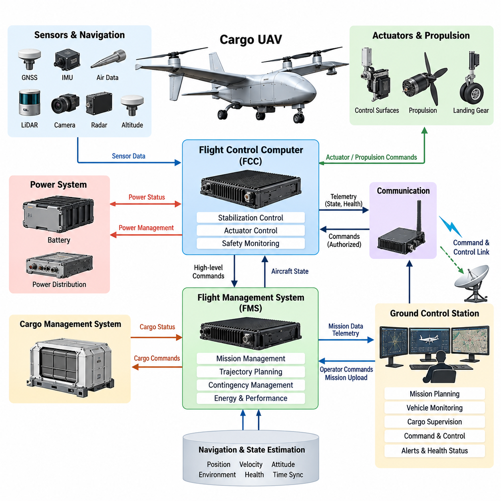
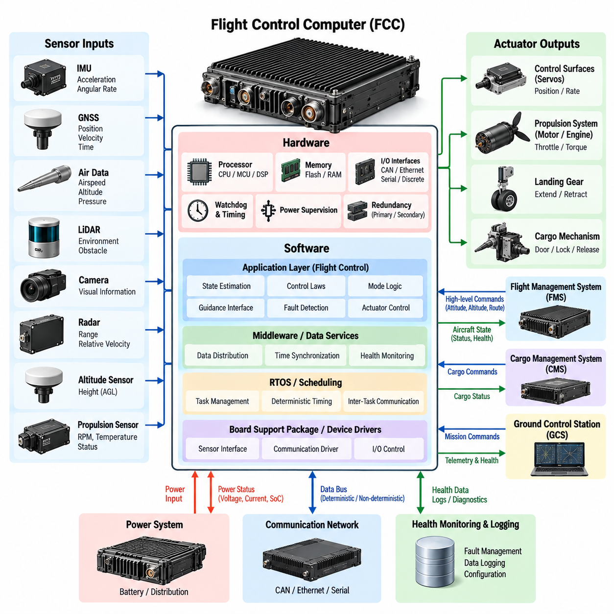
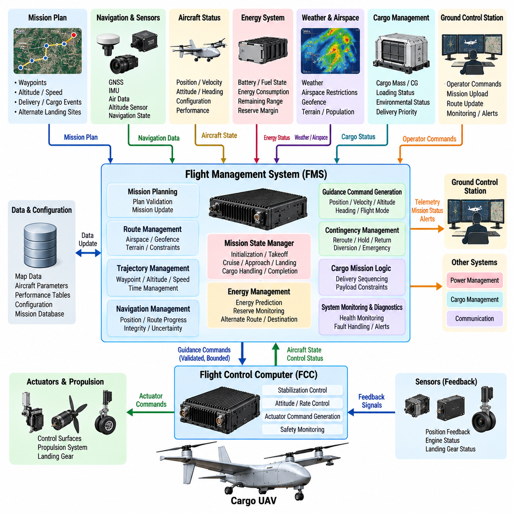
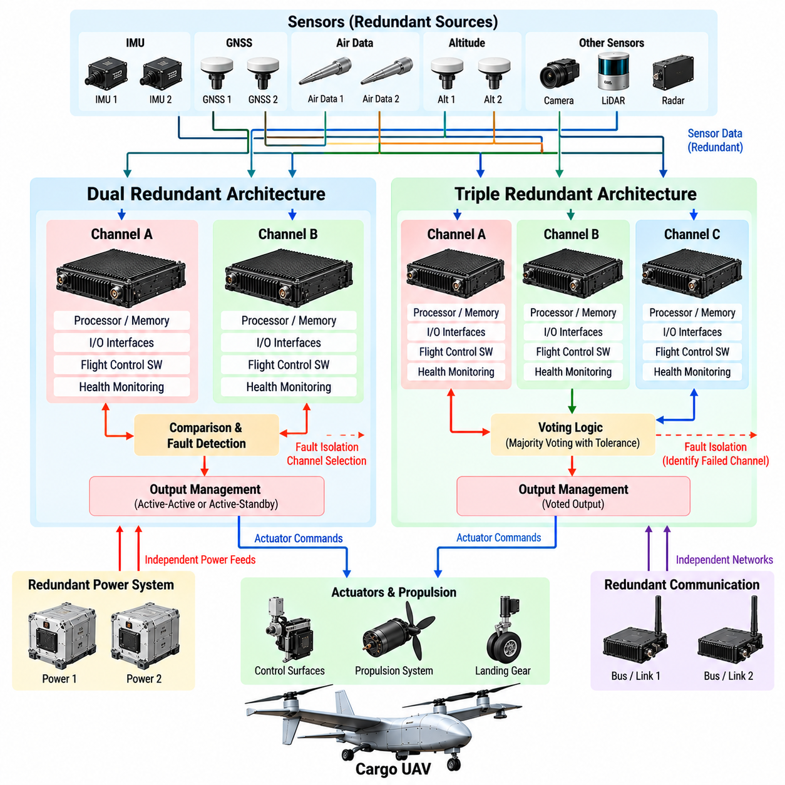
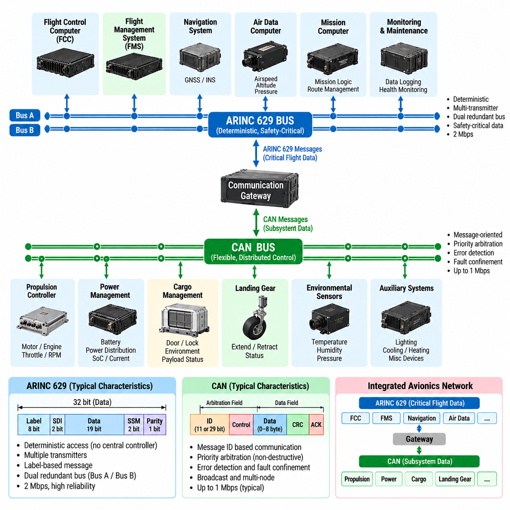
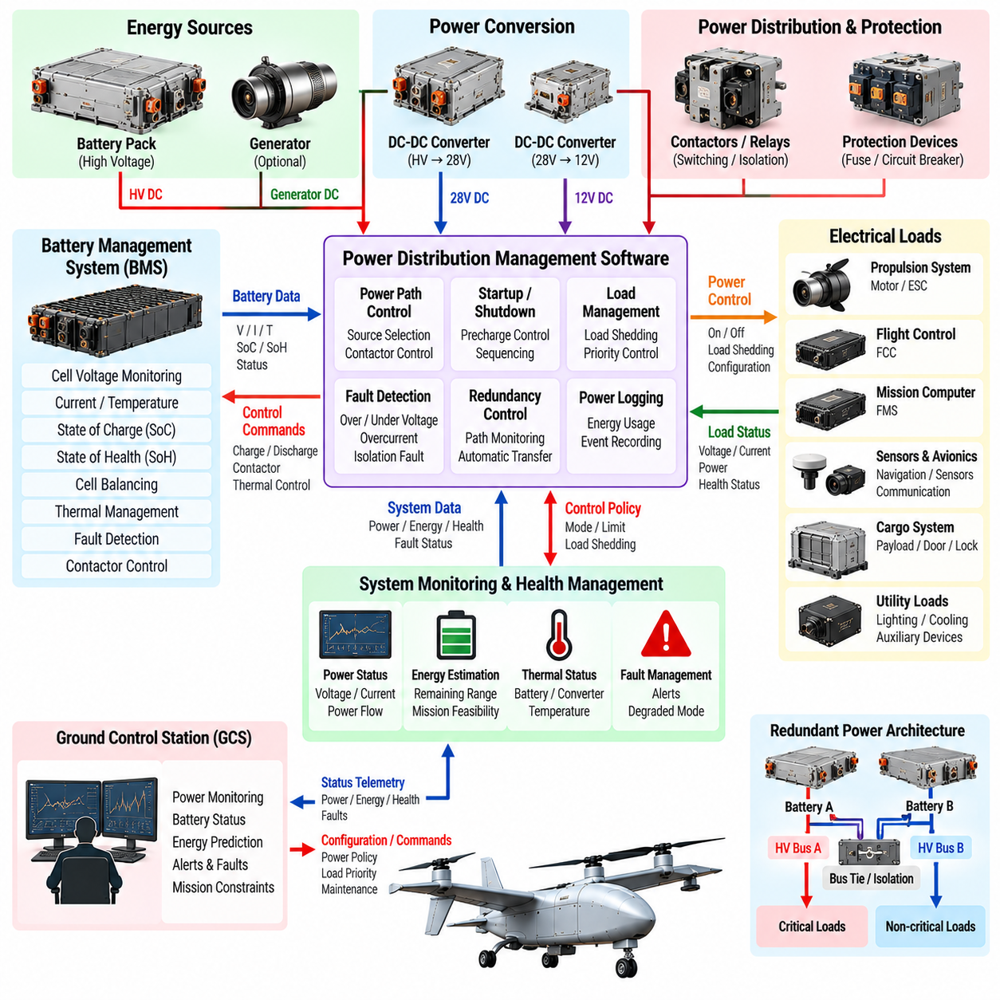
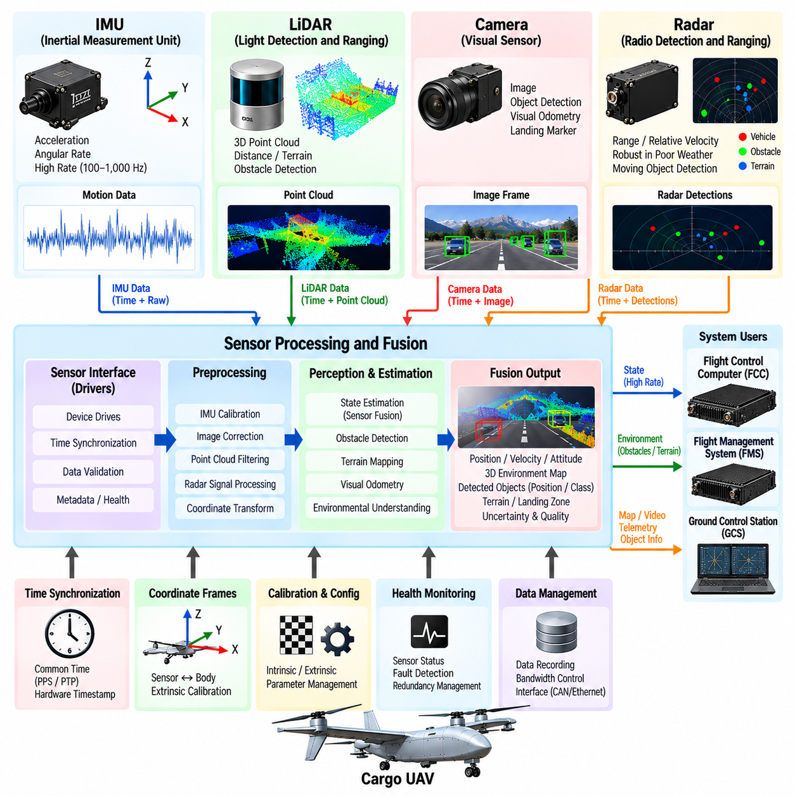
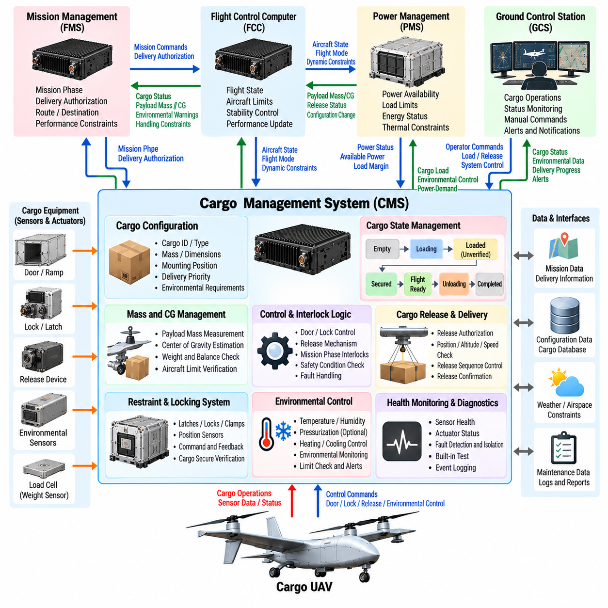
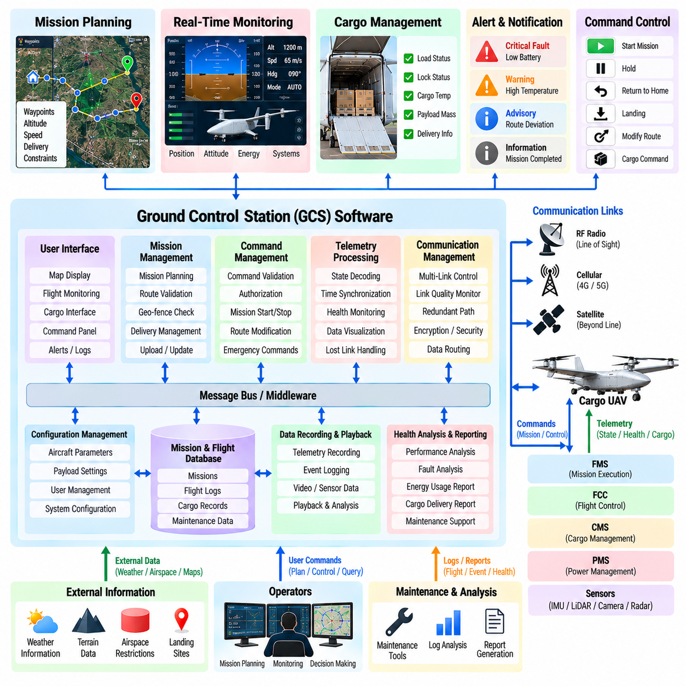
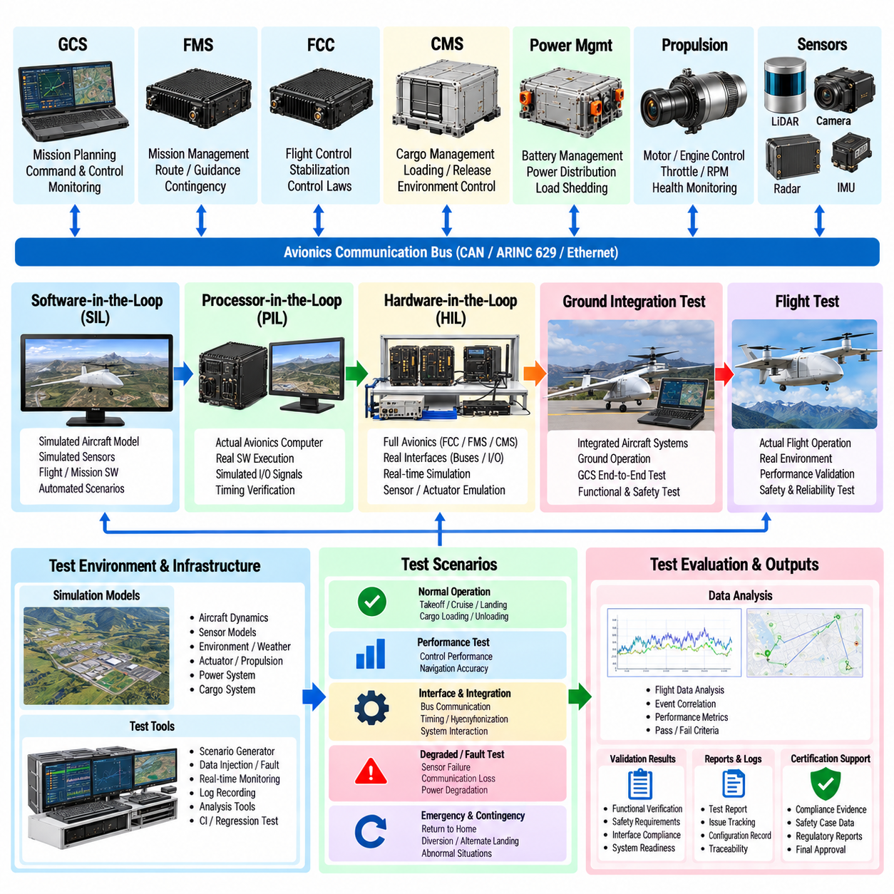

**Volume 23. Cargo UAV Autonomy and Flight AI**

# Chapter 02. UAV System Architecture

## 02.01. Cargo UAV Avionics Architecture FCC FMS GCS

{width="7.268055555555556in" height="7.268055555555556in"}

A cargo UAV avionics architecture provides the computational, communication, sensing, and supervisory foundation required to operate a heavy unmanned aircraft safely throughout its mission. Within the broader UAV system architecture, the Flight Control Computer (FCC), Flight Management System (FMS), and Ground Control Station (GCS) form three major functional domains that connect real-time aircraft stabilization, mission-level automation, and ground-based supervision.

The FCC occupies the most time-critical layer of the airborne architecture. It receives aircraft-state information from inertial sensors, navigation systems, air-data sources, propulsion controllers, and actuator feedback interfaces, then executes deterministic control functions. Attitude, angular-rate, altitude, velocity, and position commands are ultimately translated into actuator or propulsion commands through tightly bounded real-time control cycles.

For a cargo UAV, the FCC must accommodate operating conditions that vary significantly with payload mass, center of gravity, fuel or battery state, aerodynamic configuration, and environmental disturbance. These variations make the control architecture more demanding than that of many small UAVs. The FCC therefore acts not merely as an autopilot processor but as a safety-critical execution platform responsible for maintaining the commanded flight state within validated aircraft limits.

The FMS operates above the inner flight-control functions and manages the aircraft from a mission and trajectory perspective. It interprets mission objectives, waypoints, flight plans, navigation constraints, vehicle performance information, and contingency rules. Instead of directly stabilizing the aircraft, the FMS determines where the UAV should travel, how the mission should progress, and which high-level commands should be delivered to lower-level flight-control functions.

This separation between FCC and FMS establishes an important architectural boundary. The FMS may request a climb, descent, course change, waypoint transition, holding pattern, return-to-home maneuver, or landing sequence, while the FCC determines how the aircraft can safely execute that request. Such separation prevents mission-management complexity from becoming inseparably coupled to high-frequency stabilization and supports independent verification of functions with different timing and safety requirements.

Navigation and state-estimation services provide essential information to both domains. GNSS, IMU, barometric sensing, radar or laser altitude measurements, and other navigation sources can be fused into estimates of position, velocity, attitude, and environmental state. The architecture must preserve data validity, timestamps, source identity, and health status because an apparently valid but incorrect navigation solution can be more hazardous than an explicitly failed sensor.

The GCS forms the principal human-machine and operational interface outside the aircraft. It allows operators to prepare missions, monitor vehicle state, observe flight progress, receive warnings, supervise cargo operations, and issue authorized commands. Telemetry from the aircraft may include position, attitude, propulsion status, energy state, navigation integrity, communication quality, payload condition, fault information, and mission progress, giving operators a consolidated view of system health.

The command-and-control link connects the GCS with airborne avionics but should not make safe flight dependent on continuous human communication. A cargo UAV intended for autonomous operation requires predefined behavior for degraded or lost links. Depending on mission phase and aircraft condition, the onboard system may continue an approved mission, enter a holding state, return to a designated location, divert to an alternate site, or initiate another validated contingency procedure.

Communication among avionics computers must distinguish deterministic control traffic from less time-critical mission and payload data. Sensor measurements, actuator commands, synchronization messages, and safety signals may require bounded latency and predictable delivery, whereas map updates, maintenance records, or bulk mission information can tolerate different communication characteristics. This motivates a partitioned communication architecture with explicit priorities, interface contracts, and failure-containment boundaries.

Redundancy becomes increasingly important as cargo UAV size, kinetic energy, payload value, and operational exposure increase. Critical FCC functions may therefore be implemented through dual or triple computing channels, independent power paths, redundant sensor sources, and monitored communication links. Cross-channel comparison, voting, watchdog supervision, and fault isolation allow the avionics system to identify inconsistent behavior and preserve control when a component fails.

The FMS also participates in contingency management by maintaining awareness of route constraints, remaining energy, destination suitability, weather information, airspace restrictions, and alternate landing opportunities. When the nominal mission can no longer be completed safely, it can generate or select an alternative mission state. The FCC then evaluates and executes the corresponding flight commands while retaining authority over immediate aircraft stability and envelope protection.

A dedicated safety-monitoring layer can supervise both FCC and FMS behavior without duplicating every function. Independent monitors may check command plausibility, flight-envelope violations, sensor disagreement, processor heartbeat, actuator response, energy reserves, and communication health. If a hazardous condition is detected, the safety architecture can inhibit invalid commands, switch redundant resources, downgrade autonomy, or transition the aircraft into a predefined safe operating mode.

Cargo-specific systems introduce another architectural domain. A Cargo Management System may monitor payload identity, locking mechanisms, cargo-bay status, load distribution, center-of-gravity estimates, temperature-sensitive freight, or release mechanisms. Cargo information that affects aircraft dynamics must be communicated to flight and mission systems through controlled interfaces so that loading changes cannot silently invalidate assumptions used by navigation or control functions.

Power management is similarly integrated with avionics decision making. Battery-management, generator, hybrid-power, and distribution systems provide information about available energy, component temperature, voltage, current, and predicted endurance. The FMS can use this information for mission feasibility and diversion decisions, while the FCC and safety functions can react immediately to power faults that threaten propulsion, sensing, computation, or actuation.

Time synchronization is a fundamental system-level requirement because distributed sensors and computers observe a rapidly changing physical system. Sensor measurements must be associated with reliable timestamps so that state estimation and control algorithms can reconstruct the correct temporal relationship among IMU, GNSS, radar, camera, LiDAR, actuator, and propulsion information. Poor synchronization can introduce estimation errors even when every individual sensor is functioning correctly.

The architecture should also separate flight-critical functions from computationally intensive autonomy workloads. Perception, AI-based planning, obstacle assessment, or optimization modules may run on high-performance mission computers, but their outputs should pass through validated interfaces before influencing flight-critical control. This arrangement permits advanced autonomy to evolve while maintaining a stable safety boundary around deterministic control, vehicle protection, and emergency behavior.

Operational data flows in the opposite direction as well. The aircraft continuously produces health information, event records, flight parameters, fault histories, and mission logs that can be transmitted to the GCS or retained onboard. These records support maintenance, post-flight analysis, software verification, anomaly investigation, and fleet-level improvement. Logging should therefore preserve sufficient timing and configuration context to reconstruct important events after a mission.

Cybersecurity must be considered across GCS, communication links, maintenance interfaces, and airborne networks. Authentication, authorization, integrity protection, secure software loading, configuration control, and protected command paths reduce the possibility that unauthorized or corrupted information can influence aircraft behavior. Security mechanisms must nevertheless respect real-time and availability requirements so that protection measures do not create new flight-critical failure modes.

System integration ultimately depends on clearly defined responsibility boundaries. The FCC owns deterministic vehicle stabilization and immediate control execution; the FMS manages trajectory, navigation objectives, mission sequencing, and higher-level contingencies; and the GCS provides operator supervision, mission preparation, telemetry visualization, and authorized command interaction. Supporting systems supply sensing, communication, power, payload, safety, and health-management services across these domains.

This FCC-FMS-GCS decomposition establishes the architectural foundation for the remainder of the cargo UAV software stack. The chapter structure subsequently expands the FCC hardware/software design, FMS architecture, redundant computing, avionics buses, power management, sensor integration, cargo management, GCS software, and system integration testing as distinct engineering subjects. Together, these layers transform the UAV from a collection of flight components into an integrated autonomous cargo aircraft.

## 02.02. Flight Control Computer FCC HW SW Design [w/Code]

{width="7.268055555555556in" height="7.268055555555556in"}

The Flight Control Computer (FCC) is the primary real-time computing platform responsible for executing the safety-critical control functions of a cargo UAV. Its hardware and software must operate as an integrated deterministic system capable of acquiring sensor data, estimating vehicle state, executing control laws, monitoring system health, and producing actuator commands within tightly bounded timing constraints. The FCC therefore forms the computational core of the flight-control architecture.

FCC hardware is designed around predictable execution, fault containment, environmental robustness, and sufficient computational margin rather than maximum general-purpose performance. A typical platform combines one or more processing devices with volatile and nonvolatile memory, sensor interfaces, communication controllers, discrete I/O, watchdog circuitry, power supervision, and hardware timing resources. Each component must support the reliability requirements associated with the aircraft\'s intended operational and safety objectives.

The processor architecture must provide enough performance for high-frequency control loops while maintaining deterministic behavior under worst-case operating conditions. General-purpose CPUs, microcontrollers, DSPs, or heterogeneous processing devices can be selected according to system requirements. For flight-critical execution, predictable interrupt handling, bounded memory access, hardware protection mechanisms, and reliable timing behavior are often more important than peak computational throughput.

Memory architecture directly affects FCC reliability. Program code, configuration parameters, calibration data, runtime state, and flight logs have different persistence and integrity requirements. Flash or other nonvolatile storage can retain executable software and validated configuration data, while RAM supports real-time calculations. Error detection and correction, memory protection, range checking, and controlled initialization help prevent corrupted data from propagating into flight-control calculations.

The FCC receives data from sensors such as the inertial measurement unit (IMU), GNSS receiver, air-data sensors, radar or laser altimeters, propulsion systems, and actuator feedback channels. Hardware interfaces may include serial links, CAN-based networks, Ethernet-class communication, discrete signals, and dedicated sensor buses. Input processing must associate measurements with timestamps, validity information, source identifiers, and diagnostic status before the data is consumed by control software.

Output interfaces connect the FCC to motors, engine controllers, servos, flight-control surfaces, or other actuation devices. Command generation must respect actuator position, rate, torque, current, and thermal limits. The FCC should also verify whether commanded motion produces the expected physical response. This command-and-feedback relationship enables detection of jammed actuators, disconnected interfaces, degraded propulsion channels, and other failures that cannot be identified from command generation alone.

At the software level, the FCC is commonly organized into layered components that separate hardware access from application-level flight functions. A board support package and device-driver layer manage processor peripherals and physical interfaces. Operating-system or scheduling services provide task execution and timing, while middleware and data services distribute validated information. Flight-control applications then implement estimation, guidance interfaces, control laws, mode logic, monitoring, and actuator command generation.

A real-time operating system (RTOS) can provide deterministic scheduling for FCC software by assigning execution periods, priorities, deadlines, and communication mechanisms to individual tasks. High-rate sensor acquisition and control loops may execute much more frequently than navigation management, diagnostics, logging, or communication tasks. The schedule must ensure that lower-priority activities cannot delay flight-critical computation beyond its allowable deadline.

The primary execution pipeline begins with sensor acquisition and validation. Raw measurements are checked for range, freshness, consistency, and communication integrity before being delivered to state-estimation functions. Estimators combine available measurements to determine attitude, angular velocity, position, velocity, altitude, and other required states. These estimated states then become feedback inputs to the flight-control algorithms responsible for stabilizing and maneuvering the aircraft.

Control-law software transforms desired flight states into physically achievable commands. Inner loops typically regulate rapidly changing variables such as angular rate and attitude, while outer loops can regulate altitude, velocity, and position. The FCC coordinates these loops so that high-level commands received from the Flight Management System (FMS) are converted progressively into control targets and finally into propulsion or actuator commands appropriate for the aircraft configuration.

Cargo UAV operation introduces significant variation in mass and center of gravity. FCC software must therefore account for changes caused by different payload configurations, fuel consumption, cargo movement, or release events. Validated scheduling, parameter adaptation, or model-based compensation can modify controller behavior according to the current vehicle configuration. Any adaptation must remain within defined safety boundaries rather than allowing unrestricted modification of flight-critical control behavior.

Flight-mode management coordinates manual, assisted, autonomous, and contingency states. The FCC interprets mode requests while verifying whether transition conditions are satisfied. A requested autonomous landing mode, for example, should not be entered if required navigation information is unavailable. Explicit transition guards and fallback states prevent invalid combinations of control functions and make system behavior more predictable during abnormal conditions.

Health monitoring operates continuously alongside normal control execution. Software monitors processor status, task timing, sensor freshness, communication links, actuator feedback, power conditions, and internal data consistency. Hardware watchdogs can independently detect stalled execution, while software watchdogs and heartbeat mechanisms supervise individual tasks or computing channels. Detected faults are classified so that the system can isolate, tolerate, or respond to them according to their operational significance.

Redundant FCC architectures can use dual or triple computing channels when a single failure cannot be allowed to cause loss of control. Each channel may independently acquire critical sensor information and calculate control outputs. Cross-channel monitoring compares results, while voting or selection logic determines which output remains authoritative. Physical and electrical separation can further reduce the possibility that one power, communication, or hardware failure disables every control channel simultaneously.

Fault containment requires more than redundant processors. Independent power supplies, separated communication paths, redundant clock or timing resources, and appropriately isolated I/O can prevent common failures from propagating across channels. Software partitioning complements hardware separation by limiting memory access and communication between functions. A failure in diagnostics, logging, or a noncritical service should not be able to corrupt the execution state of the primary flight-control loop.

Timing analysis is essential because correct control output produced too late may be functionally equivalent to incorrect output. Each task has a worst-case execution time, activation period, deadline, and scheduling relationship with other tasks. Engineers analyze end-to-end latency from sensor sampling through state estimation and control computation to actuator output. Sufficient timing margin must remain under maximum processor load and credible fault conditions.

The FCC also requires controlled interfaces with the FMS, Ground Control Station (GCS), navigation computers, propulsion controllers, power-management systems, and Cargo Management System (CMS). Interface definitions specify message content, units, coordinate frames, update rates, timeout behavior, validity states, and failure responses. Strict interface contracts reduce ambiguity and allow individual subsystems to be developed and verified without uncontrolled dependencies.

Boot and initialization behavior must be deterministic because the FCC cannot begin control with unknown configuration or partially initialized data. Startup logic verifies executable software, configuration integrity, memory state, connected devices, sensor readiness, and communication availability before enabling control outputs. Critical parameters should be version controlled and checked against the installed aircraft configuration so that incompatible software or calibration data cannot silently enter operation.

Software updates require similarly strict configuration control. Flight software, bootloaders, control parameters, and hardware definitions should be uniquely identifiable so that the exact aircraft configuration can be reconstructed. Secure loading and integrity verification protect executable software from accidental corruption or unauthorized modification. Rollback or recovery mechanisms may be incorporated where they can be implemented without compromising certification and safety requirements.

Verification of FCC hardware and software progresses from component testing to integrated system testing. Unit tests evaluate individual software functions, while software-in-the-loop (SIL) environments exercise control logic against simulated vehicle dynamics. Hardware-in-the-loop (HIL) testing connects production-representative FCC hardware to real-time aircraft models, allowing sensor inputs, actuator responses, timing behavior, communication failures, and abnormal scenarios to be evaluated before flight.

The final FCC design is therefore not simply a powerful embedded computer. It is a tightly controlled hardware-software platform in which processing, memory, I/O, scheduling, control algorithms, redundancy, monitoring, configuration management, and verification are engineered together. Within the cargo UAV architecture, this integrated design provides the deterministic and fault-tolerant execution foundation required for subsequent flight-control, navigation, mission-management, and safety functions.

## 02.03. Flight Management System FMS Architecture [w/Code]

{width="7.268055555555556in" height="7.268055555555556in"}

The Flight Management System (FMS) provides the mission-level planning, navigation, trajectory management, and supervisory logic that connects operational objectives with the real-time flight-control functions of a cargo UAV. Positioned above the Flight Control Computer (FCC), the FMS determines what the aircraft should accomplish and where it should fly, while the FCC determines how commanded flight states are safely achieved through control and actuation.

The FMS architecture receives information from multiple onboard and external systems. Navigation state, aircraft configuration, payload status, energy reserves, weather information, airspace constraints, mission plans, and Ground Control Station (GCS) commands are combined into a coherent operational picture. This information allows the FMS to continuously evaluate whether the planned mission remains feasible and whether the aircraft is progressing within approved operational boundaries.

Mission planning begins with a structured representation of departure points, destinations, intermediate waypoints, altitude constraints, speed requirements, arrival conditions, and alternate landing locations. For cargo operations, the plan may additionally contain loading and unloading events, delivery priorities, ground-handling states, and payload-specific restrictions. The FMS converts these operational requirements into an executable sequence of flight and mission phases.

A mission-state manager coordinates progression through states such as initialization, preflight verification, takeoff, climb, cruise, approach, landing, cargo handling, and mission completion. Each transition is controlled by explicit conditions rather than simple elapsed time. Vehicle health, navigation validity, airspace authorization, energy availability, payload status, and destination readiness can therefore determine whether the next mission phase is permitted to begin.

Trajectory management converts the mission plan into spatial and temporal flight objectives. The FMS can maintain waypoint sequences, route segments, altitude profiles, speed schedules, and time constraints while continuously comparing the planned trajectory with the aircraft\'s estimated state. The resulting guidance objectives are transferred to the FCC as bounded commands rather than direct actuator instructions, preserving the architectural separation between mission guidance and vehicle stabilization.

Navigation management provides the FMS with a consistent representation of aircraft position, velocity, altitude, heading, and route progress. The FMS should not treat navigation data as valid merely because values are available. Integrity indicators, sensor health, uncertainty estimates, update age, and source availability must be considered when deciding whether autonomous navigation functions can continue or whether degraded operating modes are required.

Route management must account for more than geometric distance. Cargo UAV trajectories can be constrained by controlled airspace, geofences, terrain, population exposure, weather, communication coverage, aircraft performance, and available landing locations. The FMS evaluates these constraints against the active flight plan and can identify conditions in which a nominal route is no longer operationally acceptable even though the aircraft remains physically capable of following it.

Energy management is particularly important for heavy cargo UAVs because payload mass, wind, temperature, flight altitude, and mission profile can significantly alter energy consumption. The FMS tracks available battery energy, fuel, or hybrid-system reserves and compares them with predicted requirements for the remaining mission. Reserve thresholds must include sufficient margin for diversion, holding, landing, and credible off-nominal conditions rather than representing only nominal destination energy.

The FMS can periodically recompute mission feasibility as actual performance diverges from preflight assumptions. Strong headwinds, unexpected holding, propulsion degradation, or higher-than-expected energy consumption may reduce the reachable mission envelope. Instead of waiting until reserves become critical, the system can identify deteriorating margins early and recommend or automatically select an alternate route, destination, or contingency strategy according to predefined authority.

Cargo information also influences mission-level decision making. Payload mass and center of gravity affect aircraft performance, while cargo temperature, securing status, release state, or delivery priority may affect mission constraints. Interfaces between the FMS and Cargo Management System (CMS) allow relevant payload conditions to become part of mission logic without placing detailed cargo-device control inside the flight-management function.

The FMS maintains a controlled interface with the FCC. Commands may represent desired position, velocity, altitude, heading, trajectory segment, or flight-mode request, depending on the aircraft design. Every command should include defined validity and timing semantics. The FCC remains responsible for rejecting or limiting requests that violate immediate control, configuration, or flight-envelope constraints, preventing mission logic from directly overriding fundamental vehicle protection.

Communication with the GCS provides mission upload, modification, supervision, and operational authorization functions. Operators can inspect route progress, vehicle health, predicted arrival information, energy margins, active constraints, and contingency status. Changes received from the ground should be authenticated, checked for consistency, and evaluated against the current aircraft state before acceptance so that an inappropriate command cannot immediately destabilize mission execution.

Loss of the command-and-control link must not leave the FMS without a defined operational objective. Preconfigured lost-link logic can specify whether the aircraft should continue the route, hold at a safe location, return to base, divert, or land at an alternate site. The selected behavior may depend on mission phase, energy reserve, airspace conditions, vehicle health, and the availability of validated landing locations at the time communication is lost.

Contingency management is therefore a central FMS responsibility. The system continuously evaluates events such as navigation degradation, propulsion faults, low energy, adverse weather, airspace closure, destination unavailability, communication loss, or cargo anomalies. Rather than treating every fault identically, contingency logic evaluates operational consequences and selects a response appropriate to the severity, remaining aircraft capability, and available recovery options.

The FMS requires explicit priority rules when multiple objectives conflict. Continuing a delivery, minimizing energy consumption, meeting arrival time, avoiding restricted airspace, maintaining communication coverage, and preserving reserve margins cannot always be optimized simultaneously. Safety constraints must remain dominant, followed by operational requirements according to defined policy. This hierarchy prevents optimization functions from trading mandatory safety margins for secondary mission performance.

Software architecture can separate flight-plan management, trajectory generation, navigation management, performance prediction, energy estimation, contingency logic, communication interfaces, and mission-state control into independently testable components. Shared data should be exchanged through controlled interfaces with defined units, coordinate frames, timestamps, validity states, and update rates. This modular structure limits unintended coupling and improves verification of complex mission behavior.

Deterministic execution remains important even though many FMS functions operate more slowly than FCC control loops. Navigation updates, trajectory calculations, health evaluations, and contingency decisions must complete within bounded periods appropriate to their operational function. Computationally expensive route optimization should not prevent urgent safety events from being processed, so scheduling and resource allocation must distinguish critical supervisory functions from background optimization activities.

Persistent data management supports mission continuity and post-flight reconstruction. The FMS can retain the active flight plan, configuration version, waypoint progression, operator modifications, contingency transitions, significant warnings, and relevant performance estimates. Carefully controlled persistence can also support recovery after selected resets, provided that restored information is validated against the current physical state rather than blindly resuming a previously stored mission state.

Cybersecurity is essential because the FMS processes information capable of changing aircraft destination and mission behavior. Flight-plan uploads, GCS commands, database updates, configuration changes, and external airspace information require authentication and integrity protection. Access control should distinguish operational authority from maintenance or diagnostic privileges, while secure logging provides traceability for important mission changes and command transactions.

Verification begins with individual FMS software components and expands toward complete mission scenarios. Software-in-the-loop (SIL) testing can evaluate route logic, state transitions, energy prediction, and contingency behavior across large numbers of simulated missions. Hardware-in-the-loop (HIL) testing then integrates representative FMS and FCC hardware with aircraft dynamics, communication links, navigation sensors, and fault injection to evaluate end-to-end behavior before flight testing.

The resulting FMS architecture acts as the operational intelligence layer between mission intent and deterministic flight execution. By integrating flight plans, navigation state, aircraft performance, energy reserves, cargo information, airspace constraints, GCS interaction, and contingency logic, it enables the cargo UAV to manage complex missions without compromising the FCC\'s authority over immediate vehicle control. This separation provides a scalable foundation for increasingly autonomous cargo operations.

## 02.04. Redundant Computing Architecture Dual Triple [w/Code]

{width="7.268055555555556in" height="7.268055555555556in"}

Redundant computing architecture is a fundamental design mechanism for cargo UAVs whose flight-critical functions cannot tolerate the loss or corruption of a single computing channel. Dual and triple architectures replicate processors, interfaces, power paths, or complete Flight Control Computer functions so that faults can be detected, isolated, and tolerated while the aircraft remains controllable. The objective is not duplication itself, but continued safe operation after credible failures.

A computing channel normally contains the processing resources, memory, timing services, communication interfaces, and input/output functions required to execute its assigned flight-control software. In a redundant system, channels should be sufficiently independent that a fault in one channel does not automatically propagate into the others. Independence therefore includes electrical, logical, timing, communication, and software considerations rather than simply installing multiple processors.

A dual-redundant architecture uses two computing channels that execute equivalent or complementary safety-critical functions. Both channels can receive common aircraft-state information and independently calculate control outputs. Their results are compared continuously to detect disagreement. If both channels agree, operation proceeds normally; if they disagree, additional monitoring or external information is required to determine which channel should remain authoritative.

The principal limitation of simple dual redundancy is ambiguity after disagreement. When Channel A and Channel B produce different results, comparison alone cannot prove which channel is correct. The architecture therefore requires additional fault-detection mechanisms such as processor self-tests, watchdogs, sensor consistency checks, timing supervision, communication diagnostics, or an independent monitor capable of identifying the failed channel with sufficient confidence.

Dual architectures can operate in active-active or active-standby configurations. In an active-active design, both channels execute the control function simultaneously and their outputs are monitored continuously. In an active-standby design, one channel controls the aircraft while the second remains synchronized and prepared to assume control. The standby approach simplifies output authority but requires reliable failure detection and sufficiently fast transfer without unsafe command discontinuities.

Triple-redundant computing introduces a third independent channel and enables majority voting when all three channels calculate comparable outputs. If two channels agree within defined tolerances while one differs significantly, the disagreeing channel can be identified as the likely faulty member. Triple Modular Redundancy (TMR) therefore provides stronger fault discrimination than a simple dual arrangement and is attractive for highly critical control functions.

Voting logic is central to triple-channel operation. The voter may compare discrete states, numerical control values, mode selections, health indicators, or other safety-relevant outputs. Numerical values normally require tolerance-based comparison because independently executing channels may exhibit small differences. The voting thresholds must distinguish acceptable computational variation from meaningful divergence without creating unnecessary channel rejection during normal operation.

The voter itself becomes a critical architectural element because a faulty centralized voter could compromise otherwise healthy channels. Designs can therefore distribute voting functions, replicate voters, or place comparison logic at multiple stages of the signal path. The objective is to prevent redundancy management from introducing a new single point of failure. Voter health and communication integrity must consequently be included in system-level fault analysis.

Redundant processing provides limited benefit if every channel depends on the same power supply, clock, communication switch, or sensor interface. Cargo UAV architectures must examine common-cause failures that can defeat multiple channels simultaneously. Independent power feeds, separated communication paths, redundant timing references, isolated I/O circuitry, and physical separation can prevent a localized electrical or hardware fault from disabling the entire flight-control capability.

Sensor redundancy must be coordinated with computing redundancy. Multiple FCC channels receiving information from only one IMU or navigation source remain vulnerable to that common sensor failure. Critical state variables can therefore be supported by multiple inertial, GNSS, air-data, altitude, or propulsion feedback sources. Sensor selection and voting logic should preserve source identity so that erroneous measurements can be isolated rather than blindly propagated to every computer.

Communication architecture also influences fault containment. Redundant channels may use independent avionics buses or separated network paths to exchange health information and cross-channel data. Messages should include source identification, sequence information, timestamps, validity state, and integrity checks. A corrupted or delayed communication channel must be distinguishable from an actual disagreement in the underlying control computation.

Cross-channel monitoring compares more than final actuator commands. Channels can compare estimated aircraft state, active flight mode, control-law outputs, configuration data, timing status, and internal health indicators. Detecting divergence early in the processing chain helps identify the origin of a fault before it reaches actuators. However, excessive cross-coupling should be avoided because independence can be weakened if channels rely too heavily on one another.

Redundant channels also require synchronization. Equivalent computations should operate on sensor information representing sufficiently consistent physical times, particularly for rapidly changing attitude and angular-rate data. Time synchronization and timestamp management prevent normal timing offsets from appearing as computational disagreement. At the same time, channels should avoid dependence on a single timing component whose failure could simultaneously corrupt all synchronized computers.

Software design must address the possibility of common-mode software faults. Running identical software on three identical processors protects effectively against many random hardware failures but may not protect against a systematic algorithm or implementation defect shared by every channel. Independent monitoring, diversified implementations, dissimilar hardware, or separately developed safety functions can be considered when system safety analysis identifies common software behavior as an unacceptable risk.

Redundancy management must define what happens after a channel is declared faulty. The failed channel may be isolated from actuator outputs, excluded from voting, reset, or retained only for diagnostic purposes. Remaining channels must update their redundancy state so that subsequent failures are interpreted correctly. A triple system degraded to two healthy channels, for example, no longer possesses the same majority-voting capability that existed before the first failure.

Graceful degradation allows the aircraft to continue operating with reduced functionality rather than immediately losing control. Following a redundancy loss, mission-level functions may command return-to-home, diversion, reduced flight-envelope operation, or landing at a suitable site. The response should depend on remaining computing capability, aircraft condition, mission phase, environmental conditions, and the safety consequences of continued flight.

Actuator command authority requires special attention during channel transitions. A newly selected computer should not introduce abrupt command changes merely because its internal state differs slightly from that of the previously active channel. State synchronization, command limiting, bumpless transfer techniques, and actuator arbitration can maintain continuity when control authority changes. Transition behavior must be validated under both normal and faulted conditions.

Startup behavior is also part of redundant architecture. Each channel must verify memory integrity, executable software, configuration data, sensor connectivity, communication interfaces, timing resources, and internal diagnostics before becoming eligible for control authority. Cross-channel checks can confirm compatible software and configuration versions. A channel that fails initialization should remain isolated rather than reducing the integrity of healthy channels.

Fault detection must balance sensitivity and availability. Thresholds that are too permissive can allow a faulty computer to remain active, while thresholds that are too sensitive can incorrectly reject healthy channels because of temporary timing differences or sensor noise. Debouncing, persistence checks, confidence measures, and fault classification can help distinguish transient anomalies from persistent failures requiring isolation or reconfiguration.

Redundant architecture is verified through systematic fault injection and integration testing. Software-in-the-loop environments can evaluate voting, disagreement detection, and degraded-state logic across many simulated failures. Hardware-in-the-loop testing can introduce processor resets, communication loss, corrupted sensor inputs, timing faults, power interruptions, and actuator anomalies while real FCC hardware interacts with simulated aircraft dynamics.

Testing must also address combinations and sequences of failures rather than only isolated faults. A triple-channel system may behave correctly after one channel failure but respond differently if a communication fault occurs after degradation to dual operation. Verification therefore examines transitions among fully redundant, degraded, fail-operational, and fail-safe states and confirms that the aircraft maintains defined behavior throughout each transition.

The choice between dual and triple computing is ultimately driven by safety objectives, aircraft scale, operational exposure, failure probability, weight, power, cost, and certification requirements. Dual redundancy can provide efficient fault detection and backup capability when sufficient independent monitoring exists, while triple redundancy offers stronger fault isolation through majority voting. For cargo UAVs, the appropriate architecture results from system safety analysis rather than a universal channel count.

A well-designed redundant computing architecture integrates processors, sensors, power, communication, timing, software, voting, monitoring, and reconfiguration into one fault-tolerant system. Dual and triple channels become valuable only when their independence and failure behavior are explicitly engineered. This architecture provides the computational resilience required for cargo UAV flight control to remain predictable as individual hardware, communication, or software elements degrade or fail.

## 02.05. Avionics Communication Bus ARINC 629 CAN [w/Code]

{width="7.268055555555556in" height="7.268055555555556in"}

The avionics communication bus provides the data backbone that connects flight-control computers, navigation systems, sensors, propulsion controllers, power-management units, cargo systems, and other electronic equipment within a cargo UAV. Its architecture must deliver predictable communication while maintaining data integrity, fault containment, and sufficient bandwidth. ARINC 629 and Controller Area Network (CAN) represent different approaches to reliable distributed avionics communication.

Communication requirements vary substantially across the UAV architecture. Flight-control measurements and actuator-related information may require deterministic latency and high update rates, while equipment status, cargo information, maintenance data, and configuration messages can tolerate slower delivery. A well-structured avionics network therefore classifies traffic according to timing criticality, safety significance, bandwidth demand, and required behavior when communication becomes unavailable.

ARINC 629 was developed as a multi-transmitter digital data bus for integrated aircraft systems. Unlike architectures that depend on a single centralized bus controller, multiple terminals can transmit information over the shared medium according to defined access rules. This distributed communication concept reduces dependence on one controlling node and permits numerous avionics units to exchange information while maintaining coordinated access to the communication channel.

A major architectural characteristic of ARINC 629 is its use of deterministic terminal access mechanisms designed to prevent uncontrolled simultaneous transmissions. Each terminal observes timing rules before gaining access to the bus, allowing multiple devices to communicate without relying on a conventional master controller. For safety-oriented aircraft architectures, this approach demonstrates how distributed bus access can be engineered around bounded and predictable communication behavior.

ARINC 629 communication can support redundant physical buses so that failure of one communication path does not necessarily isolate critical avionics equipment. Redundant interfaces can transmit or receive information through independent paths, while system-level logic determines how degraded communication is handled. The effectiveness of such redundancy depends on physical separation, independent transceivers, wiring integrity, power independence, and appropriate failure-detection mechanisms.

Controller Area Network (CAN) provides a different distributed communication model and is widely suited to embedded control networks. Multiple electronic control units can share the same bus, with messages identified primarily by their communication meaning rather than by a fixed destination address. This message-oriented structure allows several nodes to consume the same information and supports flexible integration of sensors, controllers, actuators, power systems, and auxiliary equipment.

CAN resolves simultaneous transmission attempts through message arbitration. Message identifiers participate in a bitwise arbitration process in which higher-priority traffic can continue without destructive collision, while lower-priority transmitters retry later. This behavior is particularly useful when safety-relevant or time-sensitive messages must receive preferential access. Identifier assignment must therefore be treated as part of the real-time architecture rather than merely as a software naming convention.

CAN also includes mechanisms for detecting communication errors and limiting the influence of malfunctioning nodes. Frame checking, acknowledgment behavior, transmission monitoring, and node error states help identify corrupted traffic and prevent a persistently faulty transmitter from indefinitely disrupting the network. These mechanisms provide an important foundation for fault containment, although higher-level avionics software must still evaluate message freshness, plausibility, source health, and operational context.

For cargo UAVs, CAN can connect propulsion controllers, battery-management systems, power-distribution units, landing systems, environmental sensors, cargo mechanisms, and other distributed devices. Flight-critical use requires careful analysis of bus loading, update periods, priority assignment, failure behavior, and electrical topology. A network that performs adequately under nominal traffic must also retain required timing margins when diagnostic messages, retransmissions, or abnormal events increase communication demand.

The avionics architecture does not need to use one bus technology for every subsystem. A heterogeneous communication architecture can assign different networks according to functional criticality and data characteristics. Deterministic flight-control traffic may be separated from propulsion, power, payload, maintenance, or high-bandwidth perception traffic. Such segmentation reduces interference and prevents a traffic surge in one functional domain from consuming communication resources required by another.

Communication gateways can connect these network domains while preserving controlled information flow. A gateway may translate message formats, enforce routing policies, perform integrity checks, manage rate limits, and isolate faults between buses. However, gateways must not become uncontrolled single points of failure. Their latency, buffering behavior, overload response, restart behavior, and failure modes must be included in the system architecture and verification process.

Message definitions are as important as the physical bus. Each avionics message should specify its source, meaning, units, numerical range, update frequency, validity conditions, timeout behavior, and safety significance. Position, velocity, actuator state, battery voltage, cargo status, or propulsion information becomes dangerous if different subsystems interpret its representation differently. Interface control therefore requires precise and version-managed data definitions.

Time information must accompany data when the age of a measurement affects its meaning. A flight-control computer receiving sensor or propulsion information needs to distinguish a recent measurement from a delayed packet that remains syntactically valid. Timestamps, sequence counters, freshness monitoring, and timeout logic allow receiving systems to detect stale or missing information. These mechanisms become especially important when data crosses gateways or redundant communication paths.

Redundant avionics buses require explicit rules for duplicate and inconsistent information. The same message may arrive through two independent paths at slightly different times, or one bus may continue operating while another becomes corrupted. Receiving software must determine whether to accept the first valid message, compare redundant copies, select a preferred channel, or declare a disagreement. The strategy depends on the criticality and timing characteristics of the information.

Physical network topology strongly influences reliability. Bus length, termination, connector quality, electromagnetic interference, grounding, shielding, and cable routing affect signal integrity. Cargo UAVs can expose avionics wiring to propulsion-generated electrical noise, vibration, temperature variation, and high-current power systems. Communication wiring must therefore be designed together with mechanical installation and electromagnetic compatibility rather than treated purely as a software interface.

Network capacity must be analyzed under worst-case conditions. Average utilization alone is insufficient because simultaneous sensor updates, fault reports, retransmissions, or mode transitions can create temporary traffic peaks. Engineers evaluate message periods, frame lengths, arbitration delays, gateway latency, and scheduling margins to determine worst-case response time. Safety-critical messages must remain within their deadlines even when the network experiences credible abnormal loading.

Fault management extends beyond detecting a disconnected bus. Systems should recognize missing messages, excessive latency, corrupted frames, inconsistent redundant data, bus-off nodes, gateway failures, and unexpected transmission rates. Communication faults can then be mapped to system responses such as sensor fallback, channel isolation, degraded control, mission reconfiguration, return-to-home, or landing depending on the affected function and remaining communication capability.

Network partitioning also supports safety assurance. Flight-critical control communication can be isolated from maintenance equipment, payload computers, or computationally intensive autonomy systems so that faults in less critical domains cannot freely propagate into control networks. Gateways and interface monitors enforce the permitted data paths. This separation becomes increasingly important as cargo UAVs integrate high-performance AI computers and numerous networked sensors alongside conventional avionics.

Cybersecurity introduces another communication requirement. Unauthorized messages, modified commands, replayed data, or compromised maintenance interfaces can create effects similar to physical avionics failures. Where appropriate, authentication, integrity checking, access control, secure configuration, and network monitoring can protect communication paths. Security functions must be designed so that their computational or timing overhead does not violate real-time flight requirements.

Verification begins with individual bus interfaces and expands toward complete network behavior. Bench testing can evaluate electrical signaling, message encoding, timing, error detection, and device interoperability. Software-in-the-loop environments can test communication logic and failure handling, while hardware-in-the-loop systems reproduce realistic traffic loads and aircraft behavior. Fault injection can deliberately create message loss, delay, corruption, node resets, or bus failures.

Integration testing should verify not only nominal data exchange but also transitions between normal and degraded network states. Redundant-path switching, gateway restart, bus saturation, intermittent connections, and recovery after node faults must produce controlled system behavior. Logs from communication controllers and receiving applications should provide enough timing and diagnostic information to reconstruct the sequence of events during anomalous conditions.

ARINC 629 and CAN illustrate complementary principles relevant to cargo UAV avionics design: distributed communication, controlled medium access, message integrity, redundancy, priority management, and fault containment. The appropriate implementation depends on aircraft size, subsystem requirements, certification strategy, bandwidth, and integration constraints. The communication bus must ultimately be engineered as part of the flight system rather than as a passive connection between computers.

A robust avionics communication architecture therefore combines physical-network design, deterministic traffic management, precise message contracts, timing control, redundancy, diagnostics, cybersecurity, and systematic verification. By ensuring that FCC, FMS, propulsion, power, sensor, cargo, and supporting systems exchange trustworthy information within defined timing bounds, the communication infrastructure becomes a critical foundation for safe and scalable cargo UAV operation.

## 02.06. Power Distribution and Battery Management SW [w/Code]

{width="7.268055555555556in" height="7.268055555555556in"}

Power distribution and battery management software provides the energy-control foundation that allows a cargo UAV to operate propulsion, avionics, sensors, communications, payload equipment, and safety systems within defined electrical limits. The software coordinates power sources and loads while continuously evaluating energy availability, electrical health, and thermal conditions. For heavy cargo UAVs, these functions directly influence flight endurance, redundancy, mission feasibility, and emergency behavior.

The power architecture may contain high-voltage propulsion buses, lower-voltage avionics rails, battery packs, generators, DC-DC converters, contactors, protection devices, and redundant distribution paths. Software maintains an operational representation of these components and their connectivity. Rather than treating electrical power as a passive resource, the system manages it as a dynamic aircraft subsystem whose configuration can change during startup, flight, fault isolation, and shutdown.

A Battery Management System (BMS) monitors individual cells, modules, and complete battery packs. Typical measurements include cell voltage, pack voltage, current, temperature, insulation condition, and contactor state. These measurements are converted into higher-level health information used by the flight system. Reliable acquisition is essential because inaccurate electrical data can produce incorrect endurance estimates or delay detection of hazardous battery conditions.

State of Charge (SoC) represents the estimated amount of usable energy remaining in a battery. Direct voltage measurement alone is generally insufficient because battery voltage varies with current, temperature, chemistry, aging, and transient loading. BMS software can combine current integration, voltage characteristics, battery models, and historical behavior to maintain a more stable estimate. The uncertainty of the estimate should also be considered when determining operational energy margins.

State of Health (SoH) describes the battery\'s capability relative to its expected or initial performance. Capacity loss, increased internal resistance, cell imbalance, repeated high-current operation, temperature exposure, and aging can gradually reduce usable performance. Tracking SoH allows maintenance and mission-planning systems to distinguish a fully charged but degraded battery from a healthy battery capable of delivering its nominal energy and peak power.

Cell balancing is required because individual cells do not age or charge identically. Small differences can accumulate until one cell reaches an upper or lower voltage limit earlier than the rest of the pack. Battery-management software monitors cell-level imbalance and coordinates balancing functions when supported by the hardware. Maintaining balanced cells improves usable pack capacity and prevents individual cells from becoming the limiting element during demanding flight phases.

Thermal management is closely coupled with battery control. High discharge rates during takeoff, climb, heavy-payload operation, or aggressive maneuvering can generate substantial heat, while low temperatures can reduce available power and usable capacity. The BMS monitors temperature distribution and can coordinate cooling, heating, current limits, or operational restrictions. Thermal decisions must account for both instantaneous temperature and the rate at which conditions are changing.

Power-distribution software manages contactors, relays, solid-state switches, and power converters that connect energy sources to aircraft loads. Startup sequencing is particularly important because high-power equipment cannot necessarily be energized simultaneously. Controlled precharge and staged activation can limit inrush current and prevent bus-voltage collapse. Shutdown sequencing similarly ensures that critical computers and safety functions remain powered long enough to complete required actions.

Electrical loads can be classified according to operational criticality. Flight-control computers, essential navigation sensors, communication equipment, and critical actuators may require protected power availability, while payload processors, nonessential sensors, cabin equipment, or maintenance functions may be disconnected when energy becomes limited. Load-shedding logic therefore preserves essential flight capability by selectively removing lower-priority electrical demand.

Redundant power distribution is necessary when a single electrical failure must not disable flight-critical avionics. Independent battery strings, distribution buses, converters, wiring paths, or power controllers can supply critical equipment through separated channels. Software monitors the availability of each path and coordinates transfer when a source or distribution segment fails. Redundancy must include sufficient electrical isolation so that one short circuit cannot collapse every supposedly independent supply.

Fault detection includes overvoltage, undervoltage, overcurrent, excessive temperature, cell imbalance, insulation degradation, contactor faults, converter failures, and abnormal power consumption. Thresholds alone may not be sufficient because transient conditions can briefly exceed nominal values without representing persistent failure. Software can combine magnitude, duration, rate of change, component state, and operating mode to distinguish temporary disturbances from conditions requiring protective action.

Fault isolation determines which component or electrical segment is responsible for an abnormal condition. If a branch develops excessive current, the system may disconnect that branch while preserving the remaining power network. If one battery pack becomes unavailable, healthy packs may continue supporting essential loads within recalculated limits. Isolation logic must avoid unnecessary cascading shutdowns while ensuring that hazardous faults are separated quickly enough to protect the aircraft.

The Flight Control Computer (FCC) requires reliable power-health information because available electrical capability can affect vehicle control. Reduced bus voltage or propulsion power may require thrust limitation, altered control allocation, or changes to the permitted flight envelope. Power information delivered to the FCC must therefore include validity and fault status rather than only raw voltage and current measurements, allowing control functions to respond appropriately to degraded electrical conditions.

The Flight Management System (FMS) uses energy information at a longer mission timescale. Remaining energy, predicted consumption, battery health, reserve requirements, wind, payload mass, and route characteristics can be combined to estimate whether the destination remains reachable. If energy margins deteriorate, the FMS can initiate replanning, diversion, return-to-home, or landing decisions before the battery reaches a critical condition.

Energy prediction should account for the strong relationship between cargo mass and propulsion demand. A route that is feasible for an unloaded UAV may provide insufficient reserve when the aircraft carries a heavy payload or encounters sustained headwind. Software can continuously compare measured consumption with predicted consumption and update the remaining flight-time or range estimate. Persistent deviation becomes an early indicator that the original mission assumptions are no longer valid.

Hybrid-electric cargo UAVs introduce additional energy-management complexity. Batteries may operate together with turbine generators, internal-combustion generators, fuel cells, or other power sources. Supervisory software determines how power demand is shared, when batteries should charge or discharge, and how reserve capability is preserved. Source coordination must prevent unstable transitions while ensuring that sufficient transient power remains available for demanding flight conditions.

Communication between the BMS, power-distribution controllers, FCC, FMS, and Ground Control Station (GCS) requires precise interface definitions. Messages can contain voltage, current, temperature, SoC, SoH, available power, fault state, contactor status, and predicted endurance. Each value should include defined units, update rates, validity information, and timeout behavior so that stale or corrupted electrical information cannot silently influence flight decisions.

The GCS presents electrical and battery information to operators without requiring them to interpret every cell measurement continuously. Higher-level indications can summarize available energy, reserve margin, battery health, thermal state, active faults, and degraded power configurations. Significant transitions should generate clear alerts, while detailed diagnostic information remains available for maintenance and post-flight analysis. Operator commands affecting power must be controlled by appropriate authority and safety checks.

Data logging supports both safety analysis and predictive maintenance. Cell voltage histories, current profiles, temperatures, charge cycles, high-power events, fault transitions, and energy consumption can be retained for later analysis. Across a fleet, these records reveal degradation trends and abnormal packs before they create operational failures. Battery history can also improve future SoC, SoH, endurance, and maintenance predictions when configuration and environmental context are preserved.

Cybersecurity applies to power-management functions because unauthorized control of contactors, charging equipment, or configuration parameters could affect aircraft availability or safety. Software should protect critical commands, firmware updates, calibration data, and maintenance interfaces through appropriate authentication, integrity checks, and access control. Security mechanisms must not prevent essential protective actions from executing within their required real-time deadlines.

Verification combines software testing with electrical and aircraft-level simulation. Software-in-the-loop testing can evaluate SoC estimation, load shedding, fault logic, and mission-energy calculations. Hardware-in-the-loop testing can reproduce changing voltage, current, temperature, contactor states, and communication failures using representative controllers. Fault injection allows overcurrent, sensor errors, pack loss, converter failure, and abnormal thermal conditions to be tested without exposing an aircraft to unnecessary risk.

System-level testing must verify transitions between normal, degraded, and emergency power states. Loss of one source, sudden propulsion demand, battery overheating, bus undervoltage, or failure of a distribution branch should produce predictable reconfiguration and appropriate flight-system responses. Testing also confirms that redundant power paths remain genuinely independent and that load shedding preserves the equipment required for controlled flight and landing.

Power distribution and battery management software therefore connects electrical engineering directly with flight autonomy. By integrating energy estimation, battery protection, thermal management, load prioritization, redundant distribution, fault isolation, mission prediction, and system monitoring, it transforms raw electrical power into a managed flight resource. This capability is essential for cargo UAVs whose safety, payload performance, range, and contingency options depend strongly on available energy.

## 02.07. Sensor Suite Integration LiDAR Camera Radar IMU [w/Code]

{width="7.268055555555556in" height="7.268055555555556in"}

The sensor suite of a cargo UAV provides the physical observations required for flight control, navigation, obstacle detection, landing, and autonomous mission execution. LiDAR, cameras, radar, and inertial measurement units (IMUs) offer complementary information about vehicle motion and the surrounding environment. Their integration requires more than connecting individual devices; the system must establish common timing, coordinate frames, calibration, health monitoring, and reliable data interfaces.

The IMU forms the high-rate motion-sensing foundation of the aircraft. Accelerometers measure specific force while gyroscopes measure angular velocity, allowing the flight-control system to estimate rapid changes in attitude and motion. Because inertial measurements are available at high frequency and do not depend on external infrastructure, they remain essential during aggressive maneuvering or temporary loss of other navigation sources, although accumulated bias causes inertial estimates to drift over time.

LiDAR provides direct geometric measurements of the environment by estimating distance from emitted and returned light. Three-dimensional LiDAR can generate point clouds representing terrain, buildings, obstacles, landing areas, and other structures around the aircraft. For cargo UAVs, LiDAR supports terrain-relative navigation, obstacle detection, altitude estimation, mapping, and landing-zone assessment, particularly where precise geometric understanding is more important than visual appearance.

Camera systems provide dense visual information containing texture, color, edges, semantic features, and object appearance. Monocular, stereo, or multiple distributed cameras can support visual odometry, object detection, landing-marker recognition, terrain classification, and situational awareness. Cameras provide rich information at relatively low sensor weight, but their performance can degrade because of darkness, glare, fog, precipitation, motion blur, or insufficient visual texture.

Radar complements optical sensors by measuring range and, depending on the sensor architecture, relative velocity and direction under environmental conditions where cameras or LiDAR may become degraded. Radar can support obstacle detection, terrain awareness, altitude measurement, weather-related sensing, and detection of moving objects. Its robustness to lighting variation makes it valuable as part of a heterogeneous sensing architecture rather than as a replacement for all other perception sensors.

Sensor integration begins with a clearly defined coordinate-frame architecture. Measurements may originate in individual sensor frames mounted at different locations and orientations on the airframe. Extrinsic calibration defines the transformation between these sensor frames and the aircraft body frame. Accurate transformations are necessary because even small mounting errors can create significant position or orientation errors when measurements are projected over long distances.

Intrinsic calibration characterizes properties internal to each sensing device. Camera calibration includes parameters such as focal length, principal point, and lens distortion, while LiDAR and radar devices may require correction of range, angle, channel, or alignment characteristics. IMU calibration addresses accelerometer and gyroscope bias, scale factors, and axis misalignment. Calibration parameters must be configuration-controlled because they directly influence navigation and perception accuracy.

Time synchronization is equally important because the aircraft and its environment can change rapidly between measurements. A camera frame, LiDAR scan, radar detection, and IMU sample captured at different physical times cannot be treated as simultaneous without compensation. Hardware timestamps, synchronized clocks, trigger signals, or carefully managed software timing allow the integration pipeline to associate each measurement with the physical instant at which it was acquired.

High-rate IMU measurements can help compensate for motion occurring during slower sensor acquisition. A rotating or translating UAV may move significantly while a LiDAR scan or camera exposure sequence is being produced. Motion compensation uses estimated vehicle motion to transform observations into a consistent temporal reference. Without this correction, point clouds may become distorted and visual or geometric features can be incorrectly aligned.

The sensor-processing architecture normally separates device acquisition from perception and fusion functions. Device drivers communicate with physical sensors, decode measurements, apply basic validation, and attach timestamps and metadata. Preprocessing modules then perform operations such as image correction, point-cloud filtering, radar processing, or IMU calibration. Higher-level modules consume these standardized outputs without depending directly on vendor-specific device protocols.

Sensor data rates can differ by orders of magnitude. IMUs may generate compact measurements at very high frequency, cameras produce large image streams, and LiDAR generates substantial three-dimensional point-cloud traffic. Radar has its own detection and signal-processing characteristics. The computing and network architecture must therefore provide sufficient bandwidth, buffering, memory, and scheduling while ensuring that high-volume perception traffic cannot delay flight-critical inertial or control information.

Fusion combines complementary sensor information into estimates that are more useful than individual measurements alone. IMU data provides rapid motion updates, while cameras and LiDAR can constrain accumulated drift through environmental observations. Radar can maintain useful detection capability when optical sensing becomes unreliable. Fusion may occur at raw-data, feature, object, state, or decision level depending on computational cost, timing requirements, and the function being supported.

State-estimation functions require explicit uncertainty handling. Every measurement contains noise and may occasionally contain systematic error or invalid observations. Fusion algorithms should therefore consider measurement covariance, confidence, sensor status, and innovation consistency rather than assuming equal reliability. Measurements inconsistent with the predicted vehicle state can be rejected, down-weighted, or flagged for additional monitoring before they influence navigation or control.

Sensor-health monitoring operates continuously throughout the mission. The system can detect missing frames, frozen values, excessive noise, temperature anomalies, communication errors, timing irregularities, calibration inconsistencies, or implausible measurements. A sensor that continues transmitting syntactically correct but physically incorrect data can be particularly hazardous, so health evaluation must include behavioral plausibility rather than relying only on communication status.

Cross-sensor consistency provides an additional mechanism for detecting degraded sensing. Motion estimated from visual or LiDAR observations can be compared with inertial motion, while radar or LiDAR range can be checked against other altitude or obstacle estimates. Persistent disagreement does not automatically identify the failed sensor, but it provides evidence that the fusion system should reduce confidence, isolate a source, or transition to a degraded sensing configuration.

Graceful degradation is essential because autonomous cargo UAVs should not depend on every sensor remaining available throughout the mission. Loss of a camera may allow navigation to continue using LiDAR, radar, IMU, and GNSS, while temporary LiDAR degradation may be tolerated through visual and inertial sensing. The available combination determines which autonomy functions remain trustworthy and whether the aircraft should continue, reduce its operating envelope, divert, or land.

Environmental conditions strongly influence sensor selection and fusion policy. Bright sunlight, darkness, rain, fog, dust, snow, vibration, electromagnetic interference, and temperature can affect sensors differently. A heterogeneous suite provides resilience because common environmental conditions are less likely to degrade every sensing modality in exactly the same manner. The system can adjust confidence dynamically as environmental and sensor-health conditions change.

Sensor placement is part of the integration problem. Cameras and LiDAR require appropriate fields of view, radar requires suitable coverage and electromagnetic installation, and IMUs should be positioned where structural vibration and thermal effects remain manageable. Airframe structures, landing gear, cargo pods, rotors, propellers, or other components can create occlusion and interference. Installation geometry must therefore be evaluated together with perception requirements.

The Flight Control Computer (FCC) typically consumes compact, validated state information rather than unrestricted raw perception streams. High-performance perception computers can process camera, LiDAR, and radar data and provide navigation states, obstacle information, or landing guidance through controlled interfaces. This separation protects deterministic control execution from variable perception workloads while still allowing advanced sensing to influence autonomous flight through validated outputs.

The Flight Management System (FMS) can use sensor-derived information at the mission level. Detected weather hazards, blocked routes, unsuitable landing zones, navigation degradation, or obstacle conditions may trigger route modification or contingency decisions. The FMS does not need to process raw sensor data directly; instead, perception services provide higher-level information with confidence, validity, location, timestamp, and operational significance.

Data recording is important for validation and post-flight analysis. Selected camera frames, LiDAR data, radar detections, IMU measurements, calibration versions, timestamps, navigation estimates, and sensor-health events can be logged according to available storage and safety requirements. These records allow engineers to reconstruct perception failures, evaluate fusion performance, reproduce difficult scenarios, and improve future algorithms using representative operational data.

Verification progresses from individual sensor characterization to integrated multi-sensor testing. Bench tests evaluate interfaces, calibration, timing, and failure detection, while software-in-the-loop environments exercise perception and fusion algorithms with simulated sensor streams. Hardware-in-the-loop and vehicle-level testing introduce realistic timing, processing loads, vibration, communication behavior, and fault conditions before full autonomous flight testing.

Fault injection can deliberately introduce delayed measurements, dropped frames, biased IMU signals, corrupted point clouds, camera loss, radar outages, or timestamp errors. The objective is to verify that sensor fusion does not simply continue producing apparently valid results after its assumptions have been violated. Detection, isolation, fallback, confidence reduction, and recovery behavior must all be evaluated as part of the integrated sensing architecture.

A well-integrated LiDAR, camera, radar, and IMU suite therefore creates a resilient perception and navigation foundation for cargo UAV autonomy. Each sensor contributes different spatial, visual, dynamic, or inertial information, while synchronization, calibration, fusion, health monitoring, and graceful degradation convert those measurements into trustworthy system knowledge. This integrated sensing layer supports the subsequent navigation, obstacle avoidance, landing, mission management, and safety functions of the cargo UAV.

## 02.08. Cargo Management System CMS SW Architecture [w/Code]

{width="7.268055555555556in" height="7.268055555555556in"}

The Cargo Management System (CMS) provides the software architecture responsible for supervising payload configuration, loading status, restraint mechanisms, cargo environmental conditions, and delivery operations within a cargo UAV. It connects cargo-specific equipment with the broader aircraft architecture while maintaining separation from flight-critical control. The CMS transforms payload information into validated operational states that can be consumed by the FMS, FCC, and Ground Control Station.

Cargo configuration begins with a structured representation of the payload carried by the aircraft. The CMS can maintain cargo identifiers, mass, dimensions, mounting position, handling requirements, environmental limits, destination information, and operational priority. These parameters allow the aircraft to determine whether the installed payload is compatible with vehicle limits and whether the declared configuration matches the physical loading condition before flight.

Mass and center-of-gravity information is particularly important because cargo directly influences aircraft dynamics and propulsion requirements. The CMS can receive measured or entered payload mass and determine its contribution to the overall weight and balance configuration. Cargo position information can be combined with aircraft geometry to estimate loading distribution, allowing other systems to verify that the center of gravity remains within an approved operating envelope.

The CMS supervises cargo restraint and locking mechanisms used to secure payloads during flight. Sensors can indicate whether latches, locks, clamps, doors, or attachment devices have reached their commanded positions. Software compares commanded and observed states before declaring cargo secure. A closed door indication alone may be insufficient if the locking mechanism is not engaged, so multiple conditions can be combined into a validated cargo-ready state.

Loading and unloading operations are managed through explicit operational states. The software can distinguish between empty, loading, loaded-unverified, secured, flight-ready, unloading, and completed conditions. State transitions occur only when required sensor inputs, operator confirmations, and interlocks are satisfied. This state-machine approach prevents flight preparation from progressing while cargo equipment remains in an uncertain or mechanically unsafe configuration.

Interlocks protect the aircraft from inappropriate cargo actions during flight. Cargo doors, release devices, hoists, ramps, or automated handling equipment should not activate simply because a command is received. The CMS evaluates aircraft state, mission phase, altitude, ground status, actuator health, and authorization before enabling an operation. Safety-critical inhibitions should remain enforceable even when higher-level mission software requests an invalid action.

Some cargo missions require controlled release, lowering, or aerial delivery rather than conventional landing and unloading. In these configurations, the CMS coordinates the sequence associated with preparing and releasing the payload while the flight system retains authority over aircraft stability. Release logic can verify location, altitude, speed, vehicle attitude, cargo readiness, and mission authorization before permitting the mechanical release mechanism to operate.

Cargo release can create an abrupt change in vehicle mass and center of gravity. The CMS therefore communicates release status and relevant payload properties to the FCC and FMS with tightly defined timing semantics. The flight-control system can prepare for the expected dynamic change, while mission management can update aircraft performance and energy predictions after release. Confirmation of actual release should be distinguished from the issuance of a release command.

Environmental monitoring is required when cargo must remain within defined temperature, humidity, vibration, pressure, or other storage limits. The CMS acquires information from payload-compartment sensors and evaluates it against cargo-specific constraints. Warning thresholds can identify deteriorating conditions before hard limits are exceeded. Environmental status can then influence mission decisions when continued transportation may damage sensitive or high-value cargo.

Active environmental control can extend the CMS beyond passive monitoring. Refrigeration, heating, ventilation, or other conditioning equipment may be controlled according to cargo requirements and available aircraft power. Because these systems consume energy, the CMS coordinates with power-management and mission-management functions. Environmental control may be reduced or prioritized according to cargo criticality when aircraft energy margins become constrained.

The CMS maintains a controlled interface with the Flight Management System (FMS). It can provide cargo readiness, payload mass, delivery status, environmental warnings, and handling constraints while receiving mission-phase and delivery authorization information. The FMS uses these states when determining whether departure, continuation, delivery, diversion, or mission completion is permitted, without directly controlling detailed cargo hardware.

The Flight Control Computer (FCC) requires only cargo information that can affect immediate vehicle dynamics or flight safety. Payload mass, estimated center of gravity, cargo-shift detection, door status, or confirmed release events may therefore be communicated through validated interfaces. Detailed logistics information should remain outside the FCC so that deterministic flight-control execution is not unnecessarily coupled to complex cargo-management software.

Cargo-shift detection is especially important for large or heavy payloads. Movement during acceleration, turbulence, or maneuvering can alter the center of gravity and potentially affect controllability. The CMS can use restraint sensors, position sensors, load measurements, or other available information to detect unexpected movement. A confirmed shift can generate warnings and provide the flight system with updated payload-state information for appropriate response.

The Ground Control Station (GCS) provides operators with cargo status without requiring direct interaction with individual devices. The interface can display payload identity, loading state, restraint condition, door status, environmental conditions, delivery progress, and active faults. Operator commands for loading, securing, release, or unloading should be authenticated and evaluated against local CMS interlocks before they are accepted for execution.

Communication loss must not cause cargo equipment to enter an undefined state. If the GCS connection is interrupted, the CMS should preserve the last safe configuration and apply predefined behavior according to the current mission phase. In-flight cargo mechanisms normally remain inhibited unless an autonomous mission procedure explicitly authorizes their operation. Restoration of communication should not automatically repeat commands whose execution state is uncertain.

The software architecture can separate device control, cargo-state management, safety interlocks, environmental management, configuration services, diagnostics, communications, and data logging into modular components. Hardware abstraction prevents higher-level software from depending on a specific latch, sensor, or actuator implementation. This modularity allows different cargo modules to be integrated while preserving consistent aircraft-level interfaces and safety behavior.

Cargo modules may require a standardized interface contract so that different payload systems can be exchanged without redesigning the entire aircraft software stack. The contract can define power requirements, communication messages, status semantics, command authorization, fault reporting, timing behavior, and configuration data. A modular interface is particularly useful for cargo UAV fleets expected to transport containers, pallets, specialized equipment, or mission-specific payload modules.

Fault management identifies failures such as unlocked restraints, actuator jams, sensor disagreement, open doors, communication loss, environmental excursions, unexpected cargo movement, or release-mechanism faults. The CMS evaluates whether a fault prevents departure, requires mission restriction, permits continued transport, or demands diversion or landing. Fault severity must reflect both the cargo consequence and the possible effect on aircraft safety.

Redundancy can be applied selectively to cargo functions whose failure could threaten the aircraft. Critical door-closed indications, locking confirmation, release inhibition, or cargo-position information may require independent sensing or monitoring. Not every logistics function requires the same redundancy level. The architecture should distinguish safety-related cargo functions from mission convenience functions so that complexity is concentrated where failure consequences justify it.

Configuration management ensures that the CMS knows which cargo hardware, software, calibration data, and payload definition are installed for a mission. Incorrect configuration information can invalidate weight calculations, environmental limits, or actuator commands. Version-controlled configuration data and startup compatibility checks reduce the risk of operating a cargo module with incompatible software or applying parameters intended for a different payload type.

Data logging provides traceability across the complete cargo mission. The CMS can record loading confirmation, mass information, lock transitions, environmental history, operator commands, release events, faults, and unloading completion. These records support maintenance, delivery verification, safety investigation, and fleet analysis. Accurate timestamps allow cargo events to be correlated with aircraft motion, power consumption, and mission-state changes.

Cybersecurity is relevant because unauthorized cargo commands can affect both payload integrity and aircraft safety. Interfaces for release, door operation, configuration updates, and maintenance require appropriate authentication, access control, and command validation. Security boundaries should prevent a compromised payload device from obtaining unrestricted access to flight-critical networks while still allowing the validated information required by aircraft systems to cross the interface.

Verification begins with individual cargo devices and software components before progressing to integrated mission scenarios. Software-in-the-loop testing can evaluate state machines, interlocks, configuration logic, and fault responses. Hardware-in-the-loop testing can connect representative locks, doors, sensors, actuators, and controllers to simulated aircraft states, allowing loading, flight, release, unloading, communication loss, and equipment failures to be tested systematically.

System-level validation must include abnormal sequences rather than only nominal cargo handling. Attempts to open a door during flight, release cargo outside an authorized zone, depart with an incomplete lock state, or continue after unexpected cargo movement should produce defined responses. Testing also verifies that CMS faults cannot improperly override FCC authority and that critical cargo information reaches the flight and mission systems within required timing bounds.

The Cargo Management System therefore forms the operational bridge between payload logistics and aircraft autonomy. By integrating cargo configuration, weight and balance information, restraint supervision, environmental management, delivery control, fault handling, and standardized interfaces, the CMS enables diverse payload missions without embedding logistics complexity inside flight-control software. This separation provides a scalable foundation for safe and increasingly autonomous cargo UAV operations.

## 02.09. Ground Control Station GCS SW Design [w/Code]

{width="7.268055555555556in" height="7.268055555555556in"}

The Ground Control Station (GCS) provides the primary operational interface between human operators and the cargo UAV mission system. Its software integrates mission planning, command transmission, telemetry monitoring, vehicle health visualization, cargo supervision, contingency management, and operational logging. The GCS must present complex aircraft information in a form that supports rapid and reliable decisions without transferring direct flight-stabilization responsibilities from the onboard control system to the operator.

GCS software is commonly organized as a modular architecture separating user-interface functions, mission services, communication management, vehicle-state processing, alerting, configuration, and data recording. This separation prevents changes in one function from unnecessarily affecting unrelated capabilities. It also allows different aircraft types, payload modules, communication links, or operator interfaces to be integrated through defined software interfaces rather than extensive redesign.

Mission planning allows the operator to define departure locations, destinations, waypoints, altitude profiles, speed constraints, delivery locations, alternate landing sites, and operational boundaries. For cargo missions, planning can also incorporate payload mass, delivery priority, energy requirements, loading status, and cargo-specific restrictions. The GCS validates the mission structure before transmission so that incomplete or internally inconsistent plans are identified before aircraft execution.

Geospatial information forms an important part of the operator interface. Route geometry, aircraft position, planned waypoints, geofences, landing locations, terrain constraints, and relevant operational regions can be represented within a common map-based environment. The interface should distinguish planned information from actual aircraft state and clearly indicate when navigation uncertainty or communication delay reduces confidence in the displayed vehicle position.

Command management controls how operator intentions are converted into aircraft requests. Commands may include mission upload, mission start, hold, route modification, return-to-home, diversion, landing, or cargo-related actions. Safety-relevant commands should pass through validation and authorization logic before transmission. The interface can require confirmation for consequential actions while avoiding unnecessary interaction steps for routine monitoring tasks.

The GCS communicates primarily with the onboard Flight Management System (FMS) rather than directly controlling low-level actuators. The FMS interprets mission-level requests and determines whether they are compatible with aircraft state, operational constraints, and onboard safety logic. This architectural boundary ensures that loss, delay, or corruption of a ground command does not directly bypass the deterministic protections implemented by the Flight Control Computer (FCC).

Telemetry processing converts incoming aircraft messages into a coherent operational state. Information may include position, velocity, altitude, heading, flight mode, propulsion status, energy reserves, navigation quality, communication health, sensor status, and cargo condition. The GCS should associate telemetry with timestamps and validity information so that operators can distinguish current aircraft state from delayed, stale, or incomplete information.

Vehicle-health monitoring summarizes large quantities of subsystem information without overwhelming the operator. Flight control, navigation, propulsion, power, communication, sensors, and cargo systems can provide detailed diagnostic data, but normal operation requires a prioritized presentation. The interface should emphasize conditions requiring attention while allowing deeper diagnostic information to be accessed when troubleshooting or maintenance analysis is necessary.

Alert management is critical because excessive alarms can be as problematic as missing warnings. GCS software should classify alerts according to severity, urgency, persistence, and required operator response. Related events can be grouped to prevent a single underlying fault from producing numerous redundant messages. Acknowledgment should confirm operator awareness without hiding an unresolved condition or altering the onboard system\'s independent protective behavior.

Communication-link management monitors command-and-control connectivity between the GCS and aircraft. Link quality, latency, packet loss, message age, available bandwidth, and communication-path status can be evaluated continuously. When redundant radio, cellular, satellite, or other communication channels are available, the GCS may supervise path selection or display which path is active while onboard logic maintains defined behavior during link transitions.

The interface must explicitly represent communication degradation. A vehicle icon continuing to move based only on prediction can create false confidence if telemetry has stopped. The GCS should therefore indicate the age and validity of displayed information and clearly distinguish live telemetry from extrapolated or previously received data. Lost-link conditions should generate defined indications while the aircraft executes its onboard contingency procedure independently.

Cargo supervision extends the GCS beyond conventional flight monitoring. Operators can observe payload identity, mass, loading state, restraint status, environmental conditions, cargo-door state, and delivery progress through information supplied by the Cargo Management System (CMS). Commands related to securing, releasing, or unloading cargo remain subject to onboard interlocks so that ground authority cannot directly bypass aircraft or payload safety conditions.

Energy monitoring is especially important for cargo UAV operations. The GCS can display State of Charge (SoC), available energy, State of Health (SoH), predicted endurance, destination reserve, and abnormal battery or power conditions. Rather than showing only instantaneous battery percentage, the interface should communicate whether the current mission remains energetically feasible and whether reserve margins are improving or deteriorating.

The GCS can support contingency management by presenting available recovery options when abnormal conditions occur. Navigation degradation, propulsion faults, low energy, adverse weather, destination unavailability, or cargo anomalies may require holding, diversion, return, or landing. The software can present the aircraft\'s current contingency state and permitted alternatives while onboard systems retain authority for immediate safety-critical responses.

Human-machine interface design must consider operator workload and situational awareness. Critical flight state, mission progress, energy margin, communication status, and significant faults should be understandable without searching through multiple displays. Consistent symbols, terminology, units, alert behavior, and information hierarchy reduce interpretation errors. Detailed engineering data should remain accessible without dominating the primary operational view.

Role-based access control can separate operational functions from maintenance, engineering, and administrative privileges. A mission operator may be authorized to upload routes or initiate approved contingency actions, while software updates and calibration changes require different credentials. This separation reduces the possibility that routine operations accidentally modify configuration data or that unauthorized users gain access to safety-relevant functions.

Cybersecurity is essential because the GCS is an external entry point into the aircraft system. User authentication, command authorization, encrypted communication where appropriate, integrity checking, secure software updates, and protected credential storage can reduce exposure to unauthorized control or data modification. Security events should be logged and monitored without preventing legitimate safety actions from being executed within required time limits.

Configuration management ensures that the GCS uses aircraft-compatible mission definitions, message formats, maps, payload descriptions, and operational parameters. Software and configuration versions should be identifiable and checked before mission execution. When multiple cargo UAV variants are supported, the station must avoid applying a configuration intended for one aircraft type to another vehicle with different performance, interfaces, or payload capabilities.

Operational logging creates a synchronized record of commands, telemetry, alerts, operator actions, communication events, mission modifications, and configuration changes. Accurate timestamps allow ground records to be correlated with onboard FCC, FMS, CMS, and power-system logs. These records support incident reconstruction, maintenance analysis, delivery verification, operator training, and evaluation of fleet-level operational performance.

The GCS can also support multi-aircraft operations when cargo fleets expand beyond one operator-to-one-aircraft supervision. Fleet interfaces must summarize each aircraft\'s mission state, energy margin, communication health, and active alerts while directing operator attention toward vehicles requiring intervention. Scalability should not reduce visibility of critical events, and authority boundaries must remain clear when responsibility transfers between operators or control stations.

Software resilience is necessary because the GCS itself can experience application crashes, network interruptions, hardware failures, or power loss. Aircraft safety must not depend on uninterrupted execution of the ground application. GCS software can preserve mission records, recover communication sessions, and reconstruct current operational state after restart, while onboard autonomy continues according to previously validated mission and contingency logic.

Verification begins with software components such as mission planning, command validation, telemetry decoding, alert processing, and user-interface logic. Simulated aircraft can exercise the GCS across normal and abnormal mission scenarios without flight risk. Communication delay, packet loss, stale telemetry, conflicting commands, low energy, navigation faults, and cargo-system anomalies can be introduced systematically to evaluate operator indications and software responses.

Hardware-in-the-loop and integrated system testing connect the GCS with representative onboard computers, communication equipment, and simulated aircraft dynamics. These tests verify end-to-end command paths, telemetry timing, mission updates, lost-link transitions, cargo interactions, and recovery behavior. Human-in-the-loop evaluation additionally examines whether operators correctly recognize abnormal conditions and select appropriate actions under realistic workload.

A well-designed Ground Control Station therefore acts as the supervisory human interface to cargo UAV autonomy rather than as a remote low-level flight controller. By integrating mission planning, command management, telemetry, health monitoring, cargo supervision, energy awareness, contingency support, cybersecurity, and operational logging, the GCS allows operators to manage complex missions while preserving the authority and safety boundaries of onboard autonomous systems.

## 02.10. System Integration Test Architecture UAV

{width="7.268055555555556in" height="7.268055555555556in"}

System integration testing verifies that the cargo UAV operates as a coordinated aircraft rather than as a collection of independently validated subsystems. The integration test architecture connects flight control, mission management, navigation, perception, propulsion, power, cargo management, communication, and ground-control functions within representative operational environments. Its objective is to expose interface, timing, configuration, and interaction failures before they can appear during unrestricted flight.

Integration testing follows the operational interfaces defined by the aircraft architecture. The Flight Control Computer (FCC), Flight Management System (FMS), Cargo Management System (CMS), Ground Control Station (GCS), sensor suite, propulsion controllers, and power-management system exchange commands, states, health information, and timing data. Testing verifies not only individual messages but also whether the complete information flow produces the intended aircraft behavior.

A layered test architecture allows software to mature progressively from isolated execution toward physical aircraft operation. Software-in-the-Loop (SIL) testing executes flight and mission software against simulated aircraft dynamics and environmental models. Processor-in-the-Loop and Hardware-in-the-Loop (HIL) stages introduce representative computing hardware, interfaces, and timing. Ground integration and flight testing then validate behavior with increasingly complete physical systems.

SIL provides a scalable environment for exercising large numbers of scenarios before hardware becomes available. Simulated vehicle dynamics can respond to FCC commands while models generate navigation, sensor, propulsion, power, and cargo states. Engineers can repeat identical conditions, accelerate simulation time, and introduce precisely controlled failures. This repeatability makes SIL particularly useful for regression testing after software or configuration changes.

HIL testing introduces actual avionics computers and communication interfaces while maintaining simulated vehicle dynamics. The FCC can receive realistic sensor signals and issue actuator commands that are returned to the simulation, creating a closed control loop. FMS, CMS, power controllers, and communication equipment can be added progressively. This environment exposes execution-time, bus-loading, driver, synchronization, and hardware-interface issues that pure software simulation may not reveal.

Real-time simulation is essential when testing flight-control functions. The simulated aircraft model must produce sensor and dynamic responses within timing bounds consistent with physical flight. Excessive simulator jitter or unrealistic latency can either create false failures or hide actual timing weaknesses. Test infrastructure therefore requires synchronized clocks, controlled execution rates, measurable end-to-end latency, and traceable timestamps across simulated and physical components.

The sensor integration environment reproduces the information expected from IMUs, GNSS, LiDAR, cameras, radar, altitude sensors, and other navigation sources. Depending on the test level, sensors may be entirely simulated, electrically stimulated, or physically operated in controlled environments. The objective is to verify acquisition, timestamping, calibration, fusion, validity handling, and degraded-sensor behavior across the complete navigation and perception chain.

Communication-network testing evaluates avionics buses and network links under both nominal and stressed conditions. CAN, Ethernet-based networks, redundant avionics channels, and command-and-control links can be exercised with realistic message rates and traffic patterns. Tests measure latency, jitter, packet loss, arbitration effects, gateway behavior, and bus utilization while verifying that flight-critical information continues to satisfy its timing requirements.

The power-system test environment represents batteries, converters, distribution buses, contactors, and electrical loads. Battery State of Charge (SoC), voltage, current, temperature, and fault conditions can be varied while the aircraft software executes representative missions. Integration tests verify that low-energy conditions, source loss, bus undervoltage, and load shedding propagate correctly through the power-management system to the FMS, FCC, and GCS.

Cargo-system integration testing verifies loading, restraint, door, environmental-control, and delivery functions together with aircraft mission logic. The CMS can be connected to representative locks, sensors, and actuators while flight state is simulated. Tests ensure that cargo operations are inhibited during unsafe conditions, that payload mass and release information reach relevant aircraft systems, and that cargo faults produce appropriate mission restrictions or contingency actions.

The GCS is included in end-to-end testing because operator interaction forms part of the operational system. Mission uploads, route changes, hold commands, diversions, return-to-home requests, cargo commands, telemetry displays, and alerts are exercised through representative communication links. The test architecture verifies that operator requests pass through required authorization and onboard validation rather than bypassing aircraft safety boundaries.

Scenario-based testing evaluates complete operational sequences rather than isolated interfaces. A representative test can begin with power-up and built-in tests, continue through mission loading, cargo verification, takeoff, climb, cruise, delivery, return, landing, and shutdown. Each phase creates different interactions among subsystems, allowing integration defects that occur only during transitions or specific combinations of aircraft states to be detected.

Fault injection is a central capability of the integration architecture. Tests can introduce sensor bias, dropped messages, delayed telemetry, processor resets, communication loss, battery degradation, propulsion faults, cargo-lock disagreement, or invalid configuration data. Controlled injection makes it possible to verify fault detection, isolation, annunciation, reconfiguration, and recovery without intentionally creating hazardous conditions on a flying aircraft.

Single faults are not sufficient to characterize a fault-tolerant UAV. Testing must also consider sequential and combined failures that occur after the system has already entered a degraded state. A redundant computer may fail after a sensor channel has been isolated, or communication may be lost after an energy fault triggers diversion. These combinations verify whether degraded configurations retain internally consistent safety and mission behavior.

Interface verification examines more than message syntax. Data units, coordinate frames, sign conventions, scaling, valid ranges, timestamps, sequence counters, update rates, timeout behavior, and fault semantics must agree between transmitting and receiving systems. Many integration failures occur when individually correct components interpret the same data differently, making interface-contract verification a fundamental part of system testing.

Configuration control ensures that test results correspond to a precisely defined aircraft state. Software builds, firmware versions, calibration files, network definitions, aircraft parameters, payload configurations, and simulation models should be uniquely identifiable. Automated recording of the test configuration allows failures to be reproduced and prevents results from different hardware or software baselines from being incorrectly compared.

Test instrumentation must observe system behavior without significantly changing it. Logs can capture control states, sensor estimates, communication traffic, power conditions, mission transitions, cargo events, fault flags, and operator actions. A common time reference allows events from distributed computers to be reconstructed in sequence. High-rate data should be selected carefully so that instrumentation itself does not overload processors or communication networks.

Automated test execution improves coverage and repeatability. Test scripts can configure initial conditions, launch simulations, issue commands, inject faults, monitor expected responses, and compare measured results with acceptance criteria. Automation is especially valuable for regression testing, where hundreds or thousands of previously validated scenarios may need to be rerun after modifications to flight software, interfaces, or configuration data.

Acceptance criteria should be defined before test execution. Requirements can specify allowable tracking error, response time, communication latency, fault-detection time, energy reserve, transition behavior, or recovery performance. Pass or fail decisions should therefore be based on measurable evidence rather than subjective observation. Where tolerances are required, their relationship to system-level safety and performance requirements should remain traceable.

Requirements traceability connects each integration test to the behavior it is intended to verify. A test case identifies applicable requirements, initial conditions, equipment configuration, execution procedure, expected results, and collected evidence. When a failure occurs, engineers can determine which requirement is affected and whether the problem originates in software, hardware, an interface, configuration data, the simulation environment, or the requirement itself.

Regression testing is necessary whenever integrated software or hardware changes. A modification to navigation, communication, power management, or cargo logic can influence functions outside the modified subsystem through shared interfaces. A controlled regression suite therefore includes both tests directly related to the change and broader end-to-end scenarios. This approach reduces the risk that a local correction introduces an unexpected aircraft-level behavior elsewhere.

Ground integration testing moves beyond laboratory simulation by connecting installed aircraft equipment before flight. Power distribution, avionics networks, sensors, actuators, propulsion interfaces, cargo equipment, antennas, and GCS links can be evaluated in the actual vehicle configuration. Ground tests reveal installation-specific effects such as wiring errors, electromagnetic interference, vibration sensitivity, thermal behavior, and physical interface problems.

Flight testing is introduced only after lower-level environments provide sufficient evidence that the integrated system behaves predictably. Early flights typically use constrained envelopes and carefully selected scenarios before progressing toward broader autonomous operation. Test expansion should preserve the ability to monitor critical variables, terminate unsafe scenarios, and compare measured flight behavior with results previously obtained from simulation and HIL environments.

Post-test analysis combines onboard logs, GCS records, simulator data, network captures, and instrumentation measurements into a synchronized record. Engineers compare actual behavior with expected transitions and quantitative acceptance criteria. Unexpected results are classified, investigated, corrected, and retested. Maintaining this evidence creates a verification history showing how the UAV architecture matured from component testing to integrated flight operation.

A mature system integration test architecture therefore creates a continuous verification path from software models to the complete cargo UAV. SIL, HIL, network and power simulation, cargo integration, fault injection, ground testing, and flight testing provide complementary evidence at increasing levels of physical realism. Together they verify that autonomous flight, mission, energy, sensing, cargo, communication, and safety functions cooperate predictably across normal, degraded, and emergency conditions.
