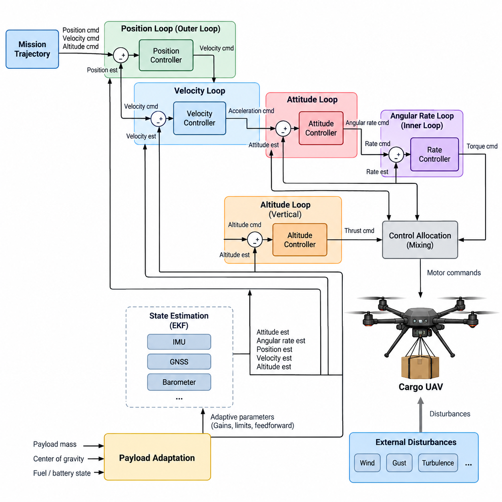
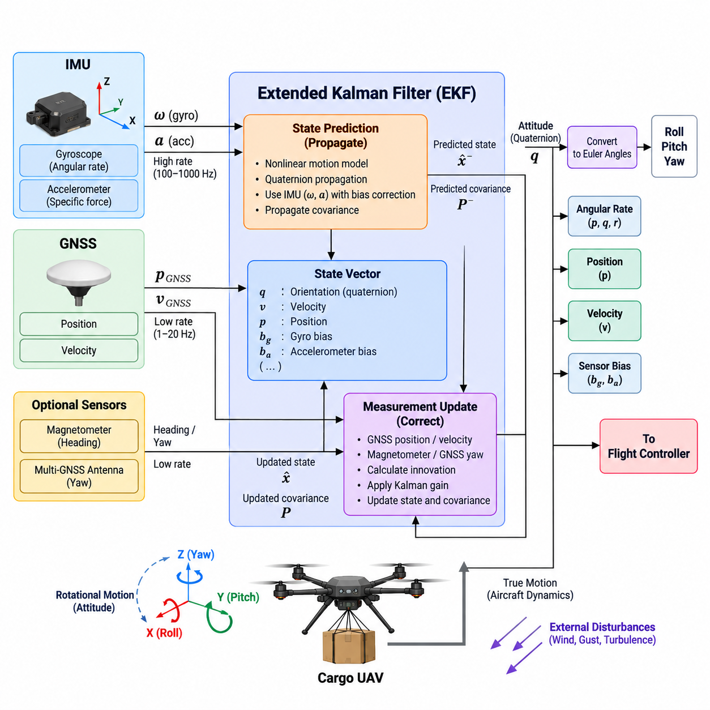
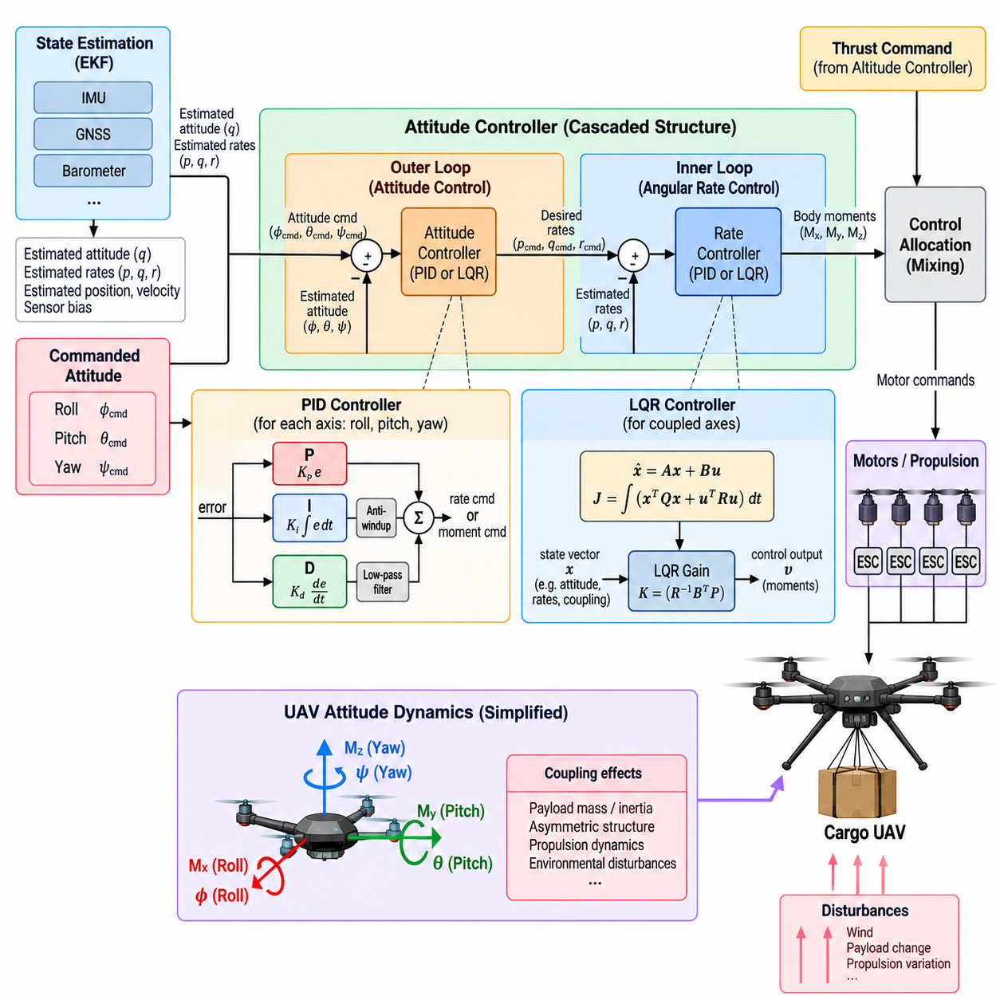
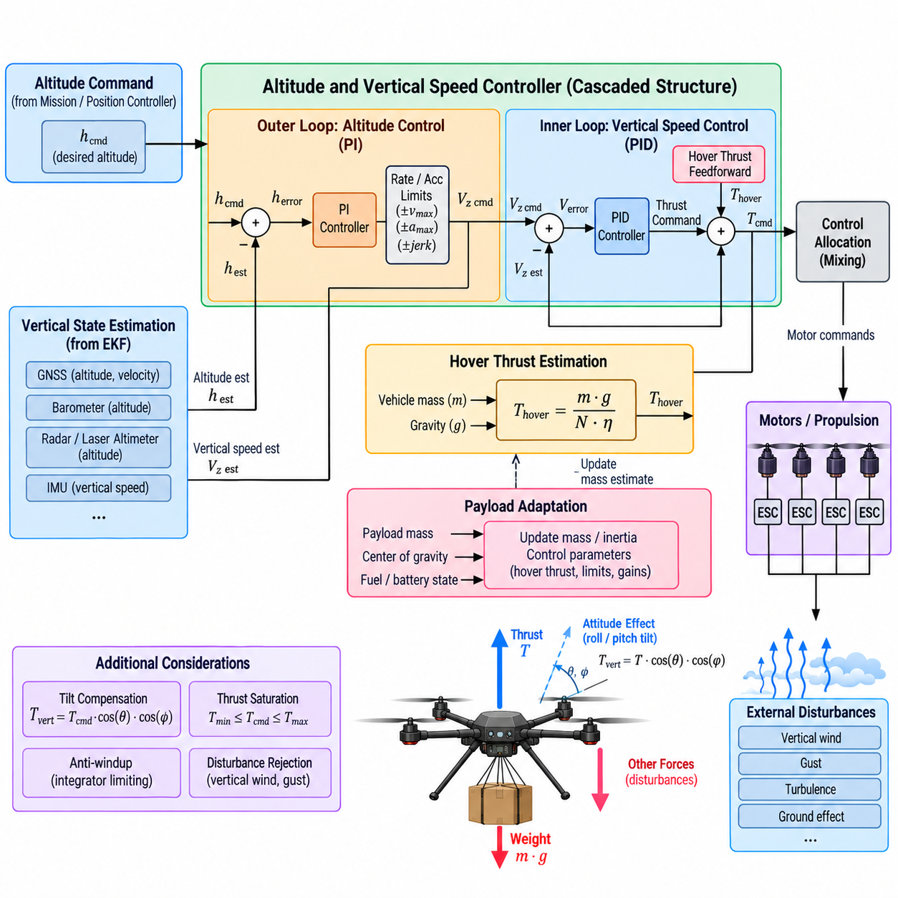
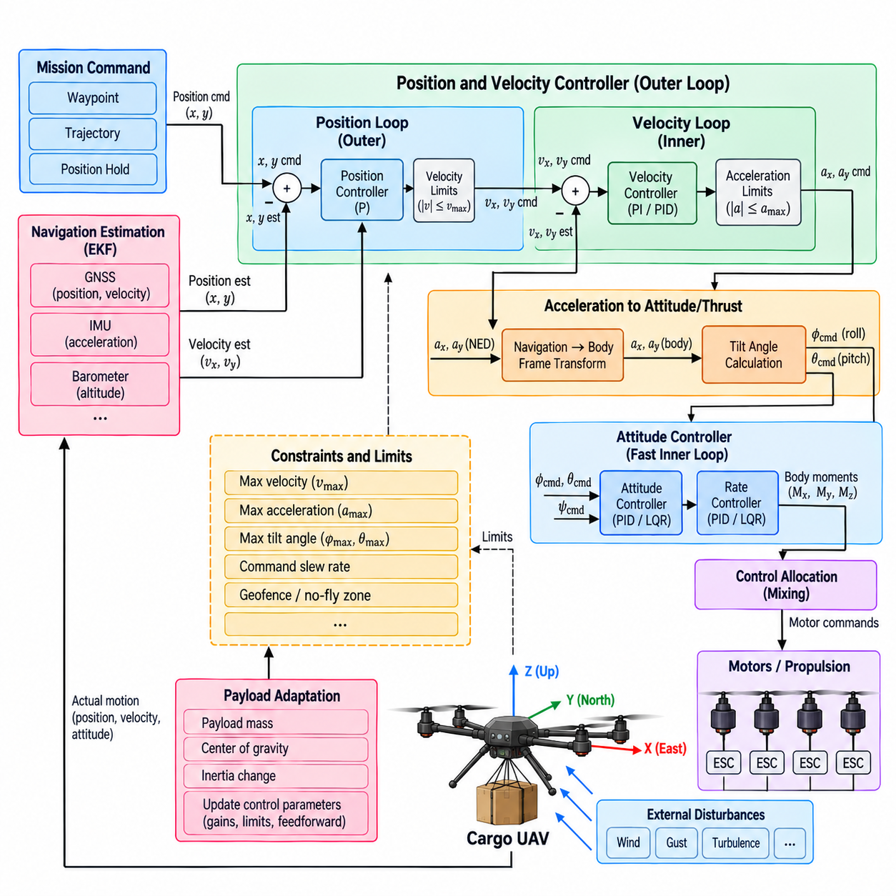
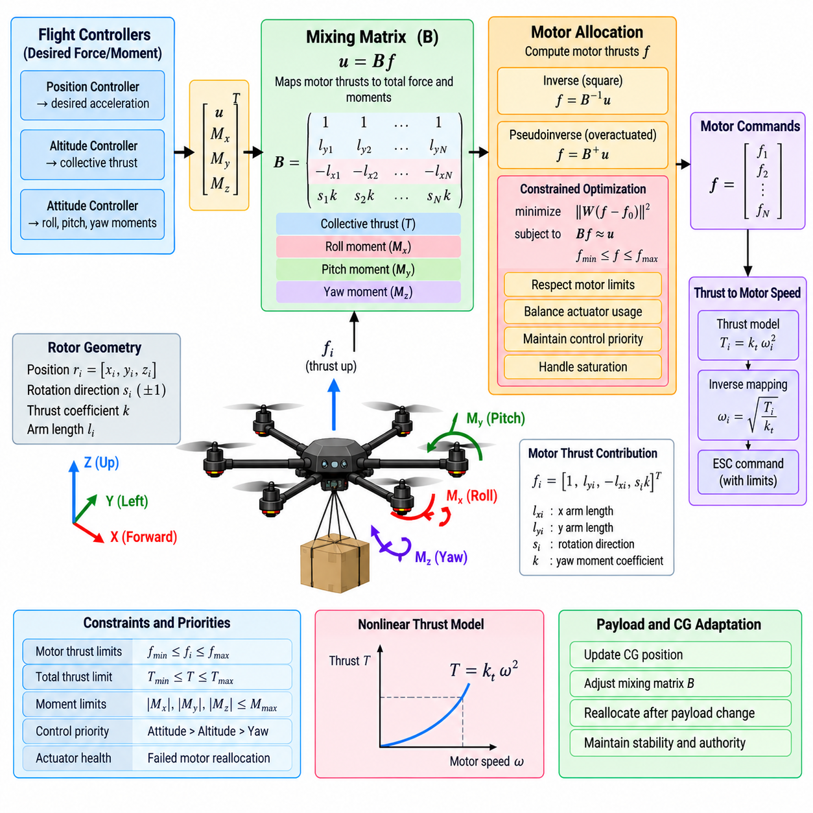
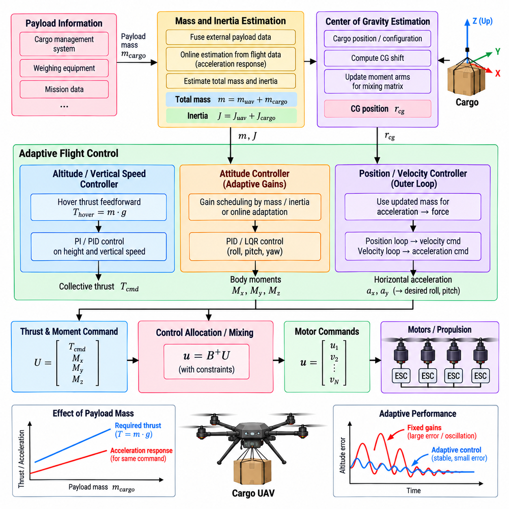
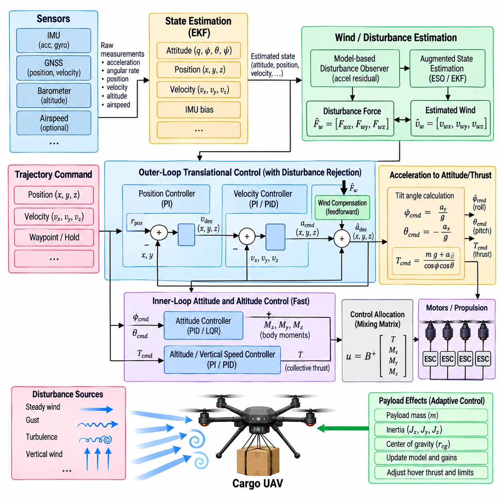
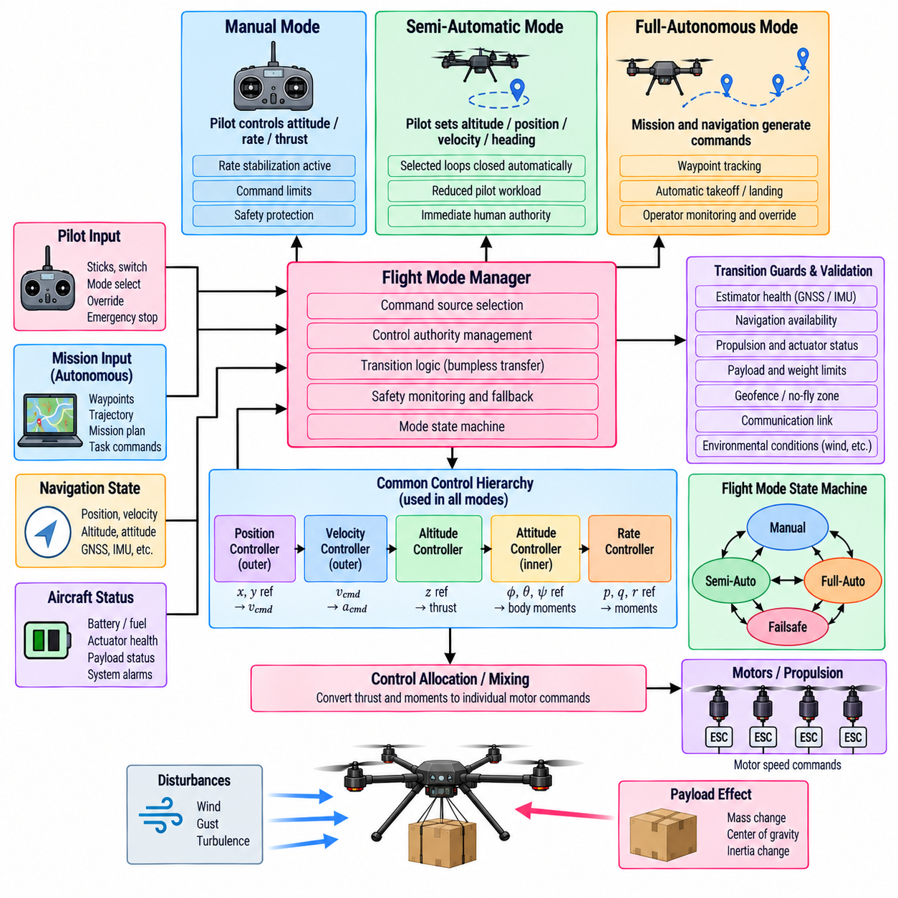
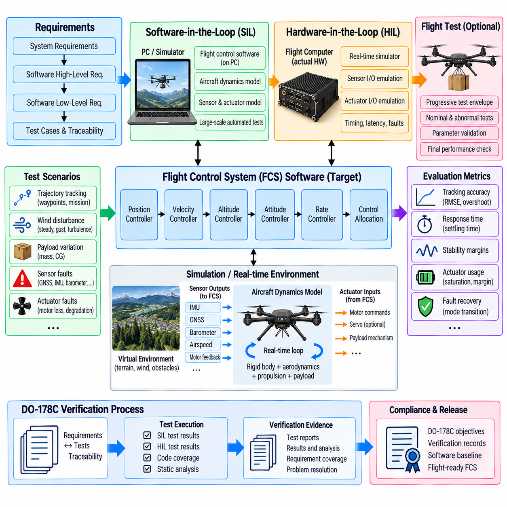

**Volume 23. Cargo UAV Autonomy and Flight AI**

# Chapter 03. Flight Control Software

## 03.01. FCS Architecture Attitude Altitude Position Loop

{width="7.268055555555556in" height="7.268055555555556in"}

The flight control system of a cargo UAV is organized as a hierarchy of closed-loop controllers that progressively transform mission-level motion commands into actuator-level control actions. At the core of this hierarchy are the position, altitude, and attitude loops, each operating at a different dynamic timescale. This layered architecture allows the aircraft to maintain stable flight while simultaneously following commanded trajectories and compensating for disturbances.

The position loop forms the outer portion of the flight control hierarchy and regulates the aircraft's horizontal location relative to a commanded reference. Position estimates derived from navigation sensors are compared with desired coordinates, producing position errors that are converted into velocity or acceleration commands. Because translational motion develops more slowly than rotational motion, this loop normally operates at a lower bandwidth than the inner attitude controller.

A velocity control stage is commonly placed between position regulation and attitude control. The controller compares desired horizontal velocity with estimated aircraft velocity and calculates the acceleration required to reduce the error. These acceleration commands are subsequently transformed into desired roll and pitch orientations. The result is a cascaded structure in which horizontal translation is achieved indirectly by controlling the orientation of the vehicle's thrust vector.

Altitude control follows a similar hierarchical principle but operates along the vertical axis. The commanded altitude is compared with the estimated altitude to generate a vertical position error, which is converted into a vertical velocity reference. A vertical-speed controller then determines the thrust adjustment required to climb, descend, or maintain altitude. Separating altitude and vertical-speed regulation improves transient behavior and prevents abrupt thrust changes caused by large altitude errors.

The attitude loop is the fastest major feedback layer and directly stabilizes roll, pitch, and yaw orientation. Desired attitude commands arriving from the outer control loops are compared with estimated orientation, and the resulting errors generate angular-rate references. An inner angular-rate controller then calculates the torque commands necessary to achieve those rates. This cascaded attitude-rate architecture provides rapid disturbance rejection while maintaining predictable aircraft response.

Reliable state information is essential because every feedback loop depends on estimates of the aircraft's actual motion. The flight control software therefore receives attitude, angular velocity, position, velocity, and altitude estimates from the navigation and estimation subsystem. The surrounding chapter structure explicitly separates attitude estimation using EKF, IMU, and GNSS fusion from controller design, establishing estimation and control as closely coupled but independently engineered functions. Volume_23_Cargo_UAV_Autonomy_an...

For a multirotor cargo UAV, the controller outputs cannot be sent directly to individual motors. Desired total thrust and body-axis moments must first pass through a control-allocation or mixing stage that distributes commands across the available propulsion units. The architecture therefore connects attitude, altitude, and position regulation to a multirotor mixing matrix and motor-allocation function, which is treated as a dedicated flight-control function in the volume structure. Volume_23_Cargo_UAV_Autonomy_an...

The different loops must be designed with clear bandwidth separation. Angular-rate regulation is generally the fastest layer, followed by attitude regulation, velocity control, and finally position control. This ordering prevents a slower outer loop from demanding motion that the inner dynamics cannot track. Each outer controller effectively assumes that the controller beneath it can execute its command sufficiently faster than the rate at which the outer reference changes.

Cargo UAVs introduce an additional challenge because aircraft dynamics can vary substantially with payload mass, center-of-gravity location, fuel or battery state, and cargo release. A controller tuned for an unloaded vehicle may therefore respond differently at maximum payload. The FCS architecture should expose vehicle-state and payload-related parameters so that gains, limits, feedforward terms, or control allocation can adapt without compromising the deterministic behavior of the stabilization loops.

Payload changes are especially important for altitude control because the thrust required for hover depends strongly on total vehicle mass. An inaccurate hover-thrust estimate forces the feedback controller to continuously compensate for a systematic error. Feedforward based on estimated mass can provide the nominal thrust requirement, while feedback corrects residual deviations. The chapter structure consequently treats cargo-weight load-change adaptive control as a distinct extension of the basic FCS architecture. Volume_23_Cargo_UAV_Autonomy_an...

External disturbances must also be considered throughout the cascaded loops. Wind can create position drift, velocity error, attitude perturbations, and additional propulsion demand simultaneously. Fast attitude regulation rejects short-duration rotational disturbances, while velocity and position controllers compensate for accumulated translational displacement. Disturbance estimation can further improve performance by providing feedforward compensation instead of requiring every disturbance to appear first as feedback error.

Command limiting is essential between control layers. Position errors should not produce unlimited velocity commands, velocity errors should not demand physically impossible tilt angles, and altitude errors should not generate excessive climb rates or thrust. Rate, acceleration, attitude, thrust, and actuator limits should therefore be enforced at defined interfaces. Anti-windup mechanisms are also required where integral control is used so that saturation does not produce excessive stored controller error.

The FCS must remain coordinated with the flight-mode manager. Manual, semi-automatic, and fully autonomous operation may generate references from different sources, but they should converge through controlled interfaces before reaching safety-critical stabilization functions. Mode transitions require reference synchronization, state initialization, and bumpless transfer so that changing command authority does not suddenly introduce attitude, altitude, velocity, or position discontinuities.

A practical software implementation separates estimation, reference generation, control-law computation, allocation, actuator output, monitoring, and safety supervision while maintaining deterministic timing between them. High-rate attitude and angular-rate functions require predictable execution latency, whereas position and mission-related commands can operate more slowly. This separation also supports independent verification of critical components and simplifies SIL and HIL testing later in the development process.

Fault handling must be integrated without making nominal control logic unnecessarily complex. Invalid navigation estimates, excessive attitude errors, actuator saturation, propulsion degradation, timing overruns, or inconsistent sensor states should be detected by monitoring functions and converted into predefined control responses. Depending on severity, the system may constrain the flight envelope, switch estimation sources, reduce mission authority, initiate return-to-home behavior, or transition toward an emergency landing strategy.

For heavy cargo aircraft, redundancy further affects the architecture because multiple flight-control computers, sensor channels, communication paths, or propulsion controllers may participate in the same control chain. The control-law interfaces should therefore use clearly defined timestamps, validity information, synchronization rules, and command ownership. This complements the volume's broader redundant-computing architecture and later safety functions rather than embedding redundancy policy directly inside every individual controller.

The resulting FCS can be understood as a deterministic conversion chain from desired aircraft motion to physical force and moment generation. Position error produces translational commands, altitude error produces vertical-motion commands, and these outer-loop objectives become attitude and thrust references. Fast attitude and rate loops stabilize the vehicle, while control allocation converts the requested forces and moments into propulsion commands that the aircraft can physically execute.

This hierarchical architecture provides the foundation for the remainder of the flight-control chapter. Attitude estimation supplies the state, PID or LQR methods implement attitude regulation, vertical controllers govern altitude, outer loops regulate position and velocity, and motor allocation converts control effort into actuator commands. Adaptive payload control, wind rejection, flight-mode management, and SIL/HIL verification then extend the same foundation toward a robust cargo-UAV flight-control system.

## 03.02. Attitude Estimation EKF IMU GNSS Fusion [w/Code]

{width="7.268055555555556in" height="7.268055555555556in"}

Attitude estimation provides the flight control system with a continuous representation of the aircraft's orientation and rotational motion. For a cargo UAV, this estimate must remain stable during hover, aggressive maneuvering, payload-induced disturbances, and changing environmental conditions. The estimator combines high-rate inertial measurements with lower-rate navigation observations so that the controller receives an accurate state without relying on any single sensor source.

The inertial measurement unit, or IMU, forms the high-frequency foundation of the attitude estimator. Three-axis gyroscopes measure angular velocity, while accelerometers measure specific force along the aircraft body axes. Gyroscope measurements can be integrated to propagate orientation rapidly between external observations, making them well suited to the fast dynamics required by attitude control. However, even small gyro biases accumulate over time and eventually produce significant orientation drift.

Accelerometers provide an additional reference because the gravity vector can be observed when non-gravitational acceleration is sufficiently limited. The estimator can compare the measured acceleration direction with the expected gravity direction to correct roll and pitch drift. During aggressive maneuvering, strong wind response, or cargo motion, however, accelerometer measurements contain substantial translational acceleration. The estimator must therefore distinguish useful gravity information from vehicle dynamics rather than treating every acceleration sample as a direct attitude reference.

GNSS measurements complement the IMU by providing globally referenced position and velocity observations. GNSS does not normally measure roll and pitch directly, but velocity information can constrain the navigation solution and indirectly improve attitude estimation through the coupled vehicle-state model. Systems equipped with multiple GNSS antennas may additionally derive heading from carrier-phase measurements, providing an absolute yaw reference that does not depend solely on magnetic sensing.

An Extended Kalman Filter, or EKF, provides a practical framework for combining these heterogeneous measurements. The EKF maintains a state vector describing quantities such as orientation, velocity, position, gyroscope bias, and accelerometer bias. Because UAV motion and attitude kinematics are nonlinear, the filter propagates the nonlinear state model while locally linearizing the system for covariance prediction and measurement updates. This allows uncertainty to be explicitly represented throughout the estimation process.

The prediction stage normally executes at the IMU sampling rate. Gyroscope measurements propagate aircraft orientation, while accelerometer measurements are transformed from the body coordinate frame into the navigation frame and used to propagate velocity and position. Bias estimates are incorporated into this process so that corrected inertial measurements drive the state equations. The covariance matrix is propagated simultaneously to represent how uncertainty increases between external measurement updates.

When a GNSS observation becomes available, the EKF performs a measurement update rather than replacing the inertial state directly. Predicted position or velocity is compared with the corresponding GNSS observation to calculate an innovation, or measurement residual. The Kalman gain determines how strongly this innovation should modify the current state according to the relative uncertainty assigned to the prediction and measurement. This probabilistic weighting is central to robust multi-sensor fusion.

Orientation can be represented internally using quaternions because they avoid the singularities associated with Euler-angle representations near certain orientations. Roll, pitch, and yaw remain useful for monitoring, command interfaces, and flight-control interpretation, but quaternion-based propagation provides a more robust mathematical representation for three-dimensional rotation. Careful quaternion normalization and coordinate-frame conventions are essential because small implementation inconsistencies can create large control errors.

Sensor bias estimation is particularly important for long-duration cargo missions. Gyroscope bias directly produces attitude drift, while accelerometer bias creates velocity and position errors after integration. Including these biases as EKF states allows the filter to estimate them gradually from measurement innovations. Bias dynamics are commonly modeled as slowly varying stochastic processes so that the estimator can track thermal changes, aging effects, and other gradual sensor variations during operation.

Timing accuracy is as important as measurement accuracy. IMU and GNSS observations arrive at different frequencies and may experience different transport, processing, and communication delays. Each observation should therefore be associated with a reliable measurement timestamp. If delayed GNSS data are fused as though they represented the current aircraft state, the EKF can introduce artificial innovations and degraded attitude estimates, particularly during high-speed or high-angular-rate maneuvers.

Coordinate-frame management must also remain consistent throughout the estimator. IMU measurements originate in the sensor frame and may require transformation into the aircraft body frame before being used. Navigation states are represented in a defined local or geographic reference frame, while GNSS measurements originate from an Earth-referenced coordinate system. Explicit transformations, axis conventions, rotation directions, and unit definitions prevent frame mismatches from propagating into the flight controller.

Measurement quality should be evaluated before every EKF correction. GNSS accuracy may degrade because of satellite geometry, multipath, interference, obstruction, or atmospheric effects, while IMU measurements may become saturated or temporarily corrupted. Innovation tests can compare measurement residuals against their predicted uncertainty and reject observations that are statistically inconsistent. This prevents a single abnormal measurement from immediately destabilizing the navigation and attitude solution.

GNSS loss must not cause immediate loss of attitude stabilization because the IMU continues to provide high-rate rotational information. During a GNSS outage, the EKF can continue inertial propagation while recognizing that position and velocity uncertainty will increase over time. Attitude may remain sufficiently accurate for stabilization for a longer interval, depending on available aiding sources and sensor quality, but navigation drift eventually requires additional observations or a transition to an appropriate degraded operating mode.

For heavy cargo UAVs, vibration management becomes especially significant because large propulsion systems can introduce structural vibration into inertial measurements. Rotor harmonics, motor imbalance, flexible structures, and payload coupling may contaminate accelerometer and gyroscope signals. Mechanical isolation, sensor placement, digital filtering, and estimator tuning must therefore be coordinated. Excessive filtering should also be avoided because additional phase delay can reduce the usefulness of the state estimate for fast feedback control.

Payload motion can create another estimation challenge. A suspended or partially flexible load can generate oscillatory accelerations and rotational disturbances that do not correspond directly to rigid-body aircraft attitude. The estimator should remain focused on the vehicle state required by the flight controller while avoiding excessive correction from transient load-induced accelerations. Appropriate process noise, measurement covariance, innovation gating, and vehicle modeling help maintain stable estimates under these conditions.

Estimator outputs should include more than nominal attitude values. The flight-control software benefits from angular rates, navigation states, bias estimates, covariance or confidence information, sensor-validity status, innovation statistics, and estimator-health indicators. These outputs allow control and safety functions to distinguish a physically unusual aircraft state from an unreliable state estimate and to select appropriate fallback behavior when estimation quality deteriorates.

The estimator should also support initialization and reinitialization as explicit operating phases. Before flight, the system must establish valid orientation, sensor biases, navigation references, and covariance values. Initialization while stationary is comparatively straightforward, whereas recovery after an in-flight estimator reset requires careful handling of current motion and available measurements. Flight-control authority should only transition to functions that depend on the estimator after the required state-validity criteria have been satisfied.

Verification requires evaluating both nominal accuracy and failure behavior. Recorded sensor data, software-in-the-loop simulation, hardware-in-the-loop testing, injected bias, GNSS dropout, delayed measurements, vibration, and abnormal innovations can be used to assess estimator robustness. The surrounding flight-control structure places EKF-based IMU/GNSS attitude estimation immediately before attitude, altitude, and position controller development, emphasizing its role as the state foundation for the complete control hierarchy. Volume_23_Cargo_UAV_Autonomy_an...

A well-designed EKF-based fusion architecture therefore creates a bridge between noisy physical sensors and deterministic flight-control functions. High-rate IMU propagation provides responsiveness, GNSS observations constrain accumulated inertial drift, and probabilistic fusion determines how each source influences the state according to its uncertainty. The resulting attitude and navigation estimate becomes the common state reference from which stable cargo-UAV flight control, autonomous navigation, safety monitoring, and fault management can operate.

## 03.03. Attitude Controller Design PID LQR [w/Code]

{width="7.268055555555556in" height="7.268055555555556in"}

Attitude control is the core stabilization function that converts commanded aircraft orientation into the body moments required to control roll, pitch, and yaw. In a cargo UAV, the controller must provide rapid and predictable response while accommodating large variations in mass, inertia, propulsion loading, and environmental disturbance. The flight-control structure therefore places attitude-controller design directly after state estimation and before altitude, position, and motor-allocation functions. Volume_23_Cargo_UAV_Autonomy_an...

A practical attitude-control architecture is usually implemented as a cascaded system. The outer attitude loop compares commanded orientation with the estimated aircraft attitude and generates desired angular rates. The inner rate loop compares these references with measured or estimated body rates and calculates roll, pitch, and yaw moment commands. Separating orientation regulation from angular-rate stabilization allows the inner loop to reject disturbances much faster than the outer loop changes aircraft orientation.

The attitude error must be represented carefully because aircraft orientation is inherently three-dimensional. Euler-angle errors can provide intuitive roll, pitch, and yaw quantities for moderate operating envelopes, while quaternion-based or rotation-based errors provide more consistent behavior for larger rotations. Regardless of representation, the controller must use coordinate conventions that exactly match the estimator, vehicle model, and control-allocation subsystem to prevent incorrect moment commands.

PID control provides a widely applicable baseline for attitude and rate regulation. The proportional term generates corrective action according to the current error, the integral term compensates for persistent bias or steady disturbance, and the derivative term introduces damping based on error variation. In UAV implementations, derivative behavior is often obtained from measured angular rate rather than directly differentiating noisy attitude errors, improving robustness against sensor noise.

Proportional gain strongly influences responsiveness. A low value produces slow attitude convergence, whereas excessive proportional gain can create oscillation or excite structural and propulsion dynamics. Integral gain removes persistent errors caused by aerodynamic asymmetry, center-of-gravity offset, propulsion mismatch, or sustained wind disturbance. However, excessive integral action can generate slow oscillations and large accumulated commands when actuators become saturated.

Derivative or rate feedback provides damping and is particularly important for fast rotational dynamics. Because gyroscope measurements contain vibration and high-frequency noise, rate signals may require filtering before they are used by the controller. Filter bandwidth must be selected carefully: insufficient filtering allows noise to reach actuator commands, while excessive filtering introduces phase delay and can reduce stability margins in the high-bandwidth inner control loop.

Anti-windup logic is essential whenever integral control operates near physical actuator limits. During aggressive maneuvers, heavy payload operation, strong winds, or propulsion degradation, requested moments may exceed available authority. If the integral state continues accumulating while the actuator is saturated, substantial overshoot can occur when control authority returns. Integral clamping, conditional integration, or back-calculation can constrain this behavior.

PID controllers can be tuned independently for roll, pitch, and yaw when axis coupling is limited, but heavy cargo UAVs may exhibit significant cross-axis interaction. Large structures, asymmetric payload placement, changing inertia, and propulsion configuration can cause a moment around one axis to influence motion around another. Gain scheduling or model-based compensation can therefore supplement conventional PID control when fixed independent gains no longer provide adequate performance across the complete flight envelope.

Linear Quadratic Regulator, or LQR, control provides a model-based alternative for coupled attitude dynamics. The aircraft dynamics are linearized around an operating condition and represented through state-space equations. LQR determines a feedback gain matrix by minimizing a quadratic cost function that penalizes state deviation and control effort. The resulting controller can coordinate multiple states and control channels simultaneously rather than treating each rotational axis as completely independent.

LQR behavior is shaped primarily through state-weighting and control-weighting matrices. Increasing the penalty on attitude or angular-rate error generally produces stronger corrective action, while increasing the penalty on control effort reduces actuator demand. These matrices therefore express the desired compromise among tracking accuracy, damping, actuator usage, and robustness. Their selection still requires engineering judgment even though the feedback gain itself is calculated mathematically.

The usefulness of LQR depends on the accuracy of the underlying model and the validity of the selected operating point. A controller derived for one payload mass, center-of-gravity position, airspeed, or propulsion condition may become less effective when the vehicle configuration changes substantially. Multiple linear models, gain scheduling, parameter adaptation, or robust design techniques can extend model-based control across a wider cargo-UAV operating envelope.

PID and LQR should not necessarily be viewed as mutually exclusive approaches. A flight-control architecture may use PID-based inner-rate control because of its simplicity, transparency, and mature tuning methodology while applying model-based techniques to selected coupled dynamics. Conversely, LQR can provide the principal state-feedback law while integral augmentation compensates for steady disturbances. Controller selection should follow vehicle dynamics, certification objectives, computational constraints, and verification requirements.

Feedforward control can improve either approach by commanding part of the required response before significant feedback error develops. Desired angular acceleration, estimated inertia, thrust state, or known aerodynamic effects can be used to calculate nominal moment demand. Feedback then corrects modeling errors and external disturbances. This division reduces the amount of corrective action demanded from the feedback controller and can improve tracking during rapid commanded maneuvers.

Control commands must pass through explicit limit management before reaching the allocation layer. Maximum angular rates, attitude angles, moments, and command slew rates should reflect structural limits, propulsion capability, payload constraints, and the approved flight envelope. When saturation occurs, the controller should preserve the most safety-critical stabilization objectives rather than allowing incompatible commands from multiple axes to compete without priority.

Cargo mass and center-of-gravity variation directly affect attitude-control authority because they modify rotational inertia and the relationship between actuator force and body acceleration. A heavily loaded vehicle may respond more slowly to the same commanded moment, while an asymmetric load can introduce trim requirements and axis coupling. The broader flight-control structure therefore extends basic attitude control with dedicated cargo-weight adaptive control and disturbance-rejection functions. Volume_23_Cargo_UAV_Autonomy_an...

Wind gusts and propulsion disturbances provide important tests of controller robustness. The inner rate loop should rapidly suppress unexpected rotational motion, while the attitude loop restores the commanded orientation after the transient disturbance. Performance can be evaluated using rise time, settling time, overshoot, steady-state error, disturbance-rejection time, control effort, and stability margins rather than relying on a single tracking-error metric.

Controller execution must also satisfy deterministic real-time requirements. The attitude and rate loops operate at higher frequencies than altitude and position control, so sampling period, computation time, sensor latency, and actuator-command delay directly affect achievable bandwidth. Timing jitter or delayed state estimates effectively introduce additional phase lag, meaning a controller that is stable in an ideal simulation may perform poorly when implemented on actual flight-control hardware.

Fault conditions require deliberate degradation behavior. If an actuator loses effectiveness, a motor reaches saturation, state-estimation quality deteriorates, or available control authority becomes insufficient, the controller should expose this condition to higher-level safety logic. Remaining authority may be redistributed through control allocation, attitude limits may be reduced, or the aircraft may transition into a contingency mode rather than continuing to demand an unattainable nominal response.

Verification should begin with mathematical analysis and simulation before progressing toward software-in-the-loop and hardware-in-the-loop testing. Parameter sweeps can examine payload mass, inertia, center-of-gravity shift, sensor noise, actuator delay, wind disturbance, and propulsion degradation. Step commands and disturbance injections reveal transient characteristics, while frequency-domain analysis can evaluate gain and phase margins for critical control loops.

Flight testing should expand the operating envelope progressively rather than immediately exercising maximum commands. Initial hover and low-rate maneuvers can confirm axis signs, gain behavior, actuator authority, and estimator-controller consistency. Subsequent tests can introduce larger attitude commands, payload variations, wind disturbances, and aggressive transitions while monitoring stability margins, saturation events, tracking error, structural response, and controller timing.

The final attitude-control design is therefore more than a choice between PID and LQR. It is an integrated stabilization function connecting state estimation, rotational dynamics, command shaping, actuator limits, payload variation, disturbance rejection, real-time execution, and control allocation. When these elements are engineered together, the attitude controller provides the stable inner foundation required by altitude control, position control, autonomous navigation, and safety-critical cargo-UAV operation.

## 03.04. Altitude and Vertical Speed Controller [w/Code]

{width="7.268055555555556in" height="7.268055555555556in"}

Altitude control regulates the vertical position of a cargo UAV while the vertical-speed controller governs the rate at which the aircraft climbs or descends. These functions form a cascaded control structure between higher-level trajectory commands and the propulsion system. Within the flight-control architecture, altitude and vertical-speed regulation follows attitude control and precedes position and velocity control, establishing a coordinated hierarchy for three-dimensional flight.

The outer altitude loop compares the commanded altitude with the estimated altitude and converts the resulting height error into a desired vertical-speed command. Rather than attempting to control thrust directly from altitude error, this intermediate reference allows vertical motion to be shaped gradually. Maximum climb and descent rates can be imposed at this stage so that large altitude errors do not produce commands outside the aircraft's safe operating envelope.

The inner vertical-speed loop compares the commanded climb or descent rate with the estimated vertical velocity. The resulting error is converted into a vertical acceleration or collective-thrust correction. Because this loop operates faster than the altitude loop, it can reject short-term vertical disturbances while the slower outer loop maintains long-term altitude accuracy. This bandwidth separation is fundamental to predictable cascaded-control behavior.

Vertical state estimation is therefore closely coupled with controller performance. Altitude information may originate from GNSS, barometric pressure sensors, radar or laser altimeters, and fused navigation estimates, while vertical velocity can be derived from inertial and navigation measurements. The controller should consume a consistent fused state rather than independently switching between raw sensors, because discontinuities in altitude or velocity estimates can immediately create unwanted thrust commands.

A basic altitude controller can use proportional or proportional-integral feedback to transform altitude error into vertical-speed demand. Proportional action determines how aggressively the aircraft closes the altitude difference, while integral action can eliminate persistent offsets. The command should normally pass through climb-rate, descent-rate, acceleration, and jerk constraints to produce smooth motion compatible with cargo stability, passenger-free structural limits, and propulsion capability.

The vertical-speed controller commonly applies proportional-integral-derivative or equivalent feedback around vertical velocity. Proportional action responds to instantaneous speed error, integral action compensates for persistent thrust mismatch, and acceleration-related damping can improve transient behavior. For cargo UAVs, the controller must avoid excessive vertical oscillation because repeated acceleration can increase structural loads, disturb suspended cargo, and reduce propulsion efficiency.

Hover-thrust estimation is especially important because gravity produces a continuous force that must be balanced before feedback corrections are considered. If the nominal thrust required to support the vehicle is known, it can be applied as a feedforward term and the feedback controller only needs to correct deviations. Without this compensation, the integral controller may be forced to generate most of the steady hover command, producing slower convergence and greater sensitivity to saturation.

Cargo mass directly changes the required hover thrust. A vehicle carrying a heavy payload requires substantially greater collective propulsion than the same aircraft operating unloaded. The flight-control software should therefore update the nominal thrust model when reliable payload or vehicle-mass information is available. This relationship connects altitude regulation with the chapter's dedicated load-change adaptive-control function for changing cargo weight. Volume_23_Cargo_UAV_Autonomy_an...

Center-of-gravity variation can also affect vertical control indirectly. Although altitude regulation primarily determines collective thrust, an offset center of gravity may require differential actuator forces to maintain attitude. Some propulsion capacity is consequently consumed by attitude stabilization rather than pure vertical force generation. The altitude controller and control-allocation subsystem must respect the remaining thrust authority instead of assuming that maximum theoretical propulsion is always available for climbing.

Vehicle attitude changes the relationship between total thrust and vertical force. During level hover, most collective thrust acts against gravity, whereas during significant roll or pitch angles part of the thrust vector produces horizontal acceleration. Vertical control may therefore require tilt compensation so that commanded collective thrust accounts for the reduced vertical component. Such compensation must remain bounded because aggressive tilt combined with high altitude demand can otherwise drive propulsion into saturation.

Thrust saturation represents one of the most important nonlinear constraints in vertical control. Maximum thrust limits climbing capability, while minimum usable thrust and vehicle dynamics constrain rapid descent. When commanded acceleration exceeds available propulsion authority, integral terms should not continue accumulating error indefinitely. Anti-windup logic, command limiting, and saturation feedback allow the controller to recover smoothly after normal control authority becomes available again.

Descent behavior requires particular attention because multirotor aerodynamics may become unfavorable at high downward velocity. The controller should therefore apply validated descent-rate and acceleration limits rather than treating upward and downward motion as perfectly symmetric. Heavy cargo further changes safe descent characteristics because increased mass alters momentum, required recovery thrust, and the vertical distance necessary to arrest a descent before landing or obstacle clearance is compromised.

Wind disturbances create vertical as well as horizontal control errors. Updrafts and downdrafts can change climb rate even when collective thrust remains constant, while turbulent airflow around large structures may generate rapidly varying vertical forces. The inner vertical-speed loop should suppress these disturbances without reacting excessively to measurement noise. Disturbance estimates or acceleration feedforward can further improve response when reliable information is available.

Command shaping becomes especially important for cargo missions. Sudden changes from hover to maximum climb can produce large acceleration and jerk, causing cargo movement and structural loading even when the aircraft remains controllable. Vertical commands can therefore be passed through rate and acceleration limiters or trajectory generators. Smooth references reduce mechanical stress and improve tracking because the controller is not repeatedly asked to reproduce physically unrealistic step changes.

Takeoff introduces a special vertical-control transition because the vehicle moves from ground support to aerodynamic support. Before liftoff, increasing thrust may not produce corresponding vertical acceleration because the landing gear still carries part of the weight. The controller should avoid interpreting this condition as an ordinary altitude-tracking failure. Controlled thrust ramping, liftoff detection, estimator validity, and transition logic are needed before normal airborne altitude regulation assumes full authority.

Landing presents the opposite transition. The altitude controller must progressively reduce height while maintaining an appropriate descent profile, but near the surface the control objective shifts toward touchdown management. Radar or laser altitude measurements may become more important than global altitude references. Touchdown detection should prevent the controller from increasing thrust merely because the commanded altitude can no longer be reached after the landing gear has established ground contact.

Altitude-reference management must also distinguish among absolute altitude, altitude above ground level, and altitude relative to a mission reference. GNSS-derived height, barometric altitude, terrain-relative altitude, and local navigation-frame height do not represent identical quantities. The flight-control interface must define which reference is being controlled and ensure that reference transitions do not introduce sudden altitude errors or unintended climb and descent commands.

The controller should monitor its own operating condition through variables such as altitude error, vertical-speed error, commanded acceleration, thrust demand, saturation state, integral state, and available thrust margin. These values support flight monitoring and fault detection. Persistent altitude error combined with maximum thrust, for example, can indicate excessive payload, propulsion degradation, strong downdraft, or an incorrect vehicle-mass estimate rather than poor controller tuning alone.

Failure handling should preserve basic vertical stability whenever possible. Degraded altitude sensors, GNSS loss, propulsion faults, or unreliable vertical-velocity estimates may require switching to alternative state sources or restricting autonomous functions. The controller should expose validity and authority information to the flight-mode and safety systems so that they can select hover, controlled descent, return-to-home, or emergency-landing behavior according to the remaining capability.

Verification should evaluate the complete vertical-control chain rather than only nominal altitude tracking. Simulation and SIL/HIL testing can introduce payload variation, thrust-model error, sensor noise, delayed measurements, wind disturbances, actuator saturation, and propulsion degradation. Step and ramp altitude commands reveal transient response, while long hover tests expose steady-state drift, integral behavior, thermal effects, and sensitivity to changes in vehicle mass.

The altitude and vertical-speed controller ultimately acts as the vertical-motion bridge between mission-level trajectory objectives and physical propulsion. The altitude loop determines how vertical position error should become climb or descent motion, the vertical-speed loop converts that motion into acceleration and thrust demand, and feedforward compensation balances predictable forces such as gravity. Together with attitude stabilization and later position control, this structure provides the controlled three-dimensional motion required for reliable cargo-UAV operations.

## 03.05. Position and Velocity Controller Outer Loop [w/Code]

{width="7.268055555555556in" height="7.268055555555556in"}

The position and velocity controller forms the outer translational layer of the cargo UAV flight-control hierarchy. Its purpose is to convert desired horizontal position or trajectory references into motion commands that the faster attitude controller can execute. Within the chapter structure, this function follows attitude and altitude control and precedes motor allocation, adaptive payload control, wind rejection, and flight-mode management, defining its role as the outer-loop bridge between navigation and stabilization.

The position loop compares the commanded horizontal position with the estimated vehicle position in a defined navigation frame. The resulting position error represents how far the aircraft is displaced from its target in each horizontal direction. Rather than converting this error directly into motor commands, the controller generates a desired velocity reference. This separation allows position convergence to be shaped independently from the fast rotational dynamics of the aircraft.

The velocity loop operates inside the position loop and compares the desired velocity with the estimated horizontal velocity. Velocity error is transformed into a commanded acceleration or equivalent horizontal force demand. The controller therefore creates a sequence from position error to velocity reference, from velocity error to acceleration demand, and finally from acceleration demand to the attitude and thrust commands required to move the vehicle.

For a multirotor aircraft, horizontal acceleration is generated primarily by tilting the total thrust vector. A forward acceleration command requires an appropriate pitch attitude, while lateral acceleration requires roll. The outer-loop controller must therefore translate desired acceleration expressed in the navigation frame into a desired thrust-vector orientation. The attitude controller then tracks this orientation using the faster roll, pitch, and angular-rate stabilization loops.

This architecture depends on clear bandwidth separation. The attitude and angular-rate loops must respond significantly faster than the velocity loop, while the position loop should normally be slower than velocity regulation. If the position controller is tuned too aggressively, it can command velocity or acceleration changes faster than the inner loops can reproduce them. The result may be overshoot, oscillation, actuator saturation, or poor trajectory tracking.

Position feedback normally originates from the navigation estimator rather than directly from a single sensor. GNSS may provide globally referenced position and velocity, while inertial measurements support high-rate propagation between GNSS updates. Other navigation sources can contribute when available. The outer controller should receive a continuous, time-consistent state estimate because sudden position jumps or velocity discontinuities can generate large and unnecessary acceleration commands.

A proportional position controller provides a simple relationship between position error and desired velocity. Larger displacement produces a larger velocity command, while the commanded speed decreases naturally as the aircraft approaches its target. Practical implementations limit this reference according to mission speed, flight envelope, obstacle environment, and vehicle capability. Additional shaping can prevent abrupt changes when waypoints or trajectory segments are switched.

The velocity controller can use proportional-integral or PID-like feedback to generate acceleration demand. Proportional action responds immediately to velocity error, while integral action compensates for persistent effects such as wind, propulsion asymmetry, or small modeling errors. Derivative or acceleration-related feedback may provide additional damping, but noisy velocity estimates require careful filtering so that high-frequency measurement noise is not converted into rapidly varying attitude commands.

Acceleration commands must be constrained before they are passed to the attitude-control layer. Excessive horizontal acceleration requires large tilt angles and consumes thrust that would otherwise support vehicle weight. Maximum acceleration, tilt angle, velocity, and command slew rate should therefore be coordinated. These limits become especially important for heavy cargo UAVs because structural loading, payload motion, propulsion margin, and stopping distance can impose tighter constraints than those of smaller vehicles.

The coupling between horizontal and vertical control cannot be ignored. When the aircraft tilts to accelerate horizontally, only part of its total thrust remains available to oppose gravity. The altitude controller may request additional collective thrust to preserve height, but propulsion capability is finite. The flight-control architecture must therefore coordinate horizontal acceleration demands with vertical thrust margin so that aggressive position tracking does not unintentionally produce altitude loss.

Cargo mass strongly influences translational response. A heavier aircraft requires greater force to achieve the same acceleration, while payload-dependent inertia and propulsion loading can change transient behavior. If the controller assumes an incorrect mass, acceleration response may be weaker or stronger than expected. Feedforward based on estimated vehicle mass can improve force prediction, while feedback compensates for residual uncertainty and the dedicated load-adaptive functions can address larger configuration changes.

Center-of-gravity displacement and cargo motion can further affect position tracking because the attitude controller may require additional control effort to maintain the thrust-vector orientation requested by the outer loop. Suspended cargo can also introduce pendulum-like motion when aggressive acceleration commands are applied. Position trajectories should therefore be shaped with acceleration and jerk limits that reduce excitation of payload dynamics while preserving acceptable mission performance.

Wind is one of the most significant disturbances affecting horizontal position and velocity control. A steady wind may require continuous tilt and thrust to maintain a fixed position, while gusts can create rapid velocity deviations. Integral feedback can compensate for persistent disturbances, but dedicated wind estimation can provide feedforward information that reduces tracking error. The surrounding flight-control structure consequently treats wind-disturbance rejection and estimation as a dedicated function following the basic position controller.

Waypoint flight illustrates the interaction between navigation and the outer-loop controller. A mission manager or trajectory generator defines the desired path, while the position controller determines the local motion required to follow it. Simply commanding each waypoint as an independent position step can produce abrupt velocity changes. Smooth trajectory references containing position, velocity, and potentially acceleration allow the controller to anticipate motion and reduce unnecessary transient error.

Feedforward terms are particularly valuable when the trajectory generator already provides desired velocity or acceleration. Instead of waiting for position error to develop, the controller can apply the expected motion directly and use feedback to correct deviations. This improves tracking during curved paths, coordinated turns, acceleration phases, and deceleration before arrival. Feedback remains essential because wind, mass uncertainty, and propulsion variation prevent purely model-based execution from being sufficiently accurate.

Stopping behavior must be considered as part of position-control design. A heavy cargo UAV traveling at substantial speed cannot instantaneously stop when it reaches a target coordinate. The controller or trajectory generator must account for available deceleration, tilt limits, thrust margin, payload constraints, and environmental conditions. Braking should begin sufficiently early to prevent waypoint overshoot while avoiding aggressive commands that could destabilize cargo or saturate propulsion.

Position-hold mode places a different demand on the same controller. Instead of following a continuously changing trajectory, the aircraft attempts to maintain a fixed horizontal location despite wind and estimation noise. Excessive controller gain can cause constant small attitude corrections and actuator activity, while insufficient gain permits drift. Appropriate deadbands, filtering, integral limits, and disturbance compensation can balance position accuracy against unnecessary control activity.

Command saturation requires coordinated anti-windup behavior. When velocity or acceleration demands exceed permitted limits, the position and velocity integrators should not continue accumulating error as if the requested motion remained achievable. Saturation status can be propagated between control layers so that outer loops understand when inner-loop authority is constrained. This prevents large stored errors from producing overshoot after the vehicle returns to an achievable operating region.

Fault conditions may require degradation from position control to simpler stabilization modes. GNSS loss, inconsistent navigation estimates, excessive position uncertainty, or degraded propulsion can make precise trajectory tracking unreliable. The controller should expose state validity and control-authority information to the flight-mode manager so that the aircraft can transition to velocity control, attitude stabilization, return-to-home, controlled landing, or another predefined contingency behavior.

Real-time implementation requires deterministic exchange of state estimates and commands among navigation, position control, velocity control, attitude control, and actuator functions. Timestamp consistency is particularly important because delayed position or velocity measurements represent an earlier aircraft state. Latency and timing jitter can reduce phase margin and tracking quality, especially when outer-loop bandwidth is increased for demanding trajectory-following applications.

Verification should evaluate both trajectory tracking and disturbance response over the expected cargo-UAV operating envelope. Simulation and SIL/HIL testing can vary payload mass, center of gravity, wind, navigation noise, sensor latency, actuator limits, and propulsion capability. Tests should examine position error, velocity error, acceleration demand, tilt command, settling behavior, saturation frequency, stopping distance, and recovery after disturbances or navigation degradation.

The position and velocity outer loop ultimately transforms geometric mission intent into dynamically achievable aircraft motion. Position error determines the desired translational progression, velocity regulation determines the required acceleration, and acceleration is converted into thrust-vector orientation for the inner attitude controller. Integrated with altitude control, payload adaptation, wind rejection, and control allocation, this outer-loop architecture enables a cargo UAV to follow trajectories accurately while respecting its physical and safety constraints.

## 03.06. Multirotor Mixing Matrix and Motor Allocation [w/Code]

{width="7.268055555555556in" height="7.268055555555556in"}

The multirotor mixing matrix and motor-allocation function form the final transformation stage between the flight-control laws and the physical propulsion system. Attitude, altitude, and position controllers generate desired forces and body moments, but individual motors cannot directly interpret these abstract commands. The allocation layer converts collective thrust and roll, pitch, and yaw moment demands into coordinated commands for each propulsion unit.

For a conventional multirotor, each rotor contributes an upward or downward thrust component according to the vehicle coordinate convention, while its position relative to the center of gravity creates roll and pitch moments. Rotor aerodynamic drag also produces a reaction torque around the yaw axis. The total aircraft force and moment therefore result from the combined contribution of all rotors rather than from any single propulsion unit operating independently.

The mixing matrix mathematically describes this relationship. Each column represents the contribution of one motor or rotor to collective thrust and the three rotational moments, while each row represents a controlled force or moment axis. Motor geometry, arm length, rotor orientation, rotation direction, and thrust characteristics determine the matrix coefficients. The resulting model provides a compact mapping between actuator forces and the control objectives requested by the flight controller.

For a simple symmetric configuration, the relationship can often be inverted directly to determine individual motor commands from desired total thrust and moments. However, cargo UAVs may use six, eight, or more propulsion units to obtain greater lift capacity and redundancy. Such configurations can become overactuated, meaning that multiple combinations of rotor forces can generate approximately the same requested aircraft force and moment.

In an overactuated system, motor allocation becomes an optimization problem rather than a fixed mixing operation. A pseudoinverse can provide a nominal solution, while constrained optimization can select an actuator combination that satisfies thrust and moment commands while respecting motor limits. Additional objectives may minimize total actuator effort, balance motor loading, preserve control authority, or reduce thermal and electrical stress across the propulsion system.

The allocation model must reflect actual propulsion geometry accurately. Rotor position should be defined relative to the aircraft center of gravity, and thrust direction should account for any rotor cant or nonvertical installation. Heavy-lift cargo UAVs may employ distributed propulsion arrangements that are less symmetric than small quadrotors. In these systems, simplified fixed coefficients can produce systematic force and moment errors if the physical geometry is not represented correctly.

Motor commands also depend on the relationship between requested rotor thrust and actuator input. Rotor thrust is generally nonlinear with respect to rotational speed, while electronic speed controller commands may have additional nonlinearities, dead zones, and dynamic delays. A propulsion model or calibrated thrust mapping can convert desired rotor force into motor-speed or ESC commands so that the mixing layer operates in physically meaningful force units rather than assuming a linear command-to-thrust relationship.

Collective thrust and rotational moments compete for the same actuator authority. When the aircraft is near maximum payload and already using most available thrust to support its weight, only limited propulsion margin remains for roll, pitch, yaw, or vertical acceleration. The allocator must recognize these coupled constraints. Simply clipping individual motor commands after mixing can distort the requested force and moment combination and may degrade attitude stability.

Control prioritization is therefore important during saturation. Maintaining roll and pitch stability may be more critical than perfectly satisfying yaw or collective-thrust commands under some operating conditions. The allocation strategy can assign priorities or weights to different control objectives so that limited actuator authority is used for the most safety-critical functions first. The exact priority policy must remain consistent with vehicle dynamics, flight phase, and safety requirements.

Yaw control is particularly dependent on propulsion configuration. In a conventional multirotor, yaw moment is commonly produced by creating an imbalance between clockwise and counterclockwise rotor reaction torques. Generating yaw therefore changes the distribution of motor loading even when total thrust remains approximately constant. If motors approach saturation, available yaw authority can decrease significantly, requiring the controller to limit yaw-rate commands or accept temporary yaw-tracking error.

Center-of-gravity changes caused by cargo loading modify the effective moment arms between propulsion units and the vehicle mass center. A mixing matrix constructed around a fixed nominal center of gravity may therefore become less accurate when heavy cargo is positioned asymmetrically. The allocator can incorporate updated center-of-gravity information or trim corrections so that the required moments are generated without forcing the attitude controller to continuously compensate for allocation bias.

Payload variation also changes the propulsion operating point. An unloaded aircraft may hover with substantial thrust reserve, whereas a fully loaded vehicle may operate much closer to continuous motor limits. Allocation should therefore consider not only instantaneous command limits but also sustained propulsion capability. Continuous operation near maximum motor, inverter, battery, or thermal limits can reduce reliability even when individual commands remain within short-duration allowable values.

Rate limiting can prevent unrealistic actuator transitions. Flight controllers may generate rapid changes in requested moments during disturbances, but motors and propellers require finite time to accelerate or decelerate. If the allocator assumes instantaneous actuator response, the realized aircraft moment may differ substantially from the commanded value. Incorporating actuator dynamics, command slew limits, or achievable-rate constraints improves consistency between the control model and physical propulsion response.

Motor failure creates a more demanding allocation problem. If one propulsion unit becomes unavailable or loses effectiveness, the nominal mixing matrix no longer represents the actual system. A fault-aware allocator can remove or derate the failed actuator and recompute the achievable force and moment distribution using the remaining motors. Whether full attitude and altitude control can be maintained depends on propulsion redundancy, geometry, available thrust reserve, and the specific failed actuator.

Partial actuator degradation should also be represented because failures are not always binary. A motor, propeller, ESC, or power channel may produce less thrust than commanded while continuing to operate. Effectiveness coefficients can represent this reduced capability within the allocation model. Health-monitoring information can then modify the allocation matrix or actuator bounds, allowing remaining propulsion units to compensate within their available margins.

Allocation residuals provide valuable diagnostic information. After computing the motor commands, the system can estimate the force and moments that are actually achievable and compare them with the requested control vector. A large residual indicates that the requested command cannot be fully realized because of saturation, failure, geometry, or another constraint. This information should be returned to the upstream controllers and safety functions rather than hidden inside the allocation layer.

Anti-windup behavior benefits from this feedback. If the attitude or altitude controller requests control effort that the motor allocator cannot produce, integrators should not continue accumulating error as though the command were being executed. Achieved-force estimates, saturation flags, or allocation residuals can be propagated back through the control architecture. This creates coordinated saturation management across the controller and actuator layers.

Power-system constraints are especially relevant for heavy cargo UAVs. Multiple motors may individually remain within their limits while their combined electrical demand exceeds battery, generator, inverter, or distribution-system capability. Motor allocation can therefore include total power or current constraints in addition to individual actuator limits. Such coordination prevents a valid aerodynamic command from becoming an infeasible electrical command.

Real-time execution places strict requirements on the allocation algorithm. A fixed mixing matrix is computationally inexpensive, while constrained optimization provides greater flexibility but must still complete within the deterministic control period. Solver execution time, convergence behavior, numerical conditioning, and fallback logic must be evaluated under worst-case conditions. A sophisticated allocator is unsuitable if its timing behavior cannot be guaranteed on the flight-control computer.

Numerical robustness is also important when propulsion geometry produces poorly conditioned allocation matrices. Small command or modeling errors can otherwise generate disproportionately large actuator changes. Matrix scaling, condition monitoring, regularization, actuator weighting, and carefully designed geometry can improve robustness. The software should detect invalid configurations rather than issuing uncontrolled commands when the allocation model becomes singular or inconsistent.

Verification should test the complete path from commanded force and moments to realized propulsion response. Simulation and SIL/HIL environments can exercise nominal mixing, saturation, asymmetric loading, center-of-gravity shifts, motor nonlinearities, command delays, partial degradation, and complete motor failures. Tests should examine allocation error, remaining control authority, actuator utilization, timing performance, and transitions between nominal and degraded configurations.

The mixing and motor-allocation layer ultimately converts the mathematical objectives of the flight controller into physically realizable propulsion actions. Its design must combine vehicle geometry, actuator models, saturation handling, control priorities, payload effects, power constraints, and fault tolerance. Within the chapter structure, it provides the actuator-level foundation upon which subsequent load-adaptive control, wind-disturbance rejection, flight-mode management, and FCS verification functions can operate. Volume_23_Cargo_UAV_Autonomy_an...

## 03.07. Load Change Adaptive Control Cargo Weight [w/Code]

{width="7.268055555555556in" height="7.268055555555556in"}

Load-change adaptive control allows a cargo UAV to maintain predictable flight behavior as payload weight changes between missions or during operation. Cargo mass directly affects total vehicle weight, hover thrust, translational acceleration, rotational response, propulsion margin, and energy consumption. A controller designed only for one nominal loading condition may therefore become sluggish, aggressive, inefficient, or saturated when the aircraft operates across a wide payload range.

The fundamental effect of payload variation appears in the force relationship between vehicle mass and acceleration. For the same commanded acceleration, a heavier aircraft requires proportionally greater force. Vertical control is particularly sensitive because propulsion must continuously balance gravity before producing additional climb acceleration. If the controller assumes an incorrect mass, its feedforward thrust prediction becomes inaccurate and feedback loops must compensate for the resulting systematic error.

Payload variation can also modify rotational dynamics. Cargo contributes to the aircraft's moments of inertia according to both its mass and its location relative to the vehicle center of gravity. A heavy load concentrated near the center may mainly change total mass, whereas cargo positioned farther from the center can significantly increase roll, pitch, or yaw inertia. Consequently, identical torque commands can produce different angular accelerations under different loading configurations.

Center-of-gravity displacement introduces another important control effect. An asymmetric cargo arrangement can shift the mass center away from the nominal geometric reference used by the propulsion model. The aircraft may then require continuous trim moments simply to maintain level flight. If this change is ignored, attitude-controller integrators must compensate continuously, reducing available control margin and potentially producing uneven motor loading or premature actuator saturation.

Adaptive control begins with obtaining a useful estimate of the current vehicle configuration. Payload weight may be provided by a cargo-management system, measured through loading equipment, inferred from propulsion and acceleration response, or estimated online from flight data. The control system should distinguish between trusted externally supplied mass information and dynamically estimated values because their uncertainty, update rate, and potential failure modes are different.

A mass estimate can be incorporated directly into vertical-thrust feedforward. The expected force required to balance gravity is approximately proportional to total aircraft mass, so updating the mass model immediately improves hover-thrust prediction. The altitude and vertical-speed controllers can then operate primarily on residual errors instead of relying on integral action to discover the new hover operating point after every payload change.

Horizontal control can similarly use estimated mass when converting desired acceleration into force demand. The position and velocity controllers determine the translational acceleration required to follow a trajectory, while the adaptive model calculates the approximate force necessary for the current vehicle weight. Feedback remains responsible for correcting modeling errors, aerodynamic effects, and disturbances, but improved feedforward reduces transient tracking error when payload varies significantly.

Attitude-control adaptation requires information about inertia rather than mass alone. If the cargo configuration is known, approximate inertia parameters can be calculated from payload geometry and mounting position. Controller gains or model-based terms can then be scheduled according to the expected rotational dynamics. When detailed cargo geometry is unavailable, conservative gain scheduling based on payload classes may provide a simpler and more verifiable alternative.

Gain scheduling is one practical form of adaptive control for cargo UAVs. Controller parameters can be defined for several validated loading regions, such as light, medium, and heavy configurations, and interpolated according to measured or estimated mass. This approach preserves much of the transparency of conventional fixed-gain control while extending acceptable performance across a wider operating envelope without requiring unrestricted online modification of safety-critical control laws.

Online parameter estimation provides a more dynamic alternative. The system can compare commanded force or moment with measured acceleration and infer effective mass, inertia, or actuator effectiveness. Recursive estimation techniques can gradually update these parameters during flight. However, aircraft acceleration is also affected by wind, aerodynamic forces, sensor noise, and propulsion uncertainty, so adaptation must avoid interpreting temporary disturbances as permanent changes in vehicle properties.

Adaptation rate therefore requires careful limitation. A payload attached to the aircraft usually changes slowly or only at known mission events, while wind and turbulence can change rapidly. If mass estimates are allowed to respond too quickly, the estimator may incorrectly absorb environmental disturbances into the vehicle model. Filtering, bounded parameter ranges, persistence checks, and confidence measures can separate genuine load changes from transient external forces.

Cargo pickup or release creates a more abrupt operating transition. When a payload is attached, released, or transferred, total mass and possibly center of gravity can change within a short period. If the event is known in advance, the flight-control system can coordinate controller parameters, thrust feedforward, motor allocation, and trajectory limits with the cargo-management system. Such event-based adaptation can respond more reliably than waiting for feedback errors to reveal the configuration change.

A sudden cargo release requires particular attention because the thrust level appropriate for the loaded aircraft may be excessive immediately after mass decreases. Without rapid compensation, the aircraft can accelerate upward and produce a significant altitude transient. Updating the mass-dependent feedforward term at the release event, while applying appropriate command smoothing, allows the vertical controller to transition toward the new equilibrium without generating an unnecessarily large response.

Payload increase has the opposite effect. If cargo is acquired while the propulsion command remains unchanged, vertical acceleration may decrease or the aircraft may begin descending. The controller must increase collective thrust while preserving attitude authority and avoiding abrupt structural loading. Before accepting a payload, the mission system should also confirm that the resulting mass remains within validated propulsion, structural, battery, and flight-envelope limits.

Adaptive control cannot create propulsion capability that does not physically exist. As payload increases, hover thrust consumes a larger portion of the available actuator range, leaving less reserve for climb, horizontal acceleration, disturbance rejection, and fault recovery. The adaptive system should therefore modify not only controller parameters but also operational limits such as maximum climb rate, horizontal acceleration, tilt angle, and maneuver aggressiveness according to remaining control authority.

Motor allocation should be coordinated with load adaptation because changing weight and center of gravity alter the required propulsion distribution. Updated mass and center-of-gravity information can improve trim-force and moment calculations, while the allocator can report remaining thrust margin and actuator saturation back to the adaptive controller. This interaction prevents adaptation from demanding performance that the propulsion system cannot achieve under the current load.

Suspended cargo introduces dynamics that cannot be represented by a simple rigid increase in aircraft mass. A load hanging below the vehicle can swing like a pendulum, creating time-varying forces and moments. Aggressive acceleration may amplify this motion and degrade position or attitude stability. The control system may therefore reduce acceleration and jerk limits, introduce load-motion damping, or use additional payload-state measurements when suspended-load operations are part of the mission.

Adaptation must remain bounded by safety constraints. Estimated mass, inertia, center-of-gravity position, controller gains, and feedforward terms should remain within validated ranges. Implausible parameter changes should be rejected or frozen rather than immediately applied to flight-critical control. Confidence monitoring is especially important because a faulty payload sensor or estimator could otherwise modify control parameters in a direction that reduces stability.

Fallback behavior should be defined when load information becomes unavailable or inconsistent. The controller may retain the last validated parameters, transition to a conservative configuration, reduce maneuver limits, or request mission termination depending on the uncertainty and available propulsion margin. Adaptive functionality should therefore enhance nominal performance without making basic stabilization dependent on continuously perfect payload information.

Verification must cover the complete validated payload envelope rather than a single nominal configuration. Simulation and SIL/HIL testing can vary total mass, center-of-gravity position, inertia, cargo pickup and release timing, propulsion capability, wind, sensor uncertainty, and estimator errors. Tests should examine altitude transients, trajectory tracking, attitude response, actuator saturation, adaptation convergence, parameter bounds, and behavior when load information is incorrect.

Flight testing should expand payload conditions progressively from known baseline configurations toward maximum approved loading. Hover, climb, descent, acceleration, braking, turns, disturbance recovery, and landing can be repeated at representative mass and center-of-gravity combinations. Particular attention should be given to transitions between configurations because stable performance at two steady loading conditions does not automatically guarantee a safe transition between them.

Load-change adaptive control ultimately coordinates the flight-control system with the physical configuration of the cargo aircraft. Mass adaptation improves thrust and translational-force prediction, inertia adaptation preserves rotational response, center-of-gravity compensation reduces trim error, and load-aware limits protect remaining actuator authority. In the chapter structure, this function extends the basic attitude, altitude, position, and motor-allocation controllers before wind-disturbance rejection and flight-mode management are addressed.

## 03.08. Wind Disturbance Rejection and Estimation [w/Code]

{width="7.268055555555556in" height="7.268055555555556in"}

Wind disturbance rejection allows a cargo UAV to preserve attitude, altitude, velocity, and position despite external aerodynamic forces generated by steady wind, gusts, turbulence, and localized airflow. Because large cargo aircraft present substantial surface area and often operate with limited thrust margin, wind can produce significant translational and rotational disturbances. The flight-control system must therefore estimate disturbance effects and reject them without creating excessive actuator activity.

Wind influences the aircraft through both aerodynamic force and moment. A steady crosswind can produce continuous horizontal force, while gusts create rapid changes in acceleration and attitude. Vertical air motion can alter climb or descent rate, and asymmetric airflow around the fuselage, payload, or propulsion structure can generate rotational moments. These effects vary with vehicle geometry, airspeed, payload configuration, and the relative direction of the surrounding airflow.

The basic feedback-control loops already provide an important level of disturbance rejection. The angular-rate controller suppresses unexpected rotational motion, the attitude controller restores commanded orientation, the velocity controller counters translational deviations, and the position controller removes accumulated displacement. However, relying entirely on feedback requires an error to develop before corrective action occurs, which can produce larger deviations during strong or rapidly changing wind.

Integral control is particularly useful for rejecting approximately constant disturbances. During position hold in steady wind, the vehicle may need to maintain a persistent tilt and horizontal thrust component to remain stationary. The velocity or position integrator can gradually develop the required compensation. Integral action must remain bounded, however, because strong wind may demand more force than the propulsion system can provide and cause windup when control authority becomes saturated.

Explicit disturbance estimation can improve performance by identifying the external force acting on the aircraft before large tracking errors accumulate. A disturbance observer can compare expected vehicle acceleration from commanded thrust with measured or estimated acceleration. The unexplained difference can be interpreted, within model uncertainty, as an external disturbance force. This estimate can then be used as a feedforward compensation term in the translational controller.

Wind estimation and disturbance estimation are related but not identical. Wind velocity describes the motion of the surrounding air relative to an Earth-fixed frame, whereas disturbance force represents the aerodynamic effect that this airflow produces on the vehicle. Converting between them requires an aerodynamic model containing parameters such as projected area and drag characteristics. For many control applications, estimating disturbance force directly can therefore be more useful than reconstructing precise atmospheric wind velocity.

An extended state observer or augmented state estimator can represent external disturbances as additional slowly varying states. These states are propagated together with the vehicle dynamics and corrected using measured motion. When the predicted acceleration differs consistently from observed acceleration, the estimator adjusts the disturbance state. Appropriate process noise determines how quickly the estimate can follow changing wind without responding excessively to sensor noise or modeling errors.

The estimator must distinguish wind from errors in mass, thrust calibration, attitude, or sensor bias. If the vehicle mass is underestimated, for example, measured acceleration may differ from the model even in calm air. Similarly, propulsion degradation can appear mathematically similar to an opposing external force. Wind-disturbance estimation should therefore operate consistently with load-adaptive control, actuator-health monitoring, and state estimation rather than treating every model residual as atmospheric disturbance.

Accurate attitude information is essential because thrust must be transformed correctly between the body and navigation coordinate frames before external force can be inferred. A small attitude error can create an apparent horizontal acceleration that resembles wind. Accelerometer bias and vibration can introduce similar effects. Filtering, covariance information, estimator-health monitoring, and bounded disturbance states help prevent these imperfections from producing unrealistic wind compensation.

GNSS-derived ground velocity combined with an airspeed measurement can provide another basis for estimating wind velocity. The difference between the aircraft velocity relative to the ground and its velocity relative to the surrounding air contains information about the wind vector. This approach is more direct for aircraft equipped with reliable air-data sensors, but low-speed multirotor operation, rotor downwash, sensor placement, and disturbed flow can make accurate airspeed measurement difficult.

Cargo configuration can significantly change wind sensitivity. A large external payload may increase projected area and aerodynamic drag without producing a proportional increase in mass. The same wind can therefore generate different acceleration depending on cargo geometry. Asymmetric cargo can also produce aerodynamic moments. A disturbance estimator based only on a fixed clean-airframe model should account for this uncertainty rather than assuming identical aerodynamic behavior for every mission configuration.

Suspended loads introduce an additional challenge because wind can act independently on both the aircraft and the cargo. Load swing may then produce oscillatory forces that resemble changing wind disturbances when observed only through vehicle motion. Aggressive disturbance compensation can unintentionally excite this pendulum behavior. Filtering and bandwidth separation should prevent the wind-rejection loop from attempting to cancel every high-frequency load-induced acceleration.

Feedforward disturbance compensation can be applied by subtracting the estimated external force from the commanded vehicle force. If a crosswind is estimated to push the aircraft eastward, the controller can generate an opposing westward force before a large position error develops. The required force is translated into an appropriate thrust-vector orientation and collective thrust while the normal feedback loops correct residual estimation and modeling errors.

Disturbance compensation must respect attitude and propulsion limits. Counteracting strong horizontal wind requires the aircraft to tilt, which reduces the vertical component of available thrust. A heavily loaded cargo UAV may therefore reach its tilt or thrust limit earlier than an unloaded aircraft. The controller should prioritize stability and altitude preservation when full horizontal disturbance rejection is physically impossible rather than continuously demanding an unattainable position-hold condition.

Wind rejection should consequently interact with control-authority monitoring. Available thrust margin, maximum tilt, motor saturation, battery condition, and payload mass determine how much disturbance can be rejected safely. When estimated wind demand approaches these limits, the flight-control system can reduce trajectory aggressiveness, increase position tolerance, restrict mission functions, or inform higher-level flight-mode management that the requested operation is becoming unsustainable.

Gust rejection requires a different balance from steady-wind compensation. Rapid gusts contain higher-frequency components that cannot always be followed effectively by a slowly adapting disturbance estimator. Fast attitude and rate feedback should handle much of the immediate response, while the disturbance estimator captures the lower-frequency component that persists afterward. Attempting to estimate every rapid fluctuation can amplify sensor noise and create unnecessary actuator commands.

Estimator bandwidth is therefore a critical design parameter. A very slow estimator produces stable disturbance estimates but responds poorly when wind conditions change, whereas a very fast estimator can confuse measurement noise, vibration, and unmodeled dynamics with real wind. The selected bandwidth should reflect vehicle size, controller bandwidth, sensor quality, expected turbulence spectrum, and payload dynamics while maintaining clear separation from fast attitude stabilization.

Wind estimation can also support trajectory planning beyond immediate feedback control. A persistent wind vector may affect achievable ground speed, energy consumption, stopping distance, and return-to-home capability. Although mission planning is performed above the basic flight-control layer, exposing validated wind estimates allows higher-level software to adjust routes or speed profiles. The flight controller should provide uncertainty or confidence information together with the estimated disturbance.

Fault detection is important because an implausible disturbance estimate may indicate a problem elsewhere in the system. A sudden large estimated force without corresponding environmental evidence could result from an incorrect attitude estimate, propulsion fault, sensor bias, payload shift, or navigation error. Consistency checks should compare disturbance magnitude, persistence, vehicle response, actuator behavior, and estimator confidence before allowing large compensation terms to influence flight-critical commands.

When disturbance estimates become unreliable, the system should degrade gracefully to conventional feedback control. Feedforward wind compensation can be reduced or disabled while attitude, altitude, and velocity loops continue operating from validated state estimates. This separation ensures that disturbance estimation improves nominal performance without becoming a single point of failure for basic stabilization. Conservative maneuver limits may be applied until estimator confidence recovers.

Verification should include steady wind, directional changes, discrete gusts, turbulence, vertical airflow, and combined payload variations. Simulation and software-in-the-loop or hardware-in-the-loop testing can introduce aerodynamic forces independently from the controller model to evaluate estimation accuracy. Important measures include position deviation, velocity error, attitude excursion, disturbance-estimation error, recovery time, actuator utilization, and behavior near thrust or tilt saturation.

Flight testing should progressively expand wind conditions while monitoring both rejection performance and remaining control authority. Position hold, hover, climb, descent, waypoint tracking, and braking can be evaluated under representative payload configurations. Particular attention should be given to strong crosswinds and gusts near maximum cargo weight because reduced propulsion margin can expose interactions among wind compensation, altitude control, attitude stabilization, and motor allocation.

Wind disturbance rejection and estimation ultimately extend the basic feedback controller with awareness of external aerodynamic forces. Fast inner loops stabilize immediate motion, slower translational loops remove residual errors, and disturbance estimation provides predictive compensation for persistent environmental effects. Within the flight-control architecture, this function complements load-change adaptive control and prepares the system for flight-mode management and integrated FCS verification under realistic cargo-UAV operating conditions.

## 03.09. Flight Mode Manager Manual Semi Auto Full Auto [w/Code]

{width="7.268055555555556in" height="7.268055555555556in"}

The flight mode manager coordinates how pilot commands, autonomous functions, navigation systems, and low-level flight controllers share authority over the cargo UAV. Rather than implementing a separate controller for every operational condition, it selects which command sources and control loops are active. Manual, semi-automatic, and fully autonomous modes therefore represent different levels of command authority built on the same underlying stabilization architecture.

Manual mode gives the human operator the greatest direct influence over aircraft motion while retaining essential stabilization functions. Pilot inputs may command attitude, angular rate, collective thrust, or vertical motion depending on the selected implementation. Even in manual operation, the flight-control system normally maintains rate damping, command limits, actuator allocation, and safety constraints so that operator commands are translated into physically achievable aircraft responses.

Manual control should not imply unrestricted actuator access. Commands must remain bounded by validated roll, pitch, yaw-rate, thrust, acceleration, and structural limits. The flight mode manager routes pilot commands through the appropriate control loops rather than allowing direct motor manipulation during normal flight. This preserves consistent stabilization behavior and prevents command sources from bypassing critical protection mechanisms embedded in the flight-control architecture.

Semi-automatic mode transfers selected stabilization or navigation tasks to the onboard system while leaving higher-level intent under human control. The operator may command altitude, heading, velocity, or position rather than raw attitude and thrust. The corresponding automatic loops then determine the lower-level commands required to achieve those objectives. This reduces pilot workload while preserving immediate human authority over mission direction and operational decisions.

Different semi-automatic functions can be composed from the existing controller hierarchy. An altitude-hold mode can maintain vertical position while the pilot controls horizontal motion, while position hold can automatically counter wind and navigation drift. Velocity-command modes can allow the operator to specify desired translational motion without continuously controlling attitude. The mode manager determines which loops are closed automatically and which references remain controlled by the operator.

Fully autonomous mode moves command generation to the mission and navigation software. Desired trajectories, waypoints, altitude profiles, and mission actions are generated without continuous pilot input and passed through the position, velocity, altitude, and attitude-control hierarchy. The flight mode manager remains responsible for determining whether the required navigation, estimation, propulsion, and safety conditions are valid enough to permit continued autonomous operation.

The three autonomy levels should share common low-level control functions wherever practical. Attitude estimation, angular-rate stabilization, motor allocation, saturation management, payload adaptation, and actuator-health monitoring should not be unnecessarily duplicated between modes. A common control foundation reduces implementation differences and ensures that switching command authority does not also replace the fundamental dynamics used to stabilize the aircraft.

Mode transitions are as important as the steady-state behavior of each mode. Switching from manual to autonomous control can produce abrupt motion if the new controller begins with references that differ from the aircraft's current state. The mode manager should therefore initialize target attitude, altitude, velocity, position, and controller states from current validated conditions whenever appropriate, enabling a bumpless transfer between command sources.

Transition from autonomous to manual control requires similar coordination. If the aircraft is executing a turn or climb when the operator takes control, immediately replacing autonomous references with unrelated pilot commands may produce a discontinuity. Input blending, reference synchronization, command ramping, and integrator management can smooth the transfer while still allowing rapid human intervention when operational circumstances require it.

Control authority must be explicitly defined for every mode. The software should know which subsystem owns attitude, altitude, horizontal velocity, position, yaw, and mission-level commands at any moment. Ambiguous ownership can allow two controllers to issue conflicting references or leave an axis uncontrolled. A structured authority model prevents command arbitration from becoming an implicit side effect of message timing or software execution order.

A state-machine architecture provides a practical framework for mode management. Each flight mode can define entry conditions, active control functions, allowed transitions, exit conditions, and fallback behavior. Transition guards evaluate information such as estimator validity, navigation availability, propulsion health, payload status, communication condition, and flight phase before permitting a requested change. This prevents invalid modes from becoming active solely because a command was received.

Preconditions are particularly important for fully autonomous flight. Position-based autonomy should not activate when the navigation solution is invalid or excessively uncertain. Automatic altitude functions require a valid vertical state, while trajectory tracking requires adequate propulsion and control authority. The mode manager should verify these dependencies before engagement and continuously monitor them afterward because a condition that was valid at mode entry can degrade during flight.

Manual override should be treated as an intentional authority-transfer mechanism rather than an uncontrolled interruption. Depending on the system design, a sufficiently strong pilot command, dedicated switch, or supervisory command can request transition from autonomous to a lower automation level. The transition logic should clearly define which automatic functions remain active, ensuring that human intervention does not unintentionally disable basic attitude stabilization or other essential protections.

Communication loss requires mode-dependent handling. In a manually controlled aircraft, loss of the command link may eliminate the active source of mission intent and therefore require position hold, return-to-home, controlled landing, or another predefined contingency response. In fully autonomous operation, temporary communication loss may not immediately prevent mission execution, but the system must still apply mission-specific communication and safety policies.

Navigation degradation also affects modes differently. Manual attitude control may remain possible without global position information, whereas position hold and waypoint navigation depend strongly on a valid navigation solution. The mode manager should therefore degrade functionality according to actual dependency rather than treating every sensor failure as requiring immediate termination of all control. This layered degradation preserves useful capability while avoiding unsupported autonomous functions.

Propulsion and control-authority degradation must also influence mode availability. A motor fault, reduced battery capability, excessive payload, or persistent saturation can leave enough authority for stable flight but not for aggressive autonomous trajectory tracking. The mode manager can restrict maximum speed, acceleration, tilt, or climb rate, transition to a conservative mode, or initiate landing according to the severity of the remaining capability.

Cargo operations can introduce mission-specific modes or substates within the same management framework. Pickup, transport, hover during loading, payload release, and post-release stabilization may require different motion limits and control parameters. The flight mode manager can coordinate these phases with load-change adaptive control so that changes in mass, center of gravity, and propulsion margin are reflected before aggressive maneuvering resumes.

Wind conditions can similarly influence mode selection without requiring an entirely separate control architecture. If disturbance estimation indicates that position hold requires nearly all available horizontal or vertical control authority, the manager can reduce trajectory demands or prevent entry into modes requiring precise station keeping. This links wind-disturbance rejection with supervisory decisions about whether the requested mission behavior remains physically sustainable.

Safety modes should be designed as controlled configurations rather than simply as emergency labels. A degraded-navigation mode, return-to-home function, controlled descent, emergency landing, or reduced-authority stabilization mode should specify exactly which state sources, control loops, limits, and command owners are active. Deterministic definitions make safety behavior testable and prevent unexpected combinations of controllers during abnormal conditions.

Integrator and controller-state management is critical during mode changes. An inactive controller may accumulate stale state or retain a value from a previous operating period. If it is reactivated without initialization, a sudden command can result. Integrators can therefore be frozen, reset, tracked to the active controller, or initialized during transition according to the control architecture. Similar treatment is required for filters, trajectory generators, and disturbance estimates.

Mode status must be observable to both onboard systems and human operators. The flight-control software should expose the active mode, requested mode, transition state, command authority, relevant validity flags, and reason for any rejected or automatic transition. Clear status information is essential for diagnosing behavior because identical aircraft motion can result from different combinations of pilot commands, autonomous references, and safety interventions.

Mode arbitration should follow deterministic priorities. Safety-critical transitions normally take precedence over mission convenience, while conflicting manual, autonomous, and supervisory requests should be resolved according to explicitly defined authority rules. The implementation should avoid relying on whichever command message arrives last because communication timing does not provide a reliable representation of operational priority.

Verification must test transitions as extensively as individual modes. Simulation and software-in-the-loop or hardware-in-the-loop testing should exercise manual-to-semi-automatic, semi-automatic-to-autonomous, autonomous-to-manual, and normal-to-degraded transitions under different attitudes, velocities, payloads, winds, and failure conditions. Testing should examine command continuity, transient motion, controller-state initialization, rejected transitions, and recovery behavior.

Failure-injection testing should include navigation loss, communication interruption, estimator degradation, propulsion faults, actuator saturation, payload-information errors, and invalid mode commands. The objective is not merely to confirm that the correct mode name is selected, but to verify that the expected controllers, command sources, limits, and fallback behaviors actually become active within the required timing constraints.

The flight mode manager ultimately provides the supervisory logic that connects stabilized flight control with human operation and autonomous mission execution. Manual mode emphasizes direct operator intent, semi-automatic modes delegate selected control objectives, and full autonomy delegates trajectory and mission command generation while retaining safety supervision. Within the chapter structure, this supervisory layer follows the fundamental controllers, motor allocation, load adaptation, and wind rejection, preparing the complete FCS for integrated verification and validation.

## 03.10. FCS SIL HIL Test DO 178C Verification [w/Code]

{width="7.268055555555556in" height="7.268055555555556in"}

Flight-control-system verification establishes evidence that the FCS behaves correctly across its intended operating envelope and that its software implementation satisfies defined safety and functional requirements. For a cargo UAV, verification must cover attitude, altitude, position, motor allocation, payload adaptation, disturbance rejection, and mode management as an integrated control chain rather than validating each algorithm only in isolation.

A structured verification process begins with traceable requirements. System-level flight-control requirements are decomposed into software high-level and low-level requirements that define control behavior, interfaces, timing, limits, failure responses, and mode transitions. Each requirement should be connected to one or more verification activities so that test results demonstrate what was verified and why the resulting evidence is relevant to the intended FCS behavior.

Software-in-the-loop testing, commonly called SIL, executes flight-control software against simulated aircraft dynamics without requiring the actual flight computer or propulsion hardware. The simulator supplies sensor and navigation data, receives actuator commands, and propagates the aircraft state through aerodynamic and propulsion models. SIL enables large numbers of repeatable scenarios to be executed early in development before hardware integration becomes practical.

SIL environments are particularly useful for evaluating nominal control-law behavior. Step, ramp, trajectory, and disturbance inputs can measure rise time, settling time, overshoot, steady-state error, and tracking accuracy. Payload mass, center of gravity, wind, sensor noise, actuator limits, and model parameters can be varied systematically. Automated regression testing can repeat these scenarios whenever control software or configuration parameters are changed.

Simulation fidelity should match the verification objective. Simple rigid-body models can efficiently support early controller development, while higher-fidelity models may include propulsion dynamics, aerodynamic drag, actuator delays, sensor errors, flexible payload effects, and suspended-load motion. The simulation should not become unnecessarily complex, but it must represent the physical effects required to expose the failure modes and performance limitations addressed by each test.

SIL also supports abnormal-condition and fault-injection testing that would be difficult or unsafe to reproduce repeatedly in flight. GNSS loss, estimator divergence, sensor bias, communication interruption, motor degradation, actuator saturation, excessive wind, payload-information errors, and invalid mode commands can be introduced at controlled times. The resulting transitions and fallback behavior can then be compared with explicit safety and control requirements.

Hardware-in-the-loop testing, or HIL, extends verification by executing the production or representative flight software on the target flight-control computer while a real-time simulator represents the aircraft and environment. Physical processor timing, communication interfaces, I/O drivers, scheduling behavior, and hardware-dependent software therefore become part of the test. HIL bridges the gap between algorithm-level simulation and actual aircraft testing.

Real-time synchronization is essential in HIL testing. The aircraft simulation must produce sensor updates and receive actuator commands according to timing relationships representative of the real vehicle. Artificial latency, timing jitter, dropped messages, delayed sensor measurements, and communication faults can be injected deliberately. These tests reveal problems that may remain invisible in SIL environments where execution timing is idealized or substantially faster than real time.

The HIL environment should reproduce important flight-control interfaces with sufficient realism. IMU, GNSS, barometer, radar or laser altitude data, air-data information, propulsion feedback, power-system status, payload information, and command links can be simulated or electrically emulated as required. Motor outputs can be captured and converted into simulated thrust so that the complete closed control loop operates without physically flying the aircraft.

Verification of the cascaded controller structure should examine interactions among control-loop bandwidths. Angular-rate and attitude loops must remain stable while altitude, velocity, and position loops generate changing references. Tests should include aggressive trajectories, rapid command reversals, saturation, and disturbance recovery. The objective is to verify not only individual-loop performance but also that the combined hierarchy remains stable when multiple control objectives interact.

Motor mixing and control allocation require dedicated verification because correct high-level controller output does not guarantee correct actuator commands. Tests should confirm rotor numbering, rotation direction, force and moment signs, allocation coefficients, saturation behavior, priority rules, and degraded configurations. Incorrect allocation geometry can produce dangerous behavior even when the upstream attitude and position controllers are mathematically correct.

Cargo-specific verification should span the validated mass, inertia, and center-of-gravity envelope. SIL and HIL scenarios can vary payload configurations systematically and test pickup, release, asymmetric loading, and suspended-load conditions where applicable. Load-adaptive parameters should remain bounded, transitions should remain stable, and control authority should be sufficient for the maneuver limits permitted by the active flight mode.

Wind-disturbance testing should combine steady wind, gusts, turbulence, and vertical airflow with representative payload conditions. The verification environment can inject aerodynamic disturbances independently of the estimator model to avoid giving the controller perfect knowledge of the disturbance. Position deviation, attitude excursion, estimator convergence, actuator usage, and remaining thrust margin can then be evaluated against defined acceptance criteria.

Flight-mode verification must focus heavily on transitions and authority management. Manual, semi-automatic, and fully autonomous modes should be entered and exited under different positions, velocities, attitudes, and system-health conditions. Tests should verify transition guards, reference initialization, integrator handling, manual override, communication-loss response, navigation degradation, and automatic transition into predefined safety configurations.

DO-178C provides a framework for developing assurance that airborne software performs its intended functions with an appropriate level of rigor. Its verification perspective emphasizes requirements-based testing, traceability, reviews, analyses, configuration control, independence where required, and objective evidence. Applying these principles to cargo-UAV flight-control software requires a disciplined lifecycle rather than treating final flight testing as the primary demonstration of software correctness.

Software assurance rigor is related to the consequences of software failure through the assigned software level. More critical software requires stronger verification objectives and greater independence. The applicable level is determined through the system safety and development-assurance process rather than selected merely because software performs flight control. FCS development should therefore maintain a clear relationship among system safety assessment, software requirements, implementation, and verification evidence.

Requirements-based testing verifies that executable software satisfies specified behavior rather than merely demonstrating that the aircraft appears to fly correctly. Each test should identify the requirement being exercised, initial conditions, input sequence, expected results, actual results, and pass or fail determination. This structure makes verification repeatable and allows changes in software or requirements to trigger targeted regression testing.

Structural coverage analysis provides complementary evidence by examining which portions of the implemented software have been exercised by requirements-based tests. Depending on the applicable assurance objectives, statement, decision, and modified condition/decision coverage may become relevant. Coverage analysis is not a substitute for requirements-based testing; instead, uncovered structure can reveal missing tests, incomplete requirements, or unintended functionality requiring investigation.

Robustness testing evaluates behavior outside ideal nominal inputs. Boundary values, invalid messages, stale data, numerical extremes, sensor dropouts, timing violations, and inconsistent state information should be exercised deliberately. Flight-control software must respond deterministically without uncontrolled outputs, numerical instability, or undefined mode transitions. Defensive behavior should itself be connected to defined requirements rather than added as undocumented implementation behavior.

Verification should also address numerical properties of control software. Floating-point limits, saturation arithmetic, division by small values, matrix conditioning, quaternion normalization, coordinate transformations, and filter initialization can create failures that are not visible in nominal simulations. Long-duration tests are useful for identifying accumulated numerical drift, slowly growing integrator states, timestamp problems, and resource-related effects.

Traceability connects system requirements, software requirements, source code, test cases, procedures, and results into an auditable evidence chain. Bidirectional traceability helps demonstrate both that every requirement has been implemented and verified and that implemented software exists for an identified requirement. This is especially valuable in an FCS where safety logic, control laws, estimator interfaces, and mode-management functions interact extensively.

Configuration management ensures that verification evidence corresponds to a known software and hardware baseline. Controller gains, vehicle parameters, mixing matrices, payload limits, simulator models, test scripts, compiler settings, and flight-computer software versions should be controlled alongside source code. Otherwise, a successful test may not provide meaningful evidence for the configuration eventually installed on the aircraft.

Problem reporting and regression testing complete the verification feedback cycle. Failed tests and unexpected behavior should be documented, analyzed, corrected, and retested with traceability to the affected requirements and software components. Changes to one control function can influence other loops, so automated SIL regression suites and selected HIL regression scenarios are valuable for detecting unintended effects across the integrated FCS.

SIL and HIL verification do not eliminate the need for ground and flight testing. Instead, they reduce uncertainty before the aircraft enters higher-risk test phases. Flight tests validate effects that cannot be represented completely in simulation, including real aerodynamics, propulsion variability, structural interaction, environmental disturbances, and operational procedures. Results can also expose model deficiencies that should be incorporated into subsequent simulation and regression campaigns.

A mature FCS verification strategy therefore forms a progression from requirements and analysis through SIL, HIL, ground integration, and controlled flight testing. Each stage increases physical realism while retaining evidence from earlier stages. Combined with DO-178C-oriented requirements traceability, coverage, configuration control, reviews, and repeatable test records, this process provides systematic assurance that cargo-UAV flight-control software remains predictable under nominal, boundary, degraded, and failure conditions.
