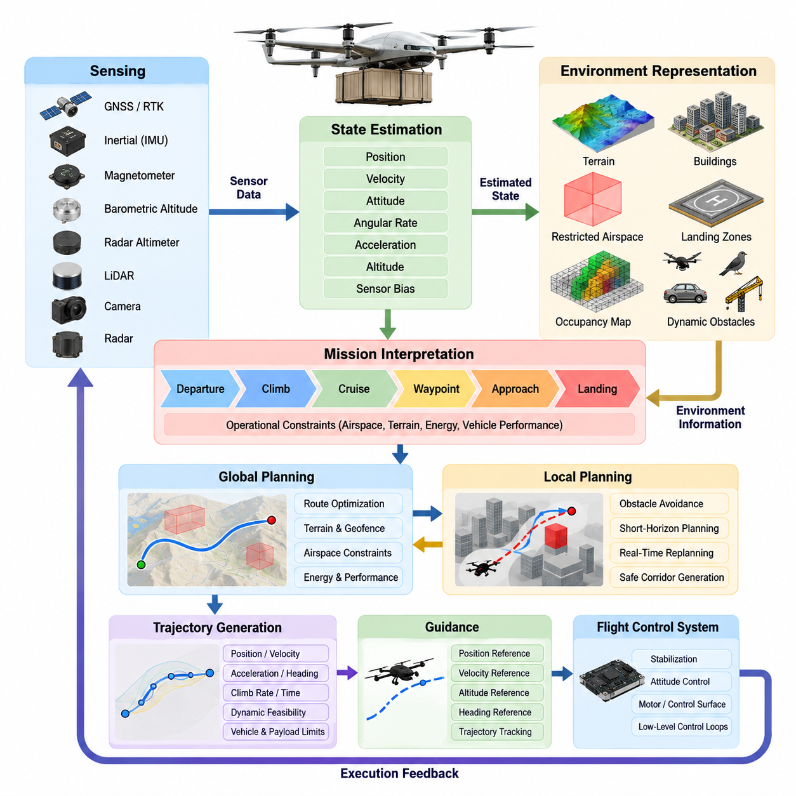
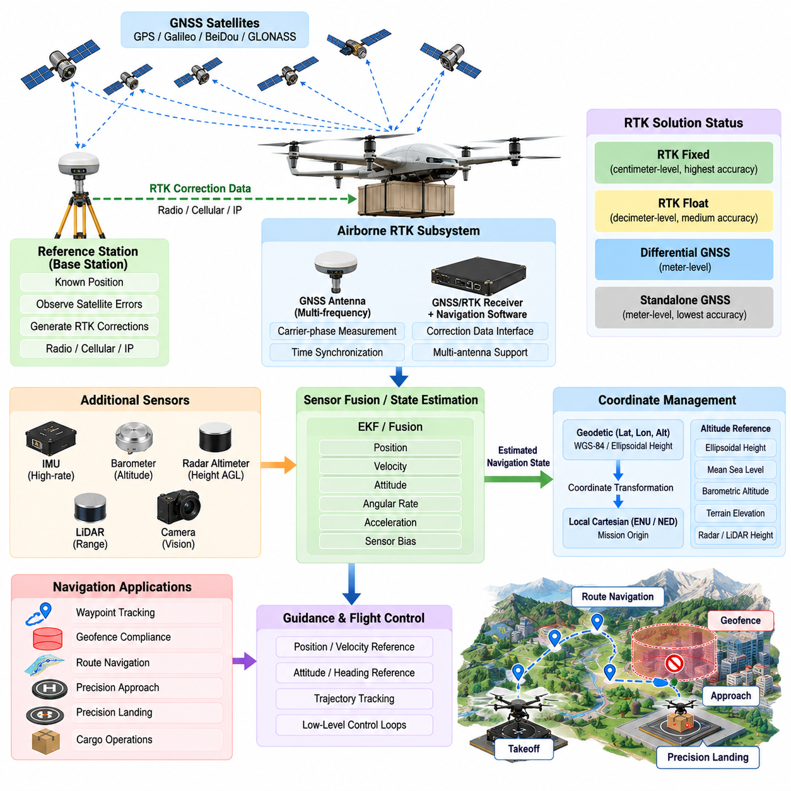
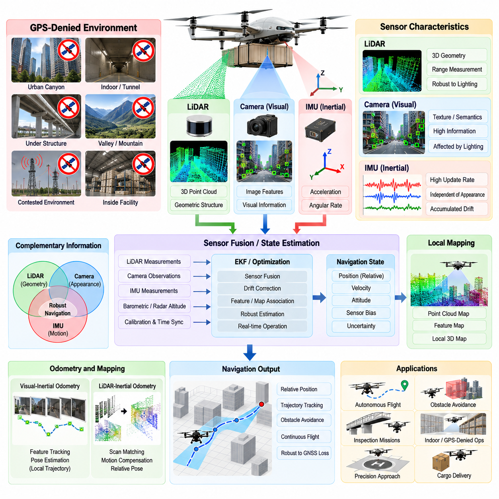
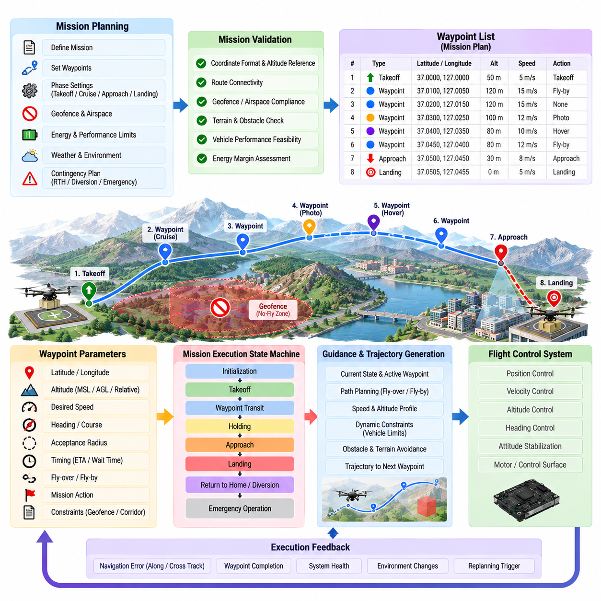
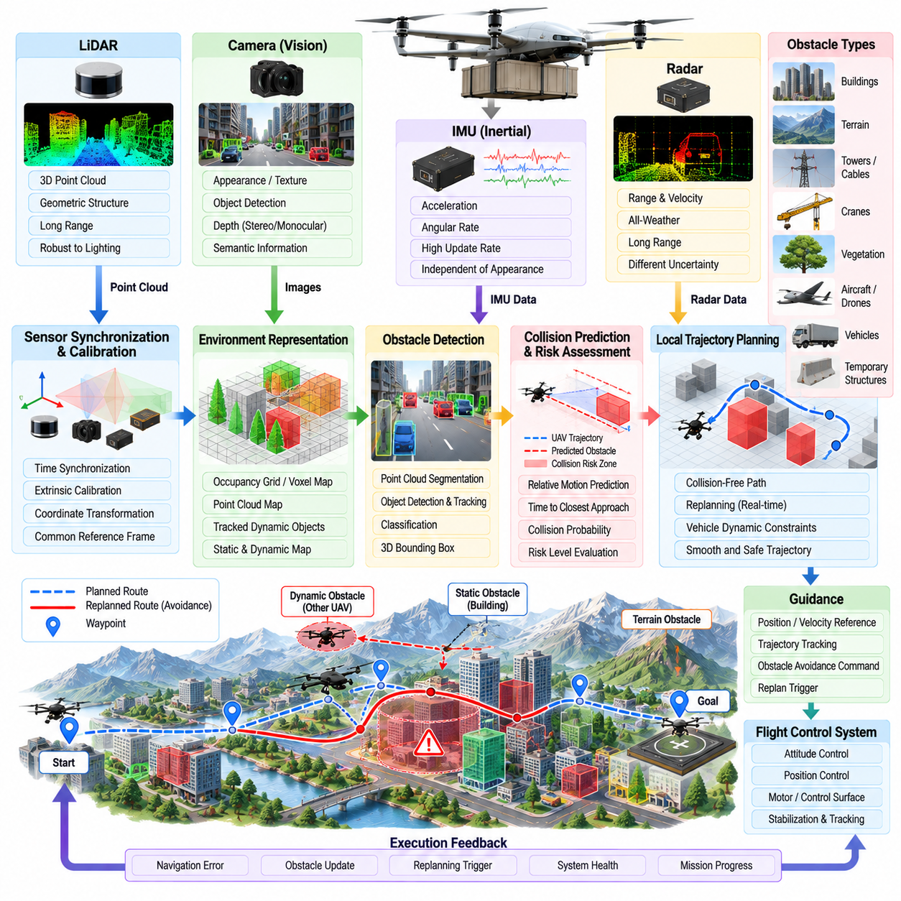
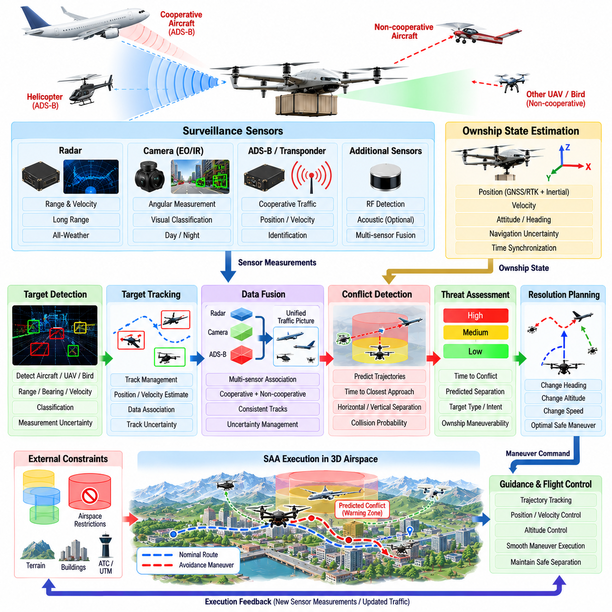
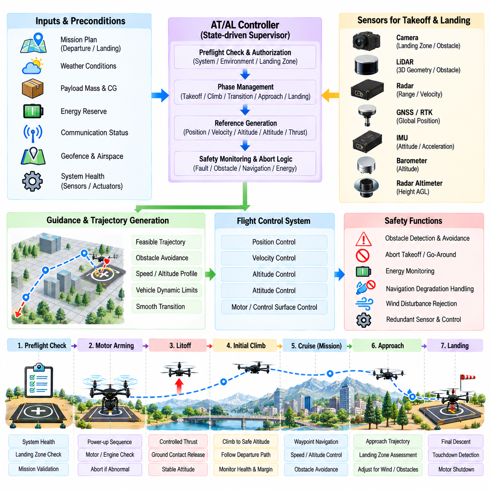
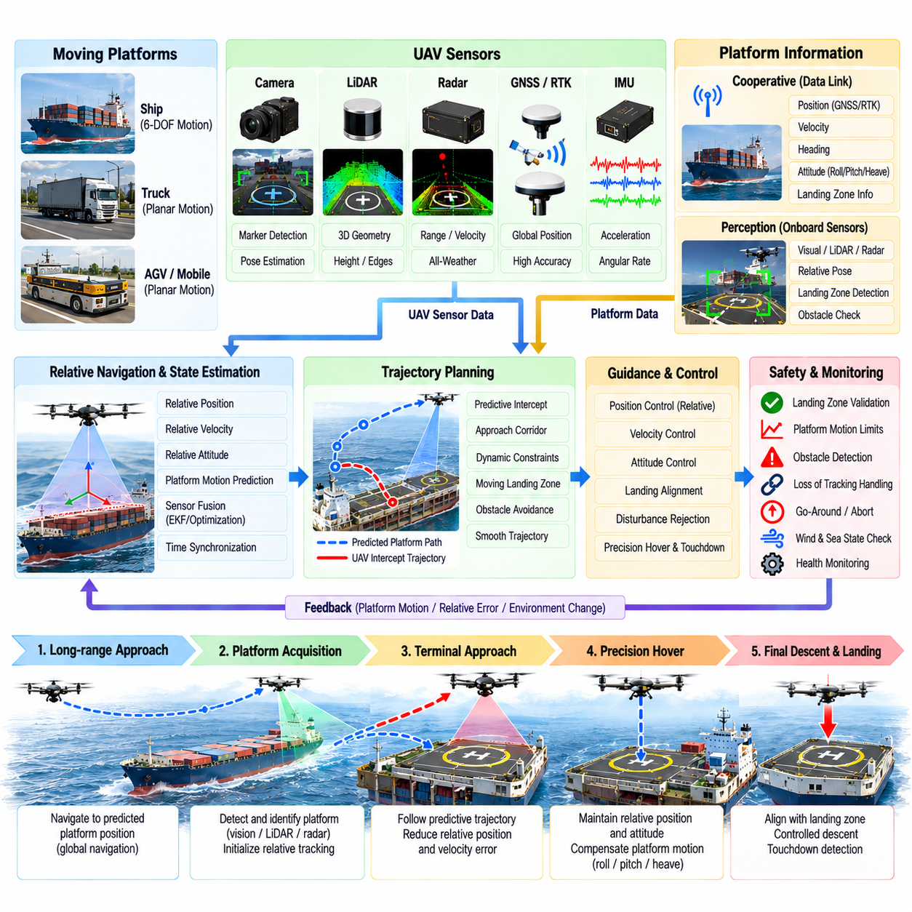
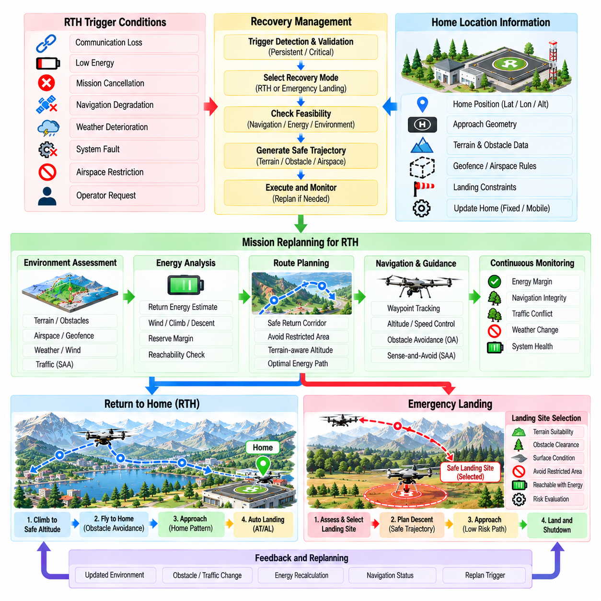
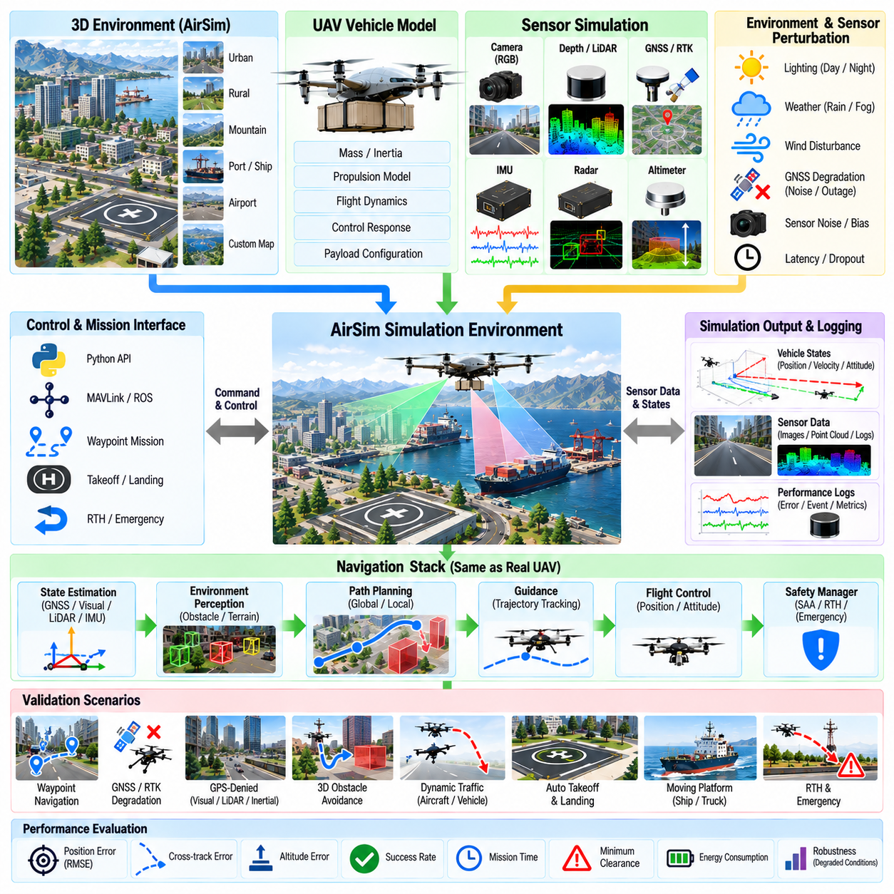

**Volume 23. Cargo UAV Autonomy and Flight AI**


# Chapter 04. Autonomous Navigation for UAV

##  

## 04.01. UAV Autonomous Navigation Architecture

{width="7.268055555555556in" height="7.268055555555556in"}

An autonomous navigation architecture for a cargo UAV provides the functional bridge between mission-level intent and the real-time flight-control system. It continuously converts destination, waypoint, airspace, terrain, and operational constraints into navigation states and trajectory commands that the aircraft can safely execute. The architecture must remain dependable across long-range missions, changing payload conditions, uncertain weather, communication interruptions, and degraded sensor environments.

At the highest level, the navigation system is organized around sensing, state estimation, environment representation, mission interpretation, path planning, trajectory generation, guidance, and safety supervision. These functions form a closed perception--planning--execution loop rather than a simple sequential pipeline. Sensor observations continuously update the estimated aircraft state and surrounding environment, while execution feedback determines whether the planned trajectory remains feasible or must be modified.

Navigation begins with a multi-source sensing layer that may combine GNSS, RTK-GNSS, inertial measurement units, magnetometers, barometric altitude sensors, radar altimeters, LiDAR, cameras, and radar. The exact sensor configuration depends on vehicle class and operating environment. Cargo UAVs require complementary sensing because no individual sensor can provide sufficiently reliable position, velocity, attitude, altitude, and environmental awareness under every operational condition.

The state-estimation layer transforms these asynchronous measurements into a coherent estimate of vehicle motion. Position, velocity, attitude, angular rate, acceleration, altitude, and sensor-bias states may be estimated through filtering or optimization techniques. GNSS and RTK provide globally referenced positioning, while inertial sensing maintains high-rate motion information. Visual, LiDAR, radar, or terrain-relative measurements can provide alternative references when satellite navigation becomes unreliable or unavailable.

A robust architecture therefore treats navigation sources according to confidence rather than assuming that GNSS is permanently available. Measurement quality, consistency, timestamp validity, innovation statistics, and sensor health can be monitored continuously. When GNSS accuracy deteriorates or interference is detected, the estimator can reduce its weighting and transition toward inertial, visual, LiDAR, radar, or other relative-navigation sources without forcing an immediate loss of autonomous flight capability.

Environment representation provides the spatial context required for autonomous decisions. Static terrain, buildings, restricted volumes, known infrastructure, landing zones, and planned corridors can be combined with dynamically detected aircraft, drones, birds, vehicles, cranes, or temporary obstacles. Different representations may coexist, including georeferenced maps, occupancy grids, voxel maps, elevation models, obstacle tracks, and semantic regions, depending on the planning horizon and computational requirements.

Mission interpretation sits above the navigation estimation functions and converts the approved mission into executable navigation objectives. A cargo mission may contain departure, climb, cruise, corridor entry, waypoint traversal, approach, landing, unloading, return, diversion, and emergency phases. Each phase activates different constraints and navigation behaviors, allowing the autonomy stack to adapt its planning horizon, altitude limits, obstacle margins, speed envelope, and landing requirements to the current operational context.

Global planning determines the broad spatial route between mission objectives while respecting terrain, geofences, prohibited airspace, vehicle performance, energy reserves, and mission constraints. Local planning operates at a shorter horizon and reacts to newly detected obstacles or environmental changes. Separating these responsibilities prevents every local disturbance from causing complete route reconstruction while still allowing rapid maneuver generation when the immediate flight path becomes unsafe.

Trajectory generation converts geometric routes into dynamically feasible motion references containing position, velocity, acceleration, heading, climb rate, and potentially time constraints. For heavy cargo UAVs, this stage must account for mass, center-of-gravity variation, propulsion capability, aerodynamic limits, turning radius, vertical-rate limits, and energy consumption. A path that is geometrically collision-free may still be unacceptable if the loaded aircraft cannot follow it within its certified flight envelope.

The guidance layer transforms the selected trajectory into references suitable for the flight-control system. Rather than directly commanding individual motors or control surfaces, navigation normally supplies desired position, velocity, altitude, heading, or trajectory states to lower-level control loops. This separation preserves a clear boundary between autonomous decision making and deterministic stabilization, while allowing the flight controller to maintain high-rate attitude and vehicle dynamics control independently. Volume_23_Cargo_UAV_Autonomy_an...

Obstacle avoidance and sense-and-avoid functions provide an additional reactive safety capability. Detected objects are evaluated according to relative position, velocity, predicted closest approach, uncertainty, and required separation. The navigation system can then modify speed, altitude, heading, or local trajectory while maintaining mission intent whenever possible. For cargo-class aircraft, avoidance decisions must be initiated early enough to respect the larger vehicle\'s inertia and limited maneuver authority.

Navigation architecture must also support autonomous takeoff and landing as specialized modes rather than treating them as ordinary waypoint transitions. Takeoff requires verification of navigation validity, flight-area clearance, vehicle readiness, and departure trajectory feasibility. Landing progressively increases the importance of accurate relative positioning, terrain assessment, obstacle clearance, and vertical guidance. Precision landing may additionally use visual markers, LiDAR, radar, or platform-relative estimation for fixed or moving destinations. Volume_23_Cargo_UAV_Autonomy_an...

Safety supervision operates across the entire navigation stack. Independent monitors can verify geofence compliance, navigation integrity, estimator health, trajectory feasibility, obstacle separation, communication status, remaining energy, and destination accessibility. If nominal navigation becomes unsafe, the supervisor may command route replanning, holding, return-to-home, diversion, emergency landing, or another predefined contingency behavior. These mechanisms ensure that autonomy includes explicit responses to off-nominal conditions rather than only nominal mission execution.

Return-to-home functionality illustrates the integration required across the architecture. A return decision cannot simply reverse the original route because weather, energy state, airspace restrictions, obstacles, or vehicle health may have changed. The navigation system must select an appropriate recovery destination, determine whether it remains reachable, construct a safe trajectory, and continuously reassess the route. If the home location becomes infeasible, an alternate landing site may provide the safer contingency. Volume_23_Cargo_UAV_Autonomy_an...

Timing and coordinate management are fundamental architectural concerns. Measurements arriving from multiple avionics devices must share consistent timestamps and well-defined reference frames so that sensor fusion and obstacle prediction represent the same physical state. Transformations between body, local navigation, Earth-referenced, map, sensor, and landing-site frames must therefore be explicitly controlled. Errors in synchronization or frame conventions can propagate through estimation and planning even when individual algorithms appear correct.

The architecture should also distinguish high-rate and low-rate computation. Inertial propagation, state estimation, collision monitoring, and guidance may require rapid deterministic execution, whereas global route optimization, semantic interpretation, weather assessment, and mission replanning can operate at slower rates. This multi-rate organization reduces computational load while ensuring that safety-critical reactions are not delayed by expensive planning or perception workloads running elsewhere in the autonomy computer.

Redundancy becomes increasingly important as cargo UAV size and consequence of failure increase. Navigation computers, communication paths, power supplies, and critical sensors can be partitioned so that a single fault does not immediately eliminate autonomous navigation. Redundant estimates may be cross-checked through health monitoring and voting logic, while degraded operating modes preserve essential navigation functions after selected failures. This architecture complements the broader redundant avionics design used by the UAV platform. Volume_23_Cargo_UAV_Autonomy_an...

The interfaces between navigation, perception, flight management, flight control, and mission management should be explicit and deterministic. Navigation consumes vehicle state, sensor health, obstacle information, mission objectives, airspace constraints, and system status, then publishes trajectories, guidance references, navigation integrity, and contingency recommendations. Clearly defined interfaces make individual components replaceable and support independent software verification, simulation, hardware-in-the-loop testing, and incremental certification.

For cargo operations, energy awareness must be incorporated throughout navigation rather than added only during mission planning. Remaining battery energy or fuel, payload mass, wind, altitude, propulsion efficiency, diversion distance, and reserve requirements influence whether a trajectory remains operationally feasible. The navigation system should continuously compare mission demand against reachable safe destinations so that an aircraft does not continue along a nominal route until insufficient reserve remains for recovery.

The resulting architecture is hierarchical but continuously interconnected. Mission management defines what the aircraft must accomplish, navigation determines where and how it should move, perception establishes what exists around it, state estimation determines where the aircraft actually is, and flight control executes the requested motion. Safety supervision constrains every layer. This organization provides the foundation for the subsequent precision GNSS, GPS-denied navigation, waypoint execution, obstacle avoidance, sense-and-avoid, autonomous landing, recovery, and simulation-validation functions defined for the UAV navigation chapter.

화물 무인항공기(Cargo UAV)를 위한 자율항법 아키텍처(Autonomous Navigation Architecture)는 임무 수준의 의도(Mission-Level Intent)와 실시간 비행제어 시스템(Real-Time Flight-Control System)을 연결하는 기능적 가교를 제공한다. 이 아키텍처는 목적지, 웨이포인트(Waypoint), 공역(Airspace), 지형(Terrain), 운용 제약조건(Operational Constraints)을 항공기가 안전하게 실행할 수 있는 항법 상태(Navigation State)와 궤적 명령(Trajectory Command)으로 지속적으로 변환한다. 또한 장거리 임무, 변화하는 탑재화물 조건, 불확실한 기상, 통신 중단, 센서 성능 저하 환경에서도 신뢰성을 유지해야 한다.

최상위 수준에서 항법 시스템(Navigation System)은 센싱(Sensing), 상태 추정(State Estimation), 환경 표현(Environment Representation), 임무 해석(Mission Interpretation), 경로 계획(Path Planning), 궤적 생성(Trajectory Generation), 유도(Guidance), 안전 감독(Safety Supervision)을 중심으로 구성된다. 이러한 기능들은 단순한 순차적 파이프라인(Sequential Pipeline)이 아니라 폐루프 인지-계획-실행(Perception--Planning--Execution) 구조를 형성한다. 센서 관측은 항공기 상태와 주변 환경 추정을 지속적으로 갱신하며, 실행 피드백(Execution Feedback)은 계획된 궤적의 유효성 또는 수정 필요성을 판단하는 데 사용된다.

항법은 위성항법시스템(GNSS), 실시간 이동측위 위성항법(RTK-GNSS), 관성측정장치(IMU), 자력계(Magnetometer), 기압 고도 센서(Barometric Altitude Sensor), 레이더 고도계(Radar Altimeter), 라이다(LiDAR), 카메라(Camera), 레이더(Radar)를 결합할 수 있는 다중 소스 센싱 계층(Multi-Source Sensing Layer)에서 시작된다. 정확한 센서 구성은 항공기 등급과 운용 환경에 따라 결정된다. 화물 무인항공기는 단일 센서만으로 모든 운용 조건에서 충분히 신뢰할 수 있는 위치, 속도, 자세, 고도 및 환경 인식을 확보하기 어렵기 때문에 상호 보완적인 센싱 구성이 필요하다.

상태 추정 계층(State-Estimation Layer)은 비동기적으로 수집되는 센서 측정값을 일관된 항공기 운동 상태 추정치로 변환한다. 위치, 속도, 자세, 각속도, 가속도, 고도 및 센서 바이어스(Sensor Bias) 상태는 필터링(Filtering) 또는 최적화(Optimization) 기법을 통해 추정될 수 있다. 위성항법시스템(GNSS)과 실시간 이동측위(RTK)는 전역 기준 위치정보를 제공하고, 관성 센싱(Inertial Sensing)은 고속 운동정보를 유지한다. 위성항법이 불안정하거나 사용할 수 없는 경우에는 비전(Visual), 라이다(LiDAR), 레이더(Radar), 지형 상대 측정(Terrain-Relative Measurement)이 대체 기준정보를 제공할 수 있다.

따라서 강건한 아키텍처(Robust Architecture)는 위성항법시스템(GNSS)이 항상 사용 가능하다고 가정하지 않고 신뢰도(Confidence)에 따라 항법 정보원을 관리한다. 측정 품질, 일관성, 타임스탬프 유효성(Timestamp Validity), 이노베이션 통계(Innovation Statistics), 센서 상태를 지속적으로 감시할 수 있다. GNSS 정확도가 저하되거나 간섭이 탐지되면 추정기는 해당 정보의 가중치를 낮추고 관성, 비전, 라이다, 레이더 또는 다른 상대항법(Relative Navigation) 정보원으로 전환하여 즉각적인 자율비행 능력 상실을 방지할 수 있다.

환경 표현(Environment Representation)은 자율 의사결정에 필요한 공간적 맥락(Spatial Context)을 제공한다. 정적 지형, 건물, 제한 공역, 알려진 기반시설, 착륙구역, 계획된 비행회랑(Flight Corridor)은 동적으로 탐지되는 항공기, 드론, 조류, 차량, 크레인 또는 임시 장애물과 결합될 수 있다. 계획 범위(Planning Horizon)와 계산 요구사항에 따라 지리참조 지도(Georeferenced Map), 점유 격자(Occupancy Grid), 복셀 지도(Voxel Map), 고도 모델(Elevation Model), 장애물 트랙(Obstacle Track), 의미론적 영역(Semantic Region) 등 다양한 표현을 동시에 사용할 수 있다.

임무 해석(Mission Interpretation)은 항법 추정 기능보다 상위 계층에 위치하며 승인된 임무를 실행 가능한 항법 목표(Navigation Objective)로 변환한다. 화물 임무는 출발, 상승, 순항, 비행회랑 진입, 웨이포인트 통과, 접근, 착륙, 하역, 복귀, 우회 및 비상 단계로 구성될 수 있다. 각 단계에서는 서로 다른 제약조건과 항법 동작이 활성화되며, 이를 통해 자율비행 스택(Autonomy Stack)은 현재 운용 상황에 맞추어 계획 범위, 고도 제한, 장애물 안전여유, 속도 범위 및 착륙 요구조건을 조정할 수 있다.

전역 계획(Global Planning)은 지형, 지오펜스(Geofence), 비행금지 공역(Prohibited Airspace), 항공기 성능, 에너지 잔량 및 임무 제약조건을 고려하여 임무 목표 사이의 전체적인 공간 경로를 결정한다. 지역 계획(Local Planning)은 더 짧은 범위에서 동작하면서 새롭게 탐지된 장애물이나 환경 변화에 대응한다. 이러한 역할 분리는 모든 국부적 교란으로 인해 전체 경로를 다시 계산하는 것을 방지하면서도 즉각적인 비행경로가 위험해지는 경우 신속하게 회피 기동을 생성할 수 있게 한다.

궤적 생성(Trajectory Generation)은 기하학적 경로를 위치, 속도, 가속도, 기수방향(Heading), 상승률(Climb Rate), 필요에 따라 시간 제약조건까지 포함하는 동역학적으로 실행 가능한 운동 기준값으로 변환한다. 대형 화물 무인항공기의 경우 이 단계에서 질량, 무게중심(CoG) 변화, 추진 능력, 공기역학적 한계, 선회반경, 수직속도 제한 및 에너지 소비를 고려해야 한다. 기하학적으로 충돌이 없는 경로라도 화물을 탑재한 항공기가 인증된 비행영역(Certified Flight Envelope) 내에서 추종할 수 없다면 허용할 수 없다.

유도 계층(Guidance Layer)은 선택된 궤적을 비행제어 시스템(Flight-Control System)에 적합한 기준값으로 변환한다. 항법 시스템은 개별 모터나 조종면(Control Surface)을 직접 명령하기보다는 일반적으로 원하는 위치, 속도, 고도, 기수방향 또는 궤적 상태를 하위 제어루프(Lower-Level Control Loop)에 제공한다. 이러한 분리는 자율 의사결정과 결정론적 안정화(Deterministic Stabilization) 사이에 명확한 경계를 유지하면서 비행제어기가 고속 자세제어와 항공기 동역학 제어를 독립적으로 수행할 수 있도록 한다.

장애물 회피(Obstacle Avoidance)와 탐지 및 회피(Sense-and-Avoid, SAA) 기능은 추가적인 반응형 안전 능력(Reactive Safety Capability)을 제공한다. 탐지된 객체는 상대 위치, 상대 속도, 예측 최근접거리(Predicted Closest Approach), 불확실성 및 요구 분리거리(Required Separation)를 기준으로 평가된다. 항법 시스템은 가능한 범위에서 임무 의도를 유지하면서 속도, 고도, 기수방향 또는 지역 궤적을 수정할 수 있다. 화물급 항공기의 경우 큰 관성과 제한된 기동성을 고려하여 충분히 이른 시점에 회피 결정을 내려야 한다.

항법 아키텍처는 자율 이륙 및 착륙(Autonomous Takeoff and Landing)을 일반적인 웨이포인트 전환이 아니라 특수 운용 모드(Specialized Mode)로 지원해야 한다. 이륙 단계에서는 항법 유효성, 비행구역 안전성, 항공기 준비상태 및 출발 궤적의 실행 가능성을 검증해야 한다. 착륙 과정에서는 정밀 상대측위(Relative Positioning), 지형 평가, 장애물 여유 및 수직 유도의 중요성이 점진적으로 증가한다. 정밀착륙(Precision Landing)은 고정 또는 이동 목적지에 대해 비전 마커, 라이다, 레이더 또는 플랫폼 상대 추정(Platform-Relative Estimation)을 추가로 사용할 수 있다.

안전 감독(Safety Supervision)은 전체 항법 스택에 걸쳐 동작한다. 독립적인 모니터는 지오펜스 준수, 항법 무결성(Navigation Integrity), 추정기 상태, 궤적 실행 가능성, 장애물 분리거리, 통신 상태, 잔여 에너지 및 목적지 접근 가능성을 검증할 수 있다. 정상 항법이 안전하지 않게 되면 감독 기능은 경로 재계획(Route Replanning), 대기비행(Holding), 자동복귀(Return-to-Home), 우회(Diversion), 비상착륙(Emergency Landing) 또는 사전에 정의된 비상 동작(Contingency Behavior)을 명령할 수 있다. 이를 통해 자율성은 정상 임무 수행뿐만 아니라 비정상 조건에 대한 명시적인 대응까지 포함하게 된다.

자동복귀(Return-to-Home) 기능은 아키텍처 전반의 통합이 필요한 대표적인 사례이다. 기상, 에너지 상태, 공역 제한, 장애물 또는 항공기 상태가 이미 변화했을 수 있기 때문에 복귀 결정은 단순히 기존 경로를 역으로 추종하는 방식으로 구현할 수 없다. 항법 시스템은 적절한 복귀 목적지를 선택하고 접근 가능성을 판단한 후 안전한 궤적을 생성하며 경로를 지속적으로 재평가해야 한다. 원래의 복귀 지점에 도달하는 것이 불가능해지면 대체 착륙지(Alternate Landing Site)를 선택하는 것이 더 안전한 비상 대응이 될 수 있다.

시간 관리와 좌표계 관리(Timing and Coordinate Management)는 기본적인 아키텍처 요소이다. 여러 항공전자 장비(Avionics Device)에서 수집되는 측정값은 센서 융합과 장애물 예측이 동일한 물리적 상태를 표현할 수 있도록 일관된 타임스탬프와 명확하게 정의된 기준 좌표계(Reference Frame)를 공유해야 한다. 따라서 기체, 지역 항법, 지구 기준, 지도, 센서 및 착륙지 좌표계 사이의 변환을 명시적으로 관리해야 한다. 동기화 또는 좌표계 규약의 오류는 개별 알고리즘이 정상적으로 동작하더라도 추정과 계획 전반으로 전파될 수 있다.

아키텍처는 또한 고속 연산(High-Rate Computation)과 저속 연산(Low-Rate Computation)을 구분해야 한다. 관성 전파(Inertial Propagation), 상태 추정, 충돌 감시 및 유도는 빠르고 결정론적인 실행이 요구될 수 있지만, 전역 경로 최적화, 의미론적 해석, 기상 평가 및 임무 재계획은 상대적으로 낮은 주기로 실행될 수 있다. 이러한 다중 주기 구조(Multi-Rate Architecture)는 계산 부하를 줄이면서도 안전 핵심 반응(Safety-Critical Reaction)이 다른 영역에서 실행되는 고비용 계획 또는 인지 연산으로 인해 지연되지 않도록 한다.

화물 무인항공기의 크기와 고장 결과의 심각성이 증가할수록 이중화(Redundancy)의 중요성도 증가한다. 항법 컴퓨터, 통신 경로, 전원공급장치 및 핵심 센서는 단일 고장이 자율항법 기능의 즉각적인 상실로 이어지지 않도록 분리 구성할 수 있다. 중복된 상태 추정 결과는 상태 감시(Health Monitoring)와 보팅 로직(Voting Logic)을 통해 상호 검증할 수 있으며, 성능 저하 운용 모드(Degraded Operating Mode)는 특정 고장 이후에도 필수적인 항법 기능을 유지한다. 이러한 구조는 무인항공기 플랫폼의 전체 이중화 항공전자 설계(Redundant Avionics Design)를 보완한다.

항법, 인지, 비행관리(Flight Management), 비행제어 및 임무관리(Mission Management) 사이의 인터페이스는 명확하고 결정론적으로 정의되어야 한다. 항법 시스템은 항공기 상태, 센서 건전성, 장애물 정보, 임무 목표, 공역 제약조건 및 시스템 상태를 입력받고 궤적, 유도 기준값, 항법 무결성 정보 및 비상 대응 권고를 출력한다. 명확하게 정의된 인터페이스는 개별 구성요소의 교체 가능성을 높이며 독립적인 소프트웨어 검증, 시뮬레이션, 하드웨어 인더루프 시험(Hardware-in-the-Loop Testing) 및 단계적 인증을 지원한다.

화물 운송에서는 에너지 인식(Energy Awareness)을 임무계획 단계에서만 추가하는 기능이 아니라 전체 항법 과정에 통합해야 한다. 배터리 잔량 또는 연료, 탑재화물 질량, 바람, 고도, 추진 효율, 우회 거리 및 예비 에너지 요구조건은 궤적이 운용상 실행 가능한지를 결정한다. 항법 시스템은 임무에 필요한 에너지와 도달 가능한 안전 목적지를 지속적으로 비교함으로써 안전 복귀에 필요한 예비 에너지가 부족해질 때까지 항공기가 정상 경로를 계속 비행하는 상황을 방지해야 한다.

최종적인 아키텍처는 계층적(Hierarchical)이면서도 지속적으로 상호 연결된 구조를 갖는다. 임무관리(Mission Management)는 항공기가 수행해야 할 목표를 정의하고, 항법(Navigation)은 항공기가 어디로 어떻게 이동해야 하는지를 결정하며, 인지(Perception)는 주변에 무엇이 존재하는지를 파악한다. 상태 추정(State Estimation)은 항공기가 실제로 어디에 있는지를 결정하고, 비행제어(Flight Control)는 요구된 움직임을 실행한다. 안전 감독(Safety Supervision)은 모든 계층을 제약하고 보호한다. 이러한 구조는 이후 다루게 될 정밀 위성항법, 위성항법 불가 환경 항법, 웨이포인트 임무 수행, 장애물 회피, 탐지 및 회피, 자율착륙, 비상복구 및 시뮬레이션 검증 기능의 기반을 제공한다.

##  

## 04.02. GNSS RTK Based Precision Navigation [w/Code]

{width="7.268055555555556in" height="7.268055555555556in"}

Global Navigation Satellite System (GNSS) and Real-Time Kinematic (RTK) positioning provide the primary foundation for high-accuracy outdoor navigation in autonomous cargo UAV operations. Standard GNSS can support global position estimation over long flight distances, while RTK improves relative positioning accuracy by applying correction information from a reference station or correction network. Together, they enable precise waypoint tracking, controlled approach, geofence compliance, and accurate terminal navigation.

A GNSS receiver estimates the UAV position by measuring signals transmitted from multiple navigation satellites. These measurements provide latitude, longitude, altitude, velocity, and timing information that can be transformed into the navigation coordinate frame used by the flight system. Because raw satellite measurements contain atmospheric, orbital, clock, multipath, and receiver errors, conventional standalone GNSS accuracy may not be sufficient for operations requiring highly repeatable trajectories or precision landing.

RTK navigation improves positioning by using carrier-phase measurements together with correction data derived from a known reference location. A base station observes many of the same satellite errors as the UAV receiver and distributes correction information to the airborne rover. When carrier-phase ambiguities are successfully resolved, the RTK solution can provide centimeter-class positioning under favorable satellite visibility, signal quality, correction availability, and geometric conditions.

The airborne RTK subsystem normally consists of a multi-frequency GNSS receiver, one or more antennas, correction-data communication interfaces, time synchronization functions, and navigation software. The reference information may originate from a dedicated local base station or a network-based correction service. Correction messages are delivered through radio, cellular, IP, or another supported communication channel and must be associated with the appropriate measurement epoch before the navigation solution is calculated.

RTK solution status is particularly important because precision varies substantially between operating modes. A receiver may report standalone GNSS, differential, RTK float, or RTK fixed solutions depending on correction availability and ambiguity resolution. The navigation software should therefore avoid treating every reported position as equally accurate. Position covariance, solution type, satellite count, correction age, dilution of precision, signal quality, and integrity indicators should accompany the estimated position.

A fixed RTK solution generally represents the preferred state for precision navigation because integer carrier-phase ambiguities have been resolved. An RTK float solution retains greater uncertainty and may still support less demanding phases of flight, but it should not automatically be accepted for operations requiring centimeter-level accuracy. Mission logic can define different navigation-quality thresholds for cruise, corridor traversal, approach, hover, cargo positioning, and precision landing.

GNSS and RTK measurements are most effective when integrated with the Inertial Measurement Unit (IMU). GNSS supplies globally referenced position and velocity information at a moderate update rate, while the IMU provides high-frequency angular-rate and acceleration measurements. A state estimator, commonly based on an Extended Kalman Filter (EKF) or related fusion method, combines these complementary sources to produce smooth estimates of position, velocity, attitude, and sensor biases for guidance and flight control.

During short GNSS interruptions, inertial propagation allows the navigation state to continue evolving without an immediate discontinuity. However, inertial errors accumulate with time, so satellite measurements are required to constrain long-term drift. When valid GNSS or RTK observations return, the estimator should incorporate them progressively according to measurement uncertainty rather than abruptly replacing the predicted state. This prevents large navigation corrections from generating undesirable trajectory or flight-control transients.

Coordinate management is essential because GNSS measurements are normally expressed in geodetic or Earth-referenced coordinates, while flight-control algorithms often operate in a local Cartesian frame. Latitude, longitude, and altitude can therefore be transformed into a local East-North-Up or North-East-Down representation referenced to a mission origin. Consistent datum, altitude reference, axis convention, and transformation definitions are necessary to prevent systematic position errors across planning and control modules.

Altitude requires particular attention because satellite-derived height and operational altitude may use different references. GNSS commonly produces ellipsoidal height, while mission planning, terrain databases, aviation procedures, or ground-control displays may use mean sea level or another vertical datum. Barometric altitude, radar altitude, LiDAR range, and terrain elevation can provide additional vertical information. The navigation architecture must explicitly manage these references rather than assuming that all altitude values are interchangeable.

For cargo UAVs, antenna installation can materially affect precision performance. GNSS antennas should maintain adequate sky visibility while minimizing electromagnetic interference, structural blockage, multipath, and interference from propulsion or communication equipment. Large airframes may also introduce significant lever arms between the GNSS antenna, IMU, and vehicle reference point. These geometric offsets should be calibrated and compensated so that estimated motion corresponds to the intended aircraft navigation origin.

Dual-antenna or multi-antenna GNSS configurations can additionally provide heading information from the relative carrier-phase solution between antennas. This can be useful when the UAV is stationary or moving slowly, conditions under which velocity-derived course information becomes weak. GNSS-based heading can complement magnetometers and inertial attitude estimation, particularly around large electrical propulsion systems where magnetic disturbances may degrade conventional compass measurements.

Precision waypoint navigation uses the fused state estimate to calculate position and velocity errors relative to the desired trajectory. The guidance system converts these errors into horizontal and vertical motion references that are passed to the flight-control loops. RTK does not replace the flight controller; instead, it improves the accuracy of the navigation reference used by guidance. Stable trajectory tracking still depends on vehicle dynamics, control authority, wind rejection, and correctly tuned control laws.

Communication reliability is another critical consideration because RTK performance depends on timely correction information. The navigation software should monitor correction age, message continuity, link status, and base-station validity. Temporary loss of corrections does not necessarily imply immediate loss of GNSS navigation, but the solution may degrade from RTK fixed to float or standalone operation. The autonomy system should recognize this degradation and adjust the permitted operational mode accordingly.

Satellite visibility can deteriorate near buildings, mountains, infrastructure, or other obstructions, while reflected signals may produce multipath errors. Signal blockage can reduce the number of usable satellites and weaken satellite geometry. Navigation software should monitor measurement residuals and receiver quality indicators to identify abnormal observations. Measurements inconsistent with inertial motion or other sensors can be rejected or assigned lower confidence before they corrupt the fused navigation solution.

GNSS interference presents a more serious operational risk. Jamming can reduce or eliminate satellite reception, while spoofing can introduce plausible but false navigation information. A precision-navigation architecture should therefore compare GNSS-derived motion against IMU, visual, LiDAR, radar, barometric, or other independent observations where available. Sudden position jumps, inconsistent velocity, abnormal clock behavior, unusual signal characteristics, or disagreement between redundant receivers can indicate degraded or potentially compromised GNSS.

The response to RTK degradation should be determined by mission phase and required navigation performance. Loss of a fixed solution during cruise may permit continued flight using standard GNSS and inertial fusion, whereas the same event during precision landing may require an aborted approach, hover, go-around, or transition to another landing sensor. This performance-based strategy allows the UAV to preserve useful autonomy without assuming that every navigation degradation requires identical contingency behavior.

Precision navigation must also maintain accurate timing. GNSS provides a highly stable time reference that can support timestamp alignment across the IMU, cameras, LiDAR, radar, flight computers, and logging systems. Sensor measurements used in state estimation should correspond to the correct physical instant, especially during high-speed motion. Even accurate position measurements can produce estimation errors when latency, timestamp offsets, or correction-message delays are incorrectly handled.

For long-range cargo operations, GNSS/RTK navigation should be continuously supervised rather than validated only before takeoff. The system can monitor horizontal and vertical uncertainty, correction age, satellite geometry, receiver status, estimator innovation, inertial consistency, and communication quality throughout the mission. These parameters provide a navigation-integrity assessment that can be consumed by mission management and safety functions when deciding whether normal autonomous operation remains acceptable.

Validation should cover nominal accuracy as well as transitions between navigation states. Simulation, recorded-data replay, software-in-the-loop testing, hardware-in-the-loop testing, ground trials, and flight tests can evaluate RTK acquisition, fixed-to-float transitions, correction outages, satellite blockage, multipath, receiver resets, and recovery behavior. Particular attention should be given to whether navigation degradation causes discontinuities that propagate into guidance or flight-control commands.

GNSS/RTK precision navigation ultimately forms one component of the broader autonomous navigation architecture defined for the cargo UAV. Its purpose is not merely to produce an accurate coordinate but to provide a continuously qualified, time-consistent, and operationally usable navigation state. By combining RTK positioning with inertial fusion, integrity monitoring, coordinate management, degradation handling, and flight-phase-dependent logic, the UAV can exploit centimeter-level positioning when available while retaining controlled behavior when precision satellite navigation becomes degraded or unavailable.

전역항법위성시스템(GNSS)과 실시간 이동측위(RTK)는 자율 화물 무인항공기(Cargo UAV)의 고정밀 실외 항법을 위한 핵심 기반을 제공한다. 일반적인 전역항법위성시스템(GNSS)은 장거리 비행에서 전역 위치 추정을 지원하며, 실시간 이동측위(RTK)는 기준국(Reference Station) 또는 보정 네트워크(Correction Network)에서 제공되는 보정정보를 적용하여 상대 위치 정확도를 향상시킨다. 두 기술을 결합하면 정밀 웨이포인트 추종, 제어된 접근, 지오펜스(Geofence) 준수 및 정확한 종말구간 항법(Terminal Navigation)을 구현할 수 있다.

전역항법위성시스템 수신기(GNSS Receiver)는 여러 항법위성에서 송신되는 신호를 측정하여 무인항공기의 위치를 추정한다. 이러한 측정값은 위도, 경도, 고도, 속도 및 시간정보를 제공하며 비행 시스템에서 사용하는 항법 좌표계(Navigation Coordinate Frame)로 변환할 수 있다. 원시 위성 측정값에는 대기, 위성 궤도, 시계, 다중경로(Multipath), 수신기 오차가 포함되기 때문에 일반적인 단독 GNSS의 정확도만으로는 높은 반복성이 요구되는 궤적 비행이나 정밀착륙에 충분하지 않을 수 있다.

실시간 이동측위 항법(RTK Navigation)은 반송파 위상 측정(Carrier-Phase Measurement)과 알려진 기준 위치에서 생성된 보정정보를 함께 사용하여 위치 정확도를 향상시킨다. 기준국(Base Station)은 무인항공기의 수신기와 공통적으로 발생하는 많은 위성 오차를 관측하고 보정정보를 공중 이동국(Rover)에 전송한다. 반송파 위상의 정수 모호성(Integer Ambiguity)이 성공적으로 해결되면 양호한 위성 가시성, 신호 품질, 보정정보 가용성 및 위성 기하조건에서 센티미터급 위치 정확도를 제공할 수 있다.

기체 탑재 실시간 이동측위 서브시스템(Airborne RTK Subsystem)은 일반적으로 다중 주파수 GNSS 수신기(Multi-Frequency GNSS Receiver), 하나 이상의 안테나, 보정 데이터 통신 인터페이스, 시간 동기화 기능 및 항법 소프트웨어로 구성된다. 기준정보는 전용 지역 기준국 또는 네트워크 기반 보정 서비스(Network-Based Correction Service)에서 제공될 수 있다. 보정 메시지는 무선, 셀룰러, 인터넷 프로토콜(IP) 또는 기타 지원되는 통신 채널을 통해 전달되며, 항법 해를 계산하기 전에 해당 측정 시점(Measurement Epoch)과 정확하게 연계되어야 한다.

실시간 이동측위 해 상태(RTK Solution Status)는 운용 모드에 따라 정밀도가 크게 달라지기 때문에 특히 중요하다. 수신기는 보정정보 가용성과 모호성 해결 상태에 따라 단독 GNSS, 차분항법(Differential), RTK 플로트(Float), RTK 고정해(Fixed) 등을 보고할 수 있다. 따라서 항법 소프트웨어는 모든 위치정보를 동일한 정확도로 취급해서는 안 된다. 위치 공분산(Position Covariance), 해의 유형, 위성 수, 보정정보 경과시간(Correction Age), 정밀도 저하율(Dilution of Precision), 신호 품질 및 무결성 지표(Integrity Indicator)를 위치 추정값과 함께 관리해야 한다.

고정 RTK 해(Fixed RTK Solution)는 반송파 위상의 정수 모호성이 해결된 상태이므로 일반적으로 정밀항법에서 가장 선호되는 상태를 의미한다. RTK 플로트 해(Float Solution)는 더 큰 불확실성을 가지며 요구 정밀도가 낮은 비행 단계에서는 사용할 수 있지만 센티미터급 정확도가 필요한 운용에 자동으로 허용해서는 안 된다. 임무 로직(Mission Logic)은 순항, 비행회랑 통과, 접근, 호버링(Hover), 화물 위치 정렬 및 정밀착륙과 같은 비행 단계별로 서로 다른 항법 품질 기준을 정의할 수 있다.

GNSS와 RTK 측정값은 관성측정장치(IMU)와 통합할 때 가장 효과적으로 활용할 수 있다. GNSS는 중간 수준의 갱신 주기로 전역 기준 위치와 속도정보를 제공하고, 관성측정장치(IMU)는 고주파 각속도 및 가속도 측정값을 제공한다. 일반적으로 확장 칼만 필터(Extended Kalman Filter, EKF) 또는 관련 융합기법을 사용하는 상태 추정기(State Estimator)는 이러한 상호 보완적인 정보원을 결합하여 유도(Guidance)와 비행제어에 필요한 위치, 속도, 자세 및 센서 바이어스의 연속적인 추정값을 생성한다.

짧은 GNSS 중단 동안에는 관성 전파(Inertial Propagation)를 통해 항법 상태를 즉각적인 단절 없이 지속적으로 추정할 수 있다. 그러나 관성 오차는 시간이 지남에 따라 누적되므로 장기적인 드리프트(Drift)를 억제하기 위해 위성 측정값이 필요하다. 유효한 GNSS 또는 RTK 관측값이 다시 확보되면 추정기는 예측 상태를 갑자기 대체하지 않고 측정 불확실성에 따라 점진적으로 이를 반영해야 한다. 이를 통해 큰 항법 보정으로 인해 불필요한 궤적 또는 비행제어 과도응답(Transient)이 발생하는 것을 방지할 수 있다.

좌표계 관리(Coordinate Management)는 GNSS 측정값이 일반적으로 측지 또는 지구 기준 좌표(Geodetic or Earth-Referenced Coordinates)로 표현되는 반면 비행제어 알고리즘은 주로 지역 직교 좌표계(Local Cartesian Frame)를 사용하기 때문에 필수적이다. 따라서 위도, 경도 및 고도를 임무 기준점을 원점으로 하는 동-북-상(East-North-Up, ENU) 또는 북-동-하(North-East-Down, NED) 좌표계로 변환할 수 있다. 계획 및 제어 모듈 사이의 체계적인 위치오차를 방지하려면 기준 데이텀(Datum), 고도 기준, 축 규약 및 좌표변환 정의를 일관되게 유지해야 한다.

고도(Altitude)는 위성으로부터 산출된 높이와 실제 운용에서 사용하는 고도가 서로 다른 기준을 사용할 수 있기 때문에 특별한 주의가 필요하다. GNSS는 일반적으로 타원체고(Ellipsoidal Height)를 제공하지만 임무계획, 지형 데이터베이스, 항공 절차 또는 지상통제 화면은 평균해수면(Mean Sea Level)이나 다른 수직 기준면(Vertical Datum)을 사용할 수 있다. 기압고도, 레이더 고도, 라이다 거리 및 지형 고도도 추가적인 수직정보를 제공할 수 있다. 따라서 항법 아키텍처는 모든 고도 값이 동일하다고 가정하지 않고 이러한 기준을 명시적으로 관리해야 한다.

화물 무인항공기의 경우 안테나 설치(Antenna Installation)가 정밀항법 성능에 상당한 영향을 미칠 수 있다. GNSS 안테나는 충분한 상공 가시성(Sky Visibility)을 확보하면서 전자기 간섭, 구조물 차폐, 다중경로 및 추진장치나 통신장비에서 발생하는 간섭을 최소화해야 한다. 대형 기체에서는 GNSS 안테나, 관성측정장치(IMU), 항공기 기준점 사이에 상당한 레버암(Lever Arm)이 존재할 수 있다. 이러한 기하학적 오프셋은 추정된 움직임이 의도한 항공기 항법 원점과 일치하도록 보정되어야 한다.

이중 안테나 또는 다중 안테나 GNSS 구성(Dual-Antenna or Multi-Antenna GNSS Configuration)은 안테나 사이의 상대적인 반송파 위상 해를 이용하여 추가적으로 기수방향(Heading) 정보를 제공할 수 있다. 이는 무인항공기가 정지해 있거나 저속으로 이동하여 속도 기반 진행방향 정보가 불안정한 상황에서 유용하다. GNSS 기반 기수방향 정보는 자력계와 관성 자세 추정을 보완할 수 있으며, 특히 대형 전기추진 시스템 주변에서 자기장 교란으로 인해 기존 나침반 측정 성능이 저하되는 경우 효과적이다.

정밀 웨이포인트 항법(Precision Waypoint Navigation)은 융합된 상태 추정값을 사용하여 목표 궤적에 대한 위치 및 속도 오차를 계산한다. 유도 시스템(Guidance System)은 이러한 오차를 수평 및 수직 운동 기준값으로 변환하여 비행제어 루프에 전달한다. RTK는 비행제어기를 대체하는 것이 아니라 유도 시스템에서 사용하는 항법 기준의 정확도를 향상시키는 역할을 한다. 안정적인 궤적 추종은 여전히 항공기 동역학, 제어 권한(Control Authority), 바람 외란 억제 및 적절하게 조정된 제어법칙(Control Law)에 의존한다.

RTK 성능은 적시에 제공되는 보정정보에 의존하기 때문에 통신 신뢰성(Communication Reliability) 역시 중요한 고려사항이다. 항법 소프트웨어는 보정정보 경과시간, 메시지 연속성, 통신 링크 상태 및 기준국 유효성을 감시해야 한다. 보정정보가 일시적으로 손실되더라도 GNSS 항법 자체가 즉시 상실되는 것은 아니지만 위치 해는 RTK 고정해에서 플로트 또는 단독 GNSS 운용으로 성능이 저하될 수 있다. 자율 시스템은 이러한 성능 저하를 인식하고 허용 가능한 운용 모드를 적절하게 조정해야 한다.

건물, 산악, 기반시설 또는 기타 장애물 주변에서는 위성 가시성이 저하될 수 있으며 반사된 신호로 인해 다중경로 오차가 발생할 수 있다. 신호 차폐는 사용 가능한 위성 수를 감소시키고 위성 기하구조(Satellite Geometry)를 악화시킬 수 있다. 항법 소프트웨어는 비정상적인 관측값을 식별하기 위해 측정 잔차(Measurement Residual)와 수신기 품질 지표를 감시해야 한다. 관성 운동 또는 다른 센서와 일치하지 않는 측정값은 융합된 항법 해를 손상시키기 전에 제거하거나 낮은 신뢰도를 부여할 수 있다.

GNSS 간섭(GNSS Interference)은 더욱 심각한 운용 위험을 발생시킨다. 재밍(Jamming)은 위성 신호 수신을 감소시키거나 완전히 차단할 수 있으며, 스푸핑(Spoofing)은 그럴듯하지만 잘못된 항법정보를 입력할 수 있다. 따라서 정밀항법 아키텍처는 가능한 경우 GNSS 기반 움직임을 관성측정장치(IMU), 비전, 라이다, 레이더, 기압 센서 또는 기타 독립적인 관측정보와 비교해야 한다. 갑작스러운 위치 변화, 일관되지 않은 속도, 비정상적인 시계 동작, 특이한 신호 특성 또는 중복 수신기 사이의 불일치는 GNSS 성능 저하나 잠재적인 신호 손상을 나타낼 수 있다.

RTK 성능 저하에 대한 대응은 임무 단계와 요구되는 항법 성능에 따라 결정되어야 한다. 순항 중 고정해를 상실한 경우에는 일반 GNSS와 관성 융합을 사용하여 비행을 계속할 수 있지만, 정밀착륙 중 동일한 문제가 발생하면 접근 중단(Aborted Approach), 호버링, 복행(Go-Around) 또는 다른 착륙 센서로의 전환이 필요할 수 있다. 이러한 성능 기반 전략(Performance-Based Strategy)은 모든 항법 성능 저하에 동일한 비상 동작을 적용하지 않으면서 무인항공기가 유용한 자율성을 최대한 유지할 수 있도록 한다.

정밀항법은 정확한 시간 관리(Timing)도 유지해야 한다. GNSS는 관성측정장치(IMU), 카메라, 라이다, 레이더, 비행 컴퓨터 및 로깅 시스템 사이의 타임스탬프 정렬을 지원할 수 있는 매우 안정적인 시간 기준을 제공한다. 상태 추정에 사용되는 센서 측정값은 특히 고속 비행 중 정확한 물리적 시점과 일치해야 한다. 위치 측정 자체가 정확하더라도 지연시간(Latency), 타임스탬프 오프셋 또는 보정 메시지 지연을 잘못 처리하면 상태 추정 오차가 발생할 수 있다.

장거리 화물 운용에서는 GNSS/RTK 항법을 이륙 전에만 검증하는 것이 아니라 비행 전체에 걸쳐 지속적으로 감독해야 한다. 시스템은 수평 및 수직 불확실성, 보정정보 경과시간, 위성 기하구조, 수신기 상태, 추정기 이노베이션(Estimator Innovation), 관성정보 일관성 및 통신 품질을 임무 전반에서 감시할 수 있다. 이러한 파라미터는 정상적인 자율운항을 계속 허용할 수 있는지를 결정할 때 임무관리와 안전 기능이 활용하는 항법 무결성 평가(Navigation-Integrity Assessment)를 제공한다.

검증(Validation)은 정상 상태의 정확도뿐만 아니라 서로 다른 항법 상태 사이의 전환까지 포함해야 한다. 시뮬레이션, 기록 데이터 재생(Recorded-Data Replay), 소프트웨어 인더루프 시험(Software-in-the-Loop Testing), 하드웨어 인더루프 시험(Hardware-in-the-Loop Testing), 지상시험 및 비행시험을 통해 RTK 획득, 고정해에서 플로트 해로의 전환, 보정정보 중단, 위성 차폐, 다중경로, 수신기 재시작 및 복구 동작을 평가할 수 있다. 특히 항법 성능 저하로 발생한 불연속성이 유도 또는 비행제어 명령으로 전파되는지를 면밀하게 검증해야 한다.

GNSS/RTK 정밀항법(GNSS/RTK Precision Navigation)은 궁극적으로 화물 무인항공기를 위해 정의된 전체 자율항법 아키텍처의 한 구성요소이다. 그 목적은 단순히 정확한 좌표를 생성하는 것이 아니라 지속적으로 품질이 검증되고 시간적으로 일관되며 실제 운용에 사용할 수 있는 항법 상태를 제공하는 것이다. RTK 위치결정과 관성 융합, 무결성 감시, 좌표계 관리, 성능 저하 대응 및 비행 단계별 로직을 결합함으로써 무인항공기는 사용 가능한 경우 센티미터급 위치 정확도를 활용하면서 정밀 위성항법이 저하되거나 사용할 수 없는 경우에도 제어된 비행 동작을 유지할 수 있다.

##  

## 04.03. GPS Denied Navigation LiDAR Visual Inertial [w/Code]

{width="7.268055555555556in" height="7.268055555555556in"}

GPS-denied navigation enables a cargo UAV to maintain autonomous flight when Global Navigation Satellite System signals become unavailable, unreliable, jammed, spoofed, or obstructed. Instead of depending on a single absolute positioning source, the navigation system combines LiDAR, cameras, and inertial sensing to estimate vehicle motion relative to the surrounding environment. This capability is essential for operations near infrastructure, inside valleys, around buildings, beneath structures, or in contested environments.

The fundamental challenge of GPS-denied navigation is that the aircraft loses its continuously available global position reference. An Inertial Measurement Unit provides high-rate acceleration and angular-rate measurements, but small sensor biases accumulate through integration and gradually produce position and attitude drift. LiDAR and visual sensors provide environmental observations that constrain this drift by identifying geometric or visual relationships between measurements collected at different positions.

Visual-Inertial Odometry combines camera observations with IMU measurements to estimate the UAV trajectory. Cameras detect and track image features or directly compare image intensity patterns across consecutive frames, while inertial measurements predict rapid vehicle motion between visual observations. The estimator jointly uses these sources to recover position, velocity, orientation, and sensor biases, providing a locally consistent navigation solution even without satellite positioning.

A Visual-Inertial Navigation System must account for the complementary characteristics of cameras and inertial sensors. Cameras provide rich environmental information but can suffer from darkness, glare, motion blur, low texture, repetitive patterns, fog, or rapid attitude changes. IMUs operate independently of external appearance and at much higher rates, but accumulate drift. Their fusion allows inertial propagation to bridge short visual failures while visual observations continuously constrain accumulated inertial errors.

LiDAR-Inertial Odometry provides another important GPS-denied navigation mechanism. A LiDAR sensor generates three-dimensional geometric measurements of surrounding surfaces, while the IMU provides high-frequency motion information between scans. Successive point clouds can be aligned against previous scans or a local map to estimate the UAV\'s relative displacement and orientation. This approach can remain effective where visual texture is poor, provided sufficient geometric structure is observable.

LiDAR and cameras offer complementary environmental information. LiDAR directly measures three-dimensional range and is relatively insensitive to illumination changes, whereas cameras provide dense appearance, texture, and semantic information. A combined LiDAR-Visual-Inertial navigation architecture can therefore use geometric constraints, visual feature constraints, and inertial motion simultaneously. The resulting redundancy improves robustness when one sensing modality temporarily becomes unreliable.

The state estimator forms the computational center of this navigation architecture. It receives timestamped IMU samples, camera observations, LiDAR measurements, and potentially barometric or radar-altimeter information. Filtering approaches such as an Extended Kalman Filter can propagate and correct the navigation state, while optimization-based estimators can jointly refine a window of previous poses, velocities, biases, and environmental features. The selected method must balance accuracy, latency, computational load, and deterministic behavior.

Accurate sensor calibration is critical because each sensor observes the environment from a different physical location and orientation on the aircraft. The rigid transformations between the IMU, cameras, LiDAR, and vehicle reference frame must be known accurately. Timing offsets are equally important because measurements taken at different physical instants cannot be fused correctly during rapid UAV motion. Extrinsic calibration and temporal synchronization should therefore be treated as core navigation parameters rather than installation details.

Visual navigation commonly relies on feature tracking across multiple camera frames. Distinctive points, edges, or other visual structures are detected and associated over time, allowing the estimator to infer camera motion from changes in their image locations. Stereo or depth-capable cameras can provide additional scale information, while monocular systems depend more heavily on inertial measurements and motion constraints. Poor feature distribution should be detected because it can significantly reduce pose observability.

LiDAR navigation estimates motion by matching geometric structures between scans or between a current scan and an accumulated map. Planes, edges, surfaces, or raw point distributions may provide constraints on translation and rotation. During high-speed flight, scan distortion caused by vehicle motion must be compensated using inertial information. Without motion compensation, points collected at different times within a scan may incorrectly represent the environment and reduce registration accuracy.

Local mapping extends odometry by maintaining a spatial representation of the environment around the UAV. Newly observed LiDAR points or visual landmarks are registered into this map using the estimated vehicle pose. The map then provides a stable reference for subsequent localization and obstacle perception. For cargo UAV navigation, map management must balance sufficient spatial coverage against onboard memory and processing constraints, particularly during long missions through large operational areas.

Simultaneous Localization and Mapping becomes important when the UAV must navigate through an initially unknown environment. The aircraft estimates its trajectory while constructing a map from its observations, creating mutual constraints between vehicle motion and environmental structure. Loop closure can recognize previously visited regions and reduce accumulated drift by correcting inconsistencies in the estimated trajectory. Such corrections must be applied carefully so that map optimization does not create abrupt commands in the real-time flight-control path.

The navigation architecture should distinguish between locally accurate motion estimation and globally referenced position. LiDAR-Visual-Inertial odometry can maintain excellent local consistency while its global position gradually drifts over long distances. When prior maps, surveyed landmarks, terrain references, or other absolute observations are available, they can constrain this drift. The system should therefore expose both pose estimates and associated uncertainty rather than presenting locally derived navigation as perfectly absolute.

Transition from GNSS-based navigation to GPS-denied operation must be managed without discontinuities. When GNSS quality decreases, the estimator can progressively reduce the confidence assigned to satellite measurements while continuing inertial, visual, and LiDAR estimation. The local navigation frame should already be initialized and aligned before complete GNSS loss whenever possible. This allows the aircraft to continue following its trajectory without a sudden coordinate jump when satellite measurements are rejected.

Recovery of GNSS requires similarly careful handling. A newly available satellite position should not immediately overwrite the locally estimated state because the two solutions may have accumulated an offset. The navigation system should validate GNSS integrity, compare the solutions, estimate their relative transformation, and gradually reintroduce the global measurement. Smooth re-alignment prevents large position corrections from propagating into guidance commands and producing unnecessary aircraft maneuvers.

Environmental conditions strongly influence sensor selection. Cameras may dominate in visually textured environments with adequate illumination, while LiDAR may provide stronger localization around buildings, terrain, industrial structures, or low-light areas. In open regions with few geometric features, LiDAR registration can become weak, and repetitive environments may create ambiguous associations. Navigation health monitoring should therefore evaluate the actual observability provided by the current environment.

Cargo UAV dynamics add further difficulty because large aircraft may travel rapidly and possess substantial vibration, structural flex, and propulsion-induced disturbances. Sensor mounting must minimize vibration while preserving rigid calibration, and algorithms must tolerate rapid translations and rotations without losing tracking. Processing latency is also critical because an accurate pose estimate delivered too late can degrade guidance performance. Estimation pipelines should therefore maintain bounded latency under worst-case computational load.

GPS-denied navigation must integrate directly with obstacle avoidance and sense-and-avoid functions defined elsewhere in the autonomous navigation stack. The same LiDAR and camera measurements used for localization can contribute to three-dimensional obstacle detection and environmental mapping. However, localization and collision avoidance have different failure consequences, so shared sensor data should not imply identical processing or health criteria. Safety supervision must independently evaluate whether navigation and obstacle perception remain trustworthy.

Failure detection should monitor visual tracking quality, LiDAR registration residuals, IMU saturation, estimator covariance, innovation consistency, map quality, timing errors, and computational health. If localization uncertainty exceeds the permitted threshold, the UAV may reduce speed, hold position where feasible, climb to recover GNSS visibility, retrace a known route, return using alternative navigation sources, or initiate contingency landing. The selected behavior depends on vehicle capability, mission phase, surrounding obstacles, and remaining energy.

Validation must reproduce realistic GPS-denied failure conditions rather than simply disabling GNSS in ideal simulation. Testing should include poor lighting, motion blur, low-texture surfaces, repetitive structures, LiDAR feature scarcity, vibration, sensor dropout, timestamp errors, calibration offsets, high-speed motion, and processor overload. Software-in-the-loop, hardware-in-the-loop, recorded sensor replay, controlled flight tests, and progressively more complex field trials can expose weaknesses before operational deployment.

LiDAR-Visual-Inertial navigation ultimately provides the cargo UAV with an independent local navigation capability that complements GNSS/RTK precision positioning. The objective is not to permanently replace satellite navigation, but to maintain safe and continuous autonomous motion when global positioning cannot be trusted. By combining inertial propagation, visual motion estimation, LiDAR geometry, local mapping, uncertainty monitoring, and controlled transitions between navigation sources, the UAV can preserve navigation continuity across both GNSS-available and GPS-denied environments.

GPS 불가 환경 항법(GPS-Denied Navigation)은 전역항법위성시스템(GNSS) 신호를 사용할 수 없거나 신뢰할 수 없고, 재밍(Jamming), 스푸핑(Spoofing), 또는 구조물 등에 의해 차단되는 상황에서도 화물 무인항공기(Cargo UAV)가 자율비행을 유지할 수 있도록 한다. 단일 절대 위치결정 정보원에 의존하는 대신 항법 시스템은 라이다(LiDAR), 카메라(Camera), 관성 센싱(Inertial Sensing)을 결합하여 주변 환경에 대한 항공기의 상대적인 움직임을 추정한다. 이러한 능력은 기반시설 주변, 계곡 내부, 건물 인접 지역, 구조물 아래 또는 신호 교란이 발생하는 환경에서 운용하기 위해 필수적이다.

GPS 불가 환경 항법의 근본적인 과제는 항공기가 지속적으로 사용할 수 있는 전역 위치 기준(Global Position Reference)을 상실한다는 것이다. 관성측정장치(Inertial Measurement Unit, IMU)는 고속의 가속도 및 각속도 측정값을 제공하지만 작은 센서 바이어스(Sensor Bias)가 적분 과정에서 누적되면서 위치 및 자세 드리프트(Drift)가 점차 증가한다. 라이다와 비전 센서는 서로 다른 위치에서 수집된 측정값 사이의 기하학적 또는 시각적 관계를 식별함으로써 이러한 드리프트를 제한하는 환경 관측정보를 제공한다.

시각-관성 오도메트리(Visual-Inertial Odometry)는 카메라 관측정보와 관성측정장치(IMU) 측정값을 결합하여 무인항공기의 궤적을 추정한다. 카메라는 영상 특징(Image Feature)을 검출하고 연속 프레임 사이에서 추적하거나 영상 밝기 패턴을 직접 비교하며, 관성 측정값은 시각 관측 사이에서 발생하는 빠른 기체 움직임을 예측한다. 추정기는 이러한 정보원을 함께 사용하여 위치, 속도, 방향 및 센서 바이어스를 추정하고 위성항법 없이도 지역적으로 일관된 항법 해를 제공한다.

시각-관성 항법 시스템(Visual-Inertial Navigation System)은 카메라와 관성 센서의 상호 보완적인 특성을 고려해야 한다. 카메라는 풍부한 환경정보를 제공하지만 어두운 환경, 눈부심, 모션 블러(Motion Blur), 낮은 텍스처, 반복 패턴, 안개 또는 급격한 자세 변화에 취약할 수 있다. 관성측정장치(IMU)는 외부 환경의 시각적 특성과 관계없이 훨씬 높은 주기로 동작하지만 드리프트가 누적된다. 두 센서를 융합하면 짧은 시각정보 손실을 관성 전파(Inertial Propagation)가 보완하고, 시각 관측정보가 누적된 관성 오차를 지속적으로 제한할 수 있다.

라이다-관성 오도메트리(LiDAR-Inertial Odometry)는 GPS 불가 환경에서 사용할 수 있는 또 다른 중요한 항법 방법이다. 라이다 센서는 주변 표면에 대한 3차원 기하학적 측정값을 생성하고, 관성측정장치(IMU)는 스캔 사이의 고주파 운동정보를 제공한다. 연속적인 포인트 클라우드(Point Cloud)를 이전 스캔 또는 지역 지도(Local Map)와 정합함으로써 무인항공기의 상대적인 변위와 자세를 추정할 수 있다. 충분한 기하학적 구조를 관측할 수 있다면 시각적 텍스처가 부족한 환경에서도 효과적으로 동작할 수 있다.

라이다와 카메라는 상호 보완적인 환경정보를 제공한다. 라이다는 3차원 거리를 직접 측정하며 조명 변화의 영향을 상대적으로 적게 받는 반면, 카메라는 조밀한 외관, 텍스처 및 의미론적 정보(Semantic Information)를 제공한다. 따라서 라이다-시각-관성 결합 항법 아키텍처(LiDAR-Visual-Inertial Navigation Architecture)는 기하학적 제약, 시각 특징 제약 및 관성 운동정보를 동시에 사용할 수 있다. 이러한 센서 중복성(Sensor Redundancy)은 하나의 센싱 모달리티(Sensing Modality)가 일시적으로 신뢰성을 잃는 경우 전체 시스템의 강건성을 향상시킨다.

상태 추정기(State Estimator)는 이러한 항법 아키텍처의 계산 중심부를 구성한다. 상태 추정기는 타임스탬프가 부여된 IMU 샘플, 카메라 관측값, 라이다 측정값과 필요한 경우 기압계 또는 레이더 고도계(Radar Altimeter) 정보를 입력받는다. 확장 칼만 필터(Extended Kalman Filter, EKF)와 같은 필터링 방식은 항법 상태를 전파하고 보정할 수 있으며, 최적화 기반 추정기(Optimization-Based Estimator)는 이전 자세, 속도, 바이어스 및 환경 특징의 일정 구간을 동시에 최적화할 수 있다. 선택된 방법은 정확도, 지연시간, 계산 부하 및 결정론적 동작 사이의 균형을 만족해야 한다.

각 센서는 항공기의 서로 다른 물리적 위치와 방향에서 환경을 관측하기 때문에 정확한 센서 보정(Sensor Calibration)이 매우 중요하다. 관성측정장치(IMU), 카메라, 라이다 및 기체 기준 좌표계 사이의 강체 변환(Rigid Transformation)을 정확하게 알고 있어야 한다. 또한 빠르게 비행하는 무인항공기에서는 서로 다른 물리적 시점에 측정된 데이터를 정확하게 융합할 수 없기 때문에 시간 오프셋도 매우 중요하다. 따라서 외부 파라미터 보정(Extrinsic Calibration)과 시간 동기화(Temporal Synchronization)는 단순한 설치 세부사항이 아니라 핵심 항법 파라미터로 관리해야 한다.

시각항법(Visual Navigation)은 일반적으로 여러 카메라 프레임 사이의 특징 추적(Feature Tracking)을 사용한다. 특징적인 점, 에지(Edge) 또는 기타 시각적 구조를 검출하여 시간에 따라 대응시키면 영상에서 이들의 위치가 변화하는 정도를 통해 카메라 움직임을 추론할 수 있다. 스테레오 또는 깊이 측정 카메라는 추가적인 거리척도(Scale) 정보를 제공할 수 있는 반면, 단안 시스템(Monocular System)은 관성 측정과 운동 제약조건에 더 크게 의존한다. 특징점 분포가 불충분하면 자세 관측 가능성(Pose Observability)이 크게 감소할 수 있으므로 이를 탐지해야 한다.

라이다 항법(LiDAR Navigation)은 연속적인 스캔 사이 또는 현재 스캔과 누적된 지도 사이에서 기하학적 구조를 정합하여 움직임을 추정한다. 평면, 에지, 표면 또는 원시 포인트 분포(Raw Point Distribution)는 병진 및 회전에 대한 제약조건을 제공할 수 있다. 고속 비행에서는 항공기 움직임으로 발생하는 스캔 왜곡(Scan Distortion)을 관성정보를 사용하여 보정해야 한다. 운동 보상이 적용되지 않으면 하나의 스캔 내부에서도 서로 다른 시점에 수집된 포인트가 실제 환경을 잘못 표현하여 정합 정확도를 저하시킬 수 있다.

지역 지도작성(Local Mapping)은 무인항공기 주변 환경의 공간적 표현을 유지함으로써 오도메트리 기능을 확장한다. 새롭게 관측된 라이다 포인트 또는 시각 랜드마크(Visual Landmark)는 추정된 기체 자세를 이용하여 지도에 등록된다. 이후 이 지도는 후속 위치추정과 장애물 인식을 위한 안정적인 기준으로 사용된다. 화물 무인항공기 항법에서는 특히 넓은 운용영역을 장시간 비행하는 경우 충분한 공간 범위를 유지하는 것과 탑재 메모리 및 연산 자원의 제약 사이에서 균형을 유지해야 한다.

동시적 위치추정 및 지도작성(Simultaneous Localization and Mapping, SLAM)은 무인항공기가 사전에 알려지지 않은 환경을 항법해야 할 때 중요해진다. 항공기는 관측정보로부터 지도를 생성하는 동시에 자신의 궤적을 추정하며, 이를 통해 기체 운동과 환경 구조 사이에 상호 제약조건을 형성한다. 루프 폐쇄(Loop Closure)는 이전에 방문했던 영역을 인식하고 추정된 궤적의 불일치를 보정하여 누적 드리프트를 감소시킬 수 있다. 이러한 보정은 지도 최적화로 인한 급격한 변화가 실시간 비행제어 경로에 전달되지 않도록 신중하게 적용해야 한다.

항법 아키텍처는 지역적으로 정확한 운동 추정(Locally Accurate Motion Estimation)과 전역 기준 위치(Global Referenced Position)를 구분해야 한다. 라이다-시각-관성 오도메트리는 우수한 지역적 일관성을 유지할 수 있지만 장거리 이동에서는 전역 위치가 점진적으로 드리프트할 수 있다. 사전 지도(Prior Map), 측량된 랜드마크(Surveyed Landmark), 지형 기준 또는 기타 절대 관측정보를 사용할 수 있다면 이러한 드리프트를 제한할 수 있다. 따라서 시스템은 지역 항법 결과를 완전한 절대 위치로 표현하기보다는 자세 추정값과 관련 불확실성을 함께 제공해야 한다.

GNSS 기반 항법에서 GPS 불가 환경 운용으로의 전환은 불연속성 없이 관리되어야 한다. GNSS 품질이 저하되면 추정기는 위성 측정값에 부여하는 신뢰도를 점진적으로 감소시키면서 관성, 비전 및 라이다 기반 추정을 계속할 수 있다. 가능하다면 GNSS가 완전히 상실되기 전에 지역 항법 좌표계(Local Navigation Frame)를 초기화하고 정렬해야 한다. 이를 통해 위성 측정값이 제거되더라도 갑작스러운 좌표 변화 없이 항공기가 기존 궤적을 계속 추종할 수 있다.

GNSS 복구 역시 신중하게 처리해야 한다. 새롭게 확보된 위성 위치정보는 지역적으로 추정된 상태를 즉시 대체해서는 안 되는데, 두 항법 해 사이에 이미 위치 오프셋이 누적되었을 수 있기 때문이다. 항법 시스템은 GNSS 무결성을 검증하고 두 항법 해를 비교하며 상대 변환(Relative Transformation)을 추정한 후 전역 측정정보를 점진적으로 다시 반영해야 한다. 부드러운 재정렬(Smooth Re-Alignment)은 큰 위치 보정값이 유도 명령으로 전달되어 불필요한 항공기 기동을 발생시키는 것을 방지한다.

환경조건은 센서 선택에 큰 영향을 미친다. 충분한 조명과 시각적 텍스처를 가진 환경에서는 카메라가 주요 역할을 수행할 수 있으며, 건물, 지형, 산업 구조물 또는 저조도 환경에서는 라이다가 더 강력한 위치추정 정보를 제공할 수 있다. 기하학적 특징이 거의 없는 개방된 공간에서는 라이다 정합 성능이 저하될 수 있으며 반복적인 환경에서는 모호한 데이터 연관(Data Association)이 발생할 수 있다. 따라서 항법 건전성 감시(Navigation Health Monitoring)는 현재 환경에서 실제로 확보되는 관측 가능성을 평가해야 한다.

화물 무인항공기의 동역학은 대형 항공기가 빠른 속도로 이동하면서 상당한 진동, 구조적 변형 및 추진장치에서 발생하는 외란을 경험할 수 있기 때문에 추가적인 어려움을 발생시킨다. 센서 장착부는 강체 보정 관계를 유지하면서 진동을 최소화해야 하며, 알고리즘은 빠른 병진과 회전 운동에서도 추적을 상실하지 않아야 한다. 처리 지연시간(Processing Latency) 역시 중요하다. 정확한 자세 추정값이라도 너무 늦게 전달되면 유도 성능을 저하시킬 수 있으므로 최악의 계산 부하에서도 추정 파이프라인은 제한된 지연시간을 유지해야 한다.

GPS 불가 환경 항법은 자율항법 스택의 장애물 회피(Obstacle Avoidance) 및 탐지 및 회피(Sense-and-Avoid) 기능과 직접 통합되어야 한다. 위치추정에 사용하는 동일한 라이다와 카메라 측정값을 3차원 장애물 탐지와 환경 지도작성에도 활용할 수 있다. 그러나 위치추정과 충돌 회피는 서로 다른 고장 결과를 가지므로 센서 데이터를 공유한다고 해서 동일한 처리 또는 건전성 기준을 적용해서는 안 된다. 안전 감독(Safety Supervision)은 항법과 장애물 인식이 각각 충분한 신뢰성을 유지하는지 독립적으로 평가해야 한다.

고장 탐지(Failure Detection)는 시각 추적 품질, 라이다 정합 잔차, IMU 포화, 추정기 공분산(Estimator Covariance), 이노베이션 일관성(Innovation Consistency), 지도 품질, 시간 오차 및 계산 시스템 상태를 감시해야 한다. 위치추정 불확실성이 허용 한계를 초과하면 무인항공기는 속도를 낮추거나, 가능한 경우 위치를 유지하고, GNSS 가시성을 회복하기 위해 상승하거나, 알려진 경로를 역으로 추종하거나, 대체 항법정보를 이용하여 복귀하거나, 비상착륙을 수행할 수 있다. 선택되는 동작은 항공기 성능, 임무 단계, 주변 장애물 및 잔여 에너지에 따라 결정된다.

검증(Validation)은 이상적인 시뮬레이션에서 단순히 GNSS를 비활성화하는 수준을 넘어 실제적인 GPS 불가 환경의 고장조건을 재현해야 한다. 시험에는 불량한 조명, 모션 블러, 낮은 텍스처 표면, 반복 구조, 라이다 특징 부족, 진동, 센서 데이터 손실, 타임스탬프 오류, 보정 오프셋, 고속 운동 및 프로세서 과부하가 포함되어야 한다. 소프트웨어 인더루프(Software-in-the-Loop), 하드웨어 인더루프(Hardware-in-the-Loop), 기록 센서 데이터 재생, 통제된 비행시험 및 점진적으로 복잡도를 높이는 현장시험을 통해 실제 운용 배치 이전에 시스템의 취약점을 확인할 수 있다.

라이다-시각-관성 항법(LiDAR-Visual-Inertial Navigation)은 궁극적으로 화물 무인항공기에 GNSS/RTK 정밀 위치결정을 보완하는 독립적인 지역 항법 능력을 제공한다. 목적은 위성항법을 영구적으로 대체하는 것이 아니라 전역 위치정보를 신뢰할 수 없는 상황에서도 안전하고 연속적인 자율비행을 유지하는 것이다. 관성 전파, 시각 운동 추정, 라이다 기하정보, 지역 지도작성, 불확실성 감시 및 항법 정보원 사이의 제어된 전환을 결합함으로써 무인항공기는 GNSS 사용 가능 환경과 GPS 불가 환경 모두에서 항법 연속성을 유지할 수 있다.

##  

## 04.04. Waypoint Based Mission Flight Execution [w/Code]

{width="7.268055555555556in" height="7.268055555555556in"}

Waypoint-based mission flight execution converts a planned cargo UAV mission into an ordered sequence of spatial objectives that the autonomous navigation system can execute. Each waypoint represents more than a geographic coordinate; it may define altitude, desired speed, heading, acceptance radius, arrival behavior, timing constraints, or mission actions. The execution system manages progression through these objectives while maintaining safe and dynamically feasible flight.

A mission is normally prepared as a structured flight plan containing departure conditions, intermediate waypoints, destination approach points, landing objectives, and contingency information. Before execution, the mission manager validates coordinates, altitude references, route connectivity, vehicle performance limits, geofence constraints, and available energy. This prevents malformed or physically infeasible waypoint sequences from being transferred directly into the active navigation system.

Waypoint coordinates may be expressed using latitude, longitude, and altitude or transformed into a local navigation frame such as North-East-Down or East-North-Up. The execution system must preserve consistent coordinate and altitude references throughout the mission. Incorrect interpretation of ellipsoidal height, mean-sea-level altitude, terrain-relative altitude, or local coordinates can generate significant vertical or horizontal errors even when the individual waypoint values appear valid.

The mission executor operates as a state-driven supervisory function between mission planning and trajectory guidance. It determines which waypoint is active, evaluates completion conditions, selects the next objective, and coordinates special flight phases. Typical execution states include mission initialization, takeoff, waypoint transit, holding, approach, landing, return-to-home, diversion, and emergency operation. State transitions are triggered by navigation progress, system health, mission events, or safety logic.

Activating a waypoint does not normally mean commanding the aircraft to fly directly toward that coordinate. The navigation system first considers the current position, velocity, heading, vehicle dynamics, surrounding constraints, and subsequent route geometry. A feasible trajectory is then generated toward or through the waypoint. This distinction is especially important for heavy cargo UAVs because abrupt direction changes may exceed available acceleration, bank-angle, climb-rate, or propulsion limits.

Waypoint acceptance logic determines when an objective has been successfully reached. A simple implementation can use horizontal distance from the waypoint, but practical systems may also consider altitude error, cross-track error, heading, velocity, elapsed time, and whether the aircraft has crossed an associated waypoint plane. The acceptance criteria should prevent both premature waypoint completion and unnecessary circling around a point that the vehicle has effectively passed.

Fly-over and fly-by waypoint behaviors support different mission geometries. A fly-over waypoint requires the UAV to reach the vicinity of the specified point before transitioning toward the next segment. A fly-by waypoint permits the trajectory to begin turning before reaching the coordinate so that the aircraft can follow a smooth continuous path. Fly-by behavior is generally advantageous when vehicle inertia and mission efficiency make sharp turns undesirable.

The waypoint executor continuously calculates navigation errors relative to the active route segment. Along-track progress indicates advancement toward the objective, while cross-track error measures lateral displacement from the desired route. Vertical error represents deviation from the planned altitude or vertical profile. These quantities allow the guidance system to generate correction commands while also providing mission monitoring functions with clear measures of route-following performance.

Speed management should be associated with route geometry and mission phase rather than treated as a constant mission parameter. Long unobstructed segments may permit efficient cruise speed, while turns, confined corridors, approach zones, obstacle-rich regions, or terminal operations may require reduced velocity. Waypoints can carry speed constraints, but trajectory generation should transition between them smoothly so that acceleration and deceleration remain within the aircraft\'s operational envelope.

Altitude profiles require similar treatment. A waypoint sequence can specify target altitudes, but the UAV must respect climb rate, descent rate, terrain clearance, obstacle clearance, airspace limits, and energy constraints while transitioning between them. The mission executor therefore works with trajectory planning to create continuous vertical profiles instead of commanding instantaneous altitude changes. Terrain-aware constraints may additionally modify the effective altitude reference along a route.

Mission waypoints can also contain actions that must occur at specific locations or flight phases. Examples include entering a hover, waiting for authorization, changing navigation mode, initiating an approach, activating landing sensors, transmitting status, or coordinating cargo operations. These actions should be executed only after their spatial and system prerequisites have been verified, preventing mission sequencing errors from initiating operations at an incorrect location or vehicle state.

Holding behavior provides a controlled response when the UAV reaches a waypoint but cannot immediately continue. The vehicle may maintain a hover, orbit a defined point, or follow another bounded holding trajectory depending on aircraft configuration and energy constraints. Holding can be required while waiting for airspace clearance, destination availability, weather improvement, ground coordination, or mission authorization. Energy consumption during holding must remain part of mission feasibility assessment.

Dynamic mission updates allow the waypoint sequence to change after takeoff. A ground control station, mission manager, airspace service, or onboard autonomy function may request insertion, deletion, or modification of future objectives. The executor should validate any updated route before activation and preserve a safe transition from the current trajectory. Changes affecting the active waypoint require particular care because abrupt replacement can generate discontinuous guidance commands.

Obstacle avoidance operates as a tactical layer around waypoint execution. The waypoint mission defines where the UAV intends to travel, while local avoidance may temporarily modify the immediate trajectory around detected hazards. After the conflict is cleared, the navigation system can return toward the active route or rejoin at a suitable downstream waypoint. The mission executor should distinguish such temporary deviations from actual waypoint completion or mission abandonment.

Airspace constraints can similarly override the nominal waypoint route. Geofences, temporary restrictions, altitude limits, traffic conflicts, or corridor requirements may invalidate a previously accepted segment. The executor must not continue blindly toward a waypoint when its connecting trajectory becomes prohibited. Instead, it can request route replanning, hold at a safe location, select an approved alternative, or transition to contingency logic according to mission and safety policies.

Navigation uncertainty must influence waypoint progression. When GNSS/RTK provides high-confidence positioning, relatively tight waypoint tolerances may be practical. During GPS-denied operation using LiDAR-Visual-Inertial navigation, uncertainty may increase or become locally referenced. The executor should use navigation integrity and covariance information when evaluating waypoint completion so that an uncertain position estimate is not mistaken for precise arrival at a mission-critical objective.

Communication loss should not automatically invalidate an onboard waypoint mission. For appropriately authorized autonomous operation, the aircraft can retain the validated mission and continue according to predefined command-and-control loss procedures. Mission policy may instead require holding, return-to-home, diversion, or landing depending on operational conditions. The waypoint executor therefore receives communication status as a supervisory input without making basic trajectory execution dependent on continuous ground commands.

Off-nominal conditions require explicit branching from the nominal waypoint sequence. Low energy, propulsion degradation, sensor failure, navigation uncertainty, severe weather, destination unavailability, or safety-system activation can cause the current mission to be suspended. A contingency manager may replace the nominal objective with a return point, alternate landing site, emergency landing area, or safe holding location. Safety objectives must always take precedence over completion of the original waypoint list.

For cargo missions, waypoint execution must remain coordinated with payload and ground-operation states. Arrival at a destination does not necessarily mean that cargo handling can immediately begin. The UAV may need to confirm landing-zone availability, achieve stable landing or hover conditions, verify vehicle configuration, and establish a ground-system handshake before loading or unloading. Mission progression should therefore depend on both navigation completion and required operational acknowledgments.

Mission progress is continuously recorded through telemetry and onboard logs. Active waypoint identification, position error, estimated arrival time, route deviation, navigation quality, flight mode, energy state, and transition events provide operators with visibility into execution. The same information supports post-flight analysis and verification, allowing engineers to determine whether unexpected behavior originated from mission logic, navigation estimation, trajectory generation, guidance, or lower-level flight control.

Validation of waypoint execution should include more than successful nominal flights. Simulation and software-in-the-loop testing can exercise route geometry, state transitions, waypoint tolerances, mission updates, and contingency branches. Hardware-in-the-loop and flight testing can then evaluate timing, navigation interfaces, vehicle dynamics, communication interruptions, waypoint overshoot, route replanning, and recovery behavior under realistic conditions before operational deployment.

Waypoint-based mission execution ultimately provides the deterministic mission progression mechanism connecting high-level cargo objectives with autonomous navigation and flight control. Reliable implementation requires coordinate consistency, state-based sequencing, trajectory-aware waypoint transitions, navigation-integrity monitoring, dynamic replanning, and explicit contingency handling. When these functions operate together, a cargo UAV can execute complex multi-phase routes while preserving safety, continuity, and predictable autonomous behavior.

웨이포인트 기반 임무 비행 실행(Waypoint-Based Mission Flight Execution)은 계획된 화물 무인항공기(Cargo UAV) 임무를 자율항법 시스템이 실행할 수 있는 순차적인 공간 목표(Spatial Objective)로 변환한다. 각각의 웨이포인트(Waypoint)는 단순한 지리적 좌표 이상의 의미를 가지며 고도, 목표 속도, 기수방향(Heading), 허용 반경(Acceptance Radius), 도착 동작, 시간 제약 또는 임무 동작을 정의할 수 있다. 실행 시스템은 이러한 목표 사이의 진행을 관리하면서 안전하고 동역학적으로 실행 가능한 비행을 유지한다.

임무는 일반적으로 출발 조건, 중간 웨이포인트, 목적지 접근 지점, 착륙 목표 및 비상 대응 정보를 포함하는 구조화된 비행계획(Flight Plan)으로 준비된다. 실행 전에 임무 관리자(Mission Manager)는 좌표, 고도 기준, 경로 연결성, 항공기 성능 한계, 지오펜스(Geofence) 제약 및 사용 가능한 에너지를 검증한다. 이를 통해 잘못 구성되었거나 물리적으로 실행할 수 없는 웨이포인트 시퀀스가 활성 항법 시스템으로 직접 전달되는 것을 방지한다.

웨이포인트 좌표는 위도, 경도 및 고도를 사용하여 표현하거나 북-동-하(North-East-Down, NED) 또는 동-북-상(East-North-Up, ENU)과 같은 지역 항법 좌표계(Local Navigation Frame)로 변환할 수 있다. 실행 시스템은 임무 전체에서 일관된 좌표 및 고도 기준을 유지해야 한다. 타원체고(Ellipsoidal Height), 평균해수면 고도(Mean-Sea-Level Altitude), 지형 상대 고도 또는 지역 좌표를 잘못 해석하면 개별 웨이포인트 값이 올바르더라도 상당한 수직 또는 수평 오차가 발생할 수 있다.

임무 실행기(Mission Executor)는 임무계획과 궤적 유도(Trajectory Guidance) 사이에서 상태 기반 감독 기능(State-Driven Supervisory Function)으로 동작한다. 현재 활성화된 웨이포인트를 결정하고, 완료 조건을 평가하며, 다음 목표를 선택하고, 특수 비행 단계를 조정한다. 일반적인 실행 상태에는 임무 초기화, 이륙, 웨이포인트 이동, 대기비행(Holding), 접근, 착륙, 자동복귀(Return-to-Home), 우회(Diversion) 및 비상운용이 포함된다. 상태 전환은 항법 진행상태, 시스템 건전성, 임무 이벤트 또는 안전 로직에 의해 발생한다.

웨이포인트를 활성화한다는 것은 일반적으로 항공기에 해당 좌표를 향해 직접 비행하도록 명령한다는 의미가 아니다. 항법 시스템은 먼저 현재 위치, 속도, 기수방향, 항공기 동역학, 주변 제약조건 및 이후 경로 형상을 고려한다. 이후 웨이포인트를 향하거나 통과하는 실행 가능한 궤적을 생성한다. 이러한 구분은 급격한 방향 전환이 사용 가능한 가속도, 뱅크각(Bank Angle), 상승률 또는 추진 한계를 초과할 수 있는 대형 화물 무인항공기에서 특히 중요하다.

웨이포인트 허용 로직(Waypoint Acceptance Logic)은 목표 지점에 성공적으로 도달했는지를 결정한다. 단순한 구현에서는 웨이포인트까지의 수평거리를 사용할 수 있지만 실제 시스템에서는 고도 오차, 경로 횡방향 오차(Cross-Track Error), 기수방향, 속도, 경과시간 및 항공기가 관련 웨이포인트 평면을 통과했는지 여부도 고려할 수 있다. 허용 조건은 웨이포인트가 너무 일찍 완료 처리되는 것과 이미 실질적으로 통과한 지점 주변을 불필요하게 선회하는 것을 모두 방지해야 한다.

직접 통과형 웨이포인트(Fly-Over Waypoint)와 선회 통과형 웨이포인트(Fly-By Waypoint)는 서로 다른 임무 경로 형상을 지원한다. 직접 통과형 웨이포인트는 다음 구간으로 전환하기 전에 무인항공기가 지정된 지점 부근에 도달하도록 요구한다. 선회 통과형 웨이포인트는 해당 좌표에 도달하기 전에 다음 구간을 향한 선회를 시작하여 항공기가 부드럽고 연속적인 경로를 추종할 수 있게 한다. 항공기 관성과 임무 효율성 측면에서 급격한 선회가 바람직하지 않은 경우 선회 통과 방식이 일반적으로 유리하다.

웨이포인트 실행기는 활성 경로 구간을 기준으로 항법 오차를 지속적으로 계산한다. 경로 진행 오차(Along-Track Progress)는 목표를 향한 진행 정도를 나타내며, 경로 횡방향 오차(Cross-Track Error)는 목표 경로에서 측면으로 벗어난 거리를 측정한다. 수직 오차(Vertical Error)는 계획된 고도 또는 수직 프로파일에서 벗어난 정도를 나타낸다. 이러한 값은 유도 시스템이 보정 명령을 생성할 수 있도록 하며 임무 감시 기능에도 명확한 경로 추종 성능 지표를 제공한다.

속도 관리(Speed Management)는 임무 전체에 일정한 속도를 적용하기보다 경로 형상 및 임무 단계와 연계되어야 한다. 장애물이 없는 긴 구간에서는 효율적인 순항속도를 사용할 수 있지만 선회구간, 제한된 비행회랑, 접근구역, 장애물이 많은 영역 또는 종말구간 운용에서는 속도를 낮춰야 할 수 있다. 웨이포인트에 속도 제약을 지정할 수 있지만 궤적 생성기는 가속과 감속이 항공기의 운용 한계를 벗어나지 않도록 서로 다른 속도 조건 사이를 부드럽게 전환해야 한다.

고도 프로파일(Altitude Profile) 역시 유사한 방식으로 처리해야 한다. 웨이포인트 시퀀스는 목표 고도를 지정할 수 있지만 무인항공기는 웨이포인트 사이를 이동하면서 상승률, 하강률, 지형 여유고, 장애물 여유고, 공역 제한 및 에너지 제약을 준수해야 한다. 따라서 임무 실행기는 순간적인 고도 변화를 명령하는 대신 궤적 계획과 연계하여 연속적인 수직 프로파일을 생성한다. 지형 인식 제약조건(Terrain-Aware Constraint)은 경로를 따라 실질적인 고도 기준을 추가로 변경할 수 있다.

임무 웨이포인트에는 특정 위치 또는 비행 단계에서 수행해야 하는 동작도 포함될 수 있다. 여기에는 호버링(Hover) 진입, 승인 대기, 항법 모드 변경, 접근 개시, 착륙 센서 활성화, 상태정보 전송 또는 화물 운용 조정 등이 포함된다. 이러한 동작은 관련 공간 조건과 시스템 선행조건이 검증된 이후에만 실행되어야 하며, 이를 통해 임무 시퀀싱 오류로 인해 잘못된 위치나 항공기 상태에서 특정 동작이 시작되는 것을 방지한다.

대기비행 동작(Holding Behavior)은 무인항공기가 웨이포인트에 도달했지만 즉시 다음 단계로 진행할 수 없는 경우 제어된 대응을 제공한다. 항공기 구성과 에너지 제약에 따라 호버링을 유지하거나 지정된 지점을 선회하거나 다른 제한된 대기 궤적을 추종할 수 있다. 공역 승인, 목적지 이용 가능 여부, 기상 개선, 지상 시스템과의 조정 또는 임무 승인을 기다리는 동안 대기비행이 필요할 수 있다. 대기 중 에너지 소비 역시 임무 실행 가능성 평가에 포함되어야 한다.

동적 임무 갱신(Dynamic Mission Update)을 통해 이륙 이후에도 웨이포인트 시퀀스를 변경할 수 있다. 지상통제소(Ground Control Station), 임무 관리자, 공역 서비스 또는 탑재 자율기능은 향후 목표의 삽입, 삭제 또는 수정을 요청할 수 있다. 실행기는 갱신된 경로를 활성화하기 전에 검증하고 현재 궤적으로부터 안전하게 전환해야 한다. 특히 활성 웨이포인트를 변경하면 갑작스러운 교체로 인해 불연속적인 유도 명령이 발생할 수 있으므로 더욱 신중하게 처리해야 한다.

장애물 회피(Obstacle Avoidance)는 웨이포인트 실행을 둘러싸는 전술적 계층(Tactical Layer)으로 동작한다. 웨이포인트 임무는 무인항공기가 이동하려는 목적 경로를 정의하고, 지역 회피 기능(Local Avoidance)은 탐지된 위험요소를 우회하기 위해 즉각적인 궤적을 일시적으로 수정할 수 있다. 충돌 위험이 제거되면 항법 시스템은 활성 경로로 복귀하거나 적절한 이후 웨이포인트에서 경로에 재진입할 수 있다. 임무 실행기는 이러한 일시적 이탈을 실제 웨이포인트 완료 또는 임무 포기와 구분해야 한다.

공역 제약조건(Airspace Constraint)도 정상 웨이포인트 경로보다 우선할 수 있다. 지오펜스, 임시 제한구역, 고도 제한, 항공교통 충돌 또는 비행회랑 요구조건으로 인해 이전에 승인된 경로 구간이 더 이상 유효하지 않을 수 있다. 실행기는 연결 궤적이 금지된 경우에도 웨이포인트를 향해 계속 비행해서는 안 된다. 대신 임무 및 안전 정책에 따라 경로 재계획(Route Replanning)을 요청하거나 안전한 위치에서 대기하고, 승인된 대체 경로를 선택하거나 비상 대응 로직으로 전환할 수 있다.

항법 불확실성(Navigation Uncertainty)은 웨이포인트 진행 판단에 반영되어야 한다. GNSS/RTK가 높은 신뢰도의 위치정보를 제공할 때는 비교적 좁은 웨이포인트 허용범위를 사용할 수 있다. 반면 라이다-시각-관성 항법(LiDAR-Visual-Inertial Navigation)을 이용하는 GPS 불가 환경에서는 불확실성이 증가하거나 위치가 지역 좌표계를 기준으로 표현될 수 있다. 따라서 실행기는 웨이포인트 완료를 판단할 때 항법 무결성(Navigation Integrity)과 공분산(Covariance) 정보를 사용하여 불확실한 위치 추정값이 임무 핵심 목표에 정확히 도착한 것으로 잘못 판단되지 않도록 해야 한다.

통신 두절(Communication Loss)이 발생했다고 해서 탑재된 웨이포인트 임무가 자동으로 무효화되어야 하는 것은 아니다. 적절하게 승인된 자율운용에서는 항공기가 검증된 임무를 유지하고 사전에 정의된 지휘통제(Command-and-Control) 링크 두절 절차에 따라 비행을 계속할 수 있다. 운용조건에 따라 임무 정책이 대기비행, 자동복귀, 우회 또는 착륙을 요구할 수도 있다. 따라서 웨이포인트 실행기는 통신 상태를 감독 입력으로 사용하지만 기본적인 궤적 실행 자체를 지속적인 지상 명령에 의존하도록 구성해서는 안 된다.

비정상 조건(Off-Nominal Condition)이 발생하면 정상 웨이포인트 시퀀스에서 명시적으로 분기해야 한다. 낮은 에너지, 추진계 성능 저하, 센서 고장, 항법 불확실성, 악천후, 목적지 사용 불가 또는 안전 시스템 활성화로 인해 현재 임무가 중단될 수 있다. 비상 관리자(Contingency Manager)는 정상 목표를 복귀 지점, 대체 착륙지, 비상착륙 구역 또는 안전 대기 위치로 변경할 수 있다. 원래의 웨이포인트 목록을 완료하는 것보다 안전 목표가 항상 우선되어야 한다.

화물 임무에서는 웨이포인트 실행이 탑재화물 및 지상운용 상태와 지속적으로 조정되어야 한다. 목적지에 도착했다는 사실만으로 화물 취급을 즉시 시작할 수 있는 것은 아니다. 무인항공기는 화물 적재 또는 하역 전에 착륙구역의 사용 가능성을 확인하고, 안정적인 착륙 또는 호버링 상태를 확보하며, 항공기 구성을 검증하고, 지상 시스템과의 핸드셰이크(Handshake)를 설정해야 할 수 있다. 따라서 임무 진행은 항법 목표 완료뿐만 아니라 필요한 운용 승인에도 의존해야 한다.

임무 진행상황은 텔레메트리(Telemetry)와 탑재 로그(Onboard Log)를 통해 지속적으로 기록된다. 활성 웨이포인트 식별정보, 위치 오차, 예상 도착시간, 경로 이탈, 항법 품질, 비행 모드, 에너지 상태 및 상태 전환 이벤트를 통해 운영자는 임무 실행상태를 확인할 수 있다. 동일한 정보는 비행 후 분석(Post-Flight Analysis)과 검증에도 활용되며, 엔지니어는 예상하지 못한 동작이 임무 로직, 항법 추정, 궤적 생성, 유도 또는 하위 비행제어 중 어느 영역에서 발생했는지 판단할 수 있다.

웨이포인트 실행 검증(Validation)은 정상적인 비행 성공 여부만 평가해서는 안 된다. 시뮬레이션과 소프트웨어 인더루프 시험(Software-in-the-Loop Testing)을 통해 경로 형상, 상태 전환, 웨이포인트 허용범위, 임무 갱신 및 비상 분기를 검증할 수 있다. 이후 하드웨어 인더루프 시험(Hardware-in-the-Loop Testing)과 실제 비행시험을 통해 운용 배치 이전에 현실적인 조건에서 타이밍, 항법 인터페이스, 항공기 동역학, 통신 중단, 웨이포인트 오버슈트(Waypoint Overshoot), 경로 재계획 및 복구 동작을 평가할 수 있다.

웨이포인트 기반 임무 실행(Waypoint-Based Mission Execution)은 궁극적으로 상위 수준의 화물 운송 목표를 자율항법 및 비행제어와 연결하는 결정론적 임무 진행 메커니즘(Deterministic Mission Progression Mechanism)을 제공한다. 신뢰성 있는 구현을 위해서는 좌표계 일관성, 상태 기반 시퀀싱(State-Based Sequencing), 궤적을 고려한 웨이포인트 전환, 항법 무결성 감시, 동적 재계획 및 명시적인 비상 대응이 필요하다. 이러한 기능들이 통합되어 동작할 때 화물 무인항공기는 안전성, 연속성 및 예측 가능한 자율동작을 유지하면서 복잡한 다단계 비행경로를 수행할 수 있다.

##  

## 04.05. 3D Obstacle Detection and Avoidance OA [w/Code]

{width="7.268055555555556in" height="7.268055555555556in"}

Three-dimensional obstacle detection and avoidance enables a cargo UAV to identify hazardous objects within its surrounding flight volume and modify its trajectory before separation becomes unsafe. Unlike ground navigation, aerial avoidance must reason simultaneously about horizontal and vertical motion. Buildings, terrain, towers, cables, cranes, vegetation, aircraft, drones, and temporary structures can therefore become relevant obstacles depending on altitude, velocity, vehicle dimensions, and mission geometry.

The obstacle-avoidance architecture normally combines perception, state estimation, spatial mapping, collision prediction, local trajectory planning, guidance, and safety supervision. Sensor observations are transformed into a common reference frame and associated with the estimated UAV state. Detected objects are represented within a three-dimensional environmental model, after which the planner evaluates whether the active trajectory intersects occupied or potentially hazardous space.

LiDAR provides direct three-dimensional range measurements and can generate dense geometric information around the aircraft. Point clouds can be filtered, motion-compensated, segmented, and transformed into the navigation frame before obstacle extraction. LiDAR is particularly useful for detecting terrain, buildings, vegetation, and structural surfaces, although range, field of view, weather, reflectivity, scan pattern, and vehicle motion influence the quality of the resulting obstacle representation.

Camera-based perception complements LiDAR by providing appearance, texture, and semantic information. Stereo cameras can estimate depth directly, while monocular cameras may infer depth through motion, learned models, or geometric constraints. Visual processing can identify objects that are difficult to characterize from geometry alone, but performance may degrade under darkness, glare, fog, rain, low contrast, or motion blur. Camera confidence should therefore be considered during sensor fusion.

Radar provides another complementary sensing modality for obstacle detection, particularly when visibility is degraded. It can estimate range and relative velocity and may maintain useful detection capability in conditions that reduce camera or LiDAR performance. Radar measurements generally have different spatial resolution and uncertainty characteristics, so they should not simply be merged as equivalent observations. Fusion logic should preserve the confidence and error properties associated with each sensor.

Sensor measurements must be synchronized and transformed into a consistent coordinate system before reliable three-dimensional fusion is possible. The physical offsets and orientations between LiDAR, cameras, radar, IMU, and the vehicle reference point require accurate extrinsic calibration. Timing errors can create apparent obstacle displacement during fast flight, while incorrect transformations can shift obstacles into false locations. Calibration and timestamp integrity are therefore safety-relevant properties of the avoidance pipeline.

Raw sensor observations are converted into a representation suitable for planning. A three-dimensional occupancy grid, voxel map, point-cloud map, signed-distance representation, or tracked-object list may be used depending on computational resources and operational requirements. Static structures can be maintained within a local map, while dynamic objects require state estimates containing position, velocity, uncertainty, and potentially predicted motion over the planning horizon.

Obstacle detection must account for the physical dimensions of the UAV rather than treating the aircraft as a mathematical point. The occupied region can be expanded by the vehicle footprint, rotor or wing clearance, navigation uncertainty, control-tracking error, and an additional safety margin. This configuration-space treatment allows the planner to evaluate whether the complete aircraft can safely pass through a corridor rather than determining only whether its center position is collision-free.

Collision prediction evaluates how the UAV and detected obstacles may move relative to one another. For static obstacles, the planned trajectory can be tested directly against occupied space. Dynamic objects require prediction of future relative position, time to closest approach, minimum separation, and uncertainty. The avoidance system should consider the entire near-term trajectory because a currently distant obstacle may become critical rapidly when closing velocity is high.

Risk assessment converts geometric conflict information into an operational decision. A detected object should not necessarily trigger an immediate maneuver simply because it appears within sensor range. Distance, relative velocity, predicted collision probability, available maneuver space, navigation confidence, sensor confidence, vehicle dynamics, and mission constraints should influence the response. This reduces unnecessary avoidance while ensuring that high-consequence conflicts are addressed sufficiently early.

Local trajectory planning generates a collision-free modification around obstacles while preserving the mission objective whenever possible. Candidate trajectories can vary horizontally, vertically, or simultaneously in three dimensions. The planner evaluates clearance, smoothness, energy consumption, flight-envelope limits, route deviation, and progress toward the active waypoint. For large cargo UAVs, feasible avoidance must explicitly respect acceleration, climb rate, descent rate, bank angle, and propulsion limitations.

Vertical avoidance can provide an important degree of freedom unavailable to ground vehicles, but it is not always the preferred response. Climbing may violate airspace ceilings or consume significant energy, while descending can reduce terrain clearance or enter populated and obstructed regions. Horizontal deviation may increase route distance or create another conflict. The planner therefore evaluates alternative maneuver directions against the complete set of environmental, vehicle, and regulatory constraints.

Reactive avoidance provides rapid responses to immediate hazards, whereas predictive planning considers a longer trajectory horizon. A practical system may combine both mechanisms. Predictive planning attempts to generate smooth, efficient deviations before a conflict becomes urgent, while a faster reactive layer protects against unexpected objects or perception updates. Safety supervision can override both when the available maneuvering volume becomes insufficient for nominal planning.

Obstacle avoidance must remain coordinated with waypoint-based mission execution. The active waypoint defines the intended mission direction, but the local planner may temporarily depart from the nominal route to maintain separation. Once the obstacle has been cleared, the system determines whether to return to the original route segment, proceed directly toward the active waypoint, or rejoin at a downstream location. Temporary avoidance should not accidentally advance or corrupt the mission sequence.

Geofences and airspace restrictions form virtual obstacles that must be considered together with physically detected objects. An avoidance maneuver that prevents collision but enters prohibited airspace is not acceptable. Likewise, terrain, minimum altitude, maximum altitude, corridor boundaries, and reserved flight volumes constrain the available escape space. The planner should therefore operate on a unified representation of physical obstacles and navigation constraints rather than treating them independently.

Navigation uncertainty directly affects obstacle clearance. If the UAV position is uncertain, an obstacle location expressed in the navigation frame inherits additional uncertainty. Similarly, imperfect perception creates uncertainty in obstacle boundaries and motion. Safety margins can be enlarged according to covariance or integrity estimates so that apparent free space is not treated as precisely known. Degraded navigation may therefore require slower flight or more conservative avoidance behavior.

Sensor degradation must be recognized before it creates unsafe free-space estimates. LiDAR returns may weaken in adverse weather, cameras may lose contrast, radar may generate clutter, and individual sensors may become blocked or fail. Health monitoring should evaluate detection consistency, measurement rate, field-of-view coverage, sensor status, and agreement between modalities. When perception confidence decreases, the system can reduce speed, enlarge safety margins, or transition to a contingency mode.

The relationship between obstacle avoidance and sense-and-avoid is important. Obstacle avoidance primarily protects the UAV from nearby terrain, structures, and detected hazards, while sense-and-avoid also addresses cooperative and non-cooperative airborne traffic and required separation behavior. Some sensors and prediction functions can be shared, but the operational rules and required detection ranges may differ. The architecture should therefore support common perception resources without collapsing the two safety functions into a single undifferentiated process.

Processing latency strongly influences avoidance performance. Sensor acquisition, perception, fusion, prediction, planning, and command generation all consume time while the UAV continues moving. At higher speed, even modest latency can substantially reduce remaining maneuver distance. The system must therefore account for end-to-end delay when determining detection range and safety margins, and computationally expensive algorithms must remain bounded under worst-case environmental complexity.

Fail-safe behavior is required when no collision-free trajectory can be identified. Depending on aircraft configuration and surrounding conditions, the UAV may decelerate, hover, climb, descend, execute an emergency turn, retreat along a known safe path, or transition toward a contingency landing location. The selected response should minimize overall risk rather than merely minimize distance to the original route. Mission completion becomes secondary when safe separation cannot be maintained.

Validation should expose the avoidance system to diverse static and dynamic scenarios. Simulation can systematically vary obstacle geometry, closing speed, sensor noise, navigation uncertainty, weather effects, route constraints, and vehicle dynamics. Software-in-the-loop and hardware-in-the-loop testing can evaluate timing and interfaces, while controlled flight tests verify real sensor behavior. Testing should include missed detections, false detections, delayed measurements, sensor failures, and situations with limited escape space.

Three-dimensional obstacle detection and avoidance ultimately provides the tactical safety layer that allows waypoint-based cargo UAV navigation to operate in realistic environments. Reliable performance requires more than detecting nearby objects; the system must understand free space, predict conflicts, respect aircraft dynamics and airspace constraints, manage uncertainty, and generate timely feasible maneuvers. Integrated with navigation, perception, guidance, and safety supervision, it enables autonomous flight to continue while preserving safe separation from surrounding hazards.

3차원 장애물 탐지 및 회피(Three-Dimensional Obstacle Detection and Avoidance)는 화물 무인항공기(Cargo UAV)가 주변 비행공간에 존재하는 위험 객체를 식별하고 안전 분리거리가 침해되기 전에 비행 궤적을 수정할 수 있도록 한다. 지상 항법과 달리 공중 장애물 회피에서는 수평 및 수직 움직임을 동시에 고려해야 한다. 따라서 건물, 지형, 타워, 케이블, 크레인, 식생, 항공기, 드론 및 임시 구조물은 고도, 속도, 항공기 크기 및 임무 경로 형상에 따라 중요한 장애물이 될 수 있다.

장애물 회피 아키텍처(Obstacle-Avoidance Architecture)는 일반적으로 인지(Perception), 상태 추정(State Estimation), 공간 지도작성(Spatial Mapping), 충돌 예측(Collision Prediction), 지역 궤적 계획(Local Trajectory Planning), 유도(Guidance) 및 안전 감독(Safety Supervision)을 결합한다. 센서 관측정보는 공통 기준 좌표계로 변환되고 추정된 무인항공기 상태와 연계된다. 탐지된 객체는 3차원 환경 모델에 표현되며, 이후 계획기는 활성 궤적이 점유공간 또는 잠재적으로 위험한 공간과 교차하는지를 평가한다.

라이다(LiDAR)는 직접적인 3차원 거리 측정값을 제공하며 항공기 주변에 대한 조밀한 기하학적 정보를 생성할 수 있다. 포인트 클라우드(Point Cloud)는 장애물을 추출하기 전에 필터링, 운동 보상(Motion Compensation), 분할(Segmentation)을 수행하고 항법 좌표계로 변환할 수 있다. 라이다는 지형, 건물, 식생 및 구조물 표면을 탐지하는 데 특히 유용하지만 측정거리, 시야각(Field of View), 기상, 반사율, 스캔 패턴 및 항공기 움직임이 최종 장애물 표현의 품질에 영향을 미친다.

카메라 기반 인지(Camera-Based Perception)는 외관, 텍스처 및 의미론적 정보(Semantic Information)를 제공하여 라이다를 보완한다. 스테레오 카메라(Stereo Camera)는 깊이를 직접 추정할 수 있으며, 단안 카메라(Monocular Camera)는 움직임, 학습 모델 또는 기하학적 제약조건을 통해 깊이를 추론할 수 있다. 시각처리는 기하정보만으로 특성을 파악하기 어려운 객체를 식별할 수 있지만 어두운 환경, 눈부심, 안개, 비, 낮은 대비 또는 모션 블러(Motion Blur)에서는 성능이 저하될 수 있다. 따라서 센서 융합에서는 카메라 신뢰도를 함께 고려해야 한다.

레이더(Radar)는 특히 가시성이 저하된 환경에서 장애물 탐지를 위한 또 다른 상호 보완적인 센싱 모달리티(Sensing Modality)를 제공한다. 레이더는 거리와 상대속도를 추정할 수 있으며 카메라 또는 라이다의 성능이 저하되는 조건에서도 유용한 탐지 능력을 유지할 수 있다. 레이더 측정값은 일반적으로 서로 다른 공간 해상도와 불확실성 특성을 가지므로 다른 센서의 관측값과 동일한 정보로 단순 결합해서는 안 된다. 융합 로직(Fusion Logic)은 각 센서와 관련된 신뢰도 및 오차 특성을 유지해야 한다.

신뢰할 수 있는 3차원 센서 융합을 수행하려면 센서 측정값을 동기화하고 일관된 좌표계로 변환해야 한다. 라이다, 카메라, 레이더, 관성측정장치(IMU) 및 항공기 기준점 사이의 물리적 위치와 방향 차이를 정확한 외부 파라미터 보정(Extrinsic Calibration)을 통해 정의해야 한다. 고속 비행 중 시간 오차는 장애물이 이동한 것처럼 보이게 할 수 있으며 잘못된 좌표변환은 장애물을 실제와 다른 위치에 배치할 수 있다. 따라서 보정과 타임스탬프 무결성(Timestamp Integrity)은 장애물 회피 파이프라인의 안전 관련 특성으로 관리되어야 한다.

원시 센서 관측정보는 계획에 적합한 형태로 변환된다. 계산 자원과 운용 요구사항에 따라 3차원 점유 격자(3D Occupancy Grid), 복셀 지도(Voxel Map), 포인트 클라우드 지도(Point-Cloud Map), 부호 거리 표현(Signed-Distance Representation) 또는 추적 객체 목록(Tracked-Object List)을 사용할 수 있다. 정적 구조물은 지역 지도(Local Map)에 유지할 수 있으며, 동적 객체에는 위치, 속도, 불확실성 및 필요에 따라 계획 구간 동안의 예측 움직임을 포함하는 상태 추정값이 필요하다.

장애물 탐지에서는 항공기를 수학적인 하나의 점으로 취급하지 않고 실제 무인항공기의 물리적 크기를 고려해야 한다. 점유영역은 항공기 형상, 로터 또는 날개 여유거리, 항법 불확실성, 제어 추종 오차 및 추가적인 안전여유를 반영하여 확장할 수 있다. 이러한 구성공간 처리(Configuration-Space Treatment)를 사용하면 계획기는 단순히 항공기 중심점이 충돌하지 않는지를 판단하는 것이 아니라 전체 항공기가 특정 비행통로를 안전하게 통과할 수 있는지를 평가할 수 있다.

충돌 예측(Collision Prediction)은 무인항공기와 탐지된 장애물이 서로에 대해 어떻게 움직일 것인지를 평가한다. 정적 장애물의 경우 계획된 궤적과 점유공간의 충돌 여부를 직접 검사할 수 있다. 동적 객체의 경우 미래 상대 위치, 최근접 시간(Time to Closest Approach), 최소 분리거리 및 불확실성을 예측해야 한다. 현재 멀리 떨어져 있는 장애물도 접근속도(Closing Velocity)가 높으면 빠르게 위험해질 수 있기 때문에 회피 시스템은 단순한 현재 위치가 아니라 가까운 미래의 전체 궤적을 고려해야 한다.

위험 평가(Risk Assessment)는 기하학적 충돌정보를 실제 운용 의사결정으로 변환한다. 탐지된 객체가 센서 범위에 들어왔다는 이유만으로 즉각적인 회피기동을 수행할 필요는 없다. 거리, 상대속도, 예상 충돌확률, 사용 가능한 기동공간, 항법 신뢰도, 센서 신뢰도, 항공기 동역학 및 임무 제약조건을 종합적으로 고려해야 한다. 이를 통해 불필요한 회피를 감소시키면서도 심각한 결과를 초래할 수 있는 충돌 위험에는 충분히 이른 시점에 대응할 수 있다.

지역 궤적 계획(Local Trajectory Planning)은 가능한 범위에서 기존 임무 목표를 유지하면서 장애물을 우회하는 충돌 없는 궤적을 생성한다. 후보 궤적은 수평, 수직 또는 두 방향을 동시에 변화시킬 수 있다. 계획기는 장애물 여유거리, 궤적의 부드러움, 에너지 소비, 비행영역 제한, 경로 이탈 및 활성 웨이포인트를 향한 진행 정도를 평가한다. 대형 화물 무인항공기의 실행 가능한 회피기동에서는 가속도, 상승률, 하강률, 뱅크각(Bank Angle) 및 추진계 한계를 명시적으로 고려해야 한다.

수직 회피(Vertical Avoidance)는 지상 차량에서는 사용할 수 없는 중요한 추가 자유도를 제공하지만 항상 가장 적절한 대응은 아니다. 상승하면 공역 상한을 위반하거나 상당한 에너지를 소비할 수 있으며, 하강하면 지형 여유고가 감소하거나 인구밀집 및 장애물이 많은 지역으로 진입할 수 있다. 수평 우회는 비행거리를 증가시키거나 또 다른 충돌을 발생시킬 수 있다. 따라서 계획기는 환경, 항공기 및 규제 제약조건 전체를 고려하여 다양한 회피 방향을 평가해야 한다.

반응형 회피(Reactive Avoidance)는 즉각적인 위험에 신속하게 대응하는 반면 예측 계획(Predictive Planning)은 더 긴 궤적 범위를 고려한다. 실제 시스템에서는 두 방식을 결합할 수 있다. 예측 계획은 충돌이 긴급해지기 전에 부드럽고 효율적인 우회 궤적을 생성하고, 더 빠르게 동작하는 반응형 계층은 예상하지 못한 객체 또는 인지정보 갱신에 대응한다. 정상적인 계획을 수행할 수 있을 만큼 충분한 기동공간이 남아 있지 않은 경우에는 안전 감독(Safety Supervision)이 두 계층보다 우선하여 개입할 수 있다.

장애물 회피는 웨이포인트 기반 임무 실행(Waypoint-Based Mission Execution)과 지속적으로 조정되어야 한다. 활성 웨이포인트는 임무상 의도된 이동방향을 정의하지만 지역 계획기는 안전 분리거리를 유지하기 위해 정상 경로에서 일시적으로 벗어날 수 있다. 장애물을 완전히 통과한 이후 시스템은 원래 경로 구간으로 복귀할지, 활성 웨이포인트를 직접 향할지 또는 이후의 적절한 위치에서 경로에 다시 진입할지를 결정한다. 일시적인 회피동작이 실수로 임무 시퀀스를 진행시키거나 손상시키지 않도록 해야 한다.

지오펜스(Geofence)와 공역 제한(Airspace Restriction)은 물리적으로 탐지된 장애물과 함께 고려해야 하는 가상 장애물(Virtual Obstacle)을 형성한다. 충돌을 방지하더라도 금지 공역으로 진입하는 회피기동은 허용할 수 없다. 마찬가지로 지형, 최소 고도, 최대 고도, 비행회랑 경계 및 예약된 비행공간은 사용 가능한 회피공간을 제한한다. 따라서 계획기는 물리적 장애물과 항법 제약조건을 독립적으로 처리하기보다 통합된 표현을 기반으로 동작해야 한다.

항법 불확실성(Navigation Uncertainty)은 장애물 여유거리에 직접적인 영향을 미친다. 무인항공기의 위치가 불확실하면 항법 좌표계에 표현된 장애물 위치에도 추가적인 불확실성이 발생한다. 마찬가지로 불완전한 인지는 장애물 경계와 움직임에 대한 불확실성을 생성한다. 공분산(Covariance) 또는 무결성 추정값에 따라 안전여유를 확대하여 겉으로 보이는 자유공간을 정확하게 알려진 공간으로 잘못 취급하지 않도록 할 수 있다. 따라서 항법 성능이 저하되면 더 느린 비행이나 보수적인 회피동작이 필요할 수 있다.

센서 성능 저하(Sensor Degradation)는 안전하지 않은 자유공간 추정을 발생시키기 전에 인식되어야 한다. 악천후에서는 라이다 반사 신호가 약해질 수 있고, 카메라는 대비를 상실할 수 있으며, 레이더에는 클러터(Clutter)가 발생할 수 있고 개별 센서가 차폐되거나 고장날 수도 있다. 건전성 감시(Health Monitoring)는 탐지 일관성, 측정 주기, 시야 범위, 센서 상태 및 서로 다른 센싱 모달리티 사이의 일치성을 평가해야 한다. 인지 신뢰도가 낮아지면 시스템은 속도를 줄이고 안전여유를 확대하거나 비상 운용 모드로 전환할 수 있다.

장애물 회피(Obstacle Avoidance)와 탐지 및 회피(Sense-and-Avoid)의 관계도 중요하다. 장애물 회피는 주로 인접한 지형, 구조물 및 탐지된 위험으로부터 무인항공기를 보호하는 반면, 탐지 및 회피는 협조적 및 비협조적 항공교통(Cooperative and Non-Cooperative Air Traffic)과 요구되는 분리동작까지 포함한다. 일부 센서와 예측 기능을 공유할 수 있지만 운용 규칙과 필요한 탐지거리는 서로 다를 수 있다. 따라서 아키텍처는 공통 인지 자원을 활용하면서도 두 안전 기능을 하나의 구분되지 않는 프로세스로 통합해서는 안 된다.

처리 지연시간(Processing Latency)은 장애물 회피 성능에 직접적인 영향을 미친다. 센서 데이터 획득, 인지, 융합, 예측, 계획 및 명령 생성 과정에는 모두 시간이 소요되며 그동안 무인항공기는 계속 이동한다. 높은 속도에서는 비교적 작은 지연시간도 남아 있는 기동거리를 크게 감소시킬 수 있다. 따라서 시스템은 탐지거리와 안전여유를 결정할 때 종단 간 지연시간(End-to-End Delay)을 고려해야 하며, 계산량이 많은 알고리즘도 최악의 환경 복잡도에서 제한된 실행시간을 유지해야 한다.

충돌 없는 궤적을 찾을 수 없는 경우에는 고장 안전 동작(Fail-Safe Behavior)이 필요하다. 항공기 구성과 주변 환경에 따라 무인항공기는 감속, 호버링, 상승, 하강, 비상선회, 이미 확인된 안전경로를 통한 후퇴 또는 비상착륙 지점으로의 전환을 수행할 수 있다. 선택되는 대응은 원래 경로와의 거리를 최소화하는 것이 아니라 전체적인 위험을 최소화해야 한다. 안전한 분리거리를 유지할 수 없는 상황에서는 임무 완료가 안전보다 후순위가 된다.

검증(Validation)은 장애물 회피 시스템을 다양한 정적 및 동적 시나리오에 노출해야 한다. 시뮬레이션에서는 장애물 형상, 접근속도, 센서 노이즈, 항법 불확실성, 기상 영향, 경로 제약조건 및 항공기 동역학을 체계적으로 변화시킬 수 있다. 소프트웨어 인더루프(Software-in-the-Loop)와 하드웨어 인더루프(Hardware-in-the-Loop) 시험은 타이밍과 인터페이스를 평가하고, 통제된 비행시험은 실제 센서 동작을 검증한다. 시험에는 미탐지, 오탐지, 지연된 측정, 센서 고장 및 회피공간이 제한된 상황도 포함되어야 한다.

3차원 장애물 탐지 및 회피(Three-Dimensional Obstacle Detection and Avoidance)는 궁극적으로 웨이포인트 기반 화물 무인항공기 항법이 실제 환경에서 운용될 수 있도록 하는 전술적 안전 계층(Tactical Safety Layer)을 제공한다. 신뢰할 수 있는 성능을 확보하려면 단순히 주변 객체를 탐지하는 것을 넘어 자유공간을 이해하고, 충돌을 예측하며, 항공기 동역학과 공역 제약조건을 준수하고, 불확실성을 관리하며, 적시에 실행 가능한 회피기동을 생성해야 한다. 항법, 인지, 유도 및 안전 감독과 통합될 때 주변 위험요소로부터 안전한 분리거리를 유지하면서 자율비행을 지속할 수 있다.

##  

## 04.06. Sense and Avoid SAA System Design [w/Code]

{width="7.268055555555556in" height="7.268055555555556in"}

Sense-and-Avoid (SAA) provides an autonomous UAV with the capability to detect potential airborne conflicts, evaluate collision risk, and execute an appropriate maneuver before required separation is lost. For cargo UAVs operating beyond visual line of sight or through shared airspace, SAA extends conventional obstacle avoidance from nearby physical hazards toward systematic management of cooperative and non-cooperative air traffic.

An SAA architecture is normally organized around surveillance sensing, target detection, tracking, data fusion, conflict detection, threat assessment, resolution planning, guidance, and safety supervision. These functions operate continuously while the UAV follows its mission trajectory. The objective is not simply to detect another aircraft, but to determine whether its predicted motion creates a future conflict and whether a safe resolution remains available.

Cooperative surveillance obtains information from aircraft that actively broadcast their identity or flight state through compatible systems. Depending on the operational environment, these reports may provide position, altitude, velocity, heading, identification, and other traffic information. Cooperative data can support relatively long-range awareness, but SAA cannot rely exclusively on it because some aircraft, drones, birds, or other airborne hazards may not transmit usable information.

Non-cooperative detection therefore uses onboard sensors to observe targets independently of external transmissions. Radar is particularly valuable because it can measure range and relative velocity over significant distances and may operate under visibility conditions that degrade optical sensors. Cameras can provide angular measurements, visual classification, and target confirmation, while other sensing modalities may supplement the system according to vehicle configuration and operational requirements.

The surveillance system must provide sufficient field of regard, detection range, update rate, and measurement accuracy for the UAV\'s operating speed and maneuverability. A target detected too late may leave insufficient distance for a large cargo aircraft to perform a safe avoidance maneuver. Sensor requirements should therefore be derived from closing speed, processing latency, tracking uncertainty, aircraft response time, required separation, and achievable maneuver performance.

Target tracking converts intermittent sensor detections into persistent estimates of surrounding traffic. A tracker estimates target position, velocity, acceleration where appropriate, and associated uncertainty over time. Data association determines whether new measurements correspond to existing tracks or represent new objects. Reliable association becomes especially important when several aircraft or other targets occupy the surveillance volume simultaneously.

Multi-sensor fusion combines cooperative reports and non-cooperative observations into a consistent traffic picture. Radar range and velocity, camera bearing information, broadcast traffic states, and the UAV\'s own navigation estimate may contribute different constraints. Fusion logic must preserve measurement uncertainty and timing rather than assuming all sources have equivalent accuracy. Duplicate reports describing the same aircraft should also be recognized to prevent creation of false independent threats.

Accurate ownship state estimation is fundamental to SAA because collision risk is determined from relative motion. Errors in the UAV\'s position, velocity, heading, or timing directly affect predicted separation from traffic. GNSS/RTK may provide the primary global reference, while inertial and alternative navigation sources maintain continuity during degradation. SAA should consume navigation-integrity information so that uncertainty in ownship position is reflected in conflict assessment.

Conflict detection predicts whether the current trajectories of ownship and traffic will violate defined separation criteria. Relative position and velocity can be propagated forward to estimate time to closest approach, horizontal separation, vertical separation, and collision probability. More advanced prediction can incorporate maneuver uncertainty and trajectory intent. Conflict detection should operate over a sufficiently long horizon to support smooth strategic resolution before emergency maneuvering becomes necessary.

Threat assessment determines the urgency and severity of a detected conflict. A nearby aircraft is not necessarily dangerous if relative motion increases separation, while a distant aircraft can become critical when closing speed is high. Time to conflict, predicted minimum separation, uncertainty, target classification, maneuverability, airspace constraints, and ownship performance can therefore contribute to a graded threat level used by the resolution system.

Resolution planning determines how the cargo UAV should alter its trajectory to restore safe separation. Candidate responses may include changes in heading, altitude, vertical rate, speed, or combinations of these variables. The selected maneuver should provide adequate separation while respecting the UAV\'s flight envelope, energy state, payload condition, terrain clearance, geofences, surrounding traffic, and mission constraints. Avoiding one conflict must not create another.

Strategic and tactical resolution can operate at different time horizons. Strategic conflict management modifies the planned trajectory early when sufficient information and maneuvering space are available. Tactical SAA responds to more immediate threats requiring faster decisions. An emergency collision-avoidance layer may provide a final protective response when nominal resolution is no longer adequate. Clear priority rules are required so that simultaneous planning layers do not issue contradictory commands.

SAA resolution should interface with guidance rather than directly controlling motors, actuators, or control surfaces. The resolution function generates an approved avoidance trajectory or modified navigation reference, which the guidance and flight-control systems execute within the aircraft\'s dynamic limits. This separation preserves the architecture boundary between traffic reasoning and vehicle stabilization while allowing the flight controller to maintain deterministic high-rate control.

Cargo UAV dynamics strongly influence SAA design. A heavy aircraft may require substantially more distance to turn, climb, descend, or decelerate than a small multirotor. Payload mass and center-of-gravity variation can further change achievable maneuver performance. Conflict detection and resolution logic should therefore use realistic vehicle-specific dynamic envelopes instead of assuming that any geometrically available escape direction can be executed safely.

SAA must remain coordinated with waypoint mission execution and route planning. An avoidance maneuver temporarily has higher priority than the nominal waypoint trajectory, but the mission should remain recoverable after the conflict is cleared. The navigation system can determine whether to rejoin the original route, proceed toward a later waypoint, or request route replanning. The mission executor should not interpret temporary SAA deviations as unintended waypoint completion.

Airspace constraints remain active during collision avoidance. A maneuver that increases aircraft separation but violates a prohibited volume, terrain-clearance requirement, or altitude restriction may create a different hazard. Resolution planning must therefore evaluate traffic conflicts together with geofences, terrain, weather, corridor boundaries, and other operational restrictions. Available maneuver space can become substantially smaller than the apparent geometric free space surrounding the UAV.

Uncertainty management is central to reliable SAA operation. Traffic tracks contain errors in position, velocity, classification, and future-motion prediction, while ownship navigation also has finite uncertainty. Safety volumes and predicted separation should therefore account for covariance or equivalent integrity information. As uncertainty increases, the system may require larger separation margins, earlier resolution, reduced speed, or more conservative assumptions about target behavior.

False alarms and missed detections create competing design risks. Excessive false alerts can produce unnecessary deviations, increase energy consumption, disrupt traffic flow, and reduce operator confidence. Missed or delayed detections can eliminate the time needed for safe avoidance. Detection thresholds, track confirmation logic, sensor diversity, and threat filtering must therefore balance sensitivity against operational stability without suppressing legitimate high-consequence threats.

Sensor or communication degradation should lead to explicitly defined SAA behavior. Loss of cooperative traffic information may increase reliance on onboard radar and vision, while degradation of non-cooperative sensors can reduce confidence in surrounding free airspace. Depending on mission rules and remaining capability, the UAV may reduce speed, increase separation margins, leave complex airspace, hold, return, divert, or land rather than continue with inadequate surveillance performance.

The relationship between SAA and three-dimensional obstacle avoidance should remain clearly defined. Obstacle avoidance primarily handles terrain, buildings, infrastructure, and nearby hazards, whereas SAA emphasizes airborne traffic and separation assurance. Both functions can share sensors, tracking components, spatial representations, and trajectory-planning resources, but their detection horizons, operational rules, threat models, and validation criteria may differ significantly.

End-to-end latency is a critical SAA design parameter. Sensor acquisition, communication, detection, tracking, fusion, conflict prediction, resolution planning, guidance, and aircraft response all consume part of the available avoidance time. The safety analysis must therefore consider the complete processing and actuation chain rather than only sensor detection range. Worst-case computational delay is particularly important when several simultaneous targets increase tracking and planning workload.

Validation should include cooperative traffic, non-cooperative aircraft, crossing encounters, head-on approaches, overtaking situations, climbing and descending traffic, multiple simultaneous targets, sensor degradation, navigation uncertainty, communication loss, and constrained maneuver space. Simulation can explore large encounter sets, while software-in-the-loop, hardware-in-the-loop, sensor replay, and controlled flight testing progressively verify timing, interfaces, tracking, resolution logic, and aircraft response.

Sense-and-Avoid ultimately provides the traffic-separation safety layer required for increasingly autonomous cargo UAV operations in shared airspace. A dependable system must integrate surveillance, tracking, sensor fusion, navigation integrity, conflict prediction, threat assessment, dynamically feasible resolution, and contingency behavior. Combined with obstacle avoidance, waypoint execution, and flight-control supervision, SAA allows the UAV to pursue its mission while continuously protecting separation from surrounding airborne traffic.

탐지 및 회피(Sense-and-Avoid, SAA)는 자율 무인항공기(UAV)가 잠재적인 공중 충돌 위험을 탐지하고, 충돌 위험도를 평가하며, 요구되는 안전 분리거리가 상실되기 전에 적절한 회피기동을 수행할 수 있도록 한다. 가시권 밖 비행(Beyond Visual Line of Sight, BVLOS)이나 공유 공역에서 운용되는 화물 무인항공기(Cargo UAV)의 경우 탐지 및 회피는 기존의 인접 물리 장애물 회피를 넘어 협조적 및 비협조적 항공교통(Cooperative and Non-Cooperative Air Traffic)을 체계적으로 관리하는 기능으로 확장된다.

탐지 및 회피 아키텍처(SAA Architecture)는 일반적으로 감시 센싱(Surveillance Sensing), 표적 탐지(Target Detection), 추적(Tracking), 데이터 융합(Data Fusion), 충돌 탐지(Conflict Detection), 위협 평가(Threat Assessment), 회피방안 계획(Resolution Planning), 유도(Guidance) 및 안전 감독(Safety Supervision)을 중심으로 구성된다. 이러한 기능은 무인항공기가 임무 궤적을 추종하는 동안 지속적으로 동작한다. 목적은 단순히 다른 항공기를 탐지하는 것이 아니라 예측된 움직임이 미래의 충돌 위험을 발생시키는지, 그리고 안전한 해결방안이 여전히 존재하는지를 판단하는 것이다.

협조적 감시(Cooperative Surveillance)는 호환 가능한 시스템을 통해 자신의 식별정보 또는 비행상태를 능동적으로 송신하는 항공기로부터 정보를 획득한다. 운용 환경에 따라 이러한 보고정보에는 위치, 고도, 속도, 기수방향, 식별정보 및 기타 항공교통 정보가 포함될 수 있다. 협조적 데이터는 비교적 장거리의 상황인식을 지원할 수 있지만 일부 항공기, 드론, 조류 또는 기타 공중 위험요소는 사용 가능한 정보를 송신하지 않을 수 있으므로 탐지 및 회피 시스템이 이러한 정보에만 의존해서는 안 된다.

따라서 비협조적 탐지(Non-Cooperative Detection)는 외부 송신정보에 의존하지 않고 탑재 센서를 이용하여 표적을 관측한다. 레이더(Radar)는 상당한 거리에서 거리와 상대속도를 측정할 수 있으며 광학 센서의 성능이 저하되는 가시성 조건에서도 동작할 수 있기 때문에 특히 중요하다. 카메라(Camera)는 각도 측정, 시각적 분류 및 표적 확인 기능을 제공하며, 항공기 구성과 운용 요구조건에 따라 다른 센싱 모달리티(Sensing Modality)를 추가하여 시스템을 보완할 수 있다.

감시 시스템(Surveillance System)은 무인항공기의 운용 속도와 기동성에 적합한 충분한 감시 범위(Field of Regard), 탐지거리, 갱신 주기 및 측정 정확도를 제공해야 한다. 표적을 너무 늦게 탐지하면 대형 화물 항공기가 안전한 회피기동을 수행할 수 있는 충분한 거리가 남지 않을 수 있다. 따라서 센서 요구사항은 접근속도(Closing Speed), 처리 지연시간, 추적 불확실성, 항공기 응답시간, 요구 분리거리 및 실제 가능한 기동 성능을 기반으로 결정해야 한다.

표적 추적(Target Tracking)은 간헐적인 센서 탐지 결과를 주변 항공교통에 대한 지속적인 상태 추정값으로 변환한다. 추적기는 시간에 따라 표적의 위치, 속도, 필요한 경우 가속도 및 관련 불확실성을 추정한다. 데이터 연관(Data Association)은 새롭게 획득된 측정값이 기존 트랙에 해당하는지 또는 새로운 객체를 나타내는지를 결정한다. 특히 여러 항공기나 다른 표적이 감시공간에 동시에 존재하는 경우 신뢰할 수 있는 데이터 연관이 중요해진다.

다중 센서 융합(Multi-Sensor Fusion)은 협조적 보고정보와 비협조적 관측정보를 결합하여 일관된 항공교통 상황정보(Traffic Picture)를 생성한다. 레이더의 거리와 속도, 카메라의 방위정보, 방송되는 항공교통 상태 및 무인항공기 자체의 항법 추정값은 서로 다른 제약정보를 제공할 수 있다. 융합 로직은 모든 정보원이 동일한 정확도를 가진다고 가정하지 않고 측정 불확실성과 시간정보를 유지해야 한다. 또한 동일한 항공기를 나타내는 중복 보고를 식별하여 하나의 표적이 여러 개의 독립적인 위협으로 잘못 생성되는 것을 방지해야 한다.

자기 항공기 상태 추정(Ownship State Estimation)은 상대적인 움직임을 기반으로 충돌 위험을 판단하기 때문에 탐지 및 회피 시스템의 기본 요소이다. 무인항공기의 위치, 속도, 기수방향 또는 시간정보의 오차는 주변 항공교통과의 예상 분리거리에 직접적인 영향을 준다. GNSS/RTK가 주요 전역 기준정보를 제공할 수 있으며, 성능 저하 시 관성항법 및 대체 항법정보원이 연속성을 유지한다. 탐지 및 회피 시스템은 자기 항공기의 위치 불확실성이 충돌 평가에 반영되도록 항법 무결성(Navigation Integrity) 정보를 활용해야 한다.

충돌 탐지(Conflict Detection)는 자기 항공기와 주변 항공교통의 현재 궤적이 정의된 분리 기준을 위반할 가능성이 있는지를 예측한다. 상대 위치와 상대속도를 미래로 전파하여 최근접 시간(Time to Closest Approach), 수평 분리거리, 수직 분리거리 및 충돌확률을 추정할 수 있다. 보다 발전된 예측에서는 기동 불확실성과 궤적 의도(Trajectory Intent)도 고려할 수 있다. 충돌 탐지는 긴급 회피가 필요해지기 전에 부드러운 전략적 해결이 가능하도록 충분히 긴 예측 범위에서 동작해야 한다.

위협 평가(Threat Assessment)는 탐지된 충돌의 긴급성과 심각도를 결정한다. 인접한 항공기라도 상대적인 움직임으로 분리거리가 증가하고 있다면 반드시 위험한 것은 아니며, 반대로 멀리 떨어진 항공기도 접근속도가 높으면 빠르게 심각한 위협이 될 수 있다. 따라서 충돌까지 남은 시간, 예상 최소 분리거리, 불확실성, 표적 분류, 기동성, 공역 제약 및 자기 항공기의 성능을 종합하여 회피 시스템에서 사용하는 단계별 위협 수준(Graded Threat Level)을 결정할 수 있다.

회피방안 계획(Resolution Planning)은 안전한 분리거리를 회복하기 위해 화물 무인항공기의 궤적을 어떻게 변경해야 하는지를 결정한다. 후보 대응에는 기수방향, 고도, 수직속도, 비행속도 또는 이러한 변수의 조합에 대한 변경이 포함될 수 있다. 선택된 기동은 충분한 분리거리를 확보하면서 무인항공기의 비행영역(Flight Envelope), 에너지 상태, 탑재화물 조건, 지형 여유고, 지오펜스(Geofence), 주변 항공교통 및 임무 제약조건을 준수해야 한다. 하나의 충돌을 회피하는 과정에서 새로운 충돌을 발생시켜서는 안 된다.

전략적 및 전술적 회피(Strategic and Tactical Resolution)는 서로 다른 시간 범위에서 동작할 수 있다. 전략적 충돌관리(Strategic Conflict Management)는 충분한 정보와 기동공간이 확보된 초기 단계에서 계획된 궤적을 변경한다. 전술적 탐지 및 회피(Tactical SAA)는 보다 즉각적인 위협에 대해 신속한 의사결정을 수행한다. 정상적인 회피방안으로 대응할 수 없는 상황에서는 비상 충돌회피 계층(Emergency Collision-Avoidance Layer)이 최종적인 보호기능을 제공할 수 있다. 여러 계획 계층이 서로 모순되는 명령을 생성하지 않도록 명확한 우선순위 규칙이 필요하다.

탐지 및 회피 시스템의 회피방안은 모터, 액추에이터 또는 조종면(Control Surface)을 직접 제어하기보다 유도 시스템(Guidance System)과 연계되어야 한다. 회피 기능은 승인된 회피 궤적 또는 수정된 항법 기준값을 생성하고, 유도 및 비행제어 시스템이 항공기의 동역학적 한계 내에서 이를 실행한다. 이러한 역할 분리는 항공교통 상황 판단과 항공기 안정화 사이의 아키텍처 경계를 유지하면서 비행제어기가 결정론적인 고속 제어를 지속할 수 있도록 한다.

화물 무인항공기의 동역학(Cargo UAV Dynamics)은 탐지 및 회피 시스템 설계에 큰 영향을 미친다. 대형 항공기는 소형 멀티로터(Multirotor)보다 선회, 상승, 하강 또는 감속에 훨씬 긴 거리가 필요할 수 있다. 탑재화물 질량과 무게중심(Center of Gravity, CoG)의 변화는 실제 가능한 기동 성능을 추가적으로 변화시킬 수 있다. 따라서 충돌 탐지 및 회피 로직은 기하학적으로 사용 가능한 모든 회피방향을 실행할 수 있다고 가정하지 않고 실제 항공기별 동역학적 한계(Dynamic Envelope)를 사용해야 한다.

탐지 및 회피 시스템은 웨이포인트 임무 실행(Waypoint Mission Execution) 및 경로 계획(Route Planning)과 지속적으로 조정되어야 한다. 회피기동은 일시적으로 정상 웨이포인트 궤적보다 높은 우선순위를 갖지만 충돌 위험이 제거된 후에는 임무를 다시 수행할 수 있어야 한다. 항법 시스템은 원래 경로에 재진입할지, 이후 웨이포인트로 진행할지 또는 경로 재계획을 요청할지를 결정할 수 있다. 임무 실행기는 일시적인 탐지 및 회피 경로 이탈을 의도하지 않은 웨이포인트 완료로 판단해서는 안 된다.

공역 제약조건(Airspace Constraints)은 충돌 회피 중에도 계속 적용된다. 항공기 사이의 분리거리를 증가시키더라도 비행금지 구역, 지형 여유고 요구조건 또는 고도 제한을 위반하는 기동은 또 다른 위험을 발생시킬 수 있다. 따라서 회피방안 계획에서는 항공교통 충돌과 함께 지오펜스, 지형, 기상, 비행회랑 경계 및 기타 운용 제한을 동시에 평가해야 한다. 결과적으로 실제 사용 가능한 기동공간은 무인항공기 주변에서 기하학적으로 보이는 자유공간보다 훨씬 작을 수 있다.

불확실성 관리(Uncertainty Management)는 신뢰할 수 있는 탐지 및 회피 운용의 핵심이다. 항공교통 트랙에는 위치, 속도, 분류 및 미래 움직임 예측에 대한 오차가 포함되며 자기 항공기의 항법정보 역시 유한한 불확실성을 가진다. 따라서 안전영역(Safety Volume)과 예상 분리거리에는 공분산(Covariance) 또는 이에 상응하는 무결성 정보를 반영해야 한다. 불확실성이 증가하면 시스템은 더 큰 분리여유, 더 이른 회피기동, 속도 감소 또는 표적 동작에 대한 더욱 보수적인 가정을 요구할 수 있다.

오경보(False Alarm)와 미탐지(Missed Detection)는 서로 상충하는 설계 위험을 발생시킨다. 과도한 오경보는 불필요한 경로 이탈, 에너지 소비 증가, 항공교통 흐름 방해 및 운영자 신뢰도 감소를 초래할 수 있다. 반면 미탐지 또는 지연된 탐지는 안전한 회피에 필요한 시간을 제거할 수 있다. 따라서 탐지 임계값, 트랙 확인 로직(Track Confirmation Logic), 센서 다양성 및 위협 필터링은 실제로 심각한 결과를 초래할 수 있는 위협을 억제하지 않으면서 민감도와 운용 안정성 사이의 균형을 유지해야 한다.

센서 또는 통신 성능 저하(Sensor or Communication Degradation)는 명확하게 정의된 탐지 및 회피 동작으로 연결되어야 한다. 협조적 항공교통 정보가 상실되면 탑재 레이더와 비전에 대한 의존도가 증가할 수 있으며, 비협조적 탐지 센서가 저하되면 주변 자유 공역에 대한 신뢰도가 감소한다. 임무 규칙과 잔여 기능에 따라 무인항공기는 감속, 분리여유 확대, 복잡한 공역 이탈, 대기비행, 자동복귀, 우회 또는 착륙을 수행할 수 있으며 충분한 감시 성능이 확보되지 않은 상태에서 비행을 계속하지 않도록 해야 한다.

탐지 및 회피(SAA)와 3차원 장애물 회피(Three-Dimensional Obstacle Avoidance)의 관계는 명확하게 정의되어야 한다. 장애물 회피는 주로 지형, 건물, 기반시설 및 인접 위험요소를 처리하는 반면 탐지 및 회피는 공중 항공교통과 안전 분리 보장(Separation Assurance)에 중점을 둔다. 두 기능은 센서, 추적 구성요소, 공간 표현 및 궤적 계획 자원을 공유할 수 있지만 탐지 범위, 운용 규칙, 위협 모델 및 검증 기준은 상당히 다를 수 있다.

종단 간 지연시간(End-to-End Latency)은 탐지 및 회피 시스템의 핵심 설계 파라미터이다. 센서 데이터 획득, 통신, 탐지, 추적, 융합, 충돌 예측, 회피방안 계획, 유도 및 항공기 응답은 모두 사용 가능한 회피시간의 일부를 소비한다. 따라서 안전성 분석에서는 센서의 탐지거리만 고려하는 것이 아니라 전체 처리 및 구동 체인(Processing and Actuation Chain)을 고려해야 한다. 특히 여러 표적이 동시에 존재하여 추적 및 계획 연산 부하가 증가하는 경우 최악조건의 계산 지연시간(Worst-Case Computational Delay)이 중요하다.

검증(Validation)은 협조적 항공교통, 비협조적 항공기, 교차 조우(Crossing Encounter), 정면 접근(Head-On Approach), 추월 상황, 상승 및 하강하는 항공교통, 다중 동시 표적, 센서 성능 저하, 항법 불확실성, 통신 두절 및 제한된 기동공간을 포함해야 한다. 시뮬레이션을 통해 대규모 조우 시나리오를 검토하고, 소프트웨어 인더루프(Software-in-the-Loop), 하드웨어 인더루프(Hardware-in-the-Loop), 센서 데이터 재생 및 통제된 비행시험을 통해 타이밍, 인터페이스, 추적, 회피 로직 및 실제 항공기 응답을 단계적으로 검증할 수 있다.

탐지 및 회피(Sense-and-Avoid)는 궁극적으로 공유 공역에서 화물 무인항공기의 자율운용 수준을 높이기 위해 필요한 항공교통 분리 안전 계층(Traffic-Separation Safety Layer)을 제공한다. 신뢰할 수 있는 시스템을 구현하려면 감시, 추적, 센서 융합, 항법 무결성, 충돌 예측, 위협 평가, 동역학적으로 실행 가능한 회피방안 및 비상 대응을 통합해야 한다. 장애물 회피, 웨이포인트 임무 실행 및 비행제어 감독과 결합될 때 탐지 및 회피 시스템은 무인항공기가 주변 항공교통과 지속적으로 안전한 분리거리를 유지하면서 임무를 수행할 수 있도록 한다.

##  

## 04.07. Auto Takeoff and Landing AT AL Controller [w/Code]

{width="7.268055555555556in" height="7.268055555555556in"}

Automatic Takeoff and Landing (AT/AL) control provides the autonomous transition between ground operation and stable airborne flight without requiring continuous pilot input. For cargo UAVs, these phases are especially safety-critical because propulsion demand, ground proximity, aerodynamic effects, payload mass, and limited maneuvering space interact simultaneously. The controller must coordinate navigation, guidance, flight control, sensing, and safety supervision throughout both operations.

The AT/AL controller is normally implemented as a state-driven supervisory function rather than a single control loop. It manages a sequence of operational phases and supplies appropriate references to lower-level position, velocity, altitude, attitude, and propulsion controllers. This architecture preserves separation between mission logic and stabilization while allowing takeoff and landing procedures to enforce phase-specific limits, sensor requirements, and abort conditions.

Automatic takeoff begins with a preflight readiness assessment. The system verifies navigation validity, IMU and altitude-sensor health, propulsion availability, actuator status, energy reserve, communication state, payload configuration, and flight-control readiness. Geofence status and the planned departure trajectory are also checked. Takeoff authorization should be withheld whenever a required subsystem cannot demonstrate sufficient integrity for the intended autonomous operation.

The takeoff area must be evaluated before propulsion is committed to flight. Depending on the vehicle and sensor configuration, the system can confirm local obstacle clearance, terrain geometry, departure direction, and available vertical or forward escape space. For heavy cargo UAVs, the controller should also consider rotor or wing clearance and nearby structures because downwash, ground personnel, equipment, and confined infrastructure can influence safe departure conditions.

After authorization, propulsion is initialized through a controlled arming and power-up sequence. Motor or engine states are monitored to confirm that commanded thrust can be generated consistently before liftoff. Abnormal rotational speed, temperature, current, vibration, actuator response, or propulsion asymmetry can cause the sequence to stop before the aircraft leaves the ground. Detecting such faults before liftoff is generally safer than attempting recovery after becoming airborne.

The liftoff phase transitions the aircraft from ground contact to free flight. Thrust should increase smoothly to avoid abrupt vertical acceleration, payload movement, structural loading, or attitude disturbance. Ground-contact logic may use altitude, vertical acceleration, landing-gear state, weight-on-support information, or combinations of these observations. Once liftoff is confirmed, the controller transitions from ground constraints toward normal airborne position and attitude stabilization.

Initial climb establishes a safe separation from the takeoff surface before the mission trajectory begins. The UAV can follow a predefined vertical or combined vertical-horizontal profile while maintaining limits on climb rate, acceleration, attitude, and lateral deviation. During this phase, the controller monitors propulsion margin and navigation quality closely because a failure near the ground leaves limited recovery time and maneuvering space.

Cargo mass and center-of-gravity variation directly affect automatic takeoff performance. A heavier payload increases required thrust and can reduce climb margin, while an offset center of gravity changes actuator or rotor loading. The controller should therefore use validated mass and balance information when selecting takeoff acceleration, climb rate, attitude limits, and propulsion reserve. A profile suitable for an unloaded aircraft may not be appropriate at maximum cargo weight.

Once the UAV reaches the defined takeoff completion conditions, the AT controller hands mission authority to the normal navigation and waypoint-execution functions. Completion may require minimum altitude, stable vertical speed, acceptable position error, valid navigation, and confirmation that the aircraft has entered the departure corridor. The transition should be smooth so that changing supervisory modes does not create discontinuities in position, velocity, attitude, or thrust commands.

Automatic landing begins before the aircraft reaches the touchdown point. The mission system transitions from cruise or waypoint navigation into an approach state after validating the landing destination, navigation quality, remaining energy, weather constraints, and landing-system availability. The approach trajectory must respect vehicle dynamics, terrain clearance, surrounding obstacles, airspace restrictions, and the geometry of the selected landing area.

Landing-zone assessment determines whether the intended touchdown region remains usable. Cameras, LiDAR, radar, maps, or externally supplied information may contribute to detecting obstacles, surface geometry, unexpected vehicles, personnel, or other hazards. The landing controller should not assume that a previously approved location remains clear. If landing-zone confidence falls below the required threshold, the approach can be suspended or redirected toward an alternative site.

The approach phase guides the UAV from mission altitude toward a stabilized terminal condition. Position, velocity, heading, altitude, and descent rate are progressively constrained as the aircraft approaches the landing point. Large corrections should be completed early because aggressive maneuvering near the ground increases risk. The controller therefore attempts to establish a stable approach before entering the final descent region.

Altitude estimation during landing should use complementary sensing because different sensors provide different references and failure characteristics. GNSS or RTK may provide global altitude and horizontal position, while barometric sensing supports smooth vertical estimation. Radar altimeters or LiDAR can provide direct height above the local surface. Combining these measurements helps distinguish absolute altitude from actual ground clearance during terminal descent.

Precision positioning becomes increasingly important near touchdown. RTK-GNSS may support highly repeatable landings in open environments, while visual markers, LiDAR geometry, or other relative-navigation methods can refine the position of the landing target. The controller should monitor both the estimated landing error and its uncertainty. High apparent accuracy is insufficient if navigation integrity or sensor confidence has degraded.

Final descent reduces altitude while maintaining tight control of horizontal position, vertical velocity, attitude, and heading. Descent speed is normally reduced as ground distance decreases so that the aircraft can arrest motion without excessive touchdown energy. Disturbance rejection remains important because gusts, ground effect, downwash interaction, or payload dynamics can displace the UAV during the final seconds of flight.

Ground effect and near-surface aerodynamic behavior can change the relationship between commanded propulsion and vertical motion. Large rotorcraft may experience significant variations in lift as they approach the surface, while uneven terrain or nearby structures can produce complex airflow. The controller should therefore rely on measured vertical motion and altitude feedback rather than assuming that a fixed thrust command will produce the same descent behavior throughout landing.

Touchdown detection determines when the vehicle has transitioned from flight to ground support. The logic may combine low altitude, low vertical velocity, acceleration response, landing-gear sensors, propulsion behavior, or weight-on-support measurements. False touchdown detection can reduce thrust while the aircraft is still airborne, whereas delayed detection can cause unnecessary propulsion after contact. Multiple consistent indicators can improve robustness.

After touchdown, the controller transitions through stabilization, propulsion reduction, disarming, and post-landing verification. The aircraft should confirm that it is securely supported and not drifting, tipping, or bouncing before propulsion is fully disabled. Cargo handling should remain inhibited until the landing state, propulsion state, vehicle attitude, and relevant ground-system conditions indicate that loading or unloading operations can safely begin.

Abort and go-around capability is fundamental to autonomous landing. Navigation degradation, obstacle detection, excessive position error, unstable descent, propulsion anomalies, strong disturbances, or loss of landing-zone confidence can trigger termination of the approach. If sufficient flight capability remains, the UAV climbs or transitions to a predefined escape trajectory before holding, attempting another approach, selecting an alternate site, or executing contingency logic.

Automatic takeoff requires equivalent abort logic. Before liftoff, an abnormal condition can normally result in propulsion shutdown and mission cancellation. Immediately after liftoff, however, the safest response may depend on altitude, vehicle state, available thrust, and surrounding obstacles. The controller must distinguish between conditions that justify immediate landing, controlled climb, return to the departure point, or transition to an emergency landing procedure.

AT/AL operation must remain integrated with obstacle avoidance and Sense-and-Avoid (SAA). A clear landing pad does not guarantee a clear approach volume, and a valid takeoff point does not guarantee that the departure corridor is free of hazards or traffic. Local obstacle perception and airborne traffic monitoring therefore remain active during terminal operations, with safety functions able to interrupt the nominal takeoff or landing sequence.

Wind and weather can significantly affect terminal flight. Crosswind, gusts, precipitation, reduced visibility, and rapidly changing local airflow may exceed the validated limits of the automatic landing system. The controller should use available environmental estimates together with measured tracking performance rather than relying only on preflight weather information. Persistent inability to maintain approach tolerances should trigger a go-around or alternate landing strategy.

Validation of AT/AL control must exercise complete sequences and phase transitions rather than testing only individual altitude or position loops. Simulation, software-in-the-loop, hardware-in-the-loop, ground testing, tethered testing where appropriate, and progressive flight trials can evaluate sensor failures, propulsion anomalies, navigation degradation, wind disturbances, overweight conditions, landing-zone obstruction, aborted takeoffs, and go-around behavior.

Automatic Takeoff and Landing ultimately forms the terminal-flight execution layer connecting cargo mission management with navigation and flight control. Reliable AT/AL requires state-based sequencing, precise navigation, smooth trajectory generation, payload-aware control limits, landing-zone assessment, robust touchdown detection, and explicit abort logic. When these functions are integrated with safety supervision, the cargo UAV can transition between ground and airborne operation while maintaining predictable autonomous behavior.

자동 이륙 및 착륙(Automatic Takeoff and Landing, AT/AL) 제어는 지속적인 조종사 입력 없이 지상 운용 상태와 안정적인 공중 비행 상태 사이를 자율적으로 전환할 수 있도록 한다. 화물 무인항공기(Cargo UAV)에서는 추진력 요구량, 지면 근접성, 공기역학적 영향, 탑재화물 질량 및 제한된 기동공간이 동시에 상호작용하기 때문에 이러한 비행 단계가 특히 안전에 중요하다. 제어기는 이륙과 착륙 전 과정에서 항법, 유도, 비행제어, 센싱 및 안전 감독(Safety Supervision)을 조정해야 한다.

자동 이착륙 제어기(AT/AL Controller)는 일반적으로 하나의 단일 제어루프가 아니라 상태 기반 감독 기능(State-Driven Supervisory Function)으로 구현된다. 이 시스템은 일련의 운용 단계를 관리하면서 하위 수준의 위치, 속도, 고도, 자세 및 추진 제어기에 적절한 기준값을 제공한다. 이러한 아키텍처는 임무 로직과 안정화 제어 사이의 역할을 분리하는 동시에 이착륙 절차가 비행 단계별 제한조건, 센서 요구조건 및 중단 조건(Abort Condition)을 적용할 수 있도록 한다.

자동 이륙(Automatic Takeoff)은 비행 전 준비상태 평가(Preflight Readiness Assessment)에서 시작된다. 시스템은 항법 유효성, 관성측정장치(IMU)와 고도 센서의 건전성, 추진계 가용성, 액추에이터 상태, 에너지 잔량, 통신 상태, 탑재화물 구성 및 비행제어 준비상태를 검증한다. 또한 지오펜스(Geofence) 상태와 계획된 출발 궤적도 확인한다. 의도된 자율운용에 필요한 서브시스템이 충분한 무결성을 입증하지 못하면 이륙 승인을 허용해서는 안 된다.

추진계를 실제 비행에 투입하기 전에 이륙구역(Takeoff Area)을 평가해야 한다. 항공기 및 센서 구성에 따라 시스템은 주변 장애물 여유거리, 지형 형상, 출발방향 및 사용 가능한 수직 또는 전방 탈출공간을 확인할 수 있다. 대형 화물 무인항공기에서는 다운워시(Downwash), 지상 인력, 장비 및 제한된 기반시설이 안전한 출발조건에 영향을 미칠 수 있으므로 로터 또는 날개 여유거리와 주변 구조물도 고려해야 한다.

이륙 승인이 완료되면 제어된 무장 및 출력 상승 절차(Arming and Power-Up Sequence)를 통해 추진계를 초기화한다. 항공기가 지면에서 이륙하기 전에 명령된 추력을 일관되게 생성할 수 있는지 확인하기 위해 모터 또는 엔진 상태를 감시한다. 비정상적인 회전속도, 온도, 전류, 진동, 액추에이터 응답 또는 추진력 비대칭이 탐지되면 이륙 전에 절차를 중단할 수 있다. 이러한 고장을 이륙 이전에 탐지하는 것이 공중에 진입한 이후 복구를 시도하는 것보다 일반적으로 더 안전하다.

이륙 순간 단계(Liftoff Phase)는 항공기를 지면 접촉 상태에서 자유비행 상태로 전환한다. 추력은 급격한 수직가속도, 탑재화물 이동, 구조적 하중 또는 자세 교란이 발생하지 않도록 부드럽게 증가해야 한다. 지면 접촉 로직(Ground-Contact Logic)은 고도, 수직가속도, 착륙장치 상태, 지지하중 정보(Weight-on-Support Information) 또는 이러한 관측정보의 조합을 사용할 수 있다. 이륙이 확인되면 제어기는 지상 제약조건에서 정상적인 공중 위치 및 자세 안정화로 전환한다.

초기 상승(Initial Climb)은 임무 궤적을 시작하기 전에 이륙 표면으로부터 안전한 분리거리를 확보한다. 무인항공기는 상승률, 가속도, 자세 및 횡방향 이탈 제한을 유지하면서 사전에 정의된 수직 또는 수직-수평 결합 프로파일을 추종할 수 있다. 지면과 가까운 상태에서 발생하는 고장은 복구시간과 기동공간이 제한되기 때문에 이 단계에서는 추진 여유(Propulsion Margin)와 항법 품질을 특히 면밀하게 감시해야 한다.

화물 질량과 무게중심 변화(Center-of-Gravity Variation)는 자동 이륙 성능에 직접적인 영향을 미친다. 무거운 탑재화물은 요구 추력을 증가시키고 상승 여유를 감소시킬 수 있으며, 편향된 무게중심은 액추에이터 또는 로터의 부하를 변화시킨다. 따라서 제어기는 이륙 가속도, 상승률, 자세 제한 및 추진 여유를 결정할 때 검증된 질량 및 균형정보(Mass and Balance Information)를 사용해야 한다. 무부하 항공기에 적합한 프로파일이 최대 화물 중량에서는 적절하지 않을 수 있다.

무인항공기가 정의된 이륙 완료조건을 만족하면 자동 이륙 제어기(AT Controller)는 정상적인 항법 및 웨이포인트 실행 기능으로 임무 제어권을 전달한다. 완료조건에는 최소 고도, 안정적인 수직속도, 허용 가능한 위치오차, 유효한 항법상태 및 항공기가 출발 비행회랑에 진입했다는 확인이 포함될 수 있다. 감독 모드가 변경될 때 위치, 속도, 자세 또는 추력 명령에 불연속성이 발생하지 않도록 전환은 부드럽게 이루어져야 한다.

자동 착륙(Automatic Landing)은 항공기가 실제 착륙지점에 도달하기 전부터 시작된다. 임무 시스템은 착륙 목적지, 항법 품질, 잔여 에너지, 기상 제약조건 및 착륙 시스템의 가용성을 검증한 후 순항 또는 웨이포인트 항법에서 접근 상태(Approach State)로 전환한다. 접근 궤적은 항공기 동역학, 지형 여유고, 주변 장애물, 공역 제한 및 선택된 착륙구역의 형상을 준수해야 한다.

착륙구역 평가(Landing-Zone Assessment)는 계획된 접지영역이 계속 사용 가능한 상태인지를 판단한다. 카메라, 라이다(LiDAR), 레이더(Radar), 지도 또는 외부에서 제공되는 정보를 이용하여 장애물, 지표면 형상, 예상하지 못한 차량, 사람 또는 기타 위험요소를 탐지할 수 있다. 착륙 제어기는 이전에 승인된 장소가 계속 안전하다고 가정해서는 안 된다. 착륙구역에 대한 신뢰도가 요구 임계값 이하로 떨어지면 접근을 중단하거나 다른 착륙지로 전환할 수 있다.

접근 단계(Approach Phase)는 무인항공기를 임무 비행고도에서 안정된 종말 비행상태(Terminal Condition)로 유도한다. 항공기가 착륙지점에 접근할수록 위치, 속도, 기수방향, 고도 및 하강률에 대한 제약조건을 점진적으로 강화한다. 지면 근처에서 공격적인 기동을 수행하면 위험이 증가하므로 큰 위치 및 궤적 보정은 가능한 한 초기 단계에서 완료해야 한다. 따라서 제어기는 최종 하강구역에 진입하기 전에 안정된 접근상태를 확보하도록 한다.

착륙 중 고도 추정(Altitude Estimation)은 서로 다른 센서가 서로 다른 기준과 고장 특성을 제공하기 때문에 상호 보완적인 센싱을 활용해야 한다. GNSS 또는 실시간 이동측위(RTK)는 전역 고도와 수평 위치를 제공할 수 있으며, 기압 센싱(Barometric Sensing)은 부드러운 수직 상태 추정을 지원한다. 레이더 고도계(Radar Altimeter) 또는 라이다는 지역 지표면으로부터의 직접적인 높이를 제공할 수 있다. 이러한 측정값을 결합하면 절대고도와 종말 하강 중 실제 지면 여유고를 구분하는 데 도움이 된다.

접지(Touchdown)에 가까워질수록 정밀 위치결정(Precision Positioning)의 중요성이 증가한다. RTK-GNSS는 개방된 환경에서 높은 반복성을 가진 착륙을 지원할 수 있으며, 시각 마커(Visual Marker), 라이다 기하정보 또는 기타 상대항법(Relative Navigation) 방법을 사용하여 착륙 목표의 위치를 더욱 정밀하게 추정할 수 있다. 제어기는 추정된 착륙 위치오차뿐만 아니라 그 불확실성도 함께 감시해야 한다. 항법 무결성이나 센서 신뢰도가 저하된 경우에는 겉으로 높은 위치 정확도를 나타내더라도 충분하지 않다.

최종 하강(Final Descent)은 수평 위치, 수직속도, 자세 및 기수방향을 정밀하게 제어하면서 고도를 감소시킨다. 항공기가 과도한 접지 에너지 없이 움직임을 정지시킬 수 있도록 지면과의 거리가 감소할수록 일반적으로 하강속도도 낮춘다. 비행 마지막 수초 동안 돌풍, 지면효과(Ground Effect), 다운워시 상호작용 또는 탑재화물 동역학이 무인항공기의 위치를 변화시킬 수 있으므로 외란 억제(Disturbance Rejection) 성능도 중요하다.

지면효과와 지표면 근처의 공기역학적 거동은 추진 명령과 수직 운동 사이의 관계를 변화시킬 수 있다. 대형 회전익 항공기는 지표면에 접근하면서 양력이 크게 변화할 수 있으며, 불균일한 지형이나 인접 구조물은 복잡한 공기흐름을 발생시킬 수 있다. 따라서 제어기는 고정된 추력 명령이 착륙 전체 과정에서 동일한 하강 거동을 발생시킨다고 가정하지 않고 실제 측정된 수직 운동과 고도 피드백을 기반으로 제어해야 한다.

접지 탐지(Touchdown Detection)는 항공기가 비행 상태에서 지면 지지 상태로 전환되었는지를 판단한다. 이 로직은 낮은 고도, 낮은 수직속도, 가속도 응답, 착륙장치 센서, 추진계 거동 또는 지지하중 측정값을 결합하여 사용할 수 있다. 잘못된 접지 탐지는 항공기가 여전히 공중에 있을 때 추력을 감소시킬 수 있으며, 탐지가 지연되면 접촉 이후 불필요한 추진력을 유지할 수 있다. 여러 개의 일관된 지표를 함께 사용하면 탐지 강건성을 향상시킬 수 있다.

접지 이후 제어기는 안정화, 추진력 감소, 무장해제(Disarming) 및 착륙 후 검증(Post-Landing Verification) 단계로 전환한다. 추진계를 완전히 비활성화하기 전에 항공기가 안정적으로 지지되고 있으며 미끄러지거나 기울어지거나 다시 튀어 오르지 않는지를 확인해야 한다. 착륙 상태, 추진계 상태, 항공기 자세 및 관련 지상 시스템 조건이 화물 적재 또는 하역을 안전하게 시작할 수 있음을 나타낼 때까지 화물 취급 기능은 비활성 상태로 유지해야 한다.

접근 중단 및 복행(Abort and Go-Around) 기능은 자율착륙의 핵심 요소이다. 항법 성능 저하, 장애물 탐지, 과도한 위치오차, 불안정한 하강, 추진계 이상, 강한 외란 또는 착륙구역 신뢰도 상실이 발생하면 접근을 중단할 수 있다. 충분한 비행능력이 남아 있다면 무인항공기는 상승하거나 사전에 정의된 탈출 궤적(Escape Trajectory)으로 전환한 후 대기비행, 재접근, 대체 착륙지 선택 또는 비상 대응 로직을 수행할 수 있다.

자동 이륙에도 동일한 수준의 중단 로직(Abort Logic)이 필요하다. 이륙 이전에 비정상 상태가 발생하면 일반적으로 추진계를 정지하고 임무를 취소할 수 있다. 그러나 이륙 직후에는 가장 안전한 대응이 고도, 항공기 상태, 사용 가능한 추력 및 주변 장애물에 따라 달라질 수 있다. 제어기는 즉각적인 착륙, 제어된 상승, 출발지 복귀 또는 비상착륙 절차로의 전환이 필요한 조건을 구분해야 한다.

자동 이착륙 운용(AT/AL Operation)은 장애물 회피(Obstacle Avoidance) 및 탐지 및 회피(Sense-and-Avoid, SAA)와 지속적으로 통합되어야 한다. 착륙장이 깨끗하다고 해서 접근 비행공간 전체가 안전한 것은 아니며, 유효한 이륙지점이 존재한다고 해서 출발 비행회랑에 위험요소나 항공교통이 없다는 것을 의미하지 않는다. 따라서 종말구간 운용 중에도 지역 장애물 인지와 공중교통 감시 기능은 계속 활성화되며, 안전 기능은 정상적인 이착륙 절차를 중단할 수 있어야 한다.

바람과 기상(Wind and Weather)은 종말 비행에 상당한 영향을 미칠 수 있다. 측풍, 돌풍, 강수, 가시성 저하 및 빠르게 변화하는 국지적 공기흐름은 자동착륙 시스템의 검증된 운용 한계를 초과할 수 있다. 제어기는 비행 전 기상정보에만 의존하지 않고 사용 가능한 환경 추정정보와 실제 측정된 궤적 추종 성능을 함께 활용해야 한다. 접근 허용오차를 지속적으로 유지할 수 없는 경우 복행 또는 대체 착륙 전략으로 전환해야 한다.

자동 이착륙 제어 검증(AT/AL Control Validation)은 개별 고도 또는 위치 제어루프만 시험하는 것이 아니라 전체 절차와 비행 단계 사이의 전환을 검증해야 한다. 시뮬레이션, 소프트웨어 인더루프(Software-in-the-Loop), 하드웨어 인더루프(Hardware-in-the-Loop), 지상시험, 필요한 경우 계류시험(Tethered Testing), 단계적인 비행시험을 통해 센서 고장, 추진계 이상, 항법 성능 저하, 바람 외란, 과중량 조건, 착륙구역 장애물, 이륙 중단 및 복행 동작을 평가할 수 있다.

자동 이륙 및 착륙(Automatic Takeoff and Landing)은 궁극적으로 화물 임무관리(Cargo Mission Management)를 항법 및 비행제어와 연결하는 종말 비행 실행 계층(Terminal-Flight Execution Layer)을 구성한다. 신뢰성 높은 자동 이착륙을 구현하려면 상태 기반 시퀀싱(State-Based Sequencing), 정밀항법, 부드러운 궤적 생성, 탑재화물을 고려한 제어 한계, 착륙구역 평가, 강건한 접지 탐지 및 명시적인 중단 로직이 필요하다. 이러한 기능이 안전 감독과 통합되면 화물 무인항공기는 예측 가능한 자율동작을 유지하면서 지상 운용과 공중 운용 사이를 안전하게 전환할 수 있다.

##  

## 04.08. Precision Landing on Moving Platform [w/Code]

{width="7.268055555555556in" height="7.268055555555556in"}

Precision landing on a moving platform requires a cargo UAV to estimate, predict, and continuously follow a landing surface whose position, velocity, heading, and attitude may change throughout the approach. Unlike landing on a fixed pad, the target cannot be represented as a stationary coordinate. The guidance system must control the aircraft relative to the platform while both vehicles continue moving within a shared dynamic reference frame.

Typical moving platforms include ships, trucks, autonomous ground vehicles, mobile logistics systems, and other transport assets. Each platform produces different motion characteristics. A road vehicle may generate rapid changes in speed and heading, while a ship introduces translation together with roll, pitch, and heave. The landing architecture must therefore represent platform motion with sufficient degrees of freedom for the intended operational environment.

The landing process begins with platform acquisition and identification. Cooperative platforms can transmit GNSS position, velocity, heading, motion state, and landing-zone information through a communication link. Onboard cameras, LiDAR, radar, or other sensors can then detect the platform independently or refine its relative location. Combining cooperative information with onboard perception reduces dependence on either communications or a single sensing modality.

Relative navigation is the central requirement for moving-platform landing. Instead of controlling only toward an Earth-fixed destination, the UAV estimates the relative position, velocity, and orientation between itself and the landing surface. The navigation solution may combine UAV GNSS/RTK, platform GNSS/RTK, inertial measurements, visual markers, LiDAR geometry, radar observations, and platform telemetry to maintain a continuously updated relative state.

Differential GNSS or RTK can provide an accurate global relationship when both the UAV and platform have high-quality satellite visibility. However, independent GNSS errors, communication delays, multipath, and platform motion can still influence terminal accuracy. Relative visual or ranging sensors therefore become increasingly important during the final approach, where the controller requires precise knowledge of the landing pad rather than only the global coordinates of the platform.

Vision-based landing can use fiducial markers, geometric patterns, natural features, or learned object detection to identify the landing region. Image observations provide bearing, orientation, and potentially relative pose information as the UAV approaches. Marker size and camera resolution should support detection across the required altitude range. Illumination, glare, sea reflections, shadows, motion blur, precipitation, and partial occlusion must be considered when determining visual confidence.

LiDAR and radar can complement vision by directly measuring geometric range. LiDAR may estimate the landing-surface plane, relative height, platform edges, and nearby obstacles, while radar can provide useful range and relative-motion information under degraded visibility. The fusion architecture should preserve the different uncertainty characteristics of each sensor so that temporary degradation of one modality does not cause unstable relative-state estimation.

Time synchronization is particularly important because both the UAV and landing platform are moving. A delayed platform position or an incorrectly timestamped camera observation represents the target at a previous location. At significant relative velocity, even modest latency can create substantial apparent landing error. Sensor timestamps, platform telemetry, communication delay, estimator processing time, and actuator response should therefore be included in the end-to-end timing model.

Platform-state prediction compensates for unavoidable measurement and control latency. The estimator can propagate the measured platform position, velocity, heading, and attitude forward to the expected command-execution time. For vehicles with predictable motion, short-horizon models can provide effective compensation. Highly irregular motion requires greater uncertainty margins because aggressive prediction may become less reliable than the original measurement.

The approach should be organized into progressively tighter relative-navigation phases. At long range, the UAV can navigate toward the predicted platform location using global navigation information. During acquisition, onboard sensors confirm the platform and establish relative tracking. The terminal approach then reduces relative position and velocity error, while final descent begins only after the aircraft has achieved a sufficiently stable relationship with the landing zone.

Trajectory planning must account for where the platform will be rather than where it is currently located. The intercept point depends on platform velocity, UAV velocity, approach geometry, wind, vehicle dynamics, and expected time of arrival. A planner that continuously chases the instantaneous platform coordinate can produce inefficient or oscillatory motion. Predictive interception instead creates a trajectory toward a future platform state that remains dynamically achievable.

Velocity matching is a defining element of moving-platform landing. Before final descent, the UAV should reduce relative horizontal velocity with respect to the landing surface even though both may still be moving rapidly relative to Earth. The controller therefore distinguishes ground-referenced velocity from platform-relative velocity. Touchdown becomes practical when relative motion is sufficiently small to remain within landing-gear, structural, and control limits.

For a translating platform, matching position and velocity may be sufficient for initial alignment, but a rotating or marine platform requires additional attitude awareness. Ship decks can experience roll, pitch, yaw, and vertical heave, causing the landing surface normal and height to change continuously. The UAV must determine whether the instantaneous deck state lies within validated touchdown limits and may delay descent while waiting for a more favorable motion phase.

A landing reference frame attached to the platform simplifies terminal guidance. The origin can be defined at the desired touchdown point, with axes aligned to the platform heading and landing surface. UAV position and velocity are transformed into this moving frame, allowing the guidance system to regulate longitudinal, lateral, vertical, and heading errors directly relative to the target. This representation also separates platform motion from true landing error.

Final descent should begin only when relative tracking quality, position error, velocity error, heading alignment, platform motion, and available control authority satisfy predefined conditions. The descent profile becomes progressively more conservative near the surface. If lateral or velocity errors increase beyond limits, the controller can stop descending, climb slightly, or transition to a go-around rather than attempting to force touchdown from an unstable state.

Wind creates additional complexity because the UAV may need to maintain aerodynamic compensation while simultaneously matching the platform\'s ground motion. A moving ship or vehicle can also generate local airflow and turbulence that differ from ambient wind. Guidance and control should therefore use measured tracking performance and available disturbance estimates rather than assuming that matching platform velocity automatically produces a stable aerodynamic condition.

Obstacle clearance must remain active throughout the approach. A moving platform may contain antennas, cranes, containers, vehicle structures, personnel, or other temporary obstacles near the landing zone. The approach corridor itself may also change as the platform turns or moves through the environment. Three-dimensional obstacle perception should therefore be evaluated relative to both the UAV trajectory and the predicted future pose of the platform.

Communication between the platform and UAV can improve coordination but should be treated as a monitored resource. The platform may transmit intended speed changes, heading commands, landing authorization, deck availability, or motion estimates. Loss or excessive delay of this information should be detected explicitly. Depending on onboard sensing capability, the UAV may continue relative tracking, hold nearby, abort the approach, or transition to another landing strategy.

Touchdown timing is critical when the landing surface has significant vertical or angular motion. The controller should avoid contact when relative vertical velocity, deck inclination, or rotational rate exceeds validated limits. Prediction can identify a short future interval in which the platform motion is favorable for touchdown. The UAV can regulate height above the deck while waiting for this landing window instead of descending according to a fixed Earth-referenced altitude profile.

Touchdown detection must distinguish true mechanical support from temporary proximity to a moving surface. Relative altitude, vertical velocity, acceleration response, landing-gear sensors, propulsion behavior, and weight-on-support measurements can provide complementary evidence. After contact, the controller should prevent premature propulsion reduction if platform motion causes bouncing or incomplete support and should verify that the aircraft remains stable relative to the deck.

Post-touchdown stabilization may require additional functions that are unnecessary on a fixed landing pad. The aircraft can remain exposed to platform acceleration, ship motion, wind, or vibration after landing. Propulsion reduction and disarming should therefore occur only after secure support has been confirmed. Depending on vehicle design, mechanical retention, wheel braking, deck locking, or other securing mechanisms may be coordinated before cargo operations begin.

Abort and go-around logic is essential because the target itself can leave the valid landing envelope. Excessive platform acceleration, loss of tracking, communication failure, unstable deck motion, obstacle intrusion, insufficient control margin, or excessive relative velocity can terminate the approach. The UAV should transition to a predefined escape trajectory that avoids both the platform and surrounding structures before deciding whether to hold, retry, divert, or land elsewhere.

Validation must reproduce realistic coupled motion between the UAV and platform. Simulation can vary platform speed, acceleration, turning rate, ship motion, wind, sensor noise, communication delay, navigation uncertainty, and landing-zone obstruction. Software-in-the-loop, hardware-in-the-loop, moving-target ground tests, and progressively controlled flight trials can verify acquisition, prediction, relative guidance, touchdown timing, abort behavior, and post-contact stability.

Precision landing on a moving platform ultimately extends automatic landing from fixed-position control into dynamic relative-motion coordination. Reliable performance requires accurate platform tracking, multi-sensor relative navigation, latency compensation, future-state prediction, velocity matching, moving-frame guidance, obstacle awareness, and robust abort logic. By integrating these functions with the AT/AL controller and flight-safety architecture, a cargo UAV can autonomously recover onto mobile logistics platforms while maintaining controlled terminal-flight behavior.

이동 플랫폼 정밀착륙(Precision Landing on a Moving Platform)은 화물 무인항공기(Cargo UAV)가 접근 과정에서 위치, 속도, 기수방향 및 자세가 지속적으로 변화할 수 있는 착륙면을 추정하고 예측하며 지속적으로 추종할 수 있도록 요구한다. 고정된 착륙장에 착륙하는 경우와 달리 목표를 정지된 좌표로 표현할 수 없다. 유도 시스템(Guidance System)은 두 이동체가 공유된 동적 기준 좌표계(Dynamic Reference Frame) 내에서 계속 움직이는 동안 플랫폼에 대한 항공기의 상대적인 상태를 제어해야 한다.

대표적인 이동 플랫폼(Moving Platform)에는 선박, 트럭, 자율주행 지상차량(Autonomous Ground Vehicle), 이동형 물류 시스템 및 기타 운송 자산이 포함된다. 각각의 플랫폼은 서로 다른 운동 특성을 나타낸다. 도로 차량은 속도와 기수방향을 빠르게 변경할 수 있으며, 선박은 병진운동과 함께 롤(Roll), 피치(Pitch) 및 상하운동(Heave)을 발생시킨다. 따라서 착륙 아키텍처는 목표 운용환경에 적합한 충분한 자유도(Degrees of Freedom)로 플랫폼의 움직임을 표현해야 한다.

착륙 과정은 플랫폼 획득 및 식별(Platform Acquisition and Identification)에서 시작된다. 협조적 플랫폼(Cooperative Platform)은 통신 링크를 통해 GNSS 위치, 속도, 기수방향, 운동상태 및 착륙구역 정보를 전송할 수 있다. 이후 탑재 카메라, 라이다(LiDAR), 레이더(Radar) 또는 기타 센서를 사용하여 플랫폼을 독립적으로 탐지하거나 상대 위치를 더욱 정밀하게 추정할 수 있다. 협조적 정보와 탑재 인지를 결합하면 통신이나 단일 센싱 모달리티(Sensing Modality)에 대한 의존성을 줄일 수 있다.

상대항법(Relative Navigation)은 이동 플랫폼 착륙의 핵심 요구사항이다. 무인항공기는 지구 고정 좌표계(Earth-Fixed Coordinate)에 정의된 목적지만을 향해 제어하는 대신 자신과 착륙면 사이의 상대 위치, 속도 및 방향을 추정한다. 항법 해는 무인항공기의 GNSS/RTK, 플랫폼의 GNSS/RTK, 관성 측정값, 시각 마커(Visual Marker), 라이다 기하정보, 레이더 관측정보 및 플랫폼 텔레메트리(Platform Telemetry)를 결합하여 지속적으로 갱신되는 상대 상태를 유지할 수 있다.

차분 GNSS(Differential GNSS) 또는 실시간 이동측위(RTK)는 무인항공기와 플랫폼 모두 양호한 위성 가시성을 확보한 경우 정확한 전역 상대관계를 제공할 수 있다. 그러나 독립적인 GNSS 오차, 통신 지연, 다중경로(Multipath) 및 플랫폼 움직임은 여전히 종말구간 정확도에 영향을 줄 수 있다. 따라서 최종 접근에서는 전역적인 플랫폼 좌표만이 아니라 실제 착륙장의 정밀한 위치가 필요하므로 상대 비전 또는 거리측정 센서의 중요성이 더욱 증가한다.

비전 기반 착륙(Vision-Based Landing)은 기준 마커(Fiducial Marker), 기하학적 패턴, 자연 특징 또는 학습 기반 객체 탐지(Learned Object Detection)를 이용하여 착륙구역을 식별할 수 있다. 영상 관측정보는 무인항공기가 접근함에 따라 방위, 방향 및 상대 자세정보를 제공할 수 있다. 마커 크기와 카메라 해상도는 요구되는 고도 범위 전체에서 탐지가 가능하도록 설계해야 한다. 시각 신뢰도를 결정할 때 조명, 눈부심, 해수면 반사, 그림자, 모션 블러(Motion Blur), 강수 및 부분 가림(Partial Occlusion)을 고려해야 한다.

라이다와 레이더는 기하학적 거리를 직접 측정하여 비전 센서를 보완할 수 있다. 라이다는 착륙면의 평면, 상대 높이, 플랫폼 경계 및 주변 장애물을 추정할 수 있으며, 레이더는 가시성이 저하된 조건에서도 유용한 거리 및 상대운동 정보를 제공할 수 있다. 센서 융합 아키텍처(Sensor Fusion Architecture)는 각 센서가 가지는 서로 다른 불확실성 특성을 유지하여 하나의 센싱 모달리티가 일시적으로 저하되더라도 상대 상태 추정이 불안정해지지 않도록 해야 한다.

무인항공기와 착륙 플랫폼이 모두 이동하고 있기 때문에 시간 동기화(Time Synchronization)가 특히 중요하다. 지연된 플랫폼 위치정보 또는 잘못된 타임스탬프가 부여된 카메라 관측값은 목표의 과거 위치를 나타내게 된다. 상대속도가 높은 상황에서는 비교적 작은 지연시간도 상당한 착륙 위치오차를 발생시킬 수 있다. 따라서 센서 타임스탬프, 플랫폼 텔레메트리, 통신 지연, 추정기 처리시간 및 액추에이터 응답을 종단 간 타이밍 모델(End-to-End Timing Model)에 포함해야 한다.

플랫폼 상태 예측(Platform-State Prediction)은 피할 수 없는 측정 및 제어 지연을 보상한다. 추정기는 측정된 플랫폼 위치, 속도, 기수방향 및 자세를 실제 명령이 실행될 것으로 예상되는 시점까지 미래로 전파할 수 있다. 예측 가능한 움직임을 가진 차량에서는 단기 예측 모델(Short-Horizon Model)이 효과적인 보상을 제공할 수 있다. 반면 매우 불규칙한 움직임에서는 공격적인 예측이 원래 측정값보다 신뢰성이 낮아질 수 있으므로 더 큰 불확실성 여유를 적용해야 한다.

접근은 상대항법 정확도를 점진적으로 높이는 여러 단계로 구성되어야 한다. 장거리에서는 전역 항법정보를 사용하여 무인항공기를 예측된 플랫폼 위치로 이동시킬 수 있다. 플랫폼 획득 단계에서는 탑재 센서가 플랫폼을 확인하고 상대 추적(Relative Tracking)을 설정한다. 이후 종말 접근(Terminal Approach)에서는 상대 위치와 속도 오차를 감소시키며, 항공기가 착륙구역과 충분히 안정적인 상대관계를 확보한 이후에만 최종 하강을 시작한다.

궤적 계획(Trajectory Planning)은 플랫폼이 현재 어디에 있는지가 아니라 미래에 어디에 위치할 것인지를 고려해야 한다. 요격지점(Intercept Point)은 플랫폼 속도, 무인항공기 속도, 접근 형상, 바람, 항공기 동역학 및 예상 도착시간에 따라 결정된다. 플랫폼의 순간적인 현재 좌표를 지속적으로 추격하는 계획 방식은 비효율적이거나 진동하는 움직임을 발생시킬 수 있다. 반면 예측 요격(Predictive Interception)은 동역학적으로 도달 가능한 미래 플랫폼 상태를 향한 궤적을 생성한다.

속도 일치(Velocity Matching)는 이동 플랫폼 착륙을 정의하는 핵심 요소이다. 최종 하강 전에 무인항공기는 지구에 대해 두 이동체가 빠르게 이동하고 있더라도 착륙면에 대한 상대 수평속도를 감소시켜야 한다. 따라서 제어기는 지상 기준 속도(Ground-Referenced Velocity)와 플랫폼 상대속도(Platform-Relative Velocity)를 구분한다. 상대운동이 착륙장치, 구조 및 제어 시스템의 허용한계 내로 충분히 감소했을 때 실제 접지가 가능해진다.

병진운동을 하는 플랫폼에서는 위치와 속도를 일치시키는 것만으로 초기 정렬에 충분할 수 있지만 회전하는 플랫폼이나 해상 플랫폼에서는 추가적인 자세 인식(Attitude Awareness)이 필요하다. 선박 갑판은 롤, 피치, 요(Yaw) 및 수직 상하운동을 경험할 수 있어 착륙면의 법선방향과 높이가 지속적으로 변화한다. 무인항공기는 순간적인 갑판 상태가 검증된 접지 허용한계 내에 있는지를 판단해야 하며 더 유리한 운동 상태가 나타날 때까지 하강을 지연할 수 있다.

플랫폼에 부착된 착륙 기준 좌표계(Landing Reference Frame)를 사용하면 종말 유도를 단순화할 수 있다. 원점은 목표 접지지점으로 정의하고 좌표축은 플랫폼의 기수방향 및 착륙면에 맞추어 정렬할 수 있다. 무인항공기의 위치와 속도를 이러한 이동 좌표계로 변환하면 유도 시스템은 목표에 대한 종방향, 횡방향, 수직방향 및 기수방향 오차를 직접 제어할 수 있다. 이러한 표현은 플랫폼 자체의 움직임과 실제 착륙오차를 구분하는 데에도 도움이 된다.

최종 하강은 상대 추적 품질, 위치오차, 속도오차, 기수방향 정렬, 플랫폼 운동 및 사용 가능한 제어 권한(Control Authority)이 사전에 정의된 조건을 만족하는 경우에만 시작해야 한다. 지표면에 가까워질수록 하강 프로파일은 점차 보수적으로 설정된다. 횡방향 또는 속도오차가 허용범위를 초과하면 불안정한 상태에서 강제로 접지를 시도하는 대신 하강을 중지하거나 약간 상승하거나 복행(Go-Around)으로 전환할 수 있다.

바람은 무인항공기가 플랫폼의 지상 움직임을 일치시키는 동시에 공기역학적 보상을 유지해야 하기 때문에 추가적인 복잡성을 발생시킨다. 이동하는 선박이나 차량 자체도 주변 바람과 다른 국부적인 공기흐름과 난류를 발생시킬 수 있다. 따라서 유도 및 제어 시스템은 플랫폼 속도를 일치시키는 것만으로 안정적인 공기역학 상태가 확보된다고 가정하지 않고 실제 측정된 추종 성능과 사용 가능한 외란 추정값(Disturbance Estimate)을 활용해야 한다.

접근 전체 과정에서 장애물 여유거리(Obstacle Clearance)를 지속적으로 확인해야 한다. 이동 플랫폼에는 안테나, 크레인, 컨테이너, 차량 구조물, 인원 또는 착륙구역 주변의 기타 임시 장애물이 존재할 수 있다. 플랫폼이 선회하거나 주변 환경을 이동함에 따라 접근 비행회랑 자체도 변화할 수 있다. 따라서 3차원 장애물 인지(Three-Dimensional Obstacle Perception)는 무인항공기의 궤적뿐만 아니라 플랫폼의 예측된 미래 자세를 기준으로 함께 평가되어야 한다.

플랫폼과 무인항공기 사이의 통신은 상호 조정을 향상시킬 수 있지만 감시가 필요한 자원으로 취급해야 한다. 플랫폼은 예정된 속도 변경, 기수방향 명령, 착륙 승인, 갑판 사용 가능 여부 또는 운동 추정값을 전송할 수 있다. 이러한 정보가 상실되거나 과도하게 지연되는 경우 이를 명시적으로 탐지해야 한다. 탑재 센싱 능력에 따라 무인항공기는 상대 추적을 계속하거나 주변에서 대기하고, 접근을 중단하거나 다른 착륙 전략으로 전환할 수 있다.

착륙면에 상당한 수직 또는 각운동이 존재하는 경우 접지 타이밍(Touchdown Timing)이 매우 중요하다. 제어기는 상대 수직속도, 갑판 경사 또는 회전속도가 검증된 한계를 초과하는 순간에는 접촉을 피해야 한다. 예측을 통해 가까운 미래에 플랫폼 움직임이 접지에 적합해지는 짧은 시간구간을 식별할 수 있다. 무인항공기는 고정된 지구 기준 고도 프로파일에 따라 계속 하강하는 대신 이러한 착륙 가능구간(Landing Window)을 기다리면서 갑판 위의 높이를 조절할 수 있다.

접지 탐지(Touchdown Detection)는 실제 기계적 지지가 이루어진 상태와 움직이는 표면에 일시적으로 근접한 상태를 구분해야 한다. 상대고도, 수직속도, 가속도 응답, 착륙장치 센서, 추진계 거동 및 지지하중 측정값은 상호 보완적인 판단 근거를 제공할 수 있다. 접촉 이후에도 플랫폼 움직임으로 인해 바운싱(Bouncing)이나 불완전한 지지가 발생하는 경우 추진력이 너무 일찍 감소하지 않도록 해야 하며, 항공기가 갑판에 대해 안정된 상태를 유지하는지를 확인해야 한다.

접지 후 안정화(Post-Touchdown Stabilization)에는 고정된 착륙장에서는 필요하지 않은 추가 기능이 요구될 수 있다. 항공기는 착륙 이후에도 플랫폼 가속도, 선박 움직임, 바람 또는 진동에 계속 노출될 수 있다. 따라서 안정적인 지지가 확인된 이후에만 추진력을 감소시키고 무장해제(Disarming)를 수행해야 한다. 항공기 설계에 따라 화물 운용을 시작하기 전에 기계적 고정(Mechanical Retention), 휠 브레이크(Wheel Braking), 갑판 잠금장치(Deck Locking) 또는 기타 고정 메커니즘을 연계할 수 있다.

접근 중단 및 복행 로직(Abort and Go-Around Logic)은 목표 자체가 유효한 착륙 가능영역을 벗어날 수 있기 때문에 필수적이다. 과도한 플랫폼 가속, 추적 상실, 통신 고장, 불안정한 갑판 운동, 장애물 침입, 부족한 제어 여유 또는 과도한 상대속도가 발생하면 접근을 중단할 수 있다. 무인항공기는 플랫폼과 주변 구조물을 모두 회피하는 사전에 정의된 탈출 궤적(Escape Trajectory)으로 전환한 후 대기, 재시도, 우회 또는 다른 장소에서의 착륙 여부를 결정해야 한다.

검증(Validation)은 무인항공기와 플랫폼 사이에서 발생하는 실제적인 결합운동(Coupled Motion)을 재현해야 한다. 시뮬레이션에서는 플랫폼 속도, 가속도, 선회율, 선박 운동, 바람, 센서 노이즈, 통신 지연, 항법 불확실성 및 착륙구역 장애물을 변화시킬 수 있다. 소프트웨어 인더루프(Software-in-the-Loop), 하드웨어 인더루프(Hardware-in-the-Loop), 이동표적 지상시험 및 단계적으로 통제되는 비행시험을 통해 플랫폼 획득, 예측, 상대 유도, 접지 타이밍, 접근 중단 동작 및 접촉 후 안정성을 검증할 수 있다.

이동 플랫폼 정밀착륙(Precision Landing on a Moving Platform)은 궁극적으로 자동착륙을 고정 위치 제어에서 동적인 상대운동 조정(Dynamic Relative-Motion Coordination)으로 확장한다. 신뢰할 수 있는 성능을 구현하려면 정확한 플랫폼 추적, 다중 센서 상대항법(Multi-Sensor Relative Navigation), 지연시간 보상, 미래 상태 예측, 속도 일치, 이동 좌표계 기반 유도, 장애물 인식 및 강건한 접근 중단 로직이 필요하다. 이러한 기능을 자동 이착륙 제어기(AT/AL Controller) 및 비행안전 아키텍처와 통합함으로써 화물 무인항공기는 제어된 종말 비행동작을 유지하면서 이동형 물류 플랫폼에 자율적으로 착륙할 수 있다.

##  

## 04.09. Return to Home and Emergency Landing [w/Code]

{width="7.268055555555556in" height="7.268055555555556in"}

Return-to-Home (RTH) and emergency landing functions provide autonomous recovery mechanisms when a cargo UAV can no longer continue its nominal mission safely. RTH attempts to return the aircraft to a predefined recovery location, while emergency landing selects or executes a safer landing option when continued flight or return is impractical. Both functions belong to the safety-supervision layer and must override normal mission objectives when predefined risk thresholds are exceeded.

RTH can be triggered by command-and-control link loss, low remaining energy, mission cancellation, navigation degradation, weather deterioration, system faults, airspace restrictions, or an explicit operator request. Trigger logic should distinguish transient disturbances from persistent failures so that short communication interruptions or temporary sensor anomalies do not cause unnecessary mission termination. Critical failures, however, must initiate recovery without depending on ground confirmation.

The home location must be established and validated before departure. It can represent the original takeoff point, a designated recovery pad, a logistics hub, or another approved landing site. The system should store position, altitude reference, approach geometry, landing constraints, and relevant geofence information. For mobile operations, the recovery destination may also be updated during flight if the authorized home platform changes location.

Activating RTH should not simply command a straight-line flight toward the home coordinate. The recovery planner must consider terrain, obstacles, geofences, airspace restrictions, weather, traffic, vehicle performance, and remaining energy. A direct route may cross unsafe or prohibited regions. The system therefore generates or selects a validated return trajectory that maintains required clearance while minimizing recovery risk and unnecessary energy consumption.

RTH altitude management is particularly important because the UAV may need to clear terrain and structures before beginning the return segment. A fixed return altitude can be useful in simple environments but may be inefficient or unsafe across varied terrain. Terrain-aware planning can select a vertical profile that satisfies minimum clearance, maximum altitude, airspace constraints, climb capability, and available energy while avoiding unnecessary altitude changes.

Energy feasibility must be evaluated before committing to the home destination. The system estimates energy required for the return route, expected wind, climb and descent, reserve requirements, payload mass, and terminal landing operation. If the predicted energy margin is insufficient, continuing toward home may create greater risk than selecting a closer alternate site. RTH therefore requires continuous reachability assessment rather than assuming that the original departure point remains recoverable.

Communication loss is a common reason for autonomous RTH. When the command-and-control link becomes unavailable, the UAV can continue monitoring navigation, propulsion, energy, obstacle perception, and flight safety independently. A configurable delay may allow short link interruptions to recover before RTH begins. Once recovery is initiated, restoration of communications should not automatically cancel the procedure unless mission policy and system state permit a safe transition.

Navigation integrity determines whether conventional RTH remains possible. With valid GNSS/RTK, the UAV can navigate toward a globally referenced home position. During GNSS degradation, inertial, visual, LiDAR, terrain-relative, or previously mapped navigation may provide limited recovery capability. If global position uncertainty becomes too large to guarantee a safe return corridor, the system should avoid blindly flying toward an uncertain home coordinate and instead transition to an appropriate contingency strategy.

Obstacle detection and avoidance remain active throughout RTH. The return route may encounter temporary cranes, vehicles, vegetation, infrastructure, terrain, or other obstacles that were not present during departure. Local avoidance can modify the immediate trajectory while preserving the recovery objective. If an obstacle blocks the return corridor completely, the planner may select another route, hold temporarily, or determine that an alternate landing site provides a safer outcome.

Sense-and-Avoid (SAA) must also remain available during autonomous recovery through shared airspace. RTH does not grant priority over surrounding aircraft and should not cause the UAV to ignore separation requirements. Traffic conflicts can temporarily modify the recovery trajectory, altitude, or speed. Once separation is restored, the UAV can resume the return path provided that the resulting energy and navigation margins remain acceptable.

As the aircraft approaches home, the recovery function transitions from route navigation into the normal automatic landing sequence. The system verifies landing-zone availability, navigation quality, obstacle clearance, environmental conditions, and terminal guidance capability before committing to final descent. If the home landing area is obstructed or unavailable, the UAV should retain sufficient reserve to hold, execute a go-around, or transition to an approved alternate site.

Emergency landing becomes necessary when the aircraft cannot safely complete normal RTH or when continued flight increases risk. Potential triggers include critical energy depletion, severe propulsion degradation, loss of essential sensors, uncontrollable navigation uncertainty, structural anomalies, extreme weather, or multiple simultaneous subsystem failures. The objective changes from mission recovery to minimizing the consequences of an unavoidable or strongly preferred landing.

Emergency landing-site selection evaluates candidate areas according to reachability and landing risk. Relevant factors can include distance, terrain slope, surface condition, obstacle density, available area, population exposure, approach geometry, wind, vehicle capability, and remaining energy. Predefined emergency sites can simplify this process, while onboard perception and mapping may be required when the UAV must identify a suitable location dynamically.

A candidate landing site must be reachable within the degraded aircraft\'s actual performance envelope. A propulsion fault may reduce climb capability or maximum controllable speed, while low energy may sharply limit remaining flight time. The planner should therefore use current degraded performance rather than nominal vehicle specifications. The safest site is not necessarily the geometrically closest one, but the location offering the lowest achievable overall landing risk.

When sufficient sensing is available, onboard cameras, LiDAR, radar, or terrain maps can support emergency landing-zone assessment. The system can estimate surface slope, roughness, obstacles, available dimensions, and approach clearance. Perception uncertainty should remain part of the decision because an apparently open region may contain poorly detected hazards. Conservative margins become increasingly important when sensor performance or environmental visibility is degraded.

Emergency descent planning must balance urgency against controllability. A critically low-energy vehicle may need to descend quickly, whereas an aircraft with partial propulsion capability may benefit from a controlled approach that preserves maneuvering margin. The trajectory should avoid excessive bank, descent rate, or acceleration that could exceed the degraded flight envelope. Where possible, the UAV should establish a stabilized final approach before touchdown.

Different propulsion failures can require different recovery strategies. A multirotor with partial rotor degradation may retain limited controlled flight, while other configurations may transition to gliding, autorotation, or another aircraft-specific emergency mode where supported. The emergency manager should therefore select procedures according to verified remaining capability rather than applying a single generic landing sequence to every failure.

Loss of reliable navigation creates a particularly difficult emergency condition. If global position is unavailable but local relative navigation remains valid, the UAV may use nearby terrain, visual features, LiDAR mapping, or a locally detected landing area. When both global and local navigation confidence deteriorate, continued translational flight can become hazardous. Reducing speed, maintaining attitude stability, and selecting the safest observable nearby area may become preferable to attempting a long recovery route.

Emergency behavior should maintain clear priority over payload delivery and normal mission completion. Cargo objectives, schedule requirements, and route efficiency become secondary once the safety supervisor determines that recovery is required. Depending on payload characteristics, additional procedures may be needed to prevent cargo movement or unsafe ground interaction. The emergency system should preserve aircraft controllability and minimize risk to people and surrounding infrastructure.

RTH and emergency landing logic should use explicit state transitions and hysteresis to prevent repeated switching between nominal and contingency modes. Once a serious recovery state has been entered, returning to normal mission execution should require clearly defined conditions. This prevents unstable behavior in which intermittent communication, energy estimates, or navigation quality repeatedly cause the UAV to alternate between mission continuation and recovery.

Telemetry and event logging are essential during autonomous recovery. Trigger reason, subsystem health, navigation quality, selected recovery destination, estimated energy margin, route changes, avoidance events, landing-site evaluation, and state transitions should be recorded. When communication remains available, these states should also be transmitted to operators so that they can understand whether the UAV is returning, diverting, holding, or performing an emergency landing.

Validation must examine failures individually and in combination. Simulation can evaluate communication loss, low energy, navigation degradation, blocked return routes, adverse wind, propulsion faults, unavailable home sites, and emergency landing-site selection. Software-in-the-loop and hardware-in-the-loop testing can verify supervisory logic and interfaces, while controlled flight testing confirms vehicle response, RTH transitions, go-around behavior, and degraded-mode landing performance.

Return-to-Home and emergency landing ultimately provide the final autonomous recovery layer between normal cargo mission execution and uncontrolled vehicle loss. Reliable implementation requires trigger management, route and energy feasibility assessment, navigation-integrity monitoring, obstacle and traffic avoidance, alternate-site selection, degraded-performance planning, and robust landing control. Integrated with the broader safety architecture, these functions allow the cargo UAV to abandon its original mission when necessary and pursue the safest achievable recovery outcome.

자동복귀(Return-to-Home, RTH) 및 비상착륙(Emergency Landing) 기능은 화물 무인항공기(Cargo UAV)가 정상 임무를 더 이상 안전하게 지속할 수 없는 상황에서 자율적인 복구 메커니즘(Autonomous Recovery Mechanism)을 제공한다. 자동복귀는 항공기를 사전에 정의된 복구 위치로 귀환시키는 것을 목표로 하며, 비상착륙은 계속 비행하거나 복귀하는 것이 현실적으로 불가능한 경우 더 안전한 착륙 대안을 선택하거나 실행한다. 두 기능 모두 안전 감독 계층(Safety-Supervision Layer)에 속하며 사전에 정의된 위험 임계값을 초과하면 정상 임무 목표보다 우선해야 한다.

자동복귀(RTH)는 지휘통제 링크(Command-and-Control Link) 두절, 낮은 잔여 에너지, 임무 취소, 항법 성능 저하, 기상 악화, 시스템 고장, 공역 제한 또는 운영자의 명시적인 요청에 의해 시작될 수 있다. 트리거 로직(Trigger Logic)은 일시적인 장애와 지속적인 고장을 구분하여 짧은 통신 중단이나 일시적인 센서 이상으로 인해 불필요하게 임무가 종료되지 않도록 해야 한다. 그러나 치명적인 고장이 발생한 경우에는 지상 확인에 의존하지 않고 즉시 복구 절차를 시작해야 한다.

홈 위치(Home Location)는 출발 전에 설정되고 검증되어야 한다. 홈 위치는 원래의 이륙지점, 지정된 복구 착륙장, 물류 허브(Logistics Hub) 또는 기타 승인된 착륙지점을 의미할 수 있다. 시스템은 위치, 고도 기준, 접근 형상, 착륙 제약조건 및 관련 지오펜스(Geofence) 정보를 저장해야 한다. 이동형 운용의 경우 승인된 홈 플랫폼의 위치가 변경되면 비행 중에도 복구 목적지를 갱신할 수 있다.

자동복귀를 활성화한다고 해서 단순히 홈 좌표를 향한 직선비행을 명령해서는 안 된다. 복구 계획기(Recovery Planner)는 지형, 장애물, 지오펜스, 공역 제한, 기상, 항공교통, 항공기 성능 및 잔여 에너지를 고려해야 한다. 직접적인 경로가 위험하거나 금지된 지역을 통과할 수 있기 때문이다. 따라서 시스템은 요구되는 안전 여유를 유지하면서 복구 위험과 불필요한 에너지 소비를 최소화하는 검증된 복귀 궤적을 생성하거나 선택한다.

자동복귀 고도 관리(RTH Altitude Management)는 무인항공기가 복귀 구간에 진입하기 전에 지형과 구조물을 안전하게 통과해야 할 수 있기 때문에 특히 중요하다. 단순한 환경에서는 고정된 복귀 고도를 사용할 수 있지만 다양한 지형에서는 비효율적이거나 위험할 수 있다. 지형 인식 계획(Terrain-Aware Planning)은 최소 여유고, 최대 고도, 공역 제약, 상승 능력 및 사용 가능한 에너지를 만족하면서 불필요한 고도 변화를 피하는 수직 프로파일을 선택할 수 있다.

홈 목적지로 복귀하기 전에 에너지 실행 가능성(Energy Feasibility)을 평가해야 한다. 시스템은 복귀 경로에 필요한 에너지, 예상 바람, 상승 및 하강, 예비 에너지 요구량, 탑재화물 질량 및 종말 착륙 운용을 고려한다. 예상 에너지 여유가 충분하지 않으면 홈으로 계속 비행하는 것이 가까운 대체 착륙지를 선택하는 것보다 더 큰 위험을 초래할 수 있다. 따라서 자동복귀는 원래 출발지로 항상 돌아갈 수 있다고 가정하는 대신 지속적인 도달 가능성 평가(Reachability Assessment)를 수행해야 한다.

통신 두절(Communication Loss)은 자율 자동복귀를 시작하는 대표적인 원인이다. 지휘통제 링크를 사용할 수 없게 되더라도 무인항공기는 항법, 추진계, 에너지, 장애물 인지 및 비행안전 상태를 독립적으로 계속 감시할 수 있다. 설정 가능한 지연시간을 적용하여 짧은 링크 중단이 복구될 기회를 제공한 후 자동복귀를 시작할 수 있다. 복구 절차가 시작된 이후 통신이 회복되더라도 임무 정책과 시스템 상태가 안전한 전환을 허용하지 않는다면 자동으로 복귀 절차를 취소해서는 안 된다.

항법 무결성(Navigation Integrity)은 일반적인 자동복귀가 가능한지를 결정한다. 유효한 GNSS/RTK가 제공되면 무인항공기는 전역 좌표로 정의된 홈 위치를 향해 항법할 수 있다. GNSS 성능이 저하되는 동안에는 관성, 비전, 라이다(LiDAR), 지형 상대항법(Terrain-Relative Navigation) 또는 기존 지도 기반 항법이 제한적인 복구 능력을 제공할 수 있다. 전역 위치 불확실성이 너무 커서 안전한 복귀 비행회랑을 보장할 수 없다면 불확실한 홈 좌표를 향해 무작정 비행하지 않고 적절한 비상 전략으로 전환해야 한다.

장애물 탐지 및 회피(Obstacle Detection and Avoidance)는 자동복귀 전체 과정에서 계속 활성화되어야 한다. 복귀 경로에는 출발 당시 존재하지 않았던 임시 크레인, 차량, 식생, 기반시설, 지형 또는 기타 장애물이 나타날 수 있다. 지역 회피(Local Avoidance)는 복구 목표를 유지하면서 즉각적인 비행 궤적을 수정할 수 있다. 장애물이 복귀 비행회랑을 완전히 차단하면 계획기는 다른 경로를 선택하거나 일시적으로 대기하거나 대체 착륙지가 더 안전한 결과를 제공하는지를 판단할 수 있다.

탐지 및 회피(Sense-and-Avoid, SAA) 역시 공유 공역을 통과하는 자율 복구 과정에서 계속 사용할 수 있어야 한다. 자동복귀가 주변 항공기에 대한 우선권을 부여하는 것은 아니며 무인항공기가 안전 분리 요구조건을 무시하도록 해서도 안 된다. 항공교통 충돌이 발생하면 복귀 궤적, 고도 또는 속도를 일시적으로 수정할 수 있다. 안전 분리가 회복된 후에는 결과적으로 남은 에너지와 항법 여유가 허용되는 경우 복귀 경로를 다시 수행할 수 있다.

항공기가 홈 위치에 접근하면 복구 기능은 경로 항법(Route Navigation)에서 정상적인 자동착륙(Automatic Landing) 절차로 전환한다. 시스템은 최종 하강을 시작하기 전에 착륙구역의 사용 가능성, 항법 품질, 장애물 여유거리, 환경조건 및 종말 유도 기능을 검증한다. 홈 착륙구역이 장애물로 차단되거나 사용할 수 없는 경우에는 대기비행(Holding), 복행(Go-Around) 또는 승인된 대체 착륙지로 전환할 수 있도록 충분한 에너지 예비량을 유지해야 한다.

비상착륙(Emergency Landing)은 항공기가 정상적인 자동복귀를 안전하게 완료할 수 없거나 계속 비행하는 것이 더 큰 위험을 발생시키는 경우 필요하다. 잠재적인 트리거에는 심각한 에너지 고갈, 중대한 추진계 성능 저하, 필수 센서 상실, 제어할 수 없는 항법 불확실성, 구조적 이상, 극심한 기상 또는 여러 서브시스템의 동시 고장이 포함된다. 이때 목표는 임무 복구에서 불가피하거나 강하게 요구되는 착륙의 결과를 최소화하는 것으로 변경된다.

비상 착륙지 선택(Emergency Landing-Site Selection)은 도달 가능성과 착륙 위험도를 기준으로 후보지역을 평가한다. 관련 요소에는 거리, 지형 경사, 표면 상태, 장애물 밀도, 사용 가능한 면적, 인구 노출 위험, 접근 형상, 바람, 항공기 성능 및 잔여 에너지가 포함될 수 있다. 사전에 정의된 비상 착륙지를 사용하면 이러한 과정을 단순화할 수 있으며, 적절한 장소를 동적으로 찾아야 하는 경우에는 탑재 인지(Onboard Perception)와 지도작성 기능이 필요할 수 있다.

후보 착륙지는 성능이 저하된 항공기의 실제 비행영역(Performance Envelope) 내에서 도달 가능해야 한다. 추진계 고장은 상승 능력이나 최대 제어 가능 속도를 감소시킬 수 있으며, 낮은 에너지 상태는 남아 있는 비행시간을 급격히 제한할 수 있다. 따라서 계획기는 정상적인 항공기 성능이 아니라 현재의 성능 저하 상태를 기준으로 판단해야 한다. 가장 안전한 장소는 반드시 기하학적으로 가장 가까운 지점이 아니라 실제로 도달 가능한 후보 가운데 전체적인 착륙 위험이 가장 낮은 위치이다.

충분한 센싱 능력이 제공되는 경우 탑재 카메라, 라이다, 레이더 또는 지형 지도를 활용하여 비상 착륙구역 평가(Emergency Landing-Zone Assessment)를 수행할 수 있다. 시스템은 지표면 경사, 거칠기, 장애물, 사용 가능한 크기 및 접근 여유공간을 추정할 수 있다. 겉으로 개방되어 보이는 지역에도 제대로 탐지되지 않은 위험요소가 존재할 수 있으므로 인지 불확실성(Perception Uncertainty)을 의사결정에 포함해야 한다. 센서 성능이나 환경 가시성이 저하될수록 더욱 보수적인 안전여유를 적용해야 한다.

비상 하강 계획(Emergency Descent Planning)은 긴급성과 제어 가능성 사이의 균형을 유지해야 한다. 에너지가 심각하게 부족한 항공기는 빠른 하강이 필요할 수 있지만 일부 추진 능력이 남아 있는 항공기는 기동 여유를 유지하는 제어된 접근이 더 유리할 수 있다. 궤적은 성능이 저하된 비행영역을 초과할 수 있는 과도한 뱅크각(Bank Angle), 하강률 또는 가속도를 피해야 한다. 가능한 경우 무인항공기는 접지 전에 안정된 최종 접근(Stabilized Final Approach) 상태를 확보해야 한다.

추진계 고장의 유형에 따라 서로 다른 복구 전략이 필요할 수 있다. 일부 로터 성능이 저하된 멀티로터(Multirotor)는 제한적인 제어비행 능력을 유지할 수 있으며, 다른 항공기 구성은 지원되는 경우 활공(Gliding), 오토로테이션(Autorotation) 또는 항공기별 비상 모드로 전환할 수 있다. 따라서 비상 관리자(Emergency Manager)는 모든 고장에 동일한 일반 착륙 절차를 적용하는 대신 검증된 잔여 비행능력에 따라 적절한 절차를 선택해야 한다.

신뢰할 수 있는 항법정보의 상실은 특히 어려운 비상상황을 발생시킨다. 전역 위치정보를 사용할 수 없더라도 지역 상대항법(Local Relative Navigation)이 유효하다면 무인항공기는 주변 지형, 시각 특징, 라이다 지도작성 또는 지역적으로 탐지된 착륙구역을 활용할 수 있다. 전역 및 지역 항법 신뢰도가 모두 저하되면 계속되는 병진비행 자체가 위험해질 수 있다. 이러한 경우 장거리 복구 경로를 시도하는 것보다 속도를 줄이고 자세 안정성을 유지하면서 관측 가능한 주변 지역 중 가장 안전한 장소를 선택하는 것이 더 적절할 수 있다.

비상 동작(Emergency Behavior)은 탑재화물 배송과 정상적인 임무 완료보다 명확하게 높은 우선순위를 가져야 한다. 안전 감독기가 복구가 필요하다고 판단한 이후에는 화물 목표, 일정 요구조건 및 경로 효율성이 부차적인 요소가 된다. 탑재화물 특성에 따라 화물 이동이나 안전하지 않은 지상 상호작용을 방지하기 위한 추가 절차가 필요할 수 있다. 비상 시스템은 항공기의 제어 가능성을 유지하고 사람과 주변 기반시설에 대한 위험을 최소화해야 한다.

자동복귀와 비상착륙 로직은 정상 모드와 비상 모드 사이에서 반복적인 전환이 발생하지 않도록 명시적인 상태 전환(Explicit State Transition)과 히스테리시스(Hysteresis)를 사용해야 한다. 심각한 복구 상태에 진입한 이후 정상 임무 실행으로 복귀하려면 명확하게 정의된 조건을 충족해야 한다. 이를 통해 간헐적인 통신 상태, 에너지 추정값 또는 항법 품질 변화로 인해 무인항공기가 임무 지속과 복구 사이를 반복적으로 전환하는 불안정한 동작을 방지할 수 있다.

자율 복구 과정에서는 텔레메트리(Telemetry)와 이벤트 로깅(Event Logging)이 필수적이다. 트리거 원인, 서브시스템 건전성, 항법 품질, 선택된 복구 목적지, 예상 에너지 여유, 경로 변경, 회피 이벤트, 착륙지 평가 및 상태 전환을 기록해야 한다. 통신이 가능한 경우에는 이러한 상태정보를 운영자에게 전송하여 무인항공기가 복귀, 우회, 대기 또는 비상착륙 중 어느 동작을 수행하고 있는지를 파악할 수 있도록 해야 한다.

검증(Validation)은 개별 고장뿐만 아니라 여러 고장이 결합된 상황도 평가해야 한다. 시뮬레이션을 통해 통신 두절, 낮은 에너지, 항법 성능 저하, 차단된 복귀 경로, 불리한 바람, 추진계 고장, 사용할 수 없는 홈 착륙지 및 비상 착륙지 선택을 평가할 수 있다. 소프트웨어 인더루프(Software-in-the-Loop)와 하드웨어 인더루프(Hardware-in-the-Loop) 시험을 통해 감독 로직과 인터페이스를 검증하고, 통제된 비행시험을 통해 실제 항공기 응답, 자동복귀 전환, 복행 동작 및 성능 저하 모드에서의 착륙 성능을 확인할 수 있다.

자동복귀(Return-to-Home)와 비상착륙(Emergency Landing)은 궁극적으로 정상적인 화물 임무 실행과 제어되지 않은 항공기 손실 사이에서 최종적인 자율 복구 계층(Autonomous Recovery Layer)을 제공한다. 신뢰성 있는 구현을 위해서는 트리거 관리, 경로 및 에너지 실행 가능성 평가, 항법 무결성 감시, 장애물 및 항공교통 회피, 대체 착륙지 선택, 성능 저하를 고려한 계획 및 강건한 착륙 제어가 필요하다. 이러한 기능을 전체 안전 아키텍처와 통합함으로써 화물 무인항공기는 필요한 경우 원래 임무를 포기하고 실제로 달성 가능한 가장 안전한 복구 결과를 추구할 수 있다.

##  

## 04.10. UAV Navigation Simulation Validation AirSim [w/Code]

{width="7.268055555555556in" height="7.268055555555556in"}

Simulation-based validation provides a controlled environment for evaluating UAV autonomous navigation before algorithms are exposed to expensive or safety-critical flight testing. AirSim can represent the aircraft, sensors, environment, and software interfaces required to exercise navigation functions under repeatable conditions. For cargo UAV development, simulation is especially valuable because large vehicles, heavy payloads, and complex missions make unrestricted experimental testing difficult.

The simulation environment should reproduce the navigation architecture rather than only visualize aircraft motion. State estimation, waypoint execution, trajectory generation, obstacle avoidance, automatic takeoff and landing, Return-to-Home, and contingency functions can operate through interfaces comparable to those used on the real vehicle. This allows validation to examine interactions among software modules instead of testing isolated algorithms with idealized inputs.

AirSim provides a virtual three-dimensional environment in which UAV motion can be combined with simulated cameras, depth sensing, inertial measurements, GNSS-like information, and other state data. Environmental geometry can represent buildings, terrain, roads, landing areas, and obstacles. These capabilities allow developers to create repeatable navigation scenarios while collecting synchronized vehicle states and sensor observations for performance analysis.

A useful validation environment begins with a representative vehicle model. Mass, inertia, propulsion response, acceleration limits, maximum velocity, climb and descent capability, and attitude constraints should approximate the intended cargo UAV. If the simulated aircraft is unrealistically agile, navigation algorithms may appear successful even when their trajectories cannot be executed by the real platform. Vehicle dynamics therefore form part of the validation assumptions.

Sensor simulation should represent more than nominal measurement values. Navigation algorithms need to be evaluated under noise, bias, latency, limited field of view, measurement dropout, and degraded visibility. Camera observations can be affected by lighting and environmental geometry, while range or depth measurements can include uncertainty. GNSS-like position information can also be perturbed to evaluate estimator robustness rather than providing continuously perfect global position.

Time synchronization and simulation timing are important when multiple sensor streams are fused. Camera frames, inertial measurements, navigation states, and control commands should carry consistent timestamps so that estimator behavior can be analyzed correctly. Validation should also distinguish simulation time from wall-clock execution time. An algorithm that succeeds only when the simulator runs slowly may fail when deployed under real-time computational constraints.

Waypoint navigation provides a basic validation scenario for the autonomous navigation stack. The UAV can be commanded through routes containing straight segments, turns, altitude changes, narrow corridors, and terminal approach points. Position error, cross-track error, altitude error, waypoint completion behavior, trajectory smoothness, and mission completion time can then be measured. Routes should include geometries that expose both normal performance and boundary conditions.

GNSS/RTK-based navigation can be evaluated by varying global positioning accuracy and availability. Nominal scenarios verify precise waypoint tracking, while degraded scenarios introduce noise, bias, intermittent measurements, or complete GNSS loss. The navigation stack should demonstrate appropriate changes in confidence and behavior rather than continuing to treat corrupted measurements as valid. Recovery after signal restoration should also occur without creating abrupt trajectory discontinuities.

GPS-denied navigation scenarios can exercise visual, inertial, LiDAR-based, or locally referenced estimation. The simulator can place the UAV near structures, within urban corridors, or in environments where global positioning is intentionally removed. Drift, localization consistency, map alignment, and recovery behavior can then be measured. Such scenarios are useful for determining how navigation uncertainty propagates into trajectory planning and safety margins.

Three-dimensional obstacle avoidance can be tested by placing static obstacles along or near the nominal route. Buildings, towers, vegetation-like structures, walls, narrow openings, and temporary obstructions can force the local planner to generate alternative trajectories. Validation should measure minimum obstacle clearance, avoidance initiation distance, route deviation, control smoothness, and successful return to the mission path after the hazard has been cleared.

Dynamic obstacle scenarios extend testing beyond static geometry. Moving vehicles, simulated UAVs, or other moving objects can cross the flight path with different relative velocities and encounter angles. The system should detect developing conflicts early enough to generate feasible avoidance maneuvers. Repeated trials with varying initial conditions help determine whether collision avoidance remains stable near the boundary between safe and unsafe encounter geometries.

Sense-and-Avoid validation requires systematic airborne encounter scenarios. Head-on approaches, crossing traffic, overtaking, climbing or descending traffic, and multiple simultaneous targets can be generated with controlled timing. Cooperative traffic information can be combined with simulated non-cooperative detections where supported by the test architecture. Conflict detection time, predicted separation, resolution timing, and achieved minimum separation provide useful evaluation metrics.

Automatic takeoff can be validated from initial system readiness through liftoff and transition to mission navigation. Scenarios can vary vehicle mass, propulsion response, wind disturbance, sensor quality, and nearby obstacles. The test should verify that invalid preflight conditions prevent departure and that faults detected during the takeoff sequence produce the intended abort behavior. Successful takeoff should transition smoothly into the departure trajectory.

Automatic landing scenarios should evaluate approach acquisition, descent, position stabilization, touchdown, and post-landing state transitions. Landing targets can be placed in open areas or constrained environments with nearby obstacles. Position and velocity errors near touchdown, descent-rate stability, final heading, and touchdown detection can be recorded. Additional cases should introduce navigation degradation or landing-zone obstruction to verify go-around behavior.

Moving-platform landing can be represented by commanding a ground or marine-like target to follow a defined trajectory while the UAV attempts relative acquisition and landing. Platform speed, heading change, acceleration, and target motion can be varied between trials. The validation system should measure relative position error, relative velocity error, tracking stability, interception performance, and whether final descent begins only when landing conditions satisfy the required limits.

Return-to-Home validation should begin from different mission positions, altitudes, energy states, and environmental conditions. Communication loss or explicit recovery events can trigger the procedure while obstacles or restricted regions modify the direct path home. The test verifies that the UAV selects a feasible return trajectory, maintains obstacle clearance, preserves sufficient energy for terminal operations, and transitions correctly from return navigation into automatic landing.

Emergency landing scenarios can evaluate behavior when normal return is no longer feasible. Simulated low-energy conditions, navigation degradation, propulsion limitations, or blocked recovery locations can force selection of an alternate landing area. Candidate-site assessment should be evaluated against reachability and environmental risk. The simulation should verify that the emergency trajectory respects degraded vehicle capability rather than relying on nominal maneuver performance.

Fault injection is essential for meaningful navigation validation. Sensor dropout, delayed measurements, frozen values, communication interruption, actuator degradation, corrupted navigation data, or unexpected obstacle appearance can be introduced at controlled times. The objective is not only to determine whether the nominal mission succeeds, but also whether the system detects abnormal conditions, transitions to the correct safety state, and avoids uncontrolled behavior.

Environmental variation should be incorporated into repeated tests. Wind magnitude and direction, visibility, lighting, obstacle configuration, route geometry, and sensor quality can be changed systematically. Randomized trials expose navigation software to combinations that may not be anticipated by manually designed scenarios. Monte Carlo testing can then estimate distributions of tracking error, minimum clearance, mission success, recovery success, and other safety-related performance indicators.

Validation metrics should be defined before large simulation campaigns begin. Useful measures include position error, velocity error, cross-track deviation, altitude error, navigation drift, minimum obstacle separation, conflict-detection time, trajectory smoothness, control saturation, energy estimate, mission completion rate, and recovery success rate. Pass and fail thresholds should correspond to system requirements so that simulation results support engineering decisions rather than subjective visual assessment.

Simulation logs should preserve enough information to reconstruct each test. Vehicle states, sensor measurements, estimator outputs, active waypoints, planned trajectories, avoidance commands, controller references, safety events, and mode transitions should be recorded with synchronized timestamps. When a test fails, engineers should be able to determine whether the cause originated in perception, estimation, planning, guidance, control, timing, or supervisory logic.

Automated scenario execution improves repeatability and regression testing. A defined scenario can initialize the environment, configure the UAV, apply faults or disturbances, execute the mission, collect metrics, and determine pass or fail status. The same scenario suite can then be rerun whenever navigation software changes. Regression testing is particularly important because improvements to one function, such as obstacle avoidance, can unintentionally affect waypoint tracking or landing behavior.

Simulation results should not be interpreted as complete evidence of real-world readiness. Sensor models, aerodynamic effects, communication behavior, environmental complexity, and vehicle dynamics inevitably differ from physical operation. The purpose of AirSim validation is to discover software defects, verify architecture behavior, exercise hazardous conditions, and reduce the number of unknowns before field testing. Critical assumptions identified in simulation must subsequently be verified with real hardware.

A progressive validation process can move from model-in-the-loop concepts to software-in-the-loop execution, hardware-in-the-loop integration, controlled flight testing, and increasingly representative operational trials. Scenarios that fail in simulation should normally be corrected before advancing to more expensive stages. Scenarios that pass provide structured test cases that can be reused later to compare simulated behavior with actual aircraft measurements.

UAV navigation simulation validation with AirSim ultimately provides a repeatable framework for evaluating the complete autonomous navigation stack across nominal, degraded, and emergency conditions. Its value comes from combining realistic mission logic, representative sensing, vehicle constraints, fault injection, measurable acceptance criteria, and automated regression. Used as part of a progressive verification strategy, simulation reduces development risk while preparing cargo UAV navigation functions for systematic real-world validation.

시뮬레이션 기반 검증(Simulation-Based Validation)은 무인항공기(UAV)의 자율항법 알고리즘을 비용이 많이 들거나 안전이 중요한 실제 비행시험에 적용하기 전에 통제된 환경에서 평가할 수 있도록 한다. 에어심(AirSim)은 항법 기능을 반복 가능한 조건에서 시험하는 데 필요한 항공기, 센서, 환경 및 소프트웨어 인터페이스를 표현할 수 있다. 화물 무인항공기(Cargo UAV) 개발에서는 대형 항공기, 무거운 탑재화물 및 복잡한 임무로 인해 제한 없는 실험적 비행시험이 어렵기 때문에 시뮬레이션의 가치가 특히 크다.

시뮬레이션 환경(Simulation Environment)은 단순히 항공기의 움직임을 시각화하는 것이 아니라 실제 항법 아키텍처(Navigation Architecture)를 재현해야 한다. 상태 추정(State Estimation), 웨이포인트 실행(Waypoint Execution), 궤적 생성(Trajectory Generation), 장애물 회피(Obstacle Avoidance), 자동 이착륙(Automatic Takeoff and Landing), 자동복귀(Return-to-Home) 및 비상 대응 기능을 실제 항공기에서 사용하는 것과 유사한 인터페이스를 통해 동작시킬 수 있다. 이를 통해 이상적인 입력을 사용하는 개별 알고리즘이 아니라 소프트웨어 모듈 간 상호작용을 검증할 수 있다.

에어심은 무인항공기의 움직임과 시뮬레이션된 카메라, 깊이 센싱(Depth Sensing), 관성 측정값, GNSS 유사 정보 및 기타 상태 데이터를 결합할 수 있는 가상 3차원 환경을 제공한다. 환경 형상은 건물, 지형, 도로, 착륙구역 및 장애물을 표현할 수 있다. 이러한 기능을 이용하면 개발자는 반복 가능한 항법 시나리오를 생성하면서 성능 분석에 필요한 동기화된 항공기 상태와 센서 관측정보를 수집할 수 있다.

유용한 검증 환경은 실제 운용 대상을 대표할 수 있는 항공기 모델(Representative Vehicle Model)에서 시작한다. 질량, 관성, 추진 응답, 가속도 한계, 최대속도, 상승 및 하강 능력, 자세 제약조건은 목표 화물 무인항공기의 특성과 유사해야 한다. 시뮬레이션 항공기가 비현실적으로 민첩하면 실제 플랫폼에서는 실행할 수 없는 궤적도 항법 알고리즘이 성공적으로 수행하는 것처럼 보일 수 있다. 따라서 항공기 동역학(Vehicle Dynamics)은 검증을 구성하는 핵심 가정의 일부이다.

센서 시뮬레이션(Sensor Simulation)은 정상적인 측정값만 표현해서는 안 된다. 항법 알고리즘은 노이즈, 바이어스(Bias), 지연시간, 제한된 시야각, 측정값 손실 및 가시성 저하 조건에서도 평가되어야 한다. 카메라 관측정보는 조명과 환경 형상의 영향을 받을 수 있으며 거리 또는 깊이 측정값에는 불확실성을 포함할 수 있다. GNSS 유사 위치정보에도 오차를 적용하여 항상 완벽한 전역 위치를 제공하는 대신 추정기의 강건성(Robustness)을 평가할 수 있다.

여러 센서 스트림을 융합하는 경우 시간 동기화(Time Synchronization)와 시뮬레이션 타이밍이 중요하다. 카메라 프레임, 관성 측정값, 항법 상태 및 제어 명령에는 일관된 타임스탬프가 포함되어야 추정기의 동작을 정확하게 분석할 수 있다. 또한 검증에서는 시뮬레이션 시간(Simulation Time)과 실제 실행시간(Wall-Clock Execution Time)을 구분해야 한다. 시뮬레이터가 느리게 실행될 때만 성공하는 알고리즘은 실제 시스템의 실시간 계산 제약조건에서는 실패할 수 있다.

웨이포인트 항법(Waypoint Navigation)은 자율항법 스택(Autonomous Navigation Stack)을 평가하기 위한 기본적인 검증 시나리오를 제공한다. 무인항공기는 직선 구간, 선회, 고도 변화, 좁은 비행회랑 및 종말 접근지점을 포함하는 경로를 따라 비행하도록 명령받을 수 있다. 이후 위치오차, 경로 횡방향 오차(Cross-Track Error), 고도오차, 웨이포인트 완료 동작, 궤적 부드러움 및 임무 완료시간을 측정할 수 있다. 시험경로에는 정상 성능뿐만 아니라 시스템의 한계조건을 노출할 수 있는 경로 형상도 포함해야 한다.

GNSS/RTK 기반 항법은 전역 위치결정의 정확도와 가용성을 변화시키면서 평가할 수 있다. 정상 시나리오에서는 정밀한 웨이포인트 추종 성능을 검증하고, 성능 저하 시나리오에서는 노이즈, 바이어스, 간헐적인 측정 또는 완전한 GNSS 두절을 적용한다. 항법 스택은 손상된 측정값을 계속 유효한 정보로 취급하는 대신 신뢰도와 동작을 적절하게 변경해야 한다. 신호가 복구된 이후에도 갑작스러운 궤적 불연속 없이 정상 항법으로 복귀해야 한다.

GPS 불가 항법(GPS-Denied Navigation) 시나리오에서는 비전, 관성, 라이다 기반 또는 지역 좌표 기준 상태 추정을 시험할 수 있다. 시뮬레이터는 무인항공기를 구조물 주변, 도심 비행회랑 또는 전역 위치정보가 의도적으로 제거된 환경에 배치할 수 있다. 이후 드리프트(Drift), 위치추정 일관성, 지도 정합(Map Alignment) 및 복구 동작을 측정할 수 있다. 이러한 시나리오는 항법 불확실성이 궤적 계획 및 안전여유에 어떻게 전파되는지를 평가하는 데 유용하다.

3차원 장애물 회피(Three-Dimensional Obstacle Avoidance)는 정상 비행경로 위나 주변에 정적 장애물을 배치하여 시험할 수 있다. 건물, 타워, 식생과 유사한 구조물, 벽, 좁은 통로 및 임시 장애물을 이용하여 지역 계획기(Local Planner)가 대체 궤적을 생성하도록 할 수 있다. 검증에서는 최소 장애물 여유거리, 회피 시작거리, 경로 이탈, 제어의 부드러움 및 위험요소를 통과한 이후 정상 임무 경로로 성공적으로 복귀하는지를 측정해야 한다.

동적 장애물 시나리오(Dynamic Obstacle Scenario)는 정적 환경을 넘어 움직이는 위험요소까지 시험범위를 확장한다. 이동 차량, 시뮬레이션된 무인항공기 또는 기타 이동 객체가 서로 다른 상대속도와 조우각(Encounter Angle)으로 비행경로를 가로지르도록 설정할 수 있다. 시스템은 실행 가능한 회피기동을 생성할 수 있을 만큼 충분히 이른 시점에 충돌 위험을 탐지해야 한다. 초기조건을 변화시키면서 반복시험을 수행하면 안전 및 위험 조우 형상의 경계 부근에서도 충돌회피 기능이 안정적으로 동작하는지를 평가할 수 있다.

탐지 및 회피(Sense-and-Avoid, SAA) 검증에서는 체계적인 공중 조우 시나리오가 필요하다. 정면 접근, 교차 항공교통, 추월, 상승 또는 하강하는 항공교통 및 여러 개의 동시 표적을 통제된 타이밍으로 생성할 수 있다. 시험 아키텍처가 지원하는 경우 협조적 항공교통 정보와 시뮬레이션된 비협조적 탐지정보를 결합할 수 있다. 충돌 탐지시간, 예상 분리거리, 회피기동 시작시간 및 실제 달성된 최소 분리거리는 중요한 평가 지표를 제공한다.

자동 이륙(Automatic Takeoff)은 초기 시스템 준비상태부터 이륙, 상승 및 임무 항법으로의 전환까지 전체 과정을 검증할 수 있다. 시나리오에서는 항공기 질량, 추진계 응답, 바람 외란, 센서 품질 및 주변 장애물을 변화시킬 수 있다. 시험에서는 유효하지 않은 비행 전 조건이 이륙을 방지하는지 확인하고, 이륙 절차 중 탐지된 고장이 의도된 중단 동작(Abort Behavior)을 발생시키는지 검증해야 한다. 정상적인 이륙 이후에는 출발 궤적으로 부드럽게 전환되어야 한다.

자동착륙(Automatic Landing) 시나리오는 접근 목표 획득, 하강, 위치 안정화, 접지(Touchdown) 및 착륙 후 상태 전환을 평가해야 한다. 착륙 목표는 개방된 지역 또는 주변에 장애물이 존재하는 제한된 환경에 배치할 수 있다. 접지 부근의 위치 및 속도 오차, 하강률 안정성, 최종 기수방향 및 접지 탐지 성능을 기록할 수 있다. 추가적으로 항법 성능 저하 또는 착륙구역 장애물을 적용하여 복행(Go-Around) 동작을 검증해야 한다.

이동 플랫폼 착륙(Moving-Platform Landing)은 지상 또는 해상 플랫폼과 유사한 목표가 정의된 궤적을 따라 움직이도록 설정하고 무인항공기가 상대적인 목표 획득과 착륙을 시도하도록 구성할 수 있다. 시험마다 플랫폼 속도, 기수방향 변화, 가속도 및 목표 움직임을 변화시킬 수 있다. 검증 시스템은 상대 위치오차, 상대속도 오차, 추적 안정성, 요격 성능 및 착륙조건이 요구되는 제한을 충족하는 경우에만 최종 하강이 시작되는지를 측정해야 한다.

자동복귀(Return-to-Home) 검증은 서로 다른 임무 위치, 고도, 에너지 상태 및 환경조건에서 시작해야 한다. 통신 두절 또는 명시적인 복구 이벤트를 이용하여 자동복귀를 시작하고, 장애물이나 제한구역을 배치하여 홈까지의 직접적인 경로를 변경할 수 있다. 시험에서는 무인항공기가 실행 가능한 복귀 궤적을 선택하고, 장애물 여유거리를 유지하며, 종말 운용에 필요한 충분한 에너지를 보존하고, 복귀 항법에서 자동착륙으로 올바르게 전환하는지를 검증한다.

비상착륙(Emergency Landing) 시나리오는 정상적인 복귀가 더 이상 가능하지 않은 상황에서의 동작을 평가할 수 있다. 시뮬레이션된 저에너지 상태, 항법 성능 저하, 추진계 제한 또는 차단된 복구지점을 이용하여 대체 착륙구역을 선택하도록 할 수 있다. 후보 착륙지 평가는 도달 가능성과 환경 위험도를 기준으로 검증해야 한다. 또한 비상 궤적이 정상적인 항공기 기동성에 의존하지 않고 성능이 저하된 항공기의 실제 능력을 준수하는지도 확인해야 한다.

고장 주입(Fault Injection)은 의미 있는 항법 검증을 위해 필수적이다. 센서 데이터 손실, 지연된 측정값, 고정된 센서 값, 통신 중단, 액추에이터 성능 저하, 손상된 항법 데이터 또는 예상하지 못한 장애물의 출현을 통제된 시점에 적용할 수 있다. 목적은 정상 임무의 성공 여부만을 판단하는 것이 아니라 시스템이 비정상 상태를 탐지하고 올바른 안전 상태로 전환하며 제어되지 않는 동작을 방지하는지를 평가하는 것이다.

반복시험에는 환경 변화(Environmental Variation)를 포함해야 한다. 바람의 크기와 방향, 가시성, 조명, 장애물 구성, 경로 형상 및 센서 품질을 체계적으로 변경할 수 있다. 무작위 시험(Randomized Trial)은 수동으로 설계된 시나리오에서 예상하지 못했던 조건의 조합에 항법 소프트웨어를 노출시킨다. 이후 몬테카를로 시험(Monte Carlo Testing)을 이용하여 추종오차, 최소 여유거리, 임무 성공률, 복구 성공률 및 기타 안전 관련 성능지표의 분포를 추정할 수 있다.

대규모 시뮬레이션 시험을 시작하기 전에 검증 지표(Validation Metrics)를 정의해야 한다. 유용한 지표에는 위치오차, 속도오차, 경로 횡방향 이탈, 고도오차, 항법 드리프트, 최소 장애물 분리거리, 충돌 탐지시간, 궤적 부드러움, 제어 포화(Control Saturation), 에너지 추정값, 임무 완료율 및 복구 성공률이 포함된다. 합격 및 불합격 임계값(Pass/Fail Threshold)은 시스템 요구사항과 연계되어야 하며, 이를 통해 시뮬레이션 결과가 주관적인 시각적 판단이 아니라 실제 엔지니어링 의사결정을 지원할 수 있다.

시뮬레이션 로그(Simulation Log)는 각 시험을 재구성할 수 있을 만큼 충분한 정보를 보존해야 한다. 항공기 상태, 센서 측정값, 추정기 출력, 활성 웨이포인트, 계획된 궤적, 회피 명령, 제어기 기준값, 안전 이벤트 및 모드 전환을 동기화된 타임스탬프와 함께 기록해야 한다. 시험이 실패하면 엔지니어가 원인이 인지(Perception), 추정(Estimation), 계획(Planning), 유도(Guidance), 제어(Control), 타이밍 또는 감독 로직(Supervisory Logic) 가운데 어느 영역에서 발생했는지를 판단할 수 있어야 한다.

자동화된 시나리오 실행(Automated Scenario Execution)은 반복성과 회귀시험(Regression Testing) 능력을 향상시킨다. 정의된 시나리오는 환경을 초기화하고, 무인항공기를 구성하며, 고장 또는 외란을 적용하고, 임무를 실행하고, 성능지표를 수집한 후 합격 또는 불합격을 판정할 수 있다. 동일한 시나리오 집합을 항법 소프트웨어가 변경될 때마다 다시 실행할 수 있다. 장애물 회피와 같은 특정 기능의 개선이 웨이포인트 추종이나 착륙 동작에 의도하지 않은 영향을 줄 수 있기 때문에 회귀시험은 특히 중요하다.

시뮬레이션 결과를 실제 운용 준비가 완전히 완료되었다는 증거로 해석해서는 안 된다. 센서 모델, 공기역학적 효과, 통신 동작, 환경 복잡성 및 항공기 동역학은 실제 물리적 운용과 필연적으로 차이가 존재한다. 에어심 검증의 목적은 소프트웨어 결함을 발견하고, 아키텍처의 동작을 검증하며, 위험한 조건을 시험하고, 현장 비행시험 이전에 불확실한 요소를 감소시키는 것이다. 시뮬레이션에서 확인된 중요한 가정은 이후 실제 하드웨어를 통해 검증되어야 한다.

점진적 검증 절차(Progressive Validation Process)는 모델 인더루프(Model-in-the-Loop) 개념 검증에서 소프트웨어 인더루프(Software-in-the-Loop) 실행, 하드웨어 인더루프(Hardware-in-the-Loop) 통합, 통제된 비행시험 및 점차 실제 운용환경을 대표하는 시험으로 발전할 수 있다. 시뮬레이션에서 실패한 시나리오는 일반적으로 더 비용이 많이 드는 단계로 진행하기 전에 수정해야 한다. 성공한 시나리오는 이후 실제 항공기 측정값과 시뮬레이션 동작을 비교하기 위한 구조화된 시험사례로 재사용할 수 있다.

에어심을 이용한 무인항공기 항법 시뮬레이션 검증(UAV Navigation Simulation Validation with AirSim)은 궁극적으로 정상, 성능 저하 및 비상 조건 전체에서 완전한 자율항법 스택을 평가하기 위한 반복 가능한 프레임워크를 제공한다. 그 핵심 가치는 현실적인 임무 로직, 대표성 있는 센싱, 항공기 제약조건, 고장 주입, 측정 가능한 합격 기준 및 자동화된 회귀시험을 결합하는 데 있다. 점진적 검증 전략(Progressive Verification Strategy)의 일부로 활용하면 시뮬레이션은 개발 위험을 감소시키면서 화물 무인항공기의 항법 기능이 체계적인 실제 환경 검증 단계로 진행될 수 있도록 준비시킨다.
