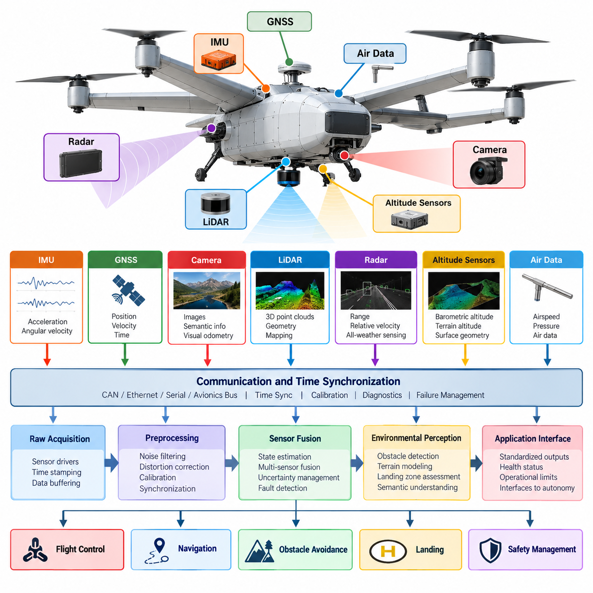
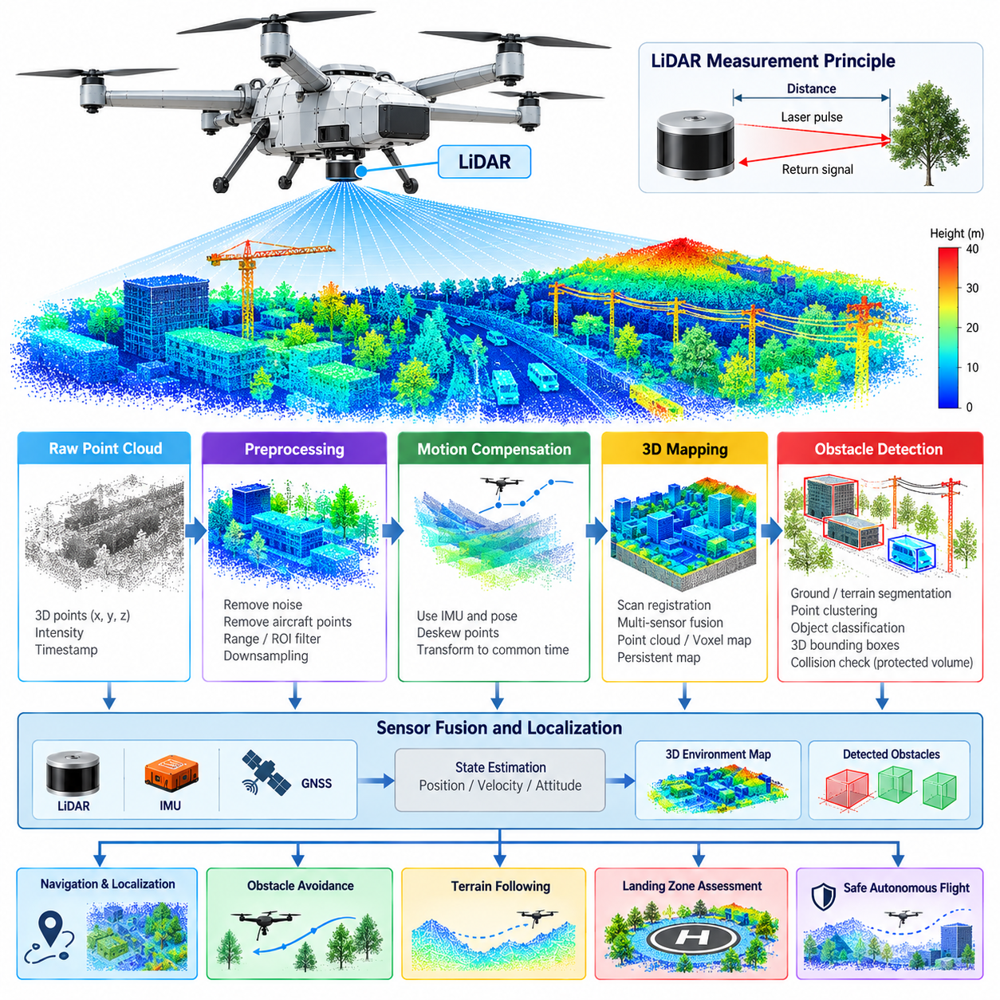
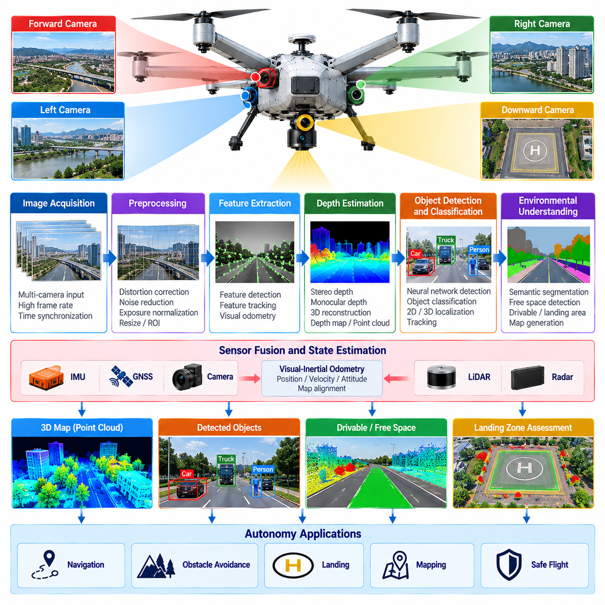
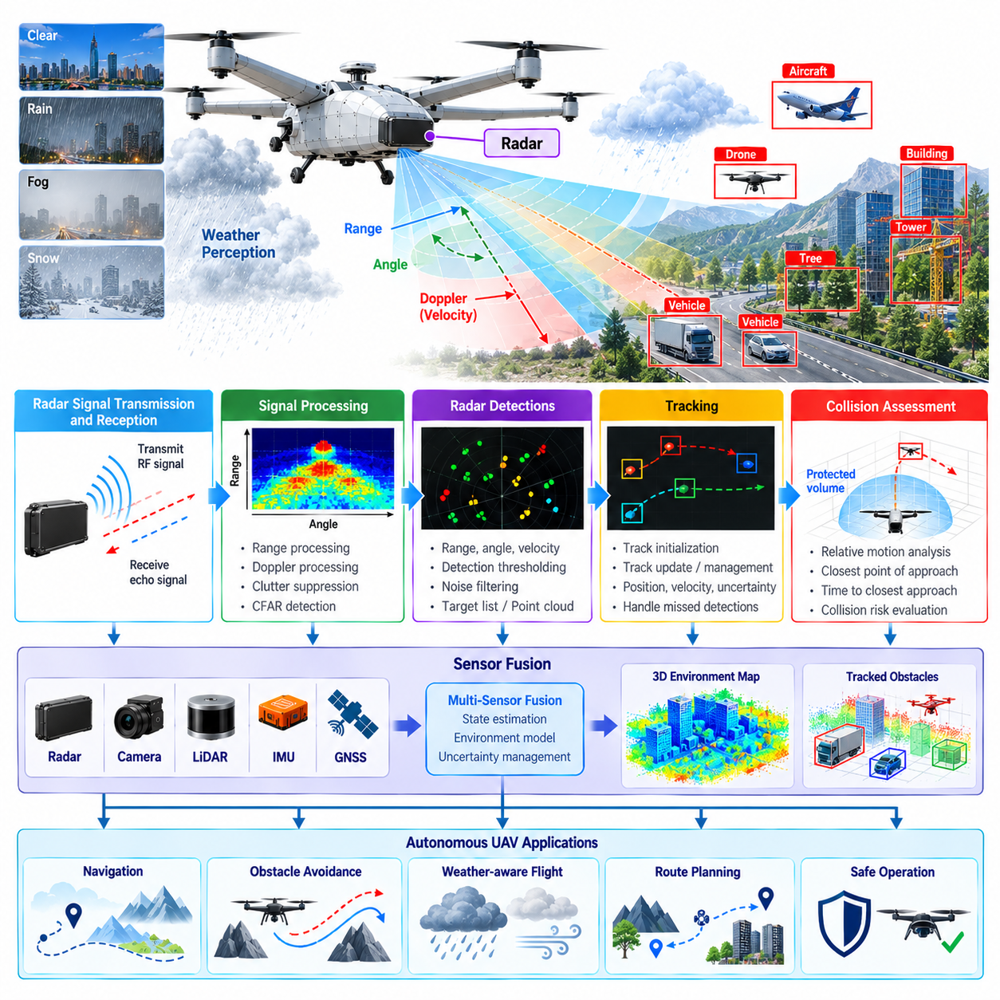
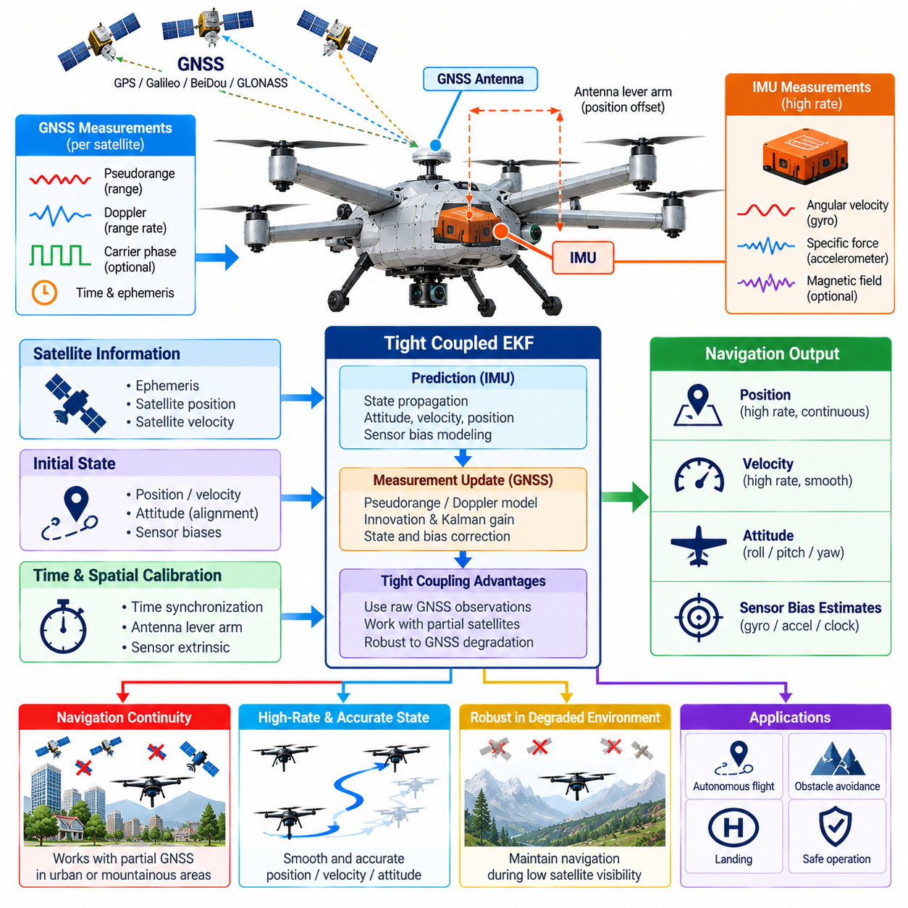
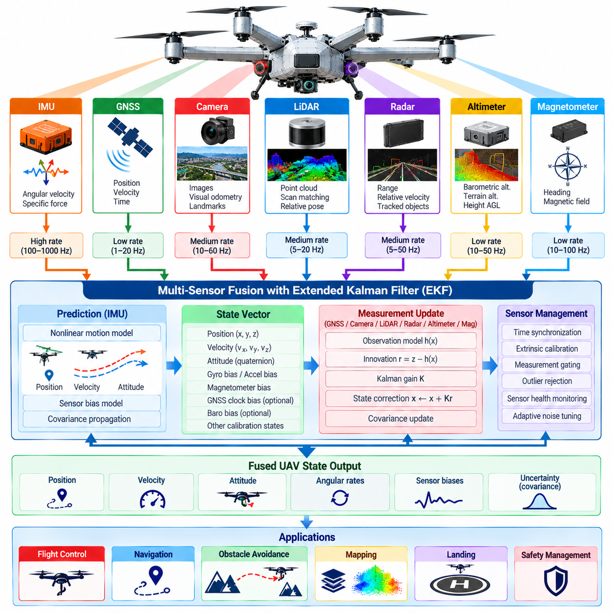
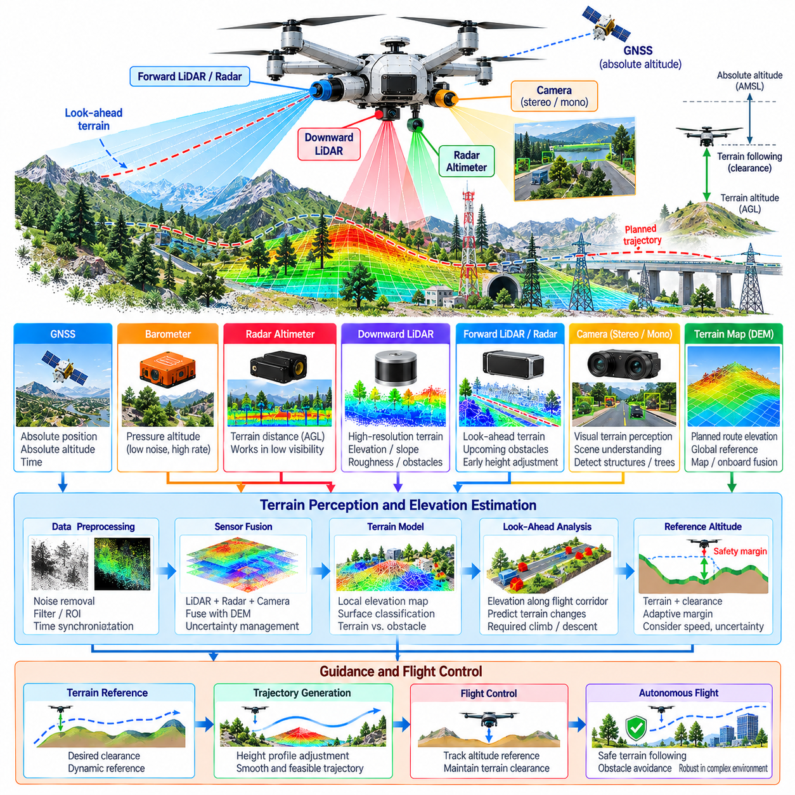
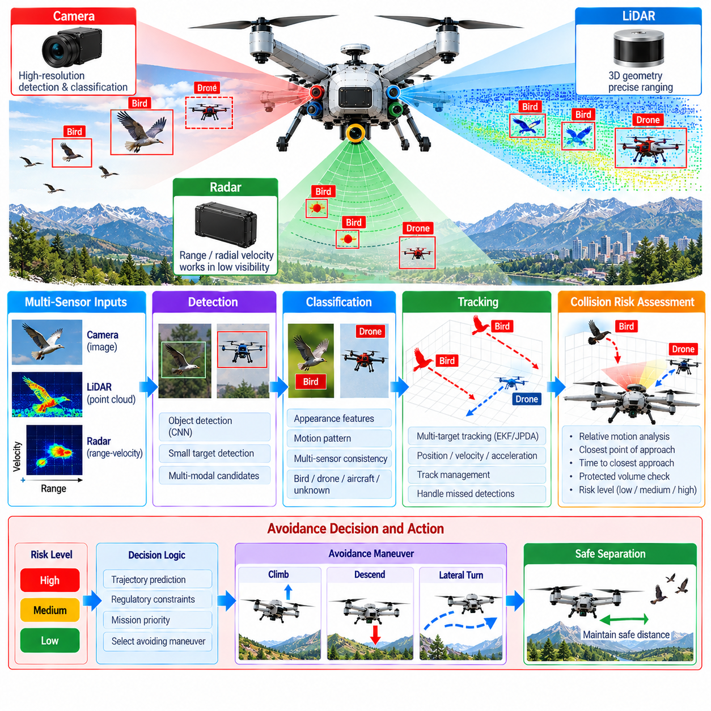
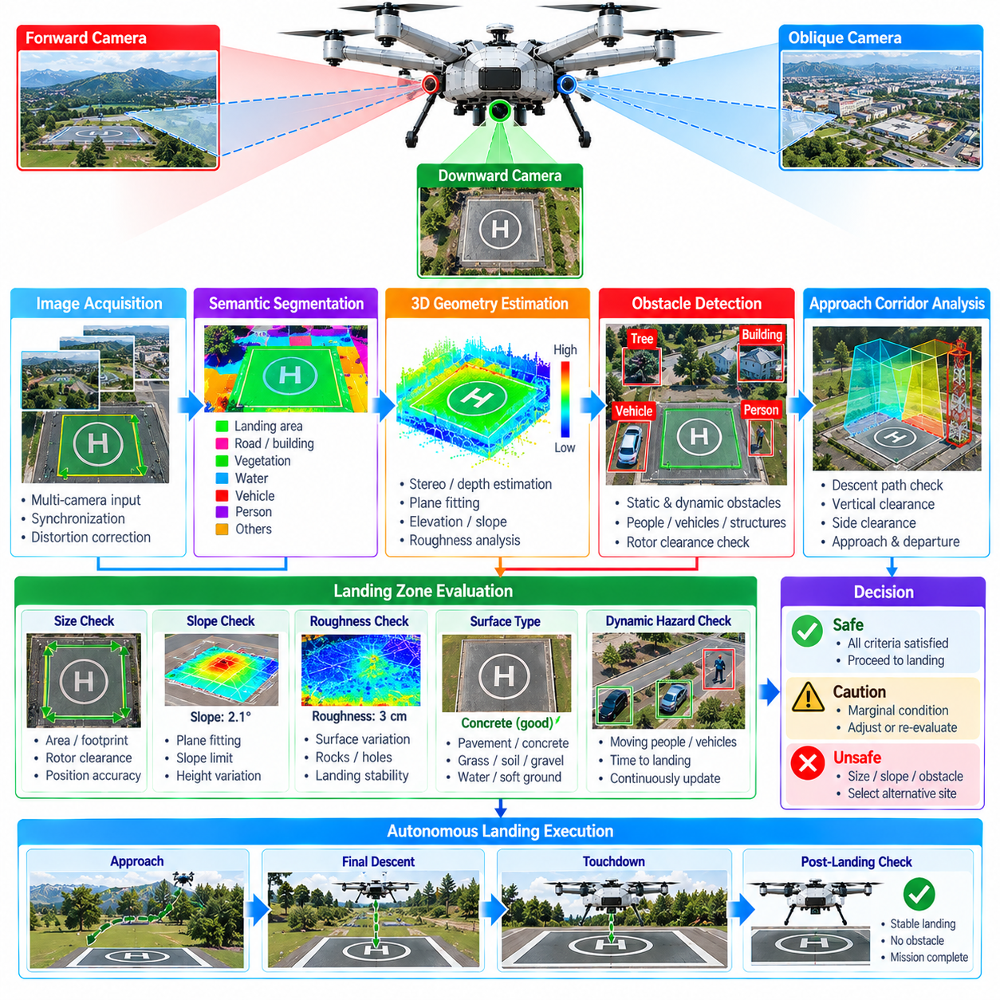
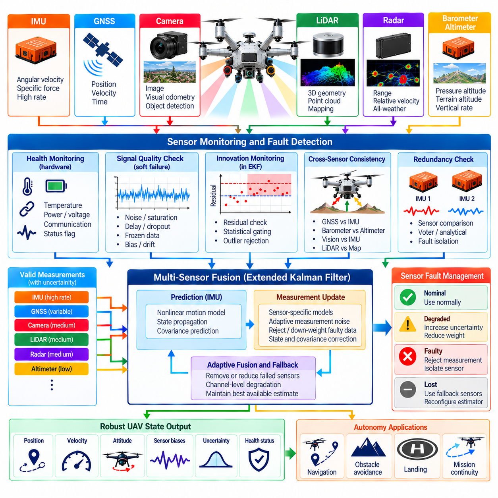

**Volume 23. Cargo UAV Autonomy and Flight AI**

# Chapter 05. Perception and Sensor Fusion for UAV

## 05.01. UAV Sensor Suite Architecture and Integration

{width="7.268055555555556in" height="7.268055555555556in"}

A cargo UAV sensor suite must be designed as an integrated perception infrastructure rather than as a collection of independent sensing devices. The architecture combines inertial, satellite navigation, vision, LiDAR, radar, altitude, air-data, and vehicle-health sensors so that flight-control, navigation, obstacle-avoidance, landing, and safety functions receive consistent information about vehicle state and the surrounding environment. Volume_23_Cargo_UAV_Autonomy_an...

The inertial measurement unit forms the highest-rate foundation of the sensing architecture. Three-axis accelerometers and gyroscopes continuously measure specific force and angular velocity, while magnetometers may provide heading references when electromagnetic conditions permit. Because inertial measurements accumulate bias and integration error, the IMU is normally combined with independent absolute or relative measurements rather than being used as a standalone navigation source.

GNSS provides geographically referenced position, velocity, and time information and becomes especially important during long-range cargo operations. Multi-constellation receivers, differential corrections, and RTK-capable configurations can improve availability and positioning accuracy. The sensor architecture should nevertheless assume that satellite navigation can become degraded by terrain, buildings, interference, jamming, spoofing, antenna faults, or unfavorable satellite geometry.

Camera systems extend perception from vehicle-state estimation into semantic understanding of the environment. Forward-facing cameras can support obstacle recognition and navigation, downward-facing cameras can provide visual odometry and landing-zone information, and stereo or multi-camera arrangements can estimate depth. Their placement must consider field of view, vibration, propeller visibility, aerodynamic structures, lighting variation, contamination, and synchronization with other sensors.

LiDAR supplies geometrically precise three-dimensional measurements that complement camera information. Point clouds can represent terrain, buildings, vegetation, wires, vehicles, landing surfaces, and other structures around the aircraft. For cargo UAVs operating close to infrastructure or in GNSS-denied environments, LiDAR can contribute to localization, mapping, obstacle detection, terrain following, and landing-zone assessment while preserving direct geometric information about surrounding objects.

Radar provides another complementary sensing channel because its physical operating characteristics differ significantly from optical sensors. Radar can contribute range and relative-velocity measurements and may remain useful when visibility, illumination, haze, dust, or precipitation reduces camera or LiDAR effectiveness. A robust UAV perception architecture therefore exploits sensor diversity rather than expecting one sensing modality to perform reliably under every operational condition.

Altitude sensing should combine measurements appropriate to different flight regimes. Barometric altitude provides lightweight and continuous vertical information, GNSS supplies globally referenced altitude, radar or laser altimeters can measure distance to terrain, and downward perception sensors can estimate local surface geometry. These measurements have different error characteristics, reference frames, ranges, and update rates, requiring explicit fusion and validity management before they are consumed by control functions.

Sensor integration begins with electrical and physical interfaces but cannot end there. Each device requires defined power, communication bandwidth, initialization behavior, calibration data, diagnostic status, and failure response. Interfaces such as CAN, Ethernet, serial links, or dedicated avionics buses must be selected according to data rate and criticality, while high-bandwidth cameras and LiDAR generally require substantially different transport resources from compact inertial or air-data sensors.

Accurate time synchronization is fundamental to multi-sensor perception on a moving aircraft. A camera frame, LiDAR scan, radar return, GNSS observation, and IMU sample represent different physical states if their timestamps are misaligned. Hardware timestamps, synchronized clocks, trigger signals, or disciplined network timing should therefore preserve measurement acquisition time as closely as possible, allowing fusion algorithms to compensate for transport and processing latency.

Spatial calibration is equally important because every sensor observes the aircraft and environment from a different physical location and orientation. The system must maintain transformations between sensor frames, the vehicle body frame, navigation frame, and relevant world frames. Lever-arm offsets become particularly significant on large cargo UAVs, where antennas, cameras, radars, and inertial units may be separated by several meters and experience measurable differences during rotation.

A practical integration architecture separates raw acquisition, preprocessing, state estimation, environmental perception, and application interfaces. Sensor drivers convert device-specific protocols into standardized measurements, preprocessing modules perform filtering and compensation, and fusion components estimate coherent vehicle or environmental states. This separation prevents flight-control and autonomy applications from becoming tightly coupled to individual sensor models and supports controlled hardware replacement or upgrades.

The sensor-fusion layer must preserve uncertainty rather than simply combining measurements numerically. Every observation has noise, bias, latency, calibration uncertainty, environmental sensitivity, and potential failure modes. Covariance estimates, confidence measures, innovation tests, and consistency checks allow estimators to determine how strongly each measurement should influence the current state estimate and whether a measurement has become inconsistent with the rest of the sensing system.

Cargo UAV architecture places additional emphasis on redundancy because perception failures can directly affect a heavy aircraft carrying substantial payload. Critical state variables should not depend on a single sensor or communication path whenever the safety concept requires continued operation after failure. Multiple IMUs, GNSS receivers, altimeters, or complementary perception modalities can provide independent evidence while monitoring logic identifies disagreement, degradation, and loss of validity.

Redundancy does not mean blindly averaging duplicate measurements. Sensors can experience common-mode failures caused by shared power supplies, mounting structures, electromagnetic interference, software defects, environmental conditions, or identical algorithmic assumptions. Architectural independence therefore requires careful consideration of power domains, communication paths, sensor diversity, physical placement, processing resources, and software partitioning so that one fault does not silently invalidate multiple supposedly redundant channels.

Sensor-health management operates continuously alongside normal perception. Drivers and fusion modules should monitor communication timeouts, stale timestamps, impossible values, excessive noise, bias growth, temperature limits, calibration status, packet loss, and disagreement between independent measurements. Health information must propagate with the sensor data so downstream autonomy and flight-control components can distinguish a valid estimate from one generated under degraded sensing conditions.

Graceful degradation is especially important because the surrounding chapter structure explicitly progresses from individual LiDAR, camera, radar, and inertial functions toward multi-sensor fusion and sensor-failure fallback. Volume_23_Cargo_UAV_Autonomy_an... If one modality becomes unavailable, the architecture should determine which capabilities remain trustworthy, reduce operational authority when necessary, and transition toward alternate navigation, contingency flight, return, holding, or landing behavior instead of allowing uncontrolled estimator degradation.

Computing placement must account for both deterministic flight-critical processing and computationally intensive perception. High-rate inertial estimation may execute close to the flight-control computer, while image processing, point-cloud analysis, object detection, and semantic perception can run on dedicated edge accelerators. Interfaces between these domains should expose bounded, well-defined state and perception products rather than allowing noncritical AI workloads to interfere with deterministic control execution.

Integration must also consider the relationship between perception and the broader avionics architecture. The volume structure places sensor-suite integration within UAV system architecture and later develops perception into navigation, collision avoidance, terrain following, landing assessment, and failure fallback functions. Volume_23_Cargo_UAV_Autonomy_an... This implies that sensor infrastructure should be reusable across multiple consumers while maintaining clear ownership of raw data, fused states, diagnostics, and safety decisions.

Verification begins before flight testing. Individual sensor drivers can be tested with recorded data and simulated faults, calibration procedures can be validated against known references, and synchronization accuracy can be measured under representative processing loads. Software-in-the-loop and hardware-in-the-loop environments can inject delayed, missing, corrupted, biased, or contradictory sensor measurements to verify that estimators and health-management logic respond predictably before airborne operation.

Ultimately, the UAV sensor suite should provide a trustworthy and continuously qualified representation of vehicle motion and surrounding space. Its effectiveness depends not merely on sensor resolution but on synchronization, calibration, uncertainty modeling, redundancy, fault isolation, deterministic data transport, and well-defined interfaces. These architectural foundations enable the later LiDAR, camera, radar, IMU-GNSS fusion, terrain perception, collision detection, landing assessment, and fallback functions to operate as one coherent perception system.

## 05.02. LiDAR 3D Mapping and Obstacle Detection [w/Code]

{width="7.268055555555556in" height="7.268055555555556in"}

LiDAR provides cargo UAVs with direct three-dimensional measurements of surrounding geometry by estimating the distance between the aircraft and reflecting surfaces. Unlike passive vision, the sensor actively emits laser energy and measures its return, producing spatial samples that can be transformed into a point cloud. This geometric representation supports mapping, localization, obstacle detection, terrain perception, and safe autonomous flight.

A UAV LiDAR installation must balance sensing range, angular resolution, field of view, scan rate, weight, electrical power, aerodynamic exposure, and environmental robustness. Long-range sensing is valuable during high-speed flight because the autonomy system needs sufficient time to detect hazards and modify the trajectory. Near-field coverage is equally important during takeoff, landing, hovering, and operations close to infrastructure.

Each LiDAR return is initially represented in the coordinate frame of the sensor. To make these measurements useful for navigation, the system transforms them through calibrated sensor-to-body and body-to-navigation relationships. Accurate extrinsic calibration is therefore essential. Even a small angular mounting error can produce substantial spatial displacement at long range, causing distorted maps, inaccurate obstacle positions, and inconsistent alignment between successive scans.

Motion compensation is particularly important for airborne LiDAR because the sensor is continuously translating and rotating while collecting a scan. Points measured at the beginning and end of one scan may correspond to different vehicle poses. High-rate IMU measurements and estimated vehicle motion can be used to deskew the point cloud, transforming individual returns toward a common temporal reference before mapping or obstacle processing begins.

The raw point cloud normally passes through preprocessing before entering higher-level perception. Invalid returns, isolated noise, extremely weak measurements, and points corresponding to known parts of the aircraft can be removed. Range limits and region-of-interest filters reduce unnecessary computation, while voxel-based downsampling can decrease point density without eliminating the dominant geometric structure required for mapping and collision assessment.

Three-dimensional mapping converts successive LiDAR observations into a persistent spatial representation. The system estimates the UAV pose associated with each scan and transforms observed points into a common map frame. Scan registration can align overlapping geometric structures between observations, while inertial and GNSS information can constrain accumulated motion. The resulting map represents surfaces around the aircraft rather than treating every LiDAR scan as an isolated measurement.

Map representation should be selected according to the autonomy function. Dense point-cloud maps preserve detailed geometry but can require substantial memory and processing bandwidth. Voxel maps divide three-dimensional space into discrete cells, while occupancy representations estimate whether individual regions are free, occupied, or unknown. Local maps can emphasize immediate collision avoidance, whereas larger persistent maps can support localization, route execution, and repeated operations.

Obstacle detection begins by distinguishing potentially hazardous structures from free space and irrelevant measurements. Buildings, poles, cranes, trees, cables, terrain, vehicles, and other aircraft may all become collision hazards depending on the mission. Rather than relying only on object identity, a safety-oriented system can first determine whether measured geometry intersects the protected volume or predicted flight corridor of the cargo UAV.

Point clustering groups spatially related measurements into candidate obstacles. Geometric properties such as cluster dimensions, orientation, density, height, and distance can then support further interpretation. Ground or terrain segmentation is also important because terrain should not always be processed as an isolated obstacle. The perception system must instead determine whether terrain elevation, slope, or protruding structures violate the required flight clearance.

Obstacle representation must include the physical dimensions and dynamic behavior of the aircraft. A large cargo UAV cannot be modeled as a single point because its rotors, wings, fuselage, payload structure, and safety margins occupy substantial space. Detected geometry can therefore be expanded by an appropriate clearance margin, or the aircraft footprint can be incorporated into collision checking so that trajectory planning respects the complete protected volume.

Detection range and stopping or maneuvering distance are tightly coupled. A sensor may technically detect an object at long range, but useful avoidance requires enough time for filtering, classification, trajectory generation, control response, and physical maneuver execution. Aircraft velocity, mass, payload, wind, actuator authority, and regulatory separation requirements therefore influence how far ahead the perception system must reliably detect obstacles.

LiDAR-based obstacle processing should distinguish static and dynamic structures whenever sufficient temporal information is available. Static buildings or terrain can be integrated into persistent maps, while objects whose measured positions change across observations require tracking. Estimated position, velocity, uncertainty, and motion consistency can then be supplied to collision prediction so the autonomy system evaluates where an obstacle is likely to be rather than only where it was measured.

Thin objects create a particularly demanding problem for airborne LiDAR. Power lines, cables, antennas, branches, and narrow structural elements may produce relatively few returns and can disappear depending on range, incidence angle, resolution, and surface reflectivity. Filtering algorithms must therefore avoid aggressively deleting sparse measurements when those measurements could correspond to safety-critical obstacles within the projected flight path.

Environmental conditions also influence LiDAR performance. Rain, fog, dust, snow, direct sunlight, reflective surfaces, dark materials, and unfavorable incidence angles can reduce measurement quality or generate misleading returns. The perception architecture should associate measurements with validity and confidence information rather than assuming every point is equally trustworthy. Complementary camera and radar sensing can provide additional evidence when optical ranging becomes degraded.

Real-time execution requires careful management of computational load. High-resolution LiDAR can generate large point clouds at repeated scan rates, while mapping, registration, segmentation, clustering, and collision analysis must complete within bounded latency. Processing pipelines can use spatial cropping, voxelization, parallel computation, GPU acceleration, and local-map management to limit workload while preserving information important to flight safety.

The mapping subsystem should manage uncertainty and map aging. Position-estimation errors can cause repeated surfaces to appear blurred or duplicated, while dynamic objects can leave obsolete occupied regions if measurements are retained indefinitely. Local occupancy information should therefore be updated according to observation confidence and time, allowing newly observed free space to clear outdated obstacles while preventing transient sensor noise from rapidly changing safety-critical map states.

LiDAR perception must also remain synchronized with the broader UAV state-estimation system. Point clouds processed with an incorrect attitude or position estimate can generate internally consistent but geographically incorrect obstacles. Timestamp integrity, IMU synchronization, GNSS alignment, calibration version, and pose uncertainty should therefore accompany the mapping process so downstream navigation modules understand both the estimated geometry and the confidence of its spatial reference.

Obstacle information should be delivered through a stable interface rather than exposing every autonomy component directly to raw point clouds. The perception layer can publish local occupancy maps, obstacle tracks, free-space regions, terrain surfaces, or collision-relevant geometric primitives. Navigation and avoidance modules can then consume representations appropriate to their timing requirements while the LiDAR pipeline retains responsibility for sensor-specific preprocessing and geometric interpretation.

Failure monitoring must detect both complete sensor loss and gradual degradation. Missing scans, abnormal point counts, excessive invalid returns, timing discontinuities, temperature faults, blocked fields of view, calibration changes, or disagreement with other sensors can indicate degraded LiDAR operation. The autonomy system should respond according to the remaining perception capability, potentially reducing speed, increasing clearance, switching sensor sources, modifying the route, or initiating contingency behavior.

Validation should reproduce the geometric and environmental conditions expected during cargo missions. Recorded point clouds and simulation can test algorithmic behavior, while hardware-in-the-loop configurations can evaluate timing and interface failures. Flight testing should progressively examine open terrain, buildings, vegetation, thin obstacles, changing altitude, dynamic targets, adverse visibility, and representative vehicle speeds while measuring detection probability, false alarms, range accuracy, and processing latency.

LiDAR ultimately acts as both a geometric perception sensor and an important contributor to the UAV safety envelope. Its value depends not only on producing dense three-dimensional points but on transforming those measurements into synchronized, calibrated, uncertainty-aware information that autonomy software can use in real time. Integrated with mapping, state estimation, obstacle tracking, navigation, and complementary sensors, LiDAR enables cargo UAVs to maintain spatial awareness in complex three-dimensional operating environments.

## 05.03. Camera Based Perception for UAV [w/Code]

{width="7.268055555555556in" height="7.268055555555556in"}

Camera-based perception gives a cargo UAV rich visual information about terrain, infrastructure, obstacles, landing areas, vehicles, people, and other objects that cannot be described adequately by vehicle-state sensors alone. Cameras provide high spatial resolution with relatively low mass and power consumption, making them useful for navigation, object recognition, collision avoidance, landing assistance, and semantic understanding of the operating environment.

The camera architecture should reflect the direction and purpose of observation. Forward-facing cameras provide information along the flight path, downward-facing cameras support visual localization and landing, and side or panoramic cameras can increase situational awareness around the aircraft. A multi-camera arrangement can reduce blind regions, while stereo cameras provide geometric depth when sufficient texture, baseline, resolution, and image correspondence are available.

Camera selection requires tradeoffs among resolution, frame rate, field of view, dynamic range, sensitivity, shutter type, interface bandwidth, weight, and processing cost. High resolution improves recognition of distant or small objects but increases data volume and inference workload. Wide-angle optics expand coverage but reduce effective pixel density and introduce distortion, requiring the sensing configuration to be optimized around mission speed, altitude, and required detection distance.

Image quality depends strongly on aircraft motion. Cargo UAVs experience vibration, attitude changes, translational motion, rotor-induced disturbances, and potentially rapid maneuvers. Rolling-shutter cameras can introduce geometric distortion when image rows are exposed at different times, while global-shutter sensors capture the frame more consistently during motion. Mechanical isolation, short exposure times, stabilization, and software motion compensation can further improve usable imagery.

Geometric calibration establishes the relationship between image pixels and rays in three-dimensional space. Intrinsic calibration estimates focal length, principal point, and lens distortion, while extrinsic calibration determines camera position and orientation relative to the UAV body frame and other sensors. Calibration accuracy directly affects visual odometry, stereo depth, sensor fusion, obstacle localization, and the projection of mapped objects between camera, LiDAR, and navigation coordinate systems.

Time synchronization is equally important because an image represents the environment at a specific aircraft pose. A timestamp error during fast flight can translate into a substantial spatial error when visual observations are fused with IMU, GNSS, LiDAR, or radar data. Hardware triggering and acquisition timestamps are preferable where available, while processing timestamps should remain distinguishable from actual exposure time so downstream algorithms can compensate for latency correctly.

Visual preprocessing prepares camera data for perception algorithms while controlling computational cost. Typical operations include distortion correction, resizing, exposure normalization, noise reduction, image rectification, and region-of-interest selection. Preprocessing must avoid removing subtle features that may correspond to distant obstacles or landing hazards. Different processing branches may therefore use different image resolutions depending on whether they support localization, detection, or semantic interpretation.

Visual feature extraction supports motion estimation and localization by identifying repeatable structures across consecutive images. Corners, edges, textured regions, or learned visual descriptors can be tracked over time to estimate relative camera motion. When combined with inertial measurements, visual-inertial estimation can provide high-rate pose information and maintain navigation during temporary GNSS degradation, although performance depends on sufficient visual structure and accurate temporal alignment.

Stereo perception estimates depth by finding corresponding image regions observed from cameras separated by a known baseline. Disparity between matched pixels can be converted into distance, producing depth maps or three-dimensional points. Stereo methods are particularly useful in textured environments and moderate ranges, but accuracy decreases with distance and can degrade over repetitive patterns, low-texture surfaces, poor illumination, or incorrect camera synchronization.

Monocular cameras cannot directly determine metric depth from a single conventional image without additional assumptions, but motion, learned depth models, known object dimensions, or fusion with other sensors can provide useful distance estimates. Monocular systems offer low weight and simple installation, making them attractive for distributed visual coverage. Their uncertainty must nevertheless be represented explicitly when distance estimates are used for collision avoidance or trajectory modification.

Object detection transforms image content into operationally meaningful entities. Neural-network detectors can identify aircraft, drones, birds, vehicles, people, buildings, towers, cranes, and other classes relevant to the mission. For autonomous flight, classification alone is insufficient; detections should also include location, confidence, temporal consistency, and preferably depth or three-dimensional position so navigation software can evaluate whether an observed object creates a collision risk.

Object tracking connects detections across multiple frames and estimates how objects move relative to the UAV. Tracking reduces instability caused by intermittent detections and supports estimation of relative direction and velocity. When camera observations are associated with vehicle motion and depth information, the system can distinguish stationary structures from moving targets and provide trajectory prediction with uncertainty to sense-and-avoid or collision-assessment functions.

Semantic segmentation assigns visual categories to image regions rather than producing only discrete object boxes. Terrain, vegetation, buildings, roads, water, sky, landing surfaces, vehicles, and people can be separated into meaningful regions. This dense interpretation is useful when the autonomy system must reason about traversable airspace, terrain boundaries, landing suitability, or environmental context instead of simply detecting predefined objects.

Camera perception is particularly important during landing because visual information can characterize surface conditions that basic altitude sensors cannot describe. Downward imagery can detect landing markers, estimate relative pose, identify surface boundaries, and evaluate hazards such as vehicles, people, debris, vegetation, excessive slope, or insufficient clear area. Visual observations can therefore contribute both to precision landing guidance and to deciding whether a candidate landing zone should be rejected.

Environmental variability remains one of the primary limitations of camera-based perception. Illumination can change from bright sunlight to shadow, twilight, night, glare, or backlighting, while rain, fog, snow, dust, lens contamination, and condensation can reduce image quality. High dynamic range sensors, thermal or infrared cameras, active cleaning, exposure control, and complementary LiDAR or radar can reduce dependence on any single visual condition.

Small and distant airborne objects are especially difficult because they may occupy only a few pixels. Birds, small drones, or approaching aircraft can initially appear as weak visual features with uncertain identity and depth. Detection performance therefore depends not only on neural-network accuracy but also on optics, resolution, frame rate, stabilization, detection range, background contrast, and temporal processing that accumulates evidence across successive observations.

Real-time perception requires balancing model capability against deterministic processing latency. High-resolution images and sophisticated neural networks can improve semantic performance but may overload onboard computing resources. Practical systems use optimized inference engines, reduced-precision computation, hardware accelerators, region-based processing, model compression, or multiple processing rates so safety-relevant outputs remain available within the timing constraints imposed by aircraft velocity.

Confidence and uncertainty should accompany visual perception outputs. Neural-network scores alone do not guarantee that an observation is physically correct, particularly when the environment differs from training data. Temporal consistency, geometric checks, sensor agreement, image-quality indicators, and out-of-distribution monitoring can provide additional evidence. Low-confidence perception should lead to conservative behavior rather than being silently treated as reliable environmental knowledge.

Camera-health monitoring should detect missing frames, frozen images, excessive latency, corrupted data, abnormal exposure, severe blur, blocked lenses, synchronization faults, overheating, and communication failures. Multiple cameras can provide overlapping coverage, but redundancy should consider common causes such as shared power, identical optics, environmental contamination, or common processing software. Health status must propagate to fusion and autonomy components when visual capability becomes degraded.

Validation requires datasets and flight tests that represent the actual operational domain. Testing should include different altitudes, speeds, attitudes, terrain types, seasons, lighting conditions, weather, obstacle sizes, backgrounds, and landing environments. Recorded flight data, simulation, synthetic imagery, software-in-the-loop, and hardware-in-the-loop testing can complement progressively more demanding flight trials while measuring detection probability, localization accuracy, false alarms, and end-to-end latency.

Camera-based perception ultimately converts visual observations into structured information that autonomous flight software can use for decisions. Its strength lies in detailed appearance and semantic information, while its weaknesses arise from lighting, visibility, depth ambiguity, motion, and computational demand. Integrated with IMU, GNSS, LiDAR, radar, mapping, and sensor fusion, camera perception becomes a major component of the cargo UAV\'s three-dimensional situational awareness and autonomous safety architecture.

## 05.04. Radar Based Obstacle Detection Weather [w/Code]

{width="7.268055555555556in" height="7.268055555555556in"}

Radar provides cargo UAVs with an active sensing capability for detecting obstacles and observing atmospheric conditions when optical sensors become unreliable. By transmitting radio-frequency energy and analyzing reflected signals, radar can estimate range, direction, and relative radial velocity. Its ability to operate through darkness, haze, dust, and some precipitation makes it an important complementary sensor within a multi-modal UAV perception architecture.

Radar selection for a cargo UAV requires tradeoffs among operating frequency, detection range, angular resolution, field of view, update rate, antenna size, power consumption, mass, and environmental tolerance. Long-range coverage provides additional reaction time during cruise, while wider angular coverage supports maneuvering and terminal operations. The required configuration depends strongly on aircraft velocity, physical dimensions, mission altitude, and expected obstacle environment.

Frequency-modulated continuous-wave radar can estimate target distance from the frequency difference between transmitted and received signals while Doppler processing measures radial velocity. Multiple transmit and receive antennas can additionally provide angular information. These measurements produce radar detections that may be organized as range-angle maps, range-Doppler representations, target lists, or radar point clouds for downstream perception and tracking.

Radar installation must account for the electromagnetic and mechanical characteristics of the aircraft. Antenna placement should minimize blockage by the fuselage, cargo structure, landing gear, rotors, propulsion components, or other sensors. Radomes and protective covers must preserve acceptable radio-frequency transmission, while vibration, structural deformation, electromagnetic interference, and reflections from the aircraft itself should be considered during integration and calibration.

Accurate radar-to-body calibration establishes the transformation between radar measurements and the UAV coordinate system. Angular misalignment can cause a detected obstacle to appear displaced from its true flight-path relationship, particularly at long range. Calibration parameters must therefore remain associated with sensor configuration and mounting state so obstacle detections can be consistently transformed into navigation, mapping, and collision-assessment coordinate frames.

Time synchronization is essential when radar measurements are combined with IMU, GNSS, camera, or LiDAR information. During high-speed flight, even modest timing errors can shift the apparent location of a target. Measurement acquisition timestamps should therefore be preserved independently of processing or communication time, allowing vehicle motion to be compensated and enabling fusion algorithms to associate observations that represent the same physical instant.

Raw radar measurements contain both useful targets and unwanted reflections known as clutter. Terrain, buildings, vegetation, water surfaces, aircraft structures, and multipath propagation can produce strong returns that complicate obstacle detection. Signal processing therefore applies detection thresholds, clutter suppression, Doppler filtering, and spatial consistency checks to identify candidate targets without allowing persistent background reflections to dominate the perception output.

Constant false alarm rate processing can adapt detection thresholds according to the surrounding signal environment rather than applying a fixed threshold everywhere. This is useful when background energy changes with terrain or weather. Threshold selection nevertheless requires careful tuning because excessive sensitivity increases false detections, while aggressive suppression can remove weak but safety-relevant targets such as small aircraft, drones, cables, or distant structures.

Doppler information is one of radar\'s major advantages for airborne obstacle perception. A measured radial velocity helps distinguish objects with different relative motion and can support separation between static background structures and dynamic targets. Because the UAV itself is moving, however, ego-motion compensation is required. Vehicle velocity and attitude estimates must be incorporated so observed Doppler can be interpreted relative to the environment rather than only relative to the sensor.

Radar detections collected across successive measurement cycles can be associated into tracks. A tracking filter estimates target position, velocity, uncertainty, and temporal continuity while rejecting isolated detections that are inconsistent with persistent motion. Track management must handle target appearance, disappearance, missed detections, crossing trajectories, and ambiguous associations, particularly when several objects occupy similar angular regions or ranges.

Collision assessment requires more than reporting target range. The system must determine whether the relative motion between the UAV and an obstacle creates a future spatial conflict. Estimated closest point of approach, time to closest approach, relative velocity, protected aircraft volume, and uncertainty can be evaluated together. These quantities allow the sense-and-avoid system to prioritize targets that pose genuine collision risk rather than reacting equally to every radar return.

Radar is particularly valuable for detecting moving airborne objects such as other aircraft, helicopters, drones, and potentially birds. Such targets may be difficult for cameras to recognize at long distance and may produce sparse LiDAR returns. Radar velocity measurements provide an additional cue for early detection and tracking, although target size, aspect angle, radar cross section, antenna resolution, and background clutter strongly influence achievable performance.

Static obstacle detection presents different challenges because buildings, towers, cranes, terrain, and other fixed structures may have near-zero environmental velocity. Their apparent Doppler is dominated by UAV motion and viewing geometry. Combining compensated radar range and angle measurements with navigation state allows these structures to be positioned relative to the planned flight corridor, where they can be evaluated against vehicle clearance and maneuvering requirements.

Weather sensing extends radar beyond obstacle detection. Atmospheric particles and precipitation can generate measurable radar returns whose intensity and spatial distribution provide evidence of rain or other weather phenomena. For autonomous cargo operations, this information can contribute to identifying degraded flight regions and supporting route or speed decisions. Weather interpretation should remain consistent with the capabilities and frequency characteristics of the installed radar.

Rain can simultaneously be useful information and a source of perception degradation. Distributed precipitation produces numerous radar returns that can increase background energy and create apparent targets. Processing must therefore distinguish compact obstacle-like detections from spatially distributed weather echoes where possible. The perception system should communicate weather-related confidence degradation rather than silently presenting uncertain radar measurements as high-confidence physical obstacles.

Different environmental conditions affect radar differently from cameras and LiDAR. Darkness has little direct effect on radar, while fog, dust, or visual glare may degrade optical perception much more severely. Heavy precipitation can still attenuate or contaminate radar measurements depending on frequency and range. This complementary behavior is the reason radar is most effective as part of sensor diversity rather than as a universal replacement for other perception modalities.

Multi-sensor fusion can combine radar\'s range and velocity information with camera semantics and LiDAR geometry. A camera may identify what an object is, LiDAR may describe its detailed three-dimensional shape, and radar may provide robust relative velocity and range measurements under degraded visibility. Association algorithms must account for different coordinate frames, fields of view, resolutions, update rates, timestamps, and uncertainty characteristics before observations are treated as the same object.

Real-time radar processing must maintain bounded latency from signal acquisition to obstacle output. Signal transforms, detection, angle estimation, clustering, tracking, ego-motion compensation, and sensor fusion all consume processing resources. Hardware acceleration and optimized pipelines may be required when several radar units provide overlapping coverage. Safety functions should receive timely tracks even when noncritical perception workloads place heavy demand on onboard computers.

Radar health monitoring should detect communication loss, missing frames, abnormal noise floors, antenna faults, excessive interference, temperature problems, timing discontinuities, calibration inconsistencies, and implausible target patterns. Gradual degradation can be more difficult to recognize than complete failure, so consistency with vehicle motion and complementary sensors provides valuable diagnostic evidence. Degraded radar status should propagate to the fusion and autonomy layers.

The obstacle-detection system must support graceful fallback when radar capability becomes unavailable or unreliable. Camera and LiDAR information may maintain environmental perception under favorable visibility, while navigation state and operational constraints can determine whether continued flight remains acceptable. Conversely, radar may receive greater fusion weight when optical sensing deteriorates, provided radar health and measurement consistency remain within validated limits.

Validation should include representative targets, ranges, approach angles, aircraft speeds, terrain backgrounds, electromagnetic environments, and weather conditions. Simulation and recorded radar data can support algorithm development, while hardware-in-the-loop and flight tests evaluate timing, interference, mounting effects, and real target behavior. Metrics should include detection probability, false alarms, range and velocity accuracy, track continuity, processing latency, and performance under degraded weather.

Radar-based perception ultimately strengthens cargo UAV autonomy by providing a sensing channel whose failure characteristics differ from those of cameras and LiDAR. Its combination of direct range measurement, Doppler velocity, long-range detection, and resilience to several visibility limitations makes it valuable for obstacle detection and weather awareness. Integrated with navigation, tracking, sensor fusion, and sense-and-avoid functions, radar contributes to a more robust perception and flight-safety architecture.

## 05.05. IMU GNSS Tight Coupling for UAV [w/Code]

{width="7.268055555555556in" height="7.268055555555556in"}

Inertial Measurement Unit and Global Navigation Satellite System tight coupling provides a cargo UAV with continuous, high-rate navigation by combining complementary sensor characteristics. The IMU measures angular velocity and specific force at high frequency but accumulates drift when integrated over time, while GNSS provides globally referenced position and velocity observations whose availability and accuracy can vary with satellite geometry, interference, and signal blockage.

A tightly coupled architecture differs from a loosely coupled system in the level at which GNSS information enters the navigation estimator. Rather than waiting for the GNSS receiver to generate an independent position and velocity solution, the estimator directly processes measurements associated with individual satellites. Pseudorange, Doppler, carrier-phase, or related receiver observations can therefore contribute even when the receiver cannot maintain a complete standalone navigation fix.

The inertial navigation system propagates the UAV state between external observations. Gyroscope measurements update attitude, while accelerometer measurements are transformed from the body frame into the navigation frame and integrated to estimate velocity and position. Gravity, Earth rotation, coordinate-frame effects, and sensor calibration parameters must be modeled consistently because small systematic errors can grow into substantial navigation errors during extended flight.

A practical state vector normally contains more than position, velocity, and attitude. Gyroscope bias and accelerometer bias are commonly estimated because their errors directly drive inertial drift. Depending on system requirements, the estimator may also include scale factors, GNSS receiver clock bias and drift, antenna lever-arm parameters, atmospheric terms, or other calibration states whose uncertainty significantly influences the navigation solution.

The Extended Kalman Filter is a common framework for tightly coupled IMU-GNSS estimation. The prediction stage propagates the navigation state and covariance using the inertial measurements and system dynamics. When GNSS observations arrive, the filter predicts what each satellite measurement should be, compares that prediction with the actual receiver measurement, and uses the resulting innovation to correct the navigation state and associated sensor errors.

Measurement modeling is fundamental to tight coupling because GNSS observations are related directly to satellite geometry. Satellite ephemeris and timing information are used to determine satellite position and motion, from which expected pseudorange and range-rate measurements can be calculated. Receiver clock effects, atmospheric delays, Earth rotation, antenna location, and measurement uncertainty must be treated consistently to avoid introducing systematic errors into the fusion process.

Doppler or pseudorange-rate measurements are especially useful for constraining velocity. The IMU can provide smooth short-term velocity propagation, but accelerometer bias causes gradual drift. GNSS range-rate information supplies an independent reference that limits this growth. Combining the two allows the estimator to retain the high update rate of inertial navigation while periodically correcting errors using measurements tied to the external satellite constellation.

Precise time synchronization between IMU and GNSS is critical. A GNSS observation and an inertial sample must be associated with the correct physical state of the moving aircraft. At cargo UAV speeds, even relatively small timestamp errors can become meaningful position and velocity inconsistencies. Hardware timestamps, pulse-per-second references, disciplined clocks, and deterministic acquisition pipelines can reduce temporal uncertainty before measurements reach the estimator.

Spatial alignment also requires careful treatment because the IMU and GNSS antenna are rarely located at exactly the same physical point. The antenna lever arm describes the displacement between the inertial reference point and GNSS measurement location. During rotational motion this offset produces measurable differences in velocity and position, particularly on large cargo UAVs where antennas and avionics equipment may be separated by substantial distances.

Initialization establishes attitude, position, velocity, sensor biases, and covariance before normal navigation begins. GNSS can provide an initial geographic reference, while stationary or controlled-motion periods can support inertial alignment. Heading initialization may require vehicle motion, magnetometer information, multiple GNSS antennas, or another independent reference because accelerometers alone primarily constrain the gravity direction rather than absolute yaw.

Tight coupling becomes particularly valuable when satellite visibility deteriorates. A loosely coupled estimator may lose GNSS updates when the receiver cannot generate a full navigation solution, whereas a tightly coupled estimator can continue using valid measurements from the satellites that remain visible. This capability can improve navigation continuity near structures, terrain, partial antenna masking, or other environments where satellite geometry becomes temporarily unfavorable.

GNSS measurement quality must nevertheless be monitored continuously. Low carrier-to-noise ratio, abnormal residuals, inconsistent Doppler, multipath, cycle slips, satellite faults, jamming, or spoofing can make individual observations unreliable. Measurement screening and innovation testing can reject or down-weight suspicious inputs so corrupted satellite data do not force an otherwise stable inertial solution toward an incorrect navigation state.

Integrity monitoring is especially important for large autonomous cargo aircraft because navigation errors propagate into flight control, route tracking, geofence enforcement, collision avoidance, and landing decisions. The estimator should expose not only its best state estimate but also covariance, measurement validity, sensor health, and integrity indicators. Downstream autonomy functions can then adapt operational authority according to the confidence available in the navigation solution.

GNSS outages illustrate the complementary relationship between the two sensing systems. When satellite measurements disappear, the inertial system can continue propagating position, velocity, and attitude without interruption, but uncertainty grows with time because sensor biases are no longer externally corrected. The estimator should therefore increase covariance realistically rather than presenting a continuously propagated inertial solution with an unjustifiably high level of confidence.

Recovery after a GNSS outage must also be controlled carefully. Newly restored measurements may disagree significantly with the inertially propagated state, especially after a long interruption. Immediately applying a large correction can create discontinuities that disturb flight-control or guidance functions. Innovation gating, staged measurement acceptance, covariance-aware correction, and navigation-state smoothing can support stable convergence when reliable satellite observations return.

High-precision cargo UAV operations may incorporate differential GNSS or Real-Time Kinematic corrections. These techniques can substantially improve positioning accuracy when correction data and carrier-phase observations remain valid. Tight integration with inertial sensing helps bridge short interruptions and maintain smooth motion estimates, but the system must separately represent whether it currently has conventional GNSS, differential, float, or fixed high-precision positioning capability.

Redundant navigation architectures can include multiple IMUs, GNSS receivers, antennas, or independent estimator instances. Redundancy supports fault detection and continued operation, but common-mode failures remain possible. Shared antennas, common power supplies, identical receiver software, electromagnetic interference, or satellite-system disturbances can affect several channels simultaneously, so independence must be evaluated at the architectural level rather than assumed from device count alone.

Real-time implementation requires deterministic handling of sensors operating at very different rates. IMU data may arrive hundreds or thousands of times per second, while GNSS measurements typically update much more slowly. The estimator must propagate states efficiently between GNSS epochs, preserve precise timing, handle delayed observations, and publish navigation outputs at a rate appropriate for flight control without allowing communication or processing jitter to create inconsistent states.

Delayed measurements require particular attention because GNSS receiver processing and communication can introduce latency. If an observation is applied to the estimator\'s current state even though it represents an earlier instant, the correction becomes physically inconsistent. Navigation software can maintain state history, propagate measurements to a common time, or perform delayed-state updates so measurement timing is respected without unnecessarily delaying the real-time flight-control output.

The tightly coupled navigation solution should interface cleanly with the broader perception and autonomy architecture. Position, velocity, attitude, angular rates, uncertainty, reference-frame information, timestamps, and sensor-health status can be published as standardized state products. LiDAR mapping, camera perception, radar tracking, route planning, and flight control can then consume a common navigation reference instead of implementing separate interpretations of raw inertial and satellite measurements.

Validation should include nominal satellite coverage as well as deliberately degraded conditions. Simulation, recorded sensor data, software-in-the-loop, hardware-in-the-loop, and flight testing can introduce satellite loss, measurement noise, bias changes, timing errors, multipath, receiver resets, jamming-like interference, and extended GNSS outages. Position, velocity, attitude, drift rate, recovery behavior, integrity response, and end-to-end latency should be evaluated throughout these scenarios.

Ultimately, tightly coupled IMU-GNSS fusion provides the cargo UAV with a navigation backbone that combines the short-term continuity of inertial sensing with the long-term geographic stability of satellite navigation. Its effectiveness depends on accurate sensor models, synchronization, calibration, uncertainty propagation, measurement integrity, and fault management. Properly integrated, it supplies a continuous and confidence-aware state estimate for flight control, perception, autonomous navigation, safety monitoring, and mission execution.

## 05.06. Multi Sensor Fusion EKF for UAV State [w/Code]

{width="7.268055555555556in" height="7.268055555555556in"}

Multi-sensor fusion using an Extended Kalman Filter provides a cargo UAV with a unified estimate of position, velocity, attitude, angular motion, and sensor errors from measurements that differ in rate, accuracy, availability, and physical principle. The estimator combines high-rate inertial propagation with corrections from GNSS, cameras, LiDAR, radar, altimeters, magnetometers, and other sensors so downstream systems can operate from one coherent vehicle state.

The Extended Kalman Filter is well suited to UAV state estimation because aircraft motion and sensor observation models are nonlinear. Instead of applying a purely linear estimator, the EKF propagates a nonlinear state model while approximating uncertainty evolution through local linearization. This allows the system to represent both the estimated vehicle state and the covariance describing how uncertain each state and the relationships between states currently are.

A typical UAV state vector contains three-dimensional position, velocity, and attitude together with gyroscope and accelerometer biases. Additional states may represent magnetometer bias, wind, barometric offset, terrain-relative altitude, GNSS clock terms, or calibration parameters when required by the architecture. State selection should remain observable from available measurements because unnecessary or weakly observable states can reduce estimator stability and complicate tuning.

The IMU normally drives the EKF prediction stage because it provides measurements at the highest rate. Gyroscope data propagate orientation, while accelerometer measurements are rotated into the navigation frame and used to propagate velocity and position. Process noise represents uncertainty introduced by sensor noise, bias instability, imperfect dynamics, and unmodeled effects, allowing covariance to grow appropriately between external measurement updates.

Attitude can be represented using quaternions to avoid the singularities associated with Euler-angle propagation. Many practical estimators use an error-state formulation in which the nominal orientation is maintained as a quaternion while small attitude errors are represented locally in the filter state. This approach supports stable high-rate inertial integration while allowing measurement updates to correct orientation without treating the quaternion components as independent unconstrained variables.

The measurement-update stage incorporates observations that constrain selected parts of the predicted state. GNSS may provide position and velocity, a barometer may constrain altitude, a magnetometer may contribute heading information, and radar or laser altimeters may measure terrain-relative height. Each measurement requires an observation model that predicts what the sensor should report from the current state and expresses the expected measurement uncertainty.

Camera and LiDAR measurements can contribute through visual odometry, visual-inertial estimation, scan matching, map localization, or relative pose observations. These sensors do not necessarily produce direct global position measurements. Their outputs may instead constrain relative motion between states or provide pose with respect to a local map. The fusion interface must therefore define coordinate frames, timestamps, covariance, and measurement semantics precisely before an update is applied.

Radar can contribute range, velocity, altitude, or tracked-object information depending on the sensor configuration and navigation architecture. For vehicle-state estimation, measurements should only be fused when their relationship to the UAV state is sufficiently defined. Environmental target tracks, for example, are normally perception products rather than direct vehicle-state observations unless known landmarks or terrain references provide a valid geometric constraint.

Innovation is the difference between an actual sensor measurement and the value predicted from the current state estimate. The EKF uses this residual together with predicted state uncertainty and measurement covariance to calculate how strongly the state should be corrected. A precise, consistent measurement receives greater influence, whereas a noisy measurement contributes less. This probabilistic weighting is central to combining heterogeneous UAV sensors without treating them as equally reliable.

Innovation monitoring also provides an important mechanism for detecting abnormal measurements. A residual that is unexpectedly large relative to its predicted covariance can indicate sensor failure, incorrect association, multipath, calibration error, environmental interference, or a temporary model mismatch. Statistical gating can reject such observations or reduce their influence before they destabilize the fused state, while repeated rejection can trigger higher-level sensor-health logic.

Asynchronous sensor operation is a fundamental design issue because the sensors do not update simultaneously. IMU measurements may arrive at hundreds or thousands of hertz, while GNSS, cameras, LiDAR, radar, and altimeters operate at different rates. The estimator must associate every observation with its acquisition time and propagate the state to the appropriate measurement epoch rather than assuming that all received data describe the aircraft at the current processing instant.

Delayed measurements require state-history management when perception pipelines introduce significant processing latency. A camera pose or LiDAR localization result may represent an aircraft state tens or hundreds of milliseconds earlier. Applying it directly to the latest state can introduce false corrections. The estimator can retain previous states and covariances, apply the delayed update at the correct time, and then repropagate the solution toward the present using buffered inertial measurements.

Coordinate-frame consistency is equally critical. Measurements may be expressed in sensor frames, the UAV body frame, a local navigation frame, an Earth-fixed frame, or a map frame. Known rigid transformations and navigation-frame definitions must be applied consistently. Frame errors can appear deceptively similar to sensor bias, so explicit frame identifiers and validated transformations should accompany every fusion interface rather than relying on implicit conventions.

Sensor lever arms must be modeled when measurements originate from physically separated locations. A GNSS antenna, camera, LiDAR, radar, and IMU mounted at different points on a large cargo UAV experience different instantaneous velocities during rotational motion. Transforming every measurement as though it originated at the vehicle center can create systematic errors, particularly during aggressive attitude changes or when sensor separation is several meters.

Fusion does not require every sensor to be active continuously. The EKF should support changing measurement availability while preserving a valid state and realistic uncertainty. During normal flight, GNSS may dominate long-term position correction; near structures, visual or LiDAR localization may become more important; during landing, radar or laser altitude measurements may receive greater relevance. The prediction model provides continuity while measurement sources enter and leave according to validity.

Sensor failure must cause uncertainty redistribution rather than an immediate collapse of the estimator. If GNSS becomes unavailable, inertial propagation can maintain continuity while covariance grows. If a camera becomes unreliable because of darkness or glare, its updates can be suspended while LiDAR or radar remains available. This graceful degradation depends on each sensor supplying explicit health and confidence information instead of silently generating measurements under invalid conditions.

Correlated measurements require careful handling because two apparently different observations may depend on the same underlying information. Fusing a navigation solution and another estimate derived from that same navigation solution as though they were independent can make covariance unrealistically small. The architecture should identify shared information paths and avoid double counting, especially when combining outputs from nested estimators, visual-inertial systems, or externally fused navigation devices.

Estimator tuning determines how process uncertainty and measurement uncertainty are balanced. Process-noise parameters that are too small can make the filter overconfident in its motion model, while excessively large values can produce noisy state estimates. Similarly, unrealistic measurement covariance can cause sensors to dominate or be ignored incorrectly. Tuning should therefore be supported by sensor characterization, recorded flight data, residual statistics, and representative operating conditions.

The fused state should expose more than a single best estimate. Position, velocity, attitude, angular motion, estimated biases, timestamps, coordinate frames, covariance, sensor contribution status, and integrity indicators provide downstream systems with information about both state and confidence. Flight control may require high-rate attitude and velocity, while navigation, mapping, obstacle avoidance, and mission management may consume lower-rate products with explicit uncertainty.

Real-time implementation must preserve deterministic propagation and bounded update latency even when perception workloads fluctuate. High-rate inertial processing should not be blocked by expensive camera, LiDAR, or radar algorithms. Queue management, timestamp ordering, bounded buffers, prioritized execution, and separate processing domains can ensure that delayed perception observations are incorporated without interrupting the continuous state stream required by flight-control software.

Initialization and reset behavior require explicit design because the EKF cannot assume that all states are accurately known at startup. Initial position and velocity may come from GNSS, gravity can constrain roll and pitch, and heading may require motion, magnetometer data, multiple GNSS antennas, or another reference. Covariance should represent the actual uncertainty of initialization, allowing subsequent measurements to converge the estimator rather than forcing unjustified initial certainty.

Validation must test nominal operation together with sensor faults, dropouts, timing errors, calibration errors, delayed measurements, inconsistent coordinate frames, GNSS outages, visual degradation, and rapidly changing flight dynamics. Simulation, recorded-data replay, software-in-the-loop, hardware-in-the-loop, and flight testing can measure estimation error, covariance consistency, innovation behavior, convergence, drift, recovery time, and computational latency across these conditions.

A multi-sensor EKF ultimately forms the state-estimation core connecting UAV sensing to autonomous flight. Its purpose is not merely to average sensor outputs but to combine motion models, measurement physics, timing, calibration, uncertainty, and sensor health into a continuously qualified estimate of aircraft state. Properly engineered, this fused state provides the common reference required by flight control, mapping, perception, obstacle avoidance, route execution, landing, and safety monitoring.

## 05.07. Terrain Following Perception and Altitude [w/Code]

{width="7.268055555555556in" height="7.268055555555556in"}

Terrain-following perception enables a cargo UAV to maintain a commanded clearance above changing ground surfaces while flying through three-dimensional environments. Unlike altitude control referenced only to mean sea level, terrain following requires continuous estimation of the local surface beneath and ahead of the aircraft. The perception system must therefore combine terrain-relative sensing, vehicle state, map information, and uncertainty into a reliable representation for guidance and control.

Altitude has several meanings within a UAV navigation system. GNSS provides a geographically referenced altitude, barometric sensors estimate pressure altitude, and radar or laser altimeters measure distance relative to the surface below the aircraft. These quantities are not interchangeable. A terrain-following system must maintain explicit reference definitions so the controller does not confuse absolute altitude with height above local terrain.

Radar altimeters are valuable because they directly measure terrain-relative distance and can operate under lighting conditions that challenge cameras. Their useful range, beam geometry, surface reflectivity, aircraft attitude, and terrain slope influence measurement quality. During banked or pitched flight, the shortest measured range may not correspond directly to vertical ground clearance, so sensor geometry and vehicle attitude must be considered before using the measurement for control.

Laser altimeters and downward-looking LiDAR provide high-resolution geometric measurements of the surface beneath the UAV. A scanning LiDAR can extend this capability by observing terrain over a broader region and estimating local elevation, slope, roughness, and protruding structures. These measurements are especially useful when the aircraft must distinguish a smooth ground surface from trees, buildings, rocks, or infrastructure that reduce the available clearance.

Forward-looking LiDAR or radar can provide terrain information before the aircraft reaches a particular location. This look-ahead capability is essential for high-speed cargo UAVs because a purely downward-looking sensor detects terrain changes only when the aircraft is already above them. By estimating upcoming terrain elevation, the autonomy system can generate vertical trajectory adjustments early enough to respect climb rate, descent rate, acceleration, energy, and passenger-independent cargo constraints.

Camera perception can complement active ranging by providing dense visual information about terrain boundaries and semantic content. Stereo cameras can estimate local depth, while monocular or learned models may provide relative terrain structure when properly validated. Visual perception can also distinguish vegetation, water, roads, buildings, and other surface categories, helping the autonomy system interpret whether measured geometry represents terrain, an obstacle, or an unsuitable emergency landing region.

Terrain maps provide another source of elevation information. A digital elevation model can supply expected ground height along the planned route and extend perception beyond onboard sensor range. However, map resolution, age, coordinate accuracy, vegetation representation, construction changes, and temporary structures can create discrepancies between stored terrain and current reality. Map information should therefore support onboard sensing rather than automatically override more recent validated observations.

A local terrain model can combine onboard measurements and prior map information into a common spatial representation. Grid-based elevation maps, voxel structures, point clouds, or surface models can represent the height and shape of nearby terrain. Each map element should retain confidence or uncertainty so the planning system can distinguish accurately observed surfaces from interpolated, outdated, or completely unknown regions.

Terrain segmentation separates the underlying surface from objects located above it. Trees, utility structures, buildings, cranes, vehicles, and other elevated features must not be incorrectly absorbed into a smooth ground model if they create collision hazards. Conversely, irregular terrain should not generate excessive false obstacles. Geometric slope, height discontinuity, neighborhood consistency, temporal observations, and semantic information can contribute to this classification.

The terrain-following reference is normally derived from desired clearance rather than from terrain elevation alone. If the estimated terrain height at a horizontal location is known, the guidance system can construct a reference altitude by adding a required safety margin. That margin may vary according to aircraft size, speed, navigation uncertainty, terrain uncertainty, weather, regulations, sensor performance, and available vertical maneuvering capability.

Look-ahead terrain processing must account for the UAV\'s predicted trajectory rather than examining only the surface directly in front of the sensor. Terrain elevation can be sampled along a future flight corridor whose width includes aircraft dimensions, navigation error, wind uncertainty, and maneuvering margins. The highest relevant terrain or obstacle within that corridor can then influence the commanded vertical profile before the aircraft reaches the hazardous region.

Vertical trajectory generation should respect aircraft dynamics. A sudden rise in terrain cannot simply produce an equally sudden altitude command because a heavy cargo UAV has finite climb performance, acceleration limits, propulsion reserve, and payload-dependent dynamics. Terrain perception should therefore provide sufficiently early and stable information so the planner can generate a smooth climb or route deviation rather than forcing the flight controller to react to impossible commands.

Terrain following during descent introduces additional constraints because excessive descent rate can rapidly consume ground clearance. The system should compare current terrain-relative altitude, vertical velocity, predicted terrain elevation, and stopping or flare capability. If future clearance falls below a validated threshold, the autonomy system may reduce descent, command a climb, modify the lateral route, or transition to a contingency behavior before minimum safe altitude is violated.

Sensor fusion improves altitude estimation because no single measurement source is reliable in every condition. GNSS provides long-term geographic reference, barometric altitude offers smooth relative changes, inertial sensing supports high-rate vertical motion estimation, and radar or laser measurements directly constrain terrain-relative height. An EKF or related estimator can combine these sources while accounting for different update rates, biases, latency, reference frames, and uncertainty.

Barometric altitude requires careful treatment because atmospheric pressure changes with weather and local conditions. Pressure-based altitude can drift relative to true geometric height even when the sensor itself operates correctly. It remains useful for smooth short-term altitude estimation, but terrain-following control should not assume that barometric altitude alone represents actual ground clearance. GNSS, terrain maps, and direct ranging provide complementary references for correcting or monitoring this drift.

Terrain-relative measurements can become unreliable over certain surfaces. Water, highly reflective or absorptive materials, steep slopes, vegetation, snow, or irregular geometry may reduce return quality or cause the sensor to observe a surface that does not correspond to the desired terrain reference. Measurement confidence should therefore incorporate return strength, geometric consistency, incidence angle, temporal stability, and agreement with complementary sensing sources.

Aircraft attitude influences downward sensor interpretation. During pitch and roll, the sensor beam may intersect the ground away from the point vertically below the UAV. A raw slant-range measurement therefore cannot always be treated as vertical altitude. Attitude compensation and known sensor mounting geometry are required to transform the measured range into a meaningful terrain-relative quantity, particularly during aggressive maneuvering or operation above sloped terrain.

Time synchronization is important because terrain measurements, attitude, position, and vertical velocity must describe compatible physical states. Applying a delayed range measurement to a newer aircraft pose can introduce errors in terrain height or clearance. Acquisition timestamps should be preserved, and delayed observations should be compensated or fused at the appropriate measurement epoch when processing latency becomes significant.

Terrain uncertainty must propagate into flight decisions. If the local surface is poorly observed, the system should not present an artificially precise clearance estimate. The planner can enlarge safety margins, reduce speed, increase altitude, or select a different route when terrain confidence decreases. This behavior converts perception uncertainty into operational conservatism rather than allowing unknown space to be interpreted automatically as safe space.

Fault detection should identify missing measurements, frozen altitude values, implausible range jumps, excessive noise, blocked sensors, timing faults, map disagreement, and inconsistent altitude sources. Comparing radar or laser height with GNSS altitude, barometric trends, inertial vertical motion, and mapped terrain can reveal failures that are difficult to detect from one sensor alone. Persistent disagreement should trigger isolation or reduced weighting of the suspected source.

Graceful degradation is essential when terrain-following capability becomes partially unavailable. If a direct ranging sensor fails, the UAV may temporarily rely on map-based terrain information and other altitude sources, but the permitted flight envelope should reflect the resulting uncertainty. Depending on mission and safety requirements, the system may increase clearance, reduce speed, leave terrain-following mode, climb to a predefined safe altitude, reroute, or initiate contingency procedures.

Real-time implementation requires bounded latency from terrain observation to guidance output. Point-cloud processing, surface fitting, map fusion, filtering, trajectory prediction, and clearance evaluation must execute quickly enough for the aircraft\'s speed and maneuverability. Local maps and bounded look-ahead regions can reduce computational demand while preserving the terrain information that directly affects the near-term flight trajectory.

Validation should include flat terrain, hills, steep slopes, ridges, valleys, vegetation, buildings, water, abrupt elevation changes, and sensor-degraded environments. Simulation and recorded data can test perception algorithms before hardware-in-the-loop and progressive flight trials. Evaluation should measure altitude error, terrain-model accuracy, minimum achieved clearance, look-ahead detection range, false terrain classification, processing latency, and recovery from sensor faults.

Terrain-following perception ultimately links environmental geometry with vertical flight guidance. Its objective is not simply to measure altitude but to understand how the terrain beneath and ahead of the UAV changes relative to the aircraft\'s future motion. By combining direct ranging, inertial state, GNSS, barometric altitude, visual perception, terrain maps, uncertainty, and fault monitoring, the system enables cargo UAVs to maintain safe and efficient clearance across complex terrain.

## 05.08. Bird and Drone Detection Mid Air Collision [w/Code]

{width="7.268055555555556in" height="7.268055555555556in"}

Bird and drone detection is a critical perception function for cargo UAVs operating in shared or uncontrolled airspace. Birds and small unmanned aircraft can appear suddenly, move unpredictably, and present limited visual or radar signatures at long range. The perception system must therefore detect, classify, track, and evaluate airborne objects early enough for the autonomy system to determine whether a mid-air collision risk exists and initiate an appropriate avoidance response.

Detecting small airborne targets is fundamentally difficult because their apparent size decreases rapidly with distance. A bird or compact drone may occupy only a few image pixels during initial detection, while its LiDAR return can be sparse and its radar cross section relatively small. Reliable detection therefore benefits from combining complementary sensors rather than assuming that one sensing modality can provide sufficient performance across every distance, background, weather, and lighting condition.

Cameras provide high-resolution appearance information that can support classification of birds, multirotor drones, fixed-wing UAVs, and other aircraft. Neural-network detectors can search wide-field imagery for candidate airborne objects, while higher-resolution regions can support subsequent classification. Detection performance depends on optics, image resolution, frame rate, exposure, stabilization, background contrast, and the availability of representative training data covering realistic target appearances and viewing angles.

Visual detection becomes particularly challenging when a target appears against clouds, terrain, buildings, vegetation, or direct sunlight. Small objects may temporarily disappear because of low contrast, motion blur, glare, or occlusion. Temporal processing can improve robustness by accumulating evidence across successive frames rather than relying on a single image. Object tracking can also maintain a predicted target state during short periods when the visual detector fails to produce a confident observation.

Radar provides an important complementary sensing channel because it directly measures range and radial velocity and does not depend on visible illumination. Doppler information can help distinguish moving airborne objects from parts of the static environment. Radar performance nevertheless depends on target radar cross section, range, aspect angle, antenna resolution, clutter, and operating frequency, so small birds and drones may still produce intermittent or ambiguous measurements.

LiDAR can provide accurate three-dimensional range measurements when sufficient returns are obtained from an airborne object. Its geometric information is useful for confirming target position and separating an object from a complex visual background. However, narrow structures, small drones, birds, long distances, rapid relative motion, and limited scan density can reduce detection probability. LiDAR is therefore most effective as one component of a multi-sensor airborne-target detection architecture.

Sensor fusion combines the strengths of camera, radar, and LiDAR observations. Radar may provide early range and velocity evidence, a camera may contribute semantic classification, and LiDAR may refine three-dimensional geometry when the target enters an effective sensing range. Fusion algorithms must account for different fields of view, update rates, coordinate frames, measurement uncertainties, timestamps, and detection characteristics before observations from separate sensors are associated with the same physical target.

Accurate time synchronization is especially important because airborne targets and the cargo UAV can both move rapidly. Measurements collected even a fraction of a second apart may correspond to significantly different relative positions. Sensor acquisition timestamps should therefore be preserved, and target observations should be transformed using the UAV state associated with the correct measurement time before multi-sensor association, tracking, or collision prediction is performed.

Target tracking converts intermittent detections into a continuous estimate of relative motion. A tracking filter can estimate three-dimensional position, velocity, acceleration, uncertainty, and track confidence while predicting the target state between observations. Track management must determine when to initialize a new target, associate later detections, tolerate temporary missed observations, separate crossing targets, and terminate tracks that no longer have sufficient supporting evidence.

Bird motion can differ substantially from drone motion. Birds may change direction rapidly, alter speed, flap, glide, climb, descend, or move as groups, while drones may hover, follow structured trajectories, or perform abrupt commanded maneuvers. Classification can therefore use not only appearance but also temporal motion characteristics. Nevertheless, collision avoidance should not depend entirely on correct semantic classification when an unidentified airborne object already presents a credible physical conflict.

False detections must be controlled because clouds, insects, distant ground objects, moving vegetation, reflections, sensor artifacts, and radar clutter can resemble small airborne targets. Excessive false alarms can produce unnecessary avoidance maneuvers and reduce mission efficiency. Conversely, overly aggressive filtering can suppress genuine hazards. Detection thresholds should therefore be linked to uncertainty, persistence, multi-sensor agreement, target motion, and proximity to the predicted flight corridor.

Mid-air collision assessment begins after a target track has sufficient spatial and velocity information. Relative position and relative velocity can be propagated forward to estimate whether the UAV and target trajectories approach dangerously close. Common quantities include time to closest point of approach(Time to CPA), predicted separation at closest approach, closure rate, and uncertainty around the predicted encounter geometry.

Collision prediction must account for uncertainty rather than treating estimated trajectories as exact lines. Target maneuverability, measurement noise, UAV state uncertainty, wind, tracking errors, and processing latency create a region of possible future positions. The protected volume around the cargo UAV can therefore be expanded according to uncertainty and vehicle dimensions so the system begins avoidance before the predicted trajectories reach an unacceptable collision probability.

Large cargo UAVs require particular attention because their physical dimensions, mass, momentum, and maneuvering limits may be substantially greater than those of small drones. A collision-avoidance decision must consider achievable turn rate, climb and descent performance, acceleration limits, propulsion reserve, payload condition, and response delay. Detection range must therefore be derived from the time and distance required to perform a validated avoidance maneuver rather than from sensor capability alone.

Threat prioritization becomes necessary when multiple airborne objects are present. The nearest target is not always the most dangerous because another object may have a much higher closure rate or a trajectory that intersects the UAV\'s protected volume. A threat evaluator can combine predicted separation, time to conflict, track confidence, maneuver uncertainty, target behavior, and available escape directions to determine which encounter requires immediate action.

Avoidance planning should generate a maneuver that increases separation while remaining compatible with aircraft dynamics, terrain, obstacles, geofences, weather, and mission constraints. Depending on encounter geometry, the system may command a lateral deviation, climb, descent, speed adjustment, hover, or coordinated combination. The selected maneuver should also be checked against other tracked objects so avoiding one airborne hazard does not create a new conflict.

Perception and avoidance should operate as a closed feedback process rather than a single detection followed by an open-loop maneuver. During avoidance, sensors continue observing the target and the tracker updates its estimated trajectory. The collision assessor can then determine whether separation is improving as expected. If the target maneuvers unexpectedly, the avoidance trajectory can be revised while preserving aircraft stability and validated safety limits.

Uncooperative drones create additional challenges because they may not transmit identification, position, or intent information. Cooperative traffic information can improve situational awareness when available, but onboard perception remains necessary for objects that are silent, incorrectly reporting, or completely unknown. The collision-avoidance architecture should therefore treat communication-based traffic data as complementary evidence rather than as a replacement for independent physical sensing.

Bird encounters require additional conservatism because individual birds or flocks may react to the UAV itself. A predicted trajectory based on constant velocity may become invalid when birds turn or scatter. Tracking uncertainty should increase when motion becomes highly variable, and avoidance logic should preserve sufficient separation from groups rather than attempting to navigate precisely through gaps that may disappear as flock geometry changes.

Sensor-health monitoring is essential because degradation can directly reduce airborne-target detection range. Blocked camera lenses, image blur, radar interference, LiDAR contamination, missing frames, synchronization faults, calibration errors, or excessive processing latency should be detected and communicated to the autonomy system. Reduced sensing capability may require lower flight speed, greater separation margins, route modification, or transition to a more conservative operating mode.

Real-time implementation must guarantee bounded latency across detection, fusion, tracking, threat assessment, and avoidance planning. A long-range detection provides little safety benefit if processing delays consume the available reaction time. Computational resources should prioritize safety-critical airborne targets, while optimized inference, hardware acceleration, asynchronous processing, and bounded queues can prevent less critical perception workloads from delaying collision-related outputs.

Validation should reproduce representative bird and drone encounters across different ranges, relative speeds, approach angles, target sizes, backgrounds, lighting, weather, and sensor-degradation conditions. Simulation can generate large numbers of controlled collision geometries, while recorded data, hardware-in-the-loop testing, and progressive flight trials can evaluate actual sensing and timing behavior. Detection range, tracking continuity, false alarms, collision prediction accuracy, avoidance success, and minimum separation should be measured.

Bird and drone detection ultimately forms part of a broader sense-and-avoid capability rather than an isolated object-recognition function. The system must transform weak and intermittent observations into reliable tracks, predict future conflicts under uncertainty, and provide enough time for a dynamically feasible response. By integrating cameras, radar, LiDAR, vehicle-state estimation, tracking, threat assessment, and closed-loop avoidance, cargo UAVs can reduce mid-air collision risk in complex operating environments.

## 05.09. Landing Zone Assessment Vision Based [w/Code]

{width="7.268055555555556in" height="7.268055555555556in"}

Vision-based landing-zone assessment enables a cargo UAV to determine whether a candidate surface provides sufficient geometric, environmental, and operational safety for autonomous landing. Unlike navigation to a predefined coordinate, safe landing requires understanding the local scene immediately before touchdown. The perception system must evaluate surface boundaries, slope, roughness, obstacles, people, vehicles, vegetation, and available clearance while accounting for uncertainty and changing conditions.

The assessment process normally begins with detection of candidate landing regions within downward-looking or oblique camera imagery. A predefined landing pad may be recognized through visual markers, known geometry, or learned features, while an unprepared landing area requires broader scene interpretation. The system should identify contiguous regions large enough to accommodate the aircraft footprint, rotor clearance, positioning error, and additional safety margins required for cargo operations.

Camera configuration strongly influences landing-zone perception. Downward-facing cameras provide direct observations of the touchdown area, while forward or oblique cameras can inspect the approach region before the aircraft is directly overhead. Wide-angle optics increase coverage, whereas higher-resolution cameras improve detection of small hazards. Multi-camera arrangements can combine broad situational awareness with detailed inspection while reducing blind regions caused by the airframe or payload.

Geometric calibration is required to transform image observations into measurements relevant to landing. Camera intrinsic parameters define the relationship between pixels and viewing rays, while extrinsic calibration establishes camera position and orientation relative to the UAV body frame. When camera observations are combined with aircraft pose and altitude, detected image features can be projected into local three-dimensional coordinates for evaluating landing-zone dimensions and relative position.

Landing-zone detection can use semantic segmentation to classify image regions according to surface type and operational meaning. Pavement, concrete, grass, soil, gravel, rooftops, water, vegetation, vehicles, people, and structural obstacles can be assigned different categories. Semantic information helps the autonomy system distinguish surfaces that may appear geometrically similar but have very different suitability for supporting a heavy cargo UAV.

Surface geometry is as important as semantic classification. A region identified as ground may still be unsafe because of excessive slope, steps, holes, rocks, debris, or uneven terrain. Stereo vision, structure from motion, monocular depth estimation, or fusion with LiDAR can provide three-dimensional surface information. Local plane fitting and elevation analysis can then estimate slope, roughness, discontinuities, and other geometric properties relevant to landing stability.

Slope estimation should consider the complete aircraft support and clearance region rather than a single local measurement. Even when the center of a candidate zone appears level, one side may contain a significant height change that affects landing gear contact or rotor clearance. The system can therefore evaluate multiple surface samples across the expected footprint and reject areas whose orientation or elevation variation exceeds validated aircraft limits.

Surface roughness represents smaller-scale height variation that may destabilize touchdown or damage landing gear. Rocks, potholes, curbs, debris, vegetation, or construction materials may create unacceptable local discontinuities even when the average surface is nearly horizontal. Vision-derived depth or complementary ranging measurements can estimate these variations, while uncertainty should increase when image texture or viewing geometry does not support reliable reconstruction.

Obstacle detection must include both permanent structures and temporary hazards. Poles, fences, walls, trees, cables, parked vehicles, containers, equipment, and other objects may interfere with the aircraft during descent or touchdown. The protected region should include not only the landing gear footprint but also fuselage, wings, rotors, propellers, payload structures, and safety clearance required for aerodynamic and control disturbances.

People and moving vehicles require special treatment because a landing zone that was safe several seconds earlier may become unsafe during final approach. Visual object detection and tracking can identify dynamic hazards and estimate whether they are entering the protected landing area. The landing decision should therefore remain continuously revisable until touchdown rather than becoming permanently committed when the candidate zone is first accepted.

Landing-zone assessment must also evaluate the approach and departure volume above the surface. A clear touchdown point is insufficient if trees, buildings, cranes, cables, walls, or other structures obstruct the descent corridor. The perception system should examine a three-dimensional safety volume extending above and around the candidate region so trajectory planning can verify that the UAV can approach, descend, hover, abort, and climb away without collision.

Visual markers can improve precision when landing on prepared infrastructure. Fiducial markers, high-contrast patterns, known pad geometry, or other validated visual references can provide relative position, orientation, and scale. As the UAV descends, marker observations can support increasingly precise alignment. The system should nevertheless maintain independent environmental hazard detection because successful marker recognition does not guarantee that the surrounding landing area remains clear.

Unprepared landing zones require greater reliance on general scene understanding because no dedicated marker or known geometry may be available. The perception system must search for regions that satisfy minimum size, slope, roughness, obstacle-clearance, and accessibility requirements. Candidate zones can be scored according to these criteria, allowing the autonomy system to compare alternatives rather than simply selecting the first apparently open surface.

Candidate scoring should include uncertainty as well as estimated suitability. A visually smooth region may receive a lower score if depth reconstruction is unreliable, shadows hide portions of the surface, or vegetation prevents confirmation of ground geometry. Conversely, a slightly less convenient area with strong visual evidence and clear boundaries may be safer. The scoring process should therefore favor validated knowledge over optimistic interpretation of poorly observed space.

Lighting conditions can significantly affect visual landing assessment. Strong shadows, low sun angles, glare, night operation, rapidly changing exposure, and backlighting can hide obstacles or alter apparent surface texture. High dynamic range imaging, controlled exposure, infrared or thermal sensing, and complementary active sensors can improve robustness. The system should explicitly reduce confidence when illumination falls outside conditions for which visual performance has been validated.

Weather and environmental contamination create additional difficulties. Rain, fog, snow, dust, rotor-induced debris, lens contamination, and condensation can degrade image quality during the most safety-critical phase of flight. Rotor downwash may also move vegetation, dust, lightweight objects, or loose materials after the descent begins. Continuous perception is therefore necessary because the landing environment itself can change in response to the approaching aircraft.

Altitude influences both image scale and the type of assessment that is possible. At higher altitude, the camera can evaluate broad candidate regions and approach corridors but may not resolve small hazards. During descent, increasing ground resolution allows detailed inspection of debris, surface discontinuities, people, and landing markers. A hierarchical perception strategy can therefore transition from coarse site selection to progressively finer hazard assessment as the UAV approaches the surface.

Aircraft position and attitude must be synchronized with camera observations to map detected hazards correctly. During descent, horizontal motion, yaw, pitch, roll, and vibration can change the observed scene rapidly. Accurate timestamps and pose estimates allow image measurements to be transformed into a stable local landing frame. Motion compensation and image stabilization can further improve consistency when the aircraft is hovering or maneuvering above the candidate zone.

The final landing-zone decision should use explicit safety criteria rather than a single perception confidence score. Required dimensions, maximum slope, roughness limits, obstacle clearance, dynamic-object exclusion zones, approach-volume clearance, and minimum perception confidence can be evaluated separately. A candidate should be accepted only when the necessary criteria are satisfied within their validated uncertainty bounds.

Abort logic is an essential component of autonomous landing perception. If a person enters the zone, an obstacle appears, visual tracking is lost, surface confidence decreases, or vehicle-state uncertainty becomes excessive, the UAV must be able to stop descent and execute a safe response. Depending on altitude and aircraft dynamics, this may involve hovering, climbing, shifting to another candidate zone, or returning to an earlier approach state.

Real-time processing must maintain bounded latency because landing conditions can change quickly near the ground. Image acquisition, neural-network inference, depth estimation, segmentation, tracking, geometric analysis, candidate scoring, and hazard updates must complete within the timing requirements of the descent profile. Safety-critical processing should receive priority over nonessential perception tasks as the UAV transitions from approach to final landing.

Validation should cover prepared pads and unprepared surfaces across different slopes, textures, obstacle configurations, lighting conditions, weather, and dynamic hazards. Simulation and recorded imagery can support broad scenario coverage, while hardware-in-the-loop and progressive flight tests evaluate real camera behavior and timing. Metrics should include landing-zone detection accuracy, hazard detection probability, false acceptance, false rejection, pose accuracy, processing latency, and abort performance.

Vision-based landing-zone assessment ultimately transforms camera observations into an operational decision about whether and where a cargo UAV can safely land. Its purpose extends beyond recognizing an open surface to evaluating geometry, semantics, dynamic hazards, approach clearance, uncertainty, and changing environmental conditions. Integrated with vehicle-state estimation, depth sensing, trajectory planning, and abort logic, it enables autonomous landing decisions that remain continuously aware of the actual touchdown environment.

## 05.10. Sensor Failure Detection and Fusion Fallback [w/Code]

{width="7.268055555555556in" height="7.268055555555556in"}

Sensor failure detection and fusion fallback provide the fault-tolerant perception layer required for cargo UAV autonomy. The aircraft depends on IMU, GNSS, cameras, LiDAR, radar, barometers, altimeters, and other sensors whose outputs can degrade independently or simultaneously. The fusion architecture must identify abnormal behavior, estimate the remaining information quality, isolate unreliable measurements, and continue producing a qualified vehicle state whenever sufficient sensing capability remains.

Sensor failures are not limited to complete loss of data. A device may continue transmitting while producing biased, frozen, delayed, noisy, saturated, or physically inconsistent measurements. Calibration parameters can change because of vibration or mechanical displacement, while environmental conditions can reduce sensing quality without creating an explicit hardware fault. Failure detection must therefore monitor both communication health and the statistical consistency of the measurements themselves.

Hard failures are generally easier to detect because they produce missing frames, communication timeouts, invalid status flags, power loss, or complete signal disappearance. Soft failures are more difficult because the data remain numerically plausible. Slowly drifting IMU bias, GNSS multipath, camera degradation, LiDAR contamination, radar interference, or incorrect barometric pressure can influence the fused estimate gradually before conventional device-health checks report a fault.

A fault-detection architecture should combine sensor self-diagnostics with independent consistency monitoring. Built-in status information can report internal temperature, communication errors, saturation, synchronization state, or hardware alarms. The fusion system should independently compare measurements with predicted vehicle behavior and complementary sensors, preventing a nominal device-health flag from being interpreted automatically as proof that its measurements are suitable for navigation or perception.

Innovation monitoring within an Extended Kalman Filter provides one important mechanism for detecting inconsistent measurements. Each incoming observation can be compared with the value predicted from the current state. The residual is evaluated relative to its expected covariance, allowing statistically abnormal observations to be identified. A single large residual may be rejected temporarily, while persistent or correlated residuals can indicate a sensor fault, calibration problem, or incorrect uncertainty model.

Residual monitoring should distinguish transient outliers from persistent degradation. A GNSS measurement disturbed briefly by multipath or a camera observation corrupted by glare should not necessarily cause permanent sensor isolation. Fault logic can therefore use persistence counters, sliding statistics, confidence trends, and recovery conditions. This prevents rapid switching between healthy and failed states while still allowing genuinely degraded sensors to be removed before they significantly corrupt the fused solution.

Cross-sensor consistency checks provide another layer of protection. GNSS velocity can be compared with inertial propagation, barometric altitude with GNSS and terrain-relative altitude, visual motion with IMU rotation, and LiDAR geometry with expected vehicle movement. Agreement does not prove that every sensor is correct, but significant disagreement can identify candidates for further diagnosis, particularly when several independent sources support one interpretation and a single source diverges.

Redundant sensors enable stronger fault isolation when their failure modes are sufficiently independent. Multiple IMUs, GNSS receivers, altimeters, or perception sensors can provide overlapping observations that support voting or analytical redundancy. However, identical sensors may share vulnerabilities to temperature, electromagnetic interference, vibration, software defects, or environmental conditions. Redundancy should therefore be evaluated according to failure independence rather than simply counting the number of installed devices.

Fault isolation determines which sensor or measurement channel is responsible after an inconsistency is detected. Removing the wrong sensor can make the navigation solution worse, especially when the apparently inconsistent measurement is actually correct and another sensor has drifted. Isolation logic should consider residual patterns, sensor history, independent references, hardware diagnostics, environmental context, and the observability of the remaining estimator before changing fusion configuration.

Once a measurement source is considered unreliable, the fusion system can reject it, reduce its statistical weight, or restrict the types of information accepted from it. A GNSS receiver might retain reliable Doppler while position measurements are rejected, or a camera may continue providing semantic detections after visual odometry becomes unreliable. Channel-level degradation allows the architecture to preserve useful information rather than treating every partial failure as a complete sensor loss.

Fusion fallback should be designed as a set of validated operating configurations rather than improvised behavior after a failure. A nominal configuration may combine IMU, GNSS, barometer, camera, LiDAR, and radar information, while degraded configurations use smaller subsets. Each fallback mode should define which states remain observable, how quickly uncertainty grows, which autonomy functions remain permitted, and what operational limits must be imposed.

GNSS loss provides a representative fallback case. The estimator can continue propagating position, velocity, and attitude using inertial measurements while visual or LiDAR odometry provides relative motion constraints. Barometric altitude and terrain-relative ranging may preserve vertical information. Because global position uncertainty generally increases without satellite reference, the system must propagate that uncertainty and eventually restrict operations if required navigation integrity can no longer be maintained.

IMU degradation presents a different challenge because inertial sensing normally supports the highest-rate state propagation required by flight control. A redundant IMU can be selected when available, but switching must account for different biases, alignment, scale factors, and timestamps. If no suitable inertial source remains, many high-dynamic autonomous functions may become unavailable even when slower external sensors continue operating, requiring transition to a predefined safety response.

Camera failure can result from darkness, glare, fog, contamination, excessive vibration, exposure errors, or computing faults rather than physical camera loss. The fusion system can suspend visual odometry or vision-based hazard measurements while retaining LiDAR, radar, GNSS, and inertial sensing. If the camera is essential for landing-zone assessment or semantic classification, the aircraft may continue navigation while prohibiting autonomous landing until the required visual capability is restored.

LiDAR degradation may appear as reduced point density, blocked sectors, abnormal intensity distributions, missing scans, or inconsistent geometric registration. Radar can preserve obstacle range and velocity information in some conditions, while cameras may continue semantic and visual-geometric perception. The fallback architecture must recognize that these modalities are not equivalent replacements, so reduced geometric resolution or obstacle-detection confidence should be reflected in speed, clearance, and mission restrictions.

Radar failure similarly removes a sensing modality with valuable range, Doppler, and adverse-visibility characteristics. Camera and LiDAR perception may provide sufficient obstacle information in favorable conditions, but the operational envelope may need to exclude weather or visibility states for which radar provided critical diversity. Fallback logic should therefore consider the environment and mission phase rather than assuming that a fixed sensor subset always provides the same safety capability.

Estimator covariance is central to graceful degradation. When a measurement source disappears, the corresponding uncertainty should grow according to the remaining process model and available observations. A fallback solution that continues publishing smooth position or attitude values without increasing uncertainty can be more dangerous than an obvious failure because downstream systems may incorrectly trust an increasingly inaccurate state.

Observability should be evaluated whenever the fusion configuration changes. Removing one sensor may leave some states well constrained while others become weakly observable or completely unobservable. For example, relative visual-inertial navigation may maintain local motion while absolute geographic position drifts. The autonomy system should understand which components of the state remain trustworthy instead of interpreting a single overall estimator-health flag as evidence that every navigation quantity remains valid.

Fallback transitions should avoid abrupt discontinuities in the state supplied to flight control and planning. Switching between sensors or estimator modes can introduce position, velocity, attitude, or bias offsets. State alignment, covariance adjustment, blending, and bounded correction can maintain continuity while the estimator adopts the replacement information source. Safety-critical control loops should not receive large artificial transients merely because the sensing configuration changed.

Sensor recovery requires the same discipline as sensor isolation. A previously failed device should not immediately regain full fusion authority after producing one valid measurement. Recovery logic can require stable diagnostics, statistically consistent residuals, correct synchronization, and agreement over a defined observation period. The sensor can then be reintroduced gradually so an intermittent fault does not repeatedly destabilize the estimator through rapid removal and reinsertion.

The fault-management state should be visible to downstream autonomy functions. Flight control, obstacle avoidance, route planning, landing, and mission management need to know which sensors are unavailable, which estimates are degraded, and how much uncertainty remains. A perception system should therefore publish sensor-health states, active fusion configuration, covariance, integrity status, and applicable operational limitations together with its primary state and environment estimates.

Mission phase influences the severity of a particular sensor failure. Loss of a landing camera during cruise may permit continued flight, while the same failure during final approach may require an immediate abort. GNSS degradation may be manageable when strong local localization is available but critical during long-range navigation. Fault response should therefore combine sensor condition with flight phase, environmental context, available redundancy, and the requirements of the active autonomy function.

Real-time fault management must operate independently enough that overload in a perception algorithm does not prevent detection of its own failure. Watchdogs, heartbeat monitoring, timestamp checks, execution-time limits, queue-depth monitoring, and data-freshness tests can identify computational failures in addition to physical sensor faults. Safety-critical health monitoring should remain deterministic and computationally bounded even when the main perception pipeline experiences abnormal load.

Validation must intentionally inject failures rather than test only nominal sensor performance. Simulation, recorded-data replay, software-in-the-loop, hardware-in-the-loop, and flight testing can introduce dropouts, frozen values, bias ramps, timestamp offsets, excessive noise, calibration errors, corrupted measurements, blocked sensors, and processing delays. Detection time, false alarms, isolation accuracy, estimator error, covariance consistency, fallback transition quality, and recovery behavior should be measured.

Sensor failure detection and fusion fallback ultimately determine whether a multi-sensor cargo UAV remains trustworthy when its perception system is no longer operating nominally. Robust autonomy requires more than redundancy: it requires continuous health assessment, fault isolation, uncertainty-aware reconfiguration, validated degraded modes, and safe recovery. By coordinating these mechanisms, the UAV can preserve essential navigation and perception functions when possible and transition to conservative contingency behavior when the remaining sensing capability is no longer sufficient.
