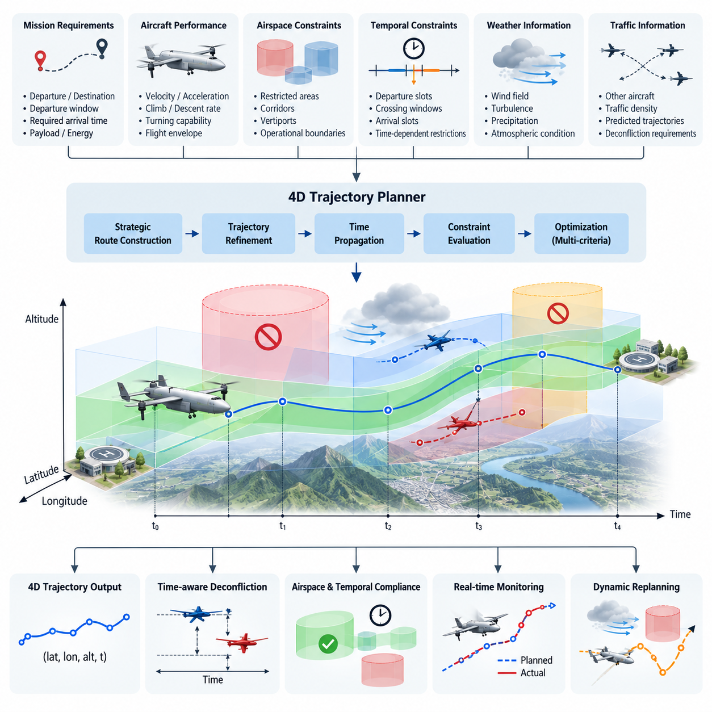
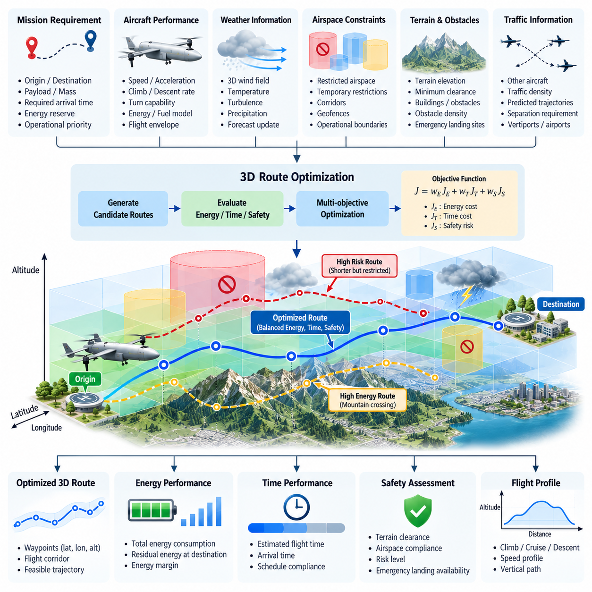
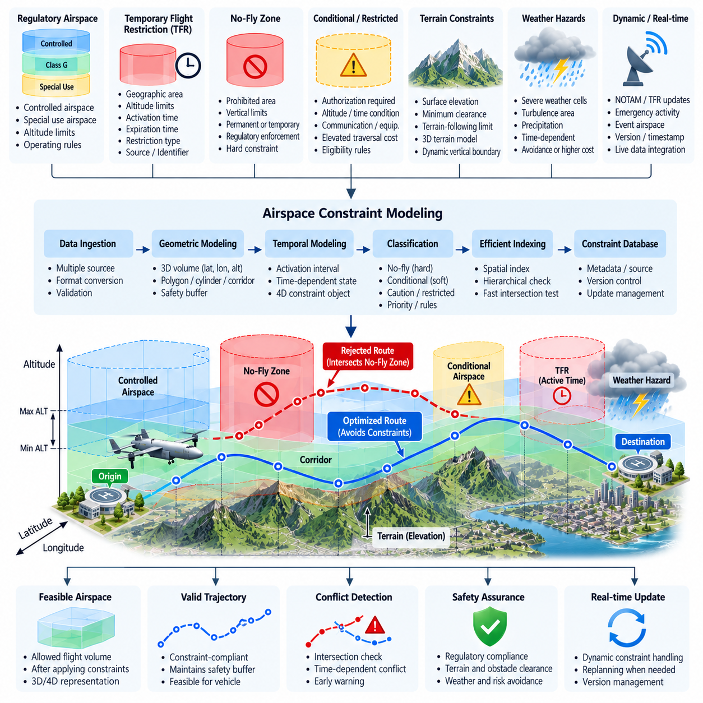
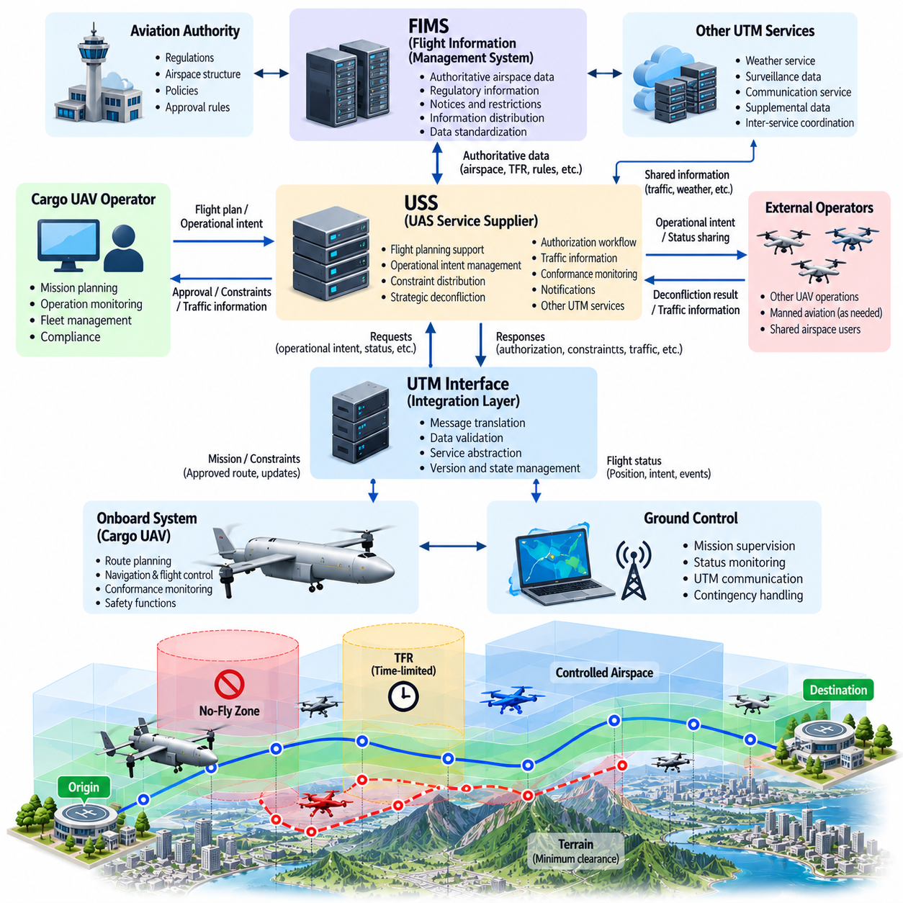
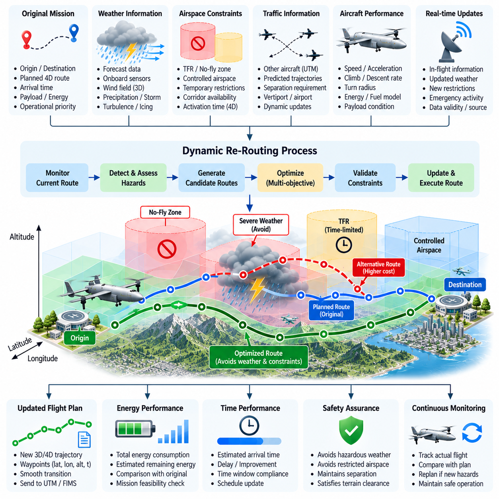
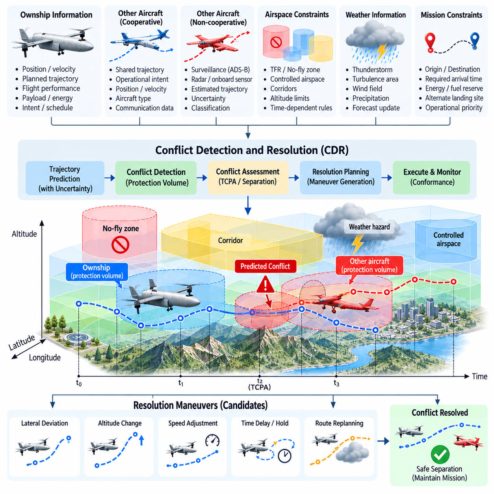
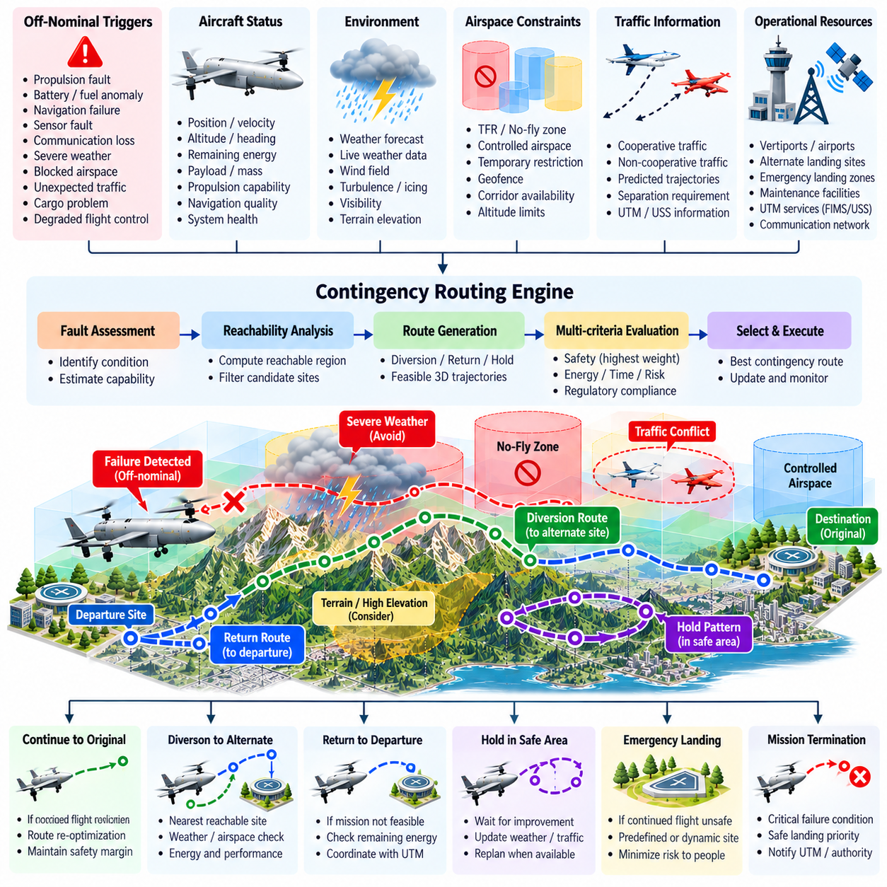
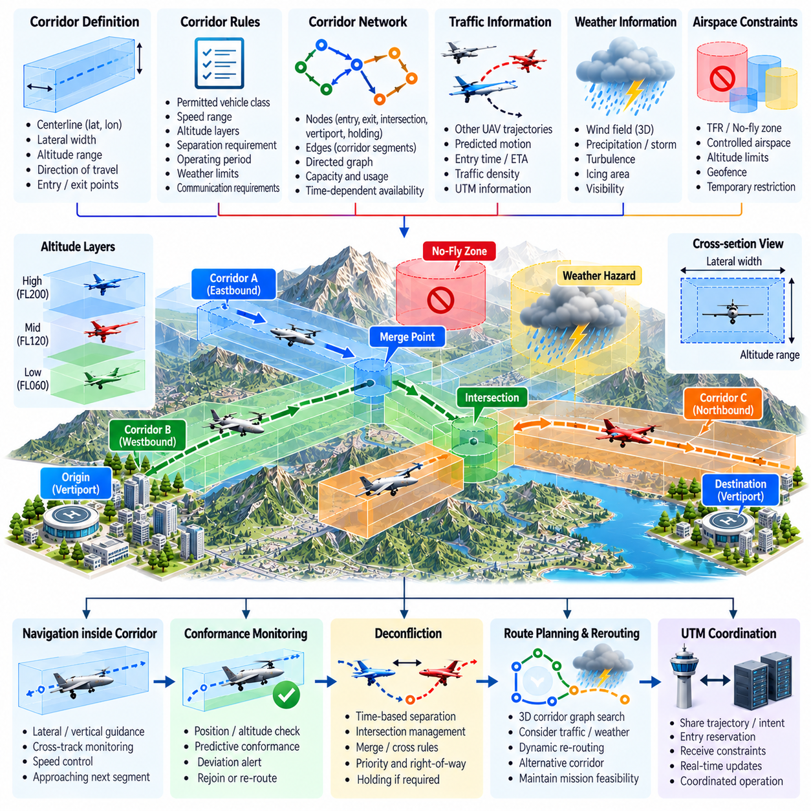
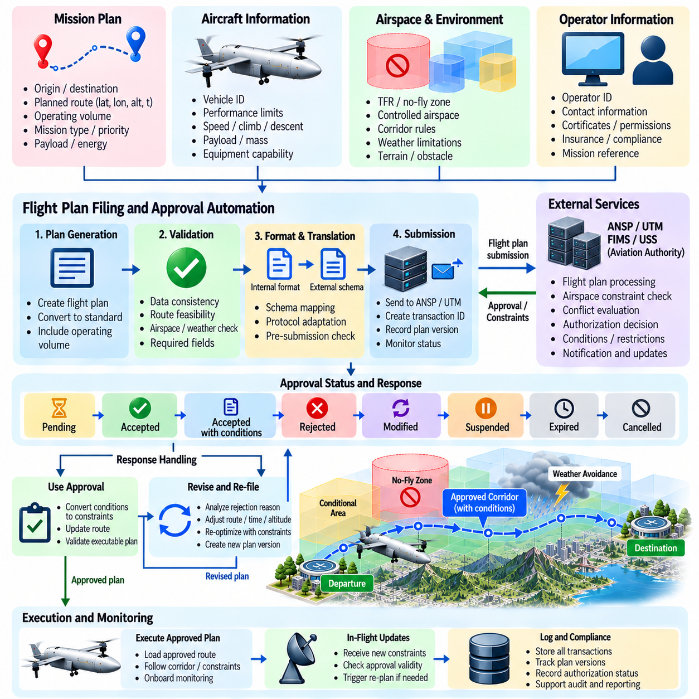
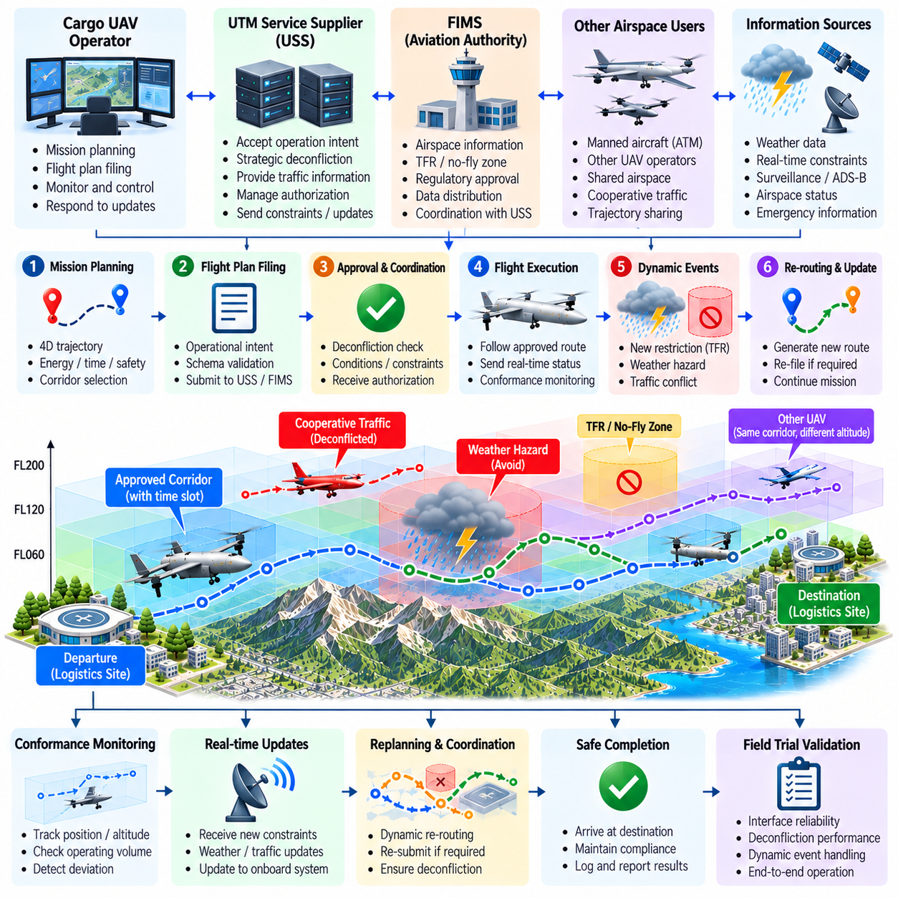

**Volume 23. Cargo UAV Autonomy and Flight AI**


# Chapter 06. Route Planning and Airspace Integration

##  

## 06.01. 4D Trajectory Planning Lat Lon Alt Time

{width="7.268055555555556in" height="7.268055555555556in"}

Four-dimensional trajectory planning extends conventional spatial route planning by treating time as an explicit dimension of the aircraft trajectory. Instead of defining a mission only as a sequence of latitude, longitude, and altitude waypoints, the planner associates each spatial state with a target time or allowable time interval. The resulting trajectory can therefore be represented as a sequence of states such as \\(P_i=(lat_i, lon_i, alt_i, t_i)\\), providing a deterministic description of where the cargo UAV is expected to be and when it should occupy that position.

This time-dependent representation is particularly important for cargo UAV operations in shared or managed airspace. Two aircraft may safely use the same geographic corridor and altitude when their occupancy times are sufficiently separated, while trajectories that appear spatially independent can become conflicting when timing uncertainty is considered. Four-dimensional planning therefore transforms route generation into a spatiotemporal coordination problem that connects autonomous navigation with airspace management, traffic deconfliction, mission scheduling, and operational approval.

A practical 4D trajectory begins with mission constraints describing departure and destination locations, departure windows, required arrival times, aircraft performance, payload state, available energy, and permitted airspace. Geographic constraints may include restricted regions, terrain clearance, vertiports, predefined corridors, and operational boundaries. Temporal constraints add departure slots, corridor reservation periods, crossing windows, arrival slots, and time-dependent restrictions, allowing the planner to reason about airspace availability as a function of both position and time.

Trajectory generation typically separates strategic route construction from continuous trajectory refinement. A strategic planner first identifies feasible spatial corridors connecting the origin and destination while excluding prohibited or operationally unsuitable regions. The selected corridor is then converted into a dynamically achievable trajectory by considering velocity, acceleration, climb rate, descent rate, turning capability, and propulsion limits. Time is propagated along the trajectory so that every significant point receives an estimated time of arrival and can be evaluated against temporal constraints.

For heavy cargo UAVs, the relationship between trajectory geometry and vehicle dynamics becomes especially important. A 2.5-ton, 5-ton, or 10-ton aircraft cannot instantaneously change velocity, altitude, or heading when a new waypoint is introduced. Payload mass and center-of-gravity conditions can further modify acceleration, climb, and maneuvering capability. Consequently, a valid 4D planner must produce trajectories that remain inside the actual flight envelope rather than merely constructing mathematically short paths between geographic coordinates.

The temporal dimension can be represented using exact target times, bounded time windows, or probabilistic arrival estimates. Exact timing is useful at controlled crossing points or scheduled arrival interfaces, whereas time windows provide operational flexibility when atmospheric disturbances or traffic conditions create uncertainty. Probabilistic models can additionally represent expected arrival time and variance, enabling the system to maintain larger separation margins when uncertainty grows instead of assuming that every predicted trajectory will be executed perfectly.

Wind is one of the major causes of deviation between planned and executed 4D trajectories. Headwind, tailwind, crosswind, vertical air motion, and localized turbulence change ground speed and therefore modify waypoint arrival times even when commanded airspeed remains unchanged. The planner should incorporate forecast wind fields during initial optimization and continuously compare predicted versus measured progress during flight. Significant deviations can trigger speed adjustment, trajectory retiming, or complete replanning when the original temporal constraints can no longer be satisfied.

The optimization objective is normally multi-criteria rather than purely distance based. A useful cost function may combine flight time, energy consumption, airspace risk, weather exposure, maneuvering effort, traffic density, and deviation from scheduled arrival times. Weighting these terms allows different cargo missions to express different priorities. Time-critical medical logistics may emphasize arrival performance, while long-range industrial cargo transport may assign greater importance to energy efficiency, weather margin, and conservative airspace separation.

Airspace constraints can be modeled as four-dimensional volumes whose validity changes over time. A region may be available during one interval and prohibited during another because of temporary flight restrictions, scheduled operations, emergency activity, or traffic-management decisions. The trajectory planner must therefore evaluate not only whether the geometric path intersects a constrained volume, but also whether the aircraft is predicted to occupy that volume while the restriction is active. This principle provides the foundation for later airspace constraint modeling and dynamic rerouting functions.

Conflict detection similarly becomes a comparison between predicted 4D occupancy volumes. Each aircraft trajectory can be surrounded by horizontal, vertical, and temporal protection margins that account for navigation error, control tracking error, communication latency, and prediction uncertainty. When protection volumes overlap beyond acceptable thresholds, the system identifies a potential conflict. Resolution may then alter altitude, lateral route, speed, departure time, or waypoint timing while preserving aircraft performance and mission constraints.

Trajectory execution requires close integration between the strategic planner, flight management system, navigation subsystem, and flight control software. The planner generates the desired 4D reference, while the navigation system continuously estimates the aircraft state and determines progress relative to that reference. The flight management layer calculates timing errors and decides whether minor deviations can be corrected through speed or path adjustments. Low-level controllers then convert the updated reference into attitude, thrust, velocity, and position commands.

The trajectory should not be treated as a rigid sequence that becomes invalid after the first disturbance. Operational systems benefit from a rolling-horizon approach in which the near-term portion of the trajectory is executed with high commitment while later segments remain adjustable. As new weather, traffic, vehicle-state, and airspace information becomes available, the planner periodically recomputes future segments. This preserves continuity with the currently flown path while allowing the aircraft to respond intelligently to changing conditions.

A useful trajectory data structure contains more information than latitude, longitude, altitude, and timestamp alone. Each trajectory point may carry desired ground speed, airspeed, heading, vertical speed, allowable timing error, navigation tolerance, corridor identifier, constraint status, and contingency information. Metadata describing the trajectory version and planning assumptions is also valuable because ground systems and onboard computers must determine whether they are operating from the same approved trajectory after updates or communication interruptions.

Time synchronization is therefore a fundamental infrastructure requirement. GNSS time or another trusted synchronized clock can provide a common temporal reference for the aircraft, ground control station, fleet services, and airspace-management interfaces. Timestamp errors directly translate into uncertainty in 4D position prediction, especially for high-speed aircraft. Systems should consequently monitor clock quality and synchronization status and expand temporal safety margins or degrade gracefully when trusted timing becomes unavailable.

For autonomous cargo operations, the planner must also consider contingency states before departure. Candidate diversion locations, holding regions, emergency landing zones, and alternate corridors can be associated with reachable points along the nominal trajectory. If propulsion degradation, battery limitations, communication loss, severe weather, or airspace closure occurs, the vehicle can transition from the nominal 4D plan to a predefined or dynamically generated contingency trajectory rather than improvising an unrestricted route during an emergency.

Verification of 4D trajectory planning requires more than checking whether the destination is reached. Testing should measure spatial tracking error, temporal tracking error, constraint violations, minimum traffic separation, energy prediction accuracy, replanning latency, and robustness against disturbances. Simulation can systematically inject wind changes, navigation errors, delayed traffic updates, temporary restrictions, and vehicle-performance degradation. SIL and HIL environments can then verify that trajectory generation and execution remain consistent with the actual avionics interfaces.

Ultimately, 4D trajectory planning provides the coordination layer between autonomous flight and integrated airspace operation. Latitude, longitude, and altitude describe where the cargo UAV intends to fly, while time determines how that route interacts with other aircraft, scheduled corridors, restrictions, and mission commitments. By maintaining a continuously validated spatiotemporal trajectory, the cargo UAV can progress from isolated waypoint navigation toward predictable, scalable, and coordinated autonomous operation within increasingly complex airspace.

4차원 궤적 계획(4D Trajectory Planning)은 시간을 항공기 궤적의 명시적인 차원으로 취급함으로써 기존의 공간 기반 경로 계획(Spatial Route Planning)을 확장한다. 임무를 단순히 위도(Latitude), 경도(Longitude), 고도(Altitude) 웨이포인트(Waypoint)의 연속으로 정의하는 대신, 계획기는 각 공간 상태에 목표 시간(Target Time) 또는 허용 시간 구간(Time Window)을 연결한다. 따라서 생성된 궤적은 \\(P_i=(lat_i, lon_i, alt_i, t_i)\\)와 같은 상태의 연속으로 표현할 수 있으며, 화물 무인항공기(Cargo UAV)가 언제 어디에 위치해야 하는지를 결정론적으로 기술한다.

이러한 시간 의존적 표현(Time-Dependent Representation)은 공유 공역(Shared Airspace) 또는 관리 공역(Managed Airspace)에서 운용되는 화물 무인항공기에 특히 중요하다. 두 항공기는 점유 시간이 충분히 분리되어 있다면 동일한 지리적 비행 회랑(Flight Corridor)과 고도를 안전하게 사용할 수 있다. 반대로 공간적으로 분리되어 보이는 궤적도 시간 불확실성(Timing Uncertainty)을 고려하면 충돌할 수 있다. 따라서 4차원 계획은 경로 생성을 자율 항법(Autonomous Navigation), 공역 관리(Airspace Management), 교통 충돌 해소(Traffic Deconfliction), 임무 스케줄링(Mission Scheduling), 운항 승인(Operational Approval)을 연결하는 시공간 조정 문제(Spatiotemporal Coordination Problem)로 전환한다.

실용적인 4차원 궤적(4D Trajectory)은 출발지와 목적지, 출발 시간 구간(Departure Window), 요구 도착 시간, 항공기 성능, 탑재 화물 상태(Payload State), 가용 에너지(Available Energy), 허용 공역 등을 정의하는 임무 제약조건(Mission Constraints)에서 시작한다. 지리적 제약조건에는 제한 구역(Restricted Region), 지형 안전고도(Terrain Clearance), 버티포트(Vertiport), 사전 정의된 회랑(Predefined Corridor), 운용 경계(Operational Boundary)가 포함될 수 있다. 시간 제약조건은 출발 슬롯(Departure Slot), 회랑 예약 시간, 통과 시간 구간, 도착 슬롯(Arrival Slot), 시간 의존적 제한을 추가한다.

궤적 생성(Trajectory Generation)은 일반적으로 전략적 경로 구성(Strategic Route Construction)과 연속 궤적 정제(Continuous Trajectory Refinement)를 구분한다. 전략 계획기(Strategic Planner)는 먼저 출발지와 목적지를 연결하는 실현 가능한 공간 회랑을 식별하면서 금지되거나 운용상 부적합한 영역을 제외한다. 이후 선택된 회랑은 속도, 가속도, 상승률(Climb Rate), 하강률(Descent Rate), 선회 성능, 추진 한계(Propulsion Limit)를 고려하여 동역학적으로 실행 가능한 궤적으로 변환된다. 시간은 궤적을 따라 전파되어 주요 지점마다 예상 도착 시간(Estimated Time of Arrival)이 부여된다.

대형 화물 무인항공기(Heavy Cargo UAV)의 경우 궤적 형상(Trajectory Geometry)과 기체 동역학(Vehicle Dynamics)의 관계가 특히 중요하다. 2.5톤, 5톤 또는 10톤급 항공기는 새로운 웨이포인트가 추가되었을 때 속도, 고도 또는 기수를 순간적으로 변경할 수 없다. 탑재 화물 질량(Payload Mass)과 무게중심(Center of Gravity) 조건 역시 가속, 상승 및 기동 능력을 변화시킬 수 있다. 따라서 유효한 4차원 계획기는 지리 좌표 사이의 수학적으로 짧은 경로만 생성하는 것이 아니라 실제 비행 포락선(Flight Envelope) 내부에서 실행 가능한 궤적을 생성해야 한다.

시간 차원(Temporal Dimension)은 정확한 목표 시간(Exact Target Time), 제한된 시간 구간(Bounded Time Window), 또는 확률적 도착 추정치(Probabilistic Arrival Estimate)를 사용하여 표현할 수 있다. 정확한 시간 지정은 통제된 교차 지점이나 예정된 도착 인터페이스에서 유용하며, 시간 구간은 대기 교란이나 교통 상황으로 불확실성이 발생할 때 운용 유연성을 제공한다. 확률 모델(Probabilistic Model)은 예상 도착 시간과 분산(Variance)을 함께 표현하여 불확실성이 증가할수록 더 큰 분리 여유(Separation Margin)를 유지하도록 할 수 있다.

바람(Wind)은 계획된 4차원 궤적과 실제 실행 궤적 사이에 편차를 발생시키는 주요 요인이다. 맞바람(Headwind), 뒷바람(Tailwind), 측풍(Crosswind), 수직 기류(Vertical Air Motion), 국지적 난류(Local Turbulence)는 명령 대기속도(Commanded Airspeed)가 동일하더라도 지상속도(Ground Speed)를 변화시켜 웨이포인트 도착 시간을 변경한다. 계획기는 초기 최적화 과정에서 예측 풍장(Forecast Wind Field)을 반영하고, 비행 중에는 예측 진행 상태와 실제 진행 상태를 지속적으로 비교해야 한다. 큰 편차가 발생하면 속도 조정, 궤적 시간 재조정(Trajectory Retiming), 또는 전체 재계획(Replanning)을 수행할 수 있다.

최적화 목적함수(Optimization Objective)는 일반적으로 단순한 거리 최소화가 아니라 다중 기준(Multi-Criteria)으로 구성된다. 유용한 비용함수(Cost Function)는 비행시간, 에너지 소비, 공역 위험도(Airspace Risk), 기상 노출(Weather Exposure), 기동 부담, 교통 밀도, 예정 도착 시간으로부터의 편차 등을 결합할 수 있다. 각 항목의 가중치를 조정하면 화물 임무별 우선순위를 반영할 수 있다. 시간에 민감한 의료 물류는 도착 성능을 중시할 수 있으며, 장거리 산업 화물 운송은 에너지 효율과 기상 안전 여유 및 보수적인 공역 분리를 더욱 중요하게 고려할 수 있다.

공역 제약조건(Airspace Constraints)은 유효성이 시간에 따라 변하는 4차원 볼륨(4D Volume)으로 모델링할 수 있다. 특정 지역은 일시적 비행 제한(Temporary Flight Restriction), 예정된 운항, 비상 활동 또는 교통관리 결정으로 인해 한 시간대에는 사용 가능하지만 다른 시간대에는 금지될 수 있다. 따라서 궤적 계획기는 기하학적 경로가 제한 볼륨과 교차하는지만 확인하는 것이 아니라, 해당 제한이 활성화된 시간에 항공기가 그 볼륨을 점유할 것으로 예측되는지도 평가해야 한다. 이러한 원리는 이후 공역 제약 모델링(Airspace Constraint Modeling)과 동적 재경로 설정(Dynamic Rerouting)의 기반이 된다.

충돌 탐지(Conflict Detection) 역시 예측된 4차원 점유 볼륨(Predicted 4D Occupancy Volume)의 비교 문제로 확장된다. 각 항공기의 궤적 주변에는 항법 오차, 제어 추종 오차(Control Tracking Error), 통신 지연(Communication Latency), 예측 불확실성을 반영한 수평, 수직 및 시간 보호 여유(Protection Margin)를 설정할 수 있다. 보호 볼륨이 허용 기준을 초과하여 중첩되면 시스템은 잠재적 충돌을 식별한다. 이후 고도, 횡방향 경로, 속도, 출발 시간 또는 웨이포인트 통과 시간을 조정하면서 항공기 성능과 임무 제약조건을 유지하도록 충돌을 해소할 수 있다.

궤적 실행(Trajectory Execution)을 위해서는 전략 계획기, 비행관리시스템(Flight Management System, FMS), 항법 서브시스템(Navigation Subsystem), 비행제어 소프트웨어(Flight Control Software)의 긴밀한 통합이 필요하다. 계획기는 원하는 4차원 기준 궤적(4D Reference Trajectory)을 생성하고, 항법 시스템은 항공기 상태를 지속적으로 추정하면서 기준 궤적에 대한 진행 상태를 판단한다. 비행관리 계층은 시간 오차를 계산하여 작은 편차를 속도 또는 경로 조정으로 수정할 수 있는지 판단하며, 저수준 제어기(Low-Level Controller)는 갱신된 기준을 자세, 추력, 속도 및 위치 명령으로 변환한다.

궤적은 최초의 교란이 발생하는 순간 무효가 되는 고정된 순서로 취급해서는 안 된다. 실제 운용 시스템에서는 궤적의 가까운 구간은 높은 확정성을 가지고 실행하면서 이후 구간은 조정 가능한 상태로 유지하는 이동 구간 방식(Rolling-Horizon Approach)이 효과적이다. 새로운 기상, 교통, 기체 상태 및 공역 정보가 제공되면 계획기는 미래 구간을 주기적으로 다시 계산한다. 이를 통해 현재 비행 중인 경로와의 연속성을 유지하면서 변화하는 운항 조건에 지능적으로 대응할 수 있다.

유용한 궤적 데이터 구조(Trajectory Data Structure)는 위도, 경도, 고도 및 타임스탬프(Timestamp) 이상의 정보를 포함한다. 각 궤적 지점에는 목표 지상속도, 대기속도, 기수 방향(Heading), 수직속도(Vertical Speed), 허용 시간 오차, 항법 허용오차(Navigation Tolerance), 회랑 식별자(Corridor Identifier), 제약조건 상태, 비상 대응 정보(Contingency Information)를 포함할 수 있다. 또한 궤적 버전(Trajectory Version)과 계획 가정을 설명하는 메타데이터(Metadata)는 갱신이나 통신 단절 이후 지상 시스템과 탑재 컴퓨터가 동일한 승인 궤적을 사용하고 있는지 확인하는 데 중요하다.

따라서 시간 동기화(Time Synchronization)는 핵심적인 기반 인프라 요구사항이다. 위성항법시스템 시간(GNSS Time) 또는 다른 신뢰할 수 있는 동기화 시계(Synchronized Clock)는 항공기, 지상통제소(Ground Control Station), 기단 서비스(Fleet Service), 공역관리 인터페이스 사이에 공통 시간 기준을 제공할 수 있다. 타임스탬프 오차는 특히 고속 항공기에서 4차원 위치 예측의 불확실성으로 직접 변환된다. 따라서 시스템은 시계 품질과 동기화 상태를 감시하고, 신뢰할 수 있는 시간 기준을 사용할 수 없을 경우 시간 안전 여유를 확대하거나 단계적으로 성능을 저하시켜야 한다.

자율 화물 운항(Autonomous Cargo Operation)을 위해 계획기는 출발 이전부터 비상 상태(Contingency State)를 고려해야 한다. 후보 우회 지점(Diversion Location), 대기 구역(Holding Region), 비상 착륙 구역(Emergency Landing Zone), 대체 회랑(Alternate Corridor)을 명목 궤적(Nominal Trajectory)의 도달 가능한 지점과 연결할 수 있다. 추진 계통 성능 저하, 배터리 제한, 통신 단절, 악천후 또는 공역 폐쇄가 발생하면 기체는 비상 상황에서 제한 없는 경로를 즉석에서 생성하는 대신 명목 4차원 계획에서 사전 정의되거나 동적으로 생성된 비상 궤적(Contingency Trajectory)으로 전환할 수 있다.

4차원 궤적 계획의 검증(Verification)은 단순히 목적지 도달 여부를 확인하는 것 이상을 요구한다. 시험에서는 공간 추종 오차(Spatial Tracking Error), 시간 추종 오차(Temporal Tracking Error), 제약조건 위반, 최소 교통 분리 거리, 에너지 예측 정확도, 재계획 지연시간(Replanning Latency), 교란에 대한 강건성(Robustness)을 측정해야 한다. 시뮬레이션(Simulation)에서는 바람 변화, 항법 오차, 지연된 교통정보, 일시적 제한, 기체 성능 저하를 체계적으로 주입할 수 있다. 이후 소프트웨어 인 더 루프(Software-in-the-Loop, SIL)와 하드웨어 인 더 루프(Hardware-in-the-Loop, HIL) 환경에서 실제 항공전자 인터페이스와 궤적 생성 및 실행의 일관성을 검증할 수 있다.

궁극적으로 4차원 궤적 계획(4D Trajectory Planning)은 자율 비행(Autonomous Flight)과 통합 공역 운용(Integrated Airspace Operation)을 연결하는 조정 계층(Coordination Layer)을 제공한다. 위도, 경도 및 고도는 화물 무인항공기가 어디로 비행할 것인지를 정의하고, 시간은 해당 경로가 다른 항공기, 예정된 회랑, 공역 제한 및 임무 시간 요구조건과 어떻게 상호작용하는지를 결정한다. 지속적으로 검증되는 시공간 궤적(Spatiotemporal Trajectory)을 유지함으로써 화물 무인항공기는 독립적인 웨이포인트 항법에서 예측 가능하고 확장 가능하며 상호 조정된 자율 공역 운용으로 발전할 수 있다.

##  

## 06.02. 3D Route Optimization Energy Time Safety [w/Code]

{width="7.268055555555556in" height="7.268055555555556in"}

Three-dimensional route optimization determines how a cargo UAV should move through latitude, longitude, and altitude while balancing competing operational objectives. Unlike shortest-path planning, which primarily minimizes geometric distance, a practical cargo route must account for energy consumption, flight time, safety margins, terrain, weather, airspace restrictions, and vehicle performance. The resulting route is therefore an optimized flight corridor rather than simply the shortest connection between origin and destination.

The route can be represented as a sequence of three-dimensional states \\(P_i=(lat_i, lon_i, alt_i)\\) connected by feasible flight segments. Each segment has associated distance, heading, altitude change, predicted airspeed, ground speed, energy requirement, and risk. Optimization evaluates alternative combinations of these segments and selects a route that satisfies mandatory constraints while minimizing a composite cost representing the operational priorities of the cargo mission.

Energy is a critical optimization variable because cargo UAV range and reserve capability are directly limited by propulsion efficiency and available onboard energy. For electric aircraft, route evaluation considers battery state of charge, power demand, motor and inverter efficiency, and expected reserve at destination. Hybrid or turbine-powered aircraft require corresponding fuel-consumption models. In all cases, energy prediction should reflect the actual vehicle configuration and payload rather than relying only on geographic distance.

Altitude strongly influences route energy consumption. Climbing requires additional potential energy and usually increases propulsion demand, while descent may reduce power requirements but introduces limits associated with speed, controllability, and energy recovery capability. A route that crosses mountainous terrain using repeated climbs and descents can therefore consume substantially more energy than a slightly longer route around the terrain. Three-dimensional optimization explicitly evaluates these vertical costs when comparing candidate paths.

Payload mass further changes the optimal solution. A heavily loaded cargo UAV requires greater lift and propulsion power and may have reduced climb performance, acceleration capability, and maneuvering margins. The same geographic route may therefore be efficient for an unloaded return flight but unsuitable for the outbound loaded mission. Route optimization should use current mass, center-of-gravity condition, propulsion availability, and aircraft performance data so that the generated route remains achievable throughout the mission.

Flight time represents another major objective. The minimum-distance route is not necessarily the minimum-time route because wind, speed restrictions, climb rates, traffic constraints, and airspace geometry affect actual travel duration. A longer path with favorable winds can produce an earlier arrival than a direct route exposed to strong headwinds. Time optimization therefore evaluates predicted ground speed along each segment and estimates the total mission duration under expected atmospheric conditions.

Wind-aware optimization can use three-dimensional wind fields containing direction and magnitude as functions of position and altitude. The planner evaluates whether changing altitude or lateral route produces more favorable wind conditions while remaining inside the aircraft flight envelope. For long-range cargo missions, even modest differences in sustained headwind or tailwind can significantly affect energy use and arrival time. Updated weather forecasts can consequently change the preferred route before or during flight.

Safety introduces objectives that cannot always be expressed through distance, energy, or time alone. Route risk may incorporate terrain clearance, population exposure, obstacle density, emergency landing accessibility, weather severity, communication coverage, navigation quality, traffic density, and distance from hazardous areas. Instead of treating every feasible region as equally desirable, the planner can assign spatially varying risk costs so that routes naturally favor areas offering greater operational margins.

Some safety requirements must be implemented as hard constraints rather than optimization penalties. A prohibited airspace volume, minimum terrain clearance, aircraft performance boundary, severe weather cell, or mandatory geofence cannot be violated simply because doing so would save energy or time. The optimization problem therefore distinguishes hard constraints from soft objectives. Hard constraints define the feasible route space, while soft costs determine which of the remaining feasible alternatives provides the best operational trade-off.

A multi-objective cost function can combine energy, time, and safety as \\(J=w_EJ_E+w_TJ_T+w_SJ_S\\), where the weighting parameters represent mission priorities. The weights do not need to remain constant for every operation. Urgent medical cargo may justify a stronger time objective, while routine industrial transport may prioritize energy efficiency. Missions over populated or environmentally challenging regions may assign greater weight to safety and contingency accessibility even when the resulting route is longer.

Care is required when combining objectives with different physical units and numerical ranges. Energy may be expressed in kilowatt-hours or fuel mass, time in seconds, and safety through normalized risk scores. These quantities should be normalized before weighting so that one objective does not dominate simply because its numerical magnitude is larger. Constraint violations can additionally receive very large penalties or be removed entirely from the candidate set when they represent unacceptable operating conditions.

The search environment can be represented using a three-dimensional grid, graph, navigation mesh, corridor network, or continuous state space. Graph-based approaches are useful when airspace contains structured corridors and predefined transition points, while sampling-based and optimization-based methods can explore less structured environments. For large operational areas, hierarchical planning can first determine a coarse strategic corridor and then optimize a higher-resolution trajectory within that corridor, reducing computational cost while preserving useful route detail.

Terrain and obstacle information must be incorporated into the three-dimensional representation with appropriate safety buffers. Digital elevation models can define minimum safe altitude, while buildings, towers, cranes, infrastructure, and other obstacles can be represented as occupied or restricted volumes. The planner should consider uncertainty in map accuracy, localization, and obstacle dimensions by expanding these volumes rather than planning directly along their nominal boundaries. This produces routes with realistic navigation margins.

Airspace constraints add another layer to the optimization environment. Controlled zones, temporary restrictions, no-fly regions, altitude limits, designated corridors, and operational boundaries can be represented as permitted or prohibited volumes with associated costs and rules. The route optimizer can then evaluate alternatives that remain compatible with the broader airspace integration architecture. This provides the spatial optimization foundation required for subsequent dynamic rerouting, conflict resolution, and UTM service integration.

Contingency capability can also influence route selection. A nominally efficient route may become operationally undesirable if large portions of it provide no reachable emergency landing location or diversion path. The planner can calculate contingency accessibility along candidate routes and penalize segments with insufficient alternatives. For heavy cargo UAVs, where emergency landing requirements and kinetic consequences are more significant, this consideration can materially alter the preferred route even under normal operating conditions.

Route optimization should account for reserve energy rather than planning to consume the entire predicted energy budget. The required reserve can include uncertainty in wind prediction, navigation deviations, holding time, diversion distance, and unexpected maneuvering. As uncertainty increases, the usable planning budget decreases accordingly. A route is therefore feasible only when predicted destination energy remains above the required reserve threshold under the defined operational assumptions and safety policy.

During flight, actual energy consumption and progress should be compared continuously with planning predictions. If measured power demand is higher than expected, wind conditions deteriorate, or the aircraft is delayed, the remaining route can be re-evaluated using the latest state estimate. Incremental replanning allows the system to select a new altitude, corridor, or diversion destination before reserve margins become critical. This connects strategic route optimization with real-time autonomous mission management.

Validation requires testing the optimizer across normal and adverse operating scenarios. Representative cases should include varying payloads, strong winds, terrain constraints, blocked corridors, degraded propulsion, changing energy reserves, and competing safety requirements. Important metrics include route feasibility, total energy, flight time, minimum safety margin, computation time, reserve at destination, and sensitivity to uncertain inputs. Simulation can compare candidate algorithms consistently before their behavior is evaluated in SIL, HIL, and flight testing.

Ultimately, three-dimensional route optimization provides the decision layer that converts mission intent into a physically achievable and operationally acceptable flight path. Energy determines whether the aircraft can complete the mission, time determines whether operational commitments can be satisfied, and safety determines whether the route maintains acceptable risk. Balancing these objectives enables cargo UAVs to move beyond simple waypoint routing toward mission-aware autonomous flight optimized for real-world airspace operations.

3차원 경로 최적화(Three-Dimensional Route Optimization)는 에너지, 시간, 안전이라는 서로 경쟁하는 운용 목표를 균형 있게 고려하면서 화물 무인항공기(Cargo UAV)가 위도(Latitude), 경도(Longitude), 고도(Altitude) 공간을 어떻게 이동해야 하는지를 결정한다. 주로 기하학적 거리를 최소화하는 최단 경로 계획(Shortest-Path Planning)과 달리, 실제 화물 운송 경로는 에너지 소비, 비행시간, 안전 여유(Safety Margin), 지형, 기상, 공역 제한(Airspace Restriction), 기체 성능을 함께 고려해야 한다. 따라서 최종 결과는 단순히 출발지와 목적지를 가장 짧게 연결하는 경로가 아니라 최적화된 비행 회랑(Optimized Flight Corridor)이 된다.

경로는 실현 가능한 비행 구간(Flight Segment)으로 연결된 \\(P_i=(lat_i, lon_i, alt_i)\\) 형태의 3차원 상태(Three-Dimensional State) 연속으로 표현할 수 있다. 각 구간에는 거리, 기수 방향(Heading), 고도 변화, 예측 대기속도(Predicted Airspeed), 지상속도(Ground Speed), 에너지 요구량 및 위험도가 연결된다. 최적화 과정은 이러한 구간의 다양한 조합을 평가하고, 필수 제약조건을 만족하면서 화물 임무의 운용 우선순위를 나타내는 복합 비용(Composite Cost)을 최소화하는 경로를 선택한다.

에너지(Energy)는 화물 무인항공기의 항속거리와 예비 운용 능력(Reserve Capability)이 추진 효율과 탑재 에너지에 직접적으로 제한되기 때문에 핵심적인 최적화 변수이다. 전기 항공기(Electric Aircraft)의 경로 평가에서는 배터리 충전 상태(State of Charge), 요구 전력, 모터 및 인버터 효율, 목적지 도착 시 예상 예비 에너지를 고려한다. 하이브리드(Hybrid) 또는 터빈 기반 항공기(Turbine-Powered Aircraft)는 이에 대응하는 연료 소비 모델(Fuel-Consumption Model)이 필요하다. 모든 경우 에너지 예측은 단순한 지리적 거리가 아니라 실제 기체 구성과 탑재 화물 상태를 반영해야 한다.

고도(Altitude)는 경로의 에너지 소비에 큰 영향을 미친다. 상승은 추가적인 위치에너지(Potential Energy)를 필요로 하며 일반적으로 추진 요구량을 증가시키는 반면, 하강은 필요한 동력을 감소시킬 수 있지만 속도, 제어 가능성(Controllability), 에너지 회수 능력(Energy Recovery Capability)에 따른 제한을 갖는다. 따라서 산악 지형을 반복적으로 상승하고 하강하는 경로는 지형을 우회하는 약간 더 긴 경로보다 훨씬 많은 에너지를 소비할 수 있다. 3차원 최적화는 후보 경로를 비교할 때 이러한 수직 방향 비용(Vertical Cost)을 명시적으로 평가한다.

탑재 화물 질량(Payload Mass)은 최적 경로를 추가적으로 변화시킨다. 무거운 화물을 탑재한 화물 무인항공기는 더 큰 양력과 추진 동력을 필요로 하며 상승 성능, 가속 능력 및 기동 여유(Maneuvering Margin)가 감소할 수 있다. 따라서 동일한 지리적 경로라도 화물이 없는 복귀 비행에서는 효율적일 수 있지만 화물을 탑재한 출발 임무에는 적합하지 않을 수 있다. 경로 최적화는 현재 질량, 무게중심(Center of Gravity), 가용 추진 능력 및 항공기 성능 데이터를 사용하여 전체 임무 동안 실행 가능한 경로를 생성해야 한다.

비행시간(Flight Time)은 또 다른 주요 최적화 목표이다. 최단 거리 경로가 반드시 최소 시간 경로가 되는 것은 아니며, 바람, 속도 제한, 상승률, 교통 제약 및 공역 형상이 실제 이동시간에 영향을 미친다. 강한 맞바람(Headwind)에 노출되는 직접 경로보다 유리한 바람을 활용하는 더 긴 경로가 목적지에 더 빨리 도착할 수도 있다. 따라서 시간 최적화(Time Optimization)는 각 구간의 예상 지상속도를 평가하고 예상 대기 조건에 따른 전체 임무 소요시간을 계산한다.

바람 인지 최적화(Wind-Aware Optimization)는 위치와 고도의 함수로 방향과 크기를 표현하는 3차원 풍장(Three-Dimensional Wind Field)을 사용할 수 있다. 계획기는 고도 또는 횡방향 경로를 변경했을 때 기체의 비행 포락선(Flight Envelope)을 유지하면서 더 유리한 바람 조건을 활용할 수 있는지를 평가한다. 장거리 화물 임무에서는 지속적인 맞바람이나 뒷바람(Tailwind)의 작은 차이도 에너지 소비와 도착 시간에 상당한 영향을 줄 수 있다. 따라서 갱신된 기상 예보는 비행 전 또는 비행 중에 선호 경로를 변경할 수 있다.

안전(Safety)은 거리, 에너지 또는 시간만으로 항상 표현할 수 없는 목표를 추가한다. 경로 위험도(Route Risk)는 지형 안전고도(Terrain Clearance), 인구 밀집 지역 노출, 장애물 밀도, 비상 착륙 가능성(Emergency Landing Accessibility), 기상 위험도, 통신 커버리지, 항법 품질, 교통 밀도 및 위험 지역과의 거리 등을 포함할 수 있다. 모든 비행 가능 지역을 동일하게 취급하는 대신 계획기는 공간적으로 변화하는 위험 비용(Spatially Varying Risk Cost)을 부여하여 더 큰 운용 안전 여유를 제공하는 지역을 자연스럽게 선호하도록 할 수 있다.

일부 안전 요구조건은 최적화 페널티(Optimization Penalty)가 아니라 강제 제약조건(Hard Constraint)으로 구현해야 한다. 비행금지 공역(Prohibited Airspace), 최소 지형 안전고도, 항공기 성능 한계, 심각한 기상 셀(Severe Weather Cell), 의무 지오펜스(Mandatory Geofence)는 에너지나 시간을 절약할 수 있다는 이유만으로 위반할 수 없다. 따라서 최적화 문제는 강제 제약조건과 연성 목표(Soft Objective)를 구분한다. 강제 제약조건은 실행 가능한 경로 공간(Feasible Route Space)을 정의하고, 연성 비용은 남아 있는 실행 가능한 대안 중 최적의 운용 절충안을 결정한다.

다중 목적 비용함수(Multi-Objective Cost Function)는 \\(J=w_EJ_E+w_TJ_T+w_SJ_S\\)와 같이 에너지, 시간 및 안전을 결합할 수 있으며, 여기에서 가중치(Weighting Parameter)는 임무 우선순위를 나타낸다. 이러한 가중치는 모든 운항에서 동일할 필요가 없다. 긴급 의료 화물은 시간 목표에 더 높은 가중치를 부여할 수 있으며, 일반 산업 화물 운송은 에너지 효율을 우선할 수 있다. 인구 밀집 지역이나 환경적으로 어려운 지역을 통과하는 임무에서는 경로가 더 길어지더라도 안전과 비상 대응 접근성(Contingency Accessibility)에 더 큰 가중치를 적용할 수 있다.

서로 다른 물리 단위와 수치 범위를 가진 목표를 결합할 때는 주의가 필요하다. 에너지는 킬로와트시(kWh) 또는 연료 질량으로, 시간은 초 단위로, 안전은 정규화된 위험 점수(Normalized Risk Score)로 표현될 수 있다. 단순히 수치 크기가 크다는 이유로 특정 목표가 전체 최적화를 지배하지 않도록 가중치를 적용하기 전에 각 항목을 정규화(Normalization)해야 한다. 허용할 수 없는 운용 조건을 나타내는 제약조건 위반은 매우 큰 페널티를 부여하거나 후보 경로 집합에서 완전히 제거할 수 있다.

탐색 환경(Search Environment)은 3차원 격자(Three-Dimensional Grid), 그래프(Graph), 내비게이션 메시(Navigation Mesh), 회랑 네트워크(Corridor Network), 또는 연속 상태 공간(Continuous State Space)으로 표현할 수 있다. 그래프 기반 접근법(Graph-Based Approach)은 구조화된 회랑과 사전 정의된 전환 지점을 포함하는 공역에서 유용하며, 샘플링 기반(Sampling-Based) 및 최적화 기반(Optimization-Based) 방법은 구조화되지 않은 환경을 탐색할 수 있다. 넓은 운용 영역에서는 먼저 거친 전략적 회랑을 결정한 후 해당 회랑 내부에서 고해상도 궤적을 최적화하는 계층적 계획(Hierarchical Planning)을 사용할 수 있다.

지형 및 장애물 정보는 적절한 안전 버퍼(Safety Buffer)와 함께 3차원 환경 표현에 통합되어야 한다. 수치표고모델(Digital Elevation Model)은 최소 안전고도를 정의할 수 있으며, 건물, 타워, 크레인, 기반시설 및 기타 장애물은 점유 또는 제한 볼륨(Restricted Volume)으로 표현할 수 있다. 계획기는 지도 정확도, 위치추정(Localization), 장애물 크기의 불확실성을 고려하여 명목 경계 바로 옆으로 경로를 생성하는 대신 이러한 볼륨을 확장해야 한다. 이를 통해 현실적인 항법 안전 여유(Navigation Margin)를 확보할 수 있다.

공역 제약조건(Airspace Constraints)은 최적화 환경에 또 다른 계층을 추가한다. 관제 구역(Controlled Zone), 일시적 제한, 비행금지 구역(No-Fly Region), 고도 제한, 지정 회랑 및 운용 경계는 관련 비용과 규칙을 가진 허용 또는 금지 볼륨으로 표현할 수 있다. 경로 최적화기는 이러한 정보를 사용하여 전체 공역 통합 아키텍처(Airspace Integration Architecture)와 호환되는 대체 경로를 평가한다. 이는 이후의 동적 재경로 설정(Dynamic Rerouting), 충돌 해소(Conflict Resolution), 무인항공기 교통관리(Unmanned Aircraft System Traffic Management, UTM) 서비스 통합에 필요한 공간 최적화 기반을 제공한다.

비상 대응 능력(Contingency Capability) 역시 경로 선택에 영향을 줄 수 있다. 명목상 효율적인 경로라도 상당한 구간에서 도달 가능한 비상 착륙 지점이나 우회 경로(Diversion Path)를 확보할 수 없다면 운용상 바람직하지 않을 수 있다. 계획기는 후보 경로를 따라 비상 대응 접근성을 계산하고 대체 수단이 부족한 구간에 페널티를 부여할 수 있다. 비상 착륙 요구조건과 사고 발생 시 운동에너지의 영향이 더욱 큰 대형 화물 무인항공기에서는 정상 운항 상황에서도 이러한 요소가 선호 경로를 실질적으로 변경할 수 있다.

경로 최적화는 예측된 전체 에너지 예산을 모두 소비하도록 계획하는 대신 예비 에너지(Reserve Energy)를 고려해야 한다. 요구되는 예비량에는 바람 예측의 불확실성, 항법 편차, 체공 시간(Holding Time), 우회 거리, 예상하지 못한 기동 등이 포함될 수 있다. 불확실성이 증가할수록 실제 계획에 사용할 수 있는 에너지 예산은 그만큼 감소한다. 따라서 정의된 운용 가정과 안전 정책에 따라 목적지 도착 시 예상 잔여 에너지가 요구 예비 임계값(Reserve Threshold)보다 높은 경우에만 해당 경로를 실행 가능한 것으로 판단해야 한다.

비행 중에는 실제 에너지 소비량과 진행 상태를 계획 단계의 예측값과 지속적으로 비교해야 한다. 측정된 전력 요구량이 예상보다 높거나 바람 조건이 악화되거나 항공기가 지연되는 경우 최신 상태 추정치(State Estimate)를 사용하여 남은 경로를 다시 평가할 수 있다. 점진적 재계획(Incremental Replanning)을 사용하면 예비 에너지 여유가 위험 수준에 도달하기 전에 새로운 고도, 회랑 또는 우회 목적지를 선택할 수 있다. 이를 통해 전략적 경로 최적화(Strategic Route Optimization)와 실시간 자율 임무 관리(Real-Time Autonomous Mission Management)가 연결된다.

검증(Validation)은 정상 및 비정상 운용 시나리오 전반에서 최적화기를 시험해야 한다. 대표적인 시험 조건에는 다양한 탑재 화물, 강풍, 지형 제약, 차단된 회랑, 추진 성능 저하, 변화하는 에너지 예비량 및 서로 경쟁하는 안전 요구조건이 포함되어야 한다. 주요 평가 지표에는 경로 실행 가능성(Route Feasibility), 총 에너지 소비량, 비행시간, 최소 안전 여유, 계산시간, 목적지 도착 시 예비량, 불확실한 입력에 대한 민감도가 포함된다. 시뮬레이션을 통해 후보 알고리즘을 일관된 조건에서 비교한 후 소프트웨어 인 더 루프(Software-in-the-Loop, SIL), 하드웨어 인 더 루프(Hardware-in-the-Loop, HIL), 실제 비행시험(Flight Testing)으로 검증 범위를 확장할 수 있다.

궁극적으로 3차원 경로 최적화(Three-Dimensional Route Optimization)는 임무 의도(Mission Intent)를 물리적으로 실행 가능하고 운용상 허용 가능한 비행 경로로 변환하는 의사결정 계층(Decision Layer)을 제공한다. 에너지는 항공기가 임무를 완료할 수 있는지를 결정하고, 시간은 운용상의 약속과 일정을 충족할 수 있는지를 결정하며, 안전은 경로가 허용 가능한 위험 수준을 유지하는지를 결정한다. 이러한 목표를 균형 있게 조정함으로써 화물 무인항공기는 단순한 웨이포인트 경로 설정에서 벗어나 실제 공역 운용을 위해 최적화된 임무 인지형 자율 비행(Mission-Aware Autonomous Flight)으로 발전할 수 있다.

##  

## 06.03. Airspace Constraint Modeling TFR No Fly Zone [w/Code]

{width="7.268055555555556in" height="7.268055555555556in"}

Airspace constraint modeling converts regulatory, operational, geographic, and safety restrictions into machine-readable spatial and temporal objects that an autonomous cargo UAV can evaluate during route planning and flight execution. Instead of treating airspace as an unrestricted three-dimensional environment, the autonomy system represents where flight is permitted, prohibited, conditionally allowed, or subject to additional requirements. This capability forms a core part of route planning and airspace integration for cargo UAV operations.

A basic airspace constraint can be represented as a three-dimensional volume defined by horizontal geometry and vertical limits. The horizontal boundary may use polygons, circles, corridor segments, or combinations of geometric primitives expressed in geographic coordinates. Vertical boundaries define minimum and maximum permitted altitudes. Together, these elements allow the planner to determine whether a waypoint, trajectory segment, or predicted aircraft volume intersects restricted airspace.

Many airspace restrictions are not permanently active, making time an essential component of the constraint model. A restricted region can therefore be represented as a four-dimensional object containing latitude, longitude, altitude, and an activation interval. The same geographic volume may be available during normal operations and unavailable during a specified period. Route validation must consequently evaluate both spatial intersection and whether the aircraft is expected to occupy the affected region while the restriction is active.

Temporary Flight Restrictions, or TFRs, illustrate the importance of dynamic constraint management. A TFR may be established because of emergency response, disaster activity, major public events, security operations, hazardous conditions, or other temporary requirements. From the autonomous planner\'s perspective, a TFR should be converted into a structured constraint containing geographic boundaries, altitude limits, activation and expiration times, restriction type, source, identifier, and applicable operating rules.

No-fly zones represent airspace volumes that the autonomous system must normally treat as hard constraints. Candidate routes intersecting an active no-fly volume should be rejected rather than merely assigned a higher optimization cost. This distinction is important because an optimization algorithm could otherwise select a prohibited route when the reduction in distance, energy, or time outweighs an ordinary numerical penalty. Regulatory prohibitions therefore require explicit constraint enforcement independent of route efficiency.

Not every constrained region must be completely prohibited. Some areas can be modeled as conditional or soft constraints when flight is permitted only under specific authorization, altitude, equipment, communication, or operational conditions. The route planner can represent such regions with eligibility rules and elevated traversal costs. This allows the same airspace model to distinguish absolute exclusion zones from controlled areas, preferred corridors, caution regions, and authorization-dependent operating volumes.

Constraint data should include provenance and lifecycle information in addition to geometry. Useful metadata includes the issuing authority, source system, publication time, effective time, expiration time, revision number, confidence, and last update timestamp. Maintaining provenance allows the autonomy system and ground control infrastructure to determine whether a constraint is current and authoritative. Version information is particularly important when restrictions change while an aircraft is already executing a previously approved route.

Geometric representation must also account for uncertainty. Regulatory boundaries may be exact, but aircraft localization, map transformation, communication latency, and trajectory tracking all introduce errors. The system should therefore apply configurable safety buffers around restricted volumes. Horizontal and vertical margins can be selected according to navigation performance, vehicle dynamics, operational policy, and restriction criticality, preventing the planner from generating trajectories that pass unrealistically close to a prohibited boundary.

Terrain-related constraints can coexist with regulatory airspace restrictions in the same planning framework. Minimum terrain clearance defines a lower boundary that changes according to surface elevation, while controlled airspace or vehicle performance may impose an upper boundary. The resulting feasible region can become a complex three-dimensional corridor. For heavy cargo UAVs, sufficient vertical margin must also account for climb performance, descent capability, payload mass, and the ability to respond safely to unexpected disturbances.

The constraint model should support efficient intersection testing because route optimizers may evaluate thousands of candidate segments. Spatial indexing, hierarchical partitioning, voxel structures, bounding volumes, or geospatial databases can reduce the number of detailed geometric checks. A coarse stage can quickly eliminate routes that clearly do not interact with restricted areas, while a precise stage evaluates candidate segments near constraint boundaries using higher-resolution geometry and appropriate safety margins.

Dynamic updates require special attention during flight. A route that was valid at departure may become invalid when a new TFR, emergency restriction, weather exclusion volume, or operational closure is issued. The onboard or ground-based airspace service should detect relevant changes and determine whether the current trajectory is affected. If an active or future trajectory segment intersects a newly introduced constraint, the system must initiate route reassessment rather than continuing solely on the original flight plan.

The response to a new restriction depends on urgency and geometry. If the affected region lies far ahead, the planner may perform a normal reroute while preserving energy and arrival objectives. If a restriction appears close to the aircraft, immediate actions may include slowing, holding, changing altitude, or diverting toward a safe region while a new route is computed. Heavy cargo UAVs require particularly conservative logic because their inertia and maneuvering limits can make late avoidance substantially more difficult.

Airspace constraints should be integrated directly with three-dimensional route optimization rather than checked only after route generation. When restrictions are included in the feasible search space, the optimizer avoids spending computational effort on paths that cannot legally or safely be flown. Hard constraints remove prohibited regions, while conditional regions can contribute cost or authorization requirements. This structure naturally extends the preceding energy, time, and safety optimization framework into regulated operational airspace.

Constraint validation should occur at several stages of the mission lifecycle. Preflight validation verifies the planned route against the latest available airspace model. Approval-time validation checks that the submitted trajectory remains consistent with applicable restrictions. Execution-time monitoring continuously compares the active trajectory with updated constraints, while postflight records preserve the constraint versions used during planning and operation. This history supports traceability, incident analysis, and certification evidence.

Communication failures must also be considered because dynamic restrictions may normally arrive through external services. If the aircraft loses access to updated airspace information, the system needs a defined degraded mode based on cached constraints, validity periods, mission criticality, and communication-loss procedures. It should not assume indefinitely that previously downloaded airspace data remains valid. Conservative behavior may include restricting route changes, maintaining an approved corridor, holding, returning, or diverting according to operational policy.

The airspace database must maintain consistency between onboard and ground systems. Constraint identifiers, coordinate reference systems, altitude references, timestamps, units, and version semantics should be standardized so that identical data produces identical interpretations. Confusion between altitude above mean sea level and altitude above ground level, for example, can create serious errors. Explicit schemas and validation rules are therefore essential components of reliable airspace integration software.

Testing should include both geometric and operational edge cases. Examples include routes tangent to a restricted boundary, overlapping restrictions, nested altitude bands, restrictions activated while the UAV is inside or approaching the area, expired constraints, conflicting updates, delayed messages, and inaccurate aircraft position estimates. The objective is not only to verify intersection mathematics but also to confirm that the complete autonomy system responds safely and predictably to changing constraint states.

Simulation, software-in-the-loop, and hardware-in-the-loop environments can inject synthetic TFRs and no-fly zones while the vehicle executes representative cargo missions. Evaluation metrics can include detection latency, route validation accuracy, minimum boundary separation, replanning time, incorrect acceptance or rejection rates, and behavior during data loss. Flight testing can then verify that the same constraint semantics and response logic remain consistent when connected to actual navigation, communication, and flight-control systems.

Ultimately, airspace constraint modeling provides the machine-readable boundary between autonomous route freedom and regulated airspace operation. TFRs, no-fly zones, altitude restrictions, conditional regions, and operational corridors become explicit objects that can be evaluated by planning and monitoring software. By combining geometry, altitude, time, authority, validity, uncertainty, and update state, a cargo UAV can continuously determine not only where it can physically fly, but where it is operationally permitted and safe to fly.

공역 제약조건 모델링(Airspace Constraint Modeling)은 규제, 운용, 지리 및 안전 관련 제한을 자율 화물 무인항공기(Autonomous Cargo UAV)가 경로 계획과 비행 실행 과정에서 평가할 수 있는 기계 판독형(Machine-Readable) 공간 및 시간 객체로 변환한다. 공역을 제한이 없는 3차원 환경으로 취급하는 대신 자율 시스템(Autonomy System)은 비행이 허용되는 위치, 금지되는 위치, 조건부로 허용되는 위치 또는 추가 요구조건이 적용되는 위치를 표현한다. 이러한 기능은 화물 무인항공기의 경로 계획(Route Planning)과 공역 통합(Airspace Integration)을 구성하는 핵심 요소이다.

기본적인 공역 제약조건(Airspace Constraint)은 수평 형상(Horizontal Geometry)과 수직 한계(Vertical Limit)로 정의되는 3차원 볼륨(Three-Dimensional Volume)으로 표현할 수 있다. 수평 경계는 지리 좌표로 표현된 다각형(Polygon), 원(Circle), 회랑 구간(Corridor Segment) 또는 여러 기하학적 기본 요소의 조합을 사용할 수 있다. 수직 경계는 허용되는 최소 및 최대 고도를 정의한다. 이러한 요소를 결합하면 계획기는 웨이포인트(Waypoint), 궤적 구간(Trajectory Segment) 또는 예측된 항공기 점유 볼륨이 제한 공역과 교차하는지를 판단할 수 있다.

많은 공역 제한은 영구적으로 활성화되는 것이 아니므로 시간(Time)은 제약조건 모델에서 필수적인 요소가 된다. 따라서 제한 지역은 위도(Latitude), 경도(Longitude), 고도(Altitude), 활성화 시간 구간(Activation Interval)을 포함하는 4차원 객체(Four-Dimensional Object)로 표현할 수 있다. 동일한 지리적 볼륨이라도 정상 운용 중에는 사용할 수 있지만 특정 시간에는 사용할 수 없을 수 있다. 따라서 경로 검증(Route Validation)은 공간적 교차 여부뿐 아니라 제한이 활성화된 시간에 항공기가 해당 영역을 점유할 것으로 예상되는지도 평가해야 한다.

임시 비행 제한(Temporary Flight Restriction, TFR)은 동적 제약조건 관리(Dynamic Constraint Management)의 중요성을 잘 보여준다. TFR은 비상 대응, 재난 활동, 대규모 공개 행사, 보안 작전, 위험 상황 또는 기타 일시적인 요구사항으로 설정될 수 있다. 자율 계획기(Autonomous Planner)의 관점에서 TFR은 지리적 경계, 고도 제한, 활성화 및 종료 시간, 제한 유형, 정보 출처, 식별자 및 적용 가능한 운용 규칙을 포함하는 구조화된 제약조건(Structured Constraint)으로 변환되어야 한다.

비행금지구역(No-Fly Zone)은 일반적으로 자율 시스템이 강제 제약조건(Hard Constraint)으로 취급해야 하는 공역 볼륨을 의미한다. 활성화된 비행금지 볼륨과 교차하는 후보 경로는 단순히 높은 최적화 비용(Optimization Cost)을 부여하는 것이 아니라 제거되어야 한다. 이러한 구분은 최적화 알고리즘이 거리, 에너지 또는 시간 감소 효과가 일반적인 수치 페널티보다 크다는 이유로 금지된 경로를 선택하는 것을 방지하기 위해 중요하다. 따라서 규제상 금지는 경로 효율성과 독립적으로 명시적인 제약조건 집행(Constraint Enforcement)을 요구한다.

모든 제한 지역을 완전히 금지할 필요는 없다. 특정 승인, 고도, 장비, 통신 또는 운용 조건에서만 비행이 허용되는 일부 지역은 조건부 제약조건(Conditional Constraint) 또는 연성 제약조건(Soft Constraint)으로 모델링할 수 있다. 경로 계획기는 이러한 지역에 적격성 규칙(Eligibility Rule)과 높은 통과 비용을 부여할 수 있다. 이를 통해 하나의 공역 모델에서 절대적 배제 구역(Absolute Exclusion Zone), 관제 구역(Controlled Area), 선호 회랑(Preferred Corridor), 주의 지역(Caution Region), 승인 의존형 운용 볼륨을 구분할 수 있다.

제약조건 데이터에는 기하학적 정보뿐 아니라 출처 추적성(Provenance)과 생명주기 정보(Lifecycle Information)도 포함되어야 한다. 유용한 메타데이터(Metadata)에는 발행 기관, 소스 시스템(Source System), 발행 시간, 발효 시간, 만료 시간, 개정 번호, 신뢰도 및 최종 갱신 타임스탬프(Last Update Timestamp)가 포함된다. 출처 정보를 유지하면 자율 시스템과 지상통제 인프라가 해당 제약조건이 최신 상태이며 신뢰할 수 있는지를 판단할 수 있다. 특히 항공기가 이미 승인된 경로를 실행하는 동안 제한사항이 변경될 수 있으므로 버전 정보(Version Information)가 중요하다.

기하학적 표현(Geometric Representation)은 불확실성(Uncertainty)도 고려해야 한다. 규제 경계 자체는 정확할 수 있지만 항공기 위치추정(Localization), 지도 좌표 변환(Map Transformation), 통신 지연(Communication Latency), 궤적 추종(Trajectory Tracking)에는 모두 오차가 발생한다. 따라서 시스템은 제한 볼륨 주변에 설정 가능한 안전 버퍼(Safety Buffer)를 적용해야 한다. 수평 및 수직 여유는 항법 성능, 기체 동역학, 운용 정책 및 제한의 중요도에 따라 설정할 수 있으며, 계획기가 금지 경계에 비현실적으로 근접한 궤적을 생성하는 것을 방지한다.

지형 관련 제약조건(Terrain-Related Constraint)은 규제 공역 제한과 동일한 계획 프레임워크(Planning Framework) 내에서 함께 처리할 수 있다. 최소 지형 안전고도(Minimum Terrain Clearance)는 지표면 고도에 따라 변화하는 하한 경계를 정의하고, 관제 공역이나 기체 성능은 상한 경계를 설정할 수 있다. 이에 따라 실행 가능한 영역은 복잡한 3차원 회랑(Three-Dimensional Corridor)이 될 수 있다. 대형 화물 무인항공기의 경우 충분한 수직 여유를 결정할 때 상승 성능, 하강 능력, 탑재 화물 질량 및 예상하지 못한 교란에 안전하게 대응할 수 있는 능력도 고려해야 한다.

경로 최적화기(Route Optimizer)는 수천 개의 후보 구간을 평가할 수 있으므로 제약조건 모델은 효율적인 교차 판정(Intersection Testing)을 지원해야 한다. 공간 인덱싱(Spatial Indexing), 계층적 분할(Hierarchical Partitioning), 복셀 구조(Voxel Structure), 경계 볼륨(Bounding Volume), 지리공간 데이터베이스(Geospatial Database)를 활용하면 상세한 기하학적 검사가 필요한 후보 수를 줄일 수 있다. 거친 단계(Coarse Stage)에서는 제한 지역과 명확하게 상호작용하지 않는 경로를 빠르게 분류하고, 정밀 단계(Precise Stage)에서는 제약조건 경계 주변의 후보 구간을 고해상도 형상과 적절한 안전 여유를 사용하여 평가할 수 있다.

동적 갱신(Dynamic Update)은 비행 중 특별한 주의가 필요하다. 출발 시 유효했던 경로가 새로운 TFR, 비상 제한(Emergency Restriction), 기상 배제 볼륨(Weather Exclusion Volume) 또는 운용 폐쇄가 발령되면서 무효화될 수 있다. 탑재형 또는 지상 기반 공역 서비스(Airspace Service)는 관련 변경을 감지하고 현재 궤적이 영향을 받는지 판단해야 한다. 활성 궤적 또는 미래 궤적 구간이 새롭게 도입된 제약조건과 교차하면 시스템은 기존 비행계획만 계속 따르는 대신 경로 재평가(Route Reassessment)를 시작해야 한다.

새로운 제한에 대한 대응은 긴급도와 기하학적 위치에 따라 달라진다. 영향을 받는 지역이 충분히 멀리 있다면 계획기는 에너지와 도착 목표를 유지하면서 정상적인 재경로 설정(Rerouting)을 수행할 수 있다. 제한 지역이 항공기 가까이에 나타난 경우에는 새로운 경로를 계산하는 동안 감속, 체공(Holding), 고도 변경 또는 안전 지역으로의 우회(Diversion)와 같은 즉각적인 조치가 필요할 수 있다. 대형 화물 무인항공기는 관성과 기동 한계 때문에 늦은 회피가 훨씬 어려울 수 있으므로 특히 보수적인 대응 로직이 필요하다.

공역 제약조건은 경로 생성 이후에만 검사하는 것이 아니라 3차원 경로 최적화(Three-Dimensional Route Optimization)에 직접 통합되어야 한다. 제한사항을 실행 가능한 탐색 공간(Feasible Search Space)에 포함하면 최적화기는 법적으로 또는 안전상 비행할 수 없는 경로를 평가하는 데 계산 자원을 낭비하지 않는다. 강제 제약조건은 금지 지역을 제거하고, 조건부 지역은 비용 또는 승인 요구사항을 추가할 수 있다. 이러한 구조는 앞서 설명한 에너지, 시간 및 안전 최적화 프레임워크를 규제된 실제 운용 공역으로 자연스럽게 확장한다.

제약조건 검증(Constraint Validation)은 임무 생명주기(Mission Lifecycle)의 여러 단계에서 수행되어야 한다. 비행 전 검증(Preflight Validation)은 최신 공역 모델을 기준으로 계획된 경로를 확인한다. 승인 단계 검증(Approval-Time Validation)은 제출된 궤적이 적용 가능한 제한사항과 계속 일치하는지를 확인한다. 실행 단계 모니터링(Execution-Time Monitoring)은 활성 궤적과 갱신된 제약조건을 지속적으로 비교하며, 비행 후 기록(Postflight Record)은 계획 및 운용 과정에서 사용된 제약조건 버전을 보존한다. 이러한 이력은 추적성, 사고 분석 및 인증 증거(Certification Evidence)를 지원한다.

동적 제한사항은 일반적으로 외부 서비스를 통해 전달될 수 있으므로 통신 장애(Communication Failure)도 고려해야 한다. 항공기가 최신 공역 정보에 접근할 수 없게 되면 시스템은 캐시된 제약조건(Cached Constraint), 유효기간, 임무 중요도 및 통신 두절 절차에 기반한 정의된 성능 저하 모드(Degraded Mode)를 필요로 한다. 이전에 다운로드한 공역 데이터가 무기한 유효하다고 가정해서는 안 된다. 보수적인 동작에는 운용 정책에 따라 경로 변경 제한, 승인된 회랑 유지, 체공, 복귀 또는 우회가 포함될 수 있다.

공역 데이터베이스(Airspace Database)는 탑재 시스템과 지상 시스템 사이의 일관성을 유지해야 한다. 동일한 데이터가 동일하게 해석되도록 제약조건 식별자, 좌표 기준 체계(Coordinate Reference System), 고도 기준(Altitude Reference), 타임스탬프, 단위 및 버전 의미체계(Version Semantics)를 표준화해야 한다. 예를 들어 평균해수면 기준 고도(Altitude Above Mean Sea Level)와 지표면 기준 고도(Altitude Above Ground Level)를 혼동하면 심각한 오류가 발생할 수 있다. 따라서 명시적인 데이터 스키마(Data Schema)와 검증 규칙(Validation Rule)은 신뢰성 높은 공역 통합 소프트웨어의 필수 구성요소이다.

시험(Testing)은 기하학적 경계 조건과 운용상의 경계 상황을 모두 포함해야 한다. 대표적인 사례에는 제한 경계에 접하는 경로, 중첩된 제한구역, 중첩 고도 구간(Nested Altitude Band), 무인항공기가 제한 지역 내부에 있거나 접근하는 동안 활성화되는 제한, 만료된 제약조건, 상충되는 갱신, 지연된 메시지 및 부정확한 항공기 위치 추정 등이 포함된다. 목표는 단순히 교차 판정 수학을 검증하는 것뿐만 아니라 변화하는 제약조건 상태에 전체 자율 시스템이 안전하고 예측 가능하게 대응하는지를 확인하는 것이다.

시뮬레이션(Simulation), 소프트웨어 인 더 루프(Software-in-the-Loop, SIL), 하드웨어 인 더 루프(Hardware-in-the-Loop, HIL) 환경에서는 기체가 대표적인 화물 임무를 수행하는 동안 가상의 TFR과 비행금지구역을 주입할 수 있다. 평가 지표에는 탐지 지연시간(Detection Latency), 경로 검증 정확도, 최소 경계 분리 거리, 재계획 시간(Replanning Time), 잘못된 승인 또는 거부 비율, 데이터 손실 상황에서의 동작 등이 포함될 수 있다. 이후 실제 비행시험을 통해 실제 항법, 통신 및 비행제어 시스템과 연결된 상태에서도 동일한 제약조건 의미와 대응 로직이 일관되게 유지되는지를 검증할 수 있다.

궁극적으로 공역 제약조건 모델링(Airspace Constraint Modeling)은 자율 경로 선택의 자유와 규제된 공역 운용 사이에 기계가 해석할 수 있는 경계(Machine-Readable Boundary)를 제공한다. 임시 비행 제한(TFR), 비행금지구역(No-Fly Zone), 고도 제한, 조건부 지역 및 운용 회랑은 계획 및 모니터링 소프트웨어가 평가할 수 있는 명시적 객체로 변환된다. 기하학적 형상, 고도, 시간, 발행 기관, 유효성, 불확실성 및 갱신 상태를 결합함으로써 화물 무인항공기는 물리적으로 비행할 수 있는 위치뿐 아니라 운용상 허용되고 안전하게 비행할 수 있는 위치를 지속적으로 판단할 수 있다.

##  

## 06.04. UTM Service Integration FIMS USS Interface [w/Code]

{width="7.268055555555556in" height="7.268055555555556in"}

Unmanned Aircraft System Traffic Management, or UTM, provides a digital coordination framework for integrating large numbers of unmanned aircraft into shared airspace. For autonomous cargo UAVs, UTM integration connects onboard mission and route planning with external services responsible for operational intent, airspace constraints, traffic coordination, authorization, and flight status. This interface becomes increasingly important as cargo UAV operations expand beyond isolated missions toward routine networked transportation.

A typical UTM architecture separates vehicle-level autonomy from traffic-management services. The cargo UAV and its ground control infrastructure manage navigation, flight control, vehicle health, and mission execution, while external UTM components coordinate information across multiple operators. The interface between these domains allows the aircraft to submit intended operations, receive constraints and strategic information, report relevant status, and respond to changes affecting the approved mission.

The Flight Information Management System, or FIMS, can be understood as an information exchange and coordination gateway between aviation authority functions and the broader UTM service environment. It enables regulatory or authoritative airspace information to be distributed without requiring every aircraft operator to implement separate direct interfaces to every source. This architecture supports scalable information sharing while maintaining a separation between authority-level functions and operator-facing service providers.

A UAS Service Supplier, or USS, provides UTM-related services to operators and unmanned aircraft systems. Depending on the operational architecture, these services may include flight planning support, operational intent exchange, constraint distribution, strategic deconfliction, authorization workflows, traffic information, conformance monitoring, and notifications. The cargo UAV operator can therefore interact primarily with a USS while the broader UTM ecosystem coordinates information among participating services and relevant aviation infrastructure.

From the cargo UAV software perspective, the UTM interface should be implemented as a well-defined service boundary rather than tightly coupling the flight-control system to an external network service. A dedicated UTM integration component can translate between external messages and internal mission objects. This separation prevents communication protocols, service-provider changes, or network failures from directly affecting deterministic flight-control functions and supports cleaner verification of safety-critical software boundaries.

Operational intent is one of the central information objects exchanged through UTM services. It describes where and when an aircraft intends to operate, normally using spatial volumes and associated time intervals rather than only a sequence of individual waypoints. The onboard route planner can convert its planned 4D trajectory into an operational representation suitable for external coordination, while received constraints can be transformed back into internal planning objects for validation and optimization.

Before departure, the mission-management system can submit the proposed operation through the UTM service interface. The submitted information may include operating volumes, planned time intervals, vehicle and operator references, departure and destination information, and other data required by the applicable service environment. The response can indicate acceptance, required modification, conflict, or additional conditions. The autonomous system must therefore treat approval status as part of mission readiness rather than assuming that a physically feasible route is automatically operationally available.

Strategic deconfliction attempts to identify incompatible operational intentions before aircraft encounter one another in flight. When the USS receives or exchanges planned operating volumes, it can determine whether proposed missions create unacceptable spatial and temporal overlap. The cargo UAV route planner can then modify departure time, altitude, corridor, speed profile, or route geometry. This approach reduces the probability that tactical collision-avoidance systems will need to resolve conflicts during actual flight.

Airspace constraint information is another essential input. Temporary restrictions, no-fly zones, controlled volumes, corridor availability, emergency areas, and other operational constraints can be received through the service layer and inserted into the local airspace model. Each update should preserve identifiers, effective times, altitude limits, geometry, source information, and version state so that the route planner can determine whether the active or proposed trajectory remains compliant with the latest available constraints.

UTM integration must also support changes after departure. Airspace availability, traffic conditions, emergency activity, weather-related restrictions, or other operational information may change while the cargo UAV is airborne. The integration layer should process incoming updates, determine their relevance to the active mission, and notify the mission-management and route-planning components. Changes that affect future trajectory segments can trigger validation, negotiation, or dynamic replanning without unnecessarily disturbing unaffected flight segments.

Conformance monitoring determines whether the aircraft remains consistent with its declared or authorized operation. The system can compare actual aircraft position, altitude, time, and predicted trajectory against the approved operating volume. Small deviations may remain inside defined tolerance boundaries, while larger deviations can generate alerts or require corrective action. This function links onboard navigation performance with external traffic coordination and helps prevent an individual vehicle from creating unexpected conflicts in shared airspace.

The interface should distinguish strategic UTM coordination from tactical onboard safety functions. External services can support planning, authorization, traffic awareness, and strategic conflict management, but the aircraft must retain local capabilities needed to respond to immediate hazards. Sense-and-avoid, obstacle avoidance, flight-envelope protection, and emergency control should not depend on continuous connectivity to a USS. This separation is particularly important for heavy cargo UAVs whose safety cannot rely on cloud communication latency or availability.

Communication architecture therefore requires explicit degraded-mode behavior. If the USS connection is interrupted, the system should determine whether the mission may continue using cached authorization and constraint data, whether it must remain inside the current approved corridor, or whether holding, return, or diversion is required. The appropriate response depends on operational rules and mission conditions, but the software must implement a deterministic policy rather than treating network loss as an undefined exception.

Reliable message exchange requires consistent schemas, identifiers, timestamps, coordinate references, units, and version semantics. Messages should support validation so that malformed, stale, duplicated, or inconsistent information cannot silently alter the mission plan. Sequence information and timestamps can help detect delayed updates, while unique identifiers allow the system to associate constraints and operational changes with the correct mission. Secure transport and authenticated service endpoints are also necessary for trusted traffic-management communication.

Because UTM data influences autonomous routing, cybersecurity becomes directly related to flight safety. False airspace restrictions could unnecessarily block routes, while missing or manipulated constraints could direct an aircraft into unsafe or unauthorized areas. The integration architecture should therefore protect message integrity, authenticate participating services, manage credentials securely, and record relevant exchanges for audit. Security failures should produce controlled degraded behavior rather than uncontrolled modification of the active trajectory.

The UTM integration layer should maintain a clear state model for each mission. Typical states can represent preparation, submission, authorization, activation, execution, modification, contingency, completion, or cancellation. State transitions should be synchronized with the mission manager so that the aircraft does not depart under an invalid authorization state or continue operating after a critical change. Persistent records allow recovery after software restart or temporary communication interruption without losing the authoritative mission context.

Heavy cargo UAV operations place additional demands on UTM coordination because vehicle size, kinetic energy, maneuvering limits, and operational consequences are greater than those of small drones. Route modifications cannot assume instantaneous turns, climbs, or stops. When a USS-related update requires a trajectory change, the route planner must evaluate whether sufficient distance, time, energy, and flight-envelope margin remain to execute the modification safely. External coordination and vehicle dynamics must therefore be tightly aligned.

Testing should reproduce both normal service exchanges and failure conditions. Simulation can emulate operational submissions, approvals, conflicts, restriction updates, network latency, duplicated messages, service outages, expired authorization, and unexpected mission modifications. Software-in-the-loop and hardware-in-the-loop testing can then verify that external events propagate correctly through the UTM integration layer without violating flight-control boundaries or producing inconsistent mission states.

Important evaluation metrics include message latency, update-processing time, operational intent consistency, constraint synchronization accuracy, conflict-response time, conformance-monitoring accuracy, reconnection behavior, and successful recovery from malformed or missing data. Flight trials can subsequently validate end-to-end interaction among the cargo UAV, ground infrastructure, mission-management software, and representative traffic-management services under realistic communication and operational conditions.

Within the cargo UAV software structure, UTM service integration forms the bridge between route planning and broader airspace coordination, preceding dynamic rerouting, conflict resolution, contingency routing, corridor navigation, and automated flight-plan processing. A robust FIMS and USS interface therefore enables autonomous cargo aircraft to evolve from independently planned vehicles into cooperative participants in digitally managed airspace while preserving onboard authority for immediate flight safety.

무인항공기 교통관리(Unmanned Aircraft System Traffic Management, UTM)는 다수의 무인항공기를 공유 공역(Shared Airspace)에 통합하기 위한 디지털 조정 프레임워크(Digital Coordination Framework)를 제공한다. 자율 화물 무인항공기(Autonomous Cargo UAV)에서 UTM 통합은 탑재 임무 및 경로 계획 시스템을 운항 의도(Operational Intent), 공역 제약조건(Airspace Constraint), 교통 조정, 승인 및 비행 상태를 담당하는 외부 서비스와 연결한다. 화물 무인항공기 운용이 개별 임무에서 일상적인 네트워크형 운송으로 확대될수록 이러한 인터페이스의 중요성은 더욱 커진다.

일반적인 UTM 아키텍처(UTM Architecture)는 기체 수준 자율성(Vehicle-Level Autonomy)과 교통관리 서비스(Traffic-Management Service)를 분리한다. 화물 무인항공기와 지상통제 인프라는 항법, 비행제어, 기체 상태 및 임무 실행을 관리하며, 외부 UTM 구성요소는 여러 운용자 사이의 정보를 조정한다. 이 두 영역 사이의 인터페이스를 통해 항공기는 계획된 운항 정보를 제출하고, 제약조건과 전략적 정보를 수신하며, 관련 상태를 보고하고, 승인된 임무에 영향을 주는 변화에 대응할 수 있다.

비행정보관리시스템(Flight Information Management System, FIMS)은 항공 당국 기능과 보다 광범위한 UTM 서비스 환경 사이에서 정보 교환 및 조정을 담당하는 게이트웨이(Gateway)로 이해할 수 있다. 이를 통해 모든 항공기 운용자가 각각의 정보원에 별도의 직접 인터페이스를 구현하지 않고도 규제 또는 권한 기반 공역 정보를 배포받을 수 있다. 이러한 아키텍처는 당국 수준 기능(Authority-Level Function)과 운용자 대상 서비스 제공자(Operator-Facing Service Provider)를 분리하면서 확장 가능한 정보 공유를 지원한다.

무인항공기 시스템 서비스 공급자(UAS Service Supplier, USS)는 운용자와 무인항공기 시스템에 UTM 관련 서비스를 제공한다. 운용 아키텍처에 따라 이러한 서비스에는 비행계획 지원, 운항 의도 교환, 제약조건 배포, 전략적 충돌 해소(Strategic Deconfliction), 승인 워크플로(Authorization Workflow), 교통정보, 적합성 모니터링(Conformance Monitoring), 알림 등이 포함될 수 있다. 따라서 화물 무인항공기 운용자는 주로 USS와 상호작용하고, 보다 광범위한 UTM 생태계가 참여 서비스와 관련 항공 인프라 사이의 정보를 조정할 수 있다.

화물 무인항공기 소프트웨어 관점에서 UTM 인터페이스는 비행제어시스템(Flight-Control System)을 외부 네트워크 서비스와 긴밀하게 결합하기보다 명확하게 정의된 서비스 경계(Service Boundary)로 구현해야 한다. 전용 UTM 통합 구성요소는 외부 메시지와 내부 임무 객체(Mission Object) 사이를 변환할 수 있다. 이러한 분리는 통신 프로토콜, 서비스 공급자 변경 또는 네트워크 장애가 결정론적 비행제어 기능에 직접 영향을 주는 것을 방지하고, 안전 필수 소프트웨어(Safety-Critical Software)의 경계를 더욱 명확하게 검증할 수 있도록 한다.

운항 의도(Operational Intent)는 UTM 서비스를 통해 교환되는 핵심 정보 객체 중 하나이다. 이는 일반적으로 개별 웨이포인트(Waypoint)의 연속만을 사용하는 대신 공간 볼륨(Spatial Volume)과 이에 대응하는 시간 구간을 이용하여 항공기가 어디에서 언제 운항할 것인지를 표현한다. 탑재 경로 계획기는 계획된 4차원 궤적(4D Trajectory)을 외부 조정에 적합한 운항 표현으로 변환할 수 있으며, 수신된 제약조건은 다시 내부 계획 객체로 변환하여 검증과 최적화에 사용할 수 있다.

출발 전 임무관리시스템(Mission-Management System)은 제안된 운항을 UTM 서비스 인터페이스를 통해 제출할 수 있다. 제출 정보에는 운항 볼륨, 계획된 시간 구간, 기체 및 운용자 참조정보, 출발지와 목적지 정보 및 해당 서비스 환경에서 요구하는 기타 데이터가 포함될 수 있다. 응답은 승인, 수정 요구, 충돌 또는 추가 조건을 나타낼 수 있다. 따라서 자율 시스템은 물리적으로 실행 가능한 경로가 자동으로 운용 가능하다고 가정하지 않고 승인 상태(Approval Status)를 임무 준비 상태(Mission Readiness)의 일부로 처리해야 한다.

전략적 충돌 해소(Strategic Deconfliction)는 항공기가 실제 비행 중 서로 조우하기 전에 서로 양립할 수 없는 운항 의도를 식별하는 것을 목표로 한다. USS가 계획된 운항 볼륨을 수신하거나 교환하면 제안된 임무 사이에 허용할 수 없는 공간적 및 시간적 중첩이 발생하는지를 판단할 수 있다. 이후 화물 무인항공기 경로 계획기는 출발 시간, 고도, 회랑, 속도 프로파일(Speed Profile) 또는 경로 형상을 수정할 수 있다. 이러한 접근법은 실제 비행 중 전술적 충돌회피시스템(Tactical Collision-Avoidance System)이 충돌을 해결해야 할 가능성을 줄인다.

공역 제약조건 정보(Airspace Constraint Information)는 또 다른 핵심 입력이다. 임시 제한, 비행금지구역(No-Fly Zone), 관제 볼륨(Controlled Volume), 회랑 가용성, 비상 구역 및 기타 운용 제약조건을 서비스 계층을 통해 수신하고 로컬 공역 모델(Local Airspace Model)에 삽입할 수 있다. 각 갱신은 식별자, 유효 시간, 고도 제한, 기하학적 형상, 출처 정보 및 버전 상태를 유지해야 하며, 이를 통해 경로 계획기는 활성 궤적 또는 제안된 궤적이 최신 제약조건을 계속 준수하는지 판단할 수 있다.

UTM 통합은 출발 이후의 변화도 지원해야 한다. 화물 무인항공기가 비행하는 동안 공역 가용성, 교통 상황, 비상 활동, 기상 관련 제한 또는 기타 운용 정보가 변경될 수 있다. 통합 계층(Integration Layer)은 수신되는 갱신을 처리하고 현재 임무와의 관련성을 판단한 후 임무관리 및 경로계획 구성요소에 알려야 한다. 미래 궤적 구간에 영향을 주는 변경사항은 영향을 받지 않는 비행 구간을 불필요하게 변경하지 않으면서 검증, 협상 또는 동적 재계획(Dynamic Replanning)을 시작할 수 있다.

적합성 모니터링(Conformance Monitoring)은 항공기가 선언되거나 승인된 운항 범위와 일치하는 상태를 유지하는지를 판단한다. 시스템은 실제 항공기 위치, 고도, 시간 및 예측 궤적을 승인된 운항 볼륨과 비교할 수 있다. 작은 편차는 정의된 허용 경계(Tolerance Boundary) 내부에 유지될 수 있지만, 큰 편차는 경고를 발생시키거나 시정 조치(Corrective Action)를 요구할 수 있다. 이러한 기능은 탑재 항법 성능과 외부 교통 조정을 연결하여 개별 기체가 공유 공역에서 예상하지 못한 충돌을 발생시키는 것을 방지하는 데 도움을 준다.

인터페이스는 전략적 UTM 조정(Strategic UTM Coordination)과 전술적 탑재 안전 기능(Tactical Onboard Safety Function)을 구분해야 한다. 외부 서비스는 계획, 승인, 교통 상황 인식 및 전략적 충돌 관리를 지원할 수 있지만 항공기는 즉각적인 위험에 대응하는 데 필요한 로컬 기능을 유지해야 한다. 탐지 및 회피(Sense-and-Avoid), 장애물 회피(Obstacle Avoidance), 비행 포락선 보호(Flight-Envelope Protection), 비상 제어(Emergency Control)는 USS와의 지속적인 연결에 의존해서는 안 된다. 이는 안전이 클라우드 통신 지연이나 가용성에 의존할 수 없는 대형 화물 무인항공기에서 특히 중요하다.

따라서 통신 아키텍처(Communication Architecture)는 명확한 성능 저하 모드(Degraded-Mode) 동작을 정의해야 한다. USS 연결이 중단되면 시스템은 캐시된 승인 정보와 제약조건 데이터를 이용하여 임무를 계속 수행할 수 있는지, 현재 승인된 회랑 내부에 머물러야 하는지, 또는 체공(Holding), 복귀(Return), 우회(Diversion)가 필요한지를 판단해야 한다. 적절한 대응은 운용 규칙과 임무 조건에 따라 달라지지만, 소프트웨어는 네트워크 손실을 정의되지 않은 예외로 취급하는 대신 결정론적 정책(Deterministic Policy)을 구현해야 한다.

신뢰성 높은 메시지 교환을 위해서는 일관된 스키마(Schema), 식별자, 타임스탬프(Timestamp), 좌표 기준(Coordinate Reference), 단위 및 버전 의미체계(Version Semantics)가 필요하다. 메시지는 잘못된 형식, 오래된 데이터, 중복 또는 불일치 정보가 임무계획을 조용히 변경하지 못하도록 검증 기능을 지원해야 한다. 시퀀스 정보(Sequence Information)와 타임스탬프를 이용하여 지연된 갱신을 탐지할 수 있으며, 고유 식별자는 제약조건과 운항 변경사항을 올바른 임무에 연결할 수 있도록 한다. 신뢰할 수 있는 교통관리 통신을 위해 보안 전송(Secure Transport)과 인증된 서비스 엔드포인트(Authenticated Service Endpoint)도 필요하다.

UTM 데이터는 자율 경로 설정에 영향을 주기 때문에 사이버보안(Cybersecurity)은 비행 안전과 직접적으로 연결된다. 허위 공역 제한은 불필요하게 경로를 차단할 수 있으며, 누락되거나 조작된 제약조건은 항공기를 위험하거나 승인되지 않은 지역으로 유도할 수 있다. 따라서 통합 아키텍처는 메시지 무결성(Message Integrity)을 보호하고 참여 서비스를 인증하며 자격증명(Credential)을 안전하게 관리하고 관련 정보 교환 기록을 감사(Audit)를 위해 보존해야 한다. 보안 장애는 활성 궤적을 통제되지 않은 방식으로 변경하는 대신 관리 가능한 성능 저하 동작을 발생시켜야 한다.

UTM 통합 계층은 각 임무에 대해 명확한 상태 모델(State Model)을 유지해야 한다. 일반적인 상태에는 준비(Preparation), 제출(Submission), 승인(Authorization), 활성화(Activation), 실행(Execution), 수정(Modification), 비상 대응(Contingency), 완료(Completion), 취소(Cancellation)가 포함될 수 있다. 상태 전환(State Transition)은 임무 관리자(Mission Manager)와 동기화되어야 하며, 이를 통해 항공기가 유효하지 않은 승인 상태에서 출발하거나 중요한 변경 이후에도 계속 운항하는 것을 방지해야 한다. 영구 기록(Persistent Record)을 사용하면 소프트웨어 재시작이나 일시적인 통신 중단 이후에도 권한 있는 임무 컨텍스트를 잃지 않고 복구할 수 있다.

대형 화물 무인항공기(Heavy Cargo UAV)는 기체 크기, 운동에너지, 기동 한계 및 운용상의 영향이 소형 드론보다 크기 때문에 UTM 조정에 추가적인 요구사항을 부과한다. 경로 수정은 즉각적인 선회, 상승 또는 정지를 가정할 수 없다. USS 관련 갱신으로 궤적 변경이 필요할 경우 경로 계획기는 변경을 안전하게 실행하기 위한 충분한 거리, 시간, 에너지 및 비행 포락선 여유가 남아 있는지를 평가해야 한다. 따라서 외부 조정(External Coordination)과 기체 동역학(Vehicle Dynamics)은 긴밀하게 정렬되어야 한다.

시험(Testing)은 정상적인 서비스 정보 교환뿐 아니라 장애 조건도 재현해야 한다. 시뮬레이션(Simulation)은 운항 제출, 승인, 충돌, 제한사항 갱신, 네트워크 지연, 중복 메시지, 서비스 중단, 만료된 승인 및 예상하지 못한 임무 변경을 모사할 수 있다. 이후 소프트웨어 인 더 루프(Software-in-the-Loop, SIL)와 하드웨어 인 더 루프(Hardware-in-the-Loop, HIL) 시험을 통해 외부 이벤트가 비행제어 경계를 침범하거나 불일치하는 임무 상태를 생성하지 않으면서 UTM 통합 계층을 통해 올바르게 전달되는지를 검증할 수 있다.

중요한 평가 지표에는 메시지 지연시간(Message Latency), 갱신 처리시간(Update-Processing Time), 운항 의도 일관성(Operational Intent Consistency), 제약조건 동기화 정확도, 충돌 대응시간, 적합성 모니터링 정확도, 재연결 동작(Reconnection Behavior), 잘못되거나 누락된 데이터로부터의 성공적인 복구 등이 포함된다. 이후 실제 비행시험(Flight Trial)을 통해 현실적인 통신 및 운용 조건에서 화물 무인항공기, 지상 인프라, 임무관리 소프트웨어 및 대표적인 교통관리 서비스 사이의 종단간 상호작용(End-to-End Interaction)을 검증할 수 있다.

화물 무인항공기 소프트웨어 구조에서 UTM 서비스 통합(UTM Service Integration)은 경로 계획과 보다 광범위한 공역 조정 사이를 연결하는 가교 역할을 하며, 이후의 동적 재경로 설정(Dynamic Rerouting), 충돌 해소(Conflict Resolution), 비상 경로 계획(Contingency Routing), 회랑 기반 항법(Corridor Navigation), 자동화된 비행계획 처리(Automated Flight-Plan Processing)의 기반이 된다. 강건한 FIMS 및 USS 인터페이스를 구축함으로써 자율 화물 항공기는 독립적으로 경로를 계획하는 기체에서 디지털 방식으로 관리되는 공역(Digitally Managed Airspace)에 협력적으로 참여하는 항공기로 발전하는 동시에 즉각적인 비행 안전에 대한 탑재 시스템의 권한을 유지할 수 있다.

##  

## 06.05. Dynamic Re Routing and Weather Avoidance [w/Code]

{width="7.268055555555556in" height="7.268055555555556in"}

Dynamic re-routing enables a cargo UAV to modify its planned trajectory when the operating environment changes after mission planning or departure. A route that was feasible and efficient during preflight preparation may become undesirable because of weather, airspace restrictions, traffic, vehicle performance, or emergency activity. The re-routing system therefore continuously evaluates whether the active trajectory remains safe, compliant, and achievable rather than treating the original flight plan as immutable.

Weather avoidance is one of the most important triggers for dynamic route modification. Cargo UAVs may encounter thunderstorms, strong winds, turbulence, icing conditions, heavy precipitation, reduced visibility, or rapidly changing local weather. These hazards can affect controllability, structural loading, propulsion demand, sensor performance, navigation quality, and energy consumption. The planner must convert weather information into constraints or costs that can be evaluated together with terrain, airspace, and vehicle limitations.

Weather information can originate from forecast services, ground infrastructure, onboard sensors, and updated operational data received during flight. Forecast products provide strategic information over larger areas and longer horizons, while onboard observations can reveal local conditions that were not predicted accurately. The autonomy system benefits from combining these sources while retaining timestamps, validity periods, spatial resolution, confidence, and source information so that outdated weather data does not silently influence critical routing decisions.

A useful weather model represents hazardous conditions as three-dimensional or four-dimensional volumes. A thunderstorm cell, for example, can be described by horizontal extent, altitude range, intensity, motion, and expected validity time. Because weather systems move and evolve, a static exclusion polygon is often insufficient. The route planner should predict where the hazardous volume is expected to be when the aircraft reaches that region, creating a time-dependent avoidance problem similar to dynamic airspace constraint modeling.

Weather constraints can be classified according to severity. Conditions exceeding aircraft operating limits should be treated as hard constraints that the planned trajectory cannot enter. Less severe regions can be represented as elevated costs, allowing the optimizer to decide whether limited exposure is acceptable when alternatives impose substantial energy or time penalties. This approach preserves strict protection against unacceptable hazards while providing flexibility for conditions that remain inside certified operating limits.

Wind requires more detailed treatment because it can be both a hazard and an optimization opportunity. Strong crosswinds or turbulence may make a corridor unsafe, while moderate tailwinds can reduce energy consumption and flight time. The planner should therefore evaluate wind direction and magnitude relative to aircraft heading, airspeed, payload, and control authority. Vertical wind structure can also make altitude changes beneficial even when the horizontal route remains unchanged.

The dynamic re-routing process begins with continuous monitoring of the active route and its surrounding operational environment. When new information arrives, the system first determines whether it materially affects the current or future trajectory. Updates far from the planned route may require no action, whereas a developing weather cell intersecting a future segment can trigger detailed reassessment. This relevance filtering prevents unnecessary route changes and reduces computational and communication load.

Once a significant hazard is identified, the planner estimates the remaining time and distance before interaction. This determines how much freedom exists for corrective action. A distant weather system may allow a gradual lateral diversion or altitude change, while a rapidly developing hazard near the aircraft may require immediate avoidance, holding, diversion, or contingency behavior. Heavy cargo UAVs require greater anticipation because their mass and maneuvering limits reduce the feasibility of aggressive late trajectory changes.

Candidate routes should be generated from the aircraft\'s current predicted state rather than simply from the original mission origin. The new route must connect smoothly with the trajectory already being flown and respect heading, velocity, climb rate, turn radius, acceleration, and energy limitations. A geometrically valid path that requires an instantaneous heading change or excessive climb is not operationally feasible. Dynamic re-routing must therefore remain tightly coupled with the aircraft performance model.

The re-routing objective normally balances several competing costs. A candidate route may avoid hazardous weather but increase flight distance, energy consumption, arrival delay, traffic exposure, or proximity to restricted airspace. The optimizer can combine these factors using a multi-objective cost function while enforcing hard safety and regulatory constraints. Safety takes precedence when conditions exceed allowable limits, while energy and schedule objectives determine the preferred solution among remaining safe alternatives.

Energy reserve is particularly important during weather avoidance. Detouring around a large storm may significantly increase distance, and strong headwinds can further increase propulsion demand. The system should estimate energy at destination and at potential diversion points for every serious candidate route. If the nominal destination can no longer be reached with the required reserve, the mission manager should consider an alternate landing location instead of repeatedly extending the route until the energy margin becomes unsafe.

Dynamic re-routing must also remain consistent with airspace restrictions and UTM coordination. A weather-avoidance path cannot simply enter a no-fly zone, unauthorized corridor, or conflicting operational volume because it is meteorologically preferable. The planner should combine weather hazards with the existing airspace constraint model and, where required, communicate proposed operational changes through the relevant traffic-management service. This places weather avoidance directly after UTM integration in the route-planning architecture.

When a modified route changes the externally coordinated operational intent, the UTM integration layer may need to submit or communicate the updated trajectory. The onboard mission manager should distinguish between small adjustments that remain within an authorized operating volume and larger changes requiring external coordination. This prevents every minor control correction from becoming a traffic-management transaction while ensuring that strategically significant route changes are visible to other participants.

Weather avoidance should operate at multiple planning horizons. Strategic planning may reroute tens or hundreds of kilometers ahead using forecast information, while tactical planning reacts to more immediate observations. The two layers should remain coordinated so that a tactical maneuver does not place the aircraft in a poor strategic position. After immediate avoidance is completed, the strategic planner can determine whether to rejoin the original route, continue on a modified route, divert, or terminate the mission.

Route stability is an important design consideration. Frequent changes in weather estimates can cause an optimizer to alternate repeatedly between similar routes, producing undesirable oscillation. Hysteresis, minimum route-hold times, confidence thresholds, and switching penalties can reduce unnecessary replanning. The system should change the active route when the expected operational benefit is meaningful or when safety requires it, rather than reacting aggressively to every small variation in forecast data.

Uncertainty should be represented explicitly when defining weather avoidance margins. Forecast location, intensity, and movement are never perfectly known, and sensor observations also contain errors. Safety buffers can therefore expand according to forecast uncertainty, hazard severity, vehicle speed, and update latency. A fast heavy cargo UAV approaching a rapidly developing storm may require a substantially larger avoidance margin than a slower aircraft operating near a stable and accurately observed weather region.

Communication loss creates an additional challenge when weather information normally depends on external services. The aircraft should retain the latest valid weather model and determine how long it can safely rely on cached information. Onboard sensing and conservative operating rules can support temporary degraded operation. If uncertainty grows beyond acceptable limits, the system may need to avoid known hazardous regions more broadly, remain within a protected corridor, divert, or terminate the mission according to predefined contingency policy.

The mission manager should maintain traceability of major re-routing decisions. Relevant records include the triggering event, weather data version, aircraft state, candidate routes, selected trajectory, rejected alternatives, predicted energy, constraint status, and decision time. Such information supports postflight analysis and helps engineers determine whether the planner responded appropriately. For safety-critical autonomous cargo operations, decision traceability also contributes to verification and operational assurance.

Validation requires scenarios in which weather evolves while the aircraft is already committed to a mission. Simulation can introduce moving thunderstorms, changing wind fields, turbulence zones, forecast errors, delayed updates, blocked alternatives, and reduced energy reserves. The planner should demonstrate that it detects relevant hazards, generates feasible alternatives, preserves required separation margins, and selects contingency actions when no acceptable route to the original destination remains.

Software-in-the-loop and hardware-in-the-loop testing can measure detection-to-replan latency, computation time, trajectory continuity, weather clearance, energy impact, arrival delay, route stability, and response to communication failures. Flight testing can then evaluate the complete loop using real navigation, weather inputs, mission-management logic, and flight-control execution. Particular attention should be given to transitions between the original and modified trajectories because unsafe discontinuities can negate an otherwise valid re-routing decision.

Ultimately, dynamic re-routing and weather avoidance transform route planning from a preflight calculation into a continuous autonomous decision process. The cargo UAV repeatedly evaluates its trajectory against changing weather, airspace, traffic, energy, and vehicle conditions and modifies future flight only when necessary. By combining predictive weather modeling, constraint-aware optimization, UTM coordination, energy management, and contingency logic, the aircraft can preserve safety while maintaining the greatest practical degree of mission efficiency and operational continuity.

동적 재경로 설정(Dynamic Re-Routing)은 임무 계획 이후 또는 출발 이후 운용 환경이 변화할 때 화물 무인항공기(Cargo UAV)가 계획된 궤적을 수정할 수 있도록 한다. 비행 전 준비 단계에서 실행 가능하고 효율적이었던 경로도 기상, 공역 제한, 교통 상황, 기체 성능 또는 비상 활동으로 인해 더 이상 적합하지 않을 수 있다. 따라서 재경로 시스템(Re-Routing System)은 최초 비행계획을 변경할 수 없는 고정된 계획으로 취급하지 않고 활성 궤적이 계속 안전하고 규정을 준수하며 실행 가능한지를 지속적으로 평가한다.

기상 회피(Weather Avoidance)는 동적 경로 변경을 발생시키는 가장 중요한 요인 중 하나이다. 화물 무인항공기는 뇌우(Thunderstorm), 강풍, 난류(Turbulence), 결빙 조건(Icing Condition), 강한 강수, 시정 저하 또는 빠르게 변화하는 국지 기상을 만날 수 있다. 이러한 위험요소는 조종 가능성(Controllability), 구조 하중, 추진 요구량, 센서 성능, 항법 품질 및 에너지 소비에 영향을 줄 수 있다. 계획기는 기상 정보를 지형, 공역 및 기체 한계와 함께 평가할 수 있는 제약조건 또는 비용으로 변환해야 한다.

기상 정보는 예보 서비스(Forecast Service), 지상 인프라, 탑재 센서(Onboard Sensor), 비행 중 수신되는 갱신된 운용 데이터 등에서 제공될 수 있다. 예보 자료는 넓은 지역과 긴 시간 범위에 대한 전략적 정보를 제공하는 반면, 탑재 관측은 정확하게 예측되지 않았던 국지적 상태를 탐지할 수 있다. 자율 시스템은 이러한 정보원을 결합하면서 타임스탬프(Timestamp), 유효기간, 공간 해상도, 신뢰도 및 출처 정보를 유지하여 오래된 기상 데이터가 중요한 경로 결정에 영향을 주지 않도록 해야 한다.

유용한 기상 모델(Weather Model)은 위험한 기상 조건을 3차원 또는 4차원 볼륨(Three-Dimensional or Four-Dimensional Volume)으로 표현한다. 예를 들어 뇌우 셀(Thunderstorm Cell)은 수평 범위, 고도 범위, 강도, 이동 방향 및 예상 유효시간으로 기술할 수 있다. 기상 시스템은 이동하고 변화하기 때문에 정적인 배제 다각형(Static Exclusion Polygon)만으로는 충분하지 않은 경우가 많다. 경로 계획기는 항공기가 해당 지역에 도달할 때 위험 볼륨이 어디에 위치할지를 예측하여 동적 공역 제약조건 모델링과 유사한 시간 의존형 회피 문제(Time-Dependent Avoidance Problem)를 구성해야 한다.

기상 제약조건(Weather Constraint)은 위험 심각도에 따라 분류할 수 있다. 항공기의 운용 한계를 초과하는 조건은 계획된 궤적이 진입할 수 없는 강제 제약조건(Hard Constraint)으로 처리해야 한다. 상대적으로 심각도가 낮은 지역은 높은 비용으로 표현하여 대체 경로가 상당한 에너지 또는 시간 페널티를 발생시키는 경우 제한적인 노출을 허용할지 최적화기가 판단하도록 할 수 있다. 이러한 접근법은 허용할 수 없는 위험에 대해서는 엄격한 보호를 유지하면서 인증된 운용 한계(Certified Operating Limit) 내부의 조건에 대해서는 유연성을 제공한다.

바람(Wind)은 위험요소이면서 동시에 최적화 기회가 될 수 있으므로 더욱 세밀하게 처리해야 한다. 강한 측풍(Crosswind)이나 난류는 특정 회랑을 위험하게 만들 수 있는 반면, 적절한 뒷바람(Tailwind)은 에너지 소비와 비행시간을 줄일 수 있다. 따라서 계획기는 항공기의 기수 방향(Heading), 대기속도(Airspeed), 탑재 화물, 제어 권한(Control Authority)을 기준으로 바람의 방향과 크기를 평가해야 한다. 수직 방향의 바람 구조 역시 수평 경로가 동일한 경우에도 고도 변경을 유리하게 만들 수 있다.

동적 재경로 설정 과정은 활성 경로와 주변 운용 환경을 지속적으로 모니터링하는 것에서 시작한다. 새로운 정보가 도착하면 시스템은 먼저 해당 정보가 현재 또는 미래 궤적에 실질적인 영향을 주는지를 판단한다. 계획된 경로에서 멀리 떨어진 갱신 정보는 아무런 조치가 필요하지 않을 수 있지만, 미래 구간과 교차하도록 발달하는 기상 셀은 상세한 재평가를 시작할 수 있다. 이러한 관련성 필터링(Relevance Filtering)은 불필요한 경로 변경을 방지하고 계산 및 통신 부하를 감소시킨다.

중요한 위험이 식별되면 계획기는 해당 위험과 상호작용하기까지 남은 시간과 거리를 추정한다. 이를 통해 수정 조치에 사용할 수 있는 자유도를 결정한다. 멀리 떨어진 기상 시스템은 점진적인 횡방향 우회(Lateral Diversion) 또는 고도 변경을 허용할 수 있지만, 항공기 가까이에서 빠르게 발달하는 위험은 즉각적인 회피, 체공(Holding), 우회(Diversion) 또는 비상 대응 동작(Contingency Behavior)을 요구할 수 있다. 대형 화물 무인항공기(Heavy Cargo UAV)는 질량과 기동 한계로 인해 늦은 시점의 급격한 궤적 변경 가능성이 낮으므로 더욱 조기에 대응해야 한다.

후보 경로(Candidate Route)는 단순히 최초 임무 출발점에서 다시 생성하는 것이 아니라 항공기의 현재 예측 상태(Current Predicted State)를 기준으로 생성해야 한다. 새로운 경로는 현재 비행 중인 궤적과 부드럽게 연결되어야 하며 기수 방향, 속도, 상승률, 선회 반경(Turn Radius), 가속도 및 에너지 한계를 준수해야 한다. 순간적인 기수 변경이나 과도한 상승을 요구하는 기하학적으로 유효한 경로는 실제 운용에서는 실행 가능하지 않다. 따라서 동적 재경로 설정은 항공기 성능 모델(Aircraft Performance Model)과 긴밀하게 결합되어야 한다.

재경로 설정의 목적함수(Re-Routing Objective)는 일반적으로 서로 경쟁하는 여러 비용을 균형 있게 고려한다. 후보 경로가 위험한 기상을 회피하더라도 비행거리, 에너지 소비, 도착 지연, 교통 노출 또는 제한 공역과의 근접성을 증가시킬 수 있다. 최적화기는 강제 안전 및 규제 제약조건을 준수하면서 다중 목적 비용함수(Multi-Objective Cost Function)를 사용하여 이러한 요소를 결합할 수 있다. 조건이 허용 한계를 초과하면 안전이 우선하며, 나머지 안전한 대안 중에서는 에너지와 일정 목표를 이용하여 선호 경로를 결정한다.

기상 회피 과정에서는 예비 에너지(Energy Reserve)가 특히 중요하다. 대규모 폭풍을 우회하면 비행거리가 크게 증가할 수 있으며, 강한 맞바람(Headwind)은 추진 에너지 요구량을 추가로 증가시킬 수 있다. 시스템은 주요 후보 경로마다 목적지와 잠재적 우회 지점에서의 예상 잔여 에너지를 계산해야 한다. 요구되는 예비량을 유지하면서 기존 목적지에 도달할 수 없다면 임무 관리자는 경로를 계속 연장하여 에너지 여유를 위험 수준까지 감소시키는 대신 대체 착륙 지점(Alternate Landing Location)을 고려해야 한다.

동적 재경로 설정은 공역 제한(Airspace Restriction) 및 무인항공기 교통관리(Unmanned Aircraft System Traffic Management, UTM) 조정과도 일관성을 유지해야 한다. 기상학적으로 더 유리하다는 이유만으로 기상 회피 경로가 비행금지구역(No-Fly Zone), 승인되지 않은 회랑 또는 충돌하는 운항 볼륨(Operational Volume)에 진입해서는 안 된다. 계획기는 기상 위험을 기존 공역 제약조건 모델과 결합하고 필요한 경우 관련 교통관리 서비스를 통해 제안된 운항 변경사항을 전달해야 한다. 따라서 기상 회피는 경로 계획 아키텍처에서 UTM 통합과 직접적으로 연결된다.

수정된 경로가 외부에서 조정된 운항 의도(Operational Intent)를 변경하는 경우 UTM 통합 계층(UTM Integration Layer)은 갱신된 궤적을 제출하거나 전달해야 할 수 있다. 탑재 임무 관리자(Onboard Mission Manager)는 승인된 운항 볼륨 내부에서 이루어지는 작은 조정과 외부 조정이 필요한 큰 변경을 구분해야 한다. 이를 통해 사소한 제어 수정까지 모두 교통관리 트랜잭션(Traffic-Management Transaction)으로 처리하는 것을 방지하면서 전략적으로 중요한 경로 변경은 다른 공역 참여자에게 공유할 수 있다.

기상 회피는 여러 계획 시간 범위(Planning Horizon)에서 동작해야 한다. 전략적 계획(Strategic Planning)은 예보 정보를 이용하여 수십 또는 수백 킬로미터 앞에서 경로를 변경할 수 있는 반면, 전술적 계획(Tactical Planning)은 보다 즉각적인 관측 정보에 대응한다. 두 계층은 전술적 기동이 항공기를 전략적으로 불리한 위치에 놓지 않도록 서로 조정되어야 한다. 즉각적인 회피가 완료되면 전략 계획기는 원래 경로에 복귀할지, 수정된 경로를 계속 사용할지, 우회할지 또는 임무를 종료할지를 결정할 수 있다.

경로 안정성(Route Stability)은 중요한 설계 고려사항이다. 기상 예측값이 빈번하게 변하면 최적화기가 유사한 경로 사이를 반복적으로 전환하여 바람직하지 않은 진동(Oscillation)을 발생시킬 수 있다. 히스테리시스(Hysteresis), 최소 경로 유지시간(Minimum Route-Hold Time), 신뢰도 임계값(Confidence Threshold), 전환 페널티(Switching Penalty)를 이용하면 불필요한 재계획을 줄일 수 있다. 시스템은 예측 데이터의 작은 변화마다 공격적으로 반응하는 대신 예상되는 운용상 이점이 충분하거나 안전상 필요한 경우에 활성 경로를 변경해야 한다.

기상 회피 여유(Weather Avoidance Margin)를 정의할 때는 불확실성(Uncertainty)을 명시적으로 표현해야 한다. 예보된 위치, 강도 및 이동은 완벽하게 정확하지 않으며 센서 관측에도 오차가 존재한다. 따라서 안전 버퍼(Safety Buffer)는 예보 불확실성, 위험 심각도, 기체 속도 및 갱신 지연시간에 따라 확대될 수 있다. 빠르게 발달하는 폭풍에 접근하는 고속 대형 화물 무인항공기는 안정적이고 정확하게 관측된 기상 지역 주변에서 운항하는 저속 항공기보다 훨씬 큰 회피 여유를 필요로 할 수 있다.

기상 정보가 외부 서비스에 의존하는 경우 통신 두절(Communication Loss)은 추가적인 문제를 발생시킨다. 항공기는 마지막으로 수신한 유효한 기상 모델을 유지하고 캐시된 정보(Cached Information)를 얼마 동안 안전하게 사용할 수 있는지를 판단해야 한다. 탑재 센싱(Onboard Sensing)과 보수적인 운용 규칙을 통해 일시적인 성능 저하 운용(Degraded Operation)을 지원할 수 있다. 불확실성이 허용 수준을 초과하면 시스템은 알려진 위험 지역을 더 넓게 회피하거나 보호된 회랑 내부를 유지하고, 우회하거나, 사전에 정의된 비상 정책에 따라 임무를 종료해야 할 수 있다.

임무 관리자(Mission Manager)는 주요 재경로 결정에 대한 추적성(Traceability)을 유지해야 한다. 관련 기록에는 재경로를 발생시킨 이벤트, 기상 데이터 버전, 항공기 상태, 후보 경로, 선택된 궤적, 거부된 대안, 예측 에너지, 제약조건 상태 및 결정 시간이 포함될 수 있다. 이러한 정보는 비행 후 분석(Postflight Analysis)을 지원하며 엔지니어가 계획기의 대응이 적절했는지를 판단하는 데 도움을 준다. 안전 필수 자율 화물 운항에서는 의사결정 추적성(Decision Traceability)이 검증 및 운용 보증(Operational Assurance)에도 기여한다.

검증(Validation)은 항공기가 이미 임무를 수행하는 동안 기상이 변화하는 시나리오를 포함해야 한다. 시뮬레이션(Simulation)에서는 이동하는 뇌우, 변화하는 풍장(Wind Field), 난류 구역, 예보 오차, 지연된 갱신, 차단된 대체 경로 및 감소된 에너지 예비량을 주입할 수 있다. 계획기는 관련 위험을 탐지하고 실행 가능한 대안을 생성하며 요구되는 분리 여유를 유지하고, 기존 목적지까지 허용 가능한 경로가 더 이상 존재하지 않을 경우 적절한 비상 대응 조치를 선택할 수 있음을 입증해야 한다.

소프트웨어 인 더 루프(Software-in-the-Loop, SIL)와 하드웨어 인 더 루프(Hardware-in-the-Loop, HIL) 시험에서는 위험 탐지부터 재계획까지의 지연시간(Detection-to-Replan Latency), 계산시간, 궤적 연속성(Trajectory Continuity), 기상 위험과의 이격거리, 에너지 영향, 도착 지연, 경로 안정성 및 통신 장애에 대한 대응을 측정할 수 있다. 이후 실제 비행시험(Flight Testing)을 통해 실제 항법, 기상 입력, 임무관리 로직 및 비행제어 실행을 포함하는 전체 폐루프(Closed Loop)를 평가할 수 있다. 특히 기존 궤적에서 수정된 궤적으로 전환하는 과정의 안전하지 않은 불연속성이 유효한 재경로 결정을 무력화할 수 있으므로 이에 대한 세밀한 검증이 필요하다.

궁극적으로 동적 재경로 설정 및 기상 회피(Dynamic Re-Routing and Weather Avoidance)는 경로 계획을 비행 전의 일회성 계산에서 지속적인 자율 의사결정 과정(Continuous Autonomous Decision Process)으로 전환한다. 화물 무인항공기는 변화하는 기상, 공역, 교통, 에너지 및 기체 상태를 기준으로 자신의 궤적을 반복적으로 평가하고 필요한 경우에만 미래 비행경로를 수정한다. 예측 기상 모델링(Predictive Weather Modeling), 제약조건 인지 최적화(Constraint-Aware Optimization), UTM 조정, 에너지 관리 및 비상 대응 로직을 결합함으로써 항공기는 안전을 유지하면서 가능한 최대 수준의 임무 효율성과 운용 연속성(Operational Continuity)을 확보할 수 있다.

##  

## 06.06. Conflict Detection and Resolution CDR [w/Code]

{width="7.268055555555556in" height="7.268055555555556in"}

Conflict Detection and Resolution, or CDR, enables autonomous cargo UAVs to identify predicted losses of safe separation and modify their trajectories before a hazardous encounter occurs. Unlike reactive collision avoidance, CDR primarily operates on predicted aircraft motion over a future time horizon. It compares planned or estimated trajectories of multiple airspace participants and determines whether their protected operating volumes are expected to overlap in space and time.

A conflict is not necessarily a physical collision. It normally represents a predicted violation of defined horizontal, vertical, or temporal separation criteria. Each aircraft can be surrounded by a protection volume that reflects required separation, navigation uncertainty, trajectory tracking error, communication latency, and vehicle performance. When predicted protection volumes overlap within the monitoring horizon, the system classifies the situation as a potential conflict requiring further assessment.

Trajectory prediction is therefore fundamental to CDR performance. The system estimates future latitude, longitude, altitude, velocity, heading, and time using current aircraft state, intended route, flight dynamics, and available operational intent. For cooperative traffic, externally shared trajectories can improve prediction quality. For traffic with limited information, the system may extrapolate current motion or use observations from onboard surveillance and perception systems, producing correspondingly larger uncertainty bounds.

The detection horizon should reflect vehicle speed, maneuverability, traffic density, and system latency. A short horizon may detect conflicts too late for a heavy cargo UAV to maneuver safely, while an excessively long horizon can generate unnecessary alerts because distant trajectory predictions contain greater uncertainty. Multi-horizon processing can address this problem by combining strategic conflict detection over longer periods with more precise tactical monitoring as aircraft approach one another.

Closest point of approach provides a useful geometric basis for conflict assessment. Given predicted trajectories for two aircraft, the CDR system can estimate the time to closest approach and the corresponding horizontal and vertical separation. These values are compared with required thresholds while considering uncertainty. A conflict exists when predicted separation falls below acceptable limits during a relevant time interval, rather than simply when two geometric route lines cross on a map.

Uncertainty must be explicitly incorporated because predicted trajectories are never exact. Position estimation error, wind, control response, route changes, delayed traffic information, and communication latency all affect future aircraft location. Instead of representing another aircraft as a single point, the system can propagate an uncertainty region around its predicted state. The protection volume can expand with prediction time so that longer-range decisions remain conservative without assuming unrealistic precision.

Conflict severity can be evaluated using several related factors, including time to loss of separation, predicted minimum distance, uncertainty, relative velocity, maneuvering capability, and available escape options. A distant low-probability conflict may require continued monitoring, whereas a rapidly converging encounter with limited maneuvering space demands immediate resolution. Severity classification helps prevent every predicted interaction from triggering the same response and supports proportional autonomous decision making.

Resolution begins by generating candidate maneuvers that restore acceptable separation while preserving mission feasibility. Possible actions include lateral path changes, altitude changes, speed adjustments, delayed entry into a corridor, holding, or combinations of these actions. The preferred maneuver depends on available airspace, vehicle dynamics, energy reserve, weather, regulatory constraints, and the behavior expected from other aircraft. Resolution is therefore a constrained trajectory optimization problem rather than a simple avoidance turn.

Strategic resolution can often preserve mission efficiency because it acts before the conflict becomes urgent. If two cargo UAVs are predicted to occupy the same corridor several minutes in the future, one aircraft may reduce speed, shift its crossing time, use another altitude band, or select an alternate corridor. Small early adjustments can create sufficient temporal or spatial separation with much lower energy and schedule impact than an aggressive maneuver performed shortly before the encounter.

Heavy cargo UAV dynamics strongly influence resolution feasibility. A multi-ton aircraft has limited acceleration, climb performance, turn rate, and stopping capability compared with a small drone. The CDR system must therefore reject candidate maneuvers that are geometrically attractive but dynamically impossible. Required maneuver initiation distance should include control response, vehicle inertia, payload condition, wind, and flight-envelope limits so that the selected resolution remains executable by the actual aircraft.

Resolution maneuvers must also respect airspace constraints. An altitude change cannot enter a prohibited altitude band, and a lateral diversion cannot cross a no-fly zone merely to avoid another aircraft. Weather hazards, terrain clearance, corridor boundaries, and authorization conditions remain active during conflict resolution. The CDR optimizer must consequently search only within the feasible airspace defined by the route-planning and constraint-management layers.

UTM information can extend CDR from local aircraft sensing to cooperative traffic coordination. Operational intent received through traffic-management services provides knowledge of planned aircraft occupancy before vehicles become locally observable. Strategic deconfliction can therefore resolve many interactions during mission planning, while onboard CDR continues monitoring actual execution. This layered structure links UTM integration, dynamic rerouting, and conflict resolution within the chapter\'s airspace-integration sequence.

Cooperative resolution requires consistent responsibility rules so that two autonomous aircraft do not repeatedly react to each other\'s maneuvers. Priority, right-of-way, assigned altitude, corridor rules, or traffic-management instructions can determine which aircraft should modify its trajectory. When coordination information is unavailable, onboard logic should follow predefined conservative rules. Deterministic behavior reduces the possibility of oscillatory responses in which both vehicles continuously select conflicting avoidance actions.

Route stability is important after a resolution is selected. The CDR system should avoid changing maneuvers every time a small prediction update occurs. Hysteresis, maneuver commitment intervals, confidence thresholds, and switching penalties can stabilize the decision. However, commitment must not prevent reassessment when the other aircraft behaves unexpectedly or when a new hazard appears. The system therefore balances trajectory stability with continuous monitoring and the ability to escalate when necessary.

CDR must distinguish strategic conflict resolution from immediate collision avoidance. Strategic CDR operates with sufficient time to optimize energy, schedule, and route efficiency, while tactical collision avoidance prioritizes rapid restoration of separation. If the available time falls below a defined threshold, authority may transition from the strategic planner to a higher-priority tactical safety function. This prevents computationally expensive route optimization from delaying an urgent avoidance maneuver.

Communication loss and incomplete traffic information require degraded operating modes. If cooperative trajectory data becomes unavailable, the system can increase uncertainty margins and rely more heavily on onboard surveillance, radar, vision, ADS-B where applicable, or other available sensing. Reduced confidence may require lower speed, increased separation, restricted corridor entry, holding, or diversion. The system should explicitly represent the loss of traffic information rather than continuing to trust stale predictions.

After a resolution maneuver is executed, the system must verify that the conflict is actually clearing. Updated state estimates are used to recompute predicted minimum separation and determine whether the selected maneuver remains effective. Once safe separation is established, the route planner can evaluate whether the aircraft should rejoin its original trajectory or continue along a modified route. Rejoining must itself be checked for new conflicts, airspace restrictions, weather, and energy feasibility.

Multiple-aircraft encounters make the problem substantially more complex because resolving one pairwise conflict can create another. Dense cargo corridors may therefore require multi-agent reasoning that evaluates several interacting trajectories simultaneously. Priority rules, corridor scheduling, graph-based traffic models, or optimization methods can coordinate these encounters. The objective is not merely to separate one aircraft pair but to preserve stable traffic flow while avoiding cascades of repeated local resolutions.

CDR decisions should be recorded for operational traceability. Relevant information includes detected aircraft, predicted trajectories, protection volumes, conflict time, expected minimum separation, candidate maneuvers, selected resolution, applicable constraints, and final outcome. These records support postflight investigation and algorithm validation. They also allow developers to determine whether missed detections, excessive alerts, or inefficient resolutions resulted from prediction, sensing, communication, or decision logic.

Validation should include crossing, converging, overtaking, head-on, vertical, and corridor-merging encounters under different speeds and payload conditions. Additional scenarios should inject wind errors, delayed trajectory updates, navigation uncertainty, communication loss, unexpected maneuvers, blocked escape routes, and simultaneous conflicts. Performance metrics can include detection probability, false-alert rate, detection lead time, minimum achieved separation, resolution computation time, and additional energy or delay caused by avoidance.

Simulation provides the scale required to evaluate thousands of encounter geometries before flight testing. Software-in-the-loop and hardware-in-the-loop environments can then verify timing, message handling, planner interaction, and flight-control execution. Representative flight trials should confirm that predicted resolution maneuvers remain dynamically achievable and that transitions between strategic CDR, tactical avoidance, and normal route following occur without unsafe discontinuities.

Ultimately, Conflict Detection and Resolution provides the predictive safety layer required for scalable autonomous cargo traffic. By combining trajectory prediction, uncertainty modeling, protection volumes, vehicle dynamics, airspace constraints, UTM information, and multi-objective resolution planning, CDR allows potential encounters to be addressed before they become emergencies. This capability enables cargo UAVs to share increasingly complex airspace while maintaining safe separation, predictable behavior, and efficient mission execution.

충돌 탐지 및 해소(Conflict Detection and Resolution, CDR)는 자율 화물 무인항공기(Autonomous Cargo UAV)가 안전 분리 기준(Safe Separation)의 상실 가능성을 사전에 식별하고 위험한 조우가 발생하기 전에 궤적을 수정할 수 있도록 한다. 반응형 충돌 회피(Reactive Collision Avoidance)와 달리 CDR은 주로 미래 시간 범위에서 예측된 항공기 움직임을 기반으로 동작한다. 여러 공역 참여자의 계획 또는 추정 궤적을 비교하고 보호 운항 볼륨(Protected Operating Volume)이 공간과 시간상 중첩될 것으로 예상되는지를 판단한다.

충돌(Conflict)이 반드시 실제 물리적 충돌을 의미하는 것은 아니다. 일반적으로 충돌은 정의된 수평, 수직 또는 시간 분리 기준(Separation Criteria)을 위반할 것으로 예측되는 상황을 의미한다. 각 항공기 주변에는 요구 분리 거리, 항법 불확실성, 궤적 추종 오차(Trajectory Tracking Error), 통신 지연(Communication Latency), 기체 성능을 반영하는 보호 볼륨(Protection Volume)을 설정할 수 있다. 예측된 보호 볼륨이 감시 시간 범위 내에서 중첩되면 시스템은 해당 상황을 추가 평가가 필요한 잠재적 충돌로 분류한다.

따라서 궤적 예측(Trajectory Prediction)은 CDR 성능의 핵심이다. 시스템은 현재 항공기 상태, 계획된 경로, 비행 동역학 및 사용 가능한 운항 의도(Operational Intent)를 이용하여 미래의 위도, 경도, 고도, 속도, 기수 방향(Heading), 시간을 추정한다. 협력 교통(Cooperative Traffic)의 경우 외부에서 공유된 궤적을 이용하여 예측 품질을 향상시킬 수 있다. 정보가 제한된 교통에 대해서는 현재 운동을 외삽하거나 탑재 감시 및 인지 시스템의 관측을 사용하며, 이에 따라 더 큰 불확실성 범위를 적용할 수 있다.

탐지 시간 범위(Detection Horizon)는 기체 속도, 기동성, 교통 밀도 및 시스템 지연을 반영해야 한다. 너무 짧은 시간 범위는 대형 화물 무인항공기가 안전하게 기동하기에는 너무 늦게 충돌을 탐지할 수 있으며, 지나치게 긴 시간 범위는 먼 미래의 궤적 예측에 더 큰 불확실성이 존재하기 때문에 불필요한 경보를 발생시킬 수 있다. 다중 시간 범위 처리(Multi-Horizon Processing)는 장시간 범위의 전략적 충돌 탐지와 항공기 접근 시 더욱 정밀해지는 전술적 모니터링(Tactical Monitoring)을 결합하여 이러한 문제를 해결할 수 있다.

최접근점(Closest Point of Approach)은 충돌 평가를 위한 유용한 기하학적 기준을 제공한다. 두 항공기의 예측 궤적이 주어지면 CDR 시스템은 최접근 시점(Time to Closest Approach)과 해당 시점의 수평 및 수직 분리 거리를 추정할 수 있다. 이러한 값은 불확실성을 고려하여 요구 임계값과 비교된다. 단순히 지도상에서 두 개의 기하학적 경로가 교차한다고 해서 충돌로 판단하는 것이 아니라, 관련 시간 구간 동안 예측 분리 거리가 허용 한계 이하로 감소할 때 충돌이 존재하는 것으로 판단한다.

예측된 궤적은 결코 완벽하게 정확하지 않으므로 불확실성(Uncertainty)을 명시적으로 반영해야 한다. 위치 추정 오차, 바람, 제어 응답, 경로 변경, 지연된 교통정보 및 통신 지연은 모두 미래 항공기 위치에 영향을 준다. 다른 항공기를 하나의 점으로 표현하는 대신 시스템은 예측 상태 주변으로 불확실성 영역(Uncertainty Region)을 전파할 수 있다. 보호 볼륨은 예측 시간이 길어질수록 확대될 수 있으며, 이를 통해 비현실적인 정밀도를 가정하지 않으면서 장거리 예측에서도 보수적인 의사결정을 수행할 수 있다.

충돌 심각도(Conflict Severity)는 분리 상실까지 남은 시간, 예측 최소 거리, 불확실성, 상대속도(Relative Velocity), 기동 능력 및 이용 가능한 회피 선택지와 같은 여러 요소를 이용하여 평가할 수 있다. 멀리 떨어져 있고 발생 가능성이 낮은 충돌은 지속적인 감시만 필요할 수 있지만, 빠르게 접근하면서 기동 공간이 제한된 조우는 즉각적인 해소 조치를 요구한다. 심각도 분류(Severity Classification)는 모든 예측 상호작용이 동일한 대응을 발생시키는 것을 방지하고 상황에 비례하는 자율 의사결정을 지원한다.

충돌 해소(Resolution)는 허용 가능한 분리 거리를 회복하면서 임무 실행 가능성을 유지하는 후보 기동(Candidate Maneuver)을 생성하는 것에서 시작한다. 가능한 조치에는 횡방향 경로 변경, 고도 변경, 속도 조정, 회랑 진입 지연, 체공(Holding) 또는 이러한 조치의 조합이 포함된다. 선호되는 기동은 사용 가능한 공역, 기체 동역학, 예비 에너지, 기상, 규제 제약조건 및 다른 항공기의 예상 행동에 따라 달라진다. 따라서 충돌 해소는 단순한 회피 선회가 아니라 제약조건 기반 궤적 최적화(Constrained Trajectory Optimization) 문제이다.

전략적 충돌 해소(Strategic Resolution)는 충돌이 긴급해지기 전에 수행되므로 임무 효율성을 유지할 가능성이 높다. 두 화물 무인항공기가 몇 분 후 동일한 회랑을 점유할 것으로 예측되는 경우 한 항공기가 속도를 낮추거나 통과 시간을 변경하고, 다른 고도 구간을 사용하거나 대체 회랑을 선택할 수 있다. 조기에 수행되는 작은 조정은 조우 직전에 수행하는 공격적인 기동보다 훨씬 적은 에너지와 일정 영향을 발생시키면서 충분한 시간적 또는 공간적 분리를 확보할 수 있다.

대형 화물 무인항공기(Heavy Cargo UAV)의 동역학은 충돌 해소 가능성에 큰 영향을 준다. 수 톤급 항공기는 소형 드론과 비교하여 가속도, 상승 성능, 선회율(Turn Rate), 정지 능력에 제한이 있다. 따라서 CDR 시스템은 기하학적으로는 적절하지만 동역학적으로 실행할 수 없는 후보 기동을 제거해야 한다. 요구되는 기동 시작 거리는 제어 응답, 기체 관성, 탑재 화물 상태, 바람 및 비행 포락선(Flight Envelope) 한계를 포함해야 하며, 이를 통해 선택된 충돌 해소 경로가 실제 항공기에서 실행 가능하도록 해야 한다.

충돌 해소 기동은 공역 제약조건(Airspace Constraint)도 준수해야 한다. 고도 변경이 금지된 고도 구간에 진입해서는 안 되며, 다른 항공기를 회피하기 위한 횡방향 우회가 비행금지구역(No-Fly Zone)을 통과해서도 안 된다. 기상 위험, 지형 안전고도(Terrain Clearance), 회랑 경계 및 승인 조건 역시 충돌 해소 중 계속 적용된다. 따라서 CDR 최적화기는 경로 계획 및 제약조건 관리 계층이 정의한 실행 가능한 공역 내부에서만 해결책을 탐색해야 한다.

무인항공기 교통관리(Unmanned Aircraft System Traffic Management, UTM) 정보는 CDR을 로컬 항공기 센싱에서 협력적 교통 조정(Cooperative Traffic Coordination)으로 확장할 수 있다. 교통관리 서비스를 통해 수신되는 운항 의도는 다른 항공기가 로컬 센서로 관측되기 전부터 계획된 점유 정보를 제공한다. 따라서 전략적 충돌 해소를 임무 계획 단계에서 수행할 수 있으며, 탑재 CDR은 실제 비행 실행 상태를 지속적으로 감시한다. 이러한 계층 구조는 UTM 통합, 동적 재경로 설정(Dynamic Re-Routing), 충돌 해소를 공역 통합 체계 내에서 연결한다.

협력적 충돌 해소(Cooperative Resolution)에서는 두 자율 항공기가 서로의 기동에 반복적으로 반응하지 않도록 일관된 책임 규칙(Responsibility Rule)이 필요하다. 우선순위, 통행 우선권(Right-of-Way), 할당 고도, 회랑 규칙 또는 교통관리 지시를 이용하여 어느 항공기가 궤적을 수정해야 하는지를 결정할 수 있다. 조정 정보를 사용할 수 없는 경우 탑재 로직은 사전에 정의된 보수적 규칙을 따라야 한다. 결정론적 동작(Deterministic Behavior)은 두 기체가 서로 충돌하는 회피 동작을 반복적으로 선택하는 진동성 대응(Oscillatory Response)의 가능성을 감소시킨다.

충돌 해소가 선택된 이후에는 경로 안정성(Route Stability)이 중요하다. CDR 시스템은 작은 예측값 갱신이 발생할 때마다 기동을 변경하지 않아야 한다. 히스테리시스(Hysteresis), 기동 유지 구간(Maneuver Commitment Interval), 신뢰도 임계값(Confidence Threshold), 전환 페널티(Switching Penalty)를 사용하여 의사결정을 안정화할 수 있다. 그러나 다른 항공기가 예상과 다르게 움직이거나 새로운 위험이 발생했을 때까지 기존 결정을 무조건 유지해서는 안 된다. 따라서 시스템은 궤적 안정성과 지속적인 감시 및 필요 시 대응을 강화할 수 있는 능력 사이의 균형을 유지해야 한다.

CDR은 전략적 충돌 해소와 즉각적인 충돌 회피(Immediate Collision Avoidance)를 구분해야 한다. 전략적 CDR은 에너지, 일정 및 경로 효율을 최적화할 수 있을 만큼 충분한 시간이 있을 때 동작하지만, 전술적 충돌 회피(Tactical Collision Avoidance)는 신속한 분리 회복을 최우선으로 한다. 사용 가능한 시간이 정의된 임계값 아래로 감소하면 제어 권한을 전략 계획기에서 더 높은 우선순위를 갖는 전술적 안전 기능으로 전환할 수 있다. 이를 통해 계산 비용이 높은 경로 최적화가 긴급한 회피 기동을 지연시키는 것을 방지할 수 있다.

통신 두절(Communication Loss)과 불완전한 교통정보는 성능 저하 운용 모드(Degraded Operating Mode)를 요구한다. 협력적 궤적 데이터를 사용할 수 없게 되면 시스템은 불확실성 여유를 확대하고 탑재 감시 시스템, 레이더(Radar), 비전(Vision), 적용 가능한 경우 자동종속감시방송(Automatic Dependent Surveillance-Broadcast, ADS-B) 또는 기타 사용 가능한 센싱에 더 크게 의존할 수 있다. 신뢰도가 감소하면 속도 감소, 분리 거리 확대, 회랑 진입 제한, 체공 또는 우회가 필요할 수 있다. 시스템은 오래된 예측값을 계속 신뢰하는 대신 교통정보 손실을 명시적인 상태로 표현해야 한다.

충돌 해소 기동이 실행된 이후 시스템은 실제로 충돌 상황이 해소되고 있는지를 검증해야 한다. 갱신된 상태 추정치(State Estimate)를 이용하여 예측 최소 분리 거리를 다시 계산하고 선택된 기동이 계속 효과적인지를 판단한다. 안전한 분리가 확보되면 경로 계획기는 항공기가 기존 궤적으로 복귀해야 하는지 또는 수정된 경로를 계속 사용해야 하는지를 평가할 수 있다. 기존 경로로의 복귀(Rejoining) 자체도 새로운 충돌, 공역 제한, 기상 및 에너지 실행 가능성에 대해 다시 검증되어야 한다.

다수 항공기 조우(Multiple-Aircraft Encounter)는 하나의 항공기 쌍에 대한 충돌을 해결하는 과정에서 다른 충돌을 발생시킬 수 있으므로 문제를 훨씬 복잡하게 만든다. 교통 밀도가 높은 화물 회랑에서는 여러 상호작용 궤적을 동시에 평가하는 다중 에이전트 추론(Multi-Agent Reasoning)이 필요할 수 있다. 우선순위 규칙, 회랑 스케줄링(Corridor Scheduling), 그래프 기반 교통 모델(Graph-Based Traffic Model) 또는 최적화 방법을 이용하여 이러한 조우를 조정할 수 있다. 목표는 단순히 한 쌍의 항공기를 분리하는 것이 아니라 반복적인 국지적 충돌 해소의 연쇄를 방지하면서 안정적인 교통 흐름을 유지하는 것이다.

CDR 의사결정은 운용 추적성(Operational Traceability)을 위해 기록되어야 한다. 관련 정보에는 탐지된 항공기, 예측 궤적, 보호 볼륨, 예상 충돌 시점, 예측 최소 분리 거리, 후보 기동, 선택된 해소 방법, 적용된 제약조건 및 최종 결과가 포함된다. 이러한 기록은 비행 후 조사(Postflight Investigation)와 알고리즘 검증을 지원한다. 또한 개발자는 미탐지, 과도한 경보 또는 비효율적인 충돌 해소가 예측, 센싱, 통신 또는 의사결정 로직 중 어느 부분에서 발생했는지를 분석할 수 있다.

검증(Validation)은 서로 다른 속도와 탑재 화물 조건에서 교차(Crossing), 수렴(Converging), 추월(Overtaking), 정면 접근(Head-On), 수직 교차(Vertical Encounter), 회랑 합류(Corridor Merging) 상황을 포함해야 한다. 추가 시나리오에서는 바람 오차, 지연된 궤적 갱신, 항법 불확실성, 통신 두절, 예상하지 못한 기동, 차단된 회피 경로 및 동시 다중 충돌을 주입해야 한다. 성능 지표에는 탐지 확률, 오경보율(False-Alert Rate), 탐지 선행시간(Detection Lead Time), 실제 최소 분리 거리, 충돌 해소 계산시간 및 회피로 인해 추가된 에너지 또는 지연이 포함될 수 있다.

시뮬레이션(Simulation)은 실제 비행시험 이전에 수천 가지 조우 형상을 평가하는 데 필요한 확장성을 제공한다. 이후 소프트웨어 인 더 루프(Software-in-the-Loop, SIL)와 하드웨어 인 더 루프(Hardware-in-the-Loop, HIL) 환경을 통해 타이밍, 메시지 처리, 계획기 상호작용 및 비행제어 실행을 검증할 수 있다. 대표적인 실제 비행시험에서는 예측된 충돌 해소 기동이 실제 기체 동역학에서 실행 가능한지를 확인하고, 전략적 CDR, 전술적 회피 및 정상 경로 추종 사이의 전환이 안전하지 않은 불연속성 없이 수행되는지를 검증해야 한다.

궁극적으로 충돌 탐지 및 해소(Conflict Detection and Resolution, CDR)는 확장 가능한 자율 화물 항공 교통에 필요한 예측 기반 안전 계층(Predictive Safety Layer)을 제공한다. 궤적 예측, 불확실성 모델링, 보호 볼륨, 기체 동역학, 공역 제약조건, UTM 정보 및 다중 목적 충돌 해소 계획(Multi-Objective Resolution Planning)을 결합함으로써 CDR은 잠재적인 조우가 비상 상황으로 발전하기 전에 처리될 수 있도록 한다. 이러한 기능을 통해 화물 무인항공기는 안전한 분리, 예측 가능한 행동 및 효율적인 임무 수행을 유지하면서 점점 더 복잡해지는 공유 공역에서 운항할 수 있다.

##  

## 06.07. Contingency Routing Engine Off Nominal [w/Code]

{width="7.268055555555556in" height="7.268055555555556in"}

A contingency routing engine provides the autonomous cargo UAV with alternative flight paths when the nominal mission can no longer be executed safely or reliably. Unlike routine dynamic re-routing, which primarily optimizes around changing weather or traffic while preserving the original mission, contingency routing responds to off-nominal conditions that may require diversion, holding, return, emergency landing, or mission termination. Its primary objective is safe recovery rather than schedule or route efficiency.

Off-nominal conditions can originate from the aircraft, environment, communication infrastructure, or external airspace system. Representative triggers include propulsion degradation, battery or fuel anomalies, navigation failures, sensor faults, communication loss, severe weather, blocked airspace, unexpected traffic, cargo problems, and degraded flight-control capability. The routing engine must translate each detected condition into constraints describing what flight capabilities remain available.

A contingency state should therefore include more than a simple fault identifier. The engine needs the current aircraft position, velocity, altitude, heading, mass, payload condition, remaining energy, propulsion capability, navigation quality, communication status, weather exposure, and applicable airspace constraints. These variables define the aircraft\'s remaining operational envelope and determine which destinations and trajectories are realistically reachable after the failure or abnormal event.

Contingency routing begins with fault assessment and capability estimation. A propulsion fault, for example, may reduce available thrust and climb performance without immediately requiring landing, while a severe energy-system failure may make continued flight impossible. Navigation degradation can restrict operations to regions supported by alternative positioning sources. The routing system should therefore reason from remaining capability rather than applying an identical emergency route to every abnormal condition.

Candidate destinations can include the original destination, departure site, alternate vertiports, predefined emergency landing zones, holding regions, maintenance facilities, or dynamically assessed safe landing areas. Each candidate is evaluated for reachability and operational suitability. The geographically closest site is not necessarily the safest because terrain, wind, approach geometry, population exposure, airspace restrictions, landing capability, and remaining vehicle performance can make a more distant location preferable.

Reachability analysis is especially important for heavy cargo UAVs. A 2.5-ton, 5-ton, or 10-ton aircraft may require substantial distance for descent, turning, deceleration, and landing preparation. The routing engine must estimate whether a candidate site lies inside the remaining reachable set under current propulsion and energy conditions. A destination outside this dynamic envelope should be eliminated even when a conventional route planner identifies a geometrically valid path.

Energy reserve becomes a direct safety variable during contingency planning. The engine should estimate energy consumption along each candidate trajectory and include uncertainty caused by wind, degraded propulsion efficiency, holding, approach, and possible go-around requirements. Under severe conditions, the objective may shift from maintaining normal reserve policy to maximizing probability of safe landing. Nevertheless, the system should avoid routes that consume critical energy merely to preserve the original destination.

Contingency routes must remain compatible with terrain and obstacle clearance. A degraded aircraft may no longer possess the climb capability assumed by the nominal route planner, making mountainous regions or tall obstacles newly inaccessible. The engine should recompute feasible altitude profiles using the reduced flight envelope. In some situations, descending early toward a safe low-risk region may be preferable to attempting to maintain the altitude profile of the original mission.

Airspace restrictions remain relevant during off-nominal operation, but contingency policy may assign them different priorities depending on safety and applicable operational rules. The planner should first search for routes that remain within normal constraints and approved volumes. If aircraft safety cannot be preserved using those routes, the contingency state must be escalated according to predefined procedures rather than allowing an ordinary optimization function to silently violate restrictions.

Weather can significantly change the preferred contingency destination. An alternate landing site may be geographically close but located behind a thunderstorm, strong crosswind region, icing area, or other hazardous weather. The engine should therefore evaluate current and forecast conditions along the entire diversion trajectory and at the landing site. Weather uncertainty should increase route margins because an off-nominal aircraft typically has less maneuvering capability available to absorb additional disturbances.

Traffic conflicts must also be considered when generating emergency routes. A direct diversion path can intersect active corridors or other aircraft trajectories, particularly near vertiports and logistics hubs. Integration with Conflict Detection and Resolution allows the contingency route to be evaluated against surrounding traffic. When urgency is high, the aircraft\'s contingency status can be communicated through the traffic-management architecture so that other participants can respond appropriately.

The routing engine should coordinate with UTM services when communication remains available. A major diversion, emergency landing, corridor departure, or mission termination may change the aircraft\'s previously declared operational intent. The system can provide updated operating volumes, trajectory information, or contingency status through the appropriate service interface. However, safe execution must not depend on continuous UTM connectivity because the initiating failure may itself include loss of communication.

Communication-loss scenarios require deterministic behavior established before flight. Depending on mission rules and aircraft state, the vehicle may continue within an approved corridor, proceed toward a predefined recovery point, hold, return to base, or divert to an alternate site. Cached airspace and weather information can support temporary autonomous operation, but confidence in external information decreases over time. The routing engine should account for this increasing uncertainty when selecting a recovery strategy.

Precomputed contingency routes can reduce response latency for predictable failures. Critical points along the nominal mission may be associated with preferred alternates and validated recovery corridors before departure. During flight, the system can continuously update which alternate is preferred as position, weather, traffic, and energy change. This approach combines deterministic safety preparation with online optimization, avoiding the need to solve every emergency routing problem completely from scratch.

Dynamic contingency planning remains necessary because not every abnormal event can be anticipated precisely. A newly blocked alternate, unexpected wind, propulsion degradation, or traffic conflict can invalidate a precomputed recovery route. The engine should therefore maintain the ability to generate new trajectories from the current aircraft state. Online solutions must still satisfy computational deadlines because an optimal route that arrives after the safe decision window has expired has little operational value.

The contingency manager benefits from a hierarchy of response severity. Minor degradation may permit continuation with modified limits, while a more significant condition can trigger diversion or return. Severe failures may require immediate landing at the safest reachable location. This graduated approach prevents unnecessary mission termination for manageable faults while ensuring that critical conditions rapidly receive higher-priority safety responses. Escalation criteria should be explicit and testable.

Once a contingency route is selected, trajectory continuity is essential. The new path should connect to the current aircraft state without demanding impossible changes in heading, velocity, altitude, or acceleration. The flight management system can convert the selected route into an executable reference trajectory, while the flight-control system tracks it within the degraded vehicle envelope. The contingency planner must continue monitoring execution because remaining capability may deteriorate further.

The routing engine should continuously reassess whether the selected recovery strategy remains feasible. Remaining energy, fault progression, weather, traffic, navigation quality, and destination availability can change during diversion. If the original alternate becomes unsuitable, the system may need to select a second recovery option. Such replanning should avoid unnecessary oscillation while allowing rapid escalation when the safety margin decreases or the aircraft state changes materially.

Contingency decisions require strong traceability. The system should record the initiating fault, aircraft state, available capabilities, candidate destinations, rejected alternatives, selected route, predicted energy, active constraints, decision time, and subsequent changes. These records support engineering analysis and operational assurance by showing why the autonomous system selected a particular recovery strategy instead of another during an off-nominal event.

Validation must include combinations of failures rather than only isolated faults. Scenarios can include propulsion degradation with strong headwind, navigation failure near restricted airspace, communication loss during weather diversion, reduced energy combined with a blocked alternate, or traffic conflicts near an emergency landing site. These combinations reveal interactions that may not appear when each subsystem is tested independently and are particularly important for highly autonomous cargo aircraft.

Simulation can evaluate thousands of off-nominal missions with varying failure locations, payloads, weather conditions, energy states, and available landing sites. Software-in-the-loop and hardware-in-the-loop testing can then verify detection-to-decision latency, route feasibility, interface behavior, and transition into contingency flight modes. Flight testing should progressively validate representative recoverable failures while maintaining appropriate safety supervision and predefined test boundaries.

Within the route-planning architecture, contingency routing follows dynamic re-routing and conflict resolution by providing a dedicated mechanism for conditions in which normal mission assumptions no longer hold. It also prepares the foundation for corridor navigation, automated flight-plan management, and broader UTM field operation within the cargo UAV software structure.

Ultimately, the contingency routing engine transforms off-nominal response from a small collection of fixed emergency commands into a capability-aware autonomous recovery process. By combining fault assessment, reachable-set estimation, energy management, terrain and weather constraints, traffic coordination, alternate-site evaluation, and continuous replanning, the cargo UAV can select the safest achievable outcome when the original mission can no longer be completed as planned.

비상 경로 계획 엔진(Contingency Routing Engine)은 정상 임무(Nominal Mission)를 더 이상 안전하거나 신뢰성 있게 수행할 수 없을 때 자율 화물 무인항공기(Autonomous Cargo UAV)에 대체 비행경로를 제공한다. 변화하는 기상이나 교통 상황을 우회하면서 기존 임무를 유지하는 일반적인 동적 재경로 설정(Dynamic Re-Routing)과 달리, 비상 경로 계획은 우회, 체공(Holding), 복귀(Return), 비상 착륙(Emergency Landing), 임무 종료가 필요할 수 있는 비정상 상태(Off-Nominal Condition)에 대응한다. 주요 목표는 일정이나 경로 효율성이 아니라 안전한 복구(Safe Recovery)이다.

비정상 상태(Off-Nominal Condition)는 항공기, 환경, 통신 인프라 또는 외부 공역 시스템에서 발생할 수 있다. 대표적인 발생 요인에는 추진계 성능 저하(Propulsion Degradation), 배터리 또는 연료 이상, 항법 장애(Navigation Failure), 센서 고장, 통신 두절, 악천후, 차단된 공역, 예상하지 못한 교통, 화물 이상 및 비행제어 능력 저하 등이 포함된다. 경로 계획 엔진은 탐지된 각각의 상태를 현재 어떤 비행 능력을 계속 사용할 수 있는지를 나타내는 제약조건으로 변환해야 한다.

따라서 비상 상태(Contingency State)는 단순한 고장 식별자(Fault Identifier) 이상의 정보를 포함해야 한다. 엔진은 현재 항공기 위치, 속도, 고도, 기수 방향(Heading), 질량, 탑재 화물 상태, 잔여 에너지, 추진 능력, 항법 품질, 통신 상태, 기상 노출 및 적용되는 공역 제약조건을 필요로 한다. 이러한 변수는 항공기의 잔여 운용 포락선(Remaining Operational Envelope)을 정의하며, 고장이나 비정상 사건 발생 이후 어떤 목적지와 궤적에 현실적으로 도달할 수 있는지를 결정한다.

비상 경로 계획(Contingency Routing)은 고장 평가(Fault Assessment)와 잔여 능력 추정(Capability Estimation)에서 시작된다. 예를 들어 추진계 고장은 즉각적인 착륙을 요구하지 않으면서 가용 추력과 상승 성능을 감소시킬 수 있지만, 심각한 에너지 시스템 고장은 지속적인 비행 자체를 불가능하게 만들 수 있다. 항법 성능 저하는 대체 위치결정 수단이 지원되는 지역으로 운항을 제한할 수 있다. 따라서 경로 계획 시스템은 모든 비정상 상태에 동일한 비상 경로를 적용하는 대신 잔여 능력을 기준으로 판단해야 한다.

후보 목적지(Candidate Destination)에는 기존 목적지, 출발 지점, 대체 버티포트(Alternate Vertiport), 사전에 정의된 비상 착륙 구역(Emergency Landing Zone), 체공 구역(Holding Region), 정비 시설 또는 동적으로 평가된 안전 착륙 지역이 포함될 수 있다. 각 후보지는 도달 가능성과 운용 적합성을 기준으로 평가된다. 지리적으로 가장 가까운 장소가 반드시 가장 안전한 것은 아니며, 지형, 바람, 접근 형상, 인구 노출, 공역 제한, 착륙 가능성 및 잔여 기체 성능에 따라 더 먼 위치가 선호될 수 있다.

도달 가능성 분석(Reachability Analysis)은 대형 화물 무인항공기(Heavy Cargo UAV)에서 특히 중요하다. 2.5톤, 5톤 또는 10톤급 항공기는 하강, 선회, 감속 및 착륙 준비에 상당한 거리가 필요할 수 있다. 경로 계획 엔진은 현재 추진 능력과 에너지 상태에서 후보지가 잔여 도달 가능 영역(Reachable Set) 내부에 존재하는지를 추정해야 한다. 일반적인 경로 계획기가 기하학적으로 유효한 경로를 찾더라도 동적 도달 가능 포락선(Dynamic Reachability Envelope) 외부의 목적지는 제거해야 한다.

비상 계획에서는 예비 에너지(Energy Reserve)가 직접적인 안전 변수가 된다. 엔진은 각 후보 궤적의 에너지 소비를 추정하고 바람, 추진 효율 저하, 체공, 접근 및 복행(Go-Around) 가능성으로 인한 불확실성을 포함해야 한다. 심각한 상황에서는 정상적인 예비 에너지 정책을 유지하는 것보다 안전한 착륙 가능성을 최대화하는 방향으로 목표가 전환될 수 있다. 그럼에도 시스템은 기존 목적지를 유지하기 위해 중요한 잔여 에너지를 불필요하게 소비하는 경로를 피해야 한다.

비상 경로는 지형 및 장애물 안전고도(Terrain and Obstacle Clearance)와도 호환되어야 한다. 성능이 저하된 항공기는 정상 경로 계획기가 가정했던 상승 능력을 더 이상 보유하지 못할 수 있으며, 이에 따라 산악 지역이나 높은 장애물을 통과할 수 없게 될 수 있다. 엔진은 감소된 비행 포락선(Degraded Flight Envelope)을 사용하여 실행 가능한 고도 프로파일을 다시 계산해야 한다. 일부 상황에서는 기존 임무의 고도 프로파일을 유지하려는 것보다 위험도가 낮은 안전 지역을 향해 조기에 하강하는 것이 더 적절할 수 있다.

공역 제한(Airspace Restriction)은 비정상 운항에서도 여전히 중요하지만, 비상 정책(Contingency Policy)은 안전성과 적용되는 운용 규칙에 따라 서로 다른 우선순위를 부여할 수 있다. 계획기는 우선 정상적인 제약조건과 승인된 운항 볼륨(Approved Operating Volume) 내부에서 유지되는 경로를 탐색해야 한다. 이러한 경로로 항공기 안전을 확보할 수 없다면 일반적인 최적화 함수가 제한사항을 조용히 위반하도록 허용하는 대신 사전에 정의된 절차에 따라 비상 상태를 상위 단계로 격상(Escalation)해야 한다.

기상(Weather)은 선호되는 비상 목적지를 크게 변경할 수 있다. 대체 착륙 지점이 지리적으로 가까워도 뇌우(Thunderstorm), 강한 측풍(Crosswind), 결빙 지역(Icing Area) 또는 기타 위험한 기상 뒤에 위치할 수 있다. 따라서 엔진은 전체 우회 궤적과 착륙 지점의 현재 및 예측 기상 조건을 평가해야 한다. 비정상 상태의 항공기는 추가적인 교란을 흡수할 수 있는 기동 능력이 일반적으로 감소하므로 기상 불확실성이 높을수록 경로 안전 여유(Route Margin)를 확대해야 한다.

비상 경로를 생성할 때는 교통 충돌(Traffic Conflict)도 고려해야 한다. 직접적인 우회 경로가 활성 회랑이나 다른 항공기의 궤적과 교차할 수 있으며, 특히 버티포트와 물류 허브 주변에서 이러한 가능성이 높다. 충돌 탐지 및 해소(Conflict Detection and Resolution, CDR)와의 통합을 통해 비상 경로를 주변 교통과 비교하여 평가할 수 있다. 긴급도가 높은 경우 항공기의 비상 상태를 교통관리 아키텍처를 통해 전달하여 다른 공역 참여자가 적절하게 대응할 수 있도록 할 수 있다.

통신이 유지되는 경우 경로 계획 엔진은 무인항공기 교통관리(Unmanned Aircraft System Traffic Management, UTM) 서비스와 조정되어야 한다. 대규모 우회, 비상 착륙, 회랑 이탈 또는 임무 종료는 기존에 선언된 항공기의 운항 의도(Operational Intent)를 변경할 수 있다. 시스템은 적절한 서비스 인터페이스를 통해 갱신된 운항 볼륨, 궤적 정보 또는 비상 상태를 제공할 수 있다. 그러나 비상 상황을 발생시킨 원인 자체가 통신 두절일 수도 있으므로 안전한 실행이 지속적인 UTM 연결에 의존해서는 안 된다.

통신 두절(Communication Loss) 시나리오에서는 비행 전에 설정된 결정론적 동작(Deterministic Behavior)이 필요하다. 임무 규칙과 항공기 상태에 따라 기체는 승인된 회랑 내부에서 비행을 계속하거나, 사전에 정의된 복구 지점(Recovery Point)으로 이동하거나, 체공하거나, 기지로 복귀하거나, 대체 지점으로 우회할 수 있다. 캐시된 공역 및 기상 정보(Cached Airspace and Weather Information)는 일시적인 자율 운항을 지원할 수 있지만 외부 정보에 대한 신뢰도는 시간이 지날수록 감소한다. 경로 계획 엔진은 복구 전략을 선택할 때 이러한 증가하는 불확실성을 고려해야 한다.

사전 계산된 비상 경로(Precomputed Contingency Route)는 예측 가능한 고장에 대한 대응 지연시간을 줄일 수 있다. 정상 임무의 주요 지점에는 출발 전에 선호 대체 목적지와 검증된 복구 회랑(Recovery Corridor)을 연결할 수 있다. 비행 중에는 위치, 기상, 교통 및 에너지 상태가 변화함에 따라 어떤 대체 목적지가 가장 적합한지를 지속적으로 갱신할 수 있다. 이러한 접근법은 결정론적 안전 준비(Deterministic Safety Preparation)와 온라인 최적화(Online Optimization)를 결합하여 모든 비상 경로 문제를 처음부터 다시 계산해야 하는 부담을 줄인다.

그러나 모든 비정상 사건을 정확하게 예측할 수 있는 것은 아니므로 동적 비상 계획(Dynamic Contingency Planning)도 필요하다. 새롭게 차단된 대체 지점, 예상하지 못한 바람, 추진 성능 저하 또는 교통 충돌은 사전에 계산된 복구 경로를 무효화할 수 있다. 따라서 엔진은 현재 항공기 상태에서 새로운 궤적을 생성할 수 있는 능력을 유지해야 한다. 온라인 계산은 정해진 계산시간 요구조건(Computational Deadline)을 만족해야 하며, 안전한 의사결정 시간 범위가 지난 이후에 도출되는 최적 경로는 실질적인 운용 가치가 거의 없다.

비상 관리자(Contingency Manager)는 대응 심각도의 계층 구조(Hierarchy of Response Severity)를 활용할 수 있다. 경미한 성능 저하는 수정된 한계 내에서 임무를 계속할 수 있지만, 더 심각한 상태에서는 우회 또는 복귀를 실행할 수 있다. 중대한 고장은 도달 가능한 가장 안전한 위치로 즉각적인 착륙을 요구할 수 있다. 이러한 단계적 접근법(Graduated Approach)은 관리 가능한 고장 때문에 불필요하게 임무를 종료하는 것을 방지하면서 중대한 상태에는 신속하게 더 높은 우선순위의 안전 대응을 적용한다. 단계 상승 기준(Escalation Criteria)은 명시적이고 시험 가능해야 한다.

비상 경로가 선택된 이후에는 궤적 연속성(Trajectory Continuity)이 필수적이다. 새로운 경로는 현재 항공기 상태와 연결될 때 실행 불가능한 기수 방향, 속도, 고도 또는 가속도 변화를 요구해서는 안 된다. 비행관리시스템(Flight Management System)은 선택된 경로를 실행 가능한 기준 궤적(Reference Trajectory)으로 변환할 수 있으며, 비행제어시스템(Flight-Control System)은 성능이 저하된 기체 포락선 내부에서 이를 추종한다. 잔여 능력이 추가로 악화될 수 있으므로 비상 계획기는 실행 상태를 지속적으로 모니터링해야 한다.

경로 계획 엔진은 선택된 복구 전략이 계속 실행 가능한지를 지속적으로 재평가해야 한다. 우회 비행 중에도 잔여 에너지, 고장 진행 상태, 기상, 교통, 항법 품질 및 목적지 가용성이 변화할 수 있다. 최초의 대체 목적지가 부적합해지면 시스템은 두 번째 복구 대안을 선택해야 할 수 있다. 이러한 재계획은 불필요한 경로 진동(Oscillation)을 방지하면서도 안전 여유가 감소하거나 항공기 상태가 실질적으로 변화하는 경우 신속하게 대응 단계를 높일 수 있어야 한다.

비상 의사결정에는 높은 수준의 추적성(Traceability)이 요구된다. 시스템은 비상 상황을 발생시킨 고장, 항공기 상태, 사용 가능한 잔여 능력, 후보 목적지, 거부된 대안, 선택된 경로, 예측 에너지, 활성 제약조건, 결정 시간 및 이후의 변경사항을 기록해야 한다. 이러한 기록은 자율 시스템이 비정상 상황에서 특정 복구 전략을 선택한 이유를 보여줌으로써 엔지니어링 분석(Engineering Analysis)과 운용 보증(Operational Assurance)을 지원한다.

검증(Validation)은 개별적인 단일 고장뿐만 아니라 여러 고장이 결합된 상황도 포함해야 한다. 대표적인 시나리오에는 강한 맞바람과 동시에 발생하는 추진 성능 저하, 제한 공역 인근에서의 항법 장애, 기상 우회 중 통신 두절, 감소된 에너지와 차단된 대체 목적지의 결합, 비상 착륙 지점 주변의 교통 충돌 등이 포함될 수 있다. 이러한 복합 상황은 각 서브시스템을 독립적으로 시험할 때 발견되지 않는 상호작용을 드러내며, 고도의 자율성을 갖는 화물 항공기에서 특히 중요하다.

시뮬레이션(Simulation)은 다양한 고장 위치, 탑재 화물, 기상 조건, 에너지 상태 및 사용 가능한 착륙 지점을 조합하여 수천 개의 비정상 임무를 평가할 수 있다. 이후 소프트웨어 인 더 루프(Software-in-the-Loop, SIL)와 하드웨어 인 더 루프(Hardware-in-the-Loop, HIL) 시험을 통해 고장 탐지부터 의사결정까지의 지연시간, 경로 실행 가능성, 인터페이스 동작 및 비상 비행 모드로의 전환을 검증할 수 있다. 실제 비행시험(Flight Testing)은 적절한 안전 감독과 사전에 정의된 시험 경계를 유지하면서 복구 가능한 대표적 고장을 단계적으로 검증해야 한다.

경로 계획 아키텍처(Route-Planning Architecture)에서 비상 경로 계획(Contingency Routing)은 정상적인 임무 가정이 더 이상 유효하지 않은 상황을 위한 전용 메커니즘을 제공함으로써 동적 재경로 설정과 충돌 해소(Conflict Resolution)를 보완한다. 또한 화물 무인항공기 소프트웨어 구조에서 이후의 회랑 기반 항법(Corridor Navigation), 자동 비행계획 관리(Automated Flight-Plan Management), 보다 광범위한 UTM 현장 운용(UTM Field Operation)을 위한 기반을 제공한다.

궁극적으로 비상 경로 계획 엔진(Contingency Routing Engine)은 비정상 상황에 대한 대응을 소수의 고정된 비상 명령에서 잔여 능력을 인식하는 자율 복구 프로세스(Capability-Aware Autonomous Recovery Process)로 전환한다. 고장 평가, 도달 가능 영역 추정(Reachable-Set Estimation), 에너지 관리, 지형 및 기상 제약조건, 교통 조정, 대체 지점 평가 및 지속적인 재계획을 결합함으로써 화물 무인항공기는 기존 임무를 계획대로 완료할 수 없는 상황에서도 실제로 달성 가능한 가장 안전한 결과를 선택할 수 있다.

##  

## 06.08. Corridor Based Navigation and Deconfliction [w/Code]

{width="7.268055555555556in" height="7.268055555555556in"}

Corridor-based navigation organizes cargo UAV traffic around predefined three-dimensional airspace structures rather than allowing every aircraft to select unrestricted point-to-point paths. A corridor can define a permitted geographic centerline, lateral width, altitude range, direction of travel, entry and exit locations, and operational rules. This structure reduces route uncertainty and creates a predictable framework for coordinating large numbers of autonomous cargo aircraft.

A flight corridor should be modeled as more than a geometric tube. Its digital representation can include capacity, permitted vehicle classes, speed ranges, altitude layers, directional rules, separation requirements, operating periods, weather limitations, communication requirements, and contingency procedures. Time-dependent availability can further convert the corridor into a four-dimensional resource whose occupancy is coordinated according to both position and expected traversal time.

Corridor networks can be represented as directed graphs in which nodes correspond to entry points, exits, intersections, vertiports, holding regions, or transition locations, while edges represent flyable corridor segments. Route planning then becomes a constrained graph-search problem combined with aircraft performance optimization. Edge costs can include distance, expected energy consumption, traversal time, congestion, weather exposure, operational risk, and predicted traffic demand.

For heavy cargo UAVs, corridor geometry must reflect actual vehicle dynamics. Corridor turns require sufficient radius, altitude transitions must respect climb and descent performance, and entry procedures must allow enough distance for speed and heading alignment. A corridor that is suitable for a small multirotor may be dynamically infeasible for a multi-ton cargo aircraft. Vehicle class and performance limits should therefore be explicit inputs to corridor eligibility and route selection.

Navigation inside a corridor requires continuous estimation of the aircraft\'s relationship to the permitted operating volume. The guidance system can monitor lateral cross-track error, vertical deviation, along-track progress, heading, speed, and distance to upcoming transitions. Rather than following isolated waypoints, the aircraft follows a bounded spatial path with known operational limits. Navigation tolerances should include localization uncertainty and control tracking performance.

Corridor conformance monitoring determines whether the aircraft remains inside its assigned operating region and whether future motion is expected to remain compliant. A small deviation may be corrected through normal guidance, while a larger deviation can trigger warnings, speed reduction, route reassessment, or contingency behavior. Predictive conformance is particularly valuable because a heavy aircraft should begin corrective action before its physical position reaches the corridor boundary.

Deconfliction within corridors requires both spatial and temporal coordination. Two aircraft may safely use the same corridor if their occupancy intervals maintain sufficient separation, while aircraft entering from different branches can create conflicts at intersections or merge points. Shared trajectory information enables planners to treat other vehicles as time-dependent constraints rather than reacting only after they become locally observable. This principle is consistent with coordinated navigation systems that reserve space or time to prevent route conflicts.

Corridor reservations can assign aircraft specific entry windows, altitude layers, or traversal intervals. When capacity is limited, an aircraft may delay departure, reduce speed, hold at a designated location, or select another corridor. Reservation logic should account for vehicle speed and uncertainty rather than assuming perfectly synchronized motion. Buffers between occupancy intervals provide tolerance for wind, control deviations, communication latency, and minor schedule variation.

Intersections and merge points require special coordination because several traffic streams compete for the same airspace resource. Priority can be determined according to operational rules, arrival sequence, mission urgency, vehicle capability, or traffic-management instructions. The objective is to establish predictable right-of-way behavior and avoid situations in which multiple autonomous aircraft repeatedly adjust to one another without reaching a stable solution.

Bidirectional operation introduces additional complexity. If a corridor does not provide physically separated directional lanes, simultaneous opposing traffic may be prohibited or tightly scheduled. One direction can receive temporary corridor ownership while opposing aircraft wait at designated holding locations. Similar coordination principles are used in constrained robotic passages where intended occupancy intervals and waiting locations prevent head-on conflicts.

Altitude layering can increase corridor capacity by separating traffic vertically. Different layers may support opposite directions, vehicle classes, speed ranges, or mission priorities. However, vertical separation is useful only when aircraft can safely transition between layers. Climb and descent zones should therefore be explicitly defined, and transition maneuvers must be checked against surrounding traffic, energy state, weather, and vehicle performance.

Speed management provides another mechanism for maintaining separation without changing the geometric route. If an aircraft is approaching slower traffic or a congested merge point, the planner can modify its speed profile to preserve the required spacing. Early speed adjustments generally consume less energy and create less disruption than late lateral avoidance. For cargo UAVs, this makes time-based deconfliction an important complement to conventional spatial separation.

Operational intent exchange improves corridor coordination by allowing participating aircraft and traffic-management services to know expected occupancy before vehicles physically approach one another. Shared trajectory information should include timing, validity, and uncertainty because plans may change after disturbances or replanning. Information that is no longer refreshed should eventually expire rather than remaining indefinitely trusted, particularly when coordination depends on predicted occupancy.

UTM services can coordinate corridor demand across multiple operators by distributing availability, operational constraints, reservations, and relevant traffic information. A route planner can request or evaluate corridor access before departure and update operational intent when significant changes occur. This allows strategic deconfliction to occur before aircraft enter constrained regions, while onboard navigation and CDR continue to provide local monitoring during actual flight.

Dynamic events can reduce corridor capacity or close a segment entirely. Severe weather, temporary flight restrictions, emergency activity, communication outages, infrastructure failures, or unexpected congestion may invalidate the planned corridor. The route planner should determine whether the aircraft can transition to another corridor, change altitude, hold, divert, or invoke contingency routing. Corridor navigation must therefore remain connected to dynamic re-routing rather than becoming a rigid path-following mechanism.

Local sensing remains essential even when corridor traffic is cooperatively coordinated. An aircraft cannot assume that every participant will remain exactly on its declared trajectory or that all obstacles are represented by the traffic-management system. Navigation errors, communication delay, unexpected aircraft behavior, birds, helicopters, or other hazards may still require onboard detection and tactical avoidance. Cooperative planning reduces conflict probability but does not replace immediate onboard safety functions.

Time synchronization is important when corridor deconfliction relies on scheduled occupancy. Trajectory, reservation, position, and corridor-state messages should contain reliable timestamps so that receiving systems can determine whether information remains current. Timing uncertainty should be incorporated into separation margins, and stale information should receive reduced confidence or be rejected. Coordinated navigation systems similarly depend on bounded timing uncertainty when predicted occupancy is exchanged.

Congestion management becomes necessary as corridor utilization increases. If too many aircraft attempt to enter a segment, unrestricted acceptance can create queues, unstable speed changes, and downstream conflicts. Capacity management can meter corridor entry, allocate time slots, reroute lower-priority traffic, or temporarily use alternative altitude layers. The objective is to preserve stable traffic flow rather than maximizing instantaneous corridor occupancy.

Communication loss requires a predefined corridor behavior. Depending on operational policy, an aircraft may continue through its currently assigned segment, maintain its altitude and speed profile, proceed to a defined exit, hold, or transition into contingency routing. Other participants should not indefinitely assume that the disconnected aircraft will follow previously transmitted intentions. Its predicted occupancy can instead be assigned increasing uncertainty until reliable communication or local surveillance restores confidence.

Corridor deconfliction must also address deadlock and oscillation. Multiple aircraft can individually make reasonable decisions yet collectively prevent progress by repeatedly yielding, changing routes, or waiting for one another. Stable priority rules, reservation ownership, minimum commitment intervals, and controlled release of corridor resources can resolve these conditions. Related coordinated navigation systems likewise require explicit deadlock detection when independent decisions block collective movement.

Validation should cover normal traversal, corridor entry and exit, merges, crossings, opposing traffic, altitude transitions, overtaking, congestion, communication delay, blocked segments, and emergency diversion. Useful metrics include conformance error, minimum separation, corridor throughput, waiting time, conflict frequency, rerouting latency, communication load, energy impact, and recovery success. Coordinated-navigation testing similarly benefits from measuring waiting, collision events, communication effects, and deadlock behavior.

Simulation can evaluate dense corridor networks containing hundreds or thousands of interacting flights before physical deployment. Software-in-the-loop and hardware-in-the-loop testing can then verify reservation messages, timing behavior, route transitions, CDR interaction, and flight-control execution. Flight trials should progressively introduce multiple vehicles and increasingly complex corridor interactions while confirming that strategic coordination and tactical onboard safety remain correctly separated.

Ultimately, corridor-based navigation transforms shared airspace into a structured transportation network in which spatial boundaries, altitude layers, time windows, vehicle capabilities, and traffic priorities can be coordinated systematically. By combining route optimization, conformance monitoring, reservations, trajectory sharing, UTM coordination, conflict resolution, and contingency handling, autonomous cargo UAVs can achieve predictable and scalable traffic flow while retaining local responsibility for immediate flight safety.

회랑 기반 항법(Corridor-Based Navigation)은 모든 항공기가 제한 없이 지점 간(Point-to-Point) 경로를 선택하도록 하는 대신, 사전에 정의된 3차원 공역 구조를 중심으로 화물 무인항공기(Cargo UAV)의 교통을 구성한다. 회랑(Corridor)은 허용된 지리적 중심선, 횡방향 폭, 고도 범위, 이동 방향, 진입 및 이탈 위치, 운용 규칙을 정의할 수 있다. 이러한 구조는 경로의 불확실성을 줄이고 다수의 자율 화물 항공기를 조정하기 위한 예측 가능한 프레임워크를 제공한다.

비행 회랑(Flight Corridor)은 단순한 기하학적 튜브(Geometric Tube) 이상의 형태로 모델링되어야 한다. 디지털 표현에는 수용 용량, 허용 기체 등급, 속도 범위, 고도 계층(Altitude Layer), 방향 규칙, 분리 요구조건, 운용 시간, 기상 제한, 통신 요구사항 및 비상 절차가 포함될 수 있다. 시간에 따라 변화하는 가용성(Time-Dependent Availability)을 추가하면 회랑을 위치와 예상 통과 시간을 모두 기준으로 점유가 조정되는 4차원 자원(Four-Dimensional Resource)으로 확장할 수 있다.

회랑 네트워크(Corridor Network)는 노드(Node)가 진입점, 출구, 교차점, 버티포트(Vertiport), 체공 구역(Holding Region) 또는 전환 위치를 나타내고, 에지(Edge)가 비행 가능한 회랑 구간을 나타내는 방향성 그래프(Directed Graph)로 표현할 수 있다. 경로 계획은 기체 성능 최적화와 결합된 제약조건 기반 그래프 탐색(Constrained Graph Search) 문제가 된다. 에지 비용에는 거리, 예상 에너지 소비, 통과 시간, 혼잡도, 기상 노출, 운용 위험 및 예측 교통 수요가 포함될 수 있다.

대형 화물 무인항공기(Heavy Cargo UAV)의 경우 회랑 형상은 실제 기체 동역학(Vehicle Dynamics)을 반영해야 한다. 회랑의 선회에는 충분한 선회 반경이 필요하고, 고도 전환은 상승 및 하강 성능을 준수해야 하며, 진입 절차에는 속도와 기수 방향을 정렬할 수 있는 충분한 거리가 필요하다. 소형 멀티로터(Multirotor)에 적합한 회랑도 수 톤급 화물 항공기에는 동역학적으로 실행 불가능할 수 있다. 따라서 기체 등급과 성능 한계는 회랑 적합성(Corridor Eligibility)과 경로 선택의 명시적인 입력으로 사용되어야 한다.

회랑 내부 항법에서는 허용된 운항 볼륨(Permitted Operating Volume)에 대한 항공기의 상대적 상태를 지속적으로 추정해야 한다. 유도 시스템(Guidance System)은 횡방향 경로 오차(Cross-Track Error), 수직 편차, 경로 진행 거리(Along-Track Progress), 기수 방향, 속도 및 다음 전환 지점까지의 거리를 모니터링할 수 있다. 항공기는 개별적인 웨이포인트(Waypoint)를 단순히 따라가는 대신 운용 한계가 정의된 제한 공간 경로(Bounded Spatial Path)를 추종한다. 항법 허용오차는 위치추정 불확실성과 제어 추종 성능을 포함해야 한다.

회랑 적합성 모니터링(Corridor Conformance Monitoring)은 항공기가 할당된 운항 영역 내부를 유지하는지 그리고 미래의 움직임도 계속 규정을 준수할 것으로 예상되는지를 판단한다. 작은 편차는 정상 유도 기능을 통해 수정할 수 있지만, 더 큰 편차는 경고, 속도 감소, 경로 재평가 또는 비상 대응 동작을 발생시킬 수 있다. 특히 대형 항공기는 실제 위치가 회랑 경계에 도달하기 전에 수정 조치를 시작해야 하므로 예측 기반 적합성(Predictive Conformance)이 중요하다.

회랑 내부의 충돌 해소(Deconfliction)는 공간적 조정과 시간적 조정을 모두 필요로 한다. 두 항공기는 점유 시간 구간이 충분한 분리 간격을 유지한다면 동일한 회랑을 안전하게 사용할 수 있지만, 서로 다른 분기에서 진입하는 항공기는 교차점이나 합류 지점(Merge Point)에서 충돌을 발생시킬 수 있다. 공유 궤적 정보(Shared Trajectory Information)를 이용하면 계획기는 다른 기체가 로컬 센서로 관측된 이후에만 대응하는 대신 시간 의존형 제약조건(Time-Dependent Constraint)으로 처리할 수 있다. 이러한 원리는 경로 충돌을 방지하기 위해 공간 또는 시간을 예약하는 협력 항법 시스템(Coordinated Navigation System)과 일치한다.

회랑 예약(Corridor Reservation)은 항공기에 특정 진입 시간창(Entry Window), 고도 계층 또는 통과 시간 구간을 할당할 수 있다. 수용 용량이 제한된 경우 항공기는 출발을 지연하거나 속도를 줄이고, 지정된 위치에서 체공하거나 다른 회랑을 선택할 수 있다. 예약 로직은 완벽하게 동기화된 움직임을 가정하는 대신 기체 속도와 불확실성을 고려해야 한다. 점유 시간 구간 사이에 버퍼(Buffer)를 설정하면 바람, 제어 편차, 통신 지연 및 작은 일정 변동을 허용할 수 있다.

교차점(Intersection)과 합류 지점은 여러 교통 흐름이 동일한 공역 자원을 사용하려고 경쟁하므로 특별한 조정이 필요하다. 우선순위는 운용 규칙, 도착 순서, 임무 긴급도, 기체 능력 또는 교통관리 지시에 따라 결정할 수 있다. 목표는 예측 가능한 통행 우선권(Right-of-Way) 동작을 확립하고 여러 자율 항공기가 서로의 움직임에 반복적으로 대응하면서 안정적인 해결책에 도달하지 못하는 상황을 방지하는 것이다.

양방향 운항(Bidirectional Operation)은 추가적인 복잡성을 발생시킨다. 회랑에 물리적으로 분리된 방향별 항로가 없는 경우 반대 방향의 동시 교통은 금지되거나 엄격하게 스케줄링될 수 있다. 한 방향에 임시 회랑 점유권(Temporary Corridor Ownership)을 부여하고 반대 방향 항공기는 지정된 체공 위치에서 대기하도록 할 수 있다. 이와 유사한 조정 원리는 제한된 로봇 통로에서도 사용되며, 예상 점유 시간 구간과 대기 위치를 이용하여 정면 충돌(Head-On Conflict)을 방지한다.

고도 계층화(Altitude Layering)는 교통을 수직으로 분리하여 회랑의 수용 능력을 증가시킬 수 있다. 서로 다른 계층은 반대 방향, 기체 등급, 속도 범위 또는 임무 우선순위를 지원할 수 있다. 그러나 항공기가 계층 사이를 안전하게 전환할 수 있을 때만 수직 분리가 유용하다. 따라서 상승 및 하강 구역(Climb and Descent Zone)을 명확하게 정의해야 하며, 전환 기동은 주변 교통, 에너지 상태, 기상 및 기체 성능을 기준으로 검증되어야 한다.

속도 관리(Speed Management)는 기하학적 경로를 변경하지 않고도 분리 거리를 유지하는 또 다른 수단을 제공한다. 항공기가 더 느린 교통이나 혼잡한 합류 지점에 접근하는 경우 계획기는 요구되는 간격을 유지하도록 속도 프로파일(Speed Profile)을 수정할 수 있다. 조기에 수행되는 속도 조정은 일반적으로 늦은 시점의 횡방향 회피보다 에너지 소비가 적고 교통 흐름에 미치는 영향도 작다. 따라서 화물 무인항공기에서는 시간 기반 충돌 해소(Time-Based Deconfliction)가 기존의 공간적 분리를 보완하는 중요한 수단이 된다.

운항 의도 교환(Operational Intent Exchange)은 참여 항공기와 교통관리 서비스가 실제로 서로 접근하기 전에 예상 점유 상태를 파악할 수 있도록 하여 회랑 조정을 향상시킨다. 공유 궤적 정보에는 계획이 외란이나 재계획 이후 변경될 수 있으므로 시간, 유효성 및 불확실성이 포함되어야 한다. 특히 조정이 예측된 점유 상태에 의존하는 경우 더 이상 갱신되지 않는 정보는 무기한 신뢰하는 대신 일정 시간이 지나면 자동으로 만료되어야 한다.

무인항공기 교통관리(Unmanned Aircraft System Traffic Management, UTM) 서비스는 여러 운용자 사이에서 회랑 가용성, 운용 제약조건, 예약 및 관련 교통정보를 배포하여 회랑 수요를 조정할 수 있다. 경로 계획기는 출발 전에 회랑 접근 권한을 요청하거나 가용성을 평가하고, 중요한 변경이 발생하면 운항 의도(Operational Intent)를 갱신할 수 있다. 이를 통해 항공기가 제한된 구역에 진입하기 전에 전략적 충돌 해소(Strategic Deconfliction)를 수행할 수 있으며, 실제 비행 중에는 탑재 항법과 충돌 탐지 및 해소(Conflict Detection and Resolution, CDR)가 지속적인 로컬 감시를 제공한다.

동적 이벤트(Dynamic Event)는 회랑의 수용 능력을 감소시키거나 특정 구간을 완전히 폐쇄할 수 있다. 악천후, 임시 비행 제한(Temporary Flight Restriction), 비상 활동, 통신 장애, 인프라 고장 또는 예상하지 못한 혼잡으로 인해 계획된 회랑을 더 이상 사용할 수 없게 될 수 있다. 경로 계획기는 항공기가 다른 회랑으로 전환할 수 있는지, 고도를 변경할 수 있는지, 체공하거나 우회해야 하는지 또는 비상 경로 계획(Contingency Routing)을 실행해야 하는지를 판단해야 한다. 따라서 회랑 기반 항법은 고정된 경로 추종 방식이 아니라 동적 재경로 설정(Dynamic Re-Routing)과 지속적으로 연결되어야 한다.

회랑 교통이 협력적으로 조정되더라도 로컬 센싱(Local Sensing)은 여전히 필수적이다. 항공기는 모든 공역 참여자가 선언된 궤적을 정확하게 따르거나 모든 장애물이 교통관리 시스템에 표현되어 있다고 가정할 수 없다. 항법 오차, 통신 지연, 예상하지 못한 항공기 움직임, 조류, 헬리콥터 또는 기타 위험요소로 인해 여전히 탑재 탐지 및 전술적 회피(Tactical Avoidance)가 필요할 수 있다. 협력적 계획(Cooperative Planning)은 충돌 가능성을 줄이지만 즉각적인 탑재 안전 기능을 대체하지 않는다.

회랑 충돌 해소가 예약된 점유 시간에 의존하는 경우 시간 동기화(Time Synchronization)가 중요하다. 궤적, 예약, 위치 및 회랑 상태 메시지에는 신뢰할 수 있는 타임스탬프(Timestamp)가 포함되어야 하며, 이를 통해 수신 시스템은 해당 정보가 여전히 최신 상태인지 판단할 수 있다. 시간 불확실성(Timing Uncertainty)은 분리 여유에 반영되어야 하며 오래된 정보는 신뢰도를 낮추거나 폐기해야 한다. 협력 항법 시스템 역시 예측 점유 정보를 교환할 때 제한된 범위 내의 시간 불확실성을 요구한다.

회랑 이용률이 증가하면 혼잡 관리(Congestion Management)가 필요하다. 지나치게 많은 항공기가 특정 구간에 동시에 진입하려고 할 때 이를 제한 없이 허용하면 대기 행렬, 불안정한 속도 변경 및 하류 구간의 충돌이 발생할 수 있다. 수용량 관리(Capacity Management)는 회랑 진입량을 조절하고 시간 슬롯(Time Slot)을 할당하며, 우선순위가 낮은 교통을 다른 경로로 변경하거나 대체 고도 계층을 일시적으로 사용할 수 있다. 목표는 순간적인 회랑 점유율을 최대화하는 것이 아니라 안정적인 교통 흐름을 유지하는 것이다.

통신 두절(Communication Loss)에 대해서는 사전에 정의된 회랑 동작이 필요하다. 운용 정책에 따라 항공기는 현재 할당된 구간을 계속 통과하거나, 지정된 고도와 속도 프로파일을 유지하거나, 정의된 출구로 이동하거나, 체공하거나, 비상 경로 계획으로 전환할 수 있다. 다른 공역 참여자는 통신이 두절된 항공기가 이전에 전송한 운항 의도를 무기한 따를 것이라고 가정해서는 안 된다. 대신 신뢰할 수 있는 통신이나 로컬 감시가 다시 확보될 때까지 해당 항공기의 예측 점유 상태에 점차 증가하는 불확실성을 적용할 수 있다.

회랑 충돌 해소는 교착상태(Deadlock)와 진동(Oscillation) 문제도 처리해야 한다. 여러 항공기가 개별적으로는 합리적인 결정을 내리더라도 반복적으로 양보하거나 경로를 변경하고 서로를 기다리면서 전체적으로 진행하지 못할 수 있다. 안정적인 우선순위 규칙, 예약 점유권(Reservation Ownership), 최소 결정 유지시간(Minimum Commitment Interval) 및 통제된 회랑 자원 해제를 이용하여 이러한 상황을 해결할 수 있다. 이와 유사하게 협력 항법 시스템에서도 개별적인 결정이 전체 이동을 차단하는 경우 명시적인 교착상태 탐지(Deadlock Detection)가 필요하다.

검증(Validation)은 정상 통과, 회랑 진입 및 이탈, 합류, 교차, 반대 방향 교통, 고도 전환, 추월, 혼잡, 통신 지연, 차단된 구간 및 비상 우회를 포함해야 한다. 유용한 성능 지표에는 적합성 오차(Conformance Error), 최소 분리 거리, 회랑 처리량(Corridor Throughput), 대기시간, 충돌 빈도, 재경로 지연시간, 통신 부하, 에너지 영향 및 복구 성공률이 포함될 수 있다. 협력 항법 시험에서도 대기시간, 충돌 이벤트, 통신 영향 및 교착상태 동작을 측정하는 것이 중요하다.

시뮬레이션(Simulation)을 통해 실제 배치 이전에 수백 또는 수천 개의 비행이 상호작용하는 고밀도 회랑 네트워크를 평가할 수 있다. 이후 소프트웨어 인 더 루프(Software-in-the-Loop, SIL)와 하드웨어 인 더 루프(Hardware-in-the-Loop, HIL) 시험을 통해 예약 메시지, 시간 처리, 경로 전환, CDR 상호작용 및 비행제어 실행을 검증할 수 있다. 실제 비행시험(Flight Trial)에서는 여러 기체와 점점 더 복잡한 회랑 상호작용을 단계적으로 도입하면서 전략적 조정과 전술적 탑재 안전 기능이 올바르게 분리되어 유지되는지를 확인해야 한다.

궁극적으로 회랑 기반 항법(Corridor-Based Navigation)은 공유 공역을 공간적 경계, 고도 계층, 시간창(Time Window), 기체 능력 및 교통 우선순위를 체계적으로 조정할 수 있는 구조화된 운송 네트워크(Structured Transportation Network)로 전환한다. 경로 최적화, 적합성 모니터링, 예약, 궤적 공유, UTM 조정, 충돌 해소 및 비상 대응을 결합함으로써 자율 화물 무인항공기는 즉각적인 비행 안전에 대한 로컬 책임을 유지하면서 예측 가능하고 확장 가능한 교통 흐름을 구현할 수 있다.

##  

## 06.09. Flight Plan Filing and Approval Automation [w/Code]

{width="7.268055555555556in" height="7.268055555555556in"}

Flight plan filing and approval automation connects autonomous cargo UAV mission planning with the regulatory and traffic-management processes required before flight execution. Instead of relying on an operator to manually translate a generated route into multiple external forms, the software can transform mission intent into structured operational data, validate it, submit it through appropriate interfaces, monitor approval status, and return accepted constraints to the mission-management system.

The automation process begins after route planning has produced a feasible trajectory. The proposed flight plan should contain departure and destination information, geographic route geometry, altitude profile, expected timing, vehicle identification, operating characteristics, and relevant mission references. For autonomous cargo operations, the plan may also include operating volumes or trajectory envelopes that describe where the aircraft is expected to be throughout the mission rather than relying only on conventional waypoint sequences.

Before submission, the filing system should perform internal validation. Geographic coordinates, altitude references, timestamps, units, vehicle identifiers, route continuity, and required data fields must be checked for consistency. The route should also be compared against known airspace restrictions, corridor rules, weather limitations, vehicle performance, and energy requirements. Detecting errors locally prevents avoidable rejection and reduces unnecessary transactions with external approval services.

A flight plan should be generated from authoritative mission data rather than manually duplicated information. The mission manager, route planner, vehicle configuration database, and operator information service can supply standardized fields through defined interfaces. This reduces transcription errors and ensures that the plan submitted externally corresponds to the trajectory actually loaded for execution. A common internal data model also simplifies integration with different approval systems and regional service providers.

The filing interface can translate the internal flight representation into the schema required by an external aviation or UTM service. This translation layer separates mission software from provider-specific protocols and allows the underlying flight-planning logic to remain stable when an external interface changes. Schema validation should occur before transmission so that missing fields, invalid formats, unsupported values, or inconsistent time intervals are detected before the request leaves the operator system.

Submission should create a persistent transaction associated with a unique mission and plan version. The system records when the request was generated, what trajectory was submitted, which external service received it, and what authorization state applies. This is important because route optimization may continue after an initial filing, and the aircraft must not accidentally execute a newer internal route while relying on approval granted for an older trajectory.

Approval should be modeled as a stateful workflow rather than a single Boolean response. A submission may be pending, accepted, accepted with conditions, rejected, expired, modified, suspended, or cancelled depending on the operational environment. The mission-management system should interpret each state according to predefined rules. Departure authorization should require the combination of valid route data, applicable approvals, vehicle readiness, and any additional mission-specific conditions.

Conditional approval requires particular attention because the returned authorization may differ from the originally requested operation. An external service can impose an altitude limit, modified time window, corridor requirement, geographic restriction, or other operating condition. These conditions must be converted into machine-readable constraints and passed back to the route planner. The resulting trajectory should then be revalidated before it is treated as the executable mission plan.

A rejected flight plan should trigger structured analysis rather than simple manual failure handling. If the rejection contains a reason or conflicting constraint, the automation layer can determine whether a feasible modification exists. The route planner may change departure time, altitude, corridor selection, speed profile, or route geometry and generate a revised plan. This creates an iterative planning and approval loop in which machine-readable feedback directly supports automated correction.

Version control is essential when plans are revised. Every submitted trajectory should have a unique version linked to its approval response, applicable constraints, and activation status. When a new plan supersedes an older one, the system should explicitly mark which version is authoritative. The aircraft, ground station, mission manager, and external traffic-management service must share the same operational reference to prevent inconsistent execution.

Time validity must also be managed automatically. Approvals can apply only to specific departure windows or operating intervals, and delays may invalidate an otherwise accepted plan. The system should monitor current mission timing against authorization validity and determine whether a delay remains within tolerance. If the permitted interval is exceeded, the software can request an update, generate a revised filing, or prevent departure until a valid authorization is restored.

Flight plan automation should integrate closely with UTM and USS interfaces because operational intent, airspace constraints, strategic deconfliction, and authorization may be exchanged through related services. The filing component can use the same internal trajectory representation employed for UTM coordination, reducing inconsistencies between the approved plan and externally shared intent. Nevertheless, approval semantics should remain explicit rather than assuming that information exchange itself constitutes authorization.

Strategic conflict information received during approval can feed directly back into route planning. If the requested operating volume conflicts with another scheduled operation, the system can evaluate alternative time slots, altitude layers, or corridors. Early automated negotiation is especially valuable for cargo networks with repetitive flights because small scheduling changes can resolve conflicts before aircraft are dispatched, avoiding costly airborne rerouting or holding.

Corridor-based operations can simplify filing by representing portions of a route through recognized corridor identifiers and associated entry and exit conditions. The plan can specify expected corridor occupancy, altitude layer, direction, and timing. If corridor capacity is unavailable, the automation system can search for another slot or route. This links flight-plan approval with the corridor reservation and deconfliction mechanisms used elsewhere in the route-planning architecture.

Changes after approval require controlled amendment procedures. Weather, traffic, aircraft condition, cargo handling delays, or temporary restrictions may force the planned trajectory to change before departure. The system should determine whether the modification remains inside the scope of the existing authorization or requires a new filing. Significant changes should generate a revised plan and prevent execution until the required approval state has been obtained.

In-flight modifications create a related but more time-sensitive workflow. Dynamic rerouting or contingency actions may cause the aircraft to deviate from the originally coordinated trajectory. When connectivity and operational rules permit, the updated intent can be transmitted to relevant services and associated with the active mission. Immediate safety actions, however, must not be delayed while waiting for an external approval transaction when urgent onboard intervention is required.

Communication failures should be handled through deterministic transaction logic. If a filing request is transmitted but no response is received, the system must not infer approval merely from the absence of rejection. It should distinguish between unsent, transmitted, acknowledged, pending, and confirmed states. Retry behavior should use transaction identifiers and idempotent processing where possible so that communication recovery does not create duplicate or contradictory flight-plan records.

Cybersecurity is fundamental because automated filing can influence whether and where an autonomous aircraft is permitted to operate. Communications should protect authentication, confidentiality where required, and message integrity. Credentials and authorization tokens must be managed securely, while responses should be verified as originating from trusted services. A compromised approval interface could otherwise inject false constraints, create unauthorized missions, or alter legitimate operational plans.

Auditability is equally important. The system should preserve the submitted plan, plan version, validation results, timestamps, external responses, conditions, amendments, cancellations, and final authorization state. These records provide traceability between the route generated by the autonomy software and the operation that was actually approved and flown. They also support postflight investigation, regulatory review, software verification, and fleet-level operational analysis.

Fleet operations benefit substantially from automation because many cargo flights may share recurring origins, destinations, corridors, and vehicle configurations. Templates can provide reusable mission structures while each individual flight receives current timing, weather, traffic, energy, payload, and airspace validation. Automation reduces repetitive operator workload without eliminating supervision, allowing human personnel to focus on exceptions and conditions requiring operational judgment.

The human-machine interface should clearly present approval status without requiring operators to interpret low-level service messages. The operator should be able to identify which plan version is active, whether authorization is valid, what conditions apply, when the approval expires, and whether any action is required. Automation should reduce administrative workload while preserving the operator\'s ability to understand, review, suspend, or escalate the mission when appropriate.

Testing should include successful submissions, missing fields, invalid route geometry, rejected requests, conditional approvals, delayed responses, duplicate messages, expired authorizations, plan amendments, network interruptions, and inconsistent plan versions. Integration tests should verify that approval conditions propagate correctly into route planning and that an aircraft cannot transition into an authorized departure state when required approval data is absent or stale.

Simulation and software-in-the-loop testing can reproduce external approval services and inject different transaction responses without requiring real operational filings. Hardware-in-the-loop testing can verify timing, communication interfaces, mission-computer state transitions, and persistence across restarts. Field trials can then evaluate end-to-end operation from route generation and filing through authorization, aircraft activation, flight execution, amendment handling, and final mission closure.

Ultimately, flight plan filing and approval automation transforms regulatory coordination from a separate manual administrative process into an integrated part of autonomous mission management. By combining structured plan generation, validation, external submission, state tracking, version control, constraint feedback, amendment handling, security, and traceability, cargo UAV operations can scale while ensuring that the trajectory executed by the aircraft remains synchronized with the operation that has been reviewed and authorized.

비행계획 제출 및 승인 자동화(Flight Plan Filing and Approval Automation)는 자율 화물 무인항공기(Autonomous Cargo UAV)의 임무 계획을 실제 비행 실행 전에 요구되는 규제 및 교통관리 절차와 연결한다. 운용자가 생성된 경로를 여러 외부 양식으로 수동 변환하는 대신, 소프트웨어는 임무 의도(Mission Intent)를 구조화된 운항 데이터로 변환하고 이를 검증하여 적절한 인터페이스를 통해 제출하며, 승인 상태를 모니터링하고 승인된 제약조건을 임무관리시스템(Mission-Management System)으로 반환할 수 있다.

자동화 과정은 경로 계획(Route Planning)을 통해 실행 가능한 궤적이 생성된 이후 시작된다. 제안된 비행계획에는 출발지와 목적지 정보, 지리적 경로 형상, 고도 프로파일(Altitude Profile), 예상 시간, 기체 식별정보, 운용 특성 및 관련 임무 참조정보가 포함되어야 한다. 자율 화물 운항에서는 기존의 웨이포인트(Waypoint) 순서에만 의존하는 대신 임무 전체에서 항공기가 위치할 것으로 예상되는 영역을 표현하는 운항 볼륨(Operating Volume) 또는 궤적 포락선(Trajectory Envelope)도 포함할 수 있다.

제출 전에 비행계획 제출 시스템은 내부 검증(Internal Validation)을 수행해야 한다. 지리 좌표, 고도 기준(Altitude Reference), 타임스탬프(Timestamp), 단위, 기체 식별자, 경로 연속성 및 필수 데이터 필드의 일관성을 검사해야 한다. 또한 경로를 알려진 공역 제한, 회랑 규칙, 기상 한계, 기체 성능 및 에너지 요구사항과 비교해야 한다. 오류를 로컬에서 탐지하면 불필요한 승인 거부를 방지하고 외부 승인 서비스와의 불필요한 트랜잭션(Transaction)을 줄일 수 있다.

비행계획은 수동으로 중복 입력된 정보가 아니라 권한 있는 임무 데이터(Authoritative Mission Data)를 기반으로 생성되어야 한다. 임무 관리자(Mission Manager), 경로 계획기(Route Planner), 기체 구성 데이터베이스(Vehicle Configuration Database), 운용자 정보 서비스는 정의된 인터페이스를 통해 표준화된 필드를 제공할 수 있다. 이를 통해 전사 오류(Transcription Error)를 줄이고 외부로 제출되는 계획이 실제 실행을 위해 탑재되는 궤적과 일치하도록 할 수 있다. 공통 내부 데이터 모델(Common Internal Data Model)은 서로 다른 승인 시스템 및 지역별 서비스 공급자와의 통합도 단순화한다.

제출 인터페이스(Filing Interface)는 내부 비행 표현을 외부 항공 또는 무인항공기 교통관리(Unmanned Aircraft System Traffic Management, UTM) 서비스가 요구하는 스키마(Schema)로 변환할 수 있다. 이러한 변환 계층(Translation Layer)은 임무 소프트웨어를 서비스 공급자별 프로토콜과 분리하여 외부 인터페이스가 변경되더라도 기본 비행계획 로직을 안정적으로 유지할 수 있도록 한다. 전송 전에 스키마 검증(Schema Validation)을 수행하여 누락된 필드, 잘못된 형식, 지원되지 않는 값 또는 일관되지 않은 시간 구간을 탐지해야 한다.

제출 과정에서는 고유한 임무와 계획 버전에 연결된 영구 트랜잭션(Persistent Transaction)을 생성해야 한다. 시스템은 요청이 생성된 시간, 제출된 궤적, 이를 수신한 외부 서비스 및 적용되는 승인 상태를 기록한다. 최초 제출 이후에도 경로 최적화가 계속될 수 있으므로 이러한 정보는 중요하다. 항공기가 이전 궤적에 대해 승인된 권한을 이용하면서 내부적으로는 더 새로운 경로를 실행하는 상황이 발생해서는 안 된다.

승인(Approval)은 단순한 참 또는 거짓(Boolean) 응답이 아니라 상태를 가지는 워크플로(Stateful Workflow)로 모델링되어야 한다. 운용 환경에 따라 제출 상태는 대기(Pending), 승인(Accepted), 조건부 승인(Accepted with Conditions), 거부(Rejected), 만료(Expired), 수정(Modified), 정지(Suspended) 또는 취소(Cancelled) 상태가 될 수 있다. 임무관리시스템은 사전에 정의된 규칙에 따라 각 상태를 해석해야 한다. 출발 승인(Departure Authorization)은 유효한 경로 데이터, 적용 가능한 승인, 기체 준비 상태 및 추가적인 임무별 조건이 모두 충족된 경우에만 허용되어야 한다.

조건부 승인(Conditional Approval)은 반환된 승인 내용이 최초 요청된 운항과 다를 수 있으므로 특별한 주의가 필요하다. 외부 서비스는 고도 제한, 수정된 시간창(Time Window), 회랑 사용 요구조건, 지리적 제한 또는 기타 운항 조건을 부과할 수 있다. 이러한 조건은 기계 판독형 제약조건(Machine-Readable Constraint)으로 변환되어 경로 계획기로 다시 전달되어야 한다. 이후 생성되는 궤적은 실제 실행 가능한 임무계획으로 처리되기 전에 다시 검증되어야 한다.

거부된 비행계획(Rejected Flight Plan)은 단순한 수동 오류 처리 대신 구조화된 분석을 시작해야 한다. 거부 응답에 사유 또는 충돌하는 제약조건이 포함되어 있다면 자동화 계층은 실행 가능한 수정안이 존재하는지를 판단할 수 있다. 경로 계획기는 출발 시간, 고도, 회랑 선택, 속도 프로파일(Speed Profile) 또는 경로 형상을 변경하여 수정된 계획을 생성할 수 있다. 이를 통해 기계 판독형 피드백이 자동 수정에 직접 활용되는 반복적 계획 및 승인 루프(Iterative Planning and Approval Loop)를 구성할 수 있다.

계획이 수정되는 경우 버전 관리(Version Control)는 필수적이다. 제출되는 모든 궤적에는 승인 응답, 적용되는 제약조건 및 활성화 상태와 연결된 고유한 버전이 있어야 한다. 새로운 계획이 이전 계획을 대체하는 경우 시스템은 어떤 버전이 현재 권한을 가진 기준 계획인지 명확하게 표시해야 한다. 항공기, 지상국(Ground Station), 임무 관리자 및 외부 교통관리 서비스가 동일한 운항 참조정보(Operational Reference)를 공유해야 서로 다른 계획을 기반으로 운항하는 상황을 방지할 수 있다.

시간 유효성(Time Validity) 역시 자동으로 관리되어야 한다. 승인은 특정 출발 시간창 또는 운항 시간 구간에만 적용될 수 있으며, 출발 지연으로 인해 이미 승인된 계획이 무효화될 수 있다. 시스템은 현재 임무 시간을 승인 유효기간과 비교하여 지연이 허용 범위 내에 있는지를 지속적으로 확인해야 한다. 허용된 시간 구간을 초과한 경우 소프트웨어는 갱신을 요청하거나 수정된 계획을 생성하여 다시 제출하거나 유효한 승인이 복구될 때까지 출발을 방지할 수 있다.

비행계획 자동화는 UTM 및 무인항공기 시스템 서비스 공급자(UAS Service Supplier, USS) 인터페이스와 긴밀하게 통합되어야 한다. 운항 의도(Operational Intent), 공역 제약조건(Airspace Constraint), 전략적 충돌 해소(Strategic Deconfliction) 및 승인이 관련 서비스를 통해 교환될 수 있기 때문이다. 제출 구성요소는 UTM 조정에 사용되는 것과 동일한 내부 궤적 표현을 활용하여 승인된 계획과 외부에 공유된 운항 의도 사이의 불일치를 줄일 수 있다. 그러나 단순한 정보 교환 자체가 승인을 의미한다고 가정해서는 안 되며 승인 의미체계(Approval Semantics)를 명확하게 구분해야 한다.

승인 과정에서 수신되는 전략적 충돌 정보(Strategic Conflict Information)는 경로 계획으로 직접 피드백될 수 있다. 요청된 운항 볼륨이 다른 예정 운항과 충돌하는 경우 시스템은 대체 시간 슬롯(Time Slot), 고도 계층(Altitude Layer) 또는 회랑을 평가할 수 있다. 조기에 이루어지는 자동 협상(Automated Negotiation)은 반복 운항이 많은 화물 운송 네트워크에서 특히 중요하다. 작은 일정 조정만으로 항공기가 출발하기 전에 충돌을 해결하여 비행 중 발생하는 비용이 큰 재경로 설정이나 체공을 줄일 수 있기 때문이다.

회랑 기반 운항(Corridor-Based Operation)은 공인된 회랑 식별자와 관련 진입 및 이탈 조건을 통해 경로의 일부를 표현함으로써 비행계획 제출을 단순화할 수 있다. 계획에는 예상 회랑 점유 시간, 고도 계층, 이동 방향 및 시간 정보가 포함될 수 있다. 회랑 수용 능력을 사용할 수 없는 경우 자동화 시스템은 다른 시간 슬롯이나 경로를 탐색할 수 있다. 이를 통해 비행계획 승인을 경로 계획 아키텍처에서 사용되는 회랑 예약(Corridor Reservation) 및 충돌 해소 메커니즘과 연결할 수 있다.

승인 이후 변경사항은 통제된 수정 절차(Controlled Amendment Procedure)를 통해 처리해야 한다. 기상, 교통, 항공기 상태, 화물 처리 지연 또는 임시 제한으로 인해 출발 전에 계획된 궤적을 변경해야 할 수 있다. 시스템은 변경된 내용이 기존 승인 범위 내부에 있는지 또는 새로운 제출이 필요한지를 판단해야 한다. 중요한 변경은 수정된 계획을 생성해야 하며 필요한 승인 상태가 확보될 때까지 실행을 방지해야 한다.

비행 중 변경(In-Flight Modification)은 이와 관련되어 있지만 더욱 시간에 민감한 워크플로를 필요로 한다. 동적 재경로 설정(Dynamic Re-Routing)이나 비상 대응 조치(Contingency Action)로 인해 항공기가 원래 조정된 궤적에서 벗어날 수 있다. 연결 상태와 운용 규칙이 허용하는 경우 갱신된 운항 의도를 관련 서비스로 전송하고 활성 임무와 연결할 수 있다. 그러나 즉각적인 탑재 안전 개입이 필요한 긴급 상황에서는 외부 승인 트랜잭션을 기다리느라 안전 조치를 지연해서는 안 된다.

통신 장애(Communication Failure)는 결정론적 트랜잭션 로직(Deterministic Transaction Logic)을 통해 처리되어야 한다. 비행계획 제출 요청이 전송되었지만 응답을 받지 못한 경우 시스템은 거부 응답이 없다는 이유만으로 승인을 추정해서는 안 된다. 전송 전(Unsent), 전송 완료(Transmitted), 수신 확인(Acknowledged), 대기(Pending), 승인 확인(Confirmed) 상태를 명확하게 구분해야 한다. 재시도 동작은 가능한 경우 트랜잭션 식별자(Transaction Identifier)와 멱등 처리(Idempotent Processing)를 사용하여 통신 복구 이후 중복되거나 서로 모순되는 비행계획 기록이 생성되지 않도록 해야 한다.

자동화된 비행계획 제출은 자율 항공기가 어디에서 어떤 조건으로 운항할 수 있는지에 영향을 주므로 사이버보안(Cybersecurity)이 필수적이다. 통신에서는 인증(Authentication), 필요한 경우 기밀성(Confidentiality), 메시지 무결성(Message Integrity)을 보호해야 한다. 자격증명(Credential)과 인증 토큰(Authorization Token)을 안전하게 관리해야 하며 응답이 신뢰할 수 있는 서비스에서 제공되었는지도 검증해야 한다. 승인 인터페이스가 침해되면 허위 제약조건이 삽입되거나 승인되지 않은 임무가 생성되거나 정상적인 운항계획이 변경될 수 있다.

감사 가능성(Auditability)도 마찬가지로 중요하다. 시스템은 제출된 계획, 계획 버전, 검증 결과, 타임스탬프, 외부 응답, 승인 조건, 수정사항, 취소 및 최종 승인 상태를 보존해야 한다. 이러한 기록은 자율 소프트웨어가 생성한 경로와 실제로 승인되어 비행한 운항 사이의 추적성(Traceability)을 제공한다. 또한 비행 후 조사(Postflight Investigation), 규제 검토, 소프트웨어 검증 및 비행대 수준의 운용 분석(Fleet-Level Operational Analysis)을 지원한다.

비행대 운용(Fleet Operation)은 다수의 화물 비행이 반복되는 출발지, 목적지, 회랑 및 기체 구성을 공유할 수 있으므로 자동화를 통해 상당한 이점을 얻을 수 있다. 템플릿(Template)은 재사용 가능한 임무 구조를 제공할 수 있으며, 각 개별 비행에는 최신 시간, 기상, 교통, 에너지, 탑재 화물 및 공역 검증 결과가 적용된다. 자동화는 인간의 감독을 제거하지 않으면서 반복적인 운용자 업무를 줄여 인력이 예외 상황과 운용 판단이 필요한 조건에 집중할 수 있도록 한다.

인간-기계 인터페이스(Human-Machine Interface)는 운용자가 저수준 서비스 메시지를 직접 해석하지 않아도 승인 상태를 명확하게 이해할 수 있도록 해야 한다. 운용자는 현재 활성화된 계획 버전, 승인 유효 여부, 적용되는 조건, 승인 만료 시점 및 추가 조치가 필요한지를 확인할 수 있어야 한다. 자동화는 행정적 업무 부담을 줄이는 동시에 운용자가 필요에 따라 임무를 이해하고 검토하며 일시 중지하거나 상위 단계로 전환할 수 있는 능력을 유지해야 한다.

시험(Testing)은 정상적인 제출 성공뿐만 아니라 누락된 필드, 잘못된 경로 형상, 거부된 요청, 조건부 승인, 지연된 응답, 중복 메시지, 만료된 승인, 계획 수정, 네트워크 중단 및 일치하지 않는 계획 버전을 포함해야 한다. 통합시험(Integration Test)은 승인 조건이 경로 계획으로 올바르게 전달되는지를 검증해야 하며, 필요한 승인 데이터가 없거나 오래된 경우 항공기가 승인된 출발 상태(Authorized Departure State)로 전환할 수 없음을 확인해야 한다.

시뮬레이션(Simulation)과 소프트웨어 인 더 루프(Software-in-the-Loop, SIL) 시험은 실제 운항계획을 제출하지 않고도 외부 승인 서비스를 모사하고 다양한 트랜잭션 응답을 주입할 수 있다. 하드웨어 인 더 루프(Hardware-in-the-Loop, HIL) 시험은 타이밍, 통신 인터페이스, 임무 컴퓨터 상태 전환 및 재시작 이후의 영속성(Persistence)을 검증할 수 있다. 이후 현장시험(Field Trial)을 통해 경로 생성과 제출에서부터 승인, 항공기 활성화, 비행 실행, 수정 처리 및 최종 임무 종료까지 전체 종단간 운용(End-to-End Operation)을 평가할 수 있다.

궁극적으로 비행계획 제출 및 승인 자동화(Flight Plan Filing and Approval Automation)는 규제 조정(Regulatory Coordination)을 별도의 수동 행정 절차에서 자율 임무관리(Autonomous Mission Management)에 통합된 과정으로 전환한다. 구조화된 계획 생성, 검증, 외부 제출, 상태 추적, 버전 관리, 제약조건 피드백, 수정 처리, 보안 및 추적성을 결합함으로써 화물 무인항공기 운용은 규모를 확장하면서도 항공기가 실제로 실행하는 궤적을 검토되고 승인된 운항계획과 지속적으로 동기화할 수 있다.

##  

## 06.10. UTM Integration Field Trial Case

{width="7.268055555555556in" height="7.268055555555556in"}

A UTM integration field trial validates whether an autonomous cargo UAV can operate as a coordinated participant in digitally managed airspace rather than as an isolated aircraft. The trial combines route planning, operational intent exchange, airspace constraints, authorization, traffic information, conformance monitoring, dynamic rerouting, and contingency handling in one end-to-end mission. Its purpose is to demonstrate that interfaces proven in simulation remain reliable under real communication, navigation, weather, and operational conditions.

A representative trial begins with a cargo mission between two logistics sites connected through controlled or designated operating areas. Before departure, the mission-management system generates a four-dimensional trajectory containing latitude, longitude, altitude, and time. The route is optimized for energy, flight duration, safety, terrain clearance, weather, and available airspace while respecting the performance limits of the cargo aircraft and the requirements associated with the planned operating corridor.

The planned trajectory is converted into an operational intent suitable for exchange with UTM services. This representation can contain operating volumes, altitude ranges, entry and exit times, route identifiers, and mission references. The UTM integration layer separates the internal autonomy representation from external service protocols so that the mission planner does not depend directly on a particular network interface. Schema validation is performed before any operational data is submitted.

The flight plan is then filed through the appropriate service interface and associated with a unique mission and trajectory version. The system records submission time, authorization state, applicable constraints, and returned conditions. If the requested operation conflicts with an active restriction or another scheduled operation, the mission manager does not immediately proceed. Instead, the route planner evaluates alternatives such as a modified departure time, altitude layer, corridor, or route geometry.

A useful field trial includes another cooperative aircraft or simulated traffic operation whose planned trajectory interacts with the cargo UAV route. Strategic deconfliction should identify the predicted overlap before departure and determine a coordinated solution. The cargo UAV may receive a revised entry time or altitude assignment, after which its operational intent is updated. This demonstrates that UTM integration is connected to actual mission planning rather than functioning only as a passive information display.

Once authorization and vehicle readiness conditions are satisfied, the mission transitions into the active state. The aircraft follows the approved trajectory while transmitting or otherwise making available the operational status required by the trial architecture. Ground infrastructure monitors aircraft position, mission progress, communication health, and conformance with the declared operating volume. The onboard system simultaneously maintains responsibility for navigation, flight-envelope protection, and immediate safety functions.

Conformance monitoring compares the actual aircraft state with the coordinated trajectory and operating volume. Position, altitude, timing, and predicted future motion can be evaluated against defined tolerances. Minor deviations caused by wind or tracking error can be corrected by normal guidance, while larger deviations generate alerts or mission-management actions. The field trial should verify that conformance information remains consistent between onboard, ground, and UTM-facing components.

The trial should introduce a dynamic airspace event after departure to evaluate real-time constraint processing. A temporary restriction can be activated ahead of the aircraft or a previously available corridor segment can be closed. The UTM integration layer receives the update, validates its identifier, geometry, altitude range, effective time, and version, and determines whether the active trajectory is affected. Irrelevant updates should not unnecessarily disturb the mission.

If the new restriction intersects a future trajectory segment, the route planner initiates dynamic rerouting. Candidate alternatives are evaluated for airspace compliance, terrain clearance, energy consumption, arrival delay, weather exposure, and vehicle performance. The selected route must connect smoothly to the current aircraft state without requiring infeasible turns or altitude changes. The resulting trajectory is then propagated to the mission-management and coordination layers.

A weather-related event can provide a second dynamic scenario. Updated weather information may indicate that a portion of the preferred corridor is affected by strong wind, turbulence, precipitation, or another hazard. The planner converts the affected region into an avoidance constraint or elevated route cost. If the weather exceeds allowable operating limits, the affected volume becomes unavailable and the aircraft must select a safe alternative rather than optimizing through the hazardous region.

When rerouting changes the coordinated operational intent, the UTM interface communicates the significant trajectory modification according to the applicable trial workflow. The system must maintain clear version control so that the aircraft, ground station, mission manager, and traffic-management service refer to the same active trajectory. This prevents an old authorization or obsolete operational intent from remaining associated with a newly generated route.

Conflict Detection and Resolution can also be exercised during the field trial. A cooperative aircraft can be scheduled to converge toward the cargo UAV\'s updated route, allowing the system to predict time to closest approach and minimum separation. If separation criteria are expected to be violated, the CDR function generates feasible alternatives such as speed adjustment, altitude change, or lateral rerouting while continuing to respect airspace and weather constraints.

The trial should demonstrate the separation between strategic coordination and tactical onboard safety. UTM information can support operational intent exchange and strategic deconfliction, but immediate collision avoidance, obstacle avoidance, flight-envelope protection, and emergency control remain onboard responsibilities. Network latency or temporary loss of an external service must therefore not remove the aircraft\'s ability to maintain safe flight during a rapidly developing local hazard.

Corridor-based navigation can be evaluated by assigning the cargo UAV a defined entry window, altitude layer, and traversal segment. The aircraft should enter the corridor within permitted tolerances and maintain lateral, vertical, and temporal conformance. At merge points or intersections, traffic coordination can adjust speed or timing to preserve separation. This demonstrates that the route is treated as a managed airspace resource rather than merely a geometric line between waypoints.

Communication degradation provides an important field-trial scenario. The test can intentionally interrupt or delay the UTM data connection while preserving safe flight-control communication and supervision. The autonomy system should recognize the loss, maintain a defined degraded state, use valid cached information where permitted, and avoid assuming that stale traffic or constraint data remains indefinitely reliable. Reconnection should restore synchronization without generating contradictory mission states.

A more demanding scenario can activate contingency routing during the same mission. A simulated propulsion limitation, reduced energy margin, blocked corridor, or unavailable destination can force the mission manager to evaluate alternate landing sites. The contingency engine considers remaining vehicle capability, weather, terrain, airspace, traffic, and reachable distance. If the original destination is no longer safely achievable, the system selects an appropriate recovery route and communicates the changed operational status when connectivity permits.

The field trial must capture precise timing across all major events. Relevant timestamps include constraint publication, message reception, hazard recognition, replanning initiation, route generation, operational intent update, acknowledgment, maneuver initiation, and restored conformance. These measurements reveal whether the complete system responds within operationally useful time limits. A logically correct solution can still be unacceptable if communication or computation delays cause the aircraft to act too late.

Data provenance and version tracking are equally important. The trial should record which airspace constraint, weather product, traffic trajectory, flight-plan version, and vehicle state were used for every major routing decision. This creates a traceable chain between external information and autonomous action. When results are analyzed after flight, engineers can determine whether unexpected behavior originated in the data source, communication layer, planner, mission manager, or vehicle execution.

Evaluation metrics should cover both safety and operational performance. Important measures include authorization success, message latency, constraint synchronization accuracy, operational intent consistency, conformance error, minimum traffic separation, rerouting latency, trajectory continuity, energy deviation from plan, arrival delay, communication availability, and contingency recovery success. These metrics allow the field trial to evaluate the integrated system rather than judging individual software components independently.

The test sequence should progress from nominal missions to increasingly difficult disturbances. Initial flights can verify filing, authorization, trajectory exchange, and normal corridor conformance. Later flights can introduce dynamic restrictions, weather changes, cooperative conflicts, delayed messages, communication loss, and contingency events. Progressive complexity makes it easier to isolate defects while building evidence that the integrated architecture remains stable as operational uncertainty increases.

Safety supervision remains essential during field testing even when the objective is high autonomy. Test boundaries, termination criteria, recovery locations, manual intervention capability, communication procedures, and responsibilities should be defined before flight. Injected failures should remain controlled and recoverable. The field trial is intended to validate autonomous behavior without converting software verification into an uncontrolled operational hazard.

Postflight analysis reconstructs the complete mission from synchronized aircraft, ground, planner, and UTM-interface logs. Engineers compare the planned trajectory, approved operational intent, actual flight path, constraint updates, conflict predictions, rerouting decisions, and contingency responses. Any mismatch between internal and externally coordinated states should be investigated because synchronization errors can become significant hazards when the system scales to multiple aircraft and operators.

Successful completion of the trial demonstrates more than basic network connectivity. It shows that route planning, airspace constraint modeling, UTM service integration, dynamic rerouting, conflict resolution, contingency routing, corridor navigation, and automated flight-plan handling operate as a coherent mission-management chain. The aircraft can receive external information, convert it into actionable constraints, modify its future trajectory, and preserve safe local control throughout the process.

Ultimately, a UTM integration field trial provides the transition from component-level verification to operational evidence for networked autonomous cargo flight. By exercising nominal operation, changing constraints, traffic interactions, weather, communication degradation, and off-nominal recovery in an integrated environment, the trial demonstrates whether the cargo UAV can safely participate in scalable managed airspace while maintaining synchronization between onboard autonomy, ground infrastructure, and external traffic-management services.

UTM 통합 현장시험(UTM Integration Field Trial)은 자율 화물 무인항공기(Autonomous Cargo UAV)가 독립된 항공기가 아니라 디지털 방식으로 관리되는 공역(Digitally Managed Airspace)의 조정된 참여자로서 운항할 수 있는지를 검증한다. 시험에서는 경로 계획, 운항 의도 교환(Operational Intent Exchange), 공역 제약조건, 승인, 교통정보, 적합성 모니터링(Conformance Monitoring), 동적 재경로 설정(Dynamic Rerouting), 비상 대응을 하나의 종단간 임무(End-to-End Mission)로 통합한다. 목적은 시뮬레이션에서 검증된 인터페이스가 실제 통신, 항법, 기상 및 운용 조건에서도 신뢰성 있게 작동하는지를 입증하는 것이다.

대표적인 시험은 통제되거나 지정된 운항 영역을 통해 연결된 두 물류 거점 사이의 화물 운송 임무로 시작할 수 있다. 출발 전에 임무관리시스템(Mission-Management System)은 위도, 경도, 고도 및 시간을 포함하는 4차원 궤적(Four-Dimensional Trajectory)을 생성한다. 경로는 화물 항공기의 성능 한계와 계획된 운항 회랑의 요구조건을 준수하면서 에너지, 비행시간, 안전, 지형 안전고도, 기상 및 사용 가능한 공역을 기준으로 최적화된다.

계획된 궤적은 UTM 서비스와 교환하기에 적합한 운항 의도(Operational Intent)로 변환된다. 이러한 표현에는 운항 볼륨(Operating Volume), 고도 범위, 진입 및 이탈 시간, 경로 식별자 및 임무 참조정보가 포함될 수 있다. UTM 통합 계층(UTM Integration Layer)은 내부 자율 시스템의 표현을 외부 서비스 프로토콜과 분리하여 임무 계획기가 특정 네트워크 인터페이스에 직접 의존하지 않도록 한다. 운항 데이터를 제출하기 전에 스키마 검증(Schema Validation)을 수행한다.

이후 비행계획은 적절한 서비스 인터페이스를 통해 제출되고 고유한 임무 및 궤적 버전과 연결된다. 시스템은 제출 시간, 승인 상태(Authorization State), 적용되는 제약조건 및 반환된 조건을 기록한다. 요청된 운항이 활성화된 제한사항이나 다른 예정 운항과 충돌하는 경우 임무 관리자는 즉시 임무를 진행하지 않는다. 대신 경로 계획기(Route Planner)가 수정된 출발 시간, 고도 계층(Altitude Layer), 회랑 또는 경로 형상과 같은 대안을 평가한다.

효과적인 현장시험에는 계획된 궤적이 화물 무인항공기의 경로와 상호작용하는 다른 협력 항공기(Cooperative Aircraft) 또는 모의 교통 운항을 포함할 수 있다. 전략적 충돌 해소(Strategic Deconfliction)는 출발 전에 예상되는 중첩을 식별하고 조정된 해결책을 결정해야 한다. 화물 무인항공기는 수정된 진입 시간이나 고도 할당을 받을 수 있으며, 이후 운항 의도가 갱신된다. 이를 통해 UTM 통합이 단순한 수동 정보 표시 기능이 아니라 실제 임무 계획과 연결되어 있음을 입증한다.

승인과 기체 준비 조건이 충족되면 임무는 활성 상태(Active State)로 전환된다. 항공기는 승인된 궤적을 추종하면서 시험 아키텍처가 요구하는 운항 상태를 전송하거나 다른 방식으로 제공한다. 지상 인프라는 항공기 위치, 임무 진행 상황, 통신 상태 및 선언된 운항 볼륨에 대한 적합성을 모니터링한다. 동시에 탑재 시스템(Onboard System)은 항법, 비행 포락선 보호(Flight-Envelope Protection) 및 즉각적인 안전 기능에 대한 책임을 유지한다.

적합성 모니터링(Conformance Monitoring)은 실제 항공기 상태를 조정된 궤적 및 운항 볼륨과 비교한다. 위치, 고도, 시간 및 예측된 미래 움직임을 정의된 허용오차와 비교하여 평가할 수 있다. 바람이나 추종 오차로 발생하는 작은 편차는 정상 유도 기능을 통해 수정할 수 있지만, 더 큰 편차는 경고 또는 임무관리 조치를 발생시킨다. 현장시험에서는 탑재 시스템, 지상 시스템 및 UTM 연계 구성요소 사이에서 적합성 정보가 일관되게 유지되는지를 검증해야 한다.

시험에서는 실시간 제약조건 처리(Real-Time Constraint Processing)를 평가하기 위해 출발 이후 동적 공역 이벤트(Dynamic Airspace Event)를 발생시켜야 한다. 항공기 전방에 임시 제한을 활성화하거나 이전까지 사용 가능했던 회랑 구간을 폐쇄할 수 있다. UTM 통합 계층은 갱신 정보를 수신하고 식별자, 형상, 고도 범위, 적용 시간 및 버전을 검증한 후 활성 궤적이 영향을 받는지를 판단한다. 관련이 없는 갱신은 불필요하게 임무를 방해해서는 안 된다.

새로운 제한사항이 미래 궤적 구간과 교차하는 경우 경로 계획기는 동적 재경로 설정(Dynamic Rerouting)을 시작한다. 후보 대안은 공역 규정 준수, 지형 안전고도, 에너지 소비, 도착 지연, 기상 노출 및 기체 성능을 기준으로 평가된다. 선택된 경로는 실행 불가능한 선회나 고도 변경을 요구하지 않으면서 현재 항공기 상태와 부드럽게 연결되어야 한다. 이후 생성된 궤적은 임무관리 및 조정 계층으로 전달된다.

기상 관련 이벤트(Weather-Related Event)는 두 번째 동적 시나리오를 제공할 수 있다. 갱신된 기상정보가 선호 회랑의 일부 구간이 강풍, 난류(Turbulence), 강수 또는 기타 위험요소의 영향을 받는다고 나타낼 수 있다. 계획기는 영향을 받는 영역을 회피 제약조건(Avoidance Constraint) 또는 증가된 경로 비용으로 변환한다. 기상이 허용 가능한 운용 한계를 초과하면 해당 볼륨은 사용할 수 없는 영역으로 처리되며, 항공기는 위험 지역을 통과하도록 최적화하는 대신 안전한 대체 경로를 선택해야 한다.

재경로 설정으로 조정된 운항 의도가 변경되는 경우 UTM 인터페이스는 적용되는 시험 절차에 따라 중요한 궤적 변경사항을 전달한다. 시스템은 항공기, 지상국(Ground Station), 임무 관리자 및 교통관리 서비스가 동일한 활성 궤적을 참조하도록 명확한 버전 관리(Version Control)를 유지해야 한다. 이를 통해 이전 승인이나 오래된 운항 의도가 새롭게 생성된 경로와 연결된 상태로 남는 것을 방지할 수 있다.

현장시험에서는 충돌 탐지 및 해소(Conflict Detection and Resolution, CDR)도 검증할 수 있다. 협력 항공기가 화물 무인항공기의 갱신된 경로를 향해 수렴하도록 계획하여 시스템이 최접근점까지의 시간(Time to Closest Approach)과 최소 분리 거리(Minimum Separation)를 예측하도록 할 수 있다. 분리 기준을 위반할 것으로 예상되면 CDR 기능은 공역 및 기상 제약조건을 계속 준수하면서 속도 조정, 고도 변경 또는 횡방향 재경로 설정과 같은 실행 가능한 대안을 생성한다.

시험에서는 전략적 조정(Strategic Coordination)과 전술적 탑재 안전(Tactical Onboard Safety)의 분리를 입증해야 한다. UTM 정보는 운항 의도 교환과 전략적 충돌 해소를 지원할 수 있지만, 즉각적인 충돌 회피, 장애물 회피, 비행 포락선 보호 및 비상 제어는 탑재 시스템의 책임으로 유지된다. 따라서 네트워크 지연이나 외부 서비스의 일시적인 중단으로 인해 빠르게 발생하는 국지적 위험 상황에서 항공기가 안전한 비행을 유지하는 능력을 상실해서는 안 된다.

회랑 기반 항법(Corridor-Based Navigation)은 화물 무인항공기에 정의된 진입 시간창(Entry Window), 고도 계층 및 통과 구간을 할당하여 평가할 수 있다. 항공기는 허용된 오차 범위 내에서 회랑에 진입하고 횡방향, 수직 및 시간적 적합성을 유지해야 한다. 합류 지점(Merge Point)이나 교차점에서는 교통 조정을 통해 속도 또는 시간을 변경하여 분리 거리를 유지할 수 있다. 이를 통해 경로가 단순히 웨이포인트를 연결하는 기하학적 선이 아니라 관리되는 공역 자원(Managed Airspace Resource)으로 취급됨을 입증한다.

통신 성능 저하(Communication Degradation)는 중요한 현장시험 시나리오를 제공한다. 시험에서는 안전한 비행제어 통신과 감독 기능은 유지하면서 UTM 데이터 연결을 의도적으로 중단하거나 지연시킬 수 있다. 자율 시스템은 연결 손실을 인식하고 정의된 성능 저하 상태(Degraded State)를 유지하며, 허용되는 경우 유효한 캐시 정보(Cached Information)를 사용하고 오래된 교통 또는 제약조건 데이터가 무기한 유효하다고 가정하지 않아야 한다. 연결이 복구되면 서로 모순되는 임무 상태를 생성하지 않고 동기화를 복원해야 한다.

더 높은 난도의 시나리오에서는 동일한 임무 중 비상 경로 계획(Contingency Routing)을 활성화할 수 있다. 모의 추진계 제한, 감소된 에너지 여유, 차단된 회랑 또는 사용할 수 없는 목적지로 인해 임무 관리자가 대체 착륙 지점을 평가하도록 할 수 있다. 비상 대응 엔진은 잔여 기체 능력, 기상, 지형, 공역, 교통 및 도달 가능 거리를 고려한다. 기존 목적지에 더 이상 안전하게 도달할 수 없다면 시스템은 적절한 복구 경로(Recovery Route)를 선택하고 연결이 허용되는 경우 변경된 운항 상태를 전달한다.

현장시험에서는 모든 주요 이벤트에 대한 정확한 시간 정보(Timing)를 수집해야 한다. 관련 타임스탬프에는 제약조건 발행, 메시지 수신, 위험 인식, 재계획 시작, 경로 생성, 운항 의도 갱신, 수신 확인, 기동 시작 및 적합성 복구 시점이 포함된다. 이러한 측정값을 통해 전체 시스템이 운용상 유효한 시간 제한 내에서 대응하는지를 확인할 수 있다. 논리적으로 올바른 해결책이라도 통신이나 계산 지연으로 인해 항공기가 너무 늦게 행동한다면 실제 운용에서는 허용할 수 없다.

데이터 출처 추적(Data Provenance)과 버전 추적(Version Tracking)도 동일하게 중요하다. 시험에서는 주요 경로 결정마다 어떤 공역 제약조건, 기상 데이터, 교통 궤적, 비행계획 버전 및 기체 상태가 사용되었는지를 기록해야 한다. 이를 통해 외부 정보와 자율 행동 사이에 추적 가능한 연결 관계를 형성할 수 있다. 비행 후 결과를 분석할 때 엔지니어는 예상하지 못한 동작이 데이터 소스, 통신 계층, 계획기, 임무 관리자 또는 기체 실행 과정 중 어디에서 발생했는지를 판단할 수 있다.

평가 지표(Evaluation Metrics)는 안전성과 운용 성능을 모두 포함해야 한다. 주요 측정값에는 승인 성공 여부, 메시지 지연시간, 제약조건 동기화 정확도, 운항 의도 일관성, 적합성 오차, 최소 교통 분리 거리, 재경로 설정 지연시간, 궤적 연속성(Trajectory Continuity), 계획 대비 에너지 편차, 도착 지연, 통신 가용성 및 비상 복구 성공률이 포함된다. 이러한 지표를 통해 개별 소프트웨어 구성요소가 아니라 통합 시스템 전체를 평가할 수 있다.

시험 순서는 정상 임무에서 시작하여 점차 난도가 높은 교란 상황으로 진행되어야 한다. 초기 비행에서는 비행계획 제출, 승인, 궤적 교환 및 정상적인 회랑 적합성을 검증할 수 있다. 이후 비행에서는 동적 제한, 기상 변화, 협력 교통 충돌, 지연된 메시지, 통신 두절 및 비상 상황을 단계적으로 도입할 수 있다. 이러한 점진적 복잡성(Progressive Complexity)은 결함의 원인을 분리하기 쉽게 하면서 운용 불확실성이 증가해도 통합 아키텍처가 안정적으로 유지된다는 근거를 구축한다.

높은 수준의 자율성을 검증하는 것이 목적이라 하더라도 현장시험에서는 안전 감독(Safety Supervision)이 필수적이다. 시험 경계, 종료 기준(Termination Criteria), 복구 위치, 수동 개입 능력, 통신 절차 및 담당자의 책임을 비행 전에 정의해야 한다. 의도적으로 주입하는 고장은 통제 가능하고 복구 가능한 범위 내에 있어야 한다. 현장시험의 목적은 소프트웨어 검증을 통제되지 않는 운용 위험으로 전환하는 것이 아니라 자율 동작을 안전하게 검증하는 것이다.

비행 후 분석(Postflight Analysis)은 동기화된 항공기, 지상 시스템, 계획기 및 UTM 인터페이스 로그를 이용하여 전체 임무를 재구성한다. 엔지니어는 계획된 궤적, 승인된 운항 의도, 실제 비행경로, 제약조건 갱신, 충돌 예측, 재경로 결정 및 비상 대응 결과를 비교한다. 내부 상태와 외부에서 조정된 상태 사이의 모든 불일치는 조사되어야 한다. 이러한 동기화 오류는 시스템이 다수의 항공기와 운용자로 확장될 때 중요한 위험요인이 될 수 있기 때문이다.

시험의 성공적인 완료는 단순한 네트워크 연결성(Network Connectivity) 이상의 의미를 갖는다. 이는 경로 계획, 공역 제약조건 모델링(Airspace Constraint Modeling), UTM 서비스 통합, 동적 재경로 설정, 충돌 해소, 비상 경로 계획, 회랑 기반 항법 및 자동 비행계획 처리가 하나의 일관된 임무관리 체계(Coherent Mission-Management Chain)로 동작함을 보여준다. 항공기는 외부 정보를 수신하고 이를 실행 가능한 제약조건으로 변환하며 미래 궤적을 수정하는 동시에 전체 과정에서 안전한 로컬 제어(Local Control)를 유지할 수 있다.

궁극적으로 UTM 통합 현장시험(UTM Integration Field Trial)은 구성요소 수준 검증(Component-Level Verification)에서 네트워크 기반 자율 화물 비행을 위한 운용 증거(Operational Evidence)로 전환하는 단계이다. 정상 운항, 변화하는 제약조건, 교통 상호작용, 기상, 통신 성능 저하 및 비정상 복구(Off-Nominal Recovery)를 통합된 환경에서 검증함으로써 화물 무인항공기가 탑재 자율 시스템, 지상 인프라 및 외부 교통관리 서비스 사이의 동기화를 유지하면서 확장 가능한 관리 공역(Scalable Managed Airspace)에 안전하게 참여할 수 있는지를 입증한다.
