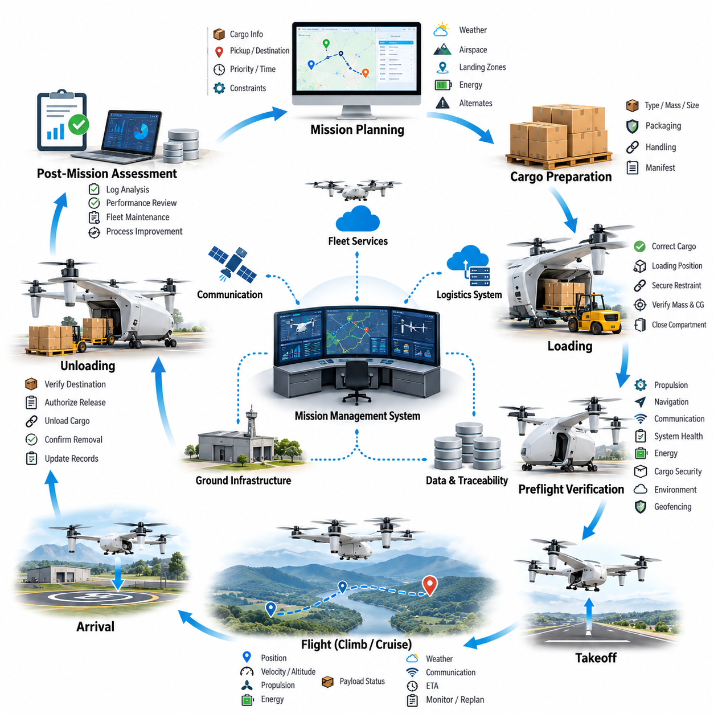
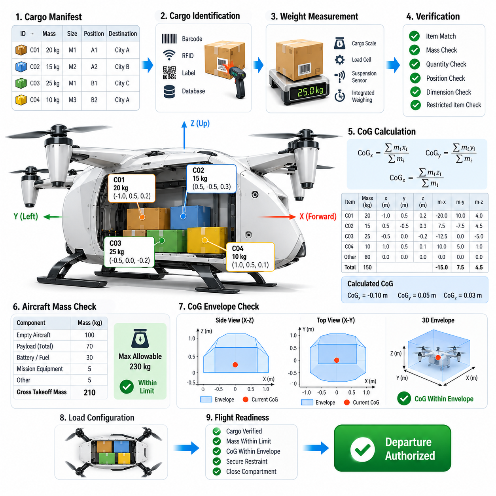
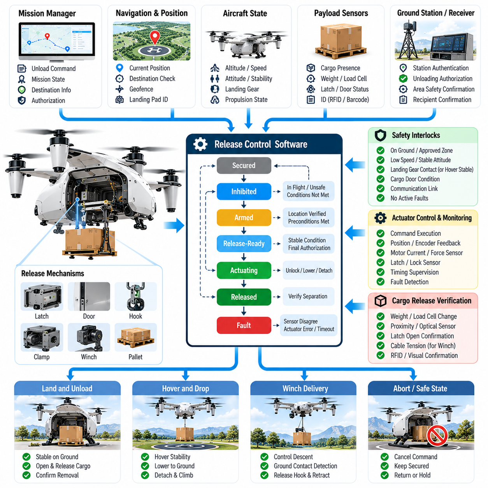
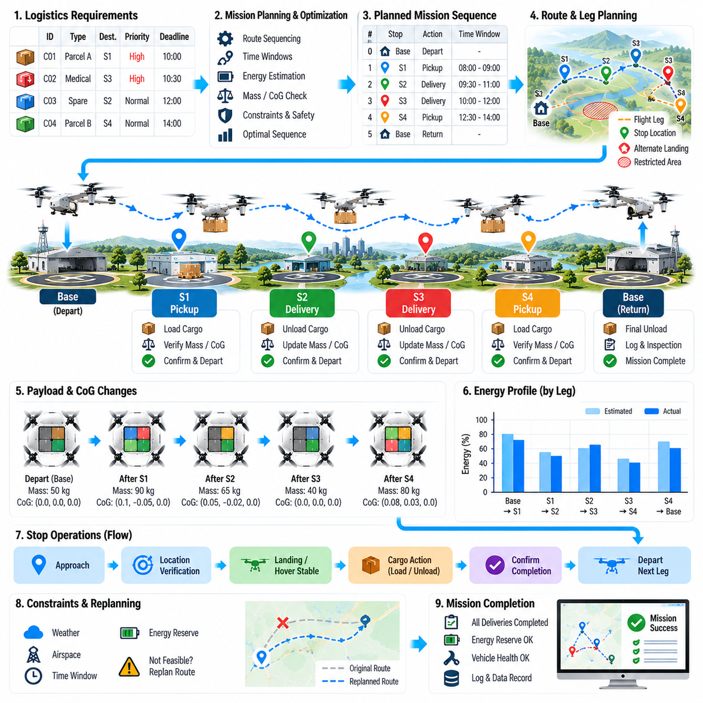
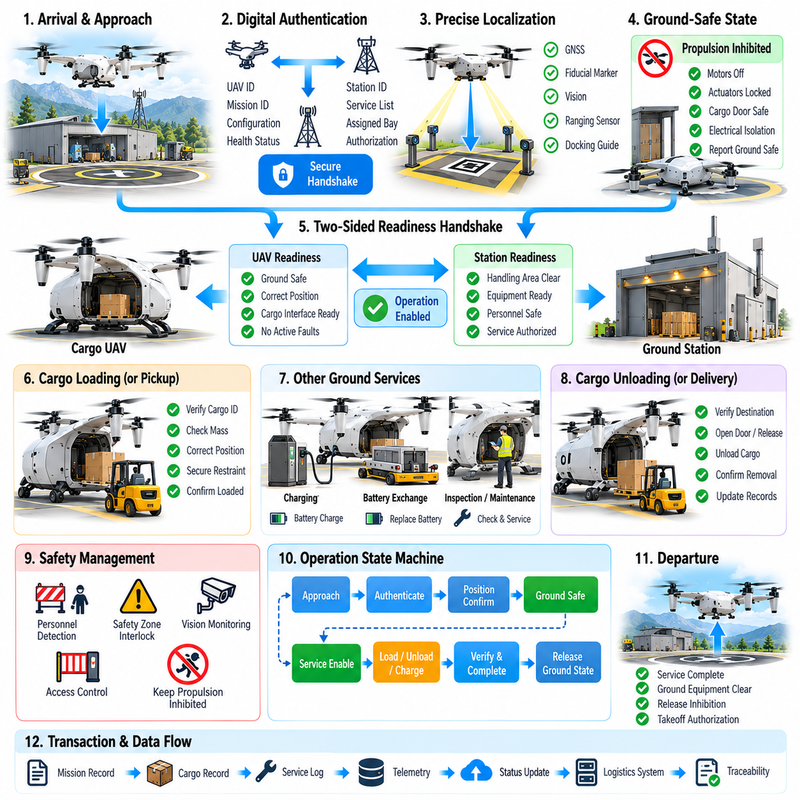
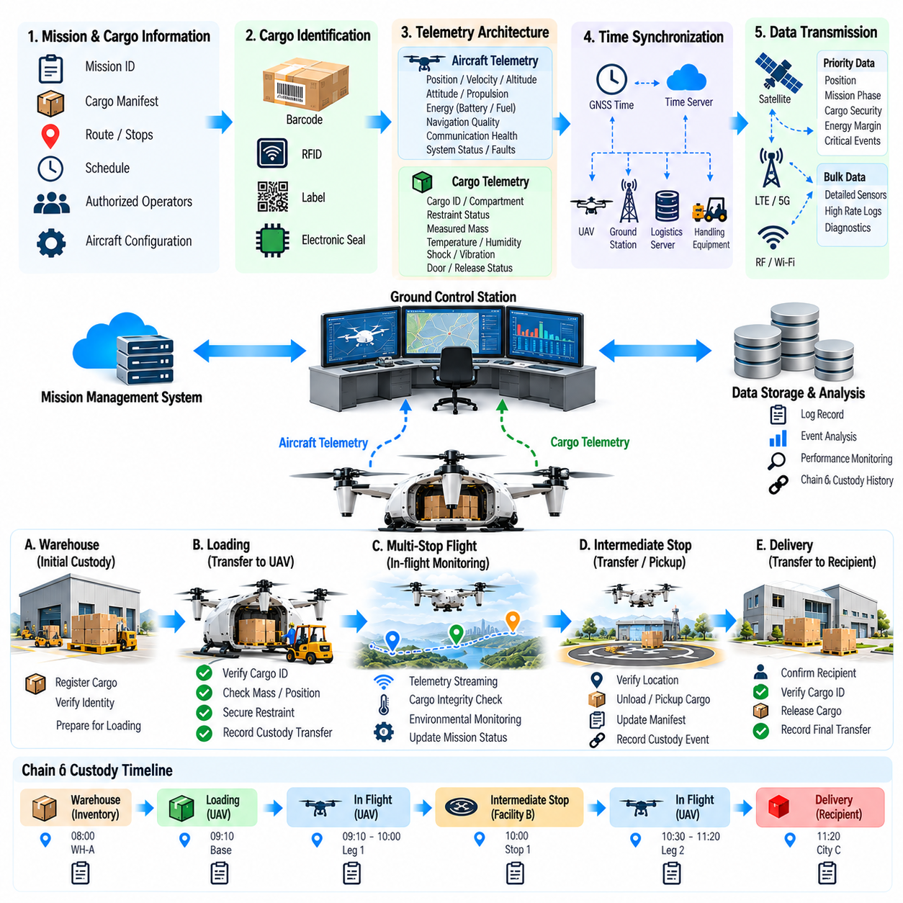
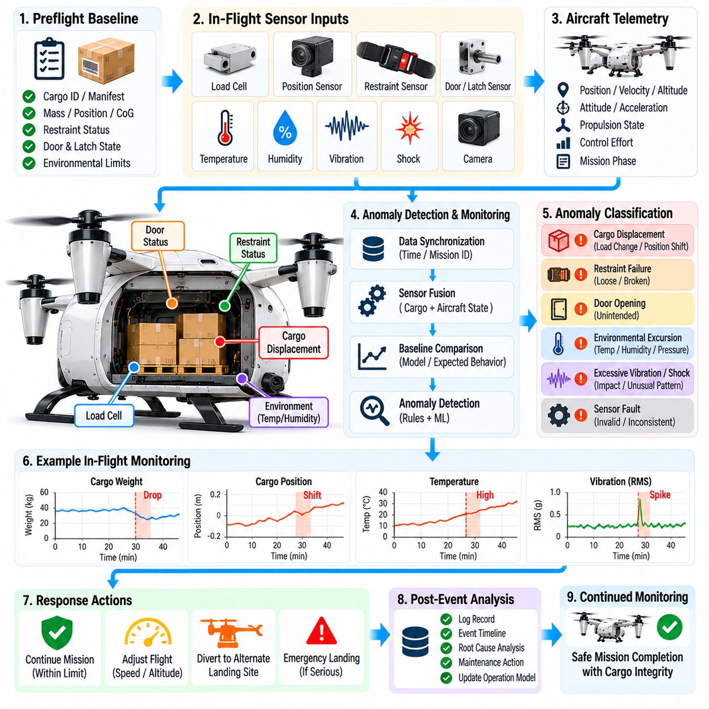
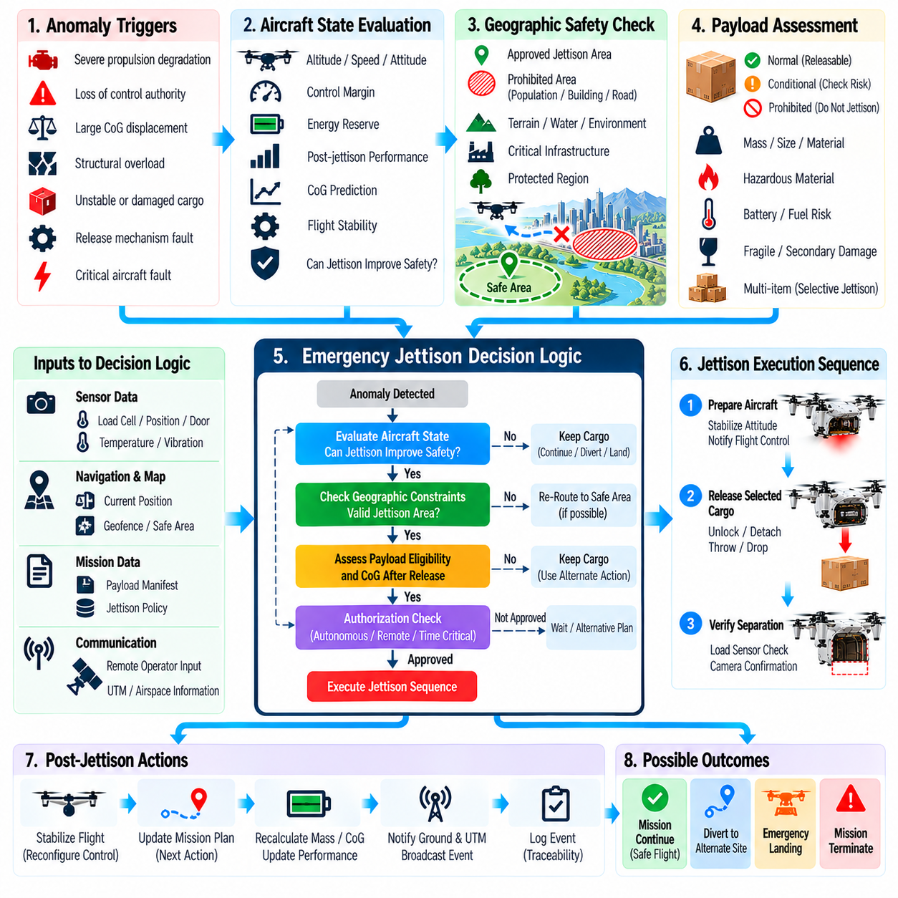
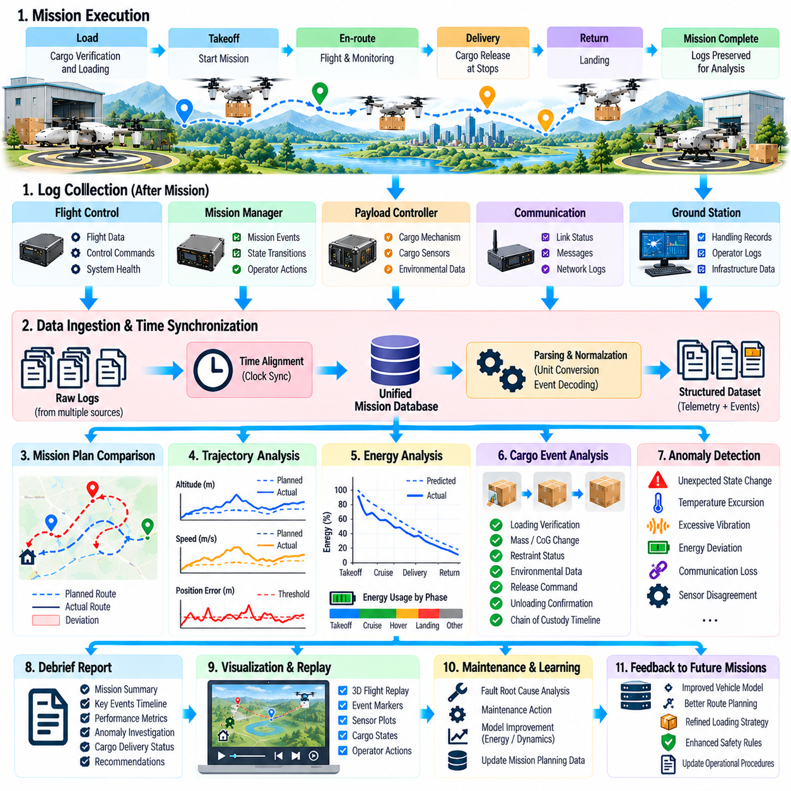
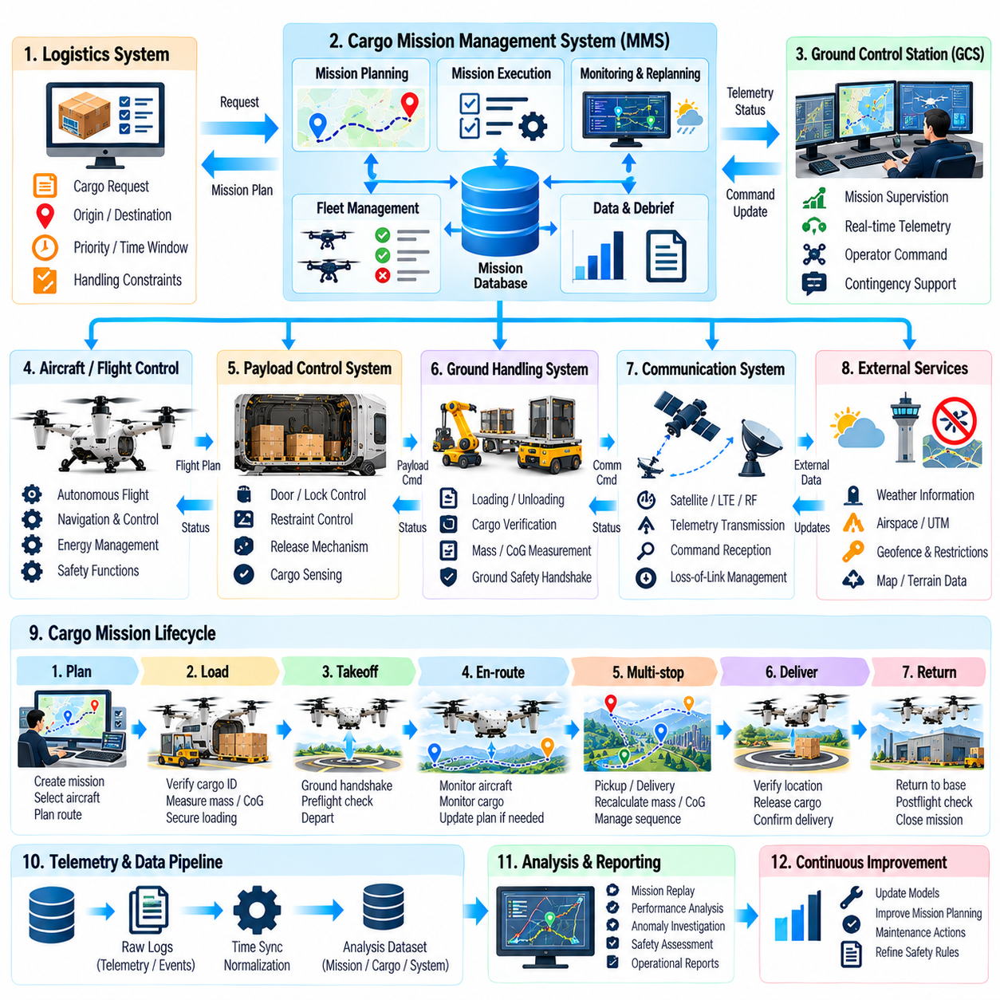

**Volume 23. Cargo UAV Autonomy and Flight AI**

# Chapter 07. Cargo Mission Management

## 07.01. Cargo Mission Lifecycle Plan Load Fly Unload

{width="7.268055555555556in" height="7.268055555555556in"}

The cargo mission lifecycle defines the complete operational sequence through which an unmanned aerial vehicle transforms a transportation request into a safely completed delivery. A typical lifecycle consists of mission planning, cargo preparation, loading, preflight verification, autonomous flight, arrival, unloading, and post-mission assessment. These stages must operate as a coordinated workflow rather than as independent procedures.

Mission planning begins by converting logistics requirements into executable flight objectives. The mission management system receives information such as cargo type, mass, dimensions, pickup location, destination, delivery priority, required arrival time, and operational constraints. It combines these parameters with aircraft capability, weather conditions, airspace restrictions, available landing zones, energy reserves, and contingency requirements to determine whether the requested mission is feasible.

Cargo characteristics directly influence mission feasibility because payload mass and distribution affect aircraft performance throughout the flight envelope. The planning software must verify that gross takeoff mass, center of gravity, structural loading, available propulsion margin, and expected energy consumption remain within certified or validated limits. For large cargo UAVs, even small deviations in payload position can significantly alter stability, control authority, and landing behavior.

Route generation converts the approved transportation objective into a spatial and temporal flight plan. The route may contain departure corridors, cruise segments, altitude constraints, navigation checkpoints, restricted-area avoidance regions, communication coverage requirements, and destination approach paths. Mission planners should also generate alternate routes and emergency landing options so that the aircraft can respond safely when the nominal trajectory becomes unavailable.

Before loading begins, the aircraft and ground system establish a verified mission configuration. The mission identifier, vehicle configuration, payload record, route version, software status, battery or fuel state, and destination information should be synchronized across relevant systems. This configuration control prevents an aircraft from departing with an outdated route, incorrect cargo assignment, incompatible payload specification, or mission plan intended for another vehicle.

Loading is treated as a controlled physical operation rather than simply placing cargo inside the aircraft. The cargo must be positioned according to approved loading zones and secured against translation, rotation, vibration, and aerodynamic disturbance. Sensors or ground personnel may verify cargo mass, attachment status, compartment closure, restraint integrity, and center-of-gravity location before the mission management system authorizes progression to the preflight state.

For automated logistics operations, cargo identification can be connected to digital manifests using barcodes, RFID, machine-readable labels, or logistics database records. The aircraft mission manager can compare the detected cargo identity with the assigned mission manifest and reject departure when inconsistencies occur. This linkage reduces the possibility of delivering the wrong payload and provides traceability between warehouse operations, aircraft execution, and destination confirmation.

Preflight verification forms the transition between ground logistics and flight operations. The system evaluates propulsion readiness, navigation sensors, communication links, flight-control health, actuator status, energy availability, cargo security, environmental conditions, geofencing information, and mission-plan consistency. A departure authorization should only be issued when mandatory conditions satisfy predefined limits and unresolved faults have been classified as acceptable or cleared.

Takeoff initiates the execution phase of the mission lifecycle. The mission manager coordinates with the flight control system while maintaining responsibility for higher-level objectives such as route progression, operational constraints, destination validity, and contingency selection. The flight controller stabilizes and commands the vehicle at high frequency, whereas mission management determines where the aircraft should proceed and how mission-level state transitions should occur.

During climb and cruise, continuous mission monitoring compares planned behavior with actual aircraft state. Position, velocity, altitude, propulsion condition, energy consumption, payload status, communication quality, weather observations, and estimated arrival time can be evaluated against predicted values. Significant deviations may trigger replanning, speed adjustment, altitude modification, return-to-base behavior, diversion to an alternate site, or controlled emergency landing.

Energy management is particularly important for heavy cargo UAV operations because payload, wind, temperature, route geometry, and hover duration can produce substantial differences between predicted and actual consumption. The mission manager should continuously estimate energy required to reach the destination, execute the approach, land safely, and preserve an appropriate reserve. Continuing toward the destination is permitted only while sufficient operational margin remains available.

Communication loss must not automatically imply loss of mission capability. A properly designed autonomous cargo UAV maintains onboard mission knowledge and predefined contingency logic that allows safe operation during temporary network interruption. Depending on operational policy, the aircraft may continue along an approved route, hold at a safe location, return to the departure site, divert to an alternate landing zone, or land when communication cannot be restored within specified limits.

As the aircraft approaches its destination, mission management transitions from en-route navigation to arrival preparation. The destination must be revalidated because landing-zone conditions may have changed after departure. The system can evaluate geofence status, local weather, obstacles, ground activity, landing-zone availability, positioning quality, and communication with destination infrastructure before committing the aircraft to the final approach.

Landing represents a critical interface between autonomous flight and cargo handling. The aircraft must establish a stable touchdown condition while accounting for payload-induced dynamics, surface characteristics, wind disturbances, and obstacle clearance. After touchdown, propulsion should transition to an appropriate safe state, vehicle motion should be inhibited where necessary, and unloading authorization should remain locked until the system confirms that the aircraft is physically secure.

Unloading begins only after the cargo handling environment has been declared safe. Depending on vehicle architecture, cargo may be removed manually, transferred through an automated loading mechanism, lowered by winch, exchanged as a modular container, or handled by robotic equipment. The mission management system should coordinate access permissions, restraint release, compartment opening, and payload transfer so that flight-critical systems cannot be unintentionally activated during handling.

Delivery confirmation closes the primary logistics objective. Confirmation may combine payload identification, unloading sensor state, recipient authorization, location verification, timestamp information, and digital acknowledgement. This creates evidence that the assigned cargo reached the intended destination and was successfully transferred. For autonomous fleet operations, the confirmation event can also trigger downstream warehouse, inventory, billing, maintenance, or dispatch processes.

The aircraft may complete the mission at the destination or begin a return or subsequent transport leg. Before another departure, mission management must reassess remaining energy, aircraft health, payload configuration, weather, route availability, and maintenance status. A vehicle that successfully completed the outbound flight should not automatically be considered ready for another mission because component degradation or abnormal events may have occurred during operation.

Post-mission processing converts flight execution into operational knowledge. Recorded telemetry, mission-state transitions, energy consumption, navigation performance, detected faults, communication interruptions, cargo events, and contingency actions should be stored with the mission record. Comparing planned and actual performance helps identify prediction errors and provides data for improving route planning, energy models, maintenance decisions, and fleet scheduling.

Fault handling should span the entire Plan--Load--Fly--Unload lifecycle rather than being confined to airborne emergencies. Planning faults can invalidate a route, loading faults can create unsafe mass distribution, flight faults can compromise navigation or propulsion, and unloading faults can prevent safe payload transfer. A unified mission state machine enables each abnormal condition to trigger controlled recovery procedures while preserving clear operational responsibility.

Mission state transitions therefore require explicit entry conditions, completion criteria, timeout handling, and fallback behavior. The aircraft should not move from loading to preflight until payload verification succeeds, from preflight to takeoff until departure authorization exists, or from landing to unloading until propulsion and vehicle states are safe. Such guarded transitions prevent ambiguous conditions from propagating into later stages where their consequences may become more severe.

For fleet-scale cargo operations, the lifecycle must also integrate with higher-level logistics orchestration. Fleet management systems assign aircraft, reserve charging or fueling resources, schedule loading facilities, coordinate airspace usage, and distribute missions according to vehicle availability. Individual UAV mission managers execute these assignments while reporting progress and exceptions so that the overall logistics network can dynamically adapt to delays, faults, and changing demand.

A mature cargo mission architecture treats Plan, Load, Fly, and Unload as one continuous cyber-physical process. Digital mission information must remain synchronized with the physical aircraft, cargo, infrastructure, and operational environment from initial request through final confirmation. By maintaining traceability, guarded state transitions, continuous health assessment, and contingency capability across the lifecycle, autonomous cargo UAVs can achieve reliable, repeatable, and scalable transportation operations.

## 07.02. Cargo Load Verification and CoG Calculation [w/Code]

{width="7.268055555555556in" height="7.268055555555556in"}

Cargo load verification is a safety-critical process that confirms whether the payload installed in a cargo UAV matches the approved mission configuration and remains within structural, aerodynamic, and flight-control limits. Verification must consider total payload mass, individual cargo items, mounting locations, restraint conditions, compartment limits, and center-of-gravity position before the aircraft is permitted to enter the flight-ready state.

The process begins with a digital cargo manifest containing the expected identity, mass, dimensions, destination, handling requirements, and assigned loading position of each payload item. Barcode, RFID, machine-readable labels, or logistics database identifiers can associate physical cargo with its digital record. The mission management system compares detected cargo against the manifest and prevents departure when required items are missing, duplicated, incorrectly assigned, or outside permitted specifications.

Payload mass should be verified independently whenever practical rather than relying exclusively on declared logistics data. Cargo scales, landing-gear load cells, suspension sensors, or integrated weighing systems can measure actual loading conditions. The measured values are compared with manifest values and aircraft limits, allowing the system to detect packaging changes, incorrect cargo records, unreported equipment, or loading errors that could otherwise produce an unsafe takeoff mass.

Gross aircraft mass is calculated by combining empty vehicle mass, payload mass, batteries or fuel, mission equipment, removable modules, and other installed components. The resulting takeoff mass must remain below the maximum allowable value for the current aircraft configuration and environmental conditions. Operational limits may be lower than structural maximums when high temperature, altitude, wind, propulsion degradation, or restricted landing conditions reduce available performance margins.

Center of gravity, commonly represented as CoG, describes the effective location at which the combined mass of the aircraft and payload can be considered concentrated. For cargo UAVs, CoG location strongly influences attitude stability, actuator demand, rotor or propulsion loading, control allocation, and transient response. A vehicle may satisfy the maximum takeoff mass requirement while still being unsafe because its payload produces an unacceptable center-of-gravity position.

The longitudinal CoG can be calculated using the mass-weighted positions of all relevant components. Each item\'s mass is multiplied by its distance from a defined aircraft reference datum, producing a moment. The sum of these moments is divided by the total aircraft mass to determine the combined CoG position. The same principle can be applied along lateral and vertical axes when three-dimensional payload distribution significantly affects vehicle dynamics.

A practical CoG calculation therefore depends on accurate coordinate definitions. The aircraft should maintain a consistent body-fixed coordinate system and a clearly defined reference datum for payload stations, batteries, fuel tanks, avionics modules, and removable equipment. Loading software must use the same coordinate convention as engineering and flight-control systems because axis reversal, unit conversion errors, or inconsistent reference points can generate apparently valid but physically incorrect results.

For vehicles carrying multiple cargo items, each payload contributes independently to the overall mass moment. Moving a heavy package only a short distance may shift the combined CoG substantially, while relocating a lightweight package may have little effect. Automated loading tools can calculate candidate arrangements before physical loading begins and recommend positions that minimize CoG offset while satisfying compartment dimensions, structural floor loading, accessibility, and unloading-order constraints.

Lateral balance is particularly important when cargo is distributed across a wide fuselage, external pods, or asymmetric mounting stations. Excessive left-right CoG displacement can require continuous corrective thrust or control surface input, reducing control authority and increasing energy consumption. The load verification system should therefore compare calculated lateral CoG against an approved envelope rather than checking only longitudinal balance, especially for large multirotor and distributed-propulsion cargo aircraft.

Vertical CoG also affects dynamic behavior. A high payload location can increase roll and pitch sensitivity and may reduce stability margins during acceleration, turns, gust encounters, or landing. A low CoG can produce different structural and control characteristics. For aircraft with vertically stacked cargo compartments or underslung loads, vertical CoG estimation should be incorporated into the vehicle dynamics model and verified against configuration-specific limits.

The allowable CoG region is normally represented as an envelope rather than a single target point. This envelope defines combinations of longitudinal, lateral, and potentially vertical CoG positions for which adequate stability, control authority, structural margin, and propulsion capability have been demonstrated. Mission software should evaluate the calculated loading condition against the correct envelope for the aircraft configuration instead of using a generic fixed tolerance for every mission.

Cargo restraint verification is inseparable from CoG validation because a correct preflight calculation becomes invalid if the payload moves during flight. Mechanical locks, straps, clamps, container interfaces, cargo doors, and automated retention mechanisms must be checked for engagement and integrity. Position sensors, lock switches, load sensors, or machine vision may provide independent evidence that the payload is located and secured exactly as assumed by the mass-properties calculation.

Dynamic payload movement requires special consideration for liquids, suspended loads, flexible containers, or partially filled tanks. Sloshing and swinging can create time-varying center-of-mass positions and additional forces that cannot be represented adequately by a single static CoG value. Mission planning and flight control may therefore require dynamic load models, restricted maneuver envelopes, lower acceleration limits, or specialized stabilization strategies for these payload classes.

Sensor redundancy improves confidence in automated load verification. For example, manifest-derived mass can be compared with measured landing-gear loads, while cargo position records can be cross-checked against compartment sensors. Differences between independent estimates provide useful fault indicators. When disagreement exceeds a defined tolerance, the system should classify the loading state as unresolved rather than automatically selecting whichever measurement appears most convenient.

Uncertainty should be explicitly included in CoG assessment. Payload scales have measurement errors, cargo dimensions may vary, mounting interfaces have mechanical tolerances, and aircraft component masses can change after maintenance or modification. Instead of treating calculated CoG as an exact point, a safety-oriented system can estimate an uncertainty region and verify that the entire credible region remains inside the approved flight envelope with appropriate engineering margin.

Load verification should also account for structural distribution rather than considering only total mass and CoG. Two loading arrangements can produce nearly identical overall CoG values while imposing very different forces on cargo floors, frames, attachment points, landing gear, or external mounting structures. Local load limits, concentrated loads, bending moments, and attachment ratings therefore form additional constraints that must be evaluated before declaring the configuration safe.

Battery-powered cargo UAVs introduce configuration changes when battery modules can be exchanged or installed in different locations. Battery identity, mass, state of charge, mounting position, and configuration should be incorporated into the same mass-properties model as cargo. A battery replacement can shift aircraft CoG even when the payload remains unchanged, making configuration-aware verification essential before every departure.

For fuel-powered or hybrid aircraft, CoG can change continuously as fuel is consumed. The preflight calculation should therefore evaluate not only takeoff CoG but also expected CoG evolution across the mission. Fuel transfer, multiple tanks, reserve consumption, and asymmetric fuel usage may move the balance point toward an envelope boundary. Mission planning should confirm that predicted mass properties remain acceptable during climb, cruise, approach, landing, and contingency operations.

The flight-control system can use verified mass and CoG information to improve control allocation and vehicle response. Updated mass properties support more accurate thrust prediction, feedforward control, gain scheduling, trajectory generation, and actuator allocation. However, flight control should not be expected to compensate for an invalid loading configuration. Software adaptation provides performance optimization within an approved envelope, not permission to operate beyond validated physical limits.

Automated loading facilities can integrate CoG calculation directly into warehouse and fleet orchestration. Before an aircraft arrives at a loading station, logistics software can determine an acceptable placement plan based on the assigned vehicle configuration. Robotic loaders can then position cargo according to the approved arrangement, after which onboard sensors independently verify the result. This creates a closed verification chain from digital planning to physical loading.

Any change to cargo after successful verification should invalidate the previous approval state. Opening a cargo compartment, releasing a restraint, replacing a battery, adding equipment, or moving a package can alter mass properties. The mission state machine should therefore require re-verification whenever configuration-changing events occur, preventing stale CoG calculations or previously valid load approvals from being reused after the physical aircraft has changed.

Verification results should be stored as part of the mission record. The record can include measured masses, calculated CoG coordinates, uncertainty estimates, cargo identities, loading positions, restraint states, sensor observations, allowable envelope version, operator actions, and final authorization status. Such traceability supports incident analysis, maintenance investigation, regulatory evidence, fleet optimization, and continuous improvement of loading procedures.

A robust cargo load verification architecture ultimately links logistics information, physical sensing, mass-property calculation, structural constraints, and flight authorization into a single safety chain. The aircraft should enter the flight-ready state only when cargo identity, mass, position, restraint integrity, total vehicle mass, and CoG envelope compliance have all been established with sufficient confidence. This prevents loading errors from becoming airborne control problems and provides a dependable foundation for autonomous cargo operations.

## 07.03. Cargo Release Mechanism Control SW [w/Code]

{width="7.268055555555556in" height="7.268055555555556in"}

Cargo release mechanism control software manages the safe transfer of payload from a cargo UAV to its destination while preventing unintended release during loading, flight, approach, or landing. The software coordinates mission state, aircraft motion, release hardware, payload sensors, and ground authorization so that mechanical unlocking occurs only when all required operational and safety conditions have been positively verified.

Release mechanisms vary according to aircraft and logistics architecture. Cargo may be retained by electromechanical locks, hooks, clamps, powered doors, container latches, winches, robotic interfaces, or modular pallet systems. The control software should abstract these hardware differences through standardized commands and status interfaces, allowing mission management to request operations such as arm, unlock, lower, detach, secure, or abort without directly controlling actuator-level behavior.

A fundamental design principle is separation between release authorization and physical actuation. Receiving an unload command does not immediately energize a release actuator. Instead, the software first evaluates whether the aircraft is in an approved mission state, whether the destination has been verified, whether vehicle motion is sufficiently stable, and whether relevant safety interlocks are satisfied. Only after these conditions are confirmed can the release sequence advance toward hardware activation.

The release controller is typically implemented as a deterministic state machine. States may represent secured, inhibited, armed, release-ready, actuating, released, verification, and fault conditions. Transitions occur only when explicit guards are satisfied, preventing ambiguous software behavior. Unexpected commands, invalid transition requests, sensor disagreement, communication interruption, or actuator faults should drive the controller toward a defined safe state rather than an uncontrolled intermediate condition.

During normal flight, the mechanism remains inhibited through multiple independent protections. Software interlocks may consider airborne status, altitude, airspeed, landing-gear condition, navigation state, mission phase, cargo-door position, and release authorization. Hardware-level inhibits can provide an additional protection layer. The objective is to ensure that a single erroneous command, corrupted message, software fault, or sensor failure cannot cause inadvertent payload separation.

Destination verification is particularly important before release authorization. The mission manager can compare current navigation coordinates with the assigned delivery location and confirm that the aircraft lies within an approved unloading zone. Depending on the mission, additional validation may include landing-pad identity, ground-station authentication, visual markers, infrastructure communication, geofence status, or recipient confirmation. A valid location alone should not necessarily be sufficient to trigger cargo release.

For landed delivery, the release sequence should verify a stable ground condition before unlocking the payload. Wheel or landing-leg contact, vertical velocity, attitude, acceleration, propulsion state, and vehicle motion can be evaluated together. The system may require these conditions to remain stable for a defined dwell period. This prevents transient touchdown detection, bouncing, slope-induced motion, or temporary sensor noise from being mistaken for a secure unloading condition.

Some cargo UAVs release payload while hovering or through a suspended winch system rather than landing. In this case, the software must evaluate additional dynamic constraints such as hover stability, horizontal drift, altitude error, wind disturbance, cable tension, payload swing, and clearance from obstacles or personnel. Release should occur only inside a validated operational envelope that accounts for the increased risk associated with airborne payload transfer.

Winch-based delivery requires coordinated control of several sequential functions. The payload may first be lowered while cable length, motor current, descent velocity, and tension are monitored. Contact with the ground can be inferred from reduced tension or dedicated sensors, after which the system verifies load removal before opening the hook. Cable retrieval begins only after successful separation has been confirmed, preventing the aircraft from lifting or dragging cargo that remains partially attached.

Actuator control should include command monitoring rather than assuming that an issued command was successfully executed. Position switches, encoders, motor current, latch sensors, force sensors, or redundant status channels can verify actual mechanism motion. The software compares commanded and observed states within defined timing limits. Failure to reach the expected position produces a fault condition and prevents subsequent mission transitions that depend on successful release.

Cargo presence sensing provides another important verification layer. Weight sensors, load cells, proximity detectors, optical sensors, RFID observations, or mechanical switches can determine whether cargo remains attached after an unlock command. Combining mechanism position with payload-presence information distinguishes between a latch that opened successfully and a payload that physically separated, which is essential when friction, deformation, icing, or mechanical obstruction prevents release.

The release process should support abort behavior until physical separation becomes irreversible. If aircraft motion exceeds limits, an obstacle enters the unloading area, communication with required infrastructure is lost, or a mechanism fault appears before separation, the controller should stop or reverse the sequence where mechanically possible. The software must clearly define the point of no return beyond which recovery requires completing the release rather than attempting to re-secure the payload.

Fault detection covers electrical, mechanical, sensing, communication, and logical failures. Examples include actuator overcurrent, motor timeout, latch disagreement, unexpected cargo absence, contradictory position sensors, damaged communication links, or an invalid release request. Fault responses should depend on mechanism state and mission phase. A fault while securely locked may permit continued flight, whereas a partially released payload can require immediate stabilization and emergency handling.

Redundancy can be applied to safety-critical release functions when failure consequences justify it. Independent position switches, dual command paths, separate inhibit signals, or mechanically fail-safe locks can reduce the probability of unintended release. Software should detect disagreement between redundant channels rather than masking it through simple voting when the physical state is uncertain. An unresolved release mechanism should normally remain inhibited until a verified condition is restored.

Power management is also relevant because release actuators may require significant transient electrical current. The controller should verify that sufficient electrical power is available before initiating motorized doors, winches, clamps, or locking mechanisms. Voltage degradation during actuation can leave hardware between secured and released states. Monitoring supply voltage, actuator current, thermal condition, and execution time enables the software to detect incomplete operations before they become mission-level hazards.

Cybersecurity and command integrity are important when release authorization can originate from remote infrastructure. Commands should be associated with authenticated mission context and protected against unauthorized modification, duplication, or replay. The aircraft should reject release requests that do not correspond to the active mission, expected destination, authorized command source, or valid sequence state. Safety-critical physical actions should never depend solely on an unauthenticated network message.

Manual intervention may be required during maintenance, loading, emergency recovery, or abnormal unloading. Maintenance and ground-control modes should therefore provide controlled mechanisms for operating release hardware while preserving explicit safeguards. Such modes must be clearly separated from normal flight logic, require appropriate authorization, and generate traceable records so that temporary overrides cannot remain active unnoticed when the aircraft returns to operational service.

The interface between mission management and release control should use explicit command and status semantics. Mission software can request preparation or release, while the mechanism controller reports inhibited, armed, ready, actuating, completed, or faulted states. This separation prevents high-level mission software from directly manipulating motors or locks and allows hardware-specific timing, diagnostics, interlocks, and recovery procedures to remain encapsulated within the release subsystem.

Timing behavior should be deterministic enough for safe sequencing. Each actuator operation should have an expected completion interval and defined timeout response. The controller should avoid indefinite waiting when a latch or door fails to reach its target state. Timeouts can initiate retry, reverse motion, inhibit further commands, or escalate the condition to mission management depending on the mechanism design and the physical consequences of the current configuration.

After release, the aircraft must confirm that its mass properties have changed as expected. Removal of a heavy payload can significantly alter total mass, center of gravity, propulsion demand, and control response. The mission manager and flight-control system should therefore receive a verified cargo-release event and transition to the appropriate post-delivery configuration. For airborne delivery, control adaptation may need to occur immediately as payload separation changes vehicle dynamics.

Release events should be recorded with sufficient detail for operational traceability. Logs can contain mission identifier, location, time, authorization source, aircraft state, mechanism state transitions, sensor values, actuator currents, fault events, payload confirmation, and final release result. These records support maintenance diagnostics, logistics confirmation, incident investigation, software validation, and verification that cargo was released at the intended destination under approved conditions.

Software verification should test both nominal sequences and abnormal transitions. Simulation, software-in-the-loop testing, hardware-in-the-loop testing, bench testing, and aircraft-level integration testing can introduce delayed sensors, stuck actuators, contradictory signals, power interruptions, communication loss, duplicate commands, and aborted sequences. Particular attention should be given to demonstrating that no credible single failure produces an unintended release.

A robust cargo release control architecture ultimately treats unloading as a safety-controlled state transition rather than a simple actuator command. Mission authorization, destination verification, aircraft stability, hardware interlocks, actuator feedback, cargo sensing, fault management, and post-release confirmation form a continuous assurance chain. This approach enables autonomous cargo UAVs to transfer payload reliably while maintaining strict protection against premature, incomplete, or unintended release.

## 07.04. Multi Stop Cargo Mission Sequencing [w/Code]

{width="7.268055555555556in" height="7.268055555555556in"}

Multi-stop cargo mission sequencing enables a cargo UAV to serve several pickup, delivery, charging, or transfer locations within a single operational mission. Unlike a point-to-point flight, the mission must coordinate route order, payload changes, energy consumption, delivery priorities, time constraints, airspace availability, and vehicle health across multiple legs while preserving a valid and safe configuration after every stop.

The mission is represented as a sequence of interconnected legs and stop events rather than one continuous trajectory. Each stop contains operational attributes such as geographic location, expected arrival window, cargo action, landing or hover requirement, service duration, infrastructure availability, and departure conditions. Each flight leg defines the route, altitude profile, expected energy use, communication requirements, contingency sites, and constraints between consecutive stops.

Initial sequencing begins with logistics requirements. Cargo items may have different destinations, priorities, deadlines, temperature constraints, handling rules, or recipient availability. The mission planner associates each item with required pickup and delivery events and determines precedence relationships. A package cannot be delivered before it has been loaded, while certain high-priority or time-sensitive payloads may require delivery before lower-priority cargo even when this increases total flight distance.

Route optimization must consider more than geometric distance. The shortest sequence may not minimize energy because wind, altitude changes, aircraft mass, hover duration, and landing procedures affect consumption. The planner can evaluate candidate sequences using predicted flight time, energy demand, reserve requirements, airspace constraints, ground-service delays, and mission risk, selecting an ordering that provides acceptable operational efficiency without sacrificing safety margins.

Payload mass changes after each pickup or delivery, causing the aircraft performance model to evolve throughout the mission. A heavily loaded initial leg may require substantially more propulsion power than later legs after cargo has been unloaded. Conversely, intermediate pickup operations can increase gross mass and reduce remaining range. Energy prediction should therefore calculate each leg using the expected aircraft mass and configuration after the preceding stop rather than applying one constant consumption model.

Center-of-gravity conditions must also be recalculated whenever cargo is added, removed, or repositioned. Delivering one package can change the balance of the remaining payload even when total mass decreases. The mission sequence should avoid configurations that create unacceptable longitudinal, lateral, or vertical CoG positions at intermediate stops. Cargo placement planning and delivery order are therefore coupled problems rather than independent logistics decisions.

Loading arrangement can be optimized according to unloading sequence. Cargo intended for early stops should remain accessible without requiring unnecessary movement of packages assigned to later destinations. Automated loading systems can assign compartments or pallet positions based on stop order while simultaneously satisfying mass distribution, structural loading, restraint, and CoG requirements. This reduces ground time and limits configuration changes during intermediate operations.

Every stop acts as a controlled mission-state transition. As the UAV approaches a destination, the mission manager verifies that the correct stop is active and validates the corresponding cargo action. After landing or establishing a permitted hover condition, the system confirms location, aircraft stability, cargo identity, and release authorization before unloading. Mission progression remains blocked until required completion criteria for the current stop have been satisfied.

Delivery confirmation updates the onboard mission state immediately. Once a payload has been successfully transferred, its status changes from onboard to delivered, and the aircraft mass-properties model is updated. The next route leg should not begin until the system confirms cargo separation, mechanism security, compartment status, revised vehicle configuration, and sufficient energy for the next destination together with required reserves and contingency options.

Pickup stops introduce the reverse transition. The aircraft receives additional cargo and must verify identity, mass, loading position, restraint condition, and destination assignment before departure. The newly loaded payload becomes part of the active mass and CoG model. If measured characteristics differ from the planned values, the mission manager should reassess subsequent legs rather than assuming that the original route and energy predictions remain valid.

Time-window constraints add another sequencing dimension. Some locations may permit UAV operations only during specified periods, recipients may be available within limited intervals, or controlled airspace may have temporary access windows. The planner must estimate arrival times and service durations for each stop while preserving tolerance for wind, congestion, loading delays, and other uncertainties. A sequence that is geometrically efficient may be operationally invalid if it violates a required time window.

Energy management should be performed across both individual legs and the complete mission. Before departing each stop, the UAV evaluates energy required to reach the next destination, execute approach and landing, maintain contingency reserves, and reach an alternate location if necessary. The mission may include planned charging, battery exchange, refueling, or energy-service stops when the complete route exceeds the endurance available from the initial energy state.

Charging stops can themselves influence optimal sequencing. A fast charging station located slightly outside the shortest route may reduce total mission time compared with a slower facility directly along the route. The planner can consider charger availability, expected queue time, charging power, battery thermal condition, required state of charge, and downstream energy demand. This transforms mission sequencing into a combined transportation and resource-scheduling problem.

Dynamic replanning is necessary because multi-stop missions accumulate uncertainty over time. Wind changes, temporary airspace restrictions, unavailable landing zones, recipient delays, communication degradation, or unexpected energy consumption can invalidate the original sequence. The mission manager should periodically reassess remaining stops and determine whether reordering, skipping, delaying, diverting, or returning cargo provides a safer and more efficient continuation strategy.

Reordering must preserve logistical precedence and safety constraints. A planner cannot simply choose the geographically nearest remaining destination if doing so creates an invalid cargo configuration or causes a high-priority delivery to miss its deadline. Candidate sequences should be filtered according to mandatory relationships before optimization. This enables flexible adaptation while ensuring that critical operational rules remain invariant during autonomous replanning.

A stop may become temporarily unavailable after the aircraft has departed toward it. The mission architecture should define behavior for holding, diversion, resequencing, or return. If another valid destination can be served without compromising energy reserves or cargo requirements, the aircraft may execute that stop first and revisit the unavailable location later. Otherwise, it may proceed to an alternate landing site or return to an appropriate logistics hub.

Communication with fleet and logistics systems improves multi-stop coordination but should not make safe execution completely dependent on continuous connectivity. The aircraft should retain the authorized mission sequence, cargo assignments, route constraints, and contingency rules onboard. During temporary communication loss, it can execute predefined behavior according to mission policy, while sequence modifications received after reconnection must be validated against the current physical cargo and vehicle state.

Fleet-level orchestration can coordinate multiple UAVs when one vehicle can no longer complete its assigned stops efficiently. Remaining deliveries may be transferred to another aircraft at a logistics hub or designated exchange point. The fleet manager can redistribute missions according to vehicle position, payload capacity, energy state, priority, and infrastructure availability, while each aircraft independently validates that newly assigned tasks are compatible with its current configuration.

Mission sequencing should explicitly account for risk accumulation. Repeated takeoffs, landings, cargo transfers, and low-altitude operations may contribute more operational exposure than cruise flight. A route with fewer kilometers but many complex stops may therefore have greater overall risk than a slightly longer route with simpler operations. Sequence optimization can incorporate risk-related costs in addition to time, distance, and energy metrics.

Weather conditions may differ significantly between stops, particularly over long routes. The mission planner can associate forecast or observed weather with each leg and destination, evaluating wind, precipitation, visibility, temperature, and landing conditions. If conditions deteriorate at one destination, resequencing may allow the aircraft to service another stop first while waiting for the affected location to return to acceptable operating conditions.

Fault handling becomes more complex as the mission progresses because the aircraft may carry cargo for several remaining destinations. A propulsion, sensor, release-mechanism, or communication fault must be evaluated not only for immediate flight safety but also for its effect on remaining deliveries. Depending on severity, the mission may continue with reduced scope, terminate at the nearest suitable hub, or preserve undelivered cargo for recovery and reassignment.

Mission data should maintain traceability for every leg and stop. Records can include planned and actual arrival times, cargo loaded or released, vehicle mass and CoG after each event, energy state, route changes, authorization messages, faults, and delivery confirmations. This history enables operators to reconstruct the mission and provides data for improving scheduling algorithms, energy models, loading strategies, maintenance decisions, and fleet utilization.

Simulation and verification should test sequencing under both nominal and disrupted conditions. Scenarios can include delayed stops, incorrect cargo, unexpected payload mass, charging-station unavailability, airspace closure, weather changes, release failures, energy deviations, and communication loss. Testing should verify that replanning never violates cargo precedence, aircraft limitations, energy reserves, CoG envelopes, or mandatory safety constraints.

A robust multi-stop cargo mission architecture ultimately combines logistics scheduling, route planning, payload management, energy prediction, vehicle configuration, and autonomous contingency handling within one continuously updated mission model. Each completed stop changes the physical and logical state of the aircraft, and every subsequent decision must use that new state. This closed-loop sequencing approach enables cargo UAVs to perform complex distribution missions safely, efficiently, and at fleet scale.

## 07.05. Ground Handling Protocol and Handshake [w/Code]

{width="7.268055555555556in" height="7.268055555555556in"}

Ground handling protocol defines how a cargo UAV safely interacts with personnel, loading equipment, charging systems, logistics infrastructure, and automated ground stations before departure and after arrival. A structured handshake establishes that the aircraft and ground environment share the same mission context and operational state before physical actions such as loading, unloading, charging, towing, door operation, or propulsion activation are permitted.

The handshake should combine digital communication with physical-state verification. A network message indicating that an aircraft is safe for loading is insufficient if propulsion remains enabled or a cargo door is moving. Ground infrastructure therefore exchanges readiness information with the UAV while independent onboard sensors verify landing condition, propulsion state, actuator inhibition, cargo mechanism status, electrical isolation, and other safety-critical conditions relevant to the requested ground operation.

When an aircraft arrives at a handling station, the initial exchange establishes identity and session context. The UAV can provide vehicle identifier, active mission identifier, configuration version, cargo manifest reference, requested service, and relevant health status. The ground station responds with facility identity, available service capabilities, assigned handling position, authorization state, and operational restrictions, creating a mutually recognized ground-handling session.

Authentication prevents an aircraft from accepting commands from an unintended or unauthorized facility. Likewise, the ground station should verify that the arriving UAV corresponds to the expected mission and vehicle assignment. Digital certificates, signed messages, secure session keys, or equivalent authentication mechanisms can establish trust. Safety-critical actions should be associated with the authenticated session rather than accepted as isolated commands from an unknown network endpoint.

Physical localization provides another layer of confirmation. GNSS position may identify the general facility, but precise handling often requires centimeter-level alignment with loading docks, battery exchangers, charging connectors, or robotic systems. Fiducial markers, local positioning systems, machine vision, ranging sensors, or mechanical guides can confirm that the UAV occupies the correct bay and orientation before automated equipment is permitted to approach.

After position confirmation, the aircraft transitions into a defined ground-safe state. Propulsion is disabled or positively inhibited according to vehicle architecture, flight-control commands capable of generating thrust are blocked, and movable surfaces or mechanisms are placed in appropriate configurations. The UAV reports this state to the ground controller, but the station should also use available physical indicators or independent sensing where consequences justify additional assurance.

A two-sided readiness handshake reduces ambiguity between aircraft and facility. The UAV may report Aircraft Ground Safe while the station reports Handling Area Clear and Equipment Ready. Only when both conditions are simultaneously valid does the session advance to an operation-enabled state. If either side withdraws readiness, the active operation should pause or transition to a predefined safe condition rather than continuing on the assumption that earlier authorization remains valid.

Human presence requires explicit consideration even in highly automated cargo terminals. Personnel may need to inspect restraints, connect equipment, verify labels, or resolve abnormal conditions. Ground systems can use access gates, safety zones, wearable identifiers, vision systems, light indicators, audible warnings, or operator acknowledgements to coordinate human entry. Propulsion activation must remain inhibited whenever personnel are inside designated hazardous zones.

Cargo loading begins only after the handling handshake authorizes access to the payload interface. Cargo doors, ramps, locks, or container interfaces can then transition from flight-secured to loading-ready states. The ground system verifies cargo identity and planned loading location while the aircraft monitors compartment sensors and restraint mechanisms. Both systems should agree on each significant state transition before proceeding to the next loading action.

For robotic loading, synchronization must extend to motion coordination. The ground robot needs reliable information about aircraft pose, compartment geometry, permitted approach corridors, payload mass limits, and interface status. The UAV must know when the robot has entered or exited the cargo zone. Interlocks should prevent door closure, vehicle movement, propulsion enablement, or latch actuation when robotic equipment remains inside an unsafe region.

Cargo transfer can use transactional semantics so that ambiguous intermediate states are detectable. A loading transaction may progress through requested, accepted, transfer-in-progress, physically detected, secured, verified, and completed states. If communication fails midway, both systems can determine the last mutually confirmed state after reconnection. This is safer than assuming that a command acknowledgement proves that the corresponding physical cargo movement was completed.

Mass and center-of-gravity verification should occur before the loading transaction is finalized. The aircraft can compare measured payload mass, cargo position, restraint status, and calculated CoG with the approved configuration. The ground system may provide its own scale measurements or loading records for cross-checking. Departure preparation remains blocked when the two systems disagree beyond defined tolerances or when the resulting configuration exceeds aircraft limits.

Charging and battery exchange require dedicated handshake states because they introduce electrical and mechanical hazards. Before connector engagement, the aircraft and charger verify compatibility, voltage range, connector state, grounding requirements, battery condition, and permission to energize. Electrical power is applied only after successful connection confirmation, while disconnection requires current reduction and electrical isolation before mechanical release of the connector.

Automated battery exchange introduces additional configuration control. The ground station identifies the replacement battery module and communicates mass, health, state of charge, thermal condition, and configuration data to the UAV. After installation, the aircraft independently detects the module and validates electrical connection and mechanical locking. Because battery replacement can change total mass and CoG, the updated configuration must be incorporated into subsequent flight-readiness calculations.

Fueling or hybrid-energy servicing follows similar principles but includes fluid-specific safeguards. The aircraft and ground equipment should confirm engine shutdown, ignition inhibition, connection status, requested fuel quantity, tank capacity, and leak-monitoring readiness before transfer begins. Completion requires confirmation that flow has stopped, lines are depressurized where applicable, connectors are removed, caps or valves are secured, and the final fuel state is reflected in the mission model.

Unloading after arrival reverses many loading transitions but must still use an independent authorization sequence. The station confirms destination identity, expected cargo, recipient or logistics authorization, and handling-area readiness. The aircraft verifies stable landing, propulsion inhibition, and correct mission stop before unlocking cargo. Successful physical removal is confirmed through payload sensors and ground records before the delivery transaction is declared complete.

Ground handling protocols must define behavior for communication interruption. A lost network connection should not leave doors, locks, charging circuits, robots, or propulsion systems in uncontrolled states. Each subsystem should have a communication timeout and associated fail-safe response. Depending on the operation, this may mean stopping robot motion, removing actuator power, maintaining cargo locks, interrupting energy transfer, or preventing aircraft departure until communication and state consistency are restored.

State synchronization after reconnection is essential because the physical system may have changed while communication was unavailable. The aircraft and station should exchange complete current-state information rather than simply resuming from the last transmitted command. Sensor observations, mechanism positions, cargo presence, energy-transfer status, and authorization context are reconciled before a transaction continues. Uncertain states should require verification instead of optimistic assumptions.

Emergency-stop functionality should span both aircraft and ground equipment. Activation by an operator, safety sensor, robot controller, or UAV should propagate through the handling system with predictable effects. Emergency stop does not necessarily mean removing all electrical power; instead, each subsystem transitions to the safest achievable state for its current physical condition. Recovery should require explicit inspection or authorization rather than automatic restart.

The protocol should distinguish normal operational commands from maintenance and recovery functions. Technicians may need to move doors, release locks, rotate actuators, or energize subsystems during servicing, but these actions should occur within a clearly identified maintenance session. Maintenance privileges, temporary overrides, and inhibited protections should be logged and automatically cleared or explicitly verified before the aircraft returns to flight operations.

Version compatibility is important when aircraft and ground infrastructure evolve independently. Protocol messages should identify interface versions, supported capabilities, required features, and optional extensions. Before beginning a handling transaction, both sides determine whether they share a compatible command and state model. An unknown critical message or unsupported safety feature should cause the operation to be rejected rather than interpreted using an unsafe assumption.

Ground handling data should be timestamped and traceable. Logs can include aircraft and facility identities, session authentication, arrival time, readiness transitions, cargo transactions, measured mass, CoG results, charging or fueling events, human interventions, faults, overrides, and departure authorization. These records create a digital history linking logistics activity to the physical configuration of the aircraft at each mission transition.

Departure requires a final release handshake between the aircraft and ground facility. The station confirms that personnel, robots, cables, charging connectors, loading equipment, and obstacles are clear, while the UAV verifies closed doors, secured cargo, valid mass properties, sufficient energy, flight-system readiness, and mission authorization. Only after both sides withdraw ground-handling ownership can the aircraft transition toward propulsion enablement and takeoff preparation.

Testing should include normal operations and intentionally disrupted handshake sequences. Hardware-in-the-loop and facility integration tests can introduce delayed messages, duplicate commands, incorrect aircraft identity, sensor disagreement, robot intrusion, connector faults, network loss, emergency stops, and incomplete cargo transfers. Verification should demonstrate that no single communication error or state inconsistency can inadvertently authorize a hazardous physical action.

A robust ground handling protocol ultimately creates a controlled boundary between autonomous flight and physical logistics operations. Mutual authentication, explicit state transitions, physical verification, transactional cargo handling, energy-service interlocks, human safety controls, fault recovery, and final departure authorization form a continuous handshake chain. This enables cargo UAVs and automated ground infrastructure to cooperate safely without relying on implicit assumptions about each other\'s state.

## 07.06. Cargo Mission Telemetry and Chain of Custody [w/Code]

{width="7.268055555555556in" height="7.268055555555556in"}

Cargo mission telemetry provides the continuous digital record required to understand where an autonomous cargo UAV is, what it is carrying, how the aircraft is performing, and whether the mission remains within approved conditions. When combined with chain-of-custody management, telemetry connects aircraft state with cargo identity and transfer events, creating traceability from initial loading through flight, intermediate handling, delivery, and final acceptance.

The telemetry architecture should distinguish aircraft operational data from cargo-specific information while preserving synchronized timestamps and mission identifiers. Aircraft telemetry may include position, velocity, altitude, attitude, propulsion state, energy level, navigation quality, communication health, and detected faults. Cargo telemetry can contain payload identity, compartment assignment, restraint status, measured mass, temperature, shock exposure, door state, and release-mechanism condition.

A common time reference is essential for reconstructing events accurately. Aircraft computers, payload sensors, ground stations, logistics servers, and handling equipment should maintain synchronized clocks using an appropriate time-distribution mechanism. Each significant observation or state transition receives a timestamp so investigators and automated systems can determine whether cargo events occurred before, during, or after corresponding aircraft and mission-state changes.

Mission identifiers provide the logical backbone for telemetry correlation. A unique mission record should associate the assigned aircraft, planned route, cargo manifest, authorized operators or systems, departure facility, intermediate stops, destination, and expected transfer events. Individual payload items can retain separate identifiers linked to this mission, allowing one aircraft flight to transport several packages while preserving item-level traceability.

Chain of custody describes who or what had authorized control of the cargo at each stage. Custody may transition from warehouse inventory to a loading system, from the loading system to the UAV, from the UAV to an intermediate facility, and finally to the recipient. Each transition should be represented as an explicit event with identities, location, time, cargo state, authorization context, and evidence that the physical transfer was completed.

Physical cargo identity should be verified at custody boundaries rather than inferred solely from mission planning data. Barcodes, RFID tags, electronic seals, secure container identifiers, machine-readable labels, or embedded sensors can associate the physical payload with its digital record. The system should reject or flag a transfer when the observed identity does not match the expected cargo assignment, preventing silent propagation of logistics errors.

Loading creates the first aircraft-level custody event. Before accepting custody, the UAV or associated ground system verifies cargo identity, mass, loading position, restraint status, and destination assignment. Successful verification changes the cargo state from awaiting loading to onboard and secured. The event record can include the responsible facility, loading equipment, operator authorization, measured properties, and confirmation that the aircraft physically detected the payload.

Telemetry during flight should demonstrate continued possession and integrity rather than merely report aircraft position. Cargo-door switches, latch sensors, load cells, compartment detectors, seal states, or release-mechanism feedback can provide evidence that the payload remains secured. Unexpected changes, such as door opening, loss of measured load, or release actuator movement, should generate high-priority events because they may indicate cargo loss, tampering, or mechanism failure.

Sensitive cargo may require environmental telemetry throughout transportation. Temperature, humidity, pressure, vibration, acceleration, shock, orientation, or light exposure can be monitored depending on payload type. Medical supplies, electronics, hazardous materials, biological samples, or precision equipment may have specific environmental envelopes. Recorded measurements provide evidence that handling and flight conditions remained within the required transportation limits.

Environmental data should be interpreted together with location and mission phase. A temperature excursion during ground waiting may require a different response from the same excursion during cruise. Likewise, a shock event can be correlated with loading, takeoff, turbulence, landing, or unloading. Synchronizing cargo sensors with aircraft telemetry enables the system to identify likely causes and determine whether inspection, quarantine, or mission intervention is required.

Telemetry communication may use multiple links with different bandwidth and latency characteristics. Safety-critical status and exception events should receive priority over large diagnostic datasets. A compact real-time stream can report position, mission phase, cargo security, energy margin, and critical faults, while detailed sensor histories remain buffered onboard for later upload. This approach preserves operational awareness without making mission safety dependent on continuous high-bandwidth connectivity.

Loss of communication should not break the chain of custody. The UAV should continue recording telemetry locally using protected onboard storage and preserve event sequence numbers and timestamps. After connectivity returns, buffered records can be transmitted and reconciled with ground systems. The resulting history should indicate the period of communication loss while still providing evidence of aircraft and cargo state during the disconnected interval.

Data integrity is critical because telemetry may serve operational, contractual, regulatory, or forensic purposes. Records should be protected against unauthorized alteration, deletion, duplication, or insertion. Cryptographic hashes, digital signatures, authenticated communication, secure storage, monotonic sequence numbers, or tamper-evident logging can provide confidence that recorded events correspond to data produced by authorized systems and have not been modified afterward.

Telemetry provenance identifies the source and processing history of important information. A cargo temperature value should indicate which sensor produced it, while a calculated CoG value should reference the measurements and configuration used in the calculation. Distinguishing directly measured data from estimated or derived values prevents downstream systems from treating predictions as physical observations and supports reliable investigation when different sources disagree.

Access control should restrict who can view or modify mission and cargo information. Flight operators may require detailed vehicle telemetry, logistics personnel may need package and delivery status, maintenance teams may need diagnostic data, and recipients may require only delivery evidence. Role-based permissions and data minimization reduce unnecessary exposure while preserving the information required for safe operations and accountable custody transitions.

Intermediate stops require especially careful custody management because only part of the payload may be transferred. The system should identify exactly which cargo items leave the aircraft and which remain onboard. After each transfer, the manifest, measured aircraft mass, CoG model, compartment status, and remaining delivery assignments are updated. This prevents a successful transfer of one package from being interpreted as completion of the entire cargo mission.

Delivery begins with destination and recipient verification. The aircraft or ground infrastructure confirms that the current location corresponds to the authorized delivery point and that the receiving entity is permitted to accept the specified payload. Depending on the operation, verification can use authenticated infrastructure messages, recipient credentials, secure codes, machine-readable identifiers, or automated logistics-system authorization before physical release is enabled.

A completed delivery requires evidence of physical separation and acceptance. Opening a cargo latch alone does not prove successful transfer. Payload-presence sensors, weight changes, RFID observations, robotic handling records, recipient acknowledgement, or other independent evidence can confirm that the cargo actually left the aircraft. Custody changes only after the defined completion criteria are satisfied, preventing ambiguous ownership when a release operation fails midway.

Exception events should be incorporated directly into the custody history. Unexpected route deviation, emergency landing, cargo compartment access, restraint fault, environmental limit violation, communication outage, or unauthorized handling attempt may change the confidence associated with the shipment. The system can mark affected cargo for inspection or restricted release while preserving the complete event history needed to determine whether the payload remains acceptable.

Emergency diversion introduces a temporary custody state that differs from planned delivery. If the UAV lands at an alternate site, cargo should not automatically be considered transferred merely because the aircraft is on the ground. Custody remains with the aircraft or operating organization until an authorized recovery process identifies the cargo, verifies its condition, records the receiving party, and explicitly completes a controlled handover.

Fleet operations require telemetry to scale across many simultaneous missions without confusing aircraft, cargo, and event identities. Fleet management platforms can maintain separate digital timelines for each mission while correlating shared infrastructure events such as charging, loading, airspace constraints, or hub transfers. Consistent schemas and identifiers allow cargo to move between aircraft while preserving one continuous custody history across the transportation network.

Telemetry retention policies should reflect operational and regulatory needs. High-rate raw sensor data may be stored for a limited period, while custody events, delivery confirmations, faults, and summarized flight records may require longer retention. Data architecture should preserve sufficient information to reconstruct significant events without requiring indefinite storage of every high-frequency measurement produced during routine operation.

Post-mission analysis combines flight telemetry and custody records into a complete mission history. Operators can compare planned and actual routes, energy consumption, arrival times, environmental exposure, cargo handling events, and delivery outcomes. Repeated analysis across a fleet can reveal systematic delays, handling risks, sensor reliability problems, inefficient routes, or infrastructure bottlenecks and support continuous operational improvement.

Verification and testing should include corrupted records, missing telemetry packets, clock offsets, duplicate custody events, sensor disagreement, communication outages, unauthorized access attempts, and partial cargo transfers. The system should demonstrate that such conditions are detectable and that uncertain information is clearly identified rather than silently converted into apparently valid custody evidence.

A robust cargo telemetry and chain-of-custody architecture ultimately creates a trustworthy digital counterpart to the physical transportation process. Synchronized aircraft telemetry, cargo sensing, authenticated identities, explicit custody transitions, secure event logging, offline recording, and verified delivery evidence preserve continuity from origin to destination. This enables autonomous cargo UAV operations to remain observable, auditable, and accountable even across complex multi-stop and fleet-scale missions.

## 07.07. Cargo Anomaly Detection In Flight Monitor [w/Code]

{width="7.268055555555556in" height="7.268055555555556in"}

Cargo anomaly detection provides continuous in-flight supervision of the payload and its supporting mechanisms so that abnormal conditions can be identified before they develop into aircraft-level hazards. The monitor combines cargo sensors, vehicle telemetry, mission context, and expected payload behavior to determine whether the physical cargo configuration remains consistent with the verified state established before takeoff.

The monitoring function begins from a trusted baseline created during loading and preflight verification. This baseline can contain cargo identity, measured mass, loading position, center of gravity, restraint status, compartment conditions, release-mechanism state, and expected environmental limits. In-flight observations are evaluated against this baseline while accounting for normal changes caused by aircraft maneuvering and mission progression.

Cargo anomalies can originate from mechanical, environmental, electrical, sensing, or procedural causes. Representative conditions include restraint loosening, payload displacement, cargo-door opening, latch failure, unexpected load reduction, excessive vibration, impact, temperature excursion, container damage, sensor malfunction, or unintended release-mechanism movement. The monitor should classify these events according to their likely effect on cargo integrity and flight safety.

Load cells and force sensors can reveal changes in payload support forces during flight. Raw measurements naturally vary with acceleration, turns, turbulence, and vehicle attitude, so a simple fixed threshold is often insufficient. The monitoring software should compensate for expected dynamic loads using aircraft acceleration and attitude information, allowing persistent or physically inconsistent force changes to be distinguished from normal maneuver-induced variations.

Payload displacement is particularly important because movement can alter the aircraft center of gravity and invalidate the control configuration established before departure. Position sensors, compartment cameras, proximity detectors, restraint switches, or distributed load measurements can provide evidence of cargo motion. When direct position sensing is unavailable, the system may infer displacement from unexplained changes in vehicle attitude, actuator demand, or load distribution.

The anomaly monitor should correlate cargo observations with flight dynamics rather than evaluate each sensor independently. A sudden lateral load shift accompanied by increased roll-control effort may indicate real payload movement, whereas the same sensor change during a commanded turn may be expected. Multi-sensor correlation reduces false alarms and enables the software to estimate whether an anomaly is localized to a sensor or represents a physical cargo event.

Center-of-gravity consistency can be monitored indirectly during flight. The system can compare expected vehicle response with measured accelerations, attitude behavior, propulsion distribution, and control effort. Persistent deviations may indicate that actual mass properties differ from the preflight model. Such estimates do not replace physical load verification, but they can provide valuable evidence that cargo movement, loss, or configuration change has occurred.

Cargo restraint health should be monitored whenever suitable instrumentation is available. Lock-position sensors, strap-tension sensors, latch switches, or mechanical-state indicators can detect degradation before complete separation occurs. A transition from fully secured to uncertain restraint status should trigger immediate evaluation because continued maneuvering or turbulence may convert a partial restraint failure into a major payload shift.

Cargo-door and compartment integrity form another monitoring layer. Door position switches, lock sensors, pressure measurements, or local cameras can detect unintended opening or structural abnormalities. An unexpected door-state change during flight should be treated as a significant event because it may alter aerodynamics, expose cargo to the environment, permit payload loss, or indicate failure of a mechanism associated with the release system.

Environmental monitoring is necessary when payload integrity depends on transportation conditions. Temperature, humidity, pressure, vibration, shock, orientation, and light exposure can be evaluated against cargo-specific limits. Instead of reacting only after a hard limit is exceeded, the software can track trends and rate of change, allowing early intervention when a temperature or vibration condition is moving toward an unacceptable region.

Vibration analysis can reveal both cargo and aircraft problems. A poorly restrained payload may introduce new resonant behavior, while damaged packaging or mounting structures may produce characteristic frequency changes. The monitor can compare vibration features with expected profiles for the current flight phase, propulsion state, and payload configuration. Persistent spectral changes can trigger inspection requirements or operational restrictions.

Shock detection should distinguish isolated events from sustained abnormal loading. A brief acceleration spike may result from turbulence or landing contact, while repeated high-energy impacts could indicate cargo movement within a compartment. By correlating shock timing with aircraft motion and mission phase, the system can determine whether the event is explainable by normal flight dynamics or requires a cargo-integrity warning.

Sensor health monitoring is essential because a failed cargo sensor must not automatically be interpreted as a physical cargo failure. Range checks, signal-quality indicators, redundant measurements, temporal consistency, and cross-sensor comparisons can identify frozen values, drift, intermittent wiring, or implausible transitions. The system should maintain separate confidence estimates for the cargo condition and for the sensors used to observe that condition.

Anomaly detection can combine deterministic rules with statistical or learned models. Rule-based logic is appropriate for clear safety constraints such as an unlocked latch or open cargo door. Model-based techniques can identify subtle deviations from expected load, vibration, temperature, or control-response patterns. Learned models should operate within defined assurance boundaries and should not override explicit safety interlocks or validated physical limits.

Thresholds should adapt to mission phase and aircraft operating condition. Acceptable loads during cruise may differ from those during takeoff, aggressive maneuvering, approach, or landing. Likewise, a suspended payload may have different allowable motion during controlled lowering than during forward flight. Context-aware thresholds reduce nuisance alarms while preserving sensitivity to conditions that are genuinely abnormal for the current operation.

Detected anomalies should be assigned severity and confidence rather than represented as a single binary fault. A low-confidence deviation may justify increased monitoring, while a confirmed restraint failure may require immediate mission intervention. Severity can consider the probability of cargo loss, expected CoG shift, structural consequences, environmental sensitivity, and available recovery options, enabling proportionate responses to different abnormal conditions.

The response strategy should depend on both anomaly type and aircraft state. The mission manager may reduce speed, limit acceleration, avoid aggressive turns, change altitude, return to base, divert to the nearest suitable landing site, or perform an immediate controlled landing. For environmental anomalies, the aircraft may prioritize the destination or an alternate facility capable of preserving the payload rather than simply returning to the departure point.

When cargo movement is suspected, flight-control adaptation can reduce immediate risk but should not conceal the underlying problem. Updated mass-property estimates may help maintain stability and improve control allocation while the aircraft transitions toward a safe landing. The mission system should continue treating the event as an unresolved cargo anomaly until physical inspection confirms the actual payload and restraint condition.

Release-mechanism anomalies require strict protection against unintended separation. Unexpected actuator current, latch movement, release-controller state change, or disagreement between redundant lock sensors should cause release commands to be inhibited where possible. The mission manager should evaluate whether continued flight is safer than landing immediately, considering whether the payload remains mechanically secure and whether further motion could worsen the condition.

Communication with the ground should prioritize confirmed or safety-relevant cargo anomalies. Alert messages can include anomaly type, severity, confidence, affected cargo, sensor evidence, aircraft location, mission phase, and current mitigation action. Detailed high-rate data may remain onboard for later analysis, while concise event information provides operators and fleet systems with sufficient context to support diversion or recovery decisions.

Temporary communication loss should not disable anomaly monitoring. Detection, classification, logging, and predefined mitigation actions should remain available onboard. Events are stored with timestamps and sequence information and transmitted when connectivity returns. If an anomaly exceeds a threshold requiring immediate action, the aircraft should execute its authorized contingency behavior without waiting indefinitely for remote confirmation.

Anomaly events should be integrated into cargo chain-of-custody records. A severe shock, temperature excursion, unauthorized compartment opening, suspected payload movement, or emergency landing can affect whether cargo remains acceptable for delivery. The system can mark the shipment for inspection, quarantine, or restricted handover while preserving the telemetry evidence needed to determine its final disposition.

Post-flight analysis should compare anomaly detections with physical inspection results. Confirmed events provide data for improving thresholds and models, while false alarms reveal sensor, calibration, or contextual deficiencies. Repeated analysis across many missions can identify recurring restraint problems, packaging weaknesses, problematic routes, vibration environments, or mechanism degradation that may not be apparent from individual flights.

Verification should expose the monitoring software to both real and simulated abnormal conditions. Software-in-the-loop, hardware-in-the-loop, vibration-table, restraint-failure, sensor-fault, and aircraft integration tests can evaluate detection latency, false-alarm behavior, classification accuracy, and mitigation logic. Testing should also confirm that monitor failure itself cannot directly command unsafe cargo release or destabilizing aircraft actions.

A robust in-flight cargo anomaly monitor ultimately acts as a continuous assurance layer between preflight load verification and post-flight delivery confirmation. By combining payload sensing, flight dynamics, contextual thresholds, sensor-health assessment, anomaly classification, and autonomous mitigation, the system can detect emerging cargo problems early and preserve both aircraft safety and shipment integrity throughout autonomous cargo missions.

## 07.08. Emergency Cargo Jettison Logic [w/Code]

{width="7.268055555555556in" height="7.268055555555556in"}

Emergency cargo jettison logic is a last-resort safety function intended to preserve aircraft controllability or reduce consequences when retaining a payload creates a greater hazard than releasing it. Because intentional separation can create serious risks to people, property, infrastructure, and the environment, jettison must be treated as an exceptional mission state protected by strict authorization, geographic constraints, redundant checks, and deterministic execution logic.

The jettison function is fundamentally different from normal cargo delivery. Normal release occurs at a verified destination under planned handling conditions, whereas emergency jettison responds to an abnormal aircraft or payload state. The software must therefore use an independent emergency decision path and must never reinterpret an ordinary delivery command, communication failure, navigation error, or isolated sensor anomaly as authorization for emergency payload separation.

Potential triggers include severe propulsion degradation, loss of required control authority, dangerous center-of-gravity displacement, structural overload, unstable suspended cargo, release-mechanism damage, or a payload condition that threatens the aircraft. A trigger alone should normally initiate evaluation rather than immediate separation. The system must determine whether jettison materially improves the probability of achieving a safer aircraft state compared with retaining the cargo.

Decision logic should evaluate aircraft altitude, speed, attitude, trajectory, propulsion capability, remaining control margin, payload characteristics, and predicted post-release dynamics. The system should estimate whether removing the cargo will actually restore useful performance. Jettison should not occur when separation is unlikely to improve survivability or when the resulting mass and CoG change could create an even more difficult control condition.

Geographic safety is a primary constraint. The aircraft should maintain information describing areas where emergency release is prohibited and, where operationally approved, areas that may be considered for contingency separation. Population density, buildings, roads, critical infrastructure, hazardous facilities, water bodies, terrain, and protected regions may influence suitability. The system should seek a safer trajectory or landing option whenever sufficient control remains available.

A jettison decision may require the aircraft to navigate toward an approved contingency area before release. If time and control authority permit, the mission manager can modify heading, altitude, and speed to reduce predicted ground risk. The aircraft should continuously reassess whether the selected area remains reachable because propulsion degradation, wind, navigation uncertainty, or rapidly changing vehicle condition may invalidate the original contingency plan.

Payload properties strongly affect jettison eligibility. A compact inert package presents different consequences from batteries, fuel-containing equipment, fragile containers, hazardous materials, or cargo capable of producing secondary damage. The mission configuration should therefore include a jettison classification describing whether a payload is releasable, conditionally releasable, or prohibited from intentional separation except under specifically authorized emergency assumptions.

For multi-item cargo configurations, selective jettison may be preferable to releasing the entire payload. The system can determine whether removing a particular item or compartment provides sufficient mass reduction or restores an acceptable CoG while minimizing external risk. Selective release requires independently controllable mechanisms and accurate knowledge of payload identity, location, mass, and the aircraft configuration that will remain after each separation event.

The logic must evaluate post-jettison center of gravity before commanding release. Removing a payload from an asymmetric position can shift CoG abruptly even though total mass decreases. The predicted remaining configuration should stay within a recoverable control envelope. When multiple items may be released, sequencing becomes important because an intermediate configuration can be unsafe even if the final unloaded configuration would otherwise be acceptable.

Release dynamics also influence aircraft response. Separation can generate transient forces, moments, cable motion, aerodynamic disturbances, or sudden propulsion unloading. The flight-control system should receive advance indication that a jettison event is imminent so it can prepare appropriate control allocation or gain scheduling. Coordination must remain deterministic, with clear responsibility between emergency mission logic, release control, and flight stabilization functions.

Authorization architecture should reflect the available reaction time. When sufficient time and communication exist, remote operator confirmation may be required before jettison. For rapidly developing failures, waiting for a remote response may be unsafe, so predefined autonomous authority may be permitted within validated conditions. The software must clearly distinguish advisory recommendations, remotely authorized release, and autonomous emergency execution.

Autonomous jettison should require stronger evidence than ordinary fault response. Multiple independent indicators can be combined to establish that the aircraft faces an immediate hazard and that payload removal is an effective mitigation. Sensor disagreement should normally inhibit irreversible action unless the validated safety logic explicitly demonstrates that delay creates greater danger. Confidence and severity should therefore be incorporated into the decision process.

The release mechanism should retain protection against inadvertent activation even during emergency operation. Jettison authorization may transition the mechanism from inhibited to emergency-armed, but physical actuation should still require confirmation of the correct release channel, mechanism readiness, and compatible aircraft state. This layered approach prevents a software decision error or single corrupted command from directly energizing the release hardware.

The system should define a point of no return for the jettison sequence. Before this point, new information such as restored propulsion, improved control margin, detection of people in the predicted impact area, or mechanism disagreement may cancel the operation. Once physical separation has begun, however, attempting to reverse the process may be impossible or more dangerous, so control logic should transition immediately toward post-release stabilization.

Impact-risk estimation can support emergency decision making without assuming perfect prediction. Aircraft position, altitude, velocity, wind estimate, payload aerodynamic characteristics, and uncertainty can be used to estimate a conservative ground-impact region. The objective is not to predict an exact point but to determine whether credible impact locations intersect unacceptable areas. Uncertainty should widen the assessed region rather than create false precision.

When no safe jettison area is available, the system must compare alternative emergency strategies. These may include retaining the payload and performing a controlled landing, reducing maneuver demand, diverting to an emergency site, or accepting degraded performance while avoiding external hazards. Jettison is therefore one option within a broader contingency manager rather than an automatic response to every severe aircraft fault.

Suspended cargo requires specialized logic because a swinging or entangled load can directly destabilize the aircraft. If the load cannot be stabilized and control margin is deteriorating, separation may restore controllability. The system should evaluate cable tension, swing amplitude, aircraft attitude, altitude, and ground risk. Cutting or releasing a suspended load should remain independently inhibited until the emergency criteria are positively satisfied.

After separation, the aircraft must immediately update its mass and configuration state. Flight control should adapt to the reduced mass, changed CoG, and altered inertia, while mission management reassesses reachable landing locations and energy requirements. A jettison event normally invalidates the original cargo mission, so subsequent objectives should prioritize aircraft recovery and public safety rather than continuation of routine delivery operations.

The released cargo remains part of the operational responsibility after separation. The system should record the estimated release position, time, altitude, aircraft velocity, payload identity, predicted impact region, and environmental conditions. These data can be transmitted to operators and emergency services when connectivity permits, supporting area protection, cargo recovery, incident management, and investigation.

Chain-of-custody status must reflect that the cargo was intentionally separated under emergency authority rather than successfully delivered. The payload state can transition to emergency released or recovery required, with associated authorization and telemetry evidence. This distinction prevents logistics systems from interpreting release-mechanism activation as normal delivery completion and preserves accountability for subsequent recovery actions.

Communication loss requires carefully bounded autonomous behavior. The absence of a command link must never itself trigger jettison. If a separately detected emergency satisfies validated autonomous criteria, the aircraft may execute the approved contingency logic according to its onboard authority. All decisions, sensor evidence, rejected alternatives, and state transitions should be recorded locally for transmission after connectivity is restored.

Faults within the jettison mechanism must also be anticipated. A commanded release may fail, partially release the payload, or produce disagreement among latch sensors. The controller should detect incomplete actuation and notify flight-control and mission functions that the assumed mass change has not been confirmed. Recovery logic must use observed physical state rather than immediately switching to the predicted post-jettison configuration.

Testing should emphasize prevention of unintended release as strongly as successful emergency execution. Simulation, software-in-the-loop, hardware-in-the-loop, mechanism testing, and aircraft integration testing can examine false triggers, sensor disagreement, navigation uncertainty, communication loss, actuator failure, unsafe geographic conditions, and rapidly developing propulsion faults. Boundary cases around authorization thresholds require particular attention.

Verification should demonstrate that the emergency logic remains deterministic under combinations of failures. Requirements should define trigger conditions, inhibit conditions, decision timing, geographic constraints, autonomous authority, release confirmation, and post-release behavior. Traceability from safety analysis through software requirements and test evidence is essential because the function deliberately commands an irreversible physical action with consequences beyond the aircraft itself.

A robust emergency cargo jettison architecture ultimately balances two competing safety objectives: preserving the aircraft when payload retention becomes intolerable and protecting people and property from the consequences of intentional separation. Strict eligibility rules, conservative geographic assessment, layered authorization, predictive mass-property analysis, release verification, and post-event recovery logic ensure that jettison remains a controlled last-resort action rather than a routine fault response.

## 07.09. Mission Debrief and Log Analysis Pipeline [w/Code]

{width="7.268055555555556in" height="7.268055555555556in"}

Mission debrief and log analysis transform completed cargo UAV operations into structured evidence for safety assessment, performance improvement, maintenance, and future mission planning. The pipeline begins after landing or mission termination and combines flight telemetry, cargo events, software states, ground-handling records, operator actions, and infrastructure data into a synchronized reconstruction of what was planned, what actually occurred, and why significant deviations appeared.

A mission should enter debrief processing only after operational data has been safely preserved. Onboard computers, payload controllers, flight-control units, mission managers, communication systems, and ground equipment may each maintain separate logs. The collection stage identifies the authoritative sources, copies required records to protected storage, verifies file completeness, and prevents routine cleanup or subsequent operations from overwriting evidence needed for analysis.

Every dataset should carry mission identity and provenance information. Records can include vehicle identifier, mission identifier, software and configuration versions, sensor source, logging component, start and stop times, and data integrity metadata. Provenance allows analysts to distinguish directly measured telemetry from derived estimates and helps determine whether apparently conflicting values resulted from different sensors, processing stages, configuration assumptions, or clock references.

Time synchronization is central to meaningful reconstruction. Logs generated by different computers may use GNSS time, synchronized network time, local monotonic clocks, or subsystem-specific counters. The analysis pipeline maps these sources onto a common mission timeline using synchronization records and known offsets. Without this alignment, a cargo-release event, control response, communication loss, or fault message can appear in an incorrect causal order.

Data ingestion should preserve raw records before normalization. Original files provide forensic evidence and allow future tools to reinterpret information when parsers or models improve. A normalized analysis layer can then convert units, decode message formats, map signal names, resolve identifiers, and organize data into common schemas. Keeping raw and normalized datasets separately prevents convenience transformations from unintentionally destroying important source information.

The reconstructed timeline should represent both continuous telemetry and discrete mission events. Continuous data may include position, attitude, velocity, control commands, propulsion state, energy level, sensor health, and cargo environmental measurements. Discrete events include takeoff, landing, loading, cargo verification, route changes, release authorization, delivery confirmation, faults, emergency actions, communication transitions, and operator interventions.

Mission-plan comparison establishes the first analytical baseline. Planned route, altitude profile, stop sequence, estimated flight time, expected energy use, payload configuration, and contingency assumptions are compared with actual execution. Deviations are not automatically classified as failures because adaptive behavior may be correct. Instead, the pipeline determines whether each difference was expected, authorized, safety-driven, operationally beneficial, or evidence of degraded performance.

Trajectory analysis can identify route inefficiency and navigation abnormalities. Actual flight paths are compared with planned corridors, geofences, altitude constraints, approach profiles, and landing locations. Metrics such as cross-track error, altitude deviation, holding duration, unnecessary distance, and repeated replanning provide insight into navigation performance. Significant excursions should be correlated with weather, obstacle avoidance, airspace changes, sensor quality, or mission-manager decisions.

Energy analysis compares predicted and actual consumption throughout the mission. The pipeline can evaluate energy used during takeoff, climb, cruise, hover, approach, landing, and ground waiting while considering payload mass, wind, temperature, and route changes. Persistent prediction bias across missions may indicate inaccurate vehicle models, battery degradation, propulsion inefficiency, or environmental assumptions that require correction in future planning.

Cargo-related analysis reconstructs every significant payload state transition. Loading verification, measured mass, calculated CoG, restraint status, compartment conditions, in-flight anomaly events, release commands, unloading confirmation, and custody transitions are placed on the common timeline. This makes it possible to determine whether a delivery issue originated during loading, flight, landing, release operation, or ground handling.

Anomaly analysis should combine automatic detection with contextual review. The pipeline can identify threshold violations, unexpected state transitions, sensor disagreement, control saturation, abnormal vibration, communication degradation, temperature excursions, or unusual energy behavior. Automated scoring can prioritize events, but interpretation should consider mission phase and surrounding telemetry so that normal takeoff or landing transients are not incorrectly treated as significant faults.

Fault reconstruction focuses on causal sequence rather than simply counting error messages. One physical problem may generate many downstream warnings across multiple subsystems. The pipeline should identify the earliest credible abnormal indication, determine which functions reacted, and trace subsequent state transitions. This helps distinguish root causes from secondary effects and prevents maintenance teams from replacing components that merely reported consequences of another failure.

Software-state analysis is particularly valuable for autonomous mission systems. Logs should reveal mission state-machine transitions, planner decisions, rejected alternatives, safety-interlock activations, mode changes, timeout events, and contingency selections. Analysts can then determine not only what the aircraft did but which software conditions caused the action, providing evidence for verification, debugging, and refinement of autonomous decision logic.

Communication analysis evaluates link availability, latency, packet loss, handovers, bandwidth usage, and periods of disconnection. These measurements can be correlated with aircraft location and mission phase to identify coverage gaps or infrastructure limitations. The analysis should also confirm that onboard autonomy behaved according to policy during outages and that buffered telemetry was correctly reconciled after connectivity returned.

Ground-handling records extend the debrief beyond airborne operation. Loading transactions, charging events, battery exchanges, robotic handling, operator acknowledgements, maintenance overrides, and final departure handshakes can explain conditions observed later in flight. For example, an unexpected CoG estimate or energy anomaly may originate from an incorrect loading position or replacement battery configuration rather than from an airborne software fault.

Chain-of-custody analysis verifies that cargo ownership and control transitions were complete and internally consistent. Each payload should have an unbroken history from initial acceptance through loading, flight, intermediate transfer, delivery, or emergency recovery. Missing acknowledgements, identity mismatches, unauthorized compartment access, or ambiguous release events should be highlighted even when the aircraft itself completed the flight without technical problems.

The pipeline should calculate standardized mission performance indicators so that flights can be compared consistently. Useful measures include mission completion rate, schedule deviation, energy prediction error, route efficiency, communication availability, cargo anomaly count, autonomous intervention frequency, landing accuracy, ground turnaround time, and delivery confirmation latency. Metrics should retain context so that difficult missions are not unfairly compared with simple operations.

Event severity classification helps prioritize review effort. Routine deviations can be processed automatically, while safety-relevant events may require engineering or operational investigation. Severity can reflect impact on flight safety, cargo integrity, regulatory compliance, mission completion, and recurrence probability. High-severity events should preserve expanded datasets and trigger controlled workflows for investigation, corrective action, and release approval.

Automated report generation can summarize the mission while retaining links to supporting evidence. A debrief report may describe mission objectives, execution outcome, major deviations, cargo status, energy performance, faults, interventions, and recommended follow-up actions. Each conclusion should be traceable to telemetry, events, or configuration records so that engineers can move from a summary statement to the underlying data without ambiguity.

Visualization tools can support analysis even though the underlying pipeline remains data-centric. Analysts may inspect synchronized time series, geographic trajectories, state transitions, energy curves, control responses, and cargo events. The important architectural requirement is that visual displays derive from the same normalized and time-aligned dataset used for automated analysis, preventing different tools from producing contradictory interpretations of one mission.

Fleet-level aggregation converts individual debriefs into operational intelligence. Repeated missions can reveal trends such as increasing battery resistance, recurring communication loss near particular locations, release-mechanism delays, specific cargo-restraint failures, or systematic route-planning bias. Statistical analysis across aircraft and mission types helps distinguish isolated incidents from fleet-wide issues requiring design, maintenance, or procedural changes.

Maintenance systems can consume debrief results to support condition-based actions. Excessive actuator current, abnormal vibration, propulsion imbalance, battery degradation, repeated sensor resets, or release-mechanism delays can generate inspection recommendations. Maintenance completion should then be linked back to the relevant mission evidence, creating a feedback loop between operational telemetry, diagnosis, corrective work, and subsequent vehicle performance.

Machine-learning datasets may also be derived from mission logs, but data quality and labeling require strict control. Confirmed anomalies, environmental conditions, operator interventions, and maintenance findings can provide valuable labels for future detection or prediction models. Training datasets should preserve source provenance, configuration context, and uncertainty so that learned systems do not treat ambiguous or incorrectly synchronized events as reliable ground truth.

Retention and access policies should distinguish routine operational data from safety-critical evidence. High-rate raw telemetry may be archived according to storage capacity and regulatory requirements, while significant events, custody records, configuration data, and investigation packages may require longer retention. Access controls should protect sensitive mission and cargo information while ensuring authorized engineering, safety, maintenance, and compliance teams can perform required analysis.

Verification of the analysis pipeline is necessary because incorrect post-processing can produce misleading conclusions. Parser tests, timestamp validation, unit checks, schema compatibility tests, corrupted-log handling, missing-data scenarios, and known-event replay can demonstrate that the pipeline reconstructs missions accurately. Changes to analysis algorithms should be version controlled so historical reports can be reproduced using the methods that originally generated them.

A mature mission debrief architecture closes the operational learning loop. Planning assumptions produce a mission, execution generates telemetry and events, analysis identifies deviations and causes, and validated findings update planning models, software, maintenance procedures, loading rules, and operational policies. By preserving traceability from raw logs to corrective actions, cargo UAV operations can improve systematically rather than treating each completed flight as an isolated event.

## 07.10. Cargo Mission Management System Integration Case

{width="7.268055555555556in" height="7.268055555555556in"}

A cargo mission management system integration case demonstrates how flight autonomy, logistics planning, payload control, ground infrastructure, communications, safety supervision, and fleet services operate as one coordinated system. The objective is not simply to connect software modules, but to maintain a consistent mission state from cargo acceptance through loading, departure, multi-leg flight, delivery, recovery, and post-mission analysis.

The integrated architecture centers on a mission manager that coordinates information without replacing specialized safety-critical controllers. Logistics services define cargo identity, origin, destination, priority, handling constraints, and delivery windows. The flight system controls aircraft motion, while payload controllers manage doors, restraints, release mechanisms, and cargo sensing. Ground stations and fleet services provide infrastructure coordination and operational supervision.

A representative mission begins when the logistics system submits a transport request. The mission manager converts the request into an executable mission containing cargo assignments, route objectives, stop sequence, energy assumptions, ground-service requirements, and contingency policies. Before accepting the mission, the system verifies that aircraft payload capacity, range, cargo interfaces, environmental capability, and operational permissions are compatible with the requested transport task.

Aircraft selection can be performed at fleet level when multiple vehicles are available. The fleet manager considers vehicle location, health, payload capacity, battery or fuel state, maintenance restrictions, required equipment, and previously assigned missions. Once an aircraft is selected, a unique mission identifier links logistics records, aircraft configuration, cargo information, route planning, telemetry, ground handling, and later debrief data.

During loading, the mission manager exchanges state information with the ground-handling system and payload controller. Cargo identity, measured mass, loading position, restraint condition, and destination assignment are verified before the payload is accepted. The aircraft calculates updated mass properties and center of gravity, while the mission manager confirms that the loaded configuration remains compatible with planned routes, energy reserves, and flight-control limits.

The ground-handling handshake prevents premature transition from logistics operation to flight operation. Personnel, robots, charging equipment, cables, and loading devices must be clear before ground ownership is released. The aircraft independently verifies secured doors, locked cargo, valid energy state, navigation readiness, communication status, and absence of blocking faults. Only after both ground and aircraft conditions agree can propulsion enablement proceed.

Route planning combines logistics objectives with aviation constraints. The planner evaluates destination sequence, airspace restrictions, weather, terrain, energy consumption, alternate landing sites, communication coverage, and payload-specific requirements. The resulting route is not treated as permanently fixed. Instead, it becomes the approved baseline from which controlled replanning can occur when environmental or operational conditions change during execution.

At takeoff, mission authority transitions from ground handling to airborne execution. The mission manager activates the first route leg while the flight-control system retains responsibility for stabilization and low-level control. Telemetry begins reporting aircraft state, cargo security, energy margin, navigation quality, and mission progress. Each subsystem publishes authoritative information within its responsibility rather than duplicating control decisions across multiple software layers.

During cruise, the mission manager continuously compares actual progress with planned conditions. Arrival time, energy use, route deviation, communication quality, aircraft health, and cargo status are evaluated together. A minor deviation may require no action, while a persistent energy shortfall or deteriorating weather condition may trigger replanning. The system therefore manages mission intent continuously rather than merely executing a static sequence of waypoints.

Cargo monitoring operates in parallel with flight supervision. Load sensors, restraint indicators, compartment sensors, environmental sensors, and release-mechanism feedback are correlated with aircraft dynamics. If a sensor reports an unexpected change, the system evaluates whether the observation is consistent with turbulence or commanded maneuvering. Confirmed cargo movement or restraint degradation can cause maneuver limitations, diversion, or controlled landing.

Communication architecture separates immediate onboard safety from remote operational supervision. The aircraft can receive updated mission constraints and transmit telemetry through available links, but temporary loss of connectivity does not remove its ability to maintain safe flight. The onboard mission manager follows predefined communication-loss policies, preserves logs, continues cargo monitoring, and selects authorized contingency behavior until connectivity is restored.

The first delivery stop demonstrates integration between navigation, mission sequencing, and payload control. The aircraft verifies destination location and approach conditions before landing or entering an approved delivery state. The mission manager then requests ground-handling authorization and confirms that the correct cargo item is scheduled for transfer. Payload release remains inhibited until aircraft stability, recipient authorization, and handling-area readiness are confirmed.

Successful unloading changes both logistics and aircraft state. Cargo-presence sensing confirms physical removal, the custody record changes from onboard to delivered, and the payload controller verifies that the compartment has returned to a secure condition. The aircraft recalculates mass and center of gravity, while the energy model updates predictions for the next route leg using the new vehicle configuration rather than the original departure mass.

In a multi-stop case, the mission manager repeats this controlled state transition at every destination. A stop may involve unloading, pickup, charging, battery exchange, inspection, or several actions in sequence. Completion criteria are explicitly defined for each operation. The aircraft cannot depart merely because a scheduled service time has elapsed; required physical states, digital acknowledgements, and safety conditions must all be satisfied.

Dynamic replanning becomes visible when a later destination becomes unavailable because of weather, airspace closure, or ground-station failure. The mission manager evaluates remaining destinations, cargo priorities, time windows, energy state, and alternate facilities. A new stop sequence may be selected, but the updated plan must still satisfy payload constraints, center-of-gravity limits, reserve requirements, and mandatory logistics precedence relationships.

Suppose the aircraft then detects higher-than-expected energy consumption. The integrated system compares predicted and measured usage and determines whether the remaining mission can be completed with required reserves. Instead of waiting until the battery reaches a critical level, the planner can insert an approved charging stop or shorten the mission. Fleet services may reassign undelivered cargo to another aircraft if this provides a safer overall solution.

A more serious cargo anomaly demonstrates safety escalation. If restraint sensors and load distribution indicate probable payload movement, the mission manager can restrict acceleration and command diversion toward a suitable landing site. The flight-control system adapts within its validated authority, while cargo monitoring continues to estimate anomaly severity. Routine delivery objectives become secondary to maintaining aircraft controllability and protecting people on the ground.

Emergency functions remain isolated from ordinary mission commands. Cargo jettison, emergency landing, or other irreversible actions require dedicated logic with independent inhibits and authorization conditions. The mission manager may request or recommend such actions, but the associated safety function verifies its own prerequisites. This separation prevents a corrupted logistics command or mission-planning error from directly activating hazardous physical mechanisms.

When the aircraft reaches a recovery site, ground integration resumes through a new authenticated handling session. The facility receives aircraft condition, cargo status, faults, and requested support before personnel or equipment approach. Ground and aircraft systems establish safe-state agreement, after which inspection, unloading, charging, or maintenance can begin. Any unresolved cargo anomaly remains attached to the shipment record for further disposition.

Chain-of-custody information spans the entire integrated mission. Each loading, transfer, release, emergency diversion, and delivery event is associated with cargo identity, location, time, authorization, and physical confirmation. If communication is temporarily unavailable, events are recorded onboard and reconciled later. Logistics systems therefore receive an evidence-based history rather than relying solely on high-level messages indicating that a package was supposedly delivered.

System integration also requires consistent interface contracts. Messages should define units, coordinate frames, timestamps, identifiers, validity, confidence, and source ownership. A mass value without known units or a position without a defined reference frame can create dangerous ambiguity. Interface versioning allows aircraft, payload equipment, and ground infrastructure to evolve while detecting incompatible configurations before operational transactions begin.

Health management combines subsystem status without allowing one component to conceal another component\'s fault. Propulsion, navigation, communication, energy, payload, and ground-interface health are represented separately and then interpreted at mission level. The mission manager can determine whether a degraded subsystem permits continued operation, requires restricted performance, or demands mission termination according to validated operational rules.

Cybersecurity is integrated with operational safety because mission commands can produce physical consequences. Aircraft and infrastructure authenticate each other, commands are checked for authorization and freshness, and critical transactions are protected against replay or modification. Security failure should lead to bounded safe behavior rather than uncontrolled acceptance of commands, while essential onboard safety functions remain available even when external services cannot be trusted.

All significant state transitions are recorded for post-mission reconstruction. Telemetry, planner decisions, route changes, cargo events, ground handshakes, operator interventions, faults, safety actions, and delivery confirmations are aligned to a common timeline. The resulting dataset supports mission debrief, maintenance decisions, software verification, logistics auditing, and improvement of energy, scheduling, anomaly-detection, and route-planning models.

Integration testing should reproduce the complete mission rather than verify interfaces only in isolation. Software-in-the-loop and hardware-in-the-loop environments can combine loading, takeoff, multi-stop routing, communication loss, weather changes, energy deviations, cargo faults, ground-station unavailability, delivery, and recovery. Tests should verify that subsystem state transitions remain synchronized and that failures cannot bypass safety-critical interlocks.

A mature cargo mission management integration case demonstrates closed-loop coordination from logistics request to operational learning. Mission planning establishes intent, ground systems create a verified physical configuration, onboard autonomy executes and adapts the mission, safety functions constrain hazardous actions, telemetry preserves evidence, and debrief analysis feeds improvements back into future operations. This integration enables cargo UAV fleets to scale without sacrificing traceability, safety, or mission-level consistency.
