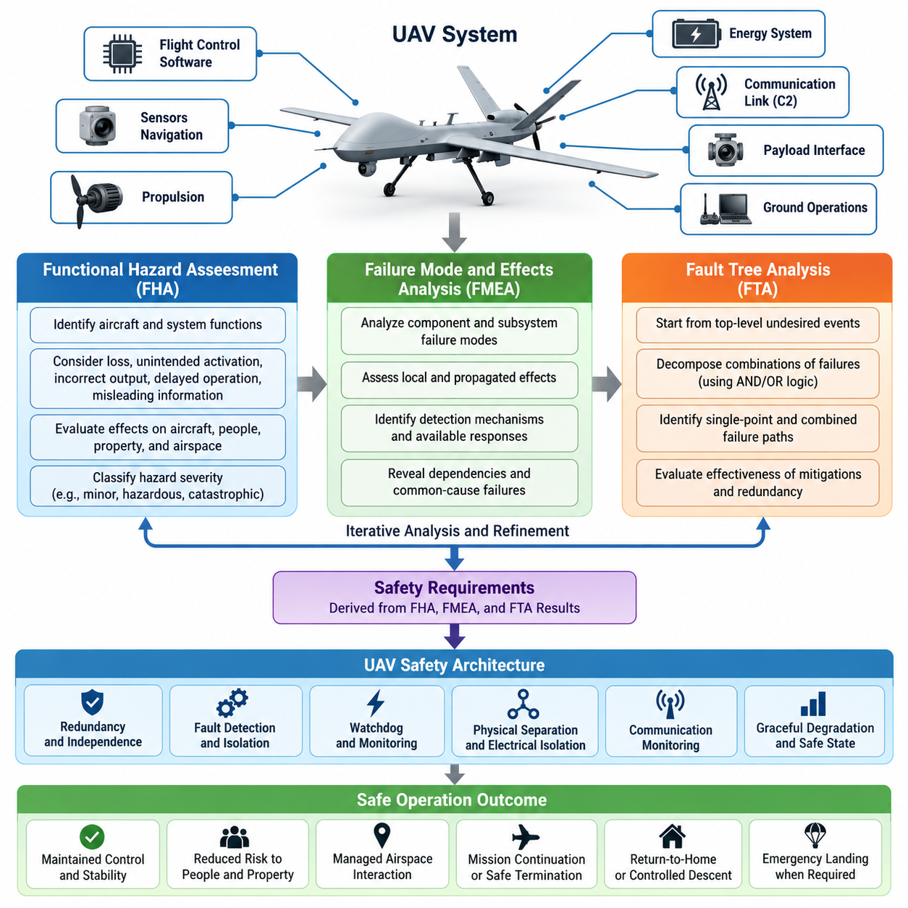
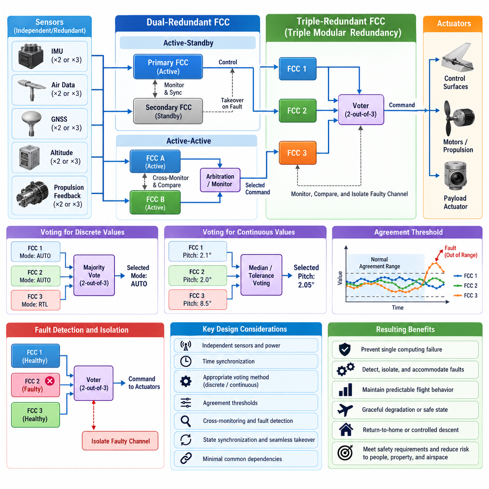
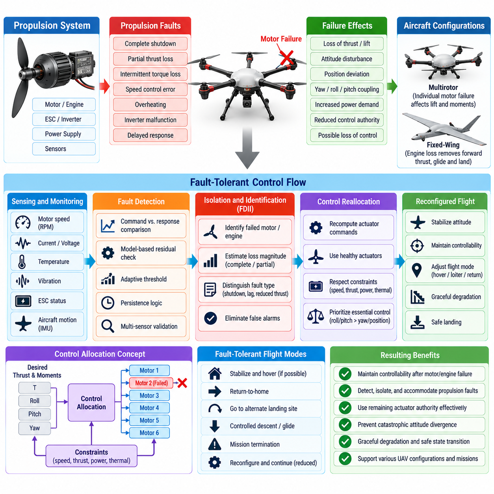
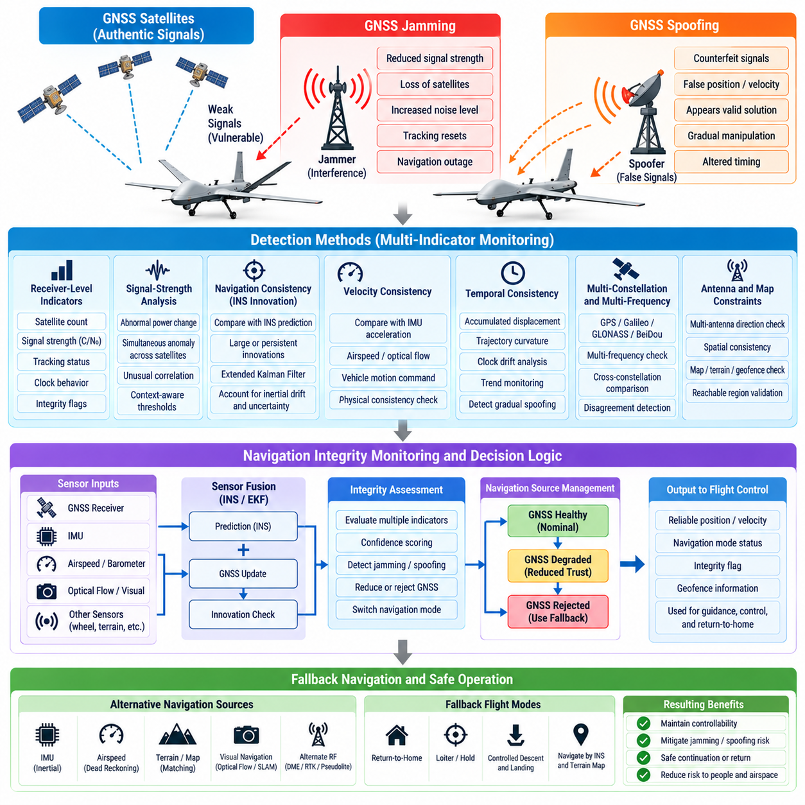
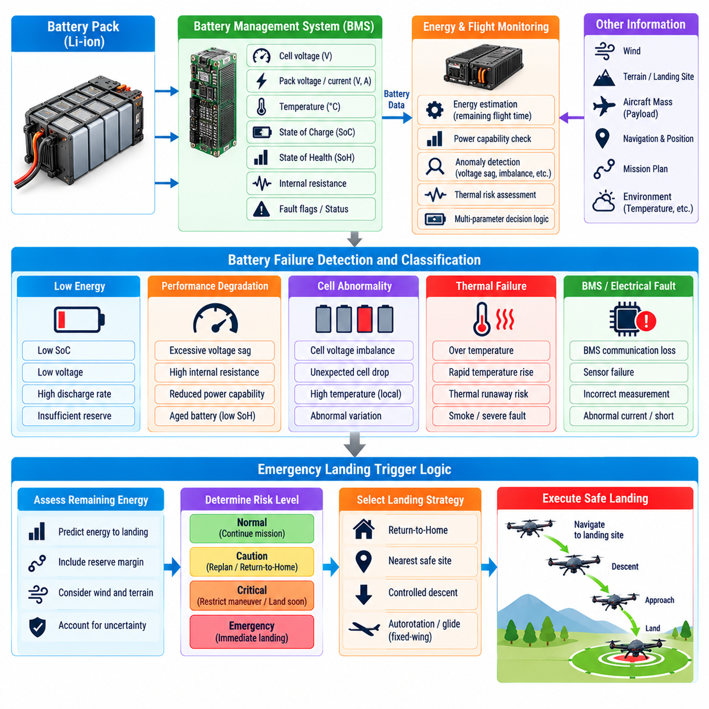
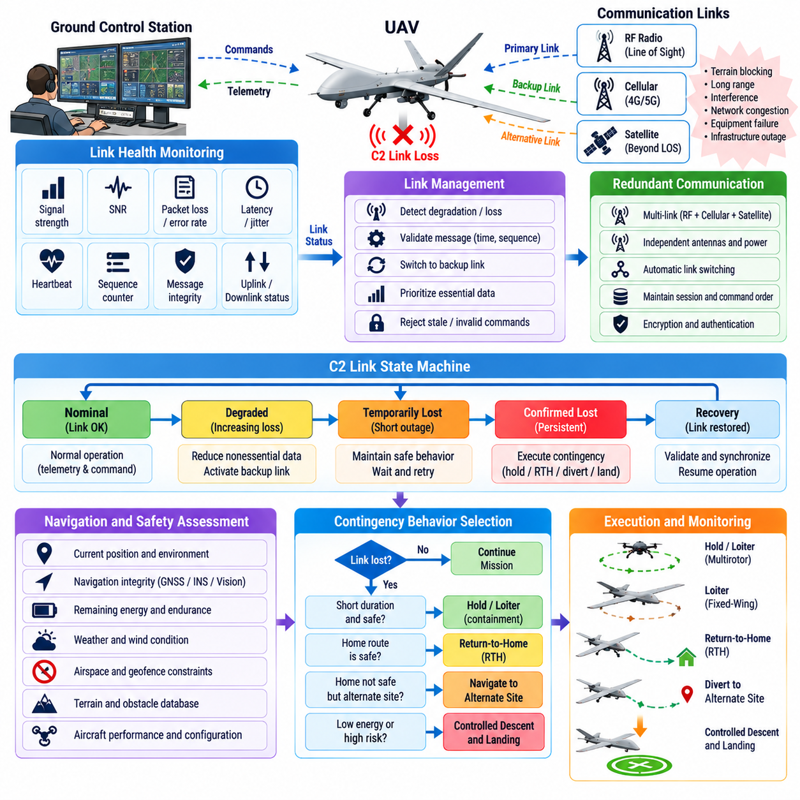
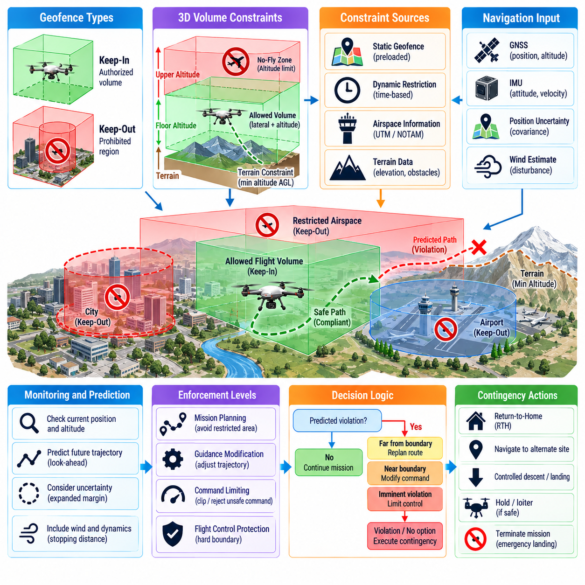
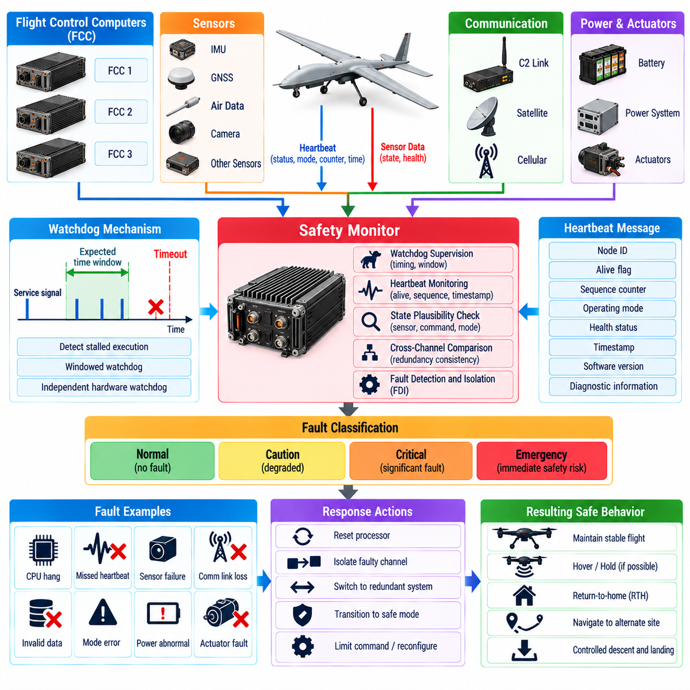
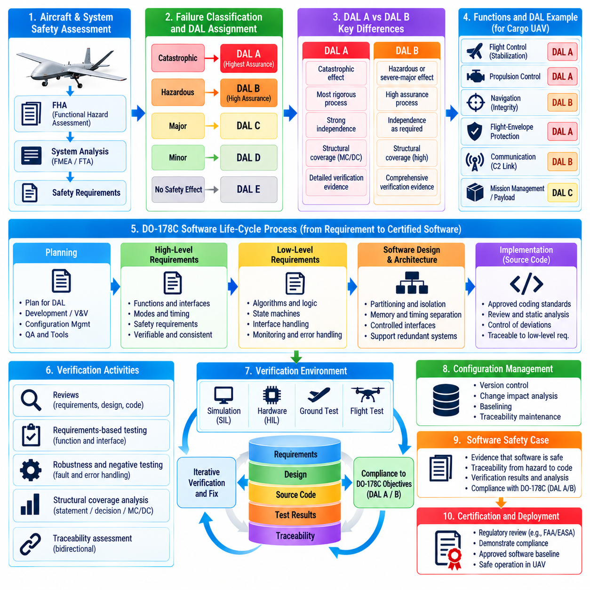
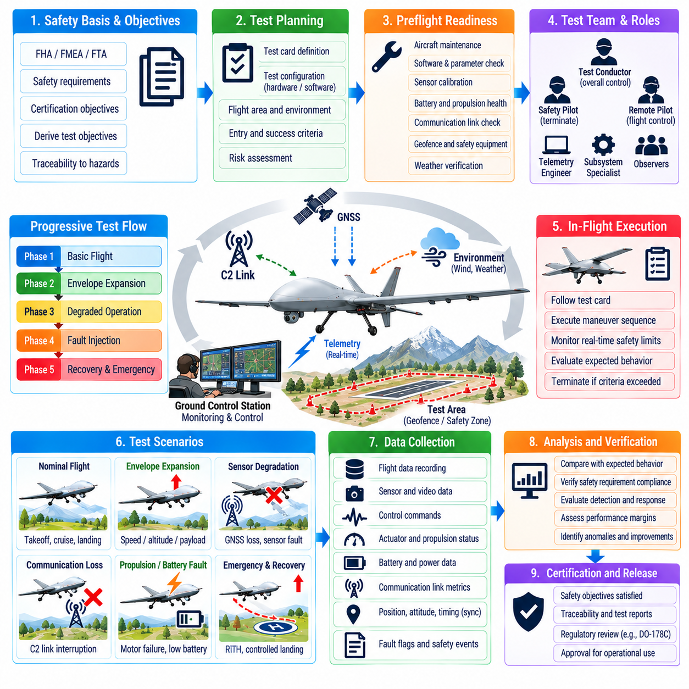

**Volume 23. Cargo UAV Autonomy and Flight AI**

# Chapter 08. Flight Safety and Redundancy

## 08.01. UAV Safety Architecture FHA FMEA FTA

{width="7.268055555555556in" height="7.268055555555556in"}

UAV safety architecture begins with the principle that safety must be engineered into the aircraft rather than added after the flight-control software is complete. The architecture therefore connects aircraft functions, hardware, software, communication links, propulsion, energy systems, payload interfaces, and ground operations to explicit safety objectives. Each function is evaluated according to how its failure could affect the aircraft, people, property, and surrounding airspace.

A Functional Hazard Assessment (FHA) provides the initial structured analysis of aircraft-level and system-level functions. Engineers identify functions such as attitude stabilization, navigation, propulsion control, power distribution, command and control, obstacle avoidance, payload management, and emergency landing. For each function, the analysis considers loss, unintended activation, incorrect output, delayed operation, and misleading information that could create hazardous aircraft behavior.

Failure conditions identified by the FHA are classified according to the severity of their potential consequences. Depending on the applicable assurance framework, categories may range from minor operational effects to hazardous or catastrophic outcomes. A catastrophic condition may involve loss of controlled flight with unacceptable risk to people, while a less severe condition may increase crew workload or reduce mission capability without immediately threatening safe flight. These classifications drive safety requirements.

The FHA should consider combinations of operational conditions rather than examining failures only during nominal flight. A navigation degradation that is manageable at high altitude may become critical during low-altitude operations near structures. Similarly, degraded propulsion may have different consequences during cruise, hover, takeoff, or landing. Mission phase, aircraft mass, weather, traffic density, communication coverage, and available emergency landing areas therefore influence hazard severity and mitigation strategy.

Failure Mode and Effects Analysis (FMEA) moves from functional hazards toward detailed component and subsystem behavior. Each relevant item is examined for credible failure modes, local effects, propagated effects, detection mechanisms, and available responses. A power converter, for example, may fail open, fail short, produce unstable voltage, overheat, or provide incorrect health information. The analysis determines whether these failures remain isolated or propagate into flight-critical equipment.

FMEA is particularly valuable for revealing dependencies that are easily overlooked in block-level architecture. Two redundant flight computers may appear independent while sharing the same power rail, clock source, communication switch, cooling path, or sensor interface. Failure of that shared resource can defeat both channels simultaneously. Effective redundancy therefore requires independence analysis in addition to simply duplicating processors, sensors, communication links, or actuators.

Critical FMEA findings are translated into architectural controls such as physical separation, electrical isolation, independent power sources, dissimilar sensing, watchdog mechanisms, communication monitoring, fault containment, and graceful degradation. The objective is not necessarily to preserve full mission capability after every failure. Instead, the system should maintain an acceptable safe state, which may involve reduced speed, restricted maneuvering, mission termination, return-to-home operation, controlled descent, or emergency landing.

Fault Tree Analysis (FTA) approaches safety from the opposite direction. Instead of beginning with individual components, it starts with an undesirable top-level event and decomposes the combinations of failures capable of producing it. Typical top events include loss of controlled flight, unintended propulsion shutdown, loss of navigation integrity, uncontrolled descent, collision risk, or inability to execute emergency recovery. Logical relationships expose both single-point and combined failure paths.

FTA helps distinguish failures that independently cause a hazardous event from failures that become dangerous only when they occur together. An AND relationship can represent multiple protections that must fail before a top event occurs, while an OR relationship identifies alternative paths capable of producing the same result. This reasoning supports architectural decisions concerning redundancy level, monitoring coverage, fault isolation, backup modes, and independence between primary and secondary safety mechanisms.

FHA, FMEA, and FTA are most effective when treated as complementary and iterative processes. FHA establishes what aircraft-level failures matter and how severe they are. FMEA investigates how lower-level items can create or contribute to those conditions. FTA verifies whether combinations of faults can reach critical top events despite proposed mitigations. Findings from one analysis frequently modify assumptions, requirements, interfaces, or architecture considered by the others.

A robust UAV architecture separates safety-critical functions according to their required availability and integrity. Flight stabilization, actuator control, essential navigation, power management, and emergency logic may require stronger isolation than payload processing or nonessential mission applications. Partitioning prevents failures in high-complexity perception, communication, or payload software from consuming resources or corrupting data needed by deterministic flight-control and recovery functions.

Redundancy must be designed around failure domains rather than component counts. Dual inertial sensors provide limited protection if both depend on the same connector, thermal environment, synchronization source, or software driver. Triple sensors can support voting, but voting is useful only when faults are sufficiently independent and erroneous measurements can be identified. Diversity in sensor technology, placement, algorithms, power paths, and communication routes can reduce common-mode vulnerability.

Flight computers commonly combine monitoring, cross-checking, heartbeat supervision, and state comparison to detect abnormal channels. A redundant architecture must define authority transfer carefully because an uncontrolled switchover can itself become hazardous. The system therefore needs deterministic criteria for fault declaration, channel isolation, command arbitration, synchronization, and recovery. Transient disturbances must be distinguished from persistent failures without allowing detection latency to exceed safety margins.

Actuator and propulsion redundancy require similar reasoning. Multiple motors on a cargo UAV do not automatically guarantee continued controlled flight after a motor failure. Vehicle geometry, thrust margin, center of gravity, aerodynamic coupling, motor-controller independence, electrical distribution, and control allocation determine whether remaining actuators can maintain stability. Safety analysis must therefore connect component redundancy with actual controllability across the certified operating envelope.

Power architecture is another major safety domain because electrical failures can simultaneously disable otherwise independent systems. Battery packs, contactors, distribution buses, converters, wiring, and protection devices should be evaluated for short circuits, open circuits, thermal events, undervoltage, overcurrent, and erroneous state estimation. Segregated buses and controlled cross-ties can preserve essential loads while preventing a failed branch from collapsing the complete electrical system.

Communication loss must be treated as an expected operational condition rather than an exceptional software error. Command-and-control links can experience interference, obstruction, network congestion, equipment failure, or ground-station loss. The UAV therefore requires deterministic lost-link behavior based on mission context. Depending on available navigation integrity and remaining energy, the aircraft may continue briefly, hold position, follow a predefined route, return, divert, or initiate a controlled landing.

Safety architecture also depends on reliable fault detection and health management. Built-in tests, range checks, temporal consistency checks, model-based residuals, cross-sensor comparisons, and communication integrity monitoring can provide evidence that a subsystem is degraded. Detection alone is insufficient; the architecture must associate each detected condition with a defined response, including fault isolation, reconfiguration, capability reduction, operator notification, and transition toward an appropriate safe state.

Common-cause and common-mode failures require dedicated attention because they can invalidate assumptions behind redundancy. Environmental exposure, electromagnetic interference, software defects, incorrect maintenance, shared configuration data, manufacturing defects, icing, overheating, or a common timing error may affect several redundant channels simultaneously. Independence claims should therefore be supported by physical, electrical, functional, and software separation appropriate to the identified hazards.

Safety requirements derived from FHA, FMEA, and FTA should remain traceable through system requirements, subsystem specifications, software requirements, hardware design, verification procedures, and test evidence. Each mitigation must have an identifiable implementation and verification method. Traceability prevents safety controls from becoming informal design intentions and enables engineering teams to determine whether architecture changes introduce new hazards or invalidate previously accepted assumptions.

Verification combines analysis with simulation, software-in-the-loop testing, hardware-in-the-loop testing, fault injection, ground testing, and progressively constrained flight testing. Fault injection is especially important because many redundancy mechanisms remain dormant during normal operation. Engineers intentionally introduce sensor dropouts, communication delays, processor resets, corrupted measurements, actuator degradation, or power disturbances to confirm that detection, isolation, reconfiguration, and recovery occur within required timing limits.

The safety case ultimately connects hazards, requirements, architecture, implementation, verification evidence, and operational constraints into a coherent argument. FHA identifies the consequences that must be controlled, FMEA exposes detailed failure propagation, and FTA examines combinations leading to unacceptable events. Together they provide a disciplined basis for designing UAVs that tolerate credible faults while maintaining controlled behavior and predictable transitions toward safe operating states.

## 08.02. Dual Triple Redundant FCC Design and Voting [w/Code]

{width="7.268055555555556in" height="7.268055555555556in"}

A redundant Flight Control Computer (FCC) architecture is designed to prevent a single computing failure from causing loss of aircraft control. In a UAV, the FCC executes stabilization, guidance, navigation processing, actuator commands, mode management, and safety logic. Redundancy distributes these functions across independent computing channels so that failures can be detected, isolated, and accommodated while maintaining predictable flight behavior.

Dual-redundant FCC architecture uses two computing channels that receive equivalent sensor information and independently calculate flight-control outputs. Each channel normally executes identical or functionally equivalent control algorithms and continuously monitors the other channel. The architecture can operate as active-standby, active-active, or command-monitor, depending on required availability, computational complexity, fault containment strategy, and aircraft safety objectives.

In an active-standby configuration, the primary FCC controls the aircraft while the secondary FCC remains synchronized and monitors primary operation. When the primary channel is declared faulty, command authority transfers to the standby channel. This architecture is conceptually simple, but safe transfer requires accurate state synchronization, deterministic fault detection, and rapid switching so that actuator commands do not experience unacceptable discontinuities during the transition.

Active-active dual architectures allow both FCCs to calculate control commands simultaneously. Their outputs are compared continuously using state variables, sensor estimates, control modes, and actuator commands. Agreement provides confidence that both channels are operating consistently, while excessive disagreement indicates a fault. The fundamental limitation is that two disagreeing channels cannot inherently determine which channel is correct without additional independent information.

A dual architecture therefore requires an arbitration mechanism capable of resolving ambiguous disagreement. Independent monitors, dissimilar processors, external sensor validation, actuator feedback, or a separate safety controller may provide the additional evidence needed to identify the faulty channel. Without such evidence, a two-channel system can detect disagreement but may be unable to isolate the failed computer reliably, particularly when both outputs remain individually plausible.

Triple-redundant FCC architecture introduces a third independent channel and enables majority voting. When all three channels operate correctly, their computed states and commands should remain within defined agreement thresholds. If one channel deviates significantly while the other two agree, the majority pair can identify the outlier. The failed or suspect channel can then be isolated while the remaining two channels continue controlling the aircraft under a degraded redundancy state.

Triple Modular Redundancy (TMR) is commonly associated with a two-out-of-three voting principle. The voter compares equivalent outputs from three channels and selects the value supported by the majority. For discrete states such as mode selection or validity flags, logical majority voting can be applied directly. For continuous variables such as attitude estimates, thrust commands, or actuator positions, median selection, bounded averaging, or tolerance-based comparison is often more appropriate.

Continuous-value voting requires carefully selected thresholds because perfectly identical numerical outputs are unrealistic. Sensor noise, asynchronous sampling, floating-point behavior, estimator differences, and scheduling jitter can produce small variations between healthy channels. Agreement windows must therefore distinguish normal computational dispersion from genuine faults. Thresholds that are too narrow create nuisance fault declarations, while excessively wide thresholds can allow hazardous erroneous commands to remain accepted.

Voting can be performed at several architectural levels. Raw sensor measurements may be voted before entering the control algorithm, estimated states may be compared after navigation processing, and final actuator commands may be voted before transmission. Each approach detects different failure classes. A robust architecture often combines several layers so that sensor faults, estimation faults, processing faults, and command-generation faults can be distinguished rather than represented by a single generic disagreement signal.

FCC redundancy depends strongly on input independence. Three computers receiving data from one inertial measurement unit do not provide protection against failure of that shared sensor. Safety-critical architectures may therefore use multiple IMUs, air-data sources, GNSS receivers, altitude sensors, or propulsion feedback channels. Sensor-to-FCC mapping should minimize common dependencies while preserving enough cross-channel information for consistency checking and fault identification.

Time synchronization is equally important because voting values generated at different physical times can appear inconsistent even when every channel is healthy. FCCs may use synchronized clocks, hardware timestamps, deterministic communication schedules, and bounded execution periods to maintain temporal alignment. Comparison logic should consider measurement age, processing latency, transport delay, and command validity intervals rather than comparing numerical values without temporal context.

Cross-channel communication enables FCCs to exchange health states, estimated aircraft states, mode information, execution counters, and fault declarations. This communication must itself be treated as a potential failure source. A failed network switch or corrupted shared bus should not simultaneously disable all redundancy. Independent communication paths, bus guardians, message integrity checks, sequence counters, timeouts, and source authentication can strengthen fault containment.

The voter is itself a safety-critical element because an incorrectly implemented voter can defeat otherwise independent FCC channels. Centralized voting simplifies architecture but can create a single point of failure unless the voter is highly assured or replicated. Distributed voting allows each channel to perform independent comparisons, but it introduces challenges involving consistent fault decisions and command authority. The selected architecture must prevent conflicting channels from simultaneously commanding actuators.

Command authority management defines which FCC output is allowed to influence the physical aircraft. Arbitration logic should establish deterministic priority, ownership, and transition rules under normal and degraded conditions. During a channel switchover, integrator states, navigation estimates, control references, and actuator command histories should remain sufficiently synchronized to avoid abrupt control transients. Bumpless transfer is particularly important for large cargo UAVs with substantial inertia.

Fault detection combines voting disagreement with internal FCC health monitoring. Watchdog timers, memory protection, processor lockstep checks, execution-time monitoring, power supervision, temperature monitoring, built-in tests, and software sanity checks can detect failures before command disagreement becomes visible. Combining internal diagnostics with external cross-channel comparison improves fault isolation and reduces dependence on any single detection mechanism.

Redundancy must also address Byzantine-like behavior in which a faulty FCC continues operating but produces inconsistent or misleading information rather than simply stopping. A channel may generate plausible commands while corrupting selected state variables, transmit different data to different peers, or intermittently violate timing constraints. Message consistency checking, independent observation, bounded command validation, and actuator-level protection help prevent such faults from gaining uncontrolled authority.

Common-mode failure is one of the greatest limitations of redundant FCC design. Three identical computers running identical software can simultaneously fail because of the same software defect, erroneous configuration, environmental condition, or corrupted shared input. Physical separation, independent power supplies, separate communication interfaces, dissimilar software implementations, diverse processors, and independent monitoring can reduce the probability that one initiating cause defeats every channel.

Dissimilar redundancy can be particularly valuable for high-consequence functions. A primary FCC may execute a sophisticated flight-control and navigation stack while an independent safety controller uses simpler verified logic to monitor attitude, altitude, velocity, geofencing, and control-command limits. The safety controller does not need full mission capability; its purpose may be to reject unsafe commands, trigger recovery, stabilize the aircraft, or initiate controlled landing when the primary architecture becomes unreliable.

Degraded-mode management must be explicitly defined as redundancy is lost. A triple system may transition from three healthy channels to two-channel operation after isolating one FCC. A subsequent disagreement between the remaining channels creates a more difficult decision because majority voting is no longer available. The aircraft may then restrict maneuvering, terminate the mission, return to a recovery location, reduce flight duration, or initiate landing depending on hazard severity and available independent monitoring.

Redundancy management should avoid unnecessary channel removal caused by temporary disturbances. Fault declaration may require persistence counters, multiple consecutive disagreements, rate-of-change checks, or confirmation from independent health monitors. At the same time, hazardous failures must be isolated quickly enough to prevent incorrect commands from affecting aircraft dynamics. Detection persistence and response latency are therefore balanced against the physical time available before a failure becomes uncontrollable.

Actuator interfaces must preserve the protection established by redundant computation. If multiple FCCs ultimately feed a single unprotected actuator controller through one shared communication path, much of the upstream redundancy can be lost. Smart actuators or redundant actuator-control electronics can perform command validation, source arbitration, position feedback monitoring, and local limit enforcement, creating an additional containment boundary between computing faults and physical motion.

Verification of dual and triple FCC architectures requires more than nominal functional testing. Software-in-the-loop and hardware-in-the-loop environments should inject processor resets, frozen outputs, biased estimates, delayed messages, communication partitions, corrupted commands, clock drift, sensor disagreement, power interruptions, and intermittent faults. Testing should verify not only fault detection but also correct isolation, voting, authority transfer, degraded operation, and eventual recovery behavior.

Latency measurements are essential during verification because redundancy mechanisms consume finite time. Sensor acquisition, channel computation, cross-channel exchange, voting, fault confirmation, arbitration, and actuator transmission all contribute to the end-to-end response. Safety analysis must demonstrate that the total delay remains compatible with aircraft dynamics, especially for unstable platforms, high-speed flight, heavy cargo vehicles, and operations close to terrain or infrastructure.

A successful redundant FCC design therefore combines computational duplication with independence, synchronized information, reliable voting, deterministic arbitration, fault containment, and controlled degradation. Dual architectures can provide valuable availability when supported by independent arbitration, while triple architectures enable stronger fault isolation through majority voting. The ultimate objective is not maximum channel count, but continued safe control when credible hardware, software, communication, sensor, or power failures occur.

## 08.03. Engine and Motor Failure Fault Tolerant Control [w/Code]

{width="7.268055555555556in" height="7.268055555555556in"}

Engine and motor failure represents one of the most safety-critical disturbances for a UAV because propulsion directly determines lift, thrust, attitude authority, and trajectory control. Fault-Tolerant Control (FTC) is designed to preserve controllability after partial or complete propulsion loss by detecting the failure, estimating remaining control authority, reallocating commands, and transitioning the aircraft toward a safe operating condition.

Propulsion faults can appear as complete motor shutdown, partial thrust degradation, intermittent torque loss, excessive rotor drag, speed-control error, overheating, inverter malfunction, or delayed response. Internal-combustion or turbine-powered UAVs may additionally experience fuel-flow interruption, ignition problems, compressor or mechanical degradation, and governor faults. Each failure produces different dynamic effects and therefore requires different detection and accommodation strategies.

Failure consequences depend strongly on aircraft configuration. In a conventional fixed-wing UAV, engine loss primarily removes forward thrust while aerodynamic control surfaces may remain available for gliding and landing. In multirotor and distributed-electric-propulsion aircraft, individual motors contribute directly to both lift and moments. Losing one propulsion unit can therefore create simultaneous vertical-force deficiency and severe roll, pitch, or yaw disturbances.

Heavy-lift cargo UAVs present additional challenges because high gross mass, large inertia, payload displacement, and limited excess thrust reduce the margin available after a propulsion failure. A vehicle capable of hovering comfortably under nominal conditions may become incapable of maintaining altitude after losing a motor at maximum payload. Fault-tolerant design must consequently evaluate controllability throughout the operational mass, center-of-gravity, altitude, temperature, and battery-state envelope.

Fault detection begins by comparing commanded propulsion behavior with observed response. Motor rotational speed, phase current, voltage, torque estimates, electronic speed controller status, temperature, vibration, and actuator feedback can provide direct evidence of propulsion health. Aircraft-level measurements from inertial sensors can provide additional evidence when unexpected angular acceleration or vertical acceleration appears inconsistent with commanded forces and moments.

Model-based detection can calculate the thrust or torque expected from each propulsion unit and compare it with measured aircraft motion. Residuals that exceed statistically or physically defined limits indicate possible degradation. Because aerodynamic disturbances, gusts, payload motion, sensor noise, and modeling errors can produce similar residuals, fault diagnosis should combine multiple information sources rather than declaring motor failure from a single abnormal measurement.

Detection speed is critical because propulsion faults can produce rapid attitude divergence. A multirotor may have only a short interval between motor thrust loss and excessive roll or yaw rate. The detection architecture must therefore balance rapid response against false alarms. Persistence logic, adaptive thresholds, redundant measurements, and dynamic consistency checks can distinguish brief disturbances from failures while maintaining response times compatible with vehicle dynamics.

Once a failure is confirmed, Fault Detection, Isolation, and Identification (FDII) determines which propulsion unit is affected and estimates the magnitude of lost effectiveness. Isolation identifies the failed motor or engine, while identification determines whether the failure represents complete loss, partial thrust reduction, response lag, or another degraded condition. This information enables the controller to select an appropriate reconfiguration rather than applying one generic emergency response.

Control allocation is central to propulsion fault tolerance in vehicles with multiple actuators. Under nominal operation, the flight controller converts desired total thrust and body moments into individual motor commands. After a failure, the allocation problem is reformulated using only healthy or partially effective actuators. The controller attempts to reproduce the required force and moment vector while respecting motor speed, thrust, power, thermal, and structural constraints.

The post-failure vehicle may no longer be capable of independently producing every commanded force and moment. Control allocation must therefore prioritize objectives according to safety importance. Maintaining roll and pitch stability may take precedence over precise yaw tracking, position holding, or mission trajectory. In some multirotor configurations, controlled yaw rotation may be accepted if it allows the aircraft to preserve vertical support and prevent catastrophic attitude divergence.

Overactuated UAV configurations provide greater opportunities for fault accommodation. Hexacopters, octocopters, distributed-propulsion wings, and aircraft with redundant lift units can retain sufficient actuator authority after one propulsion unit is lost. However, the existence of additional motors does not automatically guarantee fault tolerance. Their placement, thrust direction, maximum capacity, rotational direction, and available power determine the remaining controllable force and moment set.

The flight controller should estimate the post-failure control envelope rather than assuming nominal maneuver capability remains available. Maximum climb rate, lateral acceleration, yaw authority, bank angle, payload capability, and disturbance rejection may all decrease. A reconfigured guidance system can constrain future commands to this reduced envelope, preventing higher-level autonomy or mission planning software from requesting maneuvers that the degraded propulsion system cannot safely execute.

Adaptive or reconfigurable controllers can modify control gains and internal models after propulsion effectiveness changes. A controller designed only around nominal dynamics may become unstable or excessively aggressive when actuator authority is reduced. Gain scheduling, model predictive control, nonlinear control, incremental control methods, or online effectiveness estimation can adapt the control response while preserving stability margins under degraded propulsion conditions.

Energy management becomes especially important after a motor failure. Remaining motors may need to operate at substantially higher thrust, increasing electrical current, inverter temperature, battery discharge rate, and thermal stress. Continuing flight for an extended period can therefore create secondary failures. The emergency controller should estimate remaining energy and thermal margins continuously and determine whether immediate landing is safer than attempting a distant return-to-home maneuver.

Electrical architecture must prevent a local propulsion fault from propagating into healthy channels. A shorted motor winding, failed inverter, damaged power cable, or thermal event can affect a shared power bus if isolation is inadequate. Independent protection devices, contactors, fuses, current limiting, segregated distribution paths, and fault-containment zones can disconnect the failed branch while preserving electrical power for the remaining propulsion units and flight-critical electronics.

Mechanical consequences must also be considered. A failed rotor may stop, windmill, seize, shed material, or generate abnormal vibration. Windmilling can create aerodynamic drag and unwanted torque, while a seized or damaged rotor can alter vehicle dynamics differently from a simple zero-thrust assumption. Health monitoring should therefore distinguish electrical shutdown from mechanical failure whenever possible, and control models should represent the resulting asymmetric aerodynamic effects.

For hybrid or engine-driven UAVs, propulsion recovery may include restart logic in addition to control reconfiguration. The system can evaluate engine speed, fuel pressure, ignition status, temperature, altitude, and flight condition before attempting restart. Repeated restart attempts should be limited when they consume critical energy or create additional risk. If restart is unsuccessful, guidance should transition decisively toward glide, diversion, or emergency landing behavior.

Emergency trajectory generation connects fault-tolerant control with mission-level safety. Once propulsion capability is degraded, the vehicle should evaluate reachable landing locations using altitude, airspeed, wind, terrain, obstacles, population exposure, remaining thrust, and energy. The safest response may differ from the nominal return route. A nearby emergency landing zone can be preferable to returning to the launch point when continued flight increases exposure to secondary failure.

Payload state has a direct influence on propulsion-failure recovery for cargo UAVs. Heavy or externally suspended loads can reduce thrust margin and introduce pendulum dynamics that complicate stabilization. If the aircraft architecture permits controlled payload release, such an action may improve survivability in carefully defined emergency conditions. Any release strategy requires strict safety logic because dropping cargo can transfer aircraft risk to people or infrastructure on the ground.

Fault-tolerant propulsion control should coordinate with navigation and perception systems. A degraded aircraft may require larger turning radii, lower acceleration, reduced obstacle-clearance capability, or a more direct landing trajectory. Navigation software must understand these limitations rather than continuing to generate nominal commands. This creates a closed safety relationship between fault diagnosis, control allocation, guidance, perception, and emergency mission management.

Common-cause failures remain a major concern even when many motors are installed. Multiple propulsion units may share the same battery, cooling system, communication bus, software command path, manufacturing defect, or environmental exposure. Battery failure, icing, overheating, electromagnetic disturbance, or erroneous control software can therefore disable several motors simultaneously. Propulsion redundancy must be supported by independence and diversity at the system level.

Verification requires systematic injection of propulsion faults in simulation before risky physical testing begins. Software-in-the-loop environments can evaluate thousands of failure combinations across different flight conditions, while hardware-in-the-loop testing can introduce realistic controller, inverter, sensor, and communication faults. High-fidelity simulation should represent actuator saturation, motor dynamics, aerodynamic asymmetry, payload effects, battery limitations, and detection delays.

Physical testing can then progress from restrained propulsion tests to controlled flight experiments with carefully bounded fault scenarios. Engineers measure detection latency, attitude excursion, altitude loss, actuator saturation, recovery time, thermal loading, and landing performance. Tests should include partial degradation and intermittent faults as well as complete motor shutdown because subtle failures may be more difficult to identify and can remain active for longer periods.

Safety validation must demonstrate that no credible single propulsion failure produces an uncontrolled transition before mitigation becomes effective, within the intended operational envelope. For configurations that cannot sustain flight after particular failures, the objective changes from continued mission operation to controlled termination. The architecture should explicitly identify which failures permit continued flight, which require immediate diversion, and which demand emergency landing.

Effective engine and motor Fault-Tolerant Control therefore combines propulsion health monitoring, rapid fault isolation, effectiveness estimation, constrained control allocation, adaptive stabilization, energy management, and emergency guidance. The essential objective is not to make propulsion failures invisible, but to ensure that the UAV recognizes its reduced physical capability and rapidly converts that knowledge into stable, predictable, and safety-prioritized behavior.

## 08.04. GNSS Spoofing Jamming Detection and Fallback [w/Code]

{width="7.268055555555556in" height="7.268055555555556in"}

GNSS is a major navigation source for UAV position, velocity, timing, route tracking, geofencing, and return-to-home functions, but satellite signals arriving at the receiver are weak and vulnerable to interference. A safety-oriented UAV must therefore treat GNSS as a potentially degraded or deceptive information source rather than an unquestioned reference, especially during autonomous or beyond-visual-line-of-sight operations.

GNSS jamming occurs when interference reduces the receiver's ability to acquire or track legitimate satellite signals. It may appear as abrupt loss of satellites, reduced carrier-to-noise density, increased measurement uncertainty, repeated tracking resets, or complete navigation outage. Interference may be intentional or unintentional, and the safety architecture should respond according to observed signal integrity rather than depending on assumptions about its origin.

Spoofing is fundamentally different because the receiver may continue producing apparently valid navigation solutions while processing counterfeit or manipulated signals. A spoofing attack can potentially create false position, velocity, altitude, or timing information without immediately generating a conventional loss-of-signal warning. This makes consistency monitoring and independent navigation references essential for detecting deceptive GNSS behavior.

Detection should combine receiver-level indicators with aircraft-level navigation consistency checks. Useful receiver observations include satellite count, signal strength, carrier-to-noise ratio, automatic gain control behavior, residuals, tracking status, clock behavior, and integrity flags. No single metric provides reliable protection in every environment, so detection confidence should be formed from multiple indicators and their temporal evolution.

Signal-strength anomalies can provide evidence of interference or spoofing when several satellite channels change simultaneously in an unexpected manner. Genuine satellite signals normally arrive with predictable power characteristics, while artificial interference may cause abrupt or unusually correlated changes. However, antenna orientation, aircraft attitude, buildings, terrain, multipath, and atmospheric effects can also change received power, requiring context-aware thresholds.

Navigation innovation monitoring compares GNSS measurements with predictions from an inertial navigation system. An Extended Kalman Filter or similar estimator predicts position and velocity using IMU measurements, then evaluates the difference when GNSS updates arrive. Large or persistent innovations can indicate GNSS corruption, although inertial drift and modeling uncertainty must be represented correctly to prevent legitimate estimation errors from being mistaken for attacks.

Velocity consistency provides another strong cross-check because GNSS-derived velocity can be compared with inertial acceleration, airspeed, optical flow, visual odometry, wheel or ground-contact information where applicable, and the vehicle's commanded motion. A position solution that moves rapidly while independent sensors indicate stable hovering is physically inconsistent and should cause the navigation system to reduce trust in GNSS data.

Temporal consistency is particularly important against gradually manipulated navigation solutions. A sophisticated false signal may move the reported position slowly enough to remain within simple instantaneous thresholds. The detector should therefore monitor accumulated displacement, trajectory curvature, clock drift, innovation trends, map constraints, and the relationship between commanded motion and measured motion over extended windows rather than relying only on single-sample checks.

Multi-constellation and multi-frequency receivers can improve robustness by providing observations from GPS, Galileo, GLONASS, BeiDou, or other supported services and multiple frequency bands. Disagreement between constellations or frequencies can provide useful diagnostic evidence. However, multi-constellation reception should not automatically be considered independent redundancy because common antenna, RF front-end, interference environment, or receiver software can affect all observations.

Antenna-based techniques can add another layer of protection. Dual-antenna or multi-antenna systems can compare carrier phase, heading, direction-of-arrival characteristics, or spatial consistency. Authentic satellites are distributed across the sky, whereas counterfeit signals originating from one transmitter may exhibit suspiciously similar spatial characteristics. These techniques require appropriate antenna geometry, calibration, receiver support, and installation quality.

Map and mission constraints can also support GNSS integrity monitoring. A UAV reported far outside its reachable region, suddenly crossing a geofence without corresponding inertial motion, or moving through an impossible terrain boundary provides evidence of navigation inconsistency. Such checks should remain secondary evidence because maps may be incomplete and emergency maneuvers can legitimately violate expected mission trajectories.

The navigation system should maintain explicit GNSS health states rather than using a simple available-or-unavailable flag. States may represent nominal, suspicious, degraded, rejected, and recovering conditions. Confidence can decrease progressively as anomalies accumulate, allowing the estimator and guidance system to reduce GNSS weighting before complete rejection. This approach avoids abrupt navigation transitions when evidence is uncertain.

Once GNSS is judged unreliable, the estimator should prevent corrupted measurements from continuing to influence navigation states. Merely displaying a warning while still fusing deceptive measurements can allow the position estimate to drift toward a false solution. Measurement gating, adaptive covariance inflation, source isolation, or complete GNSS rejection can be used according to confidence level and the severity of detected inconsistencies.

Fallback navigation begins with inertial navigation because the IMU remains locally available and does not depend on external radio signals. High-rate accelerometer and gyroscope measurements can propagate attitude, velocity, and position after GNSS rejection. However, inertial errors accumulate with time, so pure inertial navigation is generally a bridging capability rather than an indefinite substitute, particularly for small UAVs using low-cost MEMS sensors.

Visual-inertial odometry can constrain inertial drift by tracking visual features across camera frames and combining them with IMU motion estimates. It can provide useful relative position and velocity information in GNSS-denied environments, but performance depends on lighting, texture, motion blur, camera calibration, and scene geometry. Safety architecture should therefore understand when visual navigation itself becomes unreliable.

LiDAR odometry, radar odometry, optical flow, terrain-relative navigation, and map matching can provide additional fallback sources depending on aircraft configuration. Radar may remain useful under lighting or visibility conditions that challenge cameras, while LiDAR can provide accurate geometric constraints in structured environments. Diversity is valuable because environmental conditions that degrade one navigation modality may leave another usable.

Barometric altitude, radar altitude, laser range measurements, magnetometers, and air-data sensors can constrain individual navigation dimensions even when they cannot independently provide full three-dimensional position. A fault-tolerant estimator can combine these partial observations to limit drift. The objective is to preserve enough state accuracy for stabilization, obstacle avoidance, containment, and safe recovery rather than reproducing nominal GNSS performance.

Fallback behavior should depend on the quality of the remaining navigation solution. If visual-inertial or terrain-relative navigation remains highly reliable, the UAV may continue toward a predefined recovery location. If only short-term inertial navigation is available, the safer response may be to hold briefly, climb or descend to a predefined safety profile, follow a limited dead-reckoning route, or initiate landing before position uncertainty becomes excessive.

Position uncertainty must be propagated explicitly during GNSS-denied operation. As uncertainty grows, guidance and geofencing algorithms should increase safety margins around obstacles, restricted airspace, terrain, and landing areas. A UAV should not continue behaving as if its estimated coordinates were exact after external position references have disappeared. Navigation confidence must directly influence permissible mission behavior.

Return-to-home logic requires special protection because spoofed GNSS can transform a safety feature into a hazardous command. The aircraft should not automatically execute return-to-home using a location solution already classified as suspicious. Recovery logic should evaluate home-position integrity, current navigation confidence, reachable alternatives, obstacle information, and available fallback sensors before selecting a return, hold, diversion, or landing strategy.

Recovery of GNSS trust should be gradual. When apparently normal signals return after interference, the receiver and navigation system should perform consistency checks before restoring full weighting. Reacquired position, velocity, timing, satellite geometry, and signal characteristics can be compared with the independently propagated state. Sudden acceptance of a recovered but incorrect solution could recreate the original hazard.

Logging is important for both safety analysis and post-flight diagnosis. The UAV should record receiver metrics, satellite observations when available, navigation innovations, estimator health, detection events, source-selection decisions, and fallback transitions. Accurate timestamps allow engineers to reconstruct whether an anomaly originated in RF reception, receiver processing, sensor fusion, flight-control software, or the external environment.

Verification should expose the navigation system to realistic GNSS degradation without relying solely on nominal flight testing. Simulation and hardware-in-the-loop environments can inject satellite loss, measurement bias, slowly drifting false positions, velocity errors, timing anomalies, multipath-like disturbances, and complete outages. Testing should verify detection latency, false-alarm behavior, estimator isolation, fallback accuracy, uncertainty growth, and recovery transitions.

Field validation should be performed within controlled and legally compliant environments using approved test methods, because intentional radio-frequency interference can affect systems beyond the UAV under test. The purpose of validation is to demonstrate resilient detection and safe fallback behavior, not to reproduce uncontrolled interference. Recorded datasets and RF-safe laboratory equipment can support repeatable evaluation across many threat and degradation scenarios.

A resilient GNSS safety architecture therefore combines signal monitoring, navigation consistency checking, multi-sensor fusion, explicit integrity states, measurement isolation, and diversified fallback navigation. The objective is not to guarantee that satellite navigation will always remain available, but to ensure that loss or corruption of GNSS cannot silently become loss of aircraft control, containment, or safe recovery capability.

## 08.05. Battery Failure Emergency Landing Trigger [w/Code]

{width="7.268055555555556in" height="7.268055555555556in"}

Battery failure is a critical hazard for electrically powered UAVs because stored electrical energy supports propulsion, flight-control computers, sensors, communications, and safety equipment. An emergency landing trigger must therefore detect not only low remaining charge but also abnormal electrical, thermal, and structural battery conditions that can rapidly reduce available power or create an immediate safety threat.

Battery safety logic begins with continuous monitoring by the Battery Management System (BMS) and aircraft energy-management functions. Important observations include pack voltage, individual cell voltage, current, temperature, state of charge, state of health, internal resistance, power capability, and communication status. These measurements should be interpreted together because a single value rarely describes the complete condition of a heavily loaded UAV battery.

State of Charge (SoC) estimates the remaining usable energy, but SoC alone is insufficient for emergency decisions. Estimation error, aging, temperature, discharge rate, and cell imbalance can cause actual available energy to differ significantly from the displayed percentage. The flight system should therefore combine SoC with voltage behavior, consumed charge, predicted mission energy, load demand, and historical battery characteristics when determining remaining endurance.

State of Health (SoH) describes longer-term degradation in capacity and power capability. An aged battery may report substantial remaining charge but experience excessive voltage sag when high thrust is commanded. For heavy cargo UAVs, this distinction is especially important because takeoff, climb, gust rejection, and emergency maneuvering can impose large transient loads. Energy safety must consider whether the battery can deliver required power, not merely whether energy remains.

Cell-level monitoring is essential because pack-level voltage can hide a weak cell. One deteriorated cell may fall below its safe voltage limit while the total pack voltage still appears acceptable. The BMS should detect cell imbalance, abnormal voltage deviation, excessive internal resistance, and rapid cell-voltage collapse. A weak cell under high load can become the limiting factor that determines whether continued flight remains safe.

Voltage sag should be interpreted dynamically. During high-current operation, terminal voltage decreases because of internal resistance and electrochemical behavior, then partially recovers when load decreases. A simple fixed voltage threshold can therefore cause either premature landing or dangerously late intervention. Better logic considers current, temperature, expected sag, recovery behavior, and the voltage margin required for the remaining mission and landing sequence.

Temperature monitoring provides another major safety channel. Batteries operating outside their acceptable temperature range may suffer reduced power capability, accelerated degradation, or thermal failure. Rapid temperature rise can be more significant than absolute temperature alone. The controller should monitor temperature gradients and differences between modules or cells because localized heating may indicate internal damage that is not visible from average pack temperature.

Thermal runaway requires a response fundamentally different from ordinary low-energy management. Evidence of uncontrolled heating, severe cell abnormality, smoke detection where available, or rapidly escalating electrical anomalies should trigger immediate safety action. Continuing toward a distant home location may be inappropriate because the battery condition can deteriorate faster than predicted. The priority shifts from mission preservation toward minimizing airborne exposure and landing promptly.

Battery fault classification can separate advisory, caution, critical, and emergency conditions. An advisory condition may indicate gradual degradation while sufficient reserve remains. A caution can initiate mission replanning or return-to-home. A critical state can restrict maneuvering and select a nearby landing site. An emergency state should trigger immediate landing or another predefined containment response when continued powered flight can no longer be assured.

Emergency landing decisions should use predicted energy at landing rather than only current battery percentage. The aircraft can estimate energy required to reach candidate sites, compensate for wind, climb or descent, expected hover time, payload mass, temperature, and propulsion efficiency, then add a defined safety reserve. If predicted remaining energy falls below the required landing reserve, recovery action should begin before physical battery limits are reached.

Reserve policy should reflect uncertainty. Energy prediction contains errors from wind estimates, battery models, trajectory changes, aging, and unexpected maneuvering. A fixed reserve percentage may be inadequate across different missions. Dynamic reserve calculation can increase the margin during high payload, strong wind, cold temperature, degraded battery health, uncertain navigation, or operations far from suitable landing locations.

The landing trigger should distinguish return-to-home from immediate landing. Return-to-home is appropriate only when sufficient energy and power margin exist to complete the route safely. If voltage is collapsing, thermal conditions are worsening, or the required return energy exceeds the predicted reserve, attempting to reach the launch point can increase risk. The system should instead select a closer reachable landing location.

Reachable landing-site evaluation connects energy management with navigation and perception. The UAV can assess distance, required altitude changes, wind, terrain, obstacles, surface characteristics, population exposure, and available energy. A physically close location is not necessarily the safest if reaching it requires climbing, hovering, or complex maneuvering. Candidate selection should minimize total risk rather than simply minimizing geographic distance.

For cargo UAVs, payload mass strongly affects emergency energy calculations. A heavily loaded aircraft may require much greater hover power and may have little thrust margin as voltage decreases. The energy-management system should use current mass and center-of-gravity information whenever available. Predictions based on an unloaded vehicle model can significantly overestimate remaining endurance and produce dangerously late landing decisions.

Multiple battery packs can improve fault tolerance when their electrical architecture supports genuine isolation. Parallel packs connected without appropriate protection may allow a failed pack to disturb healthy packs through fault currents or bus collapse. Contactors, current sensors, isolation devices, independent monitoring, and controlled cross-connection can permit a damaged pack to be disconnected while preserving power from healthy energy sources.

After isolating a battery module, the aircraft must immediately recalculate available energy and power. A vehicle that remains airborne after losing one of two packs may have only half its nominal capacity and reduced peak power. Flight-control and mission-management systems should therefore receive updated capability limits so that aggressive acceleration, high climb rates, or unnecessary hovering are avoided during degraded operation.

Power prioritization can extend safe operation when energy becomes limited. Propulsion, flight-control computing, essential navigation, communication, and emergency sensors should receive priority over nonessential payload processing, high-power mission equipment, or convenience functions. Controlled load shedding reduces electrical demand and preserves the energy required to maintain stabilization, reach a landing site, and complete the final descent.

Emergency landing logic should remain coordinated with propulsion capability. As battery voltage falls, maximum motor speed and available thrust can decrease even before total energy is exhausted. The aircraft may therefore lose climb or hover capability while still reporting remaining capacity. Power-aware flight control should estimate available thrust continuously and prevent guidance commands from demanding forces that the battery and propulsion system can no longer provide.

The final landing phase requires protected energy because hover, obstacle avoidance, flare, or precision descent can consume substantial power. Landing reserve should therefore include energy for approach uncertainty and a limited go-around or repositioning capability when the aircraft design supports it. Consuming nearly all available energy merely to reach the landing area can leave insufficient control authority during the most safety-critical portion of recovery.

Communication with the operator should provide meaningful state information without making safe recovery dependent on human response. Alerts can report battery condition, predicted endurance, selected recovery action, landing location, and degraded capabilities. However, when a critical threshold is reached and communication is unavailable or delayed, onboard autonomy should execute the predefined safety response rather than waiting indefinitely for operator confirmation.

Trigger hysteresis and persistence logic can prevent unstable switching between normal, return, and emergency modes. Small voltage fluctuations near a threshold should not repeatedly change the aircraft's mission state. At the same time, rapidly developing faults require immediate escalation. The trigger design can therefore combine persistence for slowly varying conditions with rate-sensitive overrides for fast voltage collapse, overcurrent, or thermal escalation.

Sensor and BMS failures must themselves be considered. Lost battery communication, frozen measurements, implausible SoC values, inconsistent current integration, or disagreement between redundant voltage measurements can make energy status uncertain. A safety-oriented controller should treat severe loss of battery observability as a degradation condition and increase reserve margins or initiate recovery rather than assuming that the last valid value remains correct.

Emergency landing triggers should be deterministic enough for verification while remaining adaptive to operational context. Thresholds, prediction models, uncertainty margins, state transitions, and override conditions should be explicitly defined and traceable to safety requirements. The architecture must make clear which conditions generate warnings, which initiate return-to-home, which force diversion, and which command immediate landing.

Software-in-the-loop and hardware-in-the-loop testing can evaluate battery safety logic across large combinations of charge level, temperature, payload, wind, aging, and flight phase. Fault injection should include weak cells, sudden voltage collapse, sensor bias, BMS communication loss, overtemperature, pack disconnection, and incorrect SoC estimates. Verification should measure trigger timing, trajectory feasibility, reserve at touchdown, and response to conflicting indicators.

Physical validation can use controlled discharge tests, propulsion benches, environmental chambers, and carefully bounded flight tests to characterize real battery behavior. Measured voltage sag, thermal response, usable capacity, and power limits can improve onboard models. Testing across new and aged packs is important because safety logic calibrated only with healthy batteries may underestimate the degradation encountered during operational service.

Post-flight data analysis should preserve battery voltage, cell measurements, current, temperature, BMS status, estimated SoC and SoH, predicted energy, propulsion demand, trigger transitions, and landing decisions. These records allow engineers to compare predictions with actual behavior, refine thresholds, identify aging trends, and determine whether emergency responses were initiated with appropriate safety margins.

A robust battery-failure emergency landing architecture therefore combines cell-level monitoring, energy and power prediction, thermal protection, fault isolation, dynamic reserves, load shedding, reachable-site assessment, and autonomous recovery. The objective is to trigger action early enough that landing remains a controlled choice, rather than waiting until electrical energy or propulsion capability deteriorates to the point where descent becomes unavoidable and uncontrolled.

## 08.06. Comm Link Loss Contingency Behavior C2 Link [w/Code]

{width="7.268055555555556in" height="7.268055555555556in"}

The Command and Control (C2) link connects a UAV with its remote pilot station, fleet manager, or supervisory control system and carries commands, telemetry, health information, mission updates, and safety status. Loss or severe degradation of this link must be treated as an expected operational contingency rather than an exceptional software event, particularly for autonomous and beyond-visual-line-of-sight operations.

C2 link failure can result from terrain masking, excessive range, antenna blockage, interference, network congestion, equipment malfunction, ground-station failure, power loss, or communication infrastructure outage. Degradation may occur gradually through increasing latency and packet loss or suddenly through complete disconnection. The UAV should therefore monitor communication quality continuously instead of relying only on a binary connected-or-disconnected indication.

Link-health monitoring can include received signal strength, signal-to-noise ratio, packet error rate, packet loss, latency, jitter, heartbeat reception, sequence counters, retransmission activity, and message age. These indicators should be evaluated over suitable time windows because short disturbances may be harmless while persistent degradation can indicate an approaching loss of command authority or telemetry availability.

Communication integrity is as important as availability. A link may remain technically connected while delayed, duplicated, corrupted, or out-of-sequence messages make remote control unsafe. Commands should therefore carry timestamps, sequence information, validity periods, and integrity protection where appropriate. The flight system should reject stale or invalid commands rather than executing them merely because they arrived through an authenticated communication channel.

C2 monitoring should distinguish uplink and downlink failures. The UAV may continue receiving commands while telemetry cannot reach the operator, or the operator may receive aircraft data while commands fail to reach the vehicle. These asymmetric conditions require different responses because the onboard system and ground station can have different understandings of link status. Explicit link-state estimation should account for both communication directions.

A contingency state machine can represent nominal, degraded, temporarily lost, confirmed lost, recovery, and restored conditions. Transition thresholds should reflect aircraft dynamics, mission phase, network characteristics, and operational risk. Brief packet gaps should not trigger unnecessary emergency maneuvers, while prolonged command loss near obstacles or controlled airspace may require much faster autonomous intervention.

The first response to degradation can be to stabilize communication demand rather than immediately terminate the mission. Nonessential data streams may be reduced, telemetry rates lowered, video transmission limited, or alternative communication paths activated. Safety-critical command and status messages should receive priority so that limited bandwidth remains available for essential control, health reporting, and contingency coordination.

Redundant communication links can improve availability when they do not share the same failure domain. A UAV may combine cellular, dedicated radio, satellite, mesh, or other approved communication technologies according to mission requirements. Redundancy is meaningful only when antenna placement, power supply, network infrastructure, software routing, and environmental vulnerabilities are sufficiently independent to prevent one fault from disabling every path.

Automatic link switching should preserve command authority and message ordering. When the primary communication path becomes unreliable, the system can transfer traffic to a secondary path, but duplicate or delayed commands from the previous link must not create conflicting aircraft behavior. Session state, command sequence numbers, source identity, and control ownership should remain consistent throughout the transition.

If all usable C2 paths are lost, onboard autonomy becomes responsible for maintaining safe aircraft behavior. The UAV should not simply continue indefinitely with the last received command unless that behavior has been explicitly demonstrated to be safe. The contingency manager should consider aircraft state, mission phase, navigation integrity, remaining energy, weather constraints, airspace boundaries, and available recovery locations.

A short-duration link loss may justify a controlled hold behavior. A multirotor can maintain position or follow a small containment pattern when navigation confidence is high, while a fixed-wing aircraft may require a predefined loiter pattern because it cannot hover. The hold duration should be bounded by energy reserve, airspace constraints, navigation uncertainty, and the probability that communication can be restored.

Return-to-home is a common contingency action, but it should not be treated as universally safe. The home route may cross terrain, obstacles, restricted airspace, poor weather, or areas with weak communication coverage. GNSS or navigation integrity may also be degraded at the same time as C2 loss. Recovery logic should therefore verify that the home location and route remain valid before committing to an autonomous return.

Diversion to an alternate recovery site can be safer than returning to the launch point. The UAV can evaluate reachable landing locations based on energy, terrain, population exposure, airspace constraints, weather, and navigation confidence. Cargo UAV operations may predefine several contingency sites along the route so that loss of C2 does not force a long return flight when a nearby safe recovery location is available.

Mission continuation after C2 loss should be permitted only when explicitly supported by the operational concept and safety analysis. Highly autonomous UAVs may safely complete a limited segment of a mission without continuous human commands, but this requires reliable navigation, obstacle avoidance, geofencing, health monitoring, and contingency management. Continued flight should remain bounded by predefined time, distance, or geographic constraints.

Geofencing becomes particularly important during lost-link operation because remote intervention is unavailable. The onboard system should independently enforce altitude, geographic, and airspace limits even when the ground station cannot provide updates. If position uncertainty increases, containment margins should expand accordingly, and the vehicle may need to transition toward landing before uncertainty threatens restricted boundaries.

Energy management should influence every lost-link decision. Holding for communication recovery consumes energy that may later be needed for return or landing. The contingency manager should continuously compare the probability and benefit of link recovery against the shrinking energy reserve. A fixed waiting period can be inappropriate when wind, payload, battery degradation, or distance to a safe landing site changes the available margin.

Flight phase strongly affects contingency behavior. C2 loss during cruise may allow time for link recovery or route diversion, while loss during takeoff, final approach, cargo release, or operations near structures can demand an immediate predefined response. The contingency architecture should therefore associate each mission phase with safe actions rather than applying one identical lost-link procedure throughout the entire flight.

For cargo UAVs, payload condition can modify the contingency response. An externally suspended load may make holding in turbulent conditions undesirable, while a heavy payload can reduce return range and landing options. If payload release capability exists, it should not be automatically used merely because communication is lost. Any release requires separate safety criteria and assurance that people and property below are not exposed to unacceptable risk.

The onboard flight-control system should retain authority over basic stabilization regardless of C2 availability. Remote commands should normally represent desired mission behavior rather than bypassing fundamental attitude, rate, actuator, and envelope protections. This separation ensures that loss of the supervisory communication path does not remove the local control loops required to keep the aircraft dynamically stable.

Command authority management is important when multiple ground stations, remote pilots, or supervisory systems are available. During communication recovery, the aircraft must know which source is authorized to resume control. Conflicting commands from an old session and a newly established session should not both be accepted. Control transfer should use deterministic ownership, authentication, session validation, and explicit state synchronization.

Reconnection should not immediately restore full remote authority without checking system consistency. The ground station may have outdated aircraft state, while the UAV may have changed route, altitude, mode, or landing destination during the outage. The aircraft and operator system should exchange current state, mission version, contingency mode, navigation health, and command sequence information before normal supervisory control resumes.

Human-machine interface design should make lost-link behavior understandable to the operator. Before flight, the configured contingency policy should be visible and verifiable. During degradation, the ground station should indicate link quality, last valid communication time, aircraft contingency state, and expected autonomous action. After reconnection, it should clearly report actions the UAV performed while communication was unavailable.

Logging should preserve both communication and flight context. Relevant records include link-quality metrics, packet loss, latency, heartbeat events, command timestamps, mode transitions, alternative-link activation, autonomous decisions, navigation confidence, energy state, and recovery actions. Time-aligned records allow engineers to determine whether an event originated from radio performance, network infrastructure, ground software, onboard communication, or contingency logic.

Verification should include realistic communication degradation rather than only complete link disconnection. Software-in-the-loop and hardware-in-the-loop testing can introduce latency, jitter, packet loss, bandwidth restriction, asymmetric uplink and downlink failure, stale commands, network switching, repeated reconnection, and total outage. Tests should confirm deterministic state transitions and safe behavior under combinations of communication and navigation faults.

Field testing can progressively extend from short controlled interruptions to representative operational scenarios while maintaining independent safety supervision. Engineers should measure detection time, mode-transition latency, containment performance, energy consumption, link-switching behavior, and recovery success. Testing should also confirm that temporary communication disturbances do not create excessive nuisance returns or unnecessary emergency landings.

Safety analysis must address common-cause failures between C2 links and other systems. A shared power source, common antenna location, onboard network switch, software router, or ground infrastructure can defeat apparently redundant communication channels. Independence analysis should therefore extend beyond radio hardware to power, networking, timing, software, ground systems, and environmental exposure.

A robust C2 lost-link architecture combines continuous link-health monitoring, communication diversity, deterministic state management, autonomous stabilization, navigation-aware recovery, energy-aware decision making, containment, and controlled reconnection. The objective is not to guarantee uninterrupted communication, but to ensure that temporary or permanent loss of remote connectivity never leaves the UAV without a predictable and safety-prioritized course of action.

## 08.07. Geofence and Volume Constraint Enforcement [w/Code]

{width="7.268055555555556in" height="7.268055555555556in"}

Geofence and volume-constraint enforcement provides a safety boundary that prevents a UAV from entering prohibited regions or leaving an approved operating volume. Unlike simple two-dimensional map boundaries, a robust system represents horizontal limits, altitude floors and ceilings, terrain relationships, temporary restrictions, and mission-specific containment areas as constraints that remain active throughout autonomous and remotely supervised flight.

A geofence can be classified as keep-in or keep-out. A keep-in boundary defines the volume within which the aircraft is authorized to remain, while a keep-out boundary represents airspace, infrastructure, terrain, population areas, or other regions that must not be entered. Complex missions can use both simultaneously, creating a permitted corridor surrounded by multiple exclusion volumes with different safety priorities.

Three-dimensional volume representation is important because UAV operations are inherently spatial. A horizontal polygon alone cannot distinguish an authorized route above one structure from a prohibited altitude layer or terrain hazard. Operational volumes should therefore include latitude and longitude or local coordinates, lower and upper altitude limits, reference datums, and where necessary time validity so that each constraint has an unambiguous physical meaning.

Altitude references require particular care. Barometric altitude, GNSS altitude, height above ground level, and height relative to a local reference can differ substantially. A constraint defined using one reference should not be compared directly with a state estimate using another without conversion. The geofence architecture should explicitly maintain altitude datum information and account for terrain elevation and sensor uncertainty when evaluating vertical boundaries.

Static geofences are loaded before flight and normally remain unchanged during the mission. Dynamic geofences can represent temporary airspace restrictions, emergency zones, moving operational boundaries, or updated traffic-management constraints. Dynamic updates require validation because a newly received boundary could conflict with the current aircraft position or make the planned route infeasible. The UAV must always retain a safe response when an update cannot be followed immediately.

Boundary enforcement should occur onboard rather than depending exclusively on a ground station. A C2 communication outage can remove remote supervision at exactly the time containment is most important. The aircraft should therefore store safety-critical constraints locally and continue enforcing them when external communication is unavailable. Ground systems can provide updates and monitoring, but basic containment should remain an independent onboard capability.

Geofence monitoring begins with a trusted estimate of aircraft position and uncertainty. The navigation system provides position, altitude, velocity, and associated covariance or integrity information. The containment function then evaluates not only the estimated point location but also the uncertainty surrounding that estimate. A vehicle close to a boundary with large position uncertainty can present greater risk than a vehicle with the same estimated position and high navigation confidence.

Safety margins should therefore expand when navigation uncertainty increases. A nominal geofence boundary can be surrounded by an internal protection buffer that accounts for localization error, control tracking error, wind disturbance, communication delay, vehicle dimensions, and stopping or turning distance. The aircraft reacts to the protective boundary early enough that normal control errors do not become actual violations of the authorized volume.

Predictive boundary monitoring improves protection beyond simple position checks. The system can project the UAV trajectory using current velocity, acceleration, commanded motion, wind estimates, and vehicle dynamics. If the predicted path intersects a constraint within a defined look-ahead horizon, corrective action can begin before the aircraft physically approaches the boundary. This is especially important for fast or heavy UAVs with significant momentum.

Constraint enforcement can operate at several levels of intervention. At a large distance from the boundary, mission planning can generate routes that naturally avoid restricted regions. Closer to the boundary, guidance can modify velocity or trajectory commands. If the risk becomes immediate, flight-control protection can limit commands directly. Layered enforcement reduces dependence on any single planning or control function.

Command limiting prevents a remote pilot, autonomous planner, or higher-level agent from requesting motion that would knowingly violate a safety boundary. Desired velocity, position, acceleration, or waypoint commands can be checked against the active constraint set before acceptance. Unsafe commands can be clipped, projected onto an admissible direction, rejected, or replaced with a predefined recovery command depending on system design.

Trajectory feasibility should consider vehicle dynamics rather than treating the UAV as a point that can stop instantly. Maximum braking acceleration, turn radius, climb and descent rates, actuator limits, payload mass, wind, and propulsion condition determine how much distance is required to avoid a boundary. Heavy cargo UAVs may require substantially larger containment margins than small multirotors because their kinetic energy and response times are greater.

Wind can create significant containment risk even when commanded motion points away from a boundary. The system should estimate whether available thrust and control authority are sufficient to resist the expected disturbance. A strong crosswind near the edge of an operational corridor may make the nominal route unsafe. Guidance can shift the planned path inward or reduce speed to preserve sufficient disturbance-rejection margin.

Geofence enforcement must remain coordinated with fault-tolerant control. A propulsion failure, battery degradation, sensor fault, or actuator limitation can reduce the vehicle's ability to respect previously feasible boundaries. When control capability changes, the containment system should update reachable sets and margins. A boundary that was easily avoidable under nominal conditions may become critical after loss of thrust or maneuver authority.

GNSS degradation presents a special challenge because many geofences are defined in geographic coordinates. If GNSS becomes unreliable, the system should not simply disable containment. Visual-inertial navigation, terrain-relative localization, map matching, or other fallback sources can maintain a local estimate. At the same time, increasing position uncertainty should produce more conservative margins and may eventually trigger landing before containment can no longer be assured.

Geofence behavior should distinguish an approaching boundary from an actual violation. An approach condition may initiate warning, trajectory correction, speed reduction, or return toward the center of the authorized volume. A confirmed violation can require stronger actions such as immediate re-entry, mission termination, diversion, or landing. The selected response should avoid aggressive maneuvers that create a greater hazard than the boundary excursion itself.

Multiple constraints can overlap or conflict. A return-to-home trajectory may intersect a keep-out zone, while an emergency landing site may lie outside the normal keep-in volume. Constraint management therefore requires priorities and exception rules that are explicitly defined by safety analysis. Emergency behavior should not improvise which restriction to violate; the architecture should determine how competing safety objectives are resolved.

Time-dependent constraints add another dimension to volume enforcement. A corridor may be authorized only during a specific mission window, or temporary restricted airspace may become active at a scheduled time. The UAV should consider future activation when planning its trajectory so that it does not enter a region from which it cannot exit before the constraint changes. Reliable onboard time is therefore part of containment integrity.

Dynamic updates should include version information, timestamps, validity intervals, source identification, and integrity checks. The aircraft should reject malformed, stale, unauthorized, or internally inconsistent constraint data. If an update is lost during communication interruption, the onboard system should continue using the last validated safety dataset according to predefined validity rules rather than silently removing containment protection.

Terrain and obstacle constraints can complement regulatory geofences. A minimum terrain-clearance surface can prevent trajectories from descending into rising ground, while three-dimensional exclusion volumes can protect towers, buildings, cranes, power infrastructure, or sensitive facilities. These constraints can be incorporated into the same evaluation framework while retaining information about their different origins, priorities, and uncertainty.

For cargo UAVs, landing and loading zones may require specialized local volumes. Approach corridors, hover boxes, touchdown areas, and payload-transfer regions can each have different speed, altitude, and lateral-position limits. Enforcement can become progressively tighter as the aircraft approaches people, equipment, or infrastructure, creating a controlled transition from en-route navigation to precision terminal operations.

Containment should also consider uncertainty in the boundaries themselves. Terrain databases, surveyed infrastructure coordinates, temporary construction information, and externally supplied airspace data may contain errors. Safety margins should therefore reflect both aircraft localization uncertainty and constraint-data uncertainty. Treating every boundary coordinate as mathematically exact can produce an unrealistic assessment of actual separation.

Logging is essential for demonstrating compliance and diagnosing near-boundary events. Records should include active geofence versions, aircraft position, navigation uncertainty, predicted trajectories, margin calculations, constraint warnings, command modifications, intervention levels, and any boundary violations. Time synchronization allows investigators to reconstruct whether an event originated from navigation error, planning behavior, control performance, or incorrect constraint data.

Verification should exercise the system across normal and abnormal conditions. Software-in-the-loop testing can generate thousands of approaches to boundaries with different speeds, angles, winds, navigation errors, and vehicle failures. Hardware-in-the-loop testing can introduce delayed navigation, corrupted geofence updates, communication loss, sensor degradation, and actuator limitations while confirming that onboard containment remains deterministic.

Flight testing should begin with large safety buffers and progressively evaluate representative operational boundaries under controlled supervision. Tests can measure minimum separation, prediction accuracy, intervention timing, braking distance, trajectory smoothness, and behavior during link loss or navigation degradation. Validation should demonstrate that protective actions occur before physical boundary violations across the intended operating envelope.

A robust geofence and volume-constraint architecture therefore combines validated spatial data, three-dimensional boundaries, navigation integrity, uncertainty-aware margins, predictive trajectory checking, command limiting, dynamic feasibility analysis, and layered intervention. The objective is not merely to detect that a UAV has crossed a virtual line, but to maintain sufficient awareness and control authority to prevent unsafe boundary violations before they occur.

## 08.08. Safety Monitor Watchdog and Heartbeat Design [w/Code]

{width="7.268055555555556in" height="7.268055555555556in"}

A UAV safety monitor provides an independent supervisory layer that observes flight-critical computers, sensors, communication interfaces, power systems, and control functions without relying entirely on the software being monitored. Watchdogs and heartbeat mechanisms form core elements of this layer by detecting stalled execution, missed deadlines, communication loss, abnormal state transitions, and other failures that may not be visible through normal functional outputs.

A watchdog is fundamentally a timing-based protection mechanism. A monitored processor or software task must periodically demonstrate that it is executing correctly within an expected interval. If the required service signal does not arrive before a timeout expires, the watchdog assumes that execution has stalled or become unreliable. The resulting response may include fault declaration, processor reset, channel isolation, redundancy switchover, or transition to a predefined safe mode.

Simple watchdog designs can detect complete software freezes, but they cannot prove that an application is functioning correctly. A defective program may continue servicing the watchdog while producing invalid control outputs. Safety-oriented designs therefore combine execution timing supervision with state plausibility checks, control-command validation, sensor consistency monitoring, and cross-channel comparison so that both inactive and actively erroneous failures can be detected.

Independent hardware watchdogs provide stronger protection than watchdog functions implemented only within the same processor being supervised. If a processor suffers scheduler failure, memory corruption, clock malfunction, or software deadlock, an internal software watchdog may fail together with the monitored application. An external device with independent power, timing, and reset authority can preserve the ability to detect and respond to such common failures.

Watchdog timeout selection must reflect the dynamics of the monitored function. A timeout that is too short can generate nuisance resets because of normal scheduling jitter or temporary computational load, while an excessively long timeout allows hazardous failures to persist. Flight-control loops, navigation estimators, mission managers, communication processes, and payload applications can therefore require different supervision intervals according to their safety significance and execution rates.

Windowed watchdogs strengthen timing supervision by requiring a service event within a defined time window rather than merely before a maximum timeout. A task that responds too early, too frequently, or too late can then be identified as abnormal. This helps detect corrupted control flow in which software repeatedly reaches the watchdog service instruction without completing the intended processing sequence.

A heartbeat mechanism extends supervision across processors, software services, sensors, network nodes, and ground communication systems. Each monitored component periodically transmits a compact message indicating that it remains active. Heartbeats can contain more than a simple alive flag, including sequence counters, operating mode, health status, execution cycle number, software version, timestamp, and selected diagnostic information.

Sequence counters are important because repeatedly receiving the same heartbeat should not be interpreted as evidence of continued operation. A frozen communication buffer or repeated network packet could otherwise make a failed component appear healthy. Monitors should verify that sequence values progress correctly and that messages arrive within expected timing limits while also detecting duplicates, missing messages, and unexpected resets.

Timestamps provide additional evidence about data freshness. A heartbeat can arrive through a functioning network even though the originating application stopped updating its internal state. Comparing source timestamps with local reception time allows the monitor to detect stale information and excessive transport latency. Reliable time synchronization improves this capability, particularly in distributed UAV architectures with several computing and sensor nodes.

Heartbeat monitoring should distinguish component failure from communication-path failure. If messages from several unrelated devices disappear simultaneously, a network switch, bus, power domain, or communication gateway may be the common cause. The safety monitor should therefore understand system topology and failure domains rather than independently declaring every missing node defective without considering shared infrastructure.

Hierarchical monitoring can improve scalability in large UAV systems. Local supervisors can monitor high-rate tasks and hardware interfaces within individual computing nodes, while a higher-level safety manager observes node health, communication status, navigation integrity, propulsion capability, and mission state. This arrangement reduces communication overhead while preserving rapid local fault detection and coordinated aircraft-level response.

The safety monitor should be sufficiently independent from primary mission software. A complex autonomous stack may contain perception, planning, mapping, AI inference, and mission logic with high computational complexity. The safety monitor can use simpler, bounded, and highly verifiable logic to supervise critical variables such as attitude, altitude, speed, position, geofence status, battery condition, control commands, and processor health.

Command monitoring allows the safety layer to detect outputs that are computationally valid but physically unsafe. A flight-control or autonomy process may remain alive and continue sending heartbeats while requesting excessive bank angle, thrust, descent rate, or velocity. Independent limit checking can reject, constrain, or override commands that exceed verified aircraft envelopes, providing protection against systematic software failures.

State plausibility monitoring applies physical and temporal constraints to measured and estimated aircraft states. Position cannot normally change by kilometers within one control cycle, battery charge should not increase unexpectedly during high-power flight, and actuator feedback should remain compatible with commanded motion. Such rules can identify corrupted memory, sensor failures, communication errors, or estimator divergence even when all tasks continue executing.

Cross-monitoring between redundant flight-control computers provides another detection layer. Each FCC can compare the other channel's mode, estimated state, control output, execution counter, and health declaration. A separate safety monitor can arbitrate when channels disagree, reducing the risk that two computers detecting disagreement cannot determine which channel is faulty. Independence of the arbiter remains essential to avoid creating a new single point of failure.

Fault responses should be proportional to both severity and confidence. One missed heartbeat may justify a warning or temporary degraded state, whereas repeated missed messages or an external watchdog timeout can justify channel isolation. A physically impossible control command may require immediate intervention without persistence delay. The safety architecture should therefore distinguish transient anomalies from failures requiring rapid protective action.

Persistence counters and hysteresis help prevent unstable fault declarations. Temporary processor overload, network congestion, or scheduling jitter can occasionally delay a heartbeat without indicating permanent failure. Requiring a defined number of consecutive misses can reduce nuisance transitions. However, high-consequence functions may require shorter persistence or immediate response, so timing policies should be assigned according to hazard analysis.

Recovery after a watchdog event must be controlled carefully. Automatically rebooting a failed processor can restore functionality, but repeated resets can create unstable aircraft behavior or conceal a persistent hardware defect. The system should limit restart attempts, record reset causes, verify initialization, synchronize state with healthy channels, and confirm readiness before restoring control authority to the recovered component.

A restarted flight-control computer should not immediately issue actuator commands using uninitialized or stale state. Navigation estimates, control integrators, mission modes, reference trajectories, and actuator histories may need synchronization before reintegration. A warm-start strategy can obtain validated state from healthy channels, while a cold-start strategy may require a longer period of observation before the recovered computer becomes eligible for command authority.

Watchdog architecture must also consider power failures. A monitor powered from the same failed rail as the processor it supervises cannot report or recover from that power loss. Safety-critical supervision may therefore use independent or protected power domains and monitor voltage, reset lines, clock activity, and power-good signals. This enables the system to distinguish software failure from electrical loss and select an appropriate response.

Network watchdogs supervise communication infrastructure rather than individual applications. Bus utilization, message timing, error counters, gateway health, switch status, and communication partitions can be monitored to detect network-level degradation. Safety-critical messages may have bounded transmission deadlines, and failure to meet those deadlines can trigger reconfiguration to redundant buses or simplified local-control modes.

Sensor heartbeat supervision should include data validity, not merely message presence. An IMU can continue transmitting packets while producing frozen, saturated, or biased measurements. Monitors should evaluate update counters, measurement variance, physical ranges, cross-sensor consistency, calibration status, and built-in-test results. A sensor should be considered healthy only when both communication and measurement behavior remain credible.

Safety-monitor outputs should feed a centralized or distributed fault-management function that maintains the current health configuration of the aircraft. This configuration identifies which computers, sensors, communication links, power sources, and actuators remain trustworthy. Guidance and control functions can then adapt their behavior to the available resources instead of repeatedly rediscovering system health independently.

Logging of watchdog and heartbeat events is essential for verification and maintenance. Records should include timeout values, missed sequence numbers, reset causes, processor states, network conditions, mode transitions, fault declarations, recovery attempts, and synchronization results. Accurate timestamps allow engineers to reconstruct the sequence of events and distinguish the initiating failure from secondary effects.

Software-in-the-loop testing can inject task stalls, deadlocks, timing overruns, invalid states, frozen counters, and incorrect commands to verify monitoring logic. Hardware-in-the-loop testing can add processor resets, network interruption, clock faults, power disturbances, sensor freezes, and delayed messages. Verification should confirm detection latency, fault classification, protective response, and successful or rejected recovery.

Stress testing is especially important because watchdog behavior can change when processors approach computational limits. High perception workloads, logging bursts, communication congestion, and simultaneous fault processing may increase scheduling delays. Testing should demonstrate that safety-critical supervision retains timing guarantees under worst-case credible loads and that nonessential workloads cannot starve watchdog or heartbeat functions.

A robust safety-monitor architecture therefore combines independent watchdogs, information-rich heartbeats, timing supervision, sequence and freshness checks, physical plausibility monitoring, command validation, topology-aware fault isolation, and controlled recovery. Its purpose is not simply to determine whether software is running, but to establish continuous evidence that critical UAV functions remain timely, credible, coordinated, and safe enough to retain control authority.

## 08.09. Software Safety Case DO 178C DAL A B [w/Code]

{width="7.268055555555556in" height="7.268055555555556in"}

A software safety case for a safety-critical UAV provides structured evidence that airborne software performs its intended functions with an acceptable level of assurance and that software failures have been systematically addressed. DO-178C provides the principal framework for software life-cycle assurance, while the assigned Design Assurance Level determines the rigor of planning, development, verification, configuration management, and certification evidence.

The software assurance process begins with aircraft and system safety assessment rather than with source code. Functional Hazard Assessment identifies the consequences of function loss, malfunction, misleading output, or unintended activation. System-level analyses then allocate safety requirements to hardware and software components. The resulting failure classification provides the basis for determining the required software Design Assurance Level.

DAL A applies when anomalous software behavior could contribute to a catastrophic failure condition, while DAL B is associated with hazardous or severe-major consequences under the applicable certification framework. The distinction is important because DAL A requires the highest level of software assurance. Both levels demand disciplined engineering, but DAL A introduces additional verification objectives and stronger independence expectations.

For a cargo UAV, DAL allocation should follow the actual safety consequences of each function rather than the complexity or size of its software. Flight stabilization, propulsion command, flight-envelope protection, or critical navigation functions may require high assurance when their failure can cause loss of the aircraft or unacceptable ground risk. Less critical mission-management or payload functions may receive lower assurance when adequately isolated.

A safety case should establish traceability from identified hazards to system safety requirements and then to software requirements. Each software requirement should have a clear origin and verification method, while every safety-relevant higher-level requirement should be implemented completely. Bidirectional traceability makes it possible to detect missing implementation, unintended functionality, incomplete testing, and requirements that no longer have a valid system justification.

Planning establishes how compliance will be achieved before development evidence is produced. Typical life-cycle planning defines software development, verification, configuration management, quality assurance, certification liaison, standards, tools, environments, and transition criteria. The plans should describe how DAL-specific objectives are satisfied and how independence is maintained where required rather than treating certification as documentation added after implementation.

High-level software requirements describe externally meaningful behavior, interfaces, modes, timing constraints, failure responses, and safety protections. They should be accurate, consistent, verifiable, and compatible with system requirements. For a flight-control function, requirements may define control modes, sensor validity conditions, actuator command limits, degraded-state transitions, and timing deadlines without prematurely embedding unnecessary implementation details.

Low-level requirements and software architecture refine high-level behavior into implementable logic. They can define algorithms, state machines, data transformations, scheduling behavior, interface handling, monitoring logic, and internal control paths. For DAL A and DAL B software, verification must demonstrate that these detailed requirements correctly satisfy their higher-level sources and do not introduce unintended safety behavior.

Software architecture deserves particular attention in redundant UAV systems. Partitioning between flight-critical control, autonomy, communication, payload, and maintenance functions should prevent lower-assurance software from corrupting higher-assurance functions. Memory protection, processor partitioning, communication gateways, scheduling separation, and controlled interfaces can support independence, but their effectiveness must be demonstrated rather than assumed.

Source code should conform to approved coding standards and accurately implement the low-level requirements and architecture. Standards can restrict ambiguous language features, uncontrolled dynamic behavior, unsafe memory usage, recursion, hidden side effects, and other constructs that complicate verification. Compliance should be supported by review and analysis, with deviations explicitly justified and controlled rather than informally accepted.

Verification is not limited to executing tests. Reviews, analyses, requirements-based testing, interface testing, robustness testing, structural coverage analysis, and traceability assessment collectively provide assurance. The objective is to demonstrate that software satisfies specified behavior and to expose unintended implementation. Verification evidence should therefore address both what the software is required to do and what the executable structure actually contains.

Requirements-based testing derives test cases from software requirements rather than from knowledge of the implementation alone. Tests should exercise normal operating conditions, boundary values, invalid inputs, mode transitions, timing conditions, and failure responses. Safety-critical UAV software also benefits from fault-injection scenarios involving sensor failures, communication loss, processor faults, actuator limitations, and inconsistent system states.

Robustness testing evaluates behavior outside nominal input conditions. Software should respond predictably to out-of-range sensor values, malformed messages, stale data, unavailable resources, unexpected mode requests, and timing anomalies. A robust implementation does not necessarily continue the mission under every abnormal condition; instead, it transitions to a defined degraded or safe state without creating uncontrolled behavior.

Structural coverage analysis determines whether requirements-based tests have exercised the implemented software structure to the extent required by the assurance level. Statement and decision coverage provide evidence for lower structural levels, while DAL A requires Modified Condition/Decision Coverage, commonly known as MC/DC. MC/DC demonstrates that individual Boolean conditions can independently affect a decision outcome under appropriate test combinations.

Structural coverage is not a substitute for requirements-based testing. Its purpose is partly to reveal code that existing requirement-derived tests failed to exercise. Uncovered code may indicate inadequate tests, incomplete requirements, defensive logic, deactivated code, or unintended functionality. Each coverage gap should therefore be analyzed and resolved through additional tests, requirement clarification, justified deactivation, or removal of unnecessary code.

DAL A software requires particularly strong evidence because catastrophic failure conditions demand the highest assurance. Verification independence is applied to designated objectives so that the person or process verifying critical artifacts is appropriately independent from their development. Independence reduces the chance that the same misunderstanding, assumption, or implementation error will pass through development and verification without challenge.

DAL B also requires rigorous verification and controlled life-cycle processes, although its objective set and independence requirements differ from DAL A. The engineering approach should not treat DAL B as ordinary commercial software with additional testing. Requirements quality, traceability, configuration control, verification evidence, problem reporting, and reproducibility remain fundamental because hazardous failure conditions still demand substantial assurance.

Data coupling and control coupling analyses help verify interactions between software components. Data coupling examines information exchanged through interfaces, while control coupling examines how one component influences another component's execution or behavior. In distributed UAV architectures, these analyses can reveal unexpected dependencies through shared data, mode commands, network services, or scheduling relationships that could undermine intended safety separation.

Timing behavior is especially important for flight software because correct results delivered too late can still be hazardous. Verification should consider execution deadlines, scheduling margins, communication latency, sensor-to-actuator delay, worst-case execution behavior, and overload conditions. High computational loads from perception or AI functions should not prevent flight-critical DAL A or DAL B software from meeting its required timing guarantees.

Configuration management ensures that requirements, source code, executable objects, test procedures, test results, tool versions, compiler settings, and supporting data remain under controlled identification. Certification evidence must correspond to the exact software configuration installed on the aircraft. Reproducible builds and controlled baselines help prevent differences between the verified software and the operational binary.

Problem reporting and change control continue throughout the software life cycle. An anomaly should be recorded, evaluated for safety impact, corrected when required, and subjected to appropriate regression analysis. A seemingly small code change can affect requirements, timing, structural coverage, interfaces, or previously verified behavior. Change impact analysis determines which certification evidence must be regenerated or reverified.

Tool qualification becomes relevant when a development or verification tool can introduce an error or fail to detect an error and its output is used without subsequent verification that would expose the problem. Compilers, code generators, model-based development environments, static analyzers, coverage tools, and automated verification systems may therefore require qualification consideration according to their role and certification credit.

Model-based development can be integrated into a DO-178C assurance process when models, generated code, verification artifacts, and tool usage are governed by appropriate objectives. Related guidance such as DO-331 addresses model-based development and verification considerations. The model does not eliminate assurance obligations; instead, its role, traceability, verification, and generated artifacts must be clearly controlled.

Formal methods may supplement or replace selected conventional verification activities when properly applied under relevant guidance such as DO-333. Mathematical proof can provide strong evidence for properties including range limits, state invariants, data consistency, and control logic. However, formal verification still depends on correct assumptions and requirements, so it must remain connected to the overall safety argument and configuration baseline.

Object-oriented technologies and related techniques may require consideration of guidance such as DO-332 when used in airborne software. Features including inheritance, dynamic dispatch, polymorphism, and complex object relationships can affect verification and structural analysis. The assurance strategy should demonstrate that these mechanisms remain understandable, bounded, and verifiable at the assigned DAL.

A software safety case should also address partitioning and coexistence with complex autonomy or artificial-intelligence functions. A high-performance planner or learned model may not be developed to the same assurance level as a conventional flight-control kernel. Safety can be strengthened by constraining such components through verified monitors, command envelopes, runtime assurance, independent fallback controllers, and architectural isolation.

Certification evidence should form a coherent argument rather than a collection of disconnected documents. Safety assessments explain why assurance is required, plans explain how it will be achieved, requirements and design define intended behavior, implementation realizes that behavior, verification demonstrates compliance, and configuration records establish exactly what was evaluated. Traceability connects these elements into an auditable chain.

Final software accomplishment evidence summarizes the completed life cycle, resolved anomalies, achieved objectives, configuration identification, verification results, and remaining limitations. Before release, the organization should confirm that required reviews, analyses, tests, structural coverage activities, configuration audits, quality assurance records, and certification artifacts are complete for the applicable DAL and software baseline.

For a safety-critical UAV, DO-178C DAL A/B assurance is therefore not simply a testing requirement applied near the end of development. It is a disciplined engineering framework connecting hazard analysis, requirements, architecture, implementation, verification, independence, configuration management, and certification evidence. The objective is to build a defensible body of evidence that critical software behavior is understood, controlled, verified, and appropriate for the severity of the failures it could cause.

## 08.10. Safety Validation Flight Test Protocol

{width="7.268055555555556in" height="7.268055555555556in"}

Safety validation flight testing provides the final operational evidence that a UAV's safety architecture behaves correctly when exposed to realistic aircraft dynamics, environmental disturbances, communication conditions, navigation uncertainty, and subsystem degradation. It complements simulation, software-in-the-loop, hardware-in-the-loop, and ground testing by evaluating integrated behavior in the physical flight environment.

A flight-test protocol should originate from system safety requirements rather than from demonstrations of nominal mission capability. Functional Hazard Assessment, FMEA, FTA, software assurance activities, subsystem qualification, and integration testing identify the conditions that require flight evidence. Each test objective should trace to a safety requirement, identified hazard, mitigation mechanism, operational limitation, or certification objective.

Testing should follow a progressive risk-reduction strategy. Initial flights establish basic controllability, propulsion performance, navigation stability, communication reliability, and nominal automation. Later phases introduce controlled disturbances, degraded sensors, communication anomalies, constrained energy margins, and selected fault conditions. Hazardous scenarios should never be introduced before prerequisite containment and recovery functions have been demonstrated.

A formal test card defines the configuration and execution of each flight-test case. It should identify the aircraft hardware and software baseline, payload condition, battery configuration, environmental limits, test area, required personnel, initial conditions, maneuver sequence, expected behavior, termination criteria, and required measurements. Configuration control ensures that results can be associated with the exact system that was tested.

Preflight readiness review verifies that the aircraft and test organization are prepared for the planned risk level. Engineers should confirm maintenance status, software version, parameter files, sensor calibration, battery condition, structural integrity, propulsion health, communication links, geofence data, emergency equipment, weather limits, and data-recording capability. Open anomalies should be reviewed before authorization to fly.

The test area should provide sufficient containment for both nominal trajectories and credible off-nominal motion. Boundaries should account for aircraft speed, altitude, stopping distance, navigation uncertainty, wind, possible control degradation, and emergency landing requirements. Higher-risk tests may require additional separation from people, property, infrastructure, and unrelated air traffic, together with independent safety supervision.

Test roles and command authority must be unambiguous. The flight-test team can include a remote pilot, test conductor, safety pilot, telemetry engineer, subsystem specialists, and observers according to program scale. One designated authority should control progression through the test card, while another authorized safety function should retain the ability to terminate testing when predefined limits are exceeded.

Instrumentation should capture enough information to reconstruct aircraft behavior without relying solely on operator observations. Relevant data include position, velocity, attitude, angular rates, control commands, actuator feedback, propulsion status, battery voltage and current, navigation health, C2 link metrics, mode transitions, fault flags, watchdog events, geofence status, and safety-monitor outputs. Common timing enables accurate event correlation.

Time synchronization is especially important when measurements originate from several onboard computers, sensors, ground stations, and independent test instruments. Unsynchronized logs can make a correct response appear late or obscure the sequence that initiated a failure. Timestamp provenance should therefore be maintained across the acquisition chain so that sensor input, detection, decision, command, and aircraft response can be compared accurately.

Nominal-envelope testing establishes a reference before abnormal scenarios are introduced. The UAV should demonstrate stable takeoff, climb, cruise or hover, maneuvering, descent, approach, and landing across representative payload and environmental conditions. Reference data characterize control margins, tracking error, energy consumption, communication performance, navigation accuracy, and expected variability for later comparison with degraded operation.

Envelope expansion should proceed incrementally in speed, altitude, payload, wind, maneuver severity, and automation authority. Test points near operational limits should be approached only after lower-risk conditions confirm model predictions and adequate margins. Expansion criteria should be quantitative so that progression is based on measured performance rather than subjective confidence in the aircraft.

Fault-injection flight testing should focus on conditions that can be introduced safely and reversibly. Examples include simulated sensor invalidity, selected communication interruption, commanded redundancy switchover, software-generated fault flags, or controlled removal of nonessential information sources. Physical failures that could create uncontrollable behavior should normally be evaluated through simulation, laboratory, or HIL methods instead of deliberately created in flight.

Redundant flight-control architecture should be validated by demonstrating detection, isolation, and reconfiguration under controlled conditions. A fault in one computing channel can be simulated while healthy channels continue operation. Measurements should confirm fault-detection latency, voting behavior, channel isolation, control transients, state synchronization, and continued stability without violating aircraft limits or producing unacceptable trajectory deviations.

Propulsion fault-tolerant behavior requires carefully bounded testing. Rather than introducing destructive motor or engine failures, test systems can emulate loss of command authority or restrict selected propulsion outputs within preapproved limits. The objective is to verify detection, control reallocation, attitude stabilization, trajectory management, and recovery decisions while preserving sufficient control authority for immediate test termination.

GNSS degradation testing should evaluate the transition from satellite-based navigation to available fallback sources without creating uncontrolled radio-frequency interference. Approved simulation, shielding, receiver test techniques, or onboard fault injection can represent signal loss or corrupted navigation inputs. The aircraft response should demonstrate detection, measurement rejection, uncertainty management, fallback navigation, and appropriate recovery behavior.

C2 lost-link validation should examine both gradual degradation and complete loss where permitted by the test configuration. The UAV should demonstrate the configured sequence of degraded-link handling, hold or loiter behavior, alternate-link activation, return, diversion, or landing. Tests should verify that reconnection does not create conflicting commands and that onboard autonomy remains within approved containment boundaries.

Geofence validation should test predictive enforcement rather than merely demonstrating a warning after crossing a boundary. Approaches can be flown at different speeds, angles, altitudes, winds, and navigation uncertainty levels. Measurements should establish when the system predicts a potential violation, modifies guidance commands, limits motion, and restores separation while maintaining stable and physically achievable aircraft behavior.

Battery and energy contingency testing should verify that recovery actions begin before usable propulsion capability becomes critical. Tests can use controlled initial state of charge, representative payload, and predefined reserve thresholds rather than intentionally damaging batteries. The system should correctly distinguish mission continuation, return, diversion, and emergency landing based on predicted energy, power margin, and landing requirements.

Watchdog and safety-monitor validation should demonstrate that critical supervision remains functional during abnormal computational conditions. Controlled software mechanisms can simulate missed heartbeats, task stalls, stale data, invalid commands, or processor-channel loss. The test should confirm detection timing, fault classification, control-authority transfer, recovery behavior, and continued operation of independent safety protections.

Combined-failure testing is necessary because real safety risk often emerges from interactions between degraded systems. A communication loss combined with low battery reserve, or navigation degradation near a geofence boundary, can require different behavior than either condition alone. Combinations should be selected from safety analysis and introduced progressively, with high-risk combinations retained in simulation when safe flight demonstration is impractical.

Abort criteria should be defined before every test. Limits can include excessive attitude deviation, unexpected altitude loss, geofence margin reduction, abnormal vibration, propulsion degradation, battery thresholds, navigation uncertainty, communication conditions, or failure to follow the expected state sequence. The test crew should not need to debate whether to continue after a predefined safety limit has been crossed.

Test termination should transition the UAV into a known recovery state. Depending on aircraft configuration and remaining capability, this can involve manual takeover, autonomous hold, return, diversion, controlled descent, or landing. The termination path itself should be validated because a safe test requires not only recognition of unacceptable conditions but also a reliable means of exiting the experimental condition.

Independent safety monitoring can provide protection beyond the system under test. A separate tracking source, independent communication path, external observer, chase platform where appropriate, or ground-based monitoring system can verify containment and support termination decisions. Independence is particularly valuable when the test intentionally challenges onboard navigation, communications, or flight-control functions.

Environmental conditions should be measured rather than described only qualitatively. Wind speed and direction, gusts, temperature, pressure, visibility, precipitation, and other relevant variables influence control performance, propulsion demand, navigation sensors, and communication links. Environmental data should accompany flight logs so that unexpected behavior can be distinguished from changes in external conditions.

Pass and fail criteria should be quantitative wherever possible. Examples include maximum detection latency, allowable trajectory deviation, minimum geofence separation, maximum control transient, required reserve energy at landing, permitted communication outage duration, or acceptable navigation uncertainty. Quantitative criteria improve repeatability and prevent post-test interpretation from being adjusted to match observed results.

Post-flight data review should begin before the next test point when safety-critical behavior has been exercised. Quick-look analysis can confirm that commanded faults occurred as intended, protective logic activated correctly, limits were respected, and instrumentation remained valid. Unexpected behavior should suspend further envelope expansion until its cause and safety significance are understood.

Detailed analysis should compare measured behavior with models, requirements, and predicted margins. Engineers can reconstruct event timelines from synchronized logs, calculate detection and response delays, evaluate control transients, examine estimator performance, and determine whether safety reserves were maintained. Differences between predicted and observed behavior should feed back into models, requirements, software, or operating limitations.

Regression testing is required when safety-related software, hardware, parameters, or configuration data change. A modification to navigation filtering, control gains, battery thresholds, communication logic, or geofence handling can influence previously validated behavior. Impact analysis should determine which ground, simulation, HIL, and flight tests must be repeated to preserve confidence in the integrated safety case.

Flight-test evidence should remain under configuration and data management. Test cards, approvals, aircraft configuration records, environmental data, telemetry, onboard logs, video where used, anomaly reports, analysis results, and final conclusions should be traceable to specific requirements and software or hardware baselines. This evidence supports engineering decisions, certification activities, operational approval, and future maintenance.

Safety validation is complete only when evidence from multiple verification levels forms a consistent argument. Simulation provides broad scenario coverage, SIL evaluates software behavior, HIL introduces realistic hardware and timing, ground testing validates integrated subsystems, and flight testing confirms selected safety behavior under physical dynamics. No single level should be expected to demonstrate every hazardous condition.

A mature UAV safety flight-test protocol therefore combines requirements traceability, progressive envelope expansion, controlled fault injection, independent monitoring, quantitative limits, synchronized instrumentation, predefined abort logic, and rigorous post-flight analysis. Its objective is not to prove that failures never occur, but to demonstrate with controlled evidence that credible failures are detected, contained, and managed before they develop into unacceptable aircraft or ground risk.
