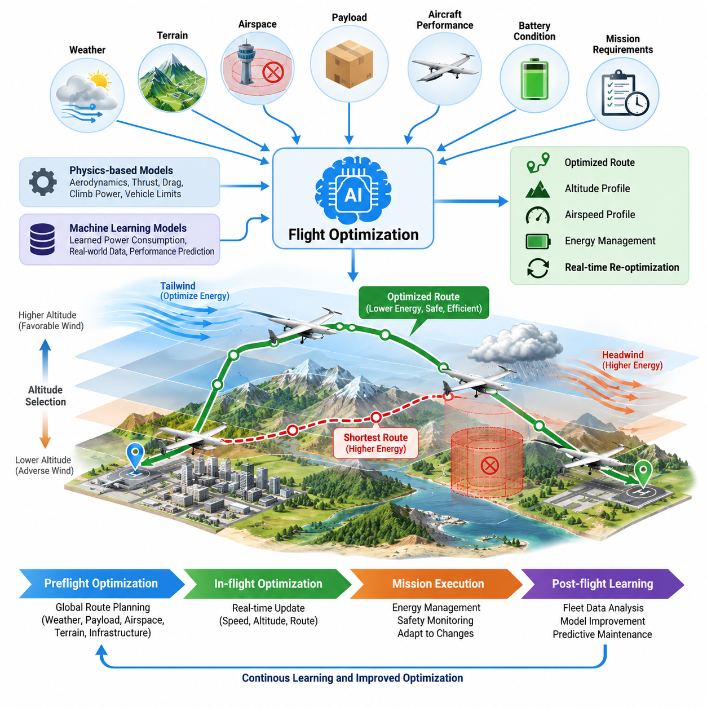
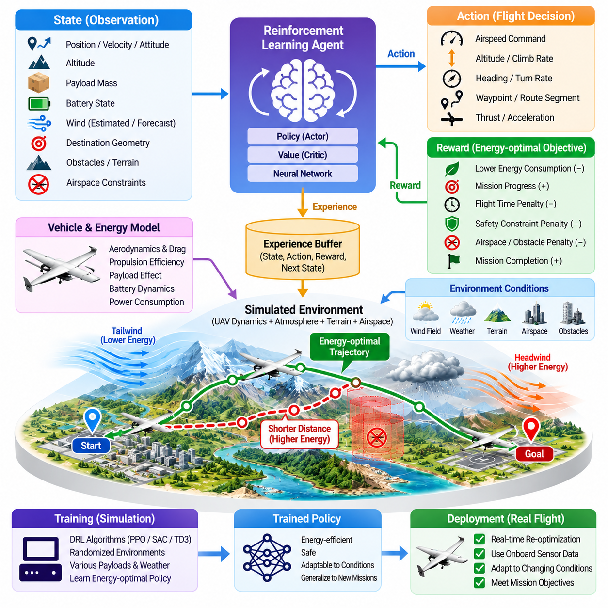
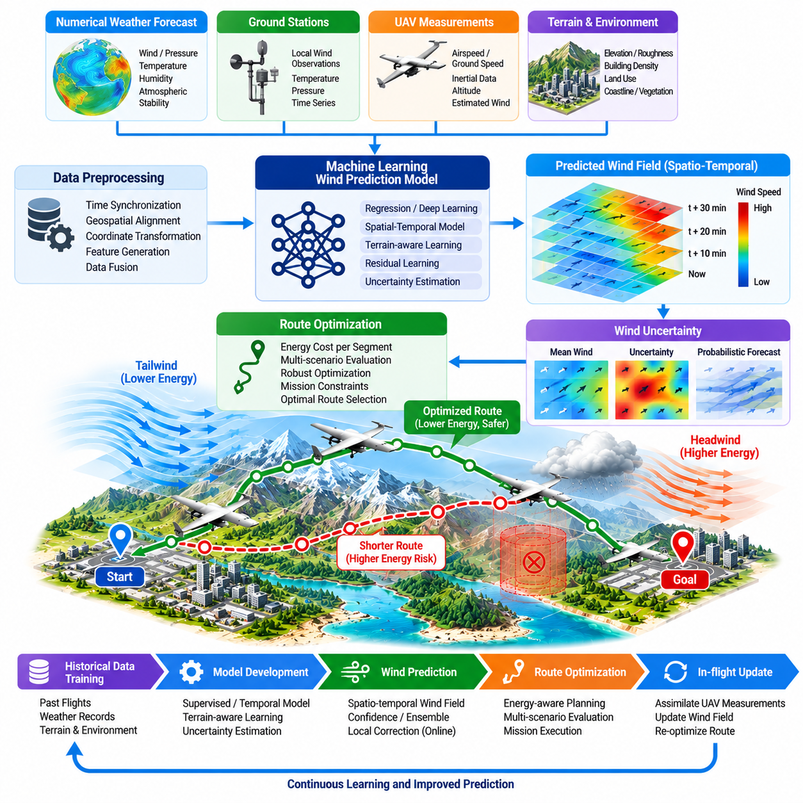
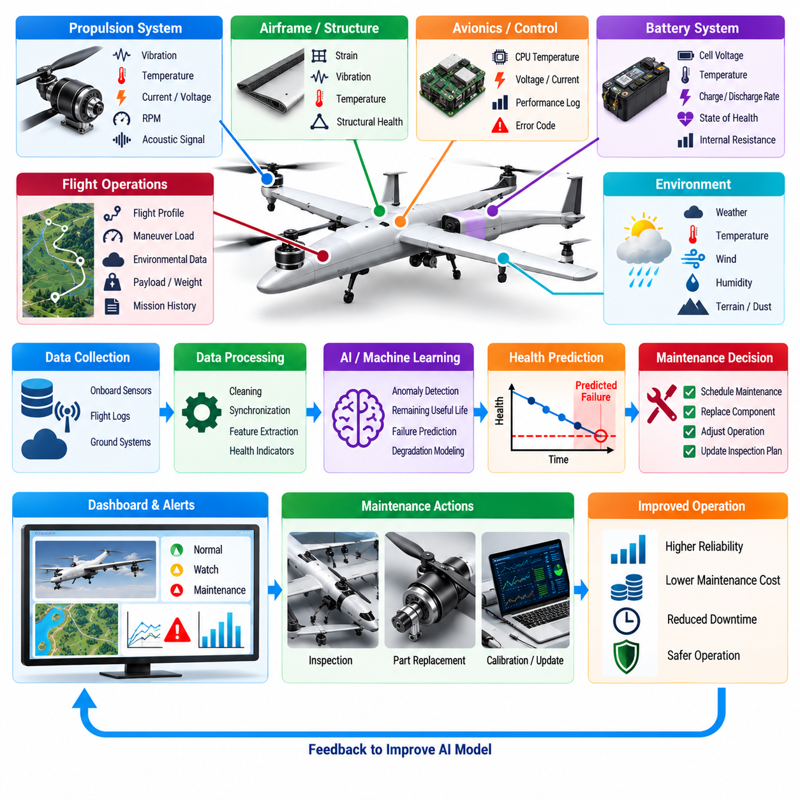
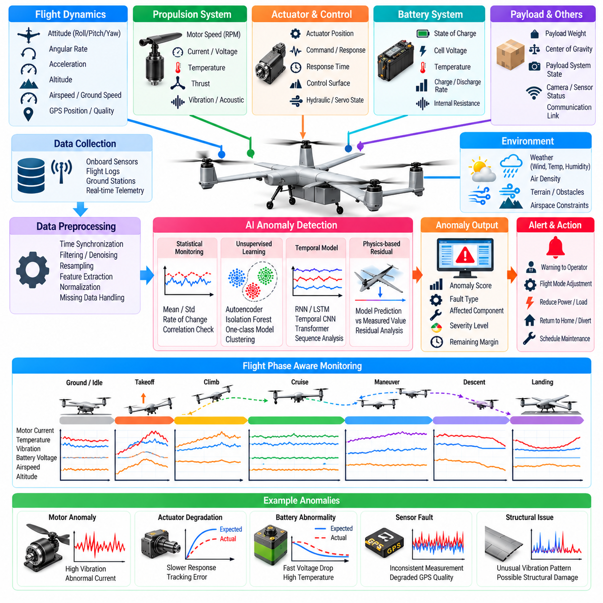
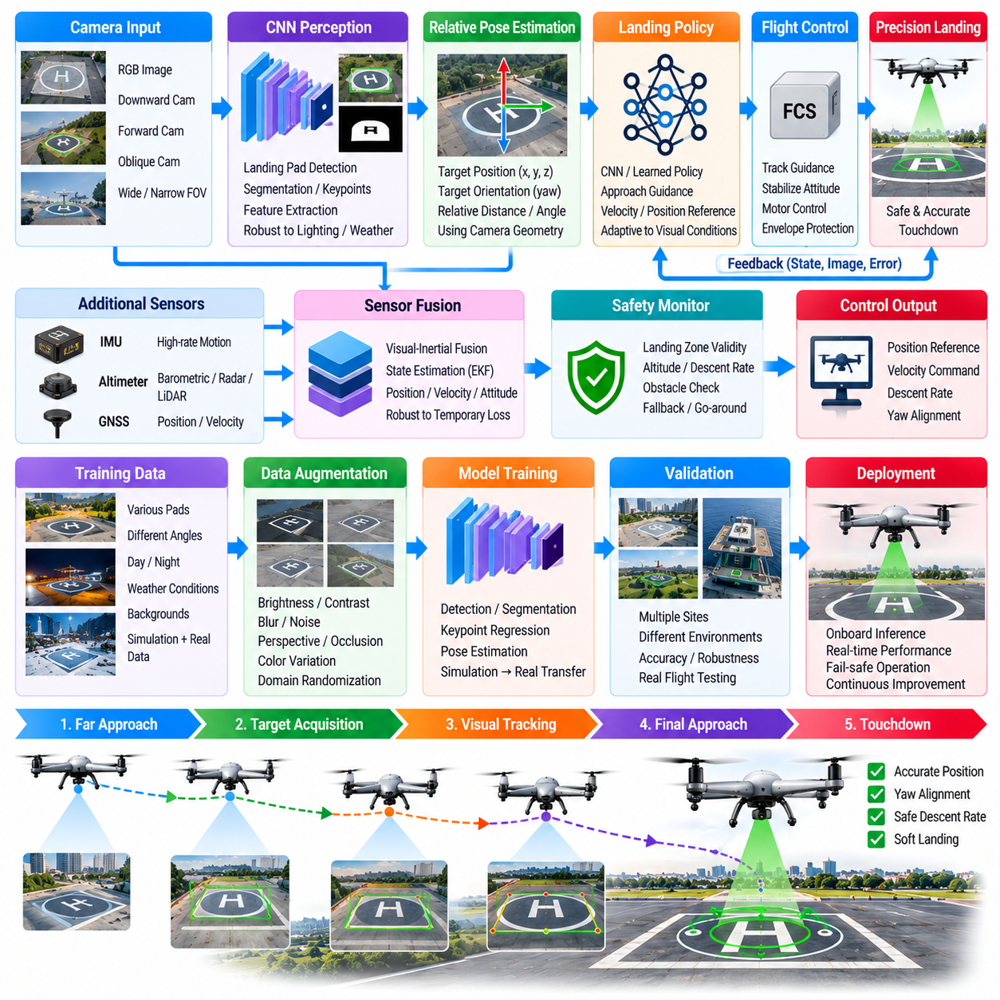
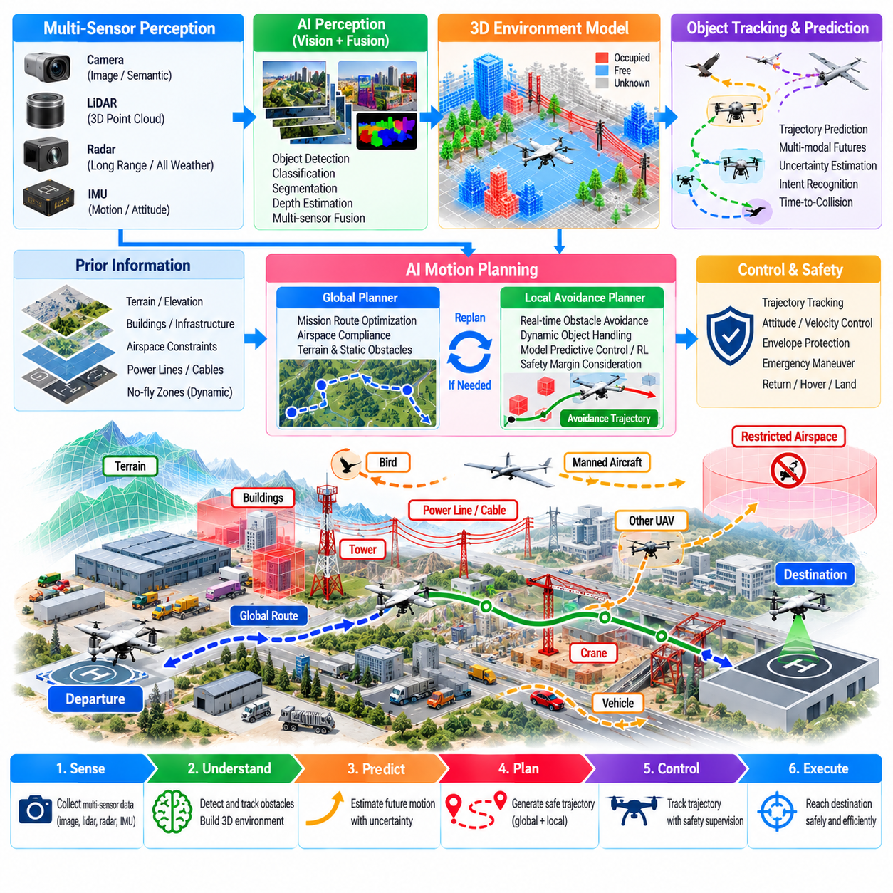
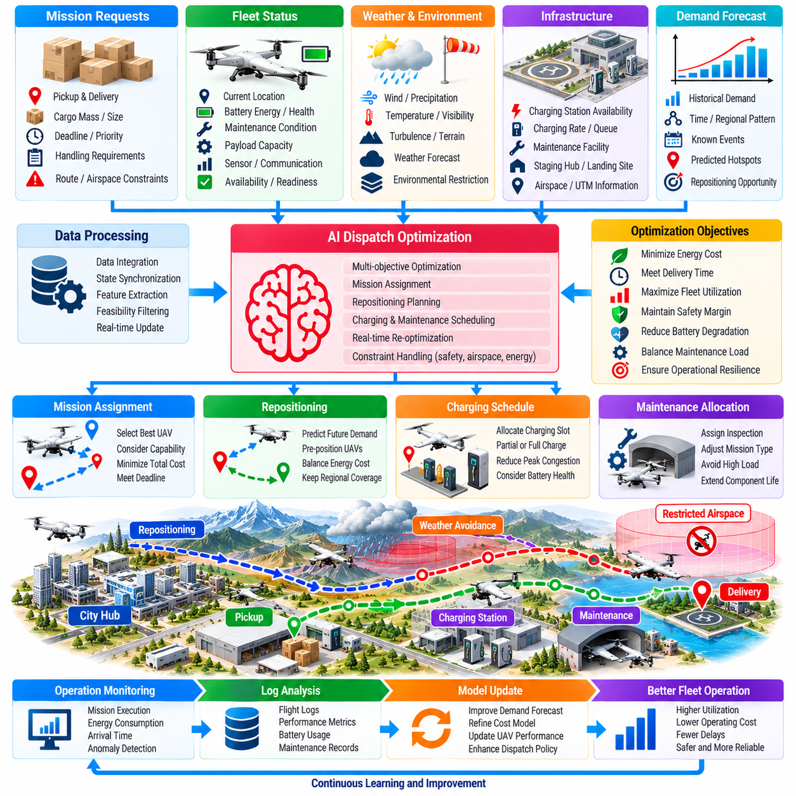
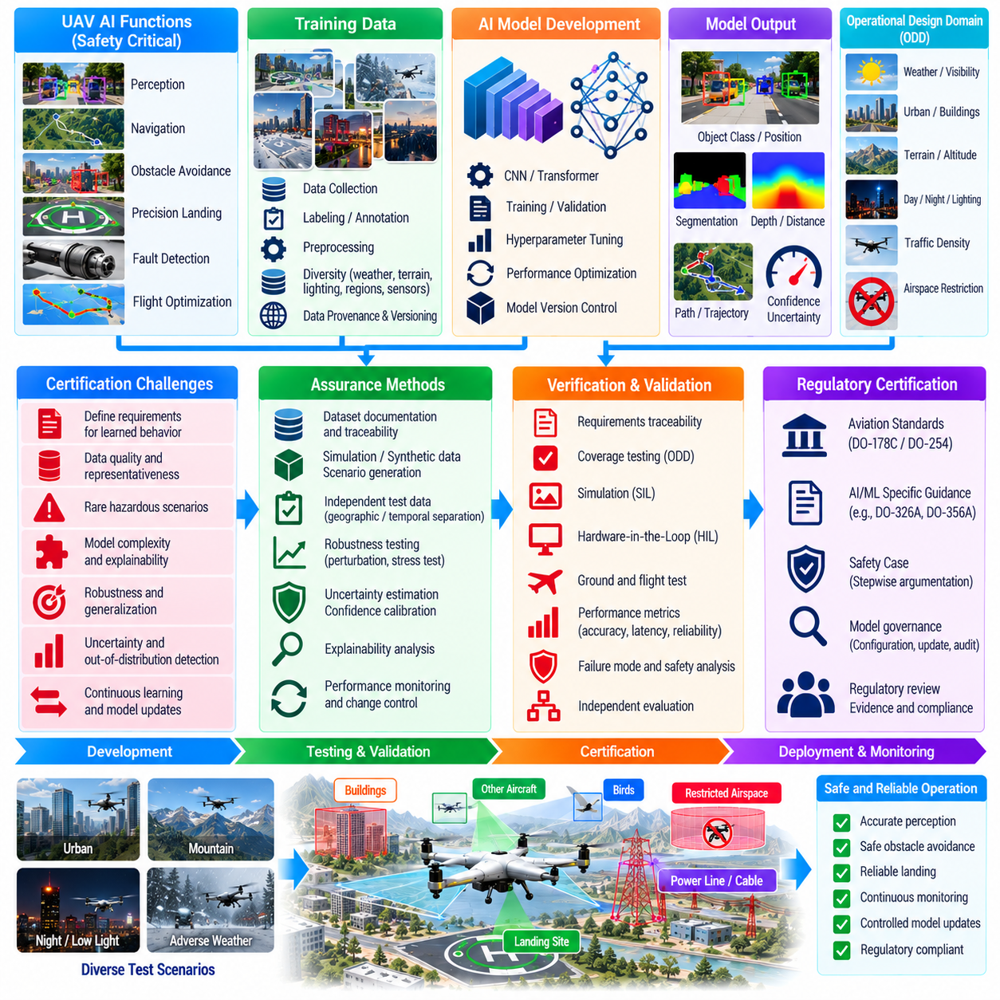
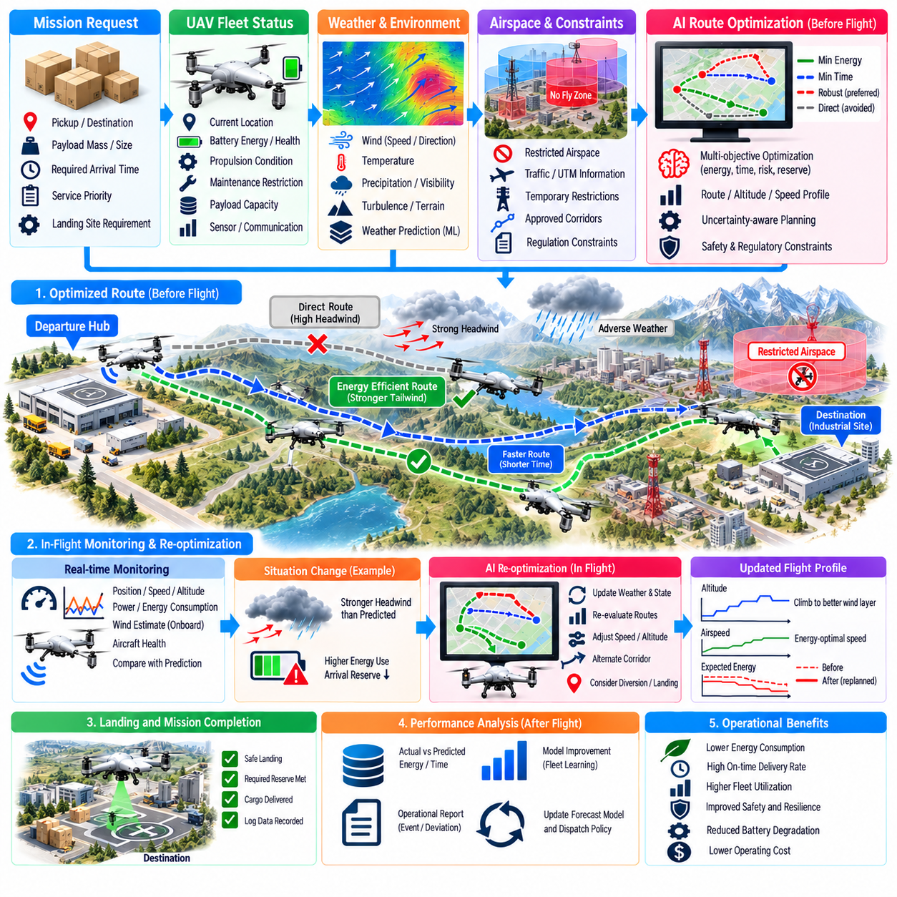

**Volume 23. Cargo UAV Autonomy and Flight AI**

# Chapter 09. AI Based Flight Optimization

## 09.01. AI Flight Optimization Opportunities Energy Route

{width="7.268055555555556in" height="7.268055555555556in"}

인공지능 기반 비행 최적화(AI-based Flight Optimization)는 무인항공기(UAV)가 변화하는 공기역학적 조건, 환경 조건, 탑재하중(Payload), 운용 조건에서 임무를 수행하는 방식을 체계적으로 개선할 수 있는 방법을 제공한다. 고정된 궤적(Trajectory)이나 보수적인 참조표(Lookup Table)를 따르는 대신, 지능형 최적화기(Intelligent Optimizer)는 에너지 소비, 비행시간, 안전 여유(Safety Margin), 임무 목표를 지속적으로 평가하여 더욱 효율적인 운용 결정을 식별할 수 있다.

화물 무인항공기(Cargo UAV)에서는 항공기 질량, 공기역학적 항력(Aerodynamic Drag), 기동 강도, 불리한 대기 조건에 따라 추진 동력(Propulsion Power)이 크게 증가하기 때문에 에너지 효율(Energy Efficiency)이 특히 중요하다. 인공지능 모델(AI Model)은 탑재중량, 대기속도(Airspeed), 고도, 로터(Rotor) 또는 프로펠러(Propeller) 효율, 배터리 상태, 환경 변수 사이의 관계를 학습하여 실제 명령을 실행하기 전에 대안 행동의 에너지 영향을 예측할 수 있다.

기존의 경로 계획(Route Planning)은 흔히 기하학적 거리를 최소화하지만, 최단 경로가 반드시 가장 에너지 효율적인 경로인 것은 아니다. 풍향, 풍속, 지형, 제한 공역(Restricted Airspace), 고도 변화, 필요한 기동으로 인해 더 긴 경로가 오히려 적은 에너지를 소비할 수 있다. 따라서 인공지능 지원 최적화(AI-assisted Optimization)는 경로를 단순한 출발지와 목적지 사이의 최단경로 계산이 아니라 동적 에너지 관리 문제(Dynamic Energy-management Problem)로 다룬다.

에너지 인식 최적화기(Energy-aware Optimizer)는 항공기 동역학(Vehicle Dynamics)과 학습된 전력 소비 모델(Power-consumption Model)을 결합할 수 있다. 물리 기반 모델(Physics-based Model)은 추력 요구량, 항력, 상승 동력, 항공기 한계와 같은 기본적인 관계를 설명하며, 기계학습 모델(Machine-learning Model)은 정확하게 표현하기 어려운 효과를 보완한다. 이러한 하이브리드 접근법(Hybrid Approach)은 안전 비행에 필요한 물리적 제약을 유지하면서 운용 데이터가 축적됨에 따라 예측 성능을 향상시킬 수 있다.

바람(Wind)은 지능형 최적화(Intelligent Optimization)를 적용할 수 있는 가장 중요한 요소 중 하나이다. 기상 예보 데이터는 초기 대기 상태 추정치를 제공하고, 탑재 센서(Onboard Sensor)는 비행 중 실제 바람 조건을 측정할 수 있다. 인공지능 알고리즘(AI Algorithm)은 이러한 정보를 융합하여 국부 풍장(Local Wind Field)을 추정하고, 진행 방향, 고도 또는 대기속도의 변경이 추진 에너지 요구량을 줄일 수 있는지 판단할 수 있다. 이에 따라 생성된 궤적은 유리한 바람을 활용하면서 과도한 에너지 손실이 발생하는 영역을 회피할 수 있다.

고도 선택(Altitude Selection)은 경로 최적화(Route Optimization)와 밀접하게 연계된다. 서로 다른 고도층에서는 풍속, 난류(Turbulence), 온도, 공기밀도(Air Density)가 크게 달라질 수 있다. 지능형 비행 최적화기(Intelligent Flight Optimizer)는 다른 고도로 이동한 후 얻을 수 있는 잠재적 이점과 상승에 필요한 에너지를 함께 평가할 수 있다. 따라서 항상 일정한 고도를 유지하는 것이 최적이라고 가정하지 않고 전체적인 에너지 균형(Energy Balance)을 고려하여 판단한다.

대기속도 최적화(Airspeed Optimization) 역시 중요한 효율 향상 기회를 제공한다. 더 빠르게 비행하면 임무시간을 단축할 수 있지만 일반적으로 공기역학적 손실과 추진 손실이 변화하며, 지나치게 느린 비행은 불리한 바람에 노출되는 시간을 증가시키거나 운용 생산성을 낮출 수 있다. 인공지능은 에너지 소비, 도착시간 요구사항, 배터리 예비량(Battery Reserve), 항공기 제한조건, 임무 우선순위를 종합하여 각 비행 구간에 적합한 속도 프로파일(Speed Profile)을 추정할 수 있다.

탑재하중 변화(Payload Variation)는 정적 최적화(Static Optimization)의 한계를 더욱 명확하게 만든다. 무거운 화물을 적재한 상태로 출발하는 무인항공기는 화물이 거의 없거나 전혀 없는 상태로 복귀할 때와 최적 속도, 상승 프로파일(Climb Profile), 경로 선택이 크게 달라질 수 있다. 따라서 최적화 시스템은 전력 요구량을 예측하고 비행 프로파일을 생성할 때 탑재중량, 무게중심(Center of Gravity) 정보, 기체 구성 상태(Configuration State)를 반영해야 한다.

배터리 상태(Battery Condition) 역시 최적화 결정에 영향을 미쳐야 한다. 사용 가능한 에너지는 단순한 공칭 충전상태(State of Charge)뿐만 아니라 온도, 셀 노화(Cell Aging), 방전율(Discharge Rate), 전압 특성, 이전 부하 이력에 따라 달라진다. 인공지능 기반 배터리 모델(AI-based Battery Model)은 단순한 백분율 표시보다 사용 가능한 에너지와 잔여 비행 능력을 정확하게 추정하여 경로 최적화 과정에서 현실적인 예비 에너지(Reserve Energy)를 유지하도록 할 수 있다.

임무 최적화(Mission Optimization)는 본질적으로 다목적 최적화 문제(Multi-objective Optimization Problem)이다. 최소 에너지 소비는 최소 비행시간, 배송 마감시간, 소음 제한, 승객 또는 화물 취급 요구사항, 공역 제약, 안전 여유와 충돌할 수 있다. 인공지능 기법은 가중 비용(Weighted Cost)이나 제약 최적화(Constrained Optimization)를 통해 이러한 상충 목표를 표현함으로써 하나의 독립적인 지표만 최적화하는 대신 실제 운용 우선순위를 반영하는 궤적을 선택할 수 있다.

최적화 과정은 여러 시간 범위(Time Horizon)에 걸쳐 작동해야 한다. 출발 전에는 기상 예보, 탑재하중 정보, 공역 데이터, 지형, 기반시설, 예상 항공기 성능을 활용하여 전역 경로(Global Route)를 계산할 수 있다. 비행 중에는 실제 측정 조건이 초기 가정에서 벗어나거나 예상하지 못한 제약조건이 발생할 경우 더 빠른 국부 최적화기(Local Optimizer)가 속도, 고도, 궤적 결정을 갱신할 수 있다.

기계학습(Machine Learning)은 비행대 운용 이력(Fleet History)에서 성능 특성을 추출하여 이러한 과정을 향상시킬 수 있다. 반복적인 임무를 통해 특정 항공기가 특정 탑재하중, 온도, 바람, 경로, 배터리 조건에서 얼마나 많은 에너지를 소비하는지 파악할 수 있다. 이러한 관측 데이터를 학습한 모델은 에너지 예측을 점진적으로 개선하고 이론적 성능 모델이 실제 소비량을 체계적으로 과소평가하거나 과대평가하는 운용 영역을 식별할 수 있다.

강화학습(Reinforcement Learning)은 각각의 비행 행동이 미래의 에너지 상태와 임무 실행 가능성에 영향을 미치는 순차적 의사결정(Sequential Decision Making)으로 최적화를 확장할 수 있다. 정책(Policy)은 장기적인 영향을 고려하면서 언제 상승, 하강, 속도 변경, 경로 변경을 수행해야 하는지 학습할 수 있다. 그러나 실제 운용 배치(Production Deployment)에서는 학습된 정책이 제한 없이 제어 권한을 행사하기보다는 명시적인 비행영역(Flight Envelope)과 제약 계층(Constraint Layer) 내부에서 작동해야 한다.

불확실성(Uncertainty)은 최적화기가 명확하게 인식할 수 있어야 한다. 기상 예보, 바람 추정, 배터리 모델, 탑재하중 측정, 학습 기반 에너지 예측에는 모두 오차가 존재한다. 따라서 강건한 시스템(Robust System)은 기대 성능뿐만 아니라 신뢰 여유(Confidence Margin)와 최악조건 거동(Worst-case Behavior)까지 고려하여 최적화해야 한다. 불확실성이 커질 경우 최적화기는 예비 에너지와 복구 선택지를 보호하는 더욱 보수적인 궤적을 의도적으로 선택할 수 있다.

안전 제약조건(Safety Constraint)은 항상 효율 목표보다 우선한다. 지오펜스(Geofence), 최소 분리거리(Minimum Separation), 장애물 여유거리(Obstacle Clearance), 구조적 한계, 추진계 한계, 배터리 예비량 임계값, 통신 요구사항, 비상착륙 접근성은 최적화 과정이 위반할 수 없는 경계를 정의한다. 따라서 인공지능은 제약 없는 효율 최적화 엔진이 아니라 인증되거나 독립적으로 감시되는 안전영역(Safety Envelope) 내부에서 작동하는 의사결정 메커니즘으로 활용될 때 가장 높은 가치를 제공한다.

경로 최적화(Route Optimization)는 비상상황에서의 대체경로 접근성(Contingency Accessibility)도 포함할 수 있다. 예측 에너지 소비가 유사한 두 경로라도 하나는 다수의 우회 또는 착륙 지점을 제공하는 반면 다른 경로는 복구 선택지가 거의 없는 지역을 통과할 수 있다. 비상상황 노출도(Contingency Exposure)에 비용을 부여하면 계획기는 에너지 효율성과 실질적인 운용 회복탄력성(Operational Resilience)을 함께 만족하는 경로를 선택할 수 있다.

대형 화물 무인항공기(Large Cargo UAV)에서는 작은 비율의 효율 개선도 절대적인 에너지 절감량 측면에서 큰 효과를 가져올 수 있기 때문에 최적화의 가치가 더욱 증가한다. 효율적인 속도 스케줄링(Speed Scheduling), 불필요한 상승 감소, 유리한 바람 활용, 부드러운 궤적 생성(Smooth Trajectory Generation)은 종합적으로 유효 항속거리 또는 탑재능력을 향상시킬 수 있다. 따라서 최적화는 배터리나 추진 하드웨어를 즉시 변경하지 않고도 항공기 경제성을 직접 개선할 수 있다.

비행대 수준 지능(Fleet-level Intelligence)은 또 다른 최적화 계층을 제공한다. 여러 화물 무인항공기가 경로, 충전소, 버티포트(Vertiport), 관제 공역을 공유할 경우 각각 독립적으로 최적인 궤적이 혼잡이나 비효율적인 자원 사용을 발생시킬 수 있다. 상위 감독 인공지능 시스템(Supervisory AI System)은 출발시간, 경로, 충전 일정, 에너지 예비량을 조정하여 개별 항공기 수준과 전체 비행대 수준 모두에서 최적화가 이루어지도록 할 수 있다.

디지털 트윈(Digital Twin)과 시뮬레이션 환경(Simulation Environment)은 이러한 기능을 개발하기 위한 중요한 수단을 제공한다. 탑재하중, 바람, 온도, 배터리 상태, 경로 형상, 구성품 열화(Component Degradation), 비정상 상황의 수많은 조합을 실제 알고리즘 배치 전에 평가할 수 있다. 시뮬레이션 결과는 안전하지 않은 최적화 거동을 발견하고 실제 비행시험에서 반복적으로 재현하기 어렵거나 위험한 조건에 대한 학습 데이터를 제공할 수 있다.

운용 검증(Operational Validation)에서는 최적화된 비행을 명확하게 정의된 기준선(Baseline)과 비교하고, 거리당 에너지, 탑재중량-거리당 에너지(Energy per Payload-distance), 임무 완료시간, 착륙 시 예비 에너지, 경로 편차(Route Deviation), 제약조건 위반 등의 지표를 활용해야 한다. 성능 향상은 대표적인 다양한 조건에서 통계적으로 의미가 있어야 하며, 정상적인 기상 조건에서만 우수하고 불확실성이 증가할 때 불안정해지는 솔루션은 실제 운용 배치에 적합하지 않다.

성숙한 시스템 아키텍처(System Architecture)는 따라서 예측(Prediction), 최적화(Optimization), 적응(Adaptation), 안전 감독(Safety Supervision)을 결합한다. 인공지능은 미래의 에너지 요구량과 환경 조건을 예측하고, 최적화 알고리즘은 실행 가능한 궤적을 평가하며, 탑재 시스템은 현재 측정값을 활용하여 결정을 조정하고, 독립적인 안전 로직(Safety Logic)은 모든 명령이 운용 제약조건을 만족하는지 검증한다. 이러한 계층형 구조(Layered Structure)는 결정론적 보호 기능을 대체하지 않으면서 지능을 통해 효율을 향상시킨다.

궁극적으로 인공지능 기반 비행 최적화(AI-based Flight Optimization)는 에너지 및 경로 관리를 정적인 임무 준비 과정에서 지속적인 예측형 의사결정(Continuous Predictive Decision Making) 과정으로 전환한다. 항공기는 현재의 행동이 미래의 에너지 가용성, 경로 실행 가능성, 도착 성능, 비상대응 능력에 어떠한 영향을 미치는지 판단할 수 있다. 화물 무인항공기 운용에서 이러한 능력은 변화하는 실제 환경에서도 더 긴 항속거리, 높은 운용률, 개선된 에너지 경제성, 더욱 안전한 자율 임무를 구현하기 위한 기반을 제공한다.

## 09.02. RL Based Energy Optimal Trajectory Planning [w/Code]

{width="7.268055555555556in" height="7.268055555555556in"}

강화학습(Reinforcement Learning)은 에너지 최적 궤적 계획(Energy-optimal Trajectory Planning)을 위한 프레임워크를 제공하며, 무인항공기(UAV)가 각각의 기동을 독립적으로 최적화하는 대신 일련의 비행 의사결정이 전체 임무 에너지에 어떤 영향을 미치는지를 학습하도록 한다. 항공기는 시뮬레이션 또는 모델링된 환경과 상호작용하면서 현재 상태를 관측하고 행동을 선택하며, 에너지 효율, 임무 진행도, 안전성, 제약조건 만족도를 나타내는 보상(Reward)을 받는다.

상태 표현(State Representation)은 강화학습 정책(Reinforcement Learning Policy)이 궤적을 결정할 때 사용할 수 있는 정보를 정의한다. 화물 무인항공기(Cargo UAV)의 경우 위치, 속도, 자세, 고도, 탑재중량, 배터리 상태, 추진 요구량, 추정 풍속, 목적지 형상, 장애물 위치, 공역 제약조건 등이 유용한 상태 정보가 될 수 있다. 미래 환경 조건이 에너지 소비에 크게 영향을 미치는 경우에는 과거 정보 또는 예측된 환경 정보도 포함할 수 있다.

행동(Action)은 서로 다른 수준의 제어 추상화(Control Abstraction)에서 정의할 수 있다. 상위 수준 정책(High-level Policy)은 웨이포인트(Waypoint), 고도 구간(Altitude Band), 목표 대기속도(Desired Airspeed), 경로 구간(Route Segment)을 선택할 수 있으며, 하위 수준 정책(Lower-level Policy)은 가속도, 상승률(Climb Rate), 진행방향(Heading), 추력(Thrust) 기준값을 생성할 수 있다. 전략적 궤적 최적화와 안전 중심의 비행 안정화를 분리하면 강화학습이 성숙한 결정론적 비행제어 기능을 불필요하게 대체하지 않으면서 임무 효율을 향상시킬 수 있다.

보상 함수(Reward Function)는 에너지 최적 비행 목표를 학습을 위한 수치적 신호로 변환한다. 에너지 소비에는 연속적인 페널티(Penalty)를 부여하고 목적지에 대한 진행에는 긍정적인 보상을 제공할 수 있다. 추가적인 페널티는 과도한 비행시간, 공격적인 기동, 배터리 고갈, 제한 공역 진입, 장애물 근접, 항공기 한계 초과 등을 나타낼 수 있다. 임무 완료와 안전한 착륙에는 강한 종단 보상(Terminal Reward)을 제공할 수 있다.

보상 설계(Reward Design)는 의도하지 않은 행동을 방지해야 한다. 순간적인 전력 소비가 낮은 것만 보상하는 정책은 지나치게 느리게 비행하거나 허용할 수 없는 지연을 발생시키거나 시뮬레이터의 비현실적인 특성을 악용할 수 있다. 반대로 임무시간 보상이 지나치게 큰 비중을 차지하면 높은 전력을 사용하는 궤적을 선택하여 실제 항속거리를 감소시킬 수 있다. 따라서 효과적인 보상 설계는 에너지, 시간, 진행도, 안전 여유, 운용 요구사항 사이의 균형을 유지하면서 바람직하지 않은 우회적 행동을 방지해야 한다.

에너지 최적화를 위해서는 현실적인 추진 요구량을 표현할 수 있는 환경 모델(Environment Model)이 필요하다. 로터 또는 프로펠러 효율, 공기역학적 항력, 항공기 질량, 탑재중량, 대기속도, 상승률, 가속도, 온도, 배터리 특성은 모두 궤적의 에너지 비용에 영향을 줄 수 있다. 고충실도 모델(High-fidelity Model)은 학습의 현실성을 향상시키지만, 정책 학습 과정에서 수백만 번의 시뮬레이션 단계를 수행해야 하는 경우 계산 효율적인 근사 모델이 필요할 수 있다.

바람(Wind)은 일정한 외란(Disturbance)으로 취급하기보다 강화학습 환경에서 동적으로 변화하는 요소로 포함해야 한다. 학습 시나리오에는 맞바람, 순풍, 측풍, 수직 기류, 난류, 공간적으로 변화하는 풍장(Wind Field)을 포함할 수 있다. 반복적인 경험을 통해 정책은 언제 진행방향, 고도, 속도를 변경하여 유리한 조건을 활용하거나 추진 에너지 요구량을 증가시키는 환경 영역을 회피해야 하는지를 학습할 수 있다.

고도 결정(Altitude Decision)은 이 문제의 순차적 특성을 잘 보여준다. 유리한 바람이 존재하는 고도층으로 상승하려면 즉각적인 에너지 투자가 필요하지만, 이후 경로에서 추진 동력 감소 효과를 얻을 수 있다. 단기적인 비용만 고려하는 탐욕적 최적화기(Greedy Optimizer)는 상승을 거부할 수 있지만, 강화학습은 누적 수익(Cumulative Return)을 통해 지연된 이점을 학습할 수 있다. 이러한 능력은 국부적으로 비효율적인 행동이 전체적으로는 효율적인 임무를 만들어내는 상황에서 특히 유용하다.

탑재하중 의존 동역학(Payload-dependent Dynamics)은 화물 무인항공기의 탑재중량이 변화함에 따라 비행 특성이 크게 달라질 수 있기 때문에 학습 과정에서 무작위화(Randomization)해야 한다. 하나의 기준 중량에서만 학습된 정책은 최대 탑재량에 가까운 상태나 빈 상태로 복귀하는 비행에서 성능이 저하될 수 있다. 대표적인 질량 분포를 대상으로 학습하면 정책은 현재 항공기 구성에 따라 속도, 고도, 기동 강도를 조절하는 에너지 관리 전략을 학습할 수 있다.

배터리 동역학(Battery Dynamics)은 또 다른 장기적 의존성을 만든다. 고출력 기동은 짧은 시간 동안 수행되더라도 전압 강하, 열적 스트레스, 실질적인 에너지 손실을 증가시킬 수 있다. 강화학습 환경에 충전상태(State of Charge), 온도, 내부저항(Internal Resistance), 전력 제한을 포함하면 정책이 사용 가능한 에너지를 보존하는 방법을 학습할 수 있다. 이는 단순히 기하학적 거리 또는 누적된 기계적 일(Mechanical Work)을 최소화하는 것보다 현실적인 궤적 최적화를 가능하게 한다.

여러 강화학습 방법이 궤적 최적화를 지원할 수 있다. 가치 기반 방법(Value-based Method)은 행동이 이산적인 경우 유용하며, 액터-크리틱(Actor-critic) 및 정책 경사(Policy-gradient) 방법은 연속적인 비행 명령에 더 적합하다. PPO, SAC, TD3와 같은 알고리즘은 연속 제어 정책(Continuous Control Policy)을 학습할 수 있지만, 알고리즘 선택은 안정성, 샘플 효율(Sample Efficiency), 계산 자원, 행동 표현 방식, 요구되는 운용 보증 수준을 고려하여 결정해야 한다.

모델 기반 강화학습(Model-based Reinforcement Learning)은 항공기와 환경의 거동을 예측하는 모델을 학습하거나 활용하여 샘플 효율을 향상시킬 수 있다. 정책은 행동을 실행하기 전에 잠재적인 미래 궤적을 평가할 수 있으며, 학습 기반 의사결정과 최적제어(Optimal Control)의 특성을 결합할 수 있다. 화물 무인항공기에서는 실제 비행 데이터의 확보 비용이 높고 충분히 정확한 동역학 모델 또는 디지털 트윈(Digital Twin)을 사용할 수 있는 경우 이러한 접근법이 특히 유용하다.

오프라인 강화학습(Offline Reinforcement Learning)은 자율 최적화를 도입하기 전에 이미 대량의 비행 로그가 축적되어 있는 경우 유용한 개발 경로를 제공한다. 항공기에서 직접 탐색하는 대신 에너지 사용량, 기상, 탑재하중, 제어 정보를 포함하는 과거 궤적에서 정책을 학습할 수 있다. 그러나 학습된 정책이 기록된 데이터셋이 표현하는 분포에서 지나치게 벗어난 결정을 내리지 않도록 주의해야 한다.

따라서 시뮬레이션은 안전한 학습에서 핵심적인 역할을 한다. 디지털 환경에서는 항공기를 위험에 노출시키지 않고 수천 개의 경로와 수백만 개의 상태 전이를 정책에 경험시킬 수 있다. 정상 임무와 함께 강풍, 항법 불확실성, 추진계 열화, 통신 두절, 배터리 이상, 예상하지 못한 장애물 등을 포함할 수 있다. 중요하지만 발생 빈도가 낮은 조건은 개발 과정에서 정책이 충분히 경험할 수 있도록 의도적으로 높은 비율로 샘플링할 수 있다.

도메인 무작위화(Domain Randomization)는 특정 시뮬레이터 구성에 지나치게 의존하는 것을 방지하는 데 도움이 된다. 항공기 질량, 공력 계수, 모터 효율, 센서 잡음, 바람, 온도, 지연시간(Latency), 배터리 파라미터 등을 학습 에피소드마다 변화시킬 수 있다. 이러한 변화를 견디면서 성공하는 정책은 시뮬레이션과 실제 항공기의 차이를 더 잘 견딜 가능성이 높으며, 실제 배치 과정에서 발생하는 시뮬레이션-현실 간 격차(Simulation-to-reality Gap)를 줄일 수 있다.

커리큘럼 학습(Curriculum Learning)은 임무 난이도를 점진적으로 높여 학습 안정성을 더욱 향상시킬 수 있다. 초기 에피소드에서는 짧은 경로, 약한 바람, 충분한 에너지 예비량, 적은 제약조건을 사용할 수 있다. 이후 단계에서는 더 무거운 탑재하중, 복잡한 지형, 불확실한 기상, 제한 공역, 엄격한 에너지 예비량, 다중 목표를 추가할 수 있다. 이러한 점진적 과정은 정책이 복잡한 운용 상황에 대응하기 전에 기본적인 에너지 효율 비행 행동을 학습하도록 한다.

안전은 학습된 보상 함수에만 의존해서는 안 된다. 하드 제약조건(Hard Constraint)은 안전 필터(Safety Filter), 제어 장벽 함수(Control Barrier Function), 도달가능성 검사(Reachability Check), 지오펜싱(Geofencing), 제약 최적화 계층(Constrained Optimization Layer) 등을 통해 구현할 수 있으며, 실행 전에 제안된 행동을 검사하도록 할 수 있다. 강화학습 정책이 안전하지 않은 궤적 변경을 요청하면 독립적인 메커니즘이 해당 명령을 거부하거나 수정하면서 항공기의 안정적인 거동을 유지할 수 있다.

계층형 아키텍처(Hierarchical Architecture)는 실제 화물 무인항공기에 특히 적합하다. 강화학습 정책은 비교적 느린 업데이트 주기로 경로 구간, 고도, 속도를 최적화하고, 기존 유도(Guidance) 및 비행제어 시스템은 더 높은 주파수에서 요청된 궤적을 실행할 수 있다. 이러한 역할 분리는 인증 복잡성을 낮추고 학습 기반 최적화를 자세 안정화, 액추에이터 제어, 기타 안전 핵심 기능으로부터 분리할 수 있다.

실시간 추론(Real-time Inference)은 엄격한 계산 및 시간 요구사항을 만족해야 한다. 탑재 정책은 예측 가능한 지연시간 내에 결정을 생성하면서 인지, 항법, 통신, 비행제어 작업과 프로세서를 공유해야 한다. 모델 압축(Model Compression), 양자화(Quantization), 관측 차원 축소, 하드웨어 가속(Hardware Acceleration)을 통해 추론 비용을 줄일 수 있다. 실행시간 초과가 발생하면 지연되거나 오래된 궤적 명령을 사용하는 대신 결정론적 대체 동작(Deterministic Fallback Behavior)이 실행되어야 한다.

정책은 또한 불확실성(Uncertainty)을 인식하거나 이에 대응할 수 있어야 한다. 바람 추정, 배터리 예측, 위치추정(Localization), 미래 교통 상황은 비행 중 신뢰성이 저하될 수 있다. 불확실성을 인식하는 아키텍처(Uncertainty-aware Architecture)는 신뢰도가 낮아질 경우 학습 기반 최적화기의 제어 권한을 줄일 수 있다. 이후 보수적인 속도 프로파일, 더 큰 에너지 예비량, 사전에 정의된 우회 경로, 기존 최적화 방법이 공격적인 에너지 절감 결정을 대신할 수 있다.

평가는 누적 강화학습 보상(Cumulative Reinforcement Learning Reward)만을 측정해서는 안 된다. 중요한 운용 지표에는 총 전기 에너지 소비량, 탑재중량-거리당 에너지, 비행시간, 최소 배터리 예비량, 최대 전력, 궤적 평활도(Trajectory Smoothness), 경로 길이, 제약조건 위반, 성공적인 임무 완료율 등이 포함된다. 성능은 최단경로 계획기(Shortest-path Planner), 기존 최적제어 방법, 수동으로 조정된 에너지 효율 기준선과 비교해야 한다.

강건성 시험(Robustness Testing)은 정상적인 학습 분포에서 벗어난 조건을 반드시 검토해야 한다. 정책은 예상보다 강한 바람, 부정확한 탑재중량 추정, 열화된 배터리, 센서 바이어스(Sensor Bias), 예상하지 못한 공역 변경, 추진 효율 손실 등의 조건에서 평가되어야 한다. 평균적으로 소폭의 에너지 절감 효과가 있더라도 정책이 때때로 예비 에너지를 소진하거나 안전 운용 경계에 접근하는 궤적을 생성한다면 실질적인 가치는 제한적이다.

비행시험(Flight Testing)은 시뮬레이션에서 소프트웨어-인-더-루프(Software-in-the-loop), 하드웨어-인-더-루프(Hardware-in-the-loop), 통제된 실제 시험(Controlled Physical Test)을 거쳐 대표적인 운용 임무로 단계적으로 진행해야 한다. 초기 비행에서는 강화학습 정책의 역할을 자문 권고(Advisory Recommendation) 또는 제한적인 궤적 조정으로 한정할 수 있다. 기록된 결과가 예측 가능한 거동, 에너지 절감 효과, 제약조건 준수, 기존 비행 시스템과의 안정적인 상호작용을 입증한 후에만 제어 권한을 점진적으로 확대할 수 있다.

지속적인 운용 데이터(Operational Data)는 이후 정책 개선을 지원할 수 있지만 실제 운용 환경에서의 학습은 엄격하게 관리되어야 한다. 비행 로그를 오프라인 학습 환경으로 전송하여 새로운 정책을 학습하고 시험하며 비교하고 버전 관리할 수 있다. 업데이트는 배포 전에 회귀 테스트(Regression Test)와 안전 검증(Safety Validation)을 통과해야 한다. 안전이 중요한 화물 운용 중에 제한 없는 온라인 학습(Online Learning)을 허용하면 시스템의 거동을 재현하고 검증하기 어려워진다.

비행대 규모 지능(Fleet-scale Intelligence)에서는 단일 항공기만으로는 포착하기 어려운 패턴을 강화학습이 학습할 수 있다. 서로 다른 경로, 탑재하중, 기상 조건, 배터리 노화 상태, 항공기 구성에서 수집된 경험은 일반화된 에너지 모델과 궤적 정책을 향상시킬 수 있다. 따라서 비행대 학습(Fleet Learning)은 개별 임무 경험을 재사용 가능한 운용 지능(Operational Intelligence)으로 전환하면서도 항공기별 성능 차이가 큰 경우에는 개별적인 적응을 허용할 수 있다.

강화학습 기반 에너지 최적 궤적 계획(RL-based Energy-optimal Trajectory Planning)은 궁극적으로 장기 의사결정(Long-horizon Decision Making)과 항공기 성능 및 환경 조건에 대한 적응형 지식을 결합한다. 핵심적인 장점은 단순히 더 짧은 경로를 찾는 것이 아니라 현재의 선택이 미래의 에너지, 안전 여유, 임무 수행 가능성에 어떤 영향을 미치는지를 학습하는 데 있다. 결정론적 안전 메커니즘으로 제어되고 체계적으로 검증된다면, 이는 자율 화물 무인항공기 운용을 위한 강력한 최적화 계층(Optimization Layer)이 될 수 있다.

## 09.03. Wind Prediction ML Model for Route Opt [w/Code]

{width="7.268055555555556in" height="7.268055555555556in"}

바람 예측(Wind Prediction)은 대기의 움직임이 지상속도(Ground Speed), 추진 동력(Propulsion Power), 비행시간, 에너지 예비량(Energy Reserve)에 직접적인 영향을 미치기 때문에 인공지능 기반 경로 최적화(AI-based Route Optimization)의 핵심 요소이다. 화물 무인항공기(Cargo UAV)의 경우 비교적 작은 예측 오차도 장거리 임무에서 누적되어 상당한 에너지 편차를 발생시킬 수 있다. 기계학습 기반 바람 모델(Machine-learning Wind Model)은 기존 수치 기상정보와 탑재 센서 측정값을 보완하는 국지적 예측 정보를 제공할 수 있다.

기존 기상 예보(Weather Forecast)는 저고도 자율비행에 충분하지 않은 공간 및 시간 해상도로 제공되는 경우가 많다. 건물, 지형, 식생, 해안선, 열적 효과(Thermal Effect)는 지역 예보와 크게 다른 국지적 바람 패턴(Local Wind Pattern)을 형성할 수 있다. 기계학습(Machine Learning)은 과거 기상 데이터, 지형 특성, 센서 관측값, 이전 무인항공기 비행 데이터를 이용하여 이러한 국지적 관계를 학습하고 경로 계획에 필요한 바람 추정치를 생성할 수 있다.

바람 예측 모델(Wind Prediction Model)의 입력 표현(Input Representation)은 여러 정보원을 결합할 수 있다. 수치예보(Numerical Weather Prediction) 데이터는 지역적인 바람 벡터, 기압, 온도, 습도, 대기 안정도(Atmospheric Stability)를 제공하며, 지상 기상관측소는 국지적 관측값을 제공할 수 있다. 무인항공기 측정값에는 대기속도, 지상속도, 관성 데이터, 고도, 추정 바람이 포함될 수 있다. 지형 고도와 토지이용 정보도 운용지역 주변의 공간적 변화를 설명하는 데 활용할 수 있다.

이러한 이질적인 데이터 소스(Heterogeneous Data Source)를 결합할 때는 정확한 시간 동기화(Time Synchronization)와 지리공간 정렬(Geospatial Alignment)이 필수적이다. 서로 다른 시간이나 위치에서 수집된 기상 관측값을 단순히 동시 측정값으로 처리해서는 안 된다. 전처리 파이프라인(Preprocessing Pipeline)은 데이터를 일관된 좌표계, 타임스탬프(Timestamp), 고도 기준, 공간 격자로 변환해야 한다. 정렬이 부정확하면 학습 알고리즘이 실제 대기 거동이 아니라 동기화 오차를 학습할 수 있다.

과거 관측 데이터가 학습을 위한 목표 바람 벡터(Target Wind Vector)를 제공하는 경우 지도학습(Supervised Learning)을 사용할 수 있다. 회귀 모델(Regression Model)은 기상 및 지리적 특성으로부터 미래 위치와 시간의 풍속 및 풍향을 추정할 수 있다. 트리 기반 모델(Tree-based Model)은 효율적인 기준 모델을 제공할 수 있으며, 신경망(Neural Network)은 대기 변수 사이의 비선형 상호작용을 학습할 수 있다. 모델 복잡도는 예측 정확도, 사용 가능한 데이터, 탑재 계산 자원을 고려하여 선택해야 한다.

바람은 서로 독립된 관측값의 집합이 아니라 지속적으로 변화하기 때문에 시간 모델(Temporal Model)이 특히 유용하다. 순환신경망(Recurrent Neural Network), 게이트 구조(Gated Architecture), 시간 합성곱 신경망(Temporal Convolutional Network), 트랜스포머 기반 모델(Transformer-based Model)은 연속된 측정값에서 시간적 패턴을 학습할 수 있다. 이러한 모델은 향후 수분 동안 국지적 바람 조건이 어떻게 변화할지를 예측하여 이동 지평선 경로 최적화(Receding-horizon Route Optimization)에 직접 활용할 수 있는 정보를 제공한다.

공간적 관계(Spatial Relationship) 역시 중요하다. 한 위치에서 측정된 바람은 특히 지형 형상과 주된 대기 흐름을 함께 고려할 경우 주변 지역에 대한 정보를 제공할 수 있다. 격자 기반 신경망(Grid-based Neural Model)은 지리적 영역 전체의 풍장(Wind Field)을 추정할 수 있으며, 그래프 기반 표현(Graph-based Representation)은 균일한 공간 격자를 요구하지 않고 불규칙하게 분포된 기상관측소, 무인항공기 관측값, 지형 지점, 경로 웨이포인트(Waypoint) 사이의 관계를 모델링할 수 있다.

저고도 화물 무인항공기 운용에서는 지형 인식 예측(Terrain-aware Prediction)이 경로 계획 성능을 크게 향상시킬 수 있다. 언덕, 계곡, 도시 구조물, 대형 산업시설은 공기 흐름을 가속하거나 방향을 변경하고 교란할 수 있다. 기계학습 모델은 지형 고도, 표면 거칠기(Surface Roughness), 건물 밀도, 전산유체역학(Computational Fluid Dynamics) 정보를 상황 특성(Contextual Feature)으로 포함할 수 있다. 이를 통해 거친 해상도의 지역 기상예보가 포착하지 못하는 국지적 효과를 예측 풍장에 반영할 수 있다.

무인항공기 자체도 이동형 대기 센서(Mobile Atmospheric Sensor)로 활용할 수 있다. 측정된 대기속도와 지상속도의 차이를 자세 및 관성 추정값과 결합하면 국지적 바람 벡터를 관측할 수 있다. 항공기가 운용지역을 이동하면서 이러한 측정값을 이용하여 바람 모델을 갱신할 수 있다. 따라서 화물 무인항공기 비행대(Fleet)는 분산 센싱 네트워크(Distributed Sensing Network)를 구성하여 환경에 대한 단기적인 정보를 지속적으로 향상시킬 수 있다.

온라인 데이터 동화(Online Data Assimilation)는 기존 예보와 최근 측정값을 결합할 수 있다. 기존 기상예측을 완전히 대체하는 대신 시스템은 국지적 관측값을 이용하여 지역 예보에 대한 보정값을 추정할 수 있다. 이러한 잔차 학습(Residual Learning) 방식은 대규모 대기 거동은 기존 예보 시스템에서 활용하고, 기계학습은 무인항공기 비행과 관련된 국지적 편향(Local Bias)과 해상되지 않은 변화를 학습하는 데 집중할 수 있기 때문에 실용적이다.

예측 출력(Prediction Output)은 하나의 결정론적 바람 벡터만 제공해서는 안 된다. 경로 최적화에서는 예측 오차의 영향이 클 수 있기 때문에 불확실성(Uncertainty)에 대한 추정도 필요하다. 모델은 풍속과 풍향에 대한 신뢰구간(Confidence Interval), 확률분포(Probability Distribution), 앙상블(Ensemble), 분산 추정값(Variance Estimate)을 생성할 수 있다. 바람의 불확실성이 높은 영역에는 궤적 계획 과정에서 추가적인 위험 비용(Risk Cost)을 부여할 수 있다.

바람의 불확실성은 에너지 예측(Energy Prediction)에도 전파되어야 한다. 평균 예보에서는 매우 효율적으로 보이는 경로라도 작은 바람 예측 오차가 핵심 구간에서 강한 맞바람을 발생시키면 불리한 경로가 될 수 있다. 강건 최적화(Robust Optimization)는 여러 바람 시나리오를 평가하여 다양한 조건에서도 허용 가능한 에너지 성능을 제공하는 경로를 선택할 수 있다. 이러한 접근법은 임무 신뢰성을 향상시키기 위해 예상 효율의 일부를 의도적으로 희생할 수도 있다.

경로 계획기(Route Planner)는 예측된 풍장을 구간별 에너지 비용(Segment-specific Energy Cost)으로 변환할 수 있다. 각각의 후보 궤적에 대해 시스템은 원하는 지상속도를 달성하는 데 필요한 대기속도를 추정하고 이에 따른 추진 요구량을 계산한다. 따라서 맞바람, 측풍, 고도 전환, 기동 요구사항이 에너지 비용으로 변환된다. 이후 경로 탐색(Route Search)은 단순한 기하학적 거리가 아니라 예상 임무 비용(Expected Mission Cost)을 최소화하도록 수행된다.

바람 모델이 3차원 예측(Three-dimensional Prediction)을 제공하는 경우 고도 최적화(Altitude Optimization)의 가치가 더욱 커진다. 서로 다른 고도층에는 상당히 다른 바람 벡터가 존재할 수 있으며, 화물 무인항공기는 유리한 고도층으로 상승함으로써 전체 에너지를 줄일 수 있다. 계획기는 고도 전환에 즉시 필요한 에너지와 남은 경로에서 예상되는 누적 추진 에너지 절감량을 비교해야 한다.

예측 지평선(Prediction Horizon)은 임무 및 계획 요구사항에 맞게 설정해야 한다. 매우 단기적인 예측은 국지적인 궤적 조정을 지원할 수 있으며, 장기 예측은 비행 전 경로 선택과 우회 계획(Diversion Planning)에 필요하다. 일반적으로 예측 지평선이 길어질수록 정확도가 감소하므로 경로 최적화기는 먼 미래의 예측에 더 큰 불확실성을 부여하고 비행 중 새로운 측정값이 확보될 때마다 결정을 갱신해야 한다.

모델 학습(Model Training)을 위해서는 계절적, 지리적, 운용적 변동성을 포괄하는 대표적인 데이터셋이 필요하다. 의도된 운용지역과 관련되는 경우 데이터에는 무풍 상태, 강풍, 변화하는 전선(Front), 열적 효과, 난류, 서로 다른 시간대의 조건이 포함되어야 한다. 주로 양호한 조건에서 학습된 모델은 정확한 에너지 예측이 가장 중요한 악천후 상황에서 오히려 성능이 저하될 수 있다.

따라서 데이터 품질 관리(Data Quality Management)가 기본적으로 중요하다. 고장 난 풍속계(Anemometer), 부정확한 항공기 상태 추정, GPS 오류, 센서 지연시간, 통신 문제는 학습 레이블(Training Label)을 오염시킬 수 있다. 자동화된 품질 검사는 비현실적인 풍속, 급격한 불연속, 일치하지 않는 타임스탬프, 센서 간 불일치를 탐지할 수 있다. 또한 각 관측값의 데이터 출처 추적성(Data Provenance)을 유지하면 의심스러운 데이터 소스를 제외하거나 학습 과정에서 낮은 신뢰도를 부여할 수 있다.

시뮬레이션(Simulation)은 제한된 실제 데이터셋을 보완할 수 있다. 수치 기상 모델, 전산유체역학, 합성 지형 시나리오(Synthetic Terrain Scenario)는 초기 학습과 스트레스 시험(Stress Testing)을 위한 다양한 풍장을 생성할 수 있다. 도메인 무작위화(Domain Randomization)를 통해 바람의 강도와 방향, 난류, 지형 효과, 센서 잡음을 변화시킬 수 있다. 그러나 시뮬레이션된 대기 거동은 실제 운용 조건을 완벽하게 재현할 수 없으므로 보정을 위해 실제 비행 측정 데이터가 여전히 필요하다.

모델 평가는 비행 최적화에 직접적으로 영향을 미치는 오차를 고려해야 한다. 풍속의 평균절대오차(Mean Absolute Error)는 유용하지만 그것만으로는 충분하지 않다. 풍향 오차, 벡터 오차(Vector Error), 고도별 정확도, 예측 지평선에 따른 성능 저하, 극한 조건에서의 성능도 측정해야 한다. 더욱 중요하게는 예측된 바람이 경로 선택, 예상 에너지 소비량, 도착 시 배터리 예비량에 미치는 영향을 기준으로 평가해야 한다.

통계적인 바람 예측 정확도가 약간 낮은 모델이라도 운용적으로 중요하지 않은 영역에서 주로 오차가 발생한다면 더 나은 임무 결정을 제공할 수 있다. 따라서 종단간 평가(End-to-end Evaluation)에서는 예측된 바람을 이용하여 생성한 경로를 실제 측정된 바람 조건을 기반으로 생성한 경로와 비교해야 한다. 평가 지표에는 추가 에너지 소비량, 추가 비행시간, 불필요한 고도 변경, 경로 불안정성(Route Instability), 예비 에너지 위반 발생 빈도 등이 포함될 수 있다.

실시간 배치(Real-time Deployment)에서는 예측 가능한 계산 성능이 필요하다. 바람 모델은 연결성과 임무 요구사항에 따라 무인항공기 탑재 컴퓨터, 엣지 스테이션(Edge Station), 또는 분산 아키텍처(Distributed Architecture)에서 실행할 수 있다. 탑재 추론(Onboard Inference)은 낮은 지연시간과 통신 연결로부터의 독립성을 제공하며, 엣지 또는 지상 연산은 더 큰 모델을 지원할 수 있다. 외부 연결이 일시적으로 중단되더라도 핵심적인 경로 적응 기능은 유지되어야 한다.

시스템은 바람 예측의 신뢰성이 저하될 경우를 위한 대체 동작(Fallback Behavior)을 정의해야 한다. 관측 데이터 누락, 모델 신뢰도 저하, 예상하지 못한 난류, 예측된 바람과 측정된 바람 사이의 불일치는 보수적인 계획을 활성화할 수 있다. 무인항공기는 에너지 예비량을 증가시키거나, 공격적인 경로 최적화를 줄이거나, 직접적인 탑재 바람 추정(Onboard Wind Estimation)을 사용하거나, 예측 품질이 허용 가능한 수준으로 회복될 때까지 기존 기상 데이터를 사용할 수 있다.

지속적인 비행대 운용(Continuous Fleet Operation)은 체계적인 모델 개선 기회를 제공한다. 비행 후 바람 관측값과 임무 결과를 업로드하고 검증하여 오프라인 학습 파이프라인(Offline Training Pipeline)에 통합할 수 있다. 이후 갱신된 모델을 실제 배치 전에 과거 임무와 까다로운 시나리오를 대상으로 시험할 수 있다. 버전 관리(Versioning)를 적용하면 예측 성능의 변화를 특정 데이터셋, 알고리즘, 검증 결과와 연계하여 추적할 수 있다.

비행대 규모(Fleet Scale)에서는 공유된 바람 지능(Shared Wind Intelligence)이 중요한 운용상의 이점이 될 수 있다. 한 항공기가 예상하지 못한 맞바람, 윈드시어 층(Wind Shear Layer), 또는 유리한 고도층을 발견하면 이후 동일한 지역에 진입할 다른 항공기에 해당 정보를 제공할 수 있다. 이를 통해 개별 항공기의 관측값이 집단 환경 지식(Collective Environmental Knowledge)으로 전환되며, 주기적으로 갱신되는 지역 기상예보에만 의존하는 시스템보다 빠르게 경로 최적화에 반영할 수 있다.

성숙한 바람 예측 아키텍처(Wind-prediction Architecture)는 기상 예측(Meteorological Forecasting), 탑재 센싱(Onboard Sensing), 기계학습, 불확실성 추정(Uncertainty Estimation), 에너지 인식 경로 계획(Energy-aware Route Planning)을 연결한다. 목표는 단순히 통계적 오차가 최소인 대기 상태를 예측하는 것이 아니라 실제 비행 의사결정을 개선할 수 있는 실행 가능한 정보를 생성하는 것이다. 예측 품질은 궁극적으로 더 안전한 경로, 낮은 에너지 소비, 높은 임무 완료 신뢰성을 기준으로 평가되어야 한다.

결과적으로 기계학습 기반 바람 예측(Machine-learning Wind Prediction)은 바람을 단순한 외부 외란에서 자율비행 최적화에 활용할 수 있는 부분적으로 예측 가능한 자원으로 전환할 수 있다. 화물 무인항공기는 공간적·시간적 변화를 사전에 예측함으로써 유리한 조건을 활용하는 경로, 고도, 속도를 선택하면서 불확실성에 대비한 에너지 예비량을 유지할 수 있다. 지속적인 측정과 강건 계획(Robust Planning)이 통합될 경우 이러한 능력은 항속거리, 에너지 효율, 운용 회복탄력성(Operational Resilience)을 실질적으로 향상시킬 수 있다.

## 09.04. AI Based Predictive Maintenance for UAV [w/Code]

{width="7.268055555555556in" height="7.268055555555556in"}

인공지능 기반 예지정비(AI-based Predictive Maintenance)는 무인항공기(UAV) 운용자가 고정된 점검 주기와 고장 발생 후 수리하는 방식에서 벗어나 항공기 구성품의 측정 및 예측 상태를 기반으로 정비를 수행할 수 있도록 한다. 기계학습 모델(Machine-learning Model)은 비행 텔레메트리(Flight Telemetry), 센서 신호, 정비 기록, 환경 노출, 운용 이력을 분석하여 성능 저하 패턴이 임무 실패나 안전 핵심 고장으로 발전하기 전에 이를 식별할 수 있다.

화물 무인항공기(Cargo UAV)는 추진계, 배터리, 액추에이터(Actuator), 구조체, 착륙 시스템, 항공전자장비(Avionics)가 매우 다양한 하중을 경험하기 때문에 예지정비 적용에 적합하다. 강풍에서 최대 탑재중량으로 운항하는 항공기는 경부하 임무를 수행하는 항공기와 다른 형태로 열화가 누적될 수 있다. 따라서 지능형 정비 시스템(Intelligent Maintenance System)은 모든 비행시간을 동일하게 취급하는 대신 실제 운용 스트레스를 기반으로 구성품 상태를 추정할 수 있다.

예지정비 아키텍처(Predictive-maintenance Architecture)는 신뢰할 수 있는 상태 감시 데이터(Condition-monitoring Data)에서 시작된다. 모터 전류, 전압, 회전속도, 권선 온도, 진동, 베어링 신호, 전자식 속도제어기(Electronic Speed Controller) 텔레메트리, 배터리 파라미터, 액추에이터 위치, 구조 변형률, 환경 측정값은 구성품 상태에 대한 정보를 제공할 수 있다. 비행제어 및 항법 로그는 이러한 신호가 발생한 운용 조건을 설명하는 상황 정보를 추가한다.

원시 센서 값(Raw Sensor Value)이 직접적으로 열화를 나타내는 경우는 드물다. 전처리(Preprocessing)를 통해 유효하지 않은 샘플을 제거하고, 측정값을 동기화하며, 센서 바이어스(Sensor Bias)를 보상하고, 운용 조건을 정규화하며, 긴 비행 로그를 이륙, 상승, 순항, 하강, 착륙과 같은 의미 있는 비행 단계로 구분할 수 있다. 유사한 운용 조건에서 구성품을 비교하면 탑재하중이나 비행모드 변화로 인한 정상적인 변화를 기계적 열화로 잘못 판단하는 것을 방지할 수 있다.

특징 공학(Feature Engineering)은 시계열 신호(Time-series Signal)에서 상태 지표(Health Indicator)를 추출할 수 있다. 진동 스펙트럼(Vibration Spectrum)은 베어링 마모나 로터 불균형을 나타낼 수 있으며, 전류 고조파(Current Harmonic)는 모터 또는 전자장치의 이상을 나타낼 수 있다. 부하 대비 온도 상승은 마찰 증가나 냉각 성능 저하를 보여줄 수 있다. 통계적 추세, 주파수 영역 특징, 과도응답(Transient Response), 여러 센서 사이의 관계를 결합하면 단일 측정값보다 강력한 진단 정보를 얻을 수 있다.

과거 정비 기록에 알려진 고장에 대한 레이블(Label)이 포함되어 있다면 지도학습(Supervised Machine Learning)이 유용하다. 분류 모델(Classification Model)은 정상 운용과 특정 고장 유형을 구분할 수 있으며, 회귀 모델(Regression Model)은 열화 수준 또는 잔여유효수명(Remaining Useful Life)을 추정할 수 있다. 이러한 모델의 품질은 정확한 정비 레이블에 크게 의존하며, 잘못된 고장 원인 분류는 알고리즘이 텔레메트리와 구성품 상태 사이의 잘못된 관계를 학습하게 만들 수 있다.

많은 무인항공기 비행대에서는 실제 고장이 드물기 때문에 레이블이 지정된 고장 데이터셋이 제한적이고 불균형할 수 있다. 이상 탐지(Anomaly Detection)는 모든 고장 유형에 대한 사례 없이 정상적인 항공기 거동의 특성을 학습하고 정상 범위에서 벗어난 상태를 식별함으로써 이러한 문제를 해결할 수 있다. 오토인코더(Autoencoder), 원클래스 모델(One-class Model), 군집화 기법(Clustering Technique), 확률적 접근법은 추가 점검이 필요한 비정상적인 진동, 온도, 전류 또는 액추에이터 거동의 조합을 탐지할 수 있다.

잔여유효수명 추정(Remaining Useful Life Estimation)은 고장 탐지를 정비 계획으로 확장한다. 단순히 구성품이 비정상이라고 보고하는 것이 아니라 점검, 교체 또는 정비가 필요해지기 전에 얼마나 많은 안전 운용 수명이 남아 있는지를 추정한다. 시퀀스 모델(Sequence Model)과 열화 모델(Degradation Model)은 과거 추세를 이용하여 미래 상태 변화를 예측할 수 있지만, 미래의 임무 부하를 완벽하게 알 수 없기 때문에 모든 추정에는 불확실성(Uncertainty)이 함께 제공되어야 한다.

배터리 예지정비(Battery Predictive Maintenance)는 전기식 화물 무인항공기에서 특히 중요하다. 용량 감소(Capacity Fade), 내부저항 증가, 셀 불균형(Cell Imbalance), 비정상적인 발열, 전압 강하(Voltage Sag)는 사용 가능한 에너지와 최대 출력 능력을 점진적으로 감소시킬 수 있다. 기계학습 모델은 충·방전 이력, 온도 노출, 임무 전력 프로파일, 셀 전압 특성, 사용 기간을 결합하여 건강상태(State of Health)를 추정하고 비행대의 일반적인 열화 패턴과 다른 배터리를 식별할 수 있다.

추진 시스템(Propulsion System)은 또 다른 높은 가치의 적용 영역이다. 모터, 베어링, 프로펠러, 적용되는 경우 기어박스(Gearbox), 전자식 속도제어기는 마모가 진행됨에 따라 특징적인 신호를 생성할 수 있다. 진동, 음향 응답(Acoustic Response), 전류 소비량, 온도, 명령 회전속도와 실제 회전속도의 차이는 초기 고장을 나타낼 수 있다. 개별 지표가 약하거나 변화하는 비행 조건의 영향을 받는 경우 다중센서 융합(Multisensor Fusion)을 통해 탐지 성능을 향상시킬 수 있다.

액추에이터와 비행제어면(Flight-control Surface)의 상태는 명령-응답 관계(Command-response Relationship)를 통해 감시할 수 있다. 위치 오차 증가, 응답 지연, 비정상적인 전류 요구량, 히스테리시스(Hysteresis), 반복적인 제어 보정은 기계적 마찰, 연결부 문제, 서보 열화(Servo Degradation), 공기역학적 손상을 나타낼 수 있다. 인공지능 모델은 대기속도와 하중을 고려하면서 예상 액추에이터 거동과 실제 측정 거동을 비교하여 별도의 전용 점검 비행 없이도 이상을 조기에 탐지할 수 있다.

구조 건전성 감시(Structural Health Monitoring)는 변형률, 진동, 관성 응답, 누적 하중 이력을 이용하여 피로 노출(Fatigue Exposure)을 추정할 수 있다. 중량 화물 운용은 이륙, 난류, 기동, 착륙 과정에서 반복적인 응력 사이클(Stress Cycle)을 발생시킬 수 있다. 단순히 달력 시간이나 총 비행시간에만 의존하는 대신 디지털 피로 모델(Digital Fatigue Model)을 통해 각 기체가 실제로 경험한 하중 스펙트럼(Load Spectrum)을 기반으로 손상 누적을 추정할 수 있다.

착륙장치(Landing Gear)와 지상 접촉 시스템(Ground-contact System) 역시 상태 기반 분석의 이점을 얻을 수 있다. 경착륙(Hard Landing), 불균일한 지형, 반복적인 고하중 운용, 비정상적인 접지 동역학은 마모를 가속할 수 있다. 관성 센서, 하중 센서, 비행 로그를 이용하여 착륙 충격 수준을 정량화하고 점검이 필요한 항공기를 식별할 수 있다. 이를 통해 모든 비행대를 동일하게 점검하는 대신 실제로 높은 스트레스를 경험한 항공기에 정비 자원을 집중할 수 있다.

환경 노출(Environmental Exposure)은 구성품 열화가 기계적 하중만으로 결정되지 않기 때문에 반드시 고려해야 한다. 고온, 습도, 먼지, 비, 염분 노출, 반복적인 열 사이클(Thermal Cycling)은 전자장치, 커넥터, 배터리, 모터, 구조재료에 영향을 줄 수 있다. 환경 이력과 구성품 텔레메트리를 결합하면 예지 모델이 양호한 조건에서 운용된 항공기와 가속된 열화가 누적되고 있는 항공기를 구분할 수 있다.

디지털 트윈(Digital Twin)은 예지정비를 위한 물리 기반 토대를 제공할 수 있다. 무인항공기의 디지털 표현은 구성품별 상태 정보를 유지하고 각 임무 후 측정된 하중과 센서 데이터를 이용하여 이를 갱신할 수 있다. 기계학습은 물리 모델이 정확하게 표현하기 어려운 잔차 거동(Residual Behavior)을 추정할 수 있으며, 이를 통해 공학적 지식과 실제 운용 경험에서 학습된 패턴을 결합하는 하이브리드 접근법(Hybrid Approach)을 구현할 수 있다.

개별 항공기만으로는 신뢰할 수 있는 모델을 학습할 만큼 충분한 고장 사례를 축적하기 어려울 수 있기 때문에 비행대 수준 학습(Fleet-level Learning)이 중요하다. 여러 항공기에서 수집된 데이터는 공통적인 열화 특성과 임무 프로파일과 정비 결과 사이의 관계를 보여줄 수 있다. 동시에 제조 공차, 수리 이력, 구성품 사용 기간, 운용 환경으로 인해 동일한 모델의 항공기라도 정상 거동이 다를 수 있으므로 항공기별 기준선(Aircraft-specific Baseline)을 유지해야 한다.

정비 모델은 점진적인 열화(Gradual Degradation)와 갑작스러운 고장(Sudden Fault)을 구분해야 한다. 서서히 증가하는 진동이나 저항은 추세 기반 잔여수명 예측을 지원할 수 있지만, 센서 값의 급격한 변화는 즉각적인 대응이 필요한 손상을 의미할 수 있다. 따라서 감시 아키텍처는 장기적인 상태 분석과 실시간 고장 탐지(Real-time Fault Detection)를 모두 지원해야 하며, 각각의 비정상 거동에 대해 서로 다른 임계값과 대응 절차를 적용해야 한다.

예지정비 결정은 운용 및 안전에 직접적인 영향을 미치기 때문에 불확실성 관리(Uncertainty Management)가 필수적이다. 잔여수명 예측을 정확한 카운트다운처럼 취급해서는 안 된다. 모델은 센서 품질, 데이터 범위, 모델 불확실성, 예상되는 미래 하중을 반영하는 신뢰구간(Confidence Bound) 또는 위험 추정값을 제공해야 한다. 신뢰도가 낮거나 구성품의 중요도가 높은 경우 정비 임계값에 더 보수적인 안전 여유를 적용할 수 있다.

오경보(False Alarm) 역시 관리해야 한다. 과도한 정비 경보는 비행대 가용성(Fleet Availability)을 낮추고 인건비를 증가시키며 운용자가 감시 시스템을 신뢰하지 않게 만들 수 있다. 반대로 미탐지(Missed Detection)는 열화가 고장으로 발전하도록 방치할 수 있다. 따라서 오탐(False Positive)과 미탐(False Negative)의 운용 비용을 고려하여 임계값을 결정하고, 고장이 비행 안전을 직접 위협할 수 있는 구성품에는 더욱 엄격한 탐지 기준을 적용해야 한다.

예지정비는 독립적인 정비 데이터베이스로 운용되기보다 임무 계획(Mission Planning)과 통합되어야 한다. 추진장치에서 중간 수준의 열화가 확인되면 정비가 수행될 때까지 해당 항공기를 더 짧거나 가벼운 임무에 배정할 수 있다. 배터리 상태 추정값은 필요한 에너지 예비량에 영향을 줄 수 있으며, 액추에이터 또는 구조 상태 정보는 허용 가능한 탑재중량, 속도, 기동 강도를 제한하는 데 활용할 수 있다.

따라서 상태 인식 임무 계획기(Health-aware Mission Planner)는 구성품 상태를 운용 제약조건으로 취급할 수 있다. 명목상 동일한 사양을 가진 두 항공기라도 잔여유효수명, 배터리 성능, 누적 피로도가 다르기 때문에 서로 다른 임무를 배정받을 수 있다. 이러한 접근법은 불필요한 운항 중단을 방지하면서 열화된 항공기가 과도한 스트레스나 부족한 안전 여유를 초래하는 임무에 투입되는 것을 방지하여 비행대 활용도를 향상시킬 수 있다.

엣지 추론(Edge Inference)은 비행 중 즉각적인 상태 감시를 지원할 수 있다. 탑재 시스템에서 실행되는 경량 모델은 비정상적인 진동, 온도, 전류, 제어 응답을 탐지하여 상태 이벤트(Health Event)를 비행관리 시스템에 전달할 수 있다. 더 많은 계산이 필요한 분석은 착륙 후 지상 또는 클라우드 인프라에서 수행할 수 있다. 이러한 계층형 아키텍처(Layered Architecture)는 신속한 안전 대응과 심층적인 비행대 수준 진단 분석을 결합한다.

신뢰할 수 있는 정비 결정을 위해서는 데이터 무결성(Data Integrity)과 추적성(Traceability)이 중요하다. 센서 교정 이력, 펌웨어 버전, 구성품 일련번호, 설치 날짜, 수리, 교체, 임무 기록은 상태 데이터와 연계되어 유지되어야 한다. 구성품이 교체되면 정비 시스템은 새 구성품의 이력을 이전 구성품과 구분하여 기존에 누적된 열화 추정값이 새로운 구성품으로 잘못 이전되지 않도록 해야 한다.

검증(Validation)에는 과거 데이터 재생(Historical Replay), 인위적 고장 주입 시험(Seeded-fault Testing), 시뮬레이션, 벤치 시험(Bench Testing), 통제된 비행 평가가 필요하다. 모델은 허용할 수 없는 오경보율을 발생시키지 않으면서 정비 조치를 수행하기에 충분히 이른 시점에 관련 열화를 탐지할 수 있음을 입증해야 한다. 또한 센서 고장, 데이터 누락, 비정상적인 임무, 극한 환경조건, 주요 학습 데이터셋과 다른 항공기 구성에서도 검증해야 한다.

실제 운용 배치(Operational Deployment)에서는 통제된 모델 수명주기 관리(Model Lifecycle Management)를 적용해야 한다. 새로운 예측 모델은 축적된 비행대 데이터를 이용하여 오프라인에서 학습하고, 기존 기준선과 비교 평가하며, 회귀시험(Regression Testing)을 거친 후 버전 관리하에 배포할 수 있다. 정비 권고는 재현 가능해야 하며, 운용자는 특정 상태 평가를 생성한 모델 버전, 데이터, 임계값, 구성품 이력을 확인할 수 있어야 한다.

인간 정비 인력(Human Maintenance Personnel)은 여전히 시스템의 중요한 구성요소이다. 인공지능은 설명되지 않은 예측 결과를 절대적인 결론으로 제시하기보다 점검 우선순위를 결정하고, 가능성이 높은 고장 원인을 식별하며, 근거 정보를 요약하고, 긴급성을 추정하는 역할을 수행해야 한다. 정비 기술자는 실제 구성품 상태를 확인하고 점검 결과를 데이터셋에 다시 반영하여 진단 정확도를 지속적으로 향상시키는 폐쇄형 학습 루프(Closed Learning Loop)를 구성할 수 있다.

비행대 규모에서 예지정비는 항공기 상태를 예비부품 계획(Spare-parts Planning), 정비시설 처리능력, 임무 일정, 비행대 가용성과 연결한다. 향후 필요한 구성품 교체를 예측하면 고장으로 운용이 중단되기 전에 부품과 정비 인력을 준비할 수 있다. 또한 수요가 자연스럽게 낮은 기간에 정비를 계획함으로써 안전 핵심 시스템에 대한 보수적인 안전 요구사항을 유지하면서 비계획 정지시간(Unscheduled Downtime)을 줄일 수 있다.

궁극적으로 인공지능 기반 예지정비(AI-based Predictive Maintenance)는 무인항공기 정비를 일정 중심의 활동에서 지속적으로 갱신되는 운용 상태 평가(Operational Health Assessment) 체계로 전환한다. 다중센서 텔레메트리, 열화 모델링(Degradation Modeling), 기계학습, 불확실성 추정, 비행대 운용 경험을 결합하면 초기 고장을 더욱 빠르게 탐지하고 정비 자원을 지능적으로 배분할 수 있다. 자율 화물 무인항공기 비행대에서 이러한 능력은 높은 가용성, 낮은 수명주기 비용(Lifecycle Cost), 더욱 안전한 장기간 운용을 지원한다.

## 09.05. Anomaly Detection In Flight Parameter Monitor [w/Code]

{width="7.268055555555556in" height="7.268055555555556in"}

비행 파라미터 이상 탐지(Flight-parameter Anomaly Detection)는 기존의 한계값 검사(Conventional Limit Check)가 반드시 고장을 나타내기 전에 비정상적인 무인항공기(UAV) 거동을 식별하는 지능형 감시 계층(Intelligent Monitoring Layer)을 제공한다. 각 신호를 고정 임계값(Fixed Threshold)과 개별적으로 비교하는 대신, 인공지능 기반 감시기(AI-based Monitor)는 비행 변수 사이의 관계를 학습하고 특정 임무 단계에서 예상되는 항공기 거동과 다른 조합, 추세, 시간적 패턴을 탐지할 수 있다.

화물 무인항공기(Cargo UAV)는 비행제어 컴퓨터(Flight-control Computer), 항법 시스템(Navigation System), 추진장치, 배터리, 액추에이터(Actuator), 탑재 시스템(Payload System), 환경 센서에서 대량의 텔레메트리(Telemetry)를 생성한다. 주요 파라미터에는 자세, 각속도, 가속도, 고도, 대기속도, 지상속도, 모터 회전속도, 전류, 전압, 온도, 진동, 액추에이터 위치, GPS 품질, 통신 상태 등이 포함된다. 이러한 측정값은 함께 항공기 상태를 나타내는 다차원적인 정보를 제공한다.

기존의 임계값 감시(Threshold Monitoring)는 알려진 안전 한계가 결정론적 대응(Deterministic Response)을 발생시켜야 하기 때문에 여전히 필수적이다. 그러나 많은 초기 고장은 개별 파라미터가 한계 범위 내부에 있는 동안에도 발생할 수 있다. 모터가 약간 더 많은 전류를 소비하면서 약간 낮은 추력을 발생시키거나 액추에이터 응답이 고정 임계값을 초과하지 않으면서 점진적으로 느려질 수 있다. 다변량 이상 탐지(Multivariate Anomaly Detection)는 하나의 변수가 명확하게 비정상 상태가 되기 전에 이러한 관계를 식별할 수 있다.

감시 시스템은 지상 운용, 이륙, 상승, 순항, 기동, 하강, 착륙에 따라 정상적인 파라미터 분포가 크게 달라지므로 비행 단계(Flight Phase)를 고려해야 한다. 높은 모터 전류는 이륙 중에는 정상일 수 있지만 안정적인 순항 중에는 의심스러운 상태일 수 있다. 비행 단계 인식 모델(Flight-phase-aware Model)은 측정값을 적절한 운용 기준선(Operational Baseline)과 비교하여 정상적인 항공기 운용 상태 변화로 인한 오경보(False Alarm)를 줄일 수 있다.

탑재하중(Payload) 역시 예상되는 항공기 거동에 영향을 미친다. 중량 화물을 적재한 화물 무인항공기는 빈 상태로 복귀하는 동일한 항공기보다 자연스럽게 더 큰 추력과 에너지를 필요로 한다. 탑재하중을 고려하지 않는 이상 탐지기는 정상적인 고출력 운용을 비정상으로 잘못 분류할 수 있다. 따라서 예상 파라미터 거동을 설정할 때 탑재중량, 무게중심(Center of Gravity) 정보, 임무 구성, 명령된 기동 강도를 상황 변수(Contextual Variable)로 포함해야 한다.

신뢰할 수 있는 탐지를 위해서는 데이터 전처리(Data Preprocessing)가 기본적으로 중요하다. 텔레메트리 스트림(Telemetry Stream)은 시간 동기화되어야 하며, 필요한 경우 재표본화(Resampling)하고 손상된 측정값을 필터링하며 일관된 단위와 좌표계로 변환해야 한다. 서로 다른 지연시간을 가진 신호를 비교하면 인위적인 이상 상태가 발생할 수 있으므로 센서 지연시간(Sensor Latency)도 고려해야 한다. 누락된 값 역시 유효한 측정값으로 잘못 해석하지 않고 명시적으로 식별해야 한다.

단순한 통계적 감시(Statistical Monitoring)는 유용한 첫 번째 계층을 제공할 수 있다. 이동평균(Moving Average), 표준편차(Standard Deviation), 변화율 한계, 잔차(Residual), 상관관계 검사를 통해 급격한 변화나 점진적인 드리프트(Drift)를 탐지할 수 있다. 이후 고급 기계학습 방법을 이용하여 더 높은 차원의 관계를 분석할 수 있다. 해석 가능한 통계 규칙과 학습 모델을 결합하면 결정론적 감시를 유지하면서 복잡한 비정상 거동에 대한 민감도를 추가하는 계층형 아키텍처(Layered Architecture)를 구성할 수 있다.

비지도학습(Unsupervised Learning)은 발생 가능한 모든 무인항공기 고장에 대한 포괄적인 사례가 거의 존재하지 않기 때문에 특히 유용하다. 알고리즘은 정상적인 텔레메트리 분포를 학습하고 해당 분포에서 벗어난 관측값에 이상 점수(Anomaly Score)를 부여할 수 있다. 오토인코더(Autoencoder), 격리 기반 방법(Isolation-based Method), 원클래스 분류기(One-class Classifier), 군집화(Clustering), 확률밀도 모델(Probabilistic Density Model)은 모든 고장 유형에 명시적인 레이블이 없어도 비정상적인 패턴을 식별할 수 있다.

오토인코더 기반 탐지(Autoencoder-based Detection)는 압축된 잠재 표현(Latent Representation)을 통해 정상적인 비행 파라미터 조합을 복원하도록 학습한다. 텔레메트리가 학습된 정상 거동과 크게 달라지면 복원 오차(Reconstruction Error)가 증가하며 이를 이상 점수로 사용할 수 있다. 시퀀스 오토인코더(Sequence Autoencoder)는 이러한 개념을 시간 영역으로 확장하여 개별 텔레메트리 샘플을 독립적으로 평가하는 대신 비정상적인 시간적 거동을 탐지할 수 있다.

많은 이상 상태가 연속적인 변화로 발전하기 때문에 시간 모델(Temporal Model)이 중요하다. 자세 진동, 점진적으로 상승하는 모터 온도, 반복적인 액추에이터 보정, 악화되는 GPS 정확도, 서서히 감소하는 배터리 전압은 하나의 샘플에서는 비정상적으로 보이지 않을 수 있다. 순환신경망(Recurrent Network), 시간 합성곱 모델(Temporal Convolutional Model), 트랜스포머(Transformer), 상태공간 접근법(State-space Approach)은 이러한 패턴을 포착하고 최근의 거동이 예상 동역학과 일치하는지 평가할 수 있다.

물리 기반 잔차 감시(Physics-based Residual Monitoring)는 기계학습을 보완할 수 있다. 항공기 모델은 명령과 현재 상태를 기반으로 가속도, 각운동, 에너지 사용량, 액추에이터 응답을 예측할 수 있다. 예측된 거동과 실제 측정된 거동의 차이는 잔차 신호(Residual Signal)를 생성한다. 이후 기계학습을 이용하여 잔차 패턴을 분석하면 정상적인 모델링 오차와 발생 중인 고장을 구분할 수 있으며, 알려진 항공기 동역학에 기반한 하이브리드 진단 시스템(Hybrid Diagnostic System)을 구성할 수 있다.

센서 일관성 검사(Sensor Consistency Checking)는 또 다른 중요한 탐지 메커니즘을 제공한다. 위치, 속도, 가속도, 자세, 고도는 여러 센서 또는 상태추정 과정에서 관측되는 경우가 많다. GPS, 관성 센서, 기압 고도계(Barometric Altimeter), 레이더 또는 레이저 고도계, 비전 항법(Visual Navigation) 사이의 불일치는 센서 열화를 나타낼 수 있다. 독립적인 측정값 사이의 교차검증(Cross-validation)을 통해 개별 센서가 여전히 그럴듯한 값을 출력하는 경우에도 고장을 탐지할 수 있다.

추진계 이상(Propulsion Anomaly)은 유사한 명령 조건에서 작동하는 모터를 비교하여 탐지할 수 있다. 멀티로터 플랫폼(Multirotor Platform)에서 하나의 모터가 주변 모터보다 상당히 많은 전류를 요구하거나 비정상적인 진동을 나타내는 경우 베어링 마모, 프로펠러 손상, 모터 열화 또는 공기역학적 외란을 의미할 수 있다. 상황 인식 비교(Context-aware Comparison)를 적용하면 기동으로 인해 발생하는 정상적인 차이를 구성품 고장으로 잘못 판단하는 것을 방지할 수 있다.

배터리 이상(Battery Anomaly)은 전압, 전류, 온도, 충전상태(State of Charge), 셀 균형(Cell Balance), 전력 요구량을 함께 분석해야 한다. 갑작스러운 전압 강하(Voltage Sag), 비정상적인 발열, 예상하지 못한 용량 감소, 셀 간 편차는 열화 또는 초기 전기적 문제를 나타낼 수 있다. 높은 출력 조건에서 정상적인 전압 거동이 저부하 운용에서는 의심스러울 수 있으므로 탐지기는 현재 전류 부하를 함께 고려해야 한다.

비행제어 이상(Flight-control Anomaly)은 지속적인 추종 오차(Tracking Error), 과도한 제어 동작, 예상하지 못한 진동, 명령 상태와 실제 달성 상태 사이의 불일치로 나타날 수 있다. 이러한 패턴은 액추에이터 열화, 공기역학적 손상, 잘못된 탑재하중 분포, 센서 문제, 제어기 불안정성에서 발생할 수 있다. 이상 탐지는 근본적인 원인을 즉시 하나로 특정할 수 없는 경우에도 비정상적인 거동 자체를 식별할 수 있다.

항법 감시(Navigation Monitoring)는 명확한 고장뿐만 아니라 미세한 성능 저하도 탐지해야 한다. 증가하는 위치 불확실성, 일치하지 않는 속도 추정값, 위성 신호 손실, 다중경로 효과(Multipath Effect), 자기장 간섭, 항법 정보원 사이의 불일치는 자율비행 신뢰성을 감소시킬 수 있다. 인공지능 감시기는 품질 지표와 항공기 동역학을 결합하여 현재 임무 환경에서 항법 해(Navigation Solution)가 신뢰할 수 있는지를 판단할 수 있다.

통신 및 컴퓨팅 파라미터(Computing Parameter)도 감시해야 한다. 패킷 손실(Packet Loss), 증가하는 지연시간, 프로세서 과부하, 메모리 압박(Memory Pressure), 타이밍 지터(Timing Jitter), 제어 메시지 손실, 비정상적인 소프트웨어 재시작 패턴은 기능 고장의 전조가 될 수 있다. 고도의 자율 무인항공기에서는 인지, 계획, 항법, 제어가 탑재 소프트웨어의 예측 가능한 실행에 의존하기 때문에 컴퓨팅 건전성(Computational Health)은 기계적 건전성만큼 중요하다.

가능한 경우 이상 탐지는 단순한 이진 경보(Binary Alarm)가 아니라 단계별 심각도(Graded Severity)를 생성해야 한다. 낮은 이상 점수는 기록만 필요할 수 있으며, 지속적인 중간 수준의 이상은 강화된 감시 또는 정비 알림을 발생시킬 수 있다. 안전 핵심 시스템에 영향을 미치는 신뢰도 높은 이상은 사전에 정의된 안전 로직(Safety Logic)에 따라 즉각적인 임무 재계획, 기지 복귀(Return-to-base), 우회, 성능 저하 제어모드(Degraded Control Mode), 비상착륙을 요구할 수 있다.

일시적인 외란이 항상 고장을 의미하는 것은 아니므로 지속성 로직(Persistence Logic)이 중요하다. 난류, 통신 간섭, 일시적인 GPS 성능 저하, 공격적인 기동은 순간적으로 비정상적인 측정값을 생성할 수 있다. 이상 상태가 적절한 시간 동안 지속되는지를 확인하거나 여러 보조 지표를 결합하면 빠르게 발전하는 안전 핵심 이상에 대한 민감도를 유지하면서 불필요한 경보(Nuisance Alarm)를 줄일 수 있다.

탐지기는 자체 출력에 대한 신뢰도(Confidence)를 추정할 수 있어야 한다. 고품질의 동기화된 센서 데이터에서 생성된 이상 점수와 여러 입력이 누락되거나 신뢰할 수 없는 상황에서 생성된 이상 점수는 의미가 다르다. 신뢰도 추정에는 센서 유효성, 모델 불확실성(Model Uncertainty), 학습 분포로부터의 거리, 독립적인 탐지기 사이의 일치도를 포함할 수 있다. 신뢰도가 낮은 상황에서는 보다 보수적인 감시 정책을 적용할 수 있다.

운용 환경에서는 설명가능성(Explainability)이 중요하다. 단순히 이상이 발생했다고 보고하는 대신 시스템은 어떤 파라미터, 잔차 또는 시간적 패턴이 판단에 가장 크게 기여했는지를 식별해야 한다. 정비 기술자는 모터 전류가 증가하면서 회전속도와 추력 응답이 감소했다는 정보를 필요로 할 수 있으며, 비행 감독자는 어떤 하위 시스템이 즉각적인 임무 안전에 영향을 줄 가능성이 있는지를 파악해야 한다.

오탐 관리(False-positive Management)는 주요 설계 요구사항이다. 시스템이 정상적인 난류, 고중량 이륙, 예상된 공격적 기동에서 반복적으로 경보를 발생시키면 운용자는 경고를 무시하기 시작할 수 있다. 따라서 임계값과 이상 점수는 대표적인 운용 데이터를 이용하여 보정해야 하며, 정보 제공 목적의 감시와 안전 핵심 개입(Safety-critical Intervention)에 서로 다른 민감도 수준을 적용할 수 있다.

미탐(False Negative) 역시 중요하다. 탐지되지 않은 이상은 위험한 고장으로 발전할 수 있기 때문이다. 평가에서는 탐지 확률, 탐지 소요시간(Time to Detection), 오경보율, 미탐률(Missed-event Rate), 다양한 운용 조건에서의 성능을 측정해야 한다. 특히 영향을 받은 하위 시스템이 기능을 상실하기 전에 임무를 재계획하거나 통제된 복구를 수행할 충분한 시간을 제공하는 조기 탐지(Early Detection)가 중요하다.

학습 데이터셋(Training Dataset)은 정상적인 순항 비행에만 한정하지 않고 전체 운용영역(Operational Envelope)을 대표해야 한다. 서로 다른 탑재하중, 속도, 고도, 온도, 바람, 기동, 배터리 상태, 임무 단계가 포함되어야 한다. 제한적인 실제 고장 데이터를 보완하기 위해 시뮬레이션 고장(Simulated Fault)과 통제된 고장 주입 시험(Fault-injection Experiment)을 사용할 수 있지만, 합성된 이상 상태가 물리적으로 현실적인 고장 거동을 반영하는지 검증해야 한다.

소프트웨어-인-더-루프(Software-in-the-loop)와 하드웨어-인-더-루프(Hardware-in-the-loop) 시험은 탐지 알고리즘을 평가할 수 있는 안전한 환경을 제공한다. 전체 비행 소프트웨어가 정상적으로 실행되는 동안 센서 스트림, 추진 모델, 항법 신호, 통신 링크, 액추에이터 응답에 고장을 주입할 수 있다. 이러한 시험을 통해 이상 상태가 충분히 조기에 탐지되는지, 그리고 이후의 안전 로직이 생성된 경보에 올바르게 대응하는지를 확인할 수 있다.

실시간 배치(Real-time Deployment)에서는 제한되고 예측 가능한 계산 지연시간(Computational Latency)이 요구된다. 감시 알고리즘은 경보가 현재 항공기 상태에 유효할 정도로 빠르게 텔레메트리를 처리해야 한다. 경량 탐지 모델은 비행 컴퓨터 또는 전용 엣지 프로세서(Edge Processor)에서 직접 실행할 수 있으며, 더 복잡한 진단 분석은 낮은 주기로 수행할 수 있다. 감시 기능이 핵심 비행제어 작업에 필요한 계산 자원을 과도하게 사용해서는 안 된다.

강건한 아키텍처(Robust Architecture)는 결정론적 대체 감시(Deterministic Fallback Monitoring) 기능도 필요로 한다. 인공지능 모델을 사용할 수 없거나, 유효하지 않은 입력을 수신하거나, 실행시간 제한을 초과하거나, 학습 분포에서 크게 벗어난 조건을 탐지하는 경우에도 기존의 임계값 검사와 모델 기반 안전 감시기(Model-based Safety Monitor)는 계속 작동해야 한다. 인공지능 이상 탐지는 기존 보호 기능을 대체하는 단일 장애점(Single Point of Failure)이 아니라 이를 강화하는 역할을 해야 한다.

비행대 수준 분석(Fleet-level Analysis)은 명목상 동일한 항공기 사이의 거동을 비교하여 이상 탐지 성능을 향상시킬 수 있다. 하나의 항공기가 유사한 임무에서 지속적으로 더 높은 모터 온도, 더 많은 제어 노력(Control Effort), 비정상적인 배터리 전압 특성을 보이는 경우 비행대 통계를 통해 이러한 편차를 식별할 수 있다. 다만 제조 편차와 구성품 사용 기간으로 인해 항공기 사이에 정상적인 차이가 존재할 수 있으므로 항공기별 기준선(Aircraft-specific Baseline)은 유지해야 한다.

비행 이상(Flight Anomaly)은 비행 후 정비 및 학습 과정과 연결되어야 한다. 탐지된 이벤트는 전후 텔레메트리, 임무 상황, 운용자 조치, 점검 결과와 함께 저장할 수 있다. 확인된 고장은 유용한 레이블 데이터(Labelled Data)를 제공하며, 오경보는 모델을 개선해야 하는 영역을 보여준다. 이러한 피드백 루프(Feedback Loop)를 통해 운용 경험이 축적됨에 따라 감시 시스템의 성능을 지속적으로 향상시킬 수 있다.

궁극적으로 이상 탐지(Anomaly Detection)는 실시간 비행 안전(Real-time Flight Safety)과 장기적인 항공기 건전성 관리(Aircraft Health Management)를 연결하는 역할을 한다. 결정론적 한계값, 통계적 감시, 기계학습, 시간적 분석, 물리 모델, 다중센서 일관성 검사를 결합하면 시스템은 비정상적인 거동을 더욱 조기에 그리고 더 풍부한 상황정보와 함께 식별할 수 있다. 자율 화물 무인항공기에서는 이러한 능력이 더욱 안전한 임무 수행, 신속한 고장 대응, 효과적인 예지정비(Predictive Maintenance)를 지원한다.

## 09.06. Vision Based Precision Landing CNN Policy [w/Code]

{width="7.268055555555556in" height="7.268055555555556in"}

비전 기반 정밀 착륙(Vision-based Precision Landing)은 무인항공기(UAV)가 탑재 카메라 영상으로부터 착륙구역의 위치와 방향을 추정하고 해당 정보를 이용하여 최종 접근을 유도할 수 있도록 한다. 합성곱 신경망(Convolutional Neural Network, CNN)은 위성항법시스템(GNSS)의 정확도가 충분하지 않은 경우에도 카메라 프레임에서 착륙에 필요한 시각적 특징을 추출할 수 있다. 화물 무인항공기(Cargo UAV)에서는 소형 착륙패드, 원격지역, 제한적인 항법 보조시설을 갖춘 인프라에 반복적으로 정확하게 착륙할 수 있도록 지원한다.

착륙 시스템은 일반적으로 인지(Perception), 상대 위치추정(Relative Localization), 유도(Guidance), 제어(Control), 안전 감독(Safety Supervision)을 결합한다. CNN은 카메라 영상을 처리하여 착륙 목표물 또는 적합한 착륙구역을 탐지하고, 기하학적 추정(Geometric Estimation)은 시각적 관측값을 상대 위치와 방향으로 변환한다. 이후 유도 모듈이 접근 명령을 생성하고 기존 비행제어 시스템이 이를 추종하며, 독립적인 안전 로직이 고도, 하강률, 착륙구역의 유효성을 검증한다.

카메라 구성(Camera Configuration)은 달성 가능한 정밀도에 큰 영향을 미친다. 하향 카메라(Downward-facing Camera)는 수직 하강 중 직접적인 관측을 제공하며, 전방 또는 경사 카메라(Oblique Camera)는 접근 과정에서 더 이른 시점에 착륙구역을 탐지할 수 있다. 광각 렌즈는 관측 범위를 증가시키지만 왜곡을 발생시키며, 좁은 시야각은 목표물의 세부 정보를 향상시키는 대신 가시범위를 줄인다. 다중 카메라 구성(Multi-camera Arrangement)은 장거리 목표 획득에서 근거리 접지 유도로 전환하는 과정을 지원할 수 있다.

CNN 기반 탐지(CNN-based Detection)는 인공 착륙 마커, 착륙패드 경계, 구조적 특징 또는 자연적으로 존재하는 시각적 랜드마크(Visual Landmark)를 식별할 수 있다. 네트워크는 필요한 위치추정 방식에 따라 경계상자(Bounding Box), 분할 마스크(Segmentation Mask), 핵심점(Keypoint), 히트맵(Heatmap)을 생성할 수 있다. 핵심점 기반 접근법은 알려진 기하학적 특징을 이용하여 자세 추정(Pose Estimation)을 수행할 수 있는 경우 특히 유용하며, 분할 방식은 명확하게 표시된 착륙패드가 없는 경우 착륙구역 평가를 지원할 수 있다.

상대 자세 추정(Relative Pose Estimation)은 시각적 탐지 결과를 실제 유도에 사용할 수 있는 거리 단위의 정보로 변환한다. 착륙 마커의 크기와 형상이 알려져 있다면 원근 관계(Perspective Relationship)를 이용하여 목표물에 대한 카메라의 위치와 방향을 추정할 수 있다. 초점거리, 광학 중심(Optical Center), 왜곡 보정값 등의 오차가 특히 최종 하강 과정에서 직접적인 착륙 위치 오차로 이어질 수 있으므로 카메라 보정(Camera Calibration)은 정확해야 한다.

학습된 정책(Learned Policy)은 시각적 상태 추정값을 속도, 진행방향 또는 위치 기준값으로 변환하여 기존 제어기의 상위 계층에서 작동할 수 있다. 이러한 아키텍처는 CNN 정책의 역할을 직접적인 액추에이터 명령이 아니라 유도 수준의 의사결정으로 제한한다. 결정론적 자세 안정화, 모터 제어, 비행영역 보호(Envelope Protection), 비상 기능을 기존 비행제어 소프트웨어에 유지할 수 있기 때문에 안전이 중요한 무인항공기에 유리하다.

종단간 시각 정책(End-to-end Visual Policy)은 신경망이 영상 또는 학습된 시각 특징을 직접 착륙 유도 명령으로 변환하는 또 다른 접근법을 제공한다. 이러한 방식은 명시적인 기하학적 처리 파이프라인에 대한 의존성을 줄이고 복잡한 시각 조건에서 강건한 거동을 학습할 수 있다. 그러나 종단간 정책은 해석과 검증이 어렵기 때문에 실제 시스템에서는 학습 구성요소 주변에 명시적인 상태 추정과 제약조건 검사를 유지하는 경우가 많다.

학습 데이터(Training Data)는 실제 착륙 운용에서 예상되는 다양한 조건을 대표해야 한다. 영상에는 서로 다른 접근 각도, 고도, 위치 편차, 착륙패드 크기, 배경, 계절, 조명 조건, 그림자, 기상 상태, 카메라 노출 설정 등이 포함되어야 한다. 주간에 중앙으로 정렬된 접근 영상만으로 학습된 네트워크는 목표물이 영상 가장자리에 위치하거나 강한 그림자가 발생하거나 저대비 환경 조건에서 성능이 저하될 수 있다.

데이터 증강(Data Augmentation)은 모든 조건을 실제로 촬영하지 않고도 시각적 다양성을 확대할 수 있다. 밝기, 대비, 흐림(Blur), 잡음, 원근 변화, 부분 가림(Partial Occlusion), 영상 압축, 색상 변화를 학습 과정에 적용할 수 있다. 비현실적인 변환은 실제 카메라 거동이나 운용환경과 관계없는 특징을 네트워크가 학습하게 만들 수 있으므로 데이터 증강은 물리적으로 타당한 범위에서 수행해야 한다.

합성 데이터(Synthetic Data)는 학습 범위를 더욱 확대할 수 있다. 시뮬레이션 엔진은 착륙패드 외관, 지형, 건물, 조명, 기상, 카메라 자세를 무작위화하여 착륙 접근 영상을 생성할 수 있다. 시뮬레이션에서는 목표 위치, 분할 정보, 상대 자세에 대한 정확한 레이블을 자동으로 확보할 수 있다. 도메인 무작위화(Domain Randomization)를 통해 시각적 특성을 의도적으로 변화시키면 네트워크가 특정 착륙장을 암기하는 대신 강건한 기하학적·의미론적 특징을 학습하도록 할 수 있다.

시뮬레이션-현실 간 격차(Simulation-to-reality Gap)는 여전히 중요한 문제이다. 실제 카메라에는 렌즈 특성, 모션 블러(Motion Blur), 롤링 또는 글로벌 셔터 효과, 노출 변화, 진동, 오염, 센서 잡음 등이 존재하며 시뮬레이션에서 이를 완벽하게 표현하기 어렵다. 실제 비행 영상으로 미세조정(Fine-tuning)하고 여러 실제 착륙장에서 검증하면 이러한 차이를 줄일 수 있다. 실제 데이터에는 성공적인 정상 착륙뿐만 아니라 어려운 조건도 포함되어야 한다.

착륙은 독립적인 영상의 연속이 아니라 지속적인 과정이므로 시간 정보(Temporal Information)를 활용하면 안정성을 향상시킬 수 있다. 여러 프레임에 걸쳐 탐지 결과를 필터링하면 흔들림을 줄일 수 있으며, 순환형 또는 시간적 신경망 모델은 목표물 움직임 패턴을 활용할 수 있다. 비전과 관성 측정값을 결합하면 시스템은 실제 목표물 이동과 카메라 움직임을 구분하고 일시적인 시각 성능 저하에서도 상대 상태 추정값을 유지할 수 있다.

비전-관성 융합(Visual-inertial Fusion)은 최종 접근 과정에서 특히 중요하다. 카메라는 착륙구역 정보를 제공하고 관성측정장치(Inertial Measurement Unit, IMU)는 영상 갱신 사이에서 고주기의 움직임 추정값을 제공한다. 기압계, 레이더 또는 라이다(LiDAR) 고도 측정값은 수직 방향 정보를 추가할 수 있다. 상태추정기(Estimator)는 이러한 정보원을 융합하여 폐루프 착륙 유도(Closed-loop Landing Guidance)에 적합한 부드러운 상대 위치와 속도 추정값을 생성할 수 있다.

위성항법시스템(GNSS)은 접지에 필요한 수준의 정밀도를 제공하지 못하더라도 접근 과정에서 활용할 수 있다. 항공기는 GNSS를 사용하여 일반적인 착륙지역까지 이동하고 목표물이 관측될 것으로 예상되는 위치에서 비전 시스템을 활성화할 수 있다. 이후 전역 항법(Global Navigation)에서 상대 시각 유도(Relative Visual Guidance)로 전환한다. 이러한 단계적 접근법은 탐색 영역을 줄이고 비전 네트워크가 전체 임무 항법 문제를 담당하지 않도록 한다.

착륙구역 획득(Landing-zone Acquisition)에는 신뢰도 추정(Confidence Estimation)이 포함되어야 한다. 시스템은 실제 목표물을 도로 표시, 옥상, 컨테이너, 그림자와 같이 시각적으로 유사한 패턴과 구분해야 한다. 탐지 확률, 시간적 일관성, 기하학적 유효성, 예상 위치와의 일치도를 결합하여 목표 신뢰도(Target-confidence Score)를 생성할 수 있다. 목표 신뢰도가 적절한 임계값 이상으로 유지되지 않으면 위험한 저고도 영역까지 하강을 계속해서는 안 된다.

정밀 착륙에는 접지구역 안전성(Touchdown-zone Safety) 평가도 필요하다. 사람, 차량, 화물, 잔해 또는 다른 항공기가 착륙구역을 점유하고 있다면 착륙패드 중심을 탐지하는 것만으로는 충분하지 않다. 보조 인지 기능(Secondary Perception Function)은 장애물을 식별하고 착륙면이 안전한 상태인지 평가할 수 있다. 비정형 착륙장에서는 의미론적 분할(Semantic Segmentation)과 지형 분석을 이용하여 지면 적합성, 경사도, 사용 가능한 면적, 잠재적 위험요소를 추정할 수 있다.

화물 무인항공기는 항공기 질량과 탑재하중이 접근 동역학(Approach Dynamics)에 영향을 미치므로 특별한 고려가 필요하다. 중량 항공기는 소형 드론보다 낮은 횡가속도, 더 긴 안정화 시간, 더욱 엄격한 하강률 제한이 필요할 수 있다. 따라서 유도 정책은 항공기 구성과 탑재하중 정보를 포함하거나 질량에 따른 제약조건을 적용하는 제어기를 통해 작동해야 한다. 시각적으로 정확한 목표 추정만으로 동역학적으로 안전한 착륙 궤적이 보장되는 것은 아니다.

접지 지점에 가까워질수록 횡방향 오차를 점점 좁아지는 기동영역 내에서 수정해야 하므로 바람 외란(Wind Disturbance)의 중요성이 증가한다. 제어기는 시각적 목표물 편차를 바람 추정값 및 관성 속도와 결합하여 드리프트(Drift)를 보상할 수 있다. 착륙 정책은 순간적인 위치 오차를 줄이기 위해 자세, 추력, 구조, 탑재화물 안정성 한계를 초과하는 공격적인 마지막 순간 보정을 수행해서는 안 된다.

지면효과(Ground Effect)와 지표면 근처의 공기역학적 상호작용도 제어 응답을 변화시킬 수 있다. 대형 로터 또는 분산추진 시스템(Distributed Propulsion System)은 고도가 낮아짐에 따라 추력 효율의 변화를 경험할 수 있다. 정밀 착륙 제어기는 보정된 모델, 적응제어(Adaptive Control), 또는 강건한 안전 여유를 통해 이러한 효과를 고려해야 한다. 비전은 목표물의 기하학적 정보를 제공하지만 안전한 접지는 여전히 지면 근처 항공기 동역학을 정확하게 이해하는 데 의존한다.

가림(Occlusion)은 또 다른 중요한 운용 문제이다. 먼지, 비, 안개, 눈, 식생, 구조물, 배기가스 또는 카메라 시야를 가로지르는 물체가 착륙 목표물을 부분적으로 가릴 수 있다. 시스템은 시각적 신뢰도 상실을 탐지하고 오래된 관측값을 무한정 외삽(Extrapolation)하는 대신 안전한 호버(Hover), 상승 또는 복행(Go-around)을 수행해야 한다. 다중 센서 또는 다중 카메라를 활용하면 추가적인 회복탄력성(Resilience)을 확보할 수 있다.

조명 변화(Lighting Variation)는 CNN 성능에 큰 영향을 줄 수 있다. 강한 태양광, 깊은 그림자, 반사, 황혼, 인공조명은 동일한 착륙 마커의 외관을 변화시킬 수 있다. 고명암비 카메라(High-dynamic-range Camera), 노출 제어, 필요한 경우 적외선 센싱(Infrared Sensing), 다양한 조명 조건을 포함한 학습을 통해 강건성을 향상시킬 수 있다. 인지 시스템은 영상 품질을 감시하고 시각 정보의 신뢰성이 낮아지는 상황을 인식해야 한다.

착륙 유도(Landing Guidance)는 운용 단계별로 구성되어야 한다. 초기 획득 단계에서는 목표물을 확인하고, 접근 단계에서는 수평 및 진행방향 오차를 줄이며, 안정화 하강 단계에서는 정렬 상태를 유지하고, 종말 하강(Terminal Descent) 단계에서는 접지로 전환한다. 각 단계에 서로 다른 제어 이득(Gain), 신뢰도 임계값, 속도 제한을 적용할 수 있다. 단계별 로직은 고고도 보정에 최적화된 정책이 지면 가까이에서 부적절한 기동을 명령하는 것을 방지한다.

안전 감독(Safety Supervision)은 CNN 출력과 독립적으로 유지되어야 한다. 지오펜스(Geofence), 최소 및 최대 하강률, 자세 한계, 추력 여유(Thrust Margin), 장애물 제약조건, 목표 신뢰도 임계값, 중단 기준(Abort Criteria)을 결정론적 소프트웨어가 검사할 수 있다. 시각 정책이 안전하지 않은 명령을 제안하면 감독기는 이를 수정하거나 거부하고 호버, 상승, 대체 착륙지 우회 또는 복행 절차를 실행할 수 있다.

고장 탐지(Failure Detection)는 카메라 고장, 정지된 프레임(Frozen Frame), 과도한 영상 흐림, 보정 오류, 신경망 실행 실패, 일관되지 않은 자세 추정, 목표 추적 손실을 포함해야 한다. 감시기(Watchdog)는 영상 타임스탬프, 추론 지연시간(Inference Latency), 신뢰도, 상태추정기 잔차를 감시할 수 있다. 정밀 착륙 시스템은 불확실하거나 오래된 시각 정보를 이용하여 계속 착륙하는 대신 대체 항법 방식으로 안전하게 전환하거나 착륙을 중단해야 한다.

지연된 시각 유도는 진동이나 과도한 보정을 발생시킬 수 있으므로 실시간 추론(Real-time Inference)에는 예측 가능한 지연시간이 필요하다. 따라서 CNN 아키텍처, 영상 해상도, 프레임 속도, 프로세서 선택을 통합적으로 고려해야 한다. 양자화(Quantization), 가지치기(Pruning), 최적화된 추론 엔진, 하드웨어 가속기를 이용하여 충분한 정확도를 유지하면서 계산 부하를 줄일 수 있다. 안전 핵심 제어에서는 평균 추론 속도보다 최악조건 실행시간(Worst-case Execution Time)이 더욱 중요하다.

검증(Validation)은 기록 영상 시험에서 시작하여 시뮬레이션, 소프트웨어-인-더-루프(Software-in-the-loop), 하드웨어-인-더-루프(Hardware-in-the-loop), 통제된 비행시험, 대표적인 실제 운용지역으로 단계적으로 진행해야 한다. 시험에서는 목표 위치 편차, 접근 각도, 바람, 조명, 탑재하중, 카메라 진동, 장애물 존재, 부분 가림 등을 변화시켜야 한다. 실패 사례와 중단된 접근 역시 안전 아키텍처가 올바르게 대응하는지를 입증하므로 성공적인 착륙만큼 중요하다.

성능 지표(Performance Metric)에는 목표 탐지 확률, 상대 위치 오차, 접지 수평오차(Touchdown Horizontal Error), 진행방향 오차, 하강 안정성, 추론 지연시간, 복행률(Go-around Rate), 오목표 탐지율(False-target Rate), 착륙 성공률 등이 포함되어야 한다. 결과는 환경 및 운용 조건별로 구분하여 평가해야 한다. 평균 접지 정확도만으로 평가하면 어려운 조명이나 시각적 모호성 조건에서 발생하는 빈도는 낮지만 허용할 수 없는 실패를 감출 수 있다.

운용 데이터(Operational Data)는 인지 모델의 통제된 개선을 지원할 수 있다. 영상, 탐지 결과, 신뢰도 값, 추정 자세, 유도 명령, 접지 결과를 기록하여 비행 후 분석에 활용할 수 있다. 어려운 사례를 검토하고 레이블을 지정하여 오프라인 재학습(Offline Retraining)에 포함할 수 있다. 갱신된 네트워크는 실제 임무 중 제한 없이 새로운 행동을 학습하는 대신 배포 전에 회귀시험(Regression Test)과 안전시험을 통과해야 한다.

궁극적으로 비전 기반 정밀 착륙(Vision-based Precision Landing)은 학습 기반 인지(Learned Perception), 기하학적 추정, 다중센서 융합(Multisensor Fusion), 결정론적 비행제어, 독립적인 안전 감독을 결합한다. CNN은 복잡한 시각적 장면을 강건하게 해석하는 기능을 제공하고 기존 제어 메커니즘은 예측 가능한 항공기 거동을 유지한다. 자율 화물 무인항공기에서는 이러한 아키텍처를 통해 전역 항법만으로 요구되는 정밀도, 신뢰성, 환경 인식 능력을 제공하기 어려운 장소에서도 정확한 착륙을 수행할 수 있다.

## 09.07. AI Based Obstacle Avoidance in Complex Airspace [w/Code]

{width="7.268055555555556in" height="7.268055555555556in"}

인공지능 기반 장애물 회피(AI-based Obstacle Avoidance)는 자율 무인항공기(UAV)가 고정된 경로만으로는 충분하지 않은 환경에서 위험요소를 인지하고, 그 변화를 예측하며, 안전한 궤적을 생성할 수 있도록 한다. 복잡 공역(Complex Airspace)에는 건물, 지형, 타워, 케이블, 크레인, 조류, 차량, 다른 무인항공기, 임시 제한구역 등이 존재할 수 있다. 따라서 회피 시스템은 임무 목표를 유지하면서 정적 구조물과 이동 물체를 지속적으로 판단해야 한다.

화물 무인항공기(Cargo UAV)는 크기, 질량, 운동량, 제한된 기동성으로 인해 소형 드론보다 훨씬 큰 안전거리를 요구할 수 있으므로 장애물 회피 문제가 더욱 복잡해진다. 가까운 거리에서 장애물이 탐지되면 중량 화물을 적재한 항공기는 정지하거나 방향을 전환할 시간이 충분하지 않을 수 있다. 따라서 인공지능 기반 회피 시스템은 실행 가능한 회피 궤적을 평가할 때 항공기 동역학, 탑재하중, 속도, 바람, 액추에이터 성능, 필요한 안전 여유를 고려해야 한다.

인지 아키텍처(Perception Architecture)는 카메라, 라이다(LiDAR), 레이더(Radar), 필요한 경우 초음파 센서(Ultrasonic Sensor), 협력형 교통정보(Cooperative Traffic Information)를 결합할 수 있다. 카메라는 풍부한 의미 정보를 제공하고 라이다는 정확한 3차원 형상 정보를 제공하며, 레이더는 가시성이 좋지 않은 조건에서도 유용한 탐지 능력을 유지할 수 있다. 모든 환경에서 완벽하게 신뢰할 수 있는 단일 센서는 없으므로 다중센서 융합(Multisensor Fusion)을 통해 관측 범위를 확대하고 하나의 센싱 방식에 대한 의존성을 줄일 수 있다.

시각 인지 모델(Visual Perception Model)은 탑재 카메라 영상에서 장애물을 탐지하고 분류할 수 있다. 합성곱 신경망(Convolutional Neural Network)과 트랜스포머 기반 비전 모델(Transformer-based Vision Model)은 구조물, 항공기, 차량, 사람, 식생 및 기타 관련 객체를 식별할 수 있다. 의미론적 또는 인스턴스 분할(Semantic or Instance Segmentation)은 점유영역에 대한 공간 정보를 제공하며, 직접적인 거리 센서가 없거나 일시적으로 성능이 저하된 경우 깊이 추정(Depth Estimation)을 통해 장애물 거리를 추론할 수 있다.

공중 장애물 회피를 위해서는 3차원 환경 표현(Three-dimensional Environmental Representation)이 필수적이다. 포인트 클라우드(Point Cloud), 점유 격자(Occupancy Grid), 복셀 맵(Voxel Map), 부호 거리장(Signed-distance Field), 학습 기반 공간 표현을 이용하여 무인항공기 주변의 자유공간과 점유공간을 표현할 수 있다. 탐색되지 않은 공간을 자동으로 안전하다고 가정할 수 없으므로 지도는 확인된 장애물과 미확인 영역을 구분해야 한다. 제한된 센서 거리, 가림, 측정 잡음으로 발생하는 불확실성은 신뢰도 정보로 표현할 수 있다.

정적 장애물(Static Obstacle)을 회피하려면 정확한 기하학적 판단이 필요하다. 건물, 타워, 교량, 지형, 전력 인프라는 사전에 구축된 지도에 포함될 수 있지만, 지도는 오래되거나 불완전할 수 있기 때문에 탑재 센싱은 여전히 필요하다. 건설장비, 임시 구조물, 성장한 식생, 기록되지 않은 케이블 등은 실제 환경을 변화시킬 수 있다. 따라서 시스템은 사전 지도를 절대적인 기준정보가 아니라 유용한 보조 정보로 취급해야 한다.

전선과 케이블 같은 가느다란 장애물(Thin Obstacle)은 영상에서 몇 개의 픽셀만 차지하거나 라이다와 레이더에서 약한 반사 신호를 생성할 수 있어 특히 탐지가 어렵다. 전용 비전 모델, 기하학적 선 특징(Geometric Line Feature), 시간적 관측, 기존 인프라 지도를 결합하여 탐지할 수 있다. 케이블이 존재할 가능성이 높은 영역에서 탐지 신뢰도가 충분하지 않다면 계획기는 불확실한 탐지 결과에 의존하기보다 안전거리를 증가시키거나 해당 영역을 회피하는 경로를 선택해야 한다.

동적 장애물(Dynamic Obstacle)은 추가적으로 움직임 예측(Motion Prediction)을 요구한다. 다른 항공기를 탐지하는 것만으로는 충분하지 않으며, 해당 항공기의 속도, 궤적, 가능한 미래 위치를 추정해야 한다. 추적 필터(Tracking Filter)와 학습 기반 움직임 예측 모델은 시간에 따라 객체 상태를 유지할 수 있다. 사람이 조종하는 항공기, 조류, 차량 또는 다른 자율 시스템은 예상하지 못한 방향으로 움직일 수 있으므로 확률적 예측(Probabilistic Prediction)이 중요하다.

궤적 예측(Trajectory Prediction)은 하나의 결정론적 경로만 제시하기보다 여러 개의 가능한 미래 상태를 표현해야 한다. 비행 통로의 교차점에 접근하는 다른 무인항공기는 직진하거나 상승, 하강 또는 방향 전환을 수행할 수 있다. 다중모드 예측 모델(Multimodal Prediction Model)은 이러한 가능성에 확률을 부여할 수 있으며, 회피 계획기는 하나의 잠재적으로 잘못된 예측에 의존하는 대신 다양한 미래 거동에 대한 충돌 위험을 평가할 수 있다.

충돌 예상시간(Time-to-collision)과 최근접 접근거리(Closest-approach Distance)는 유용한 지표를 제공하지만 회피 결정의 유일한 기준이 되어서는 안 된다. 두 객체가 현재는 충분히 떨어져 있더라도 빠르게 접근하고 있을 수 있으며, 반대로 가까운 객체가 안전하게 멀어지고 있을 수도 있다. 인공지능 기반 위험 평가(AI-based Risk Assessment)는 상대 위치, 속도, 예측 궤적, 불확실성, 기동성, 환경 제약조건을 결합하여 잠재적인 충돌의 긴급성과 위험 수준을 평가할 수 있다.

장애물 회피는 전역 계획(Global Planning)과 국부 계획(Local Planning) 계층으로 분리할 때 효과적으로 작동한다. 전역 계획기는 알려진 지형, 공역, 인프라 정보를 이용하여 효율적인 임무 경로를 생성한다. 국부 계획기는 새롭게 관측되는 장애물과 교통 상황에 지속적으로 대응한다. 국부 회피로 인해 큰 경로 편차가 발생하면 전역 경로를 다시 계산하여 단기적인 충돌 회피가 장기적인 임무 수행 가능성과 일관되도록 할 수 있다.

전통적인 계획 알고리즘(Classical Planning Algorithm)은 인공지능 기반 아키텍처에서도 여전히 유용하다. 그래프 탐색(Graph Search), 샘플링 기반 계획(Sampling-based Planning), 최적화, 모델예측제어(Model Predictive Control), 속도 장애물(Velocity Obstacle) 기법은 충돌 없는 움직임을 생성하기 위한 해석 가능한 메커니즘을 제공한다. 기계학습은 인지, 예측, 비용 추정, 정책 선택을 향상시키고 결정론적 계획기는 기하학적·동역학적 제약조건을 적용할 수 있다. 이러한 하이브리드 접근법(Hybrid Approach)은 성능과 검증 가능성을 동시에 향상시킬 수 있다.

강화학습(Reinforcement Learning)은 시뮬레이션 환경과 반복적으로 상호작용하면서 회피 전략을 학습할 수 있다. 정책(Policy)은 국부적인 공간 형상, 동적 객체, 항공기 상태, 임무 진행방향을 관측하고 진행도와 충돌 위험의 균형을 맞추는 움직임 명령을 선택할 수 있다. 보상 함수(Reward Function)는 장애물 근접, 과도한 기동, 에너지 소비, 임무 지연에 페널티를 부여하고 충돌 및 안전영역 위반에는 매우 큰 페널티를 부여할 수 있다.

그러나 순수 강화학습 기반 제어(Pure Reinforcement-learning Control)는 학습 분포를 벗어난 환경에서 예측하기 어려운 행동을 생성할 수 있다. 따라서 안전이 중요한 화물 무인항공기에서는 학습 정책이 제한된 행동공간(Constrained Action Space) 내에서 작동하거나 실행 전에 독립적으로 검증되는 궤적을 제안하도록 해야 한다. 안전 필터(Safety Filter)는 최소 분리거리, 비행영역, 지형 여유거리 또는 도달 가능한 안전상태(Reachable Safe State) 요구사항을 위반하는 명령을 거부할 수 있다.

모델예측제어(Model Predictive Control)는 예측과 회피를 강하게 연결할 수 있다. 각 계획 주기마다 시스템은 유한한 시간 범위에서 무인항공기의 움직임을 예측하고 후보 제어 시퀀스를 평가하여 장애물 및 항공기 제약조건을 만족하는 제어를 선택한다. 새로운 측정값이 들어오면 이러한 계산을 반복한다. 학습 모델은 장애물 움직임 예측이나 공기역학적 추정을 개선할 수 있으며, 최적화 계층은 명시적인 안전 제약조건을 유지한다.

항공기 동역학(Vehicle Dynamics)은 계획 과정의 핵심으로 유지되어야 한다. 기하학적으로 열린 통로라도 무인항공기가 충분히 급격하게 회전하거나 상승하거나 제한된 거리 내에서 감속할 수 없다면 실제로 통과할 수 없다. 계획기는 속도, 가속도, 저크(Jerk), 자세, 추력, 구조적 한계, 탑재하중 제약조건을 포함해야 한다. 대형 화물 무인항공기는 동일한 속도로 운항하는 소형 멀티로터보다 수초 앞서 궤적 결정을 내려야 할 수 있다.

바람(Wind)은 도달 가능한 궤적을 추가적으로 변화시킨다. 강한 측풍은 횡방향 회피 능력을 감소시킬 수 있으며, 순풍은 지상 기준 정지거리를 증가시킬 수 있다. 따라서 바람의 불확실성은 충돌 여유거리와 예상 항공기 움직임에 반영되어야 한다. 무풍 상태에서는 실행 가능한 회피 궤적도 돌풍 상황에서는 안전하지 않을 수 있으므로 건물, 지형 또는 다른 항공기 주변에서 운용하려면 강건 계획(Robust Planning)이 필요하다.

복잡 공역에는 가상 장애물(Virtual Obstacle)처럼 작용하는 규제 및 운용 제약조건도 존재한다. 지오펜스(Geofence), 고도 제한, 임시 비행제한구역(Temporary Flight Restriction), 통제된 비행 통로, 소음 민감지역, 예약된 교통공간은 물리적으로 충돌하지 않는 기동이라도 진입을 금지할 수 있다. 사전에 정의된 비상 권한이 명시적으로 허용하지 않는 한 계획기는 물리적인 충돌 문제를 해결하기 위해 금지 공역으로 진입해서는 안 된다.

협력형 교통정보(Cooperative Traffic Information)는 탑재 센서 범위를 넘어 상황인식(Situational Awareness)을 크게 확장할 수 있다. 네트워크로 연결된 무인항공기 또는 공역관리 시스템은 위치, 속도, 의도, 경로, 우선순위 정보를 공유할 수 있다. 이를 통해 항공기가 실제 센서 범위에 들어오기 전에 충돌 가능성을 예측할 수 있다. 그러나 통신 지연, 오래된 메시지, 위치추정 오류, 비협력 항공기로 인해 네트워크 정보가 불완전할 수 있으므로 협력 데이터도 검증해야 한다.

여러 항공기가 상호작용하는 경우 우선순위 및 통행권 로직(Priority and Right-of-way Logic)이 필요하다. 모든 무인항공기가 독립적으로 공격적인 회피 방향을 선택하면 상호 회피 기동이 진동하거나 새로운 충돌을 발생시킬 수 있다. 공유 규칙, 협력형 궤적 협상(Coordinated Trajectory Negotiation), 표준화된 충돌 해결 정책을 통해 예측 가능한 거동을 구현할 수 있다. 통신이 불가능한 경우에는 보수적인 비협력 회피 규칙(Noncooperative Avoidance Rule)이 결정론적 대체 기능을 제공해야 한다.

불확실성(Uncertainty)은 인지 및 계획 파이프라인 전체에서 표현되어야 한다. 장애물 위치, 분류, 속도, 예측 의도, 항공기 상태, 바람 추정값에는 모두 오차가 존재한다. 확률적 점유정보(Probabilistic Occupancy)와 불확실성 인식 궤적 예측(Uncertainty-aware Trajectory Prediction)을 사용하면 신뢰도가 감소할 때 계획기가 안전 여유를 확대할 수 있다. 불확실한 관측값을 정확한 값처럼 처리하면 효율적으로 보이지만 실제로는 취약한 회피 결정을 생성할 수 있다.

가림(Occlusion)은 건물, 지형 또는 다른 구조물 뒤에서 객체가 갑자기 나타날 수 있기 때문에 추가적인 위험을 발생시킨다. 계획기는 현재 센서로 관측할 수 없는 영역을 식별하고 잠재적인 출현구역(Potential Emergence Zone) 주변에서 속도를 낮추거나 안전거리를 증가시킬 수 있다. 이러한 가림 인식 계획(Occlusion-aware Planning)은 장애물이 직접 탐지될 때까지 기다리는 대신 제한된 가시성 자체를 위험요소로 취급한다.

센서 성능 저하(Sensor Degradation)가 발생하면 시스템 거동도 단계적으로 안전하게 변경되어야 한다. 라이다를 사용할 수 없게 되더라도 카메라와 레이더를 통해 제한된 성능의 항법을 계속 수행할 수 있다. 가시성이 심각하게 악화되면 임무 규칙에 따라 감속, 안전 고도로 상승, 위치 유지, 복귀 또는 우회를 수행할 수 있다. 안전한 회피에 필요한 정보의 신뢰성이 떨어진 상태에서 인공지능 인지 시스템이 공격적인 비행을 지속하도록 해서는 안 된다.

장애물 정보는 빠르게 오래된 정보가 되기 때문에 실시간 성능(Real-time Performance)이 매우 중요하다. 인지, 추적, 예측, 계획, 명령 생성은 제한된 지연시간 내에 완료되어야 한다. 계산 스케줄링(Computational Scheduling)은 비행제어 작업을 보호하면서 인공지능 추론에 충분한 자원을 제공해야 한다. 계획 마감시간을 초과한 경우 지연된 회피 명령을 실행하는 대신 검증된 대체 궤적 또는 비상 기동을 사용해야 한다.

시험(Testing)에는 일반적인 충돌 상황과 발생 빈도가 낮은 충돌 상황을 모두 포함해야 한다. 시뮬레이션에서는 밀집 교통, 움직이는 크레인, 예상하지 못한 차량, 조류, 센서 고장, 돌풍, 좁은 통로, 지도 오류, 통신 두절 등을 생성할 수 있다. 대량의 무작위 충돌 시나리오(Randomized Encounter)를 통해 실제 비행시험에서 반복적으로 재현하기 어렵거나 위험한 불안전 정책 거동을 발견할 수 있다.

소프트웨어-인-더-루프(Software-in-the-loop) 및 하드웨어-인-더-루프(Hardware-in-the-loop) 평가는 실제 비행 전에 타이밍, 인터페이스, 센서 처리, 안전 대응을 검증할 수 있다. 이후 통제된 비행시험에서는 정적 장애물과 협력형 목표물부터 시작하여 점진적으로 현실적인 동적 충돌 상황을 추가해야 한다. 다양한 시나리오에서 최소 분리거리, 개입 빈도, 궤적 평활도(Trajectory Smoothness), 에너지 비용, 임무 지연을 측정해야 한다.

안전 검증(Safety Validation)은 평균적인 성능만 평가하기보다 발생 빈도가 낮은 실패에 중점을 두어야 한다. 장애물의 99퍼센트를 성공적으로 회피하는 시스템이라도 나머지 실패가 높은 접근속도에서 예측할 수 없는 방식으로 발생한다면 허용하기 어려울 수 있다. 시나리오 기반 시험, 적대적 사례(Adversarial Case), 분포 외 조건(Out-of-distribution Condition), 최악조건 분석(Worst-case Analysis)을 통해 인공지능 기반 회피 시스템을 신뢰할 수 있는 운용 경계를 규명해야 한다.

운용 로그(Operational Log)는 센서 관측값, 탐지된 객체, 예측 궤적, 계획기 결정, 안전 필터 개입, 실제 항공기 응답을 기록해야 한다. 준사고(Near-miss Event)와 불필요한 회피 기동은 모델 개선을 위한 중요한 데이터를 제공한다. 갱신된 인지 또는 예측 모델은 오프라인에서 학습하고 실제 배포 전에 회귀시험(Regression Testing)을 수행하여 운용 거동의 재현 가능성을 유지해야 한다.

인공지능 기반 장애물 회피는 궁극적으로 객체를 인식하는 하나의 신경망만으로 구현되는 기능이 아니다. 인지, 3차원 매핑(Three-dimensional Mapping), 움직임 예측, 불확실성 추정, 동역학적으로 실행 가능한 계획(Dynamically Feasible Planning), 비행제어, 독립적인 안전 감독을 연결하는 통합 아키텍처가 필요하다. 각 계층은 서로 다른 정보와 제약조건을 제공하여 결정론적 보호 기능을 유지하면서 무인항공기가 지능적으로 대응할 수 있도록 한다.

복잡 공역에서 운용되는 자율 화물 무인항공기의 핵심 목표는 단순히 즉각적인 충돌을 피하는 것이 아니라 불확실한 상황에서도 안전한 임무 연속성(Safe Mission Continuity)을 유지하는 것이다. 충돌 가능성을 사전에 예측하고, 항공기 동역학을 준수하며, 협력형 정보와 탑재 센서 정보를 통합하고, 강건한 대체 동작(Robust Fallback Behavior)을 유지함으로써 인공지능 기반 장애물 회피는 점점 더 밀집되고 복잡해지는 공중 운용환경에서 확장 가능한 자율비행을 지원할 수 있다.

## 09.08. Fleet Level AI Dispatch Optimization [w/Code]

{width="7.268055555555556in" height="7.268055555555556in"}

비행대 수준 인공지능 배차 최적화(Fleet-level AI Dispatch Optimization)는 여러 화물 무인항공기(Cargo UAV)를 조정하여 항공기 성능, 위치, 에너지 상태, 정비 상태, 공역 제약조건, 운용 우선순위에 따라 임무를 배정한다. 단순히 가장 가까운 가용 항공기를 배차하는 대신 시스템은 각각의 배정이 시간의 흐름에 따라 전체 비행대에 미치는 영향을 평가하여 높은 활용률, 낮은 에너지 소비, 신뢰성 높은 배송, 충분한 운용 회복탄력성(Operational Resilience)을 확보한다.

배차 문제(Dispatch Problem)는 임무 요청, 항공기 가용성, 기상, 충전 용량, 정비 상태, 공역 조건이 지속적으로 변화하기 때문에 본질적으로 동적이다. 요청이 발생한 시점에 최적이었던 결정도 몇 분 후에는 비효율적이 될 수 있다. 따라서 인공지능 지원 배차(AI-assisted Dispatch)는 현재 비행대 상태와 미래 수요 및 자원 가용성 예측을 결합하여 즉각적인 임무 요구사항뿐만 아니라 이후 발생할 수 있는 영향까지 반영하여 임무를 배정한다.

각 항공기는 지속적으로 갱신되는 운용 상태(Operational State)로 표현할 수 있다. 관련 정보에는 현재 위치, 탑재능력, 잔여 배터리 에너지, 배터리 건전성, 예상 항속거리, 정비 제한사항, 추진계 상태, 사용 가능한 센서, 통신 능력, 임무 준비까지 예상되는 시간이 포함된다. 항공기별 성능 모델(Vehicle-specific Performance Model)을 이용하면 명목상 동일한 항공기라도 실제 건전성이나 에너지 능력이 다를 경우 서로 다르게 평가할 수 있다.

임무 요청(Mission Request) 역시 구조화된 형태로 표현해야 한다. 화물 질량, 크기, 픽업 위치, 목적지, 배송 기한, 취급 요구사항, 경로 제약조건, 환경 제한, 서비스 우선순위에 따라 어떤 항공기가 실행 가능한 후보인지 결정된다. 일부 임무에는 특정 탑재 인터페이스, 이중화 시스템(Redundant System), 기상 대응 능력 또는 정밀 착륙 능력이 필요할 수 있다. 최적화기는 남은 후보의 효율성을 비교하기 전에 실행 불가능한 배정을 제거해야 한다.

기본적인 배차 목표는 전체 운용 비용을 최소화하는 것이지만 실제 비행대 관리에는 여러 목표가 필요하다. 에너지 사용량, 비행시간, 배송 지연, 항공기 활용률, 배터리 열화, 정비 부담, 재배치 거리, 충전 혼잡, 예비 운용능력을 동시에 고려할 수 있다. 가중 최적화(Weighted Optimization) 또는 계층형 목표(Hierarchical Objective)를 통해 운용 우선순위를 표현하면서도 안전 및 규제와 관련된 하드 제약조건(Hard Constraint)을 유지할 수 있다.

가장 가까운 항공기가 항상 최선의 선택은 아니다. 픽업 지점 가까이에 있는 항공기의 배터리가 일부 소모되어 있거나 곧 동일 지역에서 발생할 높은 우선순위 임무를 위해 필요할 수 있다. 조금 더 멀리 있는 다른 항공기가 현재 임무를 효율적으로 완료하면서 미래 비행대의 유연성을 유지할 수도 있다. 비행대 수준 최적화는 항공기별로 독립적인 결정을 내리는 대신 기회비용(Opportunity Cost)을 평가한다.

수요 예측(Demand Forecasting)은 배차 품질을 크게 향상시킬 수 있다. 과거 배송 패턴, 시간대, 요일, 고객 일정, 계절적 영향, 알려진 이벤트를 이용하여 미래 임무가 발생할 가능성이 높은 지역을 예측할 수 있다. 기계학습 모델(Machine-learning Model)은 공간적·시간적 수요 분포를 추정하여 요청이 발생한 이후 반복적으로 대응하는 대신 요청 전에 항공기를 적절한 위치에 배치할 수 있도록 한다.

예측 기반 재배치(Predictive Repositioning)는 준비성과 불필요한 에너지 소비 사이의 균형을 유지해야 한다. 항공기를 예상 수요 중심지로 이동시키면 대응시간을 단축할 수 있지만 잘못된 예측은 에너지를 낭비하고 배터리 충·방전 사이클을 증가시킬 수 있다. 따라서 최적화기는 재배치로 예상되는 이점과 에너지 비용 및 예측 불확실성을 비교할 수 있다. 신뢰도가 낮은 경우 공격적인 재배치보다 전략적으로 분산된 예비 항공기를 유지하는 것이 더 유리할 수 있다.

전기식 무인항공기 비행대에서는 충전(Charging)이 중요한 스케줄링 의존성을 발생시킨다. 항공기는 충전기 가용성, 충전 속도, 배터리 온도, 필요한 운항 준비시간, 미래 임무 수요와 독립적으로 배차될 수 없다. 인공지능 최적화는 임무 배정과 충전 일정을 조정하여 여러 항공기가 최대 운용시간대에 동시에 복귀하여 제한된 충전 인프라를 놓고 경쟁하는 상황을 방지할 수 있다.

항상 최대 용량까지 충전하는 것보다 부분 충전(Partial Charging)이 더 효율적인 경우도 있다. 항공기가 짧은 임무와 필요한 예비 에너지를 수행할 만큼의 에너지만 필요하다면 짧은 충전 후 배차함으로써 비행대 처리량(Fleet Throughput)을 높일 수 있다. 그러나 최적화기는 배터리 건전성, 충전 특성, 비상 예비 에너지, 이후 임무까지 고려해야 한다. 따라서 에너지 스케줄링(Energy Scheduling)은 별도의 지원 활동이 아니라 비행대 배차 문제의 일부가 된다.

배터리 열화(Battery Degradation)는 장기적인 비용으로 최적화에 포함할 수 있다. 반복적인 고출력 임무, 깊은 방전, 극한 온도, 공격적인 충전은 배터리 노화를 가속할 수 있다. 배차 최적화가 즉각적인 에너지 소비만 고려하면 높은 성능을 가진 동일 항공기에 어려운 임무를 반복적으로 배정할 수 있다. 예상 열화 비용을 포함하면 작업 부하를 적절히 분산하여 배터리 수명을 보존하고 장기적인 교체 비용을 줄일 수 있다.

정비 상태(Maintenance Condition)는 또 다른 중요한 제약조건을 형성한다. 예지정비 모델(Predictive-maintenance Model)은 특정 항공기가 감항 가능한 상태이지만 점검 전까지 고하중 또는 장거리 임무를 피해야 한다고 판단할 수 있다. 배차 시스템은 해당 항공기에 짧은 임무를 배정하고 더 건전한 항공기를 고난도 운용에 할당할 수 있다. 이러한 건전성 인식 배정(Health-aware Allocation)은 초기 구성품 열화와 보수적인 안전 여유를 무시하지 않으면서 실제 비행대 가용성을 높인다.

기상(Weather)은 임무 실행 가능성과 비용 모두에 영향을 주어야 한다. 바람, 강수, 온도, 가시성, 대류성 기상은 탑재하중, 항공기 구성, 배터리 상태, 센서 성능에 따라 각 항공기에 서로 다른 영향을 줄 수 있다. 하나의 항공기에서는 실행 가능한 임무가 다른 항공기에서는 에너지 예비량 요구조건을 위반할 수 있다. 따라서 배차 최적화기는 비행대 전체에 동일한 기상 상태를 적용하는 대신 경로별 기상 추정(Route-specific Weather Estimate)을 사용해야 한다.

공역 용량(Airspace Capacity)도 배차 결정을 제한할 수 있다. 여러 무인항공기가 동일한 비행 통로에 동시에 배정되면 혼잡, 분리거리 충돌 또는 지연이 발생할 수 있다. 최적화기는 교통관리 시스템과 연계하여 출발 시각을 조정하거나 서로 다른 경로, 고도, 시간 구간으로 항공기를 분산할 수 있다. 이를 통해 개별적으로는 효율적인 항공기 배정이 전체적으로 비효율적이거나 위험한 교통 집중을 발생시키는 것을 방지한다.

착륙장 및 지상 자원 가용성(Landing-site and Ground-resource Availability)도 공역과 함께 모델링해야 한다. 버티포트(Vertiport), 화물 적재구역, 원격 착륙패드, 정비시설, 충전시설은 제한된 처리 용량을 가진다. 목적지에 도착한 항공기가 착륙구역 점유로 대기해야 한다면 추가적인 에너지를 소비하거나 우회해야 할 수 있다. 따라서 배차 결정은 출발지와 목적지 모두에서 예상되는 자원 점유(Resource Occupancy)를 고려해야 한다.

혼합 비행대(Mixed Fleet)는 최적화 복잡성을 증가시키지만 동시에 새로운 기회를 제공한다. 서로 다른 무인항공기 유형은 탑재능력, 항속거리, 속도, 기상 허용범위, 착륙 능력, 운용 비용에서 차이가 있을 수 있다. 인공지능 배차는 모든 항공기를 동일하게 취급하는 대신 각 임무를 가장 적합한 플랫폼과 연결할 수 있다. 소형 항공기는 가벼운 지역 배송을 담당하고 대형 항공기는 실제로 높은 성능이 필요한 임무를 위해 유지할 수 있다.

최적화 방법(Optimization Method)은 혼합정수계획(Mixed-integer Programming), 제약 프로그래밍(Constraint Programming), 휴리스틱(Heuristic), 그래프 기법, 강화학습(Reinforcement Learning), 다중에이전트 접근법(Multi-agent Approach) 등 다양하게 구성할 수 있다. 제약조건과 비용을 명확하게 표현할 수 있다면 수학적 최적화가 유용하다. 기계학습은 수요, 이동시간, 에너지 소비, 임무 위험을 예측하고 최적화 계층은 이러한 예측값을 실행 가능한 배차 결정으로 변환할 수 있다.

강화학습은 각각의 배정이 미래 시스템 상태를 변화시키는 순차적 비행대 의사결정(Sequential Fleet Decision)을 다룰 수 있다. 정책(Policy)은 장기적인 누적 성능을 최적화하면서 언제 항공기를 배차하고, 충전하고, 재배치하고, 예비 상태로 유지해야 하는지를 학습할 수 있다. 실제 운용 비행대에서의 탐색은 비용이 높거나 위험한 결정을 발생시킬 수 있으므로 시뮬레이션이 특히 중요하다. 학습된 정책 역시 명시적인 운용 제약조건 내에서 작동해야 한다.

다중에이전트 구성(Multi-agent Formulation)은 각각의 무인항공기를 자율적인 의사결정 개체로 표현하고 상위 감독 계층이 공유 자원과 비행대 목표를 조정하도록 할 수 있다. 분산 의사결정(Decentralized Decision Making)은 통신이 제한되는 상황에서 확장성과 회복탄력성을 향상시킬 수 있다. 그러나 완전히 독립적인 에이전트는 충전기, 경로, 임무를 놓고 경쟁할 수 있으므로 국부 최적화가 비행대 전체 성능을 저하시키지 않도록 조정 메커니즘이 필요하다.

임무 우선순위(Mission Priority)는 명시적으로 표현되어야 한다. 의료물자, 재난 대응 화물, 핵심 예비부품, 일반 상업 배송은 서로 다른 서비스 수준을 요구할 수 있다. 높은 우선순위 임무에는 더 큰 지연 페널티를 부여하거나 전용 예비 항공기 용량을 확보할 수 있다. 동일 운용시간대에 긴급 요청이 발생할 가능성이 있다면 낮은 우선순위 임무에 모든 가용 항공기를 투입하여 대응능력을 상실하지 않도록 해야 한다.

따라서 예비 전력 관리(Reserve Management)는 중요한 최적화 목표이다. 모든 항공기를 지속적으로 임무에 투입한다고 해서 반드시 최대 활용이 달성되는 것은 아니다. 적절한 위치에서 충분한 에너지를 보유한 일부 항공기를 대기시키면 긴급 임무, 기상 변화, 항공기 고장, 예상하지 못한 수요에 대응할 수 있는 회복탄력성을 확보할 수 있다. 인공지능은 고정된 비율의 유휴 항공기를 유지하는 대신 상황에 따라 적절한 예비 수준을 동적으로 추정할 수 있다.

운용 중단 상황(Disruption)이 발생하면 신속한 재계획(Replanning)이 필요하다. 항공기에서 고장이 보고되거나, 착륙장을 사용할 수 없게 되거나, 기상이 악화되거나, 기존 배차 결정 이후 높은 우선순위 요청이 발생할 수 있다. 최적화기는 전체 일정을 불필요하게 불안정하게 만들지 않으면서 임무 배정을 갱신해야 한다. 이동 지평선 최적화(Receding-horizon Optimization)를 이용하면 변경 비용이 큰 기존 임무 약속은 유지하면서 미래 임무를 주기적으로 다시 평가할 수 있다.

일부 물류 네트워크에서는 임무 인계(Mission Handoff)를 통해 추가적인 유연성을 확보할 수 있다. 장거리 배송을 서로 다른 허브에서 운용되는 여러 항공기로 분할하면 각 항공기를 효율적인 항속거리와 충전 패턴 내에서 운용할 수 있다. 그러나 인계에는 화물 처리시간, 동기화 요구사항, 추가적인 고장 가능성이 발생한다. 따라서 최적화기는 이러한 운용 비용보다 네트워크 수준의 이점이 클 경우에만 임무 인계를 선택해야 한다.

불확실성(Uncertainty)은 배차 결정에 포함되어야 한다. 비행시간, 에너지 소비, 기상, 수요, 충전시간, 정비 가용성은 완벽하게 예측할 수 없다. 강건 최적화(Robust Optimization) 또는 확률적 최적화(Stochastic Optimization)는 하나의 미래만 가정하는 대신 여러 시나리오를 평가할 수 있다. 예상 비용이 약간 높더라도 더 다양한 불확실한 조건에서 실행 가능한 배정이 더 적합할 수 있다.

디지털 트윈(Digital Twin)은 실제 운용 배치 전에 비행대 정책을 평가할 수 있는 시뮬레이션 환경을 제공한다. 수천 대의 항공기, 임무, 기상 시나리오, 충전기 구성, 고장 이벤트를 실제 시간보다 빠르게 시뮬레이션할 수 있다. 동일한 시나리오에서 배차 알고리즘을 비교하여 에너지 소비, 배송 성능, 혼잡, 회복탄력성, 비행대 활용도를 정량적으로 평가할 수 있다.

운용 지표(Operational Metric)는 단순한 항공기 사용률 이상을 포함해야 한다. 중요한 지표에는 임무 완료율, 정시 배송률, 탑재중량-거리당 에너지(Energy per Payload-distance), 공차 재배치 거리(Empty Repositioning Distance), 충전기 활용률, 항공기 유휴시간, 배터리 열화, 정비 정지시간, 거부된 임무, 예비 항공기 가용성이 포함된다. 여러 지표를 함께 평가하면 하나의 성능을 개선하면서 다른 중요한 운용 목표를 저하시키는 것을 방지할 수 있다.

실시간 비행대 배차(Real-time Fleet Dispatch)를 위해서는 확장 가능한 연산과 신뢰성 높은 데이터 교환이 필요하다. 항공기 상태, 임무 요청, 기상 갱신, 충전 정보, 공역 제약조건은 수초마다 변화할 수 있다. 아키텍처는 일관된 운용 상태를 유지하면서 비행대 서버, 엣지 인프라(Edge Infrastructure), 항공기 사이에 연산을 분산할 수 있다. 통신이 중단되더라도 비행 중인 항공기가 지속적으로 갱신되는 중앙 명령에 의존하도록 해서는 안 된다.

인공지능 서비스 또는 최적화 인프라를 사용할 수 없는 경우를 대비하여 대체 배차 규칙(Fallback Dispatch Rule)이 필요하다. 보수적인 우선순위 대기열, 사전에 정의된 항공기 적격성 규칙, 최소 배터리 임계값, 정적 예비 정책을 통해 제한적인 운용을 유지할 수 있다. 인공지능 최적화는 효율성과 대응성을 향상시키지만, 성능 저하 상황에서도 안전과 필수 서비스를 유지할 수 있는 결정론적 운용모드(Deterministic Operating Mode)를 비행대가 보유해야 한다.

인간 감독자(Human Supervisor)도 배차 결정 과정을 이해할 수 있어야 한다. 시스템은 특정 항공기가 배정된 이유, 다른 항공기가 예비 상태로 유지된 이유, 임무가 지연되거나 거부된 이유를 설명해야 한다. 에너지 여유, 정비 상태, 기상 노출, 충전기 가용성, 임무 우선순위와 같은 요인을 제시하면 운용 신뢰성을 높이고 예외적인 상황에서 권한을 가진 담당자가 판단하여 개입할 수 있도록 지원한다.

궁극적으로 비행대 수준 인공지능 배차 최적화(Fleet-level AI Dispatch Optimization)는 자율 무인항공기 물류를 개별 항공기 일정관리에서 공유된 물리 시스템 전체의 통합 관리로 전환한다. 항공기, 배터리, 충전기, 경로, 착륙장, 정비 자원, 임무는 서로 연결된 최적화 변수(Optimization Variable)가 된다. 각각의 결정은 하나의 비행에서 얻는 즉각적인 효율이 아니라 전체 운용 네트워크에 미치는 영향을 기준으로 평가된다.

대규모 자율 화물 무인항공기 비행대에서 이러한 능력은 에너지 사용, 불필요한 재배치, 충전 혼잡, 정비로 인한 운용 중단을 줄이면서 배송 신뢰성을 향상시킬 수 있다. 수요 예측, 건전성 인식 배정, 에너지 스케줄링, 공역 조정, 불확실성 관리, 지속적인 재계획을 결합함으로써 인공지능 배차는 다수의 자율 항공기를 하나의 효율적이고 회복탄력적인 물류 네트워크(Resilient Logistics Network)로 운용하기 위한 상위 감독 지능(Supervisory Intelligence)을 제공한다.

## 09.09. AI Model Certification Challenges for UAV

{width="7.268055555555556in" height="7.268055555555556in"}

인공지능 모델의 무인항공기(UAV) 적용 인증(Certification)은 기존 항공 소프트웨어 보증(Aviation Assurance)이 소프트웨어의 동작을 명확하게 명세하고, 추적하고, 검토하며, 결정론적 요구사항(Deterministic Requirement)에 따라 검증할 수 있다는 전제를 기반으로 하기 때문에 어렵다. 기계학습 모델(Machine-learning Model)은 명시적인 규칙이 아니라 학습 데이터와 최적화 과정을 통해 동작을 형성하므로 완전성, 예측 가능성, 강건성(Robustness), 설명가능성(Explainability), 허용 가능한 운용 경계에 대한 새로운 보증 문제가 발생한다.

인공지능이 인지(Perception), 항법, 장애물 회피, 착륙, 비행 최적화, 고장 탐지와 같은 안전 핵심 기능(Safety-critical Function)에 관여할 경우 인증 문제는 더욱 중요해진다. 중요도가 낮은 조언 기능에서 발생한 분류 오류는 영향이 제한적일 수 있지만, 유도(Guidance)에 직접 사용되는 장애물 추정이 잘못되면 위험한 궤적이 생성될 수 있다. 따라서 보증 엄격도(Assurance Rigor)는 각각의 인공지능 기능이 안전에 미치는 영향을 반영해야 한다.

근본적인 어려움 중 하나는 학습된 동작(Learned Behavior)에 대한 요구사항을 정의하는 것이다. 기존 소프트웨어 요구사항은 정확한 입력-출력 관계, 타이밍 제약조건, 고장 대응을 명시할 수 있다. 그러나 비전 모델(Vision Model)의 경우 항공기, 착륙구역, 케이블, 건물, 지형 특징이 나타날 수 있는 모든 형태를 열거하는 것은 사실상 불가능하다. 따라서 요구사항은 의도된 기능, 운용 조건, 성능 한계, 금지된 동작을 중심으로 정의해야 한다.

운용설계영역(Operational Design Domain, ODD)은 인공지능 보증을 위한 중요한 경계를 제공한다. 이는 기상, 가시성, 조명, 고도, 지형, 센서 구성, 교통 밀도, 탑재하중, 항공기 상태를 포함하여 모델이 작동할 것으로 예상되는 조건을 정의한다. 인증 근거(Certification Evidence)는 이 영역 전체에서 허용 가능한 성능을 입증하는 동시에 조건이 검증된 경계를 벗어날 경우 시스템이 이를 탐지하거나 안전하게 대응할 수 있음을 보여주어야 한다.

학습 데이터(Training Data)는 모델 동작이 개발 과정에서 사용된 사례에 직접적으로 의존하기 때문에 보증 논증(Assurance Argument)의 일부가 된다. 데이터 출처(Data Provenance), 수집 방법, 레이블링 절차, 센서 구성, 환경 범위, 전처리 변환을 문서화해야 한다. 추적 가능한 데이터가 없다면 모델 성능이 대표적인 실제 운용 경험을 반영하는지 아니면 개발 데이터셋에 포함된 우연한 편향(Bias)을 반영하는지를 판단하기 어렵다.

데이터셋 대표성(Dataset Representativeness)은 물리적 세계가 매우 큰 다양성을 가지기 때문에 무인항공기에서 특히 어려운 문제이다. 기상, 계절, 지리적 지역, 건축물 형태, 지형, 조명, 교통, 식생, 센서 특성은 학습 데이터에 포함되지 않은 조건을 만들어낼 수 있다. 모델이 전체적으로 매우 높은 정확도를 달성하더라도 개발 과정에서 충분히 표현되지 않은 좁지만 안전상 중요한 특정 조건에서 체계적으로 실패할 수 있다.

발생 빈도가 낮은 위험 시나리오(Rare Hazardous Scenario)는 또 다른 인증 문제를 발생시킨다. 충돌, 심각한 센서 고장, 비정상적인 대기 조건, 복잡한 비상상황의 조합은 실제 학습 데이터를 충분히 확보하기 어려울 정도로 드물게 발생할 수 있다. 시뮬레이션, 합성 데이터(Synthetic Data), 통제된 고장 주입(Controlled Fault Injection), 시나리오 생성을 통해 범위를 확대할 수 있지만, 시뮬레이션 조건이 안전성 주장에 필요한 실제 물리 현상을 적절하게 표현한다는 근거가 필요하다.

데이터 독립성(Data Independence)도 고려해야 한다. 학습, 검증, 시험 데이터셋에 동일한 비행 또는 장소에서 수집된 매우 유사한 샘플이 포함되면 측정된 성능이 비현실적으로 높게 나타날 수 있다. 인증 목적의 평가는 개발 데이터와 독립 시험 데이터(Independent Test Data)를 엄격하게 분리해야 한다. 단순한 영상 단위 무작위 분할보다 지리적, 시간적, 환경적, 항공기 단위 분리를 적용하면 일반화(Generalization)에 대한 더 강력한 근거를 확보할 수 있다.

모델 아키텍처(Model Architecture)는 추가적인 보증 문제를 발생시킨다. 심층신경망(Deep Neural Network)은 수백만 또는 수십억 개의 파라미터를 포함할 수 있으며 각각의 파라미터가 시스템 동작에 미치는 영향을 기존 소스코드처럼 검토하기 어렵다. 인증을 위해 모든 학습 가중치를 개별적으로 검사하는 것은 현실적이지 않다. 따라서 보증은 통제된 개발 프로세스, 아키텍처 제약조건, 체계적인 시험, 강건성 분석, 독립적인 안전 메커니즘을 결합해야 한다.

설명가능성(Explainability)은 보증을 지원할 수 있지만 정확성에 대한 증명으로 취급해서는 안 된다. 어텐션 맵(Attention Map), 특징 기여도(Feature Attribution), 신뢰도 점수, 해석 가능한 중간 출력은 엔지니어가 모델이 특정 결과를 생성한 이유를 이해하는 데 도움을 줄 수 있다. 그러나 그럴듯한 설명이 해당 판단의 안전성을 보장하지는 않는다. 설명가능성은 측정 가능한 요구사항, 고장 분석, 추적 가능한 검증 근거와 결합될 때 가장 유용하다.

입력 변화에 대한 강건성(Robustness to Input Variation)은 주요 관심사항이다. 조명, 시점, 센서 잡음, 흐림, 기상, 객체 외형의 작은 변화만으로도 신경망 출력이 달라질 수 있다. 따라서 시험에서는 관련 운용 차원에 걸쳐 통제된 교란(Controlled Perturbation)을 평가해야 한다. 목표는 단순히 평균 정확도를 측정하는 것이 아니라 조건이 검증된 운용영역의 한계에 접근할 때 성능이 점진적이고 예측 가능한 방식으로 저하되는지를 확인하는 것이다.

분포 외 탐지(Out-of-distribution Detection)는 무인항공기가 학습 데이터와 크게 다른 상황을 만날 수 있기 때문에 중요하다. 모델은 익숙하지 않은 지형, 손상된 센서, 특이한 객체 또는 경험 범위를 벗어난 환경 조건이 입력될 때 높은 신뢰도를 계속 출력해서는 안 된다. 신뢰도 보정(Confidence Calibration)과 분포 변화 탐지(Distribution-shift Detection)는 보수적인 동작을 유도할 수 있지만, 이러한 메커니즘 자체도 검증되어야 하며 모든 미지의 조건을 탐지한다고 보장할 수는 없다.

불확실성 추정(Uncertainty Estimation)은 또 다른 보호 계층을 제공한다. 인공지능 출력은 하나의 추정값만 제공하는 대신 신뢰구간, 확률분포 또는 품질 지표를 포함할 수 있다. 유도 및 계획 소프트웨어는 이러한 값을 이용하여 분리 여유를 확대하거나 불확실한 관측값을 거부할 수 있다. 인증에서는 보고된 신뢰도와 실제 오류 확률 사이의 관계를 측정하여 신뢰도 정보가 운용적으로 의미 있는 값임을 입증해야 한다.

기능적 정확성뿐만 아니라 타이밍 동작(Timing Behavior)도 보증해야 한다. 정확한 결과를 생성하더라도 간헐적으로 계산 마감시간을 초과하는 인공지능 모델은 위험한 동작을 유발할 수 있다. 따라서 최악조건 추론 지연시간(Worst-case Inference Latency), 메모리 사용량, 가속기 가용성, 열 스로틀링(Thermal Throttling), 프로세서 경합, 시작 동작을 대표적인 하드웨어 조건에서 평가해야 하며 평균 벤치마크 성능에만 의존해서는 안 된다.

신경망 실행은 프로세서, 가속기, 라이브러리, 컴파일러 버전, 수치 정밀도, 최적화 설정에 따라 달라질 수 있으므로 하드웨어 의존성(Hardware Dependence)은 인증을 복잡하게 만들 수 있다. 양자화(Quantization) 또는 하드웨어별 가속은 원래 개발 환경과 다른 모델 출력을 생성할 수 있다. 따라서 배포 모델, 런타임(Runtime), 하드웨어 구성, 전처리 파이프라인, 수치 동작을 하나의 통합 구현으로 구성관리(Configuration Control)해야 한다.

도구 적격성(Tool Qualification) 역시 중요한 문제이다. 인공지능 개발은 학습 프레임워크, 레이블링 도구, 데이터 파이프라인, 시뮬레이션 시스템, 모델 변환기, 컴파일러, 추론 엔진에 의존한다. 이러한 도구의 오류는 최종 모델이나 검증 근거에 영향을 줄 수 있다. 보증 계획에서는 어떤 도구가 탐지되지 않은 오류를 유입할 수 있는지 판단하고 필요한 검증, 적격성 평가, 독립 검사 또는 출력 검증 방법을 결정해야 한다.

추적성(Traceability)은 소스코드 이상의 범위로 확장되어야 한다. 인공지능 보증 체계에서는 시스템 위험요소를 기능 요구사항, 데이터셋 요구사항, 학습 구성, 모델 버전, 시험 시나리오, 성능 지표, 배포 바이너리와 연결해야 할 수 있다. 모델 재현에는 아키텍처뿐만 아니라 데이터셋 버전, 필요한 경우 난수 시드(Random Seed), 전처리, 하이퍼파라미터(Hyperparameter), 최적화 절차, 변환 단계도 포함되어야 한다.

모델 업데이트(Model Update)는 중요한 수명주기 문제를 발생시킨다. 기존 인증 소프트웨어는 일반적으로 배포 전에 통제된 변경과 회귀 검증(Regression Verification)을 수행한다. 추가 데이터를 이용해 재학습한 인공지능 모델은 아키텍처가 동일하더라도 수천 개의 시나리오에서 동작이 달라질 수 있다. 따라서 모든 업데이트는 학습 데이터가 증가했으므로 자동으로 더 안전해졌다고 가정하는 대신 통제된 영향 분석(Impact Analysis)과 회귀시험을 수행해야 한다.

온라인 학습(Online Learning)은 배포된 모델이 승인 이후에도 변경될 수 있기 때문에 기존 인증 체계와 조화시키기가 특히 어렵다. 제한되지 않은 적응은 기존에 수집된 검증 근거를 무효화할 수 있다. 따라서 안전 핵심 무인항공기 응용에서는 통제된 오프라인 학습(Offline Learning)을 수행한 후 검증과 승인 절차를 거쳐 배포하는 방식이 더 적합하다. 온라인 적응이 허용되는 경우에도 변경 가능 범위와 안전 제약조건을 엄격하게 제한해야 한다.

런타임 보증(Runtime Assurance)은 인공지능 구성요소가 가능한 모든 조건에서 정확하다는 것을 증명해야 하는 부담을 줄일 수 있다. 런타임 보증 아키텍처는 인공지능 출력을 감시하고 독립적으로 개발된 안전 로직을 이용하여 위험한 동작을 방지한다. 예를 들어 인공지능 계획기가 궤적을 제안하면 결정론적 감시기(Deterministic Monitor)가 명령이 비행제어 시스템에 전달되기 전에 지형 여유거리, 지오펜스(Geofence), 항공기 한계, 최소 장애물 분리거리를 검증할 수 있다.

아키텍처 분할(Architectural Partitioning)을 적용하면 인공지능 관련 위험을 추가적으로 제한할 수 있다. 학습 기반 인지(Learned Perception)는 액추에이터를 직접 명령하는 대신 기존 추적 및 계획 소프트웨어에 객체 탐지 결과를 제공할 수 있다. 신경망 정책(Neural Policy)은 유도 기준값을 생성하고 인증된 제어 법칙(Certified Control Law)은 자세 안정화와 비행영역 보호(Envelope Protection)를 유지할 수 있다. 인공지능 구성요소의 권한을 제한하면 개별 모델 오류의 결과를 줄이고 안전성 논증을 단순화할 수 있다.

이중화(Redundancy)는 인공지능 출력이 불확실할 때 독립적인 판단 근거를 제공할 수 있다. 비전 기반 장애물 탐지기는 레이더 또는 라이다와 교차검증할 수 있으며, 학습 기반 항법 추정값은 관성 및 위성항법시스템(GNSS) 정보와 비교할 수 있다. 이중화는 고장모드가 충분히 독립적일 때 가장 효과적이다. 유사한 데이터로 학습된 여러 신경망은 동일한 취약점을 공유할 수 있으므로 자동으로 독립적인 안전 채널로 간주해서는 안 된다.

형식기법(Formal Methods)은 전체 신경망을 완전히 증명하기 어려운 경우에도 인공지능 구성요소 주변의 특정 속성을 검증할 수 있다. 입력 경계, 출력 한계, 안전영역(Safety Envelope), 감시 로직, 상태 전이, 명령 중재(Command Arbitration)는 수학적으로 명세할 수 있는 경우가 많다. 신경망 검증(Neural-network Verification) 기법을 이용하여 제한된 입력영역에서 강건성을 입증할 수도 있지만 대규모 인지 시스템에서는 확장성 문제가 여전히 존재한다.

따라서 시나리오 기반 검증(Scenario-based Verification)이 필수적이다. 시험 캠페인은 환경 조건, 항공기 상태, 센서 품질, 객체 구성, 교통 거동, 고장 조합을 체계적으로 변화시켜야 한다. 단순히 시험 샘플 개수를 계산하는 대신 의미 있는 운용 차원에 따라 커버리지(Coverage)를 정의해야 한다. 특히 검증된 운용영역의 경계 근처에서는 고장이 발생하기 쉬우므로 경계조건(Boundary Condition)에 특별한 주의를 기울여야 한다.

시뮬레이션(Simulation)은 실제 환경에서 재현하기 어려운 수백만 개의 시나리오를 생성할 수 있다. 몬테카를로 시험(Monte Carlo Testing), 도메인 무작위화(Domain Randomization), 적대적 시나리오 생성(Adversarial Scenario Generation), 탐색 기반 시험(Search-based Testing)을 이용하여 인지 및 의사결정 모델의 취약점을 발견할 수 있다. 센서, 항공기 동역학, 기상, 환경 모델이 대표적인 실제 운용 측정값을 이용하여 검증될수록 시뮬레이션 근거의 신뢰성도 높아진다.

하드웨어-인-더-루프 시험(Hardware-in-the-loop Testing)은 실제 컴퓨팅 하드웨어와 비행 인터페이스에서 배포 구현이 올바르게 동작하는지 확인할 수 있는 근거를 제공한다. 기록되거나 시뮬레이션된 센서 스트림을 실제 운용 프로세서에 입력하면서 타이밍, 출력, 자원 사용량, 고장 대응을 측정할 수 있다. 실제 항공기를 위험에 노출하지 않고 손상된 영상, 지연 메시지, 센서 중단, 가속기 고장, 통신 단절 등을 고장 주입 방식으로 평가할 수 있다.

일부 상호작용은 시뮬레이션에서 완벽하게 재현하기 어렵기 때문에 비행시험(Flight Testing)은 여전히 필요하다. 실제 진동, 조명, 기상, 전자기 간섭, 센서 오염, 공기역학적 효과, 예상하지 못한 환경 복잡성은 모델의 새로운 취약점을 드러낼 수 있다. 비행시험만으로 전체 인공지능 운용영역을 탐색하려 하기보다 이전 단계에서 설정된 가정을 실제 환경에서 검증할 수 있도록 시험 사례를 선정해야 한다.

성능 지표(Performance Metric)는 시스템 수준의 안전 결과와 연결되어야 한다. 분류 정확도, 정밀도(Precision), 재현율(Recall), 교집합 대비 합집합(Intersection-over-union)은 유용한 공학 지표이지만 비행 위험을 직접 나타내지는 않는다. 인증 근거에서는 인지 오류가 추적, 계획, 제어, 안전 감시를 통해 어떻게 전파되는지를 보여주고 위험한 시스템 결과에 미치는 영향에 따라 허용 가능한 오류율을 설정해야 한다.

일부 운용에서는 인간 감독(Human Oversight)이 안전 아키텍처의 일부로 유지될 수 있다. 지상 감독자는 불확실한 상황을 검토하고 특정 동작을 승인하거나 자동화 시스템이 신뢰도 저하를 보고할 때 개입할 수 있다. 그러나 인증에서는 인간이 모든 인공지능 오류를 즉시 수정할 수 있다고 가정해서는 안 된다. 인간 운용자에게 안전 책임을 부여할 때는 통신 지연, 업무부하, 상황인식, 사용 가능한 대응시간을 함께 고려해야 한다.

사이버보안(Cybersecurity) 역시 인공지능 보증과 밀접하게 연결된다. 조작된 센서 입력, 손상된 모델 파일, 승인되지 않은 업데이트, 오염된 학습 데이터는 학습된 동작을 변화시킬 수 있다. 따라서 모델 무결성(Model Integrity), 보안 부팅(Secure Boot), 인증된 업데이트, 보호된 데이터셋, 구성관리가 인증 프레임워크를 지원해야 한다. 실제 배포된 모델이 승인된 구성과 동일하다는 것을 보장할 수 없다면 기존 안전성 근거의 신뢰성도 훼손될 수 있다.

운용 감시(Operational Monitoring)는 시스템 배포 이후에도 계속된다. 비행대는 인공지능 신뢰도, 비정상 입력, 안전 감시기 개입, 오탐지, 미탐지, 운용 조건을 기록할 수 있다. 이러한 기록은 새롭게 나타나는 성능 문제 또는 기존 데이터에 충분히 표현되지 않았던 환경을 발견하는 데 활용할 수 있다. 배포 후 감시 데이터는 안전 핵심 모델을 자동으로 수정하는 대신 통제된 엔지니어링 프로세스(Controlled Engineering Process)에 입력되어야 한다.

인공지능 기반 무인항공기 인증은 궁극적으로 하나의 시험으로 신경망이 안전하다는 것을 입증하는 것이 아니라 시스템 수준 보증 전략(System-level Assurance Strategy)을 요구한다. 데이터 거버넌스(Data Governance), 모델 개발 통제, 독립적 검증, 불확실성 관리, 런타임 감시, 아키텍처적 위험 제한, 시뮬레이션, 하드웨어 시험, 비행시험, 구성관리, 운용 피드백이 함께 안전성 논증(Safety Case)을 뒷받침해야 한다.

실질적인 목표는 인공지능 모델이 절대로 오류를 발생시키지 않는다는 것을 증명하는 것이 아니다. 인지 및 학습 기반 의사결정 시스템에서 이러한 목표는 일반적으로 현실적이지 않다. 대신 모델을 신뢰할 수 있는 영역을 명확하게 설정하고, 모델의 한계를 정량화하며, 신뢰도가 충분하지 않은 조건을 탐지하고, 개별 인공지능 오류가 직접적으로 치명적인 항공기 거동으로 이어지지 않도록 보장하는 것이 핵심이다.

자율 화물 무인항공기(Autonomous Cargo UAV)의 성공적인 인증을 위해서는 인공지능을 계층형 안전 아키텍처(Layered Safety Architecture) 내부의 하나의 구성요소로 취급해야 한다. 학습 기반 기능은 강력한 인지, 예측, 최적화, 자율성을 제공하고 결정론적 감시기, 제한된 제어 권한, 이중화 센싱, 통제된 업데이트, 검증된 대체 동작(Validated Fallback Behavior)은 예측 가능한 안전성을 유지한다. 이러한 결합은 엄격한 항공 보증 원칙(Aviation Assurance Principle)을 유지하면서 더욱 높은 수준의 인공지능 기능을 실제 무인항공기에 적용하기 위한 현실적인 경로를 제공한다.

## 09.10. AI Flight Optimization Operational Case

{width="7.268055555555556in" height="7.268055555555556in"}

인공지능 기반 비행 최적화(AI-based Flight Optimization)의 운용 사례는 지역 물류 허브와 원격 배송지점을 연결하는 자율 화물 무인항공기(Autonomous Cargo UAV) 네트워크를 통해 살펴볼 수 있다. 항공기는 다양한 탑재하중을 운송하면서 에너지 사용을 최소화하고, 배송기한을 준수하며, 예비 에너지 여유를 유지하고, 변화하는 기상과 공역 조건에 대응해야 한다. 인공지능 최적화는 일회성 경로 계산이 아니라 지속적인 의사결정 계층(Continuous Decision Layer)으로 작동한다.

배차 전에 시스템은 임무 요구사항과 항공기별 정보를 결합한다. 탑재중량, 목적지, 요구 도착시간, 착륙장 특성, 서비스 우선순위를 배터리 상태, 배터리 건전성, 추진계 상태, 예상 항공기 성능, 정비 제한사항과 함께 평가한다. 이를 통해 명목상 사용 가능한 무인항공기가 실제 운용 상태에서는 충분한 안전 여유를 제공하지 못하는 임무에 배정되는 것을 방지할 수 있다.

기상정보(Weather Information)는 하나의 지역 예보로 표현하는 대신 경로 수준(Route Level)에서 통합한다. 장거리 화물 운송 경로에서는 바람의 속도와 방향, 온도, 강수, 가시성, 예상 난류가 구간별로 크게 달라질 수 있다. 기계학습 모델(Machine-learning Model)은 기상예보와 과거 비행 관측자료를 결합하여 예측된 대기조건과 실제 무인항공기 성능 사이의 체계적인 차이를 포함한 경로별 에너지 소비량과 비행시간을 추정할 수 있다.

초기 경로 최적화기(Route Optimizer)는 단순히 기하학적으로 가장 짧은 경로를 선택하는 대신 여러 후보 궤적(Candidate Trajectory)을 평가한다. 더 긴 경로라도 유리한 바람을 이용하고 반복적인 고도 변경을 피하거나 난류 노출을 줄일 수 있다면 에너지를 더 적게 소비할 수 있다. 따라서 최적화 목표는 에너지, 비행시간, 배터리 스트레스, 기상 위험, 공역 비용, 요구 예비 에너지를 결합하면서 안전 및 규제와 관련된 하드 제약조건(Hard Constraint)을 적용할 수 있다.

중량 화물을 물류 허브에서 원격 산업시설로 운송하는 임무를 예로 들 수 있다. 직접 경로에는 예정된 출발시간 동안 강한 맞바람이 예상될 수 있다. 과거 데이터에서 유사한 항공기가 이러한 조건에서 상당히 높은 전력을 요구하는 것으로 나타났다면 최적화기는 거리가 조금 더 길더라도 바람이 약한 측면 경로를 선택할 수 있다. 이를 통해 추가 비행거리에도 불구하고 예상 배터리 소모량을 감소시킬 수 있다.

에너지 모델(Energy Model)은 항공기 상태와 필요한 추진동력 사이의 관계를 지속적으로 추정한다. 탑재하중, 대기속도, 고도, 바람, 온도, 기동 강도, 배터리 상태가 에너지 소비에 영향을 미친다. 인공지능 시스템은 고정된 명목 항속거리만 사용하는 대신 특정 항공기와 특정 임무에 대한 에너지 사용량을 예측한다. 이를 통해 도착 시 예상 에너지와 비상 예비량(Contingency Reserve)을 보다 현실적으로 추정할 수 있다.

기상예보와 에너지 예측은 완벽할 수 없으므로 불확실성(Uncertainty)도 포함해야 한다. 시스템은 낙관적, 명목, 불리한 시나리오를 평가하거나 예상 에너지 소비량을 확률분포(Probability Distribution)로 표현할 수 있다. 평균적으로 에너지 요구량이 가장 낮은 경로라도 작은 예보 오차로 착륙 시 예비량이 요구 임계값 이하로 감소할 가능성이 있다면 선택하지 않을 수 있다. 강건 최적화(Robust Optimization)는 현실적인 변동에서도 실행 가능한 계획을 우선한다.

배차 후 항공기는 최적화된 궤적을 실행하기 시작하며 탑재 시스템은 실제 성능을 지속적으로 감시한다. 측정된 지상속도, 대기속도, 추진동력, 배터리 전압, 충전상태(State of Charge), 온도, 바람 추정값을 예측값과 비교한다. 이러한 관측을 통해 임무가 진행되는 동안 초기 에너지 및 도착시간에 대한 가정이 여전히 유효한지를 판단할 수 있다.

무인항공기가 첫 번째 비행 구간에서 예측보다 강한 맞바람을 만나는 상황을 가정할 수 있다. 감시 시스템은 거리당 에너지 소비량이 증가하고 예상 도착 예비량(Projected Arrival Reserve)이 감소하고 있음을 탐지한다. 배터리가 낮은 임계값에 도달할 때까지 기다리는 대신 최적화기는 최신 대기 및 항공기 상태 정보를 이용하여 남은 궤적을 다시 계산한다. 이를 통해 상황이 위험해지기 전에 효율적인 수정 조치를 수행할 수 있다.

재계획 과정(Replanning Process)에서는 고도 변경, 속도 조정, 경로 우회, 대체 비행 통로, 중간 착륙장, 임무 우회를 평가할 수 있다. 상승하여 더 유리한 바람이 부는 고도층을 이용할 수 있지만 상승에 필요한 에너지 역시 고려해야 한다. 일부 조건에서는 속도를 낮추면 전력을 절감할 수 있지만 비행 노출시간이 증가한다. 인공지능 최적화는 하나의 고정된 대응방법을 적용하는 대신 이러한 상호 연계된 효과를 함께 평가한다.

속도 최적화(Speed Optimization)는 추진 효율과 임무시간이 속도에 대해 비선형적인 관계를 가지기 때문에 전기식 화물 무인항공기에서 특히 중요하다. 빠르게 비행하면 이동시간을 단축할 수 있지만 공기역학적 동력 요구량이 증가할 수 있으며, 지나치게 느린 비행은 항공전자장비와 기타 탑재 시스템이 더 오랫동안 작동하기 때문에 전체 에너지 소비를 증가시킬 수 있다. 따라서 최적 속도는 항공기 구성, 탑재하중, 바람, 배터리 상태, 남은 경로에 따라 달라진다.

비행 중 최적화 계층(Optimization Layer)은 안전 핵심 제어 기능(Safety-critical Control Function)에 종속되어야 한다. 최적화 계층은 속도, 고도, 경로 또는 시간 변경을 권고할 수 있지만 자세 안정화, 액추에이터 제어, 비행영역 보호(Envelope Protection), 충돌 회피, 비상 대응은 전용 시스템이 담당해야 한다. 이러한 분리를 통해 에너지 절감과 같은 최적화 목표가 즉각적인 비행 안전 요구사항보다 우선되는 것을 방지할 수 있다.

동적 공역정보(Dynamic Airspace Information)는 추가적인 재계획을 요구할 수 있다. 임시 제한구역, 비상 운용, 교통 혼잡, 사용할 수 없는 비행 통로가 발생하면 기존 경로가 무효화될 수 있다. 최적화기는 갱신된 제약조건을 수신하여 잔여 에너지, 목적지 우선순위, 기상, 인근 착륙지를 고려하면서 실행 가능한 대체 경로를 탐색한다. 임무를 계속할 경우 과도한 예비 에너지를 소비하게 된다면 안전한 우회(Diversion)가 더 적절한 선택이 될 수 있다.

교통정보(Traffic Information) 역시 궤적 효율에 영향을 준다. 다른 항공기를 피하기 위해 마지막 순간에 큰 회피 기동을 수행하면 에너지가 낭비되고 일정의 불확실성이 증가할 수 있다. 협력형 교통정보(Cooperative Traffic Information)를 통해 다른 항공기의 향후 의도를 알 수 있다면 최적화기는 더 이른 시점에 속도나 고도를 변경하여 작은 경로 편차만으로 분리거리를 확보할 수 있다. 따라서 조기 충돌 예측은 경로 계획과 통합될 때 안전성과 에너지 효율을 동시에 향상시킬 수 있다.

목적지에서도 추가적인 운용 불확실성이 발생한다. 원격 착륙장이 일시적으로 점유되거나 가시성이 악화되거나 센서 또는 통신 문제가 보고될 수 있다. 항공기는 즉각적인 접지에 필요한 에너지만 남긴 상태로 목적지에 도착해서는 안 된다. 최적화 모델은 임무 및 항공기 안전정책에 따라 대기, 복행(Go-around), 우회 또는 복귀를 수행하기 위한 비상 예비 에너지(Contingency Energy)를 유지해야 한다.

인공지능 기반 정밀 착륙(AI-based Precision Landing)은 전체 최적화 아키텍처를 대체하지 않으면서 종말 비행단계(Terminal Phase)에 기여할 수 있다. 비전 기반 인지(Vision-based Perception)는 착륙구역을 식별하고 상대 위치를 추정하며, 궤적 관리자(Trajectory Manager)는 바람, 장애물 여유거리, 에너지 상태, 항공기 동역학을 고려하여 적절한 접근경로를 선택한다. 착륙 신뢰도가 충분하지 않으면 시스템은 사전에 정의된 복행을 수행하면서 사용 가능한 대안을 다시 계산할 수 있다.

접지 이후에도 비행 최적화가 비행대 관리(Fleet Management)와 연결되어 있기 때문에 운용 사례는 계속된다. 실제 에너지 소비량, 경로 소요시간, 바람 관측값, 제어 노력(Control Effort), 배터리 온도, 착륙 시 예비 에너지를 비행대 시스템에 업로드할 수 있다. 예측값과 실제 측정 결과를 비교하여 체계적인 예측 오류나 항공기 성능 변화를 발견할 수 있는 구조화된 피드백(Structured Feedback)을 생성한다.

항공기가 유사한 임무를 수행하는 다른 항공기보다 지속적으로 많은 에너지를 소비한다면 시스템은 초기 효율 이상(Efficiency Anomaly)을 식별할 수 있다. 모터 손실 증가, 프로펠러 손상, 배터리 열화, 공기역학적 오염, 센서 바이어스(Sensor Bias) 등이 원인일 수 있다. 따라서 비행 최적화 데이터는 환경적 원인과 지속적인 항공기별 성능 변화를 구분함으로써 예지정비(Predictive Maintenance)에도 활용할 수 있다.

완료된 임무에서 확보된 배터리 정보는 다음 배차 결정에 영향을 준다. 항공기가 짧은 임무를 추가로 수행할 수 있을 만큼 충분한 충전상태를 가지고 복귀하더라도 배터리 온도가 높다면 급속충전이나 즉각적인 재배치 전에 냉각이 필요할 수 있다. 비행대 최적화는 항공기를 충전할지, 대기시킬지, 다시 배차할지를 결정할 때 잔여 에너지, 열 상태, 예상 충전시간, 미래 수요, 배터리 건전성 목표를 함께 고려한다.

운용 학습(Operational Learning)은 시간이 지남에 따라 예측 모델을 개선한다. 예보된 바람은 항공기 움직임으로부터 추정한 실제 바람과 비교할 수 있으며, 예상 추진동력은 실제 전력 소비량과 비교할 수 있다. 기계학습 모델은 이러한 잔차(Residual)를 이용하여 특정 경로, 계절, 탑재하중 등급 또는 항공기 구성에서 발생하는 체계적인 편향을 보정할 수 있다. 목표는 제한되지 않은 온라인 적응이 아니라 통제된 모델 개선(Controlled Model Improvement)이다.

디지털 트윈(Digital Twin)은 기록된 운용 조건을 이용하여 각각의 임무를 재현하고 비행 이후 다른 의사결정이 가능했는지를 평가할 수 있다. 엔지니어는 다른 고도, 속도 프로파일, 출발시간 또는 경로가 안전 여유를 유지하면서 에너지를 줄일 수 있었는지 분석할 수 있다. 많은 비행에 걸쳐 반복적으로 분석하면 실제 비행대에 변경사항을 적용하기 전에 배차 규칙, 에너지 모델, 경로 비용, 운용 정책을 개선할 수 있는 근거를 확보할 수 있다.

성능 평가(Performance Evaluation)는 최소 에너지 소비만을 평가해서는 안 된다. 주요 지표에는 배송 완료 여부, 도착시간 정확도, 예비 에너지, 탑재중량-거리당 에너지(Energy per Payload-distance), 경로 편차, 배터리 스트레스, 재계획 횟수, 안전 개입 횟수, 우회 빈도가 포함된다. 소량의 에너지를 절감하더라도 낮은 예비 에너지 상태로 빈번하게 도착하게 만드는 전략은 성공적인 운용 최적화라고 평가하기 어렵다.

운용 시스템은 최적화 실패(Optimization Failure)와 안전 실패(Safety Failure)를 구분할 수 있어야 한다. 인공지능 서비스를 사용할 수 없게 되더라도 무인항공기는 검증된 기본 경로(Baseline Route), 보수적인 에너지 규칙, 사전에 정의된 우회 로직을 이용하여 비행을 계속할 수 있어야 한다. 최적화 기능의 상실은 효율성을 낮출 수 있지만 필수적인 항법 또는 비행제어 능력을 제거해서는 안 된다. 이러한 아키텍처 원칙은 인공지능 최적화기가 단일 장애점(Single Point of Failure)이 되는 것을 방지한다.

인간 비행대 감독자(Human Fleet Supervisor)는 중요한 최적화 결정에 대한 가시성을 확보해야 한다. 시스템이 경로를 변경하거나, 출발을 지연하거나, 항공기를 우회시키거나, 임무를 거부하는 경우 불리한 바람, 불충분한 에너지 여유, 공역 제한, 정비 제한, 목적지 가용성과 같은 운용상의 이유를 제공해야 한다. 이를 통해 운용자는 최적화 계산 전체를 수동으로 재현하지 않고도 의사결정을 감독할 수 있다.

높은 우선순위의 화물에서는 임무 중요도에 따라 목적함수(Objective Function)를 변경할 수 있다. 일반 배송은 에너지 효율과 배터리 수명 보존을 우선할 수 있지만, 응급 의료물자나 핵심 산업용 화물은 필수적인 안전 예비량을 유지하면서 도착시간을 우선할 수 있다. 인공지능 최적화는 기본적인 비행 안전 제약조건을 변경하지 않으면서 이러한 운용 우선순위를 체계적으로 반영할 수 있다.

비행대 규모 운용(Fleet-scale Operation)은 개별 비행 최적화의 가치를 크게 확대한다. 하나의 임무에서 소량의 에너지나 운항 준비시간을 절감하는 것은 작아 보일 수 있지만 수백 또는 수천 번의 비행에 반복적으로 적용되면 충전기 수요, 배터리 충·방전 사이클, 필요한 비행대 규모, 전체 운용 비용을 줄일 수 있다. 따라서 핵심적인 이점은 하나의 최적화된 궤적보다 전체 물류 네트워크에서 축적되는 조정된 개선 효과에서 발생한다.

동일한 운용 프레임워크는 크기와 성능이 서로 다른 혼합 비행대(Mixed Fleet)에도 적용할 수 있다. 탑재하중과 기상 조건이 허용한다면 처음에는 대형 항공기로 계획했던 임무를 소형 항공기에 재배정하여 대형 플랫폼을 더 어려운 임무를 위해 보존할 수 있다. 반대로 바람이 악화되면 명목상 운용 비용이 더 높더라도 더 높은 성능을 가진 항공기를 배정하는 것이 적절할 수 있다.

운용 개념 검증(Operational Concept Validation)을 위해서는 시뮬레이션, 과거 데이터 재생(Historical Replay), 통제된 비행시험, 단계적인 비행대 배치가 필요하다. 동일한 임무를 기본 계획과 인공지능 최적화 계획으로 각각 평가하여 에너지 절감량과 운용 효과를 정량화할 수 있다. 시험은 정상적이고 유리한 임무뿐만 아니라 기상예보 오류, 통신 두절, 교통 충돌, 배터리 열화, 경로 폐쇄, 목적지 사용 불가 상황도 포함해야 한다.

안전성 근거(Safety Evidence)는 최적화가 독립적으로 적용되는 제약조건 내부에서만 수행된다는 것을 입증해야 한다. 최소 배터리 예비량, 지형 여유거리, 공역 제한, 항공기 한계, 장애물 분리거리, 비상 절차는 인공지능의 권고와 관계없이 항상 유효해야 한다. 따라서 최적화는 검증된 허용 운용영역(Verified Acceptable Operating Region) 내부에서만 더 나은 성능을 탐색하도록 허용되어야 한다.

인공지능 비행 최적화 운용 사례는 궁극적으로 비행 전 계획(Preflight Planning), 실시간 감시, 적응형 재계획(Adaptive Replanning), 착륙, 비행 후 분석, 정비, 충전, 향후 배차를 연결하는 폐루프(Closed Loop)를 형성한다. 하나의 임무에서 수집된 정보는 이후 임무에서 사용되는 추정값을 개선하며, 구성관리(Configuration Control)와 검증 절차는 통제되지 않은 변경이 안전 핵심 운용에 유입되는 것을 방지한다.

자율 화물 무인항공기에서 가장 중요한 운용상의 이점은 고정된 경로와 명목 성능 가정에 의존하는 대신 상황 인식 기반 의사결정(Context-aware Decision Making)을 지속적으로 수행할 수 있다는 것이다. 기상 예측, 항공기 건전성, 배터리 상태, 공역 조건, 교통 상황, 임무 우선순위, 학습된 성능 모델을 통합함으로써 인공지능 최적화는 명시적인 안전 여유와 예측 가능한 대체 동작(Predictable Fallback Behavior)을 유지하면서 에너지 효율과 비행대 생산성을 향상시킬 수 있다.
