**Volume 23. Cargo UAV Autonomy and Flight AI**

# Chapter 10. 2.5t UAV SW Architecture

## 10.01. 2.5t Cargo UAV System Overview and Config

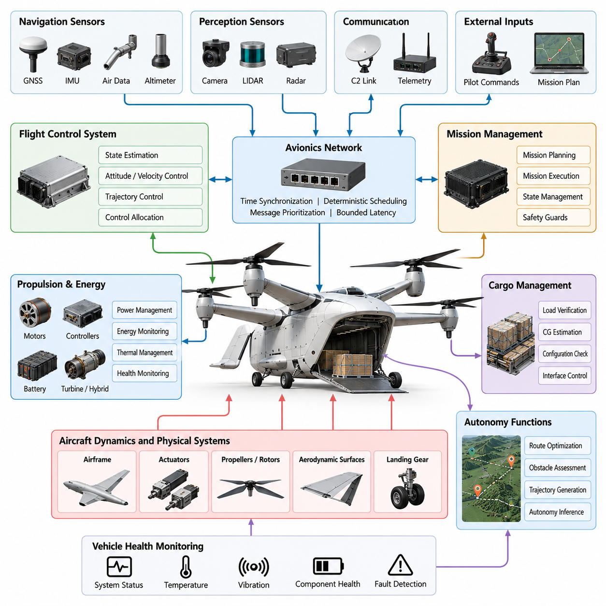{width="7.268055555555556in" height="7.268055555555556in"}

A 2.5-ton cargo UAV represents a transition from conventional small unmanned aircraft toward an autonomous aerial logistics platform capable of transporting substantial payloads over regional distances. Its system architecture must integrate flight-critical avionics, propulsion, navigation, cargo handling, communication, and mission autonomy while maintaining deterministic control behavior. The software architecture therefore treats the aircraft as a distributed cyber-physical system rather than as a single flight controller.

The aircraft configuration is typically organized around the required payload mass, maximum takeoff weight, operational range, cruise speed, hover or vertical-flight capability, and intended logistics environment. Depending on mission requirements, the platform may use multirotor, lift-plus-cruise, tilt-rotor, tilt-wing, or other VTOL configurations. These choices directly influence actuator count, aerodynamic transition logic, propulsion management, energy consumption, redundancy requirements, and the complexity of the flight-control software.

At the system level, the UAV can be divided into flight-critical control, mission autonomy, perception and navigation, propulsion and energy management, communication, cargo management, and vehicle health domains. These domains exchange information through explicitly defined interfaces rather than sharing unrestricted internal states. Such separation limits fault propagation and enables individual software components to be developed, verified, upgraded, and replaced without redesigning the entire aircraft software stack.

The flight-control system forms the deterministic core of the aircraft. It receives state estimates and pilot, autonomy, or mission commands and converts them into attitude, velocity, trajectory, and actuator-level commands. Inner control loops may operate at hundreds of hertz, while guidance and trajectory functions execute at lower frequencies. Control allocation distributes requested forces and moments among rotors, propellers, aerodynamic surfaces, or other effectors while respecting actuator and structural constraints.

Navigation software combines measurements from GNSS, inertial measurement units, air-data sensors, radar or laser altimeters, magnetometers, and other available sensors. Sensor fusion generates estimates of position, velocity, attitude, angular rate, altitude, and associated uncertainty. For a heavy cargo UAV, navigation integrity is as important as nominal accuracy because incorrect confidence in a degraded position solution can create greater operational risk than explicitly detecting that navigation performance has deteriorated.

Mission-management software converts logistics objectives into executable flight operations. A mission may include initialization, automated system checks, cargo verification, takeoff, climb, cruise, waypoint navigation, arrival sequencing, descent, landing, unloading, and return operations. Mission states are supervised by explicit transition conditions and safety guards so that high-level autonomy cannot directly issue unrestricted commands to flight-critical actuators or bypass aircraft protection mechanisms.

Cargo configuration strongly affects aircraft behavior because payload mass, center of gravity, inertia, and load distribution can change between missions. Cargo-management software therefore exchanges verified loading information with flight-control and mission systems before departure. Where supported by onboard sensing, the aircraft can estimate configuration changes and compare them against approved envelopes. Control parameters, trajectory limits, energy reserves, and landing constraints can then be adapted to the validated vehicle configuration.

Propulsion and energy management are integrated with flight software because a 2.5-ton aircraft requires substantial continuous power and must preserve adequate margins during takeoff, climb, transition, diversion, and landing. Depending on the platform, propulsion may be electric, hybrid-electric, turbine-based, or distributed across several propulsion units. Software continuously evaluates available power, thermal limits, component status, energy reserves, and degraded propulsion conditions before accepting demanding maneuver commands.

The avionics network connects flight computers, sensors, actuator controllers, propulsion controllers, communication units, payload systems, and health-monitoring equipment. Critical traffic must be separated from high-bandwidth noncritical data such as perception streams or maintenance logs. Deterministic scheduling, message prioritization, bounded latency, synchronized timestamps, and interface version control allow distributed software components to maintain a coherent representation of aircraft state even under heavy computational and network loads.

Time synchronization is particularly important when navigation, perception, and control data originate from physically distributed sensors. Each observation should retain a traceable acquisition timestamp rather than relying only on the time at which a software process receives the message. Hardware-assisted timestamping, synchronized clocks, and clearly defined timing contracts reduce temporal alignment errors that can otherwise appear as spatial estimation errors during rapid motion, vibration, or aggressive maneuvering.

The onboard computing architecture commonly separates safety-critical real-time processing from computationally intensive autonomy workloads. Flight-control computers execute deterministic functions with tightly controlled timing, while higher-performance processors may run perception, route optimization, obstacle assessment, machine-learning inference, or advanced mission reasoning. A controlled interface between these layers ensures that intelligent functions can recommend trajectories or objectives without gaining uncontrolled authority over safety-critical stabilization functions.

Redundancy is designed according to the consequence of individual failures rather than simply duplicating every component. Critical sensors, communication paths, power supplies, computing channels, and control interfaces may use dual or triple redundancy with independent monitoring. Voting, cross-channel comparison, heartbeat supervision, plausibility checking, and failover logic help detect inconsistent behavior. The architecture must also address common-cause failures so that apparently redundant channels do not depend on the same vulnerable resource.

Vehicle health management continuously evaluates the condition of avionics, propulsion, actuators, sensors, power systems, communication links, thermal systems, and structural monitoring channels. Raw fault flags are transformed into operationally meaningful health states that can influence mission decisions. Instead of responding identically to every anomaly, the system determines whether continued flight, mission abort, diversion, controlled landing, reduced-performance operation, or immediate emergency action is appropriate.

Communication architecture supports command and control, telemetry, fleet coordination, maintenance, and potentially airspace-management services. The UAV may combine line-of-sight radio, cellular networks, satellite communication, or other data links depending on operational range. Flight safety must not depend on uninterrupted high-bandwidth connectivity. Loss-of-link behavior is therefore defined in advance, with autonomous procedures for holding, rerouting, returning, landing, or transitioning to another communication channel.

External airspace integration requires the vehicle to exchange selected information with ground-control infrastructure and unmanned traffic management services while preserving onboard authority for immediate safety responses. Route authorization, geofencing, dynamic restrictions, weather constraints, traffic information, and landing-site status can influence mission planning. Nevertheless, external services should provide bounded inputs through validated interfaces rather than directly manipulating low-level vehicle-control functions.

Safety architecture establishes authority boundaries among remote operators, autonomous mission software, flight-control functions, and emergency protection mechanisms. Commands are validated against vehicle state, flight envelope, geospatial constraints, propulsion availability, and operational rules before execution. Independent monitors can reject unsafe requests or initiate predefined recovery behavior. This layered authority model prevents a single software defect, communication error, or incorrect high-level decision from immediately propagating to physical actuators.

Software configuration management is essential because the operational behavior of the aircraft depends on the exact combination of software versions, calibration data, vehicle parameters, maps, machine-learning models, and mission configuration. Each deployable aircraft configuration should therefore be uniquely identifiable and reproducible. Compatibility checks during startup prevent mismatched components from entering service, while signed software packages and controlled update mechanisms protect configuration integrity throughout the fleet lifecycle.

Ground systems complement the onboard architecture by supporting mission planning, fleet monitoring, maintenance, software deployment, data analysis, and operational supervision. The ground-control station should expose aircraft state and alerts without requiring operators to interpret large volumes of raw telemetry. Clear prioritization of warnings, mission deviations, energy margins, navigation integrity, and component health allows human supervisors to understand whether intervention is necessary during normal and degraded operations.

Verification begins with software components but expands progressively toward the complete aircraft configuration. Unit testing, interface testing, software-in-the-loop simulation, hardware-in-the-loop testing, processor-in-the-loop evaluation, fault injection, and integrated vehicle testing expose different classes of defects. High-fidelity simulation is especially valuable for testing rare combinations of propulsion faults, sensor degradation, communication loss, adverse weather, payload variation, and emergency transitions that are difficult or unsafe to reproduce repeatedly in flight.

The complete 2.5-ton cargo UAV should ultimately be viewed as an integrated autonomous transportation system whose software coordinates physical aircraft capabilities under explicit safety constraints. Robust architecture depends on deterministic control, trustworthy state estimation, bounded autonomy, redundant critical resources, configuration awareness, health monitoring, secure communication, and disciplined verification. These principles provide the foundation for scaling cargo UAV operations from individual experimental aircraft toward dependable fleet-level logistics services.

## 10.02. 2.5t FCC HW SW Architecture Specifics [w/Code]

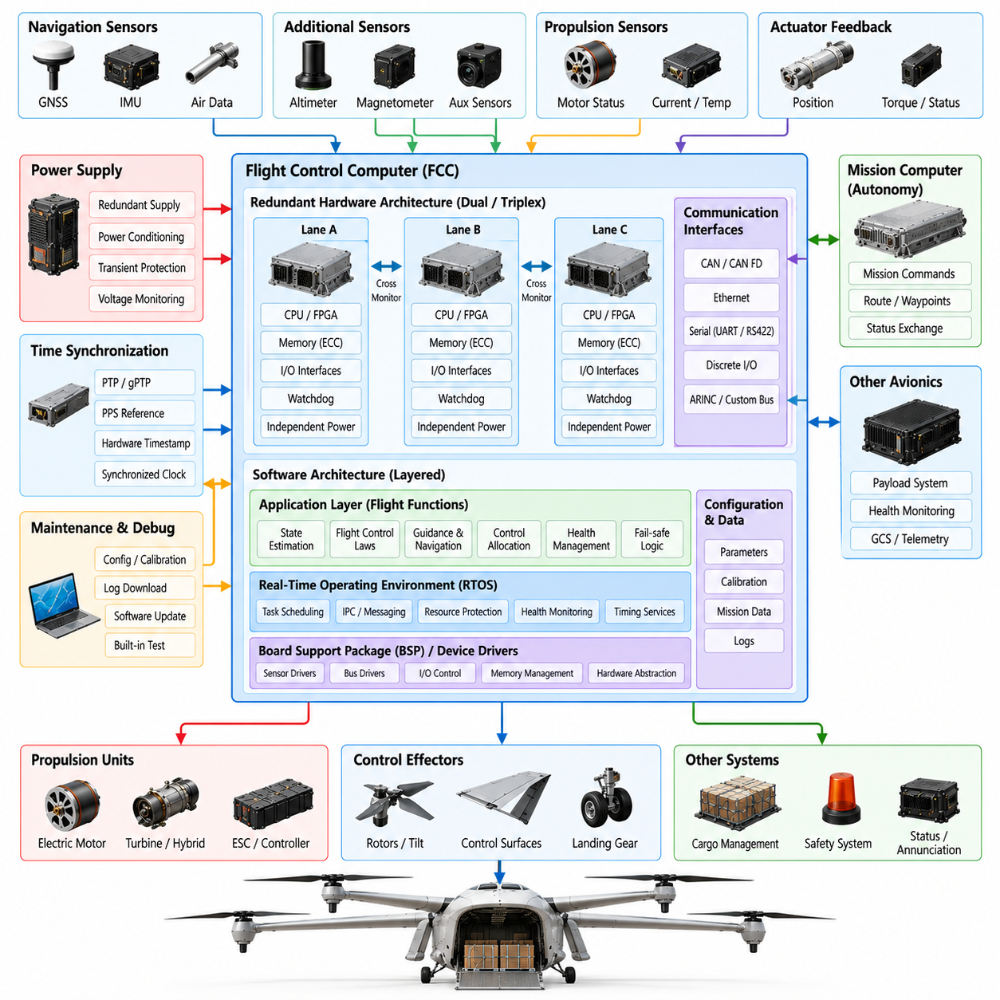{width="7.268055555555556in" height="7.268055555555556in"}

The Flight Control Computer (FCC) of a 2.5-ton cargo UAV is the deterministic computing core responsible for maintaining stable and safe flight under normal, degraded, and emergency conditions. Unlike mission computers that may execute computationally intensive autonomy functions, the FCC prioritizes bounded execution time, predictable latency, fault containment, and continuous availability. Its hardware and software are therefore designed together as a flight-critical platform.

FCC hardware architecture is determined by aircraft hazard analysis, control-loop timing, sensor and actuator interfaces, redundancy objectives, and environmental requirements. A practical architecture may employ dual or triplex processing lanes, each containing an independent processor, memory, power conditioning, clock source, watchdog, and communication interface. Physical and electrical separation reduces the possibility that a single power, thermal, or interface failure disables multiple control channels simultaneously.

The processing device must provide sufficient deterministic performance rather than simply maximizing computational throughput. Real-time CPUs, safety-oriented microcontrollers, multicore processors with controlled resource partitioning, or combinations of CPU and FPGA logic may be employed. Hardware acceleration can handle deterministic I/O, timestamping, signal conditioning, or control-related preprocessing, while flight-control algorithms remain within an execution environment whose worst-case timing behavior can be analyzed and verified.

Memory architecture separates executable code, calibration parameters, runtime state, communication buffers, and maintenance information according to their criticality. Error-correcting code memory, memory protection, lockstep mechanisms, and protected nonvolatile storage may be used to detect or tolerate corruption. Boot images and configuration data require integrity verification so that the FCC cannot enter operational mode with damaged software, incompatible parameters, or an unauthorized executable image.

The FCC power architecture normally includes independent regulated supplies, transient protection, undervoltage and overvoltage monitoring, and controlled reset behavior. Where redundant FCC lanes are used, power independence should extend as far upstream as practical. The software continuously observes power-good signals and reset causes, allowing the system to distinguish normal startup from brownout, watchdog reset, or abnormal power interruption and select an appropriate recovery state.

Sensor interfaces connect the FCC to inertial measurement units, GNSS receivers, air-data systems, altimeters, magnetometers, actuator feedback devices, and propulsion sensors. Interfaces may include deterministic serial buses, CAN-based networks, Ethernet, discrete signals, or aircraft-specific data buses. Each input is validated for range, freshness, timing, sequence, integrity, and plausibility before it is admitted into safety-critical state estimation or control calculations.

Actuator interfaces require particularly strict timing because delayed or inconsistent commands can destabilize a heavy aircraft. The FCC generates commands for propulsion units, control surfaces, rotor mechanisms, brakes, or other effectors according to the vehicle configuration. Command messages include validity information and may be monitored by local actuator controllers. Feedback closes the supervisory loop by reporting actual position, speed, torque, current, temperature, and fault conditions.

Time synchronization provides a common temporal reference across redundant computers and distributed sensors. The FCC should preserve the acquisition time of sensor measurements rather than assigning significance only to message reception time. Hardware timestamps, synchronized clocks, pulse-per-second references, PTP or gPTP mechanisms, and deterministic trigger signals can be used where appropriate to maintain temporal consistency between sensing, state estimation, control computation, and actuation.

The FCC software stack is usually layered so that hardware-specific functions remain isolated from aircraft-control applications. A board support package and device drivers manage processors, timers, buses, interrupts, memory, and low-level I/O. Above this layer, the real-time operating environment provides scheduling, inter-process communication, health monitoring, resource protection, and timing services. Flight applications then execute through stable, explicitly controlled interfaces.

Real-time scheduling assigns execution periods, priorities, deadlines, and computational budgets to flight functions. High-rate inertial acquisition and stabilization loops may execute significantly faster than navigation, guidance, health management, or communication tasks. The architecture must prevent lower-criticality activity from delaying flight-control execution. Rate groups and partitioned scheduling provide a predictable relationship between sensor acquisition, estimation, control-law execution, command generation, and output transmission.

State estimation converts heterogeneous sensor measurements into a coherent representation of aircraft motion. The FCC may execute attitude and heading estimation, position and velocity fusion, air-data processing, altitude estimation, and sensor-bias compensation. Redundant measurements are compared before or during fusion, while innovation tests and consistency checks identify measurements that no longer agree with expected aircraft dynamics or with independent sensing channels.

Flight-control laws transform desired aircraft motion into commanded forces and moments. Depending on configuration, software may include attitude stabilization, angular-rate control, vertical control, velocity control, position control, transition control, and fixed-wing or rotorcraft-specific functions. Gain scheduling and configuration-dependent parameters allow the controller to accommodate changes in airspeed, payload, center of gravity, propulsion state, and aerodynamic operating regime.

Control allocation translates requested forces and moments into individual effector commands while respecting actuator limits. For a distributed-propulsion cargo UAV, this may involve simultaneous management of multiple motors, propellers, aerodynamic surfaces, and tilting mechanisms. Allocation algorithms consider saturation, rate limits, failed effectors, available propulsion authority, and configuration constraints so that the achievable command remains dynamically consistent with the aircraft\'s current capability.

Redundant FCC lanes must determine whether their computed states and commands remain mutually consistent. Cross-channel data links support comparison of sensor validity, estimated states, mode status, health information, and control outputs. Depending on the architecture, agreement may be established through voting, monitored command selection, master-monitor arrangements, or distributed consensus mechanisms. Divergence beyond defined thresholds causes isolation or reconfiguration rather than uncontrolled competition.

Fault detection, isolation, and recovery are integrated throughout the FCC rather than implemented as a single diagnostic task. Watchdogs detect stalled execution, deadline monitors identify timing violations, communication monitors detect stale data, and numerical checks detect invalid computations. Sensor and actuator monitors evaluate physical plausibility. When a fault is confirmed, recovery logic isolates the affected resource and transitions to a verified degraded configuration.

Mode management coordinates startup, initialization, ground operation, takeoff, climb, cruise, transition, approach, landing, and emergency states. Each transition is protected by explicit guards derived from aircraft state and subsystem readiness. Mission software may request a mode change, but the FCC retains authority to reject commands that conflict with safety conditions. This prevents high-level autonomy or ground commands from forcing the vehicle into an invalid dynamic configuration.

The interface between the FCC and mission or autonomy computer is intentionally constrained. High-level computers typically provide trajectory references, velocity commands, waypoints, or bounded maneuver requests rather than direct actuator commands. The FCC validates these requests against flight-envelope limits, navigation integrity, propulsion capability, geofencing constraints, and current operating mode before acceptance. Loss or restart of the autonomy computer therefore does not eliminate basic aircraft stabilization.

FCC software also includes envelope protection to prevent commands from exceeding verified aircraft limits. Depending on vehicle configuration, protected variables can include attitude, angular rate, airspeed, load factor, vertical speed, rotor speed, motor current, structural load, and available control margin. Protection logic should coordinate with control laws rather than abruptly clipping commands in ways that could create secondary instability or undesirable transient behavior.

Startup software establishes a known trusted state before enabling flight functions. Boot-time tests verify processor operation, memory integrity, clocks, communication interfaces, stored configuration, software identity, and essential I/O. Built-in tests continue during operation at rates compatible with flight safety. Failures discovered during initialization prevent arming or propulsion activation, while in-flight failures are handled through predefined reconfiguration and recovery strategies.

Data logging within the FCC supports verification, maintenance, incident reconstruction, and fleet reliability analysis without interfering with real-time control. Selected sensor values, estimated states, commands, mode transitions, timing statistics, faults, and configuration identifiers are recorded with synchronized timestamps. Logging bandwidth and storage activity must be bounded so that diagnostic functions cannot consume resources required by safety-critical computation or communication.

Software configuration is tightly coupled to the specific aircraft hardware configuration. Each FCC load should identify compatible processor revisions, interface definitions, control-law parameters, sensor calibrations, actuator configurations, and aircraft variants. Configuration control prevents an executable validated for one propulsion or aerodynamic configuration from being inadvertently installed on another. Secure boot and authenticated updates can additionally protect the operational software baseline.

Verification of the FCC architecture combines requirements-based testing with structural, timing, robustness, and fault-response evaluation. Software-in-the-loop testing validates control logic before hardware integration, while processor-in-the-loop and hardware-in-the-loop environments expose real execution timing and electrical interfaces. Fault injection evaluates sensor loss, processor reset, network delay, actuator failure, memory errors, and disagreement among redundant channels without intentionally endangering an aircraft.

The completed FCC hardware-software architecture must provide predictable control even when surrounding systems become unreliable. Its effectiveness is measured not only by nominal flight performance but also by its ability to detect faults, preserve temporal integrity, contain failures, reconfigure safely, and maintain sufficient control authority. For a 2.5-ton cargo UAV, this deterministic and independently protected FCC foundation enables advanced autonomy to be added without compromising the fundamental safety of the aircraft.

## 10.03. 2.5t Propulsion Motor ESC Control SW [w/Code]

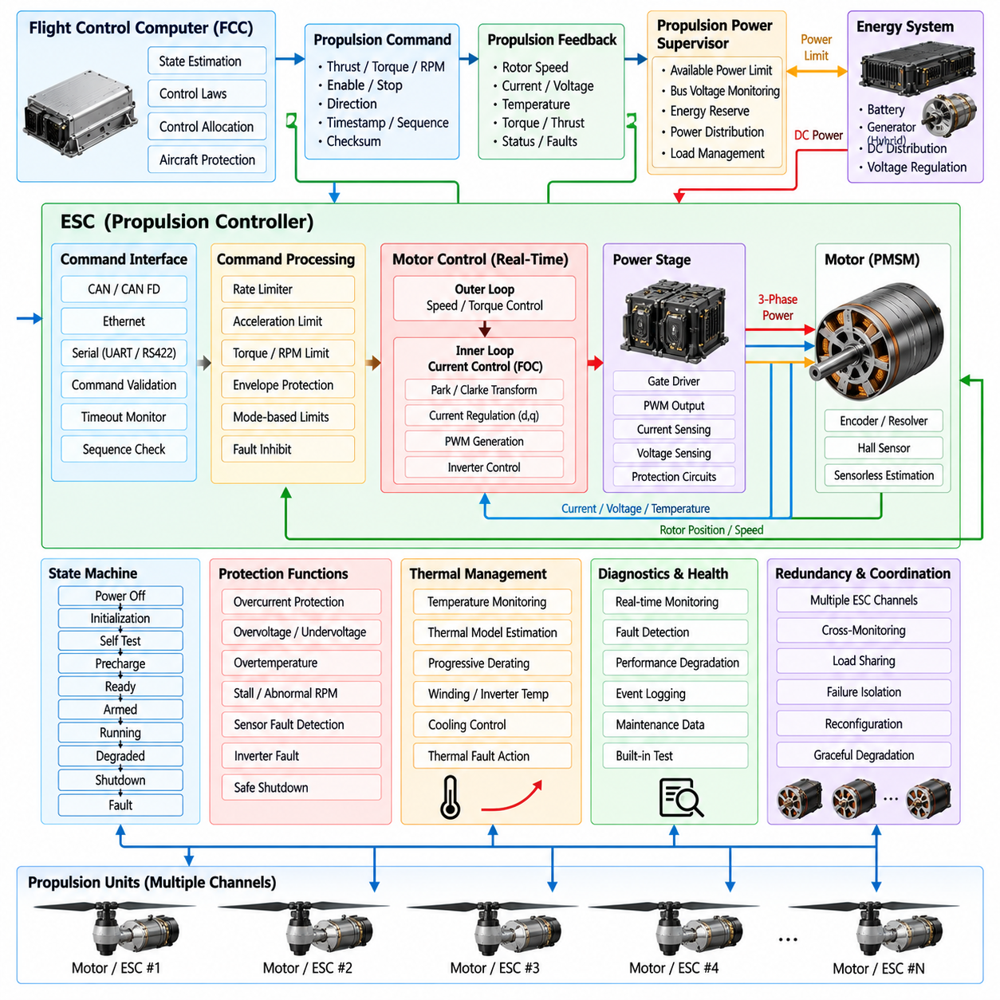{width="7.268055555555556in" height="7.268055555555556in"}

The propulsion control software of a 2.5-ton cargo UAV forms the real-time interface between flight-control commands and the physical generation of thrust. Because propulsion units carry a large aircraft mass and may operate continuously near demanding power levels, motor and Electronic Speed Controller (ESC) software must provide deterministic response, accurate torque or speed regulation, fault containment, thermal protection, and coordinated behavior across multiple propulsion channels.

The propulsion architecture depends on whether the aircraft uses distributed electric propulsion, hybrid-electric propulsion, or electrically actuated lift units combined with separate cruise propulsion. Each motor-ESC channel is treated as an independently monitored propulsion resource. The Flight Control Computer (FCC) requests thrust, torque, rotor speed, or normalized actuator demand, while local propulsion controllers translate these commands into electrically realizable motor operation.

A hierarchical control structure separates aircraft-level force generation from motor-level electrical control. The FCC determines the total forces and moments required for stabilization and trajectory tracking, and control allocation distributes them among available propulsion units. Each ESC then performs high-frequency current, torque, speed, or voltage regulation. This separation prevents the FCC from having to execute switching-level motor control while preserving centralized authority over aircraft dynamics.

For permanent-magnet synchronous motors or similar high-power machines, Field-Oriented Control (FOC) can regulate motor torque through transformed current components aligned with rotor magnetic position. Current loops typically operate substantially faster than aircraft control loops, allowing the ESC to reject electrical disturbances before they affect vehicle dynamics. Rotor position may be obtained from encoders, resolvers, Hall sensors, or validated sensorless estimation depending on reliability requirements.

Command interfaces between the FCC and ESC must be deterministic and explicitly bounded. Commands can contain requested torque, rotational speed, thrust-equivalent demand, enable state, direction information, and command-validity metadata. Sequence counters, timestamps, checksums, timeout supervision, and source identification help detect duplicated, corrupted, delayed, or stale messages. Invalid commands are rejected rather than propagated directly into high-power switching hardware.

Propulsion feedback provides the FCC with information required to estimate actual control authority. Relevant measurements include rotor speed, motor current, DC-link voltage, electrical power, estimated torque, winding temperature, inverter temperature, bearing condition, and ESC fault status. The control system compares commanded and achieved propulsion response so that a motor that remains electrically active but produces insufficient thrust can still be identified as degraded.

Motor command shaping is necessary because instantaneous thrust changes can impose excessive electrical, thermal, mechanical, or structural loads. Software applies rate limits, acceleration limits, torque limits, and operating-envelope constraints before commands reach the inner motor controller. These limits may vary with rotor speed, bus voltage, temperature, battery state, aircraft mode, and structural loading so that available propulsion performance is used without violating verified hardware boundaries.

The ESC state machine governs progression through power-off, initialization, self-test, precharge, ready, armed, running, degraded, shutdown, and fault states. Transitions require explicit conditions rather than relying only on command reception. Before enabling torque production, software verifies supply voltage, gate-driver status, sensor validity, communication integrity, temperature, rotor state, and configuration compatibility. Unexpected conditions cause controlled inhibition or shutdown.

Precharge and high-voltage sequencing are particularly important for high-power electric propulsion. Large DC-link capacitors can produce damaging inrush current if connected abruptly to the main energy source. Propulsion software coordinates contactors, precharge circuits, voltage measurements, and readiness signals before enabling the inverter. Incorrect voltage convergence, welded contactors, or unexpected bus energization must be detected before the propulsion channel enters an operational state.

Thermal management software protects motors and power electronics from cumulative heating that may not be visible in instantaneous electrical measurements. Temperature sensors and thermal models can estimate winding, magnet, inverter, and junction temperatures. Rather than relying exclusively on abrupt shutdown thresholds, the controller can progressively derate available torque or power as thermal margin decreases, allowing the aircraft-level controller to adapt before propulsion capability becomes critically limited.

Energy and power management must coordinate multiple ESCs sharing batteries, generators, converters, or DC distribution buses. Simultaneous maximum commands from several propulsion units may exceed available source power even when each motor remains within its individual rating. A propulsion power supervisor therefore communicates available power limits to control allocation, allowing thrust distribution to respect bus current, source capability, voltage stability, and energy reserve constraints.

Voltage disturbances require coordinated response because sudden propulsion demand can cause DC-bus sag, while rapid regenerative behavior can create overvoltage. ESC software monitors supply conditions and modifies torque requests when electrical limits are approached. If regenerative operation is supported, recovered energy must remain compatible with battery acceptance capability and bus architecture. Otherwise, braking strategies must avoid forcing uncontrolled energy back into a source unable to absorb it.

Redundant propulsion architectures require software to distinguish local motor faults from system-level loss of control authority. Failure of one propulsion channel does not necessarily require immediate mission termination if remaining effectors can generate adequate forces and moments. The affected ESC reports its capability state, and the FCC updates control allocation using the remaining propulsion set. This transition must occur rapidly enough to prevent excessive attitude or altitude deviation.

Fault detection covers electrical, mechanical, computational, communication, and thermal abnormalities. Typical monitored conditions include overcurrent, overvoltage, undervoltage, overspeed, stalled rotor, phase imbalance, sensor disagreement, excessive temperature, gate-driver faults, communication timeout, processor watchdog events, and command-tracking errors. Fault logic should use persistence and plausibility criteria where appropriate so that transient measurement noise does not unnecessarily disable a healthy propulsion unit.

Fault isolation is essential because shutting down the wrong motor can worsen an already degraded aircraft condition. Cross-checking commanded torque, measured phase current, rotor acceleration, vibration, and estimated thrust can help distinguish an electrical controller fault from propeller damage or mechanical transmission failure. Each diagnosed condition is mapped to a defined response such as warning, derating, controlled shutdown, immediate isolation, or continued operation under restricted limits.

For multirotor or distributed-lift configurations, propulsion synchronization can influence vibration, structural loading, acoustic behavior, and sensor quality. Software may coordinate rotor-speed operating regions or avoid persistent excitation near known structural resonances. Such coordination remains subordinate to flight-control requirements; maintaining attitude and thrust authority takes precedence over acoustic or vibration optimization whenever the objectives conflict.

Propulsion software must also manage transitions between operating regimes. A lift-plus-cruise or tilt-based cargo UAV may redistribute propulsion demand substantially during takeoff, conversion, cruise, approach, and landing. Motors that provide primary lift during hover may become unloaded or stopped during cruise, while cruise propulsion assumes greater responsibility. State-dependent sequencing prevents abrupt torque redistribution and ensures adequate control authority throughout transition.

Communication between the FCC and propulsion controllers should separate fast command and feedback traffic from slower diagnostic and maintenance information. The fast path carries time-critical commands, measured response, validity, and fault state with bounded latency. The slow path carries detailed temperatures, lifetime counters, event records, calibration information, and maintenance diagnostics. This separation prevents large diagnostic transfers from interfering with flight-critical propulsion traffic.

Propulsion configuration data includes motor electrical parameters, pole count, current limits, speed limits, thermal thresholds, sensor calibration, inverter characteristics, propeller or rotor properties, and aircraft-specific operating restrictions. Configuration identity must be checked against the physical propulsion unit during initialization. Incorrect parameter sets can produce unsafe torque estimation or protection behavior even when the executable software itself is functioning correctly.

Built-in test functions verify propulsion readiness before flight and monitor critical functions during operation. Startup tests can check memory, processor health, current sensors, voltage sensors, temperature channels, rotor-position sensing, communication, gate drivers, and contactor feedback. Continuous tests detect evolving failures while respecting real-time execution budgets. Maintenance-oriented tests may exercise additional diagnostics only when propulsion is safely inhibited on the ground.

Propulsion data logging records commands, measured speed, current, voltage, temperatures, power, fault transitions, derating events, and controller timing with synchronized timestamps. These records support post-flight analysis, predictive maintenance, and investigation of transient events. For a fleet of cargo UAVs, aggregated propulsion histories can reveal gradual efficiency loss, recurring thermal stress, bearing degradation, or ESC behavior that may not trigger an immediate onboard fault.

Software verification begins with motor and inverter models and progresses through controller simulation, processor testing, power hardware benches, dynamometers, Hardware-in-the-Loop (HIL) environments, integrated propulsion rigs, and aircraft testing. Fault injection should reproduce sensor failures, communication loss, bus-voltage disturbances, thermal limits, rotor blockage, and individual propulsion-channel failures. Testing must confirm both local ESC protection and the resulting aircraft-level reconfiguration behavior.

The completed motor and ESC control software must make propulsion behavior predictable to the flight-control system across the full operational envelope. Accurate command tracking is important, but safe limitation, transparent capability reporting, deterministic fault response, and graceful degradation are equally critical. In a 2.5-ton cargo UAV, propulsion software therefore functions not merely as a motor driver but as a distributed safety-critical control layer linking electrical power, physical thrust, and vehicle-level flight authority.

## 10.04. 2.5t Flight Envelope and Control Law [w/Code]

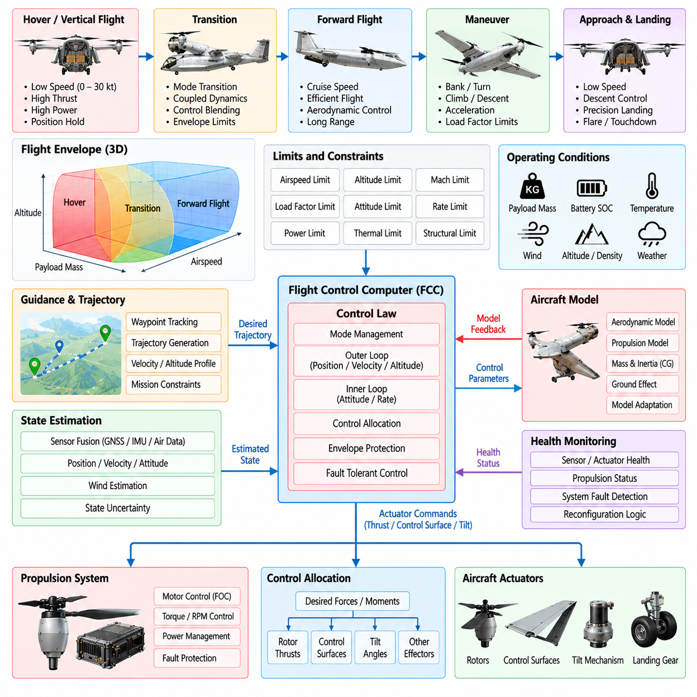{width="7.268055555555556in" height="7.268055555555556in"}

The flight envelope of a 2.5-ton cargo UAV defines the verified combinations of speed, altitude, attitude, load factor, payload condition, center of gravity, propulsion capability, and environmental state within which controlled flight can be maintained. Control-law software must keep the aircraft inside these boundaries while providing adequate maneuverability for takeoff, transition, cruise, approach, landing, and emergency operation.

Unlike a small UAV, a heavy cargo platform experiences substantial inertial, aerodynamic, structural, and propulsion loads during maneuvering. Its permissible operating region therefore cannot be represented by a single speed or attitude limit. The envelope is multidimensional and changes with aircraft configuration, payload mass, center-of-gravity location, energy state, atmospheric density, actuator availability, and propulsion degradation.

Flight-envelope data are derived from aerodynamic analysis, structural limits, propulsion performance, simulation, ground testing, and progressive flight testing. Each validated configuration establishes boundaries for variables such as airspeed, angle of attack, sideslip, bank angle, pitch attitude, vertical speed, rotor speed, motor torque, load factor, and control-surface deflection. Software converts these engineering limits into enforceable operational constraints.

The control-law architecture is normally hierarchical. Inner loops regulate angular rate and attitude, intermediate loops control velocity and flight-path variables, and outer loops track position or trajectory references. This hierarchy separates rapid stabilization from slower guidance objectives. Each layer receives bounded commands from the layer above and produces references for the layer below while respecting dynamic and actuator constraints.

Angular-rate control forms one of the fastest aircraft-level feedback loops. Gyroscope measurements are compared with commanded body rates, and the resulting error is converted into required roll, pitch, and yaw moments. Controller gains must provide sufficient disturbance rejection without exciting flexible structural modes, propulsion dynamics, or sensor noise. Filtering and phase-margin requirements therefore become increasingly important as vehicle size grows.

Attitude control converts desired roll, pitch, and heading behavior into angular-rate commands. Quaternion-based or equivalent representations can avoid mathematical singularities during large attitude changes. Command shaping limits attitude acceleration and rate so that trajectory requests do not generate abrupt structural or propulsion demands. Attitude references are also constrained according to airspeed, altitude, payload, and current flight mode.

Velocity and position control operate above the attitude layer and determine the forces required to follow a commanded trajectory. Translational controllers account for gravity, estimated aerodynamic effects, wind, and available thrust. The resulting force vector is converted into attitude and propulsion references. Position tracking performance must remain subordinate to stability and envelope protection, particularly when environmental disturbances exceed available control authority.

For VTOL or distributed-lift configurations, vertical control requires accurate coordination between total thrust, vehicle mass, vertical velocity, and altitude estimates. Payload variation significantly changes the thrust required to hover and climb. Adaptive mass estimation or configuration-specific parameters can improve performance, but such adaptation must remain bounded so that incorrect estimates cannot command propulsion beyond verified limits.

Transition flight introduces one of the most demanding control-law regions for lift-plus-cruise, tilt-rotor, or tilt-wing aircraft. Control authority shifts between rotor-generated forces and aerodynamic surfaces as airspeed increases or decreases. The software schedules gains, actuator priorities, and force allocation according to transition state so that no discontinuity occurs when one control mechanism becomes more effective than another.

Gain scheduling allows a common control architecture to operate across substantially different dynamic conditions. Controller gains may vary with airspeed, dynamic pressure, rotor speed, aircraft mass, center of gravity, tilt angle, or flight mode. Scheduled values are derived from validated models and tests, and interpolation between operating points must remain smooth. Uncontrolled extrapolation beyond the validated scheduling domain is prohibited.

Control allocation converts desired forces and moments into commands for available propulsion units and aerodynamic effectors. The allocation problem becomes increasingly important when the aircraft contains many motors or redundant surfaces. Software considers effectiveness matrices, actuator saturation, rate limits, energy constraints, and failures while attempting to preserve the highest-priority control objectives, particularly attitude and vertical-flight authority.

Actuator saturation must be explicitly considered because a controller can remain mathematically stable while requesting forces that the aircraft cannot physically generate. Anti-windup logic, command limiting, and achievable-command estimation prevent internal controller states from accumulating excessive error during saturation. The system also reports diminishing control margin so that guidance or mission software can reduce maneuver demand before authority is exhausted.

Envelope protection supervises commands before they develop into unsafe aircraft states. Depending on configuration, protection may limit excessive bank, pitch, angular rate, angle of attack, sideslip, airspeed, descent rate, rotor speed, structural load, or propulsion demand. Protection should modify commands progressively when possible, preserving predictable handling rather than producing abrupt interventions that could themselves destabilize the vehicle.

Airspeed protection is particularly important for aircraft that rely on aerodynamic surfaces during cruise. Low-speed protection prevents guidance commands from driving the aircraft toward insufficient aerodynamic control authority or stall conditions, while high-speed protection prevents excessive dynamic pressure and structural loading. The applicable boundaries may change with payload, altitude, flap configuration, propulsion status, and atmospheric conditions.

Structural-envelope protection limits maneuver loads that could damage the airframe or cargo restraint system. Heavy payloads may alter bending moments and dynamic response even when total aircraft mass remains within limits. Control software can constrain acceleration, angular rate, bank angle, and command slew rates according to validated loading configurations. Cargo-specific restrictions may therefore become part of the active flight-control configuration.

Center-of-gravity variation directly affects stability, trim requirements, and actuator authority. Before flight, payload information is used to verify that the estimated center of gravity remains within the approved range. During operation, consistency between expected and observed control behavior can reveal configuration errors or cargo movement. If available control margin decreases unexpectedly, the aircraft can impose tighter maneuver restrictions or initiate recovery procedures.

Wind and atmospheric disturbances must be distinguished from aircraft instability. State estimation and control laws use inertial, air-data, GNSS, and other measurements to estimate motion relative to both the atmosphere and the ground. Gust rejection is balanced against actuator bandwidth and structural limitations. Excessively aggressive disturbance compensation can increase loads, energy consumption, and actuator wear without meaningfully improving mission performance.

Propulsion degradation dynamically changes the usable flight envelope. Loss or derating of a motor can reduce maximum climb rate, yaw authority, hover capability, or allowable bank angle. The fault-management system communicates available propulsion capability to control allocation and envelope management. Instead of continuing to use nominal limits, the aircraft transitions to a degraded envelope representing the forces and moments that remain achievable.

Sensor degradation can similarly require modification of control-law behavior. Loss of an air-data source, GNSS degradation, or disagreement among inertial sensors may make certain control modes unavailable even when basic stabilization remains possible. Mode logic therefore associates each flight mode with required sensor integrity. When those requirements are no longer satisfied, the FCC automatically transitions to a verified fallback mode with appropriately restricted commands.

Emergency control laws are designed for conditions in which nominal performance objectives are no longer achievable. Their purpose is to preserve essential stability, controllability, and survivability rather than maintain precise trajectory tracking. Depending on the failure, the system may prioritize attitude stabilization, arrest of descent, reduced-speed flight, controlled diversion, immediate landing, or minimum-risk termination according to predefined safety logic.

Mode transitions must avoid discontinuities in controller states and actuator commands. Integrator initialization, reference blending, bumpless transfer, gain interpolation, and command synchronization are used when changing between hover, transition, cruise, approach, degraded, or emergency modes. Without these mechanisms, a logically correct mode change could generate a sudden control transient large enough to violate the flight envelope.

The control-law software continuously calculates or estimates control margin rather than relying solely on fixed limit thresholds. Remaining thrust, actuator travel, torque capacity, energy availability, and aerodynamic authority provide indicators of how close the vehicle is to losing controllability. These margins can be exposed to guidance and mission management so that high-level planning avoids trajectories requiring nearly exhausted physical capability.

Verification of flight-envelope and control-law software begins with analytical models and progresses through nonlinear simulation, Monte Carlo analysis, Software-in-the-Loop, Hardware-in-the-Loop, iron-bird or integrated rig testing, and controlled flight expansion. Uncertainties in mass, center of gravity, aerodynamics, sensor errors, wind, latency, and propulsion performance are systematically varied to identify combinations that challenge stability or envelope compliance.

Flight-envelope expansion is performed progressively rather than assuming that simulation results alone establish safe boundaries. Initial flights remain within conservative regions, and validated limits are expanded as measured aircraft response confirms model predictions. Recorded control margins, structural loads, actuator behavior, and propulsion performance are compared with acceptance criteria before additional portions of the operational envelope are released.

The completed flight-envelope and control-law architecture must provide predictable behavior from normal operation through severe degradation. Its purpose is not merely to follow pilot or autonomy commands accurately, but to determine which commands remain physically safe and achievable. For a 2.5-ton cargo UAV, this protected control layer ensures that increasing autonomy and mission complexity remain bounded by verified aerodynamic, structural, propulsion, and controllability limits.

## 10.05. 2.5t Navigation and Autonomy Stack [w/Code]

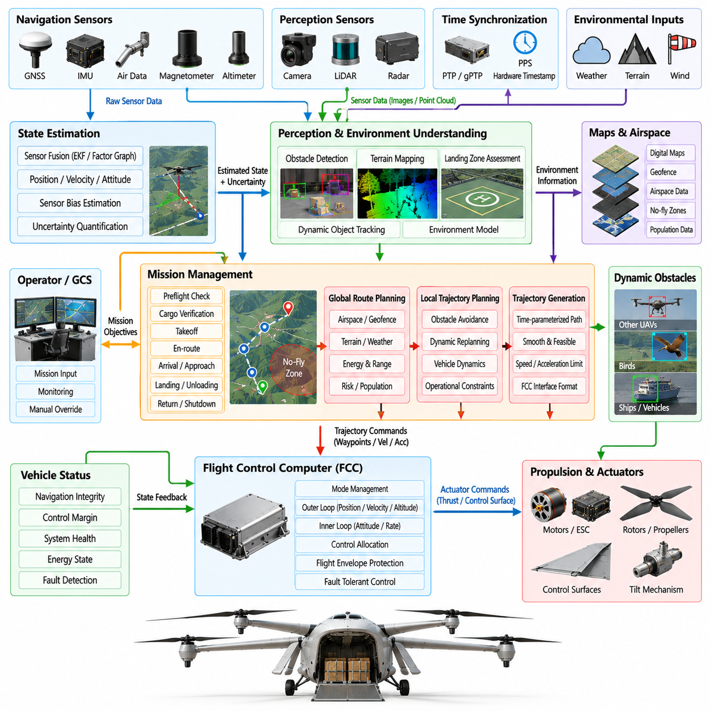{width="7.268055555555556in" height="7.268055555555556in"}

The navigation and autonomy stack of a 2.5-ton cargo UAV converts sensor observations, mission objectives, airspace constraints, and vehicle capability into safe trajectory commands. Because the aircraft carries substantial kinetic energy and payload value, autonomy cannot be treated as an unrestricted decision layer. Navigation integrity, deterministic safety boundaries, fault-aware planning, and controlled interfaces to the Flight Control Computer (FCC) are fundamental architectural requirements.

The navigation architecture begins with synchronized acquisition of inertial, satellite, air-data, altitude, and environmental measurements. Typical sources include multiple Inertial Measurement Units (IMUs), GNSS receivers, magnetometers, barometric sensors, radar or laser altimeters, cameras, and LiDAR. Each observation is associated with acquisition time, validity, calibration state, and uncertainty before it is admitted into estimation or autonomy processing.

Time alignment is critical because measurements arriving through different buses and processors may represent different physical instants. Hardware timestamps, Pulse-Per-Second references, PTP or gPTP synchronization, and deterministic trigger mechanisms can establish a common temporal basis. The stack preserves measurement provenance so that delayed camera frames or network packets are not incorrectly fused with newer inertial states as though they were simultaneous.

State estimation transforms heterogeneous observations into a coherent estimate of position, velocity, attitude, angular rate, altitude, sensor bias, and associated uncertainty. Extended Kalman filtering, error-state filtering, factor-graph methods, or other validated estimators may be employed according to computational and assurance requirements. The estimator must report not only a best state estimate but also whether that estimate remains sufficiently trustworthy for the active flight mode.

Navigation integrity monitoring evaluates consistency among redundant and dissimilar sensors. GNSS solutions can be checked against inertial propagation, air-data behavior, terrain-relative altitude, visual motion, or other independent observations. Innovation residuals, covariance growth, range checks, temporal consistency, and cross-channel comparison help identify corrupted measurements. Suspect information is isolated before it can significantly distort the flight-control state.

GNSS-dependent operation requires explicit handling of signal blockage, multipath, interference, spoofing indicators, and loss of correction services. Rather than treating GNSS as permanently available, the architecture defines degraded-navigation modes with bounded duration and operational restrictions. Inertial propagation, visual-inertial odometry, terrain-relative navigation, radar measurements, or other aiding sources can maintain limited navigation capability until trustworthy absolute positioning is recovered.

Perception expands navigation beyond vehicle-state estimation by constructing information about surrounding terrain, obstacles, landing areas, weather-related hazards, and dynamic traffic. Cameras, LiDAR, radar, and map data may be processed by high-performance autonomy computers. Perception outputs are represented with confidence and timestamp information so that planning software can distinguish confirmed hazards from uncertain or outdated environmental observations.

The autonomy stack is separated from the flight-critical stabilization layer. High-level autonomy determines mission phases, routes, trajectories, landing approaches, and contingency actions, while the FCC maintains attitude, velocity, and flight-envelope protection. The autonomy computer therefore sends bounded trajectory, waypoint, velocity, or maneuver requests rather than unrestricted actuator commands. This separation limits the consequences of autonomy software faults or processor restarts.

Mission management converts logistics objectives into a sequence of executable operational states. A typical mission includes preflight validation, cargo confirmation, propulsion readiness, takeoff, departure, climb, en-route navigation, arrival, approach, landing, cargo transfer, and return or shutdown. Each transition depends on explicit vehicle, navigation, airspace, and subsystem conditions rather than simply advancing according to elapsed time or planned sequence.

Global route planning determines a feasible path between origin and destination while considering terrain, controlled airspace, geofences, population exposure, weather, energy requirements, communication coverage, emergency landing options, and aircraft performance. The selected route should preserve operational margins rather than merely minimize distance. Alternative routes can be retained so that the vehicle can rapidly respond when conditions invalidate the primary plan.

Local trajectory planning converts the global route into dynamically achievable motion over a shorter horizon. It considers aircraft speed, acceleration, turn radius, climb capability, actuator limits, wind, obstacle geometry, and current control margin. For a heavy cargo UAV, aggressive avoidance maneuvers may be physically inappropriate even when geometrically possible, so the planner must account for vehicle dynamics and structural limitations when selecting trajectories.

Trajectory generation produces time-parameterized references that the FCC can track without violating acceleration, jerk, attitude, thrust, or airspeed constraints. Smoothness is particularly important for heavy aircraft because discontinuous references can create large structural and propulsion transients. The trajectory interface therefore includes validity periods, reference timing, and constraints that allow the FCC to reject or reshape commands that exceed verified capability.

Dynamic obstacle avoidance uses perception and traffic information to predict potential conflicts rather than reacting only to current obstacle position. Relative motion, uncertainty, aircraft maneuverability, and required separation are considered when evaluating avoidance actions. The system selects maneuvers early enough to remain within comfortable control margins, because late aggressive avoidance can create greater risk for a 2.5-ton aircraft than the original conflict.

Landing-site assessment requires more than geographic coordinates. The autonomy stack evaluates approach geometry, surface condition, slope, obstacle clearance, available dimensions, wind, navigation confidence, and potentially people or vehicles near the landing area. Sensor-based confirmation can be compared with stored site data before committing to descent. If required criteria are not satisfied, the aircraft can hold, select an alternate site, or abort the approach.

Precision landing may combine GNSS, inertial sensing, visual landmarks, fiducial targets, LiDAR, radar, or relative navigation depending on operational infrastructure. As the vehicle approaches the ground, navigation requirements become increasingly local and safety critical. The system must distinguish genuine landing references from false detections and maintain a defined response for loss of precision guidance during descent, including stabilization, climb-out, or go-around.

Airspace integration provides the autonomy stack with route authorization, geofencing, traffic information, temporary restrictions, and Unmanned Traffic Management (UTM) services where available. External information is treated as validated mission input rather than direct flight-control authority. If connectivity to an external service is lost, onboard logic retains sufficient information and predefined rules to continue, hold, divert, return, or land safely.

Weather information influences both strategic and tactical autonomy. Forecast wind, precipitation, visibility, temperature, icing risk, and convective activity can affect route selection before departure, while onboard observations can identify local deviations during flight. The planner compares environmental conditions with aircraft-specific operating limits. A route that is geographically valid may therefore be rejected when wind or weather would consume excessive energy or control margin.

Energy-aware planning continuously evaluates whether the aircraft can complete its current mission while preserving reserves for contingencies. Estimated consumption depends on payload, altitude, wind, speed, propulsion efficiency, thermal state, and route geometry. Remaining energy is compared with requirements for destination, alternate landing sites, diversion, and reserve policy. When margins decline, autonomy modifies speed, route, altitude, or mission objectives before energy becomes critical.

Vehicle capability is represented dynamically rather than as a fixed performance specification. Propulsion faults, actuator degradation, sensor loss, thermal limits, or payload anomalies can reduce climb capability, maximum speed, navigation availability, or maneuver authority. Health-management information is therefore supplied to the autonomy stack, which replans using the degraded capability envelope instead of continuing to request trajectories based on nominal performance.

Contingency management defines responses to navigation loss, communication failure, propulsion degradation, adverse weather, blocked landing sites, traffic conflicts, and other abnormal conditions. Responses are prioritized according to safety objectives and available capability. Depending on the situation, the UAV may hold, reroute, return, divert, descend to a safer altitude, perform a controlled landing, or transfer to a minimum-risk emergency procedure.

Communication loss is handled as an expected operational condition rather than an undefined exception. The autonomy system monitors command-and-control link quality and detects stale or missing messages. Predetermined loss-of-link policies specify whether the aircraft continues the mission, proceeds to a rally point, returns, holds, or lands. The FCC remains capable of basic stabilization regardless of connectivity to the ground station or autonomy infrastructure.

Geofencing is implemented as both a planning constraint and an independent runtime protection. Strategic planning avoids prohibited or restricted regions, while real-time monitors evaluate predicted trajectory intersections with active boundaries. Position uncertainty is included when determining clearance so that the aircraft does not operate directly against a geofence edge. Dynamic restrictions can be incorporated only after their authenticity, timing, and applicability are verified.

Autonomy authority is constrained through explicit command contracts. Every request to the FCC contains defined units, reference frames, validity intervals, limits, and source identity. The FCC independently checks flight mode, navigation integrity, envelope limits, and command freshness before acceptance. If the autonomy computer produces invalid, contradictory, or excessively aggressive commands, the flight-control layer can reject them and maintain a safe fallback state.

The autonomy software platform typically uses partitioning to separate mission logic, perception, planning, communication, mapping, and diagnostic functions. Resource budgets limit CPU, memory, network, and accelerator consumption so that one overloaded perception process cannot starve safety-related navigation functions. Watchdogs, heartbeat monitoring, process supervision, and controlled restart mechanisms allow selected autonomy services to recover without forcing a complete aircraft-system reboot.

Data recording captures navigation measurements, estimator states, uncertainty, perception results, planned trajectories, mission transitions, command decisions, health conditions, and external constraints with synchronized timestamps. These records support verification, incident analysis, map improvement, and fleet learning. Logging is structured so that post-flight analysis can reconstruct what information the autonomy system possessed when a particular decision was made.

Verification of the navigation and autonomy stack progresses from algorithm testing through simulation, Software-in-the-Loop, Hardware-in-the-Loop, recorded-data replay, scenario testing, integrated vehicle trials, and flight testing. Large scenario libraries exercise GNSS loss, sensor disagreement, obstacle conflicts, changing weather, airspace restrictions, degraded propulsion, communication outages, and landing-site rejection. Monte Carlo methods expose sensitivity to uncertainty and timing variation.

The completed navigation and autonomy stack must combine intelligent mission execution with strict respect for aircraft capability and flight-critical authority boundaries. Its success is measured not simply by whether the UAV reaches its destination, but by whether it maintains trustworthy localization, anticipates hazards, preserves energy and control margins, adapts to failures, and issues only safe, achievable commands. For a 2.5-ton cargo UAV, autonomy is therefore a supervised decision system built upon verified navigation integrity and deterministic flight protection.

## 10.06. 2.5t Cargo Interface and Load Management [w/Code]

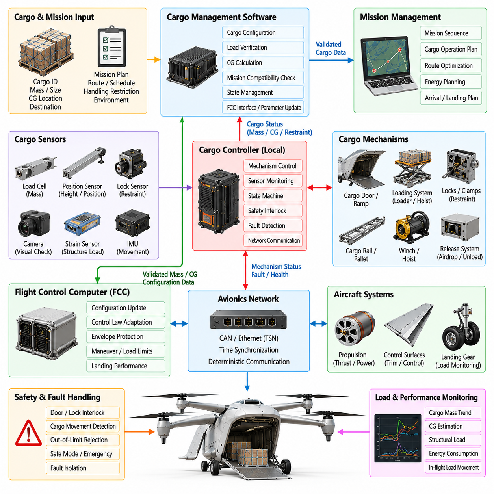{width="7.268055555555556in" height="7.268055555555556in"}

The cargo interface and load-management software of a 2.5-ton cargo UAV connects logistics operations with flight-critical vehicle configuration. Cargo is not treated as a passive object because its mass, position, restraint condition, dimensions, and movement can directly affect stability, structural loading, propulsion demand, and landing performance. The software therefore verifies cargo state before flight and continuously supervises relevant conditions throughout the mission.

The cargo architecture separates physical handling equipment, sensing, local cargo controllers, mission management, and flight-control interfaces. Physical mechanisms may include cargo doors, locks, clamps, rails, pallets, winches, hoists, or automated loading devices. Local controllers operate these mechanisms while higher-level software coordinates loading sequences and exchanges validated configuration information with the Flight Control Computer (FCC) and mission computer.

Cargo configuration begins with identification of the payload and its expected properties. Mission data can specify cargo identifier, mass, dimensions, center-of-gravity location, handling restrictions, environmental requirements, and destination. These values are compared with aircraft limits and, where possible, independent measurements. Configuration software prevents mission authorization when payload information is missing, inconsistent, or outside the approved operating envelope.

Payload mass has a direct influence on hover power, climb capability, acceleration, energy consumption, landing loads, and emergency performance. The system may obtain mass from ground logistics data, load cells, landing-gear measurements, suspension sensors, or propulsion-based estimation. Measured and declared values are cross-checked before departure. Significant disagreement prevents automatic acceptance because an incorrect mass estimate can invalidate flight-control and energy-planning assumptions.

Center-of-gravity management is particularly important for a heavy cargo aircraft. The software calculates the combined center of gravity from empty-aircraft properties, fuel or energy-system state where applicable, and individual payload positions. The resulting value is compared with configuration-dependent longitudinal, lateral, and vertical limits. A payload may satisfy total mass restrictions while still being rejected because its location creates insufficient control or structural margin.

Cargo restraint monitoring verifies that the load is mechanically secured before propulsion activation or takeoff. Sensors can monitor lock engagement, clamp position, latch status, restraint tension, or pallet presence. Redundant or diverse sensing may be used for critical restraints. Software distinguishes between commanded lock state and confirmed physical engagement so that an electrical command alone cannot be interpreted as proof that cargo is safely retained.

Door and hatch management is integrated with cargo safety logic. Position sensors confirm whether cargo doors, ramps, or access panels are open, transitioning, or fully secured. Interlocks prevent takeoff authorization when required closures are not confirmed. During flight, unexpected door-state changes generate immediate fault information because aerodynamic drag, structural loading, cargo retention, and vehicle controllability may all be affected.

The cargo controller uses a state machine to manage loading, verification, secured, flight, release-ready, unloading, and fault conditions. State transitions require explicit confirmation from relevant sensors and mission logic. Commands that are valid during ground loading may be prohibited after propulsion arming or weight-off-wheels detection. This state-dependent authority prevents accidental cargo mechanism activation during phases in which movement could threaten aircraft safety.

Cargo interfaces must be electrically and logically isolated from flight-critical control wherever practical. A malfunctioning loading mechanism or peripheral logistics device should not consume communication bandwidth, power, or computational resources needed by the FCC. Defined interface contracts specify message content, update frequency, validity, timeout behavior, and fault semantics. Only validated cargo parameters required for aircraft operation cross into flight-critical domains.

Dynamic load monitoring addresses the possibility that cargo shifts after departure. Movement can occur because of inadequate restraint, deformation, vibration, impact, or internal motion of the payload itself. Load cells, strain sensors, inertial measurements, or changes in aircraft trim can provide evidence of abnormal load redistribution. Detected movement is evaluated against available control and structural margins rather than treated only as a logistics anomaly.

The flight-control system can use validated cargo information to select configuration-specific parameters. Aircraft mass and center of gravity influence controller gains, trim, thrust requirements, control allocation, maneuver limits, and envelope protection. The FCC should receive bounded configuration data rather than unrestricted cargo-controller states. If cargo information becomes unavailable after takeoff, the FCC retains the last validated configuration and applies conservative limits as required.

Structural load management combines cargo configuration with aircraft maneuver state. Heavy payloads can increase floor loads, attachment forces, fuselage bending moments, and landing impact loads even when gross weight remains acceptable. The software can impose configuration-dependent acceleration, bank-angle, climb-rate, descent-rate, and landing limits. Mission planning then avoids trajectories that would exceed the approved load envelope for the specific cargo arrangement.

Energy planning is also linked to payload state because additional mass increases power demand and can reduce range or reserve capability. Before departure, mission software estimates energy consumption using validated payload mass and expected route conditions. During flight, actual power use is compared with predicted behavior. Persistent deviation may indicate stronger-than-expected wind, propulsion degradation, incorrect payload data, or other conditions requiring mission replanning.

For aircraft capable of carrying multiple cargo units, load management tracks each item independently as well as the combined configuration. Removing or delivering one unit changes total mass and center of gravity for subsequent flight segments. The software recalculates vehicle configuration after every confirmed loading or unloading event. A mission leg cannot begin until the new configuration is validated against structural, control, propulsion, and energy constraints.

Automated loading systems require coordinated motion between the aircraft and external logistics equipment. Cargo robots, conveyors, forklifts, pallet systems, or ground stations may exchange readiness and transfer-state information with the UAV. External equipment is never assumed to be safe solely because it reports completion. Onboard sensing independently confirms payload presence, position, and restraint before the aircraft transitions from logistics operation to flight preparation.

Cargo release mechanisms require stronger authority controls than ordinary loading functions because an unintended release can immediately change aircraft mass, center of gravity, and safety state. Release commands may require confirmation of geographic location, altitude, airspeed, aircraft attitude, mission phase, and mechanism readiness. Where applicable, multi-condition authorization or independent safety interlocks prevent a single software error from initiating release.

Intentional cargo release also requires coordinated flight-control preparation. A rapid reduction in mass or change in load distribution can produce vertical acceleration, attitude disturbance, or altered trim. The FCC can receive advance notification of an authorized release and prepare appropriate control references or gain states. After release confirmation, the aircraft configuration is updated promptly so that thrust, trajectory, and envelope calculations reflect the new mass properties.

Fault handling distinguishes between cargo-system faults that prohibit departure and those that require in-flight response. A failed loading sensor on the ground may simply prevent mission authorization, while a restraint failure detected in flight may require immediate maneuver restriction, diversion, or landing. Fault severity therefore depends on mission phase, cargo type, remaining restraint capability, aircraft dynamics, and availability of safe landing options.

Cargo-related warnings presented to operators must represent operational consequences rather than only raw sensor failures. Instead of displaying numerous individual switch states, the ground-control system can report conditions such as cargo unsecured, center of gravity invalid, load shift detected, door not confirmed closed, or release mechanism unavailable. Detailed diagnostic information remains accessible for maintenance without overwhelming the operator during time-critical decisions.

Communication between cargo systems and higher-level computers is divided into fast operational status and slower logistics information. The fast path carries restraint validity, door state, load-shift alerts, configuration identity, and release status when these affect flight safety. The slow path can carry cargo manifests, handling history, environmental records, maintenance counters, and detailed sensor diagnostics without competing with flight-critical network traffic.

Cargo configuration data require controlled versioning and traceability. Aircraft limits, pallet definitions, restraint capacities, loading zones, sensor calibrations, and approved payload categories may evolve during the vehicle lifecycle. Software must identify which configuration database is active and prevent incompatible combinations. Recorded mission data should preserve the exact cargo and aircraft configuration used for each flight so that later analysis remains reproducible.

Built-in tests verify cargo-interface readiness before mission execution. Startup checks can examine controller memory, communication, position sensors, load cells, locks, door switches, actuator feedback, and emergency release circuitry where applicable. Ground tests may command mechanisms through limited motion ranges to confirm operation. In-flight tests are restricted to monitoring functions that cannot inadvertently move cargo hardware or compromise restraint integrity.

Cybersecurity is relevant because cargo systems may interact with external logistics networks and automated ground equipment. Cargo manifests and loading commands received from external systems must be authenticated and validated before affecting aircraft configuration. Network separation, message authorization, secure update mechanisms, and strict command whitelisting prevent compromised logistics equipment from obtaining unintended authority over flight-related cargo functions.

Data logging records payload identity, measured mass, center-of-gravity calculations, restraint states, door transitions, load measurements, cargo commands, release events, faults, and configuration changes with synchronized timestamps. These records support maintenance, logistics traceability, incident investigation, and structural-life analysis. For fleet operations, accumulated load histories can also help identify repeated overloading trends or degradation of restraint mechanisms.

Verification uses software simulation, sensor emulation, Hardware-in-the-Loop testing, cargo-mechanism rigs, structural loading tests, integrated ground trials, and flight testing. Scenarios include incorrect mass declarations, misplaced payloads, failed locks, sensor disagreement, door faults, load movement, communication loss, and authorized or rejected release commands. Testing confirms that cargo anomalies cannot bypass flight-safety interlocks or create uncontrolled configuration changes.

The completed cargo interface and load-management system transforms payload information into a verified part of the aircraft configuration rather than treating cargo as an external logistics concern. Its essential functions are to know what is carried, where it is located, whether it is secured, and how changes affect vehicle capability. For a 2.5-ton cargo UAV, this integration allows autonomous logistics operations to remain bounded by verified structural, propulsion, control, energy, and safety limits.

## 10.07. 2.5t GCS and Telemetry Link Design [w/Code]

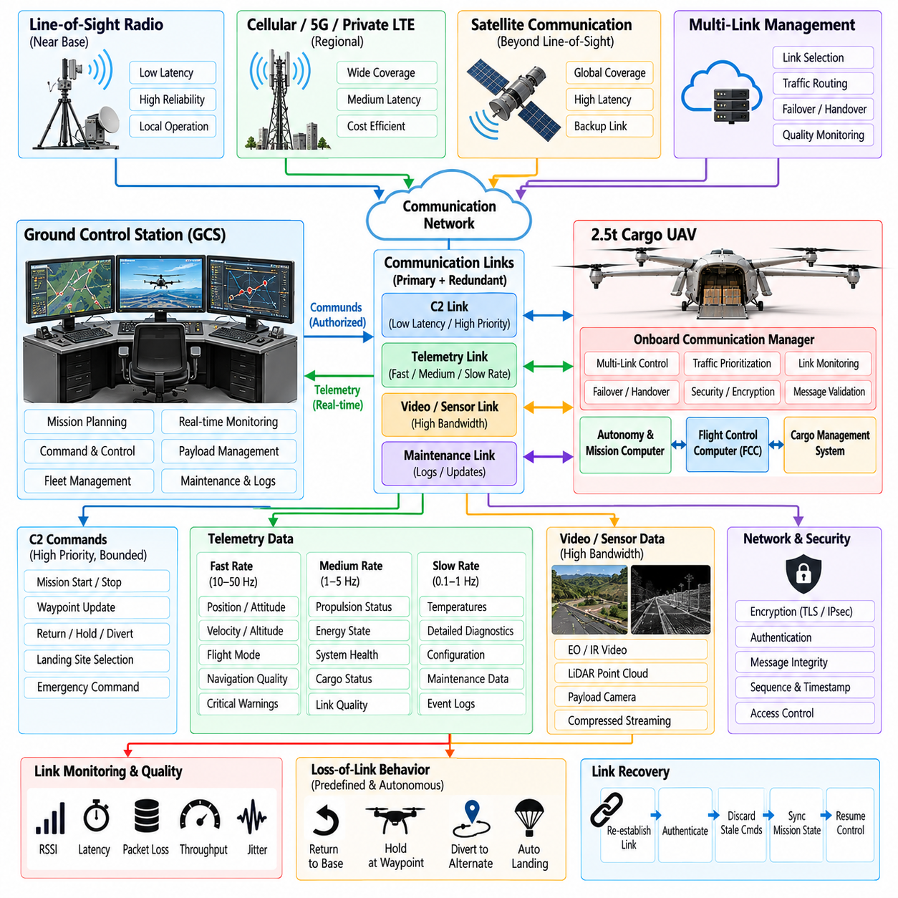{width="7.268055555555556in" height="7.268055555555556in"}

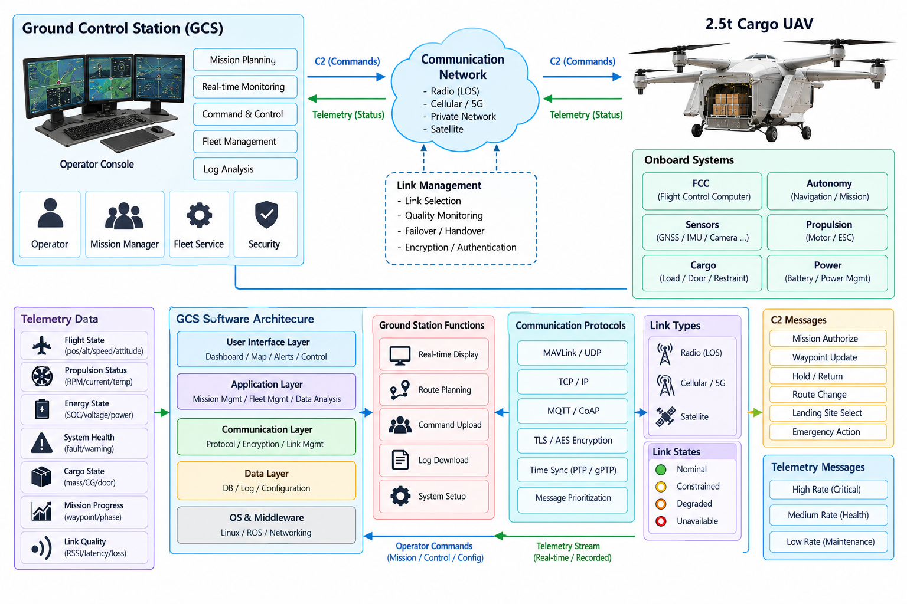{width="7.268055555555556in" height="4.845138888888889in"}

The Ground Control Station (GCS) and telemetry-link architecture of a 2.5-ton cargo UAV provides the operational connection between remote personnel, fleet services, and the airborne vehicle. Because the aircraft carries substantial payload and kinetic energy, the communication system must support reliable command and control without making safe flight dependent on uninterrupted connectivity. Onboard autonomy and the Flight Control Computer (FCC) retain essential authority when external links degrade or disappear.

The communication architecture separates Command and Control (C2), safety-critical telemetry, mission data, payload information, maintenance traffic, and high-bandwidth sensor streams according to their operational importance. Critical commands and vehicle-state messages receive deterministic priority over video, logs, or bulk transfers. This separation prevents congestion in nonessential services from delaying information required for aircraft supervision or contingency response.

A cargo UAV operating over regional distances may use several communication technologies simultaneously. Line-of-sight radio can provide low-latency connectivity near operating bases, while cellular, private broadband, or satellite links can extend coverage beyond local infrastructure. The onboard communication manager evaluates available links and routes traffic according to latency, bandwidth, integrity, cost, coverage, and safety requirements rather than assuming a single permanent channel.

The GCS presents vehicle state in a form that supports rapid operational understanding. Primary information includes aircraft position, altitude, speed, attitude, flight mode, route progress, navigation integrity, propulsion capability, energy reserve, cargo state, communication quality, and active faults. The interface prioritizes operational consequences so that the operator can recognize whether the aircraft remains nominal, has entered a degraded condition, or requires intervention.

Command authority is explicitly controlled because multiple sources may attempt to influence the aircraft. Commands can originate from an operator, mission-management system, fleet supervisor, or approved external service. Each source is authenticated and assigned a defined authority level. The onboard system resolves conflicts according to predetermined rules, while the FCC independently rejects commands that violate flight mode, envelope, navigation-integrity, or vehicle-capability constraints.

The C2 link carries bounded high-level commands rather than unrestricted low-level actuator instructions during normal autonomous operation. Typical messages include mission authorization, waypoint changes, hold requests, route modifications, return commands, landing-site selection, or emergency actions. Stabilization remains onboard, so network delay does not directly enter high-rate attitude-control loops. This architecture allows communication latency to vary without destabilizing the aircraft.

Telemetry is organized by update rate and criticality. Fast telemetry communicates flight state, control mode, navigation quality, propulsion status, energy margin, and immediate warnings. Medium-rate information describes subsystem health and mission progress, while slow telemetry carries maintenance statistics, detailed temperatures, configuration information, and diagnostic records. Adaptive scheduling can reduce lower-priority traffic when available bandwidth decreases.

Message timing is treated as part of data validity. Each operational message contains timestamps, sequence information, source identity, and where necessary an expiration interval. The receiver can therefore distinguish a valid current command from one that arrived after excessive network delay. Ground and airborne systems maintain synchronized time references so that telemetry from multiple subsystems can be correlated during operations and post-flight analysis.

Link monitoring continuously evaluates received signal quality, packet loss, round-trip delay, jitter, throughput, authentication state, and message freshness. No single metric is sufficient to determine communication health. A link can remain technically connected while latency makes it unsuitable for operational control. The communication manager therefore assigns capability states such as nominal, constrained, degraded, or unavailable and exposes them to mission management.

Redundant communication links improve availability but require controlled switching behavior. The aircraft may maintain a primary and one or more secondary links simultaneously, allowing rapid failover when quality deteriorates. Session state, command sequence, and authorization context must survive transition between channels. Otherwise, a technically successful radio handover could create duplicated commands, missing acknowledgments, or temporary uncertainty regarding control authority.

Loss-of-link behavior is defined before departure rather than improvised after communication failure. Depending on mission, location, energy state, weather, and airspace constraints, the aircraft may continue along an approved route, hold at a designated point, return to base, divert, or land at a predefined site. The selected policy is uploaded and validated before takeoff so that the vehicle can execute it autonomously if ground connectivity disappears.

Recovery from communication loss must also be controlled. When a link returns, the aircraft does not immediately accept every queued command. Authentication is re-established, stale messages are discarded, current mission state is synchronized, and command authority is confirmed. The operator receives the aircraft\'s actual autonomous state before issuing new instructions. This prevents outdated commands generated before the outage from disrupting a valid contingency maneuver.

The GCS mission-planning function allows operators to define routes, altitude constraints, waypoints, landing sites, geofences, communication expectations, and contingency points. Before mission upload, the plan is checked against aircraft capability, payload configuration, expected energy use, airspace restrictions, and available alternatives. The airborne system independently validates the received mission so that an erroneous ground plan cannot automatically bypass onboard safety constraints.

Geospatial information is presented with sufficient context for safe supervision. Maps can include planned and actual trajectories, controlled or restricted airspace, terrain, obstacles, landing sites, contingency zones, and dynamic restrictions. Position uncertainty should be represented when navigation quality degrades rather than displaying a falsely precise vehicle symbol. Operators must be able to distinguish verified aircraft position from an estimate with increasing uncertainty.

Alert management prevents operator overload by converting numerous subsystem faults into prioritized operational messages. Related failures can be grouped into conditions such as reduced propulsion capability, navigation degraded, energy reserve low, cargo unsecured, or C2 link constrained. Alerts include severity, persistence, affected capability, and recommended operational context. Detailed engineering data remain available without dominating the primary flight-supervision display.

Human-machine interface design must minimize accidental commands. Safety-significant actions such as mission termination, emergency landing, cargo release, propulsion shutdown, or major route changes may require confirmation or context-dependent authorization. The interface distinguishes command preparation from execution and clearly indicates whether a command was transmitted, received, accepted, rejected, or completed. Ambiguous command state is treated as a safety concern.

Fleet operations require the GCS architecture to scale beyond a one-operator-to-one-aircraft model. A supervisory system can display multiple aircraft while directing operator attention toward exceptions and degraded states. Each UAV retains independent onboard safety functions, while fleet software coordinates routes, schedules, landing resources, and communication capacity. Authority transfer between operators or control stations must preserve identity, mission state, and command continuity.

External services such as Unmanned Traffic Management (UTM), weather providers, logistics platforms, or fleet servers may exchange information with the GCS. These services provide bounded data rather than direct unrestricted control. Inputs are checked for source authenticity, age, geographic relevance, and consistency before they affect mission planning. Failure or compromise of an external service must not remove the aircraft\'s ability to execute a safe contingency procedure.

Cybersecurity is integrated into the communication architecture because unauthorized access to C2 or telemetry can have direct physical consequences. Mutual authentication, encrypted transport, protected credentials, secure key storage, message-integrity checks, replay protection, and controlled software updates protect communication channels. Network segmentation separates flight-critical interfaces from maintenance, payload, and general information services to limit propagation of a compromised endpoint.

Availability must be balanced with security so that protective mechanisms do not create unsafe communication failure modes. Certificate expiration, clock errors, key rotation, or authentication-service outages must have defined handling procedures. Security state is monitored like other system health information. Recovery mechanisms preserve trust boundaries while allowing authorized operation to resume without bypassing identity or integrity checks during time-critical conditions.

Bandwidth management is important when high-volume sensor or payload data share communication infrastructure. Video, imagery, mapping data, or maintenance logs can consume substantially more bandwidth than C2 telemetry. Quality-of-service policies reserve capacity for critical messages and can throttle, compress, reduce, or suspend lower-priority streams when network performance declines. C2 traffic therefore remains available even under severe bandwidth contention.

Store-and-forward mechanisms support operations when continuous broadband connectivity is unavailable. Noncritical logs, images, or maintenance records can be buffered onboard and transmitted later when bandwidth becomes available. Safety-critical telemetry is not treated in the same way because delayed information may no longer represent current vehicle state. The architecture therefore distinguishes data whose value survives delay from information that must meet strict freshness requirements.

The GCS records commands, acknowledgments, operator actions, telemetry, mission changes, alerts, communication-quality metrics, and authority transfers with synchronized timestamps. These records allow reconstruction of both airborne behavior and ground decisions during incident investigation. Audit trails also support maintenance, operational improvement, cybersecurity analysis, and regulatory evidence by showing what information was available when an operator or autonomous system acted.

Ground-station availability is protected through redundant power, network connectivity, computing resources, and data storage where operational risk requires it. Backup control stations may be prepared to assume supervision if the primary site becomes unavailable. Authority transfer follows an explicit protocol so that two stations cannot simultaneously believe they possess exclusive command rights. The aircraft maintains its current safe mission state during the transfer process.

Verification of the GCS and telemetry system includes network simulation, latency and packet-loss injection, bandwidth saturation, authentication failures, radio handovers, ground-station outages, and complete loss-of-link scenarios. Hardware-in-the-Loop environments allow real flight computers to interact with impaired communication networks. Testing confirms that delayed, duplicated, reordered, corrupted, unauthorized, or missing messages cannot produce uncontrolled aircraft behavior.

Field testing progressively evaluates communication performance across representative routes, terrain, altitude, infrastructure coverage, and electromagnetic environments. Measured latency, availability, failover time, packet loss, and effective bandwidth are compared with design assumptions. Coverage gaps are incorporated into mission planning rather than hidden by average performance statistics, allowing autonomous contingency behavior to be validated where communication is predictably weak.

The completed GCS and telemetry-link design must provide operators with reliable situational awareness and bounded command authority while preserving onboard independence for immediate flight safety. Its effectiveness is measured not by continuous connectivity alone, but by predictable behavior when links become slow, intermittent, compromised, or unavailable. For a 2.5-ton cargo UAV, resilient communications therefore support autonomy without becoming a single point of failure for safe aircraft operation.

## 10.08. 2.5t Safety System and Parachute Trigger [w/Code]

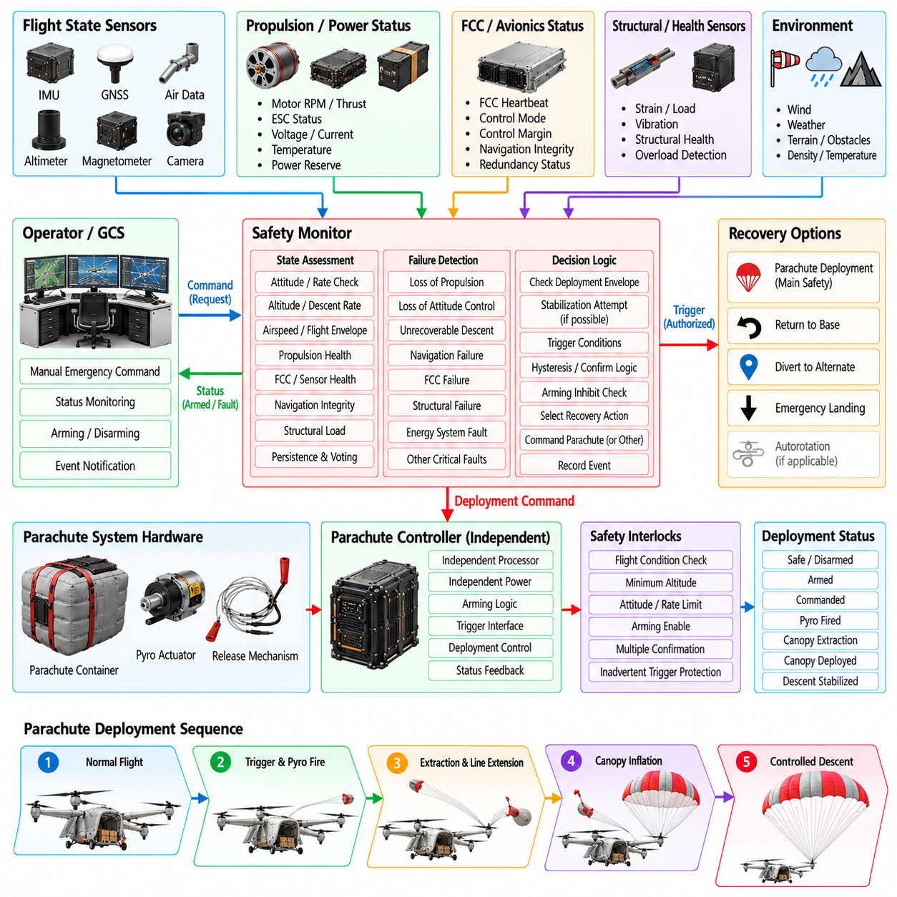{width="7.268055555555556in" height="7.268055555555556in"}

The safety system of a 2.5-ton cargo UAV provides an independent protection layer for conditions that cannot be adequately managed by nominal flight control, redundancy, or autonomous contingency logic. Because a vehicle of this mass carries substantial kinetic and potential energy, emergency functions must be based on explicit hazard analysis. A parachute system, where technically applicable, is treated as one element of a broader layered safety architecture rather than as a universal recovery solution.

Safety architecture begins by identifying hazardous aircraft states and determining which systems can prevent, control, or mitigate them. Examples include loss of propulsion, loss of attitude control, structural failure, unrecoverable navigation degradation, flight-computer failure, energy-system faults, and uncontrolled descent. Each hazard is associated with detection criteria, required response time, available recovery options, and conditions under which emergency descent or parachute deployment may reduce overall risk.

The emergency safety controller should have sufficient independence from the primary Flight Control Computer (FCC) to remain functional when common flight-control resources fail. Depending on assurance objectives, it may use an independent processor, power supply, inertial sensing, altitude source, watchdog, and discrete interfaces. Independence does not require complete duplication of avionics, but common-cause dependencies must be understood so that a single failure cannot disable both normal control and the final safety function.

The safety monitor continuously evaluates aircraft motion and health information using bounded, deterministic logic. Relevant inputs may include attitude, angular rate, vertical velocity, altitude, airspeed, propulsion availability, FCC heartbeat, control margin, structural status, and navigation integrity. Safety decisions should rely on multiple indicators where practical because a single erroneous sensor value must not unnecessarily initiate an irreversible emergency action.

Emergency-state detection distinguishes temporary disturbances from conditions that are genuinely unrecoverable. Persistence timers, sensor voting, plausibility checks, cross-channel comparison, and dynamic-state evaluation reduce nuisance triggering. At the same time, detection logic must not wait so long that recovery becomes ineffective. Trigger thresholds are therefore developed together with aircraft dynamics, parachute deployment time, minimum recovery altitude, and expected failure progression.

A parachute recovery system for a heavy UAV requires careful definition of its usable deployment envelope. Deployment effectiveness depends on altitude above terrain, vertical and horizontal speed, aircraft attitude, angular rate, structural condition, atmospheric environment, and parachute inflation characteristics. The software determines whether the current aircraft state lies within the verified deployment region rather than assuming that parachute activation is beneficial under every emergency condition.

Minimum deployment altitude is a particularly important constraint because canopy extraction, line extension, inflation, and descent stabilization require finite time and distance. The applicable minimum altitude can vary with vertical speed and aircraft attitude. Safety software therefore evaluates predicted height loss during deployment rather than using only a fixed altitude threshold. Below the effective deployment region, another minimum-risk response may provide a better outcome.

Excessive angular rates or abnormal attitudes can complicate parachute deployment by increasing the possibility of entanglement, asymmetric inflation, or structural interaction. Where control authority remains available, the aircraft may first attempt a short stabilization maneuver before deployment. Such preparation is strictly time bounded. If stabilization fails or remaining altitude becomes insufficient, the safety logic transitions according to the predefined emergency priority rather than indefinitely delaying action.

Parachute triggering uses a protected authorization path separate from ordinary mission commands. The deployment actuator is normally inhibited during maintenance, transport, loading, and other ground states. Arming occurs only after defined flight conditions and system checks are satisfied. Once armed, deployment may require agreement among multiple logical conditions or an independent emergency command path, depending on the safety architecture and certification strategy.

The trigger interface must clearly distinguish armed, safe, commanded, fired, and deployment-confirmed states. Electrical continuity alone does not prove successful deployment, so additional feedback may monitor actuator firing, extraction mechanism position, line release, canopy deployment, or descent response where practical. The safety system records both command and confirmation information so that an unsuccessful activation can be distinguished from a failure to issue the command.

Inadvertent deployment prevention is as important as successful emergency activation. Mechanical safing devices, electrical inhibits, software interlocks, command authentication, flight-state validation, and independent arming logic can provide multiple barriers against accidental triggering. No routine software update, communication fault, single corrupted message, or operator interface error should be capable of bypassing all deployment protections.

Manual emergency authority may be provided to a remote operator, but operator commands remain subject to carefully defined safety logic. Communication delay and incomplete situational awareness can make purely manual triggering unreliable. An onboard automatic trigger can respond when time-critical conditions are detected, while a remote command provides an additional path for circumstances recognized by the operator. The relationship between automatic and manual authority must be unambiguous.

Propulsion behavior during parachute deployment requires explicit coordination. Rotating propellers or powered rotors can damage parachute lines, interfere with canopy extraction, or create dangerous vehicle motion. The emergency sequence may command propulsion shutdown, braking, feathering, or other configuration changes according to aircraft design. The required ordering and timing are verified so that propulsion transitions do not themselves delay deployment beyond the available recovery window.

Energy isolation can form another part of the emergency sequence. High-voltage batteries, fuel systems, generators, or power converters may present post-impact fire or electrical hazards. Where appropriate, the safety controller can command isolation of selected energy sources after essential deployment actions have completed. Safety-critical electronics required for beaconing, tracking, or descent monitoring may remain powered from an independent emergency supply.

Cargo state must be considered because a 2.5-ton cargo UAV may contain a large fraction of its mass in payload. The parachute system and attachment structure are designed for approved mass and center-of-gravity ranges. Software verifies that the active aircraft configuration remains compatible with the emergency recovery envelope. Unexpected cargo movement can alter descent attitude or structural loads and may therefore influence the available emergency strategy.

Geographic risk can influence emergency decision logic without overriding immediate aircraft stabilization requirements. When sufficient control remains, the vehicle may attempt to move away from densely occupied areas, hazardous infrastructure, or unsuitable terrain before committing to emergency descent. Such maneuvering is bounded by remaining altitude, energy, control authority, and time. A final safety action is not postponed merely to pursue an ideal landing location.

If parachute deployment succeeds, the aircraft transitions from controlled flight to managed emergency descent. Flight-control functions that are no longer meaningful are inhibited, while monitoring continues for descent rate, position, energy-system state, and parachute status. Communication systems transmit emergency state and location to the GCS where available. The vehicle may activate visual, acoustic, or electronic recovery aids according to the operational concept.

A failed or partial parachute deployment requires predefined fallback behavior. If useful aerodynamic or propulsion authority remains, the aircraft may attempt to reduce descent rate or stabilize attitude without interfering with the partially deployed system. The software must avoid oscillating between incompatible recovery modes. Emergency priorities define which functions remain active and which commands are permanently inhibited once the deployment sequence has progressed beyond specific states.

The safety architecture also addresses emergencies for which parachute deployment is inappropriate. Controlled diversion, immediate landing, hover termination, autorotative or gliding behavior where supported, propulsion reconfiguration, or minimum-risk trajectory control may provide better outcomes for some failures. The emergency manager selects among verified responses according to current capability instead of treating parachute activation as the default reaction to every serious fault.

Health monitoring of the parachute system begins before flight. Built-in tests can verify controller memory, independent power, trigger continuity, arming interfaces, sensors, deployment actuator status, and communication with the safety monitor. Maintenance intervals, packing life, environmental exposure, and component replacement status are tracked through configuration management. An expired or incorrectly configured recovery system prevents dispatch when it is required by the approved operational configuration.

Configuration control is especially important because deployment thresholds depend on aircraft mass properties, parachute type, attachment configuration, actuator characteristics, and software version. The safety controller verifies compatibility among these elements during initialization. Parameters affecting emergency triggering are protected from uncontrolled modification, and changes require the same disciplined verification process applied to other safety-critical flight functions.

Data logging preserves the information necessary to reconstruct an emergency decision. Recorded variables include sensor inputs, FCC health, control margin, detected faults, trigger conditions, arming state, operator commands, deployment sequence, confirmation feedback, and post-deployment motion. High-resolution synchronized timestamps allow investigators to determine not only whether deployment occurred, but why the safety logic considered it necessary at that specific instant.

Verification relies heavily on simulation because many catastrophic conditions cannot be repeatedly created during flight testing. Nonlinear vehicle models, parachute dynamics, sensor failures, propulsion faults, processor failures, and communication outages are combined in Monte Carlo scenarios. Software-in-the-Loop and Hardware-in-the-Loop testing verify timing, state transitions, trigger inhibition, automatic authorization, and interaction with the FCC under repeatable abnormal conditions.

Ground and controlled deployment testing validate the physical assumptions used by the software. Tests characterize extraction delay, inflation time, opening loads, descent rate, structural response, sensor signatures, and trigger-to-deployment timing across representative configurations. Flight testing expands the verified deployment envelope progressively and conservatively. Software thresholds are based on demonstrated system behavior rather than optimistic theoretical performance.

False-trigger testing is performed with the same seriousness as successful deployment testing. Turbulence, aggressive but permitted maneuvers, sensor transients, temporary communication loss, processor restarts, and propulsion disturbances are exercised to demonstrate that normal recoverable events do not activate the emergency system. The objective is to maintain high sensitivity to genuine loss of control while preserving strong resistance to nuisance deployment.

The completed safety and parachute-trigger architecture provides a final independent layer when normal control and redundancy can no longer guarantee an acceptable outcome. Its effectiveness depends on reliable hazard detection, verified deployment boundaries, protected triggering, coordinated propulsion and energy actions, and deterministic emergency sequencing. For a 2.5-ton cargo UAV, the system must reduce overall ground and aircraft risk without introducing an uncontrolled emergency mechanism of its own.

## 10.09. 2.5t UAV System Integration Test Protocol

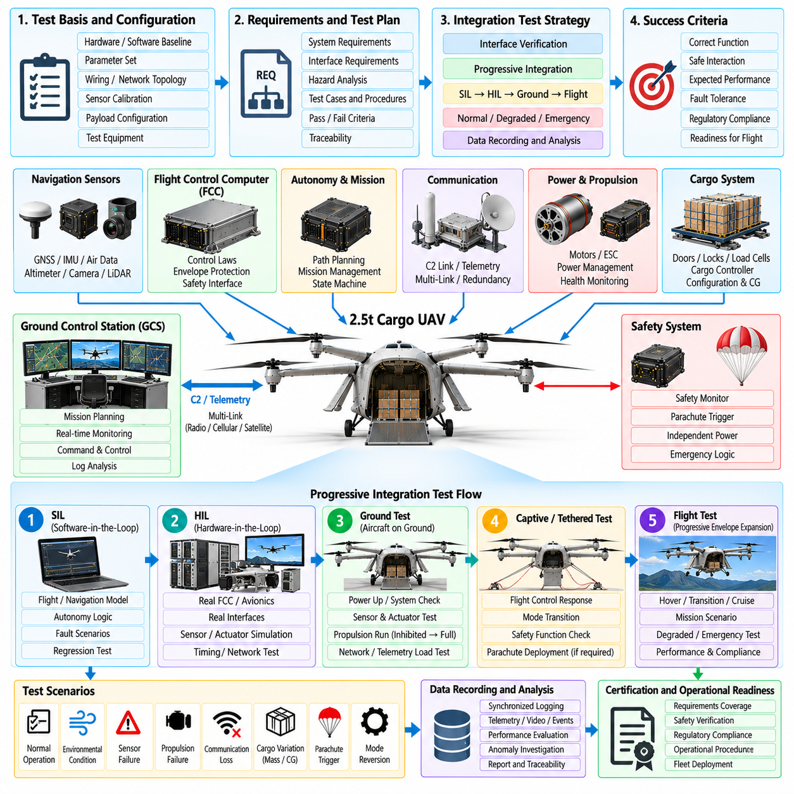{width="7.268055555555556in" height="7.268055555555556in"}

System integration testing for a 2.5-ton cargo UAV verifies that independently developed avionics, propulsion, navigation, autonomy, communication, cargo, power, and safety subsystems operate correctly as one aircraft. The objective extends beyond confirming individual functions. Testing must demonstrate that interfaces, timing, failure responses, authority boundaries, and configuration dependencies remain predictable throughout normal, degraded, and emergency operating conditions.

The integration program begins with a controlled baseline defining hardware versions, software builds, parameter sets, wiring configuration, network topology, sensor calibration, payload configuration, and test equipment. Every test result is associated with this baseline so that failures can be reproduced. Uncontrolled configuration changes are prohibited because even a minor firmware or calibration difference can invalidate conclusions obtained from previous integration runs.

Requirements traceability connects each integration test to system requirements, interface requirements, hazards, and verification objectives. Test cases identify required initial conditions, stimuli, expected responses, tolerances, timing limits, pass criteria, and recorded evidence. Traceability prevents testing from becoming a collection of demonstrations and ensures that safety-critical interactions receive explicit verification before the aircraft is authorized for progressively higher-risk activities.

Interface verification is performed before complex mission scenarios are attempted. Electrical levels, communication protocols, message identifiers, units, coordinate frames, sign conventions, scaling, update rates, timeout behavior, and initialization sequences are checked between connected subsystems. Particular attention is given to interfaces crossing assurance boundaries, such as autonomy-to-FCC commands, cargo configuration inputs, propulsion status, and emergency safety signals.

Time synchronization is verified as a system-level function rather than assumed from individual component specifications. Sensor timestamps, FCC time, autonomy-computer time, telemetry records, and ground-station logs are compared against a common reference. PTP, gPTP, PPS, hardware timestamps, or equivalent mechanisms are exercised under startup, restart, network congestion, and source-loss conditions to confirm bounded synchronization error and predictable recovery.

Power integration testing evaluates startup sequencing, steady-state consumption, transient demand, brownout behavior, backup supplies, isolation devices, and shutdown sequences. High-power propulsion loads can create disturbances that affect avionics if electrical segregation is inadequate. Tests therefore reproduce representative motor transients while monitoring flight computers, sensors, communication equipment, cargo controllers, and independent safety electronics for resets, data corruption, or timing anomalies.

Network integration testing verifies that critical traffic remains available during realistic and worst-case loading. Command and control, navigation data, actuator commands, telemetry, video, diagnostics, and maintenance traffic are exercised simultaneously. Packet loss, congestion, delayed messages, duplicated packets, and failed network nodes are introduced deliberately. Priority and quality-of-service mechanisms must preserve flight-critical communication when lower-priority traffic approaches available bandwidth limits.

Sensor integration testing validates installation effects as well as sensor accuracy. IMUs, GNSS receivers, air-data sensors, magnetometers, altimeters, cameras, LiDAR, radar, and load sensors are evaluated for alignment, latency, vibration sensitivity, electromagnetic interference, obstruction, and thermal behavior. Cross-sensor consistency is examined so that the navigation system can distinguish legitimate aircraft dynamics from installation-induced measurement errors.

Actuator and propulsion integration begins with inhibited or unloaded operation before progressing toward representative forces. Motor controllers, Electronic Speed Controllers (ESCs), servos, tilt mechanisms, brakes, and other effectors are commanded through controlled ranges while feedback is monitored. Direction, scaling, rate limits, saturation behavior, command timeout, fault reporting, and safe-state response are confirmed before closed-loop aircraft control is permitted.

The Flight Control Computer is integrated with simulated and real subsystems in progressive stages. Initial testing uses deterministic sensor inputs and simulated actuators to verify control modes and interface behavior. Real sensors and effectors are then introduced incrementally. This staged approach isolates faults efficiently and prevents a defect in one newly connected subsystem from being confused with unrelated behavior elsewhere in the aircraft.

Software-in-the-Loop testing exercises flight-control, navigation, autonomy, mission, and fault-management software against nonlinear aircraft models before hardware constraints complicate diagnosis. Automated scenarios cover takeoff, transition, cruise, approach, landing, cargo operations, route changes, and abnormal events. Repeatability allows software changes to be compared against a stable scenario library and supports regression testing across successive releases.

Hardware-in-the-Loop testing connects production-representative flight computers and interfaces to a real-time aircraft simulation. The simulator generates sensor behavior and aircraft dynamics while receiving actual control outputs. Processor loading, bus timing, network latency, sensor failures, propulsion faults, and communication loss can be reproduced without risking the aircraft. HIL testing is especially valuable for verifying interactions that depend on precise timing.

An integrated ground rig or iron-bird environment extends HIL testing by incorporating representative power distribution, actuators, propulsion controllers, communication equipment, cargo mechanisms, and safety hardware. Physical interfaces expose wiring, grounding, electromagnetic, mechanical, and timing problems that pure simulation may miss. The rig becomes a reusable platform for fault injection, software regression, maintenance validation, and investigation of flight-test anomalies.

Mode-transition testing verifies behavior between ground, armed, takeoff, hover, transition, cruise, approach, landing, cargo, degraded, and emergency states. Each transition is checked for correct preconditions, command continuity, controller initialization, actuator behavior, and annunciation. Rapid or unexpected sequences are also tested because operational faults may force transitions that are rarely encountered during a nominal mission.

Fault-injection testing deliberately introduces failures to verify detection, isolation, reconfiguration, and recovery. Scenarios can include sensor dropout, frozen values, biased measurements, processor restart, motor loss, ESC faults, network interruption, power-bus degradation, GNSS loss, cargo-sensor disagreement, or GCS disconnection. The system must respond according to defined safety logic without allowing a single injected fault to propagate into uncontrolled behavior.

Multiple-fault scenarios are introduced after single-fault behavior is understood. Real aircraft may experience dependent or cascading failures, such as a power disturbance followed by sensor resets or propulsion degradation combined with communication loss. Tests focus on combinations identified by hazard analysis rather than attempting arbitrary permutations. The objective is to verify that redundancy assumptions remain valid when shared resources or common dependencies are stressed.

Navigation and autonomy integration testing confirms that estimated state, perception, route planning, trajectory generation, and FCC command acceptance form a consistent chain. Coordinate frames, altitude references, geofences, obstacle data, navigation uncertainty, and command validity are tested together. The FCC must reject autonomy requests that are stale, malformed, outside the active flight envelope, or incompatible with degraded vehicle capability.

Cargo integration testing verifies that payload mass, center of gravity, restraint state, door status, and release or unloading functions are correctly reflected in aircraft configuration. Incorrect cargo data, failed locks, load movement, and sensor disagreement are injected to confirm dispatch inhibition or in-flight response. Cargo mechanisms must not activate in prohibited flight states, and cargo-system failures must not compromise flight-critical computing or communication resources.

GCS and telemetry integration testing verifies command authority, acknowledgments, message freshness, alert presentation, link switching, and loss-of-link behavior. Network delay, packet loss, bandwidth restriction, and complete disconnection are introduced while the aircraft system executes representative missions. Recovery of connectivity is also tested to ensure that stale commands are discarded and current autonomous state is synchronized before renewed operator control.

Emergency-system integration verifies independent safety monitoring, arming logic, trigger inhibition, emergency power, propulsion coordination, and parachute interfaces where installed. Tests confirm that recoverable disturbances do not cause false activation while genuine unrecoverable conditions produce the required response within the available time. Irreversible devices can be replaced by instrumented simulators during repeated testing before controlled physical deployment trials.

Electromagnetic compatibility testing examines whether high-current propulsion switching, radios, converters, actuators, and digital electronics interfere with navigation sensors, flight computers, or communication links. Representative operating combinations are exercised because interference may appear only when several systems are active simultaneously. Susceptibility and emissions testing are combined with functional monitoring so that transient data corruption is detected rather than overlooked.

Thermal integration testing evaluates the complete aircraft under representative processor, propulsion, battery, communication, and environmental loads. Cooling systems are tested during hover, cruise, ground operation, and low-airflow conditions. Temperature limits, throttling behavior, sensor drift, and shutdown thresholds are monitored. Thermal faults are injected where practical to confirm that degraded modes occur before hardware reaches unsafe operating conditions.

Structural and vibration integration tests verify that installed electronics, connectors, sensors, antennas, cargo interfaces, and wiring remain functional under representative loads. Propulsion-induced vibration can affect IMUs, connectors, cameras, and mechanical locks even when individual components passed qualification tests. Integrated measurements identify resonances, intermittent connections, and sensor artifacts that become visible only after installation on the complete vehicle.

Ground-run testing progressively activates the assembled aircraft while physical restraints prevent unintended flight. Propulsion is exercised from low power toward representative operating conditions while control commands, vibration, power quality, temperatures, network behavior, and safety interlocks are monitored. Abnormal shutdown, emergency stop, communication loss, and power transitions are tested before the vehicle is released for tethered or free-flight evaluation.

Flight testing begins inside a conservative envelope with simple objectives and extensive instrumentation. Early flights validate basic stabilization, navigation, propulsion coordination, telemetry, and landing behavior. Subsequent tests expand speed, altitude, payload, center-of-gravity, wind, transition, and maneuver conditions only after previous data satisfy acceptance criteria. Envelope expansion is therefore evidence-driven rather than schedule-driven.

Regression testing follows every software, hardware, calibration, or configuration change that could affect verified behavior. The required regression scope is determined through impact analysis, but critical interface, startup, control, fault-management, and safety tests remain part of the mandatory baseline. Automated SIL and HIL suites provide rapid detection of unintended effects before modified software reaches ground or flight testing.

Test data management preserves synchronized sensor streams, commands, actuator responses, network traffic, subsystem health, configuration identifiers, operator actions, and environmental conditions. Automated analysis compares measured responses with expected limits and identifies timing violations, unexpected mode changes, or performance trends. Raw data are retained so that conclusions can be independently reviewed and new analyses can be performed without repeating hazardous tests.

An anomaly discovered during integration is recorded, classified, reproduced where possible, and traced to corrective action. A test is not considered successful merely because the mission completed despite unexplained behavior. Safety-significant anomalies require root-cause analysis and appropriate regression testing. Known limitations that remain accepted are documented with explicit operational constraints rather than being hidden within test notes.

The final integration test campaign demonstrates that the 2.5-ton cargo UAV behaves as a coherent system across its approved operating envelope. Successful completion requires evidence that subsystem interfaces, timing, power, networking, control, autonomy, cargo functions, communications, and emergency protections remain coordinated under realistic faults and environmental stresses. System integration testing therefore provides the evidence connecting component verification to safe operation of the complete aircraft.

## 10.10. 2.5t UAV Flight Test Campaign Case

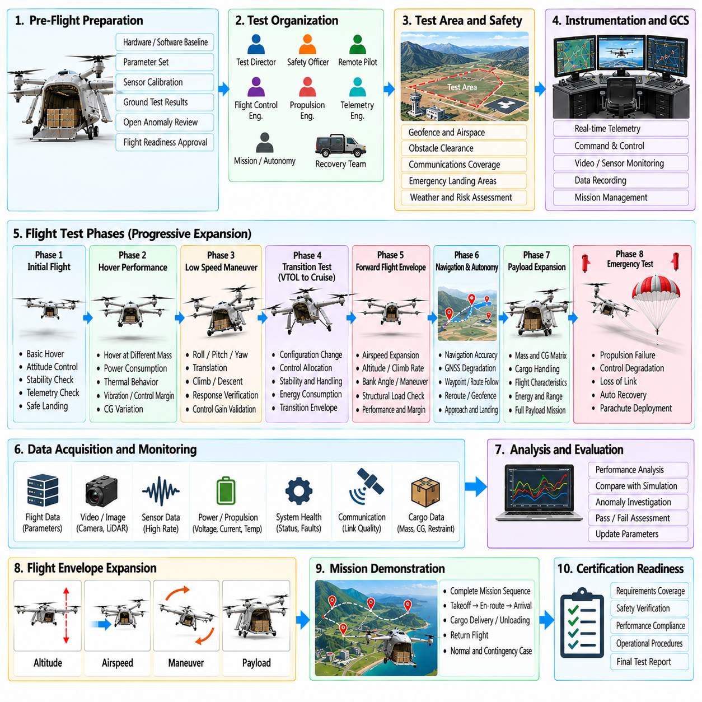{width="7.268055555555556in" height="7.268055555555556in"}

A flight-test campaign for a 2.5-ton cargo UAV represents the final progressive demonstration that the integrated aircraft can perform its intended logistics mission within verified safety boundaries. The campaign does not begin with full-range autonomous cargo operations. It expands aircraft capability through controlled test phases in which aerodynamic behavior, propulsion performance, flight control, navigation, autonomy, communications, payload effects, and emergency functions are evaluated together.

Before first flight, the test organization establishes a configuration-controlled aircraft baseline covering hardware, software, control parameters, propulsion units, batteries or energy systems, sensors, communication equipment, cargo interfaces, and safety devices. Every flight is associated with a unique configuration record. Changes made between sorties are reviewed because apparently minor modifications can alter vibration, electromagnetic compatibility, mass properties, thermal behavior, or control response.

Flight readiness is supported by evidence accumulated from analysis, simulation, Software-in-the-Loop, Hardware-in-the-Loop, integrated ground rigs, structural tests, propulsion tests, and restrained ground runs. Open anomalies are reviewed before authorization. First flight is permitted only when critical functions have demonstrated sufficient maturity and credible emergency procedures exist for the limited envelope planned for the initial sortie.

The flight-test area is selected to reduce risk to people, property, and unrelated air traffic. Terrain, obstacle clearance, communications coverage, emergency landing areas, prevailing winds, and recovery access are considered. Initial operations use conservative geographic boundaries and altitude limits. Geofences and mission constraints are independently checked so that a navigation or planning error cannot unintentionally expand the authorized test volume.

The test team defines clear responsibilities for the flight-test director, remote pilot or operator, safety personnel, telemetry engineers, propulsion specialists, flight-control engineers, and recovery teams. Decision authority for launch, continuation, test-point execution, abort, and emergency termination is established before flight. This prevents ambiguous command responsibility when rapidly changing aircraft conditions require immediate action.

Initial sorties focus on fundamental vehicle behavior rather than mission performance. The aircraft demonstrates propulsion stability, basic attitude control, altitude regulation, low-speed maneuvering, telemetry, navigation consistency, command response, and controlled landing. Test points are intentionally separated so that unexpected behavior can be attributed to a limited set of variables rather than being hidden inside a complex autonomous mission.

For a VTOL cargo configuration, hover testing provides an important early characterization point. Engineers measure required thrust, motor loading, power consumption, thermal behavior, vibration, attitude-control margin, and sensitivity to wind. Hover performance is repeated at different takeoff masses and center-of-gravity locations. The resulting data validate propulsion models and establish whether adequate control margin exists before more dynamic flight is attempted.

Low-speed maneuver testing expands roll, pitch, yaw, translation, climb, and descent commands gradually. Commanded and measured responses are compared with simulation predictions and control-law requirements. Overshoot, damping, actuator utilization, motor saturation, and structural vibration are monitored. Control gains are not changed casually during the campaign; modifications follow analysis, configuration control, regression testing, and a new flight-readiness review.

Transition testing is performed incrementally when the aircraft uses lift-plus-cruise, tilt-rotor, tilt-wing, or another configuration with substantially different hover and forward-flight dynamics. Individual test points increase airspeed or configuration change in small steps. Control allocation, gain scheduling, propulsion transfer, aerodynamic-surface authority, and energy consumption are examined for discontinuities before the transition corridor is widened.

Forward-flight envelope expansion evaluates increasing airspeed, bank angle, climb rate, descent rate, altitude, and maneuver demand. Each new boundary is approached from previously demonstrated conditions. Dynamic pressure, structural load, propulsion reserve, actuator margin, vibration, and control stability are monitored in real time. A test point is terminated before a theoretical limit when measured trends indicate that verified margin is being consumed faster than predicted.

Navigation testing compares onboard estimates with independent references and examines performance under representative geometry, motion, and environmental conditions. Position, velocity, altitude, attitude, timing, and uncertainty behavior are analyzed. Controlled GNSS degradation or aiding-source changes can be introduced after nominal performance is established, allowing the team to verify fallback navigation without combining the test with unrelated high-risk maneuvers.

Autonomy testing begins with supervised execution of simple routes and progresses toward complete mission sequences. Waypoint following, trajectory generation, geofence handling, holding, rerouting, approach, landing, and contingency logic are exercised individually before being combined. The Flight Control Computer remains responsible for envelope protection and can reject autonomy requests that are stale, malformed, or physically incompatible with current aircraft capability.

Payload expansion follows a deliberate mass and center-of-gravity matrix rather than moving directly from empty aircraft to maximum cargo. Ballast or representative payloads are introduced in controlled increments. Hover power, trim, maneuver response, structural loads, energy consumption, landing behavior, and control margin are measured at each configuration. Off-nominal but approved center-of-gravity positions receive dedicated evaluation because they can expose reduced actuator authority.

Cargo-interface flight testing confirms that restraint sensors, doors, load monitoring, and configuration data remain reliable under vibration and maneuver loads. Where cargo release or automated unloading is part of the design, those functions are tested only after basic aircraft stability has been demonstrated. Changes in mass properties following an authorized release are compared with predicted transient response and updated flight-control configuration.

Energy-performance testing characterizes mission endurance under realistic payload, route, altitude, speed, wind, and temperature conditions. Measured power demand is compared with preflight predictions throughout the mission. Reserve policies are tested by initiating return, diversion, or landing decisions at controlled energy thresholds. The objective is to validate not only maximum endurance but also the accuracy of onboard energy prediction used by autonomous planning.

Communication trials examine C2 and telemetry performance across the intended operational area. Flights deliberately approach known weak-coverage regions while remaining inside safe test conditions. Link latency, packet loss, handover behavior, bandwidth reduction, and redundant-link switching are recorded. Later sorties include controlled loss-of-link events to verify autonomous hold, return, diversion, or landing behavior without dependence on continuous ground commands.

Environmental expansion introduces progressively stronger wind, temperature variation, turbulence, and other approved conditions after calm-weather behavior is established. Environmental tests are not conducted simply to prove that the aircraft can remain airborne. Engineers examine control workload, energy consumption, navigation performance, thermal margin, structural response, landing accuracy, and whether autonomy correctly recognizes conditions approaching operational limits.

Failure testing in flight is restricted to faults that can be introduced with acceptable residual risk. Examples may include controlled sensor removal, communication interruption, simulated subsystem faults, or commanded propulsion derating when sufficient redundancy exists. More hazardous failures remain primarily within simulation and HIL environments. Flight testing is used to validate model assumptions and system-level responses, not to reproduce every catastrophic failure physically.

Propulsion-degradation trials verify that the aircraft recognizes reduced capability and modifies its behavior appropriately. Depending on configuration, tests can evaluate reduced motor output, unavailable propulsion channels, or constrained thrust margins. The aircraft should adjust maneuver limits, trajectory demands, climb performance, or landing strategy rather than continuing to operate according to nominal capability assumptions.

Emergency and contingency testing progresses from simulated indications to carefully controlled physical demonstrations. Return-to-base, alternate landing, emergency descent, flight-mode reversion, safety-controller intervention, and other procedures are evaluated separately. If a parachute recovery system is installed, trigger logic and deployment sequencing are extensively verified with simulation and instrumented substitutes before any controlled physical deployment test is authorized.

Landing testing receives particular attention because a heavy cargo UAV must dissipate substantial energy while maintaining positional accuracy and structural limits. Approaches are evaluated under different mass, center-of-gravity, wind, and navigation conditions. Descent rate, touchdown velocity, landing-gear loads, propulsion response, position error, and go-around logic are measured. Rejected landings and missed approaches are tested before fully autonomous operations are accepted.

Integrated cargo missions combine previously validated capabilities into representative logistics scenarios. A typical demonstration includes loading verification, automated preflight checks, takeoff, departure, cruise, route modification, arrival, precision approach, landing, unloading, and return. The purpose is not merely to complete the route but to demonstrate that state transitions, safety interlocks, energy margins, communications, and cargo configuration remain coherent throughout the mission.

Telemetry enables the test team to monitor critical parameters during each sortie. Real-time displays emphasize flight mode, navigation integrity, control margin, propulsion reserve, energy state, structural indicators, communication quality, and active faults. Predetermined stop criteria define when a test point must be abandoned. Engineers avoid extending a maneuver simply because the aircraft has not yet crossed an absolute limit when trends indicate deteriorating margin.

Every flight is followed by structured data review before the next envelope-expansion step. Recorded sensor streams, controller states, actuator commands, propulsion data, network traffic, structural measurements, autonomy decisions, and operator actions are synchronized and analyzed. Differences between predicted and measured behavior are classified. Significant unexplained deviations suspend related test expansion until their cause and safety implications are understood.

Anomalies are managed through a formal process rather than informal adjustment at the flight line. Each significant event is documented, reproduced in simulation or ground testing where possible, assigned a root-cause investigation, and linked to corrective action. Software or parameter changes are subjected to regression testing before returning to flight. This discipline prevents rapid tuning from concealing deeper integration or modeling problems.

Envelope expansion is complete only when required combinations of mass, center of gravity, speed, altitude, maneuver, environment, and subsystem availability have sufficient supporting evidence. The approved envelope may remain smaller than the theoretical design envelope when testing does not justify additional regions. Operational limitations are therefore treated as valid engineering outcomes rather than failures to achieve an originally desired specification.

The final campaign phase emphasizes repeatability and operational reliability. Representative missions are flown repeatedly using production-intent hardware, software, maintenance procedures, ground equipment, and trained operators. Dispatch reliability, turnaround time, fault recurrence, energy prediction, landing consistency, and maintenance findings are tracked. The aircraft must demonstrate stable behavior across repeated missions rather than a single successful demonstration flight.

Completion of the flight-test campaign produces the evidence needed to define the operational configuration and verified limitations of the 2.5-ton cargo UAV. The resulting data connect analytical models and laboratory verification with real aircraft behavior. A successful campaign demonstrates that propulsion, flight control, navigation, autonomy, cargo handling, communications, and safety systems remain coordinated while the aircraft performs representative missions inside a defensible and explicitly validated operating envelope.
