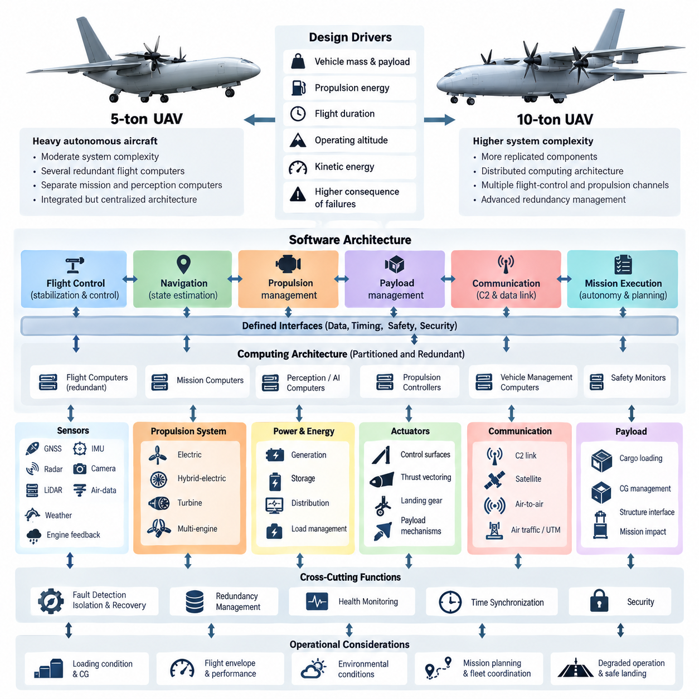
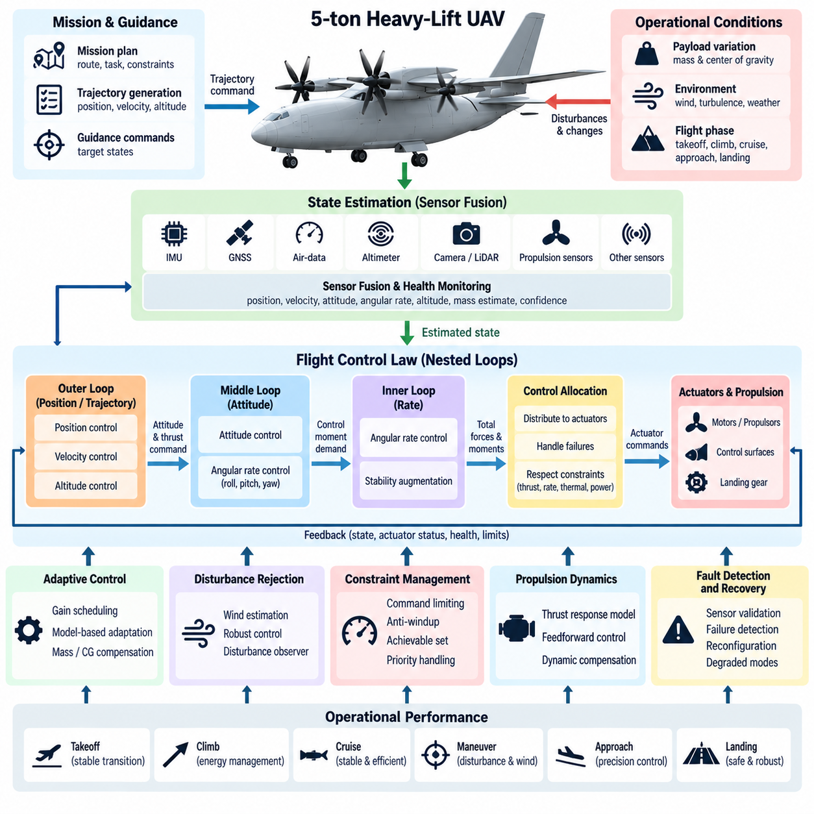
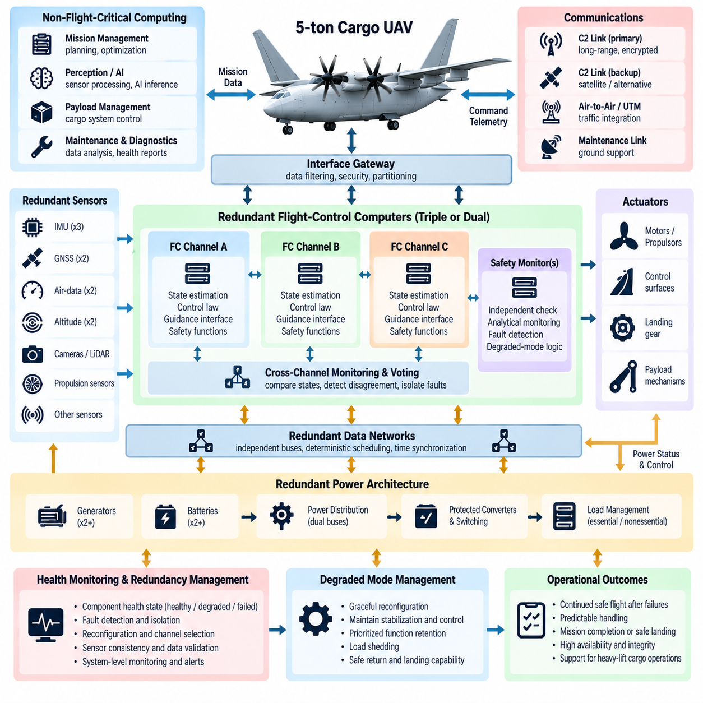
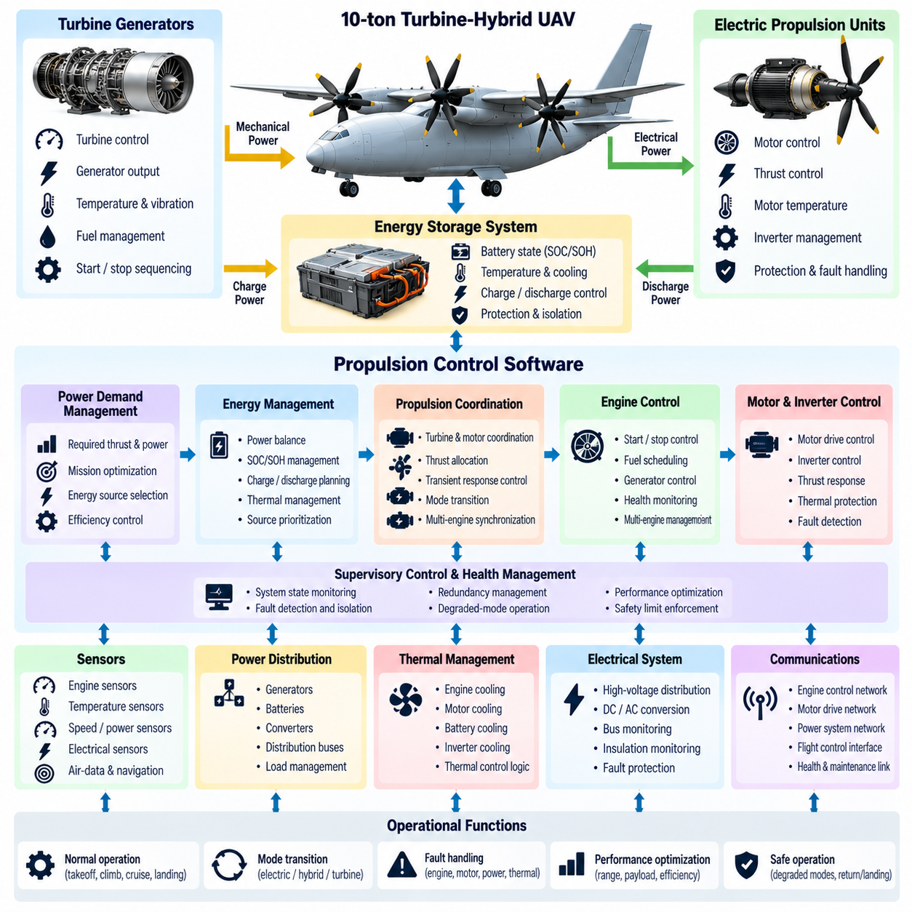
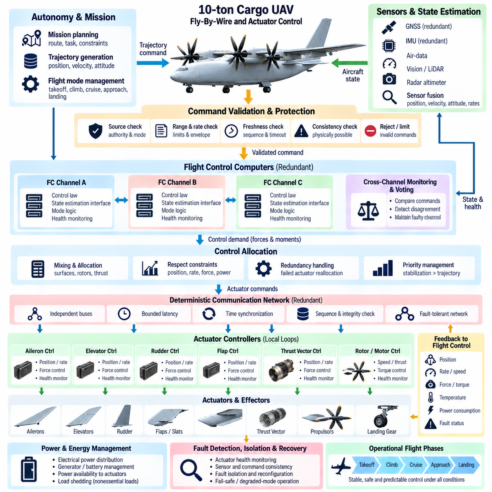
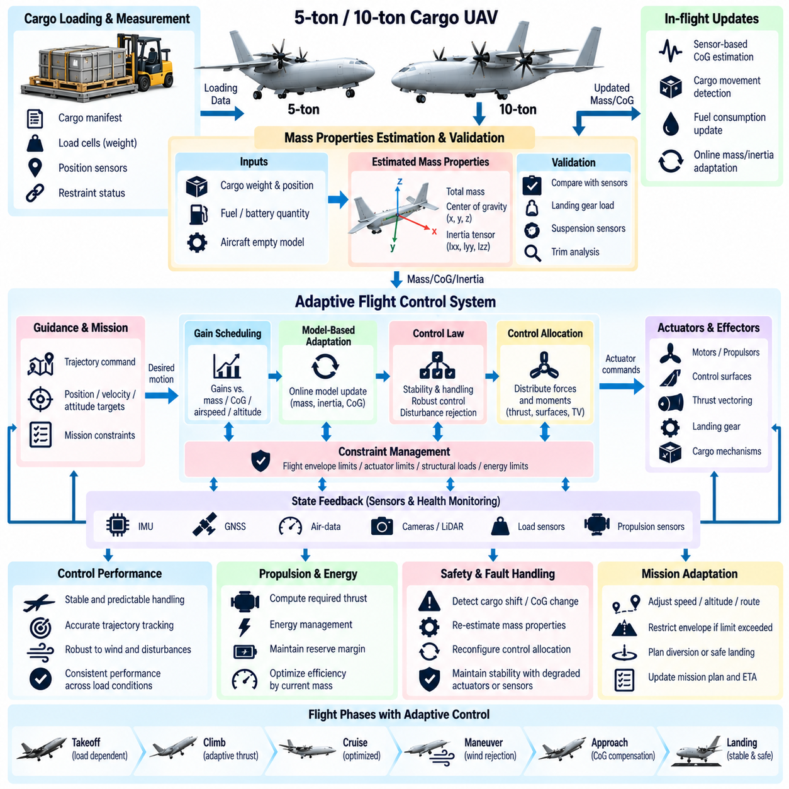
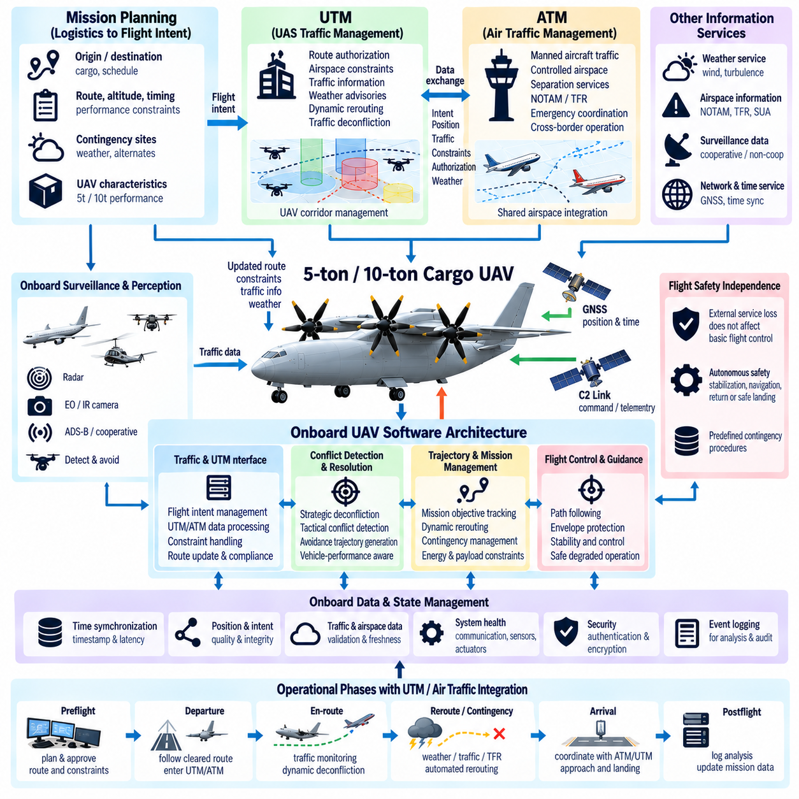
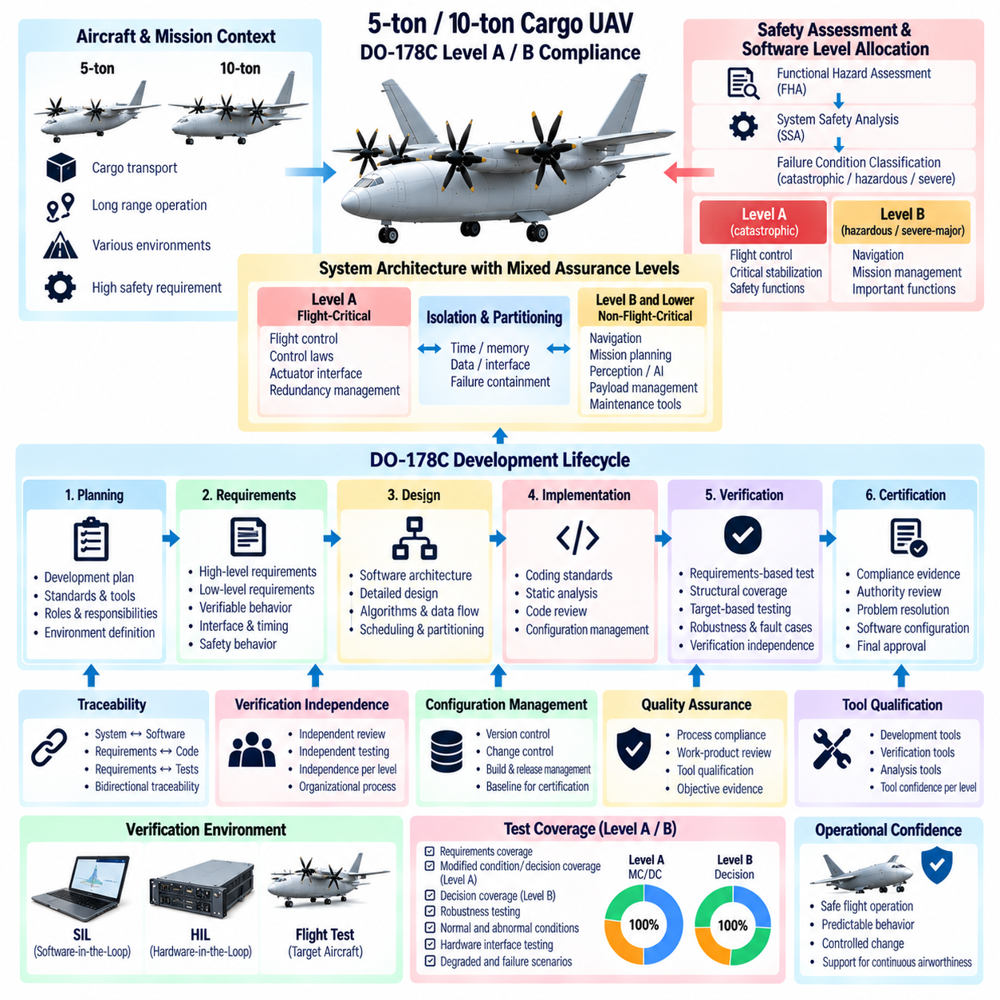
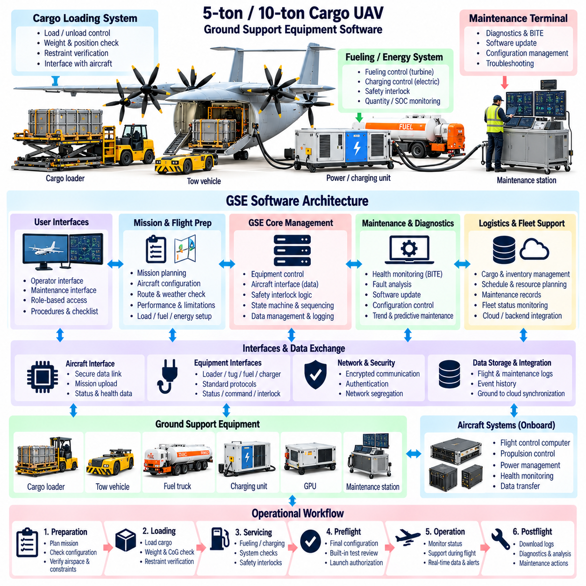
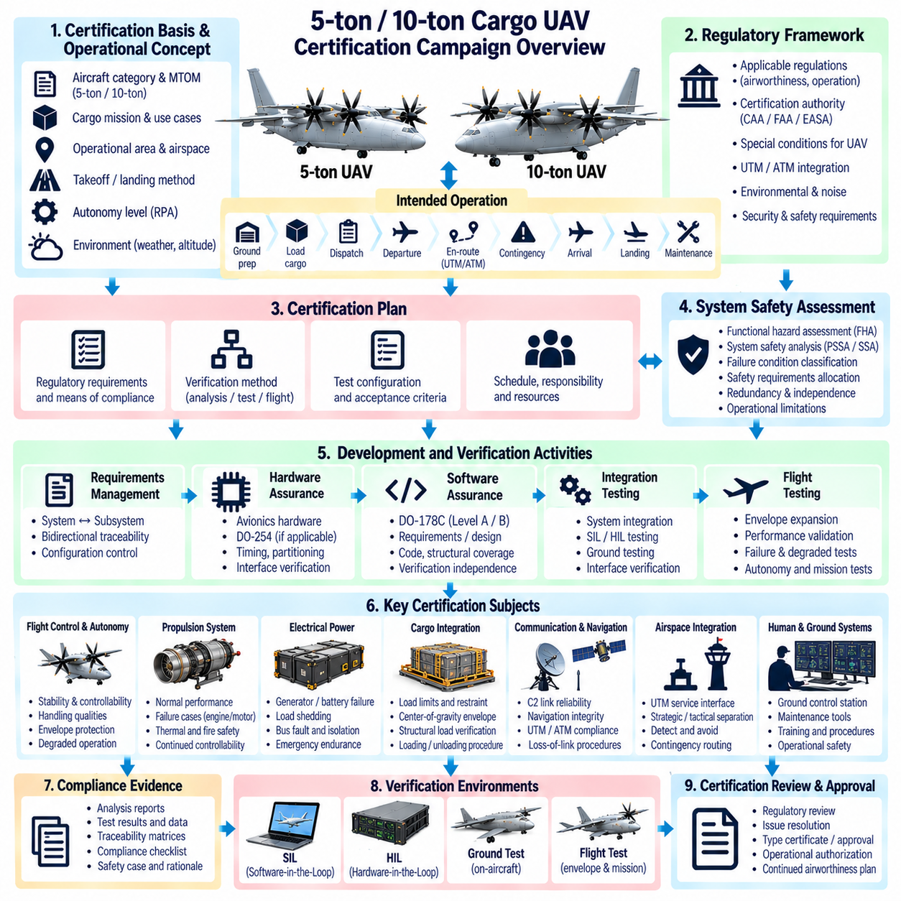

**Volume 23. Cargo UAV Autonomy and Flight AI**

# Chapter 11. 5t and 10t UAV SW Architecture

## 11.01. 5t 10t UAV Design Drivers and SW Differences

{width="7.268055555555556in" height="7.268055555555556in"}

The software architecture of 5-ton and 10-ton cargo UAVs is driven by substantially different operational assumptions from those used for small unmanned aircraft. Vehicle mass, payload capacity, propulsion energy, flight duration, operating altitude, and kinetic energy increase the consequences of software or hardware failures. The architecture must therefore emphasize deterministic control, fault containment, redundancy, continuous health monitoring, and predictable degraded operation.

A 5-ton cargo UAV can typically be treated as a heavy autonomous aircraft whose software coordinates flight control, navigation, propulsion, payload management, communication, and mission execution through clearly separated functional domains. Although autonomy may reduce dependence on a human pilot, the flight-critical software must remain isolated from computationally intensive perception and AI functions. This separation prevents failures or timing overruns in high-level autonomy from propagating into stabilization and vehicle-control loops.

The 10-ton class introduces a further increase in system complexity because propulsion, power distribution, actuators, communication networks, and flight computers may contain more replicated components. Software must manage these distributed resources as a coordinated aircraft rather than as independent subsystems. Redundancy management consequently becomes a primary architectural function responsible for determining component validity, selecting healthy resources, detecting disagreement, and performing controlled reconfiguration without destabilizing the vehicle.

Vehicle scale strongly influences the timing architecture. Inner-loop stabilization may require deterministic execution at high frequencies, while navigation, trajectory generation, mission planning, and fleet coordination operate at progressively slower rates. The software should therefore use a hierarchical timing model in which each function has defined execution periods, latency budgets, jitter limits, and data-age requirements. Time synchronization across distributed computers becomes increasingly important as the number of sensors and controllers grows.

A major difference between the two vehicle classes appears in computational partitioning. A 5-ton UAV may use several redundant flight computers combined with separate mission and perception computers. A 10-ton platform can require a more explicitly distributed computing architecture containing multiple flight-control channels, propulsion controllers, vehicle-management computers, safety monitors, and autonomy processors. Communication between these nodes must use well-defined interfaces so that individual computing elements can be replaced without redesigning the complete software stack.

Flight-control authority must remain clearly bounded regardless of vehicle size. High-level autonomy may request a trajectory, velocity, destination, or mission action, but certified or safety-critical control functions should validate these commands before they reach actuators. Command envelopes can constrain airspeed, attitude, acceleration, load factor, altitude, thrust, and actuator demand. This architecture allows advanced AI capabilities to contribute to mission performance without granting them unrestricted control over safety-critical vehicle dynamics.

Sensor architecture also changes with increasing aircraft size. Both platforms may integrate GNSS, inertial measurement units, radar altimeters, air-data sensors, cameras, LiDAR, weather sensors, and propulsion feedback, but the 10-ton vehicle may require greater sensor diversity and physical separation. Software must track sensor provenance, synchronization, calibration status, confidence, and failure state so that navigation and control functions understand not only the estimated aircraft state but also the reliability of the observations supporting it.

Fault detection, isolation, and recovery are fundamental design drivers. A single sensor anomaly should not immediately cause mission termination, while correlated failures must not be mistaken for independent events. The software therefore needs consistency checks, analytical redundancy, voting mechanisms, timeout monitoring, range validation, and model-based residuals. When confidence decreases, the vehicle can transition through predefined degraded modes while preserving stabilization, navigation, communication, and safe landing capability.

Propulsion management creates another important architectural distinction. Heavy cargo UAVs may employ distributed electric propulsion, hybrid-electric systems, turbine engines, or other multi-engine configurations. The software must coordinate thrust commands with energy availability, thermal conditions, engine health, and aerodynamic control requirements. On a 10-ton vehicle, propulsion failures can produce larger asymmetric forces, making rapid fault identification and coordinated control allocation particularly important for maintaining controllability.

Power and energy management must also become part of the aircraft-level software architecture. Computing systems, actuators, sensors, communication equipment, payload mechanisms, and propulsion components compete for limited electrical resources. Software should monitor generation, storage, distribution, temperature, and consumption while distinguishing essential from nonessential loads. During abnormal conditions, controlled load shedding can preserve flight-critical functions and provide sufficient energy for diversion, emergency landing, or recovery operations.

The mission-management layer must account for the operational consequences of carrying large payloads. Loading condition, center of gravity, gross mass, fuel or battery state, environmental conditions, and landing-site characteristics can significantly alter vehicle performance. Mission software should therefore evaluate feasibility before departure and continuously reassess margins during flight. Changes in payload state or energy reserves can trigger trajectory replanning while remaining inside limits established by the flight-safety layer.

Cargo handling introduces interfaces that are uncommon in smaller UAV architectures. Door mechanisms, winches, loading systems, locking devices, payload sensors, and ground equipment may interact with mission software. These functions should be governed by interlocks that prevent unsafe actions during flight phases where payload movement could compromise stability. The flight-control system should receive relevant payload state information so that mass-property changes can be incorporated into estimation, control allocation, and performance calculations.

Communication requirements expand as the vehicle becomes more operationally consequential. The architecture may support command-and-control links, telemetry, payload communication, maintenance channels, navigation corrections, and traffic-management interfaces. These channels should be logically separated according to criticality and security requirements. Loss of a noncritical data link must not disturb flight control, while loss of command-and-control communication should activate a deterministic contingency behavior defined before the mission.

Network design becomes especially important for the 10-ton platform. Multiple computers exchanging high-rate state, actuator, propulsion, and health information can create congestion or nondeterministic delays if traffic is unmanaged. Critical messages should therefore receive bounded latency and predictable priority. Network redundancy should avoid common failure paths, and software should detect link degradation before communication is completely lost. Timestamped data allows receiving functions to reject stale information and maintain temporal consistency.

Cybersecurity must be integrated without violating real-time requirements. Authentication, secure boot, signed software, encrypted external communication, access control, and protected maintenance interfaces reduce the possibility of unauthorized modification or command injection. At the same time, security mechanisms must not introduce unpredictable delays into flight-critical paths. The architecture should separate externally exposed services from control networks and enforce carefully defined gateways between operational, maintenance, payload, and safety domains.

Software update strategy is another significant design driver because heavy UAVs can remain in service for many years. Flight-critical software, autonomy models, maps, perception networks, and mission applications evolve at different rates and should not require simultaneous replacement. Modular deployment allows individual components to be updated while preserving verified interfaces. Version compatibility, rollback capability, configuration control, cryptographic verification, and recorded software provenance are necessary for maintaining an auditable operational baseline.

Verification requirements grow with aircraft size and operational risk. Software behavior should be evaluated through unit testing, integration testing, software-in-the-loop simulation, hardware-in-the-loop testing, fault injection, Monte Carlo simulation, and progressively representative flight testing. The 10-ton architecture particularly benefits from digital models capable of reproducing propulsion failures, actuator faults, sensor corruption, communication delays, environmental disturbances, and combinations of failures that would be unsafe to create directly in flight.

Simulation must represent differences between nominal performance and abnormal operation rather than merely demonstrating successful missions. Test environments should evaluate timing overload, stale sensor data, processor resets, network partitions, power interruptions, actuator saturation, navigation degradation, and unexpected payload conditions. Requirements can then be traced to measurable evidence showing that the software reaches a defined safe state. This approach converts redundancy from a hardware feature into verified system behavior.

Maintenance and fleet operation also influence software architecture. Heavy cargo UAVs generate extensive health, event, and performance data that can support condition-based maintenance and reliability analysis. Onboard software should record synchronized diagnostic information without interfering with real-time control. Ground systems can analyze trends in propulsion efficiency, actuator response, sensor drift, thermal behavior, and communication quality, allowing maintenance decisions to be based on measured degradation rather than fixed schedules alone.

Despite their differences, 5-ton and 10-ton UAVs should share a common architectural philosophy wherever practical. Standardized interfaces, reusable safety services, common health-monitoring frameworks, consistent mission abstractions, and portable autonomy components reduce development cost and simplify verification. Vehicle-specific differences can then be concentrated in configuration, control laws, propulsion management, redundancy policies, performance envelopes, and hardware abstraction layers instead of producing entirely independent software ecosystems.

The central design distinction is therefore not simply that a 10-ton UAV needs more computing power than a 5-ton UAV. Increasing scale changes the consequences of failure, the number of interacting subsystems, the complexity of redundancy, and the rigor required for deterministic recovery. A successful architecture treats autonomy, flight control, safety, networking, propulsion, energy, payload, and maintenance as coordinated but fault-contained domains, enabling both aircraft classes to evolve toward dependable large-scale autonomous cargo operations.

## 11.02. 5t UAV Flight Control Law Heavy Lift [w/Code]

{width="7.268055555555556in" height="7.268055555555556in"}

A 5-ton heavy-lift UAV requires a flight control law designed around high inertia, large payload variation, strong propulsion coupling, and significantly greater consequences of unstable motion than those of small UAVs. The controller must provide predictable handling throughout takeoff, climb, cruise, approach, and landing while maintaining sufficient stability margins under changing mass, center-of-gravity, aerodynamic, and environmental conditions.

The control architecture is typically organized as nested loops with different bandwidths. Fast inner loops regulate angular rates and attitude, while slower outer loops regulate velocity, altitude, position, and trajectory. This hierarchy prevents mission-level commands from directly exciting rapid vehicle dynamics. Each loop requires explicitly allocated timing, latency, and stability margins so that distributed computation and communication delays do not degrade closed-loop performance.

Heavy-lift dynamics create particular challenges because a 5-ton aircraft cannot rapidly correct disturbances using the aggressive maneuvers available to small multirotors. Large inertia reduces angular acceleration for a given control moment, while structural and propulsion constraints limit how quickly thrust can change. The control law must therefore anticipate vehicle response, avoid excessive command transients, and maintain adequate control authority before disturbances develop into large attitude or trajectory errors.

Accurate state estimation is fundamental to control performance. The flight controller depends on synchronized measurements from inertial measurement units, GNSS, air-data sensors, radar or laser altimeters, propulsion sensors, and other navigation sources. Sensor fusion produces estimates of position, velocity, attitude, angular rate, altitude, and acceleration together with confidence information that allows the controller to adapt its behavior when individual measurements become degraded or unavailable.

Payload variation introduces large changes in mass properties. A vehicle may operate nearly empty on one mission and close to maximum takeoff mass on another, producing different acceleration, climb, braking, and maneuvering characteristics. The controller should therefore use validated mass and center-of-gravity information rather than assuming a fixed vehicle model. Gain scheduling or model-based adaptation can maintain comparable handling characteristics across the approved loading envelope.

Center-of-gravity displacement is particularly important for cargo operations because loading errors or payload movement can alter pitch and roll moments. The flight-control system should monitor estimated mass distribution and compare actuator demand against expected behavior. When the center of gravity approaches an approved limit, the controller can reduce maneuver aggressiveness or restrict portions of the flight envelope, preventing control saturation from becoming the first indication of an unsafe loading condition.

For a multirotor or distributed-propulsion heavy UAV, the flight-control law does not directly command individual motors from high-level trajectory requests. Instead, it calculates the total forces and moments required to achieve the desired vehicle motion. A control-allocation function then distributes these demands among available propulsion units and aerodynamic actuators while respecting thrust, rate, thermal, electrical, and mechanical constraints.

Control allocation becomes especially valuable when propulsion units differ in capability. Motor temperature, battery condition, generator output, rotor efficiency, or an emerging fault can reduce available thrust on one channel. Rather than assuming equal actuator performance, the allocator can use current capability estimates to redistribute demand among healthy channels. This allows the aircraft-level controller to preserve required forces and moments without embedding detailed actuator logic inside every control loop.

Actuator saturation must be handled explicitly because a heavy vehicle may encounter conditions where commanded moments cannot physically be generated. Integrator windup, repeated saturation, or competing control objectives can destabilize an otherwise well-tuned controller. Anti-windup mechanisms, command limiting, priority-based allocation, and achievable-set calculations can ensure that stabilization receives higher priority than trajectory tracking when available control authority becomes limited.

Propulsion dynamics also influence controller design. Large rotors, engines, generators, or electric propulsion systems may have meaningful response delays and different rates for increasing and decreasing thrust. The controller should incorporate these dynamics instead of treating thrust as instantaneous. Feedforward terms, dynamic compensation, and carefully shaped commands can reduce altitude deviations and attitude transients during rapid changes in collective thrust or forward-flight demand.

Wind disturbances represent a major external challenge. Gusts, crosswinds, turbulence, and rotor interactions can generate substantial forces over the large projected area of a cargo UAV. Disturbance observers or robust feedback techniques can estimate and reject persistent external forces while avoiding excessive actuator activity. Position-hold performance should be balanced against structural loading and energy consumption rather than attempting to eliminate every small displacement in severe turbulence.

Takeoff control requires careful management of the transition from ground-supported weight to fully airborne flight. Thrust buildup must remain coordinated across propulsion channels while the controller avoids reacting excessively to sensor vibration or ground-contact effects. Ground-state logic, weight-on-support detection, altitude confirmation, and thrust thresholds can prevent premature attitude corrections and provide a deterministic transition into the normal airborne control mode.

Landing introduces another demanding regime because vertical velocity, horizontal drift, attitude, and touchdown loads must be controlled simultaneously. The controller should reduce descent rate as the aircraft approaches the surface while preserving enough authority to reject gusts. Terrain-relative altitude sensing can complement GNSS, and touchdown detection should reliably distinguish actual ground contact from temporary acceleration or sensor anomalies before thrust is reduced.

Emergency control modes must be designed as part of the primary flight-control architecture rather than added after nominal control development. Loss of a propulsion unit, degraded navigation, actuator malfunction, communication failure, or reduced electrical power may require different control objectives. The controller can progressively sacrifice position accuracy, trajectory performance, or mission completion while maintaining attitude stability and controllability as the highest priorities.

Propulsion failure on a heavy multirotor creates both thrust loss and an asymmetric moment. Detection must therefore occur quickly enough for the controller and allocator to reconfigure before attitude errors become excessive. The failed channel should be removed from the available actuator set, remaining thrust should be redistributed, and trajectory demands should be reduced to values achievable with the degraded configuration. Landing may then become the dominant mission objective.

Navigation degradation requires a different form of control reconfiguration. Loss or corruption of GNSS should not affect the basic attitude loops, because stabilization should depend primarily on local inertial measurements. Position-level functions can transition to alternative navigation sources such as visual, LiDAR, radar, or inertial estimates. If absolute position confidence becomes insufficient, the vehicle can abandon precision trajectory tracking while retaining bounded velocity, attitude, and altitude behavior.

Structural flexibility can become relevant at the 5-ton scale because large arms, wings, rotor supports, landing structures, or cargo assemblies may contain vibration modes within the broader control spectrum. A controller that excites these modes can create oscillations even when rigid-body stability appears satisfactory. Notch filtering, command shaping, bandwidth separation, structural-mode identification, and sensor placement should therefore be considered during control-law development and validation.

Flight-envelope protection provides an additional safety layer around normal control laws. Limits on attitude, angular rate, airspeed, descent rate, acceleration, load factor, actuator demand, and energy state can prevent autonomy or operator commands from driving the vehicle into poorly controlled regions. Protection logic should intervene smoothly and predictably, ensuring that constraint enforcement does not itself introduce discontinuities capable of destabilizing the aircraft.

The control law must interact with trajectory generation through a carefully defined contract. The planner provides dynamically reasonable references, while the controller reports tracking capability, available acceleration, actuator margin, and degraded-state restrictions. If the vehicle cannot satisfy a requested trajectory, the correct response is not persistent saturation but negotiation of a feasible reference. This separation improves both stability and modularity across different mission-planning systems.

Deterministic software execution is essential because control performance depends on both mathematical algorithms and implementation timing. Inner-loop tasks should execute at defined rates with bounded jitter, while sensor timestamps must represent the actual measurement time. Delayed or stale information should be detected rather than silently processed as current data. Worst-case execution time and communication latency therefore become part of the practical stability analysis.

Software-in-the-loop and hardware-in-the-loop testing should expose the controller to a broad range of vehicle parameters and disturbances before flight. Tests can vary payload mass, center of gravity, actuator effectiveness, propulsion delay, wind, sensor noise, communication latency, and navigation quality. Monte Carlo campaigns help identify combinations that reduce stability or control margins even when each individual parameter remains within its expected operating range.

Flight-test expansion should proceed from highly constrained conditions toward the full operational envelope. Initial tests verify basic stabilization and actuator direction before progressing through hover, translation, climb, descent, higher speeds, representative payloads, crosswinds, and controlled degraded configurations. Recorded data should be compared with simulation predictions so that model discrepancies are understood before more demanding operating regions are authorized.

Performance assessment should extend beyond simple trajectory error. Relevant measures include stability margins, settling time, overshoot, disturbance rejection, actuator utilization, control-allocation residuals, energy consumption, structural response, and remaining control authority. Monitoring these quantities provides evidence that acceptable tracking performance is not being achieved by operating actuators continuously near saturation or consuming excessive redundancy margins.

Ultimately, the 5-ton heavy-lift flight-control law must convert a physically slow, high-energy, payload-sensitive aircraft into a predictable autonomous platform. Its effectiveness depends on coordinated state estimation, hierarchical feedback, control allocation, envelope protection, fault accommodation, deterministic execution, and rigorous validation. The objective is not maximum maneuverability, but stable and controllable behavior with measurable safety margins across nominal, degraded, and emergency operating conditions.

## 11.03. 5t UAV Redundant Avionics Architecture [w/Code]

{width="7.268055555555556in" height="7.268055555555556in"}

A 5-ton cargo UAV requires a redundant avionics architecture capable of maintaining controlled flight after credible failures of computers, sensors, communication links, power channels, or actuators. Because the aircraft carries substantial kinetic energy and payload, redundancy must be designed as a coordinated system property rather than as simple duplication. Fault detection, isolation, voting, reconfiguration, and degraded-mode management are therefore fundamental architectural functions.

The avionics architecture should separate flight-critical control from mission, perception, payload, and maintenance computing. Flight-control computers execute deterministic stabilization, guidance interfaces, actuator commands, and safety functions, while higher-level processors perform trajectory planning, perception, AI inference, and mission optimization. Controlled interfaces between these domains prevent failures or computational overload in noncritical software from propagating into flight-critical execution.

Multiple flight-control computer channels provide the foundation for computational redundancy. A practical architecture may use dual or triple channels depending on the safety objectives and required fault tolerance. Each channel independently processes sensor information and computes control outputs. Cross-channel monitoring compares internal states, timing, and command values so that disagreement can be detected before an erroneous channel gains unacceptable influence over aircraft behavior.

Triple-redundant architectures support majority voting when three valid and sufficiently independent channels are available. If one channel produces outputs inconsistent with the other two, voting logic can identify and isolate the disagreeing channel while maintaining control through the remaining pair. However, redundancy is effective only when common-cause failures are controlled, so software versions, power sources, clock dependencies, communication paths, and environmental exposure must be considered during architecture development.

Dual-redundant systems present a different challenge because disagreement between two channels does not inherently reveal which channel is correct. Additional independent monitors, sensor consistency checks, analytical models, or dissimilar safety computers can provide the information required for fault discrimination. The architecture should define deterministic rules for resolving disagreement rather than relying on ambiguous switching behavior during a time-critical failure.

Sensor redundancy must support both availability and integrity. Multiple inertial measurement units, GNSS receivers, altitude sensors, air-data sources, and propulsion feedback channels can provide independent observations of vehicle state. Sensor-management software evaluates measurement ranges, rates of change, timestamps, noise characteristics, cross-sensor consistency, and model residuals. A sensor should be excluded because evidence indicates degradation, not merely because another sensor reports a different value.

Physical separation is important because several logically redundant devices can still fail simultaneously if they share the same environmental vulnerability. Redundant sensors and computers should, where practical, use separated mounting locations, wiring routes, connectors, network paths, and power feeds. Thermal zones, vibration exposure, electromagnetic interference, moisture ingress, and mechanical damage should be evaluated to prevent a single physical event from disabling multiple supposedly independent channels.

Power architecture forms another layer of redundancy. Flight-critical computers, sensors, communication equipment, and actuators should not depend on a single electrical distribution path. Independent buses, protected converters, batteries, generators, and switching elements can maintain essential loads after a source failure. Avionics software must continuously monitor voltage, current, temperature, source status, and remaining energy so that electrical degradation becomes visible before critical functions are lost.

Load shedding should be coordinated with avionics criticality. When available electrical power decreases, payload processors, high-performance perception computers, nonessential communication equipment, or auxiliary systems can be reduced or disconnected before flight-control functions are affected. The system should use predefined priorities rather than making arbitrary decisions during an emergency. This allows the aircraft to preserve stabilization, navigation, essential communication, and landing capability for as long as possible.

Redundant communication networks connect distributed avionics without creating a single shared failure point. Flight-control data can be transmitted over independent network paths with bounded latency and deterministic scheduling. Critical messages should include sequence information, timestamps, source identification, and integrity checks. Receivers can then identify missing, duplicated, corrupted, or stale data rather than treating every received packet as valid aircraft state information.

Time synchronization is especially important in redundant systems because voting data generated at different times can appear inconsistent even when every channel is operating correctly. A common time base should therefore be distributed with known accuracy, while local clocks retain sufficient stability during temporary synchronization loss. Sensor measurements and control messages should preserve acquisition timestamps so that comparisons are performed on temporally aligned information rather than arrival order alone.

Redundancy management software should maintain an explicit health state for every safety-relevant resource. A component may be classified as healthy, suspected, degraded, failed, isolated, or recovering according to validated transition rules. This approach prevents rapid oscillation between resources when measurements fluctuate near fault thresholds. Hysteresis, persistence timers, confidence metrics, and recovery qualification can provide stable reconfiguration behavior under intermittent faults.

Fault detection should combine several forms of evidence. Built-in tests can identify internal hardware problems, while watchdogs detect missed execution deadlines or processor stalls. Cross-channel comparison reveals disagreement, and analytical monitors compare measured behavior with expected vehicle dynamics. Network supervision identifies communication faults, while power monitoring detects electrical anomalies. Combining these mechanisms reduces dependence on any single diagnostic method and improves fault coverage.

Fault isolation determines whether a detected anomaly belongs to a sensor, computer, network, power source, actuator, or external disturbance. Incorrect isolation can be more dangerous than delayed detection because a healthy resource may be removed while the actual failure remains active. Diagnostic logic should therefore use system-level context, including correlated events and shared dependencies, before commanding irreversible isolation or major control reconfiguration.

Reconfiguration must preserve continuity of control. When a flight computer or communication path fails, switching to another channel should avoid discontinuities in state estimates, integrator values, actuator commands, and mode logic. Standby channels may therefore operate in synchronized hot-standby mode rather than starting from an uninitialized state after failure. State transfer and bumpless switching techniques reduce transients during changes in the active control path.

Actuator redundancy extends avionics fault tolerance into the physical control system. Distributed propulsion, duplicated servo channels, or multiple aerodynamic surfaces may provide alternative means of producing required forces and moments. The avionics system should maintain current estimates of actuator availability and effectiveness. Control allocation can then redistribute commands following a failure instead of continuing to demand performance from an actuator that is unavailable or severely degraded.

Propulsion monitoring is particularly critical for a 5-ton UAV because loss of thrust may rapidly create asymmetric forces and reduced vertical capability. Motor or engine controllers should report rotational speed, commanded and delivered thrust indicators, temperature, electrical state, vibration, and internal fault information. Aircraft-level avionics correlate these measurements with vehicle response to determine whether a propulsion channel remains trustworthy and how much control authority is still available.

Navigation redundancy should support operation through individual sensor failures and temporary loss of external positioning. GNSS can be complemented by inertial navigation, visual odometry, LiDAR, radar, terrain-relative navigation, or other independent sources according to the mission. The navigation system should expose both its estimated state and associated integrity or uncertainty so that flight-control and mission software can distinguish precise navigation from merely available navigation.

A separate safety-monitoring function can provide protection against failures that affect the primary computing architecture. This monitor may use simplified independent logic to observe attitude, altitude, velocity, processor health, communication status, and flight-envelope boundaries. It does not need to reproduce every autonomy capability. Its purpose is to detect unacceptable conditions and initiate bounded protective actions when the primary system can no longer be trusted.

Degraded operating modes should be defined before failures occur. Loss of redundancy does not always require immediate landing, but it should change the operational envelope and mission policy. The aircraft may restrict speed, altitude, maneuvering, weather exposure, or destination options after a channel failure. Further degradation can trigger diversion, return-to-base, precautionary landing, or emergency landing according to remaining navigation, propulsion, power, and control capability.

Common-cause failure analysis is essential because adding more identical components does not automatically increase safety. A software defect, incorrect configuration, shared power transient, network protocol error, electromagnetic event, or environmental condition may affect several redundant channels simultaneously. Independence should therefore be evaluated across hardware, software, data, power, timing, installation, and maintenance processes rather than measured only by the number of installed devices.

Dissimilarity can reduce selected common-cause risks when justified by safety analysis. Independent monitoring software, different sensor technologies, separate power-conversion paths, or diverse navigation principles may prevent one failure mechanism from defeating all channels. However, unnecessary diversity can increase integration and verification complexity. The architecture should therefore apply dissimilarity where it addresses identified hazards rather than treating diversity as an objective by itself.

Maintenance architecture must preserve redundancy after the aircraft returns to service. Configuration errors, incorrect replacement parts, incomplete calibration, or mismatched software versions can silently compromise fault tolerance before takeoff. Automated preflight checks should verify hardware identity, software compatibility, sensor status, power paths, network connectivity, synchronization, and redundancy availability. Maintenance records should preserve the history of faults, replacements, and configuration changes.

Verification must demonstrate not only nominal performance but successful behavior during combinations of failures. Software-in-the-loop and hardware-in-the-loop environments can inject processor resets, sensor bias, frozen data, network delay, packet loss, power-source failures, actuator degradation, and timing faults. Tests should confirm detection latency, isolation correctness, switching transients, remaining control authority, and the final degraded mode reached by the aircraft.

The resulting redundant avionics architecture should provide graceful degradation rather than an unrealistic expectation of uninterrupted full capability after every failure. Its objective is to ensure that individual faults are contained, detected, and managed while essential flight functions remain available. By combining computational, sensor, network, power, actuator, navigation, and safety-monitoring redundancy, the 5-ton UAV can maintain predictable behavior and measurable safety margins throughout demanding cargo operations.

## 11.04. 10t UAV Turbine Hybrid Propulsion SW [w/Code]

{width="7.268055555555556in" height="7.268055555555556in"}

A 10-ton cargo UAV using turbine-hybrid propulsion requires software that coordinates turbine engines, generators, electrical storage, power converters, motors, and aircraft-level flight control as one integrated energy and propulsion system. The software must balance thrust demand, electrical generation, fuel consumption, battery state, thermal limits, and component health while preserving deterministic response for flight-critical propulsion commands.

The hybrid architecture separates energy production from distributed thrust generation. A turbine may drive one or more generators that supply electrical buses, while batteries or other storage devices absorb transients and provide reserve power. Electric motors then convert distributed electrical energy into propulsive force. Software becomes responsible for coordinating energy flow across these domains so that temporary differences between generated power and propulsion demand do not destabilize the aircraft.

A hierarchical propulsion-control structure is appropriate for this scale. Aircraft-level software determines required total forces, moments, and power, while propulsion-management software converts these objectives into turbine, generator, battery, and motor operating targets. Local controllers regulate individual machines at faster rates. This separation allows high-level optimization without placing detailed turbine or motor dynamics directly inside the primary flight-control loops.

The turbine controller must manage start, acceleration, steady operation, deceleration, shutdown, and abnormal conditions within validated operating limits. Rotor speed, exhaust temperature, fuel flow, compressor condition, lubrication, vibration, and generator load are monitored continuously. Command scheduling should prevent excessive thermal or mechanical transients while still providing sufficient power response to support changes in aircraft thrust demand.

Turbines generally respond more slowly than electric motors, creating an important control challenge. Rapid thrust changes can produce electrical demand faster than the turbine-generator system can increase output. Energy storage therefore acts as a dynamic buffer. Propulsion software predicts short-term power demand and coordinates battery discharge or charge so that motor commands can respond quickly without forcing the turbine beyond safe acceleration or temperature limits.

Energy-management software should maintain sufficient battery state of charge for more than nominal efficiency optimization. Stored energy represents a safety resource that may be required for takeoff, landing, rejected maneuvers, turbine transients, generator failures, or emergency descent. The control strategy should therefore preserve configurable reserve margins and prevent routine mission optimization from consuming energy needed to manage credible abnormal conditions.

Power-flow management must account for conversion losses and component limitations. Generator output passes through electrical distribution and power electronics before reaching propulsion motors or storage systems. Each stage has current, voltage, temperature, and power limits. The software should calculate available rather than theoretical power, incorporating derating caused by thermal conditions, altitude, component aging, or faults when determining feasible propulsion commands.

Electrical bus regulation is a central function because distributed motors can create large and rapidly changing loads. Bus voltage must remain within acceptable limits during acceleration, regenerative events, load switching, or component isolation. Battery converters, generator controllers, and load-management functions can cooperate to stabilize the bus. Protection logic must distinguish recoverable voltage excursions from faults requiring immediate isolation of a power channel.

A 10-ton platform may use multiple turbine-generator channels to provide propulsion redundancy. Aircraft-level software must know the current capacity, efficiency, temperature, and health of each channel rather than simply assuming equal contribution. Power commands can then be distributed according to available capability. If one generator becomes limited, remaining generators and energy storage can temporarily compensate while the flight system reduces demand or initiates a contingency.

Distributed electric propulsion requires close coordination between energy management and control allocation. The flight controller determines the forces and moments needed for vehicle motion, while the allocator distributes thrust among available motors. The energy manager verifies whether the resulting electrical demand is sustainable. When power is constrained, the architecture must resolve competing objectives by prioritizing stabilization and controllability over trajectory accuracy or mission performance.

Motor and inverter controllers should provide high-rate feedback on rotational speed, current, voltage, torque indicators, temperature, and internal faults. Aircraft-level software compares commanded and observed behavior to estimate propulsion effectiveness. A motor producing less thrust than expected may indicate electrical limitation, mechanical damage, rotor degradation, or aerodynamic interference. Such information allows control allocation to adapt before a complete propulsion failure occurs.

Thermal management is inseparable from propulsion control because turbines, generators, batteries, inverters, motors, and cooling systems all have temperature-dependent capability. The software should predict thermal trends rather than responding only after limits are exceeded. Progressive derating can reduce power before protective shutdown becomes necessary, while mission planning can account for ambient temperature, altitude, hover duration, and expected cooling effectiveness.

Fuel management remains important even when thrust is produced electrically. Turbine fuel consumption depends on operating point, generator loading, atmospheric conditions, and transient behavior. Energy-management algorithms can schedule turbines near efficient operating regions while batteries handle short-duration variations. However, efficiency optimization must remain subordinate to safety, propulsion availability, reserve requirements, thermal constraints, and the need for rapid response during critical flight phases.

The propulsion software should use explicit operating modes such as initialization, start, warm-up, normal generation, high-demand operation, degraded operation, emergency power, cooldown, and shutdown. Transitions between modes require verified entry conditions and bounded actions. Mode logic prevents conflicting commands, such as demanding maximum generator power before a turbine has reached a valid operating condition or disconnecting storage during a critical transient.

Start sequencing becomes more complex when multiple turbines, generators, batteries, and electrical buses interact. Software must verify fuel availability, battery condition, contactor state, cooling readiness, communication integrity, and controller health before initiating start. After ignition, generator connection should occur only after speed, voltage, frequency, temperature, and synchronization requirements are satisfied. Failed starts must lead to controlled recovery rather than repeated uncontrolled attempts.

Fault detection, isolation, and recovery should operate across both mechanical and electrical domains. Turbine overtemperature, generator faults, inverter failures, battery abnormalities, bus faults, cooling degradation, sensor errors, and motor failures can produce similar symptoms at the aircraft level. Diagnostic software therefore correlates measurements across components to identify the likely fault source before isolating equipment or significantly changing propulsion configuration.

A turbine failure requires coordinated energy and flight responses. The affected generator channel should be isolated if necessary, while batteries and remaining generation sources immediately support essential propulsion loads. The energy manager calculates revised sustainable power, and the flight-control system receives updated thrust limits. Mission software can then reduce speed, climb demand, or maneuvering and determine whether continued flight, diversion, or immediate landing is appropriate.

Generator or electrical distribution failures may occur even when the turbine itself remains mechanically healthy. The architecture should distinguish loss of mechanical power production from loss of electrical conversion or transmission. This distinction prevents unnecessary turbine shutdown and supports alternative configurations where power can be rerouted through another bus or converter. Isolation logic must act rapidly enough to prevent a local electrical fault from collapsing healthy power channels.

Battery faults require particularly careful containment because high-energy storage can introduce thermal and electrical hazards. Battery-management software monitors cell voltage, temperature, current, insulation state, state of charge, and state of health. Abnormal modules may require current limitation or isolation. The aircraft must then recalculate available transient and emergency power because removing storage capacity can significantly reduce propulsion response even when turbine generation remains available.

Communication between propulsion controllers should use deterministic interfaces with timestamps, validity information, sequence counters, and integrity checks. Commands and measurements must have defined update rates and timeout behavior. A stale thrust or power command should never remain active indefinitely after communication loss. Local controllers require safe fallback behavior that maintains bounded operation while aircraft-level software determines the appropriate degraded configuration.

Time synchronization supports accurate correlation of turbine, generator, battery, motor, and aircraft dynamics. When a thrust deficit occurs, diagnostic functions must determine whether electrical power changed before motor speed, whether turbine response lagged generator demand, or whether a sensor simply reported late. Preserving measurement timestamps across the propulsion network improves fault isolation, transient analysis, control tuning, and post-flight investigation.

Cybersecurity must protect propulsion configuration and commands without compromising deterministic control. Secure boot, authenticated software, protected calibration data, access-controlled maintenance interfaces, and authenticated external updates reduce the risk of unauthorized changes. Network segmentation should prevent payload or mission applications from directly issuing low-level propulsion commands, while safety gateways expose only the interfaces required for legitimate aircraft-level control.

Propulsion software verification requires high-fidelity models spanning mechanical, electrical, thermal, and flight dynamics. Software-in-the-loop testing can evaluate energy-management algorithms over long missions, while hardware-in-the-loop environments reproduce controller timing, bus behavior, sensors, and communication faults. Fault injection should include turbine loss, generator trips, battery isolation, inverter faults, motor degradation, cooling failures, and combinations of reduced-capability conditions.

Transient testing is especially important because hybrid systems may appear stable during steady operation while failing during rapid power redistribution. Verification should examine takeoff power application, aggressive climb commands, sudden thrust reduction, generator connection and disconnection, turbine failure, battery current limiting, and emergency landing. Voltage excursions, thermal response, control continuity, and remaining propulsion margin should be measured throughout each event.

Mission planning should receive propulsion capability as a dynamic constraint rather than assuming a fixed performance envelope. Available power changes with fuel quantity, battery state, temperature, altitude, component health, and redundancy status. By exposing these limits to trajectory and mission software, the aircraft can avoid requesting climbs, speeds, or hover durations that cannot be sustained under the current energy configuration.

The central objective of 10-ton turbine-hybrid propulsion software is therefore coordinated management of propulsion authority and energy availability. Turbines provide high-energy endurance, electrical storage supplies rapid response and reserve capability, and distributed motors provide controllable thrust. Reliable operation emerges when flight control, energy management, thermal protection, fault handling, and power distribution continuously exchange validated capability information.

A well-designed system does not attempt to maximize turbine efficiency, battery utilization, or motor performance independently. It optimizes the complete aircraft while preserving safety margins and graceful degradation. Through deterministic control, predictive energy management, redundant power paths, fault containment, and rigorous verification, turbine-hybrid propulsion software can support the sustained power, rapid response, and fault tolerance required for autonomous 10-ton cargo UAV operations.

## 11.05. 10t UAV Fly By Wire and Actuator Control [w/Code]

{width="7.268055555555556in" height="7.268055555555556in"}

A 10-ton cargo UAV requires a fly-by-wire system that converts autonomous guidance and flight-control commands into precise, bounded, and fault-tolerant actuator motion. Mechanical control authority is replaced by electronic sensing, computation, communication, and actuation, making software part of the primary flight-control path. The architecture must therefore preserve deterministic timing, signal integrity, redundancy, and predictable behavior after credible failures.

The fly-by-wire architecture should separate guidance objectives from actuator-level execution. Mission software generates trajectory objectives, the flight-control system calculates required forces and moments, and control allocation converts these demands into surface, rotor, thrust-vector, or other actuator commands. Local actuator controllers then close fast position, velocity, force, or torque loops. This hierarchy prevents high-level autonomy from directly commanding safety-critical hardware.

Command processing begins with validation before any requested motion reaches an actuator. Software should verify command source, freshness, sequence, range, rate, and compatibility with the current flight mode. Invalid, stale, discontinuous, or physically impossible commands are rejected or limited. This boundary protects the physical aircraft from communication faults, software anomalies, and inappropriate commands generated elsewhere in the autonomous system.

A heavy UAV may employ electromechanical, electrohydraulic, or hybrid actuation depending on control force, response, weight, and redundancy requirements. The flight-control software should interact through standardized actuator abstractions rather than embedding device-specific behavior throughout the control laws. Each actuator interface can expose commanded state, measured state, available authority, health, temperature, power consumption, and internal fault information.

Actuator dynamics must be represented explicitly because a 10-ton aircraft can require large forces and substantial mechanical travel. Position response, rate limits, acceleration limits, backlash, friction, compliance, hydraulic dynamics, and motor torque constraints affect achievable control performance. The flight-control law and allocator should therefore request motions that remain within validated dynamic capability rather than assuming that actuator commands are reproduced instantaneously.

Rate limiting is especially important for large control surfaces and high-force mechanisms. An abrupt command may exceed actuator power, produce structural loads, or generate undesirable aircraft transients even when the final position remains within limits. Command shaping, acceleration limiting, and jerk management can produce smoother actuator trajectories. These mechanisms should preserve rapid response for stabilization while restricting unnecessary high-frequency motion from slower guidance functions.

Position and force feedback provide evidence that commanded motion has actually occurred. Redundant sensors may measure actuator position, motor current, hydraulic pressure, torque, or surface displacement. Local software compares command and response to identify tracking errors, excessive resistance, runaway behavior, or loss of mechanical coupling. Aircraft-level software can then determine whether an actuator remains fully effective, degraded, jammed, or unavailable.

Redundancy is required where loss of a single actuator channel could threaten controlled flight. Multiple motors, duplicated electronics, independent power feeds, redundant position sensors, or mechanically separated actuation paths can provide continued authority after a failure. Redundancy management must consider independence, because two nominally separate channels connected to the same power converter, communication bus, or mechanical element may still share a common failure mode.

Fly-by-wire computers should also be redundant and continuously cross-monitored. Each control channel processes synchronized sensor data and produces expected actuator demands. Cross-channel comparison detects disagreement in computed commands, internal states, execution timing, or mode selection. Depending on the architecture, voting or independent safety monitoring can isolate a faulty computational channel while preserving uninterrupted control through healthy channels.

Communication between flight-control computers and remote actuator electronics must be deterministic. Critical command and feedback messages require bounded latency, predictable update periods, sequence counters, timestamps, source identification, and integrity protection. If messages are delayed or lost, the actuator controller must distinguish temporary network disturbance from sustained command loss and enter a predefined fallback state rather than continuing indefinitely with stale information.

Time synchronization is necessary because actuator feedback from different channels must represent comparable physical instants. A timestamped architecture allows control computers to distinguish real actuator disagreement from differences caused by communication delay. Accurate temporal alignment also improves fault diagnosis, control allocation, structural-load analysis, and post-flight reconstruction. Local clocks should maintain bounded drift during temporary loss of network synchronization.

Power availability directly affects actuator authority. Large electromechanical actuators can draw substantial current during rapid motion or high aerodynamic loading, while electrohydraulic systems depend on pump and pressure availability. The avionics architecture should therefore exchange power capability with actuator management. When electrical or hydraulic resources become limited, the controller can reduce nonessential motion and preserve authority for stabilization and landing.

Control allocation connects aircraft-level force and moment requirements to the available actuator set. A 10-ton UAV may combine aerodynamic surfaces, differential propulsion, thrust vectoring, rotor-speed control, or other effectors. The allocator should account for effectiveness, position, rate, saturation, power, and health constraints. When one effector degrades, control demand can be redistributed among remaining devices while maintaining the most important stabilization objectives.

Actuator saturation requires coordinated handling throughout the control hierarchy. When a surface reaches its travel limit or a motor reaches its maximum force, upstream controllers must know that additional command cannot be achieved. Without this feedback, integrators can accumulate error and generate severe transients when authority returns. Anti-windup logic, achievable-command estimation, and allocation residuals help maintain stable behavior near physical limits.

A jammed actuator creates a different problem from an actuator that simply loses power. The fixed surface or mechanism may continue generating an aerodynamic or mechanical effect that must be compensated by other effectors. Fault-management software should estimate the actual jam position and update the control-effectiveness model. Remaining actuators can then counter the persistent moment while the flight envelope is reduced to prevent exhaustion of residual control authority.

Runaway behavior requires rapid detection because an actuator moving without valid command can create large forces on a heavy aircraft. Monitoring logic can compare commanded direction, measured position, velocity, current, and expected dynamic response. When runaway is confirmed, the affected drive channel may need to be electrically isolated or mechanically disengaged. Other channels then compensate while the aircraft transitions to an appropriate degraded or emergency mode.

Sensor disagreement within an actuator must be resolved without unnecessary loss of control. Dual position sensors alone cannot always determine which measurement is correct when they disagree. Additional motor rotation, current, pressure, surface-position, or aircraft-response information can support fault discrimination. Triple sensing can enable voting, but common wiring, excitation, or environmental dependencies must still be considered in the safety analysis.

Flight-envelope protection should constrain actuator commands before mechanical or aerodynamic limits are reached. Surface position, hinge moment, structural load, angular rate, airspeed, acceleration, and load factor may all contribute to allowable command boundaries. These limits can vary with aircraft mass, center of gravity, speed, altitude, and configuration. Dynamic protection is therefore more effective than relying only on fixed actuator travel stops.

Structural-load protection becomes particularly important at the 10-ton scale. Large control surfaces and propulsion effectors can generate forces capable of exceeding local or global structural limits if commanded aggressively. Flight-control software can use estimated loads and measured accelerations to moderate actuator demand. Load alleviation functions may redistribute control effort across several effectors while retaining adequate trajectory and attitude control.

Mode management determines how actuator authority changes through takeoff, cruise, approach, landing, ground operation, and emergency conditions. Certain effectors may be enabled, limited, or assigned different control priorities depending on the flight phase. Mode transitions should be explicit, verified, and bumpless. Unexpected combinations of control modes must be prevented so that two functions do not issue incompatible demands to the same actuator.

Ground operation requires special interlocks because large actuators can present hazards to personnel, cargo equipment, and the aircraft itself. Software should restrict surface movement, rotor-related mechanisms, steering, doors, or thrust-vectoring devices according to maintenance and ground states. Transition to flight-ready configuration requires confirmation that locks, supports, access equipment, and actuator inhibit conditions have been properly cleared.

Built-in test functions should continuously evaluate actuator electronics, sensors, communication, power, and mechanical response. Startup tests can verify wiring, sensor plausibility, controller memory, and limited motion where safe, while continuous monitoring detects faults during operation. Maintenance diagnostics should preserve event histories and measured conditions so intermittent problems can be investigated rather than disappearing when the aircraft is powered down.

Degraded control modes should correspond to remaining physical authority. Loss of redundancy may permit continued flight with reduced maneuver limits, while a jammed primary effector may require lower speed, restricted turns, or immediate diversion. Multiple failures may leave only enough authority for controlled descent and landing. The software should calculate capability from actual surviving resources rather than relying only on fixed failure labels.

Software-in-the-loop testing should verify control laws, allocation, mode logic, saturation handling, and failure responses across the full operating envelope. Models should represent actuator rate limits, backlash, delays, nonlinear friction, structural flexibility, power constraints, and sensor errors. Monte Carlo testing can vary these parameters simultaneously to reveal conditions where acceptable nominal tracking conceals insufficient stability or redundancy margins.

Hardware-in-the-loop testing adds real controllers, communication networks, actuator electronics, and representative loads to the verification environment. Fault injection can reproduce frozen feedback, network interruption, power loss, sensor disagreement, actuator slowdown, runaway commands, and jam conditions without endangering the aircraft. Timing measurements should confirm that detection, isolation, reconfiguration, and fallback actions satisfy allocated safety requirements.

Flight testing should expand actuator authority progressively. Early tests confirm command direction, feedback polarity, rate limits, and basic closed-loop response before proceeding to higher speeds, larger loads, representative payloads, and degraded configurations. Measured actuator demand, tracking error, power consumption, structural response, and remaining authority should be compared with simulation predictions before additional portions of the envelope are released.

Cybersecurity is also relevant because fly-by-wire networks directly influence physical motion. Secure boot, authenticated software, protected calibration, controlled maintenance access, and authenticated command interfaces reduce unauthorized modification risk. Network segmentation should prevent payload or external applications from directly addressing actuator controllers. Security mechanisms must remain compatible with the deterministic timing required by flight-critical control.

The central objective of fly-by-wire and actuator-control software is to ensure that every physical control action is valid, achievable, observable, and fault contained. The architecture must know not only what motion was commanded but whether the actuator produced it and how much authority remains. This continuous capability awareness allows the aircraft to adapt control allocation and operating limits as physical resources change.

For a 10-ton autonomous cargo UAV, fly-by-wire is therefore more than replacement of mechanical linkages with electronics. It forms the safety-critical bridge between digital autonomy and high-energy physical motion. Through redundant computation, deterministic networks, actuator health monitoring, envelope protection, graceful reconfiguration, and rigorous verification, the system can preserve predictable control across nominal, degraded, and emergency flight conditions.

## 11.06. 5t 10t Cargo Load CoG Adaptive Control [w/Code]

{width="7.268055555555556in" height="7.268055555555556in"}

A 5-ton or 10-ton cargo UAV can experience large changes in total mass, center of gravity, inertia, and structural loading between missions. Cargo position may also change slightly during operation because of suspension compliance, fuel consumption, liquid motion, or imperfect restraint. Cargo-load and center-of-gravity adaptive control must therefore preserve stability and predictable handling across a substantially wider mass-property envelope than that of a fixed-configuration aircraft.

The control architecture should begin with an explicit aircraft mass-property model. Before flight, cargo weight, location, mounting geometry, fuel quantity, battery configuration, and other variable masses are combined with the empty-aircraft model to estimate total mass, center of gravity, and inertia tensor. These values become configuration inputs to flight control, trajectory planning, propulsion management, structural protection, and performance prediction.

Preflight information should not be trusted without validation. Cargo manifests and loading-system measurements can contain errors, while actual restraint geometry may differ from nominal configuration. Load cells, landing-gear measurements, suspension sensors, actuator trim, or other observations can provide independent evidence of aircraft mass and balance. Software should compare declared and measured values and prevent departure when disagreement exceeds validated limits.

Center-of-gravity location directly affects the moments required to maintain attitude and trajectory. A longitudinal shift changes pitch trim and available pitch authority, while lateral displacement creates roll demand and unequal actuator loading. Vertical displacement can also influence coupling between translational and rotational motion. The control system should therefore represent center of gravity as a three-dimensional property rather than treating balance only as a longitudinal loading constraint.

Vehicle inertia changes with both cargo mass and its distance from the aircraft reference axes. Two missions with identical gross mass can therefore exhibit different angular acceleration and disturbance response. Adaptive control should account for these differences when scheduling gains, predicting rotational motion, and allocating actuator authority. A controller tuned only for nominal inertia may become unnecessarily sluggish or excessively aggressive at another loading condition.

Gain scheduling provides a practical method for handling known loading variation. Validated controller gains can be defined across mass, center-of-gravity, airspeed, altitude, and configuration regions and interpolated during operation. Scheduling should be bounded within a certified or verified envelope so that uncertain estimates cannot generate arbitrary control parameters. Transition between gain sets must remain smooth to avoid introducing control discontinuities.

Model-based adaptation can complement gain scheduling when actual vehicle behavior differs from the preflight estimate. The controller can observe relationships among commanded forces, measured accelerations, actuator activity, and angular response to refine estimates of mass or inertia. Adaptation should occur slowly enough to distinguish persistent model mismatch from temporary disturbances such as wind gusts, turbulence, or ground effect.

Online center-of-gravity estimation can use persistent trim requirements as an important source of information. If the aircraft repeatedly requires additional pitch or roll moment under otherwise steady conditions, the software can evaluate whether the behavior is consistent with a displaced center of gravity. Such inference should be combined with propulsion, aerodynamic, wind, and actuator-health information because trim bias alone does not uniquely identify cargo displacement.

Cargo movement requires faster recognition than ordinary model adaptation. A sudden shift can create an abrupt moment, change inertia, and alter structural loads simultaneously. Detection logic can monitor unexpected angular acceleration, actuator demand, load-cell changes, restraint sensors, and differences between predicted and measured motion. When several indicators agree, the system can classify the event as probable load shift rather than treating it only as an external disturbance.

After a detected cargo shift, stabilization receives the highest priority. The controller should first arrest excessive attitude and angular-rate motion using available authority, then estimate the revised trim condition and determine whether continued flight is feasible. Mission tracking can temporarily be relaxed while the system evaluates center-of-gravity limits, actuator margins, structural loads, and the possibility of additional cargo movement.

Control allocation must reflect the changed mass properties. Distributed propulsion, aerodynamic surfaces, thrust-vectoring devices, or other effectors may have different effectiveness when the center of gravity moves. The allocator should use an updated control-effectiveness model and preserve sufficient reserve authority in critical axes. A feasible solution with almost no remaining margin may be unacceptable for continued operation in turbulence or during landing.

Actuator trim is a useful indicator of loading condition but also a finite resource. Persistent asymmetric thrust or surface deflection consumes control authority that would otherwise be available for gust rejection and maneuvering. The software should therefore monitor not only whether equilibrium can be maintained but how much actuator margin remains. Excessive trim demand can trigger reduced speed, maneuver restrictions, diversion, or landing.

Propulsion requirements change directly with gross mass. Heavier loading increases hover or climb power and can reduce reserve thrust available after a propulsion failure. The adaptive-control system should exchange current mass estimates with propulsion and energy management so that trajectory commands remain compatible with available power. A mission that is feasible at takeoff may become constrained by temperature, energy state, or degraded propulsion later in flight.

For turbine-hybrid or distributed-electric aircraft, loading information also influences energy strategy. High mass may require greater electrical buffering during takeoff and landing, while an unfavorable center of gravity may create continuous differential-thrust demand. Energy-management software should account for this additional control power rather than budgeting only for symmetric propulsion. Reserve calculations must include the power needed to maintain controllability.

Structural protection is closely coupled with cargo-load adaptation. Increased mass or displaced cargo can change bending moments, attachment loads, landing loads, and allowable maneuver acceleration. Flight-envelope limits should therefore be adjusted according to current mass properties. The same commanded acceleration may be acceptable for a lightly loaded aircraft but exceed structural or cargo-restraint limits near maximum payload.

Cargo restraint should be treated as a monitored safety subsystem when instrumentation is available. Lock status, tension, load distribution, door condition, attachment sensors, or pallet interfaces can provide evidence that the payload remains secured. Flight software does not need to control every mechanical restraint directly, but it should receive enough status information to determine whether the assumed mass configuration remains trustworthy during flight.

Liquid or suspended cargo creates additional dynamic behavior because the payload can move relative to the aircraft. Sloshing, pendulum motion, or flexible suspension introduces modes that may interact with flight control. Filters, command shaping, reduced maneuver rates, or model-based damping can prevent the controller from exciting these dynamics. The allowable envelope may need to depend on cargo type as well as total weight.

Trajectory planning should incorporate mass and center-of-gravity constraints before issuing references to flight control. Acceleration, turn rate, climb rate, descent profile, and landing approach can be adjusted according to current capability. When loading is near a limiting condition, smoother trajectories reduce actuator saturation, structural stress, cargo motion, and energy consumption while increasing the reserve available for disturbance rejection.

Takeoff provides an early opportunity to validate the preflight mass model. Once the aircraft becomes airborne, measured acceleration and thrust can be compared with predicted response. Significant mismatch may indicate incorrect mass data, propulsion underperformance, sensor error, or unexpected aerodynamic effects. The system can restrict envelope expansion until the discrepancy is understood rather than immediately proceeding with the planned mission.

Landing requires accurate knowledge of mass and balance because touchdown energy, flare behavior, descent arrest, and ground-load distribution depend on the current configuration. Cargo may also have changed position during the mission. The controller should use the latest validated estimates rather than relying exclusively on departure data. Approach speed, descent rate, thrust reserve, and touchdown criteria can then be adapted to the actual vehicle state.

Fault diagnosis must distinguish mass-property changes from actuator, propulsion, sensor, and aerodynamic failures. An unexpected roll trim could result from lateral cargo displacement, a weak motor, a damaged control surface, or crosswind. Diagnostic software should correlate load measurements, actuator response, propulsion feedback, navigation data, and estimated external forces before selecting a corrective action. Incorrect diagnosis could unnecessarily remove healthy control resources.

Adaptive functions require strict authority limits because an incorrect estimator must not be allowed to destabilize the aircraft. Estimated mass, center of gravity, inertia, and controller parameters should remain inside validated bounds. Rapid or implausible changes can be rejected, frozen, or referred to a degraded mode. Baseline robust control should retain sufficient stability even when adaptation is unavailable or temporarily inhibited.

Confidence information should accompany every estimated mass property. The controller may have high confidence in measured total mass but lower confidence in lateral center of gravity or inertia. Flight-envelope management can use this uncertainty explicitly by increasing safety margins when confidence decreases. This is preferable to presenting uncertain estimates as exact values and unknowingly operating close to a physical limit.

Redundant sensing improves integrity of load and balance estimation. Multiple load measurements, independent cargo-position sensors, inertial observations, and propulsion-response models can cross-check one another. Common-cause errors must still be considered, particularly when several estimates depend on the same configuration database or calibration. Software should preserve measurement provenance so diagnostic functions understand which estimates are truly independent.

Deterministic timing remains important because adaptive estimates affect flight-critical control. Mass-property updates can occur more slowly than inner-loop stabilization, but their timestamps and validity must be defined. A newly calculated center of gravity should not be applied inconsistently across control channels. Configuration updates should be synchronized, versioned, and introduced through controlled transitions so redundant computers operate with equivalent models.

Software-in-the-loop testing should cover the complete loading envelope, including combinations of maximum mass, extreme center-of-gravity positions, inertia variation, wind, actuator limitations, and propulsion degradation. Cargo shifts can be injected at different flight phases and rates. Monte Carlo testing can expose combinations where individual parameters are acceptable but their interaction leaves insufficient stability, structural, energy, or actuator margin.

Hardware-in-the-loop testing should include representative load sensors, flight computers, actuator interfaces, propulsion controllers, and communication delays. Tests can introduce erroneous cargo data, sensor drift, sudden load shifts, stale configuration messages, and disagreement between redundant estimators. Verification should confirm that adaptation remains bounded and that incorrect estimates lead to safe fallback behavior rather than uncontrolled controller changes.

Flight-test expansion should use carefully defined payload configurations whose mass properties are independently measured. Testing can progress from nominal center of gravity toward approved boundaries while monitoring trim, control margins, structural response, energy use, and estimator accuracy. The objective is not merely to demonstrate that the aircraft can fly at each loading point, but to validate the predicted margins between nominal behavior and control limits.

A 5-ton and a 10-ton UAV can share the same conceptual adaptive-control framework while using different parameter ranges, structural limits, actuator models, and safety margins. Common software services for mass-property estimation, confidence management, configuration validation, and capability reporting can improve reuse. Vehicle-specific control laws then apply these services according to the dynamics and redundancy architecture of each aircraft class.

The fundamental objective is to make cargo configuration an observable and actively managed part of flight control rather than a fixed assumption established before departure. By combining preflight mass modeling, online estimation, bounded adaptation, control allocation, structural protection, propulsion coordination, and fault diagnosis, heavy cargo UAVs can preserve predictable behavior as payload conditions vary.

For 5-ton and 10-ton autonomous cargo aircraft, successful adaptive control does not mean continuously changing the controller without restriction. It means adjusting verified control behavior within known boundaries while retaining robust fallback modes when information becomes uncertain. This approach allows large UAVs to accommodate practical payload variation while maintaining measurable stability, controllability, structural, and energy margins throughout the mission.

## 11.07. 5t 10t UTM and Air Traffic Integration [w/Code]

{width="7.268055555555556in" height="7.268055555555556in"}

Integration of 5-ton and 10-ton cargo UAVs with unmanned aircraft system traffic management and conventional air traffic systems requires more than exchanging position reports. These aircraft have substantial mass, kinetic energy, operational range, and infrastructure requirements, so traffic integration must coordinate strategic planning, tactical separation, communication, navigation, surveillance, contingency management, and flight-control constraints as a unified operational process.

The software architecture should separate onboard flight safety from external traffic-management services. UTM or air traffic systems may provide route authorization, constraints, traffic information, weather advisories, or rerouting instructions, but the aircraft must retain independent stabilization and safety functions. Loss of an external service should therefore degrade strategic coordination without directly compromising basic aircraft control or the ability to execute a predefined contingency.

Before departure, mission software should translate logistics objectives into an airspace-compatible flight intent. Departure point, destination, altitude profile, route corridor, estimated timing, vehicle performance, contingency sites, and operational restrictions form part of this intent. The planning system can then compare the proposed mission with airspace constraints and modify the route before the aircraft commits energy and payload resources to flight.

Flight-intent management must support updates because heavy cargo missions can last long enough for airspace conditions to change significantly. Temporary restrictions, weather, emergency activity, airport traffic, or congestion may invalidate an initially approved route. The software should maintain a distinction between the mission objective and the currently authorized trajectory so that external constraints can change the route without corrupting the higher-level logistics task.

UTM interfaces should use well-defined data contracts for identity, position, velocity, planned trajectory, operational status, emergency state, and authorization information. Each message requires clear units, coordinate frames, timestamps, validity intervals, and quality indicators. Ambiguous interpretation of altitude references, time bases, or route geometry can create greater risk for a 10-ton aircraft than for a small drone, making interface consistency a safety-relevant requirement.

Time synchronization is fundamental to traffic integration because trajectory prediction depends on both position and time. Aircraft state reports, route reservations, conflict calculations, and separation decisions should use a consistent time reference with known uncertainty. A position without an accurate timestamp may be unsuitable for tactical conflict assessment. Onboard software should therefore preserve measurement time separately from communication arrival time.

Navigation integrity must accompany navigation availability. The aircraft should report not only its estimated position but also confidence or integrity information that indicates how trustworthy that estimate is. GNSS degradation, multipath, interference, inertial drift, or sensor disagreement may reduce navigation quality before position is completely lost. Traffic-management behavior can then increase separation margins or initiate contingency procedures before uncertainty becomes unacceptable.

Surveillance should combine cooperative and onboard information where appropriate. Cooperative sources can provide identification and state information for participating aircraft, while onboard sensors may detect traffic that is not represented accurately in external services. Radar, electro-optical sensing, or other detect-and-avoid technologies can support local awareness. The aircraft must reconcile these sources without assuming that either external surveillance or onboard perception is always complete.

Strategic deconfliction should occur before two trajectories approach a hazardous condition. UTM services can compare planned routes and reserve time-space volumes or apply other separation policies. Heavy UAV software should treat these constraints as trajectory boundaries rather than simple waypoints. Vehicle dimensions, navigation uncertainty, wind, maneuver capability, communication latency, and contingency margins all influence the volume of airspace required for safe operation.

Tactical conflict management addresses situations that develop after strategic planning. Unexpected aircraft behavior, weather deviations, navigation uncertainty, or emergency traffic may create conflicts that were not predicted earlier. The onboard system should evaluate traffic information against current vehicle capability and generate feasible avoidance trajectories. Commands must remain compatible with flight-envelope, structural, propulsion, energy, and cargo constraints.

A 10-ton UAV cannot necessarily perform the rapid avoidance maneuvers possible for a small drone. Large inertia, limited acceleration, structural loading, and payload stability require earlier conflict detection and longer maneuver horizons. Traffic-management algorithms should therefore use vehicle-specific performance models rather than applying identical separation logic to all UAV classes. Required separation may increase as maneuver capability decreases or uncertainty grows.

Detect-and-avoid software should maintain a clear relationship with flight control. The traffic function identifies conflicts and proposes avoidance objectives, while trajectory generation converts them into dynamically feasible paths. Flight control then tracks those paths within validated limits. This layered architecture prevents a traffic alert from directly generating abrupt actuator commands and allows aircraft constraints to remain authoritative during collision-avoidance behavior.

Priority management becomes important when several constraints compete. Avoiding an imminent collision normally has greater urgency than maintaining a logistics schedule, while terrain, structural limits, and minimum energy reserves remain hard constraints. The decision architecture should explicitly represent these priorities. It should avoid solving one conflict by creating another, such as commanding a climb that exceeds available propulsion power or enters prohibited airspace.

Conventional air traffic integration may require interaction with controlled airspace, airports, instrument procedures, and human air traffic controllers. The UAV system should translate external clearances or instructions into machine-verifiable constraints before execution. Autonomous interpretation should preserve altitude, route, timing, and clearance limits exactly enough that the aircraft behaves predictably alongside crewed aviation rather than relying on informal intent interpretation.

Communication architecture may include command-and-control links, UTM connectivity, air traffic interfaces, cooperative surveillance, and operator communication. These channels should be separated according to function and criticality. Loss of a logistics data service should not have the same consequence as loss of a safety-relevant traffic link. The aircraft should monitor link quality, latency, authentication state, and message age so that communication degradation is recognized explicitly.

Communication loss requires predefined behavior based on flight phase and airspace context. The aircraft may continue along an authorized route, hold within a protected volume, return to a defined location, divert, or land at a contingency site. The correct response depends on remaining navigation confidence, traffic awareness, energy state, weather, and local airspace rules. A single universal lost-link action is unlikely to be appropriate for every heavy-UAV mission.

Contingency planning should be integrated into the original route rather than calculated only after a failure. Suitable diversion airports, emergency landing areas, holding regions, communication recovery points, and energy requirements can be evaluated before departure. During flight, the system should continuously update which contingency options remain reachable as fuel, battery state, weather, traffic, and propulsion capability change.

Emergency status must be communicated consistently across onboard and external systems. A propulsion failure, navigation degradation, cargo problem, or flight-control fault may change the aircraft\'s maneuver capability and required airspace priority. The vehicle should expose a concise operational state and revised performance limits so traffic-management services do not continue predicting motion from nominal assumptions after the aircraft has entered a degraded condition.

Weather integration is particularly significant for large cargo UAVs because wind affects both trajectory accuracy and energy consumption. Convective weather, icing risk, turbulence, visibility, wind shear, and strong crosswinds may require rerouting or operational restrictions. Weather data should be treated with timestamps, spatial resolution, uncertainty, and source quality. Strategic forecasts and onboard observations can be combined to support updated trajectory decisions.

Energy-aware traffic integration prevents external rerouting from creating an infeasible mission. A longer path, extended hold, altitude change, or repeated conflict maneuver consumes additional fuel or electrical energy. The aircraft should expose endurance and reserve constraints to its mission planner, which evaluates traffic-management instructions before accepting them. Safety-critical external restrictions remain authoritative, but the system may need to request an alternative route or diversion.

Cargo characteristics can also affect airspace maneuverability. High mass, sensitive cargo, suspended loads, or unfavorable center of gravity may reduce allowable acceleration, bank angle, climb rate, or descent rate. Traffic-management interfaces should therefore receive capability information derived from the current aircraft configuration rather than assuming a fixed maneuver model. This allows conflict-resolution algorithms to generate trajectories the vehicle can actually execute.

Geofencing should be implemented as a verified constraint service rather than a simple map overlay. Static prohibited areas, temporary restrictions, altitude limits, airport protection zones, and mission-specific boundaries can be represented with effective times and confidence information. Onboard enforcement should account for navigation uncertainty and stopping or turning distance so that action begins before the aircraft physically reaches a prohibited boundary.

Route changes should pass through a controlled acceptance process. The aircraft receives an external constraint or proposed reroute, validates message integrity and authorization, checks geometric and temporal consistency, evaluates vehicle feasibility, and generates a flyable trajectory. Only then should the new route become active. This prevents malformed, stale, or operationally impossible instructions from being forwarded directly into guidance.

Cybersecurity is essential because traffic-management connectivity exposes the aircraft to external networks. Authentication, encryption where appropriate, signed data, secure boot, protected credentials, replay protection, and network segmentation reduce the risk of unauthorized route or identity manipulation. External traffic services should never obtain unrestricted access to flight-control or actuator networks; communication must pass through controlled and monitored gateways.

Identity management supports accountability and traffic correlation. Aircraft identity, mission identity, operator authorization, and communication credentials should remain consistent across planning, surveillance, and operational systems. Software must manage credential validity and prevent confusion between vehicle identity and temporary network sessions. Incorrect association of trajectory information with the wrong aircraft could undermine otherwise correct conflict-management logic.

Data recording should preserve traffic-management decisions for safety analysis and operational improvement. Relevant records include received constraints, transmitted state reports, navigation integrity, traffic tracks, conflict alerts, route revisions, operator actions, and contingency transitions. Accurate timestamps allow investigators to reconstruct whether a conflict resulted from prediction error, delayed communication, navigation uncertainty, or inappropriate vehicle response.

Simulation should test integration with dense and abnormal traffic rather than only nominal route following. Scenarios can include conflicting flight intents, delayed surveillance, communication loss, GNSS degradation, unexpected crewed aircraft, weather rerouting, emergency priority traffic, and simultaneous propulsion limitations. The objective is to verify that traffic functions continue to generate safe and dynamically feasible decisions under uncertainty.

Hardware-in-the-loop testing can connect real flight computers and communication interfaces to simulated UTM and air traffic environments. Network delay, packet loss, duplicated messages, clock errors, invalid clearances, stale restrictions, and service outages can be introduced safely. Verification should confirm that external failures remain contained and that the aircraft transitions predictably to onboard contingency logic when required.

Field trials should progress from segregated airspace toward increasingly representative mixed operations. Initial flights can verify identification, tracking, route conformance, geofence behavior, and communication before introducing traffic conflicts and controlled rerouting. Later trials can evaluate interaction with human controllers, conventional surveillance, airports, and contingency procedures while maintaining carefully defined safety boundaries.

The same integration framework can support both 5-ton and 10-ton UAVs, but performance parameters and separation assumptions must remain vehicle specific. A 5-ton aircraft may have greater maneuver flexibility, while a 10-ton platform may require longer prediction horizons, larger contingency volumes, and more conservative energy margins. Common protocols should therefore exchange capability rather than hide these important physical differences.

Successful UTM and air traffic integration ultimately depends on connecting digital airspace coordination with the real physical limitations of heavy aircraft. External systems provide strategic awareness and shared traffic constraints, while onboard systems preserve independent safety and execute feasible trajectories. By combining synchronized data, navigation integrity, conflict management, contingency planning, secure communication, and capability-aware control, 5-ton and 10-ton cargo UAVs can participate predictably in increasingly integrated airspace.

## 11.08. 5t 10t DO 178C Level A B Compliance [w/Code]

{width="7.268055555555556in" height="7.268055555555556in"}

For 5-ton and 10-ton cargo UAVs, DO-178C compliance provides a disciplined framework for developing and verifying airborne software whose failure could affect aircraft safety. The applicable software level is not determined by vehicle mass alone, but by the system safety assessment and the severity of the failure condition associated with each software function. Flight-critical functions can consequently require Level A or Level B assurance.

Level A applies when anomalous software behavior could contribute to a catastrophic failure condition, while Level B addresses software whose failure could contribute to a hazardous or severe-major condition. A heavy cargo UAV may therefore contain several assurance levels within one aircraft. Primary flight control, critical stabilization, or selected safety functions may require Level A, while other important but less severe functions may be assigned Level B or lower levels.

Software-level allocation should follow aircraft and system safety processes rather than being selected after implementation. Functional hazard assessment identifies potential failure conditions, and system safety analysis determines how architecture, redundancy, monitoring, and independence mitigate those hazards. The resulting assurance allocation establishes which software components require the most rigorous development, verification, configuration management, and quality-assurance activities.

A robust architecture should minimize the amount of software requiring Level A assurance. Flight-critical kernels, control laws, actuator interfaces, and essential monitoring functions can be isolated from mission planning, perception, payload applications, maintenance tools, and other rapidly evolving software. Effective partitioning reduces certification scope while ensuring that failures in lower-assurance functions cannot corrupt the timing, memory, data, or control authority of higher-assurance software.

Planning is the foundation of a DO-178C lifecycle. The development organization defines how software requirements, design, coding, integration, verification, configuration management, quality assurance, and certification liaison activities will be performed. Plans should establish standards, responsibilities, tools, environments, review criteria, transition conditions, and evidence expectations before large-scale implementation begins rather than attempting to reconstruct compliance after development.

High-level software requirements should be derived from allocated system requirements and describe software behavior in a verifiable form. They should define control functions, modes, interfaces, timing, limits, fault responses, data validity, and safety behavior without unnecessary ambiguity. Each requirement should be traceable to its source so reviewers can determine why the behavior exists and whether all allocated system requirements have been implemented.

Low-level requirements and software design refine high-level behavior into sufficient detail for implementation and verification. They may describe algorithms, state transitions, data flows, scheduling, numerical behavior, interface handling, and fault logic. For complex flight-control or redundancy-management software, precise low-level requirements help separate intended behavior from implementation accidents and provide an independent basis for structural verification.

Bidirectional traceability is essential throughout the lifecycle. System requirements should trace to high-level software requirements, which trace to low-level requirements, source code, and verification cases where applicable. Traceability in the reverse direction demonstrates that implemented code and tests have legitimate requirements. Untraceable functionality can indicate unintended behavior, while missing downstream traces can reveal incomplete implementation or verification.

Source code should comply with defined coding standards intended to improve determinism, analyzability, maintainability, and verification. Restrictions may address dynamic memory, recursion, implicit conversions, numerical behavior, concurrency, defensive programming, and language constructs that are difficult to analyze. The objective is not stylistic uniformity alone, but reduction of implementation ambiguity and prevention of software behavior that cannot be adequately verified.

The executable object code must correctly implement the software requirements in the target environment. Compilation, linking, processor behavior, operating-system services, partitioning mechanisms, and hardware interfaces can affect execution. Verification therefore cannot stop at source-level review. Target-based testing and analysis are necessary where required to demonstrate that the integrated executable behaves as intended on representative airborne computing hardware.

Verification independence becomes increasingly important at Levels A and B. The person or activity verifying selected lifecycle data should have sufficient independence from the person or activity that produced it, according to the applicable objectives. Independent reviews can identify incorrect assumptions that may be overlooked when authors verify their own work. Organizational processes should define independence explicitly rather than treating it as an informal reviewer preference.

Requirements-based testing demonstrates that software satisfies specified behavior under normal conditions and robustness conditions. Tests should cover nominal inputs, boundaries, invalid data, timing conditions, mode transitions, communication loss, sensor failures, actuator limitations, and other relevant abnormal situations. For heavy UAV software, test environments should also reproduce representative mass, propulsion, redundancy, and degraded-flight configurations where they affect software behavior.

Structural coverage analysis determines whether requirements-based testing has exercised the implemented software structure to the degree required by the assigned assurance level. Statement and decision coverage are relevant at lower rigor, while Level A additionally requires Modified Condition/Decision Coverage. MC/DC demonstrates that individual Boolean conditions can independently affect a decision outcome, providing stronger evidence for highly critical decision logic.

Structural coverage should not be treated as a goal for generating arbitrary tests merely to increase percentages. Coverage gaps must be analyzed to determine whether they result from missing requirements-based tests, unintended code, deactivated code, defensive logic, or infeasible execution paths. The correct resolution depends on the cause. Adding tests without understanding why code was not exercised can conceal specification or implementation problems.

Level A software requires particular attention to data coupling and control coupling analysis. Integration behavior must show that software components exchange data and transfer control consistently with the intended architecture. This is especially important in distributed flight-control systems where partitions, tasks, communication channels, and redundant computers interact. Testing and analysis should demonstrate that actual coupling is consistent with verified design assumptions.

Robustness verification evaluates behavior outside ordinary nominal inputs. Flight-critical software should respond predictably to out-of-range sensor values, stale messages, invalid mode requests, arithmetic boundaries, resource limitations, and communication faults. Defensive behavior should itself be requirements-based. Code added solely as undocumented protection can create verification difficulties because it represents behavior without an explicit approved requirement.

Timing and resource usage must be verified because functional correctness alone is insufficient for real-time flight software. Worst-case execution time, task periods, scheduling margins, stack usage, memory consumption, network latency, and processor loading should remain within allocated limits. A correct control algorithm that misses deadlines under peak load can create hazardous behavior equivalent to an incorrect algorithm.

Partitioning and interference analysis are critical when software of different assurance levels shares computing hardware. Memory protection, processor scheduling, communication interfaces, shared resources, and failure containment should ensure that lower-assurance applications cannot adversely affect Level A or Level B functions. Evidence may include architecture analysis, target testing, resource stress testing, and platform assurance activities depending on the selected computing environment.

Tool qualification may be necessary when a software tool can introduce an error into airborne software or certification data and that error is not otherwise detected by the lifecycle processes. Compilers, code generators, verification tools, coverage analyzers, and model-based development environments must therefore be evaluated according to their intended use and error-detection context. Qualification scope should be established early because late discovery can create substantial rework.

Model-based development can support complex flight-control functions when models are treated within an appropriate lifecycle framework. Requirements, executable models, generated code, and verification artifacts must maintain traceability and consistency. The use of automatic code generation does not eliminate assurance obligations. Instead, it changes where evidence is produced and may introduce tool-qualification or model-verification considerations.

Configuration management ensures that certification evidence corresponds to the exact software being evaluated. Source code, requirements, design data, test procedures, test results, tools, libraries, configuration files, and executable binaries require controlled identification and versioning. Baselines should be reproducible so that a released flight-software image can be traced back to the lifecycle data and environment used to produce and verify it.

Problem reporting and change control are equally important because certification is not a one-time snapshot of development. Anomalies should be documented, evaluated for safety and lifecycle impact, corrected under configuration control, and regression-tested as necessary. Changes to flight-control or redundancy logic may require re-verification of affected requirements, structural coverage, timing behavior, interfaces, and previously accepted safety assumptions.

Software quality assurance provides independent confidence that defined lifecycle processes are actually followed. Audits and reviews examine compliance with plans, standards, transition criteria, configuration controls, and verification procedures. Quality assurance should identify process deviations early enough for correction. Evidence produced by an uncontrolled process may be technically correct yet still be difficult to use as credible certification evidence.

Certification liaison activities maintain communication between the applicant, development organization, system-safety activities, and the relevant certification authority. Lifecycle data should be organized so reviewers can understand software boundaries, assurance levels, architecture, development methods, verification strategy, unresolved issues, and compliance evidence. Early agreement on unusual technologies or methods reduces the risk of major interpretation differences late in the program.

Heavy autonomous UAVs introduce additional complexity because advanced autonomy and AI functions may evolve more rapidly than conventional flight-control software. The architecture should prevent experimental or frequently updated algorithms from becoming implicit dependencies of Level A or Level B safety functions unless appropriate assurance evidence exists. Safety monitors and constrained command interfaces can allow advanced functions to contribute while limiting their direct authority.

Redundant architectures do not automatically reduce software assurance obligations. If identical software executes on several redundant flight computers, a common software defect may affect all channels simultaneously. Safety analysis must consider this common-mode possibility. Architectural mitigation may include independent monitoring, functional dissimilarity, bounded command interfaces, or other measures, but each mitigation requires its own verified requirements and evidence.

Hardware-in-the-loop testing is particularly valuable for heavy UAV certification evidence because it can reproduce realistic processor timing, networks, sensors, actuators, and failure responses. Fault injection can exercise processor resets, frozen sensors, corrupted messages, power interruptions, actuator faults, and redundant-channel disagreement. These tests complement lower-level verification by demonstrating integrated behavior under representative abnormal conditions.

Software-in-the-loop and simulation environments remain important for broad parameter exploration. Thousands of combinations of payload, center of gravity, wind, navigation uncertainty, propulsion degradation, and communication delay can be evaluated before selecting representative target-based tests. Simulation results do not automatically replace required verification evidence, but they can expose weaknesses early and improve the completeness of requirements and robustness testing.

Level A and Level B compliance should therefore be viewed as an engineering discipline integrated with system safety rather than as documentation added after software completion. Requirements, architecture, code, tests, coverage, configuration control, quality assurance, and certification evidence must remain mutually consistent throughout development. This lifecycle discipline is especially important when software directly controls a high-energy autonomous aircraft.

For 5-ton and 10-ton cargo UAVs, successful DO-178C compliance ultimately supports confidence that flight-critical software behaves according to explicit requirements, that unintended functionality has been systematically addressed, and that changes remain controlled. Combined with system safety, redundant architecture, rigorous integration testing, and operational limitations, Level A and Level B assurance provides a structured foundation for dependable heavy-UAV flight software.

## 11.09. 5t 10t Ground Support Equipment SW [w/Code]

{width="7.268055555555556in" height="7.268055555555556in"}

Ground support equipment software for 5-ton and 10-ton cargo UAVs coordinates the activities required to prepare, inspect, service, load, configure, launch, recover, and maintain a heavy autonomous aircraft. Unlike simple drone ground applications, this software interacts with high-energy propulsion, large electrical systems, cargo-handling equipment, safety interlocks, maintenance networks, and flight-critical configuration data.

The ground architecture should separate operational control, maintenance functions, logistics services, and safety supervision. A ground control station may manage mission preparation and aircraft status, while dedicated maintenance terminals perform diagnostics and software servicing. Cargo systems, charging or fueling equipment, and launch-area infrastructure can operate through controlled interfaces. Separation limits unintended authority across functions with different safety responsibilities.

Aircraft connection begins with positive identification and configuration verification. Ground software should confirm vehicle identity, hardware configuration, installed software versions, propulsion arrangement, sensor configuration, and maintenance status before allowing mission preparation to proceed. This prevents a valid mission package intended for one aircraft configuration from being loaded into another aircraft whose capabilities or limitations differ.

Preflight configuration management combines mission data with verified aircraft data. Route information, payload characteristics, center-of-gravity estimates, fuel or battery state, weather constraints, communication settings, contingency locations, and operational limitations must form a consistent configuration baseline. Ground software should detect incompatible or incomplete parameters before transferring the mission package to the aircraft.

Cargo handling requires close integration between software and physical loading equipment. Load cells, pallet interfaces, cargo locks, hoists, ramps, doors, and restraint systems may provide digital status to the ground system. The software can compare measured cargo weight and location with the manifest, calculate preliminary mass properties, and verify that loading remains inside structural, center-of-gravity, and restraint limits.

For 5-ton and 10-ton platforms, cargo loading may significantly change landing-gear loads and local structural forces. Ground software should therefore evaluate not only total payload mass but also load distribution. Excessive concentration on a particular attachment point or cargo-zone floor may be unacceptable even when gross aircraft mass remains below its maximum. Loading validation should identify these conditions before flight preparation continues.

Fueling and charging operations require dedicated safety states. Turbine-powered or hybrid aircraft may require fuel quantity, fuel type, temperature, leak status, grounding, and valve configuration to be monitored. Electrified systems require battery state, pack temperature, insulation condition, charger status, connector locking, and permissible current to be verified. Ground software should prevent propulsion activation while incompatible servicing operations remain active.

High-voltage electrical systems require explicit isolation and authorization logic. Maintenance personnel should be able to determine whether propulsion buses, battery contactors, inverters, and stored-energy devices are energized. Ground interfaces should present verified electrical states rather than assumptions based only on commanded switches. Lockout and maintenance procedures should remain consistent with the physical energy state of the aircraft.

Propulsion ground testing requires carefully bounded command authority. Turbine starts, generator tests, motor rotation, actuator motion, or cooling-system operation may be necessary during maintenance, but unrestricted commands can create severe hazards. Ground software should require the correct maintenance mode, authenticated authorization, exclusion-zone confirmation, and predefined command limits before enabling high-energy tests.

Actuator maintenance functions should support inspection without bypassing essential protections. Technicians may command limited control-surface or mechanism motion to verify position sensors, motor currents, hydraulic pressure, travel limits, and mechanical response. Test sequences should restrict velocity, force, and range according to the ground configuration. Unexpected motion or disagreement should cause the sequence to stop in a predictable safe state.

Built-in test data from the aircraft should be collected and organized by the ground system. Flight computers, propulsion controllers, battery systems, sensors, communication units, actuators, and cargo subsystems can report health information and fault codes. Ground software should correlate these reports with configuration and operating history so technicians can distinguish persistent faults from transient events or configuration-dependent behavior.

Maintenance diagnostics should preserve context rather than displaying isolated fault identifiers. A motor overtemperature event is more useful when accompanied by commanded power, ambient conditions, cooling state, flight phase, and related electrical measurements. Timestamped event histories allow maintenance personnel to reconstruct failure sequences and determine whether one component caused secondary faults elsewhere in the aircraft.

Condition-based maintenance can use accumulated operational data to identify degradation before a hard failure occurs. Motor current trends, bearing vibration, actuator response time, battery resistance, generator temperature, communication error rates, and sensor drift can be monitored across flights. Ground software can compare these indicators with established thresholds or models and recommend inspection when deterioration becomes significant.

Software loading is a safety-relevant ground function because incorrect airborne software can invalidate the aircraft configuration. Update systems should verify package identity, version, compatibility, cryptographic authenticity, and installation prerequisites before loading. After installation, the aircraft should report the active software set so ground software can confirm that all required components correspond to an approved configuration baseline.

Rollback and recovery mechanisms are necessary when an update fails or produces an invalid configuration. The system should preserve a known acceptable software image or provide a controlled restoration path. Partial updates across redundant computers can create inconsistent behavior, so installation sequencing and compatibility rules should ensure that channels are either updated coherently or remain in a clearly defined maintenance state.

Parameter and calibration management requires controls similar to executable software management. Flight-control gains, sensor calibrations, actuator limits, mass-property tables, propulsion parameters, and communication settings can directly affect safety even when executable code is unchanged. Ground software should identify, version, validate, authorize, and record parameter changes so unauthorized or accidental modifications cannot silently enter service.

Mission-data loading should remain distinct from maintenance configuration. Operators may need to update routes, schedules, cargo information, weather data, or contingency locations frequently, while certified control parameters should change only under controlled engineering processes. Separating these data classes prevents routine mission preparation from unintentionally modifying safety-critical aircraft configuration.

Preflight health assessment should combine subsystem status into an operational readiness decision. A simple collection of green indicators is insufficient if several individually acceptable degradations combine to reduce safety margin. Ground software can evaluate redundancy status, propulsion reserve, battery condition, navigation integrity, communication availability, actuator health, maintenance deferrals, and payload configuration against mission requirements.

Dispatch logic should distinguish between aircraft airworthiness and mission suitability. An aircraft may remain technically serviceable but lack sufficient capability for a specific payload, route, weather condition, or contingency requirement. Ground software should therefore evaluate the planned mission against the current vehicle state rather than issuing a universal ready/not-ready result independent of operational context.

Ground-to-aircraft data transfer requires integrity and freshness controls. Mission packages, configuration files, navigation databases, and authorization data should include version identifiers, timestamps, checksums or signatures, and applicability information. The aircraft should acknowledge not merely that data were received but that they were validated and activated. Ground systems should retain evidence of the exact dataset accepted for flight.

Communication testing before departure should verify more than basic link connectivity. Command-and-control paths, telemetry, UTM interfaces, cooperative surveillance, backup links, and operator communication may each have different performance requirements. Ground software can measure latency, packet loss, signal quality, authentication state, and redundancy before launch and identify whether the mission depends on a degraded communication path.

Navigation preparation includes verification of databases, reference frames, geofences, departure procedures, destination data, and contingency sites. GNSS, inertial navigation, radar, vision, or other navigation sensors may also require alignment or health checks. The ground system should confirm that the navigation configuration corresponds to the planned operating region and that required data remain within their validity periods.

Weather and environmental information should be incorporated into dispatch preparation with clear timestamps and applicability. Wind, temperature, precipitation, icing risk, visibility, and atmospheric pressure can affect performance and operational limits. For heavy cargo UAVs, ground software should compare environmental conditions with payload mass, propulsion capability, runway or landing-area requirements, and available contingency options.

Launch sequencing should be managed as a state-controlled process. Cargo securement, access panels, doors, servicing connections, maintenance inhibits, landing-area clearance, communication links, navigation readiness, propulsion state, and flight-control health must reach compatible conditions before release. The software should prevent progression when required prerequisites are incomplete rather than relying solely on operator memory.

Human-machine interface design is important because ground crews may work under time pressure around hazardous equipment. Displays should clearly distinguish commanded state from confirmed physical state, warnings from advisory information, and flight configuration from maintenance configuration. Critical actions should require deliberate confirmation without creating excessive routine prompts that encourage operators to acknowledge messages without understanding them.

Role-based access control should restrict functions according to operational responsibility. A cargo operator may need access to load information without permission to modify flight-control parameters, while maintenance personnel may require diagnostic authority but not mission dispatch approval. Engineering functions can require additional authorization. Separating privileges reduces both accidental changes and cybersecurity exposure.

Cybersecurity protections should extend across maintenance laptops, ground stations, wireless links, update servers, removable media, and aircraft gateways. Secure boot, authenticated users, signed software, protected credentials, encrypted communications where appropriate, audit logs, and network segmentation help prevent unauthorized modification. Ground maintenance interfaces should never become an uncontrolled path into flight-critical networks.

Offline operation should be supported because cargo UAVs may operate from remote locations with limited external connectivity. Essential mission preparation, diagnostics, configuration verification, and recovery functions should not depend entirely on cloud availability. Cached databases and credentials require controlled validity periods, while synchronization mechanisms should reconcile records when reliable connectivity becomes available again.

Recovery after landing should include automatic collection of aircraft state and operational records. Flight logs, fault histories, energy usage, propulsion cycles, actuator statistics, navigation performance, and cargo events can be transferred to ground systems. The software should identify events requiring immediate inspection and separate them from information that can be processed later for fleet analytics or engineering analysis.

Fleet-level ground software can compare multiple aircraft and coordinate maintenance resources, software configurations, mission assignments, and spare components. A 5-ton and 10-ton fleet may share common infrastructure while retaining vehicle-specific limits and maintenance requirements. Configuration-aware fleet management prevents assumptions from one aircraft class from being incorrectly applied to another.

Simulation and training modes should be isolated from live-aircraft control. Operators and maintainers need environments for practicing mission preparation, fault diagnosis, cargo loading, and emergency procedures without commanding real hardware. Interfaces can resemble operational systems, but software should make the mode unmistakable and technically prevent simulation commands from reaching connected flight-critical equipment.

Verification of ground support software should include interface errors, stale data, interrupted updates, incorrect configurations, sensor disagreement, communication loss, operator mistakes, and power interruptions. Hardware-in-the-loop environments can connect representative aircraft controllers and ground equipment to test end-to-end behavior. Particular attention should be given to transitions where maintenance authority is transferred back to flight authority.

The most important design principle is that ground support equipment software should make unsafe configurations difficult to create and easy to detect. It must provide reliable evidence that the aircraft, payload, software, energy systems, communications, and mission data form one consistent operational configuration. Automation should reduce workload without concealing the physical state or removing appropriate human oversight.

For 5-ton and 10-ton cargo UAVs, ground support equipment software becomes part of the broader operational safety architecture rather than merely a maintenance utility. By combining configuration control, cargo verification, energy servicing, diagnostics, secure software loading, dispatch assessment, controlled launch sequencing, and post-flight data management, the ground system supports repeatable and traceable operation of heavy autonomous aircraft.

## 11.10. 5t 10t UAV Certification Campaign Overview

{width="7.268055555555556in" height="7.268055555555556in"}

A certification campaign for 5-ton and 10-ton cargo UAVs is a coordinated engineering and regulatory program that demonstrates the aircraft can perform its intended missions with an acceptable level of safety. Because these vehicles combine heavy payloads, autonomous functions, complex propulsion, digital flight control, and ground infrastructure, certification must integrate aircraft design, software, hardware, operations, maintenance, and continuing airworthiness evidence.

The campaign begins by defining the certification basis and intended operational concept. Aircraft category, maximum takeoff mass, cargo mission, operating altitude, airspace class, takeoff and landing method, autonomy level, command-and-control architecture, and environmental envelope influence the applicable requirements. Early agreement with the certification authority reduces the risk that major design assumptions must be changed after verification has already begun.

The concept of operations should describe how the aircraft is actually intended to function throughout a mission. Ground preparation, cargo loading, dispatch, departure, en-route operation, interaction with air traffic, contingency management, arrival, landing, and maintenance all contribute to safety. Certification evidence must therefore demonstrate not only that individual components operate correctly but that the complete operational system behaves predictably.

A certification plan translates the regulatory basis into specific means of compliance. Analysis, inspection, simulation, laboratory testing, hardware-in-the-loop testing, ground testing, and flight testing can each provide different evidence. The plan should identify which method supports each requirement, what configuration will be tested, which organization is responsible, and what acceptance criteria determine successful compliance.

System safety assessment provides the risk framework for the campaign. Functional hazard assessment identifies failure conditions and classifies their severity, while preliminary and detailed safety analyses allocate safety requirements to aircraft systems. Redundancy, monitoring, independence, fault containment, and operational limitations are then evaluated to determine whether catastrophic, hazardous, and other failure conditions meet the required safety objectives.

The architecture should be stabilized sufficiently early for safety assumptions to remain meaningful. Flight-control computers, communication networks, sensors, actuators, propulsion channels, electrical buses, navigation systems, and ground interfaces have dependencies that influence failure behavior. Late architectural changes can invalidate safety analyses and previously completed tests, creating extensive recertification work even when the individual change appears small.

Requirements management connects certification objectives to engineering implementation. Aircraft-level requirements flow into system, subsystem, software, hardware, interface, and operational requirements. Bidirectional traceability allows each verification result to be connected back to an approved requirement and allows each implemented feature to be justified. Missing or inconsistent traceability is often evidence of incomplete design or verification.

Software assurance is a major element because heavy UAVs depend on digital control for stabilization, navigation, propulsion coordination, redundancy management, and contingency handling. DO-178C processes may be applied according to the safety classification of individual functions. Level A or Level B activities can require rigorous requirements, design, coding, verification independence, structural coverage, configuration management, and quality-assurance evidence.

Airborne electronic hardware requires a corresponding assurance strategy. Complex processing hardware, programmable logic, interface devices, and custom electronics may require structured development and verification evidence appropriate to their safety role. Hardware and software assurance cannot be treated independently when timing, partitioning, memory protection, communication, or device behavior contributes to the safety architecture of the integrated flight computer.

Propulsion certification must demonstrate both nominal performance and safe behavior after failures. For electric, turbine, or turbine-hybrid configurations, evidence should address power availability, thermal limits, energy reserves, control response, isolation, fire or thermal hazards, and degraded operation. A 10-ton aircraft may require substantial demonstration of continued controllability after loss or limitation of a propulsion channel.

Electrical power systems must support flight-critical loads under expected normal and abnormal conditions. Certification testing should examine generator or battery failures, bus faults, converter failures, load shedding, transient voltage behavior, thermal conditions, and emergency power endurance. Analysis must also show that common electrical dependencies do not defeat apparently redundant flight-control, navigation, communication, or propulsion functions.

Flight-control certification progressively demonstrates stability, controllability, handling qualities, envelope protection, and failure response. Simulation establishes initial expectations, ground integration verifies implementation, and flight tests confirm real-aircraft behavior. For autonomous cargo UAVs, control laws must be evaluated across payload mass, center-of-gravity positions, environmental conditions, actuator limits, propulsion states, and degraded configurations.

Cargo integration becomes a certification subject because payload mass and location directly influence structural loads and controllability. Loading limits, cargo restraint, floor or attachment strength, center-of-gravity boundaries, and loading procedures require verification. If cargo can shift, swing, or contain liquids, dynamic effects may need additional analysis and testing to demonstrate that expected cargo behavior does not destabilize the aircraft.

Structural substantiation should cover limit loads, ultimate loads, fatigue, vibration, landing loads, propulsion loads, and cargo-induced stresses. Analytical models can be supported by material, component, and full-scale tests. Software-based load alleviation may contribute to compliance, but dependence on active control creates additional assurance obligations because structural safety then depends partly on correct sensor, computation, and actuator behavior.

Environmental qualification demonstrates that airborne equipment operates under the temperature, vibration, shock, humidity, electromagnetic, power-input, and other environmental conditions expected in service. Qualification levels should correspond to actual installation locations and aircraft environments. Heavy electric and hybrid UAVs may require particular attention to electromagnetic compatibility because high-power converters and motors operate near sensitive avionics and communication systems.

Navigation and surveillance evidence must support the intended airspace operation. Position accuracy alone is insufficient; integrity, continuity, availability, failure detection, and degraded-mode behavior are also relevant. GNSS interference, inertial drift, sensor disagreement, and navigation-source transitions should be evaluated. The required rigor increases when autonomous separation or route conformance depends directly on navigation performance.

Command-and-control communication requires performance and failure analysis across the intended operating range. Coverage, latency, continuity, interference, authentication, backup links, and lost-link behavior should be demonstrated. The certification campaign should show that communication degradation does not lead to uncontrolled aircraft behavior and that predefined contingency procedures remain feasible with the navigation, energy, and traffic information still available.

UTM and conventional air traffic integration must be demonstrated at both interface and operational levels. Route authorization, geofencing, surveillance, flight-intent exchange, conflict management, emergency status, and interaction with human controllers may require staged trials. External services should remain separated from fundamental aircraft stabilization so that traffic-service outages degrade coordination without directly removing onboard flight safety.

Detect-and-avoid capability requires representative encounter scenarios rather than only nominal traffic observations. Testing should include converging traffic, crossing encounters, delayed surveillance, noncooperative targets where applicable, navigation uncertainty, and communication degradation. Avoidance trajectories must be shown to remain within aircraft maneuver, structural, propulsion, energy, cargo, and airspace constraints.

Cybersecurity assessment should address interfaces through which unauthorized actions could affect safety. Aircraft networks, ground stations, maintenance ports, update mechanisms, wireless links, credentials, and external services require protection appropriate to their exposure. Security controls must also be assessed for safety impact, because authentication delays, failed updates, or unavailable security services must not create unacceptable flight-control behavior.

Ground support equipment forms part of the certification campaign when it loads safety-relevant data, performs maintenance, services high-energy systems, or determines dispatch readiness. Mission loading, software updates, calibration management, cargo verification, charging or fueling, diagnostics, and launch sequencing require controlled interfaces. Evidence should demonstrate that foreseeable ground errors are detected before they create an unsafe flight configuration.

Simulation is used extensively before hazardous or expensive flight tests. High-fidelity aircraft models can explore combinations of payload, wind, sensor errors, actuator faults, propulsion degradation, communication delay, and navigation uncertainty. Monte Carlo campaigns help identify boundary cases and support test selection. Simulation credibility depends on model validation, configuration control, assumptions, and comparison with measured aircraft data.

Software-in-the-loop testing verifies algorithms and logic over broad scenario sets, while hardware-in-the-loop testing introduces real flight computers, networks, interfaces, and timing behavior. Fault injection can reproduce sensor freezes, corrupted messages, processor resets, actuator failures, propulsion faults, and communication outages. These environments allow dangerous failure combinations to be investigated before equivalent flight-test exposure is considered.

Ground testing establishes that the integrated aircraft is physically ready for flight. Power-on sequences, propulsion operation, actuator motion, communication, navigation alignment, thermal behavior, electromagnetic compatibility, emergency shutdown, and ground safety interlocks can be evaluated. Taxi, tethered, restrained, or low-energy tests may provide intermediate steps depending on the vehicle\'s takeoff and propulsion configuration.

Flight-test expansion should proceed from low-risk configurations toward the boundaries of the intended operating envelope. Initial flights verify basic stability, command response, navigation, communication, and recovery. Later testing introduces representative payloads, extreme center-of-gravity conditions, higher speeds, stronger winds, system failures, autonomous rerouting, and contingency procedures only after prerequisite evidence demonstrates adequate margin.

Instrumentation and telemetry must provide sufficient evidence to evaluate each test objective. Flight-control states, actuator commands, structural loads, propulsion performance, electrical conditions, navigation estimates, communication quality, environmental data, and safety-monitor status may need synchronized recording. Accurate timestamps allow investigators to reconstruct interactions across systems and distinguish physical response from communication or processing delay.

Test configuration control is essential because evidence is valid only for a known aircraft configuration. Hardware part numbers, software versions, calibration datasets, payload arrangement, sensor installations, structural modifications, and test equipment must be recorded. If the aircraft changes during the campaign, engineering analysis must determine which previous evidence remains applicable and which tests or analyses require repetition.

Certification findings and anomalies should be managed through formal problem-reporting processes. Unexpected flight behavior, test failures, software defects, hardware faults, and documentation inconsistencies require impact assessment and controlled resolution. Corrective changes can affect requirements, safety analyses, software coverage, hardware evidence, simulation models, and previous test results, so regression scope must be determined systematically.

Compliance documentation should form a coherent argument rather than a collection of unrelated reports. Safety analyses explain why particular assurance and redundancy measures are required, development records show how they were implemented, and verification evidence demonstrates that they work. Certification reviewers should be able to follow the relationship from regulatory objective through requirement, implementation, test evidence, and final compliance conclusion.

The 5-ton and 10-ton variants may share a common certification framework, but commonality must be demonstrated rather than assumed. Shared software, avionics, ground systems, and operational procedures can reduce duplicated effort, while differences in mass, propulsion, structural loads, maneuverability, and failure consequences require variant-specific evidence. Reuse is strongest when configuration differences and applicability rules are explicitly controlled.

Operational limitations may be used where design or evidence does not support unrestricted operation. Payload limits, wind limits, approved routes, minimum communication coverage, required diversion sites, maintenance intervals, or prohibited weather conditions can define a safe operating envelope. Such limitations must be measurable, enforceable, documented, and reflected consistently in mission planning and operational procedures.

Continuing airworthiness extends the certification discipline beyond initial approval. In-service faults, software updates, hardware modifications, component aging, maintenance findings, and operational events must be monitored for safety impact. Configuration control and change assessment determine whether modifications require additional analysis, regression testing, authority involvement, or revision of operating limitations.

The certification campaign ultimately integrates evidence from safety engineering, design assurance, simulation, laboratory testing, ground testing, and flight testing into a defensible demonstration of aircraft safety. For heavy autonomous UAVs, no single successful flight or subsystem test is sufficient. Confidence emerges from consistent evidence showing that nominal behavior, foreseeable failures, operational interfaces, and recovery mechanisms all remain within defined safety boundaries.

For 5-ton and 10-ton cargo UAVs, a successful certification campaign therefore requires certification activities to evolve together with the aircraft rather than follow development as a final approval step. Early safety allocation, controlled architecture, traceable requirements, rigorous assurance, progressive testing, configuration discipline, and continuing operational feedback provide the foundation for introducing heavy autonomous cargo aircraft into real-world airspace with predictable and verifiable behavior.
