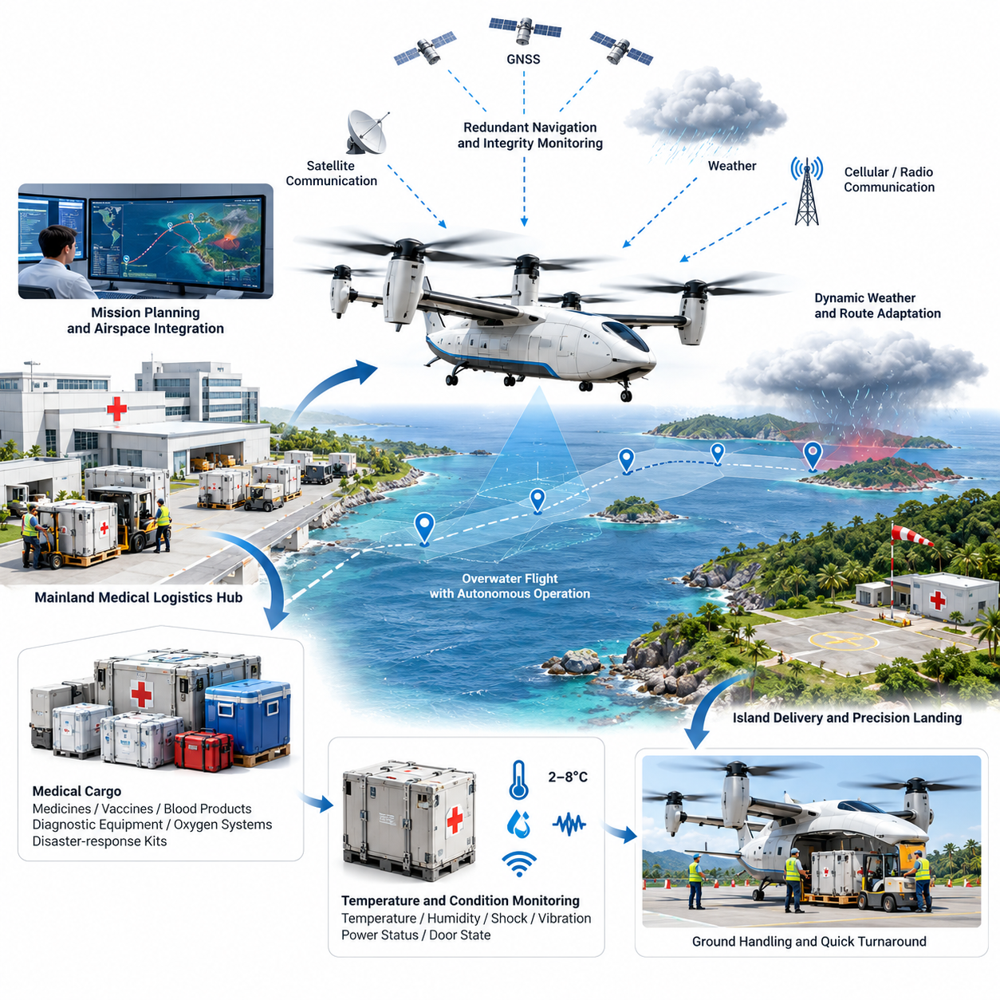
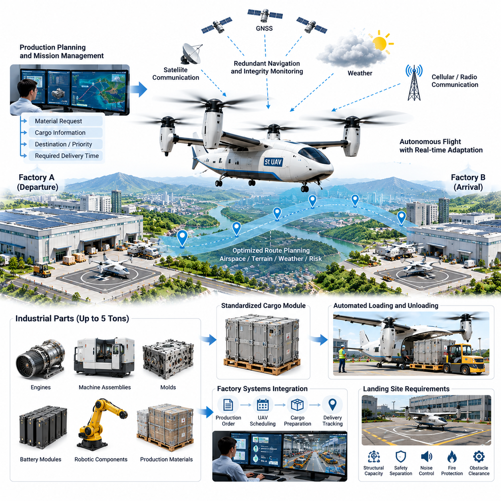
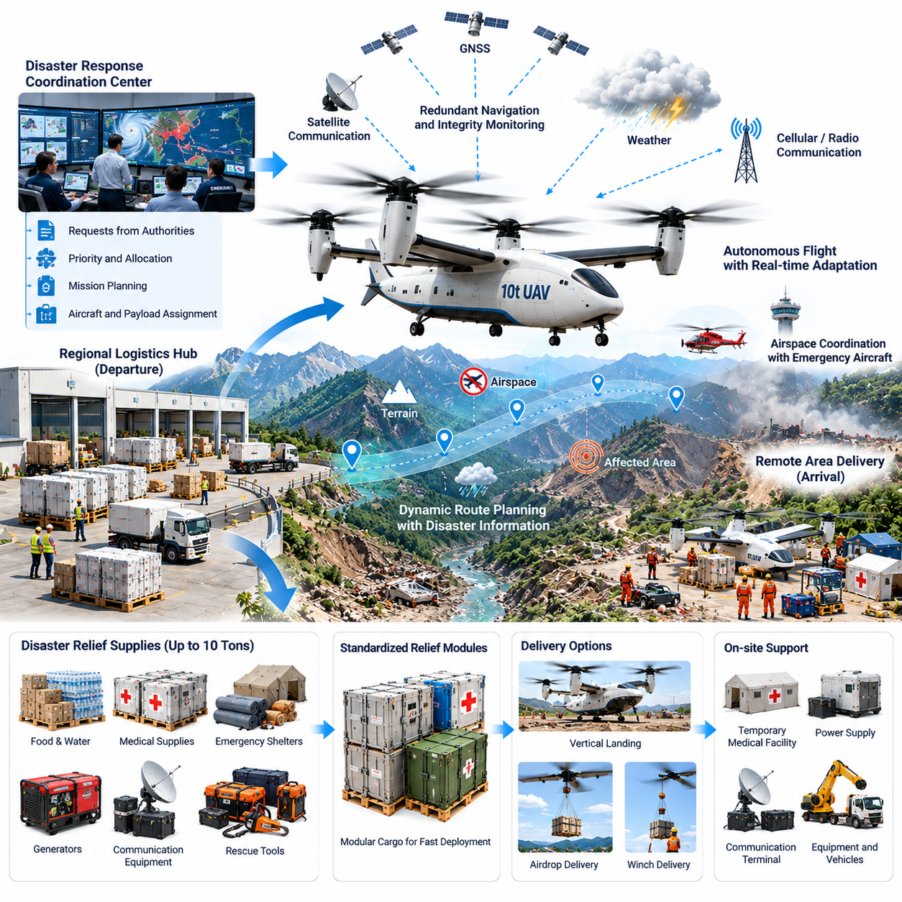
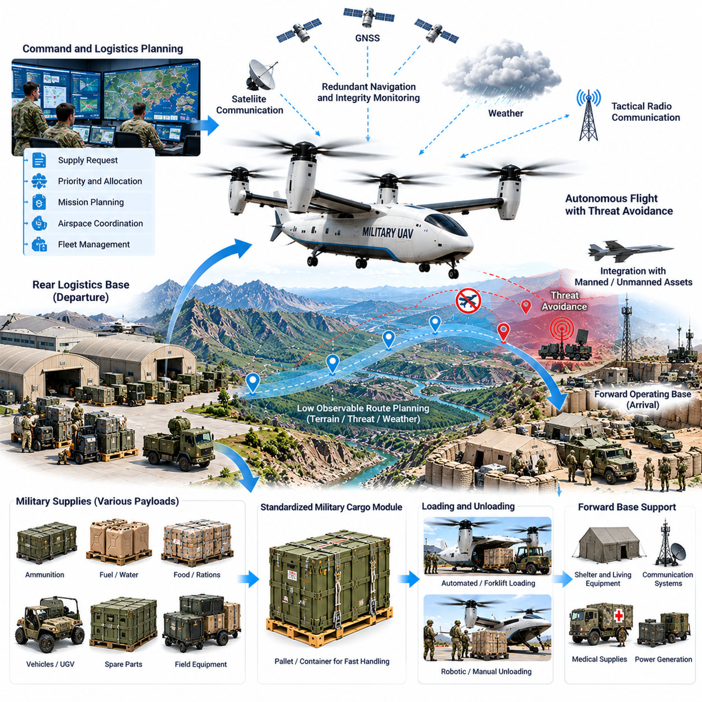
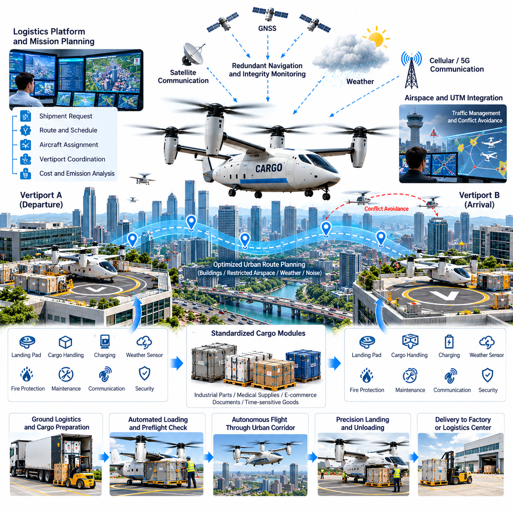
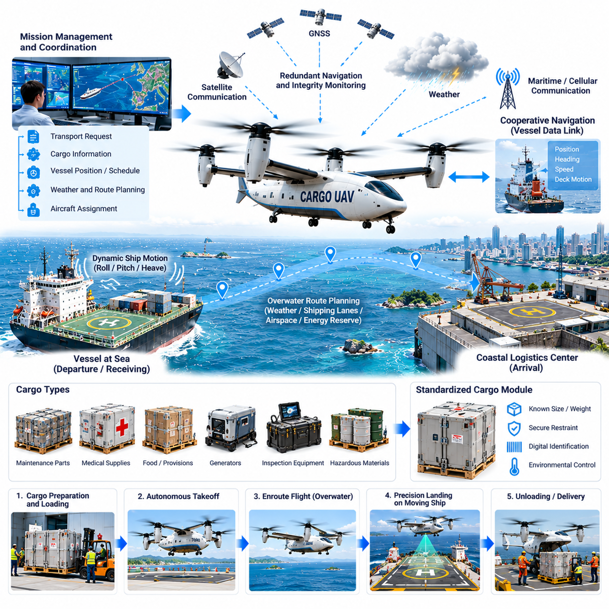
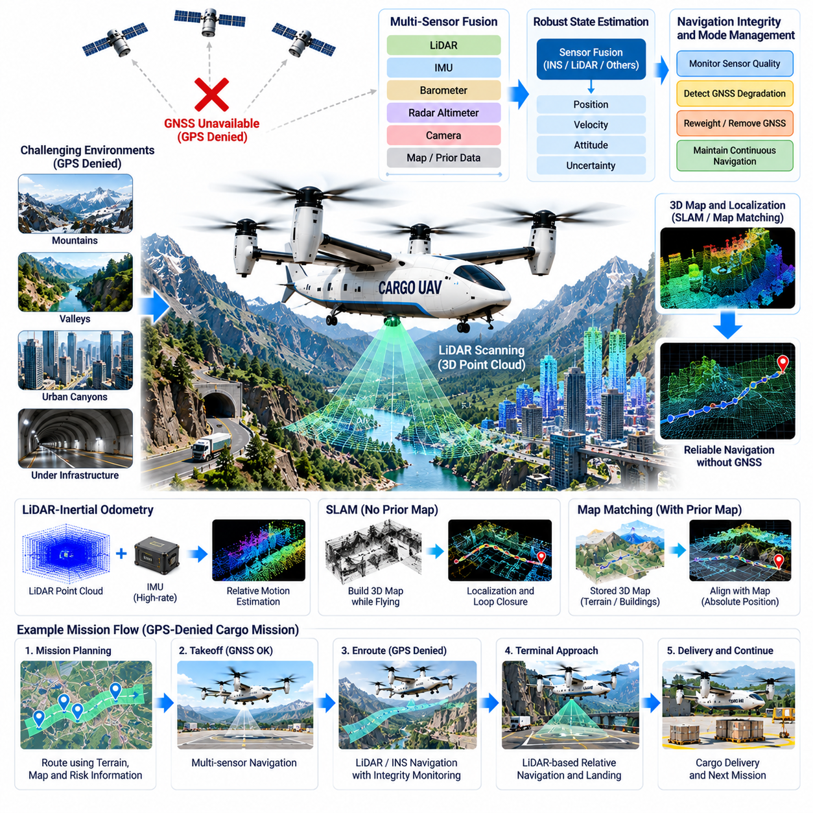
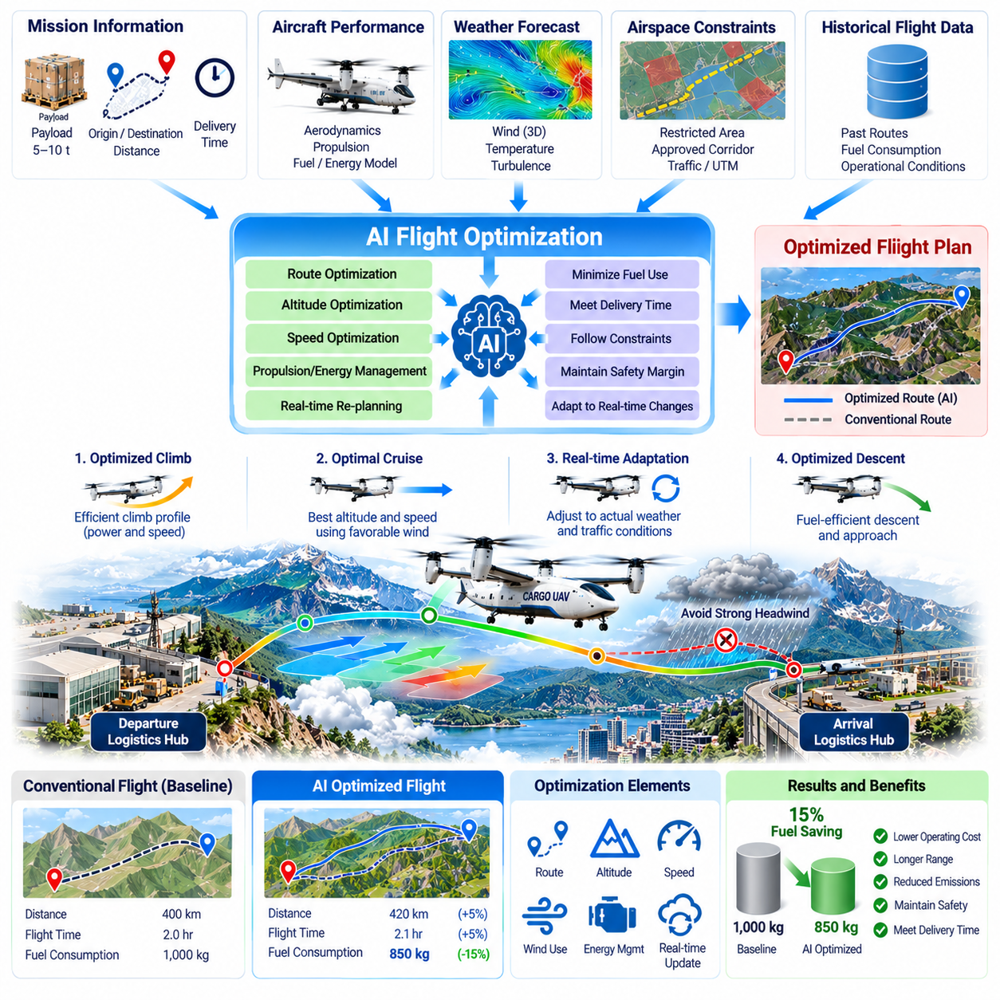
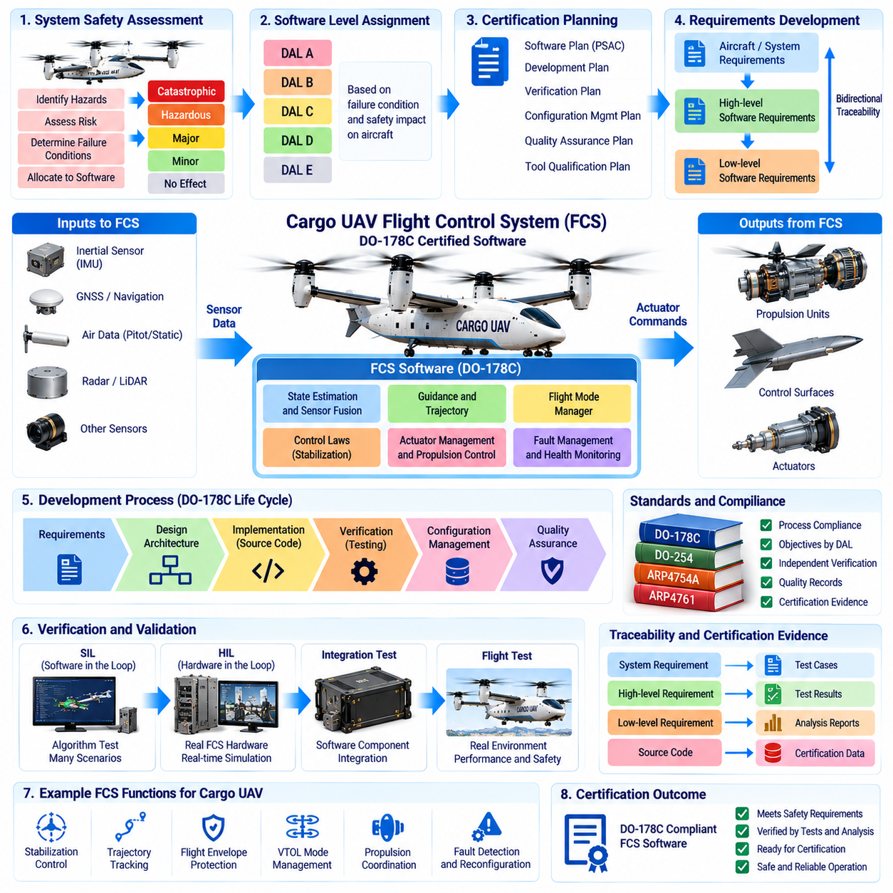
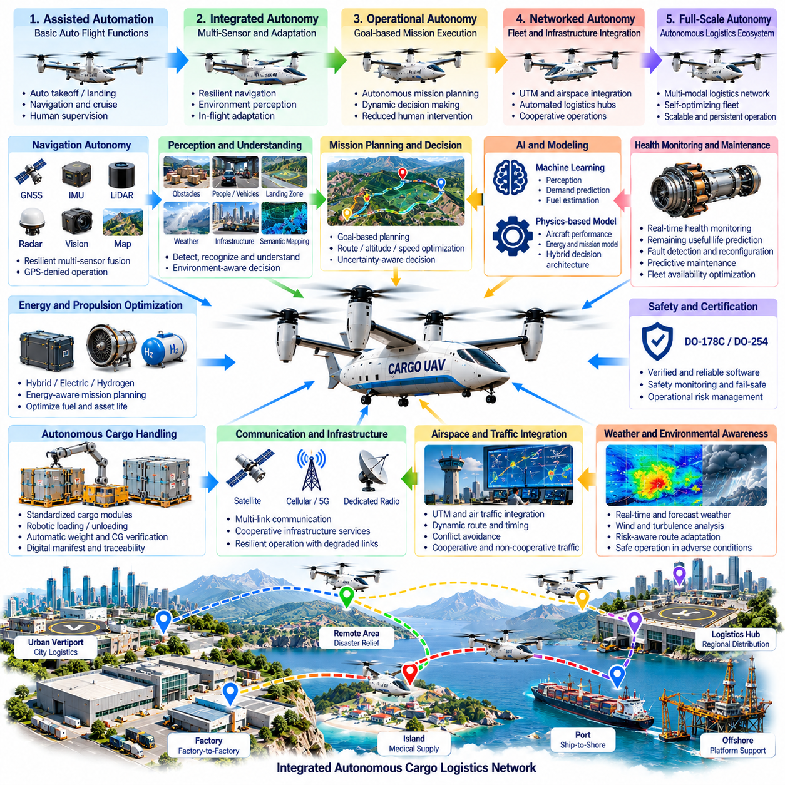

**Volume 23. Cargo UAV Autonomy and Flight AI**

# Chapter 12. Cargo UAV Case Studies

## 12.01. Medical Supply Cargo UAV 2.5t Island Delivery

{width="7.268055555555556in" height="7.268055555555556in"}

A 2.5-ton-class cargo UAV can provide a practical logistics bridge for island communities where medical supplies must cross water quickly but conventional transport depends on ferries, helicopters, or infrequent fixed-wing services. The mission is designed around high-value and time-sensitive cargo such as emergency medicines, blood products, diagnostic equipment, vaccines, oxygen systems, and disaster-response medical kits.

The operational concept begins at a mainland medical logistics hub connected to hospitals, pharmaceutical warehouses, and emergency management centers. Cargo is consolidated into standardized containers, verified against weight and center-of-gravity limits, and transferred to the UAV loading interface. Mission software combines cargo information, aircraft configuration, destination requirements, weather conditions, and airspace constraints before authorizing departure.

A 2.5-ton payload capability changes the mission from small-package drone delivery into regional aerial logistics. Instead of transporting individual prescriptions, the aircraft can move pallet-scale medical loads capable of supporting clinics or temporary treatment centers. Payload planning therefore considers not only total mass but also container dimensions, restraint points, vibration sensitivity, temperature requirements, hazardous-material classifications, and unloading equipment available at the island destination.

Before launch, the mission management system generates a route using digital terrain, maritime boundaries, controlled airspace, population distribution, communication coverage, alternate landing sites, and forecast weather. The preferred corridor normally minimizes flight over densely populated areas while maintaining sufficient diversion opportunities. Dynamic restrictions, emergency airspace, and temporary flight limitations are incorporated through the airspace integration interface whenever such information is available.

Navigation relies on redundant positioning and estimation rather than a single satellite-navigation source. GNSS, inertial measurements, barometric altitude, radar or laser altitude information, and other available navigation references are fused to maintain a consistent aircraft state. Integrity monitoring detects disagreement between sources and allows the flight-control system to degrade gracefully if positioning accuracy, communication quality, or individual sensors deteriorate during the overwater segment.

Overwater flight introduces conditions different from terrestrial cargo operations. Long stretches may provide few visual references, weather can change rapidly, and strong coastal winds may create significant differences between mainland departure conditions and island arrival conditions. The autonomy system continuously evaluates wind, energy consumption, remaining range, destination weather, and diversion feasibility rather than assuming that the conditions measured before departure will remain valid throughout the mission.

For electrically powered or hybrid-electric configurations, energy management becomes a mission-level safety function. The system estimates remaining usable energy against predicted propulsion demand, headwind, payload mass, reserve requirements, and possible diversion distances. A mission may therefore be terminated or redirected even when the aircraft remains technically capable of continuing if the projected landing reserve falls below the predefined operational safety threshold.

Communication architecture combines command-and-control links with independent onboard autonomy. The aircraft should remain capable of maintaining stable flight, following contingency procedures, and selecting predefined recovery behavior when the primary network becomes unavailable. Cellular, satellite, private radio, or maritime communication infrastructure may be combined according to operating region, but loss of connectivity must not immediately translate into loss of aircraft control.

Arrival at the island requires more precision than simply reaching geographic coordinates. The UAV must identify the designated approach corridor, validate landing-zone availability, assess local wind, confirm obstacle clearance, and determine whether the site remains operationally safe. Depending on platform design, delivery may use vertical landing, short-field operation, precision hover placement, or transfer to a prepared cargo-handling zone with personnel kept outside protected aircraft areas.

A vertical-takeoff-and-landing configuration offers particular value where islands lack conventional runways, but heavy-lift vertical operations impose substantial downwash, noise, and ground-safety requirements. Landing-zone design therefore considers surface strength, loose debris, nearby structures, personnel separation, emergency access, and rotor or propulsor clearance. The aircraft should reject landing automatically when measured conditions violate certified or operational limits.

Medical cargo integrity is monitored throughout transportation. Temperature-controlled containers can report internal temperature, humidity, shock, vibration, power status, and door state to the mission system. This creates a traceable chain from the mainland distribution center to the island medical facility. For vaccines, biological materials, or blood products, delivery success means not only arriving on time but also demonstrating that environmental limits were maintained throughout the flight.

Ground handling is designed to minimize aircraft turnaround time and reduce dependence on specialized island infrastructure. Standardized cargo modules can be prepared before aircraft arrival and exchanged through mechanical loading systems or autonomous handling equipment. The mission system verifies payload identity and loading configuration before departure, while digital manifests allow receiving personnel to confirm that the correct medical supplies have arrived without relying entirely on manual paperwork.

Safety architecture separates routine autonomy from independent protection functions. The primary flight computer manages trajectory tracking and mission execution, while monitoring functions supervise flight-envelope limits, actuator health, propulsion performance, navigation integrity, battery or fuel state, and communication status. Critical failures can trigger controlled diversion, return-to-base behavior, emergency landing, or other predefined responses without waiting for remote operator intervention.

Propulsion redundancy is particularly important during island missions because much of the route may offer no acceptable immediate landing location. Distributed propulsion can provide partial tolerance to individual motor, inverter, or propulsor failures when the aircraft architecture is designed for continued controlled flight. Fault detection must rapidly distinguish transient anomalies from genuine failures and reallocate control authority while preventing secondary overload of healthy propulsion channels.

Weather decision logic operates continuously from dispatch through landing. Wind speed, gusts, precipitation, visibility, cloud conditions, icing risk, convective activity, and coastal turbulence are evaluated against aircraft limitations. If destination conditions deteriorate, the mission manager compares holding, diversion, return, and alternate delivery options using the aircraft\'s actual remaining energy rather than relying solely on the original preflight estimate.

A representative emergency scenario could involve urgent transport of blood products, antibiotics, portable diagnostic equipment, and trauma supplies after severe weather interrupts ferry operations. The mainland emergency center prepares a consolidated payload, the UAV performs automated preflight checks, and the remote operations center approves the mission. The aircraft then crosses the maritime corridor autonomously while operators supervise system status and intervene only when operational judgment is required.

During the flight, predictive monitoring compares measured propulsion power, estimated arrival energy, component temperatures, navigation uncertainty, and communication quality against expected values. Small deviations can be detected before they become immediate failures. This enables maintenance and operational decisions to shift from reactive alarms toward health-aware mission management, which is especially valuable for high-utilization cargo fleets operating repeated routes between mainland hubs and remote islands.

At the destination, medical personnel receive estimated arrival information before the aircraft enters the terminal area. The landing zone is cleared, cargo-handling personnel remain outside the safety perimeter, and the aircraft performs its final approach only after confirming required conditions. After touchdown and propulsion shutdown, the payload is released through an authenticated procedure that prevents accidental unloading or delivery to an incorrect receiving station.

The return mission may carry laboratory specimens, medical waste packaged under applicable transport requirements, damaged equipment, or other priority materials back to the mainland. This bidirectional logistics model improves aircraft utilization and transforms the UAV from an emergency delivery mechanism into part of the regional healthcare supply network. Scheduling software can coordinate outbound urgency with return cargo while preserving maintenance, energy, and crew-supervision constraints.

Validation of the service requires more than demonstrating autonomous flight. Testing should progressively cover nominal routes, maximum payload conditions, strong crosswinds, communication loss, GNSS degradation, propulsion faults, rejected landings, diversion decisions, emergency recovery, and repeated operational cycles. Software-in-the-loop, hardware-in-the-loop, controlled flight testing, and representative island trials provide complementary evidence before routine medical logistics operations are authorized.

Operational performance is evaluated through delivery time, dispatch reliability, mission completion rate, payload integrity, landing accuracy, energy reserve, communication availability, maintenance burden, and frequency of operator intervention. Medical logistics also requires service-level metrics such as response time for emergency requests and cold-chain compliance. These measures reveal whether autonomy provides dependable logistics rather than merely demonstrating technically successful unmanned flight.

Fleet deployment extends the concept beyond a single aircraft. Multiple 2.5-ton cargo UAVs can be coordinated across mainland hubs and island destinations according to medical priority, aircraft availability, weather, maintenance status, charging or refueling capacity, and landing-zone occupancy. Centralized planning can allocate missions strategically, while each aircraft retains sufficient onboard intelligence to execute safely when network connectivity becomes intermittent.

The resulting architecture treats the cargo UAV as an autonomous logistics node integrated with healthcare, aviation, and emergency-response systems. Its value comes from combining heavy payload capacity with reliable autonomy, resilient navigation, health-aware control, airspace coordination, and traceable medical cargo handling. For isolated islands, such a system can reduce dependence on transportation schedules and provide a persistent aerial supply capability when conventional routes are delayed or unavailable.

## 12.02. Industrial Parts 5t UAV Factory to Factory

{width="7.268055555555556in" height="7.268055555555556in"}

A 5-ton-class cargo UAV enables factory-to-factory transportation of industrial components at a scale beyond conventional delivery drones. The aircraft can move engines, machine assemblies, molds, battery modules, robotic components, tooling, and palletized production materials directly between manufacturing sites. Its primary value is reducing logistics delay when road transportation would interrupt production schedules or critical replacement parts are urgently required.

The operational concept connects manufacturing plants through dedicated aerial logistics corridors. A production planning system identifies a material requirement, generates a transport request, and transfers cargo specifications to the UAV mission management system. Weight, dimensions, center of gravity, handling constraints, destination priority, and required delivery time are evaluated before an aircraft is assigned, allowing transportation decisions to become part of the factory\'s digital production workflow.

Unlike parcel delivery, a five-ton industrial payload creates substantial structural and dynamic requirements. Cargo may contain concentrated masses, irregular geometries, liquids, precision machinery, or assemblies vulnerable to vibration. The loading system therefore verifies attachment points, load distribution, container compatibility, and center-of-gravity position. Digital load models can be incorporated into flight-control configuration so that aircraft behavior reflects the actual payload carried on each mission.

Standardized cargo modules simplify repeated factory operations. Components can be prepared inside containers or pallets compatible with automated loading equipment while the UAV is still completing another mission. When the aircraft arrives, robotic loaders, automated guided vehicles, or forklifts exchange the cargo with minimal manual handling. Electronic identification links each module to its production order, destination, handling requirements, and traceability record.

Factory-to-factory route planning considers more than geographic distance. The mission planner evaluates controlled airspace, urban areas, terrain, industrial zones, communication coverage, emergency landing locations, noise-sensitive regions, weather, and temporary restrictions. Routes can favor industrial corridors and low-population areas even when they are slightly longer, because predictable risk exposure is often more important than minimizing absolute flight distance.

A 5-ton UAV requires an integrated propulsion and energy strategy capable of supporting heavy takeoff, cruise, approach, and contingency operations. Hybrid-electric, turboshaft-electric, conventional turbine, or other propulsion architectures may be selected according to range and operational requirements. Mission planning estimates energy or fuel consumption using actual payload, expected winds, temperature, altitude, aircraft health, and required reserves rather than relying on a fixed nominal range.

Vertical takeoff and landing can remove dependence on airports and allow logistics terminals to be constructed directly inside or near industrial complexes. However, heavy VTOL aircraft generate significant downwash, acoustic energy, and ground hazards. Factory landing zones must therefore provide adequate structural capacity, obstacle clearance, personnel separation, fire protection, foreign-object control, and protected access routes for automated cargo-handling equipment.

Where factory sites permit short runways or prepared strips, lift-plus-cruise or short-takeoff configurations may improve energy efficiency compared with pure vertical operation. The logistics architecture can therefore support multiple aircraft types while maintaining a common mission interface. Dispatch software selects the appropriate platform according to payload mass, route distance, infrastructure, urgency, weather, and fleet availability.

Navigation combines GNSS, inertial sensing, altitude measurements, terrain information, and other available localization sources. Industrial environments can produce multipath interference, electromagnetic noise, cranes, towers, and large metallic structures near landing areas. Sensor fusion and navigation integrity monitoring are consequently essential during terminal operations, where accurate positioning must be maintained despite degraded satellite geometry or local interference.

Perception systems provide another layer of protection around factory terminals. Cameras, radar, lidar, or complementary sensors can detect vehicles, personnel, cranes, temporary structures, foreign objects, and other aircraft near the operating zone. The landing manager compares these observations with the expected site configuration and can delay or reject an approach when the designated landing area is occupied or has changed since mission planning.

Communication connects the aircraft with fleet operations, factory logistics systems, airspace services, and maintenance infrastructure. Nevertheless, safe flight cannot depend continuously on network connectivity. The onboard autonomy system retains the capability to stabilize the aircraft, continue along an authorized route, enter a predefined holding pattern, divert, return, or perform an emergency procedure according to mission state and remaining resources.

Factory integration becomes particularly valuable when linked with manufacturing execution systems and enterprise resource planning. A shortage detected on an assembly line can automatically generate a prioritized logistics request. The system can determine whether road transport or aerial delivery better satisfies the production deadline, reserve an aircraft, prepare the cargo module, coordinate the receiving factory, and update expected material arrival without requiring independent manual workflows.

A representative mission may involve an automotive plant experiencing an unexpected failure in specialized production equipment. A replacement assembly weighing several tons is available at another factory hundreds of kilometers away, but road transportation would require many hours and potentially stop production. A 5-ton cargo UAV can receive the prepared module, depart from the supplying plant, and deliver it directly to the destination logistics terminal.

Before departure, automated inspection verifies aircraft configuration, propulsion status, actuator health, navigation sensors, communication links, cargo restraints, doors, landing gear, energy reserves, and environmental conditions. The digital cargo manifest is matched against the physical load, preventing departure when the wrong component, excessive mass, or incorrect loading configuration is detected. These checks become part of the mission authorization record.

During cruise, the aircraft continuously compares actual performance with the predicted mission model. Propulsion power, fuel or battery consumption, structural loads, vibration, component temperatures, navigation uncertainty, wind estimates, and communication quality are monitored. Unexpected trends can trigger revised arrival predictions, maintenance alerts, route changes, or diversion decisions before the condition becomes a critical flight failure.

Heavy industrial cargo also requires active consideration of structural loads during maneuvering. Aggressive acceleration, turbulence, or abrupt trajectory changes can generate forces beyond those expected from payload mass alone. The flight-control system can therefore adapt maneuver limits according to cargo characteristics, reducing bank angle, vertical acceleration, or control aggressiveness when sensitive or unusually distributed loads are transported.

Fault management is designed around continued controlled flight whenever physically possible. Distributed propulsion, redundant flight computers, independent power channels, redundant navigation sources, and fault-tolerant communication interfaces can prevent a single component failure from immediately terminating the mission. Supervisory logic isolates failed elements and reconfigures available resources while continuously reassessing whether the original destination remains safely reachable.

Weather management is especially important because industrial missions may be requested according to production urgency rather than favorable environmental conditions. Wind, gusts, precipitation, visibility, icing potential, convective activity, temperature, and turbulence are evaluated against aircraft limits. Operational urgency can increase mission priority, but it cannot override fundamental safety constraints embedded in dispatch and onboard decision logic.

At the receiving factory, arrival coordination begins before the UAV enters the terminal area. The logistics system confirms that the landing zone is clear, cargo-handling equipment is ready, and personnel are outside protected areas. The aircraft then validates local conditions using onboard sensing and performs the final approach. If the site becomes unavailable, it can hold, divert, or return according to available energy and predefined alternatives.

After landing, propulsion is placed into a verified safe state before cargo access is enabled. Automated locks release the module only after aircraft identity, shipment identity, and destination authorization are confirmed. The receiving system records arrival time and cargo condition, then transfers the component directly into warehouse or production workflows. This digital handoff reduces delays between physical delivery and manufacturing availability.

Return flights can carry finished products, repairable components, empty cargo modules, tooling, or materials required by the originating plant. Bidirectional planning increases fleet utilization and prevents expensive aircraft from returning empty whenever compatible demand exists. Optimization software can combine production priorities across multiple factories while respecting payload limits, route constraints, aircraft maintenance intervals, and terminal capacity.

Fleet-level coordination transforms individual UAV missions into an industrial aerial logistics network. Multiple 5-ton aircraft can serve several factories, distribution centers, maintenance facilities, and suppliers. The fleet manager assigns missions according to production criticality, aircraft position, payload compatibility, weather, energy availability, maintenance state, and landing-zone schedules while preserving sufficient reserve capacity for unexpected high-priority requests.

Predictive maintenance becomes tightly connected with logistics scheduling because high-utilization aircraft cannot be treated independently from production requirements. Motor, gearbox, bearing, actuator, battery, structural, and avionics health indicators are evaluated against upcoming missions. Maintenance can be scheduled before degradation threatens dispatch reliability, while fleet software reallocates transportation tasks to other aircraft without disrupting critical factory supply.

Validation must reproduce both aviation failures and realistic industrial logistics conditions. Testing includes maximum payload operations, center-of-gravity extremes, cargo loading errors, crosswinds, turbulence, communication loss, navigation degradation, propulsion faults, rejected approaches, emergency diversions, and automated loading failures. Software-in-the-loop, hardware-in-the-loop, ground integration tests, and progressive flight trials establish evidence before high-frequency commercial operation.

Performance is measured not only through flight safety but also through industrial impact. Relevant indicators include dispatch reliability, mission completion rate, delivery lead time, payload integrity, energy consumption per ton-kilometer, turnaround time, operator intervention frequency, maintenance burden, and avoided production downtime. These metrics determine whether aerial logistics produces measurable manufacturing value compared with conventional road or dedicated express transportation.

The factory-to-factory cargo UAV ultimately functions as a mobile component of the digital manufacturing system rather than an isolated aircraft. Production planning creates transportation demand, autonomous logistics converts that demand into executable missions, onboard intelligence safely performs the physical transfer, and factory systems confirm delivery. This closed information loop connects production decisions directly with movement of material between geographically separated facilities.

At larger scale, networks of 5-ton cargo UAVs can create resilient manufacturing supply chains capable of dynamically rerouting critical components when roads, warehouses, or regional distribution channels become constrained. By combining heavy payload capacity, autonomous flight, digital cargo management, fleet orchestration, and factory-system integration, the platform establishes an aerial logistics layer designed specifically for time-critical industrial production.

## 12.03. Disaster Relief Supply 10t UAV Remote Area

{width="7.268055555555556in" height="7.268055555555556in"}

A 10-ton-class cargo UAV can provide an autonomous heavy-lift logistics capability for disaster zones where roads, bridges, ports, or airports have become unusable. Its payload capacity allows a single mission to transport large quantities of drinking water, food, medical supplies, emergency shelters, generators, communication equipment, rescue tools, and other essential materials directly from regional logistics hubs to isolated communities.

The operational concept begins with a disaster-response coordination center that combines requests from emergency agencies, local authorities, hospitals, rescue teams, and field shelters. Supply requirements are prioritized according to urgency, population affected, accessibility, and available inventory. The mission management system converts these priorities into transport tasks while considering aircraft availability, payload compatibility, weather, airspace restrictions, and destination conditions.

A ten-ton payload significantly expands the type of relief equipment that can be transported. In addition to palletized consumables, the aircraft may carry water purification equipment, portable medical facilities, power systems, pumps, construction tools, communication terminals, or compact vehicles. Cargo planning must account for concentrated loads, dimensions, restraint requirements, hazardous materials, temperature sensitivity, and center-of-gravity limits before flight authorization.

Standardized disaster-relief modules can accelerate deployment during the first hours after an emergency. Containers may be prepared for medical treatment, water supply, communications, temporary shelter, electrical power, or search-and-rescue support. Each module carries digital identification linked to its contents, destination, priority, expiration constraints, and handling requirements, enabling rapid allocation without repeatedly rebuilding cargo manifests.

Remote-area operations often involve incomplete information. Earthquakes, floods, landslides, wildfires, or severe storms can change terrain accessibility and destroy communication infrastructure within minutes. Mission planning therefore uses the latest available satellite information, weather data, terrain databases, field reports, and reconnaissance observations while treating destination conditions as uncertain rather than assuming that previously known infrastructure remains available.

Route planning prioritizes survivability and access rather than simply selecting the shortest path. The system evaluates terrain elevation, mountains, populated areas, damaged infrastructure, restricted airspace, active rescue aviation, weather cells, communication coverage, alternate landing zones, and emergency diversion possibilities. Routes may be continuously updated as new disaster information becomes available during flight.

A 10-ton UAV requires substantial propulsion capability, particularly when operating from high-altitude or hot environments where available lift may be reduced. Hybrid-electric, turbine-electric, turboshaft, or other heavy-lift propulsion architectures can be considered according to range and endurance requirements. Mission software calculates performance using actual payload, density altitude, wind, temperature, propulsion health, fuel or battery state, and mandatory contingency reserves.

Vertical takeoff and landing provides major advantages when runways are unavailable, but heavy VTOL operations introduce significant downwash and ground hazards. A temporary landing zone must therefore be evaluated for surface stability, loose debris, slope, surrounding obstacles, personnel proximity, damaged structures, and available clearance. The aircraft can reject the landing automatically when onboard sensing identifies conditions outside safe operating limits.

When landing is impossible, alternative delivery mechanisms may extend operational reach. Depending on aircraft configuration and mission authorization, supplies can be transferred through prepared remote unloading systems or other controlled delivery methods without requiring conventional airport infrastructure. The selected method must preserve cargo integrity and maintain acceptable risk to survivors, rescue personnel, property, and the aircraft.

Navigation resilience is essential because disasters can degrade infrastructure normally used for positioning and communication. GNSS and inertial navigation can be complemented by terrain-relative navigation, radar or lidar altitude measurements, visual localization, and stored geographic information. Navigation integrity monitoring identifies inconsistent sources and prevents a single degraded sensor or external signal from silently corrupting the aircraft state estimate.

Perception becomes increasingly important during the final portion of the mission. Cameras, radar, lidar, and other sensors can identify terrain changes, vehicles, people, debris, power lines, temporary cranes, smoke, standing water, and obstacles that were absent from pre-disaster maps. The autonomous landing system compares real-time observations with mission assumptions and determines whether the planned approach remains safe.

Communication architecture must tolerate damaged cellular and terrestrial networks. The aircraft may combine satellite communication, dedicated radio, surviving cellular infrastructure, and direct links with emergency teams. Nevertheless, command-and-control loss cannot automatically produce mission failure. Onboard autonomy maintains controlled flight and selects predefined continuation, holding, diversion, return, or emergency landing behavior according to aircraft state and mission risk.

Disaster airspace can become highly congested with helicopters, military aircraft, medical evacuation flights, surveillance drones, and other emergency assets. Airspace coordination therefore becomes a critical component of autonomous operation. The cargo UAV must comply with assigned corridors, altitude restrictions, temporary flight rules, and priority instructions while maintaining separation from cooperative and, where technically possible, detected non-cooperative traffic.

A representative earthquake mission may involve a mountain community isolated after roads and bridges collapse. Emergency planners determine that water, trauma supplies, portable power systems, tents, and satellite communication equipment are urgently required. A 10-ton UAV can consolidate these materials into a single high-priority flight instead of waiting for multiple smaller aircraft or restoration of surface transportation.

Before departure, automated inspection verifies propulsion systems, actuators, flight computers, navigation sensors, communication channels, landing gear, cargo restraints, doors, fuel or energy reserves, and environmental limitations. The digital manifest is compared with measured payload information, ensuring that aircraft mass and center of gravity remain within approved limits and that incompatible cargo combinations are detected before takeoff.

During flight, health-aware monitoring continuously compares actual aircraft behavior with predicted performance. Propulsion output, fuel or battery consumption, structural loads, vibration, temperatures, navigation uncertainty, communication quality, and weather estimates are evaluated for abnormal trends. Predictive detection can initiate route changes or maintenance alerts before degradation develops into a condition requiring emergency action.

Structural load management is especially important for a 10-ton payload because turbulence and maneuvering can produce forces considerably greater than static cargo weight. Flight-control laws can adapt acceleration, bank-angle, climb-rate, and maneuver limits according to payload characteristics. This protects the airframe, cargo restraints, and sensitive relief equipment while maintaining sufficient control authority for safe operation.

Fault-tolerant architecture reduces the probability that a single failure will eliminate the relief mission. Redundant flight computers, navigation sources, power distribution, communication paths, and appropriately designed propulsion systems provide multiple layers of resilience. Supervisory logic isolates failed components, reconfigures available resources, and evaluates whether continuing toward the disaster area remains safer than diversion or return.

Weather presents additional uncertainty in remote regions where observation stations may be damaged or unavailable. The aircraft combines forecasts with onboard measurements and updated remote sensing information when available. Wind, precipitation, visibility, icing, convection, temperature, and turbulence are continually compared with operational limits, and mission urgency does not override fundamental aircraft safety requirements.

Arrival management begins before the aircraft reaches the affected community. Emergency teams receive estimated arrival information and prepare a protected landing or unloading area when communications permit. The UAV independently verifies local terrain and obstacles during approach. If survivors, vehicles, debris, smoke, or unstable ground compromise the planned zone, the aircraft can hold while another location is evaluated.

After landing, the propulsion system enters a verified safe configuration before relief personnel approach. Cargo modules are released according to authenticated procedures, and the logistics system records delivery status whenever communication is available. Critical supplies can then be distributed according to local emergency priorities, while the aircraft receives updated information concerning evacuation needs, return cargo, or subsequent missions.

Return missions can provide additional humanitarian value by transporting laboratory samples, damaged equipment, emergency documentation, or other authorized priority cargo out of the disaster zone. Where aircraft configuration, regulation, and certification permit, specialized evacuation missions could also be supported by appropriately designed systems, although transporting people introduces requirements fundamentally different from those for unmanned cargo operations.

Fleet coordination allows multiple heavy cargo UAVs to create an aerial supply bridge between regional logistics centers and several isolated communities. Missions are allocated according to humanitarian priority, aircraft location, payload capability, fuel or charging resources, weather, landing-zone capacity, and maintenance state. Central coordination reduces duplicated deliveries while preserving reserve aircraft for unexpected emergencies.

The logistics network can continuously update priorities as conditions evolve. A community initially requiring food may later need generators or medical equipment, while restoration of a road may eliminate the need for aerial supply elsewhere. Dynamic scheduling reallocates aircraft and cargo based on the changing disaster picture, allowing limited heavy-lift capacity to be directed toward locations where it produces the greatest operational benefit.

Validation must reproduce both aviation failures and disaster-specific uncertainty. Test programs should include maximum payload, high-altitude operations, strong winds, degraded navigation, communication loss, damaged landing zones, unexpected obstacles, propulsion failures, rejected approaches, diversions, and repeated high-tempo missions. Simulation, software-in-the-loop, hardware-in-the-loop, controlled field testing, and large-scale exercises progressively build operational evidence.

Performance is measured through mission completion rate, dispatch reliability, payload delivered per flight, response time, landing accuracy, energy efficiency, reserve margins, operator intervention frequency, and aircraft availability. Disaster-response effectiveness additionally considers the time required to establish an aerial supply bridge, the number of isolated communities supported, and the quantity of critical material delivered during infrastructure disruption.

At system level, the 10-ton cargo UAV becomes more than an autonomous aircraft. It functions as a mobile logistics node connecting emergency command systems, warehouses, airspace services, field teams, and remote communities. Digital mission management converts humanitarian priorities into physical movement while onboard intelligence preserves safe operation even when communications and ground infrastructure are incomplete.

A fleet of such aircraft could form a resilient disaster logistics layer capable of operating before conventional transportation networks are restored. By combining heavy payload capacity, autonomous navigation, resilient communications, real-time perception, fault-tolerant control, and dynamic fleet orchestration, the system can rapidly project essential supplies into areas where infrastructure failure would otherwise leave communities isolated for extended periods.

## 12.04. Military Logistics UAV Forward Supply Case

{width="7.268055555555556in" height="7.268055555555556in"}

A military logistics UAV can provide autonomous forward supply between established logistics hubs and dispersed operating locations where conventional ground transportation is slow, unavailable, or operationally constrained. The aircraft is treated primarily as a transportation asset, moving food, water, medical materials, maintenance components, batteries, communication equipment, protective equipment, and other authorized sustainment cargo.

The operational concept begins with a logistics management system that consolidates supply requests from supported units and facilities. Requests are prioritized according to urgency, inventory status, transportation availability, cargo characteristics, and destination readiness. Mission management software then matches approved shipments with suitable aircraft while accounting for payload capacity, range, weather, maintenance status, and applicable airspace restrictions.

Cargo preparation follows standardized logistics procedures so that supplies can move efficiently between warehouses, aircraft, and receiving locations. Modular containers and pallets provide known dimensions, attachment interfaces, mass properties, and handling requirements. Digital identification connects each shipment with its manifest, origin, destination, priority, environmental limitations, and chain-of-custody information throughout transportation.

Payload configuration is especially important for large logistics UAVs because different combinations of cargo can significantly change aircraft mass and center of gravity. The loading system verifies individual module weights, placement, restraint status, and compatibility before departure. Aircraft configuration data can then be updated so that flight-control and performance calculations accurately reflect the physical load carried during the mission.

Route planning combines terrain, weather, airspace constraints, communication availability, approved operating areas, alternate landing locations, and aircraft performance. The objective is to establish a predictable and manageable transportation corridor rather than simply minimize distance. Mission plans also include contingency points where the aircraft can hold, divert, return, or terminate the mission safely if conditions change.

Forward locations may have limited infrastructure, making vertical takeoff and landing particularly useful. A VTOL logistics aircraft can operate without a conventional runway, but the landing area must still provide adequate clearance, surface stability, obstacle separation, and personnel protection. Heavy aircraft downwash and foreign-object hazards are evaluated before operations are approved at temporary or minimally prepared sites.

Navigation uses multiple information sources to avoid dependence on a single positioning mechanism. GNSS, inertial navigation, barometric altitude, radar or lidar altitude sensing, and available terrain information can be fused into a common state estimate. Integrity monitoring continuously compares navigation sources and identifies abnormal disagreement before inaccurate positioning information can significantly affect aircraft guidance.

Communication architecture supports coordination with logistics operators, airspace authorities, maintenance systems, and receiving personnel. Because network availability can vary across remote operating regions, the aircraft retains sufficient onboard autonomy to maintain controlled flight when external connectivity becomes intermittent. Predefined procedures govern continuation, holding, diversion, return, or landing according to mission state and aircraft condition.

The autonomous flight system separates strategic mission commands from safety-critical vehicle control. External systems may assign destinations, schedules, or approved routes, while onboard flight computers remain responsible for stabilization, navigation, propulsion management, flight-envelope protection, and immediate fault response. This separation prevents temporary communication interruptions from directly destabilizing the aircraft.

A representative forward-supply mission may begin when a remote operating location reports shortages of medical materials, replacement parts, batteries, and packaged food. A logistics hub consolidates the approved supplies into standardized modules and assigns an available UAV. The aircraft performs automated preflight verification, receives its authorized mission plan, and departs after cargo, weather, airspace, and aircraft conditions are confirmed.

During cruise, the health-management system monitors propulsion output, fuel or battery consumption, temperatures, vibration, structural loads, actuator performance, navigation confidence, and communication quality. Actual values are compared with predicted mission profiles. Significant deviations can generate maintenance alerts or cause the mission manager to reconsider destination feasibility before the condition develops into an immediate safety problem.

Energy management continuously evaluates whether sufficient fuel or electrical energy remains to reach the destination while preserving required reserves. Changes in wind, temperature, payload-related performance, route length, or propulsion efficiency can alter the original estimate. The aircraft therefore updates predicted arrival reserves throughout the flight and can initiate diversion or return procedures when predefined margins cannot be maintained.

Structural load management protects both the aircraft and transported supplies. Heavy cargo increases loads during turbulence, acceleration, turns, and vertical maneuvers, while sensitive electronic or medical equipment may impose additional handling restrictions. Flight-control laws can modify acceleration limits, bank angles, climb rates, and maneuver aggressiveness according to the verified payload configuration.

Terminal-area operations require detailed assessment because temporary landing zones can change rapidly. Vehicles, personnel, equipment, debris, standing water, vegetation, or temporary structures may occupy areas that were clear when the mission was planned. Cameras, radar, lidar, or other onboard sensors can support obstacle detection and help determine whether the designated approach and landing area remain usable.

If the primary landing zone is unavailable, the aircraft follows predefined contingency logic rather than forcing an approach. Depending on available energy, weather, and authorized alternatives, it may hold temporarily, proceed to another approved site, or return to its origin. The objective is to preserve aircraft and cargo while avoiding unnecessary exposure of personnel around an unsuitable landing area.

After landing, the propulsion system transitions to a verified ground-safe state before unloading begins. Cargo locks are released only after appropriate aircraft and shipment conditions are confirmed. Receiving personnel or automated handling systems can then transfer the modules, while the logistics information system records delivery completion and updates inventory information for both the sending and receiving locations.

Return transportation improves utilization by allowing the UAV to carry repairable equipment, empty containers, maintenance components, documentation, or other authorized material back to the logistics hub. Bidirectional scheduling reduces unnecessary empty flights and helps integrate forward supply with reverse logistics. Payload and priority rules remain subject to the same safety and authorization controls applied to outbound missions.

Fault tolerance is important because remote operations may provide few immediate recovery options. Redundant flight computers, navigation sources, power channels, communication paths, and appropriately designed propulsion systems can prevent a single equipment failure from automatically causing loss of the aircraft. Supervisory software identifies failures, isolates affected components, and reconfigures remaining resources where technically feasible.

Weather management remains active throughout the mission. Wind, gusts, precipitation, visibility, temperature, icing conditions, and turbulence are evaluated against aircraft limitations and landing-site requirements. Updated weather information and onboard measurements can modify route or destination decisions, ensuring that schedule pressure or logistics urgency does not override fundamental flight-safety constraints.

Fleet coordination allows several logistics UAVs to support multiple locations from one or more supply hubs. The fleet manager considers shipment priority, aircraft position, payload capacity, energy state, maintenance requirements, weather, terminal availability, and transportation demand. Central scheduling can preserve reserve capacity so that unexpected high-priority logistics requests do not disrupt the entire planned network.

Integration with inventory and maintenance systems makes the aerial logistics network more responsive. When stock at a supported location falls below a defined threshold, the logistics system can identify replenishment requirements and prepare transportation requests. Similarly, predictive maintenance information can prevent an aircraft with deteriorating components from being assigned to a mission that exceeds its remaining operational margin.

Cybersecurity and information assurance are essential because mission, cargo, navigation, maintenance, and authorization data move between multiple systems. Authentication, access control, encrypted communication, software integrity verification, and protected configuration management reduce the possibility of unauthorized commands or corrupted information affecting aircraft operation. Safety-critical functions remain isolated from nonessential information services where appropriate.

Validation must address both aviation performance and logistics integration. Testing includes maximum payload conditions, center-of-gravity variations, communication interruption, navigation degradation, adverse weather, propulsion faults, rejected landings, alternate-site diversion, automated loading errors, and repeated high-tempo operations. Simulation, software-in-the-loop, hardware-in-the-loop, ground testing, and progressive flight trials provide complementary verification evidence.

Operational effectiveness is measured through dispatch reliability, mission completion rate, payload delivered, transportation time, aircraft availability, energy consumption, turnaround time, maintenance burden, and operator intervention frequency. Logistics-level measures additionally evaluate inventory availability, reduction in emergency ground transportation, responsiveness to urgent supply requests, and utilization of aircraft across outbound and return missions.

Human supervision remains part of the architecture even when routine flight is highly autonomous. Operators monitor fleet status, approve or supervise missions according to applicable procedures, respond to exceptional conditions, and coordinate with logistics and airspace organizations. Automation reduces repetitive workload while preserving human authority for decisions involving unusual operational circumstances or broader mission priorities.

At system level, the logistics UAV functions as a mobile transportation node connecting warehouses, maintenance facilities, operating locations, airspace services, and digital logistics systems. Supply demand is translated into authorized transport missions, onboard autonomy executes the physical movement safely, and receiving systems confirm delivery. This creates a closed logistics loop between inventory information and actual material movement.

A mature fleet can establish a resilient aerial sustainment network that complements conventional road, rotary-wing, and fixed-wing transportation. Its principal advantage is the ability to move substantial authorized cargo directly between dispersed locations with reduced dependence on permanent infrastructure. Autonomous flight, resilient navigation, health-aware control, digital cargo management, and fleet orchestration together support reliable forward logistics under demanding operating conditions.

## 12.05. Urban Air Cargo Vertiport to Vertiport Case

{width="7.268055555555556in" height="7.268055555555556in"}

Urban air cargo operations can connect distributed logistics centers through vertiport-to-vertiport transportation, creating an aerial layer above congested metropolitan road networks. Cargo UAVs or autonomous electric VTOL aircraft can move high-priority industrial components, medical supplies, e-commerce shipments, documents, and time-sensitive goods between prepared terminals without requiring conventional airport infrastructure.

The operational concept begins when a logistics platform receives a shipment request and identifies whether aerial transportation provides sufficient benefit compared with road delivery. Cargo mass, dimensions, urgency, destination, delivery deadline, weather, aircraft availability, vertiport capacity, and transportation cost are evaluated. Approved shipments are then assigned to an aircraft and incorporated into the metropolitan flight schedule.

Vertiports function as controlled interfaces between ground logistics and autonomous aviation. Each facility can include landing pads, cargo staging areas, charging or refueling equipment, communication infrastructure, weather sensors, fire protection, maintenance support, and automated handling systems. Digital coordination synchronizes aircraft arrival with cargo preparation so that valuable landing capacity is not consumed by unnecessary ground delays.

Standardized cargo modules reduce turnaround time and simplify aircraft integration. Shipments arriving by truck, automated vehicle, or warehouse conveyor can be consolidated into containers with known dimensions, mass limits, restraint interfaces, and identification codes. Before loading, automated systems verify cargo identity, measured weight, center-of-gravity contribution, security status, and compatibility with the assigned aircraft.

Urban route planning must account for a dense combination of aviation and ground constraints. Buildings, towers, power infrastructure, controlled airspace, airports, helicopter routes, population density, noise-sensitive districts, emergency facilities, temporary restrictions, and weather all influence the available corridor. The preferred route balances transportation efficiency with safety, community impact, and contingency options.

Unlike operations over sparsely populated regions, urban cargo flights require carefully managed contingency planning because suitable emergency landing locations may be limited. Mission software continuously maintains awareness of approved alternate vertiports and other authorized recovery locations. Remaining energy, wind, traffic, and landing-site availability are evaluated throughout the mission so that contingency options remain physically achievable.

Electric propulsion is particularly attractive for shorter metropolitan routes because it can reduce local emissions, mechanical complexity, and acoustic impact compared with conventional propulsion. Battery state, temperature, degradation, payload mass, wind, and reserve requirements must nevertheless be incorporated into dispatch decisions. Nominal battery capacity alone is insufficient for determining whether a mission can be completed safely.

Hybrid-electric or other propulsion architectures may support longer routes or heavier payloads where battery-only aircraft cannot provide the required performance. A metropolitan cargo network can therefore contain multiple vehicle classes sharing common digital interfaces. Fleet management software selects aircraft according to payload, range, vertiport compatibility, noise restrictions, charging availability, and operational priority.

Navigation combines GNSS, inertial sensing, barometric altitude, radar or lidar ranging, map information, and other localization sources. Urban canyons can degrade satellite geometry and create multipath effects near tall buildings. Sensor fusion and navigation integrity monitoring therefore become essential for maintaining accurate position estimates during low-altitude corridor flight and precision terminal approaches.

Onboard perception provides additional awareness of the dynamic urban environment. Cameras, radar, lidar, or complementary sensors can identify obstacles, unexpected aerial traffic, cranes, temporary structures, vehicles, or objects near the landing area. Real-time perception supplements static maps and allows the aircraft to respond when actual terminal conditions differ from the configuration assumed during mission planning.

Traffic management coordinates many aircraft operating through shared metropolitan airspace. The UAV exchanges relevant flight-intent and status information with applicable airspace or unmanned traffic management services. Assigned routes, altitude layers, timing windows, and terminal sequences can reduce conflicts, while onboard separation and safety functions provide another protective layer when unexpected traffic situations occur.

Vertiport scheduling is closely connected with airspace scheduling because landing pads are limited resources. An aircraft arriving too early may have nowhere to land, while excessive holding consumes energy and increases noise. Arrival management therefore adjusts departure times, cruise profiles, and terminal sequencing so that aircraft reach the destination when a pad and cargo-handling position are expected to be available.

A representative mission may involve urgent delivery of a production component from an industrial district to an assembly facility on the opposite side of a metropolitan area. Road transportation could require several hours during severe congestion, while an aerial corridor may connect nearby vertiports much more directly. The component is prepared as a standardized cargo module and assigned to the next suitable aircraft.

Before departure, automated preflight checks verify propulsion, energy state, flight computers, navigation sensors, communication links, control actuators, landing gear, cargo restraints, doors, and required reserve margins. The physical payload is compared with the digital manifest, and departure is prevented when mass, center of gravity, cargo configuration, aircraft condition, weather, or destination availability violates authorized limits.

Takeoff sequencing prevents conflicts between arriving and departing aircraft while reducing unnecessary pad occupancy. Once cleared for departure, the autonomous flight system transitions from terminal control into the assigned urban corridor. Vehicle control remains onboard, while higher-level systems provide route authorization, traffic information, destination status, and other operational data required for coordinated network operation.

During cruise, health-aware monitoring compares measured propulsion power, battery or fuel consumption, temperatures, vibration, actuator behavior, navigation confidence, communication quality, and predicted arrival energy against expected values. Deviation trends can trigger revised arrival predictions, maintenance alerts, route changes, or diversion decisions before a developing condition becomes safety critical.

Noise management is an important design and operational requirement for high-frequency urban cargo services. Flight paths, altitude profiles, propeller or rotor speeds, approach procedures, and operating schedules can be optimized to reduce repeated acoustic exposure. Network planning can distribute traffic among corridors when practical instead of concentrating every flight over the same communities.

Weather effects can vary significantly across a metropolitan region because buildings and terrain modify local wind patterns. Rooftop vertiports may experience turbulence and gusts that differ from conditions measured at ground level. Local weather sensors, forecasts, onboard measurements, and terminal reports are therefore combined to determine whether departure, approach, and landing remain within aircraft limits.

At the destination, the aircraft receives updated vertiport status before beginning its final approach. The landing pad must be clear, compatible with the aircraft, and protected from unauthorized personnel or vehicles. Onboard sensing independently confirms local conditions. If the pad becomes unavailable, arrival management can command holding, resequencing, diversion, or return according to remaining energy and network status.

After landing, propulsion transitions into a verified safe state before automated cargo handling begins. The shipment is authenticated and released to robotic equipment, warehouse systems, or authorized ground personnel. Delivery completion updates the logistics platform immediately, allowing downstream transportation or production processes to begin without waiting for separate manual confirmation.

Rapid charging and energy management influence overall network capacity. Charging systems can schedule aircraft according to battery temperature, state of charge, expected next mission, electricity availability, and required turnaround time. Fleet optimization must balance rapid utilization against battery degradation, because excessive high-power charging can reduce long-term asset life even when it improves short-term dispatch capacity.

Predictive maintenance further improves fleet availability by identifying deterioration before it produces unscheduled downtime. Propulsion units, bearings, actuators, batteries, landing gear, structures, avionics, and sensors can be monitored using accumulated operational data. Maintenance tasks are coordinated with traffic demand so that aircraft are removed from service when their absence has the least impact on network capacity.

Cybersecurity is essential because aircraft, vertiports, fleet management, logistics platforms, charging infrastructure, and traffic services exchange operational information continuously. Authentication, encrypted communication, access control, software integrity checks, and protected configuration management reduce the risk of unauthorized commands or corrupted data. Safety-critical vehicle functions remain appropriately isolated from nonessential commercial services.

Fleet orchestration coordinates aircraft as a shared metropolitan transportation resource rather than as independent vehicles. Mission assignments consider aircraft location, payload capability, energy state, maintenance condition, vertiport compatibility, traffic congestion, weather, shipment priority, and predicted demand. Empty repositioning flights can be reduced by matching outbound cargo with subsequent shipments from nearby terminals.

Validation must reproduce the complexity of dense urban operation. Testing includes navigation degradation between buildings, communication interruptions, strong rooftop winds, pad obstruction, unexpected traffic, propulsion faults, rejected landings, alternate-vertiport diversion, charging failures, cargo-loading errors, and high-frequency scheduling. Simulation, SIL, HIL, ground integration, and progressive flight testing provide complementary verification evidence.

Operational performance is measured through dispatch reliability, delivery time, mission completion rate, payload utilization, energy consumption, turnaround time, vertiport throughput, aircraft availability, noise exposure, maintenance burden, and operator intervention frequency. Logistics metrics additionally compare aerial delivery performance with road transportation to determine where urban air cargo creates measurable economic or operational value.

As the network expands, vertiports can become multimodal logistics nodes linking trucks, autonomous ground vehicles, warehouses, rail systems, and aerial transportation. Cargo can move automatically between modes according to congestion, urgency, cost, and capacity. The UAV therefore becomes one component of a broader digital logistics system rather than an isolated replacement for existing transportation.

A mature vertiport-to-vertiport cargo network can provide cities with a responsive logistics layer for shipments whose value depends strongly on time. Autonomous flight, resilient navigation, traffic coordination, precision landing, digital cargo handling, predictive maintenance, and fleet orchestration collectively allow aerial transportation capacity to be integrated into metropolitan logistics while maintaining safety, reliability, and scalable operations.

## 12.06. Autonomous Ship to Shore Cargo UAV Case

{width="7.268055555555556in" height="7.268055555555556in"}

Autonomous ship-to-shore cargo UAV operations provide an aerial logistics connection between vessels at sea and coastal facilities without requiring a ship to enter port. The aircraft can transport maintenance parts, medical supplies, documents, inspection equipment, food, electronic modules, and other time-sensitive cargo between ships, offshore platforms, ports, and logistics centers while reducing dependence on crewed helicopters or support boats.

The operational concept begins when a vessel or shore logistics center generates a transportation request. Cargo characteristics, urgency, vessel position, destination, aircraft availability, weather, sea state, deck capability, and required delivery time are evaluated by the mission management system. Approved requests are converted into flight missions coordinated with both maritime operations and applicable aviation services.

Unlike fixed terrestrial destinations, a ship is continuously moving. Its position, heading, speed, roll, pitch, and heave change throughout the mission, making the landing target dynamic rather than geographically stationary. The UAV therefore receives updated vessel navigation information and predicts the future position of the landing area so that terminal guidance can converge on the ship at the expected arrival time.

Cargo preparation uses standardized containers designed for rapid loading, secure restraint, and resistance to maritime conditions. Each module can include digital identification describing contents, weight, destination, handling limitations, and environmental requirements. Before departure, the loading system verifies cargo mass, attachment status, center-of-gravity contribution, door security, and compatibility with the aircraft configuration.

Route planning considers maritime airspace, coastal controlled areas, offshore structures, shipping lanes, terrain near shore, weather, communication coverage, alternate landing sites, and aircraft range. Overwater routes may appear geometrically simple, but contingency options can be limited. Mission planning therefore emphasizes energy reserves, diversion capability, communication resilience, and accurate destination tracking.

Weather assessment is especially important because conditions at sea can differ significantly from those at a coastal departure site. Wind speed and direction, gusts, precipitation, visibility, cloud, icing risk, and convective activity influence mission feasibility. The aircraft continuously updates its estimates using available forecasts, vessel observations, coastal measurements, and onboard sensing during flight.

Sea state directly affects shipboard landing. Waves produce deck motion through roll, pitch, and vertical displacement, while wind flowing around the vessel superstructure can generate turbulence and rapidly changing local airflow. The landing system must determine whether measured and predicted deck motion remains within aircraft limits before committing to the final descent.

Navigation combines GNSS, inertial measurements, barometric altitude, radar or lidar ranging, and other available references. Over open water, visual landmarks may be scarce, making reliable state estimation particularly important. Redundant navigation and integrity monitoring prevent a single degraded source from silently generating an incorrect aircraft position or velocity estimate during the approach.

The vessel itself can provide cooperative navigation information through a dedicated data link. Ship position, velocity, heading, deck geometry, and motion estimates can be transmitted to the UAV and fused with onboard sensing. This cooperative approach improves relative navigation, but the aircraft should independently verify critical information so that a corrupted or delayed external data stream does not directly control landing.

During terminal approach, relative navigation becomes more important than absolute geographic position. Cameras, radar, lidar, fiducial references, or complementary sensors can identify the ship and estimate the relative position and orientation of the landing deck. Sensor fusion continuously updates the relative state while compensating for aircraft motion, ship motion, measurement latency, and temporary sensor degradation.

A representative mission may involve a commercial vessel experiencing a failure in critical machinery while operating far from port. A replacement electronic module or mechanical component is available at a coastal maintenance center. Instead of diverting the vessel or dispatching a crewed helicopter, a cargo UAV can carry the component directly to the ship while it continues its planned route.

Before takeoff, automated checks verify propulsion, flight computers, actuators, navigation sensors, communication links, landing gear, cargo restraints, energy state, weather limits, and destination information. The mission system also confirms the latest vessel position and predicted trajectory. Departure is prevented if aircraft condition, payload configuration, weather, range, or destination compatibility violates approved limits.

Energy management is critical because an overwater aircraft may have few usable diversion locations. The mission system continuously estimates energy required to reach the vessel, conduct the approach, perform a possible rejected landing, and reach an alternate destination while preserving mandatory reserves. Updated wind and vessel movement are incorporated into these calculations throughout the mission.

Communication can combine maritime satellite services, aviation links, cellular networks near shore, dedicated radio, and direct vessel-to-aircraft connections. Because individual links may become intermittent, communication architecture supports redundancy and graceful degradation. Loss of a primary link does not immediately cause loss of vehicle control because flight stabilization and essential contingency logic remain onboard.

As the UAV approaches the vessel, the mission transitions from long-range navigation to cooperative terminal operations. The ship can establish a protected deck area, restrict personnel movement, secure loose equipment, and report local conditions. The aircraft receives updated deck status while onboard sensors independently check for obstacles, personnel, unexpected equipment, or other hazards.

The final approach trajectory accounts for ship velocity and deck movement rather than treating the landing surface as stationary. Guidance predicts where the deck will be when the aircraft reaches touchdown height and continuously corrects the intercept solution. Control laws must respond smoothly to changing relative motion without generating excessive maneuvering that could destabilize the aircraft near the vessel.

A landing window can be defined using allowable deck roll, pitch, heave rate, wind, visibility, and obstacle conditions. If these variables exceed limits, the aircraft delays descent or executes a rejected approach. This prevents mission urgency from forcing touchdown during an unfavorable phase of vessel motion and provides a systematic mechanism for managing dynamic landing risk.

Ship superstructures can disturb airflow significantly. Funnels, cranes, containers, antennas, and deck structures create wakes and turbulence that vary with relative wind direction. Onboard measurements and vessel-specific aerodynamic models can help the flight-control system anticipate these effects, while conservative approach limits protect against disturbances that cannot be predicted accurately.

After touchdown, the aircraft must remain secure despite continued deck motion. Depending on vehicle design, landing gear, mechanical capture devices, deck locks, or other restraint systems can prevent sliding or tipping. Propulsion transitions to a verified safe state before personnel or automated equipment approach the aircraft and begin cargo transfer.

Cargo release follows authenticated procedures so that the correct shipment is delivered to the intended vessel. The receiving system confirms aircraft identity, shipment identity, and authorization before restraints are released. Digital records update the chain of custody and can immediately notify shore logistics systems that the requested component or supply has reached the vessel.

Return missions can transport failed components, diagnostic samples, documents, inspection data storage devices, or other authorized cargo from the ship to shore. Bidirectional logistics improves aircraft utilization and supports maintenance workflows by connecting vessel equipment failures directly with repair facilities. The return payload is subjected to the same mass, restraint, identification, and safety checks as outbound cargo.

If the shipboard landing area becomes unavailable, the aircraft follows predefined contingency procedures. Depending on energy state and mission configuration, it may hold at a safe location, attempt another authorized approach, divert to another vessel or offshore facility, or return to shore. Continuous reserve calculations ensure that repeated landing attempts do not consume energy needed for a safe alternative.

Fault management is designed around the limited recovery options of overwater flight. Redundant flight computers, power distribution, navigation sources, communication paths, and appropriately designed propulsion systems reduce dependence on individual components. Supervisory software detects failures, isolates affected systems, and determines whether continued flight, diversion, or immediate recovery provides the lowest operational risk.

Autonomous ship-to-shore logistics can also support offshore energy installations, research vessels, remote islands, and maritime construction projects. A common mission architecture allows aircraft to serve multiple types of maritime destinations while adapting terminal procedures to local deck geometry, infrastructure, motion characteristics, and handling requirements.

Fleet orchestration coordinates multiple aircraft, vessels, and shore bases across a maritime region. Mission assignment considers vessel trajectories, shipment urgency, aircraft location, payload capacity, weather, energy state, maintenance condition, and available landing windows. Predictive scheduling can position aircraft near anticipated demand and combine outbound and return cargo to reduce unnecessary flights.

Integration with vessel maintenance systems can make logistics increasingly proactive. Condition-monitoring software may identify degrading machinery before failure and automatically generate a request for replacement parts. The logistics platform can then locate inventory, select an aircraft, coordinate a delivery window, and provide estimated arrival information while the vessel continues normal operations.

Validation must reproduce both aviation and maritime dynamics. Testing includes moving-platform approaches, deck motion, strong crosswinds, turbulent airflow, communication loss, navigation degradation, sensor latency, obstacle detection, rejected landings, propulsion faults, capture-system failures, and repeated operations. Simulation, SIL, HIL, motion-platform testing, and progressive sea trials provide complementary verification evidence.

Operational performance is measured through dispatch reliability, mission completion rate, delivery time, landing accuracy, successful landing-window utilization, payload integrity, energy consumption, turnaround time, operator intervention frequency, and aircraft availability. Maritime logistics metrics additionally consider avoided vessel diversion, reduced support-boat use, maintenance downtime, and responsiveness to urgent offshore requests.

At system level, the cargo UAV becomes a mobile bridge between maritime and terrestrial logistics networks. Vessel maintenance demand or supply requirements are converted into digital missions, autonomous aircraft perform the physical transfer, and receiving systems confirm delivery. This closed information loop connects ships at sea directly with coastal warehouses, maintenance facilities, and distribution centers.

A mature autonomous ship-to-shore cargo network can reduce the logistical isolation traditionally associated with vessels operating far from port. By combining moving-platform navigation, resilient communication, real-time perception, precision deck landing, health-aware flight control, digital cargo management, and fleet orchestration, cargo UAVs can create a responsive aerial logistics layer linking maritime operations with shore infrastructure.

## 12.07. GPS Denied Cargo Mission LiDAR Nav Case

{width="7.268055555555556in" height="7.268055555555556in"}

A cargo UAV operating in a GPS-denied environment must maintain reliable navigation without assuming continuous access to satellite positioning. Such conditions can occur near mountains, inside deep valleys, around dense urban structures, beneath infrastructure, or where radio-frequency interference reduces GNSS availability. LiDAR-based navigation provides an independent geometric reference by observing surrounding terrain and structures in real time.

The operational concept treats GNSS as one navigation source rather than the foundation of the entire autonomy stack. During normal flight, satellite positioning, inertial measurements, LiDAR, barometric altitude, radar altitude, cameras, and available map information contribute to a fused state estimate. When GNSS becomes unreliable, the estimator reduces or removes its influence while preserving continuity through onboard sensing.

LiDAR measures the distance and direction to surrounding surfaces by transmitting laser energy and analyzing returned signals. Repeated measurements create three-dimensional point clouds representing terrain, buildings, vegetation, infrastructure, and other geometric features. By comparing observations over time, the navigation system estimates how the aircraft has moved even when absolute satellite-derived coordinates are unavailable.

LiDAR-inertial odometry combines geometric measurements with high-rate inertial data. The inertial measurement unit captures angular velocity and linear acceleration between LiDAR updates, while scan matching corrects accumulated inertial drift using observed environmental structure. This complementary relationship allows the system to maintain smooth, high-frequency position and attitude estimates suitable for flight-control feedback.

Simultaneous localization and mapping can extend this capability when the UAV enters an area without a sufficiently detailed prior map. The aircraft incrementally constructs a local three-dimensional representation while estimating its own trajectory within that representation. Loop-closure detection can recognize previously observed areas and reduce accumulated drift, improving consistency during longer GPS-denied flight segments.

When a prior LiDAR or terrain map exists, localization can use map matching to recover an absolute reference within the mapped environment. Current point-cloud features are aligned with stored geometric features to estimate aircraft position and orientation. Confidence metrics are essential because vegetation changes, construction, weather, or incomplete maps can produce differences between stored information and current observations.

A representative cargo mission may require transporting medical supplies or industrial components through mountainous terrain where satellite visibility becomes intermittent inside narrow valleys. The mission begins with normal multi-sensor navigation, but GNSS quality decreases as terrain blocks satellites. Navigation integrity monitoring detects the degradation and progressively transfers positioning authority toward LiDAR-inertial estimation.

Transition management is critical because abruptly switching between unrelated navigation solutions can introduce position or velocity discontinuities. The flight-control system should receive a continuous state estimate even while sensor weighting changes internally. The estimator therefore evaluates residual errors, covariance, signal quality, and consistency before changing the contribution of individual navigation sources.

Navigation integrity monitoring distinguishes between simple GNSS loss and misleading GNSS information. A receiver may continue producing coordinates even when multipath, interference, or poor satellite geometry makes them unreliable. Cross-checking satellite solutions against inertial propagation, LiDAR odometry, altitude sensing, and map constraints allows the system to reject inconsistent measurements before they corrupt the fused state estimate.

LiDAR sensor placement must provide sufficient environmental coverage while avoiding excessive obstruction from the airframe, landing gear, or cargo. Depending on aircraft configuration, multiple sensors can provide forward, downward, lateral, or near-omnidirectional coverage. Sensor fields of view are selected according to flight altitude, expected terrain, approach geometry, aircraft speed, and obstacle-detection requirements.

Point-cloud preprocessing removes measurements that are unlikely to support reliable localization. Returns from rotor structures, precipitation, dust, transient objects, or extremely weak surfaces may be filtered before scan registration. Ground, building, vegetation, and structural features can be treated differently according to their expected stability, allowing the localization algorithm to emphasize geometrically persistent information.

Environmental conditions strongly influence LiDAR performance. Rain, fog, snow, dust, smoke, highly reflective surfaces, and low-reflectivity materials can reduce measurement quality or generate unwanted returns. A safety-oriented architecture therefore avoids treating LiDAR as an infallible replacement for GNSS and instead combines it with inertial sensing, radar, cameras, altimeters, and map constraints where available.

The navigation system continuously computes confidence in its own solution. Position uncertainty, attitude uncertainty, scan-matching residuals, feature density, inertial consistency, and map alignment quality can be summarized into integrity metrics. Mission autonomy uses these metrics to determine whether normal flight can continue, speed should be reduced, altitude should be changed, or contingency behavior should begin.

Route planning for GPS-denied missions considers localization quality in addition to distance and terrain clearance. A geometrically rich valley with stable rock surfaces may provide better LiDAR localization than a feature-poor environment even if the route is slightly longer. The planner can therefore include expected navigation observability as a cost when selecting corridors through difficult regions.

Terrain-relative information also contributes to vertical navigation. Downward LiDAR or radar measurements can estimate height above ground, while stored elevation data provides an additional consistency check. These measurements help prevent gradual vertical drift from inertial integration and support safe terrain clearance when satellite-derived altitude information becomes unreliable or unavailable.

Obstacle avoidance operates alongside localization but serves a different function. The same LiDAR point cloud can identify terrain, trees, structures, cables, vehicles, or unexpected objects along the flight path. Local planning generates collision-free trajectories around detected hazards while the localization subsystem estimates where the aircraft is relative to the environment.

A cargo aircraft must preserve payload stability while performing avoidance maneuvers. Heavy or sensitive loads can limit acceleration, bank angle, vertical speed, and maneuver aggressiveness. The local planner therefore combines obstacle clearance requirements with aircraft dynamics, payload restrictions, energy consumption, and available stopping or turning distance rather than commanding geometrically possible but physically unsuitable trajectories.

During approach to a remote landing zone, LiDAR provides detailed geometric information about the destination. The system can estimate ground slope, surface roughness, obstacles, vegetation height, and available clearance. Candidate landing areas are evaluated against aircraft footprint, landing-gear requirements, downwash considerations, and predefined safety margins before the autonomous landing sequence proceeds.

Precision landing may use local geometric references instead of global coordinates. Buildings, prepared structures, terrain features, or dedicated landing markers can define the terminal reference frame. Relative navigation then guides the UAV toward the selected touchdown location, allowing accurate landing even when the global position estimate contains greater uncertainty than would normally be acceptable under GNSS navigation.

If localization quality deteriorates during final approach, the aircraft should not continue merely because the destination is nearby. The autonomy system can abort the approach, climb to a safer altitude, move toward an area with stronger geometric features, hold while reassessing sensor quality, or divert according to available energy and predefined mission rules.

Energy management incorporates the cost of GPS-denied operation. Lower speeds, additional sensing computation, rerouting toward observable terrain, repeated approaches, or altitude changes can increase energy consumption beyond the original plan. The mission manager continually updates predicted reserves and preserves sufficient energy for a safe alternative if navigation confidence prevents completion of the intended delivery.

Communication loss is treated separately from navigation loss. A UAV capable of onboard LiDAR localization should remain able to stabilize, navigate, avoid obstacles, and execute predefined contingency procedures without continuous remote control. External operators can supervise the mission when communication is available, but essential vehicle safety functions remain onboard to prevent network dependence from becoming a single point of failure.

Health monitoring includes the navigation sensors and computing platform themselves. LiDAR temperature, scan rate, timing synchronization, inertial sensor bias, processor utilization, memory status, and data latency can be monitored for abnormal behavior. Accurate time alignment is particularly important because even high-quality measurements can produce incorrect state estimates when sensor timestamps are inconsistent.

Redundancy can be introduced through multiple LiDAR units, independent inertial sensors, radar, cameras, or separate navigation computing channels. The objective is not simply to duplicate hardware but to provide diverse sensing principles with different failure characteristics. Supervisory logic compares independent estimates and determines whether degraded operation remains acceptable after a sensor or processing channel fails.

Validation requires systematic testing across different environmental structures and degradation modes. Scenarios include complete GNSS loss, intermittent satellite availability, misleading position measurements, feature-poor terrain, dense vegetation, rain, fog, dust, changing illumination, LiDAR dropout, inertial bias, timing errors, map mismatch, obstacle encounters, and rejected landing attempts.

Simulation and software-in-the-loop testing allow large numbers of navigation failures and environmental variations to be reproduced before flight. Hardware-in-the-loop testing verifies real sensors, processors, interfaces, and timing behavior. Progressive field trials then move from open environments with GNSS available as a reference toward increasingly difficult terrain where the aircraft must demonstrate sustained navigation without satellite assistance.

Performance metrics include position drift, attitude error, velocity error, map-alignment accuracy, localization availability, integrity-alert latency, obstacle-detection range, landing accuracy, computational load, and mission completion rate. Evaluation should also measure how long the aircraft can operate without external position updates before uncertainty exceeds the limits required for safe mission continuation.

At system level, LiDAR navigation transforms GPS denial from an immediate mission-ending event into a manageable degraded operating condition. The aircraft detects loss of satellite reliability, shifts toward independent onboard localization, modifies its route and behavior according to navigation confidence, and returns to multi-sensor operation when trustworthy external positioning becomes available again.

A mature GPS-denied cargo UAV therefore relies on navigation diversity rather than a single substitute sensor. LiDAR provides rich geometric localization, inertial sensing maintains high-rate continuity, complementary sensors strengthen robustness, and integrity-aware autonomy decides how much uncertainty the mission can tolerate. Together these capabilities enable reliable cargo delivery through environments where conventional GNSS-dependent aircraft would be unable to continue safely.

## 12.08. AI Flight Optimization Fuel 15pct Saving Case

{width="7.268055555555556in" height="7.268055555555556in"}

An AI-assisted flight optimization system for a cargo UAV can reduce fuel consumption by continuously selecting more efficient combinations of route, altitude, speed, propulsion setting, and mission timing. A representative operational target may be approximately 15 percent fuel saving relative to a defined baseline, but the achieved value depends on aircraft configuration, payload, weather, route structure, traffic constraints, and the quality of the reference operation.

The baseline must be defined before any efficiency claim is meaningful. Historical missions can establish fuel consumption for comparable payloads, distances, weather conditions, and reserve requirements using conventional planning and control strategies. The optimization system is then evaluated against this normalized reference rather than comparing unrelated flights, preventing favorable conditions from being incorrectly attributed to AI performance.

The optimization architecture combines preflight planning with continuous in-flight adaptation. Before departure, the system analyzes payload mass, center of gravity, route options, forecast winds, temperature, altitude, airspace restrictions, aircraft performance, and required reserves. It generates an initial trajectory designed to minimize expected fuel use while satisfying safety, scheduling, and operational constraints.

Weather is one of the largest sources of optimization opportunity because wind varies with altitude, location, and time. A slightly longer horizontal route may require less fuel when it exploits favorable winds or avoids persistent headwinds. AI-based planning can evaluate many combinations of altitude and routing that would be impractical to assess manually for every cargo mission.

Payload has a direct effect on the optimum flight profile. A heavily loaded aircraft may require different climb rates, cruise speeds, and altitude selections from the same aircraft carrying a lighter shipment. The optimizer therefore uses actual measured payload information rather than a generic nominal mass and updates performance predictions using aircraft-specific aerodynamic and propulsion models.

Climb optimization seeks a balance between reaching an efficient cruise condition and avoiding excessive power demand. Rapid climbing may shorten mission time but increase fuel flow, while an overly gradual climb may keep the aircraft in inefficient operating regions for too long. The optimization system evaluates candidate climb schedules according to payload, temperature, wind, altitude, and propulsion efficiency.

Cruise speed is similarly optimized rather than fixed for every mission. Flying faster generally reduces travel time but can increase aerodynamic drag and fuel consumption. Flying too slowly can also be inefficient or expose the aircraft to unfavorable winds for longer periods. The system selects a speed profile that minimizes mission-level fuel use while respecting delivery deadlines and flight-envelope constraints.

Altitude optimization can produce significant savings because aerodynamic efficiency, engine performance, wind, and temperature vary with height. The most efficient altitude at the beginning of a mission may not remain optimal as aircraft mass decreases through fuel consumption or weather changes along the route. Step climbs or controlled altitude changes can therefore be introduced when they produce a verified net benefit.

Propulsion optimization manages engines, generators, electric machines, or hybrid components according to their efficiency characteristics. For a hybrid cargo UAV, different phases of flight may favor different power-source combinations. The energy management controller selects operating points that reduce total fuel use while preserving thermal margins, battery limits, transient power capability, and required emergency reserves.

The AI optimizer operates above certified or otherwise approved safety-critical control functions rather than replacing them. Flight-control computers continue to enforce stability, actuator limits, propulsion constraints, structural limits, and flight-envelope protection. Optimization commands are accepted only when they remain within validated operational boundaries, ensuring that efficiency objectives cannot override fundamental aircraft safety.

A representative mission may involve a heavy cargo UAV flying repeatedly between two regional logistics hubs. Historical operations follow a conservative fixed route and altitude profile. Analysis reveals that altitude-dependent winds, unnecessary high-speed cruise segments, inefficient climb scheduling, and excessive reserve margins frequently increase fuel consumption beyond what is required for safe completion.

Before the optimized flight, the system evaluates multiple candidate trajectories using forecast weather and aircraft performance models. It identifies a route that is slightly different from the historical path, selects a payload-specific climb schedule, adjusts cruise altitude to exploit more favorable winds, and recommends a speed profile that still satisfies the required arrival window.

After departure, actual conditions are compared continuously with preflight assumptions. Measured wind, fuel flow, groundspeed, propulsion efficiency, temperature, aircraft mass estimates, and traffic constraints can differ from forecasts. The optimizer recalculates the remaining trajectory when deviations become significant rather than continuing to follow a plan that is no longer fuel optimal.

Real-time optimization requires careful control of computational complexity. The system does not need to evaluate every theoretically possible trajectory at every instant. Candidate routes and operating points can be constrained by approved corridors, aircraft performance, weather boundaries, and mission rules, allowing optimization algorithms to focus computation on solutions that are physically and operationally achievable.

Machine-learning models can improve predictions of fuel consumption by learning systematic differences between theoretical aircraft models and actual fleet behavior. Historical flight data can reveal how individual aircraft, payload configurations, component aging, temperature, or operational patterns influence efficiency. These learned corrections augment engineering models rather than eliminating the need for physics-based constraints.

Aircraft health is incorporated because propulsion efficiency changes as components age or degrade. Two aircraft of the same model may consume different amounts of fuel on the same mission. Health-aware optimization can use recent engine, motor, generator, or aerodynamic performance information to select more realistic operating points and improve both fuel prediction and fleet assignment.

Trajectory optimization also considers air traffic and arrival sequencing. A fuel-efficient cruise profile provides little benefit if the aircraft reaches the destination too early and must hold for an available landing slot. Integration with terminal scheduling allows speed and departure timing to be adjusted so that unavoidable waiting is absorbed through efficient cruise rather than energy-intensive holding.

For VTOL cargo aircraft, takeoff, hover, and landing can represent substantial portions of total mission energy. Optimization therefore extends beyond cruise. Ground scheduling can minimize unnecessary hover, approach paths can reduce prolonged low-speed operation, and vertiport readiness can be confirmed before descent so that the aircraft does not consume excessive fuel while waiting near the destination.

Reserve management provides another optimization opportunity, but reserves cannot simply be reduced to achieve an efficiency target. The system distinguishes mandatory safety reserves from avoidable planning conservatism. Improved weather prediction, aircraft health estimation, destination availability, and fuel-consumption modeling can reduce uncertainty while preserving the required safety margin.

Uncertainty is explicitly represented in the optimization process. Wind forecasts, aircraft performance, traffic conditions, and destination availability are never perfectly known. Instead of optimizing only for the most likely scenario, the planner can evaluate distributions or bounded uncertainties and select a trajectory that remains feasible when actual conditions deviate from expected values.

If conditions deteriorate, safety takes priority over the fuel-saving objective. Stronger-than-expected headwinds, destination weather degradation, propulsion anomalies, or airspace changes can cause the optimizer to abandon the efficient trajectory and select a more conservative alternative. The 15 percent saving is therefore treated as a performance objective, not a constraint that must be achieved on every flight.

Fuel optimization is closely connected with emissions reduction. For combustion or hybrid aircraft, lower fuel consumption generally reduces carbon dioxide emissions and may reduce other emissions depending on engine operating conditions. Fleet-level reporting can therefore translate fuel savings into environmental metrics while still separating verified operational data from estimated emissions factors.

The optimization system records why trajectory changes were recommended or executed. Inputs, predicted benefits, constraint margins, selected alternatives, and actual outcomes can be stored for post-flight analysis. This traceability supports engineering validation, operator confidence, model improvement, maintenance analysis, and investigation when optimized behavior differs unexpectedly from conventional procedures.

Validation begins with historical replay and simulation. Recorded missions are reconstructed using measured weather, payload, aircraft state, and fuel consumption, allowing candidate optimization algorithms to be compared without affecting real aircraft. The most promising strategies progress to software-in-the-loop and hardware-in-the-loop environments where timing, interfaces, failures, and safety constraints can be evaluated.

Flight trials then compare optimized and baseline missions under controlled conditions. Repeated flights with comparable payload, route, weather, and operational requirements are necessary because a single favorable mission cannot establish a reliable percentage improvement. Statistical analysis separates optimization benefits from natural variation and determines confidence intervals around the measured fuel reduction.

A demonstrated 15 percent saving may result from several smaller improvements rather than one dramatic change. Better wind-aware routing, optimized speed, improved climb scheduling, reduced holding, more accurate reserves, propulsion efficiency management, and payload-specific planning can accumulate across the mission. The relative contribution of each mechanism should be measured to determine which improvements remain robust across different routes.

Fleet orchestration extends optimization beyond individual aircraft. Mission assignments can consider which available vehicle can perform a shipment most efficiently given its location, fuel state, maintenance condition, payload capability, and expected repositioning requirements. Reducing empty flights and selecting efficient aircraft can produce network-level savings that are additional to trajectory optimization within each mission.

Operational metrics include fuel consumed per mission, fuel per ton-kilometer, mission duration, payload delivered, reserve remaining, trajectory deviation, holding time, propulsion efficiency, and optimization computation time. Safety and reliability metrics are monitored simultaneously to ensure that lower fuel consumption is not achieved through increased diversions, reduced margins, excessive component stress, or greater operator workload.

Over time, the optimization platform can learn from the entire fleet while maintaining controlled model governance. New flight data updates performance models, but candidate model changes are validated before deployment. Version control, traceability, regression testing, and rollback capability prevent uncontrolled learning from altering operational behavior without appropriate engineering assessment.

At system level, AI flight optimization transforms fuel efficiency from a fixed aircraft characteristic into a continuously managed operational variable. The aircraft, mission planner, weather services, traffic systems, maintenance data, and logistics schedule collectively influence the most efficient trajectory. Optimization coordinates these information sources while certified control functions preserve safe vehicle behavior.

A mature implementation can make a 15 percent fleet-level fuel-reduction target technically plausible on routes containing sufficient optimization opportunity, although actual savings must be demonstrated through measured operations. The central value is not the percentage alone but the ability to continuously minimize unnecessary fuel use while preserving payload capability, schedule performance, reserve requirements, aircraft health, and flight safety.

## 12.09. DO 178C Certification FCS SW Case

{width="7.268055555555556in" height="7.268055555555556in"}

A cargo UAV flight control system intended for safety-critical operation requires a disciplined software life cycle in which requirements, architecture, implementation, verification, configuration management, and quality assurance are controlled as an integrated process. DO-178C provides a widely used framework for developing airborne software whose failure behavior can influence aircraft safety.

The certification-oriented process begins with aircraft and system safety assessments rather than with source code. Functional hazards are analyzed to determine the consequences of incorrect or unavailable flight-control behavior. These assessments support assignment of a software level consistent with the failure condition associated with each function, establishing the rigor required for development and verification activities.

For a large autonomous cargo UAV, functions such as stabilization, actuator command generation, propulsion coordination, flight-envelope protection, or critical mode management may receive high assurance requirements when erroneous behavior could contribute to hazardous or catastrophic aircraft conditions. The assigned software level determines applicable objectives, independence expectations, verification depth, and evidence required during certification.

Planning establishes how compliance will be achieved before detailed implementation progresses. Certification plans describe the software life cycle, development standards, verification strategy, configuration management, quality assurance, tool usage, and methods for producing certification evidence. Clear planning prevents teams from discovering late in development that essential records or verification activities were never generated.

High-level requirements translate allocated system functions into precise software behavior. Requirements define inputs, outputs, operating modes, timing expectations, failure responses, interfaces, limits, and transitions without unnecessary implementation detail. Each requirement must be sufficiently clear and verifiable so that engineers can demonstrate whether the implemented flight-control software satisfies its intended behavior.

Low-level requirements refine the high-level behavior into detailed logic suitable for implementation. Control-law computations, state-machine transitions, validity checks, limit handling, sensor selection, actuator allocation, fault responses, and numerical behavior can be specified at this level. The relationship between system requirements, high-level requirements, low-level requirements, and source code remains traceable.

Bidirectional traceability is central to the assurance process. Engineers must be able to move from an aircraft or system requirement toward the software artifacts implementing and verifying it, and from source code back toward an approved requirement. This structure helps identify missing implementation, unintended functionality, incomplete testing, and requirements that no longer have valid justification.

Software architecture defines the major components of the flight-control software and the data and control relationships among them. A cargo UAV architecture may separate sensor acquisition, state estimation, guidance, control laws, actuator management, fault management, communication, and health monitoring. Partitioning reduces unintended coupling and supports analysis of how failures can propagate between software functions.

Development standards establish consistent rules for requirements, design, and source code. Coding standards may restrict ambiguous language features, dynamic behavior, uncontrolled recursion, unsafe type conversion, hidden side effects, and other constructs that complicate verification. The objective is not stylistic uniformity alone but software whose behavior can be analyzed and tested with high confidence.

Source code is reviewed against low-level requirements and applicable coding standards. Reviewers evaluate correctness, consistency, data flow, control flow, numerical behavior, boundary handling, initialization, concurrency, timing, and potential unintended functions. Automated static analysis can support this process, but tool results are interpreted within the defined verification strategy rather than treated as automatic proof of correctness.

Verification is performed at several levels so that different classes of defects can be detected. Requirement-based tests confirm specified behavior, robustness tests evaluate abnormal and boundary conditions, integration tests examine interactions between software components, and target-hardware testing verifies behavior in the actual or representative execution environment used by the flight-control computer.

A representative cargo UAV case may involve development of a redundant flight-control computer controlling a heavy VTOL aircraft. The software receives inertial, air-data, navigation, propulsion, and actuator information and generates commands for multiple propulsion units and control surfaces. Its safety significance requires rigorous verification because incorrect commands could rapidly affect vehicle stability.

Software-in-the-loop testing allows control algorithms and state machines to be exercised against simulated aircraft dynamics before target hardware is available. Thousands of nominal, boundary, and failure scenarios can be executed efficiently. SIL results provide valuable engineering evidence, although they do not replace verification needed to demonstrate correct behavior on representative or final hardware.

Hardware-in-the-loop testing introduces real flight-control computers, interfaces, communication buses, and timing behavior into a closed-loop simulation. The simulator provides realistic sensor signals while receiving actual actuator commands from the controller. This environment exposes timing, scheduling, interface, numerical, and integration problems that may remain invisible in purely software-based simulation.

Requirement-based testing maintains explicit links between each test and the software requirement it verifies. Test procedures define initial conditions, input sequences, expected outputs, tolerance limits, and pass or fail criteria. Results are recorded so that verification can be repeated and audited, allowing certification reviewers to understand how compliance evidence was produced.

Robustness testing examines behavior outside nominal operating conditions. Invalid sensor data, stale messages, communication interruptions, out-of-range values, timing jitter, actuator saturation, processor overload, corrupted status flags, and conflicting mode requests are introduced deliberately. The software must respond according to defined requirements rather than entering uncontrolled or undocumented states.

Structural coverage analysis evaluates which portions of the implemented code were exercised by requirement-based testing. Depending on the applicable software level, statement coverage, decision coverage, and Modified Condition/Decision Coverage may be required. Coverage analysis is not a substitute for requirements testing; instead, it reveals implementation structures that existing tests did not adequately exercise.

When structural coverage identifies code that was not executed, the development team investigates why. Additional requirement-based tests may be necessary, or the uncovered code may reveal defensive logic, deactivated code, unreachable code, or unintended functionality. Each case requires disposition because unexplained executable code is inconsistent with a rigorous safety assurance process.

Modified Condition/Decision Coverage, commonly called MC/DC, is particularly important for the highest software assurance levels. It demonstrates that individual Boolean conditions within a decision can independently affect the decision outcome. Achieving meaningful MC/DC often influences software design because excessively complex logical expressions are difficult to understand, verify, and maintain.

Data coupling and control coupling analysis examine whether integrated software components interact as intended. Engineers verify that shared data, parameters, messages, function calls, and control transfers correspond to the approved architecture and requirements. This analysis helps detect unintended dependencies that ordinary functional tests may not reveal, particularly in complex redundant flight-control systems.

Timing verification is critical because correct mathematical output delivered too late can still create unsafe behavior. Execution time, scheduling latency, communication delay, task jitter, interrupt behavior, and worst-case processor loading are evaluated against requirements. Flight-control loops must retain sufficient timing margin under both nominal conditions and defined combinations of computational load.

Numerical verification addresses finite precision, overflow, underflow, saturation, scaling, quantization, and algorithm stability. Control algorithms designed using floating-point mathematical models may behave differently on target processors or under extreme inputs. Boundary tests and analysis demonstrate that numerical implementation remains within acceptable limits throughout the approved flight envelope.

Redundancy management introduces additional verification requirements. Multiple flight computers may exchange states, compare results, vote on outputs, or assume control following detected faults. Tests verify disagreement detection, channel isolation, failover timing, synchronization, initialization, reset behavior, and recovery so that redundancy does not introduce new common-mode or transition failures.

Configuration management ensures that every certification artifact corresponds to a controlled product baseline. Requirements, source code, test procedures, test results, build scripts, compiler settings, parameter files, tool versions, and executable object code are identified and versioned. This allows a released binary to be reproduced and connected to the exact evidence used to verify it.

Change control becomes especially important after flight testing begins. A seemingly small modification to a control limit, sensor validity check, or state transition can affect requirements, source code, test cases, structural coverage, timing, and safety analysis. Impact analysis determines which artifacts and verification activities must be repeated before the modified software can enter a controlled release.

Tool qualification is considered when a software tool automates, reduces, or eliminates a life-cycle process without its output being independently verified as otherwise required. Compilers, code generators, verification tools, coverage tools, or model-based development environments may therefore require specific treatment depending on how they are used. Qualification scope is determined by tool function and reliance.

Model-based development can be integrated into a DO-178C-oriented process when models, generated code, and associated tools are governed appropriately. Control-law models may improve engineering productivity and traceability, but automatic code generation does not remove assurance obligations. Model standards, verification, generated-code traceability, tool considerations, and target testing remain necessary.

Quality assurance independently checks that approved plans, standards, procedures, and life-cycle processes are followed. Audits identify deviations, incomplete records, unauthorized changes, or inconsistencies between artifacts. Independence is particularly valuable in safety-critical development because project schedule pressure should not silently weaken verification or configuration-control discipline.

Certification evidence is assembled progressively rather than created only at the end of the project. Plans, standards, requirements, design information, source code records, traceability, reviews, analyses, test results, coverage results, configuration records, problem reports, and accomplishment summaries collectively demonstrate that the required software objectives have been satisfied.

Flight testing complements software verification by evaluating the integrated aircraft in realistic operating conditions. However, flight testing cannot practically explore every software path or hazardous failure combination. Certification assurance therefore depends on the combined evidence from analysis, reviews, simulation, SIL, HIL, target testing, structural coverage, system integration, and controlled flight trials.

For autonomous cargo UAVs, AI-based mission planning or perception may interact with conventional flight-control software without necessarily being placed inside the same safety-critical boundary. Architectural separation can allow non-deterministic or frequently updated functions to propose commands while deterministic FCS software validates, limits, or rejects them according to certified safety constraints.

Operational data collected after deployment can support reliability monitoring and future software improvement, but field learning must not modify certified flight-control behavior without controlled approval. Updates pass through configuration management, impact analysis, regression verification, and release authorization. This preserves the relationship between the airborne executable and its verified certification baseline.

A successful DO-178C-oriented FCS program therefore depends less on producing a large quantity of documentation than on maintaining consistent evidence across the entire software life cycle. Requirements must correspond to implementation, implementation must correspond to tests, tests must provide appropriate coverage, and every released configuration must remain identifiable, reproducible, and controlled.

At system level, the certification process converts flight-control software from an engineering implementation into an auditable safety argument. Hazard assessment establishes required rigor, disciplined development creates controlled software artifacts, verification demonstrates compliance with requirements, and configuration management preserves the verified product throughout integration and operational evolution.

For a large cargo UAV, this assurance structure enables increasingly autonomous missions without allowing autonomy to weaken the deterministic safety foundation of the aircraft. A DO-178C-aligned FCS combines traceable requirements, controlled architecture, rigorous verification, structural coverage, robust fault handling, reproducible configuration, and independent assurance to support dependable flight across demanding cargo operations.

## 12.10. Future Cargo UAV Autonomy Roadmap

{width="7.268055555555556in" height="7.268055555555556in"}

Future cargo UAV autonomy will evolve from aircraft that automate individual flight functions toward logistics platforms capable of understanding mission objectives, managing uncertainty, coordinating with infrastructure, and adapting operations with limited human intervention. The roadmap is therefore not simply a progression toward pilotless flight, but toward integrated autonomous transportation systems connecting aircraft, cargo, airspace, maintenance, and logistics networks.

The first stage focuses on highly reliable automation of conventional flight functions. Automated takeoff, navigation, cruise, approach, landing, propulsion management, and contingency execution reduce routine operator workload while retaining deterministic safety boundaries. Human supervisors remain responsible for mission authorization and exceptional decisions, while onboard systems execute validated procedures within clearly defined operational envelopes.

Navigation autonomy will progressively move away from dependence on any single positioning source. GNSS, inertial sensing, LiDAR, radar, vision, terrain databases, cooperative infrastructure, and signals of opportunity can contribute to resilient state estimation. Integrity-aware fusion will allow the aircraft to identify degraded information and continue operating through urban canyons, mountainous regions, offshore environments, and other challenging locations.

Perception will expand from obstacle detection toward semantic understanding of the operating environment. Future systems will distinguish landing areas, vehicles, people, structures, weather effects, temporary hazards, and relevant infrastructure while estimating their motion and operational significance. This enables the aircraft to reason about whether a landing site is merely geometrically clear or actually suitable for cargo operations.

Mission autonomy will develop from fixed waypoint execution toward goal-based planning. Instead of receiving every maneuver explicitly, the aircraft may receive a transportation objective, delivery deadline, payload constraints, approved operating regions, and safety requirements. Onboard planning will then select routes, speeds, altitudes, alternates, and terminal procedures while continuously adapting to changing conditions.

Uncertainty management will become a central autonomy capability. Weather forecasts, sensor measurements, traffic predictions, aircraft health, and destination availability are inherently imperfect. Future mission managers will explicitly represent uncertainty and select actions that remain feasible across credible variations rather than optimizing only for one predicted future, increasing resilience during long and complex cargo missions.

Artificial intelligence will contribute most effectively when integrated with physics-based models and deterministic safety mechanisms. Learning systems can improve perception, demand prediction, fuel estimation, maintenance forecasting, and trajectory selection, while verified control functions enforce aircraft limits. This hybrid architecture allows AI to improve operational intelligence without giving unconstrained learned behavior authority over safety-critical vehicle dynamics.

Large cargo UAVs will increasingly use health-aware autonomy. Propulsion, batteries, generators, actuators, structures, avionics, sensors, and communication systems will be monitored continuously. Remaining useful capability rather than simple pass-or-fail status will influence mission decisions, allowing an aircraft to determine whether it can safely continue, divert, reduce performance, or return before degradation becomes critical.

Predictive maintenance will connect aircraft autonomy directly with fleet availability. Operational data will estimate component deterioration and forecast maintenance demand before failures occur. Fleet scheduling can then assign missions according to individual aircraft health and position maintenance during lower-demand periods, reducing unscheduled downtime while preventing efficiency objectives from consuming critical component life.

Energy-aware autonomy will become increasingly important as fleets combine conventional, hybrid-electric, hydrogen, and battery-electric propulsion. Mission planning will jointly consider payload, weather, thermal conditions, charging or refueling infrastructure, reserve requirements, and component degradation. The objective will shift from minimizing energy on a single flight toward optimizing energy and asset life across the entire logistics network.

Autonomous cargo handling will extend automation beyond the aircraft itself. Standardized containers, robotic loaders, smart locks, digital manifests, machine-readable identification, and automated weight verification can connect warehouse systems directly with the vehicle. Cargo identity, mass, center-of-gravity contribution, destination, and handling restrictions will become machine-verifiable inputs to flight authorization.

Vertiports, logistics hubs, ships, offshore platforms, and remote landing sites will become cooperative infrastructure nodes. They can provide weather observations, landing-zone status, charging availability, cargo readiness, navigation references, and traffic information. Aircraft autonomy will use these services while retaining sufficient onboard capability to remain safe when individual infrastructure services become unavailable.

Traffic integration will evolve from strategic route separation toward dynamic cooperative airspace management. Cargo UAVs will exchange flight intent, predicted trajectories, performance limitations, and contingency information with applicable traffic services. Automated negotiation of routes and timing can increase airspace capacity while onboard detect-and-avoid functions maintain protection against unexpected or non-cooperative traffic.

Fleet autonomy will become more important than optimization of individual aircraft. A network may contain vehicles with different payload capacities, propulsion technologies, ranges, maintenance states, and terminal compatibility. Fleet orchestration will allocate shipments according to total network cost, urgency, energy, repositioning requirements, weather, infrastructure capacity, and expected future demand.

Multi-aircraft coordination can further improve logistics resilience. When one destination becomes unavailable, cargo may be redirected through another hub or transferred to a different transportation mode. The network can dynamically redistribute missions among aircraft instead of treating each flight as an isolated operation, allowing the overall logistics service to continue despite local disruptions.

Digital twins will provide continuously updated representations of aircraft, infrastructure, and logistics processes. A vehicle digital twin can combine configuration, maintenance history, current health, payload, software version, and operational data. Simulation using this state can evaluate candidate missions or configuration changes before they are applied to the physical aircraft.

High-fidelity simulation will become a persistent component of operations rather than only a development tool. New routes, software releases, weather scenarios, terminal configurations, and contingency procedures can be evaluated in virtual environments before operational deployment. Large-scale scenario generation will expose autonomy systems to rare combinations of failures that cannot be economically reproduced through flight testing alone.

Verification will evolve to address systems containing both deterministic and learning-enabled components. Traditional requirement-based testing will remain essential for safety-critical functions, while AI components will require dataset governance, scenario coverage, performance envelopes, uncertainty characterization, robustness testing, and monitoring for distribution shifts. Evidence must demonstrate not only average accuracy but behavior near operational boundaries.

Runtime assurance can provide a bridge between advanced autonomy and certification. A complex planner or learning-enabled component may propose actions, while an independently verified safety monitor checks those actions against protected constraints. Commands violating terrain clearance, structural limits, energy reserves, separation requirements, or flight-envelope boundaries can be rejected before reaching safety-critical control functions.

Software architectures will increasingly separate fast safety-critical control from slower reasoning and optimization. High-rate stabilization, actuator control, and fault protection require deterministic execution, while mission planning, semantic reasoning, fleet coordination, and logistics optimization can operate at lower frequencies. Explicit interfaces between these layers allow intelligence to increase without destabilizing the real-time control foundation.

Edge computing will expand the amount of intelligence carried onboard. More capable processors and accelerators will support perception, mapping, trajectory optimization, health estimation, and local reasoning without continuous cloud connectivity. Cloud or ground infrastructure can perform fleet-level learning and planning, while the aircraft retains the immediate intelligence required for safe independent operation.

Connectivity will nevertheless remain important for collective intelligence. Aircraft can exchange operational experience, weather observations, map changes, maintenance indicators, and traffic information with fleet services. Knowledge gained by one vehicle can improve planning for others after validation, enabling the fleet to become progressively more capable without allowing uncontrolled online learning to modify safety-critical behavior.

Cybersecurity will become increasingly intertwined with autonomy assurance. Greater connectivity creates additional interfaces between aircraft, infrastructure, logistics platforms, maintenance systems, and traffic services. Identity management, authenticated commands, encrypted communication, secure boot, software signing, intrusion monitoring, and protected update mechanisms will be required to preserve trust in autonomous decision-making.

Human roles will shift from direct vehicle control toward supervision of transportation networks. One operator may monitor several aircraft, intervening primarily during exceptional conditions that exceed automated authority. Human-machine interfaces must therefore emphasize mission intent, uncertainty, system health, contingency status, and reasons for autonomous decisions rather than presenting only conventional piloting information.

Explainability will become particularly valuable for operational supervision. When an aircraft changes route, rejects a landing, reduces payload capability, or diverts, the system should provide concise operational reasons such as weather margin, navigation uncertainty, energy reserve, traffic conflict, or equipment degradation. Explainability supports operator trust, maintenance diagnosis, validation, and post-mission investigation.

Cargo UAV networks will increasingly integrate with multimodal logistics. Aircraft will connect with autonomous trucks, warehouse robots, rail terminals, ships, and conventional distribution centers through common digital scheduling systems. Transportation mode can be selected dynamically according to urgency, cost, congestion, weather, energy availability, and environmental impact rather than being predetermined for every shipment.

Future systems may progress toward coordinated groups of cargo aircraft serving temporary or rapidly changing logistics demands. Rather than relying only on fixed hubs, fleets could establish adaptive aerial supply networks around disaster areas, remote industrial projects, islands, or infrastructure disruptions. Autonomous scheduling would continuously reposition capacity according to predicted demand and operational accessibility.

Certification and operational approval will likely progress incrementally as autonomy matures. Early systems will automate well-bounded functions under close supervision, while later systems can receive broader authority after sufficient evidence demonstrates safe behavior. Expansion of operational design domains should therefore follow measured performance, validated architecture, accumulated service experience, and controlled software evolution.

The roadmap also requires scalable data governance. Flight data, sensor recordings, maintenance records, weather, cargo information, simulation results, and AI training datasets must remain traceable to configuration and operational context. Data quality, provenance, access control, labeling, retention, and versioning become engineering concerns because future autonomy performance increasingly depends on trustworthy information.

A mature development pipeline will create a closed learning loop without permitting uncontrolled self-modification. Operational experience identifies weaknesses, simulation reproduces them, engineering teams improve models or software, verification evaluates the changes, and approved releases return to the fleet. This controlled cycle combines learning speed with the configuration discipline required for aviation safety.

Network-level optimization will eventually coordinate payload movement, aircraft health, energy infrastructure, airspace capacity, maintenance, and customer demand simultaneously. The objective will no longer be to optimize one trajectory or one vehicle but to maximize reliable logistics throughput while minimizing cost, energy consumption, delays, environmental impact, and operational risk across the complete system.

At system level, future cargo UAV autonomy will emerge from the integration of perception, resilient navigation, reasoning, health management, deterministic control, digital logistics, infrastructure cooperation, and fleet intelligence. No single AI model will create full autonomy. Reliable operation will depend on carefully designed interactions among specialized capabilities with clearly defined authority and safety boundaries.

The long-term destination is a cargo transportation ecosystem in which aircraft can receive logistics objectives, assess their own capability, coordinate with other vehicles and infrastructure, execute missions, manage contingencies, and report outcomes with limited human intervention. Progress toward this goal will depend on balancing increasingly capable intelligence with verification, certification, cybersecurity, operational transparency, and deterministic safety.
